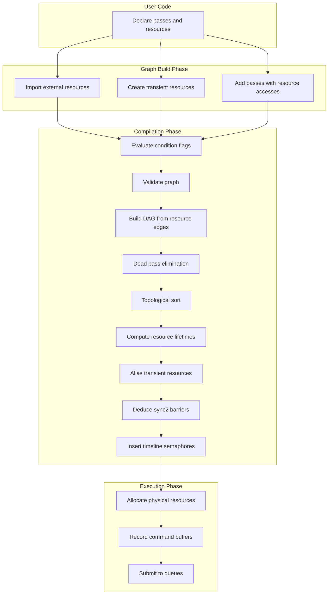
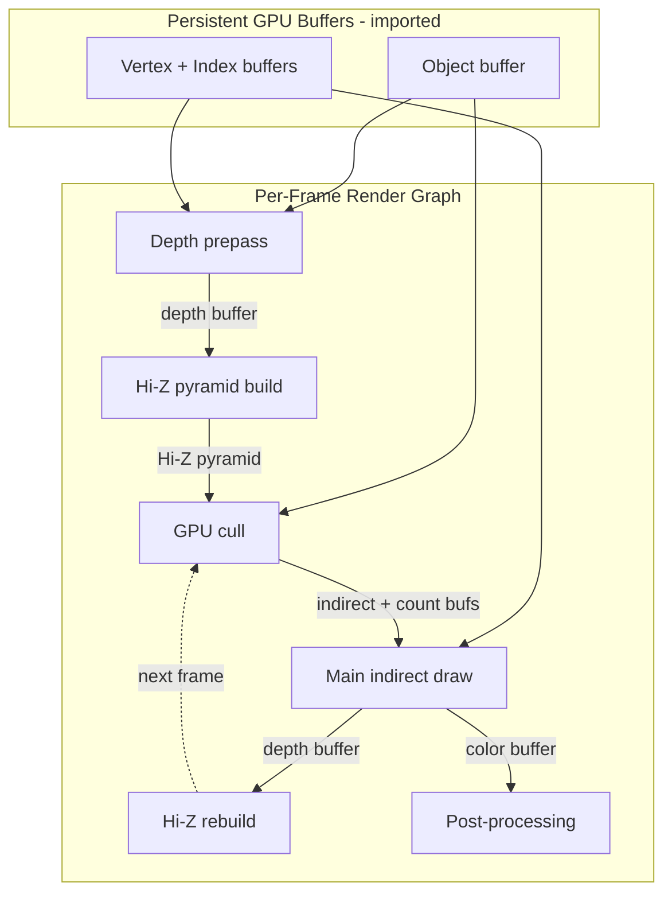

# Vulkan Render Graph for gcraft-gfx

## Target Configuration

- **Vulkan 1.3** (sync2 + dynamic rendering as core)
- **ash 0.38** (already present)
- **vk-mem 0.5** (VMA bindings, compatible with ash 0.38)
- **Additional crates**: `smallvec`, `thiserror`, `log`

Dependencies to add in [gcraft-gfx/Cargo.toml](gcraft-gfx/Cargo.toml):

```toml
[dependencies]
ash = "0.38.0"
vk-mem = "0.5"
smallvec = "1"
thiserror = "2"
log = "0.4"
```

---

## Module Structure

```txt
gcraft-gfx/src/
  lib.rs                   # Public API re-exports
  device.rs                # DeviceContext: ash device + queues + VMA allocator
  graph/
    mod.rs                 # RenderGraph builder and top-level API
    resource.rs            # ImageHandle, BufferHandle, descriptors, sub-resource views
    pass.rs                # PassBuilder, PassNode, RecordedCommand, QueueType
    compile.rs             # Topological sort, dead pass culling, aliasing, barriers
    barrier.rs             # Sync2 barrier deduction and merging
    execute.rs             # Command replay (match loop) and multi-queue submission
  command/
    mod.rs                 # Re-exports
    batch.rs               # Batchable trait, DrawParams, DrawSlot, fill logic
    indirect.rs            # Indirect draw buffer management (multi-draw-indirect)
  resource/
    mod.rs                 # Re-exports
    pool.rs                # Transient resource pool, aliasing, lifetime caching
    image.rs               # Image creation, caching, layout tracking
    buffer.rs              # Buffer creation, caching
  sync.rs                  # Timeline semaphores, fences, per-frame synchronization
```

Note: there is no `PassContext` type. Commands are declared on `PassBuilder` and
stored as `RecordedCommand` enum values. The executor in `execute.rs` replays
them in a `match` loop with zero dynamic dispatch.

---

## Architecture Overview



---

## Safety Model

The render graph is a **safe public API built on unsafe internals**. No method
in the public API is marked `unsafe`. All Vulkan FFI calls, synchronization
commands, and memory operations are internal implementation details. The user
never touches barriers, semaphores, image layout transitions, queue ownership
transfers, or command buffers directly.

### Invariants

The following invariants are maintained by the graph and referenced in every
internal `// SAFETY:` comment:

| ID  | Invariant                                                                                                                                                                       | Enforced by                                                                                                                                                                                                                                             |
| --- | ------------------------------------------------------------------------------------------------------------------------------------------------------------------------------- | ------------------------------------------------------------------------------------------------------------------------------------------------------------------------------------------------------------------------------------------------------- |
| S1  | **No GPU data races.** Every read-after-write, write-after-read, and write-after-write hazard on a resource is synchronized by a pipeline barrier or semaphore.                 | Barrier deduction in `compile.rs` -- walks every edge in the DAG and emits the minimal sync2 barrier. Verified: each resource access pair separated by a pass boundary has a corresponding barrier entry.                                               |
| S2  | **Correct image layouts.** Every image is in the layout required by its usage at the point of access.                                                                           | Layout tracking in `ResourceAccess`. The graph records the layout each pass leaves a resource in and the layout the next pass requires. Barriers include the `old_layout -> new_layout` transition. Initial layout for transient images is `UNDEFINED`. |
| S3  | **Valid queue family ownership.** A resource is only accessed on a queue that currently owns it.                                                                                | Queue ownership transfer barriers (release on source, acquire on destination) are inserted whenever a resource crosses queue families. See barrier.rs cross-queue logic.                                                                                |
| S4  | **No aliased mutable access.** Two passes that write the same physical memory are ordered with a barrier. Transient resources that alias memory have non-overlapping lifetimes. | Lifetime analysis proves non-overlap before aliasing. Aliased resources additionally get an aliasing memory barrier (`vk::MemoryBarrier2` with `NONE -> NONE` to flush caches) at the reuse boundary.                                                   |
| S5  | **Command buffers are in valid recording state.** Commands are replayed from declarative data between `begin_command_buffer` and `end_command_buffer`.                          | Execution flow in `execute.rs` owns the command buffer lifecycle entirely. The user never touches it -- commands are `RecordedCommand` enum values replayed by the executor in a `match` loop. No closure or user code runs during recording.           |
| S6  | **DeviceContext is valid for the lifetime of graph execution.** The `ash::Device`, VMA allocator, and queue handles are valid.                                                  | `CompiledGraph::execute` borrows `&DeviceContext`, which owns the device. Rust's borrow checker prevents the device from being dropped during execution.                                                                                                |
| S7  | **Handles cannot be forged or used across graph generations.** Each `RenderGraph` instance has a monotonic generation counter. Handles encode the generation.                   | Handle resolution panics (debug) or returns `Err` (release) on generation mismatch. Handles are `pub(crate)` constructible only.                                                                                                                        |
| S8  | **Physical resources outlive their GPU usage.** Transient resources are not returned to the pool until the frame fence signals.                                                 | `FrameSync` fences gate pool reclamation. Resources are tagged with the frame index that last used them.                                                                                                                                                |

### The Unsafe Boundary

All `unsafe` code lives in exactly three places:

1. `**graph/execute.rs**` -- Calls ash FFI functions (`cmd_pipeline_barrier2`,
   `cmd_begin_rendering`, `cmd_end_rendering`, `cmd_bind_pipeline`, `cmd_draw`,
   `queue_submit2`, etc.). Each block cites the invariants above.
2. `**resource/pool.rs**` and `**resource/image.rs**` / `**resource/buffer.rs**`
   -- VMA allocation and Vulkan object creation/destruction.
3. `**sync.rs**` -- Semaphore and fence creation/wait/signal.

The public API surface (`RenderGraph`, `PassBuilder`, `RecordedCommand`,
`DrawParams`, all handle types, all descriptor types) contains zero `unsafe`.
There is no `PassContext` -- commands are declared on the builder, not recorded
in a callback.

### What the User is Responsible For

The graph validates synchronization, layouts, lifetimes, resource descriptors,
handle validity (for graph-managed resources), command-queue compatibility, and
usage flag consistency. After these validations, the user is responsible for
exactly five things:

1. **Valid `vk::Pipeline` handles** -- not null, not destroyed, from the correct
   device. These are application-managed objects; the graph cannot validate
   them.
2. **Valid `vk::DescriptorSet` handles** -- same constraints as pipelines.
3. **Valid `vk::Buffer` handles in `bind_vertex_buffers` /
   `bind_index_buffer**`-- these are application-managed buffers passed directly to Vulkan, not graph  resources. The graph validates graph-managed`BufferHandle`s but cannot check  raw `vk::Buffer`
   validity.
4. **Push constant data semantics** -- the graph validates alignment and size
   constraints, but cannot verify the bytes match the shader's expected struct.
5. `**Batchable` trait contract -- `batch_key()` equality must imply identical
   GPU state (same pipeline, descriptors, vertex buffers). A wrong key produces
   incorrect rendering, not UB.

Everything else is validated by the graph. No combination of safe API inputs
that passes `compile()` can cause undefined behavior.

Note: with the declarative model, the previous concern about "not blocking
inside a recording closure" is eliminated entirely -- no user code runs during
command buffer recording.

### Compile-Time Validation (graph compilation)

`RenderGraph::compile()` returns `Result<CompiledGraph, GraphError>`. The
following errors are detected:

```rust
#[derive(Debug, thiserror::Error)]
pub enum GraphError {
    // ---- Structural errors (existing) ----

    #[error("pass `{pass}` reads resource `{resource}` at version {version} which was never written")]
    ReadOfUnwrittenResource { pass: &'static str, resource: String, version: u16 },

    #[error("resource `{resource}` is written but never read and is not an output")]
    OrphanWrite { resource: String },

    #[error("resource `{resource}` has conflicting writes in passes `{pass_a}` and `{pass_b}` with no ordering")]
    UnorderedWrites { resource: String, pass_a: &'static str, pass_b: &'static str },

    #[error("dependency cycle detected involving passes: {cycle:?}")]
    DependencyCycle { cycle: Vec<&'static str> },

    #[error("handle generation mismatch: handle is from generation {handle_gen}, graph is at {graph_gen}")]
    StaleHandle { handle_gen: u32, graph_gen: u32 },

    #[error("no graphics queue available")]
    NoGraphicsQueue,

    #[error("async compute pass `{pass}` requested but no dedicated compute queue available")]
    NoComputeQueue { pass: &'static str },

    #[error("draw slot in pass `{pass}` (index {slot_index}) was not filled before compile")]
    UnfilledDrawSlot { pass: &'static str, slot_index: u16 },

    // ---- Command-resource consistency (V1, V7) ----

    #[error("pass `{pass}` command references buffer `{resource}` not declared in resource accesses")]
    UndeclaredCommandResource { pass: &'static str, resource: String },

    // ---- Command-queue compatibility (V2, V3) ----

    #[error("pass `{pass}` on {queue:?} queue contains `{command}` which is not supported on that queue")]
    CommandQueueMismatch { pass: &'static str, queue: QueueType, command: &'static str },

    // ---- Usage flag consistency (V6) ----

    #[error("resource `{resource}` used as {usage} but descriptor lacks required usage flag")]
    MissingUsageFlags { resource: String, usage: &'static str },

    // ---- Structural duplicates (V17) ----
    // Note: duplicate pass names are a warning (log::warn!), not a hard error,
    // because legitimate patterns like Hi-Z downsample loops reuse `&'static str` names.

    #[error("pass `{pass}` writes resource `{resource}` more than once")]
    DuplicateWrite { pass: &'static str, resource: String },
}
```

### Input Validation

The API validates inputs at two levels: **eager** (immediate panic at the call
site for programming errors) and **deferred** (checked during `compile()` for
graph-wide structural properties, reported via `GraphError`).

#### Eager Validation (panic on programming errors)

These are checked immediately when the method is called. They represent
programming errors (like out-of-bounds indices), not recoverable runtime
conditions. Panicking is consistent with `Vec::index`, `slice::split_at`, etc.

`**create_image(name, desc)`:

- `desc.extent.width == 0 || desc.extent.height == 0 || desc.extent.depth == 0`
- `desc.mip_levels == 0`
- `desc.array_layers == 0`
- `desc.usage` is empty

`**create_buffer(name, desc)`:

- `desc.size == 0`
- `desc.usage` is empty

`**image_mip_view(handle, mip_level)`:

- Handle generation mismatch (S7)
- `mip_level >= desc.mip_levels` -- would create invalid
  `VkImageSubresourceRange`

`**image_layer_view(handle, array_layer)`:

- Handle generation mismatch (S7)
- `array_layer >= desc.array_layers`

`**set_flag(flag, value)` / `flag_value(flag)`:

- Flag generation mismatch (S7)

`**fill_opaque(slot, commands)` / `fill_transparent(slot, commands)`:

- Slot generation mismatch
- Same slot filled twice in one frame (tracked via per-slot fill state)

`**push_constants(layout, stages, offset, data)`:

- `offset % 4 != 0` (Vulkan spec requirement)
- `data.len() % 4 != 0` (Vulkan spec)
- `data.is_empty()`

`**bind_vertex_buffers(first_binding, buffers, offsets)`:

- `buffers.len() != offsets.len()`

`**draw_indirect` / `draw_indexed_indirect` / `*_count` variants:

- `stride % 4 != 0` (Vulkan spec)
- `stride < sizeof(VkDrawIndirectCommand)` /
  `sizeof(VkDrawIndexedIndirectCommand)`

`**when(flag)` / `when_not(flag)`:

- Condition already set on this pass (each pass may have at most one condition)

#### Deferred Validation (in `compile()`, produces `GraphError`)

These check graph-wide structural properties that can only be verified once the
full graph is assembled.

**Command-resource consistency (-> `UndeclaredCommandResource`):**

For each pass, walk every `RecordedCommand` and extract all `BufferHandle`
references. Verify each one appears in the pass's `ResourceAccess` list with the
correct access type:

- `DrawIndirect` / `DrawIndexedIndirect` / `DrawIndirectCount` /
  `DrawIndexedIndirectCount`: buffer handles must be declared as indirect reads
- `DispatchIndirect`: buffer handle must be declared as read
- `FillBuffer`: buffer handle must be declared as write
- `CopyBuffer`: src must be declared as read, dst as write

This is critical for S1: without the declaration, the barrier system won't know
about the dependency, causing GPU data races.

**Command-queue compatibility (-> `CommandQueueMismatch`):**

Classify each `RecordedCommand` variant as `graphics`, `compute`, `transfer`, or
`state_bind`. Then per pass:

- Transfer queue: only `transfer` + `state_bind` commands allowed
- Compute queue: only `compute` + `transfer` + `state_bind` allowed
- Graphics queue: all commands allowed

**Usage flag consistency (-> `MissingUsageFlags`):**

For each resource access, verify the resource descriptor includes the required
usage flag:

- `color_attachment` requires `COLOR_ATTACHMENT`
- `depth_attachment` requires `DEPTH_STENCIL_ATTACHMENT`
- `sample_image` requires `SAMPLED`
- `write_storage_image` requires `STORAGE`
- `read_indirect_buffer` requires `INDIRECT_BUFFER`
- `write_storage_buffer` requires `STORAGE_BUFFER`
- `read_buffer` requires `STORAGE_BUFFER` or `UNIFORM_BUFFER`

**Duplicate pass names (warning only):**

Two passes with the same name produce confusing diagnostics. Detected during
validation and emitted as `log::warn!`, but not a hard error. This is necessary
because legitimate patterns (e.g., Hi-Z downsample loops) create multiple passes
with the same `&'static str` name, and dynamic formatting is not possible with
`&'static str`.

**Duplicate writes within a pass (-> `DuplicateWrite`):**

If a pass declares two writes to the same `(resource_index, version)` pair
(excluding sub-resource views targeting different mip/layer), that is invalid.

#### PassBuilder Drop Guard

If a `PassBuilder` is dropped without calling `build()`, the pass is silently
lost. A `Drop` impl catches this:

```rust
impl<'a> Drop for PassBuilder<'a> {
    fn drop(&mut self) {
        if !self.built {
            debug_assert!(false,
                "PassBuilder for `{}` dropped without calling build()", self.name);
            log::warn!("PassBuilder for `{}` dropped without build()", self.name);
        }
    }
}
```

---

## 1. Device Context (`device.rs`)

Wraps the Vulkan device, queue handles, and VMA allocator. The render graph
receives a `&DeviceContext` for execution.

```rust
pub struct DeviceContext {
    pub instance: ash::Instance,
    pub physical_device: vk::PhysicalDevice,
    pub device: ash::Device,
    pub allocator: vk_mem::Allocator,
    pub graphics_queue: QueueHandle,
    pub compute_queue: Option<QueueHandle>,  // Dedicated/async compute
    pub transfer_queue: Option<QueueHandle>, // Dedicated transfer
}

pub struct QueueHandle {
    pub queue: vk::Queue,
    pub family_index: u32,
}
```

The device context is **not** created by the graph -- it is provided externally.
The graph only borrows it during execution.

---

## 2. Resource System (`graph/resource.rs`)

### Versioned Handles

Each resource is identified by an index. Each **write** to a resource increments
its version, producing a new handle. This creates explicit dataflow edges in the
DAG.

Handles include a `generation` field matching the `RenderGraph` that created
them (invariant S7). This prevents accidentally using a handle from a previous
frame or a different graph instance. The generation is checked eagerly at the
API boundary (e.g. `image_mip_view`, `set_flag`, `fill_opaque`) and during
`compile()`. At execution time, `PhysicalResourceMap::resolve_buffer()` /
`resolve_image()` validate that handles were declared in the pass's access list.

```rust
#[derive(Clone, Copy, Debug, Hash, Eq, PartialEq)]
pub struct ImageHandle {
    pub(crate) index: u16,
    pub(crate) version: u16,
    pub(crate) generation: u32,
}

#[derive(Clone, Copy, Debug, Hash, Eq, PartialEq)]
pub struct BufferHandle {
    pub(crate) index: u16,
    pub(crate) version: u16,
    pub(crate) generation: u32,
}
```

Handles are `Copy` (they are just indices) but **cannot be constructed outside
the crate** (`pub(crate)` fields, no public constructor). The only way to obtain
a handle is through `RenderGraph::create_image`, `RenderGraph::import_image`, or
from a `PassBuilder` write method. This makes handle forgery impossible in safe
code.

### Resource Descriptors

```rust
pub struct ImageDesc {
    pub format: vk::Format,
    pub extent: vk::Extent3D,
    pub mip_levels: u32,
    pub array_layers: u32,
    pub samples: vk::SampleCountFlags,
    pub usage: vk::ImageUsageFlags,
}

pub struct BufferDesc {
    pub size: vk::DeviceSize,
    pub usage: vk::BufferUsageFlags,
}
```

### Sub-Resource Views

Some GPU-driven techniques (notably Hi-Z depth pyramids) require per-mip-level
access to images. The graph supports this via sub-resource views:

```rust
impl RenderGraph {
    /// Create a view of a specific mip level. Returns a new ImageHandle that
    /// references the same physical image but targets a single mip. Barriers
    /// emitted for this handle use the narrowed VkImageSubresourceRange.
    pub fn image_mip_view(&mut self, handle: ImageHandle, mip_level: u32) -> ImageHandle;

    /// Create a view of a specific array layer.
    pub fn image_layer_view(&mut self, handle: ImageHandle, array_layer: u32) -> ImageHandle;
}
```

Internally, each sub-resource view shares the same `resource_index` as the
parent image but carries an explicit `SubresourceRange` in its metadata. The
barrier deduction system uses this range when emitting
`VkImageMemoryBarrier2::subresourceRange`, so only the affected mip level or
layer undergoes a layout transition. This enables efficient multi-pass mip-chain
generation where each mip level can be in a different layout simultaneously.

Layout tracking is per `(resource_index, mip_level, array_layer)`, not just per
resource. This is stored in a `HashMap<(u16, u32, u32), vk::ImageLayout>` inside
the compilation state.

### Resource Categories

- **Transient**: Created and consumed within a single frame. Eligible for memory
  aliasing. Allocated from the transient pool.
- **Imported**: Externally-owned (swapchain images, persistent scene buffers).
  The graph tracks layout/access state but does not manage lifetime.

---

## 3. Pass System (`graph/pass.rs`)

### Queue Types

```rust
pub enum QueueType {
    Graphics,
    AsyncCompute,
    Transfer,
}
```

### Condition Flags

The graph is built once and persists across frames. Features are toggled via
condition flags -- lightweight boolean handles that can be flipped between
frames without rebuilding the graph. The compiler evaluates flags and removes
disabled passes before building the DAG.

```rust
/// Opaque handle to a boolean condition within the graph.
/// Lightweight (8 bytes with alignment), Copy, unforgeable (pub(crate) fields).
#[derive(Clone, Copy, Debug, Hash, Eq, PartialEq)]
pub struct ConditionFlag {
    pub(crate) index: u16,
    pub(crate) generation: u32,
}

impl RenderGraph {
    /// Define a named flag with an initial value.
    pub fn define_flag(&mut self, name: &'static str, initial: bool) -> ConditionFlag;

    /// Set a flag's value between frames. Does not require rebuilding the graph.
    pub fn set_flag(&mut self, flag: ConditionFlag, value: bool);

    /// Read a flag's current value.
    pub fn flag_value(&self, flag: ConditionFlag) -> bool;
}
```

Conditions can be attached at two levels:

1. **Pass-level** (`when` / `when_not`): The entire pass is included or
   excluded. If excluded, all its outputs are treated as unwritten, which may
   transitively disable downstream passes.
2. **Access-level** (`sample_image_when`, `read_buffer_when`): An individual
   resource read is included or excluded. The pass still runs but without that
   input. Useful for optional effects (e.g., tonemap with or without bloom).

Conditions are plain data (`ConditionFlag` + bool polarity stored in the
`PassNode`), not closures. They are evaluated once at the start of `compile()`.

### Pass Builder (fluent API, fully declarative)

Passes are declared entirely as data. The `PassBuilder` has three categories of
methods: **conditions** (when the pass runs), **resource declarations** (what
the pass reads/writes), and **command declarations** (what GPU work to record).
All return `Self` for chaining. There are no closures, no callbacks, and no
dynamic dispatch. The builder accumulates `RecordedCommand` values into a `Vec`
and finalizes with `build()`.

```rust
impl RenderGraph {
    pub fn add_graphics_pass(&mut self, name: &'static str) -> PassBuilder<'_>;
    pub fn add_compute_pass(&mut self, name: &'static str) -> PassBuilder<'_>;
    pub fn add_async_compute_pass(&mut self, name: &'static str) -> PassBuilder<'_>;
    pub fn add_transfer_pass(&mut self, name: &'static str) -> PassBuilder<'_>;
}

impl<'a> PassBuilder<'a> {
    // ---- Pass-level conditions ----

    /// Only execute this pass when the flag is true.
    /// If disabled, all outputs are unwritten; downstream consumers are
    /// transitively disabled unless they have conditional reads.
    pub fn when(self, flag: ConditionFlag) -> Self;

    /// Only execute this pass when the flag is false.
    pub fn when_not(self, flag: ConditionFlag) -> Self;

    // ---- Resource declarations ----

    pub fn sample_image(self, handle: ImageHandle, stage: vk::PipelineStageFlags2) -> Self;
    pub fn read_buffer(self, handle: BufferHandle, stage: vk::PipelineStageFlags2) -> Self;
    pub fn read_indirect_buffer(self, handle: BufferHandle) -> Self;

    /// Conditionally read an image. If the flag is false at compile time,
    /// this access is removed from the pass. The pass still runs.
    pub fn sample_image_when(self, handle: ImageHandle, flag: ConditionFlag,
        stage: vk::PipelineStageFlags2) -> Self;
    /// Conditionally read a buffer.
    pub fn read_buffer_when(self, handle: BufferHandle, flag: ConditionFlag,
        stage: vk::PipelineStageFlags2) -> Self;
    pub fn write_storage_image(self, handle: ImageHandle) -> (Self, ImageHandle);
    pub fn write_storage_buffer(self, handle: BufferHandle) -> (Self, BufferHandle);
    pub fn color_attachment(self, handle: ImageHandle, load_op: vk::AttachmentLoadOp) -> (Self, ImageHandle);
    pub fn depth_attachment(self, handle: ImageHandle, load_op: vk::AttachmentLoadOp) -> (Self, ImageHandle);

    // ---- Command declarations (all push to internal Vec<RecordedCommand>) ----

    pub fn bind_graphics_pipeline(self, pipeline: vk::Pipeline) -> Self;
    pub fn bind_compute_pipeline(self, pipeline: vk::Pipeline) -> Self;
    pub fn bind_descriptor_sets(self, bind_point: vk::PipelineBindPoint,
        layout: vk::PipelineLayout, first_set: u32,
        sets: &[vk::DescriptorSet], dynamic_offsets: &[u32]) -> Self;
    pub fn bind_vertex_buffers(self, first_binding: u32,
        buffers: &[vk::Buffer], offsets: &[vk::DeviceSize]) -> Self;
    pub fn bind_index_buffer(self, buffer: vk::Buffer,
        offset: vk::DeviceSize, index_type: vk::IndexType) -> Self;
    pub fn push_constants(self, layout: vk::PipelineLayout,
        stages: vk::ShaderStageFlags, offset: u32, data: &[u8]) -> Self;
    pub fn set_viewport(self, first: u32, viewports: &[vk::Viewport]) -> Self;
    pub fn set_scissor(self, first: u32, scissors: &[vk::Rect2D]) -> Self;

    // Direct draws
    pub fn draw(self, vertex_count: u32, instance_count: u32,
        first_vertex: u32, first_instance: u32) -> Self;
    pub fn draw_indexed(self, index_count: u32, instance_count: u32,
        first_index: u32, vertex_offset: i32, first_instance: u32) -> Self;

    // Indirect draws (GPU-driven)
    pub fn draw_indirect(self, buffer: BufferHandle,
        offset: vk::DeviceSize, draw_count: u32, stride: u32) -> Self;
    pub fn draw_indexed_indirect(self, buffer: BufferHandle,
        offset: vk::DeviceSize, draw_count: u32, stride: u32) -> Self;
    pub fn draw_indirect_count(self, cmd_buf: BufferHandle, cmd_offset: vk::DeviceSize,
        count_buf: BufferHandle, count_offset: vk::DeviceSize,
        max_draw_count: u32, stride: u32) -> Self;
    pub fn draw_indexed_indirect_count(self, cmd_buf: BufferHandle, cmd_offset: vk::DeviceSize,
        count_buf: BufferHandle, count_offset: vk::DeviceSize,
        max_draw_count: u32, stride: u32) -> Self;

    // Compute dispatches
    pub fn dispatch(self, x: u32, y: u32, z: u32) -> Self;
    pub fn dispatch_indirect(self, buffer: BufferHandle, offset: vk::DeviceSize) -> Self;

    // Transfer operations
    pub fn fill_buffer(self, buffer: BufferHandle,
        offset: vk::DeviceSize, size: vk::DeviceSize, data: u32) -> Self;
    pub fn copy_buffer(self, src: BufferHandle, src_offset: vk::DeviceSize,
        dst: BufferHandle, dst_offset: vk::DeviceSize, size: vk::DeviceSize) -> Self;

    // Dynamic draw slots (filled per frame via Batchable trait)
    /// Declare an opaque draw slot, filled per frame with fill_opaque().
    pub fn opaque_draw_slot(self) -> (Self, DrawSlot);
    /// Declare a transparent draw slot, filled per frame with fill_transparent().
    pub fn transparent_draw_slot(self) -> (Self, DrawSlot);

    /// Finalize the pass and commit it to the graph. Consumes the builder.
    pub fn build(self);
}
```

### Internal PassNode

No closures, no `dyn`. Commands are stored as a `Vec<RecordedCommand>`.
Conditions are stored as plain data (flag index + polarity).

```rust
pub(crate) struct PassNode {
    pub name: &'static str,
    pub queue: QueueType,
    pub condition: PassCondition,              // When this pass runs
    pub accesses: SmallVec<[ResourceAccess; 8]>,
    pub color_attachments: SmallVec<[AttachmentInfo; 4]>,
    pub depth_attachment: Option<AttachmentInfo>,
    pub commands: Vec<RecordedCommand>,
}

/// Pass-level condition. Plain data, no closures.
pub(crate) enum PassCondition {
    Always,
    WhenFlag(ConditionFlag),
    WhenNotFlag(ConditionFlag),
}

pub(crate) struct ResourceAccess {
    pub resource_index: u16,
    pub version_read: Option<u16>,   // None if write-only
    pub version_write: Option<u16>,  // None if read-only
    pub stage: vk::PipelineStageFlags2,
    pub access: vk::AccessFlags2,
    pub layout: vk::ImageLayout,     // Only meaningful for images
    pub condition: Option<ConditionFlag>,  // None = always, Some = only when flag is true
}
```

---

## 4. Graph Compilation (`graph/compile.rs`)

The compilation pipeline transforms the declarative graph into an optimized
execution plan. The graph is persistent across frames -- only condition flag
values change. `compile()` borrows the graph immutably and returns a new
`CompiledGraph` each frame.


### Step -1: Evaluate Condition Flags

Before any other work, evaluate all `ConditionFlag` values and determine the
active pass set:

1. For each pass with a `PassCondition::WhenFlag(f)` or `WhenNotFlag(f)`,
   evaluate the flag. If the condition is false, mark the pass as **disabled**.
2. Strip conditional resource accesses (`condition: Some(flag)`) where the flag
   is false. The access is removed from the pass's access list as if it was
   never declared.
3. **Transitive disabling**: For each enabled pass, check whether all of its
   required (non-conditional) reads refer to resource versions produced by
   enabled passes. If a read's producer is disabled, mark this pass as disabled
   too. Repeat until no more passes are disabled (fixed-point iteration).

After this step, the compiler has a reduced set of active passes and active
accesses. All subsequent steps operate only on this active set. The original
graph is not modified (it is borrowed immutably).

This step is `O(passes * accesses)` in the worst case and runs in microseconds
for typical graphs (tens of passes).

### Step 0: Validate Graph

Validate the active pass set for structural correctness. This is the primary
enforcement point for safety invariants. Validation checks every `GraphError`
variant: stale handles, unwritten reads, orphan writes, unordered write
conflicts, dependency cycles, unfilled draw slots, undeclared command resources,
command-queue compatibility, usage flag consistency, duplicate pass names, and
duplicate writes. If any check fails, `compile()` returns `Err(GraphError)` and
no GPU work is possible.

Note: `OrphanWrite` is only reported for passes that are enabled. Disabled
passes are silently skipped without error.

### Step 1: Build DAG Edges

For each active resource access: if pass P reads resource R at version V, find
the active pass that wrote R at version V -- that creates a directed edge
`writer -> P`.

### Step 2: Dead Pass Elimination

Starting from **output resources** (imported resources that get written, e.g.
swapchain), walk edges backwards. Any pass not reachable from an output is
culled. This further reduces the active set beyond condition-based disabling --
for example, a pass that is enabled by its condition but whose outputs are never
consumed is still culled.

### Step 3: Topological Sort

Kahn's algorithm over the DAG. When multiple passes have zero in-degree, prefer
passes on the **same queue** as the previous pass (minimizes queue switches).
Secondary tie-breaker: prefer `AsyncCompute` passes early to maximize overlap
with later graphics work.

### Step 4: Resource Lifetime Computation

For each transient resource, record
`(first_write_pass_index, last_read_pass_index)`. This defines the interval
during which the physical memory must be valid.

### Step 5: Transient Resource Aliasing

Non-overlapping lifetime intervals can share the same `VkDeviceMemory`. Use an
interval-based greedy allocator:

```rust
// Sorted by size descending for best packing
for resource in transient_resources.sort_by_size_desc() {
    if let Some(alias) = find_compatible_alias(resource, allocated) {
        resource.physical = alias.physical; // Share memory
    } else {
        resource.physical = allocate_new(resource.desc);
    }
}
```

Compatibility requires: same memory type, non-overlapping lifetimes, and
aliasing-compatible usage flags.

### Step 6: Barrier Deduction (`graph/barrier.rs`)

This is the core of the automatic synchronization system. The user never
specifies any synchronization -- every barrier, layout transition, and queue
ownership transfer is deduced here from the resource access declarations.

Using Vulkan 1.3 synchronization2. For each consecutive pair of accesses to the
same resource (ordered by the topological sort), emit the **minimal** barrier:

```rust
pub(crate) fn deduce_barrier(
    prev: &ResourceAccess,
    next: &ResourceAccess,
    is_image: bool,
) -> Option<BarrierInfo> {
    // Skip if no hazard (read-after-read with same layout)
    if prev.is_read_only() && next.is_read_only() && prev.layout == next.layout {
        return None;
    }
    // Emit image or buffer memory barrier
    Some(BarrierInfo {
        src_stage: prev.stage,
        src_access: prev.access,
        dst_stage: next.stage,
        dst_access: next.access,
        old_layout: prev.layout,
        new_layout: next.layout,
    })
}
```

**Why this is correct (invariant S1 proof):** Every resource access is declared
in the pass builder. The DAG edges guarantee that if pass B reads what pass A
wrote, there is an edge A->B. The topological sort places A before B. The
barrier deduction examines every such edge and emits the appropriate
`VkImageMemoryBarrier2` or `VkBufferMemoryBarrier2`. No access pair is
unexamined. Therefore, no data race can occur.

**Barrier merging**: When multiple resources need barriers between the same two
passes, they are batched into a single `vkCmdPipelineBarrier2` call.

**Queue ownership transfers** (invariant S3): When a resource moves between
queue families (e.g. graphics -> async compute), emit a **release barrier** on
the source queue and an **acquire barrier** on the destination queue. Both are
deduced automatically from the pass's `QueueType` and the previous accessor's
`QueueType`.

**Aliasing barriers** (invariant S4): When a transient resource begins using
physical memory previously occupied by another aliased resource, an aliasing
memory barrier (`src_stage: ALL_COMMANDS, dst_stage: ALL_COMMANDS`,
`src_access: NONE, dst_access: NONE`) is inserted to flush/invalidate caches.
This is required by the Vulkan spec for aliased memory.

### Step 7: Timeline Semaphore Insertion

At every queue boundary (where a pass on queue B depends on a pass on queue A),
insert:

- A **signal** operation after the source pass on queue A
- A **wait** operation before the dependent pass on queue B

Timeline semaphores allow multiple signal/wait points on a single semaphore,
avoiding the overhead of creating per-dependency binary semaphores.

```rust
struct SemaphoreOp {
    semaphore: vk::Semaphore,  // Timeline semaphore
    signal_value: u64,
    signal_queue: QueueType,
    signal_after_pass: usize,
    wait_queue: QueueType,
    wait_before_pass: usize,
}
```

---

## 5. Draw Command Batching (`command/batch.rs`)

### The `Batchable` Trait

Draw commands are user-defined types that implement the `Batchable` trait. The
trait exposes a batch key for grouping, the GPU state to bind, and the draw
parameters. The graph uses this trait via **generics** (static dispatch at build
time). No `dyn`, no vtable, no dynamic dispatch at execution time.

```rust
/// Draw parameters for a single draw call.
pub enum DrawParams {
    Draw {
        vertex_count: u32, instance_count: u32,
        first_vertex: u32, first_instance: u32,
    },
    Indexed {
        index_count: u32, instance_count: u32,
        first_index: u32, vertex_offset: i32, first_instance: u32,
    },
}

/// Trait for draw commands that can be sorted and batched.
///
/// The batch key determines grouping: consecutive commands with equal batch
/// keys share GPU state bindings, avoiding redundant vkCmdBind* calls.
///
/// Implementations define what "same state" means for their rendering path.
/// The only contract: if `a.batch_key() == b.batch_key()`, then `a` and `b`
/// must require identical GPU state (same pipeline, descriptors, vertex
/// buffers, etc.). Violating this produces incorrect rendering, not UB.
pub trait Batchable {
    /// Key for batching. Equal keys = identical GPU state.
    ///
    /// For opaque draws, commands are sorted by this key to maximize runs
    /// of identical state. For transparent draws, this is used only to skip
    /// redundant rebinding when consecutive distance-sorted commands happen
    /// to share state.
    ///
    /// How to pack: hash or bit-pack the fields that define GPU state.
    /// Example: `(pipeline_hash as u64) << 32 | material_hash as u64`
    fn batch_key(&self) -> u64;

    /// Emit RecordedCommands to bind this command's GPU state.
    /// Called only when `batch_key()` differs from the previous command.
    /// Push bind commands (pipeline, descriptors, vertex buffers, etc.)
    /// into the output vec.
    fn bind_state(&self, commands: &mut Vec<RecordedCommand>);

    /// The draw call parameters for this command.
    fn draw_params(&self) -> DrawParams;

    /// Camera distance. Used for back-to-front sorting of transparent draws.
    /// Default returns 0.0 (unused for opaque).
    fn distance(&self) -> f32 { 0.0 }
}
```

### Concrete Example Implementation

```rust
struct MeshDraw {
    pipeline: vk::Pipeline,
    pipeline_layout: vk::PipelineLayout,
    material_set: vk::DescriptorSet,
    scene_set: vk::DescriptorSet,
    vertex_buffer: vk::Buffer,
    index_buffer: vk::Buffer,
    index_count: u32,
    first_index: u32,
    vertex_offset: i32,
    camera_distance: f32,
}

impl Batchable for MeshDraw {
    fn batch_key(&self) -> u64 {
        // Pack pipeline (high 32) + material (low 32) for grouping.
        // Vertex/index buffer changes are rare so not included in key.
        let p = self.pipeline.as_raw() as u64;
        let m = self.material_set.as_raw() as u64;
        (p << 32) | (m & 0xFFFF_FFFF)
    }

    fn bind_state(&self, commands: &mut Vec<RecordedCommand>) {
        commands.push(RecordedCommand::BindGraphicsPipeline(self.pipeline));
        commands.push(RecordedCommand::BindDescriptorSets {
            bind_point: vk::PipelineBindPoint::GRAPHICS,
            layout: self.pipeline_layout,
            first_set: 0,
            sets: smallvec![self.scene_set, self.material_set],
            dynamic_offsets: SmallVec::new(),
        });
        commands.push(RecordedCommand::BindVertexBuffers {
            first_binding: 0,
            buffers: smallvec![self.vertex_buffer],
            offsets: smallvec![0],
        });
        commands.push(RecordedCommand::BindIndexBuffer {
            buffer: self.index_buffer,
            offset: 0,
            index_type: vk::IndexType::UINT32,
        });
    }

    fn draw_params(&self) -> DrawParams {
        DrawParams::Indexed {
            index_count: self.index_count,
            instance_count: 1,
            first_index: self.first_index,
            vertex_offset: self.vertex_offset,
            first_instance: 0,
        }
    }

    fn distance(&self) -> f32 { self.camera_distance }
}
```

### Sorting Strategies

Opaque and transparent draws use fundamentally different sort orders:

- **Opaque** (`fill_opaque`): Sorted by `batch_key()`. This groups draws by GPU
  state (pipeline, material) to minimize `vkCmdBind*` calls. Depth order does
  not matter -- the depth buffer handles visibility.
- **Transparent** (`fill_transparent`): Sorted by `distance()` descending
  (back-to-front). Correct alpha blending requires this order. State changes are
  accepted as a cost of correct ordering. However, `batch_key()` is still
  tracked to skip redundant rebinding when consecutive distance-sorted commands
  happen to share the same state.

### Draw Slots (dynamic per-frame commands in a persistent graph)

The graph is built once, but draw command lists change every frame (objects
move, visibility changes). **Draw slots** bridge this gap: a slot is a
placeholder in a pass's command list that is filled with dynamic commands each
frame before compilation.

```rust
/// Handle to a draw slot within a pass. Filled per frame via fill_opaque/
/// fill_transparent. Lightweight, Copy, unforgeable.
#[derive(Clone, Copy, Debug, Hash, Eq, PartialEq)]
pub struct DrawSlot {
    pub(crate) pass_index: u16,
    pub(crate) slot_index: u16,
    pub(crate) generation: u32,
}
```

Declared on `PassBuilder`:

```rust
impl<'a> PassBuilder<'a> {
    // ... existing methods ...

    /// Declare an opaque draw slot. Returns a handle to fill per frame.
    pub fn opaque_draw_slot(self) -> (Self, DrawSlot);

    /// Declare a transparent draw slot. Returns a handle to fill per frame.
    pub fn transparent_draw_slot(self) -> (Self, DrawSlot);
}
```

Filled per frame on `RenderGraph`:

```rust
impl RenderGraph {
    /// Fill an opaque draw slot. Sorts commands by batch_key(), expands
    /// into RecordedCommands with state-change minimization.
    /// T: Batchable is resolved via static dispatch (generics, no dyn).
    pub fn fill_opaque<T: Batchable>(&mut self, slot: DrawSlot, commands: &mut [T]);

    /// Fill a transparent draw slot. Sorts commands by distance() descending
    /// (back-to-front), expands into RecordedCommands.
    pub fn fill_transparent<T: Batchable>(&mut self, slot: DrawSlot, commands: &mut [T]);
}
```

### Fill Expansion (how sorting + batching works)

`fill_opaque` and `fill_transparent` run at the call site (before `compile()`).
They sort the user's `T: Batchable` commands, expand them into concrete
`RecordedCommand` values, and store the result. This is the only place the
`Batchable` trait is used -- after expansion, everything is concrete enums.

```rust
// Pseudocode for fill_opaque
pub fn fill_opaque<T: Batchable>(&mut self, slot: DrawSlot, commands: &mut [T]) {
    // 1. Sort by batch key for maximum state batching
    commands.sort_unstable_by_key(|c| c.batch_key());

    // 2. Expand into RecordedCommands with state-change tracking
    let mut recorded = Vec::with_capacity(commands.len() * 2);
    let mut prev_key = u64::MAX;
    for cmd in commands.iter() {
        let key = cmd.batch_key();
        if key != prev_key {
            cmd.bind_state(&mut recorded); // Only rebind when state changes
            prev_key = key;
        }
        recorded.push(match cmd.draw_params() {
            DrawParams::Draw { vertex_count, instance_count, first_vertex, first_instance } =>
                RecordedCommand::Draw { vertex_count, instance_count, first_vertex, first_instance },
            DrawParams::Indexed { index_count, instance_count, first_index, vertex_offset, first_instance } =>
                RecordedCommand::DrawIndexed { index_count, instance_count, first_index, vertex_offset, first_instance },
        });
    }

    // 3. Store expanded commands in the slot
    self.draw_slots[slot.index] = recorded;
}

// fill_transparent is identical except:
//   commands.sort_unstable_by(|a, b| b.distance().total_cmp(&a.distance()));
// (descending distance = back-to-front)
```

### Slot Splicing at Compile Time

During `compile()`, each `RecordedCommand::DrawSlot(slot)` placeholder in a
pass's command list is replaced with the expanded commands stored in the slot.
If a slot was not filled, compilation returns:

```rust
GraphError::UnfilledDrawSlot { pass: &'static str, slot_index: u16 }
```

### Multi-Draw-Indirect from batch expansion (`command/indirect.rs`)

After batch expansion, consecutive `RecordedCommand::DrawIndexed` commands that
share the same state (preceded by identical bind commands) can be collapsed into
a single `vkCmdDrawIndexedIndirect` call. The module uploads
`VkDrawIndexedIndirectCommand` structs into a staging buffer and issues one
indirect draw per compatible run. This optimization is applied automatically
during command replay in `execute.rs`.

### GPU-Driven Indirect

For fully GPU-driven rendering, the CPU does not generate draw commands at all.
Instead, a compute pass reads scene data, performs culling, and writes
`VkDrawIndexedIndirectCommand` structs and a draw count into GPU buffers. The
graphics pass then consumes these via `draw_indexed_indirect_count`.

The graph's barrier system handles the critical
`COMPUTE_SHADER/SHADER_STORAGE_WRITE -> DRAW_INDIRECT/INDIRECT_COMMAND_READ`
transition automatically when a compute pass writes a buffer that a graphics
pass reads via `read_indirect_buffer`. No manual synchronization is needed.

---

## 6. GPU-Driven Rendering

The render graph is designed to let the GPU drive rendering as much as possible.
The CPU declares the graph structure (which passes exist, what resources they
use), but the GPU decides **what** gets drawn and **how many** draws to issue.

### Architecture



### Hierarchical Z-Buffer (Hi-Z) Depth Pyramid

The Hi-Z pyramid is a mip chain of the depth buffer where each texel at mip
level N holds the **maximum** (farthest) depth of the corresponding 2x2 region
at mip level N-1. This allows conservative occlusion testing: if an object's
bounding sphere/box projects to a screen region entirely behind the Hi-Z value
at the appropriate mip level, the object is guaranteed to be occluded.

The pyramid is built as a chain of compute passes, one per mip level. Each pass
reads the previous mip level and writes the next:

```rust
// Build the Hi-Z pyramid using sub-resource views
let hiz = graph.create_image("hiz_pyramid", ImageDesc {
    format: vk::Format::R32_SFLOAT,
    extent: vk::Extent3D { width: w, height: h, depth: 1 },
    mip_levels: mip_count,
    usage: vk::ImageUsageFlags::STORAGE | vk::ImageUsageFlags::SAMPLED,
    ..Default::default()
});

// Mip 0: copy from depth buffer
let hiz_mip0 = graph.image_mip_view(hiz, 0);
let (builder, hiz_mip0_out) = graph.add_compute_pass("hiz_mip0")
    .sample_image(depth_out, vk::PipelineStageFlags2::COMPUTE_SHADER)
    .write_storage_image(hiz_mip0);
builder
    .bind_compute_pipeline(hiz_copy_pipeline)
    .bind_descriptor_sets(/* depth sampler + mip 0 storage */)
    .dispatch(ceil_div(w, 16), ceil_div(h, 16), 1)
    .build();

// Mip 1..N: downsample previous mip
let mut prev_mip = hiz_mip0_out;
for level in 1..mip_count {
    let (mw, mh) = (w >> level, h >> level);
    let mip_n = graph.image_mip_view(hiz, level);
    let (builder, mip_n_out) = graph.add_compute_pass("hiz_downsample")
        .sample_image(prev_mip, vk::PipelineStageFlags2::COMPUTE_SHADER)
        .write_storage_image(mip_n);
    builder
        .bind_compute_pipeline(hiz_downsample_pipeline)
        .bind_descriptor_sets(/* prev mip sampler + current mip storage */)
        .dispatch(ceil_div(mw, 16), ceil_div(mh, 16), 1)
        .build();
    prev_mip = mip_n_out;
}
// prev_mip is now the final pyramid, readable as a sampled image for culling
```

The graph automatically inserts per-mip-level barriers
(`STORAGE_WRITE -> SHADER_READ`, `GENERAL -> SHADER_READ_ONLY_OPTIMAL`) between
each downsample pass using the sub-resource range from `image_mip_view`.

### GPU Frustum + Occlusion Culling

A single compute pass reads the scene's object buffer (transforms, bounding
volumes) and the Hi-Z pyramid, then writes:

1. **Indirect command buffer** -- One `VkDrawIndexedIndirectCommand` per visible
   object. Objects that fail frustum or Hi-Z tests are simply not written.
2. **Draw count buffer** -- A single `u32` incremented atomically for each
   visible object. This becomes the count argument to
   `draw_indexed_indirect_count`.

```rust
let indirect_cmds = graph.create_buffer("indirect_cmds", BufferDesc {
    size: max_objects * std::mem::size_of::<VkDrawIndexedIndirectCommand>(),
    usage: vk::BufferUsageFlags::STORAGE_BUFFER | vk::BufferUsageFlags::INDIRECT_BUFFER,
});
let draw_count = graph.create_buffer("draw_count", BufferDesc {
    size: std::mem::size_of::<u32>(),
    usage: vk::BufferUsageFlags::STORAGE_BUFFER | vk::BufferUsageFlags::INDIRECT_BUFFER,
});

let (builder, indirect_cmds_out) = graph.add_compute_pass("gpu_cull")
    .read_buffer(object_buffer, vk::PipelineStageFlags2::COMPUTE_SHADER)
    .sample_image(hiz_pyramid, vk::PipelineStageFlags2::COMPUTE_SHADER)
    .write_storage_buffer(indirect_cmds);
let (builder, draw_count_out) = builder.write_storage_buffer(draw_count);
builder
    .bind_compute_pipeline(cull_pipeline)
    .bind_descriptor_sets(/* object buffer, Hi-Z pyramid, output buffers */)
    .dispatch(ceil_div(object_count, 64), 1, 1)
    // Each thread: frustum test -> Hi-Z test -> if visible, atomicAdd
    // count and write indirect command at that index
    .build();
```

### Indirect Draw Pass

The main draw pass consumes the GPU-generated command and count buffers. The CPU
only binds the pipeline and issues a single `draw_indexed_indirect_count` call.
The GPU decides what to draw and how many draws to issue.

```rust
let (builder, color_out) = graph.add_graphics_pass("main_draw")
    .read_indirect_buffer(indirect_cmds_out)
    .read_indirect_buffer(draw_count_out)
    .read_buffer(object_buffer, vk::PipelineStageFlags2::VERTEX_SHADER)
    .color_attachment(hdr, vk::AttachmentLoadOp::CLEAR);
let (builder, depth_out2) = builder.depth_attachment(depth, vk::AttachmentLoadOp::LOAD);
builder
    .bind_graphics_pipeline(main_pipeline)
    .bind_descriptor_sets(/* scene descriptors */)
    .draw_indexed_indirect_count(
        indirect_cmds_out, 0,   // command buffer + offset
        draw_count_out, 0,      // count buffer + offset
        max_objects as u32,     // upper bound (GPU count may be less)
        INDIRECT_CMD_SIZE as u32,
    )
    .build();
```

The barrier system automatically deduces:

- `COMPUTE_SHADER/STORAGE_WRITE -> DRAW_INDIRECT/INDIRECT_COMMAND_READ` on the
  indirect command buffer
- `COMPUTE_SHADER/STORAGE_WRITE -> DRAW_INDIRECT/INDIRECT_COMMAND_READ` on the
  draw count buffer
- Queue ownership transfers if the cull pass ran on async compute

### Two-Phase Occlusion Culling

For the first frame (or after a camera cut), there is no Hi-Z pyramid from a
previous frame. A common strategy is two-phase culling:

1. **Phase 1 (conservative)**: Draw all objects that were visible last frame
   using the previous frame's indirect buffer. Build the Hi-Z pyramid from this
   depth.
2. **Phase 2 (precise)**: Run GPU culling against the new Hi-Z pyramid for
   objects that were NOT drawn in phase 1. Append any newly-visible objects to
   the indirect buffer and issue a second `draw_indexed_indirect_count`.

Both phases are expressible as separate graph passes with clear data
dependencies. The graph handles all barriers between them.

---

## 7. Recorded Commands (`graph/pass.rs`)

### RecordedCommand enum

All GPU work is expressed as variants of this enum. No closures, no trait
objects, no dynamic dispatch. The `PassBuilder` command methods push values into
a `Vec<RecordedCommand>`. The executor replays them via a `match` loop.

```rust
/// Every GPU command the user can declare. Stored as plain data.
/// No closures, no dyn, no function pointers.
pub enum RecordedCommand {
    // ---- State binding ----
    BindGraphicsPipeline(vk::Pipeline),
    BindComputePipeline(vk::Pipeline),
    BindDescriptorSets {
        bind_point: vk::PipelineBindPoint,
        layout: vk::PipelineLayout,
        first_set: u32,
        sets: SmallVec<[vk::DescriptorSet; 4]>,
        dynamic_offsets: SmallVec<[u32; 4]>,
    },
    BindVertexBuffers {
        first_binding: u32,
        buffers: SmallVec<[vk::Buffer; 2]>,
        offsets: SmallVec<[vk::DeviceSize; 2]>,
    },
    BindIndexBuffer {
        buffer: vk::Buffer,
        offset: vk::DeviceSize,
        index_type: vk::IndexType,
    },
    PushConstants {
        layout: vk::PipelineLayout,
        stages: vk::ShaderStageFlags,
        offset: u32,
        data: SmallVec<[u8; 128]>,
    },
    SetViewport {
        first: u32,
        viewports: SmallVec<[vk::Viewport; 1]>,
    },
    SetScissor {
        first: u32,
        scissors: SmallVec<[vk::Rect2D; 1]>,
    },

    // ---- Direct draws ----
    Draw {
        vertex_count: u32,
        instance_count: u32,
        first_vertex: u32,
        first_instance: u32,
    },
    DrawIndexed {
        index_count: u32,
        instance_count: u32,
        first_index: u32,
        vertex_offset: i32,
        first_instance: u32,
    },

    // ---- Indirect draws (GPU-driven) ----
    DrawIndirect {
        buffer: BufferHandle,
        offset: vk::DeviceSize,
        draw_count: u32,
        stride: u32,
    },
    DrawIndexedIndirect {
        buffer: BufferHandle,
        offset: vk::DeviceSize,
        draw_count: u32,
        stride: u32,
    },
    DrawIndirectCount {
        command_buffer: BufferHandle,
        command_offset: vk::DeviceSize,
        count_buffer: BufferHandle,
        count_offset: vk::DeviceSize,
        max_draw_count: u32,
        stride: u32,
    },
    DrawIndexedIndirectCount {
        command_buffer: BufferHandle,
        command_offset: vk::DeviceSize,
        count_buffer: BufferHandle,
        count_offset: vk::DeviceSize,
        max_draw_count: u32,
        stride: u32,
    },

    // ---- Compute ----
    Dispatch { x: u32, y: u32, z: u32 },
    DispatchIndirect {
        buffer: BufferHandle,
        offset: vk::DeviceSize,
    },

    // ---- Transfer ----
    FillBuffer {
        buffer: BufferHandle,
        offset: vk::DeviceSize,
        size: vk::DeviceSize,
        data: u32,
    },
    CopyBuffer {
        src: BufferHandle,
        src_offset: vk::DeviceSize,
        dst: BufferHandle,
        dst_offset: vk::DeviceSize,
        size: vk::DeviceSize,
    },

    // ---- Dynamic draw slot (filled per frame via Batchable trait) ----
    /// Placeholder replaced during compile() with the expanded commands
    /// from fill_opaque/fill_transparent. Not present at execution time.
    DrawSlot(DrawSlot),
}
```

### Why an enum, not a trait

- **No dynamic dispatch**: `match` on enum variants compiles to a jump table or
  linear chain of comparisons. No vtable pointer, no indirect call.
- **No allocation per command**: `SmallVec` keeps small payloads inline. No
  variant requires a heap allocation.
- **Inspectable**: The entire command list can be printed, serialized, or
  analyzed for debugging. Impossible with closures.
- **Reorderable**: The executor can reorder commands within a pass because
  commands are data, not opaque function calls.
- **No lifetime complexity**: No `'a` parameters, no `Send + 'static` bounds, no
  `Box<dyn>`. Plain owned data.

### PassBuilder command methods (implementation sketch)

Each command method on `PassBuilder` is a trivial push:

```rust
impl<'a> PassBuilder<'a> {
    pub fn bind_graphics_pipeline(mut self, pipeline: vk::Pipeline) -> Self {
        self.commands.push(RecordedCommand::BindGraphicsPipeline(pipeline));
        self
    }

    pub fn dispatch(mut self, x: u32, y: u32, z: u32) -> Self {
        self.commands.push(RecordedCommand::Dispatch { x, y, z });
        self
    }

    pub fn draw_indexed_indirect_count(
        mut self,
        cmd_buf: BufferHandle, cmd_offset: vk::DeviceSize,
        count_buf: BufferHandle, count_offset: vk::DeviceSize,
        max_draw_count: u32, stride: u32,
    ) -> Self {
        self.commands.push(RecordedCommand::DrawIndexedIndirectCount {
            command_buffer: cmd_buf, command_offset: cmd_offset,
            count_buffer: count_buf, count_offset: count_offset,
            max_draw_count, stride,
        });
        self
    }

    // ... same pattern for every command ...

    pub fn build(self) {
        // Finalize: push PassNode { name, queue, accesses, commands } into graph
    }
}
```

---

## 8. Graph Execution (`graph/execute.rs`)

### Execution Flow

The executor replays `RecordedCommand` values via a `match` loop. No closures
are invoked. No user code runs during command buffer recording.

```rust
impl CompiledGraph {
    pub fn execute(&self, device: &DeviceContext, pool: &mut ResourcePool) -> Result<()> {
        let physical = pool.allocate(&self.resource_descs, &self.aliases, &device.allocator)?;

        for batch in &self.batches {
            let cmd = allocate_command_buffer(device, batch.queue)?;

            for &pass_idx in &batch.passes {
                let pass = &self.passes[pass_idx];

                // Insert pre-pass barriers (fully automatic)
                record_barriers(device, cmd, &self.barriers[pass_idx]);

                // Begin dynamic rendering (graphics passes only)
                if let Some(ref rendering) = pass.rendering_info {
                    let info = build_rendering_info(rendering, &physical);
                    // SAFETY: S5 (cmd recording), S6 (device valid)
                    unsafe { device.device.cmd_begin_rendering(cmd, &info) };
                }

                // Replay command list -- no closures, just a match loop
                replay_commands(&device.device, cmd, &pass.commands, &physical);

                if pass.rendering_info.is_some() {
                    // SAFETY: S5, S6
                    unsafe { device.device.cmd_end_rendering(cmd) };
                }
            }

            submit_batch(device, batch, cmd, &self.semaphore_ops)?;
        }

        Ok(())
    }
}
```

### Command Replay (`replay_commands`)

```rust
fn replay_commands(
    device: &ash::Device,
    cmd: vk::CommandBuffer,
    commands: &[RecordedCommand],
    physical: &PhysicalResourceMap,
) {
    for command in commands {
        match command {
            RecordedCommand::BindGraphicsPipeline(pipeline) => {
                // SAFETY: S5 (cmd recording), S6 (device valid)
                unsafe { device.cmd_bind_pipeline(cmd, vk::PipelineBindPoint::GRAPHICS, *pipeline) };
            }
            RecordedCommand::BindComputePipeline(pipeline) => {
                unsafe { device.cmd_bind_pipeline(cmd, vk::PipelineBindPoint::COMPUTE, *pipeline) };
            }
            RecordedCommand::Draw { vertex_count, instance_count, first_vertex, first_instance } => {
                unsafe { device.cmd_draw(cmd, *vertex_count, *instance_count, *first_vertex, *first_instance) };
            }
            RecordedCommand::DrawIndexedIndirectCount {
                command_buffer, command_offset, count_buffer, count_offset,
                max_draw_count, stride,
            } => {
                let cmd_vk = physical.resolve_buffer(*command_buffer);
                let cnt_vk = physical.resolve_buffer(*count_buffer);
                // SAFETY: S1 (barriers ensure buffers are ready), S5, S6
                unsafe {
                    device.cmd_draw_indexed_indirect_count(
                        cmd, cmd_vk, *command_offset,
                        cnt_vk, *count_offset, *max_draw_count, *stride,
                    );
                };
            }
            RecordedCommand::Dispatch { x, y, z } => {
                unsafe { device.cmd_dispatch(cmd, *x, *y, *z) };
            }
            RecordedCommand::FillBuffer { buffer, offset, size, data } => {
                let vk_buf = physical.resolve_buffer(*buffer);
                unsafe { device.cmd_fill_buffer(cmd, vk_buf, *offset, *size, *data) };
            }
            RecordedCommand::DrawSlot(_) => {
                // DrawSlot placeholders are resolved during compile().
                // They should never appear at execution time.
                unreachable!("DrawSlot should have been spliced during compile()");
            }
            // ... all other variants follow the same pattern ...
        }
    }
}
```

Every `unsafe` block cites the invariant IDs (S1, S5, S6) that justify it.
`BufferHandle` values in indirect commands are resolved to physical `vk::Buffer`
via `PhysicalResourceMap::resolve_buffer`, which validates the handle was
declared in the pass's access list.

### Safety: No User Code During Recording

With the closure-based model, user code ran during command buffer recording,
which meant the user _could_ theoretically cause issues (panic mid-recording,
block indefinitely, etc.). With the declarative model, **no user code runs
during execution at all**. The executor is a pure, deterministic replay of
validated data. This strengthens invariant S5 significantly.

---

## 9. Resource Pool (`resource/pool.rs`)

Caches physical Vulkan resources across frames to avoid per-frame allocation
overhead.

- **Transient images/buffers**: Keyed by `(ImageDesc/BufferDesc)`. Reused when a
  matching resource is available; otherwise allocated via VMA. Freed after N
  frames of non-use.
- **Aliased memory**: Multiple transient resources with non-overlapping
  lifetimes share a single VMA allocation. The pool tracks which backing
  allocations can be reused.
- Uses VMA's `VMA_ALLOCATION_CREATE_CAN_ALIAS_BIT` for aliased allocations.

---

## 10. Frame Synchronization (`sync.rs`)

Manages N frames in flight (typically 2-3):

```rust
pub struct FrameSync {
    pub frames_in_flight: usize,
    pub frame_index: usize,
    pub fences: Vec<vk::Fence>,                    // CPU-GPU sync per frame
    pub timeline_semaphore: vk::Semaphore,         // GPU-GPU sync across queues
    pub timeline_value: u64,                        // Monotonically increasing
    pub image_available: Vec<vk::Semaphore>,       // Swapchain acquire
    pub render_finished: Vec<vk::Semaphore>,       // Swapchain present
}
```

---

## 11. User-Facing API Example: GPU-Driven Pipeline with Condition Flags

The graph is built **once** during initialization. Each frame, only condition
flags are updated and the graph is recompiled (cheap) and executed. The
structure never changes -- features are toggled via flags.

### Graph Construction (once, at init)

```rust
fn build_render_graph(
    graph: &mut RenderGraph,
    scene: &SceneGPU,
    swapchain: ImageHandle,
    prev_indirect: BufferHandle,
    prev_count: BufferHandle,
) -> RenderGraphHandles {
    let w = 1920u32;
    let h = 1080u32;
    let mip_count = (w.max(h) as f32).log2().floor() as u32 + 1;

    // ---- Condition flags (toggled per frame, no rebuild) ----
    let bloom_enabled = graph.define_flag("bloom", true);
    let hiz_enabled = graph.define_flag("hiz_occlusion", true);

    // ---- Transient resources ----
    let depth = graph.create_image("depth", ImageDesc {
        format: vk::Format::D32_SFLOAT,
        extent: vk::Extent3D { width: w, height: h, depth: 1 },
        usage: vk::ImageUsageFlags::DEPTH_STENCIL_ATTACHMENT
             | vk::ImageUsageFlags::SAMPLED,
        ..Default::default()
    });
    let hdr = graph.create_image("hdr", ImageDesc {
        format: vk::Format::R16G16B16A16_SFLOAT,
        extent: vk::Extent3D { width: w, height: h, depth: 1 },
        usage: vk::ImageUsageFlags::COLOR_ATTACHMENT | vk::ImageUsageFlags::SAMPLED,
        ..Default::default()
    });
    let hiz = graph.create_image("hiz_pyramid", ImageDesc {
        format: vk::Format::R32_SFLOAT,
        extent: vk::Extent3D { width: w, height: h, depth: 1 },
        mip_levels: mip_count,
        usage: vk::ImageUsageFlags::STORAGE | vk::ImageUsageFlags::SAMPLED,
        ..Default::default()
    });
    let indirect_cmds = graph.create_buffer("indirect_cmds", BufferDesc {
        size: (MAX_OBJECTS * INDIRECT_CMD_SIZE) as vk::DeviceSize,
        usage: vk::BufferUsageFlags::STORAGE_BUFFER
             | vk::BufferUsageFlags::INDIRECT_BUFFER,
    });
    let draw_count = graph.create_buffer("draw_count", BufferDesc {
        size: 4,
        usage: vk::BufferUsageFlags::STORAGE_BUFFER
             | vk::BufferUsageFlags::INDIRECT_BUFFER
             | vk::BufferUsageFlags::TRANSFER_DST,
    });

    // ---- 1. Depth prepass ----
    let (builder, depth_out) = graph.add_graphics_pass("depth_prepass")
        .read_indirect_buffer(prev_indirect)
        .read_indirect_buffer(prev_count)
        .depth_attachment(depth, vk::AttachmentLoadOp::CLEAR);
    builder
        .bind_graphics_pipeline(scene.depth_only_pipeline)
        .bind_descriptor_sets(/* scene data */)
        .draw_indexed_indirect_count(
            prev_indirect, 0, prev_count, 0,
            MAX_OBJECTS as u32, INDIRECT_CMD_SIZE as u32,
        )
        .build();

    // ---- 2. Hi-Z pyramid (conditional on hiz_enabled) ----
    // All Hi-Z passes are gated by the same flag.
    // If disabled, the entire mip chain + GPU cull is transitively disabled.
    let hiz_mip0 = graph.image_mip_view(hiz, 0);
    let (builder, hiz_mip0_out) = graph.add_compute_pass("hiz_mip0")
        .when(hiz_enabled)    // <-- condition flag
        .sample_image(depth_out, vk::PipelineStageFlags2::COMPUTE_SHADER)
        .write_storage_image(hiz_mip0);
    builder
        .bind_compute_pipeline(scene.hiz_copy_pipeline)
        .bind_descriptor_sets(/* depth sampler, mip 0 storage */)
        .dispatch(ceil_div(w, 16), ceil_div(h, 16), 1)
        .build();

    let mut prev_mip = hiz_mip0_out;
    for level in 1..mip_count {
        let (mw, mh) = (w >> level, h >> level);
        let mip_view = graph.image_mip_view(hiz, level);
        let (builder, mip_out) = graph.add_compute_pass("hiz_downsample")
            .when(hiz_enabled)    // <-- same flag
            .sample_image(prev_mip, vk::PipelineStageFlags2::COMPUTE_SHADER)
            .write_storage_image(mip_view);
        builder
            .bind_compute_pipeline(scene.hiz_downsample_pipeline)
            .bind_descriptor_sets(/* prev mip, current mip */)
            .dispatch(ceil_div(mw, 16), ceil_div(mh, 16), 1)
            .build();
        prev_mip = mip_out;
    }
    let hiz_final = prev_mip;

    // ---- 3. GPU cull (transitively disabled when hiz_enabled is false,
    //         because hiz_final is unwritten) ----
    let (builder, draw_count_cleared) = graph.add_transfer_pass("clear_count")
        .when(hiz_enabled)
        .write_storage_buffer(draw_count);
    builder
        .fill_buffer(draw_count, 0, 4, 0)
        .build();

    let (builder, indirect_cmds_out) = graph.add_async_compute_pass("gpu_cull")
        .when(hiz_enabled)
        .read_buffer(scene.object_buffer, vk::PipelineStageFlags2::COMPUTE_SHADER)
        .sample_image(hiz_final, vk::PipelineStageFlags2::COMPUTE_SHADER)
        .write_storage_buffer(indirect_cmds);
    let (builder, draw_count_out) = builder.write_storage_buffer(draw_count_cleared);
    builder
        .bind_compute_pipeline(scene.cull_pipeline)
        .bind_descriptor_sets(/* object buffer, Hi-Z pyramid, output buffers */)
        .dispatch(ceil_div(scene.object_count, 64), 1, 1)
        .build();

    // ---- 4. Main opaque draw (GPU-driven indirect) ----
    // Uses indirect from GPU cull when available, falls back to prev_indirect.
    let (builder, hdr_out) = graph.add_graphics_pass("main_opaque")
        .read_indirect_buffer(prev_indirect)
        .read_indirect_buffer(prev_count)
        .color_attachment(hdr, vk::AttachmentLoadOp::CLEAR);
    let (builder, depth_written) = builder.depth_attachment(depth_out, vk::AttachmentLoadOp::LOAD);
    builder
        .bind_graphics_pipeline(scene.main_pipeline)
        .bind_descriptor_sets(/* scene data */)
        .draw_indexed_indirect_count(
            prev_indirect, 0, prev_count, 0,
            MAX_OBJECTS as u32, INDIRECT_CMD_SIZE as u32,
        )
        .build();

    // ---- 4b. Transparent draw (CPU-driven, distance-sorted) ----
    // Uses a draw slot: the graph structure is declared once, but the actual
    // draw commands are filled per frame via fill_transparent<T: Batchable>().
    let (builder, hdr_out) = graph.add_graphics_pass("main_transparent")
        .sample_image(hdr_out, vk::PipelineStageFlags2::FRAGMENT_SHADER)
        .color_attachment(hdr, vk::AttachmentLoadOp::LOAD);
    let (builder, transparent_slot) = builder.transparent_draw_slot();
    let (builder, _depth_out) = builder.depth_attachment(depth_written, vk::AttachmentLoadOp::LOAD);
    builder.build();

    // ---- 5. Bloom (conditional on bloom_enabled) ----
    let bloom = graph.create_image("bloom", ImageDesc {
        format: vk::Format::R16G16B16A16_SFLOAT,
        extent: vk::Extent3D { width: w / 2, height: h / 2, depth: 1 },
        usage: vk::ImageUsageFlags::STORAGE | vk::ImageUsageFlags::SAMPLED,
        ..Default::default()
    });
    let (builder, bloom_out) = graph.add_async_compute_pass("bloom")
        .when(bloom_enabled)   // <-- condition flag
        .sample_image(hdr_out, vk::PipelineStageFlags2::COMPUTE_SHADER)
        .write_storage_image(bloom);
    builder
        .bind_compute_pipeline(scene.bloom_pipeline)
        .bind_descriptor_sets(/* HDR input, bloom output */)
        .dispatch(ceil_div(w / 2, 16), ceil_div(h / 2, 16), 1)
        .build();

    // ---- 6. Tonemap ----
    // Always reads HDR. Conditionally reads bloom (via sample_image_when).
    // When bloom is disabled, this pass still runs -- just without bloom input.
    let (builder, _) = graph.add_graphics_pass("tonemap")
        .sample_image(hdr_out, vk::PipelineStageFlags2::FRAGMENT_SHADER)
        .sample_image_when(bloom_out, bloom_enabled,        // <-- conditional read
            vk::PipelineStageFlags2::FRAGMENT_SHADER)
        .color_attachment(swapchain, vk::AttachmentLoadOp::DONT_CARE);
    builder
        .bind_graphics_pipeline(scene.tonemap_pipeline)
        .bind_descriptor_sets(/* HDR + optional bloom samplers */)
        .draw(3, 1, 0, 0)
        .build();

    RenderGraphHandles { bloom_enabled, hiz_enabled, transparent_slot }
}

struct RenderGraphHandles {
    bloom_enabled: ConditionFlag,
    hiz_enabled: ConditionFlag,
    transparent_slot: DrawSlot,
}
```

### Per-Frame Usage (no rebuild)

```rust
// At init
let handles = build_render_graph(&mut graph, &scene, swapchain, prev_indirect, prev_count);

// Each frame:

// 1. Toggle condition flags from settings
graph.set_flag(handles.bloom_enabled, settings.bloom);
graph.set_flag(handles.hiz_enabled, settings.occlusion_culling);

// 2. Fill draw slots with per-frame draw commands
//    MeshDraw implements Batchable (see example above).
//    fill_transparent sorts by distance() descending and expands
//    into RecordedCommands via static dispatch. No dyn, no closures.
let mut transparent_draws: Vec<MeshDraw> = collect_transparent_objects(&scene, camera);
graph.fill_transparent(handles.transparent_slot, &mut transparent_draws);

// 3. Compile and execute
let compiled = graph.compile().unwrap();
compiled.execute(&device, &mut resource_pool).unwrap();
```

### What the compiler produces

**With all flags true** (default):

1. **Active passes**: all 7 stages run
2. **Queue schedule**: `depth_prepass` -> `hiz_mip0..N` -> `clear_count` ->
   `[gpu_cull on async compute]` -> `main_opaque` -> `main_transparent` ->
   `[bloom on async compute]` -> `tonemap`
3. **Automatic barriers**: depth, hiz mip chain, indirect buffers, hdr, bloom
   (all deduced from access declarations)
4. **Aliasing**: hiz pyramid and bloom may share memory
5. **Draw slots**: `main_transparent` slot is spliced with the expanded commands
   from `fill_transparent`

**With `bloom_enabled = false`:**

1. **Disabled**: `bloom` pass (by condition)
2. **Tonemap**: still runs, but `bloom_out` read is stripped. Barrier for bloom
   is not emitted. Tonemap reads only HDR.
3. **Aliasing**: bloom image not allocated, freeing memory for other transient
   resources

**With `hiz_enabled = false`:**

1. **Disabled**: `hiz_mip0..N`, `clear_count`, `gpu_cull` (by condition).
   Transitive: `gpu_cull` would also be disabled via unwritten `hiz_final`, but
   the explicit `when(hiz_enabled)` makes it cleaner.
2. **Main draw**: still runs using `prev_indirect` / `prev_count` from the
   previous frame (no GPU culling this frame)
3. **Hi-Z and indirect buffers**: not allocated this frame

---

## Key Design Decisions Summary

| Decision                | Choice                                 | Rationale                                                                                        |
| ----------------------- | -------------------------------------- | ------------------------------------------------------------------------------------------------ |
| Vulkan version          | 1.3                                    | sync2 + dynamic rendering as core, no extension negotiation                                      |
| Public API safety       | 100% safe Rust                         | All unsafe confined to internal FFI; user code is never unsafe                                   |
| Synchronization         | Fully automatic                        | Deduced from resource access declarations; user never specifies barriers, layouts, or semaphores |
| Pass recording          | Declarative RecordedCommand enum       | No closures, no dyn, no user code during recording; commands are inspectable/reorderable data    |
| No raw cmd access       | Executor replays enum, never exposed   | User never touches VkCommandBuffer; executor is a deterministic match loop over validated data   |
| Barrier model           | VkPipelineBarrier2                     | Fine-grained stage/access masks, image layout transitions                                        |
| Renderpass model        | Dynamic rendering                      | No VkRenderPass/VkFramebuffer boilerplate, flexible attachment management                        |
| Cross-queue sync        | Timeline semaphores                    | Single semaphore for all sync points, monotonic values                                           |
| Resource versioning     | Write-produces-new-handle              | Explicit dataflow, trivial DAG construction                                                      |
| Handle integrity        | Generation counter + pub(crate) fields | Prevents forgery and cross-frame misuse                                                          |
| Graph persistence       | Build once, toggle flags per frame     | No per-frame rebuild; condition flags enable/disable passes and conditional resource accesses    |
| Compile-time validation | GraphError enum                        | Catches structural errors before any GPU work; acts as safety enforcement                        |
| GPU-driven rendering    | First-class indirect + indirect count  | GPU fills command/count buffers via compute; CPU issues one draw_indexed_indirect_count call     |
| Hi-Z occlusion          | Multi-pass mip-chain via sub-resources | Per-mip compute passes with automatic sub-resource barriers; graph-friendly, no manual sync      |
| Sub-resource tracking   | image_mip_view / image_layer_view      | Per-mip layout tracking and barriers; required for Hi-Z and cascaded shadow maps                 |
| Draw batching           | Batchable trait with static dispatch   | User-defined batch keys via generics; opaque sorted by batch, transparent by distance BTF        |
| Draw slots              | Persistent graph + per-frame fill      | Graph structure is stable; dynamic draw commands injected via fill_opaque/fill_transparent       |
| Memory allocation       | VMA via vk-mem                         | Battle-tested, supports aliasing, suballocation, defrag                                          |
| Resource reuse          | Frame-persistent pool                  | Avoids per-frame allocation, keyed by descriptor                                                 |
| Unsafe documentation    | SAFETY comment on every block          | Each cites specific invariant IDs (S1-S8) from the safety model                                  |
