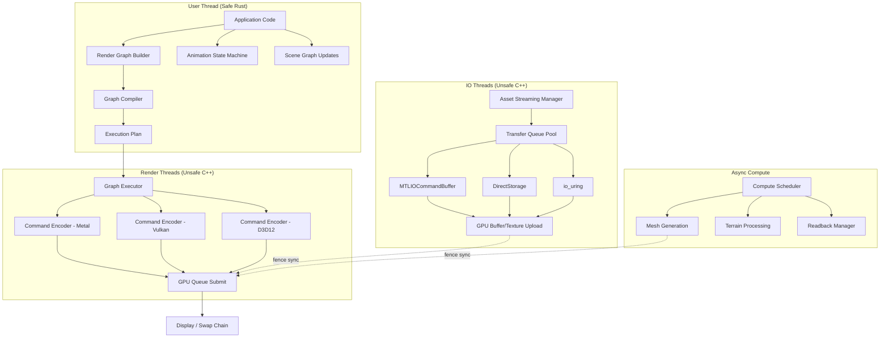

# Harmonius - Project Overview

## Mission

Harmonius is a production-grade, cross-platform hybrid render graph library for
high-performance desktop games. It provides a **100% safe Rust** declarative API
backed by **high-performance C++ backends** for Metal 4, Vulkan 1.4, and
Direct3D 12.

## Design Principles

| Principle | Description |
|---|---|
| **Safety-first** | User thread is 100% safe Rust. Unsafe code is confined to background render/IO threads |
| **GPU-driven** | All rendering is GPU-driven. No CPU-driven draw calls. Meshlet pipeline replaces legacy vertex pipeline |
| **Declarative** | Render graph is declared once, compiled to an execution plan, then executed per-frame |
| **Cross-platform** | First-class Metal/Vulkan/D3D12 via native C++ backends. No compatibility layers |
| **Modern-only** | Requires bindless resources, mesh shaders, hardware ray tracing. No legacy fallbacks |

## Platform Targets

| Platform | GPU API | Min Version | IO API | Status |
|---|---|---|---|---|
| **macOS** | Metal | 4.0 | MTLIOCommandBuffer | Initial target |
| **Windows** | Direct3D 12 | Agility SDK | DirectStorage | Planned |
| **Windows** | Vulkan | 1.4 + extensions | io_uring (via Win32) | Planned |
| **SteamOS** | Vulkan | 1.4 + extensions | io_uring | Planned |

### Required GPU Extensions

| Capability | Metal | Vulkan | D3D12 |
|---|---|---|---|
| Bindless Resources | Argument Buffers (Tier 2) | VK_EXT_descriptor_indexing | Bindless SRV/UAV (Tier 3) |
| Mesh Shaders | Object/Mesh Functions | VK_EXT_mesh_shader | Mesh Shader Pipeline |
| Hardware Ray Tracing | Metal Ray Tracing API | VK_KHR_ray_tracing_pipeline | DXR 1.1 |
| Async Compute | Multiple Command Queues | Async Compute Queue Family | Compute Queue |
| Transfer Queue | Blit Command Encoder | Transfer Queue Family | Copy Queue |

## Excluded Scope

- **No legacy pipelines**: Geometry shaders, tessellation, traditional vertex pipeline
- **No compatibility layers**: MoltenVK, DXVK, KosmicKrisp
- **No console/mobile**: Xbox, PlayStation, Switch, iOS, Android
- **No CPU-driven rendering**: All draw calls are GPU-indirect

## Tech Stack

```
User Code (Safe Rust)
        │
        ▼
┌─────────────────────────┐
│  Harmonius Public API   │  100% Safe Rust
│  (Declarative Render    │  Structs, Traits, Enums
│   Graph Builder)        │
└────────────┬────────────┘
             │
        ▼
┌─────────────────────────┐
│  Execution Planner      │  Safe Rust
│  (Graph Compiler &      │  Compiles graph → optimized
│   Resource Scheduler)   │  execution plan
└────────────┬────────────┘
             │  cxx.rs bridge
             ▼
┌─────────────────────────┐
│  C++ Backend            │  Unsafe, background threads
│  Metal / Vulkan / D3D12 │  Command encoding, resource
│  (metal-hpp/vulkan-hpp) │  management, IO dispatch
└─────────────────────────┘
```

### Shader Pipeline

```
Shader Graph File (Serialized)
        │
        ▼
┌─────────────────────────┐
│  Shader Graph Compiler  │  Public Rust crate
│  (harmonius-shaders)    │
└────────────┬────────────┘
             │
             ▼
┌─────────────────────────┐
│  Naga IR                │  Platform-neutral shader AST
└────────────┬────────────┘
             │
     ┌───────┼───────┐
     ▼       ▼       ▼
   MSL     HLSL    SPIR-V
```

## High-Level Architecture



## Development Roadmap

### Phase 1: Foundation (Metal Backend)

| Milestone | Deliverables |
|---|---|
| **M1: Core Infrastructure** | Workspace setup, cxx.rs bridge, Metal device init, command queue management |
| **M2: Render Graph Core** | Graph builder API, compiler, execution plan, basic executor |
| **M3: Meshlet Pipeline** | Mesh shader pipeline, meshlet data structures, GPU-driven draw |
| **M4: Resource Management** | Buffer/texture allocation, bindless descriptor management, streaming infrastructure |
| **M5: Basic Rendering** | Forward+ lighting, PBR materials, shadow maps, frustum/occlusion culling |

### Phase 2: Advanced Rendering

| Milestone | Deliverables |
|---|---|
| **M6: Ray Tracing** | Acceleration structures, RT reflections, RT indirect lighting |
| **M7: GI & Shadows** | Irradiance caching, cascaded shadow maps, soft shadows, AO |
| **M8: Volumetrics** | Volumetric fog/clouds, procedural sky, god rays, atmospheric scattering |
| **M9: Animation** | Skeletal animation (GPU), morph targets, state machines, procedural anim |
| **M10: Terrain & Worlds** | Heightmap terrain, voxel worlds, infinite streaming, procedural generation |

### Phase 3: Cross-Platform & Polish

| Milestone | Deliverables |
|---|---|
| **M11: Vulkan Backend** | Vulkan 1.4 backend, SteamOS validation |
| **M12: D3D12 Backend** | Direct3D 12 backend, DirectStorage, Windows validation |
| **M13: UI & 2D** | Vector/bitmap UI, 2D/2.5D rendering support |
| **M14: Shader Tooling** | Shader graph compiler crate, Blender import pipeline |
| **M15: Instrumentation** | GPU/CPU profiling, allocation tracking, shader debugging |

### Phase 4: Production Hardening

| Milestone | Deliverables |
|---|---|
| **M16: Testing Suite** | Full TDD coverage, E2E GPU tests, snapshot validation, fuzz testing |
| **M17: Optimization** | Performance profiling, bottleneck elimination, memory optimization |
| **M18: Documentation** | API docs, tutorials, example projects |
