# Harmonius - Architecture

## Thread Model

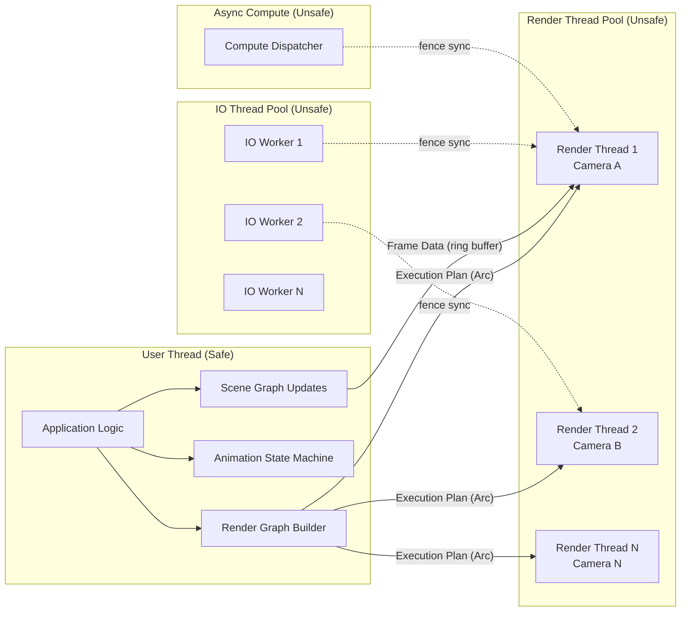

### Thread Responsibilities

| Thread | Safety | Responsibilities |
|---|---|---|
| **User Thread** | 100% Safe Rust | Graph building, scene updates, animation state, input handling |
| **Render Thread(s)** | Unsafe (C++) | Command encoding, GPU submission, swap chain present, per-camera |
| **IO Thread(s)** | Unsafe (C++) | Disk reads, GPU uploads via transfer queue, streaming management |
| **Async Compute** | Unsafe (C++) | Multi-frame compute jobs, mesh generation, readback |

### Synchronization Primitives

| Mechanism | Purpose | Platform Mapping |
|---|---|---|
| **GPU Fence** | Cross-queue sync (render↔transfer↔compute) | MTLFence / VkSemaphore / ID3D12Fence |
| **GPU Event** | Fine-grained intra-queue sync | MTLEvent / VkEvent / ID3D12Fence |
| **Ring Buffer** | User thread → render thread frame data | Lock-free SPSC per render thread |
| **Arc\<ExecutionPlan\>** | Shared immutable execution plan | Rust Arc, read-only after compilation |
| **Resource Registry** | Shared resource handles across threads | Concurrent hash map with generation counters |

---

## Render Graph Lifecycle

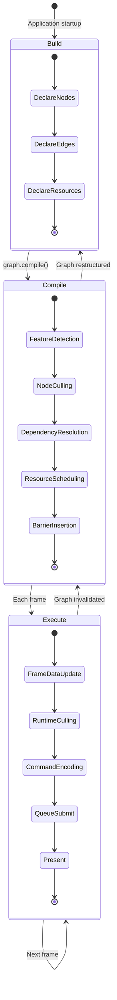

### Phase 1: Build (Declarative, Frame-Invariant)

The user constructs a render graph using the safe Rust API. The graph is a DAG
of **passes** connected by **resource edges**. This graph does not change
frame-to-frame.

| Concept | Description |
|---|---|
| **Pass Node** | A render, compute, or transfer operation |
| **Resource Node** | A buffer, texture, or acceleration structure |
| **Edge** | Data dependency: pass reads/writes a resource |
| **Feature Gate** | Conditional node activation based on capability flags |
| **Budget Gate** | Conditional node activation based on performance budget |

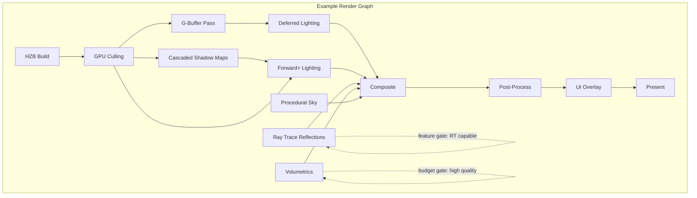

### Phase 2: Compile (Optimization)

The compiler transforms the declarative graph into an **Execution Plan** — an
optimized, flattened schedule of operations.

| Step | Operation | Details |
|---|---|---|
| 1 | **Feature Detection** | Query GPU capabilities, disable unsupported pass nodes |
| 2 | **Node Culling** | Remove disabled nodes and their exclusive dependencies (transitive) |
| 3 | **Dependency Resolution** | Topological sort of remaining nodes, detect parallelism |
| 4 | **Resource Scheduling** | Compute resource lifetimes, plan aliasing/reuse |
| 5 | **Barrier Insertion** | Insert minimal memory/execution barriers between passes |
| 6 | **Queue Assignment** | Assign passes to render/compute/transfer queues |

#### Transitive Culling

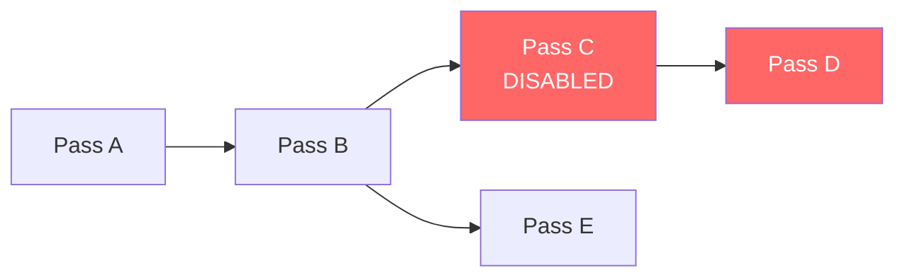

When Pass C is disabled, Pass D is culled if C was its only dependency. Pass B
remains because Pass E still depends on it.

### Phase 3: Execute (Per-Frame)

The executor runs the compiled plan each frame, handling dynamic state.

| Step | Operation |
|---|---|
| 1 | **Frame Data Update** | Push per-frame data (transforms, lights, camera) via ring buffer |
| 2 | **Runtime Culling** | Disable budget-gated passes if frame budget exceeded |
| 3 | **Distance Sorting** | CPU-side generic distance sort for transparency, particles, etc. |
| 4 | **Command Encoding** | Parallel command encoding on render threads |
| 5 | **Queue Submit** | Submit command buffers with appropriate fences |
| 6 | **Present** | Swap chain present, pacing to display refresh |

---

## Resource Management

### Resource Types

| Type | Description | Bindless | Streaming |
|---|---|---|---|
| **Buffer** | Vertex, index, uniform, storage, indirect | Yes | No |
| **Texture2D** | Color, normal, material maps | Yes | Tiled |
| **Texture3D** | Voxel data, volume fog LUTs | Yes | Sliced |
| **TextureCube** | Environment maps, reflection probes | Yes | Per-face |
| **AccelerationStructure** | BLAS/TLAS for ray tracing | N/A | Incremental |
| **RenderTarget** | Framebuffers, G-buffer layers | No | No |

### Resource Lifecycle

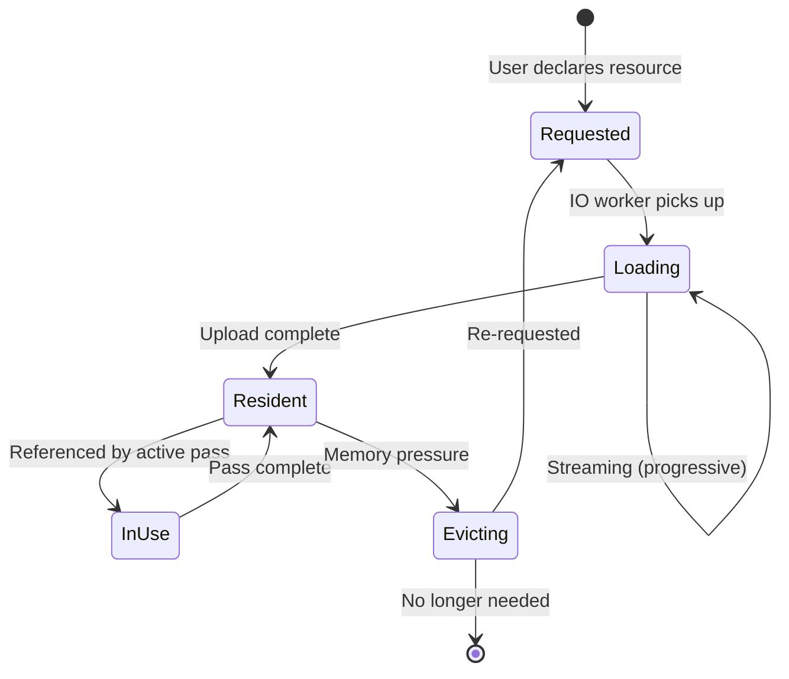

### Bindless Resource Model

All resources are accessed via bindless descriptor indices. No per-draw
descriptor set binding.

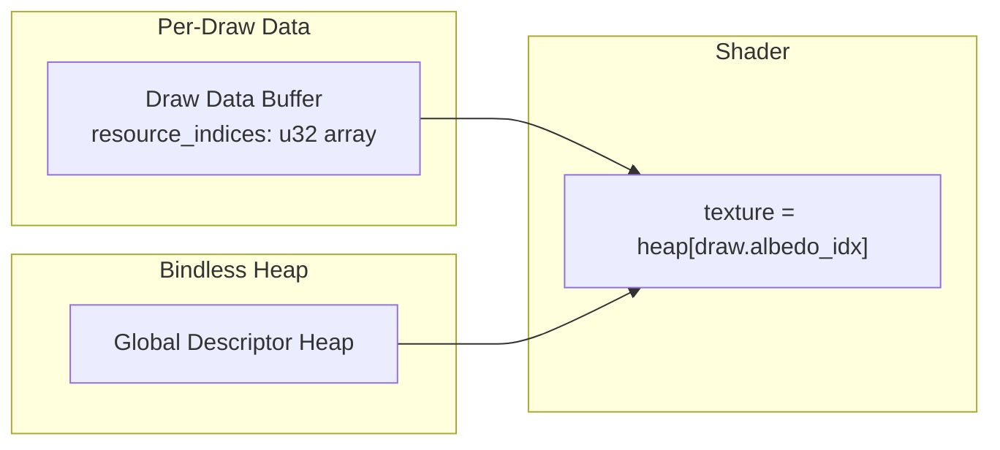

| Platform | Mechanism |
|---|---|
| Metal | Argument Buffers (Tier 2) + Heap |
| Vulkan | VK_EXT_descriptor_indexing (UPDATE_AFTER_BIND) |
| D3D12 | Shader Model 6.6 bindless, CBV_SRV_UAV heap |

---

## IO & Streaming Architecture

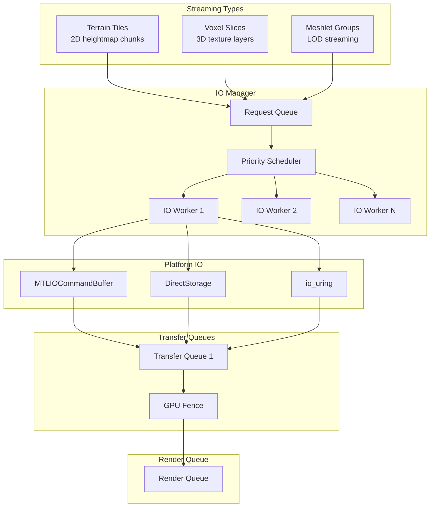

### Streaming Priority Model

| Priority | Source | Example |
|---|---|---|
| **Critical** | Visible, no LOD available | Player's immediate surroundings |
| **High** | Visible, low LOD loaded | Terrain tile upgrading from LOD 2→0 |
| **Normal** | Pre-fetch for predicted movement | Camera direction extrapolation |
| **Low** | Background loading | Distant environment pre-caching |

---

## Async Compute Integration

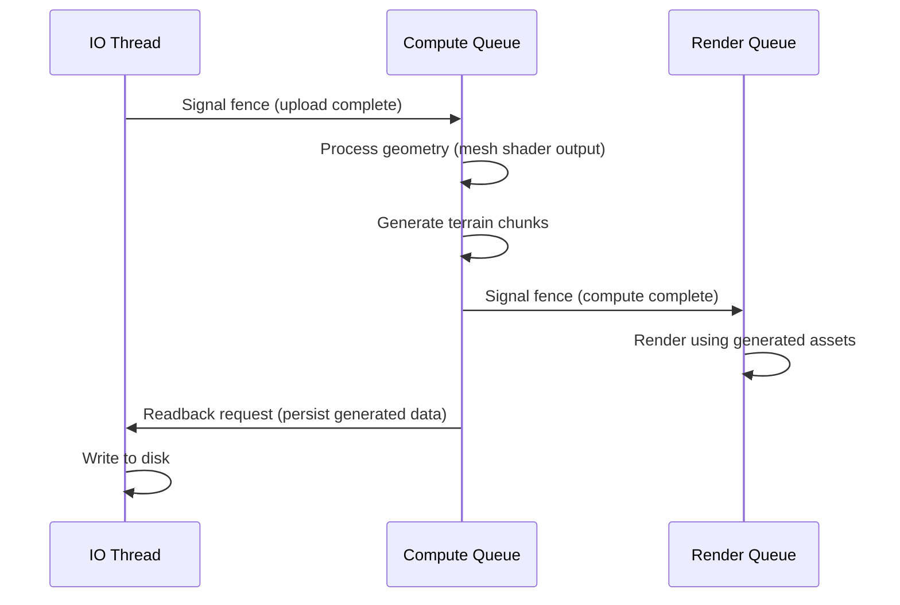

### Multi-Frame Compute Jobs

| Job Type | Duration | Readback | Example |
|---|---|---|---|
| **Terrain Generation** | 1-4 frames | Yes | Heightmap → meshlets |
| **Voxel Meshing** | 1-2 frames | Optional | SDF → mesh surface |
| **GI Update** | N frames (amortized) | No | Irradiance probe update |
| **Acceleration Structure Build** | 1 frame | No | BLAS/TLAS rebuild |

---

## Command Encoding Model

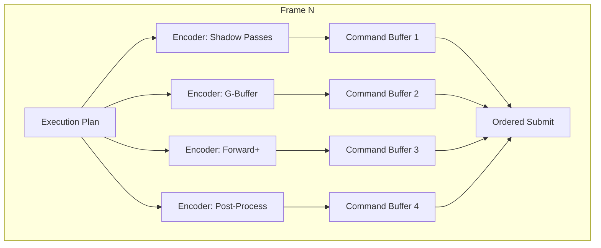

### Per-Platform Command Model

| Concept | Metal | Vulkan | D3D12 |
|---|---|---|---|
| Command Buffer | MTLCommandBuffer | VkCommandBuffer | ID3D12CommandList |
| Render Pass | MTLRenderCommandEncoder | VkRenderPass / Dynamic Rendering | Render Pass (Agility SDK) |
| Compute Pass | MTLComputeCommandEncoder | vkCmdDispatch | ID3D12CommandList::Dispatch |
| Indirect Draw | drawMeshThreadgroups(indirectBuffer:) | vkCmdDrawMeshTasksIndirectEXT | ExecuteIndirect |
| Barrier | MTLFence + memoryBarrier | vkCmdPipelineBarrier2 | ResourceBarrier |

---

## Multi-Camera / Split-Screen

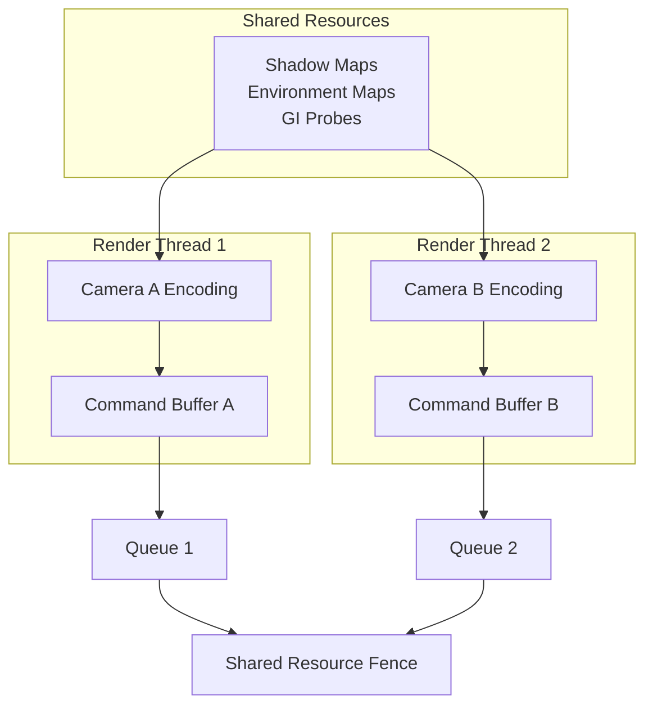

### Resource Sharing Rules

| Resource | Shared | Sync Required |
|---|---|---|
| Shadow maps | Yes (if same sun/lights) | Read-only after generation |
| GI probes | Yes | Read-only after update |
| Meshlet buffers | Yes | Immutable |
| Per-camera uniforms | No | Per-thread ring buffer |
| Render targets | No | Per-camera exclusive |
| Acceleration structures | Yes | Read-only after build |

---

## Data Flow Summary

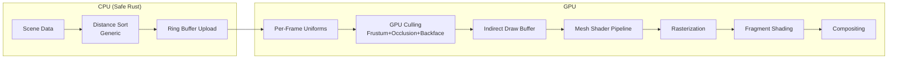

### CPU-Side Distance Sorting

Generic distance-based sorting runs on the CPU before upload. Use cases:

| Use Case | Sort Key | Direction |
|---|---|---|
| Transparent objects | Camera distance | Back-to-front |
| Particles | Camera distance | Back-to-front |
| Opaque objects | Camera distance | Front-to-back (optional, for early-z) |
| LOD selection | Camera distance | N/A (bucket selection) |
| Streaming priority | Camera distance | Nearest first |
