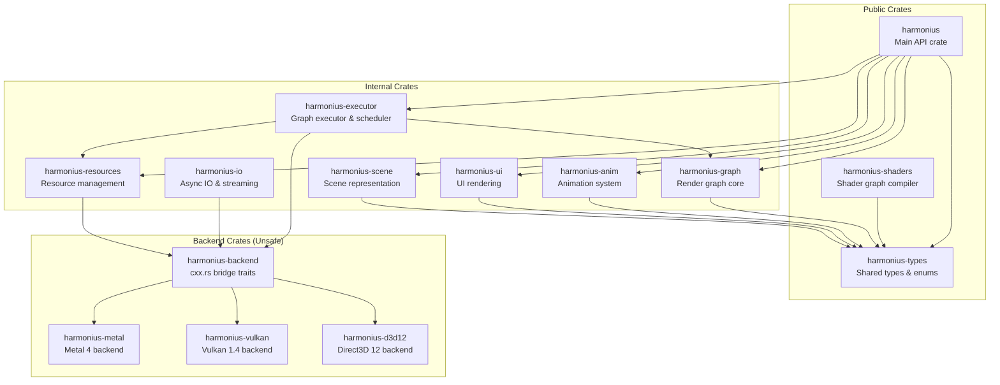
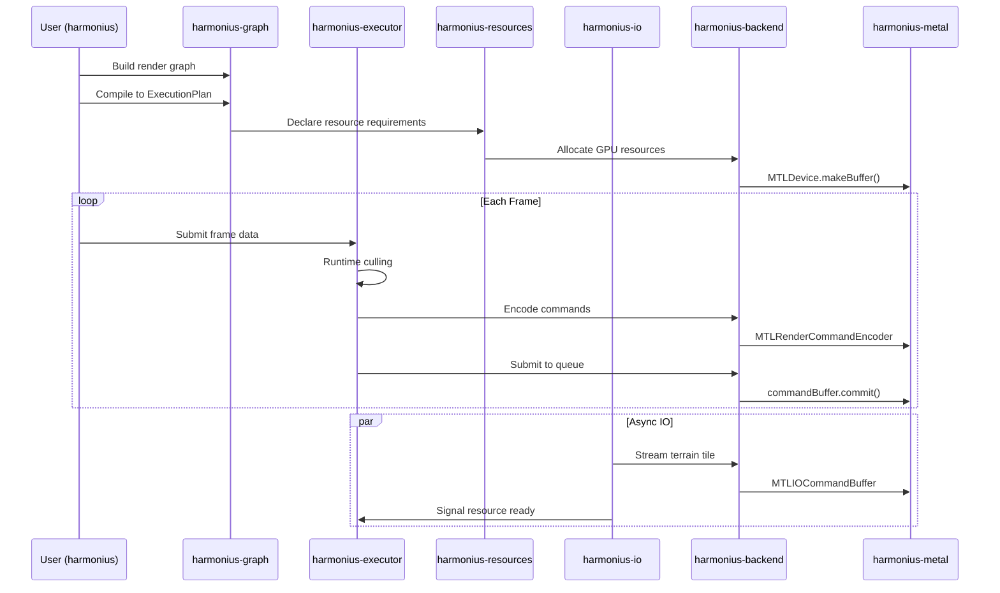

# Harmonius - Module Responsibilities

## Workspace Crate Structure

---

## Module Detail

### `harmonius` (Public API)

| Aspect | Detail |
|---|---|
| **Safety** | 100% Safe Rust |
| **Purpose** | User-facing entry point. Re-exports public API surface |
| **Owns** | Application lifecycle, device selection, window integration |
| **Exposes** | `HarmoniusApp`, `Device`, `SwapChain`, render graph builder entry |
| **Dependencies** | All internal crates |

### `harmonius-types` (Shared Types)

| Aspect | Detail |
|---|---|
| **Safety** | 100% Safe Rust |
| **Purpose** | Shared enums, structs, and type definitions used across crates |
| **Owns** | Format enums, math types, handle types, error types |
| **Exposes** | `TextureFormat`, `BufferUsage`, `ShaderStage`, `Handle<T>`, etc. |
| **Dependencies** | None (leaf crate) |

### `harmonius-graph` (Render Graph Core)

| Aspect | Detail |
|---|---|
| **Safety** | 100% Safe Rust |
| **Purpose** | Declarative render graph construction and compilation |
| **Owns** | Graph nodes, edges, resource declarations, compilation |
| **Exposes** | `RenderGraph`, `PassBuilder`, `ResourceRef`, `ExecutionPlan` |
| **Key Operations** | |
| | Build: Declare passes, resources, dependencies |
| | Compile: Feature detection → node culling → topological sort → barrier insertion |
| | Validate: Cycle detection, resource lifetime analysis |

### `harmonius-executor` (Graph Executor)

| Aspect | Detail |
|---|---|
| **Safety** | Safe API, unsafe internals (thread dispatch) |
| **Purpose** | Execute compiled render graph per-frame |
| **Owns** | Frame scheduling, command encoding dispatch, runtime culling |
| **Exposes** | `Executor`, `FrameContext`, `RuntimeBudget` |
| **Key Operations** | |
| | Frame data upload via ring buffer |
| | Parallel command encoding across render threads |
| | Queue submission with fence synchronization |
| | Display pacing and swap chain management |

### `harmonius-resources` (Resource Management)

| Aspect | Detail |
|---|---|
| **Safety** | Safe API, unsafe internals (GPU allocation) |
| **Purpose** | GPU resource lifecycle, bindless heap, allocation |
| **Owns** | Buffer/texture allocation, descriptor heap, resource registry |
| **Exposes** | `ResourceManager`, `BindlessHeap`, `ResourceHandle` |
| **Key Operations** | |
| | Allocate/deallocate GPU resources |
| | Manage bindless descriptor indices |
| | Track resource lifetimes and aliasing |
| | Handle resource residency and eviction |

### `harmonius-io` (Async IO & Streaming)

| Aspect | Detail |
|---|---|
| **Safety** | Safe API, unsafe internals (platform IO) |
| **Purpose** | Asynchronous disk-to-GPU streaming |
| **Owns** | IO worker pool, transfer queue management, streaming scheduler |
| **Exposes** | `IoManager`, `StreamingRequest`, `TransferQueue` |
| **Key Operations** | |
| | Priority-based IO scheduling |
| | Terrain tile streaming |
| | 3D texture slice streaming |
| | Meshlet LOD streaming |
| | Readback for persistence |

### `harmonius-anim` (Animation)

| Aspect | Detail |
|---|---|
| **Safety** | 100% Safe Rust (state machines), compute dispatch via executor |
| **Purpose** | Animation data and state management |
| **Owns** | Skeleton data, animation clips, state machines, blend trees |
| **Exposes** | `Skeleton`, `AnimationClip`, `AnimStateMachine`, `MorphTarget` |
| **Key Operations** | |
| | Declarative animation state machine definition |
| | Blend weight computation (CPU) |
| | GPU skinning dispatch via compute (through executor) |
| | Morph target weight management |

### `harmonius-ui` (UI Rendering)

| Aspect | Detail |
|---|---|
| **Safety** | 100% Safe Rust |
| **Purpose** | Retained-mode UI rendering (vector + bitmap) |
| **Owns** | UI element tree, layout engine, text rendering, atlas management |
| **Exposes** | `UiCanvas`, `UiElement`, `TextLayout`, `SpriteAtlas` |
| **Key Operations** | |
| | Vector path tessellation for GPU |
| | Bitmap atlas packing and batching |
| | Layout computation |
| | Hit testing |

### `harmonius-scene` (Scene Representation)

| Aspect | Detail |
|---|---|
| **Safety** | 100% Safe Rust |
| **Purpose** | Scene graph, spatial data, transform hierarchy |
| **Owns** | Entity transforms, spatial indices, distance sorting |
| **Exposes** | `Scene`, `Entity`, `Transform`, `SpatialIndex`, `DistanceSorter` |
| **Key Operations** | |
| | Transform hierarchy update |
| | Generic distance-based sorting (transparency, LOD, streaming) |
| | Spatial queries (frustum, radius) |

### `harmonius-shaders` (Shader Graph Compiler)

| Aspect | Detail |
|---|---|
| **Safety** | 100% Safe Rust |
| **Purpose** | Compile visual shader graphs into platform shaders via Naga |
| **Owns** | Shader graph IR, Naga IR generation, platform code emission |
| **Exposes** | `ShaderGraph`, `ShaderCompiler`, `CompiledShader` |
| **Key Operations** | |
| | Deserialize shader graph from file |
| | Validate shader graph (type checking, resource binding) |
| | Generate Naga IR from graph |
| | Emit MSL / HLSL / SPIR-V from Naga IR |

### `harmonius-backend` (Backend Bridge)

| Aspect | Detail |
|---|---|
| **Safety** | Unsafe Rust (cxx.rs bridge definitions) |
| **Purpose** | Define the C++ interface that all backends implement |
| **Owns** | cxx.rs bridge declarations, backend trait definitions |
| **Exposes** | `BackendDevice`, `BackendCommandBuffer`, `BackendPipeline`, etc. |
| **Consumed By** | harmonius-metal, harmonius-vulkan, harmonius-d3d12 |

### `harmonius-metal` / `harmonius-vulkan` / `harmonius-d3d12`

| Aspect | Detail |
|---|---|
| **Safety** | Unsafe C++ with Rust bindings via cxx.rs |
| **Purpose** | Platform-specific GPU backend implementation |
| **Owns** | Device init, pipeline creation, command encoding, resource allocation |
| **C++ Wrappers** | metal-hpp, vulkan-hpp, d3d12 (Agility SDK) |
| **Build** | C++ compiled by cargo via build.rs + cxx.rs |

---

## Module Dependency Rules

| Rule | Rationale |
|---|---|
| Public crates never depend on backend crates | Safety boundary enforcement |
| Backend crates only accessed through `harmonius-backend` trait | Swappable backends |
| `harmonius-types` is a leaf crate with zero dependencies | Shared vocabulary types |
| No circular dependencies between internal crates | Clean build graph |
| `harmonius-executor` is the only crate that dispatches to backends | Single point of unsafe dispatch |
| `harmonius-io` dispatches to backends for transfer operations | IO is separate from render |

## Inter-Module Communication

