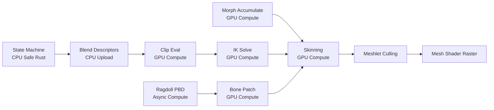
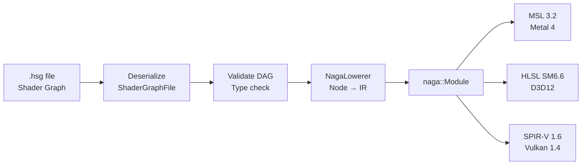

# Harmonius - Features & Requirements

## Feature Matrix

### Legend

| Symbol | Meaning |
|---|---|
| R | Render pass (mesh shader rasterization) |
| C | Compute pass |
| T | Transfer pass (IO/DMA) |
| D | Data/parameter node (CPU upload) |
| RT | Ray tracing pass |

---

## 1. Core Rendering

| # | Feature | Node Type | Queue | Platform Gate | Dependencies |
|---|---|---|---|---|---|
| C1 | Direct Lighting (point/spot/directional) | C + R | Graphics | Core | Frustum culling, depth prepass |
| C2 | Frustum Culling (GPU meshlet-level) | C | Compute | Core | Meshlet buffer, camera data |
| C3 | Backface Culling (meshlet normal cone) | C | Compute | Core | Frustum culling output |
| C4 | Occlusion Culling (HZB two-phase) | C | Compute | Core | Depth prepass, HZB build |
| C5 | Orthographic Projection | D | N/A | Core | Camera data buffer |
| C6 | Perspective Projection (reverse-Z) | D | N/A | Core | Camera data buffer |
| C7 | GPU-Driven Instancing | C + R | Compute + Graphics | Core | Culling passes, meshlet buffer |
| C8 | Render-to-Texture | R | Graphics | Core | Graph compiler (barriers) |
| C9 | Cubemaps (static + dynamic) | T + R + C | All | Core | RTT, IBL prefilter compute |

### Core Data Structures

| Structure | Fields |
|---|---|
| `GpuLight` | position, color, intensity, range, spot_angles, type |
| `FrustumPlanes` | planes: [vec4f; 6] |
| `MeshletAabb` | center, half_extents, meshlet_index |
| `MeshletNormalCone` | apex, axis, cutoff, meshlet_index |
| `HzbTexture` | Min-depth mipchain, levels, width, height |
| `GpuInstance` | world_transform, prev_transform, material_index, meshlet_range, lod_index |
| `RenderTarget` | texture_handle, width, height, format, mip_levels, sample_count |
| `CubemapDesc` | width, format, mip_levels, is_dynamic |
| `ReflectionProbe` | world_position, cubemap_handle, capture_radius |

---

## 2. Lighting & PBR

| # | Feature | Node Type | Queue | Platform Gate | Dependencies |
|---|---|---|---|---|---|
| L1 | Forward+ Lighting (tiled/clustered) | C + R | Compute + Graphics | Core | Depth prepass, light buffer |
| L2 | Deferred Lighting (G-buffer) | R + C | Graphics + Compute | Core | G-buffer pass, light culling |
| L3 | PBR Multi-Map (Cook-Torrance BRDF) | R | Graphics | Core | Material textures (bindless) |
| L4 | PBR BSDF (subsurface, clearcoat, anisotropy, sheen) | R + C | Graphics + Compute | Core | G-buffer, SSS blur pass |
| L5 | Real-time GI (DDGI Irradiance Caching) | RT + C | Async Compute | Ray tracing HW | TLAS, shadow atlas |
| L6 | Hardware Ray Tracing (BLAS/TLAS) | C | Compute | RT capable | Meshlet buffers, scene graph |
| L7 | Ray Traced Reflections (hybrid SSR+RT) | C + RT | Async Compute | RT capable | TLAS, G-buffer, IBL |
| L8 | Ray Traced Indirect Lighting | C + RT | Async Compute | RT capable | TLAS, DDGI probes |

### Lighting Data Structures

| Structure | Fields |
|---|---|
| `LightCullTile` | light_count, light_indices |
| `GBufferLayout` | albedo_metallic (RGBA8), normal_roughness (RG16F), motion_vectors (RG16F), depth (D32F) |
| `PbrMaterial` | albedo_idx, normal_idx, metallic_roughness_idx, ao_idx, emissive_idx, flags |
| `BsdfMaterial` | Extends PBR with subsurface_profile, clearcoat_mask, anisotropy_direction, sheen_color |
| `DDGIVolumeDesc` | origin, probe_spacing, probe_counts, rays_per_probe, hysteresis |
| `BLASEntry` | gpu_address, compacted_size, mesh_id, flags |
| `TLASInstance` | transform (3x4), instance_id, ray_mask, sbt_offset, flags, blas_address |
| `RTReflectionConfig` | enable_ssr, ssr_max_steps, rt_roughness_threshold, denoiser |

---

## 3. Shadows & Effects

| # | Feature | Node Type | Queue | Platform Gate | Dependencies |
|---|---|---|---|---|---|
| S1 | Cascaded Shadow Maps | R (per cascade) | Graphics | Core | Directional light, meshlet cull |
| S2 | Soft Shadows (PCF/PCSS/RT) | C or RT | Async Compute | Core (PCF), RT optional | Shadow maps, depth, TLAS |
| S3 | Ambient Occlusion (GTAO/SSAO/RT AO) | C or RT | Async Compute | Core | G-buffer depth/normal |
| S4 | Subsurface Scattering (screen-space/RT) | C | Async Compute | Core | G-buffer, SSS profiles |
| S5 | Transparent Objects | R | Graphics | Core | Distance sort (CPU), depth |
| S6 | Alpha Mask Cutouts | R | Graphics | Core | Material flags |

### Shadow/Effect Data Structures

| Structure | Fields |
|---|---|
| `CsmConfig` | cascade_count, lambda, depth_bias, normal_bias, shadow_map_resolution, stabilize |
| `CsmPartitionBuffer` | view_proj[MAX_CASCADES], split_depths, texel_size |
| `SoftShadowConfig` | variant (PCF/PCSS/RT), pcf_kernel_size, pcss_light_size, rt_sample_count |
| `AoConfig` | variant (SSAO/GTAO/RT), radius_world, sample_count, half_resolution |
| `SssProfile` | scatter_radius[3], extinction[3], albedo[3], ior, thickness_scale |

### Execution Plan Fallback Chains

| Feature | Tier 0 (Budget) | Tier 1 (Discrete) | Tier 2 (RT) |
|---|---|---|---|
| Shadows | 2 cascades + PCF 3x3 | 4 cascades + PCSS | 4 cascades + RT soft |
| AO | SSAO half-res | GTAO + bent normals | RT AO half-res |
| SSS | Transmittance only | Screen-space SSSSS | RT SSS denoised |
| Reflections | SSR only | SSR + IBL | SSR + RT hybrid |
| GI | None / baked | DDGI probes | DDGI + RT indirect |

---

## 4. Volumetrics & Environment

| # | Feature | Node Type | Queue | Platform Gate | Dependencies |
|---|---|---|---|---|---|
| V1 | Ray-Marched Volumetrics (froxels) | C | Async Compute | Core (3D UAV) | Shadow maps, light culling |
| V2 | Procedural Sky (Bruneton/Hillaire) | C | Compute | Core | Atmosphere params |
| V3 | Procedural Clouds (volumetric) | C | Compute | Core (3D textures) | Sky LUTs, shadow maps |
| V4 | God Rays (screen-space / volumetric) | C | Compute | Core | Depth, sun position |
| V5 | Rayleigh Scattering | D | N/A (shared params) | Core | Atmosphere buffer |
| V6 | Fog (distance/height) | C or D | Compute or passthrough | Core | Volumetric node or depth |
| V7 | Water Simulation (FFT ocean) | C + R | Compute + Graphics | Core + Mesh Shaders | Depth, SSR/RT reflections |

### Volumetrics Data Structures

| Structure | Fields |
|---|---|
| `FroxelVolumeDesc` | tile_size_px, depth_slices, near/far, distribution_lambda |
| `AtmosphereDesc` | planet_radius, atmosphere_height, rayleigh/mie coefficients, sun_angular_radius |
| `SkyLutHandles` | transmittance_lut, multi_scatter_lut, sky_view_lut, aerial_perspective_lut |
| `CloudLayerDesc` | altitude range, coverage, wind, density, march_steps, temporal_blend |
| `GodRayMode` | ScreenSpace { iterations, decay, weight } or Volumetric |
| `FogDesc` | mode (exp/exp2/volumetric), density, height_falloff, color |
| `OceanDesc` | fft_resolution, patch_size, wind, choppiness, foam_threshold, lod_levels |
| `UnderwaterDesc` | absorption_color, scatter_coefficient, caustics_intensity |

---

## 5. Geometry & Streaming

| # | Feature | Node Type | Queue | Platform Gate | Dependencies |
|---|---|---|---|---|---|
| G1 | Meshlet-Based Virtualized Geometry | C + R | Compute + Graphics | Mesh Shaders (hard gate) | Cluster hierarchy buffer |
| G2 | Procedural Asset Generation | C | Async Compute | Core | Meshletize pass, ring buffer |
| G3 | Spline Paths (GPU-evaluated) | C + R | Compute + Graphics | Mesh Shaders | Heightmap, meshlet pipeline |
| G4 | Infinite Streamable Universes | T + C | Transfer + Compute | Transfer queue + sparse tex | Chunk residency, LOD system |
| G5 | Planetary-Scale Voxel Worlds | T + C + R | All queues | Sparse 3D textures | Surface extraction, streaming |
| G6 | Detailed Open-World Terrains | T + C + R | All queues | Virtual texturing | Height tiles, page table |
| G7 | Mesh Shaders (task/mesh pipeline) | R | Graphics | Mesh Shaders (hard gate) | All geometry features |

### Hard Capability Gate: Mesh Shaders

Mesh shaders are a **hard requirement** for all geometry features. Without them, no geometry can be rendered. The execution plan reports this as a fatal capability error.

| Platform | Requirement |
|---|---|
| Metal | Metal 3+ hardware (A13/M1+), `MTLMeshRenderPipeline` |
| Vulkan | `VK_EXT_mesh_shader` (NOT core in 1.4, must be queried) |
| D3D12 | SM 6.5+, D3D12 Ultimate |

### Geometry Data Structures

| Structure | Fields |
|---|---|
| `MeshletDescriptor` | vertex_offset, vertex_count, triangle_offset, triangle_count, bounding_sphere, normal_cone |
| `ClusterHierarchyNode` | children[8], lod_error, parent_error, bounding_sphere |
| `ProceduralGenJob` | seed, world_aabb, output_ring_slot, lod_level, dispatch_size |
| `SplineControlPoint` | position, tangent_weight, up_vector |
| `ChunkDescriptor` | world_aabb, lod_range, pool_offset, residency_state |
| `SVONode` | child_bitmask, page_pointer, world_aabb, lod_level |
| `VirtualTexturePageTable` | Indirection texture: virtual UV → physical atlas UV + mip |
| `TerrainTileDescriptor` | world_origin, tile_size, height_range, data_offset, lod |

---

## 6. Animation

| # | Feature | Node Type | Queue | Platform Gate | Dependencies |
|---|---|---|---|---|---|
| A1 | Weighted Skeletal Animation (GPU skinning) | C | Compute | Core | Bone palette upload |
| A2 | Instanced Skeletal Animation | C | Async Compute | Core | Animation eval, arena buffer |
| A3 | Morph Shapes (blend shapes) | C | Compute | Core | Delta buffers, weight upload |
| A4 | Animation Clips (GPU keyframe eval) | C | Async Compute | Core | Clip buffer, streaming |
| A5 | Animation State Machines | D (CPU) | N/A | Core | Blend descriptor upload |
| A6 | Procedural Animations (IK, ragdoll) | C | Compute | Core | Bone palette, physics |
| A7 | Custom Animation Curves | D (CPU) | N/A | Core | Uniform buffer upload |

### Animation Data Structures

| Structure | Fields |
|---|---|
| `BonePalette` | [float4x4; MAX_BONES=256] world-space matrices |
| `SkinVertex` | position, bone_indices (u8x4), bone_weights (f16x4) |
| `MorphTargetDelta` | vertex_index, delta_position (f16x3), delta_normal (f16x3) |
| `AnimationClipDescriptor` | bone_count, duration, loop, track_table_offset |
| `AnimBlendDescriptor` | [(clip_id, weight, time); 4] per instance |
| `IKChainDescriptor` | bone_indices[8], chain_length, effector_goal, pole_vector |
| `RagdollBodyState` | position, orientation, linear_vel, angular_vel |
| `CurveKeyframe` | time, value, tangent_in, tangent_out |

### Animation Execution Pipeline

---

## 7. UI & 2D

| # | Feature | Node Type | Queue | Platform Gate | Dependencies |
|---|---|---|---|---|---|
| U1 | Vector-Based Retained UI (vello-style) | C | Compute | 64-bit atomics | Scene dirty flags |
| U2 | Bitmap-Based Retained UI (atlas quads) | R | Graphics | Core | Widget tree diff |
| U3 | 2D Game Support (sprites, tilemaps) | C + R | Compute + Graphics | Core | Sprite buffer, tile atlas |
| U4 | 2.5D Game Support (isometric, parallax) | R | Graphics | Core | CPU distance sort, depth |

### UI/2D Data Structures

| Structure | Fields |
|---|---|
| `VectorScene` | Retained path graph with dirty flags |
| `PathCommand` | MoveTo, LineTo, CubicBezierTo, Close |
| `QuadInstance` | position, UV rect, atlas index, tint, clip rect |
| `SpriteInstance` | position, rotation, scale, UV rect, atlas_index, z_order |
| `TilemapDesc` | chunk_dimensions, tile_size, layer_count |
| `IsometricSortKey` | f32 depth = row + col + height |
| `ParallaxLayer` | texture_handle, depth_multiplier, UV_scroll |

---

## 8. Tooling & Shader Pipeline

| # | Feature | Node Type | Queue | Platform Gate | Dependencies |
|---|---|---|---|---|---|
| T1 | Data-Driven Shader Graph Authoring | N/A (data format) | N/A | N/A | Serializable graph files |
| T2 | Shader Graph Compilation API | N/A (Rust crate) | N/A | N/A | Naga, graph validator |
| T3 | Resource CPU Readback | T | Transfer | Core | Staging buffer pool, fences |
| T4 | Blender 3D Compatibility | N/A (import pipeline) | N/A | N/A | GLTF parsing, meshletization |
| T5 | Naga Integration | N/A (shader IR) | N/A | N/A | Naga crate |

### Shader Pipeline

### Tooling Data Structures

| Structure | Fields |
|---|---|
| `ShaderGraphFile` | format_version, graph_uuid, permutations, nodes, edges, metadata |
| `ShaderNode` | uuid, kind, version, inputs (slot values), position |
| `CompileTarget` | api_backend, shader_model/version, feature_flags |
| `CompileResult` | naga::Module, CompiledBlob, ReflectionData |
| `ReadbackBuffer\<T\>` | Typed future resolving to Arc<[T]> |
| `ReadbackRegion` | buffer_offset, width, height, depth, stride |
| `GltfImportRequest` | path, import_options (lod_levels, compress, meshlet_config) |

---

## 9. IO & Streaming Infrastructure

| # | Feature | Node Type | Queue | Platform Gate | Dependencies |
|---|---|---|---|---|---|
| I1 | Transfer Queue Pool | T | Transfer | Transfer queue family | Staging ring buffers |
| I2 | Streaming Tiles (terrain/texture) | T | Transfer | Sparse textures | Page table, streaming manager |
| I3 | 3D Texture Streaming (voxel) | T | Transfer | Sparse 3D textures | Residency map, slice manager |
| I4 | DirectStorage / MTLIOCommandBuffer | T | Platform IO | Platform-specific | File handles, fences |
| I5 | Async Compute Integration | C | Async Compute | Compute queue | Transfer fences |
| I6 | Resource Synchronization | N/A | All | Core | Fences, barriers |
| I7 | Split-Screen / Multi-Window | N/A | Multiple Graphics | Core | Shared resource pool |

### IO Data Structures

| Structure | Fields |
|---|---|
| `TransferQueuePool` | slots, pending_uploads (lock-free MPSC), frame_fences |
| `TransferQueueSlot` | queue, cmd_allocator, staging_ring, in_flight_uploads |
| `UploadRequest` | src_data (Arc<[u8]>), dst_resource, dst_subresource, completion_fence |
| `TileAtlas` | physical_texture, indirection_texture, free_slots, resident map |
| `DirectIORequest` | file_handle, file_offset, compressed_size, codec, dst_resource |
| `IOCommandQueuePool` | queues, pending_signals, current_fence_value |
| `SharedResourcePool` | resources (concurrent map), frame_usage_count |
| `FrameSync` | frame_fence[FRAMES_IN_FLIGHT], transfer_timeline, compute_timeline |

---

## Complete Feature Count

| Category | Count |
|---|---|
| Core Rendering | 9 |
| Lighting & PBR | 8 |
| Shadows & Effects | 6 |
| Volumetrics & Environment | 7 |
| Geometry & Streaming | 7 |
| Animation | 7 |
| UI & 2D | 4 |
| Tooling & Shader Pipeline | 5 |
| IO & Streaming Infrastructure | 7 |
| **Total** | **60** |

---

## Platform Support Matrix

| Feature Category | Metal 4 | Vulkan 1.4 | D3D12 |
|---|---|---|---|
| Core rendering | Full | Full | Full |
| Mesh shaders | Metal 3+ (M1+) | VK_EXT_mesh_shader (NOT core) | SM 6.5+ |
| Hardware RT | Metal RT API | VK_KHR_ray_tracing_pipeline | DXR 1.1 |
| Bindless | Argument Buffers Tier 2 | VK_EXT_descriptor_indexing | SM 6.6 heap |
| Transfer queue | Blit queue | Transfer family | Copy queue |
| Direct IO | MTLIOCommandBuffer | io_uring (Linux fallback) | DirectStorage |
| Sparse textures | Metal sparse (macOS 14+) | VK_EXT_sparse_binding | Tiled Resources Tier 2 |
| Async compute | Separate MTLCommandQueue | Compute queue family | Compute command queue |
| 64-bit atomics | Metal 3+ native | VK_KHR_shader_atomic_int64 | SM 6.6 |
| Timeline semaphores | MTLSharedEvent | VkTimelineSemaphore (core 1.2) | ID3D12Fence |
