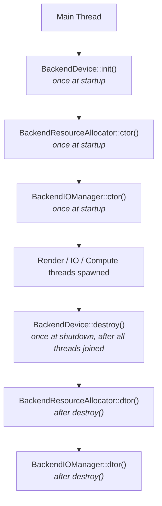
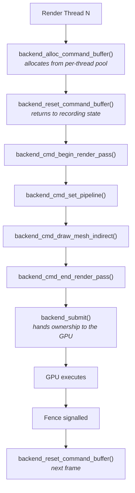

# Harmonius - Unsafe Rust Bridge & C++ Backend Interfaces

This document specifies the complete FFI boundary between the safe Rust execution
planner and the unsafe C++ GPU backends. The bridge is defined in the
`harmonius-backend` crate using `cxx.rs`. Each platform backend
(`harmonius-metal`, `harmonius-vulkan`, `harmonius-d3d12`) implements the C++
side of this contract.

---

## 1. cxx.rs Bridge Declarations (`harmonius-backend`)

The `#[cxx::bridge]` module in `harmonius-backend` declares every type and
function that crosses the FFI boundary. No C++ types are exposed directly to
safe Rust code; all interaction goes through the bridge types below.

### 1.1 Shared Opaque Handle and Enum Types

```rust
// harmonius-backend/src/bridge.rs

#[cxx::bridge(namespace = "harmonius")]
pub mod ffi {

    // -------------------------------------------------------------------------
    // Shared value types (trivially copyable across the FFI boundary)
    // -------------------------------------------------------------------------

    /// A stable u32 index into the backend's resource registry.
    /// Used everywhere in safe Rust; the C++ side resolves it to a platform
    /// GPU object via the ResourceHandleMap.
    #[derive(Copy, Clone, Debug, PartialEq, Eq, Hash)]
    struct ResourceHandle {
        index: u32,
        /// Monotonic generation counter — detects use-after-free.
        generation: u32,
    }

    /// A stable u32 index identifying an allocated command buffer slot.
    #[derive(Copy, Clone, Debug)]
    struct CommandBufferHandle {
        index: u32,
        generation: u32,
    }

    /// A stable u32 index identifying a GPU fence / timeline semaphore.
    #[derive(Copy, Clone, Debug)]
    struct FenceHandle {
        index: u32,
        /// The timeline value this handle was created at.
        timeline_value: u64,
    }

    /// A stable u32 index identifying a compiled pipeline state object.
    #[derive(Copy, Clone, Debug)]
    struct PipelineHandle {
        index: u32,
        generation: u32,
    }

    /// A stable u32 index identifying a swap chain surface.
    #[derive(Copy, Clone, Debug)]
    struct SwapChainHandle {
        index: u32,
    }

    /// A stable u32 index identifying a BLAS or TLAS object.
    #[derive(Copy, Clone, Debug)]
    struct AccelStructHandle {
        index: u32,
        generation: u32,
    }

    // -------------------------------------------------------------------------
    // Enumerations that cross the boundary
    // -------------------------------------------------------------------------

    /// Which GPU queue a command buffer targets.
    #[repr(u8)]
    enum QueueType {
        Graphics  = 0,
        Compute   = 1,
        Transfer  = 2,
    }

    /// Texture / render-target pixel formats understood by all backends.
    #[repr(u32)]
    enum PixelFormat {
        Rgba8Unorm        = 0,
        Rgba8Srgb         = 1,
        Rgba16Float       = 2,
        Rgba32Float       = 3,
        Rg16Float         = 4,
        R32Float          = 5,
        Depth32Float      = 6,
        Bc7Unorm          = 7,
        Bc7Srgb           = 8,
        Bc6hUfloat        = 9,
        Bc5Unorm          = 10,
    }

    /// How a buffer will be used on the GPU.
    #[repr(u32)]
    enum BufferUsage {
        Vertex            = 1 << 0,
        Index             = 1 << 1,
        Uniform           = 1 << 2,
        Storage           = 1 << 3,
        Indirect          = 1 << 4,
        AccelStructInput  = 1 << 5,
        AccelStructScratch= 1 << 6,
        Readback          = 1 << 7,
        Upload            = 1 << 8,
    }

    /// Memory residency hint for allocation.
    #[repr(u8)]
    enum MemoryDomain {
        /// GPU-only VRAM (device-local, not host-visible).
        DeviceLocal = 0,
        /// Upload heap (CPU writable, GPU readable).
        HostUpload  = 1,
        /// Readback heap (GPU writable, CPU readable after fence wait).
        HostReadback= 2,
    }

    /// Pipeline type to create.
    #[repr(u8)]
    enum PipelineKind {
        MeshShader   = 0,
        Compute      = 1,
        RayTracing   = 2,
    }

    /// Acceleration structure type.
    #[repr(u8)]
    enum AccelStructKind {
        Blas = 0,
        Tlas = 1,
    }

    /// Result of a fence poll.
    #[repr(u8)]
    enum FenceStatus {
        Pending   = 0,
        Signaled  = 1,
    }

    // -------------------------------------------------------------------------
    // Descriptor structs passed by value across the bridge
    // -------------------------------------------------------------------------

    /// Descriptor for creating a GPU buffer.
    struct BufferDesc {
        size_bytes:    usize,
        usage:         u32,       // BufferUsage bitmask
        domain:        MemoryDomain,
        debug_name:    [u8; 64],  // null-terminated ASCII
    }

    /// Descriptor for creating a 2-D or cube texture.
    struct TextureDesc {
        width:         u32,
        height:        u32,
        depth:         u32,
        mip_levels:    u32,
        array_layers:  u32,
        format:        PixelFormat,
        is_render_target: bool,
        is_depth_stencil: bool,
        is_uav:        bool,
        debug_name:    [u8; 64],
    }

    /// Shader blob passed to pipeline creation.
    struct ShaderBlob {
        /// Pointer to MSL/HLSL/SPIR-V data managed by the Rust side.
        /// The blob must remain valid for the duration of the
        /// `backend_create_pipeline` call; it is NOT retained by C++.
        data_ptr:  *const u8,
        data_len:  usize,
    }

    /// Descriptor for mesh shader + fragment pipeline creation.
    struct MeshPipelineDesc {
        task_shader:     ShaderBlob,
        mesh_shader:     ShaderBlob,
        fragment_shader: ShaderBlob,
        color_format:    PixelFormat,
        depth_format:    PixelFormat,
        /// Number of render targets (1-8).
        rt_count:        u8,
    }

    /// Descriptor for a compute pipeline.
    struct ComputePipelineDesc {
        compute_shader: ShaderBlob,
    }

    /// Descriptor for a ray tracing pipeline.
    struct RayTracingPipelineDesc {
        raygen_shader:   ShaderBlob,
        miss_shader:     ShaderBlob,
        closest_hit_shader: ShaderBlob,
        max_recursion_depth: u32,
    }

    /// Parameters for building a bottom-level acceleration structure.
    struct BlasDesc {
        /// ResourceHandle of the vertex position buffer (f32x3).
        vertex_buffer:       ResourceHandle,
        vertex_count:        u32,
        vertex_stride_bytes: u32,
        /// ResourceHandle of the index buffer (u32).
        index_buffer:        ResourceHandle,
        index_count:         u32,
        /// Allow compaction after the initial build.
        allow_compaction:    bool,
        /// Allow fast refit updates (less optimal but faster rebuild).
        allow_update:        bool,
    }

    /// Parameters for building a top-level acceleration structure.
    struct TlasDesc {
        /// ResourceHandle of the instance descriptor buffer.
        instance_buffer: ResourceHandle,
        instance_count:  u32,
        /// If true, performs a fast update rather than a full rebuild.
        fast_update:     bool,
    }

    /// IO command: stream a file region directly into a GPU resource.
    struct IoStreamRequest {
        /// Handle to the destination buffer or texture.
        dst_resource:   ResourceHandle,
        /// Byte offset within the destination resource.
        dst_offset:     u64,
        /// File descriptor or platform file handle value (platform-cast).
        file_handle:    u64,
        /// Byte offset within the file.
        file_offset:    u64,
        /// Number of bytes to read.
        byte_count:     u64,
        /// FenceHandle to signal when the transfer is complete.
        signal_fence:   FenceHandle,
    }

    /// Render pass attachment configuration.
    struct RenderPassDesc {
        color_targets:     [ResourceHandle; 8],
        color_target_count: u8,
        depth_target:      ResourceHandle,
        has_depth:         bool,
        clear_color:       [f32; 4],
        clear_depth:       f32,
    }

    // -------------------------------------------------------------------------
    // Opaque C++ types (defined in harmonius-{metal,vulkan,d3d12})
    // The Rust side holds these only as Box<T> / Pin<&mut T>.
    // -------------------------------------------------------------------------

    unsafe extern "C++" {
        include!("harmonius/backend_device.h");
        include!("harmonius/backend_command_buffer.h");
        include!("harmonius/backend_pipeline.h");
        include!("harmonius/backend_resource_allocator.h");
        include!("harmonius/backend_queue.h");
        include!("harmonius/backend_io_manager.h");
        include!("harmonius/backend_accel_struct.h");

        type BackendDevice;
        type BackendCommandBuffer;
        type BackendPipeline;
        type BackendResourceAllocator;
        type BackendQueue;
        type BackendIOManager;
        type BackendAccelerationStructure;

        // ---------------------------------------------------------------------
        // Device initialisation
        // ---------------------------------------------------------------------

        /// Create and initialise the platform device.
        /// Returns null on failure; the caller checks and propagates an error.
        fn backend_create_device(
            prefer_discrete: bool,
        ) -> *mut BackendDevice;

        fn backend_destroy_device(device: *mut BackendDevice);

        // ---------------------------------------------------------------------
        // Resource allocator
        // ---------------------------------------------------------------------

        fn backend_create_resource_allocator(
            device: *mut BackendDevice,
        ) -> *mut BackendResourceAllocator;

        fn backend_destroy_resource_allocator(
            alloc: *mut BackendResourceAllocator,
        );

        fn backend_alloc_buffer(
            alloc: *mut BackendResourceAllocator,
            desc: &BufferDesc,
        ) -> ResourceHandle;

        fn backend_alloc_texture(
            alloc: *mut BackendResourceAllocator,
            desc: &TextureDesc,
        ) -> ResourceHandle;

        fn backend_free_resource(
            alloc: *mut BackendResourceAllocator,
            handle: ResourceHandle,
        );

        /// Write into a host-visible buffer. Must only be called for
        /// HostUpload domain resources.
        fn backend_write_buffer(
            alloc: *mut BackendResourceAllocator,
            handle: ResourceHandle,
            offset: usize,
            data:   *const u8,
            size:   usize,
        );

        /// Register a resource into the bindless heap and return its
        /// bindless descriptor index (written into shaders as a u32).
        fn backend_register_bindless(
            alloc:  *mut BackendResourceAllocator,
            handle: ResourceHandle,
        ) -> u32;

        fn backend_unregister_bindless(
            alloc:         *mut BackendResourceAllocator,
            bindless_index: u32,
        );

        // ---------------------------------------------------------------------
        // Pipeline creation
        // ---------------------------------------------------------------------

        fn backend_create_mesh_pipeline(
            device: *mut BackendDevice,
            desc:   &MeshPipelineDesc,
        ) -> PipelineHandle;

        fn backend_create_compute_pipeline(
            device: *mut BackendDevice,
            desc:   &ComputePipelineDesc,
        ) -> PipelineHandle;

        fn backend_create_ray_tracing_pipeline(
            device: *mut BackendDevice,
            desc:   &RayTracingPipelineDesc,
        ) -> PipelineHandle;

        fn backend_destroy_pipeline(
            device: *mut BackendDevice,
            handle: PipelineHandle,
        );

        // ---------------------------------------------------------------------
        // Queue management
        // ---------------------------------------------------------------------

        fn backend_create_queue(
            device:     *mut BackendDevice,
            queue_type: QueueType,
        ) -> *mut BackendQueue;

        fn backend_destroy_queue(queue: *mut BackendQueue);

        // ---------------------------------------------------------------------
        // Command buffer allocation
        // ---------------------------------------------------------------------

        fn backend_alloc_command_buffer(
            queue: *mut BackendQueue,
        ) -> CommandBufferHandle;

        fn backend_reset_command_buffer(
            queue:  *mut BackendQueue,
            handle: CommandBufferHandle,
        );

        // ---------------------------------------------------------------------
        // Command encoding — render
        // ---------------------------------------------------------------------

        fn backend_cmd_begin_render_pass(
            cmd:  *mut BackendCommandBuffer,
            desc: &RenderPassDesc,
        );

        fn backend_cmd_end_render_pass(
            cmd: *mut BackendCommandBuffer,
        );

        fn backend_cmd_set_pipeline(
            cmd:      *mut BackendCommandBuffer,
            pipeline: PipelineHandle,
        );

        fn backend_cmd_set_viewport(
            cmd: *mut BackendCommandBuffer,
            x: f32, y: f32, width: f32, height: f32,
            min_depth: f32, max_depth: f32,
        );

        fn backend_cmd_set_scissor(
            cmd: *mut BackendCommandBuffer,
            x: i32, y: i32, width: u32, height: u32,
        );

        /// GPU-driven mesh shader dispatch (task + mesh + fragment).
        fn backend_cmd_draw_mesh_indirect(
            cmd:            *mut BackendCommandBuffer,
            indirect_buffer: ResourceHandle,
            buffer_offset:  u64,
            draw_count:     u32,
            stride:         u32,
        );

        // ---------------------------------------------------------------------
        // Command encoding — compute
        // ---------------------------------------------------------------------

        fn backend_cmd_dispatch(
            cmd:         *mut BackendCommandBuffer,
            group_x:     u32,
            group_y:     u32,
            group_z:     u32,
        );

        fn backend_cmd_dispatch_indirect(
            cmd:            *mut BackendCommandBuffer,
            indirect_buffer: ResourceHandle,
            buffer_offset:  u64,
        );

        // ---------------------------------------------------------------------
        // Command encoding — transfer
        // ---------------------------------------------------------------------

        fn backend_cmd_copy_buffer(
            cmd:        *mut BackendCommandBuffer,
            src:        ResourceHandle,
            src_offset: u64,
            dst:        ResourceHandle,
            dst_offset: u64,
            size:       u64,
        );

        fn backend_cmd_copy_buffer_to_texture(
            cmd:            *mut BackendCommandBuffer,
            src_buffer:     ResourceHandle,
            src_offset:     u64,
            dst_texture:    ResourceHandle,
            dst_mip:        u32,
            dst_array_layer: u32,
        );

        // ---------------------------------------------------------------------
        // Command encoding — barriers
        // ---------------------------------------------------------------------

        fn backend_cmd_resource_barrier(
            cmd:    *mut BackendCommandBuffer,
            handle: ResourceHandle,
        );

        fn backend_cmd_uav_barrier(
            cmd:    *mut BackendCommandBuffer,
            handle: ResourceHandle,
        );

        // ---------------------------------------------------------------------
        // Command encoding — acceleration structures
        // ---------------------------------------------------------------------

        fn backend_cmd_build_blas(
            cmd:    *mut BackendCommandBuffer,
            desc:   &BlasDesc,
            output: AccelStructHandle,
            scratch: ResourceHandle,
        );

        fn backend_cmd_refit_blas(
            cmd:    *mut BackendCommandBuffer,
            handle: AccelStructHandle,
            scratch: ResourceHandle,
        );

        fn backend_cmd_compact_blas(
            cmd:    *mut BackendCommandBuffer,
            src:    AccelStructHandle,
            dst:    AccelStructHandle,
        );

        fn backend_cmd_build_tlas(
            cmd:    *mut BackendCommandBuffer,
            desc:   &TlasDesc,
            output: AccelStructHandle,
            scratch: ResourceHandle,
        );

        fn backend_cmd_refit_tlas(
            cmd:    *mut BackendCommandBuffer,
            handle: AccelStructHandle,
            scratch: ResourceHandle,
        );

        // ---------------------------------------------------------------------
        // Queue submission
        // ---------------------------------------------------------------------

        fn backend_submit(
            queue:          *mut BackendQueue,
            cmd_handle:     CommandBufferHandle,
            wait_fence:     FenceHandle,
            wait_value:     u64,
            signal_fence:   FenceHandle,
            signal_value:   u64,
        );

        // ---------------------------------------------------------------------
        // Fence management
        // ---------------------------------------------------------------------

        fn backend_create_fence(
            device: *mut BackendDevice,
        ) -> FenceHandle;

        fn backend_destroy_fence(
            device: *mut BackendDevice,
            handle: FenceHandle,
        );

        /// Block the calling thread until the fence reaches `value`.
        fn backend_wait_fence(
            device: *mut BackendDevice,
            handle: FenceHandle,
            value:  u64,
            timeout_ns: u64,
        );

        fn backend_poll_fence(
            device: *mut BackendDevice,
            handle: FenceHandle,
            value:  u64,
        ) -> FenceStatus;

        fn backend_signal_fence_cpu(
            device: *mut BackendDevice,
            handle: FenceHandle,
            value:  u64,
        );

        // ---------------------------------------------------------------------
        // Swap chain
        // ---------------------------------------------------------------------

        /// `raw_window_handle` is a platform window pointer cast to usize.
        fn backend_create_swap_chain(
            device:           *mut BackendDevice,
            raw_window_handle: usize,
            width:            u32,
            height:           u32,
            format:           PixelFormat,
        ) -> SwapChainHandle;

        fn backend_destroy_swap_chain(
            device: *mut BackendDevice,
            handle: SwapChainHandle,
        );

        fn backend_acquire_next_image(
            device: *mut BackendDevice,
            handle: SwapChainHandle,
            signal_fence: FenceHandle,
        ) -> ResourceHandle;

        fn backend_present(
            device: *mut BackendDevice,
            handle: SwapChainHandle,
            wait_fence: FenceHandle,
        );

        fn backend_resize_swap_chain(
            device: *mut BackendDevice,
            handle: SwapChainHandle,
            width:  u32,
            height: u32,
        );

        // ---------------------------------------------------------------------
        // IO manager
        // ---------------------------------------------------------------------

        fn backend_create_io_manager(
            device: *mut BackendDevice,
            worker_count: u32,
        ) -> *mut BackendIOManager;

        fn backend_destroy_io_manager(io: *mut BackendIOManager);

        fn backend_io_submit(
            io:  *mut BackendIOManager,
            req: &IoStreamRequest,
        );

        fn backend_io_flush(
            io: *mut BackendIOManager,
        );

        // ---------------------------------------------------------------------
        // Acceleration structure registry
        // ---------------------------------------------------------------------

        fn backend_create_accel_struct(
            device: *mut BackendDevice,
            kind:   AccelStructKind,
        ) -> AccelStructHandle;

        fn backend_destroy_accel_struct(
            device: *mut BackendDevice,
            handle: AccelStructHandle,
        );

        fn backend_get_accel_struct_gpu_address(
            device: *mut BackendDevice,
            handle: AccelStructHandle,
        ) -> u64;
    }

    // -------------------------------------------------------------------------
    // Rust functions callable from C++ (callbacks)
    // -------------------------------------------------------------------------

    extern "Rust" {
        /// Called by C++ when an asynchronous IO transfer completes.
        fn on_io_transfer_complete(fence: FenceHandle, value: u64);

        /// Called by C++ when a BLAS compaction query result is available.
        fn on_blas_compaction_ready(handle: AccelStructHandle, compacted_size: u64);

        /// Called by C++ when a fatal backend error occurs.
        fn on_backend_error(code: i32, message: &str);
    }
}
```

---

## 2. `BackendDevice` Trait (Rust Side)

The `BackendDevice` trait is implemented in Rust inside each backend crate
(`harmonius-metal`, `harmonius-vulkan`, `harmonius-d3d12`). It wraps the
raw FFI calls from Section 1 with type safety and lifetime management.

```rust
// harmonius-backend/src/trait_backend_device.rs

use crate::bridge::ffi::{
    ResourceHandle, CommandBufferHandle, FenceHandle, PipelineHandle,
    SwapChainHandle, AccelStructHandle,
    BufferDesc, TextureDesc,
    MeshPipelineDesc, ComputePipelineDesc, RayTracingPipelineDesc,
    BlasDesc, TlasDesc,
    PixelFormat, QueueType, AccelStructKind, FenceStatus,
};

/// All GPU backend implementations must satisfy this trait.
///
/// # Safety
///
/// Implementations interact directly with GPU driver APIs through unsafe FFI.
/// Callers must ensure:
/// - Handles are valid (not freed, not from a different device).
/// - Method calls happen on the correct thread (see Section 5).
/// - No concurrent mutation of the same resource without barriers.
pub unsafe trait BackendDevice: Send + Sync {

    // -------------------------------------------------------------------------
    // Lifecycle
    // -------------------------------------------------------------------------

    /// Initialise the physical device. Called once at startup on the main
    /// thread before any render threads are spawned.
    fn init(prefer_discrete: bool) -> Result<Box<Self>, BackendError>
    where
        Self: Sized;

    /// Idle the GPU and release all device-owned state.
    fn destroy(&mut self);

    /// Query whether a named capability is supported.
    fn supports_feature(&self, feature: DeviceFeature) -> bool;

    /// Return the maximum bindless descriptor count supported.
    fn max_bindless_descriptors(&self) -> u32;

    // -------------------------------------------------------------------------
    // Buffer and texture allocation
    // -------------------------------------------------------------------------

    fn alloc_buffer(&self, desc: &BufferDesc) -> Result<ResourceHandle, BackendError>;

    fn alloc_texture(&self, desc: &TextureDesc) -> Result<ResourceHandle, BackendError>;

    fn free_resource(&self, handle: ResourceHandle);

    /// Write CPU data into a host-visible buffer.
    /// Panics in debug builds if the resource domain is not HostUpload.
    unsafe fn write_buffer(
        &self,
        handle: ResourceHandle,
        offset: usize,
        data:   &[u8],
    );

    // -------------------------------------------------------------------------
    // Bindless descriptor heap
    // -------------------------------------------------------------------------

    /// Register a resource for bindless access. Returns its heap index.
    fn register_bindless(&self, handle: ResourceHandle) -> u32;

    fn unregister_bindless(&self, bindless_index: u32);

    // -------------------------------------------------------------------------
    // Pipeline state object creation
    // -------------------------------------------------------------------------

    fn create_mesh_pipeline(
        &self,
        desc: &MeshPipelineDesc,
    ) -> Result<PipelineHandle, BackendError>;

    fn create_compute_pipeline(
        &self,
        desc: &ComputePipelineDesc,
    ) -> Result<PipelineHandle, BackendError>;

    fn create_ray_tracing_pipeline(
        &self,
        desc: &RayTracingPipelineDesc,
    ) -> Result<PipelineHandle, BackendError>;

    fn destroy_pipeline(&self, handle: PipelineHandle);

    // -------------------------------------------------------------------------
    // Command buffer allocation
    // -------------------------------------------------------------------------

    fn alloc_command_buffer(
        &self,
        queue_type: QueueType,
    ) -> Result<CommandBufferHandle, BackendError>;

    fn reset_command_buffer(&self, handle: CommandBufferHandle);

    // -------------------------------------------------------------------------
    // Queue submission
    // -------------------------------------------------------------------------

    fn submit(
        &self,
        queue_type:   QueueType,
        cmd:          CommandBufferHandle,
        wait_fence:   Option<FenceHandle>,
        wait_value:   u64,
        signal_fence: Option<FenceHandle>,
        signal_value: u64,
    ) -> Result<(), BackendError>;

    // -------------------------------------------------------------------------
    // Fence management
    // -------------------------------------------------------------------------

    fn create_fence(&self) -> Result<FenceHandle, BackendError>;

    fn destroy_fence(&self, handle: FenceHandle);

    /// Block until the fence reaches `value` or `timeout_ns` elapses.
    fn wait_fence(&self, handle: FenceHandle, value: u64, timeout_ns: u64);

    fn poll_fence(&self, handle: FenceHandle, value: u64) -> FenceStatus;

    /// Signal a timeline fence from the CPU (used for upload completions).
    fn signal_fence_cpu(&self, handle: FenceHandle, value: u64);

    // -------------------------------------------------------------------------
    // Swap chain management
    // -------------------------------------------------------------------------

    fn create_swap_chain(
        &self,
        raw_window_handle: usize,
        width:  u32,
        height: u32,
        format: PixelFormat,
    ) -> Result<SwapChainHandle, BackendError>;

    fn destroy_swap_chain(&self, handle: SwapChainHandle);

    fn acquire_next_image(
        &self,
        handle:       SwapChainHandle,
        signal_fence: FenceHandle,
    ) -> Result<ResourceHandle, BackendError>;

    fn present(
        &self,
        handle:     SwapChainHandle,
        wait_fence: FenceHandle,
    ) -> Result<(), BackendError>;

    fn resize_swap_chain(&self, handle: SwapChainHandle, width: u32, height: u32);

    // -------------------------------------------------------------------------
    // Acceleration structure management
    // -------------------------------------------------------------------------

    fn create_accel_struct(
        &self,
        kind: AccelStructKind,
    ) -> Result<AccelStructHandle, BackendError>;

    fn destroy_accel_struct(&self, handle: AccelStructHandle);

    /// Return the GPU virtual address of the acceleration structure.
    /// Used to fill TLAS instance descriptors.
    fn get_accel_struct_gpu_address(&self, handle: AccelStructHandle) -> u64;
}

/// Device capability flags queried at startup.
#[derive(Debug, Clone, Copy, PartialEq, Eq)]
pub enum DeviceFeature {
    MeshShaders,
    HardwareRayTracing,
    Bindless,
    AsyncCompute,
    TransferQueue,
    DirectIO,
    SparseTextures,
    TimelineSemaphores,
}

/// Errors returned from backend operations.
#[derive(Debug)]
pub enum BackendError {
    OutOfDeviceMemory,
    OutOfHostMemory,
    DeviceLost,
    InvalidHandle,
    InvalidState,
    CapabilityNotPresent(DeviceFeature),
    PipelineCompilationFailed(String),
    Other(String),
}
```

---

## 3. C++ Backend Interface Classes

Each backend provides exactly the same set of classes. They live in separate
namespaces (`harmonius::metal`, `harmonius::vulkan`, `harmonius::d3d12`) and
are compiled independently.

### 3.1 Metal 4 Backend (`harmonius-metal`)

```cpp
// harmonius-metal/include/harmonius/metal/backend_device.h

#pragma once
#include "harmonius/backend_device.h"   // shared types from harmonius-backend

// metal-hpp provides namespaced, RAII wrappers for Metal C types.
#include <Metal/Metal.hpp>               // metal-hpp
#include <QuartzCore/QuartzCore.hpp>     // CAMetalLayer

namespace harmonius::metal {

class BackendDevice {
public:
    BackendDevice() = default;
    ~BackendDevice();

    // Deleted copy; device is move-only.
    BackendDevice(const BackendDevice&) = delete;
    BackendDevice& operator=(const BackendDevice&) = delete;
    BackendDevice(BackendDevice&&) noexcept;
    BackendDevice& operator=(BackendDevice&&) noexcept;

    // Device initialisation ---------------------------------------------------

    /// Enumerate and select a Metal device.
    bool init(bool prefer_discrete);                          // TODO: implement

    void destroy();                                           // TODO: implement

    bool supports_feature(DeviceFeature feature) const;       // TODO: implement

    uint32_t max_bindless_descriptors() const;                // TODO: implement

    // Resource allocation -----------------------------------------------------

    ResourceHandle alloc_buffer(const BufferDesc& desc);      // TODO: implement

    ResourceHandle alloc_texture(const TextureDesc& desc);    // TODO: implement

    void free_resource(ResourceHandle handle);                // TODO: implement

    void write_buffer(ResourceHandle handle,
                      size_t offset,
                      const uint8_t* data,
                      size_t size);                           // TODO: implement

    // Bindless heap -----------------------------------------------------------

    /// Registers a resource into the Metal argument buffer heap.
    uint32_t register_bindless(ResourceHandle handle);        // TODO: implement

    void unregister_bindless(uint32_t bindless_index);        // TODO: implement

    // Pipeline state objects --------------------------------------------------

    PipelineHandle create_mesh_pipeline(
        const MeshPipelineDesc& desc);                        // TODO: implement

    PipelineHandle create_compute_pipeline(
        const ComputePipelineDesc& desc);                     // TODO: implement

    PipelineHandle create_ray_tracing_pipeline(
        const RayTracingPipelineDesc& desc);                  // TODO: implement

    void destroy_pipeline(PipelineHandle handle);             // TODO: implement

    // Fence management --------------------------------------------------------

    FenceHandle create_fence();                               // TODO: implement
    void destroy_fence(FenceHandle handle);                   // TODO: implement
    void wait_fence(FenceHandle handle,
                    uint64_t value,
                    uint64_t timeout_ns);                     // TODO: implement
    FenceStatus poll_fence(FenceHandle handle,
                           uint64_t value);                   // TODO: implement
    void signal_fence_cpu(FenceHandle handle, uint64_t value);// TODO: implement

    // Swap chain --------------------------------------------------------------

    SwapChainHandle create_swap_chain(uintptr_t raw_window,
                                      uint32_t width,
                                      uint32_t height,
                                      PixelFormat format);    // TODO: implement

    void destroy_swap_chain(SwapChainHandle handle);          // TODO: implement

    ResourceHandle acquire_next_image(SwapChainHandle handle,
                                      FenceHandle signal_fence);// TODO: implement

    void present(SwapChainHandle handle,
                 FenceHandle wait_fence);                     // TODO: implement

    void resize_swap_chain(SwapChainHandle handle,
                           uint32_t width,
                           uint32_t height);                  // TODO: implement

    // Acceleration structures -------------------------------------------------

    AccelStructHandle create_accel_struct(AccelStructKind kind);// TODO: implement
    void destroy_accel_struct(AccelStructHandle handle);      // TODO: implement
    uint64_t get_accel_struct_gpu_address(AccelStructHandle h); // TODO: implement

    // Internal accessors (used by other backend classes) ----------------------

    MTL::Device* raw_device() const { return device_; }
    MTL::CommandQueue* graphics_queue() const { return graphics_queue_; }

private:
    MTL::Device*          device_         = nullptr;
    MTL::CommandQueue*    graphics_queue_ = nullptr;
    MTL::CommandQueue*    compute_queue_  = nullptr;
    MTL::CommandQueue*    transfer_queue_ = nullptr;
    MTL::Heap*            resource_heap_  = nullptr;
    MTL::Buffer*          argument_buffer_= nullptr;  // bindless heap
    ResourceHandleMap     handle_map_;                // see Section 4
};


// harmonius-metal/include/harmonius/metal/backend_command_buffer.h

class BackendCommandBuffer {
public:
    // Lifecycle ---------------------------------------------------------------

    explicit BackendCommandBuffer(MTL::CommandBuffer* cmd_buf);
    ~BackendCommandBuffer();

    // Render encoding ---------------------------------------------------------

    void begin_render_pass(const RenderPassDesc& desc);       // TODO: implement
    void end_render_pass();                                   // TODO: implement

    void set_pipeline(PipelineHandle handle);                 // TODO: implement

    void set_viewport(float x, float y,
                      float width, float height,
                      float min_depth, float max_depth);      // TODO: implement

    void set_scissor(int32_t x, int32_t y,
                     uint32_t width, uint32_t height);        // TODO: implement

    /// Maps to MTLRenderCommandEncoder::drawMeshThreadgroups(indirectBuffer:).
    void draw_mesh_indirect(ResourceHandle indirect_buffer,
                            uint64_t buffer_offset,
                            uint32_t draw_count,
                            uint32_t stride);                 // TODO: implement

    // Compute encoding --------------------------------------------------------

    void dispatch(uint32_t group_x,
                  uint32_t group_y,
                  uint32_t group_z);                          // TODO: implement

    void dispatch_indirect(ResourceHandle indirect_buffer,
                           uint64_t buffer_offset);           // TODO: implement

    // Transfer encoding -------------------------------------------------------

    void copy_buffer(ResourceHandle src, uint64_t src_offset,
                     ResourceHandle dst, uint64_t dst_offset,
                     uint64_t size);                          // TODO: implement

    void copy_buffer_to_texture(ResourceHandle src_buffer,
                                uint64_t src_offset,
                                ResourceHandle dst_texture,
                                uint32_t dst_mip,
                                uint32_t dst_array_layer);    // TODO: implement

    // Barriers ----------------------------------------------------------------

    /// Inserts an MTLFence-based memory barrier.
    void resource_barrier(ResourceHandle handle);             // TODO: implement

    void uav_barrier(ResourceHandle handle);                  // TODO: implement

    // Acceleration structure encoding -----------------------------------------

    void build_blas(const BlasDesc& desc,
                    AccelStructHandle output,
                    ResourceHandle scratch);                  // TODO: implement

    void refit_blas(AccelStructHandle handle,
                    ResourceHandle scratch);                  // TODO: implement

    void compact_blas(AccelStructHandle src,
                      AccelStructHandle dst);                 // TODO: implement

    void build_tlas(const TlasDesc& desc,
                    AccelStructHandle output,
                    ResourceHandle scratch);                  // TODO: implement

    void refit_tlas(AccelStructHandle handle,
                    ResourceHandle scratch);                  // TODO: implement

private:
    MTL::CommandBuffer*              cmd_buf_     = nullptr;
    MTL::RenderCommandEncoder*       render_enc_  = nullptr;
    MTL::ComputeCommandEncoder*      compute_enc_ = nullptr;
    MTL::BlitCommandEncoder*         blit_enc_    = nullptr;
    MTL::AccelerationStructureCommandEncoder* as_enc_ = nullptr;
};


// harmonius-metal/include/harmonius/metal/backend_pipeline.h

class BackendPipeline {
public:
    /// Create a mesh shader render pipeline from compiled MSL blobs.
    bool create_mesh_pipeline(MTL::Device* device,
                               const MeshPipelineDesc& desc);  // TODO: implement

    /// Create a compute pipeline from a compiled MSL blob.
    bool create_compute_pipeline(MTL::Device* device,
                                  const ComputePipelineDesc& desc); // TODO: implement

    /// Create a ray tracing pipeline (intersection functions + callable shaders).
    bool create_ray_tracing_pipeline(MTL::Device* device,
                                      const RayTracingPipelineDesc& desc); // TODO: implement

    void destroy();                                            // TODO: implement

    MTL::RenderPipelineState*   mesh_pso()      const { return mesh_pso_; }
    MTL::ComputePipelineState*  compute_pso()   const { return compute_pso_; }
    MTL::ComputePipelineState*  rt_pso()        const { return rt_pso_; }

private:
    MTL::RenderPipelineState*   mesh_pso_    = nullptr;
    MTL::ComputePipelineState*  compute_pso_ = nullptr;
    MTL::ComputePipelineState*  rt_pso_      = nullptr;
    PipelineKind                kind_        = PipelineKind::Compute;
};


// harmonius-metal/include/harmonius/metal/backend_resource_allocator.h

class BackendResourceAllocator {
public:
    explicit BackendResourceAllocator(MTL::Device* device);
    ~BackendResourceAllocator();

    ResourceHandle alloc_buffer(const BufferDesc& desc);       // TODO: implement
    ResourceHandle alloc_texture(const TextureDesc& desc);     // TODO: implement
    void           free_resource(ResourceHandle handle);       // TODO: implement
    void           write_buffer(ResourceHandle handle,
                                size_t offset,
                                const uint8_t* data,
                                size_t size);                  // TODO: implement

    /// Register into the Metal Argument Buffer bindless heap.
    uint32_t       register_bindless(ResourceHandle handle);   // TODO: implement
    void           unregister_bindless(uint32_t idx);          // TODO: implement

    MTL::Buffer*   resolve_buffer(ResourceHandle handle) const; // TODO: implement
    MTL::Texture*  resolve_texture(ResourceHandle handle) const;// TODO: implement

private:
    MTL::Device*    device_     = nullptr;
    MTL::Heap*      heap_       = nullptr;
    ResourceHandleMap handle_map_;
};


// harmonius-metal/include/harmonius/metal/backend_queue.h

class BackendQueue {
public:
    explicit BackendQueue(MTL::CommandQueue* queue, QueueType type);
    ~BackendQueue();

    CommandBufferHandle alloc_command_buffer();                // TODO: implement
    void reset_command_buffer(CommandBufferHandle handle);     // TODO: implement

    void submit(CommandBufferHandle cmd,
                FenceHandle wait_fence,  uint64_t wait_value,
                FenceHandle signal_fence, uint64_t signal_value); // TODO: implement

    void present(MTL::Drawable* drawable, FenceHandle wait_fence); // TODO: implement

    MTL::CommandBuffer* resolve_cmd(CommandBufferHandle h) const; // TODO: implement

private:
    MTL::CommandQueue*  queue_ = nullptr;
    QueueType           type_;
    CommandBufferPool   pool_;
};


// harmonius-metal/include/harmonius/metal/backend_io_manager.h

class BackendIOManager {
public:
    explicit BackendIOManager(MTL::Device* device, uint32_t worker_count);
    ~BackendIOManager();

    /// Enqueue a file-to-GPU DMA via MTLIOCommandBuffer.
    void submit(const IoStreamRequest& req);                   // TODO: implement

    /// Block until all in-flight IO commands have signalled their fences.
    void flush();                                              // TODO: implement

private:
    MTL::IOCommandQueue*    io_queue_  = nullptr;
    uint32_t                worker_count_;
};


// harmonius-metal/include/harmonius/metal/backend_accel_struct.h

class BackendAccelerationStructure {
public:
    explicit BackendAccelerationStructure(MTL::Device* device,
                                          AccelStructKind kind);
    ~BackendAccelerationStructure();

    AccelStructKind kind() const { return kind_; }

    /// Return the GPU virtual address (used when filling TLAS instances).
    uint64_t gpu_address() const;                             // TODO: implement

    MTL::AccelerationStructure* raw() const { return as_; }

private:
    MTL::Device*                device_ = nullptr;
    MTL::AccelerationStructure* as_     = nullptr;
    AccelStructKind             kind_;
};

} // namespace harmonius::metal
```

---

### 3.2 Vulkan 1.4 Backend (`harmonius-vulkan`)

```cpp
// harmonius-vulkan/include/harmonius/vulkan/backend_device.h

#pragma once
#include "harmonius/backend_device.h"

// vulkan-hpp provides namespaced, exception-safe wrappers.
#include <vulkan/vulkan.hpp>            // vulkan-hpp
#include <vk_mem_alloc.h>              // VulkanMemoryAllocator (VMA)

namespace harmonius::vulkan {

class BackendDevice {
public:
    BackendDevice() = default;
    ~BackendDevice();

    BackendDevice(const BackendDevice&) = delete;
    BackendDevice& operator=(const BackendDevice&) = delete;

    // Device initialisation ---------------------------------------------------

    bool init(bool prefer_discrete);                          // TODO: implement
    void destroy();                                           // TODO: implement

    bool supports_feature(DeviceFeature feature) const;       // TODO: implement
    uint32_t max_bindless_descriptors() const;                // TODO: implement

    // Resource allocation (delegated to BackendResourceAllocator) -------------

    ResourceHandle alloc_buffer(const BufferDesc& desc);      // TODO: implement
    ResourceHandle alloc_texture(const TextureDesc& desc);    // TODO: implement
    void free_resource(ResourceHandle handle);                // TODO: implement
    void write_buffer(ResourceHandle handle,
                      size_t offset,
                      const uint8_t* data,
                      size_t size);                           // TODO: implement

    // Bindless descriptor heap ------------------------------------------------

    /// Registers into VK_EXT_descriptor_indexing UPDATE_AFTER_BIND heap.
    uint32_t register_bindless(ResourceHandle handle);        // TODO: implement
    void unregister_bindless(uint32_t bindless_index);        // TODO: implement

    // Pipeline state objects --------------------------------------------------

    PipelineHandle create_mesh_pipeline(
        const MeshPipelineDesc& desc);                        // TODO: implement
    PipelineHandle create_compute_pipeline(
        const ComputePipelineDesc& desc);                     // TODO: implement
    PipelineHandle create_ray_tracing_pipeline(
        const RayTracingPipelineDesc& desc);                  // TODO: implement
    void destroy_pipeline(PipelineHandle handle);             // TODO: implement

    // Fence management (Vulkan timeline semaphores) ---------------------------

    FenceHandle create_fence();                               // TODO: implement
    void destroy_fence(FenceHandle handle);                   // TODO: implement
    void wait_fence(FenceHandle handle,
                    uint64_t value,
                    uint64_t timeout_ns);                     // TODO: implement
    FenceStatus poll_fence(FenceHandle handle, uint64_t value);// TODO: implement
    void signal_fence_cpu(FenceHandle handle, uint64_t value);// TODO: implement

    // Swap chain --------------------------------------------------------------

    SwapChainHandle create_swap_chain(uintptr_t raw_window,
                                      uint32_t width,
                                      uint32_t height,
                                      PixelFormat format);    // TODO: implement
    void destroy_swap_chain(SwapChainHandle handle);          // TODO: implement
    ResourceHandle acquire_next_image(SwapChainHandle handle,
                                      FenceHandle signal_fence);// TODO: implement
    void present(SwapChainHandle handle, FenceHandle wait_fence);// TODO: implement
    void resize_swap_chain(SwapChainHandle handle,
                           uint32_t width, uint32_t height);  // TODO: implement

    // Acceleration structures -------------------------------------------------

    AccelStructHandle create_accel_struct(AccelStructKind kind);// TODO: implement
    void destroy_accel_struct(AccelStructHandle handle);      // TODO: implement
    uint64_t get_accel_struct_gpu_address(AccelStructHandle h);// TODO: implement

    // Internal accessors ------------------------------------------------------

    vk::Device          raw_device()      const { return device_; }
    vk::PhysicalDevice  physical_device() const { return physical_device_; }
    VmaAllocator        vma_allocator()   const { return vma_; }

private:
    vk::Instance         instance_;
    vk::PhysicalDevice   physical_device_;
    vk::Device           device_;
    VmaAllocator         vma_               = nullptr;
    vk::DescriptorPool   bindless_pool_;
    vk::DescriptorSet    bindless_set_;
    vk::DescriptorSetLayout bindless_layout_;

    /// Queue family indices.
    uint32_t graphics_family_ = UINT32_MAX;
    uint32_t compute_family_  = UINT32_MAX;
    uint32_t transfer_family_ = UINT32_MAX;

    vk::Queue graphics_queue_;
    vk::Queue compute_queue_;
    vk::Queue transfer_queue_;

    ResourceHandleMap handle_map_;
};


// harmonius-vulkan/include/harmonius/vulkan/backend_command_buffer.h

class BackendCommandBuffer {
public:
    explicit BackendCommandBuffer(vk::CommandBuffer cmd_buf);
    ~BackendCommandBuffer();

    // Render encoding ---------------------------------------------------------

    /// Uses VK_KHR_dynamic_rendering (Vulkan 1.3 core).
    void begin_render_pass(const RenderPassDesc& desc);       // TODO: implement
    void end_render_pass();                                   // TODO: implement

    void set_pipeline(PipelineHandle handle);                 // TODO: implement
    void set_viewport(float x, float y, float width, float height,
                      float min_depth, float max_depth);      // TODO: implement
    void set_scissor(int32_t x, int32_t y,
                     uint32_t width, uint32_t height);        // TODO: implement

    /// Maps to vkCmdDrawMeshTasksIndirectEXT (VK_EXT_mesh_shader).
    void draw_mesh_indirect(ResourceHandle indirect_buffer,
                            uint64_t buffer_offset,
                            uint32_t draw_count,
                            uint32_t stride);                 // TODO: implement

    // Compute encoding --------------------------------------------------------

    void dispatch(uint32_t group_x,
                  uint32_t group_y,
                  uint32_t group_z);                          // TODO: implement
    void dispatch_indirect(ResourceHandle indirect_buffer,
                           uint64_t buffer_offset);           // TODO: implement

    // Transfer encoding -------------------------------------------------------

    void copy_buffer(ResourceHandle src, uint64_t src_offset,
                     ResourceHandle dst, uint64_t dst_offset,
                     uint64_t size);                          // TODO: implement
    void copy_buffer_to_texture(ResourceHandle src_buffer,
                                uint64_t src_offset,
                                ResourceHandle dst_texture,
                                uint32_t dst_mip,
                                uint32_t dst_array_layer);    // TODO: implement

    // Barriers (vkCmdPipelineBarrier2, Vulkan 1.3 core) -----------------------

    void resource_barrier(ResourceHandle handle);             // TODO: implement
    void uav_barrier(ResourceHandle handle);                  // TODO: implement

    // Acceleration structure encoding -----------------------------------------

    void build_blas(const BlasDesc& desc,
                    AccelStructHandle output,
                    ResourceHandle scratch);                  // TODO: implement
    void refit_blas(AccelStructHandle handle,
                    ResourceHandle scratch);                  // TODO: implement
    void compact_blas(AccelStructHandle src,
                      AccelStructHandle dst);                 // TODO: implement
    void build_tlas(const TlasDesc& desc,
                    AccelStructHandle output,
                    ResourceHandle scratch);                  // TODO: implement
    void refit_tlas(AccelStructHandle handle,
                    ResourceHandle scratch);                  // TODO: implement

private:
    vk::CommandBuffer cmd_buf_;
    /// Currently bound pipeline layout (needed for descriptor binding).
    vk::PipelineLayout current_layout_;
};


// harmonius-vulkan/include/harmonius/vulkan/backend_pipeline.h

class BackendPipeline {
public:
    bool create_mesh_pipeline(vk::Device device,
                               const MeshPipelineDesc& desc); // TODO: implement
    bool create_compute_pipeline(vk::Device device,
                                  const ComputePipelineDesc& desc); // TODO: implement
    bool create_ray_tracing_pipeline(vk::Device device,
                                      const RayTracingPipelineDesc& desc); // TODO: implement
    void destroy(vk::Device device);                          // TODO: implement

    vk::Pipeline       raw_pipeline()        const { return pipeline_; }
    vk::PipelineLayout raw_pipeline_layout() const { return layout_; }

private:
    vk::Pipeline        pipeline_;
    vk::PipelineLayout  layout_;
    PipelineKind        kind_ = PipelineKind::Compute;
};


// harmonius-vulkan/include/harmonius/vulkan/backend_resource_allocator.h

class BackendResourceAllocator {
public:
    BackendResourceAllocator(vk::Device device,
                              vk::PhysicalDevice physical_device,
                              VmaAllocator vma);
    ~BackendResourceAllocator();

    ResourceHandle alloc_buffer(const BufferDesc& desc);      // TODO: implement
    ResourceHandle alloc_texture(const TextureDesc& desc);    // TODO: implement
    void           free_resource(ResourceHandle handle);      // TODO: implement
    void           write_buffer(ResourceHandle handle,
                                size_t offset,
                                const uint8_t* data,
                                size_t size);                 // TODO: implement

    /// Update the UPDATE_AFTER_BIND descriptor set entry.
    uint32_t register_bindless(ResourceHandle handle);        // TODO: implement
    void     unregister_bindless(uint32_t idx);               // TODO: implement

    vk::Buffer  resolve_buffer(ResourceHandle handle)  const; // TODO: implement
    vk::Image   resolve_texture(ResourceHandle handle) const; // TODO: implement

private:
    vk::Device         device_;
    VmaAllocator       vma_   = nullptr;
    vk::DescriptorSet  bindless_set_;
    ResourceHandleMap  handle_map_;
};


// harmonius-vulkan/include/harmonius/vulkan/backend_queue.h

class BackendQueue {
public:
    BackendQueue(vk::Device device, vk::Queue queue,
                 uint32_t family_index, QueueType type);
    ~BackendQueue();

    CommandBufferHandle alloc_command_buffer();               // TODO: implement
    void reset_command_buffer(CommandBufferHandle handle);    // TODO: implement

    void submit(CommandBufferHandle cmd,
                FenceHandle wait_fence,   uint64_t wait_value,
                FenceHandle signal_fence, uint64_t signal_value); // TODO: implement

    void present(vk::SwapchainKHR swapchain,
                 uint32_t image_index,
                 FenceHandle wait_fence);                     // TODO: implement

    vk::CommandBuffer resolve_cmd(CommandBufferHandle h) const;// TODO: implement

private:
    vk::Device          device_;
    vk::Queue           queue_;
    vk::CommandPool     pool_;
    QueueType           type_;
    CommandBufferPool   cmd_pool_;
};


// harmonius-vulkan/include/harmonius/vulkan/backend_io_manager.h

class BackendIOManager {
public:
    /// On Linux/SteamOS this uses io_uring; on Windows it uses
    /// an async pread fallback (DirectStorage is D3D12-specific).
    BackendIOManager(vk::Device device, uint32_t worker_count);
    ~BackendIOManager();

    /// Submit a file-to-staging-buffer DMA, then copy to the dst GPU resource.
    void submit(const IoStreamRequest& req);                  // TODO: implement

    void flush();                                             // TODO: implement

private:
    vk::Device  device_;
    uint32_t    worker_count_;
    // io_uring ring handle (Linux); OVERLAPPED pool (Windows fallback).
    void*       io_ring_ = nullptr;
};


// harmonius-vulkan/include/harmonius/vulkan/backend_accel_struct.h

class BackendAccelerationStructure {
public:
    BackendAccelerationStructure(vk::Device device,
                                  VmaAllocator vma,
                                  AccelStructKind kind);
    ~BackendAccelerationStructure();

    uint64_t gpu_address() const;                             // TODO: implement

    vk::AccelerationStructureKHR raw() const { return as_; }

private:
    vk::Device                   device_;
    VmaAllocator                 vma_;
    vk::AccelerationStructureKHR as_;
    VmaAllocation                allocation_ = nullptr;
    AccelStructKind              kind_;
};

} // namespace harmonius::vulkan
```

---

### 3.3 Direct3D 12 Backend (`harmonius-d3d12`)

```cpp
// harmonius-d3d12/include/harmonius/d3d12/backend_device.h

#pragma once
#include "harmonius/backend_device.h"

// D3D12 Agility SDK (SDK-level headers, not OS-level)
#include <d3d12.h>
#include <dxgi1_6.h>
#include <D3D12MemAlloc.h>   // D3D12MemoryAllocator (D3DMA)

namespace harmonius::d3d12 {

class BackendDevice {
public:
    BackendDevice() = default;
    ~BackendDevice();

    BackendDevice(const BackendDevice&) = delete;
    BackendDevice& operator=(const BackendDevice&) = delete;

    // Device initialisation ---------------------------------------------------

    bool init(bool prefer_discrete);                          // TODO: implement
    void destroy();                                           // TODO: implement

    bool supports_feature(DeviceFeature feature) const;       // TODO: implement
    uint32_t max_bindless_descriptors() const;                // TODO: implement

    // Resource allocation -----------------------------------------------------

    ResourceHandle alloc_buffer(const BufferDesc& desc);      // TODO: implement
    ResourceHandle alloc_texture(const TextureDesc& desc);    // TODO: implement
    void free_resource(ResourceHandle handle);                // TODO: implement
    void write_buffer(ResourceHandle handle,
                      size_t offset,
                      const uint8_t* data,
                      size_t size);                           // TODO: implement

    // Bindless descriptor heap ------------------------------------------------

    /// Registers into the CBV_SRV_UAV shader-visible heap (SM 6.6 bindless).
    uint32_t register_bindless(ResourceHandle handle);        // TODO: implement
    void unregister_bindless(uint32_t bindless_index);        // TODO: implement

    // Pipeline state objects --------------------------------------------------

    PipelineHandle create_mesh_pipeline(
        const MeshPipelineDesc& desc);                        // TODO: implement
    PipelineHandle create_compute_pipeline(
        const ComputePipelineDesc& desc);                     // TODO: implement
    PipelineHandle create_ray_tracing_pipeline(
        const RayTracingPipelineDesc& desc);                  // TODO: implement
    void destroy_pipeline(PipelineHandle handle);             // TODO: implement

    // Fence management (ID3D12Fence + timeline values) ------------------------

    FenceHandle create_fence();                               // TODO: implement
    void destroy_fence(FenceHandle handle);                   // TODO: implement
    void wait_fence(FenceHandle handle,
                    uint64_t value,
                    uint64_t timeout_ns);                     // TODO: implement
    FenceStatus poll_fence(FenceHandle handle, uint64_t value);// TODO: implement
    void signal_fence_cpu(FenceHandle handle, uint64_t value);// TODO: implement

    // Swap chain --------------------------------------------------------------

    SwapChainHandle create_swap_chain(uintptr_t raw_window,
                                      uint32_t width,
                                      uint32_t height,
                                      PixelFormat format);    // TODO: implement
    void destroy_swap_chain(SwapChainHandle handle);          // TODO: implement
    ResourceHandle acquire_next_image(SwapChainHandle handle,
                                      FenceHandle signal_fence);// TODO: implement
    void present(SwapChainHandle handle, FenceHandle wait_fence);// TODO: implement
    void resize_swap_chain(SwapChainHandle handle,
                           uint32_t width, uint32_t height);  // TODO: implement

    // Acceleration structures (DXR 1.1) ---------------------------------------

    AccelStructHandle create_accel_struct(AccelStructKind kind);// TODO: implement
    void destroy_accel_struct(AccelStructHandle handle);      // TODO: implement
    uint64_t get_accel_struct_gpu_address(AccelStructHandle h);// TODO: implement

    // Internal accessors ------------------------------------------------------

    ID3D12Device9*      raw_device()       const { return device_; }
    IDXGIFactory7*      dxgi_factory()     const { return dxgi_factory_; }
    D3D12MA::Allocator* d3dma_allocator()  const { return allocator_; }

private:
    ID3D12Device9*          device_           = nullptr;
    IDXGIFactory7*          dxgi_factory_     = nullptr;
    IDXGIAdapter4*          adapter_          = nullptr;
    D3D12MA::Allocator*     allocator_        = nullptr;

    /// Shader-visible CBV/SRV/UAV heap for bindless (SM 6.6).
    ID3D12DescriptorHeap*   bindless_heap_    = nullptr;
    uint32_t                bindless_stride_  = 0;

    ResourceHandleMap       handle_map_;
};


// harmonius-d3d12/include/harmonius/d3d12/backend_command_buffer.h

class BackendCommandBuffer {
public:
    explicit BackendCommandBuffer(ID3D12GraphicsCommandList7* cmd_list,
                                   ID3D12CommandAllocator*    allocator);
    ~BackendCommandBuffer();

    // Render encoding ---------------------------------------------------------

    void begin_render_pass(const RenderPassDesc& desc);       // TODO: implement
    void end_render_pass();                                   // TODO: implement

    void set_pipeline(PipelineHandle handle);                 // TODO: implement
    void set_viewport(float x, float y, float width, float height,
                      float min_depth, float max_depth);      // TODO: implement
    void set_scissor(int32_t x, int32_t y,
                     uint32_t width, uint32_t height);        // TODO: implement

    /// Maps to ID3D12GraphicsCommandList7::DispatchMesh (ExecuteIndirect).
    void draw_mesh_indirect(ResourceHandle indirect_buffer,
                            uint64_t buffer_offset,
                            uint32_t draw_count,
                            uint32_t stride);                 // TODO: implement

    // Compute encoding --------------------------------------------------------

    void dispatch(uint32_t group_x,
                  uint32_t group_y,
                  uint32_t group_z);                          // TODO: implement
    void dispatch_indirect(ResourceHandle indirect_buffer,
                           uint64_t buffer_offset);           // TODO: implement

    // Transfer encoding -------------------------------------------------------

    void copy_buffer(ResourceHandle src, uint64_t src_offset,
                     ResourceHandle dst, uint64_t dst_offset,
                     uint64_t size);                          // TODO: implement
    void copy_buffer_to_texture(ResourceHandle src_buffer,
                                uint64_t src_offset,
                                ResourceHandle dst_texture,
                                uint32_t dst_mip,
                                uint32_t dst_array_layer);    // TODO: implement

    // Barriers (Enhanced Barriers — D3D12 Agility SDK) ------------------------

    void resource_barrier(ResourceHandle handle);             // TODO: implement
    void uav_barrier(ResourceHandle handle);                  // TODO: implement

    // Acceleration structure encoding (DXR 1.1) -------------------------------

    void build_blas(const BlasDesc& desc,
                    AccelStructHandle output,
                    ResourceHandle scratch);                  // TODO: implement
    void refit_blas(AccelStructHandle handle,
                    ResourceHandle scratch);                  // TODO: implement
    void compact_blas(AccelStructHandle src,
                      AccelStructHandle dst);                 // TODO: implement
    void build_tlas(const TlasDesc& desc,
                    AccelStructHandle output,
                    ResourceHandle scratch);                  // TODO: implement
    void refit_tlas(AccelStructHandle handle,
                    ResourceHandle scratch);                  // TODO: implement

private:
    ID3D12GraphicsCommandList7* cmd_list_   = nullptr;
    ID3D12CommandAllocator*     allocator_  = nullptr;
};


// harmonius-d3d12/include/harmonius/d3d12/backend_pipeline.h

class BackendPipeline {
public:
    bool create_mesh_pipeline(ID3D12Device9* device,
                               const MeshPipelineDesc& desc); // TODO: implement
    bool create_compute_pipeline(ID3D12Device9* device,
                                  const ComputePipelineDesc& desc); // TODO: implement
    bool create_ray_tracing_pipeline(ID3D12Device9* device,
                                      const RayTracingPipelineDesc& desc); // TODO: implement
    void destroy();                                           // TODO: implement

    ID3D12PipelineState*      raw_pso()     const { return pso_; }
    ID3D12RootSignature*      root_sig()    const { return root_sig_; }
    ID3D12StateObject*        rt_pso()      const { return rt_pso_; }

private:
    ID3D12PipelineState*   pso_      = nullptr;
    ID3D12RootSignature*   root_sig_ = nullptr;
    ID3D12StateObject*     rt_pso_   = nullptr;
    PipelineKind           kind_     = PipelineKind::Compute;
};


// harmonius-d3d12/include/harmonius/d3d12/backend_resource_allocator.h

class BackendResourceAllocator {
public:
    BackendResourceAllocator(ID3D12Device9* device,
                              D3D12MA::Allocator* allocator,
                              ID3D12DescriptorHeap* bindless_heap,
                              uint32_t bindless_stride);
    ~BackendResourceAllocator();

    ResourceHandle alloc_buffer(const BufferDesc& desc);      // TODO: implement
    ResourceHandle alloc_texture(const TextureDesc& desc);    // TODO: implement
    void           free_resource(ResourceHandle handle);      // TODO: implement
    void           write_buffer(ResourceHandle handle,
                                size_t offset,
                                const uint8_t* data,
                                size_t size);                 // TODO: implement

    /// Write into the CBV/SRV/UAV bindless heap slot.
    uint32_t register_bindless(ResourceHandle handle);        // TODO: implement
    void     unregister_bindless(uint32_t idx);               // TODO: implement

    ID3D12Resource* resolve_resource(ResourceHandle handle) const;// TODO: implement

private:
    ID3D12Device9*          device_          = nullptr;
    D3D12MA::Allocator*     allocator_       = nullptr;
    ID3D12DescriptorHeap*   bindless_heap_   = nullptr;
    uint32_t                bindless_stride_ = 0;
    ResourceHandleMap       handle_map_;
};


// harmonius-d3d12/include/harmonius/d3d12/backend_queue.h

class BackendQueue {
public:
    BackendQueue(ID3D12Device9* device,
                 D3D12_COMMAND_LIST_TYPE type,
                 QueueType queue_type);
    ~BackendQueue();

    CommandBufferHandle alloc_command_buffer();               // TODO: implement
    void reset_command_buffer(CommandBufferHandle handle);    // TODO: implement

    void submit(CommandBufferHandle cmd,
                FenceHandle wait_fence,   uint64_t wait_value,
                FenceHandle signal_fence, uint64_t signal_value); // TODO: implement

    void present(IDXGISwapChain4* swapchain,
                 FenceHandle wait_fence);                     // TODO: implement

    ID3D12GraphicsCommandList7* resolve_cmd(CommandBufferHandle h) const;// TODO: implement

private:
    ID3D12CommandQueue*     queue_      = nullptr;
    QueueType               type_;
    CommandBufferPool       cmd_pool_;
};


// harmonius-d3d12/include/harmonius/d3d12/backend_io_manager.h

class BackendIOManager {
public:
    /// Uses DirectStorage for GPU-direct file loads.
    BackendIOManager(ID3D12Device9* device, uint32_t worker_count);
    ~BackendIOManager();

    void submit(const IoStreamRequest& req);                  // TODO: implement
    void flush();                                             // TODO: implement

private:
    ID3D12Device9*                  device_        = nullptr;
    IDStorageFactory*               ds_factory_    = nullptr;
    IDStorageQueue*                 ds_queue_      = nullptr;
    uint32_t                        worker_count_;
};


// harmonius-d3d12/include/harmonius/d3d12/backend_accel_struct.h

class BackendAccelerationStructure {
public:
    BackendAccelerationStructure(ID3D12Device9* device,
                                  D3D12MA::Allocator* allocator,
                                  AccelStructKind kind);
    ~BackendAccelerationStructure();

    uint64_t gpu_address() const;                             // TODO: implement

    ID3D12Resource* raw_buffer() const { return buffer_; }

private:
    ID3D12Resource*     buffer_     = nullptr;
    D3D12MA::Allocation* allocation_ = nullptr;
    AccelStructKind     kind_;
};

} // namespace harmonius::d3d12
```

---

## 4. Resource Handle Mapping

On the Rust side every GPU object is represented by `ResourceHandle { index: u32, generation: u32 }`. No platform pointer ever escapes into safe Rust. The C++ `ResourceHandleMap` translates handles to platform objects at call sites inside each backend.

### 4.1 `ResourceHandleMap` (Shared C++ header)

```cpp
// harmonius-backend/include/harmonius/resource_handle_map.h

#pragma once
#include "harmonius/shared_types.h"
#include <array>
#include <atomic>
#include <cstdint>

namespace harmonius {

/// Maximum number of live resources at any one time.
/// Fits all bindless slots plus render targets and scratch buffers.
constexpr uint32_t kMaxResources = 1u << 20;  // 1 048 576

/// Internal entry stored per resource slot.
template<typename PlatformHandle>
struct ResourceEntry {
    PlatformHandle  handle      = {};
    uint32_t        generation  = 0;
    bool            occupied    = false;
};

/// A fixed-capacity, generation-counted handle map.
/// Thread safety: alloc/free use an internal spinlock.
/// resolve() is lock-free (read-only after alloc).
template<typename PlatformHandle>
class ResourceHandleMap {
public:
    ResourceHandleMap() = default;
    ~ResourceHandleMap() = default;

    /// Allocate a slot and store a platform handle. Returns a stable index.
    ResourceHandle alloc(PlatformHandle native);              // TODO: implement

    /// Free the slot and bump the generation counter.
    void free(ResourceHandle rh);                             // TODO: implement

    /// Resolve a handle to its platform object.
    /// Returns default-constructed PlatformHandle{} on invalid/stale handle.
    PlatformHandle resolve(ResourceHandle rh) const;          // TODO: implement

    bool is_valid(ResourceHandle rh) const;                   // TODO: implement

private:
    std::array<ResourceEntry<PlatformHandle>, kMaxResources> entries_ = {};
    std::atomic<uint32_t> free_head_ = 0;
    // intrusive free list: entries_[i].generation encodes next-free index
    // when not occupied.
};

} // namespace harmonius
```

### 4.2 Platform Handle Types per Backend

| Backend | Buffer type | Texture type | Fence type | BLAS/TLAS type |
|---|---|---|---|---|
| **Metal** | `MTL::Buffer*` | `MTL::Texture*` | `MTL::SharedEvent*` | `MTL::AccelerationStructure*` |
| **Vulkan** | `VkBuffer` + `VmaAllocation` | `VkImage` + `VmaAllocation` | `VkSemaphore` (timeline) | `VkAccelerationStructureKHR` |
| **D3D12** | `ID3D12Resource*` | `ID3D12Resource*` | `ID3D12Fence*` | `ID3D12Resource*` (buffer containing AS) |

### 4.3 Bindless Index Mapping

The bindless index returned by `backend_register_bindless` is written into
per-draw GPU buffers so shaders can index into the global heap. Each platform
maps it differently:

| Backend | Bindless mechanism | Index meaning |
|---|---|---|
| Metal | Argument Buffer Tier 2 | Byte offset into the `MTL::Heap`-backed argument buffer |
| Vulkan | `VK_EXT_descriptor_indexing` `UPDATE_AFTER_BIND` | Slot index in the combined `STORAGE_IMAGE / SAMPLED_IMAGE / STORAGE_BUFFER` descriptor set array |
| D3D12 | CBV/SRV/UAV shader-visible heap | CPU/GPU descriptor handle offset (`index * descriptor_increment_size`) |

---

## 5. Thread Safety Contract

### 5.1 Thread Ownership Rules

Every C++ backend class is owned and called from a specific thread category.
No object is shared concurrently without explicit documentation below.

| Class | Owning thread | Notes |
|---|---|---|
| `BackendDevice` | **Any** (after init) | Guarded internally; init/destroy on main thread only |
| `BackendResourceAllocator` | Render threads + IO threads | All alloc/free operations serialize on an internal spinlock. `resolve()` is lock-free. |
| `BackendPipeline` | Created on render thread; read-only after creation | PSO objects are immutable after `create_*_pipeline` returns |
| `BackendCommandBuffer` | **One render/compute/transfer thread exclusively** | Never shared across threads; one thread encodes one command buffer at a time |
| `BackendQueue` | Created on main thread; `submit()` / `present()` on render thread | Internal queue submit lock protects against concurrent submits on the same `ID3D12CommandQueue` / `vk::Queue` / `MTL::CommandQueue` |
| `BackendIOManager` | IO worker threads | `submit()` is thread-safe via internal lock-free ring; `flush()` is called from the IO coordinator only |
| `BackendAccelerationStructure` | Build/refit: render or async-compute thread | GPU object is read-only after the build fence is signalled |

### 5.2 Init / Destroy Ordering



Calling `destroy()` while render or IO threads hold references to device
objects is undefined behaviour. The Rust executor ensures all thread pools are
joined and all in-flight fences are waited before the device is released.

### 5.3 Command Buffer Lifecycle



Command buffers are **never** touched from the Rust side after `backend_submit`
returns and before the associated fence is signalled. The Rust executor tracks
the fence value and withholds the `CommandBufferHandle` from the allocation pool
until the GPU completes.

### 5.4 Resource Barrier Responsibilities

All resource barriers are inserted by the Rust execution planner (the barrier
insertion phase of graph compilation, documented in `02-architecture.md`). The
C++ backends translate these abstract barrier tokens into platform-specific calls:

| Platform | Barrier API |
|---|---|
| Metal | `MTLFence` with `useResource:usage:stages:` on encoder |
| Vulkan | `vkCmdPipelineBarrier2` (synchronization2, Vulkan 1.3 core) |
| D3D12 | Enhanced Barriers (Agility SDK 1.7+) via `ID3D12GraphicsCommandList7` |

Backends must never insert additional implicit barriers. All transitions are
fully explicit and driven from the Rust execution plan to ensure predictability
and correct cross-queue synchronisation.

### 5.5 Fence / Semaphore Semantics

All fences are **timeline** objects (monotonically increasing 64-bit counter):

| Platform | Primitive |
|---|---|
| Metal | `MTLSharedEvent` with `notifyListener:atValue:` |
| Vulkan | `VkSemaphore` with `VK_SEMAPHORE_TYPE_TIMELINE` (core 1.2) |
| D3D12 | `ID3D12Fence` with `SetEventOnCompletion` |

Cross-queue synchronisation (transfer → render, compute → render) is always
expressed as a wait on a `FenceHandle` at `backend_submit`. No implicit
queue ownership transfers exist outside of explicit fence waits.
