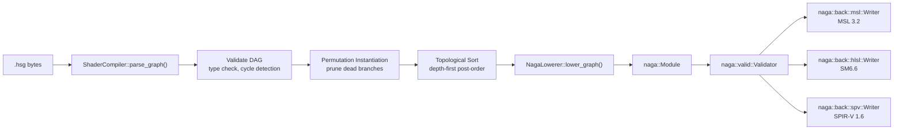

# Harmonius - Shader Generation API

This document is the authoritative reference for the `harmonius-shaders` public
crate. The crate compiles visual shader graph files (`.hsg`) into
platform-native shader code via the Naga intermediate representation. No
hand-authored HLSL, MSL, or GLSL exists anywhere in the Harmonius codebase;
Naga is the sole shader IR (assumption TOOL-1).

---

## 1. Shader Graph File Format (`.hsg`)

### 1.1 Overview

A `.hsg` file is a serialized `ShaderGraphFile` struct. The canonical
on-disk encoding is MessagePack (assumption TOOL-2): compact, binary,
deterministic, and diffable with appropriate tooling. A JSON sidecar is
optionally emitted by authoring tools for human readability.

The file describes a directed acyclic graph of typed nodes connected by typed
edges. The compiler reads the file, validates the DAG, then lowers it to a
`naga::Module`.

### 1.2 Top-Level Schema

```rust
/// Root structure for a serialized shader graph file.
///
/// Serialized as MessagePack on disk. Field names map directly to MessagePack
/// keys. The graph UUID uniquely identifies a shader graph across the asset
/// database and is used as the cache key for compiled shader variants.
#[derive(Debug, Clone, PartialEq, serde::Serialize, serde::Deserialize)]
pub struct ShaderGraphFile {
    /// Bumped on breaking format changes. Current version: 1.
    pub format_version: u32,

    /// RFC 4122 UUID v4 identifying this graph. Generated by the authoring
    /// tool on creation; never regenerated on save unless the user explicitly
    /// resets it.
    pub graph_uuid: uuid::Uuid,

    /// Declared permutation axes. Each key contributes one or more bits to
    /// `PermutationKey`. The compiler generates one `naga::Module` per unique
    /// combination of active permutation keys that is actually reachable from
    /// a `MaterialOutput` node.
    pub permutations: Vec<PermutationAxis>,

    /// All nodes in the graph, in arbitrary order. The compiler performs its
    /// own topological sort.
    pub nodes: Vec<ShaderNode>,

    /// All directed data edges. Each edge transfers data from one node output
    /// slot to one node input slot.
    pub edges: Vec<Edge>,

    /// Authoring-tool metadata. Not consumed by the compiler; preserved
    /// round-trip through serialization.
    pub metadata: GraphMetadata,
}
```

### 1.3 Permutation Axes

```rust
/// One axis of shader permutation (e.g., "ALPHA_MODE").
///
/// The compiler assigns each axis a contiguous bit range within the 64-bit
/// `PermutationKey`. Axes with `variant_count == 2` occupy one bit; axes with
/// more variants occupy `ceil(log2(variant_count))` bits.
#[derive(Debug, Clone, PartialEq, serde::Serialize, serde::Deserialize)]
pub struct PermutationAxis {
    /// Stable string identifier (e.g., "ALPHA_MODE", "QUALITY_TIER").
    pub key: String,

    /// Human-readable variant labels in index order (index 0 = bit pattern 0).
    pub variants: Vec<String>,

    /// Index of the variant active at compile time when no runtime selection
    /// has been provided. Defaults to 0.
    pub default_variant: u32,
}
```

### 1.4 Node Schema

```rust
/// A single node in the shader graph.
#[derive(Debug, Clone, PartialEq, serde::Serialize, serde::Deserialize)]
pub struct ShaderNode {
    /// Unique identifier for this node within the graph. Used as the source
    /// and destination in `Edge` references. Stable across saves.
    pub uuid: uuid::Uuid,

    /// Discriminant selecting the node's behavior and slot signature.
    pub kind: NodeKind,

    /// Schema version for this specific node kind. Allows the compiler to
    /// migrate older node data when the node kind evolves.
    pub version: u32,

    /// Default (constant) values for input slots that are not connected to any
    /// edge. The compiler uses these as literal constants in the generated IR.
    /// Indexed by slot index. Missing entries use the slot's own default.
    pub input_defaults: Vec<SlotDefault>,

    /// 2-D position in the authoring canvas (pixels). Not used by the compiler.
    pub canvas_position: [f32; 2],

    /// Optional user-supplied display label override. Does not affect semantics.
    pub label: Option<String>,
}

/// Default value for a single input slot.
#[derive(Debug, Clone, PartialEq, serde::Serialize, serde::Deserialize)]
pub struct SlotDefault {
    pub slot_index: u32,
    pub value: SlotValue,
}
```

### 1.5 Edge Schema

```rust
/// A directed data edge from one node output slot to one node input slot.
///
/// Slot indices are 0-based and defined by each `NodeKind`'s slot signature.
/// The compiler validates that the source slot type is compatible with the
/// destination slot type before lowering. Implicit casts (e.g., Scalar ->
/// Vec3 splat) are performed automatically during lowering.
#[derive(Debug, Clone, PartialEq, serde::Serialize, serde::Deserialize)]
pub struct Edge {
    /// UUID of the node that produces the value (the "upstream" node).
    pub src_node_uuid: uuid::Uuid,

    /// Output slot index on `src_node_uuid`.
    pub src_slot_idx: u32,

    /// UUID of the node that consumes the value (the "downstream" node).
    pub dst_node_uuid: uuid::Uuid,

    /// Input slot index on `dst_node_uuid`.
    pub dst_slot_idx: u32,
}
```

### 1.6 Authoring Metadata

```rust
/// Authoring-tool metadata attached to the graph. Round-tripped through
/// serialization but never inspected by the shader compiler.
#[derive(Debug, Clone, PartialEq, serde::Serialize, serde::Deserialize)]
pub struct GraphMetadata {
    /// Display name shown in the authoring tool's asset browser.
    pub display_name: String,

    /// Free-form description entered by the artist.
    pub description: Option<String>,

    /// ISO 8601 timestamp of the last authoring-tool save.
    pub last_modified: Option<String>,

    /// Version string of the authoring tool that produced this file.
    pub tool_version: Option<String>,

    /// Arbitrary key-value pairs for pipeline-specific extensions.
    pub user_properties: std::collections::HashMap<String, String>,
}
```

### 1.7 Slot Type System

Every input and output slot on every node carries a `SlotType`. The compiler
enforces type compatibility on edges and inserts implicit casts where allowed.

```rust
/// The type carried by a shader graph edge or node slot.
///
/// Implicit cast rules (source -> destination):
///   Scalar  -> Vec2  : splat (x, x)
///   Scalar  -> Vec3  : splat (x, x, x)
///   Scalar  -> Vec4  : splat (x, x, x, x)
///   Vec3    -> Vec4  : extend with w = 1.0
///   Vec4    -> Vec3  : xyz swizzle
///   Vec2    -> Vec3  : extend with z = 0.0
///   Bool    -> Scalar: select(0.0, 1.0, b)
///
/// All other mismatched types are a compile error.
#[derive(Debug, Clone, Copy, PartialEq, Eq, Hash,
         serde::Serialize, serde::Deserialize)]
pub enum SlotType {
    /// A single f32.
    Scalar,

    /// A 2-component f32 vector.
    Vec2,

    /// A 3-component f32 vector.
    Vec3,

    /// A 4-component f32 vector.
    Vec4,

    /// A 3x3 column-major f32 matrix.
    Mat3,

    /// A 4x4 column-major f32 matrix.
    Mat4,

    /// An opaque sampler state handle (wrap/filter/aniso configuration).
    Sampler,

    /// A 2-D texture resource handle (bindless index).
    Texture2D,

    /// A 3-D texture resource handle (bindless index).
    Texture3D,

    /// A cube-map texture resource handle (bindless index).
    TextureCube,

    /// A boolean (u32 in the generated IR, 0 or 1).
    Bool,
}
```

### 1.8 Slot Value (Typed Constants)

Constant input values embedded in `SlotDefault` entries use `SlotValue`:

```rust
/// A typed constant value for a disconnected input slot.
///
/// The variant must match the slot's `SlotType`. A mismatch is a validation
/// error.
#[derive(Debug, Clone, PartialEq, serde::Serialize, serde::Deserialize)]
pub enum SlotValue {
    Scalar(f32),
    Vec2([f32; 2]),
    Vec3([f32; 3]),
    Vec4([f32; 4]),
    Mat3([f32; 9]),
    Mat4([f32; 16]),
    Bool(bool),

    /// An inline sampler state constant. Most slots use a node-graph-level
    /// SamplerState node instead; this variant covers simple baked cases.
    Sampler(InlineSamplerDesc),

    /// A bindless texture handle baked at graph-compile time. Only valid for
    /// slots typed `Texture2D`, `Texture3D`, or `TextureCube`. At runtime this
    /// is resolved to a `u32` descriptor heap index.
    TextureHandle(u64),
}

/// An inline sampler descriptor for baked sampler constants.
#[derive(Debug, Clone, PartialEq, serde::Serialize, serde::Deserialize)]
pub struct InlineSamplerDesc {
    pub address_mode_u: AddressMode,
    pub address_mode_v: AddressMode,
    pub address_mode_w: AddressMode,
    pub min_filter: FilterMode,
    pub mag_filter: FilterMode,
    pub mip_filter: FilterMode,
    pub max_anisotropy: u8,
    pub border_color: [f32; 4],
    pub lod_bias: f32,
    pub lod_min: f32,
    pub lod_max: f32,
}

#[derive(Debug, Clone, Copy, PartialEq, Eq,
         serde::Serialize, serde::Deserialize)]
pub enum AddressMode {
    Repeat,
    MirrorRepeat,
    ClampToEdge,
    ClampToBorder,
    MirrorClampToEdge,
}

#[derive(Debug, Clone, Copy, PartialEq, Eq,
         serde::Serialize, serde::Deserialize)]
pub enum FilterMode {
    Nearest,
    Linear,
}
```

---

## 2. Public Shader Compiler API (`harmonius-shaders` crate)

The `harmonius-shaders` crate is a standalone public Rust crate. It has no
dependency on any backend crate. Its only graphics dependency is `naga`.

### 2.1 `NodeKind` Enum

`NodeKind` is the discriminant that selects a node's slot signature and its
lowering behavior in the `NagaLowerer`. Every node kind in the built-in
library is a variant here. Third-party node kinds from the `NodeRegistry`
use the `Custom` variant.

```rust
/// Discriminant for all shader graph node types.
///
/// The slot signatures (input count, output count, types) for every variant
/// are defined in `NodeRegistry::builtin()` and documented in Section 4.
#[derive(Debug, Clone, PartialEq, serde::Serialize, serde::Deserialize)]
pub enum NodeKind {
    // -----------------------------------------------------------------------
    // Math nodes
    // -----------------------------------------------------------------------

    /// Add two values of the same type. Supports Scalar, Vec2, Vec3, Vec4.
    Add,
    /// Subtract B from A.
    Subtract,
    /// Component-wise multiplication.
    Multiply,
    /// Component-wise division. Division by zero produces 0.
    Divide,
    /// Fused multiply-add: A * B + C.
    MultiplyAdd,
    /// Linear interpolation: A + (B - A) * T.
    Lerp,
    /// Clamp(Value, Min, Max).
    Clamp,
    /// Saturate: Clamp(Value, 0.0, 1.0).
    Saturate,
    /// Absolute value.
    Abs,
    /// Negate: -Value.
    Negate,
    /// Minimum of two values.
    Min,
    /// Maximum of two values.
    Max,
    /// Raise Base to Exponent.
    Pow,
    /// Natural logarithm.
    Log,
    /// Base-2 logarithm.
    Log2,
    /// e^Value.
    Exp,
    /// 2^Value.
    Exp2,
    /// Square root.
    Sqrt,
    /// Inverse square root.
    InverseSqrt,
    /// Floor toward negative infinity.
    Floor,
    /// Ceiling toward positive infinity.
    Ceil,
    /// Round to nearest integer.
    Round,
    /// Fractional part: Value - floor(Value).
    Fract,
    /// Sign: -1.0, 0.0, or 1.0.
    Sign,
    /// Step: 0 if Value < Edge, else 1.
    Step,
    /// Smooth Hermite step between Edge0 and Edge1.
    Smoothstep,
    /// Sine.
    Sin,
    /// Cosine.
    Cos,
    /// Tangent.
    Tan,
    /// Arc sine.
    Asin,
    /// Arc cosine.
    Acos,
    /// Arc tangent of Y/X (atan2).
    Atan2,
    /// Modulo (GLSL mod semantics: sign follows divisor).
    Mod,
    /// Dot product of two vectors.
    Dot,
    /// Cross product of two Vec3 values.
    Cross,
    /// Normalize a vector to unit length.
    Normalize,
    /// Euclidean length of a vector.
    Length,
    /// Distance between two points.
    Distance,
    /// Reflect a vector around a normal.
    Reflect,
    /// Refract a vector through a surface.
    Refract,
    /// Construct a Vec2 from two Scalars.
    MakeVec2,
    /// Construct a Vec3 from three Scalars, or a Vec2 + Scalar.
    MakeVec3,
    /// Construct a Vec4 from four Scalars, a Vec3 + Scalar, or a Vec2 + Vec2.
    MakeVec4,
    /// Extract X component.
    SplitX,
    /// Extract Y component.
    SplitY,
    /// Extract Z component.
    SplitZ,
    /// Extract W component.
    SplitW,
    /// Swizzle: reorder/repeat components. Parameters encoded in node data.
    Swizzle { components: [SwizzleComponent; 4], output_width: u8 },
    /// Matrix-vector multiply: Mat4 * Vec4.
    MatVecMul,
    /// Matrix-matrix multiply.
    MatMul,
    /// Transpose a matrix.
    Transpose,
    /// Inverse of a 4x4 matrix (numerically).
    Inverse,
    /// Select: if Cond then A else B.
    Select,
    /// Boolean AND.
    And,
    /// Boolean OR.
    Or,
    /// Boolean NOT.
    Not,
    /// Equal comparison (returns Bool).
    Equal,
    /// Not-equal comparison (returns Bool).
    NotEqual,
    /// Less-than comparison (returns Bool).
    LessThan,
    /// Less-than-or-equal comparison (returns Bool).
    LessEqual,
    /// Greater-than comparison (returns Bool).
    GreaterThan,
    /// Greater-than-or-equal comparison (returns Bool).
    GreaterEqual,
    /// Remap a value from [InMin, InMax] to [OutMin, OutMax].
    Remap,

    // -----------------------------------------------------------------------
    // Texture nodes
    // -----------------------------------------------------------------------

    /// Sample a 2-D texture at explicit UV coordinates with an optional LOD bias.
    Sample2D,
    /// Sample a cube-map texture with a 3-D direction vector.
    SampleCube,
    /// Sample a 3-D texture at a UVW coordinate.
    Sample3D,
    /// Sample a 2-D texture at an explicit mip level (no implicit derivatives).
    Sample2DLod,
    /// Sample a 2-D texture with an explicit gradient (ddx/ddy).
    Sample2DGrad,
    /// Compute the number of mip levels in a 2-D texture.
    TextureMipCount,
    /// Compute the texel dimensions of a given mip level.
    TextureDimensions,
    /// Unpack a normal map texel (BC5 or RGBA8) from tangent-space [0,1] to
    /// signed [-1,1]. Handles both 2-channel (RG) and 3-channel (RGB) normals.
    NormalUnpack,
    /// Sample a 2-D texture and immediately unpack as a normal map.
    SampleNormal2D,
    /// Sample a texture and decode from sRGB to linear color space.
    Sample2DSrgb,
    /// A named 2-D texture parameter exposed to the material system at runtime.
    TextureParam2D { param_name: String },
    /// A named cube-map texture parameter.
    TextureParamCube { param_name: String },
    /// A named 3-D texture parameter.
    TextureParam3D { param_name: String },
    /// A named sampler-state parameter.
    SamplerParam { param_name: String },

    // -----------------------------------------------------------------------
    // PBR nodes
    // -----------------------------------------------------------------------

    /// GGX NDF (Normal Distribution Function): D(h).
    GgxNdf,
    /// GGX geometry-masking term: G(l, v, h).
    GgxGeometry,
    /// Schlick approximation to Fresnel reflectance: F(v, h).
    FresnelSchlick,
    /// Full Cook-Torrance specular BRDF (D * G * F / (4 * NdotL * NdotV)).
    CookTorrance,
    /// Lambertian diffuse BRDF (albedo / pi).
    LambertDiffuse,
    /// Lambertian diffuse with an energy conservation correction for metals.
    DiffuseBRDF,
    /// Evaluate an irradiance environment map for diffuse GI.
    IrradianceSample,
    /// Pre-filtered environment map lookup for specular IBL.
    SpecularIBL,
    /// BRDF integration LUT lookup (split-sum approximation).
    BRDFIntegrationLUT,
    /// Full PBR surface evaluation (combines Cook-Torrance + Lambert + IBL).
    PBRSurface,
    /// Clearcoat BRDF layer (additional GGX lobe with fixed IOR 1.5).
    Clearcoat,
    /// Anisotropic GGX NDF (Burley's parameterization).
    AnisotropicGgxNdf,
    /// Sheen BRDF (fabric and cloth surfaces).
    SheenBRDF,
    /// Subsurface transmittance approximation (thin-slab model).
    SubsurfaceTransmittance,
    /// Convert world-space normal to tangent-space using TBN matrix.
    WorldToTangentNormal,
    /// Construct TBN matrix from per-vertex tangent and bitangent.
    TBNMatrix,
    /// Linearize a roughness value (perceptual -> alpha).
    RoughnessLinearize,
    /// Convert metallic-roughness to F0 and diffuse color.
    MetallicRoughnessToF0,

    // -----------------------------------------------------------------------
    // Utility nodes
    // -----------------------------------------------------------------------

    /// Current frame time in seconds (f32, wraps at ~13 hours).
    Time,
    /// Delta time for the current frame in seconds.
    DeltaTime,
    /// Screen-space UV coordinates of the current fragment, in [0, 1].
    ScreenUV,
    /// World-space position of the current fragment/vertex.
    WorldPosition,
    /// World-space normal of the current fragment/vertex.
    WorldNormal,
    /// World-space tangent vector.
    WorldTangent,
    /// World-space bitangent vector.
    WorldBitangent,
    /// Camera/view-space position of the current fragment.
    ViewPosition,
    /// Normalized view direction from fragment toward camera.
    ViewDirection,
    /// Camera world-space position (eye point).
    CameraPosition,
    /// Near-plane distance of the current camera.
    CameraNear,
    /// Far-plane distance of the current camera.
    CameraFar,
    /// Primary mesh UV set (TEXCOORD_0), Vec2.
    UV0,
    /// Secondary mesh UV set (TEXCOORD_1), Vec2.
    UV1,
    /// Per-vertex color, Vec4.
    VertexColor,
    /// Screen-pixel coordinates of the current fragment (vec2 of integers).
    ScreenPosition,
    /// Normalized device coordinates of the current fragment, in [-1, 1]^2.
    NDC,
    /// Raw depth buffer value at the current fragment.
    Depth,
    /// Linear eye-space depth of the current fragment.
    LinearDepth,
    /// Fresnel blend factor: pow(1 - saturate(dot(N, V)), Power).
    FresnelFactor,
    /// Boolean flag: is the current fragment on a front face?
    IsFrontFace,
    /// Instance ID of the current draw call (u32 cast to Scalar).
    InstanceID,
    /// Bindless descriptor index for the primary albedo texture of the current
    /// material, resolved at runtime. Useful for custom sampling logic.
    MaterialAlbedoIndex,
    /// A named scalar parameter exposed to the material system at runtime.
    ScalarParam { param_name: String, default_value: f32 },
    /// A named Vec4 parameter exposed to the material system at runtime.
    Vec4Param { param_name: String, default_value: [f32; 4] },
    /// A named boolean parameter.
    BoolParam { param_name: String, default_value: bool },
    /// A constant scalar literal.
    ConstScalar { value: f32 },
    /// A constant Vec2 literal.
    ConstVec2 { value: [f32; 2] },
    /// A constant Vec3 literal.
    ConstVec3 { value: [f32; 3] },
    /// A constant Vec4 literal.
    ConstVec4 { value: [f32; 4] },
    /// A constant boolean literal.
    ConstBool { value: bool },
    /// A permutation branch: emits one of two code paths depending on the
    /// active `PermutationKey` bit. Only valid as a top-level graph node;
    /// cannot appear inside a sub-expression.
    PermutationSwitch { axis_key: String },

    // -----------------------------------------------------------------------
    // Material output nodes
    // -----------------------------------------------------------------------

    /// PBR surface material output. Drives the standard GGX/Cook-Torrance
    /// lighting pipeline. Exactly one node of this kind must be present in any
    /// surface shader graph.
    SurfaceOutput,
    /// Unlit material output. Color is written directly to the render target
    /// with no lighting evaluation.
    UnlitOutput,
    /// Fully custom output for advanced materials. Accepts raw `out_color` and
    /// `out_depth` overrides. Used for special-case passes (e.g., decals,
    /// custom shading models).
    CustomOutput { output_semantics: Vec<CustomOutputSemantic> },

    // -----------------------------------------------------------------------
    // Custom / extension nodes
    // -----------------------------------------------------------------------

    /// A node implemented by a third-party `NodeImpl` registered in the
    /// `NodeRegistry`. The `kind_id` string must match a registered key.
    Custom { kind_id: String },
}

/// One component of a swizzle operation.
#[derive(Debug, Clone, Copy, PartialEq, Eq,
         serde::Serialize, serde::Deserialize)]
pub enum SwizzleComponent { X, Y, Z, W }

/// Semantic tag for a custom output slot.
#[derive(Debug, Clone, PartialEq, serde::Serialize, serde::Deserialize)]
pub struct CustomOutputSemantic {
    pub name: String,
    pub slot_type: SlotType,
    pub render_target_index: u32,
}
```

### 2.2 `PermutationKey`

```rust
use bitflags::bitflags;

bitflags! {
    /// A 64-bit bitfield encoding the active permutation variant for every
    /// `PermutationAxis` declared in a `ShaderGraphFile`.
    ///
    /// Bit assignments are computed at compile time from the ordered list of
    /// `PermutationAxis` entries: axis 0 occupies the lowest bits, axis N the
    /// highest. The number of bits consumed by axis i is
    /// `ceil(log2(axis_i.variants.len().max(2)))`.
    ///
    /// The zero key (all bits clear) selects variant index 0 on every axis,
    /// which corresponds to each axis's `default_variant`.
    #[derive(Debug, Clone, Copy, PartialEq, Eq, Hash,
             serde::Serialize, serde::Deserialize)]
    pub struct PermutationKey: u64 {
        // Bit fields are dynamically computed per graph; this type is used as
        // an opaque 64-bit token at API boundaries. Concrete bit positions are
        // documented in `CompileResult::permutation_bit_layout`.
        const _ = !0;
    }
}

impl Default for PermutationKey {
    fn default() -> Self {
        PermutationKey::empty()
    }
}
```

### 2.3 `CompileTarget`

```rust
/// Identifies the platform-specific backend and version to target.
///
/// The compiler uses this to configure the Naga backend writer and to apply
/// platform-specific workarounds.
#[derive(Debug, Clone, PartialEq, Eq, Hash,
         serde::Serialize, serde::Deserialize)]
pub struct CompileTarget {
    pub api: ApiBackend,
    pub version: BackendVersion,
    pub feature_flags: CompileFeatureFlags,
}

/// The GPU API backend to target.
#[derive(Debug, Clone, Copy, PartialEq, Eq, Hash,
         serde::Serialize, serde::Deserialize)]
pub enum ApiBackend {
    /// Metal Shading Language for the Metal 4 API.
    Metal,
    /// HLSL for Direct3D 12 / Shader Model 6.x.
    Hlsl,
    /// SPIR-V for Vulkan.
    SpirV,
}

/// Backend-specific version selector.
#[derive(Debug, Clone, Copy, PartialEq, Eq, Hash,
         serde::Serialize, serde::Deserialize)]
pub enum BackendVersion {
    /// MSL language version. `(3, 2)` = Metal 4 target.
    Msl { major: u8, minor: u8 },
    /// HLSL shader model version. `(6, 6)` = SM6.6.
    Hlsl { major: u8, minor: u8 },
    /// SPIR-V specification version. `(1, 6)` = Vulkan 1.3+.
    SpirV { major: u8, minor: u8 },
}

bitflags! {
    /// Optional compile-time feature flags that affect code generation.
    #[derive(Debug, Clone, Copy, PartialEq, Eq, Hash,
             serde::Serialize, serde::Deserialize)]
    pub struct CompileFeatureFlags: u32 {
        /// Emit bounds-checked array accesses (debug builds only).
        const BOUNDS_CHECKING       = 1 << 0;
        /// Embed source-location debug annotations.
        const DEBUG_ANNOTATIONS     = 1 << 1;
        /// Optimize for minimum register pressure (may increase instruction count).
        const MINIMIZE_REGISTERS    = 1 << 2;
        /// Enable wave/subgroup intrinsics in generated code.
        const WAVE_INTRINSICS       = 1 << 3;
        /// Enable 16-bit float arithmetic (requires hardware support).
        const HALF_PRECISION        = 1 << 4;
        /// Emit [[early_fragment_tests]] / [earlydepthstencil] attributes.
        const EARLY_DEPTH_TEST      = 1 << 5;
    }
}

impl CompileTarget {
    /// Standard target for Metal 4 / MSL 3.2.
    pub fn metal_4() -> Self {
        Self {
            api: ApiBackend::Metal,
            version: BackendVersion::Msl { major: 3, minor: 2 },
            feature_flags: CompileFeatureFlags::empty(),
        }
    }

    /// Standard target for Direct3D 12 / HLSL SM6.6.
    pub fn d3d12_sm66() -> Self {
        Self {
            api: ApiBackend::Hlsl,
            version: BackendVersion::Hlsl { major: 6, minor: 6 },
            feature_flags: CompileFeatureFlags::empty(),
        }
    }

    /// Standard target for Vulkan 1.4 / SPIR-V 1.6.
    pub fn vulkan_1_4() -> Self {
        Self {
            api: ApiBackend::SpirV,
            version: BackendVersion::SpirV { major: 1, minor: 6 },
            feature_flags: CompileFeatureFlags::empty(),
        }
    }
}
```

### 2.4 `CompileRequest`

```rust
/// A request to compile a single permutation of a shader graph.
///
/// One `CompileRequest` produces one `CompileResult`. To compile all
/// permutations for a graph, enumerate permutation keys using
/// `ShaderCompiler::enumerate_permutations()` and submit one request per key.
#[derive(Debug, Clone)]
pub struct CompileRequest {
    /// The parsed, deserialized graph to compile.
    pub graph: ShaderGraphFile,

    /// The permutation variant to compile. Use `PermutationKey::default()` for
    /// graphs with no permutation axes.
    pub permutation: PermutationKey,

    /// The platform/API target.
    pub target: CompileTarget,

    /// If true, emit `ReflectionData` in the result. Adds minor overhead.
    pub emit_reflection: bool,
}
```

### 2.5 `CompileResult`

```rust
/// The output of a successful shader compilation.
#[derive(Debug)]
pub struct CompileResult {
    /// The Naga intermediate representation. Retained for downstream
    /// inspection, further optimization passes, or custom code generation.
    pub naga_module: naga::Module,

    /// The platform-specific shader source or binary blob.
    pub compiled_blob: CompiledBlob,

    /// Reflection metadata describing the shader's resource bindings,
    /// entry points, and typed uniform layout. `None` if
    /// `CompileRequest::emit_reflection` was false.
    pub reflection: Option<ReflectionData>,

    /// Maps each `PermutationAxis` key to the bit range it occupies within a
    /// `PermutationKey`. Useful for constructing runtime permutation selectors.
    pub permutation_bit_layout: Vec<PermutationBitRange>,

    /// Warnings emitted during compilation (type coercions, unused nodes, etc.)
    pub warnings: Vec<CompileWarning>,
}

/// The compiled shader payload. Variant depends on the requested backend.
#[derive(Debug, Clone)]
pub enum CompiledBlob {
    /// MSL source code as UTF-8 text.
    Msl(String),
    /// HLSL source code as UTF-8 text.
    Hlsl(String),
    /// SPIR-V binary (little-endian u32 words).
    SpirV(Vec<u32>),
}

impl CompiledBlob {
    /// Return the raw bytes of the blob (UTF-8 for text, raw words for SPIR-V).
    pub fn as_bytes(&self) -> Vec<u8> { todo!() }
}

/// Describes the bit range a permutation axis occupies within a `PermutationKey`.
#[derive(Debug, Clone, PartialEq, Eq)]
pub struct PermutationBitRange {
    pub axis_key: String,
    /// Index of the lowest bit in the 64-bit key (inclusive).
    pub bit_offset: u8,
    /// Number of bits this axis consumes.
    pub bit_count: u8,
}

/// A non-fatal warning from the compiler.
#[derive(Debug, Clone)]
pub struct CompileWarning {
    pub code: CompileWarningCode,
    pub message: String,
    pub node_uuid: Option<uuid::Uuid>,
}

#[derive(Debug, Clone, Copy, PartialEq, Eq)]
pub enum CompileWarningCode {
    UnusedNode,
    ImplicitTypeCast,
    DisconnectedRequiredInput,
    DeprecatedNodeVersion,
    PerformanceHint,
}
```

### 2.6 `CompileError`

```rust
/// A fatal error that prevents compilation from completing.
#[derive(Debug, thiserror::Error)]
pub enum CompileError {
    /// The `.hsg` file's `format_version` is newer than this compiler supports.
    #[error("unsupported format version {version} (max supported: {max_supported})")]
    UnsupportedFormatVersion { version: u32, max_supported: u32 },

    /// A node references a `NodeKind::Custom` kind ID that is not registered.
    #[error("unknown custom node kind '{kind_id}' on node {node_uuid}")]
    UnknownNodeKind { kind_id: String, node_uuid: uuid::Uuid },

    /// An edge connects slots of incompatible types with no available implicit cast.
    #[error("type mismatch on edge from node {src_node_uuid} slot {src_slot} ({src_type:?}) to node {dst_node_uuid} slot {dst_slot} ({dst_type:?})")]
    TypeMismatch {
        src_node_uuid: uuid::Uuid,
        src_slot: u32,
        src_type: SlotType,
        dst_node_uuid: uuid::Uuid,
        dst_slot: u32,
        dst_type: SlotType,
    },

    /// The graph contains a cycle; the DAG invariant is violated.
    #[error("cycle detected in shader graph involving node {node_uuid}")]
    CycleDetected { node_uuid: uuid::Uuid },

    /// A required input slot has no connected edge and no `input_default`.
    #[error("required input slot {slot_index} on node {node_uuid} ({kind:?}) has no value")]
    MissingRequiredInput {
        node_uuid: uuid::Uuid,
        kind: String,
        slot_index: u32,
    },

    /// The graph contains zero or more than one material output node.
    #[error("shader graph must contain exactly one material output node; found {count}")]
    InvalidOutputNodeCount { count: usize },

    /// A `PermutationSwitch` node references an axis key not declared in
    /// `ShaderGraphFile::permutations`.
    #[error("permutation switch on node {node_uuid} references undeclared axis '{axis_key}'")]
    UndeclaredPermutationAxis { node_uuid: uuid::Uuid, axis_key: String },

    /// The `PermutationKey` supplied in `CompileRequest::permutation` is out of
    /// range for the axes declared in the graph.
    #[error("permutation key {key:?} is out of range for graph {graph_uuid}")]
    PermutationKeyOutOfRange { key: PermutationKey, graph_uuid: uuid::Uuid },

    /// Naga validation of the generated `naga::Module` failed.
    #[error("naga validation failed: {message}")]
    NagaValidation { message: String },

    /// Naga's backend writer failed to emit code for the requested target.
    #[error("naga backend emit failed for {target:?}: {message}")]
    NagaEmit { target: CompileTarget, message: String },

    /// A sampler slot was not connected and no inline sampler was provided,
    /// but the target API requires a bound sampler at compile time.
    #[error("sampler slot {slot_index} on texture node {node_uuid} is unbound and no default was provided")]
    UnboundSampler { node_uuid: uuid::Uuid, slot_index: u32 },

    /// An IO error occurred while reading an `.hsg` file.
    #[error("IO error reading shader graph: {0}")]
    Io(#[from] std::io::Error),

    /// MessagePack deserialization failed.
    #[error("deserialization failed: {0}")]
    Deserialize(String),
}
```

### 2.7 `ReflectionData`

```rust
/// Shader reflection metadata emitted alongside a compiled blob.
///
/// Used by the render graph integration layer to construct PSOs and to wire
/// bindless descriptor indices into the per-draw data buffer without any
/// hand-authored binding declarations.
#[derive(Debug, Clone)]
pub struct ReflectionData {
    /// The name and stage of each entry point in the compiled module.
    pub entry_points: Vec<EntryPointInfo>,

    /// Bindless texture parameters declared by `TextureParam*` nodes.
    pub texture_params: Vec<TextureParamBinding>,

    /// Sampler parameters declared by `SamplerParam` nodes.
    pub sampler_params: Vec<SamplerParamBinding>,

    /// Scalar/Vec4/Bool runtime material parameters declared by `*Param` nodes.
    pub material_params: Vec<MaterialParamBinding>,

    /// Platform-specific binding slots for built-in uniform blocks (camera,
    /// time, per-draw data, bindless heap root).
    pub builtin_bindings: BuiltinBindings,

    /// Estimated register usage per stage (informational; may be None if the
    /// backend does not report this).
    pub register_usage: Option<RegisterUsage>,
}

/// An entry point in the compiled shader.
#[derive(Debug, Clone)]
pub struct EntryPointInfo {
    pub name: String,
    pub stage: ShaderStage,
}

#[derive(Debug, Clone, Copy, PartialEq, Eq)]
pub enum ShaderStage {
    Vertex,
    Fragment,
    Compute,
    Mesh,
    Task,
}

/// A bindless texture parameter that must be populated from the material asset
/// at runtime.
#[derive(Debug, Clone)]
pub struct TextureParamBinding {
    /// Matches `TextureParam*.param_name` in the graph.
    pub name: String,
    pub texture_type: SlotType,
    /// Index into the per-material parameter block where the u32 bindless
    /// descriptor index for this texture should be written.
    pub param_block_offset: u32,
}

/// A sampler parameter that must be resolved at runtime.
#[derive(Debug, Clone)]
pub struct SamplerParamBinding {
    pub name: String,
    /// Binding slot index within the sampler descriptor table (D3D12/Vulkan).
    /// For Metal, this is a slot in the argument buffer.
    pub binding_slot: u32,
}

/// A typed scalar/vector/bool parameter that is patched into the per-material
/// uniform block at runtime.
#[derive(Debug, Clone)]
pub struct MaterialParamBinding {
    pub name: String,
    pub value_type: SlotType,
    pub param_block_offset: u32,
    pub default_value: SlotValue,
}

/// Platform binding indices for the built-in uniform/resource blocks that
/// every Harmonius shader expects to find pre-bound.
#[derive(Debug, Clone)]
pub struct BuiltinBindings {
    /// Binding for the per-frame camera/time uniform buffer.
    pub frame_uniforms: BindingLocation,
    /// Binding for the per-draw data buffer (mesh index, material index, etc.).
    pub draw_data: BindingLocation,
    /// Binding for the root of the bindless resource heap.
    pub bindless_heap_root: BindingLocation,
    /// Binding for the bindless sampler heap (Vulkan/D3D12 only; None for Metal).
    pub bindless_sampler_heap: Option<BindingLocation>,
}

/// A platform-specific binding location for a resource.
#[derive(Debug, Clone)]
pub struct BindingLocation {
    /// `set` index (Vulkan) / `space` index (HLSL) / argument buffer index (MSL).
    pub set: u32,
    /// `binding` index (Vulkan/HLSL) / `index` (MSL).
    pub binding: u32,
}

/// Estimated register/resource usage per shader stage.
#[derive(Debug, Clone)]
pub struct RegisterUsage {
    pub vertex_gprs: Option<u32>,
    pub fragment_gprs: Option<u32>,
    pub fragment_interpolants: Option<u32>,
    pub compute_threads_per_threadgroup: Option<[u32; 3]>,
}
```

### 2.8 `ShaderCompiler`

```rust
/// The primary entry point for the `harmonius-shaders` crate.
///
/// `ShaderCompiler` is stateless between calls (all state lives in the
/// `NodeRegistry`) and is safe to share across threads. Construct once and
/// clone freely.
#[derive(Clone)]
pub struct ShaderCompiler {
    registry: std::sync::Arc<NodeRegistry>,
}

impl ShaderCompiler {
    /// Create a new compiler using the built-in node registry.
    pub fn new() -> Self { todo!() }

    /// Create a new compiler using a custom registry (built-in nodes plus any
    /// registered third-party nodes).
    pub fn with_registry(registry: NodeRegistry) -> Self { todo!() }

    /// Compile one permutation of a shader graph to a platform-native blob.
    ///
    /// This is the primary compilation entry point. All validation, lowering,
    /// and backend emission occur within this call. The call is CPU-only and
    /// has no GPU side effects.
    ///
    /// # Errors
    /// Returns `CompileError` for any fatal issue. Warnings are non-fatal and
    /// are returned inside `CompileResult::warnings`.
    pub fn compile(&self, request: CompileRequest) -> Result<CompileResult, CompileError> {
        todo!()
    }

    /// Validate a shader graph without producing a compiled blob.
    ///
    /// Performs all type-checking and structural validation steps but stops
    /// before Naga lowering. Use this to provide fast feedback in the authoring
    /// tool without running the full compiler pipeline.
    ///
    /// Returns a list of validation errors (empty means valid). Warnings are
    /// also returned alongside errors.
    pub fn validate(
        &self,
        graph: &ShaderGraphFile,
    ) -> (Vec<CompileError>, Vec<CompileWarning>) {
        todo!()
    }

    /// Enumerate all valid permutation keys for a graph.
    ///
    /// Returns every unique `PermutationKey` value that corresponds to at
    /// least one distinct code path through the graph. Graphs with no
    /// permutation axes return exactly one key: `PermutationKey::default()`.
    pub fn enumerate_permutations(&self, graph: &ShaderGraphFile) -> Vec<PermutationKey> {
        todo!()
    }

    /// Extract reflection data from an already-compiled `naga::Module`.
    ///
    /// Useful when the caller has cached the `naga::Module` and wants to
    /// re-derive reflection without recompiling (e.g., after a hot-reload of
    /// the `.hsg` file reveals only metadata changes).
    pub fn get_reflection(
        &self,
        module: &naga::Module,
        graph: &ShaderGraphFile,
    ) -> Result<ReflectionData, CompileError> {
        todo!()
    }

    /// Deserialize a `.hsg` file from a byte slice (MessagePack).
    pub fn parse_graph(bytes: &[u8]) -> Result<ShaderGraphFile, CompileError> {
        todo!()
    }

    /// Deserialize a `.hsg` file from the filesystem.
    pub fn load_graph(path: &std::path::Path) -> Result<ShaderGraphFile, CompileError> {
        todo!()
    }

    /// Serialize a `ShaderGraphFile` to MessagePack bytes.
    pub fn serialize_graph(graph: &ShaderGraphFile) -> Result<Vec<u8>, CompileError> {
        todo!()
    }
}

impl Default for ShaderCompiler {
    fn default() -> Self {
        Self::new()
    }
}
```

### 2.9 `NodeRegistry`

```rust
/// Registry of all known node kinds and their slot signatures.
///
/// The built-in registry is populated at construction time with all variants
/// of `NodeKind`. Third-party nodes are registered by providing a `NodeImpl`
/// for a unique `kind_id` string (used in `NodeKind::Custom { kind_id }`).
pub struct NodeRegistry {
    // Internal: maps kind fingerprint to NodeDescriptor + lowering impl.
    inner: std::collections::HashMap<NodeKindKey, Box<dyn NodeImpl>>,
}

impl NodeRegistry {
    /// Construct a registry containing only the built-in nodes.
    pub fn builtin() -> Self { todo!() }

    /// Register a custom third-party node implementation.
    ///
    /// The `kind_id` must be unique within this registry. Attempting to
    /// register a `kind_id` that collides with a built-in name returns an
    /// error.
    ///
    /// # Errors
    /// Returns `Err(String)` with a description if `kind_id` is already
    /// registered.
    pub fn register(
        &mut self,
        kind_id: impl Into<String>,
        node: Box<dyn NodeImpl>,
    ) -> Result<(), String> {
        todo!()
    }

    /// Look up the slot signature for a built-in `NodeKind`.
    pub fn get_signature(&self, kind: &NodeKind) -> Option<&NodeSignature> { todo!() }

    /// Look up the slot signature for a custom node by its kind ID string.
    pub fn get_custom_signature(&self, kind_id: &str) -> Option<&NodeSignature> { todo!() }
}

/// The complete slot signature for a node kind.
#[derive(Debug, Clone)]
pub struct NodeSignature {
    pub inputs: Vec<SlotDescriptor>,
    pub outputs: Vec<SlotDescriptor>,
}

/// Describes one slot on a node.
#[derive(Debug, Clone)]
pub struct SlotDescriptor {
    pub index: u32,
    pub name: &'static str,
    pub slot_type: SlotType,
    pub required: bool,
    pub default_value: Option<SlotValue>,
}

/// Opaque key used as a registry map key.
#[derive(Debug, Clone, PartialEq, Eq, Hash)]
pub struct NodeKindKey(String);

/// Trait that custom node implementations must satisfy.
///
/// Implementing this trait is the extension point for adding custom nodes to
/// the registry. The `lower` method is called by the `NagaLowerer` once per
/// node instance during compilation.
pub trait NodeImpl: Send + Sync {
    /// Return the static slot signature for this node kind.
    fn signature(&self) -> NodeSignature;

    /// Lower this node to Naga expressions.
    ///
    /// `inputs` contains one resolved `naga::Handle<naga::Expression>` per
    /// input slot (in slot-index order). Disconnected optional slots have
    /// `None`.
    ///
    /// The implementation must push any required statements onto `builder` and
    /// return one `naga::Handle<naga::Expression>` per output slot.
    fn lower(
        &self,
        inputs: &[Option<naga::Handle<naga::Expression>>],
        builder: &mut NagaFunctionBuilder<'_>,
    ) -> Result<Vec<naga::Handle<naga::Expression>>, CompileError>;
}
```

---

## 3. Naga Integration Details

### 3.1 Compilation Pipeline



### 3.2 `NagaLowerer`

`NagaLowerer` is an internal type (not public API) that walks the topologically
sorted node list and emits Naga IR. Its public surface is exposed indirectly
via `ShaderCompiler::compile()` and `NodeImpl::lower()`.

```rust
/// Internal lowering context. Exposed to custom `NodeImpl` implementations
/// via `NagaFunctionBuilder`.
///
/// Not part of the public API. Custom nodes interact with Naga through
/// `NagaFunctionBuilder` only.
pub struct NagaFunctionBuilder<'a> {
    /// The module being built.
    pub module: &'a mut naga::Module,
    /// The function body being built.
    pub function: &'a mut naga::Function,
    /// Mutable reference to the current block for statement emission.
    pub block: &'a mut naga::Block,
    /// Resolved binding locations for all built-in resources (camera UBO,
    /// per-draw data, bindless heap root).
    pub builtin_bindings: &'a BuiltinBindings,
    /// The active permutation key for the compilation being performed.
    pub permutation_key: PermutationKey,
}

impl<'a> NagaFunctionBuilder<'a> {
    /// Emit a `Let` statement that names an expression. Returns the expression
    /// handle.
    pub fn emit(&mut self, expr: naga::Expression) -> naga::Handle<naga::Expression> {
        todo!()
    }

    /// Emit a `Store` statement.
    pub fn store(
        &mut self,
        pointer: naga::Handle<naga::Expression>,
        value: naga::Handle<naga::Expression>,
    ) {
        todo!()
    }

    /// Declare a local variable and return a pointer expression to it.
    pub fn local_var(
        &mut self,
        name: &str,
        ty: naga::Handle<naga::Type>,
        init: Option<naga::Handle<naga::Expression>>,
    ) -> naga::Handle<naga::Expression> {
        todo!()
    }

    /// Look up the handle for a Naga type by its `SlotType`.
    pub fn type_handle(&self, slot_type: SlotType) -> naga::Handle<naga::Type> { todo!() }
}
```

### 3.3 How Nodes Lower to `naga::Expression`

Each `NodeKind` variant is lowered to one or more `naga::Expression` nodes
during the `NagaLowerer` pass. The general pattern is:

| NodeKind category | Naga Expression variant(s) used |
|---|---|
| `ConstScalar`, `ConstVec*`, `ConstBool` | `naga::Expression::Literal` |
| `Add`, `Subtract`, `Multiply`, etc. | `naga::Expression::Binary` with `naga::BinaryOperator` |
| `Dot`, `Cross`, `Normalize`, `Length` | `naga::Expression::Math` with `naga::MathFunction` |
| `Sqrt`, `Sin`, `Cos`, `Exp`, `Log`, etc. | `naga::Expression::Math` with appropriate `naga::MathFunction` |
| `MakeVec2/3/4` | `naga::Expression::Compose` |
| `SplitX/Y/Z/W` | `naga::Expression::AccessIndex` on a splat or compose |
| `Swizzle` | `naga::Expression::Swizzle` |
| `MatVecMul`, `MatMul` | `naga::Expression::Binary { op: Multiply }` (Naga handles matrix * vector) |
| `Select` | `naga::Expression::Select` |
| `Sample2D`, `Sample2DLod` | `naga::Expression::ImageSample` |
| `Sample2DGrad` | `naga::Expression::ImageSample` with `level: Gradient` |
| `TextureDimensions` | `naga::Expression::ImageQuery { query: Size }` |
| `TextureMipCount` | `naga::Expression::ImageQuery { query: NumLevels }` |
| `Time`, `DeltaTime`, `CameraPosition`, etc. | `naga::Expression::Load` from the built-in frame-uniform global |
| `ScreenUV`, `WorldPosition`, `WorldNormal` | `naga::Expression::FunctionArgument` (built-in fragment inputs) |
| `Lerp` | `naga::Expression::Math { fun: Mix }` |
| `Clamp`, `Saturate` | `naga::Expression::Math { fun: Clamp }` |
| `PermutationSwitch` | Entire dead branch is pruned before lowering; only live branch is emitted |
| `SurfaceOutput` | Assigns fields of the fragment output struct; no expression value |

### 3.4 Platform Output Configuration

The Naga backend writers are configured as follows. Options not listed here
use Naga's defaults.

#### MSL 3.2 (Metal 4)

```rust
naga::back::msl::Options {
    lang_version: (3, 2),
    // Bindless resources are accessed via an argument buffer passed at
    // buffer binding 0, set 0. The Metal 4 runtime pre-binds this before
    // any draw call.
    per_stage_map: naga::back::msl::PerStageResources {
        resources: bindless_argument_buffer_map(),
        // ...
    },
    spirv_cross_compatibility: false,
    fake_missing_bindings: false,
    // Reverse-Z depth: emit [[ depth(less) ]] fragment output qualifier.
    // Harmonius always uses reverse-Z (assumption ARCH-4).
    force_point_size: false,
    // ...
}
```

#### HLSL SM6.6 (Direct3D 12)

```rust
naga::back::hlsl::Options {
    shader_model: naga::back::hlsl::ShaderModel::V6_6,
    // Root signature uses SM6.6 ResourceDescriptorHeap directly (bindless).
    // No explicit register declarations; all access is through
    // ResourceDescriptorHeap[index] in the generated HLSL.
    binding_map: hlsl_binding_map_for_harmonius(),
    // ...
}
```

#### SPIR-V 1.6 (Vulkan 1.4)

```rust
naga::back::spv::Options {
    lang_version: (1, 6),
    // VK_EXT_descriptor_indexing: UPDATE_AFTER_BIND, PARTIALLY_BOUND flags.
    // Bindless heap is descriptor set 0, binding 0 (variable-count array).
    flags: naga::back::spv::WriterFlags::ADJUST_COORDINATE_SPACE
        | naga::back::spv::WriterFlags::LABEL_VARYINGS,
    capabilities: Some(std::collections::HashSet::from([
        spirv::Capability::RuntimeDescriptorArray,
        spirv::Capability::SampledImageArrayNonUniformIndexing,
        spirv::Capability::StorageImageArrayNonUniformIndexing,
    ])),
    // ...
}
```

### 3.5 Bindless Resource Model in Naga IR

All resource accesses in Harmonius shaders go through a single bindless heap
rather than per-draw descriptor sets. In the Naga IR this is represented as a
global variable of array type:

```rust
// Conceptual Naga IR globals emitted by NagaLowerer for every shader.
// Exact handles are assigned by the lowerer.

// Set 0, Binding 0: Variable-length array of all 2-D textures.
naga::GlobalVariable {
    name: Some("bindless_textures_2d".into()),
    space: naga::AddressSpace::Handle,
    binding: Some(naga::ResourceBinding { group: 0, binding: 0 }),
    ty: /* array<texture_2d<f32>, MAX_BINDLESS> */,
    init: None,
}

// Set 0, Binding 1: Variable-length array of all cube textures.
naga::GlobalVariable {
    name: Some("bindless_textures_cube".into()),
    space: naga::AddressSpace::Handle,
    binding: Some(naga::ResourceBinding { group: 0, binding: 1 }),
    ty: /* array<texture_cube<f32>, MAX_BINDLESS> */,
    init: None,
}

// Set 0, Binding 2: Variable-length array of all 3-D textures.
naga::GlobalVariable {
    name: Some("bindless_textures_3d".into()),
    space: naga::AddressSpace::Handle,
    binding: Some(naga::ResourceBinding { group: 0, binding: 2 }),
    ty: /* array<texture_3d<f32>, MAX_BINDLESS> */,
    init: None,
}

// Set 1, Binding 0: Per-frame uniform buffer (camera, time, etc.)
naga::GlobalVariable {
    name: Some("frame_uniforms".into()),
    space: naga::AddressSpace::Uniform,
    binding: Some(naga::ResourceBinding { group: 1, binding: 0 }),
    ty: /* FrameUniforms struct */,
    init: None,
}

// Set 2, Binding 0: Per-draw data buffer (bindless texture indices, etc.)
naga::GlobalVariable {
    name: Some("draw_data".into()),
    space: naga::AddressSpace::Uniform,
    binding: Some(naga::ResourceBinding { group: 2, binding: 0 }),
    ty: /* DrawData struct */,
    init: None,
}
```

When a `Sample2D` node is lowered, it emits:

```rust
// Pseudocode showing the Naga expression sequence emitted for Sample2D:
// 1. Load the bindless index from draw_data.
let index_expr = builder.emit(naga::Expression::Load {
    pointer: /* draw_data.albedo_idx pointer */
});
// 2. Index into the bindless texture array.
let texture_expr = builder.emit(naga::Expression::Access {
    base: /* bindless_textures_2d handle */,
    index: index_expr,
});
// 3. Emit the ImageSample expression.
let sample_expr = builder.emit(naga::Expression::ImageSample {
    image: texture_expr,
    sampler: /* sampler handle */,
    gather: None,
    coordinate: /* uv input expression */,
    array_index: None,
    offset: None,
    level: naga::SampleLevel::Auto,
    depth_ref: None,
});
```

---

## 4. Built-in Shader Node Library

The following table documents every built-in node. "Inputs" and "Outputs"
columns list slots in index order as `name: Type`. A `*` suffix on a type
denotes that an implicit cast from a narrower compatible type is accepted.

### 4.1 Math Nodes

| Node | Inputs | Outputs | Notes |
|---|---|---|---|
| `Add` | `a: Vec4*`, `b: Vec4*` | `result: Vec4*` | Scalar, Vec2, Vec3, Vec4 all valid |
| `Subtract` | `a: Vec4*`, `b: Vec4*` | `result: Vec4*` | |
| `Multiply` | `a: Vec4*`, `b: Vec4*` | `result: Vec4*` | Component-wise |
| `Divide` | `a: Vec4*`, `b: Vec4*` | `result: Vec4*` | Div-by-zero yields 0 |
| `MultiplyAdd` | `a: Vec4*`, `b: Vec4*`, `c: Vec4*` | `result: Vec4*` | FMA: a*b+c |
| `Lerp` | `a: Vec4*`, `b: Vec4*`, `t: Scalar` | `result: Vec4*` | |
| `Clamp` | `value: Vec4*`, `min: Vec4*`, `max: Vec4*` | `result: Vec4*` | |
| `Saturate` | `value: Vec4*` | `result: Vec4*` | Clamp to [0,1] |
| `Abs` | `value: Vec4*` | `result: Vec4*` | |
| `Negate` | `value: Vec4*` | `result: Vec4*` | |
| `Min` | `a: Vec4*`, `b: Vec4*` | `result: Vec4*` | |
| `Max` | `a: Vec4*`, `b: Vec4*` | `result: Vec4*` | |
| `Pow` | `base: Scalar`, `exp: Scalar` | `result: Scalar` | |
| `Log` | `value: Scalar` | `result: Scalar` | Natural log |
| `Log2` | `value: Scalar` | `result: Scalar` | |
| `Exp` | `value: Scalar` | `result: Scalar` | e^x |
| `Exp2` | `value: Scalar` | `result: Scalar` | 2^x |
| `Sqrt` | `value: Scalar` | `result: Scalar` | |
| `InverseSqrt` | `value: Scalar` | `result: Scalar` | 1/sqrt(x) |
| `Floor` | `value: Vec4*` | `result: Vec4*` | |
| `Ceil` | `value: Vec4*` | `result: Vec4*` | |
| `Round` | `value: Vec4*` | `result: Vec4*` | |
| `Fract` | `value: Vec4*` | `result: Vec4*` | |
| `Sign` | `value: Vec4*` | `result: Vec4*` | |
| `Step` | `edge: Vec4*`, `value: Vec4*` | `result: Vec4*` | |
| `Smoothstep` | `edge0: Scalar`, `edge1: Scalar`, `value: Scalar` | `result: Scalar` | |
| `Sin` | `angle: Scalar` | `result: Scalar` | Radians |
| `Cos` | `angle: Scalar` | `result: Scalar` | Radians |
| `Tan` | `angle: Scalar` | `result: Scalar` | Radians |
| `Asin` | `value: Scalar` | `result: Scalar` | |
| `Acos` | `value: Scalar` | `result: Scalar` | |
| `Atan2` | `y: Scalar`, `x: Scalar` | `result: Scalar` | |
| `Mod` | `a: Vec4*`, `b: Vec4*` | `result: Vec4*` | GLSL mod semantics |
| `Dot` | `a: Vec4*`, `b: Vec4*` | `result: Scalar` | |
| `Cross` | `a: Vec3`, `b: Vec3` | `result: Vec3` | |
| `Normalize` | `value: Vec4*` | `result: Vec4*` | |
| `Length` | `value: Vec4*` | `result: Scalar` | |
| `Distance` | `a: Vec4*`, `b: Vec4*` | `result: Scalar` | |
| `Reflect` | `incident: Vec3`, `normal: Vec3` | `result: Vec3` | |
| `Refract` | `incident: Vec3`, `normal: Vec3`, `eta: Scalar` | `result: Vec3` | |
| `MakeVec2` | `x: Scalar`, `y: Scalar` | `result: Vec2` | |
| `MakeVec3` | `x: Scalar`, `y: Scalar`, `z: Scalar` | `result: Vec3` | Also accepts `xy: Vec2`, `z: Scalar` |
| `MakeVec4` | `x: Scalar`, `y: Scalar`, `z: Scalar`, `w: Scalar` | `result: Vec4` | Also accepts Vec3+Scalar, Vec2+Vec2 |
| `SplitX` | `value: Vec4*` | `x: Scalar` | |
| `SplitY` | `value: Vec4*` | `y: Scalar` | |
| `SplitZ` | `value: Vec3*` | `z: Scalar` | |
| `SplitW` | `value: Vec4` | `w: Scalar` | |
| `Swizzle` | `value: Vec4*` | `result: Vec4*` | Output width and component order are node parameters |
| `MatVecMul` | `mat: Mat4`, `vec: Vec4` | `result: Vec4` | |
| `MatMul` | `a: Mat4`, `b: Mat4` | `result: Mat4` | Also Mat3*Mat3 |
| `Transpose` | `mat: Mat4` | `result: Mat4` | Also Mat3 |
| `Inverse` | `mat: Mat4` | `result: Mat4` | |
| `Select` | `cond: Bool`, `true_val: Vec4*`, `false_val: Vec4*` | `result: Vec4*` | |
| `And` | `a: Bool`, `b: Bool` | `result: Bool` | |
| `Or` | `a: Bool`, `b: Bool` | `result: Bool` | |
| `Not` | `value: Bool` | `result: Bool` | |
| `Equal` | `a: Vec4*`, `b: Vec4*` | `result: Bool` | |
| `NotEqual` | `a: Vec4*`, `b: Vec4*` | `result: Bool` | |
| `LessThan` | `a: Scalar`, `b: Scalar` | `result: Bool` | |
| `LessEqual` | `a: Scalar`, `b: Scalar` | `result: Bool` | |
| `GreaterThan` | `a: Scalar`, `b: Scalar` | `result: Bool` | |
| `GreaterEqual` | `a: Scalar`, `b: Scalar` | `result: Bool` | |
| `Remap` | `value: Scalar`, `in_min: Scalar`, `in_max: Scalar`, `out_min: Scalar`, `out_max: Scalar` | `result: Scalar` | |

### 4.2 PBR Nodes

| Node | Inputs | Outputs | Notes |
|---|---|---|---|
| `GgxNdf` | `normal: Vec3`, `half_vec: Vec3`, `roughness: Scalar` | `d: Scalar` | Trowbridge-Reitz NDF: D(h) |
| `GgxGeometry` | `normal: Vec3`, `light: Vec3`, `view: Vec3`, `roughness: Scalar` | `g: Scalar` | Smith masking-shadowing: G(l,v,h) |
| `FresnelSchlick` | `f0: Vec3`, `view: Vec3`, `half_vec: Vec3` | `fresnel: Vec3` | Schlick approximation |
| `CookTorrance` | `normal: Vec3`, `light: Vec3`, `view: Vec3`, `f0: Vec3`, `roughness: Scalar` | `specular: Vec3` | Full DGF/4NdotL*NdotV |
| `LambertDiffuse` | `albedo: Vec3` | `diffuse: Vec3` | albedo / pi |
| `DiffuseBRDF` | `albedo: Vec3`, `metallic: Scalar` | `diffuse: Vec3` | Energy-conserving diffuse |
| `IrradianceSample` | `irradiance_map: TextureCube`, `sampler: Sampler`, `normal: Vec3` | `irradiance: Vec3` | Diffuse IBL lookup |
| `SpecularIBL` | `env_map: TextureCube`, `sampler: Sampler`, `view: Vec3`, `normal: Vec3`, `roughness: Scalar` | `specular_ibl: Vec3` | Pre-filtered env map + split-sum |
| `BRDFIntegrationLUT` | `lut: Texture2D`, `sampler: Sampler`, `n_dot_v: Scalar`, `roughness: Scalar` | `brdf_fg: Vec2` | Split-sum BRDF LUT |
| `PBRSurface` | `albedo: Vec3`, `normal: Vec3`, `metallic: Scalar`, `roughness: Scalar`, `ao: Scalar`, `emissive: Vec3`, `view: Vec3`, `light_dir: Vec3`, `light_color: Vec3`, `irradiance_map: TextureCube`, `env_map: TextureCube`, `brdf_lut: Texture2D`, `sampler: Sampler` | `color: Vec3` | Full PBR evaluation |
| `Clearcoat` | `normal: Vec3`, `light: Vec3`, `view: Vec3`, `clearcoat_mask: Scalar`, `clearcoat_roughness: Scalar` | `clearcoat: Vec3` | Additional GGX lobe, IOR 1.5 |
| `AnisotropicGgxNdf` | `normal: Vec3`, `tangent: Vec3`, `half_vec: Vec3`, `roughness_t: Scalar`, `roughness_b: Scalar` | `d: Scalar` | Burley anisotropic NDF |
| `SheenBRDF` | `sheen_color: Vec3`, `normal: Vec3`, `light: Vec3`, `view: Vec3`, `roughness: Scalar` | `sheen: Vec3` | Charlie sheen distribution |
| `SubsurfaceTransmittance` | `thickness: Scalar`, `albedo: Vec3`, `scatter_radius: Vec3` | `transmittance: Vec3` | Thin-slab SSS |
| `WorldToTangentNormal` | `tbn: Mat3`, `tangent_normal: Vec3` | `world_normal: Vec3` | TBN * tangent_normal |
| `TBNMatrix` | `normal: Vec3`, `tangent: Vec3`, `bitangent: Vec3` | `tbn: Mat3` | Column-major TBN |
| `RoughnessLinearize` | `perceptual_roughness: Scalar` | `alpha: Scalar` | pow(perceptual, 2.0) |
| `MetallicRoughnessToF0` | `albedo: Vec3`, `metallic: Scalar` | `f0: Vec3`, `diffuse_color: Vec3` | GLTF metallic-roughness decomposition |

### 4.3 Texture Nodes

| Node | Inputs | Outputs | Notes |
|---|---|---|---|
| `Sample2D` | `texture: Texture2D`, `sampler: Sampler`, `uv: Vec2`, `lod_bias: Scalar` | `rgba: Vec4`, `rgb: Vec3`, `a: Scalar` | Auto-LOD. `lod_bias` default 0 |
| `SampleCube` | `texture: TextureCube`, `sampler: Sampler`, `dir: Vec3` | `rgba: Vec4`, `rgb: Vec3` | |
| `Sample3D` | `texture: Texture3D`, `sampler: Sampler`, `uvw: Vec3` | `rgba: Vec4`, `rgb: Vec3` | |
| `Sample2DLod` | `texture: Texture2D`, `sampler: Sampler`, `uv: Vec2`, `lod: Scalar` | `rgba: Vec4`, `rgb: Vec3` | Explicit LOD (no derivatives) |
| `Sample2DGrad` | `texture: Texture2D`, `sampler: Sampler`, `uv: Vec2`, `ddx: Vec2`, `ddy: Vec2` | `rgba: Vec4`, `rgb: Vec3` | Explicit gradients |
| `TextureMipCount` | `texture: Texture2D` | `mip_count: Scalar` | |
| `TextureDimensions` | `texture: Texture2D`, `mip: Scalar` | `width: Scalar`, `height: Scalar` | |
| `NormalUnpack` | `packed: Vec4*` | `normal: Vec3` | Handles 2-channel (RG) and 3-channel (RGB). Z reconstructed for 2-ch |
| `SampleNormal2D` | `texture: Texture2D`, `sampler: Sampler`, `uv: Vec2` | `normal: Vec3` | Sample + NormalUnpack combined |
| `Sample2DSrgb` | `texture: Texture2D`, `sampler: Sampler`, `uv: Vec2` | `rgba_linear: Vec4`, `rgb_linear: Vec3` | Auto-decode sRGB -> linear |
| `TextureParam2D` | *(no graph inputs)* | `texture: Texture2D` | Runtime material binding |
| `TextureParamCube` | *(no graph inputs)* | `texture: TextureCube` | Runtime material binding |
| `TextureParam3D` | *(no graph inputs)* | `texture: Texture3D` | Runtime material binding |
| `SamplerParam` | *(no graph inputs)* | `sampler: Sampler` | Runtime material binding |

### 4.4 Utility Nodes

| Node | Inputs | Outputs | Notes |
|---|---|---|---|
| `Time` | *(none)* | `time: Scalar` | Seconds since render start; wraps at ~13 h |
| `DeltaTime` | *(none)* | `dt: Scalar` | Frame delta in seconds |
| `ScreenUV` | *(none)* | `uv: Vec2` | [0,1] NDC-to-UV. Origin bottom-left |
| `WorldPosition` | *(none)* | `pos: Vec3` | Fragment world-space position |
| `WorldNormal` | *(none)* | `normal: Vec3` | Interpolated world-space normal |
| `WorldTangent` | *(none)* | `tangent: Vec3` | Interpolated world-space tangent |
| `WorldBitangent` | *(none)* | `bitangent: Vec3` | Derived or interpolated |
| `ViewPosition` | *(none)* | `pos: Vec3` | Fragment position in view space |
| `ViewDirection` | *(none)* | `dir: Vec3` | Normalized fragment-to-camera |
| `CameraPosition` | *(none)* | `pos: Vec3` | Camera world-space eye point |
| `CameraNear` | *(none)* | `near: Scalar` | |
| `CameraFar` | *(none)* | `far: Scalar` | |
| `UV0` | *(none)* | `uv: Vec2` | TEXCOORD_0 mesh attribute |
| `UV1` | *(none)* | `uv: Vec2` | TEXCOORD_1 mesh attribute |
| `VertexColor` | *(none)* | `color: Vec4` | |
| `ScreenPosition` | *(none)* | `pos: Vec2` | Pixel integer coordinates |
| `NDC` | *(none)* | `ndc: Vec2` | [-1,1]^2. Reverse-Z on Z axis |
| `Depth` | *(none)* | `depth: Scalar` | Raw depth buffer value (reverse-Z: 1.0=near) |
| `LinearDepth` | *(none)* | `depth: Scalar` | Eye-space z distance |
| `FresnelFactor` | `normal: Vec3`, `view: Vec3`, `power: Scalar` | `factor: Scalar` | pow(1 - sat(dot(N,V)), power) |
| `IsFrontFace` | *(none)* | `is_front: Bool` | |
| `InstanceID` | *(none)* | `id: Scalar` | Cast from u32 |
| `MaterialAlbedoIndex` | *(none)* | `index: Scalar` | Bindless descriptor heap index |
| `ScalarParam` | *(none)* | `value: Scalar` | Parameterized at runtime |
| `Vec4Param` | *(none)* | `value: Vec4` | Parameterized at runtime |
| `BoolParam` | *(none)* | `value: Bool` | Parameterized at runtime |
| `ConstScalar` | *(none)* | `value: Scalar` | Literal constant |
| `ConstVec2` | *(none)* | `value: Vec2` | Literal constant |
| `ConstVec3` | *(none)* | `value: Vec3` | Literal constant |
| `ConstVec4` | *(none)* | `value: Vec4` | Literal constant |
| `ConstBool` | *(none)* | `value: Bool` | Literal constant |
| `PermutationSwitch` | `true_val: Vec4*`, `false_val: Vec4*` | `result: Vec4*` | Compile-time branch on permutation axis |

### 4.5 Material Output Nodes

| Node | Inputs | Output Role |
|---|---|---|
| `SurfaceOutput` | `base_color: Vec3` (required), `normal: Vec3` (default: geometry normal), `metallic: Scalar` (default: 0.0), `roughness: Scalar` (default: 0.5), `ao: Scalar` (default: 1.0), `emissive: Vec3` (default: black), `opacity: Scalar` (default: 1.0), `clearcoat: Scalar` (default: 0.0), `clearcoat_roughness: Scalar` (default: 0.0), `anisotropy: Scalar` (default: 0.0), `anisotropy_dir: Vec3` (default: tangent), `sheen_color: Vec3` (default: black), `subsurface: Scalar` (default: 0.0), `subsurface_radius: Vec3` (default: `[0.1, 0.1, 0.1]`) | Drives standard PBR GGX/Cook-Torrance lighting. Emits `out_base_color`, `out_normal`, `out_metallic_roughness` G-buffer targets or resolves inline for Forward+. Exactly one required per surface graph. |
| `UnlitOutput` | `color: Vec4` (required), `opacity: Scalar` (default: 1.0) | Writes `color` directly to the render target. No lighting evaluation. Exactly one required per unlit graph. |
| `CustomOutput` | Defined by `output_semantics` node parameter (variable slot count, each typed to the corresponding `CustomOutputSemantic::slot_type`) | Writes each input to the render target at `render_target_index` specified in the semantic. Used for decals, custom shading models, and post-process injection passes. |

---

## 5. Shader Graph to Render Graph Integration

### 5.1 `MaterialHandle` and Compiled Shader Variants

```rust
/// An opaque handle to a compiled material within the Harmonius resource
/// system. Wraps a generation-stamped index into the material registry.
///
/// `MaterialHandle` is cheap to clone (Copy). It carries no compiled code
/// directly; the render graph resolves it to a PSO through the
/// `MaterialRegistry`.
#[derive(Debug, Clone, Copy, PartialEq, Eq, Hash)]
pub struct MaterialHandle {
    index: u32,
    generation: u32,
}

/// Registry entry for a single material asset.
///
/// Stores one compiled blob per `(CompileTarget, PermutationKey)` pair.
/// Entries are populated during asset loading and invalidated on hot-reload.
pub struct MaterialEntry {
    pub graph_uuid: uuid::Uuid,
    pub display_name: String,

    /// All compiled permutations for this material, keyed by target + key.
    pub variants: std::collections::HashMap<VariantKey, CompiledVariant>,

    /// Reflection data (identical for all permutations of the same target).
    pub reflection: std::collections::HashMap<ApiBackend, ReflectionData>,

    /// Runtime parameter block: texture bindless indices + scalar/vec params.
    /// Written by the material system before any draw that references this
    /// material; uploaded to GPU via ring buffer.
    pub param_block: Vec<u8>,

    /// Indicates whether this entry has been invalidated by a hot-reload
    /// event. The render graph detects this flag and re-creates affected PSOs.
    pub hot_reload_pending: bool,
}

/// Key for a specific compiled shader variant.
#[derive(Debug, Clone, PartialEq, Eq, Hash)]
pub struct VariantKey {
    pub target: CompileTarget,
    pub permutation: PermutationKey,
}

/// A single compiled shader variant: the blob plus the pipeline cache key.
pub struct CompiledVariant {
    pub blob: CompiledBlob,
    /// Blake3 hash of the source graph + permutation key. Used as the PSO
    /// disk-cache key so that unchanged shaders survive process restarts.
    pub cache_key: [u8; 32],
}
```

### 5.2 PSO Creation from `CompiledBlob`

```rust
/// Request to create a pipeline state object from a compiled material variant.
///
/// Created by `harmonius-executor` when it detects a material variant whose
/// PSO is not yet in the PSO cache. PSO creation is dispatched to the backend
/// on a background thread pool (not the render thread) to avoid stalls.
pub struct PsoCreateRequest {
    /// The material this PSO belongs to.
    pub material_handle: MaterialHandle,

    /// The specific permutation being compiled into a PSO.
    pub variant_key: VariantKey,

    /// The compiled shader blob for this variant.
    pub blob: CompiledBlob,

    /// Reflection data for binding-point wiring.
    pub reflection: ReflectionData,

    /// Target render pass / framebuffer format configuration.
    pub render_target_config: RenderTargetConfig,

    /// Rasterizer configuration (blend state, depth test, cull mode).
    pub rasterizer_config: RasterizerConfig,
}

/// Identifies the render target format configuration that a PSO is compiled
/// against. A change in render target format requires a new PSO.
#[derive(Debug, Clone, PartialEq, Eq, Hash)]
pub struct RenderTargetConfig {
    pub color_formats: Vec<TextureFormat>,
    pub depth_stencil_format: Option<TextureFormat>,
    pub sample_count: u8,
}

/// Rasterizer state baked into the PSO.
#[derive(Debug, Clone, PartialEq, Eq, Hash)]
pub struct RasterizerConfig {
    pub blend_state: BlendState,
    pub depth_write: bool,
    pub depth_compare: CompareOp,
    /// Reverse-Z comparison: `GreaterEqual` is the standard setting.
    pub cull_mode: CullMode,
    pub fill_mode: FillMode,
}
```

### 5.3 Hot-Reload Workflow

The hot-reload system monitors `.hsg` files on disk and triggers recompilation
when changes are detected. The workflow is designed to never stall the render
thread.

```mermaid
sequenceDiagram
    participant FS  as File System Watcher
    participant SC  as ShaderCompiler (worker thread)
    participant MR  as MaterialRegistry (user thread)
    participant EX  as Executor (render thread)
    participant BE  as Backend (C++ render thread)

    FS->>SC: .hsg file changed event
    SC->>SC: parse_graph() + validate()
    SC->>SC: compile() for all active permutations and targets
    SC->>MR: deliver Vec<(VariantKey, CompileResult)>
    MR->>MR: replace CompiledVariant entries
    MR->>MR: set MaterialEntry::hot_reload_pending = true
    note over MR: Atomic swap; old blobs remain valid until<br/>new PSOs are ready.

    loop Next frame begin
        EX->>MR: poll_hot_reload_pending()
        MR-->>EX: Vec<MaterialHandle> with pending flag
        EX->>BE: schedule_pso_create(PsoCreateRequest)
        BE->>BE: create new PSO (background thread)
        BE-->>EX: signal pso_ready fence
    end

    loop PSO ready
        EX->>MR: mark_pso_ready(handle, variant_key, pso_handle)
        MR->>MR: hot_reload_pending = false
    end
    note over EX: Subsequent draws use the new PSO.<br/>Old PSO is destroyed after N frames in flight.
```

Key invariants of the hot-reload system:

- Old PSOs remain valid until the new PSO is fully created and `N` frames in
  flight have elapsed. `N` equals `FRAMES_IN_FLIGHT` (typically 2 or 3).
- The material parameter block (`param_block`) is not invalidated during
  hot-reload unless the `ReflectionData` changes (new or removed params).
- If validation of the reloaded graph fails, the old compiled variant is
  retained and an error is logged; the render thread is never exposed to a
  broken shader.
- Hot-reload is opt-in at `ShaderCompiler` construction time and is disabled
  in shipping builds.

### 5.4 Permutation Selection at Runtime

At draw-call time the executor must select the correct `PermutationKey` for
each material draw. The key is computed by evaluating all active permutation
axes against the current frame state.

```rust
/// Computes the `PermutationKey` for a draw call given the current material
/// and pass configuration.
///
/// Called once per unique (material, pass) combination per frame. The result
/// is cached in the draw-data upload buffer.
pub fn select_permutation(
    graph: &ShaderGraphFile,
    pass_context: &PassPermutationContext,
) -> PermutationKey {
    todo!()
}

/// Per-pass inputs that drive permutation selection.
pub struct PassPermutationContext {
    /// True if the current pass is a shadow-map depth-only pass. Drives the
    /// DEPTH_ONLY permutation axis (if declared in the graph).
    pub is_depth_only: bool,

    /// True if the current pass is a deferred G-buffer pass. Drives the
    /// DEFERRED_GBUFFER axis.
    pub is_gbuffer_pass: bool,

    /// Alpha mode of the material instance. Drives the ALPHA_MODE axis.
    pub alpha_mode: AlphaMode,

    /// Current quality tier from the runtime budget system. Drives the
    /// QUALITY_TIER axis.
    pub quality_tier: QualityTier,

    /// Arbitrary per-axis overrides set by the application. Keys match
    /// `PermutationAxis::key` strings in the graph.
    pub axis_overrides: std::collections::HashMap<String, u32>,
}

#[derive(Debug, Clone, Copy, PartialEq, Eq)]
pub enum AlphaMode {
    Opaque,
    AlphaMask,
    AlphaBlend,
    Premultiplied,
}

#[derive(Debug, Clone, Copy, PartialEq, Eq, PartialOrd, Ord)]
pub enum QualityTier {
    /// Budget: minimal effects, half-resolution passes.
    Low = 0,
    /// Balanced: mid-range discrete GPU settings.
    Medium = 1,
    /// High: full-resolution passes, RT shadows, DDGI.
    High = 2,
    /// Ultra: max quality, RT global illumination.
    Ultra = 3,
}
```

The PSO cache key for a given draw is the tuple
`(graph_uuid, variant_key, render_target_config, rasterizer_config)`. If the
PSO for a key is absent the executor submits a `PsoCreateRequest` and falls
back to a placeholder PSO for the current frame only.

---

## Appendix: Crate Dependency Summary

```
harmonius-shaders
    ├── naga               (shader IR + MSL/HLSL/SPIR-V backends)
    ├── uuid               (node and graph UUIDs)
    ├── serde              (serialization traits)
    ├── rmp-serde          (MessagePack format)
    ├── bitflags           (PermutationKey, CompileFeatureFlags)
    ├── thiserror          (CompileError)
    └── harmonius-types    (shared enums: TextureFormat, etc.)
```

`harmonius-shaders` has no dependency on any of the backend crates
(`harmonius-metal`, `harmonius-vulkan`, `harmonius-d3d12`) or on the render
graph runtime crates. It is safe to use as a standalone offline tool (e.g., a
shader graph AOT compiler running in a build pipeline).
