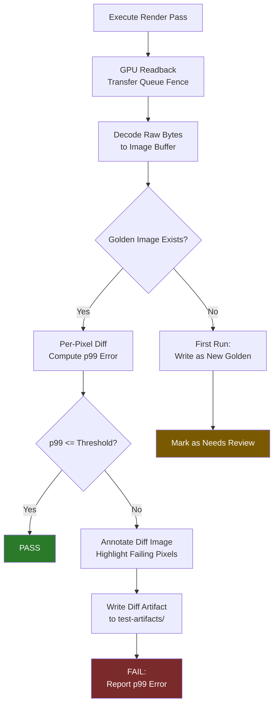

# Harmonius - Testing Strategy

## Overview

All tests in Harmonius require a real GPU. There is no software rasterizer
fallback. Mesh shaders are a hard requirement (ARCH-2), bindless resources are
mandatory (REND-2), and every rendering operation is GPU-driven (ARCH-1). Any
test that cannot satisfy these preconditions must be skipped, not silently
passed, and the CI run must be marked as requiring GPU hardware.

---

## 1. TDD Approach

### Test-First Development Workflow

Every module follows strict test-first discipline. No production code is written
without a failing test that motivates it. The workflow is:

1. Write a failing test that captures the desired behavior at the interface level.
2. Implement the minimal production code to make the test pass.
3. Refactor without breaking the test suite.
4. Add property-based or fuzz tests to cover edge cases not reachable by unit
   tests alone.

All GPU-exercising tests are gated behind the `#[cfg(test)]` attribute combined
with a runtime capability check that calls the backend device probe. If a test
discovers no suitable GPU, it calls `skip_if_no_gpu()` (a macro defined in the
test harness) which records the test as explicitly skipped rather than passing
or failing. CI jobs are configured to fail if all GPU tests are skipped,
preventing silent regression on misconfigured machines.

### Mock Strategy for GPU-Dependent Code in Unit Tests

For crates that are fully safe Rust with no direct GPU calls (harmonius-types,
harmonius-graph, harmonius-anim, harmonius-scene, harmonius-ui,
harmonius-shaders), unit tests run entirely in CPU without a GPU device.

For crates that dispatch to the backend bridge (harmonius-executor,
harmonius-resources, harmonius-io), a `MockBackend` implementing the
`BackendDevice` trait is used in unit tests to verify Rust-side logic in
isolation. The `MockBackend` records all calls made to it and makes them
inspectable in assertions. It never allocates GPU memory.

| Crate | GPU Needed for Unit Tests | Mock Strategy |
|---|---|---|
| harmonius-types | No | None needed |
| harmonius-graph | No | None needed |
| harmonius-executor | No (Rust logic), Yes (E2E) | `MockBackend` for scheduling tests |
| harmonius-resources | No (Rust logic), Yes (E2E) | `MockBackend` for allocation tracking tests |
| harmonius-io | No (Rust logic), Yes (E2E) | `MockBackend` + in-memory byte buffers |
| harmonius-anim | No | None needed |
| harmonius-ui | No | None needed |
| harmonius-scene | No | None needed |
| harmonius-shaders | No (Naga IR generation), Yes (compilation) | None needed for graph/IR; real backend for compile |
| harmonius-backend | Yes | Real device required; no mock |

The `MockBackend` is defined in `harmonius-backend` behind the
`#[cfg(any(test, feature = "test-utils"))]` gate. It is never compiled into
production builds.

---

## 2. Unit Test Plan (per module)

### `harmonius-types`

No GPU dependency. All tests are pure CPU.

| Test Case | Description | Pass Condition |
|---|---|---|
| `texture_format_bytes_per_pixel` | Check byte stride for all `TextureFormat` variants | Matches known table (e.g. RGBA8 = 4, BC7 = 0.5/texel) |
| `texture_format_srgb_roundtrip` | Convert linear format to sRGB variant and back | Identity roundtrip |
| `texture_format_is_depth` | Query `is_depth()` for all formats | Depth formats return true; color formats return false |
| `texture_format_is_compressed` | Query `is_compressed()` for all formats | BCn, ASTC formats return true |
| `buffer_usage_flags_combine` | Bitwise OR of `BufferUsage` flags | No flags are dropped |
| `handle_invalid_sentinel` | `Handle<T>::invalid()` is always invalid | `handle.is_valid()` returns false |
| `handle_valid_sentinel` | Any handle constructed with a non-null generation is valid | `handle.is_valid()` returns true |
| `handle_equality` | Two handles with the same index and generation are equal | `==` holds |
| `handle_inequality_generation` | Same index, different generation | `!=` holds |
| `shader_stage_flags_combine` | OR vertex + fragment + compute | All bits present |
| `error_type_display` | All error variants produce non-empty Display strings | No panics |

### `harmonius-graph`

No GPU dependency. All tests are pure CPU operating on the graph data structure.

| Test Case | Description | Pass Condition |
|---|---|---|
| `empty_graph_compiles` | Compile an empty graph | Returns empty `ExecutionPlan`, no error |
| `single_pass_no_resources` | Graph with one pass, no input/output edges | Plan contains one pass, no barriers |
| `two_passes_dependency` | Pass B reads resource written by Pass A | Topological order: A before B |
| `linear_chain_order` | A → B → C → D | Execution order is A, B, C, D |
| `parallel_passes` | A writes R1; B writes R2; C reads both | A and B may be parallel; C is after both |
| `cycle_detection_direct` | Add edge A → B and B → A | Compile returns `CycleError` |
| `cycle_detection_transitive` | A → B → C → A | Compile returns `CycleError` |
| `feature_gate_cull_disabled` | Pass C gated on `FeatureFlag::RayTracing`; flag not set | Pass C removed from plan |
| `transitive_cull_single_consumer` | Pass D depends only on disabled Pass C | Pass D also culled |
| `transitive_cull_multiple_consumers` | Pass B depends on disabled C and enabled E | Pass B retained; only C culled |
| `transitive_cull_does_not_overcull` | Long chain with one surviving consumer | Only passes exclusively serving disabled node are removed |
| `resource_lifetime_single_pass` | Resource declared, written, read in same pass | Lifetime is single-pass |
| `resource_lifetime_multi_pass` | Resource written in pass 1, read in passes 3 and 5 | Lifetime spans pass 1 through pass 5 |
| `resource_alias_non_overlapping` | Two resources with non-overlapping lifetimes | Compiler marks them as aliasable |
| `resource_alias_overlapping` | Two resources with overlapping lifetimes | Compiler does not alias them |
| `barrier_inserted_between_write_read` | Pass A writes texture; Pass B reads it | Exactly one barrier between A and B |
| `no_redundant_barriers` | Pass A and B both read same texture; no writes between | No barrier between A and B |
| `queue_assignment_compute` | Pass declared as compute | Assigned to compute queue |
| `queue_assignment_transfer` | Pass declared as transfer | Assigned to transfer queue |
| `budget_gate_compile_retained` | Budget-gated pass; no budget enforcement at compile time | Pass appears in plan |
| `execution_plan_is_send_sync` | `ExecutionPlan` used across thread boundary | Compiles without `Send`/`Sync` errors |
| `rebuild_after_invalidation` | Modify graph and recompile | New plan reflects changes |

### `harmonius-executor`

Rust-side scheduling logic tested with `MockBackend`. GPU execution in E2E
tests.

| Test Case | Description | Pass Condition |
|---|---|---|
| `frame_submit_increments_index` | Submit two frames | Frame index increments each call |
| `ring_buffer_wraps_correctly` | Fill ring buffer to capacity + 1 | Oldest slot is overwritten |
| `runtime_budget_cull_over_limit` | Budget-gated pass; frame over time budget | Pass is skipped in command encoding |
| `runtime_budget_retain_under_limit` | Budget-gated pass; frame under time budget | Pass is encoded |
| `runtime_budget_hysteresis` | Budget briefly over limit then under | Pass is not re-enabled until budget sustained below threshold for N frames |
| `mock_backend_encode_calls_recorded` | Submit one frame with two passes | `MockBackend` records exactly two encode calls in order |
| `parallel_encoder_completion_order` | Two passes assigned different encoders | Both encoders complete before queue submit |
| `fence_signal_after_submit` | Submit one frame | `MockBackend` records fence signal after last command buffer |
| `frame_data_upload_per_frame` | Submit three frames with changing camera data | Each frame uploads distinct camera uniforms |

### `harmonius-resources`

Allocation and index management logic tested with `MockBackend`. GPU allocation
in E2E tests.

| Test Case | Description | Pass Condition |
|---|---|---|
| `allocate_buffer_returns_valid_handle` | Allocate a 1 MB buffer | Handle `is_valid()` |
| `allocate_texture_returns_valid_handle` | Allocate a 512x512 RGBA8 texture | Handle `is_valid()` |
| `deallocate_buffer_invalidates_handle` | Allocate then free a buffer | Handle becomes invalid after free |
| `double_free_returns_error` | Free the same handle twice | Returns `ResourceError::AlreadyFreed` |
| `bindless_index_assigned_on_allocate` | Allocate texture | Returns a valid bindless descriptor index |
| `bindless_index_recycled_after_free` | Allocate, free, allocate again | Second allocation receives the recycled index |
| `bindless_index_uniqueness` | Allocate 1000 textures simultaneously | All indices are distinct |
| `resource_registry_lookup` | Allocate resource; look up by handle | Returns resource descriptor |
| `resource_registry_miss` | Look up invalid handle | Returns `None` or `ResourceError::NotFound` |
| `generation_counter_increments` | Allocate at slot N, free, allocate again at slot N | New handle has generation = old generation + 1 |
| `stale_handle_lookup_fails` | Keep old-generation handle; allocate new resource at same slot | Lookup with old handle returns `ResourceError::StalHandle` |
| `max_bindless_slots_error` | Allocate beyond heap capacity | Returns `ResourceError::HeapFull` |

### `harmonius-io`

Request queuing and scheduling logic tested with in-memory buffers. Actual GPU
uploads in E2E tests.

| Test Case | Description | Pass Condition |
|---|---|---|
| `queue_single_request` | Enqueue one streaming request | Queue depth becomes 1 |
| `queue_drain_fifo` | Enqueue 3 requests at equal priority | Dequeued in insertion order |
| `priority_ordering_critical_first` | Enqueue Normal then Critical requests | Critical is dequeued first |
| `priority_ordering_all_levels` | Enqueue Low, Normal, High, Critical | Dequeue order: Critical, High, Normal, Low |
| `priority_stable_same_level` | Two Critical requests | FIFO order preserved within same priority |
| `cancel_pending_request` | Enqueue request then cancel by ID | Request removed from queue |
| `cancel_nonexistent_request` | Cancel ID that was never enqueued | Returns `IoError::NotFound` |
| `worker_picks_highest_priority` | Two workers, three queued requests | Workers each take the highest remaining priority |
| `request_completion_callback_fires` | Enqueue request with completion closure | Closure called exactly once on completion |
| `backpressure_blocks_new_requests` | Fill request queue to capacity | New enqueue returns `IoError::QueueFull` |

### `harmonius-anim`

Pure CPU state machine and blend computation. No GPU.

| Test Case | Description | Pass Condition |
|---|---|---|
| `state_machine_initial_state` | Construct `AnimStateMachine` | Initial state matches declared entry state |
| `state_machine_transition_condition_false` | Tick with condition not met | State does not change |
| `state_machine_transition_condition_true` | Tick with condition met | State transitions to declared next state |
| `state_machine_no_transition_from_terminal` | Tick terminal state | No transition, state remains |
| `state_machine_invalid_target_state` | Declare transition to nonexistent state | Returns `AnimError::UnknownState` at build time |
| `state_machine_multiple_transitions_priority` | Two valid transitions from one state | Highest-priority transition fires |
| `blend_weight_sum_to_one` | Compute blend weights for 3-way blend | Weights sum to 1.0 within f32 epsilon |
| `blend_weight_single_clip` | Single active clip | Weight is exactly 1.0 |
| `blend_weight_zero_excludes_clip` | Clip with weight 0.0 | Not included in blend descriptor |
| `curve_eval_constant` | Evaluate constant-segment curve at any time | Returns constant value |
| `curve_eval_linear_midpoint` | Evaluate linear curve at t=0.5 | Returns value halfway between keyframes |
| `curve_eval_cubic_bezier_boundary` | Evaluate cubic curve at t=0 and t=1 | Returns exact keyframe values |
| `curve_eval_out_of_range_clamp` | Evaluate at t < 0 and t > duration | Clamps to start/end value |
| `morph_target_weight_normalization` | Set weights summing to 1.5 | Normalized to sum 1.0 |
| `skeleton_bone_count_constraint` | Create skeleton with 257 bones | Returns `AnimError::TooManyBones` |
| `ik_chain_length_constraint` | Create IK chain with 9 bones | Returns `AnimError::IkChainTooLong` |

### `harmonius-ui`

Pure CPU layout and dirty tracking. GPU rasterization in E2E tests.

| Test Case | Description | Pass Condition |
|---|---|---|
| `layout_single_element` | Layout a root element with fixed size | Computed size matches declared size |
| `layout_stretch_fill_parent` | Child with stretch fill in 400x300 parent | Child occupies 400x300 |
| `layout_row_children` | Three fixed-width children in horizontal row | Children placed left-to-right without overlap |
| `layout_column_children` | Three fixed-height children in column | Children placed top-to-bottom without overlap |
| `layout_overflow_clip` | Child extends beyond parent | Child is clipped to parent bounds |
| `layout_zero_size_element` | Element with width=0, height=0 | No layout error; occupies no space |
| `dirty_tracking_initial_state` | Newly constructed element | Marked dirty |
| `dirty_tracking_after_layout` | Run layout pass | Element marked clean |
| `dirty_tracking_property_change` | Change color property on clean element | Element re-marked dirty |
| `dirty_tracking_no_recompute_if_clean` | Call layout twice without changes | Second layout is a no-op (no recomputation) |
| `dirty_propagation_child_to_parent` | Dirty a child that affects parent size | Parent also marked dirty |
| `hit_test_inside` | Point inside element bounds | Returns element handle |
| `hit_test_outside` | Point outside element bounds | Returns `None` |
| `hit_test_child_precedence` | Point inside overlapping child | Returns child, not parent |

### `harmonius-scene`

Pure CPU transform hierarchy and sorting. No GPU.

| Test Case | Description | Pass Condition |
|---|---|---|
| `transform_identity` | Apply identity transform to point | Point unchanged |
| `transform_translation` | Apply translation (1, 2, 3) to origin | Point becomes (1, 2, 3) |
| `transform_scale_uniform` | Apply uniform scale 2.0 to unit point | Distance from origin doubles |
| `transform_rotation_90_deg` | Rotate (1,0,0) by 90 degrees around Y | Becomes (0,0,-1) within epsilon |
| `transform_hierarchy_two_levels` | Parent at (1,0,0); child at (0,1,0) | Child world position is (1,1,0) |
| `transform_hierarchy_three_levels` | Root, mid, leaf transforms | Leaf world transform is product of all three |
| `transform_update_propagates` | Move parent entity | Child world transform updates automatically |
| `transform_reparent` | Detach child from parent A; attach to parent B | Child world position uses parent B transform |
| `distance_sort_ascending` | Three objects at distances 5, 1, 3 from camera | Sorted order: 1, 3, 5 |
| `distance_sort_descending` | Same three objects | Sorted order: 5, 3, 1 |
| `distance_sort_equal_distances` | Two objects at same distance | Stable sort; relative order preserved |
| `distance_sort_empty` | Empty entity list | Returns empty list without panic |
| `frustum_cull_inside` | Object fully inside frustum | Returned as visible |
| `frustum_cull_outside` | Object fully outside frustum | Not returned |
| `frustum_cull_straddling` | Object straddling frustum plane | Conservative: returned as potentially visible |
| `spatial_radius_query` | Query radius 5.0 from origin | Returns exactly the entities within radius |

### `harmonius-shaders`

Pure CPU Naga IR generation. No GPU for graph compilation; real backend for
cross-compilation output validation.

| Test Case | Description | Pass Condition |
|---|---|---|
| `empty_shader_graph_valid` | Compile empty shader graph | No error; produces valid `naga::Module` |
| `single_output_node` | Graph with one constant output node | Module has one entry point |
| `connected_add_nodes` | A + B → output | Naga IR contains Add expression |
| `type_inference_float_scalar` | Two f32 inputs to Add | Inferred output type is f32 |
| `type_inference_vec4_scalar_promoted` | vec4 + f32 | Scalar promoted to vec4 |
| `type_mismatch_error` | bool input to float math node | Returns `ShaderError::TypeMismatch` |
| `missing_required_input_error` | Node with unconnected required input slot | Returns `ShaderError::UnconnectedInput` |
| `cycle_in_shader_graph` | Add cycle A → B → A | Returns `ShaderError::Cycle` |
| `texture_sample_node` | Texture2D + sampler + UV → color | Naga IR contains `ImageSample` expression |
| `pbr_material_graph` | Full PBR subgraph (albedo, normal, metallic, roughness) | Compiles without error |
| `branching_node` | If/select node with condition | Naga IR contains `Select` expression |
| `custom_function_node` | User-defined inline function node | Naga IR contains function definition |
| `permutation_variant_a_vs_b` | Same graph with two permutation flags | Two distinct `naga::Module` outputs |
| `serialize_deserialize_roundtrip` | Serialize graph to MessagePack, deserialize | Deserialized graph is structurally equal to original |
| `cross_compile_msl` | Compile simple graph to MSL | MSL string is non-empty and valid UTF-8 |
| `cross_compile_spirv` | Compile simple graph to SPIR-V | SPIR-V bytes have correct magic number (0x07230203) |
| `cross_compile_hlsl` | Compile simple graph to HLSL | HLSL string contains entry point function |
| `resource_binding_declared` | Graph sampling a texture | Compiled module reflection reports texture binding |

### `harmonius-backend`

Bridge type marshaling is tested with the real Metal/Vulkan/D3D12 backend on
the corresponding platform. All tests require a GPU.

| Test Case | Description | Pass Condition |
|---|---|---|
| `device_init_succeeds` | Initialize backend device | No error; device handle is non-null |
| `device_reports_capabilities` | Query capabilities after init | Mesh shaders present (required) |
| `buffer_alloc_dealloc` | Allocate 1 MB buffer; deallocate | No leak; C++ allocation count returns to baseline |
| `texture_alloc_dealloc` | Allocate 512x512 RGBA8 texture; deallocate | No leak |
| `marshal_buffer_usage_flags` | Pass all `BufferUsage` combinations to C++ bridge | C++ side receives correct bitmask |
| `marshal_texture_format_enum` | Pass all `TextureFormat` variants to C++ bridge | C++ side receives correct integer code |
| `marshal_shader_stage_flags` | Pass all `ShaderStage` combinations to C++ bridge | C++ side receives correct bitmask |
| `command_buffer_begin_end` | Begin and end a command buffer | No error |
| `pipeline_create_mesh_shader` | Create a minimal mesh shader pipeline | Pipeline handle is non-null |
| `fence_signal_and_wait` | Signal fence; wait for it on CPU | Wait completes within 100 ms timeout |

---

## 3. End-to-End GPU Tests

All E2E tests render to an off-screen target (no window, no swap chain). Output
is captured via readback buffer and validated against golden images or
deterministic expectations. Every test calls `skip_if_no_gpu()` first.

| Test | Render Output | Validation |
|---|---|---|
| Basic triangle rendering | Single triangle, 256x256 RGBA8 | Non-black pixels exist; triangle covers expected screen region |
| PBR material rendering | Sphere with albedo, normal, metallic, roughness maps | Per-pixel diff against golden; specular highlight present |
| Shadow map generation and sampling | Directional shadow casting onto flat plane | Shadowed region has luminance < lit region; no shadow acne |
| Forward+ light culling correctness | 256 point lights; only lights in screen tile contribute | Per-tile light count matches CPU reference culling |
| Deferred G-buffer layout validation | Render G-buffer; read back albedo and normal layers | Albedo matches input material colors; normals are unit vectors (length within epsilon) |
| Ray tracing acceleration structure build | Build BLAS and TLAS for simple mesh | RT ray cast hits expected triangle; miss on empty area |
| Volumetric fog rendering | Fog volume with known density; capture composite image | Fog occludes background with expected falloff gradient |
| Animation skinning output validation | Single bone rotation 90 degrees; readback skinned vertex positions | Vertex positions match CPU reference skinning |
| UI vector path rasterization | Render filled circle path at 256x256 | Circular coverage mask matches reference raster within 1 px tolerance |
| Streaming tile load and display | Load a 2x2 terrain tile grid; render to texture | All 4 tiles present and correctly positioned in output image |

### Preconditions for All E2E Tests

- [ ] GPU device successfully initialized
- [ ] Mesh shaders present (hard capability check)
- [ ] Bindless descriptor heap allocated
- [ ] Off-screen render target created
- [ ] Readback staging buffer allocated

---

## 4. Snapshot Validation

### Frame-by-Frame Screenshot Comparison

Each E2E test captures the final render target and compares it against a stored
golden image. The comparison pipeline is:

1. Execute the render; read back the result via transfer queue to a CPU staging
   buffer.
2. Decode the raw bytes into a typed image buffer (e.g. `[u8; W*H*4]` for RGBA8).
3. Load the corresponding golden image from the baseline store.
4. Run per-pixel diff: for each channel, compute `abs(actual - expected)`.
5. Compute the 99th-percentile pixel error (p99 error). This is more robust than
   max error because it ignores isolated driver noise pixels.
6. Compare p99 error against the test-specific tolerance threshold.

### Tolerance Thresholds

| Test | Channel Tolerance (0–255) | p99 Threshold |
|---|---|---|
| Basic triangle | 0 | 0 (deterministic) |
| PBR material | 2 | 2 |
| Shadow maps | 4 | 3 |
| Forward+ light culling | 1 | 1 |
| G-buffer layout | 1 | 1 |
| Ray tracing AS | 4 | 3 |
| Volumetric fog | 6 | 5 |
| Animation skinning | 2 | 2 |
| UI vector path | 2 | 2 |
| Streaming tiles | 1 | 1 |

Tolerances are wider for ray tracing and volumetrics because denoiser outputs
and numerical integration may vary slightly across driver versions and hardware.

### Video Test: Multi-Frame Capture

Some tests require frame-sequence validation (e.g. animation playback, streaming
progression). The procedure is:

1. Declare the test as a video test with a frame count N.
2. Execute N frames, capturing the render target after each frame.
3. Store the N frames as an ordered sequence of PNG files in the test artifact
   directory.
4. Compare each frame independently against its golden counterpart using the
   per-pixel diff described above.
5. A test passes only if all N frames are within tolerance.

| Video Test | Frame Count | Purpose |
|---|---|---|
| Animation state machine transition | 30 frames at 60 Hz | Verify smooth blend over 0.5 s transition |
| Terrain streaming progression | 10 frames | Verify tiles load and appear progressively |
| Shadow cascade update | 6 frames | Verify cascades update correctly as camera moves |
| Procedural sky time-of-day | 24 frames | One frame per hour of day cycle |

### Golden Image Management

Golden images are stored in the repository under `tests/golden/`. Directory
structure:

```
tests/golden/
  macos-apple-silicon/
    basic-triangle.png
    pbr-material.png
    ...
  linux-amd-rdna3/
    basic-triangle.png
    ...
  windows-nvidia-rtx4000/
    ...
```

Each platform directory contains baselines specific to that hardware family.
Platform detection uses the device vendor and architecture string reported by the
backend at init time.

| Rule | Detail |
|---|---|
| Golden images are versioned in git | Large image files use Git LFS |
| Per-platform baselines are mandatory | Never use a baseline from a different platform family |
| Updating a golden requires explicit flag | Run tests with `--update-golden`; diff is reviewed in PR |
| CI never auto-updates goldens | Only human review triggers a golden update commit |
| Baselines are tagged with library version | File metadata includes Harmonius version and backend driver version |

### Snapshot Test Pipeline (Mermaid)



---

## 5. Fuzz Testing

### Input Fuzzing Targets

All fuzz targets use `cargo-fuzz` (libFuzzer). Fuzz corpora are stored in
`fuzz/corpus/` and committed to the repository. Minimum corpus coverage targets
are enforced in CI.

| Fuzz Target | Input | What is Fuzzed |
|---|---|---|
| `fuzz_shader_graph_deserialize` | Raw bytes | `ShaderGraphFile` MessagePack deserialization |
| `fuzz_shader_graph_compile` | Valid-ish graph bytes | Graph compilation including type inference and Naga lowering |
| `fuzz_mesh_data_import` | GLTF binary blob | Mesh import, meshletization |
| `fuzz_animation_clip` | Raw animation clip bytes | Clip deserialization and curve evaluation |
| `fuzz_render_graph_build` | Sequence of builder API calls | Graph construction and compilation |

Each fuzz target must:
- [ ] Not panic (any panic is a bug)
- [ ] Not produce undefined behavior (run under AddressSanitizer in CI)
- [ ] Return a typed error for all invalid inputs (never silently succeed with garbage)

### GPU State Fuzzing

GPU state fuzzing targets are run separately from the main fuzz suite because
they require a real GPU. They are executed nightly in CI, not on every commit.

| Fuzz Target | What is Fuzzed | Expected Outcome |
|---|---|---|
| `fuzz_invalid_resource_handle` | Pass random handle values to resource lookup | Returns `ResourceError`, no GPU crash |
| `fuzz_out_of_bounds_bindless_index` | Write arbitrary u32 as bindless index in draw data | Validation layer catches or shader returns zero/black |
| `fuzz_invalid_pipeline_state` | Random pipeline descriptor fields | Returns `PipelineError`, no device lost |
| `fuzz_command_buffer_order` | Randomize pass execution order in plan | Validation detects barrier violations |

### Stress Tests

Stress tests verify behavior under resource exhaustion and maximum load. They
require a real GPU and are run in the nightly job.

| Stress Test | What is Stressed | Pass Condition |
|---|---|---|
| `stress_max_resource_allocation` | Allocate resources until `HeapFull`; verify all valid handles; deallocate all | No leak; heap reports zero used after deallocation |
| `stress_max_draw_calls` | Build indirect draw buffer at backend maximum (typically 16M draws) | Frame renders without device lost or timeout |
| `stress_max_streaming_requests` | Enqueue 10,000 streaming requests simultaneously | All complete; none lost; no deadlock |
| `stress_max_lights_forward_plus` | 1024 lights in a single scene | Light culling produces correct counts; no buffer overflow |
| `stress_max_bones_skinning` | 256 bones per skeleton; 1000 simultaneous instances | Skinning output is correct; no corruption |
| `stress_bindless_heap_near_full` | Fill bindless heap to 95% capacity | Normal operation continues; at 100% returns `HeapFull` |
| `stress_concurrent_compile_recompile` | Repeatedly invalidate and recompile render graph on user thread while rendering | No race conditions; no stale execution plan used |

### Error Recovery Validation

| Scenario | Expected Recovery |
|---|---|
| Backend reports device lost | `ExecutionError::DeviceLost` propagated to user; executor enters safe-stop state |
| Out-of-memory during allocation | `ResourceError::OutOfMemory`; previously allocated resources remain valid |
| Shader compilation failure | `ShaderError` returned; pipeline not created; no crash |
| Transfer queue fence timeout | `IoError::Timeout`; request can be retried; no deadlock |
| IO worker crash (panic in unsafe) | Panic does not propagate to user thread; IO manager reports worker failure |

---

## 6. CI Requirements

### GPU Hardware Requirements per Platform

| Platform | Required GPU | Driver Requirements | Notes |
|---|---|---|---|
| macOS | Apple Silicon M1 or later | macOS 14+ (Sonoma) | Sparse textures require macOS 14+; `MTLIOCommandBuffer` requires macOS 13+ |
| Linux | AMD RDNA2+ or NVIDIA Turing+ | Mesa 23.0+ or NVIDIA 525+ | `VK_EXT_mesh_shader` must be present; `io_uring` Linux 5.15+ |
| Windows | NVIDIA RTX 2000+ or AMD RX 6000+ | DirectX 12 Agility SDK 1.613+ | DXR 1.1, Mesh Shaders (SM 6.5+), SM 6.6 bindless required |

### Test Matrix

| Job | Platform | GPU API | Commit | Nightly |
|---|---|---|---|---|
| `test-metal` | macOS 14 + Apple M1 | Metal 4 | Unit + E2E | Unit + E2E + Fuzz GPU + Stress |
| `test-vulkan-linux` | Ubuntu 24.04 + AMD RDNA3 | Vulkan 1.4 | Unit + E2E | Unit + E2E + Fuzz GPU + Stress |
| `test-d3d12-windows` | Windows 11 + NVIDIA RTX 4000 | D3D12 Agility SDK | Unit + E2E | Unit + E2E + Fuzz GPU + Stress |
| `fuzz-cpu` | Linux (any) | None | No | Yes (6 hours) |
| `fuzz-gpu-metal` | macOS + Apple M1 | Metal 4 | No | Yes (2 hours) |
| `fuzz-gpu-vulkan` | Linux + AMD RDNA3 | Vulkan 1.4 | No | Yes (2 hours) |

### Per-Commit Requirements (Mandatory Gates)

- [ ] All CPU unit tests pass on all three platforms
- [ ] All GPU unit tests pass on the platform matching the changed backend
- [ ] All E2E GPU tests pass
- [ ] No new snapshot regressions (p99 within threshold)
- [ ] No memory leaks reported by the resource leak detector
- [ ] No `unsafe` code added to crates marked Safe Rust (lint enforced)

### Snapshot Baseline Management Across Platforms

Each platform maintains independent golden image baselines. A cross-platform
snapshot comparison gate runs nightly: it flags if the same logical scene
differs visually by more than a platform-variance threshold across backends. This
detects backend-specific rendering bugs rather than expected platform differences
(e.g. subpixel AA differences are acceptable; incorrect shadow cascade splits are
not).

| Comparison | Threshold | Purpose |
|---|---|---|
| Metal vs Vulkan (same scene) | p99 <= 8 per channel | Detect backend divergence |
| Metal vs D3D12 (same scene) | p99 <= 8 per channel | Detect backend divergence |
| Within-platform across driver updates | p99 <= 3 per channel | Detect driver regression |

If a driver update changes golden images within threshold, the new images are
accepted as the updated baseline after human review.

### Performance Regression Detection

Performance tests run on every commit. A regression is defined as a statistically
significant increase in GPU frame time exceeding 5% over the rolling 10-commit
average.

| Metric | Measurement | Regression Threshold |
|---|---|---|
| Full frame GPU time | GPU timer query, 1000-frame average | +5% over 10-commit rolling average |
| Mesh shader dispatch time | Timer query around cull+draw pass | +10% |
| Shadow map pass time | Timer query around all cascade passes | +10% |
| G-buffer pass time | Timer query | +10% |
| Shader compilation time (CPU) | Wall clock, single compile | +20% |
| Bindless heap allocation time | Wall clock, 10K allocations | +20% |

Performance tests do not block commit if the regression is on a platform not
touched by the commit (e.g. a Metal-only change does not need to pass D3D12
perf). The CI system tracks which crates were modified and runs only the
relevant platform performance suite.

---

## 7. Instrumentation for Tests

### GPU Timer Queries

All E2E and performance tests instrument GPU passes with timer queries. The
infrastructure wraps the platform-specific timer API uniformly.

| Platform | Timer API | Resolution |
|---|---|---|
| Metal | `MTLCounterSampleBuffer` with stage counters | ~1 ns |
| Vulkan | `VkQueryPool` with `VK_QUERY_TYPE_TIMESTAMP` | Depends on `timestampPeriod` |
| D3D12 | `ID3D12QueryHeap` with `TIMESTAMP` query | Depends on `SetStablePowerState` |

Timers are recorded as structured test output in JSON format:

```json
{
  "test": "pbr_material_rendering",
  "platform": "metal",
  "frame": 1,
  "passes": [
    { "name": "ShadowCascades", "gpu_us": 142 },
    { "name": "GBuffer", "gpu_us": 380 },
    { "name": "DeferredLighting", "gpu_us": 210 }
  ],
  "total_gpu_us": 732
}
```

This JSON is uploaded as a CI artifact and consumed by the performance regression
detection system.

### Memory Allocation Tracking

All tests run with the `AllocationTracker` enabled. The tracker wraps the Rust
allocator (via `#[global_allocator]`) and the GPU resource allocator, recording
total allocations, peak, and current usage.

| Metric | Checked At |
|---|---|
| CPU heap bytes at test end | Every unit test |
| GPU resource bytes at test end | Every GPU test |
| Peak CPU allocation during test | Performance tests |
| Peak GPU allocation during test | Performance and stress tests |

Tests assert that CPU and GPU allocation counts return to the pre-test baseline
after cleanup. Any deviation is reported as a leak.

### Resource Leak Detection

The `ResourceManager` maintains a generation-counter registry. At the end of
each test, the registry is queried for any live handles that should have been
freed. A non-empty live-handle set causes the test to fail with a leak report
listing each leaked handle's type, size, and the stack trace at allocation time
(captured in debug builds).

GPU-side leak detection uses the backend validation layer:

| Platform | Leak Detection |
|---|---|
| Metal | Metal Validation layer + `MTLDevice` object count |
| Vulkan | Vulkan Validation Layers (`VK_LAYER_KHRONOS_validation`) |
| D3D12 | D3D12 Debug Layer + `ID3D12InfoQueue` |

All validation layer errors are treated as test failures, not warnings.

### Shader Compilation Validation

Every compiled shader (MSL, HLSL, SPIR-V) undergoes additional validation before
the test that uses it:

| Validation Step | Tool | Platform |
|---|---|---|
| SPIR-V structural validity | `spirv-val` (spirv-tools) | Vulkan |
| HLSL compilation | `dxcompiler` with strict warnings-as-errors | D3D12 |
| MSL compilation | `xcrun metal -std=metal3.0` | Metal |
| Naga internal consistency | `naga::valid::Validator` | All |

Shader validation runs as a test step in `harmonius-shaders` unit tests and also
as a post-processing step in any E2E test that triggers shader compilation. A
validation error in any E2E test fails the entire test, not just the shader
validation sub-step.

### Test Harness Summary

| Harness Feature | Implementation |
|---|---|
| `skip_if_no_gpu()` | Macro; checks backend device probe; records explicit skip |
| `MockBackend` | Implements `BackendDevice`; records calls; no GPU allocation |
| `AllocationTracker` | Wraps Rust allocator and GPU resource allocator |
| `GpuTimer` | Wraps platform timer queries; emits structured JSON |
| `SnapshotCompare` | Per-pixel diff with p99 metric; writes diff artifacts |
| `VideoCapture` | N-frame capture; compares each frame independently |
| `ValidationLayerBridge` | Treats validation messages as test failures |
| `ShaderValidator` | Runs `spirv-val`/`dxcompiler`/`xcrun metal` post-compile |
