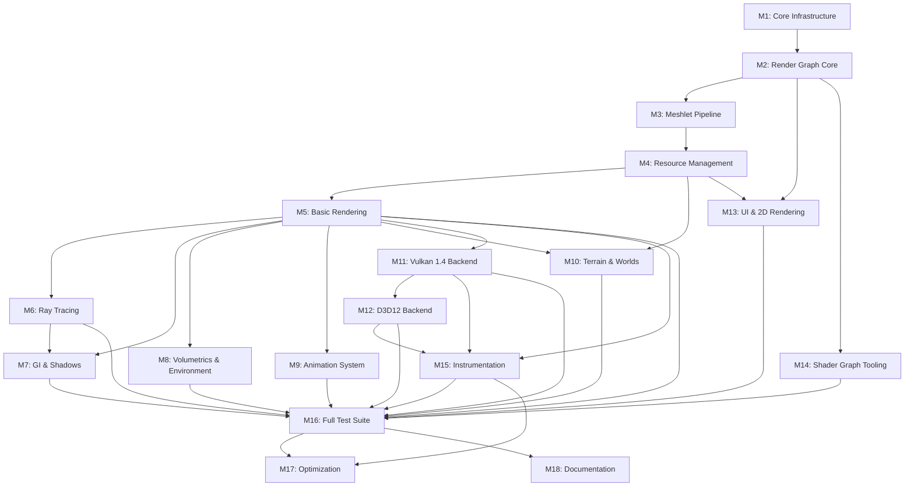

# Harmonius - Implementation Plan

## Overview

This document is the authoritative step-by-step implementation plan for the
Harmonius render graph library. The implementation proceeds in four phases:

- **Phase 1** establishes the Metal 4 backend, render graph core, meshlet
  pipeline, resource management, and basic rendering (Milestones M1-M5).
- **Phase 2** layers advanced rendering features on the proven Metal foundation
  (Milestones M6-M10).
- **Phase 3** ports to Vulkan 1.4 and D3D12 and adds tooling (Milestones
  M11-M14).
- **Phase 4** hardens the library for production with instrumentation, full
  test coverage, optimization, and documentation (Milestones M15-M18).

Each milestone lists concrete deliverables, inter-milestone dependencies, and
test requirements. Week ranges are given for Phase 1 only as those represent
the critical initial sprint with the tightest sequencing.

---

## 1. Phase 1: Foundation (Metal Backend) — Milestones M1-M5

### M1: Core Infrastructure (Weeks 1-3)

**Goal:** Bootstrap the workspace and establish the Metal device + command
pipeline so every subsequent milestone has a real GPU to target.

#### Deliverables

**Workspace Setup**

- Root `Cargo.toml` workspace file listing all crates:
  `harmonius`, `harmonius-types`, `harmonius-graph`, `harmonius-executor`,
  `harmonius-resources`, `harmonius-io`, `harmonius-anim`, `harmonius-ui`,
  `harmonius-scene`, `harmonius-shaders`, `harmonius-backend`,
  `harmonius-metal`, `harmonius-vulkan` (stub), `harmonius-d3d12` (stub).
- Each crate has a `Cargo.toml` with the correct dependency edges as defined
  in the module responsibility document. Stub crates compile but export
  only empty public items.
- `build.rs` in `harmonius-metal` compiles the C++ translation units via
  `cxx_build` and links `Metal.framework`, `QuartzCore.framework`,
  `Foundation.framework`.
- `.cargo/config.toml` with macOS-specific linker flags and the
  `MACOSX_DEPLOYMENT_TARGET` env var set.

**cxx.rs Bridge**

- `harmonius-backend/src/bridge.rs`: cxx bridge file declaring the shared C++
  interface. Core types at this stage:
  - `BackendDevice` opaque C++ type
  - `BackendCommandQueue` opaque C++ type
  - `BackendCommandBuffer` opaque C++ type
  - `BackendSwapChain` opaque C++ type
  - `BackendSemaphore` opaque C++ type (wraps `MTLSharedEvent`)
- Rust-side bridge traits in `harmonius-backend/src/traits.rs` mirroring the
  cxx declarations with safe wrappers.
- `harmonius-metal/src/cpp/device.cpp` implementing `BackendDevice` creation
  via `MTLCreateSystemDefaultDevice()`.

**Metal Device Initialization**

- `DeviceEnumerator` in `harmonius-backend`: queries available Metal devices,
  selects the most capable (discrete preferred over integrated).
- Capability flags extracted at init time and stored in a `GpuCapabilities`
  struct:
  - `supports_mesh_shaders: bool` (hard-required; fatal error if false)
  - `supports_ray_tracing: bool`
  - `supports_sparse_textures: bool`
  - `supports_64bit_atomics: bool`
  - `argument_buffer_tier: u8` (must be Tier 2)
- Fatal capability check: if `supports_mesh_shaders` is false, `Device::new`
  returns `Err(CapabilityError::MeshShadersRequired)`.

**Command Queue Creation**

- Three named queues created on the `MTLDevice` via C++:
  - `graphics_queue`: used for render and mesh-shader passes
  - `compute_queue`: async compute dispatches
  - `transfer_queue` (blit encoder): GPU uploads and MTLIOCommandBuffer
- Queue handles returned as `BackendCommandQueue` opaque values and wrapped
  in `Arc` on the Rust side.

**Basic Swap Chain with Window Integration (winit)**

- `harmonius` crate integrates `winit 0.30` for cross-platform window
  creation.
- `SwapChain::new(window: &winit::window::Window, device: &Device)`:
  creates a `CAMetalLayer`, sets `pixelFormat` to `BGRA8Unorm_sRGB`,
  `displaySyncEnabled = true`, `maximumDrawableCount = 3`.
- Per-frame `current_drawable()` call with 100 ms timeout before declaring
  a missed frame.

**Frame Synchronization (Triple-Buffered with MTLSharedEvent)**

- `FrameSync` struct owning:
  - `in_flight_fence: MTLSharedEvent` with a monotonic counter
  - `frame_index: AtomicU64` tracking which of the 3 slots is active
  - `FRAMES_IN_FLIGHT = 3` constant
- On frame start: wait for `fence_value >= frame_counter - FRAMES_IN_FLIGHT`
  before encoding.
- On frame end: signal fence with `frame_counter` after
  `commandBuffer.commit()`.
- Ring buffer slot index is `frame_counter % FRAMES_IN_FLIGHT`.

#### Test Requirements

| Test ID | Description | Pass Criteria |
|---------|-------------|---------------|
| M1-T01 | Device enumeration returns at least one Metal device | `DeviceEnumerator::enumerate()` is non-empty |
| M1-T02 | Capability check rejects non-mesh-shader hardware | Returns `CapabilityError::MeshShadersRequired` when flag unset |
| M1-T03 | Device init does not leak MTLDevice | Allocation counter zero after device drop |
| M1-T04 | Graphics queue creation succeeds | Queue handle is non-null after `Device::create_graphics_queue()` |
| M1-T05 | Compute queue creation succeeds | Queue handle is non-null |
| M1-T06 | Transfer queue creation succeeds | Queue handle is non-null |
| M1-T07 | Frame sync: CPU blocks when 3 frames are in flight | Thread blocks until signal; unblocks within 5 ms after signal |
| M1-T08 | Frame sync: slot index cycles 0-1-2-0 | `frame_index % 3` sequence is correct across 9 frames |
| M1-T09 | Command buffer commit completes without GPU error | `commandBuffer.status` is `Completed` after `waitUntilCompleted()` |
| M1-T10 | Workspace: all stub crates compile with `cargo build --workspace` | Zero compilation errors |

---

### M2: Render Graph Core (Weeks 4-6)

**Goal:** Implement the declarative render graph builder, the graph compiler,
and a single-threaded executor capable of submitting real Metal command
buffers.

**Dependency:** M1 complete.

#### Deliverables

**RenderGraph Builder API (Safe Rust)**

- `RenderGraph` struct in `harmonius-graph`:
  - `add_pass(name: &str, pass_type: PassType) -> PassBuilder`
  - `declare_buffer(desc: BufferDesc) -> ResourceRef`
  - `declare_texture(desc: TextureDesc) -> ResourceRef`
  - `pass.reads(resource: ResourceRef)` / `pass.writes(resource: ResourceRef)`
  - `pass.feature_gate(capability: CapabilityFlag)` — marks pass as
    conditional on hardware feature
  - `pass.budget_gate(budget_tier: BudgetTier)` — marks pass as conditional
    on runtime performance budget
- `ResourceRef` is an opaque typed handle with generation counter to detect
  use-after-free at compile time.
- All builder methods return `Result<_, GraphBuildError>` for immediate
  validation feedback.

**Graph Compiler**

The compiler transforms a `RenderGraph` into an `ExecutionPlan` via six
ordered steps (see Architecture document):

1. **Feature Detection** — compare pass `feature_gate` flags against
   `GpuCapabilities`; mark non-capable passes as disabled.
2. **Node Culling** — transitively remove disabled passes and any pass whose
   only consumers are disabled. Culled passes are logged at `debug` level.
3. **Topological Sort** — Kahn's algorithm on remaining passes; cycle
   detection raises `GraphCompileError::Cycle { nodes }`.
4. **Resource Lifetime Analysis** — for each resource, compute the range
   `[first_write_pass, last_read_pass]` in topological order.
5. **Barrier Insertion** — insert minimal `MemoryBarrier` and
   `ExecutionBarrier` nodes between passes that share resources with
   incompatible access types.
6. **Queue Assignment** — assign each pass to `graphics_queue`,
   `compute_queue`, or `transfer_queue` based on `PassType`.

- Output: `ExecutionPlan` (an `Arc`-wrapped immutable value) containing an
  ordered `Vec<PlanEntry>` where each entry is either a pass descriptor or a
  barrier descriptor.

**Basic Executor (Single-Threaded Command Encoding)**

- `Executor::execute(plan: &ExecutionPlan, frame_ctx: &FrameContext)`:
  - Allocates one `MTLCommandBuffer` per queue that has active passes.
  - Iterates `plan.entries` in order, encoding each pass into the appropriate
    command buffer.
  - Passes are currently encoded as no-ops with correct barriers (real
    encoding added in M3+).
  - Submits command buffers in dependency order with fence signals.
  - Signals `FrameSync` after the last graphics submission.
- `FrameContext` carries: `frame_index`, per-frame ring buffer slot pointer,
  `current_drawable`.

#### Test Requirements

| Test ID | Description | Pass Criteria |
|---------|-------------|---------------|
| M2-T01 | Graph with no passes compiles without error | `ExecutionPlan` has zero entries |
| M2-T02 | Graph with a single pass produces a plan with one entry | `plan.entries.len() == 1` |
| M2-T03 | Cycle detection: A→B→A raises `Cycle` error | `compile()` returns `Err(GraphCompileError::Cycle)` |
| M2-T04 | Feature-gated pass is culled when capability absent | Pass and its exclusive dependents absent from plan |
| M2-T05 | Transitive culling: disabled pass removes downstream-only passes | Correct set of passes removed |
| M2-T06 | Shared dependency retained when both consumers are active | Common upstream pass present in plan |
| M2-T07 | Topological order: producer appears before consumer | Index of producer < index of consumer for every edge |
| M2-T08 | Barrier inserted between write and subsequent read of same resource | `PlanEntry::Barrier` present at correct position |
| M2-T09 | Resource declared twice raises `DuplicateResource` error | `add_resource` returns `Err` on second call with same name |
| M2-T10 | Executor submits command buffers without Metal validation errors | Metal debug layer reports zero errors per frame |
| M2-T11 | `ExecutionPlan` is `Send + Sync` | Compile-time check via `static_assert` test |

---

### M3: Meshlet Pipeline (Weeks 7-9)

**Goal:** Establish the GPU-driven meshlet render pipeline: task shader,
mesh shader, fragment shader, frustum culling compute, cone culling, and
indirect dispatch.

**Dependency:** M2 complete.

#### Deliverables

**Mesh Shader Pipeline Creation**

- `MeshPipeline` in `harmonius-backend` and its Metal implementation:
  - Task (object) shader stage: `object_function`
  - Mesh shader stage: `mesh_function`
  - Fragment shader stage: `fragment_function`
  - Created via `MTLDevice.makeRenderPipelineState(descriptor:)` with a
    `MTLMeshRenderPipelineDescriptor`.
- `PipelineCache` in `harmonius-resources` keyed on `PipelineDesc` hash;
  prevents duplicate pipeline compilation.
- Pre-compiled Metal shader library containing the initial object/mesh/
  fragment triple for the opaque geometry pass. Shaders are authored in MSL
  3.2 and compiled offline; the `.metallib` is embedded in the crate.

**Meshlet Data Structure Authoring**

- `MeshletDescriptor`: `vertex_offset: u32`, `vertex_count: u8`,
  `triangle_offset: u32`, `triangle_count: u8`, `bounding_sphere: [f32; 4]`,
  `normal_cone: [f32; 4]` (apex.xyz + cos_half_angle).
- `MeshletBuffer`: a `BackendBuffer` holding a flat array of
  `MeshletDescriptor` records uploaded once at asset load time.
- `meshletize(mesh: &CpuMesh) -> MeshletBuffer`: converts a CPU triangle mesh
  into meshlet clusters of at most 128 vertices and 256 triangles using a
  greedy spatial algorithm. This is a CPU-only utility function in
  `harmonius-scene`.
- `GpuInstance` buffer updated per frame via staging ring (added in M4;
  placeholder for now).

**GPU-Driven Frustum Culling Compute Pass**

- Compute shader: reads `MeshletAabb[]` and `FrustumPlanes`, writes a
  `visible_meshlet_indices: u32[]` buffer and an `indirect_args` buffer for
  `drawMeshThreadgroups(indirectBuffer:)`.
- `FrustumCullPass` is registered in the render graph as a `PassType::Compute`
  node that writes `ResourceRef::VisibleMeshlets` and reads
  `ResourceRef::MeshletAabbs`, `ResourceRef::CameraUniforms`.
- Plane-AABB test: for each of the 6 frustum planes, test the meshlet's
  center + half-extents. Cull if outside any plane.

**Backface Cone Culling**

- A second compute dispatch (or merged with frustum cull) that reads
  `MeshletNormalCone[]` and camera position.
- Cone test: `dot(cone_axis, normalize(camera - cone_apex)) < cos_half_angle`
  means all triangles in the meshlet face away from the camera; cull.
- Output bit-packed into the same visibility buffer as frustum culling.

**Indirect Mesh Dispatch**

- `indirect_args` buffer layout matches `MTLDrawMeshThreadgroupsIndirectArguments`.
- The mesh shader retrieves its meshlet index via `object_id` + `thread_position_in_grid`.
- Fragment shader outputs: `color (RGBA16F)`, `depth (D32F)`.

#### Test Requirements

| Test ID | Description | Pass Criteria |
|---------|-------------|---------------|
| M3-T01 | `meshletize` produces meshlets with vertex count <= 128 | Assert on all output descriptors |
| M3-T02 | `meshletize` produces meshlets with triangle count <= 256 | Assert on all output descriptors |
| M3-T03 | Mesh pipeline creation succeeds for opaque pass | `MTLRenderPipelineState` non-nil, no validation error |
| M3-T04 | Frustum cull: meshlet fully inside frustum is not culled | Visibility bit = 1 |
| M3-T05 | Frustum cull: meshlet fully outside frustum is culled | Visibility bit = 0 |
| M3-T06 | Frustum cull: meshlet straddling near plane is retained | Visibility bit = 1 |
| M3-T07 | Cone cull: back-facing meshlet is culled | Visibility bit = 0 |
| M3-T08 | Cone cull: front-facing meshlet is retained | Visibility bit = 1 |
| M3-T09 | Indirect dispatch: correct argument count matches visible meshlets | `indirect_args.threadgroupsPerGrid` == visible count |
| M3-T10 | End-to-end: 1000-meshlet scene renders without GPU error | Metal validation layer clean |
| M3-T11 | `PipelineCache` returns the same pointer for identical `PipelineDesc` | Pointer equality after two lookups |

---

### M4: Resource Management (Weeks 10-12)

**Goal:** Full GPU resource lifecycle, bindless descriptor heap, staging ring
buffer, and MTLIOCommandBuffer integration.

**Dependency:** M3 complete (meshlet pipeline exercises resource allocation
paths).

#### Deliverables

**Buffer and Texture Allocation via Metal**

- `ResourceManager` in `harmonius-resources`:
  - `alloc_buffer(desc: BufferDesc) -> ResourceHandle<Buffer>`
  - `alloc_texture(desc: TextureDesc) -> ResourceHandle<Texture>`
  - `free_buffer(handle: ResourceHandle<Buffer>)`
  - `free_texture(handle: ResourceHandle<Texture>)`
- Backed by a slab allocator with generation counters; stale handles return
  `ResourceError::Stale`.
- `BufferDesc` fields: `size_bytes`, `usage: BufferUsage`, `cpu_visible: bool`.
- `TextureDesc` fields: `width`, `height`, `depth`, `mip_levels`, `format`,
  `usage: TextureUsage`, `storage_mode`.
- Allocation goes to `MTLDevice.makeBuffer(length:options:)` or
  `MTLDevice.makeTexture(descriptor:)` in C++; the resulting `MTLResource`
  lifetime is tied to the `ResourceHandle`.

**Bindless Descriptor Management (Argument Buffers Tier 2)**

- `BindlessHeap` struct:
  - Owns a single `MTLBuffer` of type `device MTLResourceID[]` sized to
    `MAX_BINDLESS_RESOURCES = 1_048_576`.
  - `alloc_slot(resource: &MTLResource) -> u32`: atomically increments a
    free-list head and writes the `MTLResourceID` into the heap buffer.
  - `free_slot(index: u32)`: returns the slot to the free list.
  - Heap buffer is bound as argument buffer index 0 in all shaders.
- `BindlessIndex<Buffer>` and `BindlessIndex<Texture>` are newtype wrappers
  around `u32` with phantom data to prevent mixing buffer and texture indices
  at the type level.

**Resource Upload via Transfer Queue**

- `UploadContext` holds a `transfer_queue` blit command encoder.
- `upload_buffer_data(dst: ResourceHandle<Buffer>, data: &[u8], offset: u64)`:
  copies from a staging buffer to the destination buffer via
  `MTLBlitCommandEncoder.copy(from:sourceOffset:to:destinationOffset:size:)`.
- `upload_texture_mip(dst: ResourceHandle<Texture>, mip: u32, data: &[u8])`:
  copies from staging to texture via `copyFromBuffer:toTexture:`.
- Upload operations are enqueued on the `transfer_queue` command buffer, then
  a GPU fence is signaled to notify the render queue.

**Staging Ring Buffer**

- `StagingRing` struct:
  - Owns one CPU-visible `MTLBuffer` of size `STAGING_RING_SIZE = 64 MiB`.
  - `alloc(size: usize, alignment: usize) -> StagingAlloc`: returns an offset
    into the ring and a mutable byte slice pointer.
  - Per-frame watermarks: at the start of a new frame, the ring advances past
    allocations that were signaled complete on the transfer queue fence for
    `frame_index - FRAMES_IN_FLIGHT`.
  - If the ring is full, `alloc` blocks (with a spin + yield) for up to
    16 ms before returning `StagingError::OutOfMemory`.

**MTLIOCommandBuffer Integration**

- `IoQueue` wraps an `MTLIOCommandQueue` created with
  `MTLIOCompressionMethodLz4` as the default decompressor.
- `IoQueue::load_buffer(file_url: &str, offset: u64, size: u64, dst: ResourceHandle<Buffer>)`:
  issues `MTLIOCommandBuffer.load(buffer:offset:sourceSize:sourceURL:...)`.
- `IoQueue::load_texture(file_url: &str, dst: ResourceHandle<Texture>, mip: u32)`:
  issues `loadTexture:slice:level:...`.
- Completion is signaled via `MTLSharedEvent` to the `FrameSync` transfer
  timeline.

#### Test Requirements

| Test ID | Description | Pass Criteria |
|---------|-------------|---------------|
| M4-T01 | `alloc_buffer` returns a valid handle | Handle generation > 0, pointer non-null |
| M4-T02 | `free_buffer` invalidates the handle | Subsequent access returns `ResourceError::Stale` |
| M4-T03 | Double-free returns `ResourceError::AlreadyFreed` | No crash, correct error |
| M4-T04 | `alloc_texture` creates MTLTexture with correct dimensions | Metal validation: width/height/format match desc |
| M4-T05 | Bindless heap allocates unique indices for 1000 resources | No duplicate indices in returned set |
| M4-T06 | Bindless slot freed and re-allocated to a new resource | Slot reuse confirmed via free-list inspection |
| M4-T07 | Buffer upload: GPU-side read-back matches CPU source data | Byte-for-byte equality after readback |
| M4-T08 | Texture mip upload: GPU-side readback matches source | Pixel-for-pixel equality for mip 0 |
| M4-T09 | Staging ring wraps around correctly across frames | Allocations in frame N+3 reuse frame N slots |
| M4-T10 | Staging ring blocks when full and unblocks after fence signal | No hang; completes within 16 ms of fence signal |
| M4-T11 | MTLIOCommandBuffer load delivers correct bytes to GPU buffer | MD5/xxHash comparison of source file vs. readback |
| M4-T12 | Concurrent alloc/free from 4 threads does not produce data races | Helgrind or TSan clean |

---

### M5: Basic Rendering (Weeks 13-16)

**Goal:** Produce a correct, visible frame with Forward+ shading, PBR
materials, a single-cascade shadow map, depth prepass, HZB, and two-phase
occlusion culling.

**Dependency:** M4 complete.

#### Deliverables

**Forward+ Light Culling and Shading**

- `TiledLightCullPass` (compute): divides the screen into 16x16 tiles,
  builds `LightCullTile` entries by testing each `GpuLight` AABB against the
  tile frustum, writes a `light_index_list` buffer.
- `ForwardShadingPass` (mesh + fragment): reads per-tile light lists from the
  bindless heap, evaluates Cook-Torrance BRDF per fragment.
- Light limit: up to 1024 `GpuLight` records in the light buffer; 255 lights
  per tile maximum.

**PBR Material System (Cook-Torrance BRDF)**

- `PbrMaterial` bindless texture indices uploaded in a `MaterialBuffer`.
- BRDF terms: GGX NDF (`D`), Smith-GGX height-correlated visibility (`G2`),
  Schlick Fresnel (`F`). No multi-scatter LUT at this stage.
- All textures accessed via bindless index: `albedo`, `normal`, `metallic_roughness`,
  `ambient_occlusion`, `emissive`.
- Tone mapping: ACES filmic, applied in a post-process compute pass.

**Basic Shadow Maps (Single Cascade)**

- `ShadowMapPass` (mesh + fragment): renders the scene from the directional
  light's perspective to a `D32F` shadow map texture at 2048x2048.
- Shadow sampling in the forward pass: 3x3 PCF kernel with texel-size
  offsets.
- `CsmPartitionBuffer` with a single entry; shadow matrix uploaded via
  staging ring each frame.

**Depth Prepass and HZB Construction**

- `DepthPrepass` (mesh + depth-only fragment): renders all opaque meshlets
  to the primary depth buffer using the culling pass output.
- `HzbBuildPass` (compute): generates a min-depth mip chain from the depth
  buffer. Implements a 2x2 reduce per mip level using `imageAtomicMin` logic.
  Outputs `HzbTexture` with levels for the screen resolution.

**Occlusion Culling (Two-Phase)**

- Phase 1: cull meshlets against the previous frame's HZB (conservative).
  Objects that survived frustum cull in phase 1 are rendered to produce the
  current frame depth buffer.
- Phase 2: re-cull remaining (phase-1-rejected) meshlets against the current
  frame's HZB; survivors are rendered in a second indirect dispatch.
- Implementation follows the Wihlidal two-phase GPU occlusion approach.
- Both phases share the same `FrustumCullPass` shader path, distinguished by
  the source HZB handle.

#### Test Requirements

| Test ID | Description | Pass Criteria |
|---------|-------------|---------------|
| M5-T01 | A single lit sphere renders without artifacts (snapshot) | Pixel diff < 1% vs. reference image |
| M5-T02 | Light culling: tile with no lights has empty index list | `LightCullTile.light_count == 0` |
| M5-T03 | Light culling: tile fully inside a point light has that light listed | Light index present in tile's list |
| M5-T04 | PBR: metallic=1, roughness=0 sphere produces specular highlight | Peak luminance in expected screen region |
| M5-T05 | Shadow map: opaque object casts visible shadow | Shadow pixels darker than lit pixels on reference snapshot |
| M5-T06 | Depth prepass: depth buffer non-empty after pass | Min depth < 1.0 when any geometry is present |
| M5-T07 | HZB mip 0 equals depth buffer | Pixel-for-pixel comparison for mip 0 |
| M5-T08 | HZB mip N+1 contains min of 4 corresponding mip N texels | Validated for 3 mip levels on a test depth buffer |
| M5-T09 | Phase 1 cull: fully occluded meshlet not in final draw | Occluded object not visible in final color output |
| M5-T10 | Phase 2 cull: newly visible object after phase 1 is drawn | Object behind another, camera moved, appears in frame |
| M5-T11 | Forward+ scene with 512 lights renders within 16 ms frame budget | GPU timestamp query confirms < 16 ms |
| M5-T12 | Snapshot test suite scaffolding operational | Test harness captures, stores, and diffs reference images |

---

## 2. Phase 2: Advanced Rendering — Milestones M6-M10

### M6: Ray Tracing

**Dependencies:** M5 complete. Requires `GpuCapabilities::supports_ray_tracing = true`
(gated behind the `CapabilityFlag::RayTracing` feature gate in the render graph).

**Key Deliverables**

- `BLASBuilder`: builds compacted bottom-level acceleration structures from
  meshlet vertex/index data. Outputs `BLASEntry` records containing
  `gpu_address` and `compacted_size`. Triggered as a compute pass in the
  render graph; BLAS builds are deferred to async compute.
- `TLASBuilder`: builds a top-level acceleration structure from a buffer of
  `TLASInstance` records (one per `GpuInstance` with a non-null BLAS).
  Re-built each frame for dynamic objects; static TLASes are cached.
- `RtReflectionPass` (ray tracing pass, async compute queue): traces one
  reflection ray per pixel using Metal's `intersect(ray:)`. Output is a
  raw reflection color buffer.
- `SsrFallbackPass` (compute): screen-space ray march against depth buffer
  for surfaces that exceeded the `rt_roughness_threshold` or where RT is
  unavailable. The two outputs are composited.
- `RtDenoiserPass` (compute): temporal accumulation + spatial filter (SVGF
  variant) applied to raw RT reflection output.
- `RtIndirectLightingPass` (ray tracing pass): traces secondary diffuse rays
  from G-buffer surface positions to collect one-bounce indirect lighting;
  output feeds the GI system in M7.
- Feature-gate: `CapabilityFlag::RayTracing`; if absent, all RT passes are
  culled and SSR + baked GI are used.

**Test Requirements**

- BLAS build: validate `compacted_size > 0` and `gpu_address != 0` for a
  unit cube mesh.
- TLAS build: instance count in TLAS matches number of `GpuInstance` records
  with valid BLAS.
- RT reflection: reflective plane snapshot matches reference (primary specular
  lobe visible, denoised output smooth).
- RT indirect: one-bounce indirect illumination increases luminance in
  occluded areas vs. direct-only reference.
- SVGF denoiser: temporal stability test — variance across 10 static frames
  < 0.5%.
- Feature gate: when `supports_ray_tracing = false`, RT passes absent from
  `ExecutionPlan`; SSR pass present.

---

### M7: GI & Shadows

**Dependencies:** M5 complete; M6 strongly recommended (RT indirect lighting
feeds DDGI ray casting). M7 is largely parallel with M6.

**Key Deliverables**

- `DdgiVolumePass` (ray tracing + compute, async compute queue): per probe,
  casts `rays_per_probe` rays using the TLAS. Accumulates radiance into
  irradiance and visibility octahedral atlases. Applies temporal hysteresis
  (`DDGIVolumeDesc.hysteresis`).
- `DdgiIrradianceSamplePass` (compute): samples DDGI probes at surface
  positions to produce diffuse indirect lighting for the forward/deferred
  pass.
- `CsmPass` (mesh + depth-only fragment, graphics queue): extends M5's single
  cascade to 4 cascades. `CsmPartitionBuffer` with stable frustum partition
  (PSSM-λ blending). Cascade selection by depth in the lighting shader.
- `SoftShadowPass` (compute): PCSS kernel using shadow map depth with
  light-size-aware penumbra. Fallback to PCF 3x3 on budget tier 0.
- `GtaoPass` (compute): ground truth ambient occlusion — horizon-based
  integral with bent normal output. Half-resolution with temporal
  upsampling. Fallback to SSAO on budget tier 0.
- `SssBlurPass` (compute): screen-space separable SSSSS blur driven by
  `SssProfile` scatter radii. Requires G-buffer subsurface mask texture.
- `GBufferPass` (mesh + fragment, graphics queue): renders albedo-metallic,
  normal-roughness, motion vectors, and depth into four render targets
  (`GBufferLayout`). Used by deferred shading and SSS.
- `DeferredLightingPass` (compute): accumulates all `GpuLight` contributions
  via the G-buffer, replaces `ForwardShadingPass` for scenes that opt into
  deferred (per-graph toggle).

**Test Requirements**

- CSM: 4-cascade shadow map coverage — near geometry in cascade 0, far in
  cascade 3 (verified with cascade color debug visualization).
- PCSS penumbra: wider penumbra at greater receiver distance from occluder.
- GTAO: occluded corners of a Cornell box are darker than direct-only (pixel
  difference > 5% vs. no AO reference).
- DDGI: closed room with colored walls produces color bleeding on white
  surfaces. Temporal stability < 2% variance after 30 frames.
- G-buffer: all four render targets non-empty on a test scene. Normal
  reconstruction within 1 degree of CPU reference normals.
- SSS: subsurface scattering makes ear tip brighter when backlit vs. opaque
  material.

---

### M8: Volumetrics & Environment

**Dependencies:** M5 complete. CSM from M7 is consumed by volumetric fog
and god rays (soft dependency; stubs acceptable if M7 is incomplete).

**Key Deliverables**

- `AtmosphereLutPass` (compute): pre-computes Bruneton/Hillaire LUTs
  (`transmittance_lut`, `multi_scatter_lut`, `sky_view_lut`,
  `aerial_perspective_lut`) from `AtmosphereDesc`. LUTs are persistent across
  frames; recomputed only on desc change.
- `ProceduralSkyPass` (compute): evaluates `sky_view_lut` for every
  direction in the sky hemisphere; outputs a sky color cube map or an
  equirectangular sky texture.
- `FroxelVolumetricPass` (compute): builds a 3D froxel grid
  (`FroxelVolumeDesc`) encoding in-scattered light and extinction per cell.
  Inputs: shadow maps, `GpuLight[]`, atmosphere LUTs.
- `FroxelResolvePass` (compute): ray-marches from camera through the froxel
  grid to accumulate volumetric fog color, applied as a multiply-accumulate
  over the lighting output.
- `VolumetricCloudsPass` (compute): ray-marches through a `CloudLayerDesc`
  altitude band using 3D noise textures. Temporal blend with `temporal_blend`
  factor. Full-res output composited over the sky.
- `GodRayPass` (compute): radial blur of an occluder mask in screen space
  (`GodRayMode::ScreenSpace`) or volumetric march (`GodRayMode::Volumetric`).
- `OceanPass` (compute + mesh + fragment): FFT-based ocean simulation
  (`OceanDesc`). Compute stages: spectrum init, IFFT horizontal, IFFT
  vertical, normal map generation. Mesh shader stage: renders the ocean
  surface mesh with LOD from camera distance. Fragment: SSR/RT reflections
  composited with Fresnel.
- `FogPass` (compute or passthrough): applies `FogDesc` exponential or
  volumetric fog; passthrough if using the froxel path.

**Test Requirements**

- Atmosphere LUTs: `transmittance_lut` at horizon direction matches Bruneton
  reference tables within 0.5%.
- Froxel fog: opaque object behind fog layer is attenuated. Fog density
  increases with distance (exponential curve verified at 5 depth samples).
- Clouds: temporal accumulation converges — frame 30 vs. frame 31 delta < 0.1%.
- Ocean FFT: spectrum energy distribution matches Phillips spectrum reference.
  Ocean surface normal field has no DC component.
- God rays: screen-space god ray pixels trace back to the sun disk position
  (directional test on ray endpoints).

---

### M9: Animation System

**Dependencies:** M5 complete (GPU skinning writes into the same vertex buffer
path as the meshlet pipeline). M8 has no dependency on M9.

**Key Deliverables**

- `AnimStateMachine` (CPU, Safe Rust, `harmonius-anim`): declarative state
  machine with `AnimState` nodes and `AnimTransition` edges. Evaluates blend
  descriptors per-tick, outputs `AnimBlendDescriptor[]` per animated instance.
- `ClipEvalPass` (compute, async compute queue): evaluates keyframes from
  `AnimationClipDescriptor[]` using Hermite interpolation. Outputs blended
  bone pose in local space per bone.
- `MorphAccumulatePass` (compute): accumulates `MorphTargetDelta` buffers
  weighted by `blend_weights`. Output is a delta position/normal buffer
  added to base vertex data.
- `IkSolvePass` (compute): iterative FABRIK solver for `IKChainDescriptor[]`.
  Max 8 iterations per chain per frame.
- `SkinningPass` (compute): applies `BonePalette` (world-space matrices) to
  `SkinVertex[]` using dual-quaternion skinning for reduced candy-wrapping.
  Output is a `SkinnedVertex[]` buffer consumed by the meshlet culling pass.
- `RagdollPass` (compute, async compute queue): position-based dynamics step
  for `RagdollBodyState[]`. Constraint solve: 2 iterations per frame.
  Patches the relevant bones in `BonePalette` after solve.
- `InstancedAnimPass` (compute, async compute queue): batch-evaluates
  animation for up to 65536 instances simultaneously using the arena buffer.
- Custom animation curves: `CurveKeyframe[]` uploaded via staging ring;
  evaluated CPU-side in `AnimStateMachine`.

**Test Requirements**

- Clip eval: single-bone rotation keyframe interpolated at t=0.5 matches
  analytical slerp result within 0.001 radians.
- Morph accumulate: sum of two morph targets with weights 0.5 each equals
  the average of the two delta buffers (pixel-precise).
- IK solver: end effector within 0.01 world units of goal after 8 iterations
  for a 3-joint chain of unit-length bones.
- Skinning: dual-quaternion blend of two opposite rotations produces no
  volume loss artifact (volume of unit cube mesh constant within 1%).
- State machine: transition from `Idle` to `Run` fires when velocity
  threshold parameter crosses 0.5. State is `Run` one tick after.
- Instanced animation: 1000 instances evaluated in a single compute dispatch
  with no GPU timeout.
- Ragdoll: body at rest stays within 0.001 units of initial position after
  10 frames (no energy injection).

---

### M10: Terrain & Worlds

**Dependencies:** M4 (streaming infrastructure), M5 (meshlet pipeline).
M6 and M7 are optional soft dependencies (RT AO improves terrain quality
but is not required for correctness).

**Key Deliverables**

- `TerrainSystem` (Safe Rust, `harmonius-scene`): manages `TerrainTileDescriptor`
  records; issues `IoManager::load_buffer` requests for tiles entering the
  streaming LOD range. Evicts tiles via the `ResourceManager` free path.
- `TerrainMeshletPass` (compute + mesh + fragment): reads height tiles from
  the bindless heap, generates meshlets on-the-fly in the task shader from a
  base tile grid, renders with triplanar material blending.
- `VirtualTexturePageTablePass` (compute): maintains the indirection texture
  for terrain virtual texturing. Handles page faults by issuing streaming
  requests.
- `SvoVoxelPass` (compute + mesh + fragment): traverses the `SVONode` tree
  on-GPU, extracts isosurface via dual contouring in the task/mesh shader.
  Requires `supports_sparse_textures`.
- `ProceduralGenPass` (compute, async compute queue): generates terrain chunks
  from `ProceduralGenJob` descriptors (noise-based heightmap → meshletize →
  write to ring buffer output slot). Completion fenced to `transfer_timeline`.
- `SplineRoadPass` (compute + mesh + fragment): evaluates `SplineControlPoint[]`
  in the task shader, extrudes a road cross-section along the spline, produces
  a mesh shader output.
- `ChunkResidencyPass` (compute): per-frame comparison of `ChunkDescriptor`
  residency states against camera position; generates streaming priority
  requests.
- Streaming manager integration: `IoManager` priority scheduler processes
  `Critical` terrain requests within 2 frames.

**Test Requirements**

- Terrain tile streaming: tile visible at camera position is resident within
  2 frames of camera placement.
- Terrain tile eviction: moving camera 5 km away evicts the original tile
  within 8 frames (confirmed via memory tracker).
- Virtual texture: a page-fault event triggers a streaming request; resolved
  tile appears in the next frame.
- SVO voxel: a unit-sphere SDF produces a meshlet mesh with surface normal
  within 2 degrees of analytical sphere normals.
- Procedural gen: two `ProceduralGenJob`s with different seeds produce
  different heightmaps (hash inequality).
- Spline road: 100-point spline road renders without gaps or overlaps between
  adjacent extrusion segments.
- End-to-end: 4 km x 4 km terrain with 512 active tiles renders within
  16 ms frame budget (GPU timestamp query).

---

## 3. Phase 3: Cross-Platform — Milestones M11-M14

### M11: Vulkan 1.4 Backend

**Dependencies:** M5 complete (render graph and resource interfaces are
stable). M10 desirable but not required.

**Key Deliverables**

- `harmonius-vulkan` C++ implementation of all `harmonius-backend` bridge
  traits using `vulkan-hpp`.
- Vulkan instance and device creation with required extensions:
  `VK_EXT_mesh_shader` (hard-required), `VK_KHR_ray_tracing_pipeline`,
  `VK_EXT_descriptor_indexing` (UPDATE_AFTER_BIND), `VK_KHR_dynamic_rendering`,
  `VK_KHR_timeline_semaphore` (core in 1.2, confirmed present).
- Capability detection mirrors Metal: `GpuCapabilities` populated from
  `vkGetPhysicalDeviceFeatures2` chains.
- Queue family selection: one graphics family, one dedicated compute family,
  one dedicated transfer family (with fallback to shared if unavailable).
- Swap chain via `VK_KHR_swapchain`: triple-buffered, `VK_PRESENT_MODE_MAILBOX_KHR`
  preferred.
- Frame sync via `VkTimelineSemaphore` replacing `MTLSharedEvent`.
- Bindless heap: single `VkDescriptorSetLayout` with `VK_DESCRIPTOR_BINDING_UPDATE_AFTER_BIND_BIT`
  for all texture and buffer slots.
- Transfer queue upload path: `vkCmdCopyBuffer` / `vkCmdCopyBufferToImage`.
- Pipeline barriers: `vkCmdPipelineBarrier2` (synchronization2, core in 1.3).
- SteamOS validation pass on a Steam Deck OLED simulator and a Radeon RX 7900
  GRE.

**Test Requirements**

- All M1-T01 through M5-T12 test cases ported to Vulkan and passing.
- Vulkan validation layer (debug utils) reports zero errors and zero warnings
  on a 1000-frame run of the standard test scene.
- `vkDeviceWaitIdle` returns without error after 1000 frames.
- Triple-buffer fence cycle test (equivalent to M1-T07/08) passing on Vulkan.
- Bindless: 65536 textures bound simultaneously, all sampled correctly in
  a single draw call.

---

### M12: D3D12 Backend

**Dependencies:** M5 complete, M11 complete (shared lessons on cross-platform
resource abstraction).

**Key Deliverables**

- `harmonius-d3d12` C++ implementation of all bridge traits using the D3D12
  Agility SDK.
- `D3D12CreateDevice` with feature level `D3D_FEATURE_LEVEL_12_2`.
- Mesh shader pipeline via `D3D12_PIPELINE_STATE_STREAM_DESC` with
  `D3D12_MESH_SHADER_PIPELINE_STATE_DESC` (SM 6.5+).
- Bindless heap: `D3D12_DESCRIPTOR_HEAP_TYPE_CBV_SRV_UAV` with
  `D3D12_DESCRIPTOR_HEAP_FLAG_SHADER_VISIBLE`. All resources addressed via
  SM 6.6 `ResourceDescriptorHeap[index]`.
- Swap chain via `IDXGISwapChain4`, `DXGI_SWAP_EFFECT_FLIP_DISCARD`,
  triple-buffered.
- Frame sync via `ID3D12Fence` monotonic counter.
- DirectStorage integration: `DStorageGetFactory`, file-to-buffer requests
  via `IDStorageQueue`. Completion events tied to `FrameSync` transfer
  timeline.
- Barriers via `ID3D12GraphicsCommandList7::Barrier` (enhanced barriers, D3D12
  Agility SDK 1.711+).
- `D3D12MA` (D3D12 Memory Allocator) for sub-allocation within committed
  heaps.
- Windows validation: DXGI debug layer (`D3D12_DEBUG_FLAG_ENABLE_GPU_BASED_VALIDATION`)
  reports zero errors.

**Test Requirements**

- All M1-T01 through M5-T12 test cases ported to D3D12 and passing.
- D3D12 GPU-based validation layer: zero errors on a 1000-frame run.
- DirectStorage: file-to-GPU upload verified byte-for-byte against known data.
- Bindless: SM 6.6 heap access test — 65536 SRVs bound and sampled correctly.
- Fence timeline test equivalent to M1-T07/08.

---

### M13: UI & 2D Rendering

**Dependencies:** M2 (render graph core), M4 (resource management). Does not
require any 3D rendering milestone.

**Key Deliverables**

- `UiCanvas` in `harmonius-ui`: retained scene tree of `UiElement` nodes with
  dirty flags. `mark_dirty(element_id)` triggers re-tessellation on next frame.
- Vector path renderer: `PathCommand` → GPU-side Bezier fill and stroke
  tessellation via a compute pass (`VectorScene` path). Requires
  `CapabilityFlag::Atomics64` for the vello-style compute model.
- Bitmap renderer: `QuadInstance[]` buffer batched per atlas page, rendered
  via a simple quad mesh shader pass with alpha blending.
- Text layout: wraps `rustybuzz` for shaping and `ab_glyph` for rasterization
  into the bitmap atlas.
- `SpriteInstance[]` pass for 2D games: submitted as a flat draw with Z sort
  key; back-to-front ordering applied CPU-side via `DistanceSorter`.
- `TilemapDesc` chunked tile renderer: tile indices map into atlas UVs via a
  GPU compute step.
- Isometric 2.5D: `IsometricSortKey` computed CPU-side (row + col + height),
  `SpriteInstance` buffer sorted before upload.
- Parallax layer compositor: composites `ParallaxLayer[]` in order with
  depth-based UV scroll.

**Test Requirements**

- Vector path: a circle rendered via Bezier arcs matches a rasterized reference
  circle within 2 pixel error on a 512x512 canvas.
- Bitmap quad: 10,000 quads from a single atlas page render in one draw call
  (indirect draw count = 1).
- Text: "Hello, World" in a known font renders with no clipping, no missing
  glyphs, at a reference size.
- Sprite Z sort: sprites at Z=0, 1, 2 render back-to-front (Z=2 drawn first,
  Z=0 on top).
- Dirty flag: updating one `UiElement` triggers re-tessellation of only that
  element's subtree.

---

### M14: Shader Graph Tooling

**Dependencies:** M2 (graph compiler patterns are reused conceptually);
`harmonius-shaders` crate stub from M1.

**Key Deliverables**

- `.hsg` file format: JSON schema for `ShaderGraphFile` with fields
  `format_version`, `graph_uuid`, `permutations`, `nodes[]`, `edges[]`.
- `ShaderGraph` builder in `harmonius-shaders`: programmatic construction of
  a shader graph from `ShaderNode` and edge declarations.
- DAG validator: type-checks node connections (float → float, texture2D →
  texture2D, etc.); reports `ShaderGraphError::TypeMismatch`.
- `NagaLowerer`: walks the validated DAG and emits `naga::Module` IR. Supports
  node kinds: `Constant`, `Texture2DSample`, `Multiply`, `Add`, `Dot`,
  `Fresnel`, `PbrBrdf`, `OutputColor`.
- Backend emission via Naga:
  - MSL 3.2 for Metal (passes `naga::back::msl`)
  - HLSL SM6.6 for D3D12 (passes `naga::back::hlsl`)
  - SPIR-V 1.6 for Vulkan (passes `naga::back::spv`)
- `GltfImportPipeline` in `harmonius-scene`: parses GLTF 2.0 via `gltf` crate,
  extracts meshes, invokes `meshletize`, produces `MeshletBuffer` per mesh
  primitive. Material textures are loaded into the bindless heap.
- `CompileResult` carries the `naga::Module`, the platform `CompiledBlob`,
  and `ReflectionData` (binding indices, push constant layout).

**Test Requirements**

- Shader graph round-trip: construct a simple PBR graph, serialize to `.hsg`,
  deserialize, compile — output MSL compiles with `xcrun -sdk macosx metal`.
- Type mismatch: connecting a `float` output to a `texture2D` input returns
  `ShaderGraphError::TypeMismatch`.
- Cycle detection in shader graph: A→B→A returns `ShaderGraphError::Cycle`.
- Naga SPIR-V: output validated by `spirv-val` (Khronos reference tool) with
  zero errors.
- GLTF import: `DamagedHelmet.glb` reference asset imports without error;
  meshlet count > 0; all textures resident in bindless heap.
- Permutation: a graph with two permutations (`WITH_NORMAL_MAP=0/1`) compiles
  both variants; the two resulting MSL strings differ.

---

## 4. Phase 4: Production Hardening — Milestones M15-M18

### M15: Instrumentation

**Dependencies:** M5 for GPU profiling hooks. M11 and M12 for cross-platform
coverage.

**Key Deliverables**

- GPU timestamp query pools: one `MTLCounterSampleBuffer` (Metal) / `VkQueryPool`
  (Vulkan) / `ID3D12QueryHeap` (D3D12) per frame slot. Each pass in the
  `ExecutionPlan` wraps its command encoding in begin/end timestamp calls.
- `FrameProfile` struct: `Vec<PassTimestamp>` carrying pass name, GPU start,
  GPU end, queue identity. Published to the user thread via a lock-free
  SPSC ring after frame completion.
- CPU-side profiling: `tracing` crate spans around graph compile, executor
  scheduling, and IO dispatch. Compatible with Tracy via `tracing-tracy`.
- Allocation tracker: every `ResourceManager::alloc_*` call increments a
  per-category counter (buffers, textures, acceleration structures).
  `ResourceManager::allocation_stats()` returns current totals and peak values.
- Bindless heap fragmentation metric: percentage of slots occupied; logged
  at `warn` level when > 80%.
- Shader debug mode: pipelines optionally compiled with debug symbols
  (Metal: `MTLPipelineOption.debugInformation`; Vulkan: `VK_PIPELINE_CREATE_CAPTURE_STATISTICS_BIT_KHR`;
  D3D12: `/Zi` flag). Enabled via `HarmoniusApp::enable_shader_debug()`.
- Live graph visualization: `ExecutionPlan` can be serialized to Graphviz DOT
  format via `ExecutionPlan::to_dot()` for offline inspection.

**Test Requirements**

- GPU timestamps: pass timing reported for all active passes; start < end for
  every pass on a 100-frame run.
- CPU spans: `tracing` subscriber captures at least one span per frame for
  `graph_execute`, `frame_data_upload`, and `queue_submit`.
- Allocation stats: `alloc_buffer` increments buffer count by 1; `free_buffer`
  decrements it.
- Peak tracking: peak buffer count is not decremented by `free_buffer`.
- Bindless fragmentation: heap at 85% capacity triggers `warn` log with the
  word "fragmentation".
- DOT output: `ExecutionPlan::to_dot()` produces parseable Graphviz DOT for a
  10-pass graph.

---

### M16: Full Test Suite

**Dependencies:** All prior milestones. M16 is a validation and gap-fill
milestone rather than a feature milestone.

**Key Deliverables**

- Complete TDD coverage audit: for every deliverable in M1-M15, at least one
  unit test or integration test exists. Coverage report generated via `cargo
  llvm-cov`.
- Snapshot test harness (begun in M5): finalized with a reference image store,
  deterministic rendering mode (fixed seed, no temporal effects), and a CI
  gate that fails on > 1% pixel difference vs. reference.
- GPU fuzz tests: `arbitrary`-crate-driven fuzzing of `RenderGraph::add_pass`,
  `ShaderGraph` construction, and `meshletize` inputs. Run for 30 minutes in
  CI.
- E2E test scenes:
  - Scene 1: Sponza (G-buffer + Forward+ + CSM + GTAO)
  - Scene 2: Damaged Helmet (PBR + RT reflections + DDGI)
  - Scene 3: Procedural terrain (streaming + virtual texturing + LOD)
  - Scene 4: Animated character (skeletal + morph + IK)
  - Scene 5: UI overlay (vector + bitmap + sprite)
- Regression suite: CI pipeline runs the full E2E scene suite on every
  pull request targeting `main`. GPU validation layers enabled for all CI runs.
- Stress test: 1 million meshlet scene runs for 1000 frames without OOM or
  GPU timeout on reference hardware.

**Test Requirements**

- Line coverage >= 80% for all Safe Rust crates.
- Zero GPU validation errors in any E2E scene.
- All snapshot tests pass on reference hardware (Metal: M-series Mac;
  Vulkan: AMD RX 7900 GRE; D3D12: RTX 4080).
- Fuzz tests: no panics, no GPU crashes discovered in 30-minute runs.
- Stress test: no frame drops beyond budget for the final 900 frames
  (warm-up excluded).

---

### M17: Optimization

**Dependencies:** M15 (instrumentation provides the data), M16 (test suite
ensures no regressions are introduced).

**Key Deliverables**

- Bottleneck elimination pass: using M15 GPU timestamps, identify the top 5
  passes by average GPU time in each E2E scene. Apply targeted optimizations
  (shader micro-optimization, dispatch size tuning, barrier reduction).
- Pipeline state object precompilation: all PSOs compiled at startup from
  cached `metallib` / SPIR-V / DXBC blobs. First-frame stutter eliminated.
- Memory optimization:
  - Resource aliasing: render graph compiler reuses texture memory across
    non-overlapping lifetime ranges (transient resources share heap memory).
  - Staging ring right-sizing: ring size determined by measured peak upload
    demand rather than a fixed 64 MiB constant.
- Async compute pipeline fill: verify that the GPU compute queue has no idle
  gaps larger than 2 ms during a frame by overlapping DDGI probe updates and
  terrain generation with the graphics queue.
- CPU-side hot paths: render graph compilation path profiled and any
  allocation in the hot `execute` path eliminated (zero-allocation executor).
- LOD streaming bandwidth: compression ratio of terrain tiles improved via
  LZ4 HC at encode time.

**Test Requirements**

- All M16 snapshot tests must still pass after optimization (no regression).
- Forward+ lighting pass GPU time reduced by >= 10% vs. M5 baseline on the
  reference scene.
- First-frame time (from `HarmoniusApp::new` to first presented frame) < 2 s
  on reference hardware with pre-compiled PSO cache.
- Memory aliasing: peak VRAM usage of the transient resource pool reduced by
  >= 20% vs. no-aliasing baseline (measured via `allocation_stats`).
- Executor hot path: `cargo flamegraph` shows zero heap allocations in
  `Executor::execute` after optimization.

---

### M18: Documentation

**Dependencies:** M16 complete (API surface is stable and tested).

**Key Deliverables**

- `cargo doc` passing with zero warnings for all public crates (`harmonius`,
  `harmonius-types`, `harmonius-graph`, `harmonius-executor`,
  `harmonius-resources`, `harmonius-shaders`).
- Every public item (struct, enum, trait, fn) has a `///` doc comment with
  a one-line summary and, where non-trivial, a usage example in a `# Examples`
  section.
- Architectural guide documents (the `docs/` directory completed with guides
  covering: render graph lifecycle, resource management, animation pipeline,
  cross-platform porting, and the shader graph compiler).
- Three tutorial projects under `examples/`:
  - `examples/hello_triangle`: minimal device + swap chain + one render pass.
  - `examples/pbr_scene`: PBR forward+ scene with shadow maps and GTAO.
  - `examples/animated_character`: GLTF character with skeletal animation and
    morph targets.
- `CHANGELOG.md` with entries for all 18 milestones.
- `CONTRIBUTING.md` covering workspace setup, TDD requirements, benchmark
  baselines, and code review expectations.

**Test Requirements**

- `cargo doc --no-deps --document-private-items` exits with code 0.
- All three example projects compile and run without error on macOS Metal,
  Windows Vulkan, and Windows D3D12.
- Documentation link-checker (e.g., `lychee`) reports zero broken intra-doc
  links.

---

## 5. Dependency Graph



---

## 6. Critical Path Analysis

### Longest Dependency Chain

The critical path runs through every mandatory foundation milestone and then
through Vulkan before reaching the full test suite:

```
M1 → M2 → M3 → M4 → M5 → M11 → M12 → M16 → M17 → M18
```

This chain has 10 sequential milestones. No amount of parallel work can
compress it below the sum of these milestones' durations. Key observations:

- **M1 through M5** are strictly sequential within Phase 1. Each milestone's
  primary deliverable is a prerequisite for the next. The 16-week Phase 1
  schedule is already compressed to the minimum viable sequence.
- **M6, M7, M8, M9** are all parallel after M5 and can be worked
  simultaneously by separate engineers. M6 is a soft prerequisite for M7
  (RT indirect feeds DDGI) but M7 can begin with a stub in place of RT
  indirect. M8, M9, and M10 have no dependency on each other.
- **M11** (Vulkan) is the next serial gate. It requires a stable API surface
  from M5 and will surface any cross-platform assumptions baked into
  `harmonius-backend`. This milestone is high-risk (see Risk Registry).
- **M12** (D3D12) follows M11 because lessons from Vulkan porting inform the
  D3D12 cxx.rs bridge design.
- **M13 and M14** are independent of M6-M12 and can be developed in parallel
  with the cross-platform work.
- **M16** (full test suite) gates M17 and M18. It is a wide fan-in that
  requires all prior feature milestones. The practical constraint is that M16
  cannot begin until the last of M6-M14 is complete.

### Key Risk Areas on the Critical Path

1. **M1 → M2 (cxx.rs bridge design)**: If the C++ bridge interface is too
   narrow, it will require breaking changes in M3 or M4. Over-investment in
   bridge abstraction in M1 mitigates this.

2. **M3 (mesh shader hard gate)**: Discovering that the test hardware does not
   support mesh shaders would halt the entire critical path. Verify hardware
   capability on day one of M1.

3. **M4 → M5 (bindless heap design)**: If the `BindlessHeap` slot limit or
   update model is wrong, it surfaces as a shader-side runtime error that can
   be difficult to debug. The bindless design must be finalized in M4 and not
   revisited until M11.

4. **M5 → M11 (API portability)**: Metal APIs leak into `harmonius-backend`
   types unless the bridge is carefully designed. The Vulkan port is where
   Metal-isms are discovered and corrected; this can require backtracking into
   M2-M5 deliverables.

5. **M16 (fan-in test gate)**: If any of M6-M14 has slipped or has known
   test failures, M16 will be delayed. Track per-milestone test completion
   throughout Phase 2 and 3 to avoid a large test-debt accumulation.

---

## 7. Risk Registry

| ID | Risk | Category | Likelihood | Impact | Mitigation |
|----|------|----------|------------|--------|-----------|
| R01 | Test hardware does not support Metal mesh shaders (pre-M1 Macs) | Hardware | Low | Critical | Verify `MTLMeshRenderPipeline` availability on CI hardware before starting M1. Acquire M-series Mac as CI runner on day 1. |
| R02 | cxx.rs bridge interface too narrow, requires M3/M4 breaking changes | Design | Medium | High | Draft the full bridge surface (through M5) in M1 even if only M1 operations are implemented. Review against M3 and M4 deliverables before committing. |
| R03 | Metal bindless heap slot exhaustion in large scenes | Implementation | Medium | High | Validate `MAX_BINDLESS_RESOURCES = 1_048_576` against real scene asset counts in M4. Add overflow detection and a graceful `CapabilityError`. |
| R04 | Vulkan `VK_EXT_mesh_shader` absent on target GPU (not core in 1.4) | Platform | Medium | Critical | Test against AMD, NVIDIA, and Intel Vulkan drivers in M11. Document minimum driver versions. Fall back to `CapabilityError::MeshShadersRequired` if absent. |
| R05 | DDGI probe ray budget exceeds async compute time budget | Performance | Medium | High | Profile rays-per-probe on target hardware in M7. Expose `rays_per_probe` as a tunable parameter. Add budget-gate to the DDGI pass. |
| R06 | Staging ring starvation under burst upload load (terrain streaming) | Resource | Medium | Medium | Implement back-pressure in `IoManager`; if staging ring is full, streaming requests are dequeued but not submitted until space is available. |
| R07 | TLAS rebuild cost dominates frame budget for large dynamic scenes | Performance | Medium | High | Implement TLAS update (refit) for scenes with small transform changes; full rebuild only on geometry additions/removals. Expose `TlasUpdateMode::Refit` in M6. |
| R08 | Naga MSL/HLSL/SPIR-V emission has correctness gaps for shader graph nodes | Tooling | Medium | Medium | Write a Naga IR round-trip test for every supported `ShaderNode` kind in M14. File upstream Naga issues for any gaps; maintain a local fork patch if needed. |
| R09 | Cross-platform `FrameSync` abstraction has subtle timeline semaphore semantics difference between Metal, Vulkan, and D3D12 | Design | High | High | Implement `FrameSync` as a concrete abstraction in `harmonius-backend` with a per-platform adapter. Add the triple-buffer fence cycle test to M1, M11, and M12 test suites. |
| R10 | GPU-driven procedural terrain generation causes async compute queue starvation | Performance | Low | Medium | Timebox terrain gen compute to at most 4 ms per frame via a dispatch-size cap. Remainder deferred to the next frame using persistent generation state. |
| R11 | GLTF import of large scenes exceeds memory during meshletization | Resource | Low | Medium | Stream GLTF mesh primitives one at a time; do not hold the full mesh in memory during `meshletize`. |
| R12 | D3D12 Agility SDK version incompatibility on Windows 10 vs. Windows 11 | Platform | Low | Medium | Pin to a specific Agility SDK version (>= 1.711). Test on both Windows 10 22H2 and Windows 11 23H2 in CI. |
| R13 | Snapshot test reference images differ between GPU vendors (floating-point variance) | Testing | High | Low | Store per-vendor reference images indexed by `GpuCapabilities::vendor_id`. Allow configurable pixel tolerance per test. |
| R14 | MTLIOCommandBuffer API changes between macOS versions | Platform | Low | High | Pin to `MTLIOCommandBuffer` APIs available since macOS 14. Add a version check at runtime; fall back to `MTLBlitCommandEncoder` if unavailable. |
| R15 | Render graph cycle detection misses indirect cycles through budget-gated passes | Design | Low | Medium | Cycle detection runs on the full unculled graph before feature/budget gating is applied. Culling is a post-compilation step. Codify this invariant in M2 tests. |
