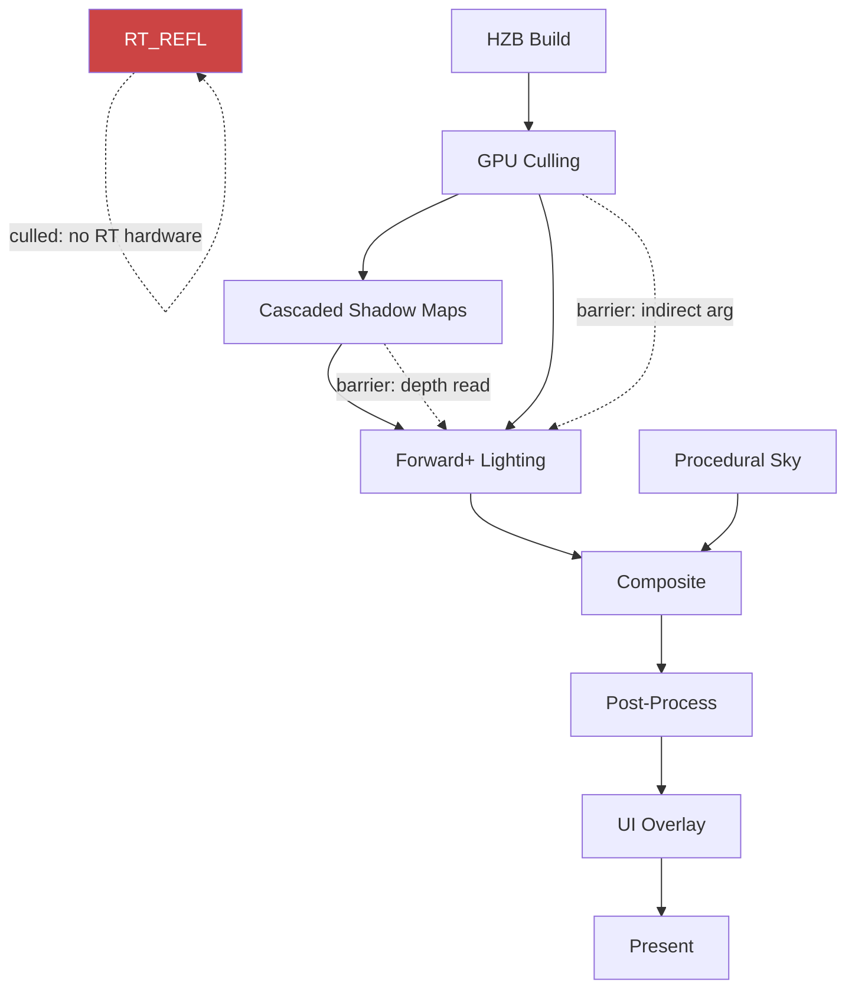
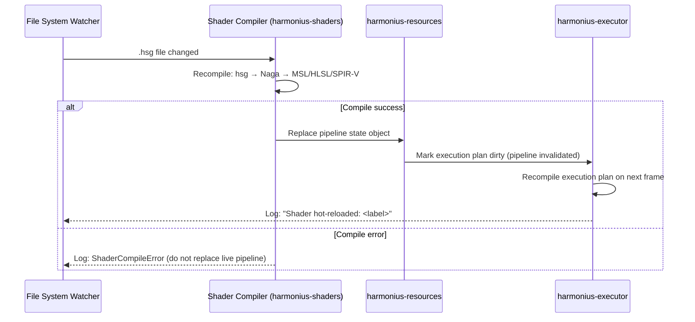

# Harmonius - Instrumentation & Tooling

This document defines the observability, profiling, and debugging infrastructure for
Harmonius. The instrumentation layer is designed around the same thread-safety boundary
as the rest of the library: the public API is 100% safe Rust; the per-backend
implementation lives in C++ and communicates back through the cxx.rs bridge.

All instrumentation is **opt-in at compile time** via Cargo feature flags and **opt-in
at runtime** via `InstrumentationConfig`. Zero-overhead is maintained in release builds
when features are disabled.

---

## Cargo Feature Flags

| Feature | Default | Description |
|---|---|---|
| `instrument-alloc` | off | GPU and CPU allocation tracking |
| `instrument-resources` | off | Resource lifecycle and descriptor tracking |
| `instrument-gpu-counters` | off | GPU timer queries and pipeline statistics |
| `instrument-cpu-counters` | off | CPU-side frame timing and thread utilization |
| `instrument-tracing` | off | Render graph execution timeline export |
| `instrument-shader-debug` | off | Shader printf capture and hot-reload |
| `instrument-all` | off | Enables all instrumentation features |
| `instrument-dev` | off | `alloc + resources + gpu-counters + cpu-counters` (typical dev build) |

---

## 1. Allocation Tracking

### 1.1 Scope

Allocation tracking covers four categories of memory:

| Category | Description | Granularity |
|---|---|---|
| **GPU Device Memory** | Buffers, textures, acceleration structures | Per-resource, per-pool, per-frame |
| **GPU Staging Memory** | Upload ring buffers, readback staging | Per-ring-slot, per-frame |
| **CPU Host Memory** | Rust-side allocations for graph data, ring buffers | Per-allocation type |
| **Descriptor Heap** | Bindless descriptor index slots | Per-heap, per-type |

### 1.2 Metrics Tracked

| Metric | Type | Reset Cadence |
|---|---|---|
| `current_bytes` | `u64` | Live |
| `peak_bytes` | `u64` | Session or per-run |
| `allocation_count` | `u64` | Live |
| `deallocation_count` | `u64` | Live |
| `external_fragmentation_pct` | `f32` | Sampled per-frame |
| `pool_utilization_pct` | `f32` | Sampled per-frame |
| `frame_high_watermark_bytes` | `u64` | Reset each frame |
| `leaked_at_device_destroy` | `Vec<AllocationRecord>` | Device teardown |

### 1.3 AllocationRecord

```rust
/// A snapshot of a single GPU allocation, held by AllocationTracker.
#[derive(Debug, Clone)]
pub struct AllocationRecord {
    /// Opaque handle identifying the underlying GPU resource.
    pub handle: ResourceHandle,
    /// Human-readable label, set via DebugMarker or resource creation desc.
    pub label: Option<Box<str>>,
    /// Allocated size in bytes.
    pub size_bytes: u64,
    /// Alignment in bytes.
    pub alignment_bytes: u64,
    /// Which memory pool (device-local, upload, readback).
    pub pool: MemoryPool,
    /// Backtrace captured at allocation site (debug builds only).
    #[cfg(feature = "instrument-alloc")]
    pub backtrace: Option<Backtrace>,
    /// Frame index when the allocation was created.
    pub created_frame: u64,
    /// Frame index when the allocation was freed. None if still live.
    pub freed_frame: Option<u64>,
}

#[derive(Debug, Clone, Copy, PartialEq, Eq)]
pub enum MemoryPool {
    /// GPU-private (VRAM). Fastest for GPU; inaccessible to CPU.
    DeviceLocal,
    /// CPU-writable, GPU-readable. Upload staging, ring buffers.
    Upload,
    /// GPU-writable, CPU-readable. Readback buffers.
    Readback,
    /// Metal unified memory / Vulkan host-visible device-local.
    UnifiedVisible,
}
```

### 1.4 AllocationTracker Trait

```rust
/// Implemented by each backend's allocator and exposed through the bridge.
/// All methods are called from render or IO threads (not the user thread).
pub trait AllocationTracker: Send + Sync {
    /// Called immediately after a GPU resource is allocated.
    fn on_allocate(&self, record: AllocationRecord);

    /// Called immediately before a GPU resource is freed.
    fn on_free(&self, handle: ResourceHandle);

    /// Returns an immutable snapshot of all live allocations.
    fn snapshot(&self) -> AllocationSnapshot;

    /// Returns current bytes used in the given pool.
    fn current_bytes(&self, pool: MemoryPool) -> u64;

    /// Returns peak bytes ever used in the given pool since last reset.
    fn peak_bytes(&self, pool: MemoryPool) -> u64;

    /// Returns all allocations that were live when this is called at device destroy.
    /// Used for leak detection.
    fn drain_live_at_destroy(&self) -> Vec<AllocationRecord>;

    /// Reset peak watermarks. Call at frame boundary when needed.
    fn reset_peaks(&self);
}

/// A consistent point-in-time snapshot, safe to send to the user thread.
#[derive(Debug, Clone)]
pub struct AllocationSnapshot {
    pub frame_index: u64,
    pub per_pool: HashMap<MemoryPool, PoolStats>,
    pub live_records: Vec<AllocationRecord>,
}

#[derive(Debug, Clone, Copy)]
pub struct PoolStats {
    pub current_bytes: u64,
    pub peak_bytes: u64,
    pub allocation_count: u64,
    pub deallocation_count: u64,
    pub external_fragmentation_pct: f32,
}
```

### 1.5 Memory Leak Detection

At device teardown, the executor calls `AllocationTracker::drain_live_at_destroy()`.
Any returned records constitute leaks. The library logs each record via the `tracing`
crate at `ERROR` level and — in debug builds — prints the captured backtrace. Leaks do
not panic; they are reported and the teardown continues to avoid masking real errors.

```rust
// harmonius-executor teardown (simplified)
fn destroy_device(device: &mut BackendDevice, tracker: &dyn AllocationTracker) {
    let leaks = tracker.drain_live_at_destroy();
    for record in &leaks {
        tracing::error!(
            label = ?record.label,
            size  = record.size_bytes,
            pool  = ?record.pool,
            frame = record.created_frame,
            "GPU memory leak detected"
        );
        #[cfg(debug_assertions)]
        if let Some(bt) = &record.backtrace {
            tracing::error!("{bt}");
        }
    }
    device.destroy();
}
```

### 1.6 Per-Frame Budget Gates

The allocation tracker feeds into the runtime budget system. A configurable
`GpuMemoryBudget` threshold can disable budget-gated passes (e.g., volumetrics, high-res
RT) when VRAM pressure exceeds a limit.

```rust
#[derive(Debug, Clone)]
pub struct GpuMemoryBudget {
    /// Total VRAM reported by the device.
    pub total_device_local_bytes: u64,
    /// Disable budget-gated passes above this utilization fraction (e.g., 0.85).
    pub high_pressure_threshold: f32,
    /// Re-enable passes below this fraction (hysteresis).
    pub low_pressure_threshold: f32,
}
```

---

## 2. Resource Tracking

### 2.1 Resource Lifecycle

```mermaid
stateDiagram-v2
    [*] --> Created : ResourceManager::create()
    Created --> Loading : IO worker picks up
    Loading --> Resident : GPU upload complete, fence signaled
    Resident --> InUse : Referenced by active execution plan pass
    InUse --> Resident : Pass execution complete
    Resident --> Evicting : Memory pressure / LRU eviction
    Evicting --> Loading : Re-requested (streaming cache miss)
    Evicting --> Destroyed : No longer needed
    Destroyed --> [*]

    Loading --> Loading : Progressive streaming (next mip/slice)
    InUse --> InUse : Multi-pass read (ref-counted in-use)
```

Each state transition is recorded by the resource tracker with a frame index and
timestamp.

### 2.2 ResourceLifecycleEvent

```rust
#[derive(Debug, Clone)]
pub struct ResourceLifecycleEvent {
    pub handle: ResourceHandle,
    pub label: Option<Box<str>>,
    /// Frame index when the transition occurred.
    pub frame_index: u64,
    /// Wall-clock time in nanoseconds since device creation.
    pub timestamp_ns: u64,
    pub from_state: ResourceState,
    pub to_state: ResourceState,
    /// For Loading→Resident: which pass triggered the upload.
    pub trigger_pass: Option<PassId>,
}

#[derive(Debug, Clone, Copy, PartialEq, Eq)]
pub enum ResourceState {
    Created,
    Loading,
    Resident,
    InUse,
    Evicting,
    Destroyed,
}
```

### 2.3 Per-Frame Resource Usage

The executor records, for each frame, which passes read and which passes write each
resource. This is used for debugging unexpected resource sharing and for verifying
barrier correctness.

```rust
#[derive(Debug, Clone, Default)]
pub struct FrameResourceUsage {
    pub frame_index: u64,
    /// Maps each resource to the passes that read it this frame.
    pub reads: HashMap<ResourceHandle, Vec<PassId>>,
    /// Maps each resource to the pass that wrote it this frame (at most one writer
    /// per frame by the single-writer invariant; see ARCH-5).
    pub writes: HashMap<ResourceHandle, PassId>,
}
```

### 2.4 Bindless Descriptor Index Tracking

The bindless heap tracker records which descriptor indices are live, which are free, and
which index maps to which resource handle. This aids debugging of bindless access
violations.

```rust
pub trait BindlessIndexTracker: Send + Sync {
    /// Called when a bindless slot is allocated to a resource.
    fn on_bind(&self, index: u32, handle: ResourceHandle, label: Option<&str>);

    /// Called when a bindless slot is released.
    fn on_unbind(&self, index: u32);

    /// Returns the resource handle currently bound at `index`, or None if free.
    fn lookup(&self, index: u32) -> Option<ResourceHandle>;

    /// Returns all free slot indices.
    fn free_slots(&self) -> Vec<u32>;

    /// Returns total capacity of the bindless heap.
    fn capacity(&self) -> u32;

    /// Returns number of currently occupied slots.
    fn occupied_count(&self) -> u32;
}
```

### 2.5 Streaming Residency Tracking

```rust
#[derive(Debug, Clone)]
pub struct ResidencyReport {
    pub frame_index: u64,
    /// Number of resources in each state.
    pub state_counts: HashMap<ResourceState, u32>,
    /// Resources that have been in Loading state for more than
    /// `stall_threshold_frames` frames without becoming Resident.
    pub stalled_loads: Vec<ResourceHandle>,
    /// Resources that entered Evicting state this frame.
    pub newly_evicted: Vec<ResourceHandle>,
    /// Resources that became Resident this frame (uploads completed).
    pub newly_resident: Vec<ResourceHandle>,
    pub stall_threshold_frames: u32,
}
```

### 2.6 Orphaned Resource Detection

A resource is orphaned when its `ResourceHandle` has been dropped by user code but the
underlying GPU allocation is still live. The tracker detects this by comparing handle
reference counts with the live-allocation list at the end of each frame.

```rust
/// Emitted via tracing::warn! when an orphaned resource is detected.
#[derive(Debug)]
pub struct OrphanedResourceWarning {
    pub handle: ResourceHandle,
    pub label: Option<Box<str>>,
    pub size_bytes: u64,
    /// How many frames the resource has been orphaned.
    pub orphan_age_frames: u32,
}
```

---

## 3. GPU Counters

### 3.1 Per-Pass GPU Timer Queries

Each pass in the execution plan can be bracketed by GPU timer queries. On platforms
that support them, the results are read back asynchronously (N+1 or N+2 frames later)
to avoid GPU stalls.

| Platform | Query Mechanism | Timestamp Unit | Readback |
|---|---|---|---|
| Metal | `MTLCounterSampleBuffer` + `MTLCounterSet.timestamp` | GPU ticks (convert via `MTLDevice.sampleTimestamps`) | Blit copy to shared buffer |
| Vulkan | `VK_QUERY_TYPE_TIMESTAMP` + `vkCmdWriteTimestamp2` + `VK_EXT_calibrated_timestamps` | Nanoseconds (via `VkPhysicalDeviceProperties.limits.timestampPeriod`) | `vkGetQueryPoolResults` deferred read |
| D3D12 | `ID3D12QueryHeap` (type `D3D12_QUERY_HEAP_TYPE_TIMESTAMP`) + `ID3D12CommandList::EndQuery` + `GetClockCalibration` | GPU ticks (convert via `ID3D12CommandQueue::GetTimestampFrequency`) | Resolve to readback buffer, map on CPU |

```rust
/// A single bidirectional timer around one render graph pass.
#[derive(Debug, Clone)]
pub struct GpuTimerQuery {
    pub pass_id: PassId,
    pub pass_label: Box<str>,
    /// Queue the pass ran on.
    pub queue: QueueType,
    /// Absolute GPU start timestamp in nanoseconds, calibrated to CPU clock.
    pub start_ns: u64,
    /// Absolute GPU end timestamp in nanoseconds, calibrated to CPU clock.
    pub end_ns: u64,
    /// Frame this query belongs to.
    pub frame_index: u64,
}

impl GpuTimerQuery {
    /// Duration in microseconds.
    pub fn duration_us(&self) -> f64 {
        (self.end_ns.saturating_sub(self.start_ns)) as f64 / 1_000.0
    }
}
```

### 3.2 Pipeline Statistics

Pipeline statistic queries are optional and more expensive than timer queries. Enable
them per-pass via `PassBuilder::enable_pipeline_stats()`.

| Statistic | Metal | Vulkan | D3D12 |
|---|---|---|---|
| Vertices processed | `MTLCounterSet.statistic` (`verticesIn`) | `VK_QUERY_TYPE_PIPELINE_STATISTICS` (`vertexShaderInvocations`) | `D3D12_QUERY_TYPE_PIPELINE_STATISTICS1` (`VSInvocations`) |
| Primitives rasterized | `primitivesIn` | `clippingPrimitivesGenerated` | `CPrimitives` |
| Fragment invocations | `fragmentInvocations` | `fragmentShaderInvocations` | `PSInvocations` |
| Compute invocations | N/A (use timestamps) | `computeShaderInvocations` | `CSInvocations` |
| Mesh shader invocations | `meshInvocations` | `meshShaderInvocationsEXT` | `MSInvocations` |
| Task/Amplification invocations | `objectInvocations` | `taskShaderInvocationsEXT` | `ASInvocations` |

```rust
#[derive(Debug, Clone, Default)]
pub struct PipelineStats {
    pub pass_id: PassId,
    pub frame_index: u64,
    pub vertices_in: Option<u64>,
    pub primitives_rasterized: Option<u64>,
    pub fragment_invocations: Option<u64>,
    pub compute_invocations: Option<u64>,
    pub mesh_invocations: Option<u64>,
    pub task_invocations: Option<u64>,
}
```

### 3.3 Bandwidth Counters

Memory bandwidth counters are vendor- and platform-specific and are surfaced as
best-effort metrics.

| Platform | Mechanism | Coverage |
|---|---|---|
| Metal | `MTLCounterSet.bandwidth` (`totalBytesRead`, `totalBytesWritten`) | Apple GPU only |
| Vulkan | `VK_KHR_performance_query` (vendor extension) | AMD: RGP counters; NVIDIA: Nsight SDK |
| D3D12 | `ID3D12Device::SetStablePowerState` + PIX counters | PIX capture only |

```rust
#[derive(Debug, Clone, Default)]
pub struct BandwidthCounters {
    pub frame_index: u64,
    /// Bytes read from GPU memory (all caches) this frame.
    pub total_read_bytes: Option<u64>,
    /// Bytes written to GPU memory this frame.
    pub total_write_bytes: Option<u64>,
    /// L2 cache hit rate, 0.0–1.0, if available.
    pub l2_cache_hit_rate: Option<f32>,
    /// Whether these values are available for the current platform/driver.
    pub available: bool,
}
```

---

## 4. CPU Counters

### 4.1 Frame Time Breakdown

Every frame is divided into three phases, each measured with `std::time::Instant` on
the user thread and high-resolution monotonic clocks on render/IO threads.

```mermaid
gantt
    title Frame N CPU Timeline (example, 16.7ms budget)
    dateFormat  x
    axisFormat  %L ms

    section User Thread
    Build Phase        : 0, 2
    Submit Frame Data  : 2, 1

    section Render Thread 1
    Compile (if dirty) : 0, 4
    Execute Phase      : 4, 8

    section IO Thread
    Streaming Requests : 0, 6
    Transfer Flush     : 6, 2

    section Async Compute
    Mesh Generation    : 0, 10
```



```rust
#[derive(Debug, Clone, Default)]
pub struct FrameTimings {
    pub frame_index: u64,

    // User thread phases
    /// Time to build / update the render graph (graph.build() call).
    pub build_phase_us: f64,
    /// Time the graph compiler ran (only non-zero on compile frames).
    pub compile_phase_us: f64,
    /// Time to push frame data to the ring buffer.
    pub frame_data_upload_us: f64,
    /// Animation state machine evaluation time (CPU blend tree walk).
    pub animation_eval_us: f64,
    /// Scene graph transform hierarchy update.
    pub scene_update_us: f64,
    /// CPU-side distance sorting (transparent objects, LOD selection).
    pub distance_sort_us: f64,

    // Render thread aggregate
    /// Sum of all render thread command encoding time.
    pub command_encoding_us: f64,
    /// Time from first command buffer commit to present callback.
    pub gpu_present_latency_us: f64,

    // IO thread aggregate
    /// Total time spent dispatching streaming requests.
    pub io_dispatch_us: f64,
    /// Transfer queue throughput this frame (upload bytes / elapsed time).
    pub transfer_throughput_mb_per_s: f64,
    /// Bytes transferred to GPU this frame.
    pub transfer_bytes: u64,
}
```

### 4.2 Per-Thread Utilization

```rust
#[derive(Debug, Clone)]
pub struct ThreadUtilization {
    pub frame_index: u64,
    pub threads: Vec<ThreadStats>,
}

#[derive(Debug, Clone)]
pub struct ThreadStats {
    pub thread_kind: ThreadKind,
    pub thread_index: u32,
    /// Fraction of the frame budget this thread was active, 0.0–1.0.
    pub active_fraction: f32,
    /// Time spent blocked on GPU fences.
    pub fence_wait_us: f64,
    /// Time spent blocked on inter-thread synchronization (ring buffer full, etc.).
    pub sync_wait_us: f64,
}

#[derive(Debug, Clone, Copy, PartialEq, Eq)]
pub enum ThreadKind {
    User,
    Render,
    Io,
    AsyncCompute,
}
```

### 4.3 Transfer Queue Throughput

Transfer throughput is tracked per queue slot and reported as MB/s, rolling averaged
over a configurable window (default 16 frames).

```rust
#[derive(Debug, Clone)]
pub struct TransferStats {
    pub frame_index: u64,
    /// Instantaneous MB/s for this frame.
    pub instant_mb_per_s: f64,
    /// Rolling average MB/s over `window_frames` frames.
    pub avg_mb_per_s: f64,
    pub window_frames: u32,
    pub bytes_in_flight: u64,
    pub completed_uploads: u32,
    pub pending_uploads: u32,
}
```

---

## 5. Graph Execution Tracing

### 5.1 Timeline Overview

The execution tracer records a timeline of all pass executions across all queues for a
given frame. Each event records which pass ran, on which queue, with its start and end
timestamps calibrated to the CPU clock.

### 5.2 TimelineEvent

```rust
#[derive(Debug, Clone)]
pub struct TimelineEvent {
    pub event_kind: TimelineEventKind,
    /// Wall-clock nanoseconds since device creation, CPU-clock.
    pub timestamp_ns: u64,
    pub frame_index: u64,
    /// Thread or queue this event originated from.
    pub origin: EventOrigin,
}

#[derive(Debug, Clone)]
pub enum TimelineEventKind {
    PassBegin {
        pass_id: PassId,
        pass_label: Box<str>,
        queue: QueueType,
    },
    PassEnd {
        pass_id: PassId,
        gpu_duration_us: Option<f64>,
    },
    ResourceBarrier {
        resource: ResourceHandle,
        from_layout: ResourceLayout,
        to_layout: ResourceLayout,
        src_stage: PipelineStage,
        dst_stage: PipelineStage,
    },
    FenceSignal {
        fence_id: FenceId,
        value: u64,
        queue: QueueType,
    },
    FenceWait {
        fence_id: FenceId,
        value: u64,
        queue: QueueType,
        stall_us: Option<f64>,
    },
    TransferComplete {
        resource: ResourceHandle,
        bytes: u64,
    },
    FrameBegin,
    FrameEnd,
}

#[derive(Debug, Clone, Copy, PartialEq, Eq)]
pub enum QueueType {
    Graphics,
    AsyncCompute,
    Transfer,
}

#[derive(Debug, Clone, Copy)]
pub enum EventOrigin {
    Thread { kind: ThreadKind, index: u32 },
    Queue(QueueType),
}
```

### 5.3 Pass Dependency Visualization (Mermaid Generation)

The execution plan can emit a Mermaid diagram of the compiled pass dependency graph
at runtime. This is useful for visualizing the current active graph (post-culling).

```rust
impl ExecutionPlan {
    /// Generate a Mermaid `graph TD` diagram of the compiled pass dependency graph.
    /// Pass nodes that are culled are shown with a red fill.
    /// Resource barrier edges are shown as dashed lines.
    #[cfg(feature = "instrument-tracing")]
    pub fn to_mermaid_diagram(&self) -> String {
        // ... implementation emits Mermaid DSL
    }
}
```

Example output for a typical forward+ frame:



### 5.4 Chrome Tracing Export

The tracer can serialize its event buffer to the Chrome Tracing JSON format, which can
be loaded directly into `chrome://tracing` or Perfetto UI.

```rust
/// Export a collected frame trace to Chrome Tracing JSON.
pub fn export_chrome_trace(
    events: &[TimelineEvent],
    gpu_queries: &[GpuTimerQuery],
    out: &mut dyn std::io::Write,
) -> std::io::Result<()>;
```

The exported JSON contains:

| Chrome Tracing Field | Harmonius Source |
|---|---|
| `"ph": "B"` / `"ph": "E"` | `PassBegin` / `PassEnd` events |
| `"ph": "X"` (complete) | `GpuTimerQuery` (single event with duration) |
| `"ph": "i"` (instant) | `FenceSignal`, `ResourceBarrier`, `TransferComplete` |
| `"tid"` | Thread index or queue index |
| `"pid"` | Thread kind (User=0, Render=1, IO=2, Compute=3) |
| `"ts"` | Timestamp in microseconds |
| `"dur"` | Duration in microseconds (for `"ph": "X"`) |
| `"name"` | Pass label, fence name, resource label |
| `"args"` | Additional metadata (queue type, barrier stages, bytes) |

Example usage:

```rust
let trace_events = tracer.drain_frame_events(frame_index);
let gpu_queries = gpu_counter.drain_frame_queries(frame_index);
let mut file = std::fs::File::create("frame_42.json")?;
export_chrome_trace(&trace_events, &gpu_queries, &mut file)?;
```

---

## 6. Shader Logging & Debugging

### 6.1 Shader Printf / Debug Output Capture

When `instrument-shader-debug` is enabled, shaders may use a debug-output buffer to
emit printf-style messages. The buffer is a ring buffer allocated in a CPU-readable
pool and flushed after each frame.

| Platform | Mechanism |
|---|---|
| Metal | Shader writes to a device-shared `MTLBuffer` using atomic index; CPU maps and reads |
| Vulkan | `VK_EXT_debug_printf` validation layer feature; messages forwarded to `VkDebugUtilsMessengerEXT` callback |
| D3D12 | UAV write to a structured readback buffer; `OutputDebugStringA` forwarding in debug layer |

```rust
#[derive(Debug, Clone)]
pub struct ShaderDebugMessage {
    /// Source pass that emitted this message.
    pub pass_id: PassId,
    /// Shader stage (vertex, fragment, compute, mesh, etc.).
    pub stage: ShaderStage,
    /// Lane/invocation that emitted it (thread_position_in_grid or SV_GroupID).
    pub invocation_id: [u32; 3],
    /// The formatted string output.
    pub message: Box<str>,
    pub frame_index: u64,
}
```

### 6.2 Platform Shader Debuggers

| Tool | Platform | Integration |
|---|---|---|
| **Xcode GPU Frame Capture** | macOS / Metal | The Metal backend inserts `MTLCaptureManager` begin/end calls when `InstrumentationConfig::xcode_gpu_capture` is enabled. Programmatic capture is triggered by `Device::begin_capture()`. The library marks command buffers with `MTLCommandBuffer.label` and encodes debug groups via `pushDebugGroup` / `popDebugGroup`. |
| **Metal System Trace** | macOS / Metal | Enabled automatically when the process is profiled by Instruments. No extra library integration needed beyond labeled command buffers. |
| **RenderDoc** | Vulkan / D3D12 | The library calls `RENDERDOC_GetAPI` at device init if RenderDoc is injected. Frame captures are triggered via `renderdoc_api.TriggerCapture()`. Debug regions use `vkCmdBeginDebugUtilsLabelEXT` (Vulkan) or `ID3D12GraphicsCommandList::BeginEvent` (D3D12). |
| **PIX** | Windows / D3D12 | Link-time integration via `WinPixEventRuntime`. The D3D12 backend calls `PIXBeginEvent` / `PIXEndEvent` on command lists. Programmatic captures use `PIXGpuCaptureInterface`. |
| **Nsight Graphics** | Windows / Vulkan, D3D12 | Standard Vulkan debug utils labels and D3D12 PIX events are recognized automatically by Nsight. |
| **AMD Radeon GPU Profiler (RGP)** | Vulkan | Uses `VK_AMD_rasterization_order` and `VK_EXT_debug_marker` (deprecated path) or `VK_EXT_debug_utils`. Harmonius emits standard debug utils labels that RGP recognizes. |

### 6.3 Shader Compilation Error Reporting

When Naga compilation fails or the backend compiler (DXC, Metal shader compiler) rejects
the emitted code, the error is surfaced through a structured type with source location.

```rust
#[derive(Debug, Clone)]
pub struct ShaderCompileError {
    pub shader_label: Box<str>,
    /// The Naga IR module that failed (for diagnostics).
    pub naga_module_dump: Option<Box<str>>,
    pub backend: ShaderBackend,
    pub errors: Vec<ShaderDiagnostic>,
}

#[derive(Debug, Clone)]
pub struct ShaderDiagnostic {
    pub severity: DiagnosticSeverity,
    pub message: Box<str>,
    /// Line in the emitted MSL/HLSL/SPIR-V source.
    pub source_line: Option<u32>,
    pub source_col: Option<u32>,
    /// If traceable, the original Naga IR span.
    pub naga_span: Option<naga::Span>,
}

#[derive(Debug, Clone, Copy, PartialEq, Eq)]
pub enum ShaderBackend {
    Msl,
    Hlsl,
    SpirV,
}

#[derive(Debug, Clone, Copy, PartialEq, Eq)]
pub enum DiagnosticSeverity {
    Error,
    Warning,
    Note,
}
```

### 6.4 Naga IR Debug Dump

For debugging shader graph compilation, the library can dump the Naga IR module as WGSL
text (Naga's debug-friendly output format) to a file or string.

```rust
impl CompiledShader {
    /// Emit the Naga module as WGSL text for inspection.
    /// Requires the `naga/wgsl-out` feature.
    #[cfg(feature = "instrument-shader-debug")]
    pub fn dump_wgsl(&self) -> Result<String, naga::back::wgsl::Error>;

    /// Write WGSL dump to `<label>.wgsl` in the given directory.
    #[cfg(feature = "instrument-shader-debug")]
    pub fn write_wgsl_dump(&self, dir: &std::path::Path) -> std::io::Result<()>;
}
```

### 6.5 Shader Hot-Reload Workflow

When `InstrumentationConfig::enable_shader_hot_reload` is true, the library watches
shader graph source files for changes using a platform file-watcher and re-compiles
changed shaders without restarting the application.



The old pipeline state object is kept alive until the GPU has finished all in-flight
frames that reference it (checked via per-frame fences) before being released.

---

## 7. Developer Tool Integration

### 7.1 Metal: Xcode GPU Frame Capture

| Integration Point | Library Behavior |
|---|---|
| `MTLCaptureManager` | Initialized at device creation when `xcode_gpu_capture = true`. |
| Command buffer labels | Every `MTLCommandBuffer` is labeled `"harmonius/<pass_label>/frame<N>"`. |
| Debug groups | `pushDebugGroup` / `popDebugGroup` brackets every render and compute pass. |
| Programmatic capture | `Device::begin_gpu_capture()` / `Device::end_gpu_capture()` calls `MTLCaptureManager.startCapture(with:)` / `.stopCapture()`. |
| Capture destination | Configurable: developer tools (default), GPU trace file (`.gputrace`). |
| Metal Validation Layer | Enabled automatically when the `METAL_DEVICE_WRAPPER_TYPE=1` environment variable is set, or when `InstrumentationConfig::metal_validation = true`. |
| Metal System Trace | No library changes required; Instruments automatically traces labeled command buffers. |

```rust
impl Device {
    /// Begin a programmatic Metal GPU frame capture.
    /// No-op on non-Metal backends or when capture is not configured.
    #[cfg(feature = "instrument-all")]
    pub fn begin_gpu_capture(&self, label: &str);

    /// End the current programmatic Metal GPU frame capture.
    #[cfg(feature = "instrument-all")]
    pub fn end_gpu_capture(&self);
}
```

### 7.2 Vulkan: Validation Layers, RenderDoc, RGP

| Integration Point | Library Behavior |
|---|---|
| Validation Layers | `VK_LAYER_KHRONOS_validation` is requested when `InstrumentationConfig::vulkan_validation = true`. The `VkDebugUtilsMessengerEXT` callback routes all messages to the `tracing` crate at appropriate log levels. |
| Object naming | All `VkImage`, `VkBuffer`, `VkPipeline` objects are named via `vkSetDebugUtilsObjectNameEXT` using the resource label. |
| Debug regions | `vkCmdBeginDebugUtilsLabelEXT` / `vkCmdEndDebugUtilsLabelEXT` brackets every pass on every command buffer. |
| RenderDoc capture | If `librenderdoc.so` (Linux) or `renderdoc.dll` (Windows) is present, `RENDERDOC_GetAPI` is called and `renderdoc_api.TriggerCapture()` is exposed via `Device::trigger_renderdoc_capture()`. |
| RGP | Standard `VK_EXT_debug_utils` labels are recognized by AMD RGP. No additional integration needed. |
| `VK_EXT_device_fault` | Enabled when available. On GPU crash / device lost, `vkGetDeviceFaultInfoEXT` is called and the fault info is logged before teardown. |

### 7.3 D3D12: PIX, DRED, Debug Layer

| Integration Point | Library Behavior |
|---|---|
| D3D12 Debug Layer | `ID3D12Debug::EnableDebugLayer()` is called when `InstrumentationConfig::d3d12_debug_layer = true`. `ID3D12Debug1::SetEnableGPUBasedValidation(true)` enables GPU-based validation (expensive; off by default). |
| Object naming | All `ID3D12Resource`, `ID3D12PipelineState` objects are named via `SetName()` using the resource label. |
| PIX events | `PIXBeginEvent` / `PIXEndEvent` brackets every pass on every command list via `WinPixEventRuntime`. Colors are assigned deterministically by pass type (render=blue, compute=green, transfer=orange). |
| Programmatic PIX capture | `PIXGpuCaptureInterface` exposed via `Device::trigger_pix_capture()`. |
| DRED (Device Removed Extended Data) | `ID3D12DeviceRemovedExtendedDataSettings::SetAutoBreadcrumbsEnablement(D3D12_DRED_ENABLEMENT_FORCED_ON)` and `SetPageFaultEnablement` are called when `InstrumentationConfig::dred = true`. On `DXGI_ERROR_DEVICE_REMOVED`, `ID3D12DeviceRemovedExtendedData::GetAutoBreadcrumbsOutput()` and `GetPageFaultAllocationOutput()` are logged in full. |
| Enhanced Barriers | Used by default (Agility SDK). `D3D12_RESOURCE_BARRIER_TYPE_TEXTURE_BARRIER` is the primary barrier type; legacy split barriers are not used. |

---

## 8. Instrumentation API

### 8.1 InstrumentationConfig

`InstrumentationConfig` is passed to `HarmoniusApp::new()` and controls what
instrumentation is active for the lifetime of the device. It is safe Rust with no
unsafe code.

```rust
/// Top-level instrumentation configuration. Passed at device creation.
/// All fields default to disabled / off.
#[derive(Debug, Clone)]
pub struct InstrumentationConfig {
    // --- Allocation tracking ---
    /// Track GPU and staging buffer allocations.
    pub track_allocations: bool,
    /// Capture allocation backtraces (debug builds only; expensive).
    pub capture_backtraces: bool,
    /// VRAM budget thresholds for adaptive quality.
    pub gpu_memory_budget: Option<GpuMemoryBudget>,

    // --- Resource tracking ---
    /// Track resource lifecycle state transitions.
    pub track_resource_lifecycle: bool,
    /// Track per-frame resource read/write usage.
    pub track_resource_usage: bool,
    /// Report orphaned resources at frame end.
    pub detect_orphaned_resources: bool,
    /// Number of frames a resource can be stalled in Loading before warning.
    pub streaming_stall_threshold_frames: u32,

    // --- GPU counters ---
    /// Insert GPU timer queries around every pass.
    pub gpu_timers: bool,
    /// Collect pipeline statistics (more expensive than timers).
    pub pipeline_stats: bool,
    /// Attempt to read bandwidth counters (platform/vendor dependent).
    pub bandwidth_counters: bool,
    /// How many frames to delay GPU query readback to avoid stalls.
    pub gpu_query_readback_delay_frames: u32,

    // --- CPU counters ---
    /// Measure CPU phase timings every frame.
    pub cpu_timings: bool,
    /// Record per-thread utilization.
    pub thread_utilization: bool,
    /// Rolling window size for transfer throughput averaging.
    pub transfer_throughput_window_frames: u32,

    // --- Execution tracing ---
    /// Record a full execution timeline for later export.
    pub execution_tracing: bool,
    /// Maximum number of timeline events to keep in the ring buffer.
    pub trace_event_buffer_capacity: usize,

    // --- Shader debugging ---
    /// Enable shader printf buffer and message capture.
    pub shader_debug_output: bool,
    /// Watch shader source files for changes and hot-reload.
    pub enable_shader_hot_reload: bool,
    /// Directory to watch for .hsg file changes (None = disabled).
    pub shader_watch_dir: Option<std::path::PathBuf>,

    // --- Platform tool integration ---
    /// Metal: enable MTLCaptureManager and programmatic capture support.
    pub xcode_gpu_capture: bool,
    /// Metal: enable Metal Validation Layer.
    pub metal_validation: bool,
    /// Vulkan: request VK_LAYER_KHRONOS_validation.
    pub vulkan_validation: bool,
    /// Vulkan: enable VK_EXT_device_fault for crash reporting.
    pub vulkan_device_fault: bool,
    /// D3D12: enable ID3D12Debug debug layer.
    pub d3d12_debug_layer: bool,
    /// D3D12: enable GPU-based validation (very expensive).
    pub d3d12_gpu_validation: bool,
    /// D3D12: enable DRED auto-breadcrumbs and page fault reporting.
    pub dred: bool,
}

impl Default for InstrumentationConfig {
    fn default() -> Self {
        Self {
            track_allocations: false,
            capture_backtraces: false,
            gpu_memory_budget: None,
            track_resource_lifecycle: false,
            track_resource_usage: false,
            detect_orphaned_resources: false,
            streaming_stall_threshold_frames: 30,
            gpu_timers: false,
            pipeline_stats: false,
            bandwidth_counters: false,
            gpu_query_readback_delay_frames: 2,
            cpu_timings: false,
            thread_utilization: false,
            transfer_throughput_window_frames: 16,
            execution_tracing: false,
            trace_event_buffer_capacity: 65_536,
            shader_debug_output: false,
            enable_shader_hot_reload: false,
            shader_watch_dir: None,
            xcode_gpu_capture: false,
            metal_validation: false,
            vulkan_validation: false,
            vulkan_device_fault: false,
            d3d12_debug_layer: false,
            d3d12_gpu_validation: false,
            dred: false,
        }
    }
}

impl InstrumentationConfig {
    /// Preset for typical development builds: timers, CPU timings, resource lifecycle,
    /// and platform validation layers, but no expensive GPU-based validation or tracing.
    pub fn development() -> Self {
        Self {
            track_allocations: true,
            track_resource_lifecycle: true,
            detect_orphaned_resources: true,
            gpu_timers: true,
            cpu_timings: true,
            thread_utilization: true,
            metal_validation: true,
            vulkan_validation: true,
            d3d12_debug_layer: true,
            dred: true,
            ..Self::default()
        }
    }

    /// Preset for full profiling sessions: everything except shader hot-reload and
    /// GPU-based validation.
    pub fn profiling() -> Self {
        Self {
            track_allocations: true,
            capture_backtraces: false, // too expensive for profiling
            track_resource_lifecycle: true,
            track_resource_usage: true,
            gpu_timers: true,
            pipeline_stats: true,
            bandwidth_counters: true,
            cpu_timings: true,
            thread_utilization: true,
            execution_tracing: true,
            trace_event_buffer_capacity: 1_048_576,
            ..Self::default()
        }
    }
}
```

### 8.2 FrameStats

`FrameStats` is the single structure returned by `Executor::frame_stats(frame_index)`
after a frame completes. It aggregates all per-frame instrumentation into one
sendable snapshot.

```rust
/// All per-frame instrumentation data, safe to send to the user thread.
/// Fields are None when the corresponding InstrumentationConfig flag is disabled.
#[derive(Debug, Clone, Default)]
pub struct FrameStats {
    pub frame_index: u64,
    /// Wall-clock nanoseconds from frame begin to frame end (CPU clock).
    pub total_frame_ns: u64,

    // --- CPU timings ---
    pub timings: Option<FrameTimings>,

    // --- Thread utilization ---
    pub thread_utilization: Option<ThreadUtilization>,

    // --- GPU timer results (available gpu_query_readback_delay_frames later) ---
    pub gpu_timers: Option<Vec<GpuTimerQuery>>,

    // --- Pipeline statistics ---
    pub pipeline_stats: Option<Vec<PipelineStats>>,

    // --- Bandwidth counters ---
    pub bandwidth: Option<BandwidthCounters>,

    // --- Memory snapshot ---
    pub allocation_snapshot: Option<AllocationSnapshot>,

    // --- Transfer stats ---
    pub transfer_stats: Option<TransferStats>,

    // --- Resource residency ---
    pub residency: Option<ResidencyReport>,

    // --- Shader debug messages emitted this frame ---
    pub shader_messages: Option<Vec<ShaderDebugMessage>>,

    // --- Orphaned resources detected this frame ---
    pub orphaned_resources: Option<Vec<OrphanedResourceWarning>>,
}

impl FrameStats {
    /// Total GPU time across all passes in microseconds.
    /// Returns None if GPU timers are not available.
    pub fn total_gpu_us(&self) -> Option<f64> {
        self.gpu_timers.as_ref().map(|timers| {
            timers.iter().map(|t| t.duration_us()).sum()
        })
    }

    /// Returns the single slowest GPU pass by duration.
    pub fn slowest_gpu_pass(&self) -> Option<&GpuTimerQuery> {
        self.gpu_timers.as_ref().and_then(|timers| {
            timers.iter().max_by(|a, b| {
                a.duration_us().partial_cmp(&b.duration_us()).unwrap()
            })
        })
    }

    /// Returns GPU memory usage as a fraction of total VRAM, or None if not tracked.
    pub fn gpu_memory_pressure(&self, budget: &GpuMemoryBudget) -> Option<f32> {
        self.allocation_snapshot.as_ref().map(|snap| {
            let used = snap.per_pool
                .get(&MemoryPool::DeviceLocal)
                .map(|s| s.current_bytes)
                .unwrap_or(0);
            used as f32 / budget.total_device_local_bytes as f32
        })
    }
}
```

### 8.3 DebugMarker Trait

`DebugMarker` is implemented by backend command encoders and propagated through the
executor. It provides the interface for inserting named regions visible in platform
GPU frame debuggers.

```rust
/// Trait for inserting debug markers and regions into GPU command streams.
/// Implemented by all backend command encoders.
/// All methods are no-ops in release builds unless `instrument-all` is enabled.
pub trait DebugMarker {
    /// Begin a named debug region. Regions may be nested.
    /// Maps to: Metal pushDebugGroup / Vulkan vkCmdBeginDebugUtilsLabelEXT /
    ///          D3D12 PIXBeginEvent
    fn begin_region(&mut self, label: &str);

    /// End the current debug region.
    /// Maps to: Metal popDebugGroup / Vulkan vkCmdEndDebugUtilsLabelEXT /
    ///          D3D12 PIXEndEvent
    fn end_region(&mut self);

    /// Insert a single-point debug marker (not a region).
    /// Maps to: Metal insertDebugSignpost / Vulkan vkCmdInsertDebugUtilsLabelEXT /
    ///          D3D12 PIXSetMarker
    fn insert_marker(&mut self, label: &str);

    /// Execute a closure within a named debug region.
    /// Automatically calls begin_region and end_region.
    fn region<F: FnOnce(&mut Self)>(&mut self, label: &str, f: F)
    where
        Self: Sized,
    {
        self.begin_region(label);
        f(self);
        self.end_region();
    }
}
```

Usage example in a custom pass callback:

```rust
fn encode_shadow_pass(encoder: &mut dyn CommandEncoder, ctx: &PassContext) {
    encoder.region("ShadowMaps", |enc| {
        for cascade in 0..ctx.cascade_count {
            enc.region(&format!("Cascade {cascade}"), |enc| {
                enc.draw_mesh_indirect(ctx.indirect_buffer, cascade * STRIDE);
            });
        }
    });
}
```

### 8.4 Accessing Instrumentation Data

```rust
use harmonius::{HarmoniusApp, InstrumentationConfig};

fn main() {
    let config = InstrumentationConfig::development();
    let mut app = HarmoniusApp::new(window, config).unwrap();

    // ... build and compile render graph ...

    loop {
        app.render_frame();

        // FrameStats for the completed frame are available after render_frame().
        // GPU timer results trail by gpu_query_readback_delay_frames (default 2).
        if let Some(stats) = app.frame_stats() {
            if let Some(ref timers) = stats.gpu_timers {
                for timer in timers {
                    println!("{}: {:.2}us", timer.pass_label, timer.duration_us());
                }
            }
            if let Some(ref timings) = stats.timings {
                println!("Build: {:.2}us  Execute: {:.2}us",
                    timings.build_phase_us,
                    timings.command_encoding_us);
            }
        }

        // Export a Chrome trace for one specific frame.
        if app.current_frame() == 100 {
            let events = app.drain_trace_events(app.current_frame() - 1);
            let gpu_queries = app.drain_gpu_queries(app.current_frame() - 1);
            let mut f = std::fs::File::create("trace.json").unwrap();
            harmonius::export_chrome_trace(&events, &gpu_queries, &mut f).unwrap();
        }
    }
}
```

---

## Summary Table

| Section | Key Types | Feature Flag | Available In |
|---|---|---|---|
| Allocation Tracking | `AllocationTracker`, `AllocationRecord`, `AllocationSnapshot` | `instrument-alloc` | `FrameStats::allocation_snapshot` |
| Resource Tracking | `ResourceLifecycleEvent`, `FrameResourceUsage`, `ResidencyReport` | `instrument-resources` | `FrameStats::residency` |
| GPU Counters | `GpuTimerQuery`, `PipelineStats`, `BandwidthCounters` | `instrument-gpu-counters` | `FrameStats::gpu_timers`, `::pipeline_stats`, `::bandwidth` |
| CPU Counters | `FrameTimings`, `ThreadUtilization`, `TransferStats` | `instrument-cpu-counters` | `FrameStats::timings`, `::thread_utilization`, `::transfer_stats` |
| Graph Tracing | `TimelineEvent`, Chrome JSON export, Mermaid generation | `instrument-tracing` | `Device::drain_trace_events()` |
| Shader Debugging | `ShaderDebugMessage`, `ShaderCompileError`, hot-reload | `instrument-shader-debug` | `FrameStats::shader_messages` |
| Tool Integration | `DebugMarker` trait, platform capture APIs | `instrument-all` | Backend command encoders |
| Public API | `InstrumentationConfig`, `FrameStats`, `DebugMarker` | All | `harmonius` crate root |
