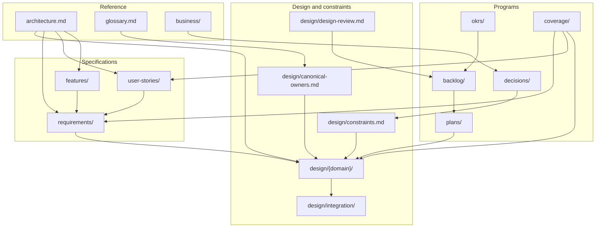
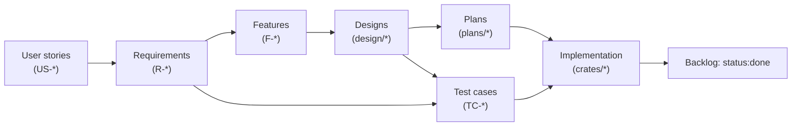

# Harmonius Documentation

This is the entry point for the Harmonius documentation corpus. Every directory under
`docs/` has an `AGENTS.md` rulebook and an `index.md` (or equivalent) entry point.

## Reading order

1. [`architecture.md`](architecture.md) — module reference, layered architecture, and
   subsystem map.
2. [`design/constraints.md`](design/constraints.md) — project-wide engineering
   constraints.
3. [`design/canonical-owners.md`](design/canonical-owners.md) — single index of who
   owns which shared type.
4. [`design/design-review.md`](design/design-review.md) — standing audit (status
   snapshot 2026-05-20).
5. [`glossary.md`](glossary.md) — engine-specific terminology.
6. [`decisions/index.md`](decisions/index.md) — ADRs and PDRs.
7. [`okrs/index.md`](okrs/index.md) — quarterly objectives.
8. [`backlog/index.md`](backlog/index.md) — open work items.
9. [`coverage/index.md`](coverage/index.md) — coverage matrices and audits.

## Subtree map

## Where things live

| Tree                                              | Purpose                                                |
|---------------------------------------------------|--------------------------------------------------------|
| [`architecture.md`](architecture.md)              | Module reference, layered architecture                 |
| [`glossary.md`](glossary.md)                      | Engine terminology and Harmonius-coined types          |
| [`design/`](design/)                              | Design docs, integration pairs, constraints            |
| [`requirements/`](requirements/)                  | `R-X.Y.Z` SHALL statements with Rationale + Verification |
| [`user-stories/`](user-stories/)                  | `US-X.Y.Z` persona-driven stories                      |
| [`features/`](features/)                          | `F-X.Y.Z` feature catalog                              |
| [`plans/`](plans/)                                | Implementation plans + dated progress files            |
| [`business/`](business/)                          | Domain decomposition, GTM, monetization                |
| [`decisions/`](decisions/)                        | Architecture and Product Decision Records              |
| [`okrs/`](okrs/)                                  | Quarterly Objectives and Key Results                   |
| [`backlog/`](backlog/)                            | Docs-native, GitHub-ready issue catalog (`BL-NNNN`)    |
| [`coverage/`](coverage/)                          | Coverage matrices and dated audits                     |

## Authoring conventions

- Every directory has an `AGENTS.md` rulebook. Read it before adding files there.
- All Markdown lines wrap at 100 characters. Tables that exceed 100 characters per
  line move long content into a numbered detail list under the table.
- Mermaid diagrams replace ASCII art. Render through MCP.
- JSON object keys are sorted lexicographically. JSON arrays are not sorted.
- IDs (`R-X.Y.Z`, `F-X.Y.Z`, `US-X.Y.Z`, `TC-X.Y.Z.N`, `BL-NNNN`, `ADR-NNNN`,
  `PDR-NNNN`, `O-N`, `KR-N.M`) are immutable once published.
- Cross-domain references use links to specific IDs, not "see requirements" or "as
  specified".

## Cycle of work

## Mode of authoring

The [`workflow`](https://github.com/cjhowe-us/marketplace) and `artifact` plugins from
the `cjhowe-us-marketplace` marketplace drive author / review / update flows. See
[root AGENTS.md](../AGENTS.md) for plugin commands and meta-workflows.
