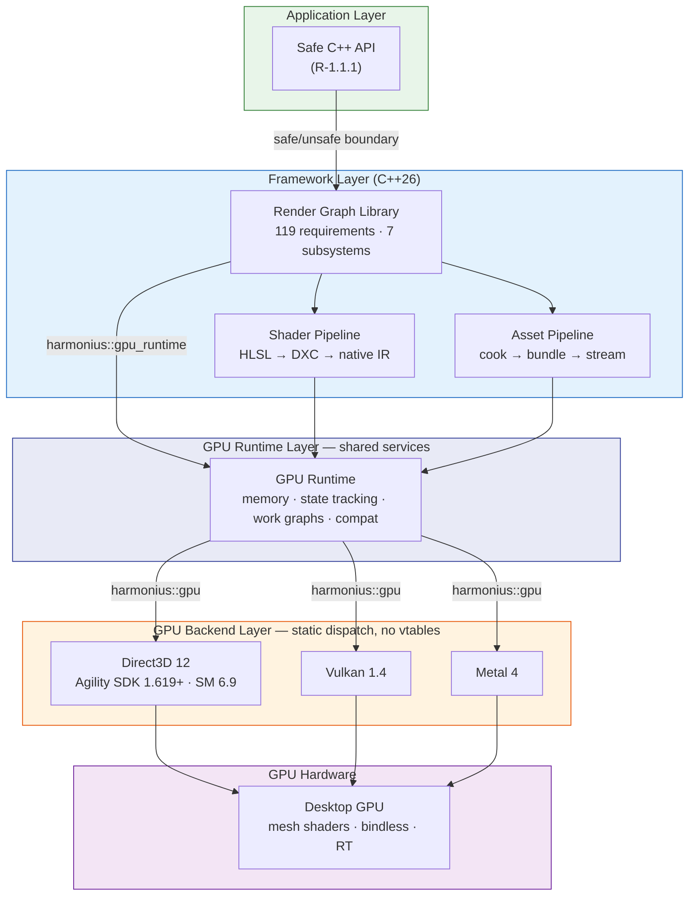
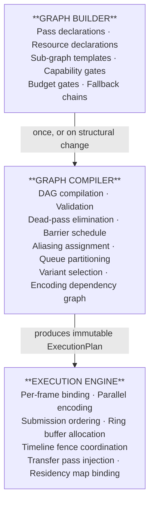
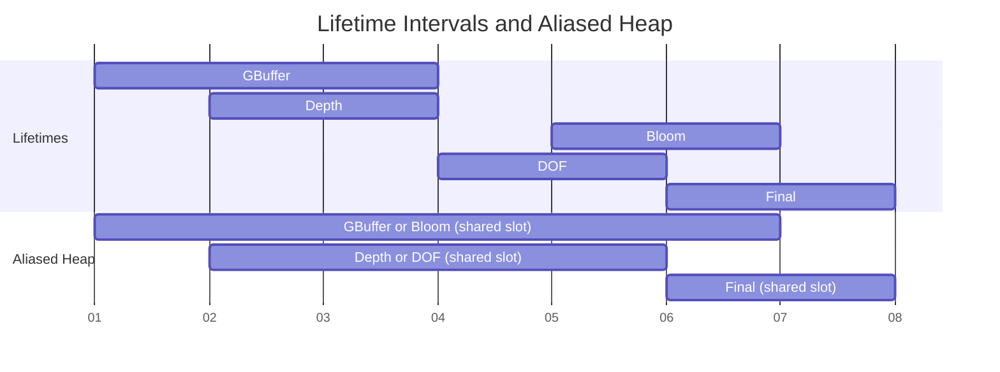
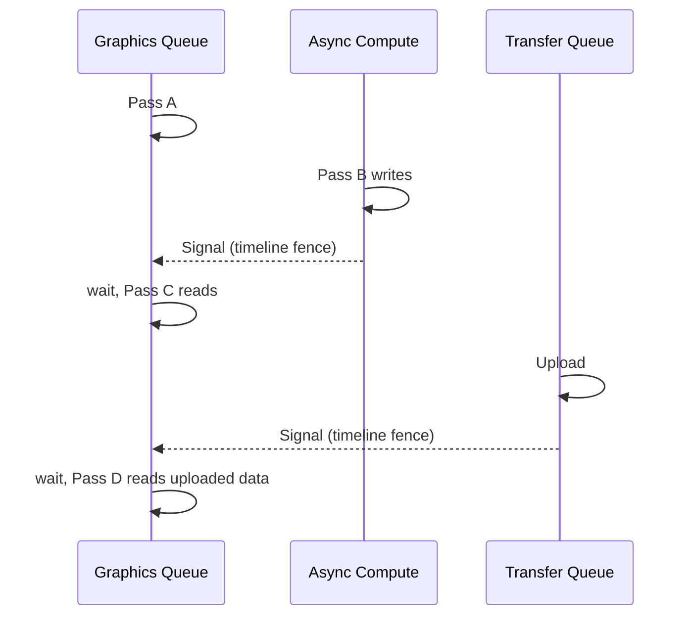
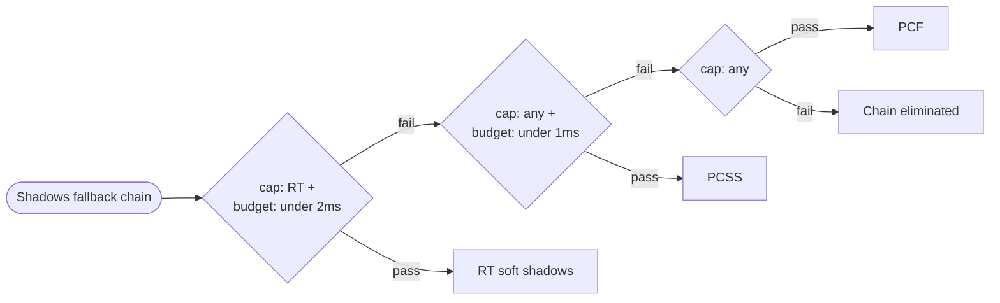
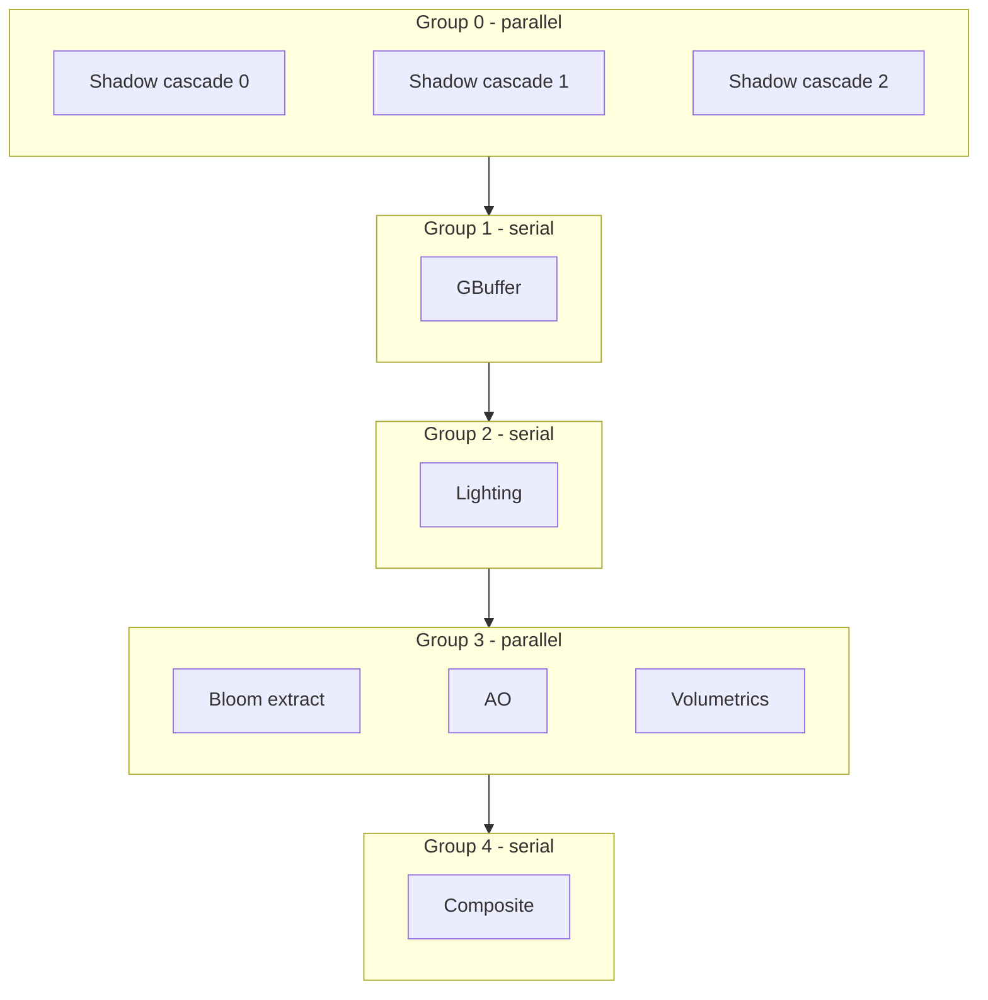
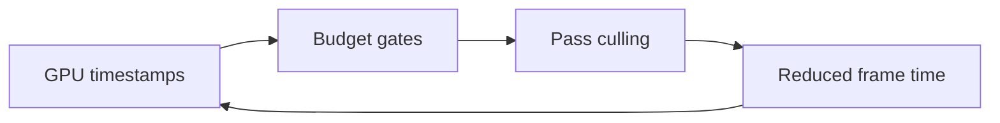
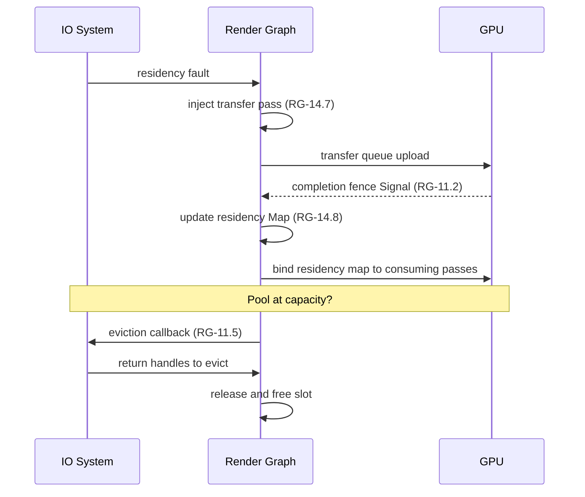
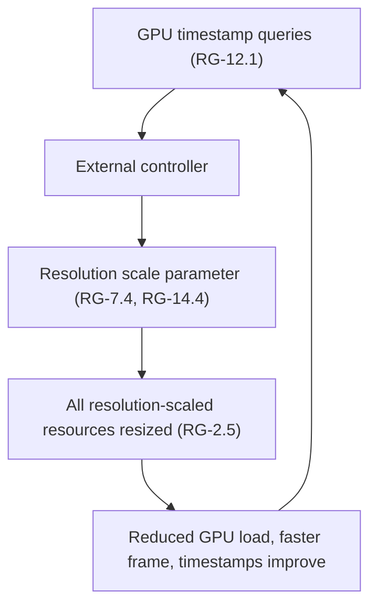
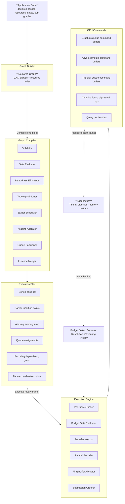

# Harmonius Architecture

System-wide architecture overview for the Harmonius GPU graphics framework.

## Contents

- [Harmonius Architecture](#harmonius-architecture)
  - [Contents](#contents)
  - [Overview](#overview)
  - [System Diagram](#system-diagram)
  - [Architectural Constraints](#architectural-constraints)
  - [Layers](#layers)
    - [Application Layer -- Safe C++ API](#application-layer----safe-c-api)
    - [Framework Layer -- C++26](#framework-layer----c26)
    - [GPU Backend Layer -- Static Dispatch](#gpu-backend-layer----static-dispatch)
  - [Framework Components](#framework-components)
    - [Render Graph Library](#render-graph-library)
    - [Shader Pipeline](#shader-pipeline)
    - [Asset Pipeline](#asset-pipeline)
  - [Platform Matrix](#platform-matrix)
  - [Build System](#build-system)
  - [Design Documents](#design-documents)

## Overview

Harmonius is a GPU graphics framework built around a declarative, frame-invariant render graph.
The framework provides three core subsystems -- a render graph library, a shader pipeline, and an
asset pipeline -- that sit on top of native GPU backends with zero abstraction overhead.

The user-facing API is a safe subset of C++ (R-1.1.1) that prohibits raw pointer arithmetic, manual
memory management, C-style casts, and unchecked array access. GPU backends are selected at compile
time via CMake and statically linked -- no vtables, no virtual methods, no shared libraries (R-1.1.5).

## System Diagram

## Architectural Constraints

These constraints (from
[1.1-core-constraints.md](requirements/1-architecture/1.1-core-constraints.md))
shape every component:

| ID      | Constraint                             | Impact                                                                               |
| ------- | -------------------------------------- | ------------------------------------------------------------------------------------ |
| R-1.1.1 | Safe C++ user-facing API               | Unsafe ops confined to render/IO threads behind internal boundaries                  |
| R-1.1.2 | GPU-driven rendering                   | Indirect dispatch for scene geometry; direct dispatch for async compute/mesh shaders |
| R-1.1.3 | Mesh shader pipeline                   | No legacy vertex/geometry/tessellation stages                                        |
| R-1.1.4 | Declarative render graph               | Frame-invariant DAG compiled once, executed per frame                                |
| R-1.1.5 | Native backends, no translation layers | Direct D3D12/Vulkan/Metal; no MoltenVK/DXVK                                          |
| R-1.1.6 | Modern hardware only                   | Bindless, mesh shaders, and RT required; no fallbacks                                |
| R-1.1.7 | Strict layer separation                | No backend types in render graph; no graph concepts in backend                       |

## Layers

### Application Layer -- Safe C++ API

The public API exposed to users. All interactions with the framework go through a safe subset of
C++ that prohibits raw pointer arithmetic, manual memory management, C-style casts, and unchecked
array access. Unsafe operations are confined to background render and IO threads behind clearly
marked internal boundaries. User code cannot trigger undefined behavior.

**Requirement:** R-1.1.1

### Framework Layer -- C++26

The core implementation layer. Three components -- the render graph library, shader pipeline, and
asset pipeline -- collaborate to turn a declarative scene description into GPU command streams.
All framework code is C++26, built with CMake 3.30+, and depends on vcpkg-managed packages.

### GPU Runtime Layer -- Shared Services

A shared services module (`harmonius::gpu_runtime`) between the GPU backend and framework
components. Provides memory management (heap sub-allocation, ring buffers, defragmentation),
GPU state tracking (redundant state elimination, resource state caching), work graph execution
(native GPU work graphs when available, CPU-side emulation otherwise), and cross-backend
feature emulation. Depends only on `harmonius::gpu` -- no render graph or application types.

When GPU work graphs are available (D3D12), the runtime transparently uses them to schedule
render graph pass execution on the GPU, eliminating CPU-side command recording overhead.
When unavailable, the runtime emulates the same scheduling on the CPU. This is invisible to
the render graph and its users.

Memory management is first-party -- no third-party allocators (VMA, D3D12MA) are used. The
runtime's TLSF block allocator provides O(1) allocation/deallocation with bounded
fragmentation across all backends.

**Requirements:** GR-1.1--GR-4.5

### GPU Backend Layer -- Static Dispatch

A thin abstraction over D3D12, Vulkan 1.4, and Metal 4, defined in the `harmonius::gpu` namespace.
The backend is selected at build time via a CMake option and statically linked. All dispatch is
static (compile-time polymorphism) -- no vtables, no virtual methods, no dynamic loading.

Each backend implements the same interface but maps to native API concepts directly. Cross-backend
compatibility shims (e.g., push constants capped at 32 bytes for D3D12 parity) are documented in
the interface specification. Backends are thin wrappers -- they add no policy, caching, or memory
management beyond direct native API calls.

**Requirements:** R-1.1.5, R-1.2.1--R-1.2.3

## Framework Components

### Render Graph Library

The central component. A frame-invariant directed acyclic graph of passes and resources, compiled
once into an optimized execution plan and re-executed each frame with only per-frame data changing.
Derived from the 119 requirements in
[RG-1 through RG-14](requirements/6-render-graph/README.md), the renderer features in
[features/](features/), and the core architectural constraints in
[1.1-core-constraints.md](requirements/1-architecture/1.1-core-constraints.md).

#### Design Principles

These principles are derived from R-1.1.4 (declarative render graph), R-3.1.2 (minimal barriers),
R-3.1.3 (resource aliasing), and R-3.1.8 (zero-allocation execution).

| Principle                  | Source                | Implication                                                                            |
| -------------------------- | --------------------- | -------------------------------------------------------------------------------------- |
| Compile once, execute many | R-1.1.4, RG-14.1      | Graph topology is immutable after compilation; only per-frame data changes             |
| Rendering-agnostic         | RG README             | Graph knows passes, resources, queues, barriers, gates -- never bloom, shadows, etc.   |
| Declarative I/O            | RG-1.1                | Barrier, layout, scheduling, aliasing derived from typed pass I/O declarations         |
| Zero per-frame allocation  | R-3.1.8, RG-10.5      | Hot path uses pre-allocated ring buffers and fixed pools; no heap allocation per frame |
| Automatic synchronization  | RG-3.1--3.6           | Barriers, layout transitions, ownership transfers are compiler-derived                 |
| Cascading elimination      | RG-7.3, RG-13.2--13.3 | Disabled/culled/dead passes transitively eliminate exclusive producers and resources   |

#### System Overview

The render graph is a **frame-invariant DAG** of passes and resources compiled into an **execution
plan**. The system is divided into three temporal phases and seven subsystems.

#### Lifecycle

**Phase 1 -- Build (one-time or on structural change).** The application declares the graph
topology: passes with typed I/O and queue affinity, resources (transient, persistent, imported,
history, sparse, atlas, acceleration structure), sub-graph templates for multi-view patterns,
gates for capability and budget control, and diagnostic attachments. Structural changes trigger
rebuild; per-frame data changes do not.

**Phase 2 -- Compile (one-time or on recompilation trigger).** The compiler transforms the declared
graph into an immutable `ExecutionPlan`: validate, evaluate gates, eliminate dead passes,
topologically sort, compute barrier schedule, assign resource aliasing, partition queues, build
encoding dependency graph, and merge multi-instance sub-graphs. See
[render-graph-design.md](design/render-graph-design.md) for detailed compilation steps.

**Phase 3 -- Execute (every frame).** The execution engine runs the compiled plan with fresh
per-frame data: bind buffer/texture handles and constants, set activation flags, evaluate budget
gates, inject transfer passes, bind residency maps, parallel-encode command buffers, allocate from
ring buffers, and submit in topological order with timeline fence coordination. See
[render-graph-design.md](design/render-graph-design.md) for per-frame data binding details.

#### Subsystems

**1. Graph Builder.** Constructs the declarative graph topology. All rendering features are
expressed through this interface without the graph knowing what they represent. Covers pass
descriptors, pass chains, variant dispatch, conditional passes, sub-graph templates, specialized
pass types (host callbacks, GPU work graphs, checkerboard resolve), render area constraints, and
debug metadata. See [render-graph-design.md](design/render-graph-design.md) for pass types and
API details.

**2. Graph Compiler.** Transforms the declared DAG into an optimized execution plan. Contains
the validator, gate evaluator, dead-pass eliminator, topological sorter, barrier scheduler,
aliasing allocator, queue partitioner, encoding planner, and instance merger. See
[render-graph-design.md](design/render-graph-design.md) for compilation triggers and validation
checks.

**3. Resource System.** Manages all GPU resource declarations, lifetimes, aliasing, and pool
allocation. Supports transient, persistent, imported, history, multi-frame history, sparse,
pool-backed, staging, atlas, and acceleration structure resources. The aliasing subsystem reduces
peak VRAM by sharing heap ranges between non-overlapping transient resources:

See [render-graph-design.md](design/render-graph-design.md) for resource categories and aliasing
rules.

**4. Synchronization Engine.** Derives all synchronization from declared pass I/O -- no manual
barriers. Handles RAW/WAW barriers, layout transitions, cross-queue ownership transfers,
single-writer enforcement, barrier merging, split barriers, timeline fences, and completion fences.

**5. Gating System.** Controls which passes are included in the execution plan based on hardware
capabilities, runtime budgets, and configuration. Supports capability gates (hard/soft), fallback
chains, queue fallback, path-conditioned variants, composite cap+budget gates, GPU timing gates,
pool utilization gates, and conditional enable flags.

When a pass is culled, its exclusive resources are freed and any pass whose sole input was produced
by the culled pass is also culled, recursively (cascading elimination, RG-7.3, RG-13.2--13.3).

**6. Execution Engine.** Runs the compiled execution plan every frame. Maintains strict separation
between immutable topology and mutable per-frame data. Supports parallel encoding across threads
with per-queue command buffer pools and lock-free ring buffer allocation. Triple-buffered frame
pipeline allows three frames in flight via timeline fences.

**7. Diagnostics.** All diagnostic instrumentation is zero-overhead when disabled (RG-12.7). GPU
timestamps, pipeline statistics, transfer throughput, queue depth, GPU readback, debug overlays,
and memory diagnostics. Timestamp data feeds into budget gating for closed-loop quality adaptation:

#### Cross-Cutting Concerns

**Multi-View Execution.** Multi-view patterns (multi-camera, cubemap, cascaded shadows,
split-screen, VR) are expressed as parameterized sub-graph templates (RG-9.1) instantiated N times
with different bindings. Resources are classified as shared (one allocation, all instances read) or
exclusive (one per instance). The compiler optimizes shared barriers, enables parallel encoding of
independent instances, and merges all instances into one unified DAG.

| Pattern                     | Template             | Instances  | Shared     | Exclusive             |
| --------------------------- | -------------------- | ---------- | ---------- | --------------------- |
| Multi-camera (F-1.1.5)      | Main render pipeline | N cameras  | Scene data | Per-camera RT         |
| Cubemap capture (F-1.1.7)   | Face render          | 6 faces    | Scene data | Per-face layer        |
| Cascaded shadows (F-1.3.1)  | Shadow render        | N cascades | Light data | Per-cascade layer     |
| Split-screen (F-6.2.7)      | Full pipeline        | N players  | Scene data | Per-player RT         |
| Per-light shadows (F-1.3.5) | Shadow render        | N lights   | Geometry   | Per-light atlas tile  |
| Deep opacity maps (F-2.3.7) | DOM render           | N lights   | Hair data  | Per-light DOM texture |

**Streaming Integration.** The streaming subsystem bridges the render graph and the IO system,
managing the lifecycle of partially-resident resources through fault-driven transfer pass injection,
completion fences, residency tracking, LRU eviction, priority scheduling, and cross-frame hand-off.

**Dynamic Resolution.** A runtime feedback loop requiring no recompilation. GPU timestamps feed
an external controller that adjusts a resolution scale parameter, causing all resolution-scaled
resources to resize, reducing GPU load and improving frame times. Multiple independent named
resolution parameters (RG-2.20) support separate internal render, display, and LUT resolutions.

#### System Invariants

These properties hold for any valid compiled graph and are enforced by the compiler or execution
engine.

| #   | Invariant                                               | Enforcement                      | Source                |
| --- | ------------------------------------------------------- | -------------------------------- | --------------------- |
| 1   | Every resource is written before it is read             | Topological sort                 | RG-5.1                |
| 2   | No resource has concurrent writers                      | Compile-time static check        | RG-3.5                |
| 3   | All barriers are derived from I/O declarations          | Compiler-generated               | RG-3.1--3.4           |
| 4   | The graph is acyclic                                    | Compile-time cycle detection     | RG-5.7                |
| 5   | Exactly one variant is active per variant slot          | Compile-time check               | RG-13.7               |
| 6   | Array layer count = sub-graph instance count            | Compile-time check               | RG-13.8               |
| 7   | Disabled passes do not consume GPU time or memory       | Cascading elimination            | RG-7.3, RG-13.2--13.3 |
| 8   | Per-frame operations perform zero heap allocations      | Ring buffers + fixed pools       | RG-10.5, R-3.1.8      |
| 9   | Execution order is deterministic for identical topology | Deterministic topological sort   | RG-5.6                |
| 10  | Cross-queue transfers use ownership barrier pairs       | Compiler-emitted release/acquire | RG-3.4                |
| 11  | Aliasing occurs only between same-heap-type resources   | Heap type check                  | RG-8.5                |
| 12  | Diagnostic instrumentation is zero-cost when disabled   | Compile-time opt-out             | RG-12.7               |

#### Data Flow

End-to-end data flow from application to GPU, showing which subsystem owns each transformation.

#### Feature Mapping

How renderer feature categories map to render graph subsystems. The render graph does not know
about these features; they are expressed through the generic graph builder API.

| Feature Category                | Key Features                                           | Primary RG Subsystems Used                              |
| ------------------------------- | ------------------------------------------------------ | ------------------------------------------------------- |
| **Core Rendering** (F-1.1)      | Culling, instancing, scene capture, dynamic resolution | Pass declaration, multi-view, budget culling            |
| **Lighting** (F-1.2)            | Forward+, deferred, PBR, IBL, DDGI                     | Variant dispatch, texture arrays, persistent resources  |
| **Shadows** (F-1.3)             | CSM, VSM, shadow atlas, soft shadows                   | Multi-view templates, atlas resources, fallback chains  |
| **Post-Processing** (F-1.4)     | Bloom, DOF, motion blur, tonemapping                   | Pass chains, transient resources, conditional passes    |
| **Anti-Aliasing** (F-1.5)       | TAA, TSR, FXAA, MSAA, checkerboard                     | Variant dispatch, history resources, resolution scaling |
| **Ray Tracing** (F-2.1)         | RT reflections, GI, path tracing, ReSTIR               | AS resources, capability gates, history resources       |
| **Environment** (F-2.2)         | Sky, volumetrics, clouds, ocean, fog                   | Persistent resources, async compute, history resources  |
| **Hair and Characters** (F-2.3) | Strand hair, skin, eyes, cloth, peach fuzz             | Capability gates, fallback chains, deep opacity maps    |
| **Meshlet Pipeline** (F-3.1)    | Visibility buffer, VRS, GPU work graphs                | 64-bit RT, shading rate images, work graph passes       |
| **Worlds and Terrain** (F-3.2)  | Streaming worlds, voxels, terrain, HLOD                | Streaming integration, sparse textures, pool resources  |
| **Foliage** (F-3.3)             | Instanced foliage, wind, GPU skinning                  | Indirect argument buffers, persistent resources         |
| **Animation** (F-4.1)           | Skeletal, morph, cloth, hair sim, crowds               | Async compute, persistent buffers, conditional passes   |
| **UI and 2D** (F-5.1)           | Vector/bitmap UI, sprites, tilemaps                    | Imported resources, pass chains, conditional passes     |
| **Shader and Assets** (F-6.1)   | Shader graphs, custom passes, glTF import              | Custom pass registration, bindless heap                 |
| **IO and Streaming** (F-6.2)    | Streaming priorities, GPU decompression                | Streaming integration, transfer queue, pool resources   |
| **VFX and Particles** (F-7.1)   | GPU particles, fluid sim, destruction                  | Persistent resources, async compute, indirect buffers   |

### Shader Pipeline

Compiles HLSL source through DXC into backend-native intermediate representations:

| Backend     | IR       | Profile                               |
| ----------- | -------- | ------------------------------------- |
| Direct3D 12 | DXIL     | Shader Model 6.9                      |
| Vulkan 1.4  | SPIR-V   | Via DXC `-spirv`                      |
| Metal 4     | Metal IR | Via `metal-shaderconverter` from DXIL |

The pipeline handles shader reflection, permutation management, and runtime hot-reload during
development. All shaders use HLSL as the single authoring language.

**Design doc:** [shader-pipeline.md](design/shader-pipeline.md)

### Asset Pipeline

Transforms raw assets into GPU-ready formats through a three-stage pipeline:

1. **Cook** -- Import raw assets (meshes, textures, audio) and convert to engine-internal formats
   with platform-specific compression.
2. **Bundle** -- Pack cooked assets into streaming-friendly bundles with dependency metadata.
3. **Stream** -- Load bundles at runtime via platform-native high-performance IO:

| Platform               | IO Path                              |
| ---------------------- | ------------------------------------ |
| macOS (Metal)          | `dispatch_io` (Grand Central Dispatch) |
| Windows (D3D12)        | DirectStorage                        |
| Windows (Vulkan)       | I/O completion ports (IOCP)          |
| Linux/SteamOS (Vulkan) | `io_uring`                           |

No C++ standard library file IO is used; all paths are platform-native async IO (R-1.2.4).

**Design doc:** [asset-pipeline.md](design/asset-pipeline.md)

## Platform Matrix

| Platform                  | GPU API                          | IO Path              | Status                     |
| ------------------------- | -------------------------------- | -------------------- | -------------------------- |
| macOS (Apple Silicon M1+) | Metal 4                          | `dispatch_io` (GCD)  | Initial development target |
| Windows                   | Direct3D 12 (Agility SDK 1.619+) | DirectStorage        | Supported                  |
| Windows                   | Vulkan 1.4                       | IOCP                 | Supported                  |
| Linux / SteamOS           | Vulkan 1.4                       | `io_uring`           | Supported                  |

Desktop only -- no console or mobile platforms (R-1.2.5). All platforms require mesh shaders,
bindless resources, and hardware ray tracing (R-1.1.6).

## Build System

- **Language:** C++26
- **Build tool:** CMake 3.30+
- **Package manager:** vcpkg
- **GPU backend selection:** Compile-time CMake option; one backend per binary
- **Shader compiler:** DXC (DirectX Shader Compiler)

## Design Documents

Detailed design and API specifications live in `docs/design/`:

| Document                                                                    | Scope                                                                  |
| --------------------------------------------------------------------------- | ---------------------------------------------------------------------- |
| [render-graph-design.md](design/render-graph-design.md)                     | Render graph C++ API surfaces for all 9 modules                        |
| [render-graph-classes.md](design/render-graph-classes.md)                   | Class diagrams, sequence diagrams, and type definitions                |
| [gpu-runtime.md](design/gpu-runtime.md)                                     | GPU runtime shared services (memory, state, work graphs, compat)       |
| [gpu-runtime-classes.md](design/gpu-runtime-classes.md)                     | GPU runtime class diagrams and type definitions                        |
| [gpu-backend-interface.md](design/gpu-backend-interface.md)                 | GPU backend abstract interface, types, and cross-backend compatibility |
| [gpu-backend-d3d12.md](design/gpu-backend-d3d12.md)                         | Direct3D 12 backend implementation                                     |
| [gpu-backend-vulkan.md](design/gpu-backend-vulkan.md)                       | Vulkan 1.4 backend implementation                                      |
| [gpu-backend-metal.md](design/gpu-backend-metal.md)                         | Metal 4 backend implementation                                         |
| [shader-pipeline.md](design/shader-pipeline.md)                             | Shader compilation pipeline (HLSL to DXC to native IR)                 |
| [asset-pipeline.md](design/asset-pipeline.md)                               | Asset cooking, bundling, and streaming pipeline                        |
| [shader-pipeline-classes.md](design/shader-pipeline-classes.md)             | Shader pipeline class diagrams and type definitions                    |
| [asset-pipeline-classes.md](design/asset-pipeline-classes.md)               | Asset pipeline class diagrams and type definitions                     |
| [gpu-backend-interface-classes.md](design/gpu-backend-interface-classes.md) | GPU backend interface class diagrams                                   |
| [gpu-backend-d3d12-classes.md](design/gpu-backend-d3d12-classes.md)         | Direct3D 12 backend class diagrams                                     |
| [gpu-backend-vulkan-classes.md](design/gpu-backend-vulkan-classes.md)       | Vulkan 1.4 backend class diagrams                                      |
| [gpu-backend-metal-classes.md](design/gpu-backend-metal-classes.md)         | Metal 4 backend class diagrams                                         |
| [testing-strategy.md](design/testing-strategy.md)                           | Unit, integration, and end-to-end testing strategy                     |
| [coding-conventions.md](design/coding-conventions.md)                       | C++26 coding conventions (adapted from Google C++ Style Guide)         |
| [error-handling.md](design/error-handling.md)                               | Error handling strategy (std::expected, assertions, no exceptions)     |
| [platform-feature-matrix.md](design/platform-feature-matrix.md)             | Consolidated platform capabilities and emulation matrix                |
| [cross-backend-emulation.md](design/cross-backend-emulation.md)             | Detailed cross-backend emulation algorithms and fallback paths         |
| [streaming-scheduler.md](design/streaming-scheduler.md)                     | Streaming scheduler algorithm, eviction policy, and tuning             |
| [integration-examples.md](design/integration-examples.md)                   | API usage examples (render graphs, gating, streaming, budget control)  |
| [implementation-roadmap.md](design/implementation-roadmap.md)               | Phased implementation plan with dependency ordering                    |
