# Harmonius Engine Architecture

## Engine Overview

Harmonius is a cross-platform no-code game engine written in Rust (stable). It targets Metal 4,
Direct3D 12, and Vulkan 1.4 with mesh shaders and ray tracing as minimum requirements. All
simulation runs through a 100% ECS architecture with no separate data stores. Users build all
gameplay by composing generic primitives in visual editors — no code required.

See [design/constraints.md](design/constraints.md) for the full constraint set.

## High-Level Architecture

Click any node to jump to its module reference.

```mermaid
graph TB
    subgraph "Application Layer"
        TOOLS[Tools / Editor]
        GF[Game Framework]
    end

    subgraph "Simulation Layer"
        SIM_G[Grids / Volumes]
        SIM_SA[Spatial Awareness]
        SIM_TL[Timelines]
        SIM_EL[Event Logs]
    end

    subgraph "Data Systems Layer"
        DS_DG[Directed Graphs]
        DS_DT[Data Tables]
        DS_AE[Attributes / Effects]
        DS_CS[Containers / Slots]
    end

    subgraph "Domain Systems"
        AI[AI]
        ANIM[Animation]
        AUDIO[Audio]
        GEO[Geometry]
        VFX[VFX]
        UI[UI]
        NET[Networking]
        INPUT[Input]
        PHYS[Physics]
    end

    subgraph "Infrastructure"
        RENDER[Rendering]
        CP[Content Pipeline]
    end

    subgraph "Core Runtime"
        ECS[ECS]
        LOOP[Game Loop]
        SCENE[Scene / Transforms]
        REFLECT[Serialization]
        EVENTS[Events / Plugins]
        MEM[Memory / Platform I/O]
        SPATIAL[Spatial Index]
        PRIMS[Core Algorithms]
    end

    subgraph "Platform"
        PLAT[Platform Services]
        WIN[Windowing]
        THREAD[Threading / Job System]
    end

    TOOLS --> GF & RENDER & REFLECT & EVENTS & UI
    GF --> DS_DG & DS_DT & DS_AE & DS_CS
    GF --> SIM_G & SIM_SA & SIM_TL & SIM_EL
    GF --> AI & ANIM & AUDIO & PHYS

    DS_DG --> ECS & PRIMS
    DS_DT --> ECS & PRIMS
    DS_AE --> ECS & PRIMS
    DS_CS --> ECS & PRIMS
    SIM_G --> ECS & SPATIAL
    SIM_SA --> ECS & SPATIAL
    SIM_TL --> ECS & EVENTS
    SIM_EL --> ECS & EVENTS

    AI --> ECS & SPATIAL & SIM_SA
    ANIM --> ECS & SCENE
    AUDIO --> ECS & SPATIAL & THREAD
    GEO --> ECS & SPATIAL & RENDER
    VFX --> ECS & RENDER
    UI --> ECS & RENDER & INPUT
    NET --> ECS & MEM
    INPUT --> ECS & EVENTS & PLAT
    PHYS --> ECS & SPATIAL

    RENDER --> ECS & SCENE & SPATIAL & MEM
    CP --> MEM

    LOOP --> ECS & THREAD
    ECS --> MEM & THREAD
    SCENE --> ECS
    REFLECT --> ECS
    EVENTS --> ECS
    SPATIAL --> ECS & MEM
    PRIMS --> MEM
    PLAT --> THREAD
    WIN --> PLAT

    click GF "#game-framework"
    click AI "#ai"
    click ANIM "#animation"
    click AUDIO "#audio"
    click GEO "#geometry"
    click VFX "#vfx"
    click UI "#ui"
    click NET "#networking"
    click INPUT "#input"
    click PHYS "#physics"
    click RENDER "#rendering"
    click CP "#content-pipeline"
    click TOOLS "#tools--editor"
    click ECS "#core-runtime"
    click LOOP "#core-runtime"
    click SCENE "#core-runtime"
    click REFLECT "#core-runtime"
    click EVENTS "#core-runtime"
    click MEM "#core-runtime"
    click SPATIAL "#core-runtime"
    click PRIMS "#core-runtime"
    click PLAT "#platform"
    click WIN "#platform"
    click THREAD "#platform"
    click DS_DG "#data-systems"
    click DS_DT "#data-systems"
    click DS_AE "#data-systems"
    click DS_CS "#data-systems"
    click SIM_G "#simulation"
    click SIM_SA "#simulation"
    click SIM_TL "#simulation"
    click SIM_EL "#simulation"
```

## Layered Architecture

| Layer | Description |
|-------|-------------|
| 5 — Application | Game Framework, Tools / Editor |
| 4 — Simulation | Grids, Spatial Awareness, Timelines, Events |
| 3 — Data Systems | Graphs, Tables, Attributes, Containers |
| 2 — Domain | AI, Animation, Audio, Networking, VFX |
| 1 — Mid-Level | Physics, Rendering, Geometry, UI, Input |
| 0.5 — Pipeline | Content Pipeline |
| 0 — Foundation | Core Runtime, Platform |

1. **5 — Application** — [Game Framework](#game-framework), [Tools / Editor](#tools--editor)
2. **4 — Simulation** — [Simulation](#simulation) (Grids, Spatial Awareness, Timelines, Event Logs)
3. **3 — Data Systems** — [Data Systems](#data-systems) (Directed Graphs, Data Tables, Attributes /
   Effects, Containers / Slots)
4. **2 — Domain** — [AI](#ai), [Animation](#animation), [Audio](#audio), [Networking](#networking),
   [VFX](#vfx)
5. **1 — Mid-Level** — [Physics](#physics), [Rendering](#rendering), [Geometry](#geometry),
   [UI](#ui), [Input](#input)
6. **0.5 — Pipeline** —
   [Content Pipeline](#content-pipeline)
7. **0 — Foundation** — [Core Runtime](#core-runtime),
   [Platform](#platform)

---

## Dedicated Thread Model

Three thread roles with clear ownership boundaries.

**Main thread** — runs on an E-core. Owns the OS event loop and platform I/O. Pumps window events,
raw input, and platform UI (UIKit on iOS, Activity on Android). Forwards to workers via lock-free
SPSC queue. On iOS/Android the OS mandates this thread; on desktop it is still cleanly separated.

**Workers** — N threads on P-cores using crossbeam-deque work-stealing. One worker drives the game
loop each frame, running all gameplay phases sequentially. Other workers execute data-parallel tasks
(physics broadphase, AI queries, visibility culling, draw sorting). Produces an immutable
`RenderFrame` snapshot each tick, submitted to the render thread via triple buffer.

**Render thread** — runs on an E-core. GPU command buffer recording and submission. Consumes
`RenderFrame` from triple buffer. Executes the render graph, records command buffers, presents.
Pipelined: renders frame N while workers compute frame N+1. Owns swapchain and presentation timing.

### Frame Pipelining

```mermaid
gantt
    title Frame Pipeline (2 frames shown)
    dateFormat X
    axisFormat %s

    section Main
    Events N     :m1, 0, 2
    Events N+1   :m2, 2, 4
    Events N+2   :m3, 4, 6

    section Game Loop
    Sim Frame N     :g1, 0, 3
    Sim Frame N+1   :g2, 3, 6

    section Render
    Render Frame N-1 :r0, 0, 3
    Render Frame N   :r1, 3, 6
```

The game loop and render thread overlap by one frame. `RenderFrame` is an immutable snapshot
(transforms, draw lists, camera, lights, VFX state) consumed without synchronization. Triple
buffering ensures the game loop never stalls waiting for the render thread.

---

## Game Loop Phases

Within the game loop (worker thread), each frame executes these phases sequentially. Worker threads
provide parallelism *within* each phase via task graph fan-out. Full design in
[game-loop.md](design/core-runtime/game-loop.md).

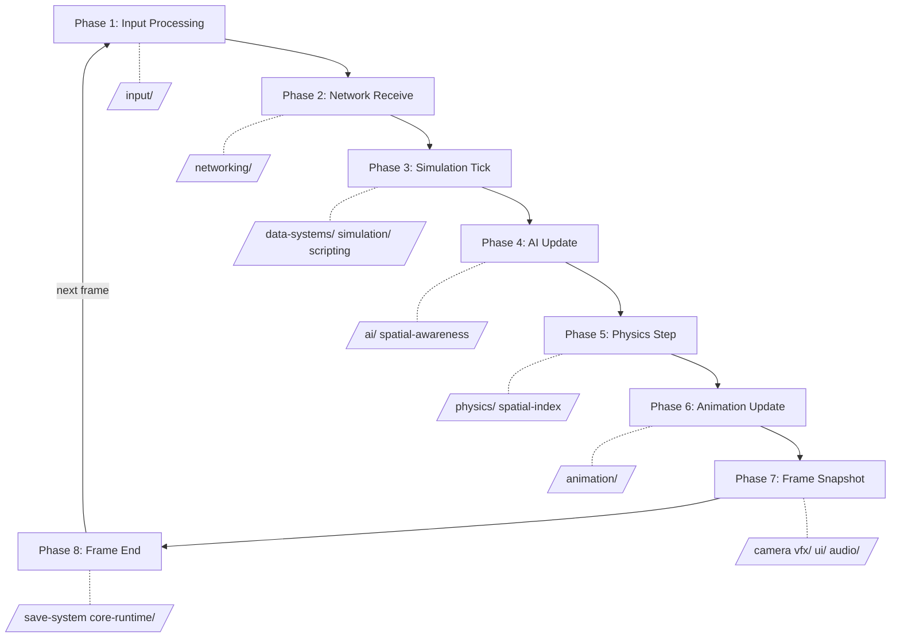

| Phase | Timestep | Description |
|-------|----------|-------------|
| 1 Input | Variable | Drain SPSC, map actions |
| 2 Network | Variable | Packets, remote state, RPCs |
| 3 Simulation | Fixed | Graphs, effects, grids, timelines |
| 4 AI | Fixed | Awareness, BT/GOAP, nav, steering |
| 5 Physics | Fixed | Broadphase, solve, destruction |
| 6 Animation | Variable | State machines, IK, cloth, hair |
| 7 Snapshot | Variable | Build RenderFrame, audio mix |
| 8 Frame End | Variable | Save, platform I/O drain, stats |

### Render Thread Steps

---

## Codegen Pipeline

The engine is no-code: users never write Rust. Instead, visual editors produce data that the
**codegen pipeline** compiles into actual Rust source, which the **bundled rustc** compiles into the
**middleman .dylib**. The engine loads this .dylib at startup (editor) or statically links it
(shipping builds).

Everything compiles to Rust. All visual graphs — gameplay logic, formulas, AI behavior, quest
conditions, dialogue branching — codegen actual `.rs` source. Inline data embedded in tables and
logic graphs uses `include_bytes!`. Shipped games statically link all code into one binary; assets
(meshes, textures, audio, baked tables) remain on disk loaded via the asset pipeline. No bytecode
VM, no interpreter.

### What gets codegen'd

| Source | Codegen output |
|--------|---------------|
| Table schemas | Typed row structs, accessors, ECS binding fns |
| Inline table/graph data | `include_bytes!` for embedded blobs |
| Formula graphs | Pure `fn` computing column values |
| Logic graphs | Gameplay systems with ECS access |
| AI behavior graphs | Behavior tree / utility AI tick fns |
| Quest/dialogue graphs | Condition eval + transition fns |
| Material graphs | HLSL shader source (not Rust) |
| VFX effect graphs | HLSL compute shaders (not Rust) |
| Custom components | Component structs, rkyv derives |
| Custom enums | Enum types with exhaustive match |
| Custom widgets | WidgetKind variants, layout/paint fns |
| Animation blend exprs | Blend weight computation fns |
| AI utility scores | Score evaluation fns |

### Everything is Rust

All visual graph nodes codegen actual Rust source code (`#![no_std]` + `core` + `libm`). This is not
"Rust-inspired" — it literally IS Rust. Generated code has full type safety, zero runtime overhead,
and benefits from rustc optimizations (inlining, constant folding, dead code elimination).

The expression node palette maps directly to Rust:

- Arithmetic: `+`, `-`, `*`, `/`, `%`
- Case analysis: `match` (exhaustive pattern matching)
- Let-binding: `let name = expr;`
- Option/Result: `.unwrap_or()`, `.map()`, `.and_then()`, `?`
- Explicit cast: `as` (no implicit coercion)
- Iterators: `.iter().filter().map().sum()`

One language, one compiler, one type system across the entire engine. This is part of being
Harmonius.

### Development vs shipping

| Mode | Code | Assets |
|------|------|--------|
| Editor | .dylib hot-reloaded via libloading | Files on disk |
| Shipping | Statically linked into binary | Files on disk |

---

## Composition Model

Game features are not built as dedicated systems. Instead, users compose generic primitives from the
Data Systems and Simulation layers in visual editors to create any gameplay.

| Feature | Graphs | Tables | Attr | Cond | Ctr | TL | Grid | Spa | Log |
|---------|:------:|:------:|:----:|:----:|:---:|:--:|:----:|:---:|:---:|
| Quests | X | X | | X | | | | | |
| Dialogue | X | | | X | | X | | | |
| Talents | X | X | X | X | | | | | |
| Abilities | | X | X | X | | | | X | |
| Inventory | | X | | | X | | | | |
| Equipment | | X | X | | X | | | | |
| Crafting | | X | | X | X | | | | |
| Combat | | | X | | | | | X | |
| Stealth | | | X | X | | | X | X | |
| Fog of war | | | | | | | X | X | |
| NPC sched | | X | | X | | X | | | |
| NPC memory | | | | | | | | | X |
| Factions | | | X | X | | | | | |
| Battle pass | X | X | X | | | | | | |
| Achievements | | X | | X | | | | | |
| Building | | X | | X | X | | | | |
| Cinematics | | | | | | X | | | |
| Destruction | | | X | | | | | X | |

**Legend:** Graphs = Directed Graphs, Tables = Data Tables, Attr = Attributes / Effects, Cond =
Condition Expressions, Ctr = Containers / Slots, TL = Timelines, Grid = Grids / Volumes, Spa =
Spatial Awareness, Log = Event Logs.

---

## Module Reference

Each module lists design documents, test case companions, feature specs, requirements, and user
stories.

---

### Platform

Platform abstraction for windowing, threading, platform I/O, OS integration, and platform services.

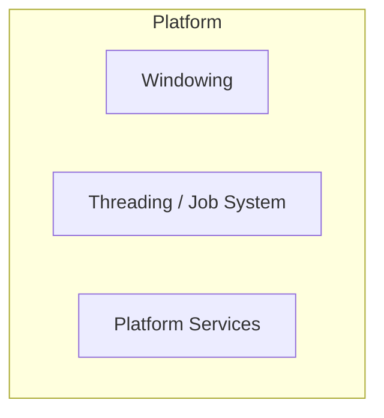

#### Design Documents

| Design | Test Cases |
|--------|------------|
| [windowing.md](design/platform/windowing.md) | [windowing-test-cases.md](design/platform/windowing-test-cases.md) |
| [threading.md](design/platform/threading.md) | [threading-test-cases.md](design/platform/threading-test-cases.md) |
| [platform-services.md](design/platform/platform-services.md) | [platform-services-test-cases.md](design/platform/platform-services-test-cases.md) |

#### Features

| Feature |
|---------|
| [window-display.md](features/platform/window-display.md) |
| [threading-async.md](features/platform/threading-async.md) |
| [os-integration.md](features/platform/os-integration.md) |
| [filesystem.md](features/platform/filesystem.md) |
| [crash-reporting.md](features/platform/crash-reporting.md) |
| [platform-services.md](features/platform/platform-services.md) |
| [sdk-integration.md](features/platform/sdk-integration.md) |

#### Requirements

| Requirement |
|-------------|
| [window-display.md](requirements/platform/window-display.md) |
| [threading-async.md](requirements/platform/threading-async.md) |
| [os-integration.md](requirements/platform/os-integration.md) |
| [filesystem.md](requirements/platform/filesystem.md) |
| [crash-reporting.md](requirements/platform/crash-reporting.md) |
| [platform-services.md](requirements/platform/platform-services.md) |
| [sdk-integration.md](requirements/platform/sdk-integration.md) |

#### User Stories

| User Story |
|------------|
| [window-display.md](user-stories/platform/window-display.md) |
| [threading-async.md](user-stories/platform/threading-async.md) |
| [os-integration.md](user-stories/platform/os-integration.md) |
| [filesystem.md](user-stories/platform/filesystem.md) |
| [crash-reporting.md](user-stories/platform/crash-reporting.md) |
| [platform-services.md](user-stories/platform/platform-services.md) |
| [sdk-integration.md](user-stories/platform/sdk-integration.md) |

---

### Core Runtime

ECS, game loop, scene hierarchy, serialization, events, memory, platform I/O, spatial indexing, and
core algorithms.

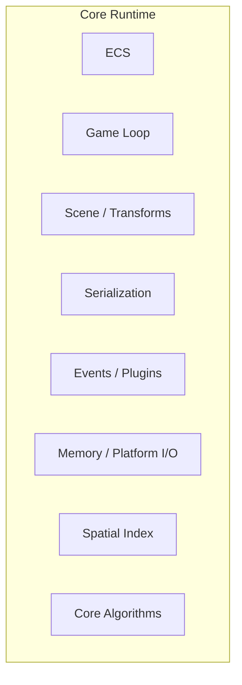

#### Design Documents

| Design | Test Cases |
|--------|------------|
| [ecs.md](design/core-runtime/ecs.md) | [ecs-test-cases.md](design/core-runtime/ecs-test-cases.md) |
| [game-loop.md](design/core-runtime/game-loop.md) | [game-loop-test-cases.md](design/core-runtime/game-loop-test-cases.md) |
| [scene-transforms.md](design/core-runtime/scene-transforms.md) | [scene-transforms-test-cases.md](design/core-runtime/scene-transforms-test-cases.md) |
| [reflection-serialization.md](design/core-runtime/reflection-serialization.md) | [reflection-serialization-test-cases.md](design/core-runtime/reflection-serialization-test-cases.md) |
| [events-plugins.md](design/core-runtime/events-plugins.md) | [events-plugins-test-cases.md](design/core-runtime/events-plugins-test-cases.md) |
| [memory-async-io.md](design/core-runtime/memory-async-io.md) | [memory-async-io-test-cases.md](design/core-runtime/memory-async-io-test-cases.md) |
| [spatial-index.md](design/core-runtime/spatial-index.md) | [spatial-index-test-cases.md](design/core-runtime/spatial-index-test-cases.md) |
| [algorithms.md](design/core-runtime/algorithms.md) | [algorithms-test-cases.md](design/core-runtime/algorithms-test-cases.md) |

#### Features

| Feature |
|---------|
| [entity-component-system.md](features/core-runtime/entity-component-system.md) |
| [scene-and-transforms.md](features/core-runtime/scene-and-transforms.md) |
| [reflection-and-type-system.md](features/core-runtime/reflection-and-type-system.md) |
| [serialization.md](features/core-runtime/serialization.md) |
| [events-and-messaging.md](features/core-runtime/events-and-messaging.md) |
| [plugin-system.md](features/core-runtime/plugin-system.md) |
| [memory-management.md](features/core-runtime/memory-management.md) |
| [async-io.md](features/core-runtime/async-io.md) |
| [spatial-indexing.md](features/core-runtime/spatial-indexing.md) |

#### Requirements

| Requirement |
|-------------|
| [entity-component-system.md](requirements/core-runtime/entity-component-system.md) |
| [scene-and-transforms.md](requirements/core-runtime/scene-and-transforms.md) |
| [reflection-and-type-system.md](requirements/core-runtime/reflection-and-type-system.md) |
| [serialization.md](requirements/core-runtime/serialization.md) |
| [events-and-messaging.md](requirements/core-runtime/events-and-messaging.md) |
| [plugin-system.md](requirements/core-runtime/plugin-system.md) |
| [memory-management.md](requirements/core-runtime/memory-management.md) |
| [async-io.md](requirements/core-runtime/async-io.md) |
| [spatial-indexing.md](requirements/core-runtime/spatial-indexing.md) |

#### User Stories

| User Story |
|------------|
| [entity-component-system.md](user-stories/core-runtime/entity-component-system.md) |
| [scene-and-transforms.md](user-stories/core-runtime/scene-and-transforms.md) |
| [reflection-and-type-system.md](user-stories/core-runtime/reflection-and-type-system.md) |
| [serialization.md](user-stories/core-runtime/serialization.md) |
| [events-and-messaging.md](user-stories/core-runtime/events-and-messaging.md) |
| [plugin-system.md](user-stories/core-runtime/plugin-system.md) |
| [memory-management.md](user-stories/core-runtime/memory-management.md) |
| [async-io.md](user-stories/core-runtime/async-io.md) |
| [spatial-indexing.md](user-stories/core-runtime/spatial-indexing.md) |

---

### Data Systems

Generic composable primitives for all gameplay data. Users wire these together in visual editors to
build quests, abilities, inventories, progression, and any other gameplay.

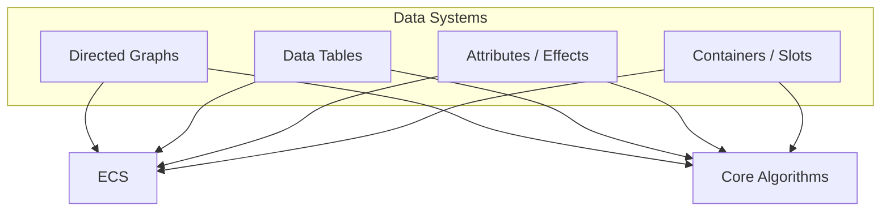

#### Design Documents

| Design | Test Cases |
|--------|------------|
| [directed-graphs.md](design/data-systems/directed-graphs.md) | [directed-graphs-test-cases.md](design/data-systems/directed-graphs-test-cases.md) |
| [data-tables.md](design/data-systems/data-tables.md) | [data-tables-test-cases.md](design/data-systems/data-tables-test-cases.md) |
| [attributes-effects.md](design/data-systems/attributes-effects.md) | [attributes-effects-test-cases.md](design/data-systems/attributes-effects-test-cases.md) |
| [containers-slots.md](design/data-systems/containers-slots.md) | [containers-slots-test-cases.md](design/data-systems/containers-slots-test-cases.md) |

#### Features

| Feature |
|---------|
| [gameplay-primitives.md](features/game-framework/gameplay-primitives.md) |
| [gameplay-databases.md](features/game-framework/gameplay-databases.md) |
| [abilities.md](features/game-framework/abilities.md) |
| [inventory.md](features/game-framework/inventory.md) |
| [weapon-system.md](features/game-framework/weapon-system.md) |
| [quest-dialogue.md](features/game-framework/quest-dialogue.md) |
| [progression.md](features/game-framework/progression.md) |
| [building-survival.md](features/game-framework/building-survival.md) |
| [block-voxel.md](features/game-framework/block-voxel.md) |
| [character-customization.md](features/game-framework/character-customization.md) |
| [pets-mounts.md](features/game-framework/pets-mounts.md) |
| [monetization.md](features/game-framework/monetization.md) |
| [turn-based.md](features/game-framework/turn-based.md) |
| [minigames.md](features/game-framework/minigames.md) |
| [racing.md](features/game-framework/racing.md) |

#### Requirements

| Requirement |
|-------------|
| [gameplay-primitives.md](requirements/game-framework/gameplay-primitives.md) |
| [gameplay-databases.md](requirements/game-framework/gameplay-databases.md) |
| [abilities.md](requirements/game-framework/abilities.md) |
| [inventory.md](requirements/game-framework/inventory.md) |
| [weapon-system.md](requirements/game-framework/weapon-system.md) |
| [quest-dialogue.md](requirements/game-framework/quest-dialogue.md) |
| [progression.md](requirements/game-framework/progression.md) |
| [building-survival.md](requirements/game-framework/building-survival.md) |
| [block-voxel.md](requirements/game-framework/block-voxel.md) |
| [character-customization.md](requirements/game-framework/character-customization.md) |
| [pets-mounts.md](requirements/game-framework/pets-mounts.md) |
| [monetization.md](requirements/game-framework/monetization.md) |
| [turn-based.md](requirements/game-framework/turn-based.md) |
| [minigames.md](requirements/game-framework/minigames.md) |
| [racing.md](requirements/game-framework/racing.md) |

#### User Stories

| User Story |
|------------|
| [gameplay-primitives.md](user-stories/game-framework/gameplay-primitives.md) |
| [gameplay-databases.md](user-stories/game-framework/gameplay-databases.md) |
| [abilities.md](user-stories/game-framework/abilities.md) |
| [inventory.md](user-stories/game-framework/inventory.md) |
| [weapon-system.md](user-stories/game-framework/weapon-system.md) |
| [quest-dialogue.md](user-stories/game-framework/quest-dialogue.md) |
| [progression.md](user-stories/game-framework/progression.md) |
| [building-survival.md](user-stories/game-framework/building-survival.md) |
| [block-voxel.md](user-stories/game-framework/block-voxel.md) |
| [character-customization.md](user-stories/game-framework/character-customization.md) |
| [pets-mounts.md](user-stories/game-framework/pets-mounts.md) |
| [monetization.md](user-stories/game-framework/monetization.md) |
| [turn-based.md](user-stories/game-framework/turn-based.md) |
| [minigames.md](user-stories/game-framework/minigames.md) |
| [racing.md](user-stories/game-framework/racing.md) |

---

### Simulation

Generic simulation primitives for world state: spatial grids, awareness systems, timelines, and
event memory.

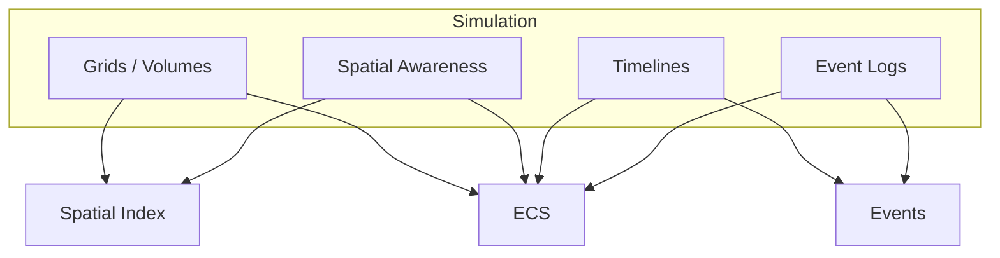

#### Design Documents

| Design | Test Cases |
|--------|------------|
| [grids-volumes.md](design/simulation/grids-volumes.md) | [grids-volumes-test-cases.md](design/simulation/grids-volumes-test-cases.md) |
| [spatial-awareness.md](design/simulation/spatial-awareness.md) | [spatial-awareness-test-cases.md](design/simulation/spatial-awareness-test-cases.md) |
| [timelines.md](design/simulation/timelines.md) | [timelines-test-cases.md](design/simulation/timelines-test-cases.md) |
| [event-logs.md](design/simulation/event-logs.md) | [event-logs-test-cases.md](design/simulation/event-logs-test-cases.md) |

#### Features

| Feature |
|---------|
| [npc-simulation.md](features/game-framework/npc-simulation.md) |
| [fog-of-war.md](features/game-framework/fog-of-war.md) |
| [stealth-cover.md](features/game-framework/stealth-cover.md) |
| [perception.md](features/ai/perception.md) |
| [selection-system.md](features/game-framework/selection-system.md) |
| [cinematics.md](features/game-framework/cinematics.md) |
| [social.md](features/game-framework/social.md) |

#### Requirements

| Requirement |
|-------------|
| [npc-simulation.md](requirements/game-framework/npc-simulation.md) |
| [fog-of-war.md](requirements/game-framework/fog-of-war.md) |
| [stealth-cover.md](requirements/game-framework/stealth-cover.md) |
| [perception.md](requirements/ai/perception.md) |
| [selection-system.md](requirements/game-framework/selection-system.md) |
| [cinematics.md](requirements/game-framework/cinematics.md) |
| [social.md](requirements/game-framework/social.md) |

#### User Stories

| User Story |
|------------|
| [npc-simulation.md](user-stories/game-framework/npc-simulation.md) |
| [fog-of-war.md](user-stories/game-framework/fog-of-war.md) |
| [stealth-cover.md](user-stories/game-framework/stealth-cover.md) |
| [perception.md](user-stories/ai/perception.md) |
| [selection-system.md](user-stories/game-framework/selection-system.md) |
| [cinematics.md](user-stories/game-framework/cinematics.md) |
| [social.md](user-stories/game-framework/social.md) |

---

### Game Framework

Camera system, save/load persistence, and visual scripting runtime. All other gameplay is composed
from Data Systems and Simulation primitives.

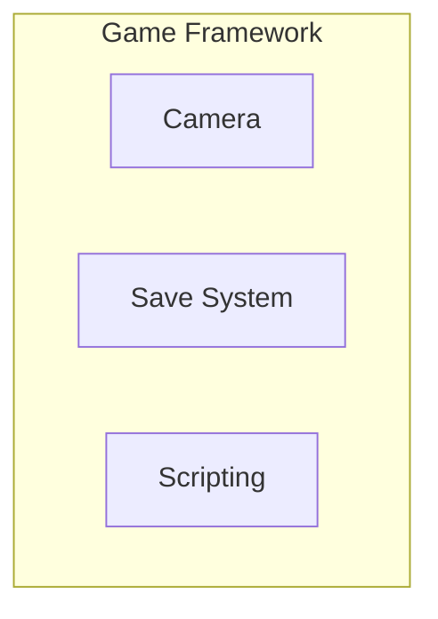

#### Design Documents

| Design | Test Cases |
|--------|------------|
| [camera.md](design/game-framework/camera.md) | [camera-test-cases.md](design/game-framework/camera-test-cases.md) |
| [save-system.md](design/game-framework/save-system.md) | [save-system-test-cases.md](design/game-framework/save-system-test-cases.md) |
| [scripting.md](design/game-framework/scripting.md) | [scripting-test-cases.md](design/game-framework/scripting-test-cases.md) |

#### Features

| Feature |
|---------|
| [camera-system.md](features/game-framework/camera-system.md) |
| [save-system.md](features/game-framework/save-system.md) |
| [scripting.md](features/game-framework/scripting.md) |
| [traversal-interaction.md](features/game-framework/traversal-interaction.md) |
| [game-modes-misc.md](features/game-framework/game-modes-misc.md) |
| [world-management.md](features/game-framework/world-management.md) |

#### Requirements

| Requirement |
|-------------|
| [camera-system.md](requirements/game-framework/camera-system.md) |
| [save-system.md](requirements/game-framework/save-system.md) |
| [scripting.md](requirements/game-framework/scripting.md) |
| [traversal-interaction.md](requirements/game-framework/traversal-interaction.md) |
| [game-modes-misc.md](requirements/game-framework/game-modes-misc.md) |
| [world-management.md](requirements/game-framework/world-management.md) |

#### User Stories

| User Story |
|------------|
| [camera-system.md](user-stories/game-framework/camera-system.md) |
| [save-system.md](user-stories/game-framework/save-system.md) |
| [scripting.md](user-stories/game-framework/scripting.md) |
| [traversal-interaction.md](user-stories/game-framework/traversal-interaction.md) |
| [game-modes-misc.md](user-stories/game-framework/game-modes-misc.md) |
| [world-management.md](user-stories/game-framework/world-management.md) |

---

### Rendering

GPU abstraction, render graph, core rendering, lighting, post-processing, and material models.

#### Design Documents

| Design | Test Cases |
|--------|------------|
| [render-pipeline.md](design/rendering/render-pipeline.md) | [render-pipeline-test-cases.md](design/rendering/render-pipeline-test-cases.md) |
| [rendering-core.md](design/rendering/rendering-core.md) | [rendering-core-test-cases.md](design/rendering/rendering-core-test-cases.md) |
| [render-effects.md](design/rendering/render-effects.md) | [render-effects-test-cases.md](design/rendering/render-effects-test-cases.md) |
| [render-styles.md](design/rendering/render-styles.md) | [render-styles-test-cases.md](design/rendering/render-styles-test-cases.md) |
| [2d.md](design/rendering/2d.md) | — |

#### Features

| Feature |
|---------|
| [gpu-abstraction-layer.md](features/rendering/gpu-abstraction-layer.md) |
| [render-graph.md](features/rendering/render-graph.md) |
| [core-rendering.md](features/rendering/core-rendering.md) |
| [scene-rendering-pipeline.md](features/rendering/scene-rendering-pipeline.md) |
| [lighting.md](features/rendering/lighting.md) |
| [post-processing.md](features/rendering/post-processing.md) |
| [advanced-rendering.md](features/rendering/advanced-rendering.md) |
| [anti-aliasing-upscaling.md](features/rendering/anti-aliasing-upscaling.md) |
| [environment.md](features/rendering/environment.md) |
| [character-rendering.md](features/rendering/character-rendering.md) |
| [stylized-effects.md](features/rendering/stylized-effects.md) |
| [advanced-materials.md](features/rendering/advanced-materials.md) |

#### Requirements

| Requirement |
|-------------|
| [gpu-abstraction-layer.md](requirements/rendering/gpu-abstraction-layer.md) |
| [render-graph.md](requirements/rendering/render-graph.md) |
| [core-rendering.md](requirements/rendering/core-rendering.md) |
| [scene-rendering-pipeline.md](requirements/rendering/scene-rendering-pipeline.md) |
| [lighting.md](requirements/rendering/lighting.md) |
| [post-processing.md](requirements/rendering/post-processing.md) |
| [advanced-rendering.md](requirements/rendering/advanced-rendering.md) |
| [anti-aliasing-upscaling.md](requirements/rendering/anti-aliasing-upscaling.md) |
| [environment.md](requirements/rendering/environment.md) |
| [character-rendering.md](requirements/rendering/character-rendering.md) |
| [stylized-effects.md](requirements/rendering/stylized-effects.md) |
| [advanced-materials.md](requirements/rendering/advanced-materials.md) |

#### User Stories

| User Story |
|------------|
| [gpu-abstraction-layer.md](user-stories/rendering/gpu-abstraction-layer.md) |
| [render-graph.md](user-stories/rendering/render-graph.md) |
| [core-rendering.md](user-stories/rendering/core-rendering.md) |
| [scene-rendering-pipeline.md](user-stories/rendering/scene-rendering-pipeline.md) |
| [lighting.md](user-stories/rendering/lighting.md) |
| [post-processing.md](user-stories/rendering/post-processing.md) |
| [advanced-rendering.md](user-stories/rendering/advanced-rendering.md) |
| [anti-aliasing-upscaling.md](user-stories/rendering/anti-aliasing-upscaling.md) |
| [environment.md](user-stories/rendering/environment.md) |
| [character-rendering.md](user-stories/rendering/character-rendering.md) |
| [stylized-effects.md](user-stories/rendering/stylized-effects.md) |
| [advanced-materials.md](user-stories/rendering/advanced-materials.md) |

---

### Content Pipeline

Asset import, processing, streaming, hot reload, and asset versioning.

#### Design Documents

| Design | Test Cases |
|--------|------------|
| [asset-pipeline.md](design/content-pipeline/asset-pipeline.md) | [asset-pipeline-test-cases.md](design/content-pipeline/asset-pipeline-test-cases.md) |
| [asset-processing.md](design/content-pipeline/asset-processing.md) | [asset-processing-test-cases.md](design/content-pipeline/asset-processing-test-cases.md) |

#### Features

| Feature |
|---------|
| [asset-import.md](features/content-pipeline/asset-import.md) |
| [asset-processing.md](features/content-pipeline/asset-processing.md) |
| [asset-database.md](features/content-pipeline/asset-database.md) |
| [streaming-io.md](features/content-pipeline/streaming-io.md) |
| [hot-reload.md](features/content-pipeline/hot-reload.md) |
| [asset-versioning.md](features/content-pipeline/asset-versioning.md) |

#### Requirements

| Requirement |
|-------------|
| [asset-import.md](requirements/content-pipeline/asset-import.md) |
| [asset-processing.md](requirements/content-pipeline/asset-processing.md) |
| [asset-database.md](requirements/content-pipeline/asset-database.md) |
| [streaming-io.md](requirements/content-pipeline/streaming-io.md) |
| [hot-reload.md](requirements/content-pipeline/hot-reload.md) |
| [asset-versioning.md](requirements/content-pipeline/asset-versioning.md) |

#### User Stories

| User Story |
|------------|
| [asset-import.md](user-stories/content-pipeline/asset-import.md) |
| [asset-processing.md](user-stories/content-pipeline/asset-processing.md) |
| [asset-database.md](user-stories/content-pipeline/asset-database.md) |
| [streaming-io.md](user-stories/content-pipeline/streaming-io.md) |
| [hot-reload.md](user-stories/content-pipeline/hot-reload.md) |
| [asset-versioning.md](user-stories/content-pipeline/asset-versioning.md) |

---

### Physics

Rigid body dynamics, collision, constraints, destruction, soft body, fluids, and vehicles.

#### Design Documents

| Design | Test Cases |
|--------|------------|
| [foundation.md](design/physics/foundation.md) | [foundation-test-cases.md](design/physics/foundation-test-cases.md) |
| [constraints.md](design/physics/constraints.md) | [constraints-test-cases.md](design/physics/constraints-test-cases.md) |
| [advanced.md](design/physics/advanced.md) | [advanced-test-cases.md](design/physics/advanced-test-cases.md) |

#### Features

| Feature |
|---------|
| [rigid-body-dynamics.md](features/physics/rigid-body-dynamics.md) |
| [collision-detection.md](features/physics/collision-detection.md) |
| [constraints-and-joints.md](features/physics/constraints-and-joints.md) |
| [spatial-queries.md](features/physics/spatial-queries.md) |
| [vehicle-physics.md](features/physics/vehicle-physics.md) |
| [destruction-and-fracture.md](features/physics/destruction-and-fracture.md) |
| [soft-body-and-cloth.md](features/physics/soft-body-and-cloth.md) |
| [fluid-simulation.md](features/physics/fluid-simulation.md) |

#### Requirements

| Requirement |
|-------------|
| [rigid-body-dynamics.md](requirements/physics/rigid-body-dynamics.md) |
| [collision-detection.md](requirements/physics/collision-detection.md) |
| [constraints-and-joints.md](requirements/physics/constraints-and-joints.md) |
| [spatial-queries.md](requirements/physics/spatial-queries.md) |
| [vehicle-physics.md](requirements/physics/vehicle-physics.md) |
| [destruction-and-fracture.md](requirements/physics/destruction-and-fracture.md) |
| [soft-body-and-cloth.md](requirements/physics/soft-body-and-cloth.md) |
| [fluid-simulation.md](requirements/physics/fluid-simulation.md) |

#### User Stories

| User Story |
|------------|
| [rigid-body-dynamics.md](user-stories/physics/rigid-body-dynamics.md) |
| [collision-detection.md](user-stories/physics/collision-detection.md) |
| [constraints-and-joints.md](user-stories/physics/constraints-and-joints.md) |
| [spatial-queries.md](user-stories/physics/spatial-queries.md) |
| [vehicle-physics.md](user-stories/physics/vehicle-physics.md) |
| [destruction-and-fracture.md](user-stories/physics/destruction-and-fracture.md) |
| [soft-body-and-cloth.md](user-stories/physics/soft-body-and-cloth.md) |
| [fluid-simulation.md](user-stories/physics/fluid-simulation.md) |

---

### Input

Device abstraction, action mapping, gestures, haptics, and VR input.

#### Design Documents

| Design | Test Cases |
|--------|------------|
| [input.md](design/input/input.md) | [input-test-cases.md](design/input/input-test-cases.md) |

#### Features

| Feature |
|---------|
| [device-abstraction.md](features/input/device-abstraction.md) |
| [input-actions-and-mapping.md](features/input/input-actions-and-mapping.md) |
| [gestures.md](features/input/gestures.md) |
| [haptics-and-feedback.md](features/input/haptics-and-feedback.md) |
| [vr-input.md](features/input/vr-input.md) |

#### Requirements

| Requirement |
|-------------|
| [device-abstraction.md](requirements/input/device-abstraction.md) |
| [input-actions-and-mapping.md](requirements/input/input-actions-and-mapping.md) |
| [gestures.md](requirements/input/gestures.md) |
| [haptics-and-feedback.md](requirements/input/haptics-and-feedback.md) |
| [vr-input.md](requirements/input/vr-input.md) |

#### User Stories

| User Story |
|------------|
| [device-abstraction.md](user-stories/input/device-abstraction.md) |
| [input-actions-and-mapping.md](user-stories/input/input-actions-and-mapping.md) |
| [gestures.md](user-stories/input/gestures.md) |
| [haptics-and-feedback.md](user-stories/input/haptics-and-feedback.md) |
| [vr-input.md](user-stories/input/vr-input.md) |

---

### Audio

Audio engine, spatial audio, DSP effects, and adaptive music.

#### Design Documents

| Design | Test Cases |
|--------|------------|
| [audio.md](design/audio/audio.md) | [audio-test-cases.md](design/audio/audio-test-cases.md) |

#### Features

| Feature |
|---------|
| [audio-engine.md](features/audio/audio-engine.md) |
| [spatial-audio.md](features/audio/spatial-audio.md) |
| [dsp-and-effects.md](features/audio/dsp-and-effects.md) |
| [music-system.md](features/audio/music-system.md) |
| [voice-and-speech.md](features/audio/voice-and-speech.md) |

#### Requirements

| Requirement |
|-------------|
| [audio-engine.md](requirements/audio/audio-engine.md) |
| [spatial-audio.md](requirements/audio/spatial-audio.md) |
| [dsp-and-effects.md](requirements/audio/dsp-and-effects.md) |
| [music-system.md](requirements/audio/music-system.md) |
| [voice-and-speech.md](requirements/audio/voice-and-speech.md) |

#### User Stories

| User Story |
|------------|
| [audio-engine.md](user-stories/audio/audio-engine.md) |
| [spatial-audio.md](user-stories/audio/spatial-audio.md) |
| [dsp-and-effects.md](user-stories/audio/dsp-and-effects.md) |
| [music-system.md](user-stories/audio/music-system.md) |
| [voice-and-speech.md](user-stories/audio/voice-and-speech.md) |

---

### Animation

Skeletal animation, state machines, procedural animation (IK, cloth, hair, springs, first-person).

#### Design Documents

| Design | Test Cases |
|--------|------------|
| [skeletal.md](design/animation/skeletal.md) | [skeletal-test-cases.md](design/animation/skeletal-test-cases.md) |
| [state-machine.md](design/animation/state-machine.md) | [state-machine-test-cases.md](design/animation/state-machine-test-cases.md) |
| [procedural.md](design/animation/procedural.md) | [procedural-test-cases.md](design/animation/procedural-test-cases.md) |

#### Features

| Feature |
|---------|
| [skeletal.md](features/animation/skeletal.md) |
| [state-machine.md](features/animation/state-machine.md) |
| [morph.md](features/animation/morph.md) |
| [procedural.md](features/animation/procedural.md) |
| [cloth-hair.md](features/animation/cloth-hair.md) |
| [first-person.md](features/animation/first-person.md) |
| [motion-matching.md](features/animation/motion-matching.md) |

#### Requirements

| Requirement |
|-------------|
| [skeletal.md](requirements/animation/skeletal.md) |
| [state-machine.md](requirements/animation/state-machine.md) |
| [morph.md](requirements/animation/morph.md) |
| [procedural.md](requirements/animation/procedural.md) |
| [cloth-hair.md](requirements/animation/cloth-hair.md) |
| [first-person.md](requirements/animation/first-person.md) |
| [motion-matching.md](requirements/animation/motion-matching.md) |

#### User Stories

| User Story |
|------------|
| [skeletal.md](user-stories/animation/skeletal.md) |
| [state-machine.md](user-stories/animation/state-machine.md) |
| [morph.md](user-stories/animation/morph.md) |
| [procedural.md](user-stories/animation/procedural.md) |
| [cloth-hair.md](user-stories/animation/cloth-hair.md) |
| [first-person.md](user-stories/animation/first-person.md) |
| [motion-matching.md](user-stories/animation/motion-matching.md) |

---

### AI

Behavior trees, utility AI, GOAP, navigation, pathfinding, steering, and crowd simulation.

#### Design Documents

| Design | Test Cases |
|--------|------------|
| [behavior.md](design/ai/behavior.md) | [behavior-test-cases.md](design/ai/behavior-test-cases.md) |
| [navigation.md](design/ai/navigation.md) | [navigation-test-cases.md](design/ai/navigation-test-cases.md) |
| [steering-crowds.md](design/ai/steering-crowds.md) | [steering-crowds-test-cases.md](design/ai/steering-crowds-test-cases.md) |

#### Features

| Feature |
|---------|
| [behavior-trees.md](features/ai/behavior-trees.md) |
| [utility-ai.md](features/ai/utility-ai.md) |
| [goap.md](features/ai/goap.md) |
| [navigation.md](features/ai/navigation.md) |
| [steering-avoidance.md](features/ai/steering-avoidance.md) |
| [crowd-simulation.md](features/ai/crowd-simulation.md) |
| [tactical-combat.md](features/ai/tactical-combat.md) |
| [perception.md](features/ai/perception.md) |

#### Requirements

| Requirement |
|-------------|
| [behavior-trees.md](requirements/ai/behavior-trees.md) |
| [utility-ai.md](requirements/ai/utility-ai.md) |
| [goap.md](requirements/ai/goap.md) |
| [navigation.md](requirements/ai/navigation.md) |
| [steering-avoidance.md](requirements/ai/steering-avoidance.md) |
| [crowd-simulation.md](requirements/ai/crowd-simulation.md) |
| [tactical-combat.md](requirements/ai/tactical-combat.md) |
| [perception.md](requirements/ai/perception.md) |

#### User Stories

| User Story |
|------------|
| [behavior-trees.md](user-stories/ai/behavior-trees.md) |
| [utility-ai.md](user-stories/ai/utility-ai.md) |
| [goap.md](user-stories/ai/goap.md) |
| [navigation.md](user-stories/ai/navigation.md) |
| [steering-avoidance.md](user-stories/ai/steering-avoidance.md) |
| [crowd-simulation.md](user-stories/ai/crowd-simulation.md) |
| [tactical-combat.md](user-stories/ai/tactical-combat.md) |
| [perception.md](user-stories/ai/perception.md) |

---

### Networking

Transport, state replication, sessions, replay, voice chat, server infrastructure, and anti-cheat.

#### Design Documents

| Design | Test Cases |
|--------|------------|
| [network-transport.md](design/networking/network-transport.md) | [network-transport-test-cases.md](design/networking/network-transport-test-cases.md) |
| [network-services.md](design/networking/network-services.md) | [network-services-test-cases.md](design/networking/network-services-test-cases.md) |
| [network-infrastructure.md](design/networking/network-infrastructure.md) | [network-infrastructure-test-cases.md](design/networking/network-infrastructure-test-cases.md) |

#### Features

| Feature |
|---------|
| [transport-layer.md](features/networking/transport-layer.md) |
| [state-replication.md](features/networking/state-replication.md) |
| [prediction-and-rollback.md](features/networking/prediction-and-rollback.md) |
| [remote-procedure-calls.md](features/networking/remote-procedure-calls.md) |
| [session-management.md](features/networking/session-management.md) |
| [replay-system.md](features/networking/replay-system.md) |
| [communication.md](features/networking/communication.md) |
| [mmo-infrastructure.md](features/networking/mmo-infrastructure.md) |
| [anti-cheat.md](features/networking/anti-cheat.md) |

#### Requirements

| Requirement |
|-------------|
| [transport-layer.md](requirements/networking/transport-layer.md) |
| [state-replication.md](requirements/networking/state-replication.md) |
| [prediction-and-rollback.md](requirements/networking/prediction-and-rollback.md) |
| [remote-procedure-calls.md](requirements/networking/remote-procedure-calls.md) |
| [session-management.md](requirements/networking/session-management.md) |
| [replay-system.md](requirements/networking/replay-system.md) |
| [communication.md](requirements/networking/communication.md) |
| [mmo-infrastructure.md](requirements/networking/mmo-infrastructure.md) |
| [anti-cheat.md](requirements/networking/anti-cheat.md) |

#### User Stories

| User Story |
|------------|
| [transport-layer.md](user-stories/networking/transport-layer.md) |
| [state-replication.md](user-stories/networking/state-replication.md) |
| [prediction-and-rollback.md](user-stories/networking/prediction-and-rollback.md) |
| [remote-procedure-calls.md](user-stories/networking/remote-procedure-calls.md) |
| [session-management.md](user-stories/networking/session-management.md) |
| [replay-system.md](user-stories/networking/replay-system.md) |
| [communication.md](user-stories/networking/communication.md) |
| [mmo-infrastructure.md](user-stories/networking/mmo-infrastructure.md) |
| [anti-cheat.md](user-stories/networking/anti-cheat.md) |

---

### Geometry

World geometry, terrain, meshlets, environment rendering, and procedural generation.

#### Design Documents

| Design | Test Cases |
|--------|------------|
| [world-geometry.md](design/geometry/world-geometry.md) | [world-geometry-test-cases.md](design/geometry/world-geometry-test-cases.md) |
| [procedural-generation.md](design/geometry/procedural-generation.md) | [procedural-generation-test-cases.md](design/geometry/procedural-generation-test-cases.md) |

#### Features

| Feature |
|---------|
| [terrain.md](features/geometry-world/terrain.md) |
| [foliage.md](features/geometry-world/foliage.md) |
| [water.md](features/geometry-world/water.md) |
| [sky-atmosphere.md](features/geometry-world/sky-atmosphere.md) |
| [meshlet-pipeline.md](features/geometry-world/meshlet-pipeline.md) |
| [procedural-generation.md](features/geometry-world/procedural-generation.md) |

#### Requirements

| Requirement |
|-------------|
| [terrain.md](requirements/geometry-world/terrain.md) |
| [foliage.md](requirements/geometry-world/foliage.md) |
| [water.md](requirements/geometry-world/water.md) |
| [sky-atmosphere.md](requirements/geometry-world/sky-atmosphere.md) |
| [meshlet-pipeline.md](requirements/geometry-world/meshlet-pipeline.md) |
| [procedural-generation.md](requirements/geometry-world/procedural-generation.md) |

#### User Stories

| User Story |
|------------|
| [terrain.md](user-stories/geometry-world/terrain.md) |
| [foliage.md](user-stories/geometry-world/foliage.md) |
| [water.md](user-stories/geometry-world/water.md) |
| [sky-atmosphere.md](user-stories/geometry-world/sky-atmosphere.md) |
| [meshlet-pipeline.md](user-stories/geometry-world/meshlet-pipeline.md) |
| [procedural-generation.md](user-stories/geometry-world/procedural-generation.md) |

---

### VFX

Particle systems, effect graphs, decals, screen effects, and weather.

#### Design Documents

| Design | Test Cases |
|--------|------------|
| [particles.md](design/vfx/particles.md) | [particles-test-cases.md](design/vfx/particles-test-cases.md) |
| [effects.md](design/vfx/effects.md) | [effects-test-cases.md](design/vfx/effects-test-cases.md) |

#### Features

| Feature |
|---------|
| [particles.md](features/vfx/particles.md) |
| [effect-graph.md](features/vfx/effect-graph.md) |
| [decals.md](features/vfx/decals.md) |
| [screen-effects.md](features/vfx/screen-effects.md) |
| [weather-environmental.md](features/vfx/weather-environmental.md) |
| [destruction.md](features/vfx/destruction.md) |

#### Requirements

| Requirement |
|-------------|
| [particles.md](requirements/vfx/particles.md) |
| [effect-graph.md](requirements/vfx/effect-graph.md) |
| [decals.md](requirements/vfx/decals.md) |
| [screen-effects.md](requirements/vfx/screen-effects.md) |
| [weather-environmental.md](requirements/vfx/weather-environmental.md) |
| [destruction.md](requirements/vfx/destruction.md) |

#### User Stories

| User Story |
|------------|
| [particles.md](user-stories/vfx/particles.md) |
| [effect-graph.md](user-stories/vfx/effect-graph.md) |
| [decals.md](user-stories/vfx/decals.md) |
| [screen-effects.md](user-stories/vfx/screen-effects.md) |
| [weather-environmental.md](user-stories/vfx/weather-environmental.md) |
| [destruction.md](user-stories/vfx/destruction.md) |

---

### UI

Widget framework, HUD, 2D games, and accessibility.

#### Design Documents

| Design | Test Cases |
|--------|------------|
| [ui-framework.md](design/ui/ui-framework.md) | [ui-framework-test-cases.md](design/ui/ui-framework-test-cases.md) |

#### Features

| Feature |
|---------|
| [widget-framework.md](features/ui-2d/widget-framework.md) |
| [common-widgets.md](features/ui-2d/common-widgets.md) |
| [hud-and-game-ui.md](features/ui-2d/hud-and-game-ui.md) |
| [ui-rendering.md](features/ui-2d/ui-rendering.md) |
| [2d-games.md](features/ui-2d/2d-games.md) |
| [accessibility.md](features/ui-2d/accessibility.md) |

#### Requirements

| Requirement |
|-------------|
| [widget-framework.md](requirements/ui-2d/widget-framework.md) |
| [common-widgets.md](requirements/ui-2d/common-widgets.md) |
| [hud-and-game-ui.md](requirements/ui-2d/hud-and-game-ui.md) |
| [ui-rendering.md](requirements/ui-2d/ui-rendering.md) |
| [2d-games.md](requirements/ui-2d/2d-games.md) |
| [accessibility.md](requirements/ui-2d/accessibility.md) |

#### User Stories

| User Story |
|------------|
| [widget-framework.md](user-stories/ui-2d/widget-framework.md) |
| [common-widgets.md](user-stories/ui-2d/common-widgets.md) |
| [hud-and-game-ui.md](user-stories/ui-2d/hud-and-game-ui.md) |
| [ui-rendering.md](user-stories/ui-2d/ui-rendering.md) |
| [2d-games.md](user-stories/ui-2d/2d-games.md) |
| [accessibility.md](user-stories/ui-2d/accessibility.md) |

---

### Tools / Editor

Editor framework, visual editors, level/world editor, profiler, team collaboration, build/deploy,
and content services.

#### Design Documents

| Design | Test Cases |
|--------|------------|
| [editor-core.md](design/tools/editor-core.md) | [editor-core-test-cases.md](design/tools/editor-core-test-cases.md) |
| [visual-editors.md](design/tools/visual-editors.md) | [visual-editors-test-cases.md](design/tools/visual-editors-test-cases.md) |
| [level-world.md](design/tools/level-world.md) | [level-world-test-cases.md](design/tools/level-world-test-cases.md) |
| [profiler.md](design/tools/profiler.md) | [profiler-test-cases.md](design/tools/profiler-test-cases.md) |
| [team-tools.md](design/tools/team-tools.md) | [team-tools-test-cases.md](design/tools/team-tools-test-cases.md) |
| [build-deploy.md](design/tools/build-deploy.md) | [build-deploy-test-cases.md](design/tools/build-deploy-test-cases.md) |
| [content-services.md](design/tools/content-services.md) | [content-services-test-cases.md](design/tools/content-services-test-cases.md) |

#### Features

| Feature |
|---------|
| [editor-framework.md](features/tools-editor/editor-framework.md) |
| [editor-plugins.md](features/tools-editor/editor-plugins.md) |
| [level-editor.md](features/tools-editor/level-editor.md) |
| [world-building.md](features/tools-editor/world-building.md) |
| [material-editor.md](features/tools-editor/material-editor.md) |
| [animation-editor.md](features/tools-editor/animation-editor.md) |
| [logic-graph.md](features/tools-editor/logic-graph.md) |
| [profiling-tools.md](features/tools-editor/profiling-tools.md) |
| [version-control.md](features/tools-editor/version-control.md) |
| [shared-cache.md](features/tools-editor/shared-cache.md) |
| [ai-governance.md](features/tools-editor/ai-governance.md) |
| [ai-assistant.md](features/tools-editor/ai-assistant.md) |
| [deployment.md](features/tools-editor/deployment.md) |
| [launcher.md](features/tools-editor/launcher.md) |
| [asset-store.md](features/tools-editor/asset-store.md) |
| [server-infrastructure.md](features/tools-editor/server-infrastructure.md) |
| [localization-editor.md](features/tools-editor/localization-editor.md) |
| [documentation.md](features/tools-editor/documentation.md) |
| [mod-support.md](features/tools-editor/mod-support.md) |
| [vr-editor.md](features/tools-editor/vr-editor.md) |
| [remote-editing.md](features/tools-editor/remote-editing.md) |
| [specialized-editors.md](features/tools-editor/specialized-editors.md) |

#### Requirements

| Requirement |
|-------------|
| [editor-framework.md](requirements/tools-editor/editor-framework.md) |
| [editor-plugins.md](requirements/tools-editor/editor-plugins.md) |
| [level-editor.md](requirements/tools-editor/level-editor.md) |
| [world-building.md](requirements/tools-editor/world-building.md) |
| [material-editor.md](requirements/tools-editor/material-editor.md) |
| [animation-editor.md](requirements/tools-editor/animation-editor.md) |
| [logic-graph.md](requirements/tools-editor/logic-graph.md) |
| [profiling-tools.md](requirements/tools-editor/profiling-tools.md) |
| [version-control.md](requirements/tools-editor/version-control.md) |
| [shared-cache.md](requirements/tools-editor/shared-cache.md) |
| [ai-governance.md](requirements/tools-editor/ai-governance.md) |
| [ai-assistant.md](requirements/tools-editor/ai-assistant.md) |
| [deployment.md](requirements/tools-editor/deployment.md) |
| [launcher.md](requirements/tools-editor/launcher.md) |
| [asset-store.md](requirements/tools-editor/asset-store.md) |
| [server-infrastructure.md](requirements/tools-editor/server-infrastructure.md) |
| [localization-editor.md](requirements/tools-editor/localization-editor.md) |
| [documentation.md](requirements/tools-editor/documentation.md) |
| [mod-support.md](requirements/tools-editor/mod-support.md) |
| [vr-editor.md](requirements/tools-editor/vr-editor.md) |
| [remote-editing.md](requirements/tools-editor/remote-editing.md) |
| [specialized-editors.md](requirements/tools-editor/specialized-editors.md) |

#### User Stories

| User Story |
|------------|
| [editor-framework.md](user-stories/tools-editor/editor-framework.md) |
| [editor-plugins.md](user-stories/tools-editor/editor-plugins.md) |
| [level-editor.md](user-stories/tools-editor/level-editor.md) |
| [world-building.md](user-stories/tools-editor/world-building.md) |
| [material-editor.md](user-stories/tools-editor/material-editor.md) |
| [animation-editor.md](user-stories/tools-editor/animation-editor.md) |
| [logic-graph.md](user-stories/tools-editor/logic-graph.md) |
| [profiling-tools.md](user-stories/tools-editor/profiling-tools.md) |
| [version-control.md](user-stories/tools-editor/version-control.md) |
| [shared-cache.md](user-stories/tools-editor/shared-cache.md) |
| [ai-governance.md](user-stories/tools-editor/ai-governance.md) |
| [ai-assistant.md](user-stories/tools-editor/ai-assistant.md) |
| [deployment.md](user-stories/tools-editor/deployment.md) |
| [launcher.md](user-stories/tools-editor/launcher.md) |
| [asset-store.md](user-stories/tools-editor/asset-store.md) |
| [server-infrastructure.md](user-stories/tools-editor/server-infrastructure.md) |
| [localization-editor.md](user-stories/tools-editor/localization-editor.md) |
| [documentation.md](user-stories/tools-editor/documentation.md) |
| [mod-support.md](user-stories/tools-editor/mod-support.md) |
| [vr-editor.md](user-stories/tools-editor/vr-editor.md) |
| [remote-editing.md](user-stories/tools-editor/remote-editing.md) |
| [specialized-editors.md](user-stories/tools-editor/specialized-editors.md) |

---

## Cross-Subsystem Interaction Sequences

### Physics to Rendering Pipeline

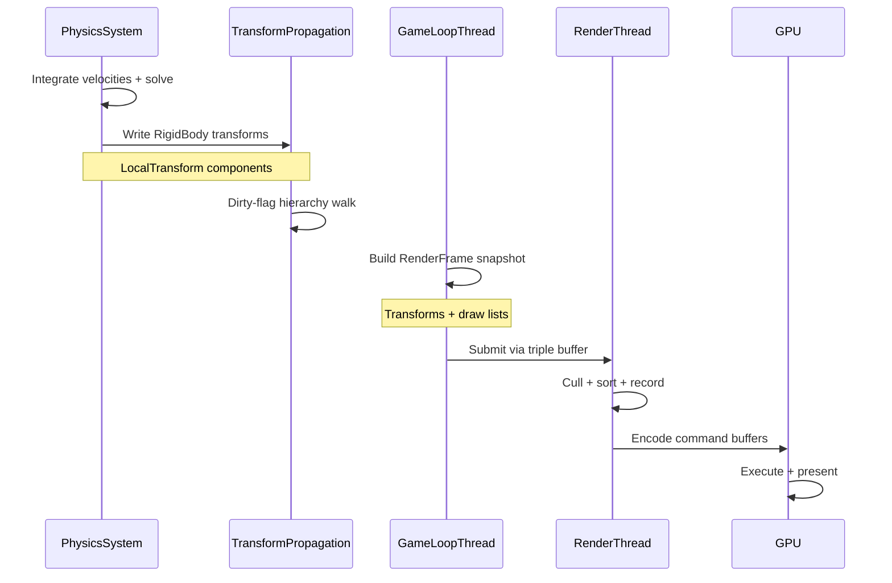

### ECS Change to Spatial Update

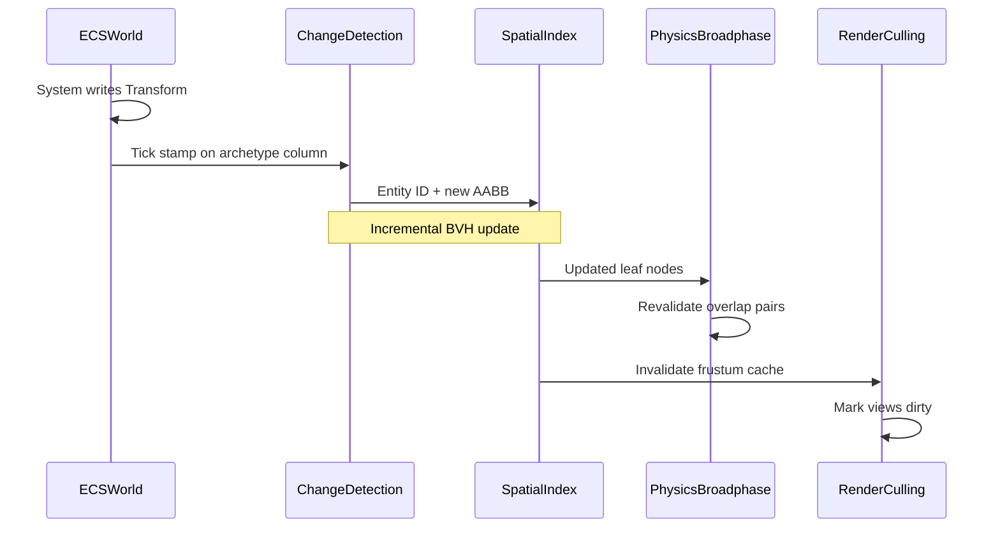

### Audio Streaming Pipeline

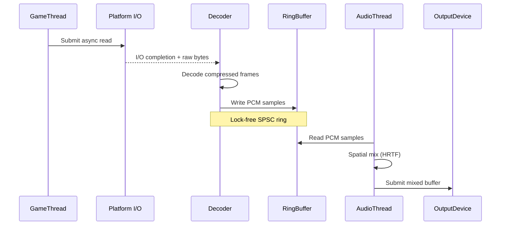

### Networked Entity Lifecycle

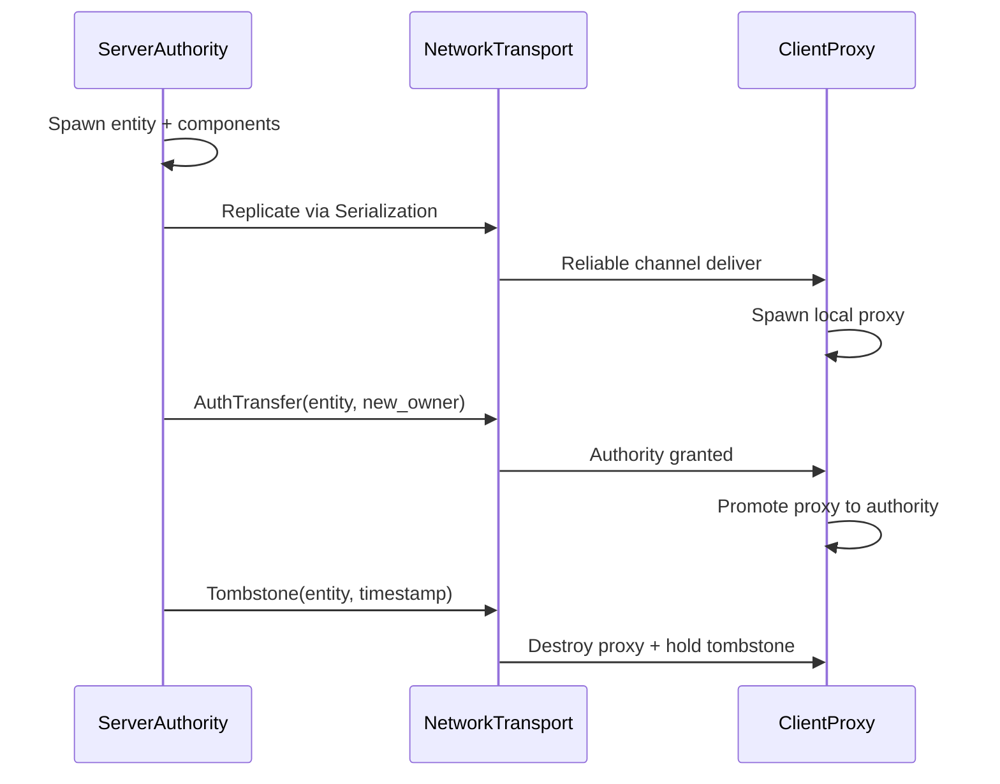

---

## Platform Abstraction

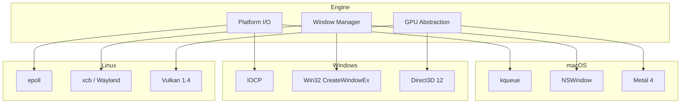

| Platform | Platform I/O | Windowing | Graphics | FFI |
|----------|--------------|-----------|----------|-----|
| macOS | kqueue | NSWindow | Metal 4 | objc2 |
| Windows | IOCP | Win32 (windows-rs) | D3D12 | windows-rs |
| Linux | epoll | x11rb / wayland | Vulkan 1.4 | ash |
| iOS | kqueue | UIWindow | Metal 4 | objc2 |
| Android | epoll | ndk crate | Vulkan 1.4 | ash |

---

## Design Summary

| Directory | Design Files |
|-----------|------------:|
| core-runtime | 8 |
| data-systems | 4 |
| simulation | 4 |
| game-framework | 3 |
| ai | 3 |
| animation | 3 |
| audio | 1 |
| content-pipeline | 2 |
| geometry | 2 |
| input | 1 |
| networking | 3 |
| physics | 3 |
| platform | 3 |
| rendering | 5 |
| tools | 7 |
| ui | 1 |
| vfx | 2 |
| **Total** | **55** |
