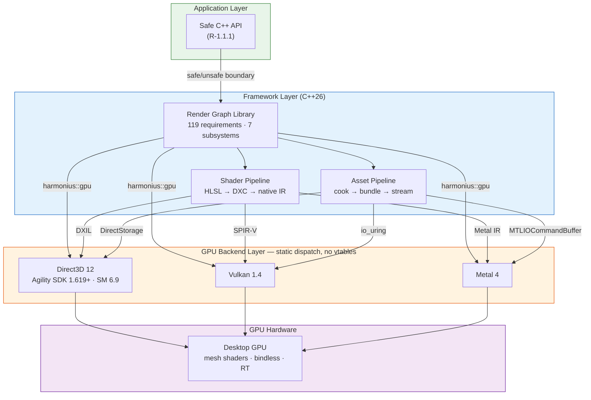

# Harmonius Architecture

System-wide architecture overview for the Harmonius GPU graphics framework.

## Contents

- [Harmonius Architecture](#harmonius-architecture)
  - [Contents](#contents)
  - [Overview](#overview)
  - [System Diagram](#system-diagram)
  - [Architectural Constraints](#architectural-constraints)
  - [Layers](#layers)
    - [Application Layer — Safe C++ API](#application-layer--safe-c-api)
    - [Framework Layer — C++26](#framework-layer--c26)
    - [GPU Backend Layer — Static Dispatch](#gpu-backend-layer--static-dispatch)
  - [Framework Components](#framework-components)
    - [Render Graph Library](#render-graph-library)
    - [Shader Pipeline](#shader-pipeline)
    - [Asset Pipeline](#asset-pipeline)
  - [Platform Matrix](#platform-matrix)
  - [Build System](#build-system)
  - [Design Documents](#design-documents)

## Overview

Harmonius is a GPU graphics framework built around a declarative, frame-invariant render graph.
The framework provides three core subsystems — a render graph library, a shader pipeline, and an
asset pipeline — that sit on top of native GPU backends with zero abstraction overhead.

The user-facing API is a safe subset of C++ (R-1.1.1) that prohibits raw pointer arithmetic, manual
memory management, C-style casts, and unchecked array access. GPU backends are selected at compile
time via CMake and statically linked — no vtables, no virtual methods, no shared libraries (R-1.1.5).

## System Diagram

## Architectural Constraints

These constraints (from [1.1-core-constraints.md](requirements/1-architecture/1.1-core-constraints.md))
shape every component:

| ID | Constraint | Impact |
|---|---|---|
| R-1.1.1 | Safe C++ user-facing API | Unsafe operations confined to render/IO threads behind internal boundaries |
| R-1.1.2 | GPU-driven rendering | No CPU-side draw calls; indirect dispatch only |
| R-1.1.3 | Mesh shader pipeline | No legacy vertex/geometry/tessellation stages |
| R-1.1.4 | Declarative render graph | Frame-invariant DAG compiled once, executed per frame |
| R-1.1.5 | Native backends, no translation layers | Direct D3D12/Vulkan/Metal; no MoltenVK/DXVK |
| R-1.1.6 | Modern hardware only | Bindless, mesh shaders, and RT required; no fallbacks |
| R-1.1.7 | Strict layer separation | No backend types in render graph; no graph concepts in backend |

## Layers

### Application Layer — Safe C++ API

The public API exposed to users. All interactions with the framework go through a safe subset of
C++ that prohibits raw pointer arithmetic, manual memory management, C-style casts, and unchecked
array access. Unsafe operations are confined to background render and IO threads behind clearly
marked internal boundaries. User code cannot trigger undefined behavior.

**Requirement:** R-1.1.1

### Framework Layer — C++26

The core implementation layer. Three components — the render graph library, shader pipeline, and
asset pipeline — collaborate to turn a declarative scene description into GPU command streams.
All framework code is C++26, built with CMake 3.30+, and depends on vcpkg-managed packages.

### GPU Backend Layer — Static Dispatch

A thin abstraction over D3D12, Vulkan 1.4, and Metal 4, defined in the `harmonius::gpu` namespace.
The backend is selected at build time via a CMake option and statically linked. All dispatch is
static (compile-time polymorphism) — no vtables, no virtual methods, no dynamic loading.

Each backend implements the same interface but maps to native API concepts directly. Cross-backend
compatibility shims (e.g., push constants capped at 32 bytes for D3D12 parity) are documented in
the interface specification.

**Requirements:** R-1.1.5, R-1.2.1–R-1.2.3

## Framework Components

### Render Graph Library

The central component. A frame-invariant directed acyclic graph of passes and resources, compiled
once into an optimized execution plan and re-executed each frame with only per-frame data changing.

**Lifecycle:**

1. **Build** — Passes declare typed inputs/outputs; resources are created as transient, persistent,
   or imported. The graph topology is established.
2. **Compile** — The DAG is validated, topologically sorted, and optimized. Dead passes are
   eliminated, resources are aliased onto shared heaps, barriers are inserted, and queue
   assignments are finalized.
3. **Execute** — Each frame, per-frame data (dynamic resolution, activation flags, resource
   bindings) is injected and the compiled plan is dispatched across graphics, async compute, and
   transfer queues.

**Subsystems:** Graph Builder, Graph Compiler, Resource System, Synchronization Engine, Gating
System, Execution Engine, Diagnostics.

**Scope:** 119 requirements across 14 categories (RG-1 through RG-14).

**Design docs:**
[render-graph-architecture.md](design/render-graph-architecture.md),
[render-graph-design.md](design/render-graph-design.md),
[render-graph-classes.md](design/render-graph-classes.md)

### Shader Pipeline

Compiles HLSL source through DXC into backend-native intermediate representations:

| Backend | IR | Profile |
|---|---|---|
| Direct3D 12 | DXIL | Shader Model 6.9 |
| Vulkan 1.4 | SPIR-V | Via DXC `-spirv` |
| Metal 4 | Metal IR | Via `metal-shaderconverter` from DXIL |

The pipeline handles shader reflection, permutation management, and runtime hot-reload during
development. All shaders use HLSL as the single authoring language.

**Design doc:** [shader-pipeline.md](design/shader-pipeline.md)

### Asset Pipeline

Transforms raw assets into GPU-ready formats through a three-stage pipeline:

1. **Cook** — Import raw assets (meshes, textures, audio) and convert to engine-internal formats
   with platform-specific compression.
2. **Bundle** — Pack cooked assets into streaming-friendly bundles with dependency metadata.
3. **Stream** — Load bundles at runtime via platform-native high-performance IO:

| Platform | IO Path |
|---|---|
| Windows (D3D12) | DirectStorage |
| Linux/SteamOS (Vulkan) | `io_uring` |
| macOS (Metal) | `MTLIOCommandBuffer` |

A standard async file IO fallback is available when native paths are unavailable (R-1.2.4).

**Design doc:** [asset-pipeline.md](design/asset-pipeline.md)

## Platform Matrix

| Platform | GPU API | IO Path | Status |
|---|---|---|---|
| macOS (Apple Silicon M1+) | Metal 4 | `MTLIOCommandBuffer` | Initial development target |
| Windows | Direct3D 12 (Agility SDK 1.619+) | DirectStorage | Supported |
| Windows | Vulkan 1.4 | async file IO | Supported |
| Linux / SteamOS | Vulkan 1.4 | `io_uring` | Supported |

Desktop only — no console or mobile platforms (R-1.2.5). All platforms require mesh shaders,
bindless resources, and hardware ray tracing (R-1.1.6).

## Build System

- **Language:** C++26
- **Build tool:** CMake 3.30+
- **Package manager:** vcpkg
- **GPU backend selection:** Compile-time CMake option; one backend per binary
- **Shader compiler:** DXC (DirectX Shader Compiler)

## Design Documents

Detailed design and API specifications live in `docs/design/`:

| Document | Scope |
|---|---|
| [render-graph-architecture.md](design/render-graph-architecture.md) | Render graph subsystem architecture, lifecycle, and design principles |
| [render-graph-design.md](design/render-graph-design.md) | Render graph C++ API surfaces for all 9 modules |
| [render-graph-classes.md](design/render-graph-classes.md) | Class diagrams, sequence diagrams, and type definitions |
| [gpu-backend-interface.md](design/gpu-backend-interface.md) | GPU backend abstract interface, types, and cross-backend compatibility |
| [gpu-backend-d3d12.md](design/gpu-backend-d3d12.md) | Direct3D 12 backend implementation |
| [gpu-backend-vulkan.md](design/gpu-backend-vulkan.md) | Vulkan 1.4 backend implementation |
| [gpu-backend-metal.md](design/gpu-backend-metal.md) | Metal 4 backend implementation |
| [shader-pipeline.md](design/shader-pipeline.md) | Shader compilation pipeline (HLSL → DXC → native IR) |
| [asset-pipeline.md](design/asset-pipeline.md) | Asset cooking, bundling, and streaming pipeline |
