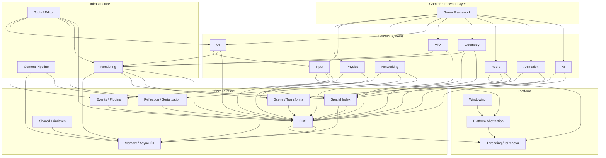
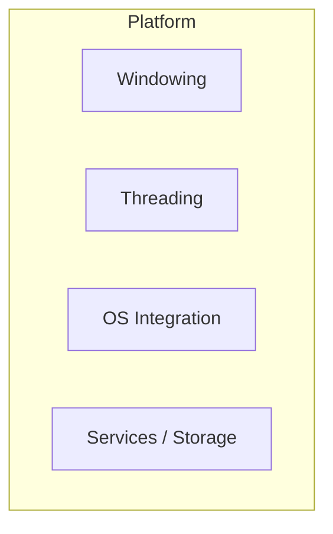
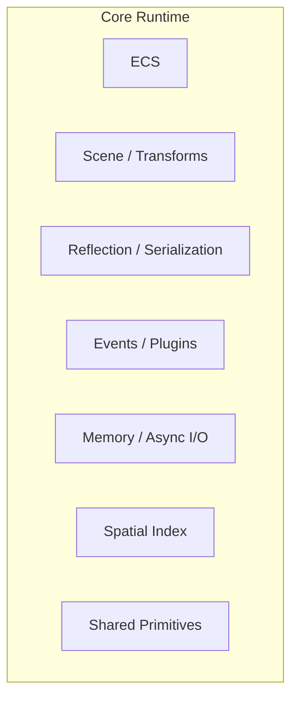
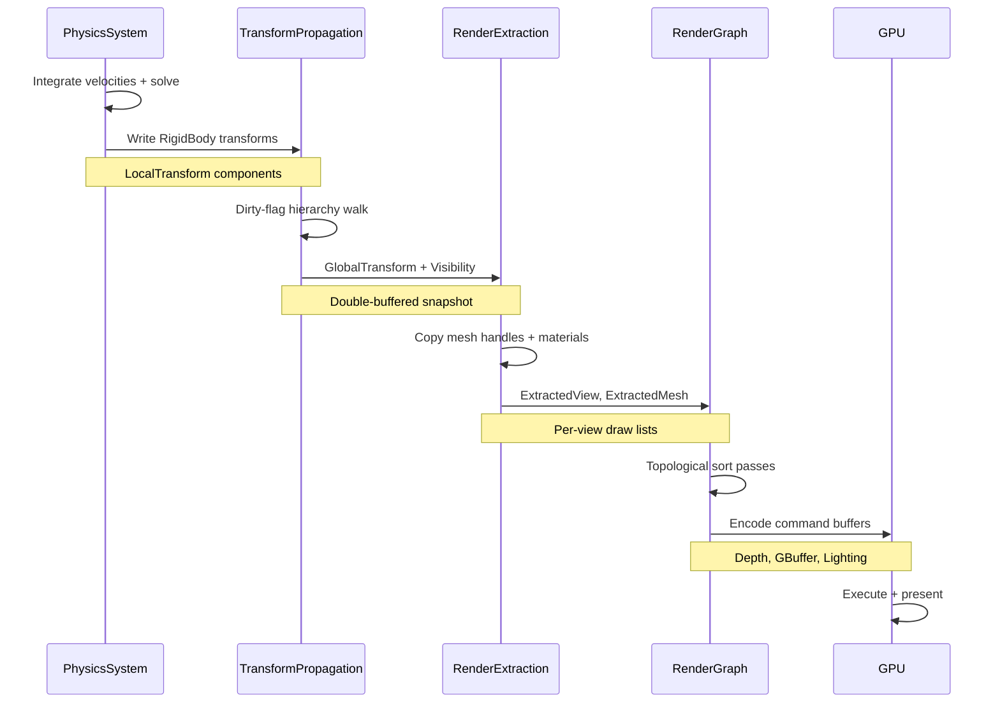
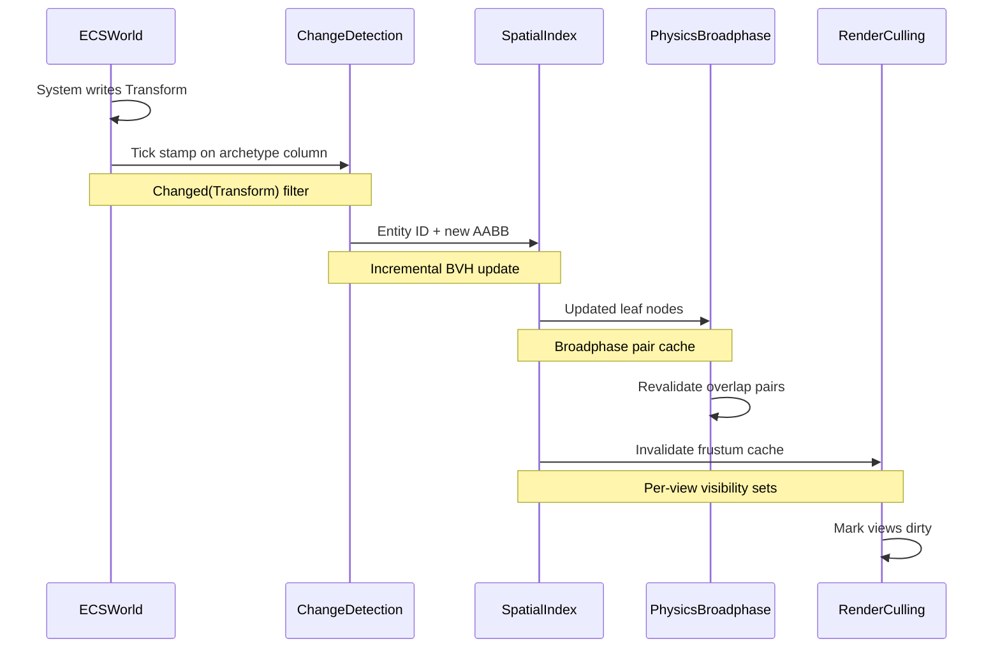
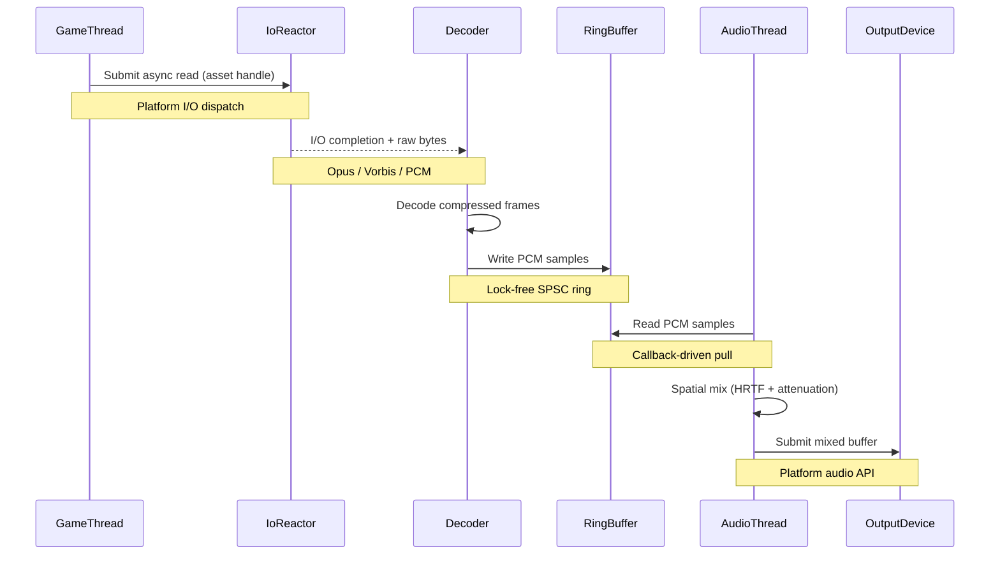
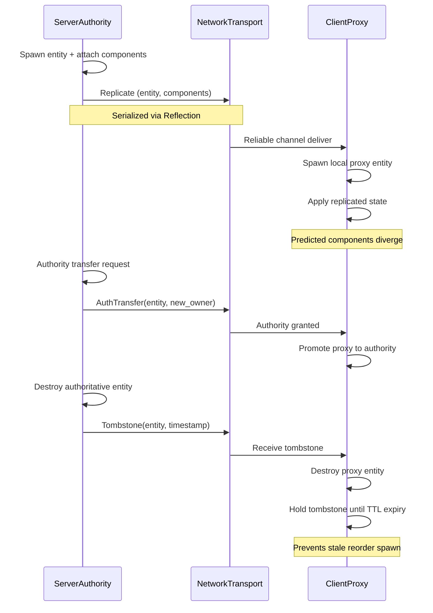
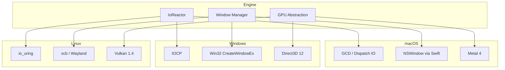
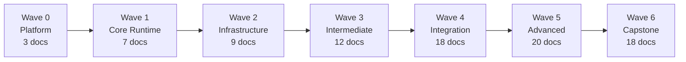

# Harmonius Engine Architecture

## Engine Overview

Harmonius is a cross-platform game engine written in Rust (stable) with cxx.rs FFI to C++ and Swift.
It targets Metal 4, Direct3D 12, and Vulkan 1.4 with mesh shaders and ray tracing as minimum
requirements. All simulation runs through a 100% ECS architecture with no separate data stores.

See [design/constraints.md](design/constraints.md) for the full constraint set.

## High-Level Architecture

Click any node to jump to its module reference.

## Layered Architecture

| Layer            |
|------------------|
| 5 — Application  |
| 4 — Domain       |
| 3 — Mid-Level    |
| 2 — Pipeline     |
| 1 — Core Runtime |
| 0 — Platform     |

1. **5 — Application** — [Game Framework](#game-framework), [Tools / Editor](#tools--editor)
2. **4 — Domain** — [AI](#ai), [Animation](#animation), [Audio](#audio), [Networking](#networking),
   [VFX](#vfx)
3. **3 — Mid-Level** — [Physics](#physics), [Rendering](#rendering), [Geometry](#geometry),
   [UI](#ui), [Input](#input)
4. **2 — Pipeline** — [Content Pipeline](#content-pipeline)
5. **1 — Core Runtime** — [Core Runtime](#core-runtime) (ECS, Scene, Reflection, Events, Memory,
   Spatial Index, Shared Primitives)
6. **0 — Platform** — [Platform](#platform) (Windowing, Threading / IoReactor, Platform Abstraction)

---

## Module Reference

Each module lists all design documents, test case companions, feature specs, requirements, and user
stories. Click any link to navigate to that artifact.

---

### Platform

Platform abstraction for windowing, threading, async I/O, OS integration, and platform services.

#### Design Documents

| Design                                                     |
|------------------------------------------------------------|
| [windowing.md](design/platform/windowing.md)               |
| [threading.md](design/platform/threading.md)               |
| [os-integration.md](design/platform/os-integration.md)     |
| [services-storage.md](design/platform/services-storage.md) |

1. **[windowing.md](design/platform/windowing.md)** —
   [windowing-test-cases.md](design/platform/windowing-test-cases.md)
2. **[threading.md](design/platform/threading.md)** —
   [threading-test-cases.md](design/platform/threading-test-cases.md)
3. **[os-integration.md](design/platform/os-integration.md)** —
   [os-integration-test-cases.md](design/platform/os-integration-test-cases.md)
4. **[services-storage.md](design/platform/services-storage.md)** —
   [services-storage-test-cases.md](design/platform/services-storage-test-cases.md)

#### Features

| Feature |
|---------|
| [window-display.md](features/platform/window-display.md) |
| [threading-async.md](features/platform/threading-async.md) |
| [os-integration.md](features/platform/os-integration.md) |
| [filesystem.md](features/platform/filesystem.md) |
| [crash-reporting.md](features/platform/crash-reporting.md) |
| [platform-services.md](features/platform/platform-services.md) |

#### Requirements

| Requirement |
|-------------|
| [window-display.md](requirements/platform/window-display.md) |
| [threading-async.md](requirements/platform/threading-async.md) |
| [os-integration.md](requirements/platform/os-integration.md) |
| [filesystem.md](requirements/platform/filesystem.md) |
| [crash-reporting.md](requirements/platform/crash-reporting.md) |
| [platform-services.md](requirements/platform/platform-services.md) |

#### User Stories

| User Story |
|------------|
| [window-display.md](user-stories/platform/window-display.md) |
| [threading-async.md](user-stories/platform/threading-async.md) |
| [os-integration.md](user-stories/platform/os-integration.md) |
| [filesystem.md](user-stories/platform/filesystem.md) |
| [crash-reporting.md](user-stories/platform/crash-reporting.md) |
| [platform-services.md](user-stories/platform/platform-services.md) |

---

### Core Runtime

ECS, scene hierarchy, reflection, events, memory management, async I/O, spatial indexing, and shared
engine-wide primitives.

#### Design Documents

| Design                                                                         |
|--------------------------------------------------------------------------------|
| [ecs.md](design/core-runtime/ecs.md)                                           |
| [scene-transforms.md](design/core-runtime/scene-transforms.md)                 |
| [reflection-serialization.md](design/core-runtime/reflection-serialization.md) |
| [events-plugins.md](design/core-runtime/events-plugins.md)                     |
| [memory-async-io.md](design/core-runtime/memory-async-io.md)                   |
| [spatial-index.md](design/core-runtime/spatial-index.md)                       |
| [shared-primitives.md](design/core-runtime/shared-primitives.md)               |

1. **[ecs.md](design/core-runtime/ecs.md)** —
   [ecs-test-cases.md](design/core-runtime/ecs-test-cases.md)
2. **[scene-transforms.md](design/core-runtime/scene-transforms.md)** —
   [scene-transforms-test-cases.md](design/core-runtime/scene-transforms-test-cases.md)
3. **[reflection-serialization.md](design/core-runtime/reflection-serialization.md)** —
   [reflection-serialization-test-cases.md](design/core-runtime/reflection-serialization-test-cases.md)
4. **[events-plugins.md](design/core-runtime/events-plugins.md)** —
   [events-plugins-test-cases.md](design/core-runtime/events-plugins-test-cases.md)
5. **[memory-async-io.md](design/core-runtime/memory-async-io.md)** —
   [memory-async-io-test-cases.md](design/core-runtime/memory-async-io-test-cases.md)
6. **[spatial-index.md](design/core-runtime/spatial-index.md)** —
   [spatial-index-test-cases.md](design/core-runtime/spatial-index-test-cases.md)
7. **[shared-primitives.md](design/core-runtime/shared-primitives.md)** —
   [shared-primitives-test-cases.md](design/core-runtime/shared-primitives-test-cases.md)

#### Features

| Feature |
|---------|
| [entity-component-system.md](features/core-runtime/entity-component-system.md) |
| [scene-and-transforms.md](features/core-runtime/scene-and-transforms.md) |
| [reflection-and-type-system.md](features/core-runtime/reflection-and-type-system.md) |
| [serialization.md](features/core-runtime/serialization.md) |
| [events-and-messaging.md](features/core-runtime/events-and-messaging.md) |
| [plugin-system.md](features/core-runtime/plugin-system.md) |
| [memory-management.md](features/core-runtime/memory-management.md) |
| [async-io.md](features/core-runtime/async-io.md) |
| [spatial-indexing.md](features/core-runtime/spatial-indexing.md) |

#### Requirements

| Requirement |
|-------------|
| [entity-component-system.md](requirements/core-runtime/entity-component-system.md) |
| [scene-and-transforms.md](requirements/core-runtime/scene-and-transforms.md) |
| [reflection-and-type-system.md](requirements/core-runtime/reflection-and-type-system.md) |
| [serialization.md](requirements/core-runtime/serialization.md) |
| [events-and-messaging.md](requirements/core-runtime/events-and-messaging.md) |
| [plugin-system.md](requirements/core-runtime/plugin-system.md) |
| [memory-management.md](requirements/core-runtime/memory-management.md) |
| [async-io.md](requirements/core-runtime/async-io.md) |
| [spatial-indexing.md](requirements/core-runtime/spatial-indexing.md) |

#### User Stories

| User Story |
|------------|
| [entity-component-system.md](user-stories/core-runtime/entity-component-system.md) |
| [scene-and-transforms.md](user-stories/core-runtime/scene-and-transforms.md) |
| [reflection-and-type-system.md](user-stories/core-runtime/reflection-and-type-system.md) |
| [serialization.md](user-stories/core-runtime/serialization.md) |
| [events-and-messaging.md](user-stories/core-runtime/events-and-messaging.md) |
| [plugin-system.md](user-stories/core-runtime/plugin-system.md) |
| [memory-management.md](user-stories/core-runtime/memory-management.md) |
| [async-io.md](user-stories/core-runtime/async-io.md) |
| [spatial-indexing.md](user-stories/core-runtime/spatial-indexing.md) |

---

### Rendering

GPU abstraction, render graph, core rendering, lighting, post-processing, ray tracing,
environment/character rendering, and stylized materials.

#### Design Documents

| Design                                                                |
|-----------------------------------------------------------------------|
| [gpu-abstraction.md](design/rendering/gpu-abstraction.md)             |
| [render-graph.md](design/rendering/render-graph.md)                   |
| [core-rendering.md](design/rendering/core-rendering.md)               |
| [lighting.md](design/rendering/lighting.md)                           |
| [post-processing.md](design/rendering/post-processing.md)             |
| [advanced.md](design/rendering/advanced.md)                           |
| [environment-character.md](design/rendering/environment-character.md) |
| [stylized-materials.md](design/rendering/stylized-materials.md)       |

1. **[gpu-abstraction.md](design/rendering/gpu-abstraction.md)** —
   [gpu-abstraction-test-cases.md](design/rendering/gpu-abstraction-test-cases.md)
2. **[render-graph.md](design/rendering/render-graph.md)** —
   [render-graph-test-cases.md](design/rendering/render-graph-test-cases.md)
3. **[core-rendering.md](design/rendering/core-rendering.md)** —
   [core-rendering-test-cases.md](design/rendering/core-rendering-test-cases.md)
4. **[lighting.md](design/rendering/lighting.md)** —
   [lighting-test-cases.md](design/rendering/lighting-test-cases.md)
5. **[post-processing.md](design/rendering/post-processing.md)** —
   [post-processing-test-cases.md](design/rendering/post-processing-test-cases.md)
6. **[advanced.md](design/rendering/advanced.md)** —
   [advanced-test-cases.md](design/rendering/advanced-test-cases.md)
7. **[environment-character.md](design/rendering/environment-character.md)** —
   [environment-character-test-cases.md](design/rendering/environment-character-test-cases.md)
8. **[stylized-materials.md](design/rendering/stylized-materials.md)** —
   [stylized-materials-test-cases.md](design/rendering/stylized-materials-test-cases.md)

#### Features

| Feature |
|---------|
| [gpu-abstraction-layer.md](features/rendering/gpu-abstraction-layer.md) |
| [render-graph.md](features/rendering/render-graph.md) |
| [core-rendering.md](features/rendering/core-rendering.md) |
| [scene-rendering-pipeline.md](features/rendering/scene-rendering-pipeline.md) |
| [lighting.md](features/rendering/lighting.md) |
| [post-processing.md](features/rendering/post-processing.md) |
| [advanced-rendering.md](features/rendering/advanced-rendering.md) |
| [anti-aliasing-upscaling.md](features/rendering/anti-aliasing-upscaling.md) |
| [environment.md](features/rendering/environment.md) |
| [character-rendering.md](features/rendering/character-rendering.md) |
| [stylized-effects.md](features/rendering/stylized-effects.md) |
| [advanced-materials.md](features/rendering/advanced-materials.md) |

#### Requirements

| Requirement |
|-------------|
| [gpu-abstraction-layer.md](requirements/rendering/gpu-abstraction-layer.md) |
| [render-graph.md](requirements/rendering/render-graph.md) |
| [core-rendering.md](requirements/rendering/core-rendering.md) |
| [scene-rendering-pipeline.md](requirements/rendering/scene-rendering-pipeline.md) |
| [lighting.md](requirements/rendering/lighting.md) |
| [post-processing.md](requirements/rendering/post-processing.md) |
| [advanced-rendering.md](requirements/rendering/advanced-rendering.md) |
| [anti-aliasing-upscaling.md](requirements/rendering/anti-aliasing-upscaling.md) |
| [environment.md](requirements/rendering/environment.md) |
| [character-rendering.md](requirements/rendering/character-rendering.md) |
| [stylized-effects.md](requirements/rendering/stylized-effects.md) |
| [advanced-materials.md](requirements/rendering/advanced-materials.md) |

#### User Stories

| User Story |
|------------|
| [gpu-abstraction-layer.md](user-stories/rendering/gpu-abstraction-layer.md) |
| [render-graph.md](user-stories/rendering/render-graph.md) |
| [core-rendering.md](user-stories/rendering/core-rendering.md) |
| [scene-rendering-pipeline.md](user-stories/rendering/scene-rendering-pipeline.md) |
| [lighting.md](user-stories/rendering/lighting.md) |
| [post-processing.md](user-stories/rendering/post-processing.md) |
| [advanced-rendering.md](user-stories/rendering/advanced-rendering.md) |
| [anti-aliasing-upscaling.md](user-stories/rendering/anti-aliasing-upscaling.md) |
| [environment.md](user-stories/rendering/environment.md) |
| [character-rendering.md](user-stories/rendering/character-rendering.md) |
| [stylized-effects.md](user-stories/rendering/stylized-effects.md) |
| [advanced-materials.md](user-stories/rendering/advanced-materials.md) |

---

### Content Pipeline

Asset import, processing, streaming, hot reload, DCC plugins, and asset versioning.

#### Design Documents

| Design                                                         |
|----------------------------------------------------------------|
| [asset-import.md](design/content-pipeline/asset-import.md)     |
| [processing.md](design/content-pipeline/processing.md)         |
| [streaming.md](design/content-pipeline/streaming.md)           |
| [hot-reload.md](design/content-pipeline/hot-reload.md)         |
| [dcc-versioning.md](design/content-pipeline/dcc-versioning.md) |

1. **[asset-import.md](design/content-pipeline/asset-import.md)** —
   [asset-import-test-cases.md](design/content-pipeline/asset-import-test-cases.md)
2. **[processing.md](design/content-pipeline/processing.md)** —
   [processing-test-cases.md](design/content-pipeline/processing-test-cases.md)
3. **[streaming.md](design/content-pipeline/streaming.md)** —
   [streaming-test-cases.md](design/content-pipeline/streaming-test-cases.md)
4. **[hot-reload.md](design/content-pipeline/hot-reload.md)** —
   [hot-reload-test-cases.md](design/content-pipeline/hot-reload-test-cases.md)
5. **[dcc-versioning.md](design/content-pipeline/dcc-versioning.md)** —
   [dcc-versioning-test-cases.md](design/content-pipeline/dcc-versioning-test-cases.md)

#### Features

| Feature |
|---------|
| [asset-import.md](features/content-pipeline/asset-import.md) |
| [asset-processing.md](features/content-pipeline/asset-processing.md) |
| [asset-database.md](features/content-pipeline/asset-database.md) |
| [streaming-io.md](features/content-pipeline/streaming-io.md) |
| [hot-reload.md](features/content-pipeline/hot-reload.md) |
| [dcc-plugins.md](features/content-pipeline/dcc-plugins.md) |
| [asset-versioning.md](features/content-pipeline/asset-versioning.md) |

#### Requirements

| Requirement |
|-------------|
| [asset-import.md](requirements/content-pipeline/asset-import.md) |
| [asset-processing.md](requirements/content-pipeline/asset-processing.md) |
| [asset-database.md](requirements/content-pipeline/asset-database.md) |
| [streaming-io.md](requirements/content-pipeline/streaming-io.md) |
| [hot-reload.md](requirements/content-pipeline/hot-reload.md) |
| [dcc-plugins.md](requirements/content-pipeline/dcc-plugins.md) |
| [asset-versioning.md](requirements/content-pipeline/asset-versioning.md) |

#### User Stories

| User Story |
|------------|
| [asset-import.md](user-stories/content-pipeline/asset-import.md) |
| [asset-processing.md](user-stories/content-pipeline/asset-processing.md) |
| [asset-database.md](user-stories/content-pipeline/asset-database.md) |
| [streaming-io.md](user-stories/content-pipeline/streaming-io.md) |
| [hot-reload.md](user-stories/content-pipeline/hot-reload.md) |
| [dcc-plugins.md](user-stories/content-pipeline/dcc-plugins.md) |
| [asset-versioning.md](user-stories/content-pipeline/asset-versioning.md) |

---

### Physics

Rigid body dynamics, collision detection, constraints, spatial queries, vehicles, destruction, soft
body, and fluids.

#### Design Documents

| Design                                          |
|-------------------------------------------------|
| [foundation.md](design/physics/foundation.md)   |
| [constraints.md](design/physics/constraints.md) |
| [advanced.md](design/physics/advanced.md)       |

1. **[foundation.md](design/physics/foundation.md)** —
   [foundation-test-cases.md](design/physics/foundation-test-cases.md)
2. **[constraints.md](design/physics/constraints.md)** —
   [constraints-test-cases.md](design/physics/constraints-test-cases.md)
3. **[advanced.md](design/physics/advanced.md)** —
   [advanced-test-cases.md](design/physics/advanced-test-cases.md)

#### Features

| Feature |
|---------|
| [rigid-body-dynamics.md](features/physics/rigid-body-dynamics.md) |
| [collision-detection.md](features/physics/collision-detection.md) |
| [constraints-and-joints.md](features/physics/constraints-and-joints.md) |
| [spatial-queries.md](features/physics/spatial-queries.md) |
| [vehicle-physics.md](features/physics/vehicle-physics.md) |
| [destruction-and-fracture.md](features/physics/destruction-and-fracture.md) |
| [soft-body-and-cloth.md](features/physics/soft-body-and-cloth.md) |
| [fluid-simulation.md](features/physics/fluid-simulation.md) |

#### Requirements

| Requirement |
|-------------|
| [rigid-body-dynamics.md](requirements/physics/rigid-body-dynamics.md) |
| [collision-detection.md](requirements/physics/collision-detection.md) |
| [constraints-and-joints.md](requirements/physics/constraints-and-joints.md) |
| [spatial-queries.md](requirements/physics/spatial-queries.md) |
| [vehicle-physics.md](requirements/physics/vehicle-physics.md) |
| [destruction-and-fracture.md](requirements/physics/destruction-and-fracture.md) |
| [soft-body-and-cloth.md](requirements/physics/soft-body-and-cloth.md) |
| [fluid-simulation.md](requirements/physics/fluid-simulation.md) |

#### User Stories

| User Story |
|------------|
| [rigid-body-dynamics.md](user-stories/physics/rigid-body-dynamics.md) |
| [collision-detection.md](user-stories/physics/collision-detection.md) |
| [constraints-and-joints.md](user-stories/physics/constraints-and-joints.md) |
| [spatial-queries.md](user-stories/physics/spatial-queries.md) |
| [vehicle-physics.md](user-stories/physics/vehicle-physics.md) |
| [destruction-and-fracture.md](user-stories/physics/destruction-and-fracture.md) |
| [soft-body-and-cloth.md](user-stories/physics/soft-body-and-cloth.md) |
| [fluid-simulation.md](user-stories/physics/fluid-simulation.md) |

---

### Input

Device abstraction, action mapping, gesture recognition, haptics, and VR input.

#### Design Documents

| Design                                                  |
|---------------------------------------------------------|
| [devices-actions.md](design/input/devices-actions.md)   |
| [gestures-haptics.md](design/input/gestures-haptics.md) |

1. **[devices-actions.md](design/input/devices-actions.md)** —
   [devices-actions-test-cases.md](design/input/devices-actions-test-cases.md)
2. **[gestures-haptics.md](design/input/gestures-haptics.md)** —
   [gestures-haptics-test-cases.md](design/input/gestures-haptics-test-cases.md)

#### Features

| Feature |
|---------|
| [device-abstraction.md](features/input/device-abstraction.md) |
| [input-actions-and-mapping.md](features/input/input-actions-and-mapping.md) |
| [gestures.md](features/input/gestures.md) |
| [haptics-and-feedback.md](features/input/haptics-and-feedback.md) |
| [vr-input.md](features/input/vr-input.md) |

#### Requirements

| Requirement |
|-------------|
| [device-abstraction.md](requirements/input/device-abstraction.md) |
| [input-actions-and-mapping.md](requirements/input/input-actions-and-mapping.md) |
| [gestures.md](requirements/input/gestures.md) |
| [haptics-and-feedback.md](requirements/input/haptics-and-feedback.md) |
| [vr-input.md](requirements/input/vr-input.md) |

#### User Stories

| User Story |
|------------|
| [device-abstraction.md](user-stories/input/device-abstraction.md) |
| [input-actions-and-mapping.md](user-stories/input/input-actions-and-mapping.md) |
| [gestures.md](user-stories/input/gestures.md) |
| [haptics-and-feedback.md](user-stories/input/haptics-and-feedback.md) |
| [vr-input.md](user-stories/input/vr-input.md) |

---

### Audio

Audio engine, spatial audio, DSP effects, adaptive music, and voice chat.

#### Design Documents

| Design                                    |
|-------------------------------------------|
| [engine.md](design/audio/engine.md)       |
| [dsp-music.md](design/audio/dsp-music.md) |

1. **[engine.md](design/audio/engine.md)** —
   [engine-test-cases.md](design/audio/engine-test-cases.md)
2. **[dsp-music.md](design/audio/dsp-music.md)** —
   [dsp-music-test-cases.md](design/audio/dsp-music-test-cases.md)

#### Features

| Feature |
|---------|
| [audio-engine.md](features/audio/audio-engine.md) |
| [spatial-audio.md](features/audio/spatial-audio.md) |
| [dsp-and-effects.md](features/audio/dsp-and-effects.md) |
| [music-system.md](features/audio/music-system.md) |
| [voice-and-speech.md](features/audio/voice-and-speech.md) |

#### Requirements

| Requirement |
|-------------|
| [audio-engine.md](requirements/audio/audio-engine.md) |
| [spatial-audio.md](requirements/audio/spatial-audio.md) |
| [dsp-and-effects.md](requirements/audio/dsp-and-effects.md) |
| [music-system.md](requirements/audio/music-system.md) |
| [voice-and-speech.md](requirements/audio/voice-and-speech.md) |

#### User Stories

| User Story |
|------------|
| [audio-engine.md](user-stories/audio/audio-engine.md) |
| [spatial-audio.md](user-stories/audio/spatial-audio.md) |
| [dsp-and-effects.md](user-stories/audio/dsp-and-effects.md) |
| [music-system.md](user-stories/audio/music-system.md) |
| [voice-and-speech.md](user-stories/audio/voice-and-speech.md) |

---

### Animation

Skeletal animation, state machines, blend spaces, procedural animation, IK, cloth/hair, and
first-person animation.

#### Design Documents

| Design                                                |
|-------------------------------------------------------|
| [skeletal.md](design/animation/skeletal.md)           |
| [state-machine.md](design/animation/state-machine.md) |
| [procedural.md](design/animation/procedural.md)       |
| [cloth-hair.md](design/animation/cloth-hair.md)       |
| [first-person.md](design/animation/first-person.md)   |

1. **[skeletal.md](design/animation/skeletal.md)** —
   [skeletal-test-cases.md](design/animation/skeletal-test-cases.md)
2. **[state-machine.md](design/animation/state-machine.md)** —
   [state-machine-test-cases.md](design/animation/state-machine-test-cases.md)
3. **[procedural.md](design/animation/procedural.md)** —
   [procedural-test-cases.md](design/animation/procedural-test-cases.md)
4. **[cloth-hair.md](design/animation/cloth-hair.md)** —
   [cloth-hair-test-cases.md](design/animation/cloth-hair-test-cases.md)
5. **[first-person.md](design/animation/first-person.md)** —
   [first-person-test-cases.md](design/animation/first-person-test-cases.md)

#### Features

| Feature |
|---------|
| [skeletal.md](features/animation/skeletal.md) |
| [state-machine.md](features/animation/state-machine.md) |
| [morph.md](features/animation/morph.md) |
| [procedural.md](features/animation/procedural.md) |
| [cloth-hair.md](features/animation/cloth-hair.md) |
| [first-person.md](features/animation/first-person.md) |

#### Requirements

| Requirement |
|-------------|
| [skeletal.md](requirements/animation/skeletal.md) |
| [state-machine.md](requirements/animation/state-machine.md) |
| [morph.md](requirements/animation/morph.md) |
| [procedural.md](requirements/animation/procedural.md) |
| [cloth-hair.md](requirements/animation/cloth-hair.md) |
| [first-person.md](requirements/animation/first-person.md) |

#### User Stories

| User Story |
|------------|
| [skeletal.md](user-stories/animation/skeletal.md) |
| [state-machine.md](user-stories/animation/state-machine.md) |
| [morph.md](user-stories/animation/morph.md) |
| [procedural.md](user-stories/animation/procedural.md) |
| [cloth-hair.md](user-stories/animation/cloth-hair.md) |
| [first-person.md](user-stories/animation/first-person.md) |

---

### AI

Navigation, behavior trees, utility AI, GOAP, perception, steering, and crowd simulation.

#### Design Documents

| Design                                             |
|----------------------------------------------------|
| [navigation.md](design/ai/navigation.md)           |
| [behavior.md](design/ai/behavior.md)               |
| [perception.md](design/ai/perception.md)           |
| [steering-crowds.md](design/ai/steering-crowds.md) |

1. **[navigation.md](design/ai/navigation.md)** —
   [navigation-test-cases.md](design/ai/navigation-test-cases.md)
2. **[behavior.md](design/ai/behavior.md)** —
   [behavior-test-cases.md](design/ai/behavior-test-cases.md)
3. **[perception.md](design/ai/perception.md)** —
   [perception-test-cases.md](design/ai/perception-test-cases.md)
4. **[steering-crowds.md](design/ai/steering-crowds.md)** —
   [steering-crowds-test-cases.md](design/ai/steering-crowds-test-cases.md)

#### Features

| Feature |
|---------|
| [navigation.md](features/ai/navigation.md) |
| [behavior-trees.md](features/ai/behavior-trees.md) |
| [utility-ai.md](features/ai/utility-ai.md) |
| [goap.md](features/ai/goap.md) |
| [perception.md](features/ai/perception.md) |
| [steering-avoidance.md](features/ai/steering-avoidance.md) |
| [crowd-simulation.md](features/ai/crowd-simulation.md) |
| [tactical-combat.md](features/ai/tactical-combat.md) |

#### Requirements

| Requirement |
|-------------|
| [navigation.md](requirements/ai/navigation.md) |
| [behavior-trees.md](requirements/ai/behavior-trees.md) |
| [utility-ai.md](requirements/ai/utility-ai.md) |
| [goap.md](requirements/ai/goap.md) |
| [perception.md](requirements/ai/perception.md) |
| [steering-avoidance.md](requirements/ai/steering-avoidance.md) |
| [crowd-simulation.md](requirements/ai/crowd-simulation.md) |
| [tactical-combat.md](requirements/ai/tactical-combat.md) |
| [non-functional.md](requirements/ai/non-functional.md) |

#### User Stories

| User Story |
|------------|
| [navigation.md](user-stories/ai/navigation.md) |
| [behavior-trees.md](user-stories/ai/behavior-trees.md) |
| [utility-ai.md](user-stories/ai/utility-ai.md) |
| [goap.md](user-stories/ai/goap.md) |
| [perception.md](user-stories/ai/perception.md) |
| [steering-avoidance.md](user-stories/ai/steering-avoidance.md) |
| [crowd-simulation.md](user-stories/ai/crowd-simulation.md) |
| [tactical-combat.md](user-stories/ai/tactical-combat.md) |
| [non-functional.md](user-stories/ai/non-functional.md) |

---

### Networking

Transport layer, state replication, prediction/rollback, sessions, replay, MMO infrastructure, and
anti-cheat.

#### Design Documents

| Design                                                     |
|------------------------------------------------------------|
| [transport.md](design/networking/transport.md)             |
| [replication.md](design/networking/replication.md)         |
| [sessions-replay.md](design/networking/sessions-replay.md) |
| [mmo.md](design/networking/mmo.md)                         |
| [anti-cheat.md](design/networking/anti-cheat.md)           |

1. **[transport.md](design/networking/transport.md)** —
   [transport-test-cases.md](design/networking/transport-test-cases.md)
2. **[replication.md](design/networking/replication.md)** —
   [replication-test-cases.md](design/networking/replication-test-cases.md)
3. **[sessions-replay.md](design/networking/sessions-replay.md)** —
   [sessions-replay-test-cases.md](design/networking/sessions-replay-test-cases.md)
4. **[mmo.md](design/networking/mmo.md)** — [mmo-test-cases.md](design/networking/mmo-test-cases.md)
5. **[anti-cheat.md](design/networking/anti-cheat.md)** —
   [anti-cheat-test-cases.md](design/networking/anti-cheat-test-cases.md)

#### Features

| Feature |
|---------|
| [transport-layer.md](features/networking/transport-layer.md) |
| [state-replication.md](features/networking/state-replication.md) |
| [prediction-and-rollback.md](features/networking/prediction-and-rollback.md) |
| [remote-procedure-calls.md](features/networking/remote-procedure-calls.md) |
| [session-management.md](features/networking/session-management.md) |
| [replay-system.md](features/networking/replay-system.md) |
| [mmo-infrastructure.md](features/networking/mmo-infrastructure.md) |
| [anti-cheat.md](features/networking/anti-cheat.md) |

#### Requirements

| Requirement |
|-------------|
| [transport-layer.md](requirements/networking/transport-layer.md) |
| [state-replication.md](requirements/networking/state-replication.md) |
| [prediction-and-rollback.md](requirements/networking/prediction-and-rollback.md) |
| [remote-procedure-calls.md](requirements/networking/remote-procedure-calls.md) |
| [session-management.md](requirements/networking/session-management.md) |
| [replay-system.md](requirements/networking/replay-system.md) |
| [mmo-infrastructure.md](requirements/networking/mmo-infrastructure.md) |
| [anti-cheat.md](requirements/networking/anti-cheat.md) |
| [non-functional.md](requirements/networking/non-functional.md) |

#### User Stories

| User Story |
|------------|
| [transport-layer.md](user-stories/networking/transport-layer.md) |
| [state-replication.md](user-stories/networking/state-replication.md) |
| [prediction-and-rollback.md](user-stories/networking/prediction-and-rollback.md) |
| [remote-procedure-calls.md](user-stories/networking/remote-procedure-calls.md) |
| [session-management.md](user-stories/networking/session-management.md) |
| [replay-system.md](user-stories/networking/replay-system.md) |
| [mmo-infrastructure.md](user-stories/networking/mmo-infrastructure.md) |
| [anti-cheat.md](user-stories/networking/anti-cheat.md) |

---

### Geometry

Meshlet pipeline, terrain, foliage, water, sky, and procedural generation.

#### Design Documents

| Design                                                               |
|----------------------------------------------------------------------|
| [meshlets.md](design/geometry/meshlets.md)                           |
| [terrain.md](design/geometry/terrain.md)                             |
| [environment.md](design/geometry/environment.md)                     |
| [procedural-generation.md](design/geometry/procedural-generation.md) |

1. **[meshlets.md](design/geometry/meshlets.md)** —
   [meshlets-test-cases.md](design/geometry/meshlets-test-cases.md)
2. **[terrain.md](design/geometry/terrain.md)** —
   [terrain-test-cases.md](design/geometry/terrain-test-cases.md)
3. **[environment.md](design/geometry/environment.md)** —
   [environment-test-cases.md](design/geometry/environment-test-cases.md)
4. **[procedural-generation.md](design/geometry/procedural-generation.md)** —
   [procedural-generation-test-cases.md](design/geometry/procedural-generation-test-cases.md)

#### Features

| Feature |
|---------|
| [meshlet-pipeline.md](features/geometry-world/meshlet-pipeline.md) |
| [terrain.md](features/geometry-world/terrain.md) |
| [foliage.md](features/geometry-world/foliage.md) |
| [water.md](features/geometry-world/water.md) |
| [sky-atmosphere.md](features/geometry-world/sky-atmosphere.md) |
| [procedural-generation.md](features/geometry-world/procedural-generation.md) |

#### Requirements

| Requirement |
|-------------|
| [meshlet-pipeline.md](requirements/geometry-world/meshlet-pipeline.md) |
| [terrain.md](requirements/geometry-world/terrain.md) |
| [foliage.md](requirements/geometry-world/foliage.md) |
| [water.md](requirements/geometry-world/water.md) |
| [sky-atmosphere.md](requirements/geometry-world/sky-atmosphere.md) |
| [procedural-generation.md](requirements/geometry-world/procedural-generation.md) |

#### User Stories

| User Story |
|------------|
| [meshlet-pipeline.md](user-stories/geometry-world/meshlet-pipeline.md) |
| [terrain.md](user-stories/geometry-world/terrain.md) |
| [foliage.md](user-stories/geometry-world/foliage.md) |
| [water.md](user-stories/geometry-world/water.md) |
| [sky-atmosphere.md](user-stories/geometry-world/sky-atmosphere.md) |
| [procedural-generation.md](user-stories/geometry-world/procedural-generation.md) |

---

### UI

Widget framework, common widgets, HUD, game UI, 2D games (sprites, tilemaps), and accessibility.

#### Design Documents

| Design                                               |
|------------------------------------------------------|
| [widget-framework.md](design/ui/widget-framework.md) |
| [hud-widgets.md](design/ui/hud-widgets.md)           |
| [2d-games.md](design/ui/2d-games.md)                 |
| [accessibility.md](design/ui/accessibility.md)       |

1. **[widget-framework.md](design/ui/widget-framework.md)** —
   [widget-framework-test-cases.md](design/ui/widget-framework-test-cases.md)
2. **[hud-widgets.md](design/ui/hud-widgets.md)** —
   [hud-widgets-test-cases.md](design/ui/hud-widgets-test-cases.md)
3. **[2d-games.md](design/ui/2d-games.md)** —
   [2d-games-test-cases.md](design/ui/2d-games-test-cases.md)
4. **[accessibility.md](design/ui/accessibility.md)** —
   [accessibility-test-cases.md](design/ui/accessibility-test-cases.md)

#### Features

| Feature |
|---------|
| [widget-framework.md](features/ui-2d/widget-framework.md) |
| [common-widgets.md](features/ui-2d/common-widgets.md) |
| [hud-and-game-ui.md](features/ui-2d/hud-and-game-ui.md) |
| [ui-rendering.md](features/ui-2d/ui-rendering.md) |
| [2d-games.md](features/ui-2d/2d-games.md) |
| [accessibility.md](features/ui-2d/accessibility.md) |

#### Requirements

| Requirement |
|-------------|
| [widget-framework.md](requirements/ui-2d/widget-framework.md) |
| [common-widgets.md](requirements/ui-2d/common-widgets.md) |
| [hud-and-game-ui.md](requirements/ui-2d/hud-and-game-ui.md) |
| [ui-rendering.md](requirements/ui-2d/ui-rendering.md) |
| [2d-games.md](requirements/ui-2d/2d-games.md) |
| [accessibility.md](requirements/ui-2d/accessibility.md) |

#### User Stories

| User Story |
|------------|
| [widget-framework.md](user-stories/ui-2d/widget-framework.md) |
| [common-widgets.md](user-stories/ui-2d/common-widgets.md) |
| [hud-and-game-ui.md](user-stories/ui-2d/hud-and-game-ui.md) |
| [ui-rendering.md](user-stories/ui-2d/ui-rendering.md) |
| [2d-games.md](user-stories/ui-2d/2d-games.md) |
| [accessibility.md](user-stories/ui-2d/accessibility.md) |

---

### VFX

GPU particles, decals, screen effects, weather, destruction VFX, and node-based effect graph editor.

#### Design Documents

| Design                                        |
|-----------------------------------------------|
| [particles.md](design/vfx/particles.md)       |
| [effects.md](design/vfx/effects.md)           |
| [effect-graph.md](design/vfx/effect-graph.md) |

1. **[particles.md](design/vfx/particles.md)** —
   [particles-test-cases.md](design/vfx/particles-test-cases.md)
2. **[effects.md](design/vfx/effects.md)** —
   [effects-test-cases.md](design/vfx/effects-test-cases.md)
3. **[effect-graph.md](design/vfx/effect-graph.md)** —
   [effect-graph-test-cases.md](design/vfx/effect-graph-test-cases.md)

#### Features

| Feature |
|---------|
| [particles.md](features/vfx/particles.md) |
| [decals.md](features/vfx/decals.md) |
| [screen-effects.md](features/vfx/screen-effects.md) |
| [weather-environmental.md](features/vfx/weather-environmental.md) |
| [destruction.md](features/vfx/destruction.md) |
| [effect-graph.md](features/vfx/effect-graph.md) |

#### Requirements

| Requirement |
|-------------|
| [particles.md](requirements/vfx/particles.md) |
| [decals.md](requirements/vfx/decals.md) |
| [screen-effects.md](requirements/vfx/screen-effects.md) |
| [weather-environmental.md](requirements/vfx/weather-environmental.md) |
| [destruction.md](requirements/vfx/destruction.md) |
| [effect-graph.md](requirements/vfx/effect-graph.md) |

#### User Stories

| User Story |
|------------|
| [particles.md](user-stories/vfx/particles.md) |
| [decals.md](user-stories/vfx/decals.md) |
| [screen-effects.md](user-stories/vfx/screen-effects.md) |
| [weather-environmental.md](user-stories/vfx/weather-environmental.md) |
| [destruction.md](user-stories/vfx/destruction.md) |
| [effect-graph.md](user-stories/vfx/effect-graph.md) |

---

### Game Framework

Gameplay primitives, save/load, cinematics, scripting, quests, dialogue, databases, abilities,
combat, weapons, characters, inventory, selection, NPC simulation, progression, building, survival,
genre-specific systems, monetization, destruction, traversal, stealth, and camera.

#### Design Documents

| Design                                                               |
|----------------------------------------------------------------------|
| [primitives.md](design/game-framework/primitives.md)                 |
| [save-cinematics.md](design/game-framework/save-cinematics.md)       |
| [scripting.md](design/game-framework/scripting.md)                   |
| [quest-dialogue.md](design/game-framework/quest-dialogue.md)         |
| [databases.md](design/game-framework/databases.md)                   |
| [abilities-combat.md](design/game-framework/abilities-combat.md)     |
| [character.md](design/game-framework/character.md)                   |
| [weapons.md](design/game-framework/weapons.md)                       |
| [selection.md](design/game-framework/selection.md)                   |
| [npc-simulation.md](design/game-framework/npc-simulation.md)         |
| [progression-social.md](design/game-framework/progression-social.md) |
| [building-survival.md](design/game-framework/building-survival.md)   |
| [genre-specific.md](design/game-framework/genre-specific.md)         |
| [monetization.md](design/game-framework/monetization.md)             |
| [destruction.md](design/game-framework/destruction.md)               |
| [traversal-stealth.md](design/game-framework/traversal-stealth.md)   |
| [camera.md](design/game-framework/camera.md)                         |

1. **[primitives.md](design/game-framework/primitives.md)** —
   [primitives-test-cases.md](design/game-framework/primitives-test-cases.md)
2. **[save-cinematics.md](design/game-framework/save-cinematics.md)** —
   [save-cinematics-test-cases.md](design/game-framework/save-cinematics-test-cases.md)
3. **[scripting.md](design/game-framework/scripting.md)** —
   [scripting-test-cases.md](design/game-framework/scripting-test-cases.md)
4. **[quest-dialogue.md](design/game-framework/quest-dialogue.md)** —
   [quest-dialogue-test-cases.md](design/game-framework/quest-dialogue-test-cases.md)
5. **[databases.md](design/game-framework/databases.md)** —
   [databases-test-cases.md](design/game-framework/databases-test-cases.md)
6. **[abilities-combat.md](design/game-framework/abilities-combat.md)** —
   [abilities-combat-test-cases.md](design/game-framework/abilities-combat-test-cases.md)
7. **[character.md](design/game-framework/character.md)** —
   [character-test-cases.md](design/game-framework/character-test-cases.md)
8. **[weapons.md](design/game-framework/weapons.md)** —
   [weapons-test-cases.md](design/game-framework/weapons-test-cases.md)
9. **[selection.md](design/game-framework/selection.md)** —
   [selection-test-cases.md](design/game-framework/selection-test-cases.md)
10. **[npc-simulation.md](design/game-framework/npc-simulation.md)** —
    [npc-simulation-test-cases.md](design/game-framework/npc-simulation-test-cases.md)
11. **[progression-social.md](design/game-framework/progression-social.md)** —
    [progression-social-test-cases.md](design/game-framework/progression-social-test-cases.md)
12. **[building-survival.md](design/game-framework/building-survival.md)** —
    [building-survival-test-cases.md](design/game-framework/building-survival-test-cases.md)
13. **[genre-specific.md](design/game-framework/genre-specific.md)** —
    [genre-specific-test-cases.md](design/game-framework/genre-specific-test-cases.md)
14. **[monetization.md](design/game-framework/monetization.md)** —
    [monetization-test-cases.md](design/game-framework/monetization-test-cases.md)
15. **[destruction.md](design/game-framework/destruction.md)** —
    [destruction-test-cases.md](design/game-framework/destruction-test-cases.md)
16. **[traversal-stealth.md](design/game-framework/traversal-stealth.md)** —
    [traversal-stealth-test-cases.md](design/game-framework/traversal-stealth-test-cases.md)
17. **[camera.md](design/game-framework/camera.md)** —
    [camera-test-cases.md](design/game-framework/camera-test-cases.md)

#### Features

| Feature |
|---------|
| [gameplay-primitives.md](features/game-framework/gameplay-primitives.md) |
| [save-system.md](features/game-framework/save-system.md) |
| [cinematics.md](features/game-framework/cinematics.md) |
| [scripting.md](features/game-framework/scripting.md) |
| [quest-dialogue.md](features/game-framework/quest-dialogue.md) |
| [gameplay-databases.md](features/game-framework/gameplay-databases.md) |
| [abilities.md](features/game-framework/abilities.md) |
| [character-customization.md](features/game-framework/character-customization.md) |
| [inventory.md](features/game-framework/inventory.md) |
| [weapon-system.md](features/game-framework/weapon-system.md) |
| [selection-system.md](features/game-framework/selection-system.md) |
| [npc-simulation.md](features/game-framework/npc-simulation.md) |
| [progression.md](features/game-framework/progression.md) |
| [social.md](features/game-framework/social.md) |
| [building-survival.md](features/game-framework/building-survival.md) |
| [fog-of-war.md](features/game-framework/fog-of-war.md) |
| [turn-based.md](features/game-framework/turn-based.md) |
| [minigames.md](features/game-framework/minigames.md) |
| [racing.md](features/game-framework/racing.md) |
| [block-voxel.md](features/game-framework/block-voxel.md) |
| [pets-mounts.md](features/game-framework/pets-mounts.md) |
| [monetization.md](features/game-framework/monetization.md) |
| [advertising.md](features/game-framework/advertising.md) |
| [camera-system.md](features/game-framework/camera-system.md) |
| [traversal-interaction.md](features/game-framework/traversal-interaction.md) |
| [stealth-cover.md](features/game-framework/stealth-cover.md) |
| [game-modes-misc.md](features/game-framework/game-modes-misc.md) |
| [world-management.md](features/game-framework/world-management.md) |

#### Requirements

| Requirement |
|-------------|
| [gameplay-primitives.md](requirements/game-framework/gameplay-primitives.md) |
| [save-system.md](requirements/game-framework/save-system.md) |
| [cinematics.md](requirements/game-framework/cinematics.md) |
| [scripting.md](requirements/game-framework/scripting.md) |
| [quest-dialogue.md](requirements/game-framework/quest-dialogue.md) |
| [gameplay-databases.md](requirements/game-framework/gameplay-databases.md) |
| [abilities.md](requirements/game-framework/abilities.md) |
| [character-customization.md](requirements/game-framework/character-customization.md) |
| [inventory.md](requirements/game-framework/inventory.md) |
| [weapon-system.md](requirements/game-framework/weapon-system.md) |
| [selection-system.md](requirements/game-framework/selection-system.md) |
| [npc-simulation.md](requirements/game-framework/npc-simulation.md) |
| [progression.md](requirements/game-framework/progression.md) |
| [social.md](requirements/game-framework/social.md) |
| [building-survival.md](requirements/game-framework/building-survival.md) |
| [fog-of-war.md](requirements/game-framework/fog-of-war.md) |
| [turn-based.md](requirements/game-framework/turn-based.md) |
| [minigames.md](requirements/game-framework/minigames.md) |
| [racing.md](requirements/game-framework/racing.md) |
| [block-voxel.md](requirements/game-framework/block-voxel.md) |
| [pets-mounts.md](requirements/game-framework/pets-mounts.md) |
| [monetization.md](requirements/game-framework/monetization.md) |
| [advertising.md](requirements/game-framework/advertising.md) |
| [camera-system.md](requirements/game-framework/camera-system.md) |
| [traversal-interaction.md](requirements/game-framework/traversal-interaction.md) |
| [stealth-cover.md](requirements/game-framework/stealth-cover.md) |
| [game-modes-misc.md](requirements/game-framework/game-modes-misc.md) |
| [world-management.md](requirements/game-framework/world-management.md) |

#### User Stories

| User Story |
|------------|
| [gameplay-primitives.md](user-stories/game-framework/gameplay-primitives.md) |
| [save-system.md](user-stories/game-framework/save-system.md) |
| [cinematics.md](user-stories/game-framework/cinematics.md) |
| [scripting.md](user-stories/game-framework/scripting.md) |
| [quest-dialogue.md](user-stories/game-framework/quest-dialogue.md) |
| [gameplay-databases.md](user-stories/game-framework/gameplay-databases.md) |
| [abilities.md](user-stories/game-framework/abilities.md) |
| [character-customization.md](user-stories/game-framework/character-customization.md) |
| [inventory.md](user-stories/game-framework/inventory.md) |
| [weapon-system.md](user-stories/game-framework/weapon-system.md) |
| [selection-system.md](user-stories/game-framework/selection-system.md) |
| [npc-simulation.md](user-stories/game-framework/npc-simulation.md) |
| [progression.md](user-stories/game-framework/progression.md) |
| [social.md](user-stories/game-framework/social.md) |
| [building-survival.md](user-stories/game-framework/building-survival.md) |
| [fog-of-war.md](user-stories/game-framework/fog-of-war.md) |
| [turn-based.md](user-stories/game-framework/turn-based.md) |
| [minigames.md](user-stories/game-framework/minigames.md) |
| [racing.md](user-stories/game-framework/racing.md) |
| [block-voxel.md](user-stories/game-framework/block-voxel.md) |
| [pets-mounts.md](user-stories/game-framework/pets-mounts.md) |
| [monetization.md](user-stories/game-framework/monetization.md) |
| [advertising.md](user-stories/game-framework/advertising.md) |
| [camera-system.md](user-stories/game-framework/camera-system.md) |
| [traversal-interaction.md](user-stories/game-framework/traversal-interaction.md) |
| [stealth-cover.md](user-stories/game-framework/stealth-cover.md) |
| [game-modes-misc.md](user-stories/game-framework/game-modes-misc.md) |
| [world-management.md](user-stories/game-framework/world-management.md) |

---

### Tools / Editor

Editor framework, level editor, material/animation editors, logic graph, profiler, version control,
collaboration, shared cache, AI governance, deployment, launcher, server infrastructure, asset
store, and localization/docs.

#### Design Documents

| Design                                                            |
|-------------------------------------------------------------------|
| [editor-framework.md](design/tools/editor-framework.md)           |
| [level-world.md](design/tools/level-world.md)                     |
| [material-animation.md](design/tools/material-animation.md)       |
| [logic-graph.md](design/tools/logic-graph.md)                     |
| [profiler.md](design/tools/profiler.md)                           |
| [version-control.md](design/tools/version-control.md)             |
| [collaboration.md](design/tools/collaboration.md)                 |
| [shared-cache.md](design/tools/shared-cache.md)                   |
| [ai-governance.md](design/tools/ai-governance.md)                 |
| [deployment.md](design/tools/deployment.md)                       |
| [launcher.md](design/tools/launcher.md)                           |
| [server-infrastructure.md](design/tools/server-infrastructure.md) |
| [asset-store.md](design/tools/asset-store.md)                     |
| [localization-docs.md](design/tools/localization-docs.md)         |

1. **[editor-framework.md](design/tools/editor-framework.md)** —
   [editor-framework-test-cases.md](design/tools/editor-framework-test-cases.md)
2. **[level-world.md](design/tools/level-world.md)** —
   [level-world-test-cases.md](design/tools/level-world-test-cases.md)
3. **[material-animation.md](design/tools/material-animation.md)** —
   [material-animation-test-cases.md](design/tools/material-animation-test-cases.md)
4. **[logic-graph.md](design/tools/logic-graph.md)** —
   [logic-graph-test-cases.md](design/tools/logic-graph-test-cases.md)
5. **[profiler.md](design/tools/profiler.md)** —
   [profiler-test-cases.md](design/tools/profiler-test-cases.md)
6. **[version-control.md](design/tools/version-control.md)** —
   [version-control-test-cases.md](design/tools/version-control-test-cases.md)
7. **[collaboration.md](design/tools/collaboration.md)** —
   [collaboration-test-cases.md](design/tools/collaboration-test-cases.md)
8. **[shared-cache.md](design/tools/shared-cache.md)** —
   [shared-cache-test-cases.md](design/tools/shared-cache-test-cases.md)
9. **[ai-governance.md](design/tools/ai-governance.md)** —
   [ai-governance-test-cases.md](design/tools/ai-governance-test-cases.md)
10. **[deployment.md](design/tools/deployment.md)** —
    [deployment-test-cases.md](design/tools/deployment-test-cases.md)
11. **[launcher.md](design/tools/launcher.md)** —
    [launcher-test-cases.md](design/tools/launcher-test-cases.md)
12. **[server-infrastructure.md](design/tools/server-infrastructure.md)** —
    [server-infrastructure-test-cases.md](design/tools/server-infrastructure-test-cases.md)
13. **[asset-store.md](design/tools/asset-store.md)** —
    [asset-store-test-cases.md](design/tools/asset-store-test-cases.md)
14. **[localization-docs.md](design/tools/localization-docs.md)** —
    [localization-docs-test-cases.md](design/tools/localization-docs-test-cases.md)

#### Features

| Feature |
|---------|
| [editor-framework.md](features/tools-editor/editor-framework.md) |
| [level-editor.md](features/tools-editor/level-editor.md) |
| [world-building.md](features/tools-editor/world-building.md) |
| [material-editor.md](features/tools-editor/material-editor.md) |
| [animation-editor.md](features/tools-editor/animation-editor.md) |
| [logic-graph.md](features/tools-editor/logic-graph.md) |
| [profiling-tools.md](features/tools-editor/profiling-tools.md) |
| [version-control.md](features/tools-editor/version-control.md) |
| [remote-editing.md](features/tools-editor/remote-editing.md) |
| [shared-cache.md](features/tools-editor/shared-cache.md) |
| [ai-governance.md](features/tools-editor/ai-governance.md) |
| [ai-assistant.md](features/tools-editor/ai-assistant.md) |
| [deployment.md](features/tools-editor/deployment.md) |
| [mod-support.md](features/tools-editor/mod-support.md) |
| [launcher.md](features/tools-editor/launcher.md) |
| [server-infrastructure.md](features/tools-editor/server-infrastructure.md) |
| [asset-store.md](features/tools-editor/asset-store.md) |
| [localization-editor.md](features/tools-editor/localization-editor.md) |
| [documentation.md](features/tools-editor/documentation.md) |

#### Requirements

| Requirement |
|-------------|
| [editor-framework.md](requirements/tools-editor/editor-framework.md) |
| [level-editor.md](requirements/tools-editor/level-editor.md) |
| [world-building.md](requirements/tools-editor/world-building.md) |
| [material-editor.md](requirements/tools-editor/material-editor.md) |
| [animation-editor.md](requirements/tools-editor/animation-editor.md) |
| [logic-graph.md](requirements/tools-editor/logic-graph.md) |
| [profiling-tools.md](requirements/tools-editor/profiling-tools.md) |
| [version-control.md](requirements/tools-editor/version-control.md) |
| [remote-editing.md](requirements/tools-editor/remote-editing.md) |
| [shared-cache.md](requirements/tools-editor/shared-cache.md) |
| [ai-governance.md](requirements/tools-editor/ai-governance.md) |
| [ai-assistant.md](requirements/tools-editor/ai-assistant.md) |
| [deployment.md](requirements/tools-editor/deployment.md) |
| [mod-support.md](requirements/tools-editor/mod-support.md) |
| [launcher.md](requirements/tools-editor/launcher.md) |
| [server-infrastructure.md](requirements/tools-editor/server-infrastructure.md) |
| [asset-store.md](requirements/tools-editor/asset-store.md) |
| [localization-editor.md](requirements/tools-editor/localization-editor.md) |
| [documentation.md](requirements/tools-editor/documentation.md) |

#### User Stories

| User Story |
|------------|
| [editor-framework.md](user-stories/tools-editor/editor-framework.md) |
| [level-editor.md](user-stories/tools-editor/level-editor.md) |
| [world-building.md](user-stories/tools-editor/world-building.md) |
| [material-editor.md](user-stories/tools-editor/material-editor.md) |
| [animation-editor.md](user-stories/tools-editor/animation-editor.md) |
| [logic-graph.md](user-stories/tools-editor/logic-graph.md) |
| [profiling-tools.md](user-stories/tools-editor/profiling-tools.md) |
| [version-control.md](user-stories/tools-editor/version-control.md) |
| [remote-editing.md](user-stories/tools-editor/remote-editing.md) |
| [shared-cache.md](user-stories/tools-editor/shared-cache.md) |
| [ai-governance.md](user-stories/tools-editor/ai-governance.md) |
| [ai-assistant.md](user-stories/tools-editor/ai-assistant.md) |
| [deployment.md](user-stories/tools-editor/deployment.md) |
| [mod-support.md](user-stories/tools-editor/mod-support.md) |
| [launcher.md](user-stories/tools-editor/launcher.md) |
| [server-infrastructure.md](user-stories/tools-editor/server-infrastructure.md) |
| [asset-store.md](user-stories/tools-editor/asset-store.md) |
| [localization-editor.md](user-stories/tools-editor/localization-editor.md) |
| [documentation.md](user-stories/tools-editor/documentation.md) |

---

## Frame Data Flow

A single frame follows this pipeline from input poll through GPU present. All phases run on the
dedicated game loop thread (which owns the `IoReactor`) and the work-stealing thread pool. On
desktop (macOS, Windows, Linux) the game loop thread is typically thread 0. On mobile (iOS, Android)
it is a dedicated thread separate from the OS main thread — platform UI events are forwarded via a
lock-free SPSC queue. The render thread presents independently.

Key phases:

1. **Poll IoReactor** — drain platform I/O completions at the controlled poll point
2. **Process Input** — map device events to actions
3. **Fixed Update** — deterministic timestep loop with accumulator
4. **Physics Substeps** — broadphase, narrowphase, island solve, CCD per substep
5. **AI / Navigation** — behavior trees, steering, pathfinding under frame budget
6. **Game Systems** — abilities, quests, NPC simulation
7. **Animation** — skeletal, procedural IK, cloth/hair
8. **Transform Propagation** — dirty-flag hierarchy traversal
9. **Spatial Index Rebuild** — incremental BVH update
10. **Render Extract** — copy visible ECS data to render world (double-buffered)
11. **Render Prepare** — sort draw calls, build GPU command buffers
12. **GPU Submit** — submit command buffers to graphics API
13. **Present** — swap chain present

## Cross-Subsystem Interaction Sequences

The diagrams below show how data flows across subsystem boundaries during key engine operations. Use
these as a reference when modifying any subsystem that participates in a cross-cutting pipeline.

### Physics to Rendering Pipeline

This sequence traces a physics body from integration through GPU present. It is relevant when
debugging visual lag or transform desync after physics steps.

### ECS Change Detection to Spatial Update

This sequence shows how a single `Transform` write fans out to every dependent cache. It is relevant
when adding new consumers of spatial data.

### Audio Streaming Pipeline

This sequence shows the async handoff between game thread, IoReactor, and real-time audio callback.
It is relevant when tuning streaming latency or buffer sizes.

### Entity Lifecycle Across Network Authority

This sequence shows a networked entity from server spawn through client proxy cleanup. It is
relevant when working on replication, authority transfer, or tombstone expiry.

## Platform Abstraction

| Platform | Async I/O | Windowing | Graphics | FFI |
|----------|-----------|-----------|----------|-----|
| macOS | GCD / Dispatch IO | NSWindow (Swift via cxx.rs) | Metal 4 | cxx.rs → Swift |
| Windows | IOCP | Win32 (windows-sys) | Direct3D 12 | windows-sys |
| Linux | io_uring (kernel 5.1+) | xcb / Wayland (bindgen) | Vulkan 1.4 | bindgen |
| iOS | GCD / Dispatch IO | UIWindow (Swift via cxx.rs) | Metal 4 | cxx.rs → Swift |
| Android | io_uring | NativeActivity (bindgen) | Vulkan 1.4 | bindgen |
| Consoles | Platform SDK | Platform SDK | Platform SDK | Platform SDK |

On iOS, Android, and consoles the game loop runs on a dedicated thread — not the OS main thread. The
OS main thread handles platform UI events (UIKit, Activity lifecycle) and forwards them to the game
loop thread via a lock-free SPSC queue.

## Design Wave Structure

## Supported Platforms

| OS | Graphics API | Async I/O | Status |
|----|-------------|-----------|--------|
| macOS | Metal 4 | GCD / Dispatch IO | Design complete |
| Windows | Direct3D 12 | IOCP | Design complete |
| Linux | Vulkan 1.4 | io_uring | Design complete |
| iOS | Metal 4 | GCD / Dispatch IO | Design complete |
| Android | Vulkan 1.4 | io_uring | Design complete |
| Nintendo Switch | Platform SDK | Platform SDK | Planned |
| Xbox | Direct3D 12 | Platform SDK | Planned |
