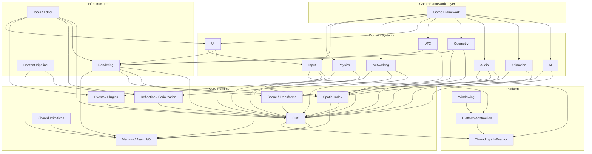
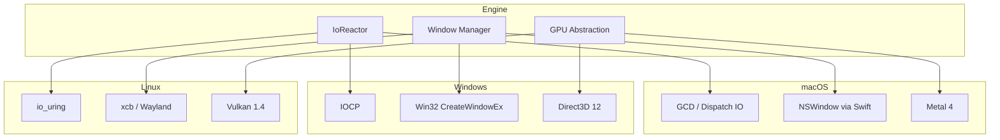
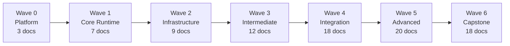

# Harmonius Engine Architecture

## Engine Overview

Harmonius is a cross-platform game engine written in Rust (stable) with cxx.rs FFI to C++ and Swift.
It targets Metal 4, Direct3D 12, and Vulkan 1.4 with mesh shaders and ray tracing as minimum
requirements. All simulation runs through a 100% ECS architecture with no separate data stores.

See [design/constraints.md](design/constraints.md) for the full constraint set.

## High-Level Architecture

The engine comprises 15 major subsystems organized in dependency layers. All domains consume the ECS
and shared spatial index from Core Runtime.

## Layered Architecture

Dependencies flow strictly downward. Higher layers depend on lower layers but never the reverse.

| Layer | Subsystems |
|-------|-----------|
| 5 — Application | Game Framework, Tools / Editor |
| 4 — Domain | AI, Animation, Audio, Networking, VFX |
| 3 — Mid-Level | Physics, Rendering, Geometry, UI, Input |
| 2 — Pipeline | Content Pipeline |
| 1 — Core Runtime | ECS, Scene, Reflection, Events, Memory, Spatial Index, Shared Primitives |
| 0 — Platform | Windowing, Threading / IoReactor, Platform Abstraction |

## Frame Data Flow

A single frame follows this pipeline from input poll through GPU present:

Key phases:

1. **Poll IoReactor** — drain platform I/O completions at the controlled poll point
2. **Process Input** — map device events to actions
3. **Fixed Update** — deterministic timestep loop with accumulator
4. **Physics Substeps** — broadphase, narrowphase, island solve, CCD per substep
5. **AI / Navigation** — behavior trees, steering, pathfinding under frame budget
6. **Game Systems** — abilities, quests, NPC simulation
7. **Animation** — skeletal, procedural IK, cloth/hair
8. **Transform Propagation** — dirty-flag hierarchy traversal
9. **Spatial Index Rebuild** — incremental BVH update
10. **Render Extract** — copy visible ECS data to render world (double-buffered)
11. **Render Prepare** — sort draw calls, build GPU command buffers
12. **GPU Submit** — submit command buffers to graphics API
13. **Present** — swap chain present

## Platform Abstraction

Each platform provides native backends for I/O, windowing, and graphics behind a unified
abstraction.

| Platform | Async I/O | Windowing | Graphics | FFI |
|----------|-----------|-----------|----------|-----|
| macOS | GCD / Dispatch IO | NSWindow (Swift via cxx.rs) | Metal 4 | cxx.rs → Swift |
| Windows | IOCP | Win32 (windows-sys) | Direct3D 12 | windows-sys |
| Linux | io_uring (kernel 5.1+) | xcb / Wayland (bindgen) | Vulkan 1.4 | bindgen |
| iOS | GCD / Dispatch IO | UIWindow (Swift via cxx.rs) | Metal 4 | cxx.rs → Swift |
| Android | io_uring | NativeActivity (bindgen) | Vulkan 1.4 | bindgen |
| Consoles | Platform SDK | Platform SDK | Platform SDK | Platform SDK |

## Design Wave Structure

The engine was designed in 7 waves following a dependency DAG. Each wave depends on all prior waves
being complete.

| Wave | Name | Docs | Key Deliverables |
|------|------|------|-----------------|
| 0 | Platform | 3 | Windowing, threading, IoReactor |
| 1 | Core Runtime | 7 | ECS, scene, reflection, events, memory, spatial index, shared primitives |
| 2 | Infrastructure | 9 | GPU abstraction, asset import, physics foundation, input, audio, animation, networking, constraints |
| 3 | Intermediate | 12 | Render graph, streaming, processing, gestures, DSP, state machine, navigation, replication, meshlets, UI widgets, particles, procedural animation |
| 4 | Integration | 18 | Core rendering, lighting, hot reload, AI behavior/perception/steering, game primitives, terrain, UI, networking advanced |
| 5 | Advanced | 20 | Ray tracing, post-processing, editor framework, logic graph, quest/dialogue, abilities, weapons, cloth/hair, VFX editor |
| 6 | Capstone | 18 | Procedural generation, NPC simulation, progression, building, monetization, deployment, collaboration, server infrastructure |
| **Total** | | **87** | **All complete** |

See [design/plan.md](design/plan.md) for the full wave schedule and dependency details.

## Supported Platforms

| OS | Graphics API | Async I/O | Status |
|----|-------------|-----------|--------|
| macOS | Metal 4 | GCD / Dispatch IO | Design complete |
| Windows | Direct3D 12 | IOCP | Design complete |
| Linux | Vulkan 1.4 | io_uring | Design complete |
| iOS | Metal 4 | GCD / Dispatch IO | Design complete |
| Android | Vulkan 1.4 | io_uring | Design complete |
| Nintendo Switch | Platform SDK | Platform SDK | Planned |
| Xbox | Direct3D 12 | Platform SDK | Planned |
