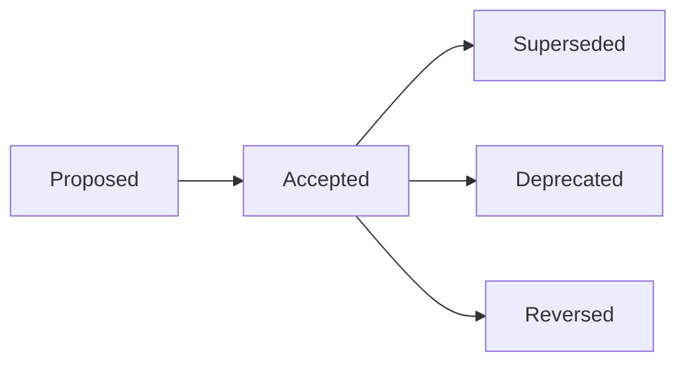

# Decision Records Index

This is the entry point for all Architecture Decision Records (ADRs) and Product Decision Records
(PDRs). Every record listed here lives at a stable URL; supersession chains are linked rather than
collapsed.

See [AGENTS.md](AGENTS.md) for record format, lifecycle, and authoring rules.

## Architecture Decision Records

| ID                                                  | Title                                       | Status   | Date       |
|-----------------------------------------------------|---------------------------------------------|----------|------------|
| [ADR-0001](adr/ADR-0001-rust-primary-language.md)   | Rust as primary language                    | Accepted | 2024-08-12 |
| [ADR-0002](adr/ADR-0002-vulkan-sole-gpu-api.md)     | Vulkan 1.4 as sole GPU API                  | Accepted | 2024-09-04 |
| [ADR-0003](adr/ADR-0003-ecs-primary-architecture.md) | ECS-primary architecture                   | Accepted | 2024-09-18 |
| [ADR-0004](adr/ADR-0004-no-async-in-engine.md)      | No async/await in engine, editor, server   | Accepted | 2024-10-02 |
| [ADR-0005](adr/ADR-0005-codegen-middleman-dylib.md) | Codegen middleman .dylib + bundled rustc   | Accepted | 2024-10-23 |
| [ADR-0006](adr/ADR-0006-rkyv-sole-binary-serde.md)  | rkyv as sole binary serialization           | Accepted | 2024-11-06 |
| [ADR-0007](adr/ADR-0007-glsl-shader-il-via-glslc.md)| GLSL as sole shader IL via glslc            | Accepted | 2024-11-20 |
| [ADR-0008](adr/ADR-0008-custom-windowing.md)        | Custom windowing (no winit)                 | Accepted | 2024-12-04 |
| [ADR-0009](adr/ADR-0009-oss-kubernetes-stack.md)    | K8s + TiKV + Garage + Pingora OSS stack     | Accepted | 2025-02-11 |
| [ADR-0010](adr/ADR-0010-quic-unified-transport.md)  | QUIC unified transport                      | Accepted | 2025-03-12 |
| [ADR-0011](adr/ADR-0011-composition-gameplay.md)    | Composition over subsystems for gameplay    | Accepted | 2025-04-08 |
| [ADR-0012](adr/ADR-0012-shared-conventions-sc-rules.md) | Integration shared conventions SC-1..SC-14 | Accepted | 2026-04-12 |
| [ADR-0013](adr/ADR-0013-canonical-owners-shared-types.md) | Canonical owners for shared types     | Accepted | 2026-05-20 |
| [ADR-0014](adr/ADR-0014-no-coroutine-runtime.md)    | No coroutine runtime (reverses extraction)  | Accepted | 2026-04-12 |

## Product Decision Records

| ID                                                  | Title                                       | Status   | Date       |
|-----------------------------------------------------|---------------------------------------------|----------|------------|
| [PDR-0001](pdr/PDR-0001-apache2-no-royalties.md)    | Apache 2.0 core, no royalties, no commission | Accepted | 2025-01-15 |
| [PDR-0002](pdr/PDR-0002-customer-ai-api-keys.md)    | Customer-owned AI API keys                  | Accepted | 2025-02-04 |
| [PDR-0003](pdr/PDR-0003-console-sdk-strategy.md)    | Console SDK server-side build farm strategy | Accepted | 2025-03-01 |
| [PDR-0004](pdr/PDR-0004-managed-hosting-tier.md)    | Managed-hosting tier policy and pricing     | Accepted | 2025-03-25 |
| [PDR-0005](pdr/PDR-0005-marketplace-distribution.md)| Marketplace distribution model              | Accepted | 2025-04-22 |

## Records by status

## Conventions

- Numbering is monotonic across the entire ADR or PDR sequence; reservations are not
  permitted.
- Backfilled records (decisions made informally, recorded later) carry the original
  decision date in the Status section.
- Every ADR cites at least one design doc, requirement, or constraint that depends on
  it. PDRs cite at least one business doc.
