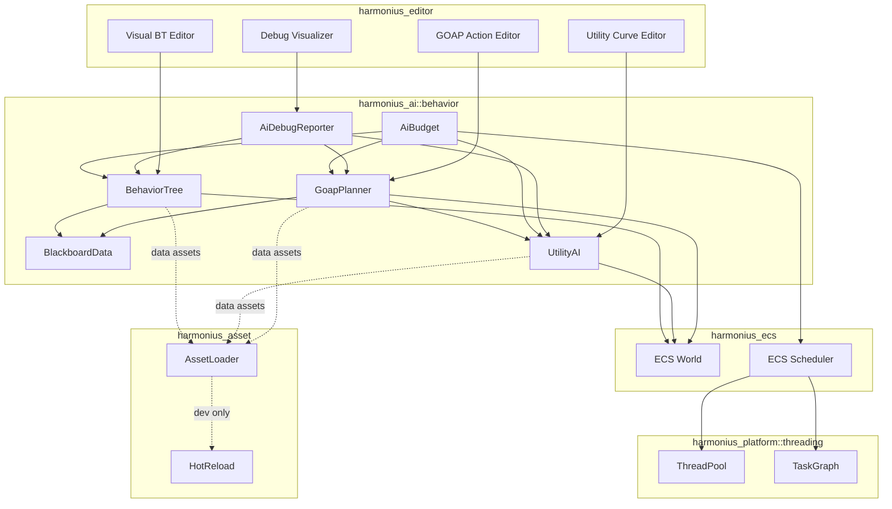
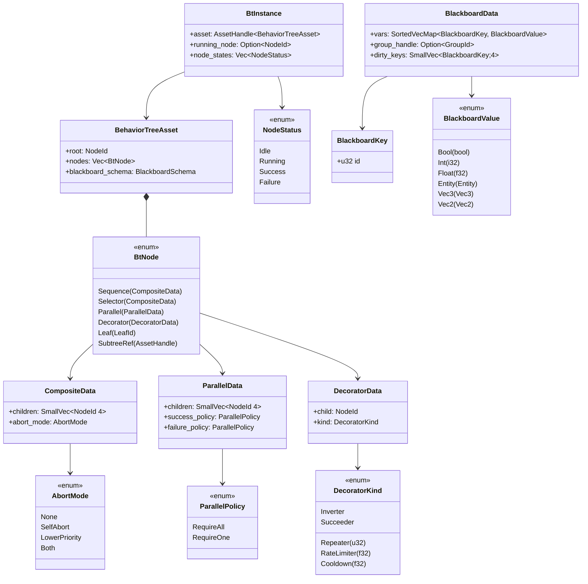
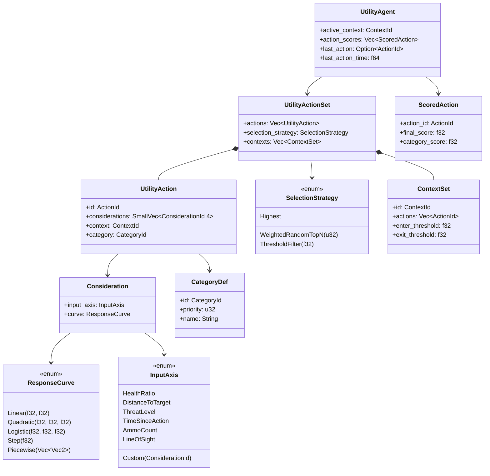
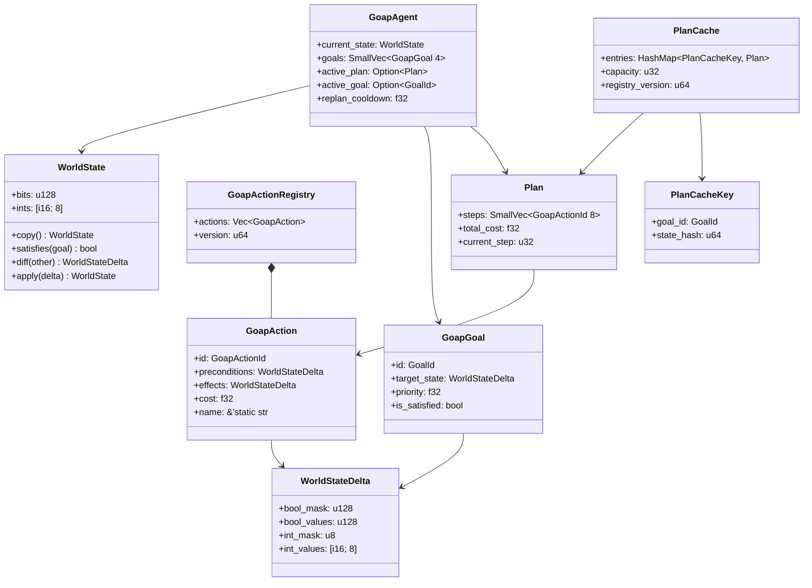
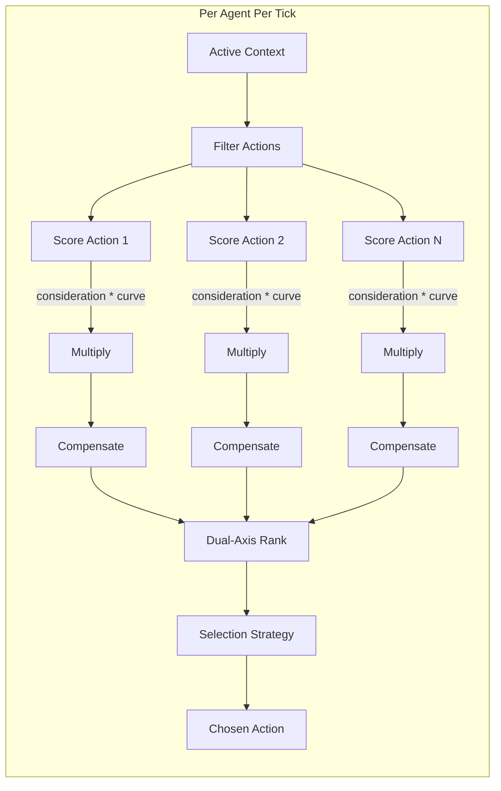
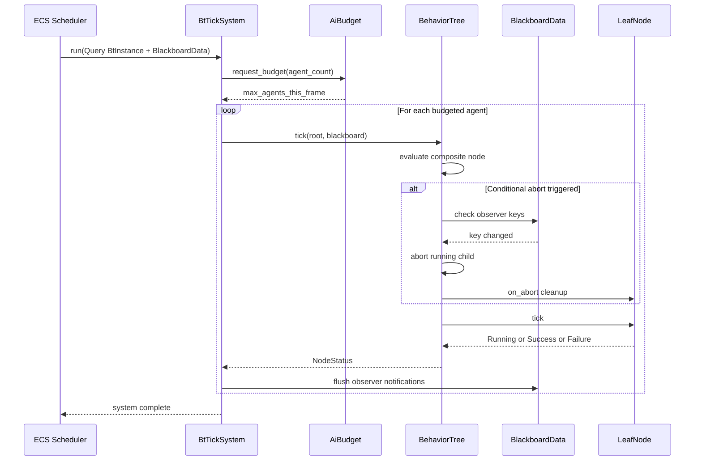
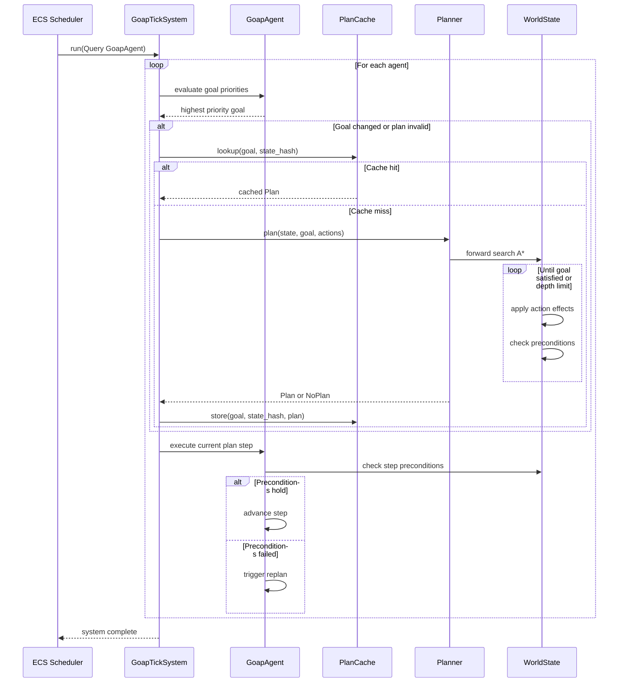
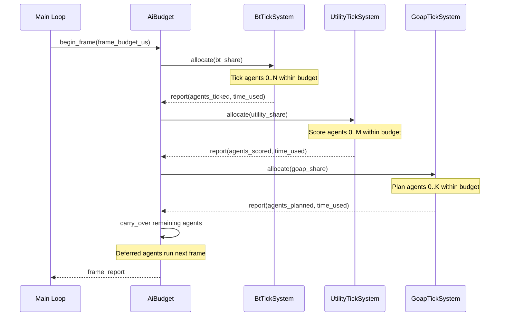

# AI Behavior Systems Design

## Requirements Trace

> **Canonical sources:** Features, requirements, and user stories are defined in
> [features/ai/](../../features/), [requirements/ai/](../../requirements/), and
> [user-stories/ai/](../../user-stories/). The table below traces design elements to those
> definitions.

### Behavior Trees (7.3)

| Feature | Requirement |
|---------|-------------|
| F-7.3.1 | R-7.3.1     |
| F-7.3.2 | R-7.3.2     |
| F-7.3.3 | R-7.3.3     |
| F-7.3.4 | R-7.3.4     |
| F-7.3.5 | R-7.3.5     |
| F-7.3.6 | R-7.3.6     |
| F-7.3.7 | R-7.3.7     |

1. **F-7.3.1** — Sequence, Selector, Parallel, Leaf composite and leaf nodes
2. **F-7.3.2** — Inverter, Repeater, Succeeder, Rate Limiter, Cooldown decorators
3. **F-7.3.3** — Self-abort, lower-priority abort, and combined abort modes
4. **F-7.3.4** — Typed key-value blackboard with self/group/global scopes
5. **F-7.3.5** — Declarative BT assets (RON/JSON) with hot-reload
6. **F-7.3.6** — Subtree references with inline expansion or nested scope
7. **F-7.3.7** — Trace log and editor overlay for debugging

### Utility AI (7.4)

| Feature | Requirement |
|---------|-------------|
| F-7.4.1 | R-7.4.1     |
| F-7.4.2 | R-7.4.2     |
| F-7.4.3 | R-7.4.3     |
| F-7.4.4 | R-7.4.4     |
| F-7.4.5 | R-7.4.5     |

1. **F-7.4.1** — Response curves (linear, quadratic, logistic, step, piecewise)
2. **F-7.4.2** — Score multiplication, compensation, selection strategies
3. **F-7.4.3** — Built-in and custom considerations via trait interface
4. **F-7.4.4** — Dual-axis category + action scoring
5. **F-7.4.5** — Context sets with hysteresis transitions

### Goal-Oriented Action Planning (7.5)

| Feature | Requirement |
|---------|-------------|
| F-7.5.1 | R-7.5.1     |
| F-7.5.2 | R-7.5.2     |
| F-7.5.3 | R-7.5.3     |
| F-7.5.4 | R-7.5.4     |
| F-7.5.5 | R-7.5.5     |
| F-7.5.6 | R-7.5.6     |

1. **F-7.5.1** — Fixed-size bitset world state representation
2. **F-7.5.2** — A* forward-search planner over action space
3. **F-7.5.3** — Action preconditions, effects, and costs
4. **F-7.5.4** — Plan caching keyed by (goal, state-hash)
5. **F-7.5.5** — Replanning triggers with cooldown throttling
6. **F-7.5.6** — Scored goal list with dynamic priority

## Overview

The AI Behavior Systems module provides three complementary decision-making frameworks, all built on
the ECS. Every piece of AI state is a component; every AI algorithm is a system.

- **Behavior Trees** -- deterministic, designer-controlled decision logic for structured NPC
  behavior.
- **Utility AI** -- score-based action selection for NPCs that must weigh multiple factors
  simultaneously.
- **GOAP** -- goal-oriented planning for NPCs that chain multi-step action sequences toward
  objectives.

All three systems share a unified **`BlackboardData` ECS component** for per-agent data, a common
**AiBudget** for time-slicing across frames, and a common **AiDebugReporter** for trace logging and
editor visualization. Designers author all AI via visual editors. Users never write code.

> **Client of `core-runtime/graph-runtime.md`.** Behavior trees are a client of the shared graph
> runtime, parameterizing `GraphRuntime<BtNode, BtEdge, BtInstance>`. DAG validation, cycle
> detection, topological sort, and hot-reload integration are provided by the core graph runtime;
> this document defines only the node palette, evaluation semantics, blackboard, and GOAP/utility
> adjuncts. See design review section 2.1.
>
> **Client of `core-runtime/primitives.md`.** `BlackboardData` stores its key-value pairs in a
> `SortedVecMap<BlackboardKey, BlackboardValue>` for deterministic iteration and no hash collisions
> on hot paths. See design review sections 2.2 and P1 task #26.

Time-sliced execution uses the shared `FrameBudget` primitive (see
[algorithms.md](../core-runtime/algorithms.md)). The `BlackboardData` component is the single
per-agent state store; perception, NPC simulation, steering, and quest systems read and write the
same component rather than maintaining parallel stores.

Key design principles:

1. **ECS-primary (~90%)** -- all AI state as components, all logic as systems. No parallel data
   stores.
2. **Static dispatch** -- enum-based node types, no vtables.
3. **Data-driven** -- BT trees, utility curves, and GOAP actions are all data assets.
4. **Budgeted** -- time-slicing ensures AI never exceeds its per-frame CPU allocation.
5. **Parallel** -- independent agents are evaluated concurrently via the thread pool.

## Architecture

### Module Boundaries



### File Layout

```text
harmonius_ai/
├── behavior/
│   ├── bt/
│   │   ├── node.rs         # BtNode enum, CompositeData,
│   │   │                   # DecoratorData, ParallelData
│   │   ├── tree.rs         # BehaviorTreeAsset, BtInstance
│   │   ├── tick.rs         # BtTickSystem, node evaluation
│   │   ├── abort.rs        # Conditional abort logic
│   │   └── subtree.rs      # SubtreeRef expansion
│   ├── blackboard/
│   │   ├── component.rs    # BlackboardData ECS component
│   │   ├── value.rs        # BlackboardValue enum
│   │   ├── key.rs          # BlackboardKey (u32 id)
│   │   ├── observer.rs     # Observer registration
│   │   │                   # and notification
│   │   └── group.rs        # GroupBlackboardStore resource
│   ├── utility/
│   │   ├── curve.rs        # ResponseCurve enum, evaluate()
│   │   ├── consideration.rs  # InputAxis, Consideration
│   │   ├── action.rs       # UtilityAction, scoring
│   │   ├── selection.rs    # SelectionStrategy, select()
│   │   ├── context.rs      # ContextSet, hysteresis
│   │   ├── dual_axis.rs    # CategoryDef, dual scoring
│   │   └── tick.rs         # UtilityTickSystem
│   ├── goap/
│   │   ├── world_state.rs  # WorldState, WorldStateDelta
│   │   ├── action.rs       # GoapAction, preconditions,
│   │   │                   # effects
│   │   ├── goal.rs         # GoapGoal, GoalPriority
│   │   ├── planner.rs      # A* forward-search planner
│   │   ├── cache.rs        # PlanCache, PlanCacheKey
│   │   ├── plan.rs         # Plan, plan execution
│   │   └── tick.rs         # GoapTickSystem
│   ├── budget.rs           # AiBudget, time-slicing
│   ├── debug.rs            # AiDebugReporter, trace log
│   └── components.rs       # ECS component bundle defs
```

### Behavior Tree Node Hierarchy



### Utility AI Data Model



### GOAP Data Model



### Utility AI Scoring Pipeline



## API Design

### Behavior Tree Nodes

```rust
/// Unique index into BehaviorTreeAsset::nodes.
#[derive(
    Clone, Copy, Debug, PartialEq, Eq, Hash,
)]
pub struct NodeId(pub u16);

/// Registered leaf node type identifier.
#[derive(
    Clone, Copy, Debug, PartialEq, Eq, Hash,
)]
pub struct LeafId(pub u32);

/// Result of ticking a single BT node.
#[derive(
    Clone, Copy, Debug, PartialEq, Eq,
)]
pub enum NodeStatus {
    Idle,
    Running,
    Success,
    Failure,
}

/// Abort mode for composite nodes.
#[derive(
    Clone, Copy, Debug, PartialEq, Eq,
)]
pub enum AbortMode {
    /// No re-evaluation while a child runs.
    None,
    /// Re-evaluate own conditions; abort self
    /// if conditions fail.
    SelfAbort,
    /// Interrupt lower-priority siblings when
    /// own conditions become true.
    LowerPriority,
    /// Both self-abort and lower-priority abort.
    Both,
}

/// Policy for Parallel node completion.
#[derive(
    Clone, Copy, Debug, PartialEq, Eq,
)]
pub enum ParallelPolicy {
    /// Succeed/fail when all children match.
    RequireAll,
    /// Succeed/fail when any one child matches.
    RequireOne,
}

/// Decorator behavior variants.
#[derive(Clone, Copy, Debug, PartialEq)]
pub enum DecoratorKind {
    /// Negates child result.
    Inverter,
    /// Repeats child N times or until failure.
    /// 0 = infinite.
    Repeater { count: u32 },
    /// Always returns Success.
    Succeeder,
    /// Throttles child tick to given Hz.
    RateLimiter { hz: f32 },
    /// Blocks re-entry for duration seconds.
    Cooldown { duration_secs: f32 },
}

/// Data shared by Sequence and Selector nodes.
pub struct CompositeData {
    pub children: SmallVec<[NodeId; 4]>,
    pub abort_mode: AbortMode,
}

/// Data for Parallel nodes.
pub struct ParallelData {
    pub children: SmallVec<[NodeId; 4]>,
    pub success_policy: ParallelPolicy,
    pub failure_policy: ParallelPolicy,
}

/// Data for Decorator nodes.
pub struct DecoratorData {
    pub child: NodeId,
    pub kind: DecoratorKind,
}

/// A single node in a behavior tree. Enum-based
/// static dispatch -- no vtables.
pub enum BtNode {
    Sequence(CompositeData),
    Selector(CompositeData),
    Parallel(ParallelData),
    Decorator(DecoratorData),
    Leaf(LeafId),
    SubtreeRef(AssetHandle<BehaviorTreeAsset>),
}
```

### Behavior Tree Asset and Instance

```rust
/// Schema describing the blackboard keys a tree
/// expects. Validated at load time.
pub struct BlackboardSchema {
    pub keys: Vec<BlackboardKeyDef>,
}

pub struct BlackboardKeyDef {
    pub name: String,
    pub value_type: BlackboardValueType,
    pub scope: BlackboardKeyScope,
}

#[derive(
    Clone, Copy, Debug, PartialEq, Eq,
)]
pub enum BlackboardValueType {
    Bool,
    Int,
    Float,
    Entity,
    Vec3,
}

#[derive(
    Clone, Copy, Debug, PartialEq, Eq,
)]
pub enum BlackboardKeyScope {
    /// Visible only to this agent.
    SelfScope,
    /// Shared among group members.
    Group,
    /// Visible to all agents.
    Global,
}

/// Immutable tree structure loaded from a data
/// asset. Shared across all agents using the
/// same tree.
pub struct BehaviorTreeAsset {
    pub root: NodeId,
    pub nodes: Vec<BtNode>,
    pub blackboard_schema: BlackboardSchema,
}

/// Per-agent mutable tree execution state.
/// Stored as an ECS component.
pub struct BtInstance {
    /// Handle to the shared tree asset.
    pub asset: AssetHandle<BehaviorTreeAsset>,
    /// Currently running node (if any).
    pub running_node: Option<NodeId>,
    /// Per-node execution state. Indexed by
    /// NodeId.
    pub node_states: Vec<NodeStatus>,
    /// Decorator runtime state (cooldown timers,
    /// repeat counters). Sparse -- only nodes
    /// that need it.
    pub decorator_state: HashMap<
        NodeId,
        DecoratorState,
    >,
}

/// Runtime state for decorator nodes.
pub enum DecoratorState {
    Repeater { remaining: u32 },
    RateLimiter { last_tick_time: f64 },
    Cooldown { ready_at: f64 },
}
```

### Blackboard (ECS Component)

`BlackboardData` is a unified ECS component backed by a sorted vector of key-value pairs. There is
no separate `Blackboard` wrapper type and no `BlackboardScope` nesting; per-agent state is just an
ECS component, group state is an ECS resource keyed by `GroupId`, and global state is a distinct ECS
resource. This removes the HashMap backing store (no hashing on the AI hot path), removes the
observer wrapper, and unifies "per-agent state" across BT, Utility, GOAP, steering, and perception.

```rust
use harmonius_core::primitives::{SortedVecMap, SmallVec};

/// Compact integer identifier for a blackboard key. Codegen allocates
/// dense IDs at editor build time (`BB_TARGET = 0`, `BB_HEALTH = 1`, ...).
#[derive(Clone, Copy, Debug, PartialEq, Eq, PartialOrd, Ord, Hash)]
pub struct BlackboardKey(pub u32);

/// Group identifier for shared blackboard scope.
#[derive(Clone, Copy, Debug, PartialEq, Eq, Hash)]
pub struct GroupId(pub u32);

/// Observer handle returned on registration.
#[derive(Clone, Copy, Debug, PartialEq, Eq, Hash)]
pub struct ObserverId(pub u32);

/// Dynamically typed blackboard value. Small enum so that each entry fits
/// in two cache lines alongside the key.
#[derive(Clone, Debug, PartialEq)]
pub enum BlackboardValue {
    Bool(bool),
    Int(i32),
    Float(f32),
    Entity(Entity),
    Vec3(Vec3),
    Vec2(Vec2),
}

/// Per-agent blackboard stored directly on the entity as an ECS component.
/// No inner `scope` wrapper. Lookups use `SortedVecMap::get` which is
/// O(log n) binary search, deterministic, and contains zero hashing.
#[derive(Component)]
pub struct BlackboardData {
    /// Sorted key-value store. Capacity grows via `Vec` realloc; most
    /// agents stay under 32 keys.
    pub vars: SortedVecMap<BlackboardKey, BlackboardValue>,
    /// Optional membership in a shared group scope.
    pub group_handle: Option<GroupId>,
    /// Keys dirtied this tick. Flushed into observer notifications
    /// by the `blackboard_flush_system` at the end of the AI phase.
    pub dirty_keys: SmallVec<BlackboardKey, 4>,
}

impl BlackboardData {
    pub fn new() -> Self {
        Self {
            vars: SortedVecMap::new(),
            group_handle: None,
            dirty_keys: SmallVec::new(),
        }
    }

    /// Get a value from this agent's scope. Callers that need group
    /// fallback pass the `GroupBlackboardStore` resource and check it
    /// themselves — `BlackboardData` does not own group lookups.
    pub fn get(&self, key: BlackboardKey) -> Option<&BlackboardValue> {
        self.vars.get(&key)
    }

    /// Set a value on this agent. Marks the key dirty for observer
    /// notification at the end of the tick. `SortedVecMap::insert`
    /// maintains sort order.
    pub fn set(
        &mut self,
        key: BlackboardKey,
        value: BlackboardValue,
    ) {
        self.vars.insert(key, value);
        if !self.dirty_keys.iter().any(|k| *k == key) {
            self.dirty_keys.push(key);
        }
    }

    /// Drain the dirty key set. Returned keys are ready for observer
    /// notification. Called by `blackboard_flush_system` after BT tick.
    pub fn flush_dirty(&mut self) -> SmallVec<BlackboardKey, 4> {
        core::mem::take(&mut self.dirty_keys)
    }
}

/// Resolve a blackboard value walking self → group → global fallback.
/// Systems call this helper rather than threading three lookups by hand.
pub fn bb_resolve<'a>(
    agent: &'a BlackboardData,
    groups: &'a GroupBlackboardStore,
    globals: &'a GlobalBlackboard,
    key: BlackboardKey,
) -> Option<&'a BlackboardValue> {
    if let Some(v) = agent.get(key) {
        return Some(v);
    }
    if let Some(g) = agent.group_handle {
        if let Some(v) = groups.get(g, key) {
            return Some(v);
        }
    }
    globals.get(key)
}

/// Group-level blackboard storage. Stored as an ECS resource.
/// Still a sorted map — no HashMap on the hot path.
pub struct GroupBlackboardStore {
    groups: SortedVecMap<GroupId, BlackboardData>,
}

impl GroupBlackboardStore {
    pub fn new() -> Self {
        Self { groups: SortedVecMap::new() }
    }

    pub fn get(
        &self,
        id: GroupId,
        key: BlackboardKey,
    ) -> Option<&BlackboardValue> {
        self.groups.get(&id).and_then(|bb| bb.get(key))
    }

    pub fn get_group(
        &self,
        id: GroupId,
    ) -> Option<&BlackboardData> {
        self.groups.get(&id)
    }

    pub fn get_group_mut(
        &mut self,
        id: GroupId,
    ) -> Option<&mut BlackboardData> {
        self.groups.get_mut(&id)
    }

    pub fn create_group(
        &mut self,
        id: GroupId,
    ) -> &mut BlackboardData {
        self.groups.insert(id, BlackboardData::new());
        self.groups.get_mut(&id).unwrap()
    }
}

/// Global blackboard store. Stored as an ECS resource. Holds
/// world-wide shared data (weather, alarm state, etc.).
pub struct GlobalBlackboard {
    inner: BlackboardData,
}

impl GlobalBlackboard {
    pub fn new() -> Self { Self { inner: BlackboardData::new() } }
    pub fn get(&self, key: BlackboardKey) -> Option<&BlackboardValue> {
        self.inner.get(key)
    }
    pub fn set(&mut self, key: BlackboardKey, value: BlackboardValue) {
        self.inner.set(key, value);
    }
}
```

### Behavior Tree Tick System

```rust
/// Leaf node behavior. Implementations are
/// registered by name in a LeafNodeRegistry.
/// Each leaf is a pure function from
/// (blackboard, world) -> NodeStatus.
pub struct LeafNodeFn(
    pub fn(
        &mut BlackboardData,
        &World,
        Entity,
    ) -> NodeStatus,
);

/// Registry of named leaf node types.
pub struct LeafNodeRegistry {
    nodes: HashMap<String, LeafNodeFn>,
    ids: HashMap<String, LeafId>,
    next_id: u32,
}

impl LeafNodeRegistry {
    pub fn new() -> Self;

    /// Register a leaf node function by name.
    pub fn register(
        &mut self,
        name: &str,
        func: LeafNodeFn,
    ) -> LeafId;

    pub fn get(
        &self,
        id: LeafId,
    ) -> Option<&LeafNodeFn>;
}

/// ECS system: ticks behavior trees for all
/// agents within the AI budget.
pub fn bt_tick_system(
    query: Query<(
        Entity,
        &mut BtInstance,
        &mut BlackboardData,
    )>,
    budget: Res<AiBudget>,
    leaf_registry: Res<LeafNodeRegistry>,
    tree_assets: Res<Assets<BehaviorTreeAsset>>,
    groups: Res<GroupBlackboardStore>,
    world: &World,
) {
    let max_agents = budget.request_bt_budget(
        query.iter().count(),
    );

    for (entity, instance, blackboard)
        in query.iter_mut().take(max_agents)
    {
        let asset = tree_assets
            .get(&instance.asset)
            .unwrap();
        tick_node(
            asset.root,
            asset,
            instance,
            blackboard,
            &leaf_registry,
            &groups,
            world,
            entity,
        );
        blackboard.flush_dirty();
    }
}

/// Recursive node evaluation. Iterative
/// implementation uses an explicit stack to
/// avoid deep recursion.
fn tick_node(
    node_id: NodeId,
    asset: &BehaviorTreeAsset,
    instance: &mut BtInstance,
    blackboard: &mut BlackboardData,
    leaf_registry: &LeafNodeRegistry,
    groups: &GroupBlackboardStore,
    world: &World,
    entity: Entity,
) -> NodeStatus {
    let node = &asset.nodes[node_id.0 as usize];
    match node {
        BtNode::Sequence(data) => {
            tick_sequence(
                data, node_id, asset, instance,
                blackboard, leaf_registry,
                groups, world, entity,
            )
        }
        BtNode::Selector(data) => {
            tick_selector(
                data, node_id, asset, instance,
                blackboard, leaf_registry,
                groups, world, entity,
            )
        }
        BtNode::Parallel(data) => {
            tick_parallel(
                data, node_id, asset, instance,
                blackboard, leaf_registry,
                groups, world, entity,
            )
        }
        BtNode::Decorator(data) => {
            tick_decorator(
                data, node_id, asset, instance,
                blackboard, leaf_registry,
                groups, world, entity,
            )
        }
        BtNode::Leaf(leaf_id) => {
            let func = leaf_registry
                .get(*leaf_id)
                .unwrap();
            (func.0)(blackboard, world, entity)
        }
        BtNode::SubtreeRef(handle) => {
            // Resolved at load time to inline
            // nodes, or ticked as nested scope.
            NodeStatus::Failure
        }
    }
}
```

### Composite Node Evaluation

```rust
/// Sequence: runs children in order, fails on
/// first failure (fail-fast).
fn tick_sequence(
    data: &CompositeData,
    node_id: NodeId,
    asset: &BehaviorTreeAsset,
    instance: &mut BtInstance,
    blackboard: &mut BlackboardData,
    leaf_registry: &LeafNodeRegistry,
    groups: &GroupBlackboardStore,
    world: &World,
    entity: Entity,
) -> NodeStatus {
    // Check conditional aborts first.
    if data.abort_mode != AbortMode::None {
        check_abort(
            data, node_id, asset, instance,
            blackboard, leaf_registry,
            groups, world, entity,
        );
    }

    for &child in &data.children {
        let status = tick_node(
            child, asset, instance, blackboard,
            leaf_registry, groups, world, entity,
        );
        match status {
            NodeStatus::Failure => {
                return NodeStatus::Failure;
            }
            NodeStatus::Running => {
                instance.running_node =
                    Some(child);
                return NodeStatus::Running;
            }
            NodeStatus::Success => continue,
            NodeStatus::Idle => continue,
        }
    }
    NodeStatus::Success
}

/// Selector: runs children in order, succeeds
/// on first success (succeed-fast).
fn tick_selector(
    data: &CompositeData,
    node_id: NodeId,
    asset: &BehaviorTreeAsset,
    instance: &mut BtInstance,
    blackboard: &mut BlackboardData,
    leaf_registry: &LeafNodeRegistry,
    groups: &GroupBlackboardStore,
    world: &World,
    entity: Entity,
) -> NodeStatus {
    if data.abort_mode != AbortMode::None {
        check_abort(
            data, node_id, asset, instance,
            blackboard, leaf_registry,
            groups, world, entity,
        );
    }

    for &child in &data.children {
        let status = tick_node(
            child, asset, instance, blackboard,
            leaf_registry, groups, world, entity,
        );
        match status {
            NodeStatus::Success => {
                return NodeStatus::Success;
            }
            NodeStatus::Running => {
                instance.running_node =
                    Some(child);
                return NodeStatus::Running;
            }
            NodeStatus::Failure => continue,
            NodeStatus::Idle => continue,
        }
    }
    NodeStatus::Failure
}

/// Parallel: runs all children, applies
/// success/failure policies.
fn tick_parallel(
    data: &ParallelData,
    node_id: NodeId,
    asset: &BehaviorTreeAsset,
    instance: &mut BtInstance,
    blackboard: &mut BlackboardData,
    leaf_registry: &LeafNodeRegistry,
    groups: &GroupBlackboardStore,
    world: &World,
    entity: Entity,
) -> NodeStatus {
    let mut success_count: u32 = 0;
    let mut failure_count: u32 = 0;
    let mut running_count: u32 = 0;
    let total = data.children.len() as u32;

    for &child in &data.children {
        let status = tick_node(
            child, asset, instance, blackboard,
            leaf_registry, groups, world, entity,
        );
        match status {
            NodeStatus::Success => {
                success_count += 1;
            }
            NodeStatus::Failure => {
                failure_count += 1;
            }
            NodeStatus::Running => {
                running_count += 1;
            }
            NodeStatus::Idle => {}
        }
    }

    // Check failure policy first.
    let failed = match data.failure_policy {
        ParallelPolicy::RequireOne => {
            failure_count >= 1
        }
        ParallelPolicy::RequireAll => {
            failure_count == total
        }
    };
    if failed {
        return NodeStatus::Failure;
    }

    // Check success policy.
    let succeeded = match data.success_policy {
        ParallelPolicy::RequireOne => {
            success_count >= 1
        }
        ParallelPolicy::RequireAll => {
            success_count == total
        }
    };
    if succeeded {
        return NodeStatus::Success;
    }

    if running_count > 0 {
        NodeStatus::Running
    } else {
        NodeStatus::Failure
    }
}
```

### Conditional Abort

```rust
/// Re-evaluate conditions on a composite node
/// and abort running children if conditions
/// change.
fn check_abort(
    data: &CompositeData,
    node_id: NodeId,
    asset: &BehaviorTreeAsset,
    instance: &mut BtInstance,
    blackboard: &mut BlackboardData,
    leaf_registry: &LeafNodeRegistry,
    groups: &GroupBlackboardStore,
    world: &World,
    entity: Entity,
) {
    let mode = data.abort_mode;
    let running = instance.running_node;

    if mode == AbortMode::SelfAbort
        || mode == AbortMode::Both
    {
        // Re-evaluate first child (condition).
        // If it fails, abort the running child.
        if let Some(cond) = data.children.first() {
            let status = tick_node(
                *cond, asset, instance,
                blackboard, leaf_registry,
                groups, world, entity,
            );
            if status == NodeStatus::Failure {
                abort_running(
                    instance, blackboard,
                );
            }
        }
    }

    if mode == AbortMode::LowerPriority
        || mode == AbortMode::Both
    {
        // If this node's condition is now true
        // and a lower-priority sibling is
        // running, abort it.
        if let Some(cond) = data.children.first() {
            let status = tick_node(
                *cond, asset, instance,
                blackboard, leaf_registry,
                groups, world, entity,
            );
            if status == NodeStatus::Success {
                if let Some(r) = running {
                    if !data.children.contains(&r) {
                        abort_running(
                            instance, blackboard,
                        );
                    }
                }
            }
        }
    }
}

/// Abort the currently running node. Resets node
/// states and flushes blackboard dirty keys.
fn abort_running(
    instance: &mut BtInstance,
    blackboard: &mut BlackboardData,
) {
    if let Some(node_id) = instance.running_node {
        instance.node_states
            [node_id.0 as usize] = NodeStatus::Idle;
        instance.running_node = None;
    }
}
```

### Response Curves (Utility AI)

```rust
/// A response curve mapping a raw input to a
/// 0.0..=1.0 score.
#[derive(Clone, Debug, PartialEq)]
pub enum ResponseCurve {
    /// y = slope * x + intercept, clamped.
    Linear { slope: f32, intercept: f32 },
    /// y = a*x^2 + b*x + c, clamped.
    Quadratic { a: f32, b: f32, c: f32 },
    /// y = 1 / (1 + e^(-k*(x - midpoint))).
    Logistic { k: f32, midpoint: f32 },
    /// y = 0 if x < threshold, else 1.
    Step { threshold: f32 },
    /// Linearly interpolated piecewise curve.
    Piecewise { points: Vec<[f32; 2]> },
}

impl ResponseCurve {
    /// Evaluate the curve for a given input.
    /// Output is always clamped to [0.0, 1.0].
    pub fn evaluate(&self, x: f32) -> f32 {
        let raw = match self {
            Self::Linear {
                slope, intercept,
            } => slope * x + intercept,

            Self::Quadratic { a, b, c } => {
                a * x * x + b * x + c
            }

            Self::Logistic { k, midpoint } => {
                1.0 / (
                    1.0
                    + (-k * (x - midpoint)).exp()
                )
            }

            Self::Step { threshold } => {
                if x < *threshold {
                    0.0
                } else {
                    1.0
                }
            }

            Self::Piecewise { points } => {
                piecewise_lerp(points, x)
            }
        };
        raw.clamp(0.0, 1.0)
    }
}

/// Linear interpolation over sorted points.
fn piecewise_lerp(
    points: &[[f32; 2]],
    x: f32,
) -> f32 {
    if points.is_empty() {
        return 0.0;
    }
    if x <= points[0][0] {
        return points[0][1];
    }
    let last = points.len() - 1;
    if x >= points[last][0] {
        return points[last][1];
    }
    for window in points.windows(2) {
        let (x0, y0) = (window[0][0], window[0][1]);
        let (x1, y1) = (window[1][0], window[1][1]);
        if x >= x0 && x <= x1 {
            let t = (x - x0) / (x1 - x0);
            return y0 + t * (y1 - y0);
        }
    }
    0.0
}
```

### Utility AI Considerations and Scoring

```rust
/// Built-in input axes for considerations.
#[derive(Clone, Debug, PartialEq)]
pub enum InputAxis {
    HealthRatio,
    DistanceToTarget,
    ThreatLevel,
    TimeSinceAction,
    AmmoCount,
    LineOfSight,
    Custom(ConsiderationId),
}

**Justification:** `Custom(ConsiderationId)` uses a
trait-like contract for user-extensible scoring
functions authored in visual logic graphs. At runtime,
compiled graph bytecode evaluates the score -- no
`dyn` dispatch occurs. The trait exists as a
design-time contract for the logic graph compiler.

#[derive(
    Clone, Copy, Debug, PartialEq, Eq, Hash,
)]
pub struct ConsiderationId(pub u32);

#[derive(
    Clone, Copy, Debug, PartialEq, Eq, Hash,
)]
pub struct ActionId(pub u32);

#[derive(
    Clone, Copy, Debug, PartialEq, Eq, Hash,
)]
pub struct ContextId(pub u32);

#[derive(
    Clone, Copy, Debug, PartialEq, Eq, Hash,
)]
pub struct CategoryId(pub u32);

/// A single consideration: one input axis run
/// through one response curve.
pub struct Consideration {
    pub input_axis: InputAxis,
    pub curve: ResponseCurve,
}

/// An action that the utility system can select.
pub struct UtilityAction {
    pub id: ActionId,
    pub considerations:
        SmallVec<[ConsiderationId; 4]>,
    pub context: ContextId,
    pub category: CategoryId,
}

/// Result of scoring a single action.
#[derive(Clone, Debug)]
pub struct ScoredAction {
    pub action_id: ActionId,
    pub final_score: f32,
    pub category_score: f32,
}

/// Selection strategy for choosing the winning
/// action after scoring.
#[derive(Clone, Copy, Debug, PartialEq)]
pub enum SelectionStrategy {
    /// Always pick the highest-scoring action.
    Highest,
    /// Weighted random among the top N.
    WeightedRandomTopN { n: u32 },
    /// Only consider actions above threshold.
    ThresholdFilter { min_score: f32 },
}

/// Action category for dual-axis scoring.
pub struct CategoryDef {
    pub id: CategoryId,
    pub priority: u32,
    pub name: String,
}

/// Context set for filtering actions.
pub struct ContextSet {
    pub id: ContextId,
    pub actions: Vec<ActionId>,
    pub enter_threshold: f32,
    pub exit_threshold: f32,
}

/// Score a single action by multiplying its
/// consideration scores and applying
/// compensation.
pub fn score_action(
    action: &UtilityAction,
    considerations: &[Consideration],
    blackboard: &BlackboardData,
    groups: &GroupBlackboardStore,
    world: &World,
    entity: Entity,
) -> f32 {
    let count = action.considerations.len();
    if count == 0 {
        return 0.0;
    }

    let mut product = 1.0f32;
    for &cid in &action.considerations {
        let c = &considerations[cid.0 as usize];
        let input = read_input_axis(
            &c.input_axis,
            blackboard,
            groups,
            world,
            entity,
        );
        let score = c.curve.evaluate(input);
        product *= score;
    }

    // Compensation factor: raise the product to
    // 1/count to normalize for consideration
    // count. This prevents actions with more
    // considerations from being penalized.
    let compensation = 1.0 / count as f32;
    product.powf(compensation)
}

/// Read a raw input value from the world for a
/// given input axis.
fn read_input_axis(
    axis: &InputAxis,
    blackboard: &BlackboardData,
    groups: &GroupBlackboardStore,
    world: &World,
    entity: Entity,
) -> f32 {
    match axis {
        InputAxis::HealthRatio => {
            // Read health component, return
            // current / max.
            0.0 // placeholder
        }
        InputAxis::DistanceToTarget => {
            0.0 // placeholder
        }
        InputAxis::ThreatLevel => {
            0.0 // placeholder
        }
        InputAxis::TimeSinceAction => {
            0.0 // placeholder
        }
        InputAxis::AmmoCount => {
            0.0 // placeholder
        }
        InputAxis::LineOfSight => {
            0.0 // placeholder
        }
        InputAxis::Custom(_id) => {
            0.0 // placeholder
        }
    }
}
```

### Utility AI Tick System

```rust
/// Per-agent utility evaluation state.
/// Stored as ECS component.
pub struct UtilityAgent {
    pub active_context: ContextId,
    pub action_scores: Vec<ScoredAction>,
    pub last_action: Option<ActionId>,
    pub last_action_time: f64,
}

/// Shared action set asset. Loaded from data.
pub struct UtilityActionSet {
    pub actions: Vec<UtilityAction>,
    pub considerations: Vec<Consideration>,
    pub categories: Vec<CategoryDef>,
    pub contexts: Vec<ContextSet>,
    pub selection_strategy: SelectionStrategy,
}

/// ECS system: scores and selects actions for
/// all utility-driven agents within AI budget.
pub fn utility_tick_system(
    query: Query<(
        Entity,
        &mut UtilityAgent,
        &BlackboardData,
    )>,
    budget: Res<AiBudget>,
    action_sets: Res<Assets<UtilityActionSet>>,
    groups: Res<GroupBlackboardStore>,
    world: &World,
) {
    let max_agents = budget.request_utility_budget(
        query.iter().count(),
    );

    for (entity, agent, blackboard)
        in query.iter_mut().take(max_agents)
    {
        // 1. Filter actions by active context.
        // 2. Score each action.
        // 3. Apply dual-axis category ranking.
        // 4. Select winning action via strategy.
        // (implementation follows scoring
        //  pipeline flowchart above)
    }
}

/// Select the winning action from scored
/// candidates using the configured strategy.
pub fn select_action(
    scored: &mut [ScoredAction],
    strategy: SelectionStrategy,
) -> Option<ActionId> {
    if scored.is_empty() {
        return None;
    }

    match strategy {
        SelectionStrategy::Highest => {
            scored.sort_by(|a, b| {
                b.final_score
                    .partial_cmp(&a.final_score)
                    .unwrap_or(
                        std::cmp::Ordering::Equal,
                    )
            });
            Some(scored[0].action_id)
        }

        SelectionStrategy::WeightedRandomTopN {
            n,
        } => {
            scored.sort_by(|a, b| {
                b.final_score
                    .partial_cmp(&a.final_score)
                    .unwrap_or(
                        std::cmp::Ordering::Equal,
                    )
            });
            let top = &scored[..n.min(
                scored.len() as u32,
            ) as usize];
            let total: f32 = top
                .iter()
                .map(|s| s.final_score)
                .sum();
            if total <= 0.0 {
                return Some(top[0].action_id);
            }
            // Weighted random selection.
            let mut roll =
                fastrand::f32() * total;
            for s in top {
                roll -= s.final_score;
                if roll <= 0.0 {
                    return Some(s.action_id);
                }
            }
            Some(top[0].action_id)
        }

        SelectionStrategy::ThresholdFilter {
            min_score,
        } => {
            scored.retain(|s| {
                s.final_score >= min_score
            });
            if scored.is_empty() {
                return None;
            }
            scored.sort_by(|a, b| {
                b.final_score
                    .partial_cmp(&a.final_score)
                    .unwrap_or(
                        std::cmp::Ordering::Equal,
                    )
            });
            Some(scored[0].action_id)
        }
    }
}
```

### Context Hysteresis

```rust
/// Evaluate context transitions with hysteresis
/// to prevent rapid switching at boundary scores.
pub fn evaluate_context(
    agent: &mut UtilityAgent,
    contexts: &[ContextSet],
    blackboard: &BlackboardData,
    groups: &GroupBlackboardStore,
    world: &World,
    entity: Entity,
) -> ContextId {
    let current = agent.active_context;

    for ctx in contexts {
        if ctx.id == current {
            continue;
        }
        let score = evaluate_context_score(
            ctx, blackboard, groups, world,
            entity,
        );
        // Enter new context only if score
        // exceeds enter_threshold.
        if score >= ctx.enter_threshold {
            agent.active_context = ctx.id;
            return ctx.id;
        }
    }

    // Check if current context should exit.
    if let Some(ctx) = contexts
        .iter()
        .find(|c| c.id == current)
    {
        let score = evaluate_context_score(
            ctx, blackboard, groups, world,
            entity,
        );
        // Exit only if score drops below
        // exit_threshold (hysteresis gap).
        if score < ctx.exit_threshold {
            // Fall back to default context
            // (first in list).
            agent.active_context =
                contexts[0].id;
        }
    }

    agent.active_context
}

fn evaluate_context_score(
    ctx: &ContextSet,
    blackboard: &BlackboardData,
    groups: &GroupBlackboardStore,
    world: &World,
    entity: Entity,
) -> f32 {
    // Context score derived from blackboard
    // values or world state relevant to the
    // context (e.g., threat level for combat
    // context).
    0.0 // placeholder
}
```

### GOAP World State

```rust
/// Compact world state: 128 boolean properties
/// packed into a u128 bitset, plus 8 integer
/// properties as i16.
///
/// Trivially copyable. O(1) compare and diff.
#[derive(
    Clone, Copy, Debug, PartialEq, Eq, Hash,
)]
pub struct WorldState {
    pub bits: u128,
    pub ints: [i16; 8],
}

/// A delta that can be applied to a WorldState.
/// Used for both preconditions (mask = which
/// bits to check, values = expected values) and
/// effects (mask = which bits to set, values =
/// new values).
#[derive(
    Clone, Copy, Debug, PartialEq, Eq, Hash,
)]
pub struct WorldStateDelta {
    pub bool_mask: u128,
    pub bool_values: u128,
    pub int_mask: u8,
    pub int_values: [i16; 8],
}

impl WorldState {
    pub fn new() -> Self {
        Self {
            bits: 0,
            ints: [0; 8],
        }
    }

    /// Check whether this state satisfies a
    /// goal delta (all masked bits match).
    pub fn satisfies(
        &self,
        goal: &WorldStateDelta,
    ) -> bool {
        let bool_match = (self.bits
            & goal.bool_mask)
            == (goal.bool_values
                & goal.bool_mask);
        let int_match = (0..8).all(|i| {
            if goal.int_mask & (1 << i) != 0 {
                self.ints[i] == goal.int_values[i]
            } else {
                true
            }
        });
        bool_match && int_match
    }

    /// Apply effects to produce a new state.
    pub fn apply(
        &self,
        delta: &WorldStateDelta,
    ) -> Self {
        let mut result = *self;
        // Clear masked bits, then set values.
        result.bits = (result.bits
            & !delta.bool_mask)
            | (delta.bool_values
                & delta.bool_mask);
        for i in 0..8 {
            if delta.int_mask & (1 << i) != 0 {
                result.ints[i] =
                    delta.int_values[i];
            }
        }
        result
    }

    /// Count the number of unsatisfied
    /// properties vs. the goal. Used as A*
    /// heuristic.
    pub fn heuristic(
        &self,
        goal: &WorldStateDelta,
    ) -> u32 {
        let bool_diff = (self.bits
            ^ goal.bool_values)
            & goal.bool_mask;
        let bool_count =
            bool_diff.count_ones();
        let int_count = (0..8u32)
            .filter(|&i| {
                goal.int_mask & (1 << i) != 0
                    && self.ints[i as usize]
                        != goal.int_values
                            [i as usize]
            })
            .count() as u32;
        bool_count + int_count
    }
}
```

### GOAP Planner

```rust
#[derive(
    Clone, Copy, Debug, PartialEq, Eq, Hash,
)]
pub struct GoapActionId(pub u32);

#[derive(
    Clone, Copy, Debug, PartialEq, Eq, Hash,
)]
pub struct GoalId(pub u32);

/// A GOAP action with preconditions, effects,
/// and cost.
pub struct GoapAction {
    pub id: GoapActionId,
    pub name: &'static str,
    pub preconditions: WorldStateDelta,
    pub effects: WorldStateDelta,
    pub cost: f32,
}

/// A goal the agent wants to achieve.
pub struct GoapGoal {
    pub id: GoalId,
    pub target_state: WorldStateDelta,
    pub priority: f32,
    pub is_satisfied: bool,
}

/// A plan: ordered list of actions to execute.
#[derive(Clone, Debug)]
pub struct Plan {
    pub steps: SmallVec<[GoapActionId; 8]>,
    pub total_cost: f32,
    pub current_step: u32,
}

impl Plan {
    /// Advance to the next step. Returns true if
    /// the plan is complete.
    pub fn advance(&mut self) -> bool {
        self.current_step += 1;
        self.current_step
            >= self.steps.len() as u32
    }

    /// Get the current action to execute.
    pub fn current_action(
        &self,
    ) -> Option<GoapActionId> {
        self.steps.get(
            self.current_step as usize,
        ).copied()
    }
}

/// Registry of available actions per archetype.
/// Version counter invalidates plan cache on
/// changes.
pub struct GoapActionRegistry {
    pub actions: Vec<GoapAction>,
    pub version: u64,
}

impl GoapActionRegistry {
    pub fn new() -> Self {
        Self {
            actions: Vec::new(),
            version: 0,
        }
    }

    pub fn register(
        &mut self,
        action: GoapAction,
    ) {
        self.actions.push(action);
        self.version += 1;
    }
}

/// Planner configuration.
pub struct PlannerConfig {
    /// Maximum search depth (actions in plan).
    pub max_depth: u32,
    /// Maximum A* iterations before giving up.
    pub max_iterations: u32,
}

/// A* forward-search planner.
pub fn plan(
    start: &WorldState,
    goal: &WorldStateDelta,
    registry: &GoapActionRegistry,
    config: &PlannerConfig,
) -> Option<Plan> {
    // A* open set: (f_cost, g_cost, state,
    //               action_path)
    let mut open: BinaryHeap<PlannerNode> =
        BinaryHeap::new();
    let mut visited: HashSet<WorldState> =
        HashSet::new();
    let mut iterations: u32 = 0;

    let h = start.heuristic(goal);
    open.push(PlannerNode {
        f_cost: OrderedFloat(h as f32),
        g_cost: 0.0,
        state: *start,
        path: SmallVec::new(),
    });

    while let Some(current) = open.pop() {
        iterations += 1;
        if iterations > config.max_iterations {
            return None;
        }

        if current.state.satisfies(goal) {
            return Some(Plan {
                steps: current.path,
                total_cost: current.g_cost,
                current_step: 0,
            });
        }

        if !visited.insert(current.state) {
            continue;
        }

        if current.path.len() as u32
            >= config.max_depth
        {
            continue;
        }

        for action in &registry.actions {
            if !current
                .state
                .satisfies(&action.preconditions)
            {
                continue;
            }

            let next_state = current
                .state
                .apply(&action.effects);
            if visited.contains(&next_state) {
                continue;
            }

            let g = current.g_cost + action.cost;
            let h = next_state
                .heuristic(goal) as f32;
            let mut path = current.path.clone();
            path.push(action.id);

            open.push(PlannerNode {
                f_cost: OrderedFloat(g + h),
                g_cost: g,
                state: next_state,
                path,
            });
        }
    }

    None // No plan found.
}

/// Internal A* search node.
struct PlannerNode {
    f_cost: OrderedFloat<f32>,
    g_cost: f32,
    state: WorldState,
    path: SmallVec<[GoapActionId; 8]>,
}

impl Ord for PlannerNode {
    fn cmp(&self, other: &Self) -> Ordering {
        // Min-heap: lower f_cost = higher
        // priority.
        other.f_cost.cmp(&self.f_cost)
    }
}

impl PartialOrd for PlannerNode {
    fn partial_cmp(
        &self,
        other: &Self,
    ) -> Option<Ordering> {
        Some(self.cmp(other))
    }
}

impl PartialEq for PlannerNode {
    fn eq(&self, other: &Self) -> bool {
        self.f_cost == other.f_cost
    }
}

impl Eq for PlannerNode {}
```

### Plan Caching

```rust
/// Cache key: (goal, initial state hash).
#[derive(
    Clone, Copy, Debug, PartialEq, Eq, Hash,
)]
pub struct PlanCacheKey {
    pub goal_id: GoalId,
    pub state_hash: u64,
}

/// LRU plan cache. Invalidated when action
/// registry version changes.
pub struct PlanCache {
    entries: HashMap<PlanCacheKey, Plan>,
    capacity: u32,
    registry_version: u64,
}

impl PlanCache {
    pub fn new(capacity: u32) -> Self {
        Self {
            entries: HashMap::new(),
            capacity,
            registry_version: 0,
        }
    }

    /// Look up a cached plan. Returns None on
    /// miss or if registry version changed.
    pub fn lookup(
        &mut self,
        key: &PlanCacheKey,
        registry: &GoapActionRegistry,
    ) -> Option<Plan> {
        if registry.version
            != self.registry_version
        {
            self.entries.clear();
            self.registry_version =
                registry.version;
            return None;
        }
        self.entries.get(key).cloned()
    }

    /// Store a plan in the cache. Evicts oldest
    /// entry if at capacity.
    pub fn store(
        &mut self,
        key: PlanCacheKey,
        plan: Plan,
    ) {
        if self.entries.len() as u32
            >= self.capacity
        {
            // Evict first entry (simple LRU
            // approximation).
            if let Some(&oldest) = self
                .entries
                .keys()
                .next()
            {
                self.entries.remove(&oldest);
            }
        }
        self.entries.insert(key, plan);
    }
}
```

### GOAP Agent and Tick System

```rust
/// Per-agent GOAP state. Stored as ECS
/// component.
pub struct GoapAgent {
    pub current_state: WorldState,
    pub goals: SmallVec<[GoapGoal; 4]>,
    pub active_plan: Option<Plan>,
    pub active_goal: Option<GoalId>,
    pub replan_cooldown_remaining: f32,
}

impl GoapAgent {
    /// Get the highest-priority unsatisfied goal.
    pub fn highest_priority_goal(
        &self,
    ) -> Option<&GoapGoal> {
        self.goals
            .iter()
            .filter(|g| !g.is_satisfied)
            .max_by(|a, b| {
                a.priority
                    .partial_cmp(&b.priority)
                    .unwrap_or(
                        std::cmp::Ordering::Equal,
                    )
            })
    }

    /// Check if the current plan is still valid.
    pub fn is_plan_valid(
        &self,
        registry: &GoapActionRegistry,
    ) -> bool {
        let Some(plan) = &self.active_plan
        else {
            return false;
        };
        let Some(action_id) =
            plan.current_action()
        else {
            return false;
        };
        let Some(action) = registry
            .actions
            .iter()
            .find(|a| a.id == action_id)
        else {
            return false;
        };
        self.current_state
            .satisfies(&action.preconditions)
    }
}

/// ECS system: evaluates GOAP goals, plans, and
/// executes plan steps within AI budget.
pub fn goap_tick_system(
    query: Query<(
        Entity,
        &mut GoapAgent,
        &mut BlackboardData,
    )>,
    budget: Res<AiBudget>,
    registry: Res<GoapActionRegistry>,
    cache: ResMut<PlanCache>,
    config: Res<PlannerConfig>,
    time: Res<Time>,
) {
    let max_agents = budget.request_goap_budget(
        query.iter().count(),
    );
    let dt = time.delta_seconds();

    for (entity, agent, blackboard)
        in query.iter_mut().take(max_agents)
    {
        // Decrement replan cooldown.
        agent.replan_cooldown_remaining =
            (agent.replan_cooldown_remaining - dt)
                .max(0.0);

        // 1. Evaluate goal priorities.
        let goal = agent.highest_priority_goal();
        let goal = match goal {
            Some(g) => g,
            None => continue,
        };

        let goal_changed = agent
            .active_goal
            .map_or(true, |id| id != goal.id);

        let plan_invalid =
            !agent.is_plan_valid(&registry);

        // 2. Replan if needed.
        if (goal_changed || plan_invalid)
            && agent.replan_cooldown_remaining
                <= 0.0
        {
            let key = PlanCacheKey {
                goal_id: goal.id,
                state_hash: hash_world_state(
                    &agent.current_state,
                ),
            };

            let new_plan = cache
                .lookup(&key, &registry)
                .or_else(|| {
                    let p = plan(
                        &agent.current_state,
                        &goal.target_state,
                        &registry,
                        &config,
                    );
                    if let Some(ref p) = p {
                        cache.store(
                            key, p.clone(),
                        );
                    }
                    p
                });

            agent.active_plan = new_plan;
            agent.active_goal = Some(goal.id);
        }

        // 3. Execute current plan step.
        if let Some(ref mut p) =
            agent.active_plan
        {
            if let Some(_action_id) =
                p.current_action()
            {
                // Execute action logic (leaf
                // node equivalent). On success,
                // advance the plan.
                let done = p.advance();
                if done {
                    agent.active_plan = None;
                    // Mark goal satisfied.
                    if let Some(g) = agent
                        .goals
                        .iter_mut()
                        .find(|g| {
                            Some(g.id)
                                == agent.active_goal
                        })
                    {
                        g.is_satisfied = true;
                    }
                }
            }
        }
    }
}

fn hash_world_state(
    state: &WorldState,
) -> u64 {
    use std::hash::{Hash, Hasher};
    let mut hasher =
        std::collections::hash_map
            ::DefaultHasher::new();
    state.hash(&mut hasher);
    hasher.finish()
}
```

### AI Budget (Time-Slicing)

```rust
/// AI time budget configuration.
pub struct AiBudgetConfig {
    /// Total AI budget per frame in microseconds.
    pub frame_budget_us: u64,
    /// Share allocated to behavior trees (0-1).
    pub bt_share: f32,
    /// Share allocated to utility AI (0-1).
    pub utility_share: f32,
    /// Share allocated to GOAP (0-1).
    pub goap_share: f32,
}

/// AI budget manager. Stored as ECS resource.
/// Tracks per-frame time allocation and carries
/// over deferred agents to the next frame.
pub struct AiBudget {
    config: AiBudgetConfig,
    bt_deferred_start: u32,
    utility_deferred_start: u32,
    goap_deferred_start: u32,
    frame_start: std::time::Instant,
}

impl AiBudget {
    pub fn new(config: AiBudgetConfig) -> Self;

    /// Begin a new frame. Resets timers.
    pub fn begin_frame(&mut self) {
        self.frame_start =
            std::time::Instant::now();
    }

    /// Request the BT budget. Returns max number
    /// of agents to tick this frame, starting
    /// from the deferred offset.
    pub fn request_bt_budget(
        &self,
        total_agents: usize,
    ) -> usize {
        let budget_us = (self
            .config
            .frame_budget_us as f32
            * self.config.bt_share) as u64;
        estimate_agent_count(
            total_agents,
            budget_us,
            self.bt_deferred_start,
        )
    }

    /// Request the utility AI budget.
    pub fn request_utility_budget(
        &self,
        total_agents: usize,
    ) -> usize {
        let budget_us = (self
            .config
            .frame_budget_us as f32
            * self.config.utility_share) as u64;
        estimate_agent_count(
            total_agents,
            budget_us,
            self.utility_deferred_start,
        )
    }

    /// Request the GOAP budget.
    pub fn request_goap_budget(
        &self,
        total_agents: usize,
    ) -> usize {
        let budget_us = (self
            .config
            .frame_budget_us as f32
            * self.config.goap_share) as u64;
        estimate_agent_count(
            total_agents,
            budget_us,
            self.goap_deferred_start,
        )
    }

    /// End-of-frame report. Updates deferred
    /// offsets for round-robin carry-over.
    pub fn end_frame(
        &mut self,
        bt_ticked: u32,
        bt_total: u32,
        utility_ticked: u32,
        utility_total: u32,
        goap_ticked: u32,
        goap_total: u32,
    ) {
        self.bt_deferred_start =
            (self.bt_deferred_start + bt_ticked)
                % bt_total.max(1);
        self.utility_deferred_start =
            (self.utility_deferred_start
                + utility_ticked)
                % utility_total.max(1);
        self.goap_deferred_start =
            (self.goap_deferred_start
                + goap_ticked)
                % goap_total.max(1);
    }
}

fn estimate_agent_count(
    total: usize,
    budget_us: u64,
    offset: u32,
) -> usize {
    // Estimate based on historical per-agent
    // cost. Simplified: assume all agents fit if
    // budget is large enough.
    total.min(budget_us as usize / 10)
}
```

### AI Debug Reporter

```rust
/// A single trace entry for one node visit.
#[derive(Clone, Debug)]
pub struct BtTraceEntry {
    pub tick: u64,
    pub entity: Entity,
    pub node_id: NodeId,
    pub status: NodeStatus,
    pub blackboard_mutations:
        SmallVec<[(BlackboardKey, BlackboardValue); 2]>,
}

/// Trace log for debugging AI behavior. Available
/// in all builds. The editor overlay (color-coded
/// node states) is editor-only.
pub struct AiDebugReporter {
    /// Ring buffer of recent trace entries.
    bt_trace: Vec<BtTraceEntry>,
    trace_capacity: usize,
    /// Entity currently being traced (None =
    /// tracing disabled).
    traced_entity: Option<Entity>,
    /// Current tick counter.
    current_tick: u64,
}

impl AiDebugReporter {
    pub fn new(capacity: usize) -> Self;

    /// Set the entity to trace. Only one entity
    /// is traced at a time to avoid overhead.
    pub fn set_traced_entity(
        &mut self,
        entity: Option<Entity>,
    );

    /// Record a node visit. No-op if the entity
    /// is not being traced.
    pub fn record_bt_visit(
        &mut self,
        entity: Entity,
        node_id: NodeId,
        status: NodeStatus,
        mutations: SmallVec<[
            (BlackboardKey, BlackboardValue); 2
        ]>,
    ) {
        if self.traced_entity != Some(entity) {
            return;
        }
        if self.bt_trace.len()
            >= self.trace_capacity
        {
            self.bt_trace.remove(0);
        }
        self.bt_trace.push(BtTraceEntry {
            tick: self.current_tick,
            entity,
            node_id,
            status,
            blackboard_mutations: mutations,
        });
    }

    /// Advance the tick counter. Called once per
    /// AI tick.
    pub fn advance_tick(&mut self) {
        self.current_tick += 1;
    }

    /// Get the trace log for the currently traced
    /// entity.
    pub fn trace(
        &self,
    ) -> &[BtTraceEntry] {
        &self.bt_trace
    }
}
```

## Data Flow

### Behavior Tree Tick



### GOAP Planning



### AI Budget Time-Slicing



### Parallel Evaluation

All three AI systems are independent ECS systems that the scheduler can run in parallel when they do
not share mutable component access. Within each system, agents are independent and can be evaluated
concurrently via scoped thread pool tasks.

```rust
// Parallel BT evaluation using scoped tasks.
pool.scope(|scope| {
    let chunks = agents.chunks_mut(
        AGENTS_PER_TASK,
    );
    for chunk in chunks {
        scope.spawn(|| {
            for (entity, instance, blackboard)
                in chunk
            {
                tick_node(/* ... */);
            }
        });
    }
});
```

## Platform Considerations

### Tick Rate Scaling

| Platform | BT Tick Rate | Utility Eval | GOAP Depth | GOAP Iterations |
|----------|-------------|-------------|------------|-----------------|
| Desktop | 20-30 Hz | 32 actions | 8 steps | 256 |
| Mobile | 5-10 Hz | 8 actions | 4 steps | 64 |

### Memory Budgets

| Component | Desktop | Mobile |
|-----------|---------|--------|
| Blackboard keys per agent | 64 | 16 |
| Plan cache entries | 256 | 32 |
| GOAP goal candidates | 8 | 4 |
| BT trace buffer entries | 4096 | 1024 |

### Replan Cooldowns

| Platform | Replan Cooldown | Goal Re-eval Rate |
|----------|----------------|-------------------|
| Desktop | 0.3 s | Every BT tick |
| Mobile | 1.0 s | Every BT tick |

### Proposed Dependencies

| Crate | Purpose | Justification |
|-------|---------|---------------|
| `smallvec` | Inline-allocated small vectors | Node child lists, action paths, goal lists |
| `ordered-float` | Ordered f32 for BinaryHeap | GOAP A* planner priority queue |
| `fastrand` | Lightweight PRNG | Weighted random action selection |

## Test Plan

### Unit Tests

| Test                                  | Req     |
|---------------------------------------|---------|
| `test_sequence_fail_fast`             | R-7.3.1 |
| `test_selector_succeed_fast`          | R-7.3.1 |
| `test_parallel_require_all`           | R-7.3.1 |
| `test_parallel_require_one`           | R-7.3.1 |
| `test_inverter`                       | R-7.3.2 |
| `test_repeater_count`                 | R-7.3.2 |
| `test_cooldown_blocks_reentry`        | R-7.3.2 |
| `test_rate_limiter_hz`                | R-7.3.2 |
| `test_self_abort`                     | R-7.3.3 |
| `test_lower_priority_abort`           | R-7.3.3 |
| `test_abort_no_state_leak`            | R-7.3.3 |
| `test_blackboard_self_scope`          | R-7.3.4 |
| `test_blackboard_group_scope`         | R-7.3.4 |
| `test_blackboard_observer`            | R-7.3.4 |
| `test_bt_serialization_roundtrip`     | R-7.3.5 |
| `test_subtree_circular_ref`           | R-7.3.6 |
| `test_trace_log_accuracy`             | R-7.3.7 |
| `test_curve_linear`                   | R-7.4.1 |
| `test_curve_logistic`                 | R-7.4.1 |
| `test_curve_clamp`                    | R-7.4.1 |
| `test_compensation_fairness`          | R-7.4.2 |
| `test_highest_selection`              | R-7.4.2 |
| `test_weighted_random_distribution`   | R-7.4.2 |
| `test_context_hysteresis`             | R-7.4.5 |
| `test_dual_axis_category_priority`    | R-7.4.4 |
| `test_world_state_satisfies`          | R-7.5.1 |
| `test_world_state_apply`              | R-7.5.1 |
| `test_world_state_heuristic`          | R-7.5.1 |
| `test_planner_finds_optimal`          | R-7.5.2 |
| `test_planner_unsolvable_goal`        | R-7.5.2 |
| `test_preconditions_gate`             | R-7.5.3 |
| `test_plan_cost_sum`                  | R-7.5.3 |
| `test_cache_hit_identical`            | R-7.5.4 |
| `test_cache_invalidation`             | R-7.5.4 |
| `test_replan_on_precondition_fail`    | R-7.5.5 |
| `test_replan_cooldown`                | R-7.5.5 |
| `test_goal_priority_ordering`         | R-7.5.6 |
| `test_goal_satisfaction_stops_replan` | R-7.5.6 |

1. **`test_sequence_fail_fast`** — Sequence returns Failure on first child failure.
2. **`test_selector_succeed_fast`** — Selector returns Success on first child success.
3. **`test_parallel_require_all`** — Parallel RequireAll succeeds only when all children succeed.
4. **`test_parallel_require_one`** — Parallel RequireOne succeeds when any child succeeds.
5. **`test_inverter`** — Inverter negates child result (Success to Failure and vice versa).
6. **`test_repeater_count`** — Repeater runs child N times then returns Success.
7. **`test_cooldown_blocks_reentry`** — Cooldown blocks child tick for configured duration.
8. **`test_rate_limiter_hz`** — Rate Limiter throttles child to configured frequency.
9. **`test_self_abort`** — Self-abort interrupts running child when condition fails.
10. **`test_lower_priority_abort`** — Higher-priority branch aborts running lower-priority sibling.
11. **`test_abort_no_state_leak`** — Aborting resets node states and does not leak blackboard
    values.
12. **`test_blackboard_self_scope`** — Self-scoped keys are invisible to other agents.
13. **`test_blackboard_group_scope`** — Group-scoped keys are visible within group only.
14. **`test_blackboard_observer`** — Observer fires exactly once per key change, not on redundant
    writes.
15. **`test_bt_serialization_roundtrip`** — Save and reload BT asset produces identical tree.
16. **`test_subtree_circular_ref`** — Circular subtree references detected at load time.
17. **`test_trace_log_accuracy`** — Trace log records every node visit with correct status.
18. **`test_curve_linear`** — Linear curve produces correct output for known inputs.
19. **`test_curve_logistic`** — Logistic curve produces correct output for known inputs.
20. **`test_curve_clamp`** — All curve types clamp output to [0.0, 1.0].
21. **`test_compensation_fairness`** — 2-consideration and 5-consideration actions produce
    comparable scores.
22. **`test_highest_selection`** — Highest strategy always picks the top-scoring action.
23. **`test_weighted_random_distribution`** — Weighted random produces expected probability
    distribution over N runs.
24. **`test_context_hysteresis`** — Context does not switch when score oscillates between
    thresholds.
25. **`test_dual_axis_category_priority`** — Survival category outranks social even when social
    scores higher.
26. **`test_world_state_satisfies`** — satisfies() correctly checks all masked bits and ints.
27. **`test_world_state_apply`** — apply() correctly sets masked bits and ints.
28. **`test_world_state_heuristic`** — Heuristic returns correct count of unsatisfied properties.
29. **`test_planner_finds_optimal`** — Planner finds lowest-cost plan for a reference scenario.
30. **`test_planner_unsolvable_goal`** — Planner returns None for unreachable goals without panic.
31. **`test_preconditions_gate`** — Action with unmet preconditions is never included in plan.
32. **`test_plan_cost_sum`** — Plan total_cost equals sum of action costs.
33. **`test_cache_hit_identical`** — Cache hit returns plan identical to fresh search.
34. **`test_cache_invalidation`** — Registry version change clears cache.
35. **`test_replan_on_precondition_fail`** — Replan triggered when current step preconditions fail.
36. **`test_replan_cooldown`** — Replan cooldown prevents multiple replans within window.
37. **`test_goal_priority_ordering`** — Planner always plans for highest-priority unsatisfied goal.
38. **`test_goal_satisfaction_stops_replan`** — Satisfied goal does not trigger further planning.

### Integration Tests

| Test                           | Req     |
|--------------------------------|---------|
| `test_bt_hot_reload_safe`      | R-7.3.5 |
| `test_subtree_propagation`     | R-7.3.6 |
| `test_1000_agents_bt`          | R-7.3.1 |
| `test_goap_cache_10_identical` | R-7.5.4 |
| `test_utility_mobile_limits`   | R-7.4.2 |
| `test_budget_carry_over`       | -       |
| `test_parallel_agent_eval`     | -       |

1. **`test_bt_hot_reload_safe`** — Hot-reload during agent execution causes no crash or corruption.
2. **`test_subtree_propagation`** — Modifying shared subtree updates all referencing trees.
3. **`test_1000_agents_bt`** — 1000 agents tick without exceeding 2 ms budget.
4. **`test_goap_cache_10_identical`** — 10 identical planning requests produce only one A* search.
5. **`test_utility_mobile_limits`** — Mobile config limits action pool to 8.
6. **`test_budget_carry_over`** — Agents deferred this frame are ticked first next frame.
7. **`test_parallel_agent_eval`** — Parallel agent evaluation produces identical results to serial.

### Benchmarks

| Benchmark | Target | Source |
|-----------|--------|--------|
| BT tick per agent | < 5 us | US-7.3.1.9 |
| Utility score per action | < 1 us | US-7.4.1.12 |
| Utility selection (32 actions) | < 10 us | US-7.4.2.12 |
| GOAP plan (8 depth, 16 actions) | < 50 us | US-7.5.2.12 |
| WorldState copy + compare | < 50 ns | US-7.5.1.3 |
| Blackboard get/set | < 100 ns | US-7.3.4.12 |
| Plan cache lookup | < 200 ns | US-7.5.4.12 |
| 1000 agents full AI tick | < 2 ms | - |

## Design Q & A

**Q1. What is the biggest constraint limiting this design?**

The ECS-primary (~90%) constraint (from constraints.md) forces all behavior tree state, blackboard
data, and plan caches to live as ECS components and resources. This prevents object-oriented
patterns like inheritance hierarchies for BT nodes. If we lifted the ECS constraint, we could use
heap-allocated tree structures with pointer-based traversal, which would simplify subtree nesting
(F-7.3.6) and reduce the per-agent memory overhead of flattening trees into component arrays. The
static dispatch constraint also means custom leaf nodes (F-7.3.1) use function pointers rather than
trait objects, limiting runtime extensibility in a no-code engine where all behaviors must be
engine-provided.

**Q2. How can this design be improved?**

The three AI decision systems (BT, Utility AI, GOAP) are designed as independent ECS systems with no
formal composition pattern. Open Question 5 acknowledges this gap. An agent using BT for structure,
Utility AI for action selection within a leaf, and GOAP for planning within another leaf has no
defined data flow between them. The `AiBudget` time-slicing uses a simple round-robin carry-over
that may starve GOAP agents when BT agents dominate the budget. The plan cache uses a naive HashMap
eviction that is not true LRU, as acknowledged in Open Question 6.

**Q3. Is there a better approach?**

A unified decision-making framework like Hierarchical Task Networks (HTN) could replace the three
separate systems (BT, Utility, GOAP) with a single planner that handles both reactive and
deliberative behavior. We are not taking this approach because each system serves a distinct
authoring paradigm: BTs for hand-authored reactive behavior (F-7.3), Utility AI for fuzzy
multi-factor scoring (F-7.4), and GOAP for emergent multi-step planning (F-7.5). The no-code
constraint (constraints.md) favors visual authoring tools specific to each paradigm over a unified
but more complex system that would be harder to expose in visual editors.

**Q4. Does this design solve all customer problems?**

The design covers designer authoring (US-7.3.1.1, US-7.4.1.1, US-7.5.1.1), player-visible
intelligent behavior (US-7.3.1.4, US-7.4.1.4, US-7.5.2.4), and debugging (US-7.3.7.1--US-7.3.7.12).
However, there is no mechanism for designers to preview or simulate AI behavior in the editor
without running the full game server. Adding a standalone BT/Utility/GOAP simulator in the editor
would enable faster iteration. The design also lacks a formal "personality" system that maps
archetype traits to curve parameters and goal weights, which would help designers create varied NPC
archetypes for RPGs and open-world games.

**Q5. Is this design cohesive with the overall engine?**

The design aligns well with the ECS architecture by storing all AI state as components
(`BtInstance`, `BlackboardData`, `GoapAgent`, `UtilityAgent`) and running logic as systems. It uses
the shared `ThreadPool` for parallel evaluation and contains zero `async`/`await`/`Future` in the AI
tick path per `constraints.md` (no async in engine). The `AiBudget` integrates with the LOD system
(F-7.7.5) from the steering-crowds design. BT asset hot-reload coordinates with the content pipeline
via the request/handle pattern in [core-runtime/io.md](../core-runtime/io.md); file watching submits
read requests on the main thread and swaps assets through the shared `HotReloadBarrier` in
[core-runtime/hot-reload-protocol.md](../core-runtime/hot-reload-protocol.md).

## Open Questions

1. **Blackboard value storage** -- *Resolved per design review P1 #26.* `BlackboardData` uses
   `SortedVecMap<BlackboardKey, BlackboardValue>` on every platform. `HashMap` is forbidden on the
   AI hot path per [constraints.md](../constraints.md). If profiling shows binary search is hot, the
   fallback is a codegen'd fixed-slot array indexed by `BlackboardKey` (dense IDs already guaranteed
   by codegen).
2. **GOAP integer properties** -- 8 integer slots in `WorldState` may be limiting for complex games.
   Consider expanding to 16 with a `[i16; 16]` and `u16` mask, at the cost of larger state copies.
3. **Utility AI custom input axis cost** -- Custom considerations use a `ConsiderationId` index into
   a function table. This requires dynamic dispatch. Consider whether an enum-based approach with a
   capped set of custom axes is preferable for static dispatch.
4. **BT leaf node registration** -- Leaf nodes use function pointers. In a no-code engine, all leaf
   behaviors must be engine-provided. The set of available leaf nodes determines what designers can
   express. Define the canonical leaf node library.
5. **Cross-system integration** -- An agent may use BT for high-level structure, Utility AI for
   action selection within a BT leaf, and GOAP for planning within another leaf. Define the
   composition patterns and data flow between systems.
6. **Plan cache eviction** -- Simple LRU approximation (evict first HashMap entry) is not true LRU.
   Consider using an `IndexMap` or a proper LRU cache with a doubly linked list.
7. **Determinism** -- Weighted random selection uses `fastrand`. For replay determinism, the PRNG
   seed must be part of the serialized agent state. Define seeding strategy.

## Review Feedback

### RF-1: Add AI state machines

AI needs its own state machine system for NPC lifecycle — distinct from animation state machines. AI
states drive high-level behavior; animation states drive poses.

```rust
#[derive(Component)]
pub struct AiStateMachine {
    pub current: AiStateId,
    pub graph: Handle<AiStateGraphDef>,
}

// Example NPC lifecycle:
// Idle → Alert → Combat → Flee → Dead
// Each state selects which BT/Utility/GOAP runs
```

**AI state determines which decision system runs:**

| AI State | Decision System | Behavior |
|----------|----------------|----------|
| Idle | Simple BT (patrol loop) | Wander waypoints |
| Alert | Utility AI (investigate vs ignore) | Check disturbance |
| Combat | BT + GOAP (plan attack) | Engage target |
| Flee | GOAP (plan escape route) | Find cover + run |
| Dead | None | Trigger ragdoll |

**Transitions:** condition-based, same model as animation state machine (Condition expression tree
over blackboard values). AI state transitions fire ECS events that gameplay systems observe.

AI state machines are authored in the visual editor and compiled via codegen to static Rust in the
middleman .dylib.

### RF-2: Deep cross-system integration

BT, Utility, GOAP, and state machines compose as a unified AI stack, not siloed systems:

```text
AI State Machine (lifecycle)
  └── selects active decision system per state
      ├── BT (structure + sequencing)
      │   ├── Utility (leaf: score-based selection)
      │   ├── GOAP (leaf: plan a sequence)
      │   └── Action (leaf: execute one action)
      └── Direct Utility (no BT, pure scoring)
```

**Composition patterns:**

1. **BT → Utility at leaf:** BT provides structure (patrol loop, combat sequence). At decision
   points, a Utility leaf scores options (which target? which cover?) and selects the best.

2. **BT → GOAP at leaf:** BT detects "need ammo" condition. GOAP leaf plans: go to crate → open →
   take ammo → return. BT resumes after GOAP plan completes.

3. **State Machine → BT:** Each AI state has a BT asset. On state transition, the old BT is
   deactivated and the new one starts from root.

4. **Utility → State transition:** Utility scoring can trigger AI state changes. If "flee score"
   exceeds threshold for N frames, transition Combat → Flee.

### RF-3: Add navigation integration

Define BT leaf nodes and GOAP actions for movement:

```rust
// BT leaf nodes:
pub enum NavigationLeaf {
    MoveTo { target: BlackboardKey },
    FollowPath { path: BlackboardKey },
    FleeFrom { threat: BlackboardKey, distance: f32 },
    FindCover { threat: BlackboardKey },
    Patrol { waypoints: BlackboardKey },
}
```

Each navigation leaf writes `AnimationParams` (speed, direction) and reads NavMeshAgent state
(arrived, stuck, replanning).

Cross-references Design #28 (navigation) for NavMeshAgent, pathfinding, and steering.

### RF-4: Add animation integration

AI systems write AnimationParams; animation reads them:

```rust
// In BT/GOAP action execution:
fn execute_attack(ctx: &mut LeafContext) {
    ctx.animation_params.triggers.push("attack");
}

fn execute_move(ctx: &mut LeafContext, speed: f32, dir: Vec3) {
    ctx.animation_params.speed = speed;
    ctx.animation_params.direction = dir.y.atan2(dir.x);
}

// AI reads animation state for conditions:
fn is_attack_finished(ctx: &LeafContext) -> bool {
    ctx.animation_query.state_remaining < 0.1
}
```

### RF-5: Add perception system

AI perception queries the shared BVH for sight and the audio propagation system for hearing:

```rust
#[derive(Component)]
pub struct AiPerception {
    pub sight_range: f32,
    pub sight_angle: f32,      // half-angle of cone
    pub hearing_range: f32,
    pub memory_duration: f32,  // seconds to remember
    pub known_entities: SmallVec<[PerceivedEntity; 16]>,
}

pub struct PerceivedEntity {
    pub entity: Entity,
    pub last_seen_pos: Vec3,
    pub last_seen_time: f32,
    pub sense: PerceptionSense,  // Sight, Hearing, Damage
}
```

**Sight:** Cone query against shared BVH. Raycast (PhysicsQueries) for line-of-sight occlusion
check. Respects collision layers.

**Hearing:** Query audio propagation system. If a sound event's propagated intensity at the AI's
position exceeds the hearing threshold, the AI "hears" it. Sound through walls is attenuated by
acoustic materials — AI behind a thick wall doesn't hear quiet sounds.

**2D:** Sight uses 2D cone (wedge) against 2D BVH. Hearing uses 2D audio propagation. Same
AiPerception component, Transform2D instead of Transform.

### RF-6: Add 2D support

- Add Vec2 to BlackboardValue enum
- Document that all BT/Utility/GOAP work identically in 2D
- Navigation leafs use 2D navmesh (tile-based pathfinding)
- Perception uses 2D BVH and 2D sight cones
- AI state machines work identically in 2D and 3D

### RF-7: Fix constraint violations

- *Resolved.* All Tokio/`async`/`await` references removed; this doc is now sync-only per
  `constraints.md` (no async in engine).
- Replace `&World` in LeafNodeFn with scoped `LeafContext`.
- Fix abort_running() to reset descendant subtree.
- Replace PlanCache HashMap with `SortedVecMap` or proper LRU (see
  [core-runtime/primitives.md](../core-runtime/primitives.md)).

### RF-8: Add codegen for no-code visual editors

Visual BT/Utility/GOAP/AI State Machine editors compile to static Rust via the middleman .dylib:

1. Designer authors AI visually (drag nodes, connect edges)
2. Codegen generates Rust evaluation function
3. Compiled into middleman .dylib
4. Hot-reloaded into editor
5. Shipping build: bytecode-obfuscated

The canonical leaf node library (Open Question 4) is the set of built-in actions available in the
visual editor. Plugins can add new leaf nodes via codegen.

### RF-9: Blackboard as central AI data hub

The existing blackboard must be the central data hub connecting ALL AI subsystems. Every system
reads and writes through it:

| System | Writes to Blackboard | Reads from Blackboard |
|--------|---------------------|----------------------|
| Perception | target_entity, last_seen_pos, threat_level | — |
| Navigation | path_status, distance_remaining | destination, flee_target |
| Animation | — | speed, direction, triggers |
| BT | action results, timers | all keys (conditions) |
| Utility | selected_action, scores | all keys (inputs) |
| GOAP | plan, plan_step, world_state | goal, preconditions |
| State Machine | current_state | transition conditions |
| Gameplay | health, ammo, team_id | — |

**Blackboard drives everything.** The AI state machine reads blackboard keys for transition
conditions. BT decorators read keys for abort conditions. Utility considerations read keys for
scoring. GOAP reads keys for world state.

**Standard blackboard keys:**

```rust
// Perception
pub const BB_TARGET: BlackboardKey = key("target");
pub const BB_THREAT_LEVEL: BlackboardKey = key("threat");
pub const BB_LAST_SEEN_POS: BlackboardKey = key("last_seen");

// Navigation
pub const BB_DESTINATION: BlackboardKey = key("destination");
pub const BB_PATH_STATUS: BlackboardKey = key("path_status");

// Combat
pub const BB_HEALTH: BlackboardKey = key("health");
pub const BB_AMMO: BlackboardKey = key("ammo");
pub const BB_IN_COVER: BlackboardKey = key("in_cover");

// State
pub const BB_AI_STATE: BlackboardKey = key("ai_state");
pub const BB_ALERT_LEVEL: BlackboardKey = key("alert_level");
```

**Group blackboard** enables squad coordination:

- Squad leader writes rally point → all members read it
- Member writes "I'm flanking" → leader reads, assigns others to suppress
- Shared threat list → all members know enemy positions

**Observer notifications** trigger re-evaluation: when a blackboard key changes, subscribed BT
decorators and Utility considerations are marked dirty for immediate re-evaluation.

### RF-10: Editor tooling for AI

The no-code editor needs these AI tools:

**Behavior Tree editor:**

- Visual node graph with drag-drop composite/decorator/leaf
- Inline blackboard key picker for conditions
- Live debugging: highlight currently running node in green, failed in red, idle in gray
- Breakpoints on nodes — pause AI evaluation
- Blackboard inspector — see all keys and values live

**Utility AI editor:**

- Response curve editor with visual curve preview
- Score breakdown display — see each consideration's contribution
- Action selection visualization — why was this action chosen?

**GOAP editor:**

- Action precondition/effect table editor
- Plan visualizer — see planned action sequence
- World state debugger — see current vs goal state

**AI State Machine editor:**

- Same visual graph editor as animation state machine
- State → BT/Utility/GOAP assignment via dropdown
- Transition condition builder with blackboard key picker

**Perception debugger:**

- Sight cone visualization in viewport (wireframe cone)
- Hearing radius circle/sphere
- Known entity markers with memory decay visualization
- Line-of-sight rays (green = visible, red = occluded)

All tools run in the editor viewport with live AI entities. Designers can pause, step, inspect, and
modify AI behavior at runtime without writing code.

### RF-11: ECS integration

All AI state is ECS components. No hidden state outside the ECS.

**Components per AI entity:**

| Component | Purpose |
|-----------|---------|
| `AiStateMachine` | Lifecycle state (Idle/Alert/Combat/etc.) |
| `BlackboardData` | Per-agent knowledge store |
| `BehaviorTreeInstance` | Active BT state (current node) |
| `UtilityBrain` | Active utility scores + selection |
| `GoapAgent` | Active plan + world state snapshot |
| `AiPerception` | Known entities, sight/hearing results |
| `AnimationParams` | Written by AI, read by animation |
| `NavMeshAgent` | Written by AI, read by navigation |

Not every AI entity needs all components. A simple patrol NPC has `AiStateMachine` +
`BehaviorTreeInstance` + `BlackboardData`. A complex boss has all components.

**System ordering in AI phase (Phase 4):**

```text
1. PerceptionUpdateSystem
   (BVH sight queries, audio hearing, update BlackboardData)
2. AiStateMachineSystem
   (evaluate state transitions, select active system)
3. BehaviorTreeSystem / UtilitySystem / GoapPlannerSystem
   (parallel: evaluate active decision system per entity)
4. ActionExecutionSystem
   (execute selected action: write AnimationParams,
    write NavMeshAgent destination, fire events)
```

Systems 2-3 run via `job_system::par_for_each` — each entity's AI is independent. `BlackboardData`
writes within a single entity are sequential; cross-entity reads use `GroupBlackboardStore` (ECS
resource).

**ECS queries for AI leaf nodes:**

Leaf nodes access the world through a scoped `LeafContext`, NOT raw `&World`:

```rust
pub struct LeafContext<'w> {
    pub blackboard: &'w mut BlackboardData,
    pub perception: &'w AiPerception,
    pub animation_params: &'w mut AnimationParams,
    pub animation_query: &'w AnimationQuery,
    pub nav_agent: &'w mut NavMeshAgent,
    pub physics_queries: &'w PhysicsQueries,
    pub spatial_index: &'w SpatialIndex,
    pub transform: &'w Transform,
    pub entity: Entity,
}
```

This gives leaf nodes exactly the data they need — no more. Safe for parallel evaluation because
each entity gets its own mutable components, and shared resources (PhysicsQueries, SpatialIndex) are
read-only.

**Entity events from AI:**

AI systems fire events through the ECS observer system:

```rust
pub enum AiEvent {
    StateChanged(AiStateId, AiStateId),
    TargetAcquired(Entity),
    TargetLost(Entity),
    PlanStarted(GoapGoalId),
    PlanCompleted(GoapGoalId),
    PlanFailed(GoapGoalId),
    ActionStarted(ActionId),
    ActionCompleted(ActionId),
}
```

Gameplay systems observe these to trigger effects: alert sound on TargetAcquired, UI indicator on
StateChanged, quest progression on ActionCompleted.
