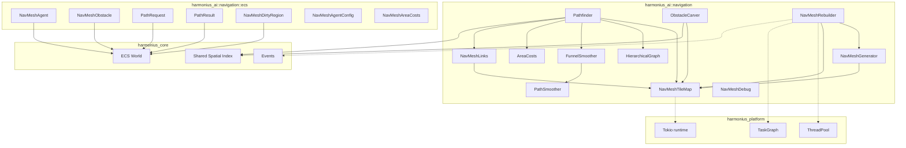
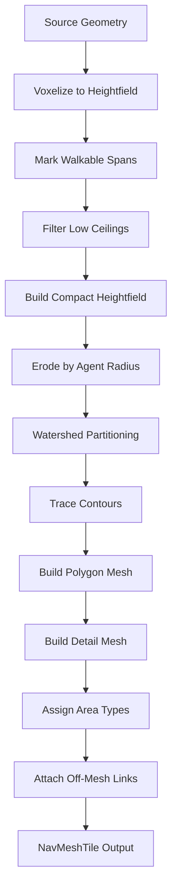
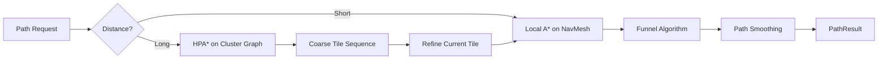
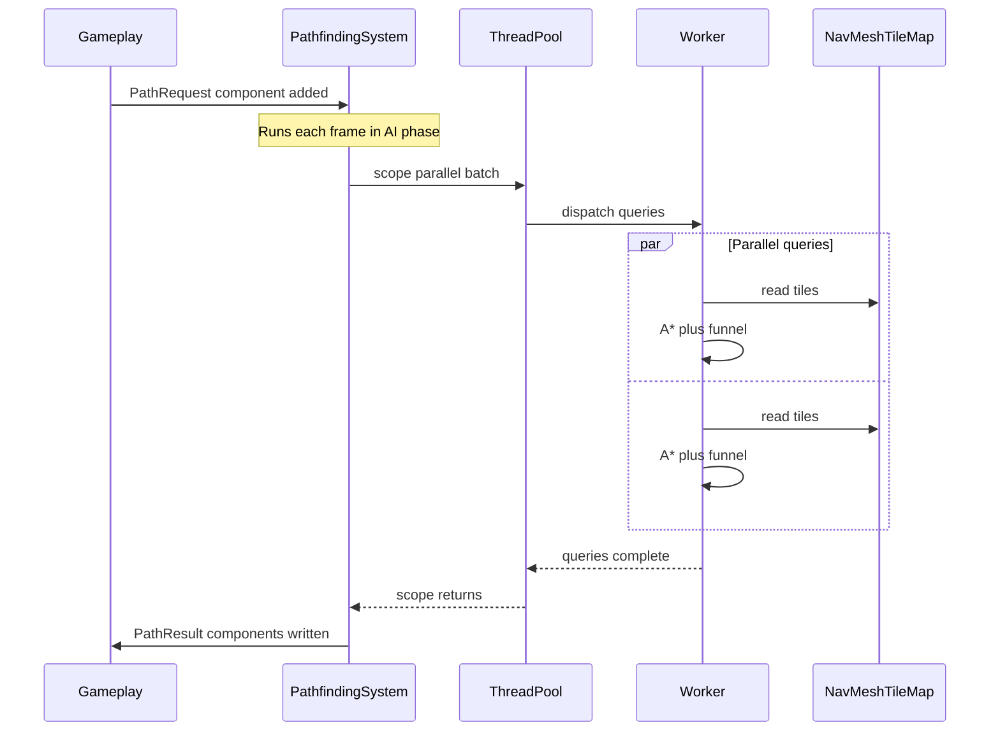
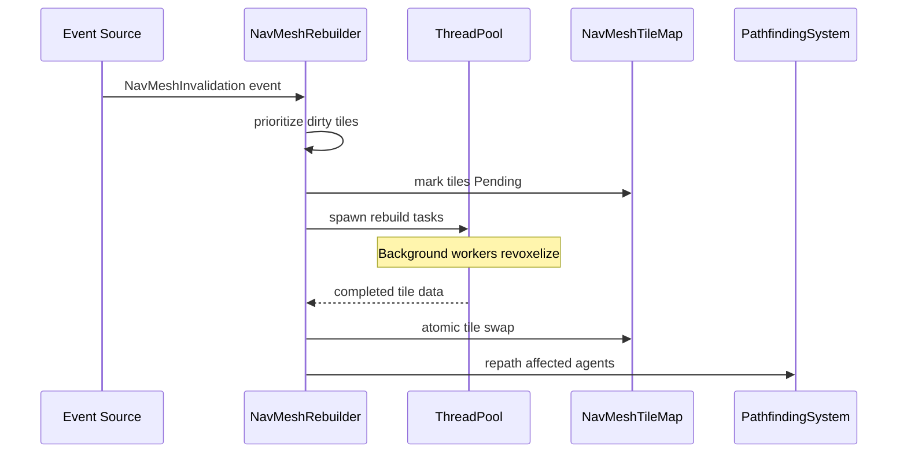
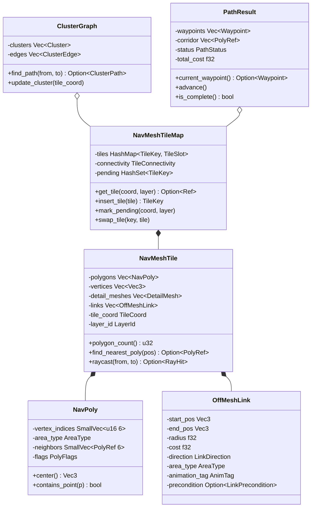
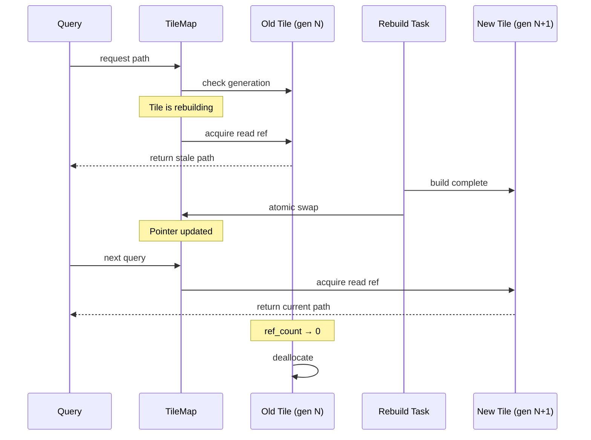
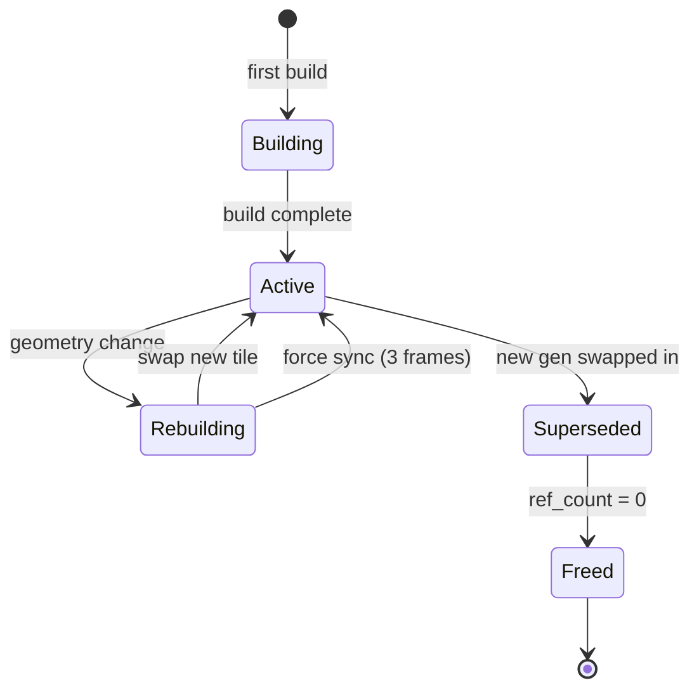

# AI Navigation Design

## Requirements Trace

> **Canonical sources:** Features, requirements, and user stories are defined in
> [features/ai/](../../features/), [requirements/ai/](../../requirements/), and
> [user-stories/ai/](../../user-stories/). The table below traces design elements to those
> definitions.

| Feature  | Requirement | User Stories                |
|----------|-------------|-----------------------------|
| F-7.1.1  | R-7.1.1     | US-7.1.1.1 -- US-7.1.1.12   |
| F-7.1.2  | R-7.1.2     | US-7.1.2.1 -- US-7.1.2.12   |
| F-7.1.3  | R-7.1.3     | US-7.1.3.1 -- US-7.1.3.12   |
| F-7.1.4  | R-7.1.4     | US-7.1.4.1 -- US-7.1.4.12   |
| F-7.1.5  | R-7.1.5     | US-7.1.5.1 -- US-7.1.5.12   |
| F-7.1.6  | R-7.1.6     | US-7.1.6.1 -- US-7.1.6.12   |
| F-7.1.7  | R-7.1.7     | US-7.1.7.1 -- US-7.1.7.12   |
| F-7.1.8  | R-7.1.8     | US-7.1.8.1 -- US-7.1.8.12   |
| F-7.1.9  | R-7.1.9     | US-7.1.9.1 -- US-7.1.9.12   |
| F-7.1.10 | R-7.1.10    | US-7.1.10.1 -- US-7.1.10.12 |
| F-7.1.11 | R-7.1.11    | US-7.1.11.1 -- US-7.1.11.12 |
| F-7.1.12 | R-7.1.12    | US-7.1.12.1 -- US-7.1.12.12 |
| F-7.1.13 | R-7.1.13    | US-7.1.13.1 -- US-7.1.13.12 |
| F-7.1.14 | R-7.1.14    | US-7.1.14.1 -- US-7.1.14.12 |
| F-7.1.15 | R-7.1.15    | US-7.1.15.1 -- US-7.1.15.12 |

1. **F-7.1.1** — Recast-style voxelization NavMesh generation with configurable agent params
2. **F-7.1.2** — Fixed-size NavMesh tiles aligned to world streaming grid
3. **F-7.1.3** — A* pathfinding with area-type costs and per-tick CPU budget
4. **F-7.1.4** — Funnel algorithm converting polygon corridors to minimal waypoints
5. **F-7.1.5** — Path smoothing with Catmull-Rom/Bezier interpolation
6. **F-7.1.6** — Dynamic obstacle carving with tile-local re-carving
7. **F-7.1.7** — Off-mesh links for jumps, ladders, doors, swimming
8. **F-7.1.8** — Incremental tile rebuild on geometry change
9. **F-7.1.9** — Background NavMesh generation on worker threads
10. **F-7.1.10** — Destruction-triggered NavMesh invalidation and rebuild
11. **F-7.1.11** — Player-built structure NavMesh obstacle integration
12. **F-7.1.12** — Multiple NavMesh layers for different agent sizes
13. **F-7.1.13** — Runtime area cost modification without mesh rebuild
14. **F-7.1.14** — Hierarchical pathfinding (HPA*) for long-distance queries
15. **F-7.1.15** — Debug visualization of NavMesh, paths, and overlays

### Cross-Cutting Dependencies

| Dependency | Source | Consumed API |
|------------|--------|--------------|
| ECS World | F-1.1 | Entity, Component, Query, System scheduling |
| Shared spatial index | F-1.9.1 | BVH registration and spatial queries |
| Change detection | F-1.1.22 | `Changed<T>` for dirty tracking |
| Events | F-1.5.1 | `NavMeshInvalidation` event dispatch |
| Thread pool | F-14.3.1 | Scoped parallel task execution |
| Task graph | F-14.3.3 | DAG-based background work |
| Tokio runtime | F-14.3.5 | Async tile streaming I/O |
| Destruction system | F-4.6.3 | Fracture event emission |
| Gizmo system | F-15.1.4 | Debug overlay rendering |
| Reflection | F-1.3.1 | `Reflect` derive for serialization |
| Steering/avoidance | F-7.2 | Consumes waypoints from PathResult |

## Overview

The navigation system provides NavMesh-based pathfinding for all AI agents in the engine. It
generates polygonal navigation meshes from world geometry via Recast-style voxelization, divides
them into streamable tiles, and answers path queries using A* search with funnel smoothing.

The design follows four principles:

1. **ECS-primary (~90%)-based.** All navigation data lives as components and resources. No separate
   navigation world or parallel data store.
2. **Shared spatial index.** Obstacle queries, tile lookups, and agent proximity checks all go
   through the shared BVH (F-1.9.1).
3. **Async and non-blocking.** Pathfinding queries batch across frames using scoped parallel tasks.
   Tile generation runs on background workers. Tile streaming uses async I/O. The game loop thread
   never blocks.
4. **Hierarchical for scale.** Long-distance paths plan on a coarse cluster graph (HPA*), refining
   to full NavMesh only for the agent's current tile. This bounds cost regardless of world size.

### Performance Targets

| Metric | Target | Source |
|--------|--------|--------|
| Path query (single, 10-tile) | < 0.1 ms | US-7.1.3.4 |
| Path query budget per tick | 0.5 ms mobile, 2 ms desktop | F-7.1.3 |
| Concurrent queries (desktop) | 128+ | US-7.1.3.12 |
| Concurrent queries (mobile) | 16 | F-7.1.3 |
| Funnel algorithm per path | < 0.01 ms | US-7.1.4.12 |
| Tile rebuild (incremental) | < 5 ms per tile | US-7.1.8.12 |
| Main-thread overhead during gen | < 5% frame time | US-7.1.9.3 |
| HPA* 50-tile query | < 2x cost of 5-tile | US-7.1.14.3 |
| HPA* 1000+ concurrent queries | Server budget | US-7.1.14.12 |

## Architecture

### Module Boundaries



### Directory Layout

```text
harmonius_ai/
├── navigation/
│   ├── mod.rs          # Public re-exports
│   ├── tile.rs         # NavMeshTile, NavPoly,
│   │                   # TileCoord, PolyRef
│   ├── tile_map.rs     # NavMeshTileMap resource
│   ├── generator.rs    # NavMeshGenerator,
│   │                   # voxelization pipeline
│   ├── pathfinder.rs   # A* search, open/closed
│   │                   # sets, heuristics
│   ├── hierarchical.rs # ClusterGraph, HPA*
│   │                   # coarse planner
│   ├── funnel.rs       # Funnel algorithm
│   ├── smoother.rs     # Path smoothing
│   │                   # (linear, Catmull-Rom,
│   │                   # Bezier)
│   ├── obstacle.rs     # ObstacleCarver,
│   │                   # tile-local re-carving
│   ├── links.rs        # OffMeshLink, link
│   │                   # evaluation
│   ├── rebuilder.rs    # NavMeshRebuilder,
│   │                   # priority queue
│   ├── area_cost.rs    # AreaCostTable,
│   │                   # per-agent overrides
│   ├── debug.rs        # NavMeshDebug overlay
│   └── ecs/
│       ├── mod.rs
│       ├── components.rs  # NavMeshAgent,
│       │                  # NavMeshObstacle,
│       │                  # PathRequest,
│       │                  # PathResult, etc.
│       ├── resources.rs   # NavMeshTileMap,
│       │                  # NavMeshAreaCosts
│       ├── events.rs      # NavMeshInvalidation
│       └── systems.rs     # PathfindingSystem,
│                          # ObstacleCarveSystem,
│                          # RebuildSystem,
│                          # TileStreamingSystem
```

### NavMesh Generation Pipeline



### Hierarchical Pathfinding Flow



### Async Pathfinding Sequence



### Background Tile Rebuild Sequence



### Core Data Structures



## API Design

### Core Types

```rust
/// 2D tile coordinate in the NavMesh grid.
#[derive(
    Clone, Copy, Debug, PartialEq, Eq, Hash,
    Reflect,
)]
pub struct TileCoord {
    pub x: i32,
    pub z: i32,
}

/// Identifies a NavMesh layer for a specific
/// agent size class.
#[derive(
    Clone, Copy, Debug, PartialEq, Eq, Hash,
    Reflect,
)]
pub struct LayerId(pub u8);

/// Combined key for tile lookup: coordinate
/// plus layer.
#[derive(
    Clone, Copy, Debug, PartialEq, Eq, Hash,
)]
pub struct TileKey {
    pub coord: TileCoord,
    pub layer: LayerId,
}

/// Reference to a polygon within a tile.
#[derive(
    Clone, Copy, Debug, PartialEq, Eq, Hash,
)]
pub struct PolyRef {
    pub tile: TileKey,
    pub poly_index: u16,
}

/// Navigation area type. Determines traversal
/// cost and filtering.
#[derive(
    Clone, Copy, Debug, PartialEq, Eq, Hash,
    Reflect,
)]
pub enum AreaType {
    Ground,
    Road,
    Grass,
    Mud,
    Water,
    Swamp,
    Lava,
    /// User-defined area type with custom ID.
    Custom(u16),
}

/// Polygon flags for filtering during queries.
#[derive(
    Clone, Copy, Debug, PartialEq, Eq,
)]
pub struct PolyFlags(pub u16);

impl PolyFlags {
    pub const WALKABLE: Self = Self(0x01);
    pub const SWIM: Self = Self(0x02);
    pub const DOOR: Self = Self(0x04);
    pub const JUMP: Self = Self(0x08);
    pub const DISABLED: Self = Self(0x10);

    pub fn contains(self, flag: Self) -> bool;
    pub fn insert(&mut self, flag: Self);
    pub fn remove(&mut self, flag: Self);
}
```

### NavMesh Tile

```rust
/// A single polygon in the NavMesh.
pub struct NavPoly {
    /// Indices into the tile's vertex array.
    /// Up to 6 vertices per polygon.
    pub vertex_indices: SmallVec<[u16; 6]>,
    /// Area type for cost computation.
    pub area_type: AreaType,
    /// Adjacent polygons. `None` entries mark
    /// tile-boundary edges (external links
    /// resolved via TileConnectivity).
    pub neighbors: SmallVec<[Option<PolyRef>; 6]>,
    /// Polygon flags for query filtering.
    pub flags: PolyFlags,
}

/// Detail sub-mesh for height accuracy within
/// a polygon.
pub struct DetailMesh {
    pub vertices: Vec<Vec3>,
    pub triangles: Vec<[u16; 3]>,
}

/// A single NavMesh tile containing polygons,
/// vertices, and off-mesh links.
pub struct NavMeshTile {
    pub coord: TileCoord,
    pub layer: LayerId,
    pub bounds: Aabb,
    pub polygons: Vec<NavPoly>,
    pub vertices: Vec<Vec3>,
    pub detail_meshes: Vec<DetailMesh>,
    pub links: Vec<OffMeshLink>,
}

impl NavMeshTile {
    /// Find the polygon nearest to a world
    /// position, within a search extent.
    pub fn find_nearest_poly(
        &self,
        pos: Vec3,
        extent: Vec3,
    ) -> Option<(PolyRef, Vec3)>;

    /// Cast a ray along the NavMesh surface
    /// within this tile.
    pub fn raycast(
        &self,
        from: Vec3,
        to: Vec3,
    ) -> Option<RayHit>;

    /// Number of polygons in this tile.
    pub fn polygon_count(&self) -> u32;

    /// Get a polygon by local index.
    pub fn polygon(
        &self,
        index: u16,
    ) -> Option<&NavPoly>;

    /// Compute the centroid of a polygon.
    pub fn polygon_center(
        &self,
        index: u16,
    ) -> Option<Vec3>;

    /// Test whether a point lies within a
    /// polygon's 2D projection.
    pub fn point_in_polygon(
        &self,
        index: u16,
        point: Vec3,
    ) -> bool;
}
```

### NavMesh Tile Map (ECS Resource)

```rust
/// Tile loading state for the tile map.
#[derive(Clone, Copy, Debug, PartialEq, Eq)]
pub enum TileStatus {
    /// Tile is loaded and valid.
    Loaded,
    /// Tile is being rebuilt; stale data may
    /// still be queried as fallback.
    Pending,
    /// Tile is not loaded (outside streaming
    /// window).
    Unloaded,
}

/// Slot in the tile map holding tile data
/// and its current status.
struct TileSlot {
    tile: NavMeshTile,
    status: TileStatus,
}

/// Central NavMesh storage. Registered as an
/// ECS resource. All pathfinding queries read
/// from this map.
pub struct NavMeshTileMap { /* ... */ }

impl NavMeshTileMap {
    pub fn new(config: TileMapConfig) -> Self;

    /// Look up a tile by coordinate and layer.
    pub fn get_tile(
        &self,
        coord: TileCoord,
        layer: LayerId,
    ) -> Option<&NavMeshTile>;

    /// Get the status of a tile slot.
    pub fn tile_status(
        &self,
        coord: TileCoord,
        layer: LayerId,
    ) -> TileStatus;

    /// Insert or replace a tile. Used by the
    /// generator and rebuilder.
    pub fn insert_tile(
        &mut self,
        tile: NavMeshTile,
    );

    /// Mark a tile as pending rebuild.
    /// Existing data remains queryable as
    /// stale fallback.
    pub fn mark_pending(
        &mut self,
        coord: TileCoord,
        layer: LayerId,
    );

    /// Atomically swap a rebuilt tile into the
    /// live map. Called at the sync point after
    /// background generation completes.
    pub fn swap_tile(
        &mut self,
        key: TileKey,
        tile: NavMeshTile,
    );

    /// Remove a tile (unload from streaming).
    pub fn remove_tile(
        &mut self,
        coord: TileCoord,
        layer: LayerId,
    );

    /// Query which tiles overlap an AABB.
    pub fn tiles_in_bounds(
        &self,
        bounds: Aabb,
        layer: LayerId,
    ) -> Vec<TileCoord>;

    /// Find the nearest polygon across all
    /// loaded tiles for a given layer.
    pub fn find_nearest_poly(
        &self,
        pos: Vec3,
        extent: Vec3,
        layer: LayerId,
    ) -> Option<(PolyRef, Vec3)>;
}

pub struct TileMapConfig {
    /// World-space size of each tile edge.
    pub tile_size: f32,
    /// Maximum tiles kept in memory.
    pub max_loaded_tiles: u32,
    /// Preload radius in tile units around
    /// active agents.
    pub preload_radius: u32,
}
```

### NavMesh Generator

```rust
/// Configuration for NavMesh generation,
/// defining agent physical properties.
#[derive(Clone, Debug, Reflect)]
pub struct NavMeshAgentConfig {
    /// Agent capsule radius.
    pub radius: f32,
    /// Agent capsule height.
    pub height: f32,
    /// Maximum step-up height.
    pub max_climb: f32,
    /// Maximum walkable slope in degrees.
    pub max_slope_degrees: f32,
}

/// Voxelization and mesh-building parameters.
#[derive(Clone, Debug)]
pub struct NavMeshBuildConfig {
    /// Voxel cell size (XZ plane). Smaller
    /// values produce more accurate meshes at
    /// higher cost.
    pub cell_size: f32,
    /// Voxel cell height (Y axis).
    pub cell_height: f32,
    /// World-space tile edge length.
    pub tile_size: f32,
    /// Agent configurations for each layer.
    pub agent_configs: Vec<NavMeshAgentConfig>,
    /// Minimum region area in cells squared.
    /// Regions smaller than this are removed.
    pub min_region_area: u32,
    /// Merge threshold for small regions.
    pub merge_region_area: u32,
    /// Maximum edge length for polygon edges.
    pub max_edge_len: f32,
    /// Maximum deviation for simplified
    /// contour edges.
    pub max_simplification_error: f32,
    /// Maximum vertices per polygon.
    pub max_verts_per_poly: u8,
}

/// Source geometry fed into the generator.
pub struct InputGeometry {
    pub vertices: Vec<Vec3>,
    pub indices: Vec<u32>,
    /// Per-triangle area type override.
    pub area_types: Vec<AreaType>,
}

/// The NavMesh generator. Runs Recast-style
/// voxelization and polygon mesh construction.
pub struct NavMeshGenerator { /* ... */ }

impl NavMeshGenerator {
    pub fn new(
        config: NavMeshBuildConfig,
    ) -> Self;

    /// Generate a single tile for one agent
    /// layer. This is the hot path called by
    /// both offline baking and runtime rebuild.
    ///
    /// Pure function: no side effects, no
    /// shared mutable state. Safe to call from
    /// multiple worker threads in parallel.
    pub fn generate_tile(
        &self,
        coord: TileCoord,
        layer: LayerId,
        geometry: &InputGeometry,
    ) -> Result<NavMeshTile, NavMeshGenError>;

    /// Generate all tiles for a region. Returns
    /// tiles for every configured agent layer.
    pub fn generate_region(
        &self,
        bounds: Aabb,
        geometry: &InputGeometry,
    ) -> Result<Vec<NavMeshTile>, NavMeshGenError>;
}

pub enum NavMeshGenError {
    /// No walkable geometry in tile bounds.
    EmptyTile,
    /// Voxelization exceeded memory budget.
    OutOfMemory,
    /// Invalid input geometry.
    InvalidGeometry { reason: &'static str },
}
```

### Pathfinder

```rust
/// A* heuristic function signature.
pub type HeuristicFn =
    fn(from: Vec3, to: Vec3) -> f32;

/// Built-in heuristics.
pub fn heuristic_euclidean(
    from: Vec3,
    to: Vec3,
) -> f32;

pub fn heuristic_manhattan(
    from: Vec3,
    to: Vec3,
) -> f32;

/// Per-tick pathfinding budget.
#[derive(Clone, Debug)]
pub struct PathfindingBudget {
    /// Maximum microseconds per tick for
    /// pathfinding.
    pub max_us_per_tick: u32,
    /// Maximum concurrent queries per tick.
    pub max_queries_per_tick: u32,
}

/// Query filter controlling which polygons
/// the pathfinder may traverse.
#[derive(Clone, Debug)]
pub struct QueryFilter {
    /// Required polygon flags (bitwise AND).
    pub include_flags: PolyFlags,
    /// Excluded polygon flags (bitwise AND).
    pub exclude_flags: PolyFlags,
    /// Per-area-type cost multipliers.
    /// Area types not present default to 1.0.
    pub area_costs: HashMap<AreaType, f32>,
}

/// Status of a completed path query.
#[derive(Clone, Copy, Debug, PartialEq, Eq)]
pub enum PathStatus {
    /// Full path found from start to goal.
    Complete,
    /// Partial path found (goal unreachable
    /// or budget exhausted). The path leads
    /// to the closest reachable point.
    Partial,
    /// No path exists between start and goal.
    NotFound,
}

/// A single waypoint on a computed path.
#[derive(Clone, Copy, Debug)]
pub struct Waypoint {
    pub position: Vec3,
    pub poly_ref: PolyRef,
    /// Optional off-mesh link to traverse
    /// at this waypoint.
    pub link: Option<OffMeshLinkRef>,
}

/// Result of a pathfinding query, stored as
/// an ECS component on the requesting entity.
#[derive(Clone, Debug, Reflect)]
pub struct PathResult {
    pub status: PathStatus,
    pub waypoints: Vec<Waypoint>,
    pub corridor: Vec<PolyRef>,
    pub total_cost: f32,
    /// Index of the current waypoint being
    /// followed by the steering system.
    current_index: u32,
}

impl PathResult {
    pub fn current_waypoint(
        &self,
    ) -> Option<&Waypoint>;

    pub fn advance(&mut self);
    pub fn is_complete(&self) -> bool;
    pub fn remaining_waypoints(&self) -> &[Waypoint];
}

/// The A* pathfinder. Stateless — all
/// mutable search state is stack-local.
pub struct Pathfinder { /* ... */ }

impl Pathfinder {
    pub fn new(heuristic: HeuristicFn) -> Self;

    /// Find a path on the NavMesh. Pure
    /// function: reads NavMeshTileMap
    /// immutably, produces a PathResult.
    pub fn find_path(
        &self,
        tile_map: &NavMeshTileMap,
        area_costs: &AreaCostTable,
        start: Vec3,
        goal: Vec3,
        layer: LayerId,
        filter: &QueryFilter,
    ) -> PathResult;

    /// Find a path, returning raw polygon
    /// corridor without funnel smoothing.
    /// Used by the hierarchical planner for
    /// per-tile refinement.
    pub fn find_corridor(
        &self,
        tile_map: &NavMeshTileMap,
        area_costs: &AreaCostTable,
        start_poly: PolyRef,
        goal_poly: PolyRef,
        filter: &QueryFilter,
    ) -> Option<Vec<PolyRef>>;
}
```

### Funnel Algorithm and Path Smoothing

```rust
/// The funnel (string-pulling) algorithm.
/// Converts a polygon corridor into a minimal
/// waypoint sequence.
pub struct FunnelSmoother;

impl FunnelSmoother {
    /// Run the funnel algorithm on a corridor.
    /// All output waypoints are guaranteed to
    /// lie within NavMesh polygon boundaries.
    pub fn smooth(
        tile_map: &NavMeshTileMap,
        corridor: &[PolyRef],
        start: Vec3,
        goal: Vec3,
    ) -> Vec<Waypoint>;
}

/// Path smoothing mode.
///
/// Path smoothing curves use the shared `Curve<T>`
/// type (see
/// [shared-primitives.md](../core-runtime/shared-primitives.md)).
#[derive(
    Clone, Copy, Debug, PartialEq, Eq, Reflect,
)]
pub enum SmoothingMode {
    /// No smoothing — raw funnel waypoints.
    None,
    /// Linear interpolation with redundant
    /// turn removal via NavMesh raycasts.
    Linear,
    /// Catmull-Rom spline interpolation.
    CatmullRom,
    /// Cubic Bezier interpolation.
    Bezier,
}

/// Post-processes funnel waypoints into
/// smoother trajectories.
pub struct PathSmoother;

impl PathSmoother {
    /// Smooth a waypoint path. On mobile,
    /// CatmullRom and Bezier fall back to
    /// Linear automatically.
    pub fn smooth(
        tile_map: &NavMeshTileMap,
        waypoints: &[Waypoint],
        mode: SmoothingMode,
        segment_count: u32,
    ) -> Vec<Waypoint>;

    /// Remove redundant turns via NavMesh
    /// raycasts. A turn is redundant if a
    /// direct raycast between its neighbors
    /// stays on valid polygons.
    pub fn remove_redundant_turns(
        tile_map: &NavMeshTileMap,
        waypoints: &mut Vec<Waypoint>,
    );
}
```

### Off-Mesh Links

```rust
/// Direction of traversal for an off-mesh
/// link.
#[derive(
    Clone, Copy, Debug, PartialEq, Eq, Reflect,
)]
pub enum LinkDirection {
    /// Traversable in both directions.
    Bidirectional,
    /// Traversable only from start to end
    /// (e.g., jump-down).
    OneWay,
}

/// Precondition that must be satisfied for an
/// agent to use an off-mesh link.
#[derive(Clone, Debug, Reflect)]
pub enum LinkPrecondition {
    /// Agent must have a specific ability.
    HasAbility(AbilityId),
    /// Agent must possess a specific item.
    HasItem(ItemId),
    /// Custom precondition evaluated by a
    /// named system.
    Custom(PreconditionId),
}

/// An off-mesh connection between two NavMesh
/// polygons, potentially in different tiles.
#[derive(Clone, Debug, Reflect)]
pub struct OffMeshLink {
    pub start_pos: Vec3,
    pub end_pos: Vec3,
    pub start_poly: PolyRef,
    pub end_poly: PolyRef,
    pub radius: f32,
    pub cost: f32,
    pub direction: LinkDirection,
    pub area_type: AreaType,
    /// Animation tag for the traversal
    /// animation (jump, climb, swim, etc.).
    pub animation_tag: AnimTag,
    /// Optional precondition. If `Some`, the
    /// pathfinder skips this link for agents
    /// that do not satisfy it.
    pub precondition: Option<LinkPrecondition>,
}

/// Opaque reference to an off-mesh link
/// within a tile.
#[derive(Clone, Copy, Debug)]
pub struct OffMeshLinkRef {
    pub tile: TileKey,
    pub link_index: u16,
}
```

### Dynamic Obstacle Carving

```rust
/// Carve shape for a dynamic obstacle.
#[derive(Clone, Debug, Reflect)]
pub enum CarveShape {
    Box { half_extents: Vec3 },
    Cylinder { radius: f32, height: f32 },
    Convex { vertices: Vec<Vec3> },
}

/// The obstacle carver. Marks NavMesh
/// polygons as blocked when dynamic obstacles
/// overlap them, and triggers localized
/// repath for affected agents.
pub struct ObstacleCarver { /* ... */ }

impl ObstacleCarver {
    /// Carve an obstacle into the NavMesh.
    /// Queries the shared spatial index for
    /// affected tiles, then marks overlapping
    /// polygons as DISABLED.
    pub fn carve(
        &self,
        tile_map: &mut NavMeshTileMap,
        spatial_index: &SpatialIndex,
        shape: &CarveShape,
        transform: &GlobalTransform,
    ) -> Vec<PolyRef>;

    /// Remove a previously carved obstacle.
    /// Restores the original polygon flags.
    pub fn uncarve(
        &self,
        tile_map: &mut NavMeshTileMap,
        affected_polys: &[PolyRef],
    );

    /// Find all agents whose corridor
    /// intersects the given modified polygons.
    /// These agents need a repath.
    pub fn find_affected_agents(
        &self,
        modified_polys: &[PolyRef],
        agent_query: &Query<
            (Entity, &PathResult),
            With<NavMeshAgent>,
        >,
    ) -> Vec<Entity>;
}
```

### Incremental Rebuild and Background Generation

```rust
/// Rebuild priority for a dirty tile.
#[derive(Clone, Copy, Debug, PartialOrd, Ord,
    PartialEq, Eq)]
pub struct RebuildPriority(pub u32);

/// Entry in the rebuild queue.
struct RebuildEntry {
    coord: TileCoord,
    layer: LayerId,
    priority: RebuildPriority,
    dirty_bounds: Aabb,
}

/// Platform-specific concurrency limits.
pub struct RebuildLimits {
    /// Maximum concurrent tile rebuilds.
    pub max_concurrent: u32,
}

impl RebuildLimits {
    pub fn desktop() -> Self {
        Self { max_concurrent: 4 }
    }
    pub fn mobile() -> Self {
        Self { max_concurrent: 1 }
    }
}

/// The NavMesh rebuilder. Processes dirty
/// regions and dispatches background rebuild
/// tasks via the thread pool.
pub struct NavMeshRebuilder { /* ... */ }

impl NavMeshRebuilder {
    pub fn new(
        limits: RebuildLimits,
        generator: NavMeshGenerator,
    ) -> Self;

    /// Enqueue a dirty region for rebuild.
    /// Priority scales with the number of
    /// active agents whose paths cross the
    /// region.
    pub fn enqueue(
        &mut self,
        coord: TileCoord,
        layer: LayerId,
        dirty_bounds: Aabb,
        affected_agent_count: u32,
    );

    /// Merge a new dirty region into an
    /// existing queue entry for the same tile.
    pub fn merge_or_enqueue(
        &mut self,
        coord: TileCoord,
        layer: LayerId,
        dirty_bounds: Aabb,
        affected_agent_count: u32,
    );

    /// Dispatch rebuild tasks for the
    /// highest-priority tiles, up to
    /// `max_concurrent`. Returns handles
    /// for tiles whose rebuild completed
    /// this tick (from previous dispatches).
    ///
    /// Called once per frame by the
    /// RebuildSystem.
    pub fn tick(
        &mut self,
        pool: &ThreadPool,
        tile_map: &mut NavMeshTileMap,
        geometry_source: &InputGeometry,
    ) -> Vec<TileKey>;
}
```

### Area Cost Table

```rust
/// Global area cost table. Stored as an ECS
/// resource. Modified at runtime without
/// rebuilding geometry.
#[derive(Clone, Debug, Reflect)]
pub struct AreaCostTable {
    /// Base cost multiplier per area type.
    costs: HashMap<AreaType, f32>,
}

impl AreaCostTable {
    pub fn new() -> Self;

    /// Set the cost multiplier for an area
    /// type. Default is 1.0.
    pub fn set_cost(
        &mut self,
        area: AreaType,
        cost: f32,
    );

    /// Get the cost multiplier for an area
    /// type. Returns 1.0 if not set.
    pub fn get_cost(
        &self,
        area: AreaType,
    ) -> f32;
}

/// Per-agent cost overrides for
/// faction-specific routing.
#[derive(Clone, Debug, Reflect)]
pub struct AgentCostOverrides {
    pub overrides: HashMap<AreaType, f32>,
}

/// Resolve the effective cost for an area
/// type, combining the global table with
/// per-agent overrides.
pub fn resolve_area_cost(
    table: &AreaCostTable,
    agent_overrides: Option<&AgentCostOverrides>,
    area: AreaType,
) -> f32 {
    if let Some(ovr) = agent_overrides {
        if let Some(&cost) = ovr.overrides.get(&area) {
            return cost;
        }
    }
    table.get_cost(area)
}
```

### Hierarchical Pathfinding (HPA*)

```rust
/// A cluster in the hierarchical graph.
/// Each cluster maps to one NavMesh tile.
#[derive(Clone, Debug)]
pub struct Cluster {
    pub coord: TileCoord,
    /// Border nodes where this cluster
    /// connects to neighbor clusters.
    pub border_nodes: Vec<BorderNode>,
    /// Intra-cluster distances between border
    /// nodes (precomputed via local A*).
    pub internal_distances:
        Vec<(u16, u16, f32)>,
}

/// A node on the boundary between two tiles.
#[derive(Clone, Debug)]
pub struct BorderNode {
    pub position: Vec3,
    pub poly_ref: PolyRef,
    pub edge_index: u16,
}

/// Edge in the cluster graph connecting two
/// border nodes in adjacent clusters.
#[derive(Clone, Debug)]
pub struct ClusterEdge {
    pub from: ClusterNodeId,
    pub to: ClusterNodeId,
    pub cost: f32,
}

#[derive(
    Clone, Copy, Debug, PartialEq, Eq, Hash,
)]
pub struct ClusterNodeId {
    pub cluster_index: u32,
    pub border_index: u16,
}

/// The hierarchical navigation graph.
pub struct ClusterGraph { /* ... */ }

impl ClusterGraph {
    pub fn new() -> Self;

    /// Build or rebuild the cluster graph
    /// from the current tile map state.
    pub fn rebuild(
        &mut self,
        tile_map: &NavMeshTileMap,
        layer: LayerId,
    );

    /// Update a single cluster after a tile
    /// rebuild. Recomputes border nodes and
    /// internal distances for that tile only.
    pub fn update_cluster(
        &mut self,
        tile_map: &NavMeshTileMap,
        coord: TileCoord,
        layer: LayerId,
    );

    /// Find a coarse path on the cluster
    /// graph. Returns a sequence of tile
    /// coordinates to traverse.
    pub fn find_path(
        &self,
        from: TileCoord,
        to: TileCoord,
        area_costs: &AreaCostTable,
    ) -> Option<Vec<TileCoord>>;
}
```

### ECS Components

```rust
/// Attached to entities that navigate using
/// the NavMesh. References the agent's size
/// layer.
#[derive(Clone, Debug, Reflect)]
pub struct NavMeshAgent {
    /// Which NavMesh layer this agent uses.
    pub layer: LayerId,
    /// Smoothing mode for this agent's paths.
    pub smoothing: SmoothingMode,
    /// Optional per-agent cost overrides for
    /// faction-specific routing.
    pub cost_overrides:
        Option<AgentCostOverrides>,
    /// Query filter for polygon inclusion/
    /// exclusion.
    pub filter: QueryFilter,
}

/// Request a path computation. Attached to an
/// entity; consumed by PathfindingSystem. The
/// system removes this component and writes a
/// PathResult once the query completes.
#[derive(Clone, Debug, Reflect)]
pub struct PathRequest {
    pub goal: Vec3,
    /// Optional: override the default
    /// heuristic.
    pub heuristic: Option<HeuristicFn>,
}

/// Marks a dynamic obstacle that carves the
/// NavMesh at runtime.
#[derive(Clone, Debug, Reflect)]
pub struct NavMeshObstacle {
    pub shape: CarveShape,
    /// Area type override for the carved
    /// region. If `None`, the region is fully
    /// blocked.
    pub area_override: Option<AreaType>,
    /// Clearance margin around the shape.
    pub margin: f32,
}

/// Marks a spatial region whose NavMesh tiles
/// need rebuild. Attached to entities or
/// emitted by destruction/placement systems.
#[derive(Clone, Debug, Reflect)]
pub struct NavMeshDirtyRegion {
    pub bounds: Aabb,
    /// Higher values rebuild sooner.
    pub priority: u32,
}
```

### ECS Events

```rust
/// Emitted when geometry changes invalidate
/// NavMesh tiles. Sources: destruction system,
/// terrain deformation, structure placement.
#[derive(Clone, Debug)]
pub struct NavMeshInvalidation {
    pub bounds: Aabb,
    pub source: InvalidationSource,
}

#[derive(Clone, Debug)]
pub enum InvalidationSource {
    Destruction { entity: Entity },
    TerrainDeform { entity: Entity },
    StructurePlaced { entity: Entity },
    StructureRemoved { entity: Entity },
    Manual,
}
```

### ECS Systems

```rust
/// Processes PathRequest components in batches,
/// dispatching queries to worker threads.
/// Runs in the AI phase each frame.
pub fn pathfinding_system(
    mut commands: Commands,
    pool: Res<ThreadPool>,
    tile_map: Res<NavMeshTileMap>,
    area_costs: Res<AreaCostTable>,
    cluster_graph: Res<ClusterGraph>,
    budget: Res<PathfindingBudget>,
    query: Query<
        (Entity, &PathRequest, &NavMeshAgent,
         &GlobalTransform),
    >,
) {
    // 1. Drain all PathRequest components
    //    into a batch Vec.
    // 2. Sort by priority (distance, agent
    //    importance).
    // 3. Use pool.scope() for parallel
    //    dispatch:
    //    - For each request, determine if
    //      HPA* or local A* is needed based
    //      on distance.
    //    - Run find_path() on worker thread.
    //    - Apply funnel + smoothing.
    // 4. Write PathResult components.
    // 5. Remove PathRequest components.
    // 6. Respect budget.max_us_per_tick;
    //    defer remaining requests to next
    //    frame.
}

/// Processes NavMeshObstacle components,
/// carving and uncarving the tile map.
pub fn obstacle_carve_system(
    tile_map: ResMut<NavMeshTileMap>,
    spatial_index: Res<SpatialIndex>,
    added: Query<
        (Entity, &NavMeshObstacle,
         &GlobalTransform),
        Added<NavMeshObstacle>,
    >,
    removed: RemovedComponents<NavMeshObstacle>,
    changed: Query<
        (Entity, &NavMeshObstacle,
         &GlobalTransform),
        Changed<NavMeshObstacle>,
    >,
);

/// Listens for NavMeshInvalidation events
/// and enqueues tile rebuilds.
pub fn rebuild_system(
    mut rebuilder: ResMut<NavMeshRebuilder>,
    mut tile_map: ResMut<NavMeshTileMap>,
    pool: Res<ThreadPool>,
    events: EventReader<NavMeshInvalidation>,
    agents: Query<
        &PathResult,
        With<NavMeshAgent>,
    >,
);

/// Streams NavMesh tiles in/out based on
/// active agent positions.
pub fn tile_streaming_system(
    mut tile_map: ResMut<NavMeshTileMap>,
    reactor: Res<Tokio runtime>,
    agents: Query<
        &GlobalTransform,
        With<NavMeshAgent>,
    >,
);
```

### Debug Visualization

```rust
/// Controls NavMesh debug visualization.
/// Attach to an entity to enable overlays.
#[derive(Clone, Debug, Reflect)]
pub struct NavMeshDebug {
    pub show_polygons: bool,
    pub show_tile_boundaries: bool,
    pub show_area_types: bool,
    pub show_links: bool,
    pub show_agent_paths: bool,
    pub show_carve_regions: bool,
    pub show_pending_rebuilds: bool,
    pub show_hierarchical_graph: bool,
}

/// Debug-only system. Stripped from shipping
/// builds via `#[cfg(debug_assertions)]`.
#[cfg(debug_assertions)]
pub fn navmesh_debug_system(
    tile_map: Res<NavMeshTileMap>,
    cluster_graph: Res<ClusterGraph>,
    debug_query: Query<&NavMeshDebug>,
    gizmos: ResMut<Gizmos>,
);
```

## Data Flow

### Path Request Lifecycle

1. A gameplay system attaches a `PathRequest` component to an entity that has a `NavMeshAgent`
   component.
2. The `pathfinding_system` runs in the AI phase. It drains all `PathRequest` components into a
   batch.
3. For each request, the system determines the start polygon via `tile_map.find_nearest_poly()`
   using the entity's `GlobalTransform`.
4. If the start-to-goal distance exceeds a threshold (3+ tiles), the `ClusterGraph` provides a
   coarse tile sequence via HPA*. The local A* refines only the current tile's portion.
5. Short paths run full A* directly on the NavMesh polygon graph.
6. The resulting polygon corridor passes through the `FunnelSmoother` to produce minimal waypoints.
7. The `PathSmoother` post-processes waypoints based on the agent's `SmoothingMode`.
8. A `PathResult` component is written to the entity. The `PathRequest` is removed.
9. The steering system (F-7.2) reads `PathResult.current_waypoint()` each frame to drive agent
   movement.

### Obstacle Carve Lifecycle

1. A gameplay system attaches a `NavMeshObstacle` component to a dynamic entity (barricade, vehicle,
   etc.).
2. The `obstacle_carve_system` detects the new component via `Added<NavMeshObstacle>`.
3. It queries the shared spatial index to find which NavMesh tiles overlap the obstacle's transform
   and shape.
4. Overlapping polygons have their flags set to `DISABLED`.
5. Agents whose `PathResult.corridor` intersects the disabled polygons receive a new `PathRequest`
   to trigger a repath.
6. When the obstacle entity is despawned or the `NavMeshObstacle` component removed, the system
   restores the original polygon flags and triggers repaths again.

### Tile Rebuild Lifecycle

1. An event source (destruction, terrain deformation, structure placement) emits a
   `NavMeshInvalidation` event with the affected AABB.
2. The `rebuild_system` reads the event and computes which tile coordinates overlap the dirty
   bounds.
3. For each affected tile, it counts active agents with paths through the tile to compute rebuild
   priority.
4. The `NavMeshRebuilder` enqueues the tiles. If a tile is already queued, the dirty bounds are
   merged.
5. Each frame, `NavMeshRebuilder.tick()` dispatches up to `max_concurrent` rebuild tasks to the
   thread pool.
6. The tiles are marked `Pending` in the `NavMeshTileMap`. Agents continue to query the stale tile
   data as a fallback.
7. When a background task completes, the rebuilt tile is swapped in atomically at the next sync
   point via `tile_map.swap_tile()`.
8. Agents whose corridors crossed the rebuilt tile receive a `PathRequest` for repath.

### Tile Streaming Lifecycle

1. The `tile_streaming_system` runs each frame.
2. It computes the set of tile coordinates within `preload_radius` of any active `NavMeshAgent`.
3. Tiles entering the radius are loaded via async I/O through the `Tokio runtime`.
4. Tiles leaving the radius (and not referenced by any agent's corridor) are unloaded from the
   `NavMeshTileMap`.
5. The `ClusterGraph` is updated for any newly loaded or unloaded tiles.

## Tile Versioning and Stale Fallback

NavMesh tiles rebuild in the background on worker threads (F-7.1.9). During a rebuild, concurrent
pathfinding queries may read the tile being replaced. Without explicit tile versioning or fallback
behavior, queries can observe partial data or block waiting for a rebuild to complete.

**Versioning fields.** Each tile carries a monotonic generation counter that tracks its rebuild
history.

| Field | Type | Purpose |
|-------|------|---------|
| `generation` | `u64` | Monotonic counter incremented on each rebuild |
| `ref_count` | Atomic `u32` | Active readers holding a reference |
| `generation + 1` | `u64` | Produced by every rebuild |
| `generation` in result | `u64` | Included in query results for the tile that was read |
| Read reference | ref | Held by active queries; old tile freed when last reader drops |
| Generation `0` | `u64` | Reserved for the initial build |

```rust
/// Per-tile version metadata.
#[derive(Clone, Copy, Debug)]
pub struct TileVersion {
    /// Monotonic rebuild counter.
    pub generation: u64,
}
```

**Fallback behavior.** When a query arrives while a tile is rebuilding, the system falls back to the
previous-generation tile.

| Condition | Behavior | Max Staleness |
|-----------|----------|---------------|
| Tile rebuilding, previous tile exists | Use previous-generation tile | N/A |
| Tile rebuilding, no previous tile (first build) | Return `NavResult::TilePending` | N/A |
| Tile stale for 3+ frames | Force-complete rebuild synchronously | 3 frames |

The maximum staleness threshold of 3 frames prevents unbounded use of outdated geometry. After 3
frames, the rebuild system calls a synchronous completion that blocks until the tile is ready
(R-7.1.9).

```rust
/// Extended navigation result status.
#[derive(Clone, Copy, Debug, PartialEq, Eq)]
pub enum NavResult {
    /// Path computed on current-generation tile.
    Current,
    /// Path computed on stale tile (rebuild
    /// in progress).
    Stale { generation: u64 },
    /// Tile is building for the first time;
    /// no data available yet.
    TilePending,
}
```

**Atomic swap procedure.** Completed tiles are published via an atomic pointer swap. In-flight
queries on the old tile finish normally against their held reference.

1. Rebuild task produces a new `NavMeshTile` with `generation = old.generation + 1`
2. The `NavMeshTileMap` performs an atomic swap of the tile pointer
3. New queries immediately see the updated tile
4. Old tile remains valid until its `ref_count` reaches zero, then it is deallocated

**Sequence.**



**Lifecycle.**



## Platform Considerations

### Pathfinding Budget Scaling

| Platform | Budget/Tick | Max Concurrent | Smoothing |
|----------|------------|----------------|-----------|
| Mobile | 0.5 ms | 16 | Linear only |
| Switch | 1.0 ms | 32 | Linear only |
| Desktop | 2.0 ms | 128+ | All modes |
| Server | 4.0 ms | 512+ | None (server-side) |

### Tile Rebuild Limits

| Platform | Max Concurrent Rebuilds | Voxel Resolution |
|----------|------------------------|------------------|
| Mobile | 1 | 2x cell size (coarser) |
| Switch | 2 | 1.5x cell size |
| Desktop | 4+ | 1x cell size (full) |
| Server | 8+ | 1x cell size (full) |

### NavMesh Layer Limits

| Platform | Max Layers | Typical Configuration |
|----------|------------|----------------------|
| Mobile | 2 | Humanoid + Large |
| Switch | 3 | Humanoid + Mount + Large |
| Desktop | 4+ | Humanoid + Mount + Large + Custom |
| Server | 4+ | All layers |

### Dynamic Obstacle Carving Limits

| Platform | Max Carves/Tick | Repath Storm Throttle |
|----------|----------------|----------------------|
| Mobile | 4 | Aggressive (max 8 repaths/tick) |
| Desktop | 16+ | Normal (max 64 repaths/tick) |
| Server | 32+ | Relaxed (max 256 repaths/tick) |

### Threading Model

All pathfinding queries execute within a `pool.scope()` call, enabling borrowed access to the
`NavMeshTileMap` without `Arc` overhead. Background tile generation uses `pool.spawn()` with
`'static` data cloned from the ECS world.

On macOS, background tile generation dispatches to GCD queues through the thread pool's platform
abstraction. Fibers are available for deep-recursion A* searches on very large NavMeshes, but the
default path is async-friendly stack-local search state.

### Memory Budget

| Component | Budget (Desktop) | Budget (Mobile) |
|-----------|-----------------|-----------------|
| NavMeshTileMap | 128 MB max | 32 MB max |
| Cluster graph | 8 MB | 2 MB |
| Path result pool | 16 MB | 4 MB |
| Rebuild scratch | 32 MB | 8 MB |

## Test Plan

### Unit Tests

| Test                             | Req      |
|----------------------------------|----------|
| `test_voxelize_flat_plane`       | R-7.1.1  |
| `test_slope_exclusion`           | R-7.1.1  |
| `test_agent_radius_erosion`      | R-7.1.1  |
| `test_tile_coord_mapping`        | R-7.1.2  |
| `test_cross_tile_path`           | R-7.1.2  |
| `test_astar_optimal`             | R-7.1.3  |
| `test_area_cost_routing`         | R-7.1.3  |
| `test_lava_impassable`           | R-7.1.3  |
| `test_funnel_minimal_waypoints`  | R-7.1.4  |
| `test_funnel_on_mesh`            | R-7.1.4  |
| `test_catmull_rom_on_mesh`       | R-7.1.5  |
| `test_linear_fallback_mobile`    | R-7.1.5  |
| `test_carve_blocks_path`         | R-7.1.6  |
| `test_uncarve_restores`          | R-7.1.6  |
| `test_link_cost_included`        | R-7.1.7  |
| `test_link_precondition`         | R-7.1.7  |
| `test_link_one_way`              | R-7.1.7  |
| `test_incremental_rebuild_scope` | R-7.1.8  |
| `test_incremental_equals_full`   | R-7.1.8  |
| `test_pending_tile_fallback`     | R-7.1.9  |
| `test_atomic_tile_swap`          | R-7.1.9  |
| `test_destruction_opens_path`    | R-7.1.10 |
| `test_rubble_creates_obstacle`   | R-7.1.10 |
| `test_structure_blocks_path`     | R-7.1.11 |
| `test_auto_link_ramp`            | R-7.1.11 |
| `test_multi_layer_isolation`     | R-7.1.12 |
| `test_layer_assignment`          | R-7.1.12 |
| `test_dynamic_cost_reroute`      | R-7.1.13 |
| `test_faction_cost_override`     | R-7.1.13 |
| `test_cost_change_no_rebuild`    | R-7.1.13 |
| `test_hpa_valid_path`            | R-7.1.14 |
| `test_hpa_bounded_cost`          | R-7.1.14 |
| `test_cluster_update`            | R-7.1.14 |

1. **`test_voxelize_flat_plane`** — Flat plane produces single walkable polygon covering full
   surface.
2. **`test_slope_exclusion`** — Surfaces exceeding max slope are excluded from NavMesh.
3. **`test_agent_radius_erosion`** — Narrow passage excluded for large-radius agent, included for
   small.
4. **`test_tile_coord_mapping`** — World position maps to correct TileCoord.
5. **`test_cross_tile_path`** — Path crossing tile boundary produces continuous corridor.
6. **`test_astar_optimal`** — A* produces shortest-cost path on known reference graph.
7. **`test_area_cost_routing`** — Agent prefers road (cost 0.5) over swamp (cost 3.0).
8. **`test_lava_impassable`** — Path avoids infinite-cost lava; returns NotFound if no alternative.
9. **`test_funnel_minimal_waypoints`** — Funnel output has fewer waypoints than corridor polygon
   count.
10. **`test_funnel_on_mesh`** — All funnel waypoints lie within NavMesh boundaries.
11. **`test_catmull_rom_on_mesh`** — All Catmull-Rom interpolated points lie on valid NavMesh
    polygons.
12. **`test_linear_fallback_mobile`** — Mobile config forces Linear even when CatmullRom requested.
13. **`test_carve_blocks_path`** — Carved obstacle blocks pathfinding through affected polygons.
14. **`test_uncarve_restores`** — Removing obstacle restores original polygon flags.
15. **`test_link_cost_included`** — Path cost includes off-mesh link traversal cost.
16. **`test_link_precondition`** — Agent without required ability cannot use precondition-gated
    link.
17. **`test_link_one_way`** — One-way link traversable forward only; reverse path avoids it.
18. **`test_incremental_rebuild_scope`** — Only affected tile and neighbors are rebuilt; others
    unchanged.
19. **`test_incremental_equals_full`** — Incremental rebuild produces identical result to full
    rebake.
20. **`test_pending_tile_fallback`** — Agent navigating pending tile uses stale data as fallback.
21. **`test_atomic_tile_swap`** — Tile swap is atomic; no partial tile data is ever readable.
22. **`test_destruction_opens_path`** — Destroying wall creates passable corridor through breach.
23. **`test_rubble_creates_obstacle`** — Rubble from destruction blocks pathfinding.
24. **`test_structure_blocks_path`** — Placed impassable structure blocks agent paths.
25. **`test_auto_link_ramp`** — Ramp structure auto-generates link from ground to platform.
26. **`test_multi_layer_isolation`** — Large agent cannot path through narrow doorway; small agent
    can.
27. **`test_layer_assignment`** — Agent queries only its assigned NavMesh layer.
28. **`test_dynamic_cost_reroute`** — Increasing area cost causes agent to choose alternate route.
29. **`test_faction_cost_override`** — Two agents with different faction overrides take different
    routes.
30. **`test_cost_change_no_rebuild`** — Cost modification does not trigger any tile rebuild.
31. **`test_hpa_valid_path`** — HPA* produces valid end-to-end path between distant points.
32. **`test_hpa_bounded_cost`** — 50-tile HPA* query completes within 2x time of 5-tile query.
33. **`test_cluster_update`** — Rebuilding one tile updates only its cluster in the graph.

### Integration Tests

| Test                                | Req      |
|-------------------------------------|----------|
| `test_path_request_lifecycle`       | R-7.1.3  |
| `test_obstacle_carve_repath`        | R-7.1.6  |
| `test_destruction_rebuild_repath`   | R-7.1.10 |
| `test_tile_streaming_load_unload`   | R-7.1.2  |
| `test_background_gen_no_block`      | R-7.1.9  |
| `test_multi_agent_parallel`         | R-7.1.3  |
| `test_structure_place_remove_cycle` | R-7.1.11 |
| `test_hpa_cross_continent`          | R-7.1.14 |
| `test_carve_throttle_mobile`        | R-7.1.6  |
| `test_rebuild_priority_ordering`    | R-7.1.10 |

1. **`test_path_request_lifecycle`** — Full ECS lifecycle: PathRequest added, PathResult produced,
   PathRequest removed.
2. **`test_obstacle_carve_repath`** — Obstacle placed in agent's path triggers automatic repath to
   alternate route.
3. **`test_destruction_rebuild_repath`** — Destruction event triggers rebuild, then agents repath
   through breach.
4. **`test_tile_streaming_load_unload`** — Moving agent causes tiles to stream in ahead and unload
   behind.
5. **`test_background_gen_no_block`** — Main-thread frame time does not increase > 5% during
   background generation.
6. **`test_multi_agent_parallel`** — 128 concurrent path queries all produce correct results under
   ThreadSanitizer.
7. **`test_structure_place_remove_cycle`** — Place structure, verify blocked, remove, verify
   restored.
8. **`test_hpa_cross_continent`** — 1000 agents with cross-continent goals all receive valid paths
   within server budget.
9. **`test_carve_throttle_mobile`** — Mobile config limits carve operations to 4 per tick.
10. **`test_rebuild_priority_ordering`** — Tiles with more affected agents rebuild before tiles with
    fewer.

### Benchmarks

| Benchmark | Target | Source |
|-----------|--------|--------|
| NavMesh generation (1 tile) | < 50 ms | US-7.1.1.12 |
| A* query (10-tile path) | < 0.1 ms | US-7.1.3.4 |
| Funnel algorithm (20-poly corridor) | < 0.01 ms | US-7.1.4.12 |
| Path smoothing (100 agents) | < 0.5 ms total | US-7.1.5.11 |
| Obstacle carve (single) | < 0.05 ms | US-7.1.6.7 |
| Incremental tile rebuild | < 5 ms | US-7.1.8.12 |
| HPA* query (50-tile) | < 0.2 ms | US-7.1.14.3 |
| Tile streaming I/O (single tile) | < 2 ms | US-7.1.2.12 |
| 128 concurrent queries (desktop) | < 2 ms total | US-7.1.3.12 |
| 1000 HPA* queries (server) | < 4 ms total | US-7.1.14.12 |

## Design Q & A

**Q1. What is the biggest constraint limiting this design?**

The "no C++ stdlib file I/O" constraint and the custom `Tokio runtime` requirement (constraints.md)
impose the biggest limitation on NavMesh tile streaming (F-7.1.2) and background generation
(F-7.1.9). Tile data must be loaded via Tokio async I/O (Tokio (kqueue) on macOS, Tokio (IOCP) on
Windows, Tokio (epoll) on Linux) rather than simple `std::fs::read`. If we lifted this constraint,
tile streaming would be trivially implemented with blocking reads on worker threads. With it, we
must integrate the tile loader with the `Tokio runtime` poll point, which adds complexity to the
atomic tile swap procedure and forces background generation to use `'static` futures with `Arc` for
shared data (per constraints.md).

**Q2. How can this design be improved?**

The tile versioning and stale fallback mechanism forces a synchronous completion after 3 frames of
staleness, which contradicts the "never block the game loop thread" goal of R-7.1.9. A better
approach would be exponential backoff with progressively coarser fallback meshes rather than a hard
sync. The HPA* cluster granularity (one cluster per tile) may produce suboptimal paths for very
large tiles, as noted in Open Question 3. The off-mesh link auto-detection heuristic for
player-built stairs and ladders (F-7.1.11) is undefined, which is a significant gap for the building
gameplay loop. The design also lacks a memory pressure callback to proactively evict tiles before
hitting the 256 MB hard cap (R-7.NFR.7).

**Q3. Is there a better approach?**

An alternative to Recast-style voxelization is a constraint-based NavMesh built from BSP/CSG
geometry, which avoids the lossy heightfield rasterization step entirely. We are not taking this
approach because voxelization handles arbitrary triangle soup from any DCC tool (Houdini, Maya,
Blender per the standard format importer constraint), whereas BSP-based approaches require
structured geometry input. Another alternative is sparse voxel octrees instead of uniform
heightfields, which would reduce memory for large open areas with sparse geometry. This merits
evaluation during the voxelization library decision (Open Question 1), but adds implementation
complexity for the initial prototype.

**Q4. Does this design solve all customer problems?**

The design covers all 15 navigation features (F-7.1.1 through F-7.1.15) and their 180 user stories.
However, US-7.1.7.4 (enemies climbing ladders during pursuit) and US-7.1.7.5 (NPCs opening doors)
require tight integration with the animation system and gameplay ability system that is not detailed
here. The design does not address vertical navigation in 3D space (flying, swimming in 3D volumes),
which limits the engine for games with flying mounts or underwater exploration. Adding a 3D
volumetric NavMesh layer would enable these genres. Multi-floor building navigation (Open Question
7) remains unsolved and is critical for RPGs and stealth games with interior spaces.

**Q5. Is this design cohesive with the overall engine?**

The navigation system integrates tightly with the ECS architecture through `PathRequest`,
`PathResult`, `NavMeshAgent`, and `NavMeshObstacle` components, and `NavMeshTileMap` as an ECS
resource. It uses the shared spatial index (BVH/octree per constraints.md) for obstacle queries and
the thread pool for parallel pathfinding via `pool.scope()` with borrowed access. The tile streaming
system uses the `Tokio runtime` for async tile loading, aligning with the platform I/O backend
constraint. The destruction integration (F-7.1.10) connects cleanly to the physics fracture system
via ECS events. The design is one of the most cohesive AI subsystems because pathfinding is a
well-bounded problem with clear data flow boundaries.

## Open Questions

1. **Voxelization library.** Should we implement Recast-style voxelization from scratch in Rust, or
   wrap an existing C library (e.g., Recast/Detour) via Rust crate? Pure Rust gives us memory safety
   and no FFI overhead but requires significant implementation effort.

2. **Tile size vs. world chunk size.** The tile size must match or subdivide the world streaming
   chunk size. The optimal tile size depends on agent density, path length distribution, and memory
   budget. Needs profiling with representative content.

3. **HPA* cluster granularity.** One cluster per tile is the simplest mapping, but very large tiles
   may benefit from sub-tile clusters. Need to determine if tile-level granularity provides
   sufficient path quality for all game scenarios.

4. **Off-mesh link auto-detection.** F-7.1.11 requires auto-generation of links for stairs and
   ladders. The detection heuristic (height differential, surface angle, proximity) needs design
   iteration with real content.

5. **Fiber vs. async for deep A*.** Very long A* searches (1000+ node expansions) may benefit from
   fiber execution to avoid deep async state machines. Need to benchmark both approaches and
   determine the crossover point.

6. **NavMesh compression for streaming.** Tile data may benefit from compression (quantized
   vertices, delta-encoded indices) to reduce I/O bandwidth and memory footprint, especially on
   mobile.

7. **Multi-floor buildings.** Overlapping NavMesh regions at different heights (multi-story
   buildings) require careful layer management to avoid ambiguity. Current design uses a single
   heightfield per tile; a stacked-layer approach may be needed.
