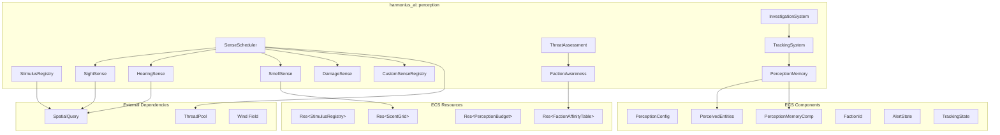
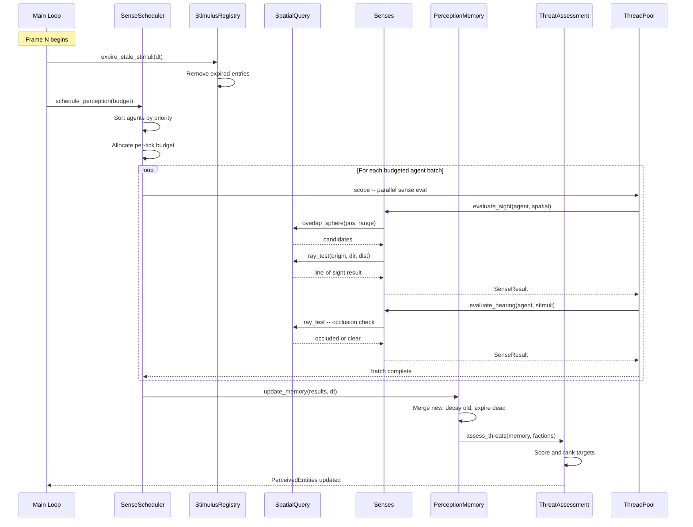
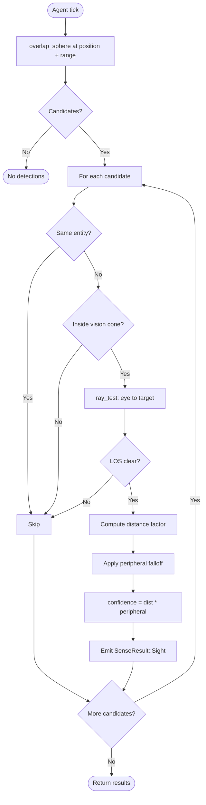
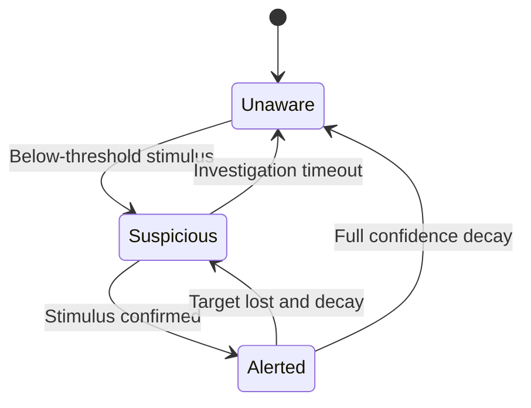
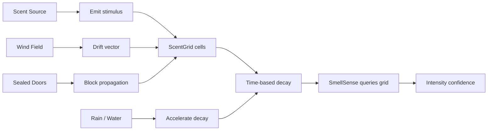
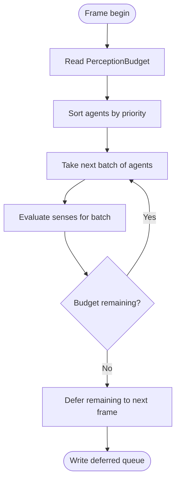
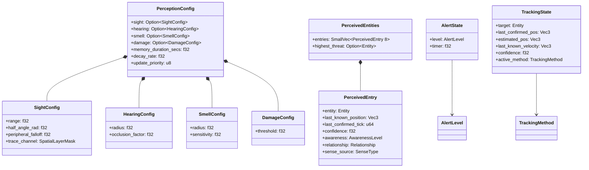

# AI Perception Design

## Requirements Trace

> **Canonical sources:** Features, requirements, and user
> stories are defined in [features/ai/](../../features/ai/),
> [requirements/ai/](../../requirements/ai/), and
> [user-stories/ai/](../../user-stories/ai/). The table
> below traces design elements to those definitions.

### Core Senses (F-7.6.1--4 / R-7.6.1--4)

| Feature | Requirement | Description |
|---------|-------------|-------------|
| F-7.6.1 | R-7.6.1 | Sight sense: vision cone (range, half-angle, falloff) + LOS raycast |
| F-7.6.2 | R-7.6.2 | Hearing sense: spherical radius, distance attenuation, geometry occlusion |
| F-7.6.3 | R-7.6.3 | Damage sense: instant event, bypasses range/LOS, direction + magnitude |
| F-7.6.4 | R-7.6.4 | Faction awareness: affinity table, runtime modification, perception filters |

### Stimulus Management (F-7.6.5--7 / R-7.6.5--7)

| Feature | Requirement | Description |
|---------|-------------|-------------|
| F-7.6.5 | R-7.6.5 | Global stimulus registry with spatial queries, TTL expiration, platform caps |
| F-7.6.6 | R-7.6.6 | Perception memory: confidence decay, per-archetype retention, last-known position |
| F-7.6.7 | R-7.6.7 | Custom senses via trait, budget-based scheduler, priority deferral |

### Environmental Awareness (F-7.6.8--11 / R-7.6.8--11)

| Feature | Requirement | Description |
|---------|-------------|-------------|
| F-7.6.8 | R-7.6.8 | Smell sense: scent grid, wind drift, trail following, rain dilution |
| F-7.6.9 | R-7.6.9 | Environmental evidence: footprints, blood, broken vegetation, tracking inferences |
| F-7.6.10 | R-7.6.10 | Investigation behavior: stimulus-type routing, alert state machine, multi-agent claiming |
| F-7.6.11 | R-7.6.11 | Multi-sense tracking: seamless transitions, confidence decay, pack data sharing |

---

## Overview

The AI perception subsystem gives NPC entities the ability
to sense the game world through sight, hearing, smell,
damage, and custom senses. All perception data lives as ECS
components. All logic runs as ECS systems.

The subsystem has four layers:

1. **Stimulus layer** -- a global registry where gameplay
   systems broadcast events (noise, flash, scent). Stimuli
   carry type, intensity, position, radius, and TTL.
2. **Sense evaluation layer** -- per-agent sense checks
   (vision cone + LOS raycast, spherical hearing, scent
   grid queries, damage events) that produce raw
   `SenseResult` values.
3. **Memory layer** -- merges raw results into a persistent
   `PerceivedEntities` component per agent with confidence
   decay, last-known position, and awareness levels.
4. **Decision layer** -- threat assessment, target
   selection, alert state transitions, investigation
   behavior, and multi-sense tracking.

Sense evaluation uses the shared `SpatialQuery` API for all
raycasts and overlap tests. A budget-based scheduler
spreads perception updates across frames so not every agent
runs every tick. The scent system uses a dedicated
`ScentGrid` (uniform grid separate from the BVH) optimized
for density queries and wind-driven propagation.

---

## Architecture

### Module Boundaries



### File Layout

```
harmonius_ai/
└── perception/
    ├── mod.rs            # Public re-exports
    ├── components.rs     # PerceptionConfig,
    │                     # PerceivedEntities,
    │                     # AlertState, FactionId,
    │                     # TrackingState
    ├── stimulus.rs       # Stimulus, StimulusRegistry,
    │                     # StimulusHandle
    ├── senses/
    │   ├── mod.rs        # SenseEvaluator trait,
    │   │                 # SenseResult
    │   ├── sight.rs      # SightSense evaluation
    │   ├── hearing.rs    # HearingSense evaluation
    │   ├── smell.rs      # SmellSense, ScentGrid
    │   ├── damage.rs     # DamageSense evaluation
    │   └── custom.rs     # CustomSenseRegistry,
    │                     # CustomSense trait
    ├── memory.rs         # PerceptionMemory system,
    │                     # confidence decay
    ├── faction.rs        # FactionAffinityTable,
    │                     # Relationship queries
    ├── scheduler.rs      # SenseScheduler,
    │                     # PerceptionBudget,
    │                     # round-robin deferral
    ├── threat.rs         # ThreatAssessment,
    │                     # target scoring
    ├── tracking.rs       # TrackingSystem,
    │                     # multi-sense transitions
    ├── investigation.rs  # InvestigationSystem,
    │                     # alert state machine
    └── evidence.rs       # EnvironmentalEvidence,
                          # footprint generation
```

### Frame Lifecycle



### Sight Sense Evaluation



### Alert State Machine



### Scent Propagation



### Budget Scheduling



### ECS Data Model



---

## API Design

### Sense Result and Sense Type

```rust
/// Identifies the sense that produced a detection.
#[derive(Clone, Copy, Debug, PartialEq, Eq, Hash)]
pub enum SenseType {
    Sight,
    Hearing,
    Smell,
    Damage,
    Touch,
    /// Project-specific sense registered at runtime.
    Custom(u16),
}

/// Raw output from a single sense evaluation.
/// Converted into PerceivedEntry by the memory
/// system.
#[derive(Clone, Debug)]
pub struct SenseResult {
    /// The entity that was sensed.
    pub entity: Entity,
    /// World-space position of the sensed entity
    /// at detection time.
    pub position: Vec3,
    /// Detection confidence in [0.0, 1.0]. Higher
    /// values indicate stronger/closer stimuli.
    pub confidence: f32,
    /// Which sense produced this result.
    pub sense_type: SenseType,
    /// Direction from the perceiver to the sensed
    /// entity. Normalized.
    pub direction: Vec3,
    /// Distance from perceiver to sensed entity.
    pub distance: f32,
}
```

### ECS Components

```rust
/// Per-agent perception configuration. Determines
/// which senses are active and their parameters.
#[derive(Component, Clone, Debug)]
pub struct PerceptionConfig {
    /// Vision cone parameters. None = no sight.
    pub sight: Option<SightConfig>,
    /// Hearing radius parameters. None = no hearing.
    pub hearing: Option<HearingConfig>,
    /// Scent detection parameters. None = no smell.
    pub smell: Option<SmellConfig>,
    /// Damage sense parameters. None = no damage
    /// sense (unusual but allowed).
    pub damage: Option<DamageConfig>,
    /// How long (seconds) this agent retains
    /// perception memories before full decay.
    pub memory_duration_secs: f32,
    /// Confidence decay rate per second. Applied
    /// when a stimulus is not re-confirmed.
    pub decay_rate: f32,
    /// Scheduler priority. 0 = highest (updated
    /// every tick). 255 = lowest (deferred when
    /// budget is tight).
    pub update_priority: u8,
}

#[derive(Clone, Debug)]
pub struct SightConfig {
    /// Maximum detection range in world units.
    pub range: f32,
    /// Half-angle of the vision cone in radians.
    /// Full cone = 2 * half_angle.
    pub half_angle_rad: f32,
    /// Peripheral falloff exponent. Higher values
    /// reduce confidence at cone edges faster.
    /// 1.0 = linear, 2.0 = quadratic.
    pub peripheral_falloff: f32,
    /// Spatial layer mask for LOS raycasts. Allows
    /// glass to block some NPCs but not others.
    pub trace_channel: SpatialLayerMask,
}

#[derive(Clone, Debug)]
pub struct HearingConfig {
    /// Maximum hearing radius in world units.
    pub radius: f32,
    /// Attenuation factor for geometry occlusion.
    /// 0.0 = fully blocked, 1.0 = no occlusion.
    /// Applied multiplicatively per wall hit.
    pub occlusion_factor: f32,
}

#[derive(Clone, Debug)]
pub struct SmellConfig {
    /// Maximum detection radius for scent queries.
    pub radius: f32,
    /// Sensitivity multiplier. Higher values detect
    /// weaker scents. 1.0 = normal.
    pub sensitivity: f32,
}

#[derive(Clone, Debug)]
pub struct DamageConfig {
    /// Minimum damage magnitude to trigger the
    /// damage sense. Below this threshold, the
    /// event is ignored (trivial chip damage).
    pub threshold: f32,
}

/// The agent's faction identifier. Used with the
/// FactionAffinityTable to determine relationships.
#[derive(Component, Clone, Copy, Debug, PartialEq, Eq)]
pub struct FactionId {
    pub faction: u16,
}

/// Optional per-entity faction override. When
/// present, takes precedence over the faction
/// default from the affinity table.
#[derive(Component, Clone, Copy, Debug)]
pub struct FactionOverride {
    /// Target faction this override applies to.
    pub target_faction: u16,
    /// Overridden relationship.
    pub relationship: Relationship,
}

/// Current alert level and timer for an AI agent.
#[derive(Component, Clone, Debug)]
pub struct AlertState {
    pub level: AlertLevel,
    /// Seconds remaining in current state before
    /// timeout-driven transition. For Suspicious:
    /// returns to Unaware. For Alerted: decays to
    /// Suspicious.
    pub timer: f32,
}

#[derive(Clone, Copy, Debug, PartialEq, Eq)]
pub enum AlertLevel {
    /// Normal state. Agent follows patrol/idle.
    Unaware,
    /// Agent detected a below-threshold stimulus
    /// and is investigating.
    Suspicious,
    /// Agent has confirmed a threat. Full combat
    /// or flee response.
    Alerted,
}

/// The perception output: all currently known
/// entities for this agent, ranked by threat.
#[derive(Component, Clone, Debug)]
pub struct PerceivedEntities {
    /// All known targets, sorted by threat score
    /// descending.
    pub entries: SmallVec<[PerceivedEntry; 8]>,
    /// Cached highest-threat entity for fast access
    /// by decision systems.
    pub highest_threat: Option<Entity>,
}

/// A single perceived entity with confidence and
/// awareness metadata.
#[derive(Clone, Debug)]
pub struct PerceivedEntry {
    /// The perceived entity.
    pub entity: Entity,
    /// Last confirmed world position.
    pub last_known_position: Vec3,
    /// Tick number when this entry was last
    /// confirmed by any sense.
    pub last_confirmed_tick: u64,
    /// Current confidence in [0.0, 1.0]. Decays
    /// over time without re-confirmation.
    pub confidence: f32,
    /// How well the agent knows this entity.
    pub awareness: AwarenessLevel,
    /// Relationship to this entity (hostile,
    /// neutral, friendly).
    pub relationship: Relationship,
    /// Which sense most recently confirmed this
    /// entry.
    pub sense_source: SenseType,
}

/// Progressive awareness levels. Higher levels
/// provide more information to decision systems.
#[derive(
    Clone, Copy, Debug, PartialEq, Eq, PartialOrd, Ord,
)]
pub enum AwarenessLevel {
    /// Entity is not currently detected.
    Undetected,
    /// Agent has a vague sense (e.g., heard
    /// something) but no confirmed identity.
    Sensed,
    /// Entity is detected with a known position
    /// but identity may be uncertain.
    Detected,
    /// Entity is fully identified. All information
    /// (faction, type, threat level) is available.
    Identified,
}

/// Faction relationship between two entities.
#[derive(Clone, Copy, Debug, PartialEq, Eq)]
pub enum Relationship {
    Hostile,
    Neutral,
    Friendly,
}
```

### Stimulus Registry

```rust
/// A perception event broadcast by gameplay systems.
/// Registered in the global StimulusRegistry.
#[derive(Clone, Debug)]
pub struct Stimulus {
    /// Unique handle for removal or querying.
    pub handle: StimulusHandle,
    /// What kind of stimulus this is.
    pub stimulus_type: StimulusType,
    /// World-space origin of the stimulus.
    pub position: Vec3,
    /// Maximum radius of effect in world units.
    pub radius: f32,
    /// Intensity in [0.0, 1.0]. Determines base
    /// detection confidence before attenuation.
    pub intensity: f32,
    /// Seconds remaining before expiration.
    pub ttl: f32,
    /// Entity that created this stimulus, if known.
    pub source_entity: Option<Entity>,
    /// Faction of the source, if known.
    pub source_faction: Option<u16>,
}

/// Opaque handle to a registered stimulus.
#[derive(Clone, Copy, Debug, PartialEq, Eq, Hash)]
pub struct StimulusHandle {
    index: u32,
    generation: u32,
}

/// Built-in stimulus categories.
#[derive(Clone, Copy, Debug, PartialEq, Eq, Hash)]
pub enum StimulusType {
    /// Visual flash, movement, etc.
    Visual,
    /// Footstep, gunfire, explosion, speech.
    Auditory,
    /// Scent trail point, ambient odor.
    Olfactory,
    /// Direct damage received.
    Damage,
    /// Physical contact or proximity trigger.
    Touch,
    /// Project-specific stimulus type.
    Custom(u16),
}

/// Global spatial stimulus registry. Stored as
/// ECS resource: `Res<StimulusRegistry>`.
///
/// Gameplay systems register stimuli; perception
/// systems query them spatially; the registry
/// expires stale entries automatically.
pub struct StimulusRegistry {
    stimuli: Vec<Stimulus>,
    free_list: Vec<u32>,
    generation: Vec<u32>,
    /// Platform-dependent cap. Mobile: 256,
    /// desktop: 2048.
    max_stimuli: u32,
    active_count: u32,
}

impl StimulusRegistry {
    pub fn new(max_stimuli: u32) -> Self;

    /// Register a new stimulus. Returns None if
    /// the registry is at capacity.
    pub fn register(
        &mut self,
        stimulus_type: StimulusType,
        position: Vec3,
        radius: f32,
        intensity: f32,
        ttl_secs: f32,
        source_entity: Option<Entity>,
        source_faction: Option<u16>,
    ) -> Option<StimulusHandle>;

    /// Remove a stimulus before its TTL expires.
    pub fn remove(
        &mut self,
        handle: StimulusHandle,
    ) -> Result<(), PerceptionError>;

    /// Tick all stimuli, decrementing TTL by dt.
    /// Removes expired entries.
    pub fn expire_stale(
        &mut self,
        dt: f32,
    ) -> u32;

    /// Query all active stimuli within a sphere.
    pub fn query_sphere(
        &self,
        center: Vec3,
        radius: f32,
    ) -> Vec<&Stimulus>;

    /// Query stimuli of a specific type within a
    /// sphere.
    pub fn query_sphere_typed(
        &self,
        center: Vec3,
        radius: f32,
        stimulus_type: StimulusType,
    ) -> Vec<&Stimulus>;

    pub fn active_count(&self) -> u32;
    pub fn capacity(&self) -> u32;
}
```

### Sense Evaluator Trait

```rust
/// Trait for all sense implementations (built-in
/// and custom). Each sense evaluates a single
/// agent against the world and produces zero or
/// more SenseResult values.
///
/// Senses are stateless functions: all state lives
/// in ECS components. This enables parallel
/// evaluation across agents.
pub trait SenseEvaluator {
    /// Evaluate this sense for a single agent.
    /// Returns all entities detected by this sense.
    ///
    /// Parameters:
    /// - agent: the perceiving entity
    /// - agent_pos: agent's world position
    /// - agent_forward: agent's forward direction
    /// - config: agent's perception configuration
    /// - spatial: shared spatial query interface
    /// - stimuli: global stimulus registry
    fn evaluate(
        &self,
        agent: Entity,
        agent_pos: Vec3,
        agent_forward: Vec3,
        config: &PerceptionConfig,
        spatial: &QueryEngine<'_>,
        stimuli: &StimulusRegistry,
    ) -> SmallVec<[SenseResult; 8]>;

    /// Declared processing cost for budget
    /// scheduling. Units: microseconds estimated
    /// per agent.
    fn cost_estimate(&self) -> u32;

    /// Priority level. Lower = higher priority.
    /// Built-in senses: 0. Custom senses: 100+.
    fn priority(&self) -> u32;

    /// The sense type this evaluator produces.
    fn sense_type(&self) -> SenseType;
}
```

### Sight Sense

```rust
/// Sight sense evaluator. Detects entities within
/// a vision cone, confirmed by line-of-sight
/// raycast against the shared spatial index.
pub struct SightSense;

impl SenseEvaluator for SightSense {
    fn evaluate(
        &self,
        agent: Entity,
        agent_pos: Vec3,
        agent_forward: Vec3,
        config: &PerceptionConfig,
        spatial: &QueryEngine<'_>,
        _stimuli: &StimulusRegistry,
    ) -> SmallVec<[SenseResult; 8]> {
        let sight = match &config.sight {
            Some(s) => s,
            None => return SmallVec::new(),
        };

        let mut results = SmallVec::new();

        // Step 1: broad-phase sphere overlap
        let query_config = QueryConfig {
            layer_mask: SpatialLayerMask::AI_PERCEPTION,
            max_results: 0,
            sort: QuerySort::Unsorted,
        };
        let candidates = spatial.overlap_sphere(
            agent_pos,
            sight.range,
            &query_config,
        );

        for hit in &candidates {
            // Skip self
            if hit.entity == agent {
                continue;
            }

            let to_target = hit.point - agent_pos;
            let distance = to_target.length();
            if distance < f32::EPSILON {
                continue;
            }
            let dir = to_target / distance;

            // Step 2: vision cone check
            let cos_angle =
                agent_forward.dot(dir);
            let cos_half =
                sight.half_angle_rad.cos();
            if cos_angle < cos_half {
                continue; // outside cone
            }

            // Step 3: line-of-sight raycast
            let los_clear = !spatial.ray_test(
                agent_pos,
                dir,
                distance,
                sight.trace_channel,
            );
            if !los_clear {
                continue; // blocked by geometry
            }

            // Step 4: confidence from distance
            // and peripheral angle
            let dist_factor =
                1.0 - (distance / sight.range);

            // Peripheral falloff: 1.0 at center,
            // 0.0 at cone edge
            let angle_ratio = if cos_half < 1.0 {
                (cos_angle - cos_half)
                    / (1.0 - cos_half)
            } else {
                1.0
            };
            let peripheral_factor = angle_ratio
                .powf(sight.peripheral_falloff);

            let confidence =
                dist_factor * peripheral_factor;

            results.push(SenseResult {
                entity: hit.entity,
                position: hit.point,
                confidence: confidence.clamp(0.0, 1.0),
                sense_type: SenseType::Sight,
                direction: dir,
                distance,
            });
        }

        results
    }

    fn cost_estimate(&self) -> u32 { 50 }
    fn priority(&self) -> u32 { 0 }
    fn sense_type(&self) -> SenseType {
        SenseType::Sight
    }
}
```

### Hearing Sense

```rust
/// Hearing sense evaluator. Detects auditory
/// stimuli within a spherical radius with distance
/// attenuation and geometry occlusion.
pub struct HearingSense;

impl SenseEvaluator for HearingSense {
    fn evaluate(
        &self,
        agent: Entity,
        agent_pos: Vec3,
        _agent_forward: Vec3,
        config: &PerceptionConfig,
        spatial: &QueryEngine<'_>,
        stimuli: &StimulusRegistry,
    ) -> SmallVec<[SenseResult; 8]> {
        let hearing = match &config.hearing {
            Some(h) => h,
            None => return SmallVec::new(),
        };

        let mut results = SmallVec::new();

        // Query auditory stimuli within range
        let nearby = stimuli.query_sphere_typed(
            agent_pos,
            hearing.radius,
            StimulusType::Auditory,
        );

        for stim in &nearby {
            let to_source = stim.position - agent_pos;
            let distance = to_source.length();
            if distance < f32::EPSILON {
                continue;
            }
            let dir = to_source / distance;

            // Distance attenuation: inverse-square
            let max_r = hearing.radius;
            let dist_atten =
                1.0 - (distance / max_r).min(1.0);
            let dist_atten =
                dist_atten * dist_atten;

            // Geometry occlusion check via raycast
            let occluded = spatial.ray_test(
                agent_pos,
                dir,
                distance,
                SpatialLayerMask::PHYSICS,
            );
            let occlusion = if occluded {
                hearing.occlusion_factor
            } else {
                1.0
            };

            let confidence =
                stim.intensity
                * dist_atten
                * occlusion;

            if confidence > 0.01 {
                results.push(SenseResult {
                    entity: stim.source_entity
                        .unwrap_or(Entity::PLACEHOLDER),
                    position: stim.position,
                    confidence:
                        confidence.clamp(0.0, 1.0),
                    sense_type: SenseType::Hearing,
                    direction: dir,
                    distance,
                });
            }
        }

        results
    }

    fn cost_estimate(&self) -> u32 { 30 }
    fn priority(&self) -> u32 { 0 }
    fn sense_type(&self) -> SenseType {
        SenseType::Hearing
    }
}
```

### Damage Sense

```rust
/// Damage sense evaluator. Instantly registers
/// incoming damage as a high-priority perception
/// event. Bypasses range and LOS.
///
/// Damage events are read from an ECS event queue
/// rather than the stimulus registry, since they
/// are targeted at a specific entity.
pub struct DamageSense;

/// ECS event emitted by the combat system when
/// an entity takes damage.
#[derive(Clone, Debug)]
pub struct DamageEvent {
    /// Entity that received damage.
    pub target: Entity,
    /// Entity that dealt damage, if known.
    pub attacker: Option<Entity>,
    /// World-space direction the damage came from.
    pub direction: Vec3,
    /// Damage magnitude.
    pub magnitude: f32,
}

impl DamageSense {
    /// Process damage events for a specific agent.
    /// Not implemented via SenseEvaluator trait
    /// because damage sense is event-driven, not
    /// polled.
    pub fn process_events(
        agent: Entity,
        config: &DamageConfig,
        events: &[DamageEvent],
    ) -> SmallVec<[SenseResult; 4]> {
        let mut results = SmallVec::new();

        for event in events {
            if event.target != agent {
                continue;
            }
            if event.magnitude < config.threshold {
                continue;
            }

            results.push(SenseResult {
                entity: event.attacker
                    .unwrap_or(Entity::PLACEHOLDER),
                position: Vec3::ZERO, // unknown
                confidence: 1.0, // always max
                sense_type: SenseType::Damage,
                direction: event.direction,
                distance: 0.0, // unknown
            });
        }

        results
    }
}
```

### Scent Grid and Smell Sense

```rust
/// A uniform spatial grid for scent propagation.
/// Separate from the shared BVH because scent
/// requires density-based diffusion queries, not
/// ray/overlap tests.
///
/// Stored as ECS resource: `Res<ScentGrid>`.
pub struct ScentGrid {
    cells: Vec<ScentCell>,
    cell_size: f32,
    dimensions: UVec3,
    origin: Vec3,
}

#[derive(Clone, Debug, Default)]
pub struct ScentCell {
    /// Active scent layers in this cell, sorted
    /// by intensity descending.
    pub scents: SmallVec<[ScentEntry; 4]>,
}

#[derive(Clone, Debug)]
pub struct ScentEntry {
    /// The type of scent (blood, footstep, etc.).
    pub scent_type: ScentType,
    /// Current intensity in [0.0, 1.0].
    pub intensity: f32,
    /// Decay rate per second.
    pub decay_rate: f32,
    /// Source entity, if known.
    pub source_entity: Option<Entity>,
    /// Tick when this entry was deposited.
    pub deposit_tick: u64,
}

#[derive(
    Clone, Copy, Debug, PartialEq, Eq, Hash,
)]
pub enum ScentType {
    Blood,
    Footstep,
    Smoke,
    Food,
    Chemical,
    Custom(u16),
}

/// Scent trail persistence per type.
pub struct ScentConfig {
    /// Seconds before a scent type fully decays.
    pub persistence: HashMap<ScentType, f32>,
    /// Grid cell size in world units.
    pub cell_size: f32,
    /// Grid dimensions (cells per axis).
    pub dimensions: UVec3,
}

impl ScentGrid {
    pub fn new(config: &ScentConfig) -> Self;

    /// Deposit scent into the grid cell containing
    /// the given position.
    pub fn deposit(
        &mut self,
        position: Vec3,
        scent_type: ScentType,
        intensity: f32,
        decay_rate: f32,
        source_entity: Option<Entity>,
        tick: u64,
    );

    /// Propagate scent by one time step. Applies
    /// wind drift, diffusion to adjacent cells,
    /// time decay, and rain dilution.
    pub fn propagate(
        &mut self,
        dt: f32,
        wind_direction: Vec3,
        wind_speed: f32,
        rain_intensity: f32,
    );

    /// Query the strongest scent of any type within
    /// a sphere. Returns entries sorted by
    /// intensity descending.
    pub fn query_sphere(
        &self,
        center: Vec3,
        radius: f32,
    ) -> Vec<(Vec3, &ScentEntry)>;

    /// Query scent of a specific type within a
    /// sphere.
    pub fn query_sphere_typed(
        &self,
        center: Vec3,
        radius: f32,
        scent_type: ScentType,
    ) -> Vec<(Vec3, &ScentEntry)>;

    /// Check if a cell is blocked (sealed door).
    /// Blocked cells do not propagate scent.
    pub fn set_blocked(
        &mut self,
        cell_coord: UVec3,
        blocked: bool,
    );

    /// Tick: decay all entries and remove expired.
    pub fn tick(&mut self, dt: f32) -> u32;
}
```

### Faction Affinity Table

```rust
/// Global faction relationship table. Stored as
/// ECS resource: `Res<FactionAffinityTable>`.
///
/// Relationships are stored as a 2D lookup table
/// indexed by (perceiver_faction, target_faction).
/// Default relationship for unregistered pairs is
/// Neutral.
pub struct FactionAffinityTable {
    /// Flat array indexed by
    /// [perceiver * max_factions + target].
    relationships: Vec<Relationship>,
    max_factions: u16,
}

impl FactionAffinityTable {
    pub fn new(max_factions: u16) -> Self;

    /// Get the relationship from perceiver's
    /// faction toward target's faction.
    pub fn get(
        &self,
        perceiver: u16,
        target: u16,
    ) -> Relationship;

    /// Set the relationship. Both directions can
    /// be set independently.
    pub fn set(
        &mut self,
        perceiver: u16,
        target: u16,
        relationship: Relationship,
    );

    /// Set a symmetric relationship (both
    /// directions at once).
    pub fn set_symmetric(
        &mut self,
        faction_a: u16,
        faction_b: u16,
        relationship: Relationship,
    );

    /// Query relationship, checking for per-entity
    /// overrides first.
    pub fn query(
        &self,
        perceiver_faction: u16,
        target_faction: u16,
        overrides: Option<&[FactionOverride]>,
    ) -> Relationship;
}
```

### Perception Memory System

```rust
/// Manages the PerceivedEntities component for
/// each agent. Merges new SenseResults into
/// persistent memory, decays stale entries, and
/// removes expired ones.
pub struct PerceptionMemorySystem;

impl PerceptionMemorySystem {
    /// Update perception memory for a single agent.
    ///
    /// 1. Merge new SenseResults: if an entity is
    ///    already known, update its position and
    ///    reset confidence. If new, add it.
    /// 2. Decay: reduce confidence of all entries
    ///    not refreshed this tick by
    ///    `decay_rate * dt`.
    /// 3. Expire: remove entries with confidence
    ///    <= 0.0.
    /// 4. Update awareness level based on
    ///    confidence thresholds.
    pub fn update_agent(
        perceived: &mut PerceivedEntities,
        config: &PerceptionConfig,
        new_results: &[SenseResult],
        factions: &FactionAffinityTable,
        agent_faction: u16,
        current_tick: u64,
        dt: f32,
    ) {
        // Merge new results
        for result in new_results {
            if let Some(entry) =
                perceived.entries.iter_mut().find(
                    |e| e.entity == result.entity,
                )
            {
                // Refresh existing entry
                entry.last_known_position =
                    result.position;
                entry.last_confirmed_tick =
                    current_tick;
                entry.confidence = entry
                    .confidence
                    .max(result.confidence);
                entry.sense_source =
                    result.sense_type;
            } else {
                // New entry
                let target_faction = 0; // lookup
                let rel = factions.get(
                    agent_faction,
                    target_faction,
                );
                perceived.entries.push(
                    PerceivedEntry {
                        entity: result.entity,
                        last_known_position:
                            result.position,
                        last_confirmed_tick:
                            current_tick,
                        confidence:
                            result.confidence,
                        awareness:
                            Self::awareness_from_confidence(
                                result.confidence,
                            ),
                        relationship: rel,
                        sense_source:
                            result.sense_type,
                    },
                );
            }
        }

        // Decay unrefreshed entries
        for entry in &mut perceived.entries {
            if entry.last_confirmed_tick
                < current_tick
            {
                entry.confidence -=
                    config.decay_rate * dt;
                entry.confidence =
                    entry.confidence.max(0.0);
            }
            entry.awareness =
                Self::awareness_from_confidence(
                    entry.confidence,
                );
        }

        // Expire dead entries
        perceived.entries.retain(|e| {
            e.confidence > 0.0
        });

        // Update highest threat
        perceived.highest_threat = perceived
            .entries
            .iter()
            .filter(|e| {
                e.relationship == Relationship::Hostile
            })
            .max_by(|a, b| {
                a.confidence
                    .partial_cmp(&b.confidence)
                    .unwrap_or(std::cmp::Ordering::Equal)
            })
            .map(|e| e.entity);
    }

    fn awareness_from_confidence(
        confidence: f32,
    ) -> AwarenessLevel {
        if confidence >= 0.9 {
            AwarenessLevel::Identified
        } else if confidence >= 0.5 {
            AwarenessLevel::Detected
        } else if confidence > 0.0 {
            AwarenessLevel::Sensed
        } else {
            AwarenessLevel::Undetected
        }
    }
}
```

### Sense Scheduler

```rust
/// Per-frame perception budget. Controls how many
/// agents and senses are evaluated per tick.
/// Stored as ECS resource: `Res<PerceptionBudget>`.
pub struct PerceptionBudget {
    /// Maximum microseconds of perception work per
    /// frame. Mobile: 250, Desktop: 1000.
    pub budget_us: u32,
    /// Number of agents deferred from last frame.
    pub deferred_count: u32,
}

/// Schedules perception evaluation across frames.
/// Agents are sorted by priority. High-priority
/// agents (priority 0) run every tick. Lower
/// priority agents are evaluated round-robin when
/// budget permits.
pub struct SenseScheduler {
    /// Index into the round-robin queue for
    /// deferred agents. Persists across frames.
    round_robin_cursor: u32,
}

impl SenseScheduler {
    pub fn new() -> Self;

    /// Determine which agents to evaluate this
    /// frame within the given budget.
    ///
    /// Returns a list of (entity, priority) pairs
    /// sorted by priority ascending (highest
    /// priority first).
    pub fn select_agents(
        &mut self,
        agents: &[(Entity, u8)],
        budget: &PerceptionBudget,
        cost_per_agent: u32,
    ) -> Vec<Entity>;

    /// Run perception for selected agents using
    /// scoped parallelism on the thread pool.
    ///
    /// Agents within a batch are evaluated in
    /// parallel. Each agent's senses run
    /// sequentially (sight, hearing, smell, damage,
    /// custom) but different agents run on
    /// different worker threads.
    pub fn evaluate_batch(
        &self,
        agents: &[Entity],
        senses: &[&SenseKind],
        spatial: &QueryEngine<'_>,
        stimuli: &StimulusRegistry,
        pool: &ThreadPool,
        // ECS component accessors omitted for
        // brevity -- in practice these are Query
        // parameters from the ECS scheduler.
    ) -> Vec<(Entity, SmallVec<[SenseResult; 8]>)>;
}
```

### Threat Assessment

```rust
/// Scores and ranks perceived entities by threat
/// level. Used by decision systems (behavior trees,
/// GOAP) to select targets.
pub struct ThreatAssessment;

/// Weights for threat score computation.
pub struct ThreatWeights {
    /// Weight for confidence level (0.0--1.0).
    pub confidence_weight: f32,
    /// Weight for proximity (closer = higher).
    pub proximity_weight: f32,
    /// Weight for hostility (hostile > neutral).
    pub hostility_weight: f32,
    /// Weight for recent damage from this entity.
    pub damage_weight: f32,
}

impl Default for ThreatWeights {
    fn default() -> Self {
        Self {
            confidence_weight: 0.3,
            proximity_weight: 0.3,
            hostility_weight: 0.25,
            damage_weight: 0.15,
        }
    }
}

impl ThreatAssessment {
    /// Score a single perceived entry.
    ///
    /// threat = confidence * w_c
    ///        + (1 - dist/max_dist) * w_p
    ///        + hostility_bonus * w_h
    ///        + recent_damage_bonus * w_d
    pub fn score(
        entry: &PerceivedEntry,
        agent_pos: Vec3,
        max_perception_range: f32,
        weights: &ThreatWeights,
    ) -> f32 {
        let dist = entry
            .last_known_position
            .distance(agent_pos);
        let proximity = 1.0
            - (dist / max_perception_range)
                .min(1.0);

        let hostility = match entry.relationship {
            Relationship::Hostile => 1.0,
            Relationship::Neutral => 0.3,
            Relationship::Friendly => 0.0,
        };

        let damage_bonus = if entry.sense_source
            == SenseType::Damage
        {
            1.0
        } else {
            0.0
        };

        entry.confidence
            * weights.confidence_weight
            + proximity * weights.proximity_weight
            + hostility * weights.hostility_weight
            + damage_bonus * weights.damage_weight
    }

    /// Sort perceived entries by threat score
    /// descending. Updates highest_threat.
    pub fn rank_threats(
        perceived: &mut PerceivedEntities,
        agent_pos: Vec3,
        max_range: f32,
        weights: &ThreatWeights,
    ) {
        perceived.entries.sort_by(|a, b| {
            let sa = Self::score(
                a, agent_pos, max_range, weights,
            );
            let sb = Self::score(
                b, agent_pos, max_range, weights,
            );
            sb.partial_cmp(&sa)
                .unwrap_or(std::cmp::Ordering::Equal)
        });

        perceived.highest_threat = perceived
            .entries
            .first()
            .filter(|e| {
                e.relationship
                    == Relationship::Hostile
            })
            .map(|e| e.entity);
    }
}
```

### Tracking System

```rust
/// Multi-sense tracking state for an agent
/// pursuing a target. Stored as an ECS component.
#[derive(Component, Clone, Debug)]
pub struct TrackingState {
    /// The entity being tracked.
    pub target: Entity,
    /// Last position confirmed by any sense.
    pub last_confirmed_pos: Vec3,
    /// Estimated current position via dead
    /// reckoning.
    pub estimated_pos: Vec3,
    /// Last known velocity of the target.
    pub last_known_velocity: Vec3,
    /// Tracking confidence in [0.0, 1.0].
    pub confidence: f32,
    /// Currently active tracking method.
    pub active_method: TrackingMethod,
    /// Which methods this agent supports.
    pub enabled_methods: TrackingMethodMask,
    /// Pack ID for shared tracking data.
    /// 0 = no pack.
    pub pack_id: u32,
}

#[derive(Clone, Copy, Debug, PartialEq, Eq)]
pub enum TrackingMethod {
    Visual,
    Audio,
    Scent,
    Evidence,
    Predictive,
}

/// Bitmask of enabled tracking methods.
#[derive(Clone, Copy, Debug, PartialEq, Eq)]
pub struct TrackingMethodMask(pub u8);

impl TrackingMethodMask {
    pub const VISUAL: Self = Self(1 << 0);
    pub const AUDIO: Self = Self(1 << 1);
    pub const SCENT: Self = Self(1 << 2);
    pub const EVIDENCE: Self = Self(1 << 3);
    pub const PREDICTIVE: Self = Self(1 << 4);

    /// Desktop default: all methods.
    pub const ALL: Self = Self(0x1F);
    /// Mobile: sight + hearing only.
    pub const MOBILE: Self = Self(0x03);

    pub fn contains(&self, method: Self) -> bool {
        (self.0 & method.0) != 0
    }
}

/// Updates TrackingState each frame, transitioning
/// between methods based on sense availability.
pub struct TrackingSystem;

impl TrackingSystem {
    /// Update tracking for a single agent.
    ///
    /// Method selection priority:
    /// 1. Visual -- if target in PerceivedEntities
    ///    with Sight source and confidence >= 0.5
    /// 2. Audio -- if target heard recently
    /// 3. Scent -- if scent trail detected
    /// 4. Evidence -- if footprints/blood found
    /// 5. Predictive -- dead reckoning from last
    ///    known velocity
    ///
    /// If no method yields confidence > 0,
    /// tracking ends and the agent transitions to
    /// search patterns.
    pub fn update(
        tracking: &mut TrackingState,
        perceived: &PerceivedEntities,
        scent_grid: &ScentGrid,
        dt: f32,
    ) {
        // Dead-reckon estimated position
        tracking.estimated_pos +=
            tracking.last_known_velocity * dt;

        // Check if any sense confirms the target
        if let Some(entry) = perceived
            .entries
            .iter()
            .find(|e| e.entity == tracking.target)
        {
            // Refresh from sense data
            tracking.last_confirmed_pos =
                entry.last_known_position;
            tracking.estimated_pos =
                entry.last_known_position;
            tracking.confidence =
                entry.confidence;

            tracking.active_method =
                match entry.sense_source {
                    SenseType::Sight => {
                        TrackingMethod::Visual
                    }
                    SenseType::Hearing => {
                        TrackingMethod::Audio
                    }
                    SenseType::Smell => {
                        TrackingMethod::Scent
                    }
                    _ => tracking.active_method,
                };
        } else {
            // No sense confirms -- decay
            tracking.confidence -= 0.1 * dt;
            tracking.confidence =
                tracking.confidence.max(0.0);
        }
    }

    /// Share tracking data within a pack. One
    /// member's sighting updates all members'
    /// estimated positions.
    pub fn share_pack_data(
        pack_members: &mut [&mut TrackingState],
    ) {
        // Find the member with highest confidence
        let best = pack_members
            .iter()
            .max_by(|a, b| {
                a.confidence
                    .partial_cmp(&b.confidence)
                    .unwrap_or(
                        std::cmp::Ordering::Equal,
                    )
            });

        if let Some(best) = best {
            let pos = best.last_confirmed_pos;
            let conf = best.confidence;
            let vel = best.last_known_velocity;

            for member in pack_members.iter_mut() {
                if member.confidence < conf {
                    member.estimated_pos = pos;
                    member.last_known_velocity = vel;
                    // Shared data has lower
                    // confidence than direct sight
                    member.confidence =
                        (conf * 0.8)
                            .max(member.confidence);
                }
            }
        }
    }
}
```

### Investigation System

```rust
/// Manages investigation behavior when an agent
/// detects a below-threshold stimulus or loses a
/// confirmed target.
pub struct InvestigationSystem;

/// Per-agent investigation state. Added as an ECS
/// component when investigation begins, removed
/// when it ends.
#[derive(Component, Clone, Debug)]
pub struct InvestigationState {
    /// The stimulus being investigated.
    pub stimulus_position: Vec3,
    /// Type of investigation determining behavior.
    pub investigation_type: InvestigationType,
    /// Seconds remaining before timeout.
    pub timeout: f32,
    /// Whether this agent has claimed this
    /// stimulus (prevents other agents from
    /// investigating the same event).
    pub claimed_stimulus: Option<StimulusHandle>,
}

#[derive(Clone, Copy, Debug, PartialEq, Eq)]
pub enum InvestigationType {
    /// Move to sound origin, look around, listen.
    Sound,
    /// Follow scent trail toward increasing
    /// intensity.
    ScentTrail,
    /// Follow footprint chain in travel direction.
    FootprintTrail,
    /// Move to last seen position, scan area.
    VisualGlimpse,
    /// Examine disturbed object, search hiding
    /// spots.
    DisturbedObject,
}

impl InvestigationSystem {
    /// Select investigation type based on the
    /// stimulus that triggered it.
    pub fn select_type(
        sense: SenseType,
    ) -> InvestigationType {
        match sense {
            SenseType::Hearing => {
                InvestigationType::Sound
            }
            SenseType::Smell => {
                InvestigationType::ScentTrail
            }
            SenseType::Sight => {
                InvestigationType::VisualGlimpse
            }
            SenseType::Touch => {
                InvestigationType::DisturbedObject
            }
            _ => InvestigationType::Sound,
        }
    }

    /// Attempt to claim a stimulus for
    /// investigation. Returns true if this agent
    /// is the first to claim it.
    pub fn try_claim(
        stimulus: StimulusHandle,
        claimed_set: &mut HashSet<StimulusHandle>,
    ) -> bool {
        claimed_set.insert(stimulus)
    }

    /// Update investigation state. Handles:
    /// - Timeout countdown
    /// - State machine transitions (Suspicious ->
    ///   Alerted if evidence found, Suspicious ->
    ///   Unaware if timeout)
    /// - Goal position updates for navigation
    pub fn update(
        investigation: &mut InvestigationState,
        alert: &mut AlertState,
        perceived: &PerceivedEntities,
        dt: f32,
    ) {
        investigation.timeout -= dt;

        // Check if investigation found a threat
        let threat_found = perceived
            .entries
            .iter()
            .any(|e| {
                e.relationship
                    == Relationship::Hostile
                    && e.confidence >= 0.5
            });

        if threat_found {
            alert.level = AlertLevel::Alerted;
            alert.timer = 30.0;
        } else if investigation.timeout <= 0.0 {
            alert.level = AlertLevel::Unaware;
            alert.timer = 0.0;
            // Investigation component will be
            // removed by the system.
        }
    }
}
```

### Environmental Evidence

```rust
/// Evidence left by entities in the world.
/// Each evidence instance is an ECS entity.
#[derive(Component, Clone, Debug)]
pub struct EnvironmentalEvidence {
    /// What kind of evidence this is.
    pub evidence_type: EvidenceType,
    /// World-space position.
    pub position: Vec3,
    /// Direction of travel (for footprints).
    pub direction: Vec3,
    /// Timestamp (game time) when spawned.
    pub timestamp: f64,
    /// Source entity that left this evidence.
    pub source_entity: Option<Entity>,
    /// Seconds remaining before decay.
    pub decay_timer: f32,
}

#[derive(Clone, Copy, Debug, PartialEq, Eq)]
pub enum EvidenceType {
    Footprint,
    BloodDrop,
    BrokenVegetation,
    DisturbedObject,
    ShellCasing,
    OpenedDoor,
}

/// AI component enabling evidence detection.
#[derive(Component, Clone, Debug)]
pub struct TrackingSense {
    /// Query radius for nearby evidence.
    pub query_radius: f32,
}

/// Generates footprint evidence when characters
/// traverse deformable surfaces.
pub struct EvidenceSpawner;

impl EvidenceSpawner {
    /// Check if the character's current surface is
    /// deformable and spawn a footprint if
    /// throttle permits.
    ///
    /// Throttle: one footprint per N steps to cap
    /// evidence entity count.
    pub fn try_spawn_footprint(
        entity: Entity,
        position: Vec3,
        forward: Vec3,
        surface_material: u32,
        step_counter: &mut u32,
        throttle_interval: u32,
        deformable_materials: &HashSet<u32>,
    ) -> Option<EnvironmentalEvidence>;

    /// Spawn blood drop evidence for injured
    /// entities.
    pub fn spawn_blood(
        entity: Entity,
        position: Vec3,
        decay_secs: f32,
    ) -> EnvironmentalEvidence;
}
```

### Custom Sense Registration

```rust
/// Trait for project-specific custom senses.
/// Registered at runtime via CustomSenseRegistry.
pub trait CustomSense: SenseEvaluator + Send + Sync {
    /// Unique identifier for this custom sense
    /// type. Must be unique across all registered
    /// custom senses.
    fn custom_id(&self) -> u16;

    /// Human-readable name for debug display.
    fn name(&self) -> &'static str;
}

/// Registry of project-specific senses. Stored as
/// ECS resource: `Res<CustomSenseRegistry>`.
pub struct CustomSenseRegistry {
    senses: Vec<CustomSenseKind>,
}

impl CustomSenseRegistry {
    pub fn new() -> Self;

    /// Register a new custom sense. Returns error
    /// if the custom_id is already registered.
    pub fn register(
        &mut self,
        sense: CustomSenseKind,
    ) -> Result<(), PerceptionError>;

    /// Get all registered custom senses, sorted
    /// by priority ascending.
    pub fn senses(
        &self,
    ) -> &[CustomSenseKind];

    /// Get a specific sense by custom_id.
    pub fn get(
        &self,
        id: u16,
    ) -> Option<&CustomSenseKind>;
}
```

### Error Types

```rust
#[derive(Clone, Debug, PartialEq, Eq)]
pub enum PerceptionError {
    /// Stimulus registry is at capacity.
    RegistryFull {
        capacity: u32,
    },
    /// Invalid stimulus handle (stale generation).
    InvalidHandle {
        handle: StimulusHandle,
    },
    /// Custom sense with this ID is already
    /// registered.
    DuplicateCustomSense {
        id: u16,
    },
    /// Perception budget exceeded (informational,
    /// not fatal).
    BudgetExceeded {
        budget_us: u32,
        elapsed_us: u32,
    },
}
```

---

## Data Flow

### Per-Frame Perception Pipeline

The perception pipeline runs as a sequence of ECS
systems within the frame's task graph. Systems are
ordered via explicit dependencies.

```rust
// System execution order within the frame graph:
//
// 1. StimulusExpirationSystem
//    - Reads: Res<StimulusRegistry>, time delta
//    - Writes: Res<StimulusRegistry>
//    - Removes expired stimuli
//
// 2. ScentPropagationSystem
//    - Reads: Res<ScentGrid>, wind field, weather
//    - Writes: Res<ScentGrid>
//    - Propagates scent, applies decay/rain
//
// 3. EvidenceDecaySystem
//    - Reads: EnvironmentalEvidence components
//    - Writes: despawn expired evidence entities
//
// 4. PerceptionScheduleSystem
//    - Reads: PerceptionConfig, PerceptionBudget
//    - Writes: internal schedule (which agents
//      to evaluate this frame)
//
// 5. SenseEvaluationSystem (parallel)
//    - Reads: PerceptionConfig, Transform,
//      Res<StimulusRegistry>, Res<ScentGrid>,
//      Res<BvhIndex> (via SpatialQuery)
//    - Writes: intermediate SenseResult buffers
//    - Runs sight, hearing, smell, damage, custom
//      for each scheduled agent in parallel
//
// 6. PerceptionMemorySystem
//    - Reads: SenseResult buffers, PerceptionConfig
//    - Writes: PerceivedEntities
//    - Merges new results, decays old, expires dead
//
// 7. ThreatAssessmentSystem
//    - Reads: PerceivedEntities,
//      FactionAffinityTable
//    - Writes: PerceivedEntities (re-sorts entries,
//      updates highest_threat)
//
// 8. AlertStateSystem
//    - Reads: PerceivedEntities, AlertState
//    - Writes: AlertState
//    - Transitions: Unaware <-> Suspicious <->
//      Alerted
//
// 9. TrackingSystem
//    - Reads: PerceivedEntities, TrackingState,
//      ScentGrid
//    - Writes: TrackingState
//    - Updates tracking method transitions, dead
//      reckoning, pack sharing
//
// 10. InvestigationSystem
//     - Reads: AlertState, PerceivedEntities,
//       InvestigationState
//     - Writes: InvestigationState, AlertState
//     - Manages investigation lifecycle
```

### Confidence Decay Curve

Confidence decays linearly when a stimulus is not
re-confirmed. The decay formula is:

```
confidence(t) = max(
    0.0,
    initial_confidence
        - decay_rate * (t - last_confirmed_time)
)
```

Where:
- `initial_confidence`: confidence at last
  confirmation (typically 1.0 for sight, variable
  for hearing/smell)
- `decay_rate`: configured per archetype
  (e.g., 0.1/sec for veterans, 0.3/sec for grunts)
- `t - last_confirmed_time`: seconds since the
  stimulus was last confirmed

Awareness level thresholds:

| Confidence | Awareness Level |
|-----------|-----------------|
| >= 0.9 | Identified |
| >= 0.5 | Detected |
| > 0.0 | Sensed |
| <= 0.0 | Undetected (removed) |

### Hearing Attenuation Formula

```
confidence = intensity * dist_atten * occlusion

where:
    dist_atten = (1 - distance / max_radius)^2
    occlusion  = occlusion_factor  (if wall hit)
               = 1.0               (if clear)
```

### Sight Confidence Formula

```
confidence = dist_factor * peripheral_factor

where:
    dist_factor       = 1 - (distance / range)
    angle_ratio       = (cos(angle) - cos(half_angle))
                        / (1 - cos(half_angle))
    peripheral_factor = angle_ratio ^ falloff_exponent
```

---

## Platform Considerations

### Perception Budget Tiers

| Platform | Budget | Max Stimuli | Scent Grid | Evidence Cap |
|----------|--------|-------------|------------|--------------|
| Mobile | 250 us/frame | 256 | 32x32x8 cells | 128/chunk |
| Desktop | 1000 us/frame | 2048 | 64x64x16 cells | 1024/chunk |
| Server | 2000 us/frame | 4096 | 128x128x32 cells | 4096/chunk |

### Mobile Simplifications

| Feature | Desktop | Mobile |
|---------|---------|--------|
| Tracking methods | All 5 (visual, audio, scent, evidence, predictive) | Sight + hearing only |
| Scent propagation | Full wind drift + accumulation | Disabled |
| Investigation | Full (scent/footprint following) | Move-to-last-known only |
| Memory decay rate | Configured per archetype | 2x faster than desktop |
| Pack tracking size | Unlimited | Capped at 4 |
| Custom sense budget | 1 ms/tick | 0.25 ms/tick |

### Platform-Specific Code

All platform differences are compile-time `cfg`
gated constants, not runtime branches:

```rust
#[cfg(target_os = "ios")]
pub const DEFAULT_PERCEPTION_BUDGET_US: u32 = 250;
#[cfg(target_os = "android")]
pub const DEFAULT_PERCEPTION_BUDGET_US: u32 = 250;
#[cfg(not(any(
    target_os = "ios",
    target_os = "android",
)))]
pub const DEFAULT_PERCEPTION_BUDGET_US: u32 = 1000;

#[cfg(any(
    target_os = "ios",
    target_os = "android",
))]
pub const MAX_STIMULI: u32 = 256;
#[cfg(not(any(
    target_os = "ios",
    target_os = "android",
)))]
pub const MAX_STIMULI: u32 = 2048;

#[cfg(any(
    target_os = "ios",
    target_os = "android",
))]
pub const TRACKING_METHODS: TrackingMethodMask =
    TrackingMethodMask::MOBILE;
#[cfg(not(any(
    target_os = "ios",
    target_os = "android",
)))]
pub const TRACKING_METHODS: TrackingMethodMask =
    TrackingMethodMask::ALL;
```

### Parallelism

Sense evaluation uses `ThreadPool::scope` for
parallel processing. Each agent is an independent
unit of work. Within one agent, senses run
sequentially (sight then hearing then smell then
damage then custom). Across agents, evaluation runs
in parallel on worker threads. The shared
`SpatialQuery` and `StimulusRegistry` are read-only
during evaluation -- no locks required.

The scent grid propagation system runs as a single
parallel-for over grid cells. Each cell's
propagation reads only from its own data and
adjacent cells (read-only neighbors), writing to a
double-buffered output grid. No contention.

---

## Test Plan

### Unit Tests

| Test | Req | Description |
|------|-----|-------------|
| `test_sight_cone_boundary` | R-7.6.1 | Target at cone half-angle detected; 1 degree outside rejected |
| `test_sight_los_blocked` | R-7.6.1 | Target inside cone but behind wall not detected |
| `test_sight_range_boundary` | R-7.6.1 | Target at max range detected; 1 meter beyond rejected |
| `test_sight_trace_channel` | R-7.6.1 | Glass blocks LOS for channel A but not channel B |
| `test_sight_peripheral_falloff` | R-7.6.1 | Confidence at cone edge < confidence at center |
| `test_hearing_distance_attenuation` | R-7.6.2 | Confidence at distance 0 = max; at max radius ~= 0 |
| `test_hearing_occlusion` | R-7.6.2 | Wall between emitter and listener reduces confidence |
| `test_hearing_intensity_scaling` | R-7.6.2 | Gunshot detected at 3x footstep range |
| `test_damage_bypasses_los` | R-7.6.3 | Damage from outside cone + range still detected |
| `test_damage_direction_accuracy` | R-7.6.3 | Reported direction within 5 degrees of actual |
| `test_damage_threshold` | R-7.6.3 | Below-threshold damage ignored |
| `test_faction_hostile_detected` | R-7.6.4 | Hostile faction stimulus not filtered |
| `test_faction_friendly_filtered` | R-7.6.4 | Friendly stimulus filtered when filter enabled |
| `test_faction_runtime_change` | R-7.6.4 | Affinity change immediately affects filtering |
| `test_faction_override_precedence` | R-7.6.4 | Per-entity override beats faction default |
| `test_stimulus_registration` | R-7.6.5 | Register stimulus; spatial query returns it |
| `test_stimulus_expiration` | R-7.6.5 | Stimulus removed after TTL expires |
| `test_stimulus_spatial_filter` | R-7.6.5 | Query at 10 m radius returns only nearby stimuli |
| `test_stimulus_cap_enforced` | R-7.6.5 | Registration returns None at capacity |
| `test_memory_decay_linear` | R-7.6.6 | Confidence decays by decay_rate * dt per second |
| `test_memory_refresh_resets` | R-7.6.6 | Re-confirmation resets confidence to max |
| `test_memory_expiry` | R-7.6.6 | Entry removed when confidence reaches 0 |
| `test_memory_archetype_duration` | R-7.6.6 | 2x memory duration = 2x retention time |
| `test_custom_sense_registration` | R-7.6.7 | Custom sense registered and invoked |
| `test_custom_sense_duplicate_rejected` | R-7.6.7 | Duplicate ID returns error |
| `test_budget_high_priority_always_runs` | R-7.6.7 | Priority-0 agents evaluated every tick |
| `test_budget_low_priority_deferred` | R-7.6.7 | Low-priority deferred when budget exhausted |
| `test_scent_deposit_and_query` | R-7.6.8 | Deposit scent; query returns it within radius |
| `test_scent_decay` | R-7.6.8 | Scent intensity decays at configured rate |
| `test_scent_wind_drift` | R-7.6.8 | Scent detectable farther downwind than upwind |
| `test_scent_blocked_by_door` | R-7.6.8 | Blocked cell prevents scent propagation |
| `test_scent_rain_dilution` | R-7.6.8 | Rain increases decay rate |
| `test_evidence_footprint_spawn` | R-7.6.9 | Footprint on deformable surface; none on hard |
| `test_evidence_decay` | R-7.6.9 | Evidence removed after decay timer |
| `test_evidence_direction_inference` | R-7.6.9 | TrackingSense correctly infers travel direction |
| `test_investigation_claim` | R-7.6.10 | First agent claims stimulus; second continues patrol |
| `test_investigation_timeout` | R-7.6.10 | Investigation ends after timeout; returns to Unaware |
| `test_alert_state_suspicious` | R-7.6.10 | Below-threshold stimulus transitions to Suspicious |
| `test_alert_state_alerted` | R-7.6.10 | Confirmed threat transitions to Alerted |
| `test_tracking_method_transition` | R-7.6.11 | Visual -> Audio when target goes behind wall |
| `test_tracking_confidence_decay` | R-7.6.11 | Confidence decays without stimulus refresh |
| `test_tracking_pack_sharing` | R-7.6.11 | Pack member sighting updates all members |
| `test_threat_score_ranking` | R-7.6.4 | Closer hostile ranked above distant hostile |
| `test_awareness_levels` | R-7.6.6 | Confidence thresholds map to correct levels |

### Integration Tests

| Test | Req | Description |
|------|-----|-------------|
| `test_full_perception_pipeline` | All | Run complete pipeline: register stimulus, schedule evaluation, check PerceivedEntities |
| `test_parallel_500_agents` | R-7.6.1 | 500 agents with sight + hearing, verify correct results under parallel evaluation |
| `test_investigation_to_alert_cycle` | R-7.6.10 | Sound -> Suspicious -> investigate -> find target -> Alerted -> lose target -> Unaware |
| `test_multi_sense_tracking` | R-7.6.11 | Visual tracking -> target hides -> audio -> target quiet -> scent trail -> found |
| `test_mobile_budget_compliance` | R-7.6.7 | 250 us budget, 200 agents: verify high-priority agents run, low-priority deferred |
| `test_scent_trail_following` | R-7.6.8 | Entity walks path, tracker follows scent trail to target |
| `test_footprint_tracking` | R-7.6.9 | Entity walks through snow, tracker follows footprints |
| `test_faction_betrayal_scenario` | R-7.6.4 | Friendly -> hostile affinity change mid-game, verify perception updates |

### Benchmarks

| Benchmark | Target | Source |
|-----------|--------|--------|
| Sight eval, 500 agents, 1000 targets | < 500 us total | US-7.6.1.12 |
| Hearing eval, 500 agents, 200 stimuli | < 200 us total | R-7.6.2 |
| Stimulus registry query, 2048 entries | < 50 us per query | R-7.6.5 |
| Memory decay + expiry, 500 agents | < 100 us total | R-7.6.6 |
| Scent grid propagation, 64x64x16 | < 200 us per step | R-7.6.8 |
| Threat scoring, 500 agents | < 50 us total | R-7.6.4 |
| Full pipeline, 500 agents | < 1000 us (desktop) | R-7.6.7 |

---

## Open Questions

1. **Scent grid vs. BVH for scent queries** -- The
   current design uses a dedicated `ScentGrid`
   separate from the shared BVH. This avoids
   polluting the BVH with thousands of short-lived
   scent entries. However, it introduces a second
   spatial structure. Should scent instead use
   the shared `OctreeIndex` with a dedicated
   spatial layer?

2. **Perception update frequency tuning** -- The
   budget scheduler uses a flat round-robin for
   deferred agents. Should distance-to-player or
   on-screen visibility influence update frequency?
   Closer agents perceive more often; distant
   agents less.

3. **Multi-threaded memory writes** -- Sense
   evaluation runs in parallel, but
   `PerceptionMemorySystem` writes to per-agent
   `PerceivedEntities` components. If two senses
   detect the same target for the same agent,
   merging must be sequential. Current design runs
   all senses for one agent sequentially, agents
   in parallel. This avoids write contention.
   Alternative: parallel senses per agent with
   per-agent merge lock.

4. **Evidence entity budget** -- Environmental
   evidence entities (footprints, blood) compete
   with the ECS entity budget. Should evidence use
   a separate pooled allocation instead of full
   ECS entities? This would reduce archetype
   fragmentation but lose ECS query ergonomics.

5. **Custom sense dynamic dispatch** -- The
   `CustomSenseRegistry` uses `CustomSenseKind`
   (dynamic dispatch) because custom senses are
   registered at runtime. This is the one exception
   to the static dispatch preference. Is there a
   way to avoid this? Possible approach: enum
   dispatch with a fixed set of custom sense slots.

6. **Damage sense as event vs. stimulus** -- Damage
   currently bypasses the `StimulusRegistry` and
   reads from a separate `DamageEvent` queue. This
   is simpler but inconsistent with other senses.
   Should damage go through the registry with
   infinite range and TTL=0?

7. **Scent trail data structure** -- Trails are
   currently implicit (a series of decaying grid
   cells). Should trails be explicit data
   structures (linked list of points) for more
   efficient following? Explicit trails would
   allow the tracker to follow the chain directly
   instead of searching adjacent cells.
