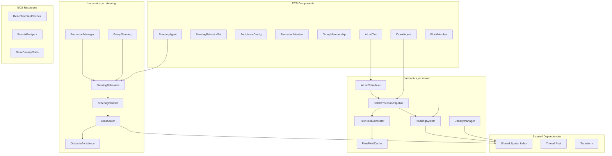
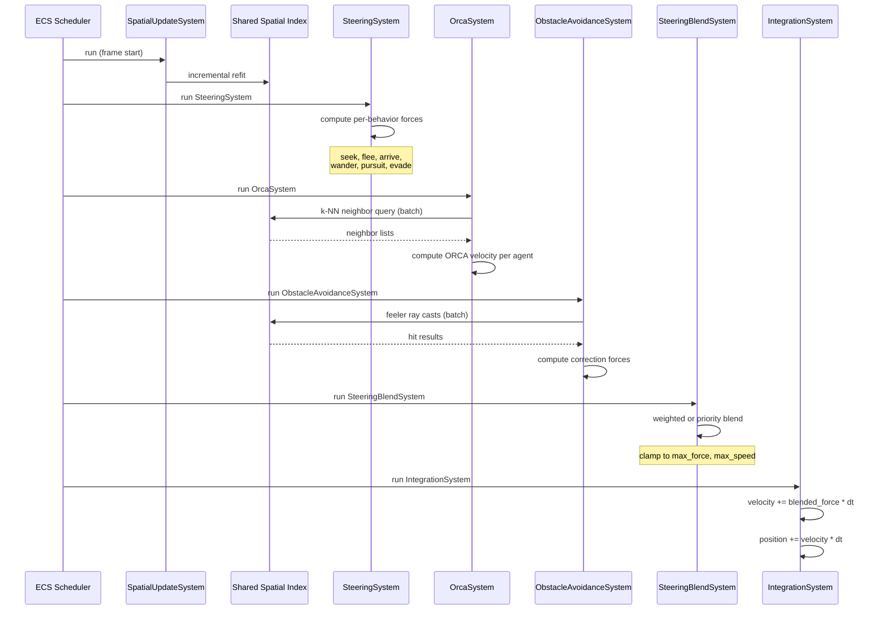
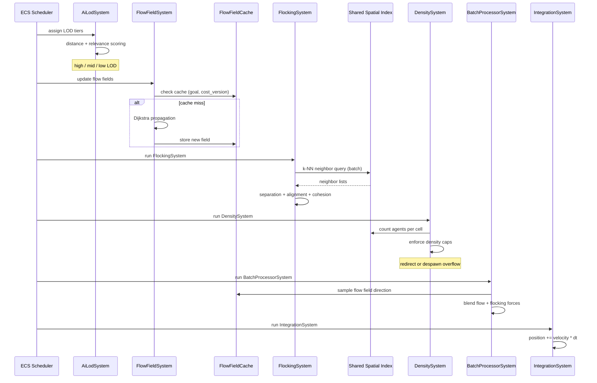
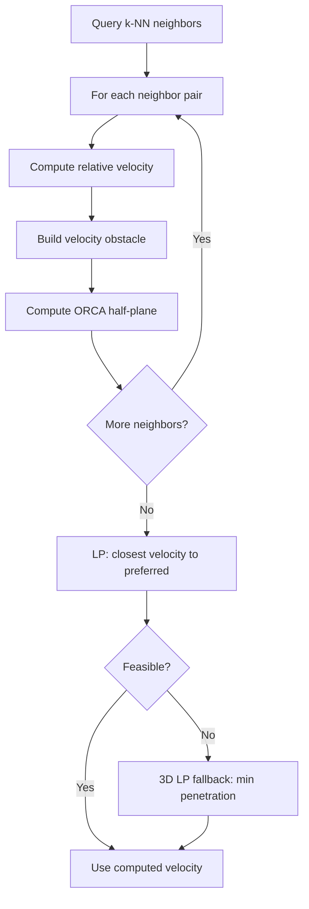
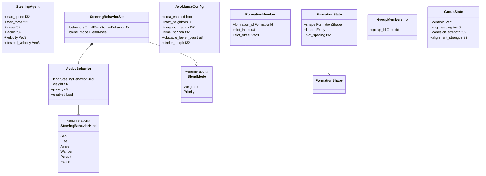
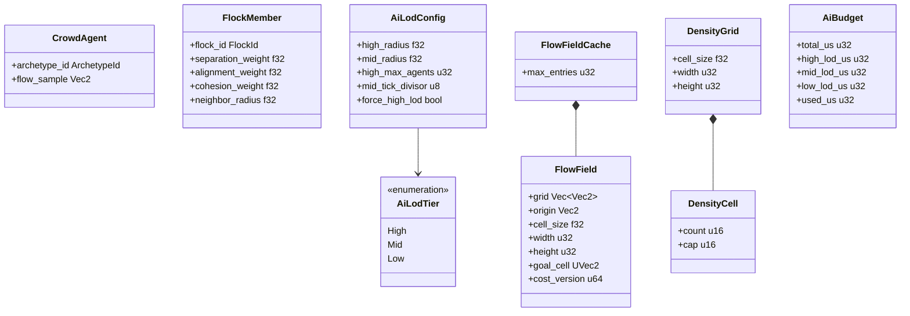
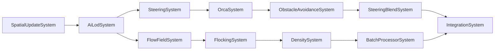

# Steering & Crowd Simulation Design

## Requirements Trace

> **Canonical sources:** Features, requirements, and user stories are defined in
> [features/ai/](../../features/), [requirements/ai/](../../requirements/), and
> [user-stories/ai/](../../user-stories/). The table below traces design elements to those
> definitions.

### Steering & Avoidance (F-7.2 / R-7.2)

| Feature | Requirement |
|---------|-------------|
| F-7.2.1 | R-7.2.1     |
| F-7.2.2 | R-7.2.2     |
| F-7.2.3 | R-7.2.3     |
| F-7.2.4 | R-7.2.4     |
| F-7.2.5 | R-7.2.5     |
| F-7.2.6 | R-7.2.6     |

1. **F-7.2.1** — ORCA local avoidance; deadlock-free velocity computation for dense areas
2. **F-7.2.2** — Feeler-ray obstacle avoidance against static geometry; correction layer after ORCA
3. **F-7.2.3** — Core steering primitives: seek, flee, arrive, wander, pursuit, evade
4. **F-7.2.4** — Weighted and priority-pipeline blending of multiple active behaviors
5. **F-7.2.5** — Formation movement: leader-follower with parameterized slot layouts
6. **F-7.2.6** — Group steering: shared velocity goal, cohesion, alignment corrections

### Crowd Simulation (F-7.7 / R-7.7)

| Feature | Requirement |
|---------|-------------|
| F-7.7.1 | R-7.7.1     |
| F-7.7.2 | R-7.7.2     |
| F-7.7.3 | R-7.7.3     |
| F-7.7.4 | R-7.7.4     |
| F-7.7.5 | R-7.7.5     |
| F-7.7.6 | R-7.7.6     |

1. **F-7.7.1** — Reynolds flocking: separation, alignment, cohesion with tunable weights
2. **F-7.7.2** — Dijkstra flow fields for mass navigation at constant per-agent cost
3. **F-7.7.3** — Tiled flow field streaming and LRU caching keyed by goal + cost version
4. **F-7.7.4** — Mass entity simulation with minimal per-agent state; platform-scaled budgets
5. **F-7.7.5** — AI LOD tiers (high/mid/low) with global budget scheduler
6. **F-7.7.6** — Per-cell density caps with overflow redirect or despawn

### Cross-Cutting Dependencies

| Dependency | Source | Usage |
|------------|--------|-------|
| Shared spatial index | F-1.9 | k-NN neighbor queries, feeler ray casts, density counting |
| Thread pool / scoped tasks | F-14.3 | Parallel batch processing of steering and crowd ticks |
| Transform component | F-1.7 | Position and heading for all agents |
| ECS scheduler | F-1.1 | System ordering and parallel execution |

---

## Overview

The steering and crowd simulation subsystem drives all agent movement in the Harmonius engine. It is
split into two modules:

1. **`harmonius_ai::steering`** -- individual and small-group movement (seek, flee, arrive, ORCA,
   formations).
2. **`harmonius_ai::crowd`** -- mass simulation (flocking, flow fields, LOD, density management).

Both modules are ECS-primary (~90%)-based. All data lives as components; all logic runs as systems.
The shared spatial index (BVH + grid) handles every neighbor query, ray cast, and density count --
no separate data structures.

The steering pipeline runs per-frame for high-LOD agents and at reduced frequency for mid-LOD
agents. Low-LOD agents skip steering entirely and sample flow fields directly. A global budget
scheduler caps total AI CPU time per frame.

---

## Architecture

### Module Boundaries



### Directory Layout

```text
harmonius_ai/
├── steering/
│   ├── agent.rs         # SteeringAgent component
│   ├── behaviors.rs     # seek, flee, arrive, wander,
│   │                    # pursuit, evade
│   ├── blender.rs       # weighted + priority blending
│   ├── orca.rs          # ORCA half-plane solver
│   ├── obstacle.rs      # feeler-ray obstacle avoidance
│   ├── formation.rs     # FormationState, slot layouts
│   ├── group.rs         # GroupState, cohesion tracker
│   └── systems.rs       # ECS systems: SteeringSystem,
│                        # OrcaSystem, BlendSystem, etc.
├── crowd/
│   ├── agent.rs         # CrowdAgent, FlockMember
│   ├── flocking.rs      # Reynolds separation/alignment/
│   │                    # cohesion
│   ├── flow_field.rs    # Dijkstra generator, FlowField
│   ├── flow_cache.rs    # LRU FlowFieldCache
│   ├── mass_entity.rs   # lightweight crowd pipeline
│   ├── lod.rs           # AiLodTier, budget scheduler
│   ├── density.rs       # DensityGrid, cap enforcement
│   └── systems.rs       # ECS systems: FlockingSystem,
│                        # FlowFieldSystem, etc.
└── lib.rs
```

### Steering Pipeline



### Crowd Pipeline



### ORCA Algorithm



### Steering Components (Class Diagram)



### Crowd Components (Class Diagram)



### System Ordering (DAG)



---

## API Design

### Steering Agent

```rust
/// Physical steering parameters for an agent.
/// Attached to every entity that participates in
/// the steering pipeline.
#[derive(Component, Reflect)]
pub struct SteeringAgent {
    /// Maximum movement speed (m/s).
    pub max_speed: f32,
    /// Maximum steering force magnitude (N).
    pub max_force: f32,
    /// Agent mass (kg). Affects force-to-accel.
    pub mass: f32,
    /// Collision radius (m). Used by ORCA and
    /// obstacle avoidance.
    pub radius: f32,
    /// Current velocity (m/s). Written by
    /// IntegrationSystem.
    pub velocity: Vec3,
    /// Desired velocity before avoidance. Written
    /// by SteeringBlendSystem.
    pub desired_velocity: Vec3,
}
```

### Steering Behaviors

```rust
/// The set of active steering behaviors on an
/// agent. Each behavior produces a force vector;
/// the blender combines them.
#[derive(Component, Reflect)]
pub struct SteeringBehaviorSet {
    pub behaviors: SmallVec<[ActiveBehavior; 4]>,
    pub blend_mode: BlendMode,
}

#[derive(Clone, Reflect)]
pub struct ActiveBehavior {
    pub kind: SteeringBehaviorKind,
    /// Blending weight (used in Weighted mode).
    pub weight: f32,
    /// Priority tier (used in Priority mode).
    /// Lower number = higher priority.
    pub priority: u8,
    pub enabled: bool,
}

#[derive(Clone, Reflect)]
pub enum SteeringBehaviorKind {
    /// Steer toward a world-space target.
    Seek { target: Vec3 },
    /// Steer away from a world-space threat.
    Flee { threat: Vec3 },
    /// Steer toward target with smooth deceleration.
    Arrive {
        target: Vec3,
        /// Distance at which deceleration begins.
        decel_radius: f32,
    },
    /// Random wandering constrained to a sphere.
    Wander {
        /// Random displacement per tick.
        jitter: f32,
        /// Radius of the wander sphere.
        radius: f32,
        /// Distance of sphere center from agent.
        distance: f32,
        /// Internal state: current wander target
        /// on the sphere.
        wander_target: Vec3,
    },
    /// Predictive interception of a moving target.
    Pursuit { target_entity: Entity },
    /// Predictive escape from a moving threat.
    Evade { threat_entity: Entity },
}

#[derive(
    Clone, Copy, PartialEq, Eq, Reflect,
)]
pub enum BlendMode {
    /// Weighted sum of all behavior forces.
    Weighted,
    /// Priority pipeline: highest-priority forces
    /// consume available magnitude first.
    Priority,
}
```

### Steering Behavior Functions

```rust
/// Compute a seek force toward `target`.
pub fn seek(
    position: Vec3,
    velocity: Vec3,
    target: Vec3,
    max_speed: f32,
) -> Vec3 {
    let desired = (target - position)
        .normalize_or_zero() * max_speed;
    desired - velocity
}

/// Compute a flee force away from `threat`.
pub fn flee(
    position: Vec3,
    velocity: Vec3,
    threat: Vec3,
    max_speed: f32,
) -> Vec3 {
    let desired = (position - threat)
        .normalize_or_zero() * max_speed;
    desired - velocity
}

/// Compute an arrive force with deceleration.
pub fn arrive(
    position: Vec3,
    velocity: Vec3,
    target: Vec3,
    max_speed: f32,
    decel_radius: f32,
) -> Vec3 {
    let to_target = target - position;
    let dist = to_target.length();
    if dist < f32::EPSILON {
        return -velocity;
    }
    let speed = if dist < decel_radius {
        max_speed * (dist / decel_radius)
    } else {
        max_speed
    };
    let desired =
        (to_target / dist) * speed;
    desired - velocity
}

/// Compute a wander force. Mutates the
/// `wander_target` state on the sphere.
pub fn wander(
    velocity: Vec3,
    max_speed: f32,
    jitter: f32,
    radius: f32,
    distance: f32,
    wander_target: &mut Vec3,
    rng: &mut impl Rng,
) -> Vec3 {
    let jitter_vec = Vec3::new(
        rng.gen_range(-1.0..1.0) * jitter,
        0.0,
        rng.gen_range(-1.0..1.0) * jitter,
    );
    *wander_target =
        (*wander_target + jitter_vec)
            .normalize_or_zero() * radius;
    let heading = velocity
        .normalize_or_zero();
    let center = heading * distance;
    (center + *wander_target)
        .normalize_or_zero() * max_speed
        - velocity
}

/// Compute a pursuit force toward where
/// `target_entity` will be.
pub fn pursuit(
    position: Vec3,
    velocity: Vec3,
    target_pos: Vec3,
    target_vel: Vec3,
    max_speed: f32,
) -> Vec3 {
    let to_target = target_pos - position;
    let look_ahead =
        to_target.length() / max_speed;
    let predicted =
        target_pos + target_vel * look_ahead;
    seek(position, velocity, predicted, max_speed)
}

/// Compute an evade force away from where
/// `threat_entity` will be.
pub fn evade(
    position: Vec3,
    velocity: Vec3,
    threat_pos: Vec3,
    threat_vel: Vec3,
    max_speed: f32,
) -> Vec3 {
    let to_threat = threat_pos - position;
    let look_ahead =
        to_threat.length() / max_speed;
    let predicted =
        threat_pos + threat_vel * look_ahead;
    flee(position, velocity, predicted, max_speed)
}
```

### Steering Blender

```rust
/// Result of blending all active behaviors.
#[derive(Component, Reflect)]
pub struct BlendedSteering {
    pub force: Vec3,
}

/// Blend forces using weighted sum.
pub fn blend_weighted(
    behaviors: &[ActiveBehavior],
    forces: &[Vec3],
    max_force: f32,
) -> Vec3 {
    let mut total = Vec3::ZERO;
    for (b, f) in behaviors.iter().zip(forces) {
        if b.enabled {
            total += *f * b.weight;
        }
    }
    truncate(total, max_force)
}

/// Blend forces using priority pipeline.
/// Highest-priority behaviors consume available
/// force magnitude first.
pub fn blend_priority(
    behaviors: &mut [(ActiveBehavior, Vec3)],
    max_force: f32,
) -> Vec3 {
    behaviors.sort_by_key(|(b, _)| b.priority);
    let mut total = Vec3::ZERO;
    let mut remaining = max_force;
    for (b, f) in behaviors.iter() {
        if !b.enabled || remaining <= 0.0 {
            continue;
        }
        let scaled = truncate(*f * b.weight, remaining);
        remaining -= scaled.length();
        total += scaled;
    }
    total
}

/// Clamp a vector to a maximum magnitude.
fn truncate(v: Vec3, max_len: f32) -> Vec3 {
    let len = v.length();
    if len > max_len && len > f32::EPSILON {
        v * (max_len / len)
    } else {
        v
    }
}
```

### ORCA Local Avoidance

```rust
/// Configuration for ORCA and obstacle avoidance.
#[derive(Component, Reflect)]
pub struct AvoidanceConfig {
    /// Enable ORCA agent-agent avoidance.
    pub orca_enabled: bool,
    /// Max neighbors to consider for ORCA.
    /// Mobile: 4, Desktop: 12.
    pub max_neighbors: u8,
    /// Radius for neighbor search (m).
    pub neighbor_radius: f32,
    /// Time horizon for velocity obstacles (s).
    pub time_horizon: f32,
    /// Number of feeler rays for static obstacles.
    /// Mobile: 2, Desktop: 5.
    pub obstacle_feeler_count: u8,
    /// Length of feeler rays (m).
    pub feeler_length: f32,
}

/// ORCA half-plane constraint.
struct OrcaPlane {
    /// Point on the half-plane boundary.
    point: Vec2,
    /// Inward-pointing normal (valid region).
    normal: Vec2,
}

/// Compute the ORCA-safe velocity for one agent
/// given its neighbors.
///
/// 1. For each neighbor, compute the velocity
///    obstacle (VO) and derive the ORCA
///    half-plane.
/// 2. Solve a 2D linear program to find the
///    velocity closest to `preferred_vel` that
///    satisfies all half-plane constraints.
/// 3. If infeasible, fall back to a 3D LP that
///    minimizes total constraint penetration.
pub fn solve_orca(
    agent_pos: Vec2,
    agent_vel: Vec2,
    agent_radius: f32,
    preferred_vel: Vec2,
    neighbors: &[(Vec2, Vec2, f32)],
    time_horizon: f32,
    max_speed: f32,
) -> Vec2 {
    let mut planes = SmallVec::<
        [OrcaPlane; 12]
    >::new();

    for &(n_pos, n_vel, n_radius) in neighbors {
        let rel_pos = n_pos - agent_pos;
        let rel_vel = agent_vel - n_vel;
        let combined_radius =
            agent_radius + n_radius;
        let dist_sq = rel_pos.length_squared();

        // Compute the VO boundary and derive
        // the ORCA half-plane (agent takes half
        // the responsibility).
        let plane = compute_orca_plane(
            rel_pos,
            rel_vel,
            combined_radius,
            dist_sq,
            time_horizon,
        );
        planes.push(plane);
    }

    // 2D linear program: closest velocity to
    // preferred_vel satisfying all half-planes.
    match linear_program_2d(
        &planes, max_speed, preferred_vel,
    ) {
        Some(vel) => vel,
        None => linear_program_3d(
            &planes, max_speed, preferred_vel,
        ),
    }
}

/// Compute one ORCA half-plane from a velocity
/// obstacle between two agents.
fn compute_orca_plane(
    rel_pos: Vec2,
    rel_vel: Vec2,
    combined_radius: f32,
    dist_sq: f32,
    time_horizon: f32,
) -> OrcaPlane {
    let inv_th = 1.0 / time_horizon;
    let w = rel_vel - rel_pos * inv_th;
    let w_len = w.length();
    let unit_w = w / w_len;

    // The normal points away from the VO.
    // The point is placed so the agent takes
    // half responsibility for avoidance.
    OrcaPlane {
        normal: unit_w,
        point: (unit_w * combined_radius * inv_th
            + rel_vel) * 0.5,
    }
}

/// 2D linear program: find the velocity closest
/// to `preferred` inside all half-planes and
/// within the speed disc.
fn linear_program_2d(
    planes: &[OrcaPlane],
    max_speed: f32,
    preferred: Vec2,
) -> Option<Vec2> {
    // Incrementally intersect each half-plane.
    // Return None if infeasible.
    todo!("2D LP solver")
}

/// 3D LP fallback: minimize total penetration
/// depth across all violated constraints.
fn linear_program_3d(
    planes: &[OrcaPlane],
    max_speed: f32,
    preferred: Vec2,
) -> Vec2 {
    // Iteratively project onto the most-violated
    // plane, re-solving the 2D LP each time.
    todo!("3D LP fallback solver")
}
```

### Obstacle Avoidance (Static Geometry)

```rust
/// Output of the obstacle avoidance system.
#[derive(Component, Reflect)]
pub struct ObstacleAvoidanceForce {
    pub force: Vec3,
}

/// Cast feeler rays and compute a correction
/// force away from nearby static geometry.
pub fn compute_obstacle_avoidance(
    position: Vec3,
    heading: Vec3,
    feeler_count: u8,
    feeler_length: f32,
    spatial: &QueryEngine<'_>,
) -> Vec3 {
    let mut force = Vec3::ZERO;
    let angles = distribute_feeler_angles(
        feeler_count,
    );

    for angle in &angles {
        let dir = rotate_y(heading, *angle);
        let ray = Ray {
            origin: position,
            direction: dir,
        };
        if let Some(hit) = spatial.ray_cast(
            &ray,
            feeler_length,
            SpatialLayer::STATIC,
        ) {
            // Correction proportional to
            // penetration depth.
            let overshoot =
                feeler_length - hit.distance;
            force += hit.normal
                * (overshoot / feeler_length);
        }
    }
    force
}

/// Distribute N feeler ray angles evenly
/// within a forward-facing cone.
fn distribute_feeler_angles(
    count: u8,
) -> SmallVec<[f32; 5]> {
    let half_spread =
        std::f32::consts::FRAC_PI_4;
    let mut angles = SmallVec::new();
    if count == 1 {
        angles.push(0.0);
        return angles;
    }
    let step =
        (2.0 * half_spread) / (count - 1) as f32;
    for i in 0..count {
        angles.push(
            -half_spread + step * i as f32,
        );
    }
    angles
}
```

### Formation Movement

```rust
/// Identifies a formation.
#[derive(
    Clone, Copy, Debug, PartialEq, Eq,
    Hash, Reflect,
)]
pub struct FormationId(pub u32);

/// Per-agent formation membership.
#[derive(Component, Reflect)]
pub struct FormationMember {
    pub formation_id: FormationId,
    pub slot_index: u8,
    /// World-space offset from leader, updated
    /// each tick by the formation system.
    pub slot_offset: Vec3,
}

/// Shared formation state (ECS resource per
/// formation, or stored in a HashMap resource).
#[derive(Reflect)]
pub struct FormationState {
    pub shape: FormationShape,
    pub leader: Entity,
    pub slot_spacing: f32,
    pub slots: SmallVec<[FormationSlot; 8]>,
}

#[derive(Clone, Reflect)]
pub struct FormationSlot {
    /// Local offset relative to leader heading.
    pub local_offset: Vec3,
    /// Entity assigned to this slot, if any.
    pub occupant: Option<Entity>,
}

#[derive(Clone, Reflect)]
pub enum FormationShape {
    Line,
    Wedge,
    Column,
    Circle,
    /// Designer-authored slot positions.
    Custom {
        offsets: Vec<Vec3>,
    },
}

/// Generate slot offsets for a formation shape.
pub fn compute_slot_offsets(
    shape: &FormationShape,
    slot_count: u8,
    spacing: f32,
) -> SmallVec<[Vec3; 8]> {
    match shape {
        FormationShape::Line => {
            let half = (slot_count - 1) as f32
                * spacing * 0.5;
            (0..slot_count)
                .map(|i| Vec3::new(
                    i as f32 * spacing - half,
                    0.0,
                    0.0,
                ))
                .collect()
        }
        FormationShape::Wedge => {
            let mut offsets = SmallVec::new();
            offsets.push(Vec3::ZERO); // leader
            for i in 1..slot_count {
                let row = ((i + 1) / 2) as f32;
                let side = if i % 2 == 1 {
                    1.0
                } else {
                    -1.0
                };
                offsets.push(Vec3::new(
                    side * row * spacing,
                    0.0,
                    -row * spacing,
                ));
            }
            offsets
        }
        FormationShape::Column => {
            (0..slot_count)
                .map(|i| Vec3::new(
                    0.0,
                    0.0,
                    -(i as f32) * spacing,
                ))
                .collect()
        }
        FormationShape::Circle => {
            let angle_step = std::f32::consts::TAU
                / slot_count as f32;
            let radius =
                spacing / (2.0 * (angle_step / 2.0).sin());
            (0..slot_count)
                .map(|i| {
                    let a = i as f32 * angle_step;
                    Vec3::new(
                        a.cos() * radius,
                        0.0,
                        a.sin() * radius,
                    )
                })
                .collect()
        }
        FormationShape::Custom { offsets } => {
            offsets.iter().copied().collect()
        }
    }
}

/// When a formation member is lost, reassign
/// remaining members to the closest open slots.
pub fn reassign_slots(
    state: &mut FormationState,
    remaining: &[Entity],
    positions: &[(Entity, Vec3)],
) {
    // Clear all slot occupants.
    for slot in &mut state.slots {
        slot.occupant = None;
    }
    // Greedy assignment: each remaining member
    // takes the nearest unoccupied slot.
    let mut assigned: SmallVec<[bool; 8]> =
        smallvec![false; state.slots.len()];
    for &entity in remaining {
        let pos = positions.iter()
            .find(|(e, _)| *e == entity)
            .map(|(_, p)| *p)
            .unwrap_or(Vec3::ZERO);
        let leader_pos = positions.iter()
            .find(|(e, _)| *e == state.leader)
            .map(|(_, p)| *p)
            .unwrap_or(Vec3::ZERO);
        let mut best = (usize::MAX, f32::MAX);
        for (i, slot) in
            state.slots.iter().enumerate()
        {
            if assigned[i] { continue; }
            let world_offset =
                leader_pos + slot.local_offset;
            let d = pos.distance(world_offset);
            if d < best.1 {
                best = (i, d);
            }
        }
        if best.0 < state.slots.len() {
            state.slots[best.0].occupant =
                Some(entity);
            assigned[best.0] = true;
        }
    }
}
```

### Group Steering

```rust
/// Identifies a named group.
#[derive(
    Clone, Copy, Debug, PartialEq, Eq,
    Hash, Reflect,
)]
pub struct GroupId(pub u32);

/// Per-agent group membership.
#[derive(Component, Reflect)]
pub struct GroupMembership {
    pub group_id: GroupId,
}

/// Shared group state (ECS resource or HashMap).
#[derive(Reflect)]
pub struct GroupState {
    pub centroid: Vec3,
    pub avg_heading: Vec3,
    pub cohesion_strength: f32,
    pub alignment_strength: f32,
    pub members: SmallVec<[Entity; 16]>,
}

/// Update group centroid and heading from
/// current member transforms.
pub fn update_group_state(
    state: &mut GroupState,
    positions: &[(Entity, Vec3, Vec3)],
) {
    let count = state.members.len() as f32;
    if count < 1.0 { return; }
    let mut c = Vec3::ZERO;
    let mut h = Vec3::ZERO;
    for &member in &state.members {
        if let Some((_, pos, heading)) =
            positions.iter()
                .find(|(e, _, _)| *e == member)
        {
            c += *pos;
            h += *heading;
        }
    }
    state.centroid = c / count;
    state.avg_heading =
        (h / count).normalize_or_zero();
}

/// Compute cohesion and alignment corrections
/// for a group member.
pub fn group_corrections(
    position: Vec3,
    velocity: Vec3,
    state: &GroupState,
    max_speed: f32,
) -> Vec3 {
    let cohesion_dir =
        (state.centroid - position)
            .normalize_or_zero();
    let alignment_dir =
        state.avg_heading;
    let correction =
        cohesion_dir * state.cohesion_strength
        + alignment_dir * state.alignment_strength;
    truncate(
        correction * max_speed - velocity,
        max_speed,
    )
}
```

### Flocking

```rust
/// Per-agent flock membership and weights.
#[derive(Component, Reflect)]
pub struct FlockMember {
    pub flock_id: FlockId,
    pub separation_weight: f32,
    pub alignment_weight: f32,
    pub cohesion_weight: f32,
    /// Neighbor search radius (m).
    /// Mobile: 8 m, Desktop: 16 m.
    pub neighbor_radius: f32,
}

#[derive(
    Clone, Copy, Debug, PartialEq, Eq,
    Hash, Reflect,
)]
pub struct FlockId(pub u32);

/// Compute Reynolds flocking forces for one
/// agent given its neighbors (queried from
/// the shared spatial index).
pub fn compute_flocking(
    position: Vec3,
    velocity: Vec3,
    neighbors: &[(Vec3, Vec3)],
    separation_weight: f32,
    alignment_weight: f32,
    cohesion_weight: f32,
) -> Vec3 {
    if neighbors.is_empty() {
        return Vec3::ZERO;
    }
    let count = neighbors.len() as f32;
    let mut separation = Vec3::ZERO;
    let mut alignment = Vec3::ZERO;
    let mut center = Vec3::ZERO;

    for &(n_pos, n_vel) in neighbors {
        // Separation: steer away from neighbors.
        let diff = position - n_pos;
        let dist = diff.length();
        if dist > f32::EPSILON {
            separation += diff / (dist * dist);
        }
        // Alignment: match average heading.
        alignment += n_vel;
        // Cohesion: steer toward center of mass.
        center += n_pos;
    }

    alignment = alignment / count - velocity;
    center = center / count - position;

    separation * separation_weight
        + alignment * alignment_weight
        + center * cohesion_weight
}
```

### Flow Field Navigation

```rust
/// A 2D grid-based flow field. Each cell stores
/// a direction vector toward the goal along the
/// cheapest path.
#[derive(Reflect)]
pub struct FlowField {
    /// Direction vectors, row-major order.
    pub grid: Vec<Vec2>,
    /// World-space origin of the grid.
    pub origin: Vec2,
    /// Cell size in meters.
    /// Mobile: 2.0, Desktop: 1.0.
    pub cell_size: f32,
    pub width: u32,
    pub height: u32,
    pub goal_cell: UVec2,
    /// Cost layer version at generation time.
    pub cost_version: u64,
}

/// Cache key for flow field lookup.
#[derive(
    Clone, Copy, Debug, PartialEq, Eq, Hash,
)]
pub struct FlowFieldKey {
    pub goal_cell: UVec2,
    pub cost_version: u64,
    pub tile_coord: IVec2,
}

/// LRU cache of flow fields. ECS resource.
pub struct FlowFieldCache {
    entries: HashMap<FlowFieldKey, FlowField>,
    lru_order: VecDeque<FlowFieldKey>,
    /// Mobile: 8, Desktop: 32.
    pub max_entries: u32,
}

impl FlowFieldCache {
    pub fn new(max_entries: u32) -> Self {
        Self {
            entries: HashMap::new(),
            lru_order: VecDeque::new(),
            max_entries,
        }
    }

    /// Look up a cached flow field. Moves the
    /// entry to the front of the LRU order.
    pub fn get(
        &mut self,
        key: &FlowFieldKey,
    ) -> Option<&FlowField> {
        if self.entries.contains_key(key) {
            self.lru_order.retain(|k| k != key);
            self.lru_order.push_front(*key);
            self.entries.get(key)
        } else {
            None
        }
    }

    /// Insert a flow field, evicting the LRU
    /// entry if at capacity.
    pub fn insert(
        &mut self,
        key: FlowFieldKey,
        field: FlowField,
    ) {
        if self.entries.len() as u32
            >= self.max_entries
        {
            if let Some(old) =
                self.lru_order.pop_back()
            {
                self.entries.remove(&old);
            }
        }
        self.entries.insert(key, field);
        self.lru_order.push_front(key);
    }

    /// Invalidate all entries whose
    /// `cost_version` is older than `current`.
    pub fn invalidate_stale(
        &mut self,
        current_version: u64,
    ) {
        self.entries.retain(|k, _| {
            k.cost_version >= current_version
        });
        self.lru_order.retain(|k| {
            self.entries.contains_key(k)
        });
    }
}

/// Generate a flow field from a goal cell using
/// Dijkstra propagation over a cost grid.
pub fn generate_flow_field(
    cost_grid: &CostGrid,
    goal: UVec2,
    origin: Vec2,
    cell_size: f32,
    width: u32,
    height: u32,
    cost_version: u64,
) -> FlowField {
    let total = (width * height) as usize;
    let mut dist = vec![f32::MAX; total];
    let mut dirs = vec![Vec2::ZERO; total];

    // Dijkstra from goal.
    let goal_idx =
        (goal.y * width + goal.x) as usize;
    dist[goal_idx] = 0.0;

    let mut heap = BinaryHeap::new();
    heap.push(std::cmp::Reverse(
        (OrderedFloat(0.0f32), goal_idx),
    ));

    while let Some(std::cmp::Reverse(
        (OrderedFloat(d), idx),
    )) = heap.pop()
    {
        if d > dist[idx] { continue; }
        let x = (idx as u32) % width;
        let y = (idx as u32) / width;

        for (nx, ny) in neighbors_4(
            x, y, width, height,
        ) {
            let ni =
                (ny * width + nx) as usize;
            let cost =
                cost_grid.cost(nx, ny);
            if cost >= f32::MAX { continue; }
            let nd = d + cost;
            if nd < dist[ni] {
                dist[ni] = nd;
                heap.push(std::cmp::Reverse(
                    (OrderedFloat(nd), ni),
                ));
            }
        }
    }

    // Compute direction vectors: each cell
    // points toward the neighbor with the
    // lowest distance.
    for y in 0..height {
        for x in 0..width {
            let idx =
                (y * width + x) as usize;
            if dist[idx] >= f32::MAX {
                continue;
            }
            let mut best_dir = Vec2::ZERO;
            let mut best_dist = dist[idx];
            for (nx, ny) in neighbors_8(
                x, y, width, height,
            ) {
                let ni =
                    (ny * width + nx) as usize;
                if dist[ni] < best_dist {
                    best_dist = dist[ni];
                    best_dir = Vec2::new(
                        nx as f32 - x as f32,
                        ny as f32 - y as f32,
                    );
                }
            }
            dirs[idx] =
                best_dir.normalize_or_zero();
        }
    }

    FlowField {
        grid: dirs,
        origin,
        cell_size,
        width,
        height,
        goal_cell: goal,
        cost_version,
    }
}

/// Sample a flow field at a world position.
/// Returns the interpolated direction vector.
pub fn sample_flow_field(
    field: &FlowField,
    world_pos: Vec2,
) -> Vec2 {
    let local = world_pos - field.origin;
    let fx = local.x / field.cell_size;
    let fy = local.y / field.cell_size;
    let ix = (fx as u32)
        .min(field.width.saturating_sub(1));
    let iy = (fy as u32)
        .min(field.height.saturating_sub(1));
    let idx =
        (iy * field.width + ix) as usize;
    if idx < field.grid.len() {
        field.grid[idx]
    } else {
        Vec2::ZERO
    }
}
```

### Mass Entity Simulation

```rust
/// Minimal crowd agent component. No behavior
/// tree, no perception -- driven entirely by
/// flow fields and flocking.
#[derive(Component, Reflect)]
pub struct CrowdAgent {
    pub archetype_id: ArchetypeId,
    /// Cached flow field sample direction.
    pub flow_sample: Vec2,
}

/// Process crowd entities: sample flow field,
/// blend with flocking, produce velocity.
pub fn tick_mass_entities(
    crowd_query: &mut Query<(
        &CrowdAgent,
        &FlockMember,
        &SteeringAgent,
        &Transform,
        &mut SteeringAgent,
    )>,
    flow_cache: &FlowFieldCache,
    spatial: &QueryEngine<'_>,
) {
    // Batch process all crowd agents.
    // For each agent:
    //   1. Sample flow field direction.
    //   2. Query k-NN for flocking neighbors.
    //   3. Blend flow direction + flocking forces.
    //   4. Write velocity to SteeringAgent.
    for (
        crowd, flock, agent, transform, mut out,
    ) in crowd_query.iter_mut()
    {
        // Flow field sampling.
        let flow_dir = crowd.flow_sample;

        // Flocking.
        let neighbors = spatial.k_nearest(
            transform.translation,
            flock.neighbor_radius,
            12,
            SpatialLayer::CROWD,
        );
        let flock_force = compute_flocking(
            transform.translation,
            agent.velocity,
            &neighbors,
            flock.separation_weight,
            flock.alignment_weight,
            flock.cohesion_weight,
        );

        // Blend: flow field provides base
        // direction, flocking adjusts locally.
        let flow_force = Vec3::new(
            flow_dir.x, 0.0, flow_dir.y,
        ) * agent.max_speed;
        let blended = flow_force + flock_force;
        out.desired_velocity = truncate(
            blended, agent.max_speed,
        );
    }
}
```

### AI Level of Detail

```rust
/// LOD tier assigned to each AI agent.
#[derive(
    Component, Clone, Copy, PartialEq, Eq,
    Reflect,
)]
pub enum AiLodTier {
    /// Full behavior tree, per-tick perception,
    /// full steering pipeline.
    High,
    /// Reduced tick frequency. BT and perception
    /// run every N ticks.
    Mid,
    /// Flow-field-only movement. No BT, no
    /// perception, no ORCA.
    Low,
}

/// Per-archetype LOD configuration.
#[derive(Component, Reflect)]
pub struct AiLodConfig {
    /// Distance threshold for high LOD (m).
    /// Mobile: 20, Desktop: 60.
    pub high_radius: f32,
    /// Distance threshold for mid LOD (m).
    pub mid_radius: f32,
    /// Max agents at high LOD.
    /// Mobile: 8, Desktop: 64.
    pub high_max_agents: u32,
    /// Tick divisor for mid-LOD agents.
    /// 2 = every other tick, 4 = every 4th.
    pub mid_tick_divisor: u8,
    /// Force high LOD regardless of distance
    /// (quest-critical NPCs).
    pub force_high_lod: bool,
}

/// Global AI budget resource.
///
/// Crowd LOD scheduling uses the shared
/// `FrameBudget` primitive.
#[derive(Reflect)]
pub struct AiBudget {
    /// Total AI microseconds per frame.
    pub total_us: u32,
    /// Budget allocated to each tier.
    pub high_lod_us: u32,
    pub mid_lod_us: u32,
    pub low_lod_us: u32,
    /// Budget consumed this frame.
    pub used_us: u32,
}

/// Assign LOD tiers based on distance to
/// nearest player and force-high-lod flag.
pub fn assign_lod_tiers(
    agents: &mut Query<(
        Entity,
        &Transform,
        &AiLodConfig,
        &mut AiLodTier,
    )>,
    player_positions: &[Vec3],
    budget: &mut AiBudget,
) {
    let mut high_count: u32 = 0;

    for (_, transform, config, mut tier)
        in agents.iter_mut()
    {
        if config.force_high_lod {
            *tier = AiLodTier::High;
            high_count += 1;
            continue;
        }
        let min_dist = player_positions.iter()
            .map(|p| {
                p.distance(transform.translation)
            })
            .fold(f32::MAX, f32::min);

        *tier = if min_dist <= config.high_radius
            && high_count < config.high_max_agents
        {
            high_count += 1;
            AiLodTier::High
        } else if min_dist <= config.mid_radius {
            AiLodTier::Mid
        } else {
            AiLodTier::Low
        };
    }

    budget.used_us = 0;
}
```

### Density Management

```rust
/// Per-cell density tracking. ECS resource.
///
/// **Note:** `DensityGrid` is an instance of
/// `UniformGrid<f32>` (see
/// [algorithms.md](../core-runtime/algorithms.md)).
#[derive(Reflect)]
pub struct DensityGrid {
    pub cells: Vec<DensityCell>,
    pub cell_size: f32,
    pub width: u32,
    pub height: u32,
    pub origin: Vec2,
}

#[derive(Clone, Copy, Reflect)]
pub struct DensityCell {
    /// Current agent count in this cell.
    pub count: u16,
    /// Maximum agents allowed.
    /// Mobile: 4, Desktop: 16.
    pub cap: u16,
}

/// Action taken when a cell exceeds its cap.
#[derive(Clone, Copy, PartialEq, Eq, Reflect)]
pub enum OverflowAction {
    /// Redirect agent to an alternate route.
    Redirect,
    /// Despawn the agent (ambient crowd only).
    Despawn,
}

impl DensityGrid {
    /// Map a world position to a cell index.
    pub fn cell_index(
        &self,
        world_pos: Vec2,
    ) -> Option<usize> {
        let local = world_pos - self.origin;
        let cx = (local.x / self.cell_size)
            as u32;
        let cy = (local.y / self.cell_size)
            as u32;
        if cx < self.width && cy < self.height {
            Some(
                (cy * self.width + cx) as usize,
            )
        } else {
            None
        }
    }

    /// Check if a cell is over capacity.
    pub fn is_over_cap(
        &self,
        idx: usize,
    ) -> bool {
        self.cells[idx].count
            >= self.cells[idx].cap
    }

    /// Increment the count for a cell.
    pub fn increment(
        &mut self,
        idx: usize,
    ) {
        self.cells[idx].count =
            self.cells[idx].count.saturating_add(1);
    }

    /// Decrement the count for a cell.
    pub fn decrement(
        &mut self,
        idx: usize,
    ) {
        self.cells[idx].count =
            self.cells[idx].count.saturating_sub(1);
    }

    /// Reset all cell counts to zero.
    pub fn reset_counts(&mut self) {
        for cell in &mut self.cells {
            cell.count = 0;
        }
    }
}

/// Each frame: count agents per cell, enforce
/// caps, emit overflow actions.
pub fn enforce_density(
    grid: &mut DensityGrid,
    agents: &Query<(
        Entity, &Transform, &CrowdAgent,
    )>,
) -> SmallVec<[(Entity, OverflowAction); 32]> {
    grid.reset_counts();
    let mut overflow = SmallVec::new();

    for (entity, transform, _) in agents.iter() {
        let pos = Vec2::new(
            transform.translation.x,
            transform.translation.z,
        );
        if let Some(idx) = grid.cell_index(pos) {
            if grid.is_over_cap(idx) {
                overflow.push((
                    entity,
                    OverflowAction::Redirect,
                ));
            } else {
                grid.increment(idx);
            }
        }
    }
    overflow
}
```

### Error Types

```rust
#[derive(Debug)]
pub enum SteeringError {
    /// Formation ID does not exist.
    FormationNotFound(FormationId),
    /// Group ID does not exist.
    GroupNotFound(GroupId),
    /// No flow field available for the agent's
    /// current tile.
    FlowFieldMissing { tile: IVec2 },
}

#[derive(Debug)]
pub enum FlowFieldError {
    /// Goal cell is outside the cost grid.
    GoalOutOfBounds { goal: UVec2 },
    /// Cost grid is empty.
    EmptyCostGrid,
}
```

---

## Data Flow

### Per-Frame Steering Flow

The complete per-frame data flow for a high-LOD agent with full steering:

```rust
// Simplified frame tick
fn tick_steering(world: &mut World) {
    // 1. Spatial index is already updated by
    //    SpatialUpdateSystem (runs before AI).

    // 2. Assign LOD tiers.
    assign_lod_tiers(
        &mut agents, &player_positions, &mut budget,
    );

    // 3. Compute raw steering behavior forces.
    //    Each behavior writes its force to a
    //    per-agent scratch buffer.
    for (agent, behaviors, transform) in
        high_lod_agents.iter()
    {
        for behavior in &behaviors.behaviors {
            forces.push(match &behavior.kind {
                Seek { target } => seek(
                    transform.pos, agent.velocity,
                    *target, agent.max_speed,
                ),
                Arrive { target, decel_radius }
                    => arrive(
                    transform.pos, agent.velocity,
                    *target, agent.max_speed,
                    *decel_radius,
                ),
                // ... other behaviors
                _ => Vec3::ZERO,
            });
        }
    }

    // 4. ORCA: batch k-NN query, compute safe
    //    velocities.
    let neighbor_lists = spatial.k_nearest_batch(
        &positions, &radii, &max_neighbors,
        SpatialLayer::AGENT,
    );
    for (agent, neighbors) in
        agents.iter().zip(&neighbor_lists)
    {
        let orca_vel = solve_orca(
            agent.pos_2d(), agent.vel_2d(),
            agent.radius, agent.desired_vel_2d(),
            neighbors, agent.time_horizon,
            agent.max_speed,
        );
        orca_results.push(orca_vel);
    }

    // 5. Obstacle avoidance: batch ray casts.
    // 6. Blend all forces.
    // 7. Integrate: velocity += force * dt,
    //    position += velocity * dt.
}
```

### Crowd Agent Lifecycle

1. **Spawn**: `CrowdAgent` + `FlockMember` + `SteeringAgent` + `Transform` + `AiLodConfig` attached
   to entity.
2. **LOD assignment**: `AiLodSystem` writes `AiLodTier` based on distance to player.
3. **Flow field**: `FlowFieldSystem` generates or retrieves cached field. `CrowdAgent` samples it.
4. **Flocking**: `FlockingSystem` queries neighbors, computes Reynolds forces.
5. **Density check**: `DensitySystem` enforces caps; overflow agents are redirected or despawned.
6. **Integration**: `IntegrationSystem` applies velocity to `Transform`.
7. **Despawn**: agents beyond the despawn radius are removed by the spawn/despawn system.

### LOD Tier Behavior Matrix

| Capability | High LOD | Mid LOD | Low LOD |
|------------|----------|---------|---------|
| Behavior tree | Full | Every N ticks | None |
| Perception | Per-tick | Every N ticks | None |
| Steering behaviors | All | Seek + arrive only | None |
| ORCA avoidance | Yes | Yes (reduced neighbors) | No |
| Obstacle avoidance | Yes | No | No |
| Flow field | Optional | Optional | Primary |
| Flocking | Yes | Simplified | Simplified |
| Tick rate | Every frame | Every 2-4 frames | Every frame (cheap) |

---

## Platform Considerations

### Scaling Tiers

| Parameter | Mobile | Switch | Console | Desktop |
|-----------|--------|--------|---------|---------|
| Max crowd agents | 100 | 500 | 2,000 | 10,000+ |
| ORCA max neighbors | 4 | 6 | 10 | 12 |
| Feeler ray count | 2 | 3 | 5 | 5 |
| Flocking neighbor radius | 8 m | 10 m | 14 m | 16 m |
| Flow field cell size | 2.0 m | 1.5 m | 1.0 m | 1.0 m |
| Flow field cache entries | 8 | 16 | 24 | 32 |
| High-LOD radius | 20 m | 30 m | 50 m | 60 m |
| High-LOD max agents | 8 | 16 | 48 | 64 |
| Active steering layers | 3 | 3 | 5 | 5 |
| Density cap per cell | 4 | 8 | 12 | 16 |
| Formation max slots | 4 | 6 | 8 | 8+ |

### GPU-Accelerated Crowd Simulation

For desktop and console platforms with 5,000+ crowd agents, the flocking and flow field sampling
stages can be offloaded to a compute shader:

1. **Upload**: agent positions, velocities, and flock parameters to a GPU storage buffer.
2. **Dispatch**: one thread per agent. Each thread samples the flow field texture and computes
   flocking forces using shared memory for neighbor data.
3. **Readback**: updated velocities are read back to CPU and written to `SteeringAgent` components.

The spatial index neighbor query is replaced by a GPU-side grid: agents are binned into cells via
atomic operations, and each thread reads its cell and adjacent cells for neighbor data.

```text
GPU Crowd Pipeline:
  Buffer upload (positions, velocities)
  → Compute pass: grid binning (atomics)
  → Compute pass: flocking + flow sample
  → Buffer readback (new velocities)
  → CPU writes to SteeringAgent components
```

This path is optional. The CPU path is always available as fallback on all platforms.

### Platform-Specific Notes

| Platform |
|----------|
| Windows  |
| macOS    |
| Linux    |
| Mobile   |

1. **Windows** — SIMD via `std::arch::x86_64` for batch steering math. GPU crowds via D3D12 compute.
2. **macOS** — SIMD via `std::arch::aarch64` (NEON). GPU crowds via Metal compute. Thread pool
   scoped tasks for parallel flocking batches.
3. **Linux** — SIMD via `std::arch::x86_64`. GPU crowds via Vulkan compute. CPU-bound subsystem, no
   async I/O.
4. **Mobile** — Smallest budgets. GPU crowd path disabled. Aggressive LOD and despawn.

---

## Test Plan

### Unit Tests

| Test                            | Req     |
|---------------------------------|---------|
| `test_seek_toward_target`       | R-7.2.3 |
| `test_flee_away_from_threat`    | R-7.2.3 |
| `test_arrive_decelerates`       | R-7.2.3 |
| `test_arrive_stops_at_target`   | R-7.2.3 |
| `test_wander_stays_bounded`     | R-7.2.3 |
| `test_pursuit_intercepts`       | R-7.2.3 |
| `test_evade_escapes`            | R-7.2.3 |
| `test_weighted_blend_sum`       | R-7.2.4 |
| `test_priority_blend_order`     | R-7.2.4 |
| `test_priority_no_zero_force`   | R-7.2.4 |
| `test_orca_no_overlap`          | R-7.2.1 |
| `test_orca_deadlock_free`       | R-7.2.1 |
| `test_obstacle_no_clip`         | R-7.2.2 |
| `test_formation_offsets`        | R-7.2.5 |
| `test_formation_narrow_adjust`  | R-7.2.5 |
| `test_formation_reassign`       | R-7.2.5 |
| `test_group_cohesion`           | R-7.2.6 |
| `test_group_velocity_converge`  | R-7.2.6 |
| `test_flocking_separation`      | R-7.7.1 |
| `test_flocking_cohesion`        | R-7.7.1 |
| `test_flow_field_correctness`   | R-7.7.2 |
| `test_flow_field_constant_cost` | R-7.7.2 |
| `test_flow_cache_hit`           | R-7.7.3 |
| `test_flow_cache_invalidation`  | R-7.7.3 |
| `test_flow_cache_lru_eviction`  | R-7.7.3 |
| `test_density_cap_enforced`     | R-7.7.6 |
| `test_density_redirect`         | R-7.7.6 |
| `test_lod_assignment`           | R-7.7.5 |
| `test_lod_force_high`           | R-7.7.5 |
| `test_lod_budget_cap`           | R-7.7.5 |

1. **`test_seek_toward_target`** — Seek produces force toward target position.
2. **`test_flee_away_from_threat`** — Flee produces force away from threat.
3. **`test_arrive_decelerates`** — Arrive force decreases within decel_radius.
4. **`test_arrive_stops_at_target`** — Agent stops within 0.1 m of target.
5. **`test_wander_stays_bounded`** — 1000 wander ticks stay within configured area.
6. **`test_pursuit_intercepts`** — Pursuit reaches moving target faster than seek.
7. **`test_evade_escapes`** — Evade increases distance from moving threat.
8. **`test_weighted_blend_sum`** — Known weights produce expected blended vector.
9. **`test_priority_blend_order`** — Higher-priority force satisfied before lower.
10. **`test_priority_no_zero_force`** — Conflicting forces never cancel to zero movement.
11. **`test_orca_no_overlap`** — 200 agents in confined area: zero pairwise overlap.
12. **`test_orca_deadlock_free`** — Two opposing groups in narrow passage resolve.
13. **`test_obstacle_no_clip`** — Agent with feeler rays never clips static walls.
14. **`test_formation_offsets`** — Formation members within 0.5 m of configured offset.
15. **`test_formation_narrow_adjust`** — Formation compresses in narrow passage without clipping.
16. **`test_formation_reassign`** — Remaining members reassign to valid slots after loss.
17. **`test_group_cohesion`** — Group radius stays within 1.5x of initial after turns.
18. **`test_group_velocity_converge`** — Members converge to shared velocity within 60 ticks.
19. **`test_flocking_separation`** — Minimum pairwise distance > 0.5 m in flock.
20. **`test_flocking_cohesion`** — Flock members stay within configurable radius.
21. **`test_flow_field_correctness`** — Following directions from any cell reaches goal.
22. **`test_flow_field_constant_cost`** — Per-agent sample cost is O(1) regardless of count.
23. **`test_flow_cache_hit`** — Same (goal, cost_version) returns cached field.
24. **`test_flow_cache_invalidation`** — Cost version change evicts stale entries.
25. **`test_flow_cache_lru_eviction`** — Oldest entry evicted when cache is full.
26. **`test_density_cap_enforced`** — No cell exceeds configured cap after enforcement.
27. **`test_density_redirect`** — Overflow agents receive redirect action.
28. **`test_lod_assignment`** — Agents within high_radius get High tier.
29. **`test_lod_force_high`** — force_high_lod overrides distance.
30. **`test_lod_budget_cap`** — High-LOD count does not exceed max_agents.

### Integration Tests

| Test                           | Req     |
|--------------------------------|---------|
| `test_steering_pipeline_e2e`   | R-7.2   |
| `test_crowd_10k_stability`     | R-7.7.4 |
| `test_mixed_lod_transition`    | R-7.7.5 |
| `test_formation_through_crowd` | R-7.2.5 |
| `test_density_with_flow_field` | R-7.7.6 |
| `test_gpu_crowd_matches_cpu`   | R-7.7.4 |

1. **`test_steering_pipeline_e2e`** — 100 agents with mixed behaviors complete 300 ticks without NaN
   or overlap.
2. **`test_crowd_10k_stability`** — 10,000 crowd agents simulate for 600 ticks; CPU time scales
   linearly.
3. **`test_mixed_lod_transition`** — Agent transitions high -> mid -> low -> high without behavior
   discontinuity.
4. **`test_formation_through_crowd`** — Formation moves through dense crowd; members maintain
   offsets within tolerance.
5. **`test_density_with_flow_field`** — Overflow agents successfully reach goal via alternate flow
   field.
6. **`test_gpu_crowd_matches_cpu`** — GPU crowd output matches CPU path within floating-point
   tolerance.

### Benchmarks

| Benchmark | Target | Source |
|-----------|--------|--------|
| Steering behavior (6 behaviors) per agent | < 0.5 us | US-7.2.3.9 |
| ORCA solve (12 neighbors) per agent | < 2 us | US-7.2.1.12 |
| Feeler rays (5 rays) per agent | < 1 us | US-7.2.2.12 |
| Blending (5 layers) per agent | < 0.2 us | US-7.2.4.12 |
| Flocking (16 m radius) per agent | < 1 us | US-7.7.1.12 |
| Flow field generation (256x256) | < 5 ms | US-7.7.2.12 |
| Flow field sample per agent | < 0.05 us | US-7.7.2.12 |
| Mass entity tick per agent | < 0.5 us | US-7.7.4.12 |
| Density enforcement per cell | < 0.1 us | US-7.7.6.12 |
| LOD assignment per agent | < 0.1 us | US-7.7.5.11 |
| GPU crowd dispatch (10k agents) | < 1 ms | US-7.7.4.12 |

---

## Design Q & A

**Q1. What is the biggest constraint limiting this design?**

The "no frameworks, only libraries" constraint and the prohibition on third-party async runtimes
(constraints.md) most limit the GPU crowd simulation path. The optional compute shader pipeline for
5,000+ agents requires manual GPU buffer management, dispatch, and readback without any GPU compute
framework. If we lifted this constraint, we could use a GPU compute library like `wgpu` with its
built-in buffer management. Additionally, the "ECS-primary (~90%)" constraint means even lightweight
crowd agents must be full ECS entities with component storage overhead, limiting the absolute crowd
count. A custom particle-like system outside ECS could handle 100,000+ agents but would violate the
architectural constraint that all simulation data lives as components.

**Q2. How can this design be improved?**

The flow field `sample_flow_field` uses nearest-cell lookup rather than bilinear interpolation (Open
Question 2), which causes visible direction snapping at cell boundaries for large cell sizes (2 m on
mobile). The GPU crowd readback introduces a 1-frame latency (Open Question 3) that is not
compensated. The density management system resets all cell counts every frame and re-counts from
scratch, which is O(N) in agent count -- an incremental approach tracking agent cell transitions
would be cheaper. Mid-LOD agents run ORCA with reduced neighbors, but it may be cheaper to skip ORCA
entirely and rely on flocking separation (Open Question 7), saving the k-NN spatial query cost.

**Q3. Is there a better approach?**

Continuum crowd simulation (Narain 2009) replaces per-agent ORCA with a density field solved on a
grid, avoiding the O(N*K) neighbor query cost entirely. We are not using it because it requires a
global density solve step that is hard to parallelize across ECS system boundaries and does not
handle individual agent personalities well. For the steering primitives (F-7.2.3), context-based
steering (evaluating sampled directions rather than computing force vectors) produces more natural
movement at obstacle boundaries. We chose classical force-based steering because it is simpler to
implement, debug, and blend via the priority pipeline (F-7.2.4), and matches the established
literature that designers are familiar with.

**Q4. Does this design solve all customer problems?**

The design covers all steering (F-7.2.1--F-7.2.6), crowd (F-7.7.1--F-7.7.6), social behavior
(F-7.7.7--F-7.7.11), and tactical combat (F-7.8.1--F-7.8.6) features. However, user stories like
US-7.7.8.4 (bird flocks scattering in a wave) and US-7.7.11.4 (wolf pack coordinated hunting)
require tight integration between the alarm propagation system (F-7.7.8) and the predator behavior
state machine (F-7.7.11) that is not fully designed. The design also lacks a crowd scheduling system
for NPCs with daily routines (sleep, eat, work, socialize), which is critical for RPGs and life
simulation games. Adding a schedule-driven crowd goal system layered on top of flow fields would
enable living-world simulation.

**Q5. Is this design cohesive with the overall engine?**

The steering and crowd systems are well-integrated with the ECS architecture through
`SteeringAgent`, `FlockMember`, `CrowdAgent`, `AiLodTier`, and `DensityGrid` components and
resources. The shared spatial index is used extensively for ORCA neighbor queries, flocking, and
cover evaluation. The GPU crowd compute shader path is the least cohesive element -- it requires
manual buffer upload/readback outside the ECS data flow, and the 1-frame latency creates a temporal
inconsistency with CPU-path agents. The LOD system (F-7.7.5) bridges this module with the behavior
system (F-7.3) and perception system (F-7.6), providing a unified budget framework. The threat table
(F-7.7.10) and faction system (F-7.7.9) connect cleanly to the combat and perception modules,
demonstrating good cross-domain design.

## Open Questions

1. **ORCA LP solver implementation** -- Use an existing Rust LP crate or hand-roll the 2D/3D
   incremental solver from the RVO2 reference implementation? Hand-rolling avoids a dependency but
   requires careful validation.

2. **Flow field bilinear interpolation** -- The current `sample_flow_field` uses nearest-cell
   lookup. Bilinear interpolation of the four surrounding cells would produce smoother agent paths
   at negligible extra cost. Worth adding to the initial implementation?

3. **GPU readback latency** -- The GPU crowd path introduces a 1-frame latency between position
   upload and velocity readback. Is this acceptable, or should agents use a predicted position to
   compensate?

4. **Formation shape editor** -- Custom formation shapes need a visual editor in the tools pipeline.
   Is this part of the level editor or a dedicated formation editor panel?

5. **Flow field tile size** -- Should flow field tiles match the world streaming chunk size exactly,
   or use an independent grid? Matching simplifies streaming but may waste memory for partially
   empty chunks.

6. **Crowd despawn fade** -- The density manager can despawn overflow agents. Should despawn be
   instant or use a visual fade-out? Fade-out requires coordination with the rendering LOD system.

7. **Mid-LOD ORCA neighbor reduction** -- Mid-LOD agents currently run ORCA with reduced neighbor
   count. Would it be cheaper and sufficient to skip ORCA entirely for mid-LOD and rely on flocking
   separation instead?

## Review Feedback

### RF-1: Add PathFollowing steering behavior

Add the bridge between navigation PathResult and steering:

```rust
pub fn path_follow(
    position: Vec3,
    velocity: Vec3,
    waypoints: &[Vec3],
    current_waypoint: &mut usize,
    arrival_radius: f32,
    max_speed: f32,
) -> Vec3 {
    // Advance waypoint if within arrival radius
    // Seek toward current waypoint
    // Arrive at final waypoint
}
```

This is the primary steering behavior for navmesh-guided agents. AI behavior leaf nodes (MoveTo,
Patrol) produce a PathResult; path following converts it to a steering force each frame.

### RF-2: Route through character controller

Replace direct `position += velocity * dt` with:

```rust
// Instead of:
transform.translation += velocity * dt;

// Write desired velocity for character controller:
character_movement.desired_velocity = steering_output;
// Character controller handles collision, grounding,
// slopes, steps in the physics FixedUpdate phase.
```

The steering system writes `desired_velocity`. The physics character controller (Design #19 RF-7)
applies it with collision response. The steering system does NOT write to Transform directly.

### RF-3: LP solver pseudocode

Provide the ORCA incremental LP algorithm:

```text
function linear_program_2d(lines, max_speed, pref_vel):
    result = pref_vel
    for i in 0..lines.len():
        if lines[i].left_of(result) < 0:
            // Result violates constraint i
            // Project onto line i
            result = project_on_line(lines[i], max_speed)
            // Check all previous constraints
            for j in 0..i:
                if lines[j].left_of(result) < 0:
                    // Infeasible — find closest point
                    // to intersection of lines i and j
                    result = intersect(lines[i], lines[j])
    return result
```

Reference: [van den Berg et al., "ORCA" (2011)](https://gamma.cs.unc.edu/ORCA/publications/ORCA.pdf)

### RF-4: 2D steering variants

Add Vec2 variants for all steering functions so 2D games use Transform2D naturally:

```rust
pub fn seek_2d(pos: Vec2, target: Vec2, max: f32) -> Vec2;
pub fn flee_2d(pos: Vec2, threat: Vec2, max: f32) -> Vec2;
pub fn arrive_2d(pos: Vec2, target: Vec2, ...) -> Vec2;
// etc.
```

Or make functions generic over a `SteeringVec` trait that both Vec2 and Vec3 implement. ORCA already
operates in 2D so its LP solver works for both.

### RF-5: Formation corridor compression

Add dynamic spacing for narrow passages:

```rust
pub fn compute_slot_offsets(
    shape: &FormationShape,
    count: usize,
    corridor_width: Option<f32>, // new
) -> SmallVec<[Vec3; 16]> {
    // If corridor_width < formation width:
    //   compress to column (single-file)
    // If corridor_width < 2x agent radius:
    //   abort formation, agents navigate individually
}
```

### RF-6: Fix query aliasing

Replace the `&SteeringAgent` + `&mut SteeringAgent` query in `tick_mass_entities` with a single
`&mut SteeringAgent`.

### RF-7: Bilinear flow field interpolation

Interpolate between 4 neighboring cells instead of nearest:

```rust
pub fn sample_flow(grid: &FlowField, pos: Vec2) -> Vec2 {
    let fx = (pos.x / cell_size).fract();
    let fy = (pos.y / cell_size).fract();
    let tl = grid.get(ix, iy);
    let tr = grid.get(ix + 1, iy);
    let bl = grid.get(ix, iy + 1);
    let br = grid.get(ix + 1, iy + 1);
    lerp(lerp(tl, tr, fx), lerp(bl, br, fx), fy)
}
```

Eliminates direction snapping at cell boundaries.

### RF-8: Algorithm references

| Algorithm | Reference |
|-----------|-----------|
| ORCA | [van den Berg et al. (2011)](https://gamma.cs.unc.edu/ORCA/publications/ORCA.pdf) |
| RVO2 library | [RVO2 GitHub](https://github.com/snape/RVO2) |
| Reynolds flocking | [Reynolds (1987)](https://www.red3d.com/cwr/boids/) |
| Reynolds steering | [Reynolds (1999)](https://www.red3d.com/cwr/steer/) |
| Flow fields | [Emerson, "Flow Field Pathfinding" (2013)](http://www.gameaipro.com/GameAIPro/GameAIPro_Chapter23_Crowd_Pathfinding_and_Steering_Using_Flow_Field_Tiles.pdf) |
| Formation | [Hao & Thue (2019)](https://aaai.org/ocs/index.php/AIIDE/AIIDE19/paper/view/18512) |
