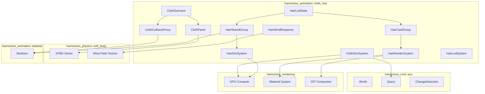
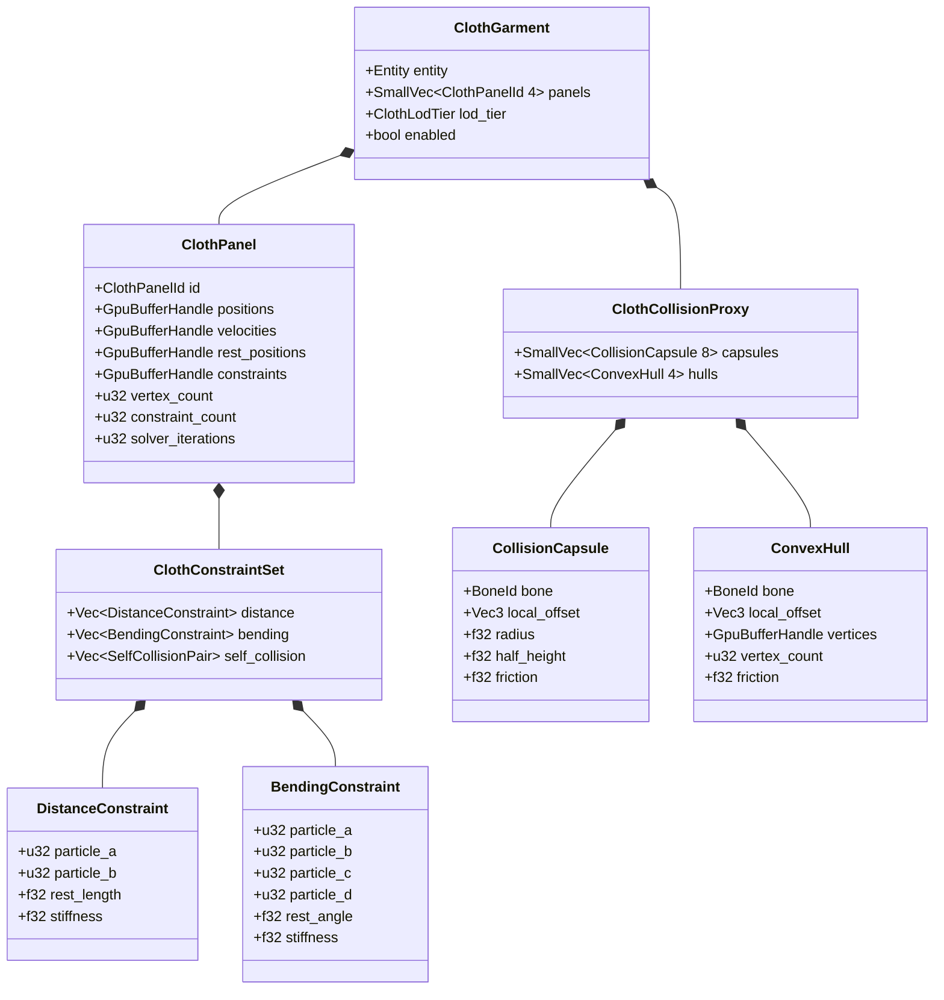
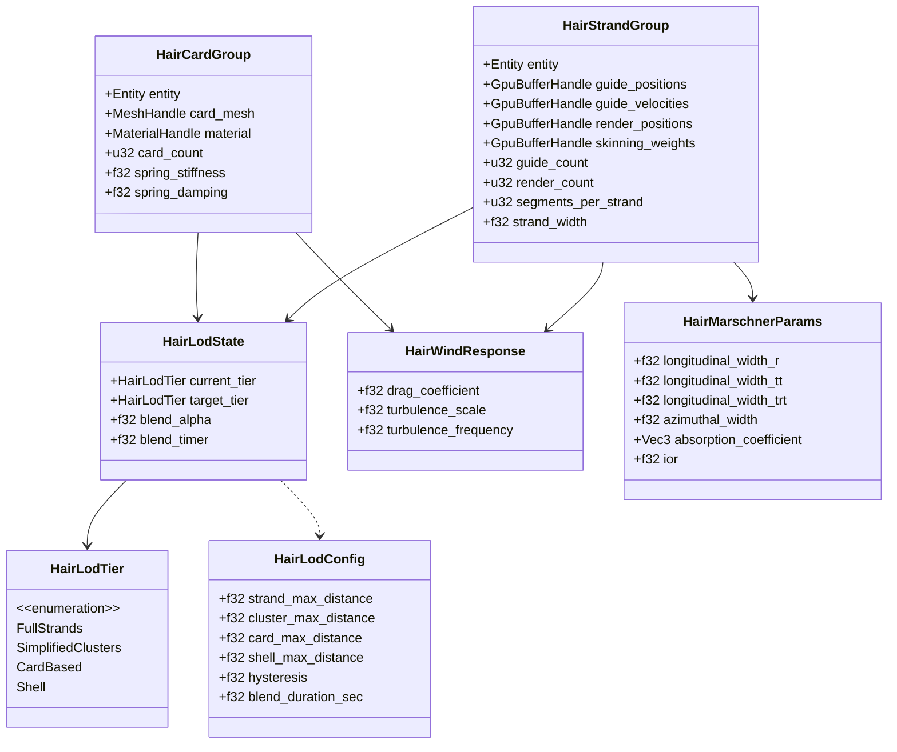
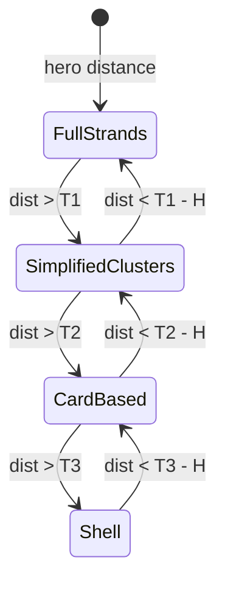
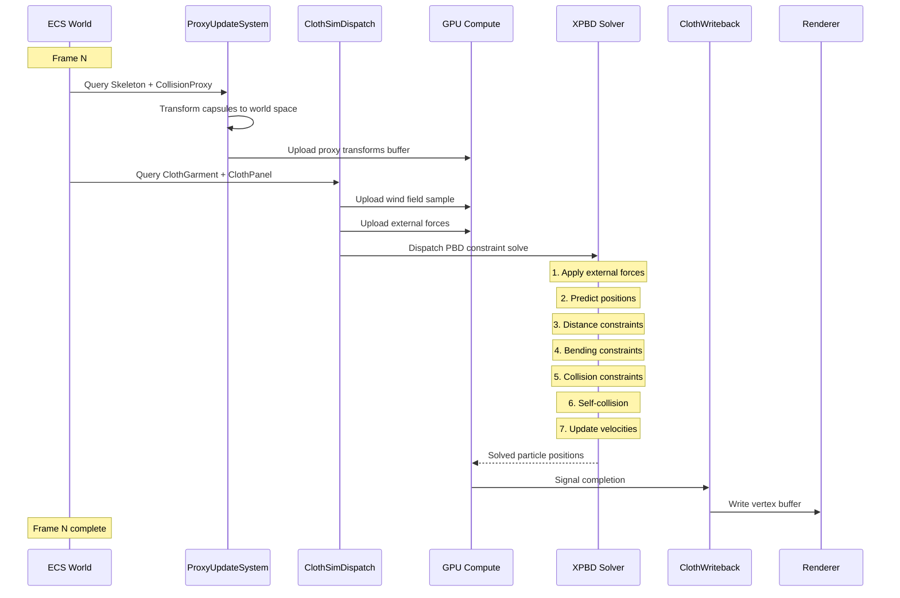
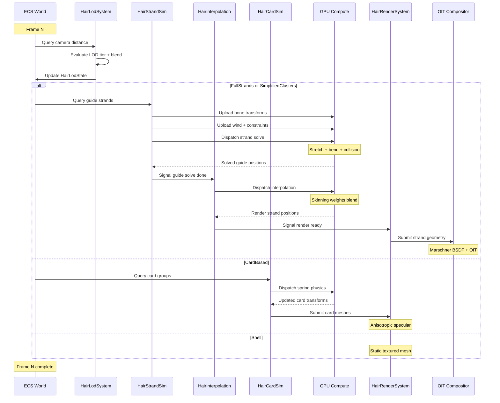

# Cloth & Hair Animation Design

## Requirements Trace

| Feature | Requirement | User Stories | Description |
|---------|-------------|--------------|-------------|
| F-9.5.1 | R-9.5.1 | US-9.5.1.1, US-9.5.1.2, US-9.5.1.3 | GPU cloth simulation via PBD with distance, bending, self-collision constraints |
| F-9.5.2 | R-9.5.2 | US-9.5.2.1, US-9.5.2.2, US-9.5.2.3 | Strand-based hair simulation with guide curves and interpolated render strands |
| F-9.5.3 | R-9.5.3 | US-9.5.3.1, US-9.5.3.2 | Card-based hair rendering with anisotropic specular and spring physics |
| F-9.5.4 | R-9.5.4 | US-9.5.4.1, US-9.5.4.2 | Hair LOD transitioning strands to clusters to cards to shell |
| F-9.5.5 | R-9.5.5 | US-9.5.5.1, US-9.5.5.2 | Cloth-body collision with capsule/convex hull proxies and friction |
| F-9.5.6 | R-9.5.6 | US-9.5.6.1, US-9.5.6.2, US-9.5.6.3 | Hair wind response from shared wind field texture |

### Cross-Cutting Dependencies

| Dependency | Source | Consumed API |
|------------|--------|--------------|
| XPBD solver | F-4.7.1 | Cloth constraint solving delegation |
| Wind field texture | F-4.7.5 | `WindSource` ECS entities, shared wind texture |
| Rigid body coupling | F-4.7.4 | Two-way cloth-body interaction |
| Skeletal animation | F-9.1.1 | Bone transforms for collision proxies |
| Animation state machine | F-9.4.1 | Baked animation fallback triggers |
| GPU compute | Rendering | Compute shader dispatch for simulation |
| OIT compositor | Rendering | Order-independent transparency for hair |
| Shared spatial index | F-1.9.1 | BVH queries for collision broadphase |
| Thread pool | F-14.3.1 | Scoped parallel task execution |

## Overview

The cloth and hair system provides GPU-accelerated
simulation for character garments and hair. All
simulation data lives as ECS components. All logic
runs as ECS systems. No separate simulation world.

The design follows four principles:

1. **GPU-first simulation.** Position-based dynamics
   (PBD) cloth and strand hair simulation run
   entirely on GPU compute shaders written in HLSL.
   The CPU prepares inputs (bone transforms, wind
   samples, collision proxies) and dispatches work.
2. **Physics delegation.** Cloth constraint solving
   delegates to the physics XPBD solver (F-4.7.1).
   The animation system owns garment authoring, LOD,
   and skinned mesh integration.
3. **Tiered LOD.** Hair transitions through four
   tiers (strands, clusters, cards, shell) based on
   camera distance. Cloth scales constraint
   complexity per platform.
4. **Shared wind.** Both cloth and hair sample the
   shared wind field texture from `WindSource` ECS
   entities, ensuring visual coherence with foliage
   and particles.

### Performance Targets

| Metric | Target |
|--------|--------|
| Cloth panels per frame (desktop) | 16+ simultaneous |
| Cloth panels per frame (Switch) | 4 (distance-only) |
| Guide strands per character | 64-256 (desktop) |
| Hair LOD transition | No visible popping |
| Cloth vertex solve (1000 verts) | Under 0.5 ms GPU |
| Card-based hair vs strand cost | At least 5x cheaper |

## Architecture

### Module Boundaries



### File Layout

```
harmonius_animation/
├── cloth_hair/
│   ├── mod.rs              # Re-exports
│   ├── cloth_garment.rs    # ClothGarment,
│   │                       # ClothPanel components
│   ├── cloth_collision.rs  # ClothCollisionProxy,
│   │                       # CollisionCapsule,
│   │                       # ConvexHull
│   ├── cloth_system.rs     # ClothSimSystem,
│   │                       # proxy update, GPU
│   │                       # dispatch
│   ├── hair_strand.rs      # HairStrandGroup,
│   │                       # guide/render strand
│   │                       # components
│   ├── hair_card.rs        # HairCardGroup,
│   │                       # card mesh, material
│   ├── hair_lod.rs         # HairLodConfig,
│   │                       # HairLodState,
│   │                       # HairLodSystem
│   ├── hair_wind.rs        # HairWindResponse,
│   │                       # wind field sampling
│   ├── hair_sim_system.rs  # HairSimSystem,
│   │                       # strand physics
│   │                       # dispatch
│   ├── hair_render.rs      # HairRenderSystem,
│   │                       # Marschner shading,
│   │                       # OIT submission
│   └── shaders/
│       ├── cloth_pbd.hlsl         # PBD constraint
│       │                          # solver
│       ├── cloth_collision.hlsl   # Capsule/hull
│       │                          # collision
│       ├── hair_strand_sim.hlsl   # Guide strand
│       │                          # simulation
│       ├── hair_interpolate.hlsl  # Guide-to-render
│       │                          # interpolation
│       ├── hair_marschner.hlsl    # Marschner BSDF
│       └── hair_oit.hlsl          # OIT compositing
```

### Core Data Structures





### Hair LOD State Machine



- **FullStrands** -- Desktop only. 64-256 guide
  strands. Full per-particle simulation.
- **SimplifiedClusters** -- Reduced guide count.
  Temporal blend during transition.
- **CardBased** -- Alpha-blended polygon strips.
  Spring physics. Primary on mobile/Switch.
- **Shell** -- Single textured mesh. No simulation.
  Extreme distance or lowest platforms.

Hysteresis `H` prevents oscillation at tier
boundaries. `blend_duration_sec` controls the
temporal cross-fade between outgoing and incoming
representations.

## API Design

### Cloth Components

```rust
/// Unique identifier for a cloth panel within
/// a garment.
#[derive(
    Clone, Copy, Debug, PartialEq, Eq, Hash,
)]
pub struct ClothPanelId(pub u32);

/// LOD tier controlling cloth constraint
/// complexity.
#[derive(
    Clone, Copy, Debug, PartialEq, Eq, Hash,
)]
pub enum ClothLodTier {
    /// Full PBD: distance + bending +
    /// self-collision. Desktop.
    Full,
    /// Distance constraints only. Switch.
    Simplified,
    /// No simulation. Baked animation fallback.
    /// Mobile.
    Disabled,
}

/// A cloth garment attached to a character entity.
/// Contains one or more panels and collision
/// proxies. ECS component.
#[derive(Component, Reflect)]
pub struct ClothGarment {
    pub panels: SmallVec<[ClothPanelId; 4]>,
    pub lod_tier: ClothLodTier,
    pub enabled: bool,
}

/// A single cloth simulation panel. GPU buffers
/// hold particle positions, velocities, and
/// constraint data. ECS component.
#[derive(Component, Reflect)]
pub struct ClothPanel {
    pub id: ClothPanelId,
    pub positions: GpuBufferHandle,
    pub velocities: GpuBufferHandle,
    pub rest_positions: GpuBufferHandle,
    pub constraints: GpuBufferHandle,
    pub vertex_count: u32,
    pub constraint_count: u32,
    /// PBD solver iteration count. Higher values
    /// improve stiffness at the cost of GPU time.
    pub solver_iterations: u32,
}

/// Distance constraint between two particles.
#[derive(Clone, Copy, Debug, Reflect)]
pub struct DistanceConstraint {
    pub particle_a: u32,
    pub particle_b: u32,
    pub rest_length: f32,
    /// Compliance (inverse stiffness). 0.0 = rigid.
    pub compliance: f32,
}

/// Bending constraint across four particles
/// forming a dihedral angle.
#[derive(Clone, Copy, Debug, Reflect)]
pub struct BendingConstraint {
    pub particle_a: u32,
    pub particle_b: u32,
    pub particle_c: u32,
    pub particle_d: u32,
    pub rest_angle: f32,
    pub compliance: f32,
}

/// Collision proxy set attached to a character
/// skeleton. ECS component.
#[derive(Component, Reflect)]
pub struct ClothCollisionProxy {
    pub capsules: SmallVec<[CollisionCapsule; 8]>,
    pub hulls: SmallVec<[ConvexHull; 4]>,
}

/// A capsule collision primitive attached to a
/// skeleton bone.
#[derive(Clone, Debug, Reflect)]
pub struct CollisionCapsule {
    pub bone: BoneId,
    pub local_offset: Vec3,
    pub radius: f32,
    pub half_height: f32,
    pub friction: f32,
}

/// A convex hull collision primitive attached to
/// a skeleton bone.
#[derive(Clone, Debug, Reflect)]
pub struct ConvexHull {
    pub bone: BoneId,
    pub local_offset: Vec3,
    pub vertices: GpuBufferHandle,
    pub vertex_count: u32,
    pub friction: f32,
}
```

### Cloth Systems

```rust
/// Updates collision proxy world-space transforms
/// from the skeleton's current bone poses. Runs
/// after skeletal animation evaluation, before
/// cloth simulation dispatch.
pub fn cloth_collision_proxy_update_system(
    query: Query<(
        &ClothCollisionProxy,
        &Skeleton,
        &GlobalTransform,
    )>,
    gpu: &GpuContext,
) { /* ... */ }

/// Dispatches GPU cloth simulation for all active
/// garments. Uploads collision proxies, wind
/// samples, and external forces. Delegates PBD
/// constraint solving to the XPBD solver
/// (F-4.7.1). Runs after proxy update.
pub fn cloth_sim_dispatch_system(
    garments: Query<(
        &ClothGarment,
        &ClothPanel,
        &ClothCollisionProxy,
    ), With<Enabled>>,
    wind_field: Res<WindFieldTexture>,
    gpu: &GpuContext,
    xpbd: &XpbdSolver,
) { /* ... */ }

/// Writes solved cloth particle positions back to
/// the skinned mesh vertex buffer for rendering.
/// Runs after simulation dispatch completes.
pub fn cloth_writeback_system(
    panels: Query<&ClothPanel, Changed<ClothPanel>>,
    gpu: &GpuContext,
) { /* ... */ }
```

### Hair Components

```rust
/// LOD tier for hair representation.
#[derive(
    Clone, Copy, Debug, PartialEq, Eq,
    Hash, Reflect,
)]
pub enum HairLodTier {
    /// Full strand simulation. Desktop hero
    /// characters only.
    FullStrands,
    /// Reduced guide strand count with temporal
    /// blend.
    SimplifiedClusters,
    /// Alpha-blended polygon strip cards with
    /// spring physics.
    CardBased,
    /// Single textured shell mesh. No simulation.
    Shell,
}

/// Configuration for hair LOD distance thresholds.
/// ECS component.
#[derive(Component, Reflect)]
pub struct HairLodConfig {
    /// Camera distance beyond which full strands
    /// transition to simplified clusters.
    pub strand_max_distance: f32,
    /// Camera distance beyond which clusters
    /// transition to cards.
    pub cluster_max_distance: f32,
    /// Camera distance beyond which cards
    /// transition to shell.
    pub card_max_distance: f32,
    /// Distance hysteresis to prevent oscillation
    /// at tier boundaries.
    pub hysteresis: f32,
    /// Duration in seconds for temporal cross-fade
    /// between LOD tiers.
    pub blend_duration_sec: f32,
}

/// Runtime LOD state tracking the current and
/// target tiers plus blend progress.
/// ECS component.
#[derive(Component, Reflect)]
pub struct HairLodState {
    pub current_tier: HairLodTier,
    pub target_tier: HairLodTier,
    /// 0.0 = fully current, 1.0 = fully target.
    pub blend_alpha: f32,
    pub blend_timer: f32,
}

/// Strand-based hair group attached to a character.
/// Guide strands drive interpolated render strands
/// via GPU skinning. ECS component.
#[derive(Component, Reflect)]
pub struct HairStrandGroup {
    /// GPU buffer of guide strand particle
    /// positions. Layout: [segments_per_strand *
    /// guide_count] Vec4 elements.
    pub guide_positions: GpuBufferHandle,
    /// GPU buffer of guide strand particle
    /// velocities.
    pub guide_velocities: GpuBufferHandle,
    /// GPU buffer of interpolated render strand
    /// positions (output).
    pub render_positions: GpuBufferHandle,
    /// Skinning weights mapping render strands to
    /// guide strands.
    pub skinning_weights: GpuBufferHandle,
    pub guide_count: u32,
    pub render_count: u32,
    pub segments_per_strand: u32,
    pub strand_width: f32,
}

/// Card-based hair group. Textured polygon strips
/// driven by spring physics. ECS component.
#[derive(Component, Reflect)]
pub struct HairCardGroup {
    pub card_mesh: MeshHandle,
    pub material: MaterialHandle,
    pub card_count: u32,
    pub spring_stiffness: f32,
    pub spring_damping: f32,
}

/// Per-strand hair constraint parameters for the
/// GPU solver.
#[derive(Clone, Copy, Debug, Reflect)]
pub struct HairStrandConstraints {
    /// Stretch constraint stiffness.
    pub stretch_compliance: f32,
    /// Bending constraint stiffness.
    pub bend_compliance: f32,
    /// Collision capsule radius for strand-body
    /// interaction.
    pub collision_radius: f32,
}

/// Hair wind response parameters. ECS component.
#[derive(Component, Reflect)]
pub struct HairWindResponse {
    /// Aerodynamic drag coefficient for
    /// per-particle wind forces (strand mode).
    pub drag_coefficient: f32,
    /// Scale factor for turbulence noise applied
    /// to wind direction.
    pub turbulence_scale: f32,
    /// Frequency of turbulence noise in Hz.
    pub turbulence_frequency: f32,
}

/// Marschner hair BSDF parameters for physically
/// based hair shading. ECS component.
#[derive(Component, Reflect)]
pub struct HairMarschnerParams {
    /// Longitudinal width for the R (reflection)
    /// lobe in degrees.
    pub longitudinal_width_r: f32,
    /// Longitudinal width for the TT
    /// (transmission-transmission) lobe.
    pub longitudinal_width_tt: f32,
    /// Longitudinal width for the TRT
    /// (transmission-reflection-transmission) lobe.
    pub longitudinal_width_trt: f32,
    /// Azimuthal width in degrees.
    pub azimuthal_width: f32,
    /// Absorption coefficient controlling hair
    /// color.
    pub absorption_coefficient: Vec3,
    /// Index of refraction (typically ~1.55 for
    /// human hair).
    pub ior: f32,
}
```

### Hair Systems

```rust
/// Evaluates camera distance and screen coverage
/// to select the target LOD tier. Updates
/// HairLodState blend timers for temporal
/// cross-fade. Runs every frame before simulation.
pub fn hair_lod_system(
    mut query: Query<(
        &HairLodConfig,
        &mut HairLodState,
        &GlobalTransform,
    )>,
    camera: Res<ActiveCamera>,
    dt: Res<DeltaTime>,
) { /* ... */ }

/// Dispatches GPU compute for strand-based hair
/// simulation. Uploads bone transforms, wind field
/// samples, and collision capsule data. Solves
/// stretch, bend, and collision constraints per
/// guide strand particle. Runs after LOD system
/// selects FullStrands or SimplifiedClusters.
pub fn hair_strand_sim_system(
    strands: Query<(
        &HairStrandGroup,
        &HairStrandConstraints,
        &HairWindResponse,
        &ClothCollisionProxy,
        &Skeleton,
    ), With<StrandSimActive>>,
    wind_field: Res<WindFieldTexture>,
    gpu: &GpuContext,
    dt: Res<DeltaTime>,
) { /* ... */ }

/// Dispatches GPU compute to interpolate render
/// strand positions from solved guide strands
/// using skinning weights. Runs after strand
/// simulation.
pub fn hair_interpolation_system(
    strands: Query<
        &HairStrandGroup,
        With<StrandSimActive>,
    >,
    gpu: &GpuContext,
) { /* ... */ }

/// Updates card-based hair spring physics on GPU.
/// Samples wind field for simplified spring
/// displacement. Runs for CardBased LOD tier.
pub fn hair_card_sim_system(
    cards: Query<(
        &HairCardGroup,
        &HairWindResponse,
        &Skeleton,
    ), With<CardSimActive>>,
    wind_field: Res<WindFieldTexture>,
    gpu: &GpuContext,
    dt: Res<DeltaTime>,
) { /* ... */ }

/// Submits hair strand geometry for rendering with
/// Marschner BSDF shading and OIT compositing.
/// Runs after all hair simulation completes.
pub fn hair_strand_render_system(
    strands: Query<(
        &HairStrandGroup,
        &HairMarschnerParams,
        &HairLodState,
        &GlobalTransform,
    )>,
    oit: &OitCompositor,
    gpu: &GpuContext,
) { /* ... */ }

/// Submits card-based hair geometry for rendering
/// with anisotropic specular shading. Alpha-tested
/// or alpha-blended depending on material config.
pub fn hair_card_render_system(
    cards: Query<(
        &HairCardGroup,
        &HairLodState,
        &GlobalTransform,
    )>,
    gpu: &GpuContext,
) { /* ... */ }
```

### HLSL Shader Interfaces

```rust
/// GPU-side cloth PBD solver dispatch parameters.
/// Maps to HLSL constant buffer.
#[repr(C)]
#[derive(Clone, Copy, Debug)]
pub struct ClothPbdConstants {
    pub vertex_count: u32,
    pub constraint_count: u32,
    pub solver_iterations: u32,
    pub delta_time: f32,
    pub gravity: [f32; 3],
    pub _pad0: f32,
    pub wind_direction: [f32; 3],
    pub wind_strength: f32,
}

/// GPU-side hair strand simulation dispatch
/// parameters. Maps to HLSL constant buffer.
#[repr(C)]
#[derive(Clone, Copy, Debug)]
pub struct HairStrandSimConstants {
    pub guide_count: u32,
    pub segments_per_strand: u32,
    pub delta_time: f32,
    pub gravity: f32,
    pub stretch_compliance: f32,
    pub bend_compliance: f32,
    pub collision_radius: f32,
    pub drag_coefficient: f32,
    pub turbulence_scale: f32,
    pub turbulence_frequency: f32,
    pub _pad: [f32; 2],
}

/// GPU-side hair interpolation dispatch
/// parameters. Maps to HLSL constant buffer.
#[repr(C)]
#[derive(Clone, Copy, Debug)]
pub struct HairInterpolateConstants {
    pub guide_count: u32,
    pub render_count: u32,
    pub segments_per_strand: u32,
    pub strand_width: f32,
}

/// GPU-side Marschner BSDF parameters. Maps to
/// HLSL constant buffer for hair shading.
#[repr(C)]
#[derive(Clone, Copy, Debug)]
pub struct MarschnerConstants {
    pub longitudinal_width_r: f32,
    pub longitudinal_width_tt: f32,
    pub longitudinal_width_trt: f32,
    pub azimuthal_width: f32,
    pub absorption_coefficient: [f32; 3],
    pub ior: f32,
}
```

## Data Flow

### Cloth Simulation Pipeline



### Hair Simulation Pipeline



### Cloth Constraint Solving (GPU)

The PBD solver runs in a single compute dispatch
with multiple internal iterations. Each iteration
applies constraint projections in sequence:

1. **External forces** -- Gravity and wind from the
   shared wind field texture. Per-particle force
   accumulation.
2. **Position prediction** -- Euler integration of
   velocities to predicted positions.
3. **Distance constraints** -- Project particle
   pairs to satisfy rest-length distances. Gauss-
   Seidel iteration with SOR relaxation.
4. **Bending constraints** -- Project dihedral
   angles between triangle pairs to rest angles.
5. **Collision constraints** -- Project particles
   outside capsule/convex hull boundaries. Apply
   friction response for sticking contacts.
6. **Self-collision** -- Spatial hash on GPU to
   detect and resolve cloth-cloth penetration.
7. **Velocity update** -- Derive velocities from
   position delta. Apply damping.

### Hair Strand Solving (GPU)

Each guide strand is a chain of particles. The
solver processes all guide strands in parallel:

1. **Root attachment** -- First particle pinned to
   skeleton bone position (updated from skinned
   mesh binding).
2. **External forces** -- Gravity plus per-particle
   aerodynamic drag from wind field texture sample.
   Drag force = `drag_coefficient * (wind_velocity
   - particle_velocity) * cross_section`.
3. **Stretch constraints** -- Distance constraints
   between consecutive particles maintain strand
   length.
4. **Bend constraints** -- Angle constraints across
   three consecutive particles maintain strand
   shape.
5. **Collision** -- Particles projected outside
   collision capsules attached to skeleton bones.
6. **Velocity update** -- Derive from position
   delta with damping.

### Guide-to-Render Interpolation

Render strands are interpolated from nearby guide
strands using precomputed skinning weights:

```
render_pos[i] = sum(
    weight[j] * guide_pos[nearest_guide[j]]
) for j in 0..K
```

Where `K` is typically 3-4 nearest guide strands.
This runs as a separate GPU compute dispatch after
guide strand solving completes.

### Hair Rendering Pipeline

Strand-based hair uses the Marschner BSDF model
with three reflection lobes:

- **R** -- Specular reflection off the hair
  cuticle surface.
- **TT** -- Transmission through the hair fiber
  (primary highlight).
- **TRT** -- Transmission-reflection-transmission
  (secondary colored highlight).

Order-independent transparency (OIT) composites
overlapping hair strands correctly. The OIT pass
uses per-pixel linked lists or weighted blended
OIT depending on platform capability.

Card-based hair uses a simplified anisotropic
Kajiya-Kay specular model with alpha-tested or
alpha-blended transparency.

## Platform Considerations

### Cloth Tier Matrix

| Platform | LOD Tier | Constraints | Panels | Proxies |
|----------|----------|-------------|--------|---------|
| Desktop | Full | Distance + bend + self-collision | 16+ | 8-12 capsules + hulls |
| Switch | Simplified | Distance only | 4 | 4-6 capsules |
| Mobile | Disabled | None (baked fallback) | 0 | 0 |

### Hair Tier Matrix

| Platform | Primary Method | Guide Strands | Cards | Shell |
|----------|---------------|---------------|-------|-------|
| Desktop | Full strands | 64-256/char | 32-64 fallback | Extreme distance |
| Switch | Cards | N/A | 16-32/char | Far distance |
| Mobile | Shell/cards | N/A | 8-16/char | Default |

### GPU Compute Requirements

| Feature | Shader | Dispatch | Notes |
|---------|--------|----------|-------|
| Cloth PBD | `cloth_pbd.hlsl` | 1 per panel | Thread group per 64 vertices |
| Cloth collision | `cloth_collision.hlsl` | 1 per panel | Fused with PBD dispatch |
| Strand sim | `hair_strand_sim.hlsl` | 1 per group | Thread per guide strand |
| Interpolation | `hair_interpolate.hlsl` | 1 per group | Thread per render strand |
| Marschner shade | `hair_marschner.hlsl` | Pixel shader | OIT pass |

### Platform-Specific Notes

- **Windows:** D3D12 compute shaders. DXIL
  compiled from HLSL via DXC.
- **macOS:** Metal compute shaders. MSL compiled
  from DXIL via Metal Shader Converter through
  cxx.rs C++ bridge.
- **Linux:** Vulkan compute shaders. SPIR-V
  compiled from HLSL via DXC.
- **OIT on mobile:** Weighted blended OIT (no
  per-pixel linked lists). Mobile primarily uses
  card-based rendering so OIT is rarely needed.

### Scaling Tiers

| Tier | Cloth Budget | Hair Budget | Total GPU ms |
|------|-------------|-------------|-------------|
| Mobile | 0 ms (disabled) | 0.2 ms (cards only) | 0.2 ms |
| Switch | 0.3 ms (4 panels) | 0.3 ms (cards) | 0.6 ms |
| Desktop | 1.0 ms (16 panels) | 1.5 ms (strands + OIT) | 2.5 ms |

## Test Plan

### Unit Tests

| Test | Req | Description |
|------|-----|-------------|
| `test_cloth_distance_constraint` | R-9.5.1 | Apply distance constraint to two particles. Verify rest length maintained within 1% after 10 solver iterations. |
| `test_cloth_bending_constraint` | R-9.5.1 | Apply bending constraint to four particles forming a dihedral. Verify rest angle maintained within 2 degrees. |
| `test_cloth_self_collision` | R-9.5.1 | Fold a 100-vertex cloth plane. Verify no particle penetrates the cloth surface (all pairwise distances > collision radius). |
| `test_cloth_wind_response` | R-9.5.1 | Apply 10 m/s wind to a hanging cloth panel. Verify all particle positions displace in wind direction. |
| `test_strand_gravity` | R-9.5.2 | Simulate 100 guide strands with gravity only. Verify all strand tips are below their roots after 60 frames. |
| `test_strand_stretch` | R-9.5.2 | Apply stretch constraint to a 10-segment strand. Verify total strand length within 1% of rest length. |
| `test_strand_collision` | R-9.5.2 | Place a collision capsule at a strand midpoint. Verify all particles remain outside capsule radius. |
| `test_card_spring_physics` | R-9.5.3 | Apply impulse to a card hair group. Verify spring oscillation with decay over 30 frames. |
| `test_card_anisotropic_spec` | R-9.5.3 | Rotate light around card hair. Verify specular highlight shifts along the anisotropic direction. |
| `test_hair_lod_tier_selection` | R-9.5.4 | Set camera at 5, 20, 50, 200 m. Verify LOD tier is FullStrands, SimplifiedClusters, CardBased, Shell respectively. |
| `test_hair_lod_hysteresis` | R-9.5.4 | Move camera from 19 m to 21 m and back to 20 m. Verify no tier oscillation due to hysteresis. |
| `test_hair_lod_blend` | R-9.5.4 | Trigger LOD transition. Verify blend_alpha interpolates from 0.0 to 1.0 over blend_duration_sec. |
| `test_collision_proxy_update` | R-9.5.5 | Change skeleton pose. Verify collision capsule world positions update within 1 frame. |
| `test_collision_friction` | R-9.5.5 | Slide cloth across a capsule with friction=0.8. Verify cloth velocity reduces along surface tangent. |
| `test_wind_field_sampling` | R-9.5.6 | Place hair and foliage at same position. Verify both sample identical wind vector from wind field texture. |
| `test_wind_drag_proportional` | R-9.5.6 | Double wind speed. Verify strand particle displacement approximately doubles. |

### Integration Tests

| Test | Req | Description |
|------|-----|-------------|
| `test_cloth_on_animated_char` | R-9.5.1, R-9.5.5 | Attach a 1000-vertex cloak to a walking character. Verify cloth follows character without penetration for 300 frames. |
| `test_strand_hair_head_turn` | R-9.5.2 | Rotate character head 90 degrees. Verify strand hair swings with physically plausible motion and no capsule penetration. |
| `test_lod_flythrough` | R-9.5.4 | Fly camera from 5 m to 200 m continuously. Capture per-frame screenshots. Verify no visible popping artifacts. |
| `test_wind_coherence` | R-9.5.6 | Place hair, cloth, foliage, and particles next to each other. Apply 10 m/s east wind. Verify all four systems deflect eastward. |
| `test_platform_cloth_disabled` | R-9.5.1 | On mobile config, verify ClothGarment.enabled = false and baked animation plays. |
| `test_platform_strand_gating` | R-9.5.2 | On Switch config, verify HairLodTier = CardBased (never FullStrands). |
| `test_card_count_budget` | R-9.5.3 | On mobile/Switch/desktop, verify card counts match 8-16, 16-32, 32-64 budgets. |
| `test_proxy_count_budget` | R-9.5.5 | On mobile/Switch/desktop, verify proxy counts match 0, 4-6, 8-12 budgets. |

### Benchmarks

| Benchmark | Target | Source |
|-----------|--------|--------|
| Cloth PBD 1000 verts (desktop) | Under 0.5 ms GPU | R-9.5.1 |
| 16 cloth panels simultaneous | Under 1.0 ms GPU | US-9.5.1.1 |
| 256 guide strands simulation | Under 1.0 ms GPU | US-9.5.2.2 |
| Guide-to-render interpolation (4096 strands) | Under 0.3 ms GPU | R-9.5.2 |
| Hair OIT compositing | Under 0.5 ms GPU | R-9.5.2 |
| Card hair vs strand hair | At least 5x faster | R-9.5.3 |
| LOD transition blend | Zero frame spike | R-9.5.4 |
| Wind field texture sample | Under 0.01 ms/entity | R-9.5.6 |

## Open Questions

1. **Self-collision spatial hash resolution** --
   GPU spatial hash cell size for cloth
   self-collision detection. Smaller cells improve
   accuracy but increase memory and dispatch cost.
   Needs profiling across garment complexity tiers.
2. **Guide strand interpolation weight count** --
   K=3 vs K=4 nearest guides for render strand
   interpolation. K=4 produces smoother results but
   increases interpolation dispatch cost by ~33%.
3. **OIT method selection** -- Per-pixel linked
   lists produce correct ordering but require
   atomic UAV operations (slow on some GPUs).
   Weighted blended OIT is faster but introduces
   color bleeding. May need runtime selection based
   on GPU capability.
4. **Baked animation fallback format** -- Mobile
   cloth uses baked animation instead of simulation.
   Needs decision on whether to bake per-vertex
   position deltas (high memory) or simplified bone-
   driven animation (lower fidelity, lower memory).
5. **Strand width screen-space clamping** -- Very
   thin strands may alias at certain distances.
   Minimum screen-space width clamping prevents
   aliasing but changes visual thickness. Threshold
   needs tuning per resolution tier.
6. **Cloth panel authoring pipeline** -- The panel-
   based authoring model (US-9.5.1.2) requires DCC
   plugin support for defining constraint regions.
   Integration with Houdini/Maya/Blender plugins
   (F-4.7.1) needs specification.
