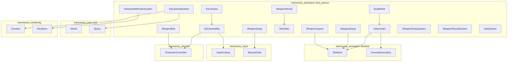
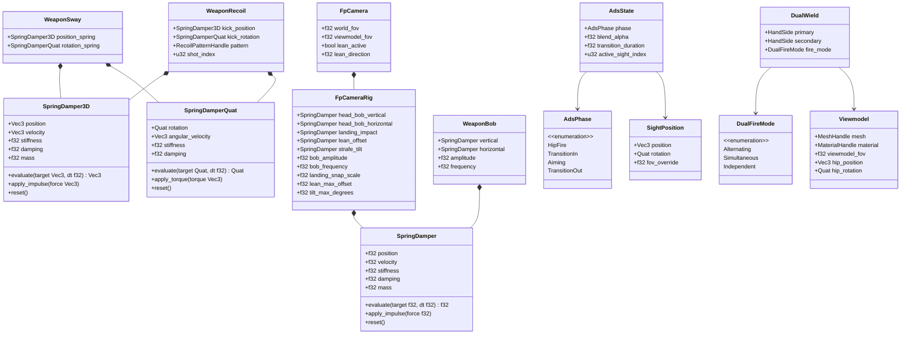
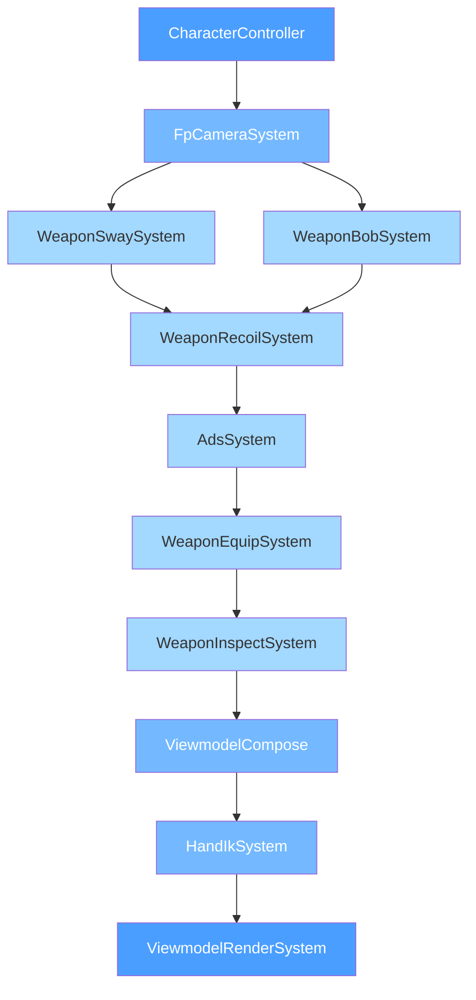
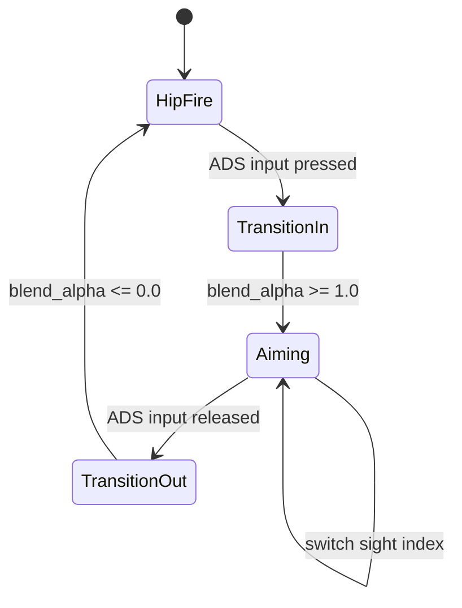
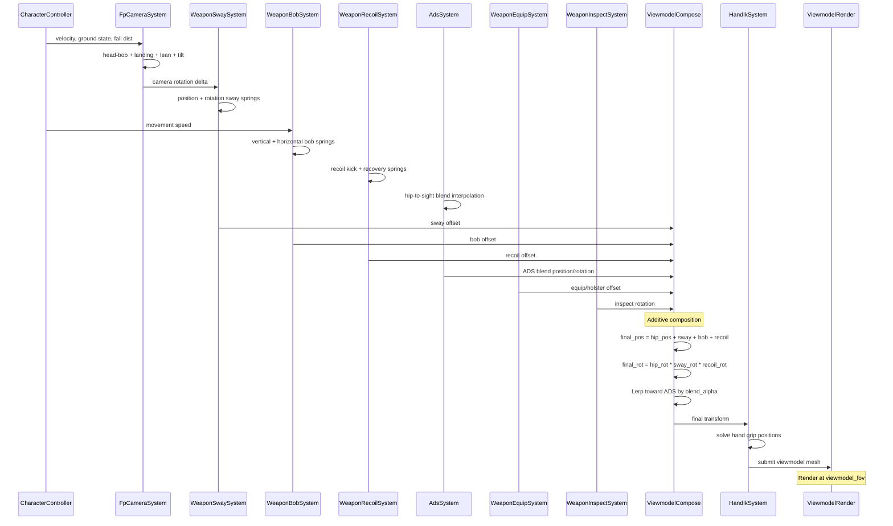
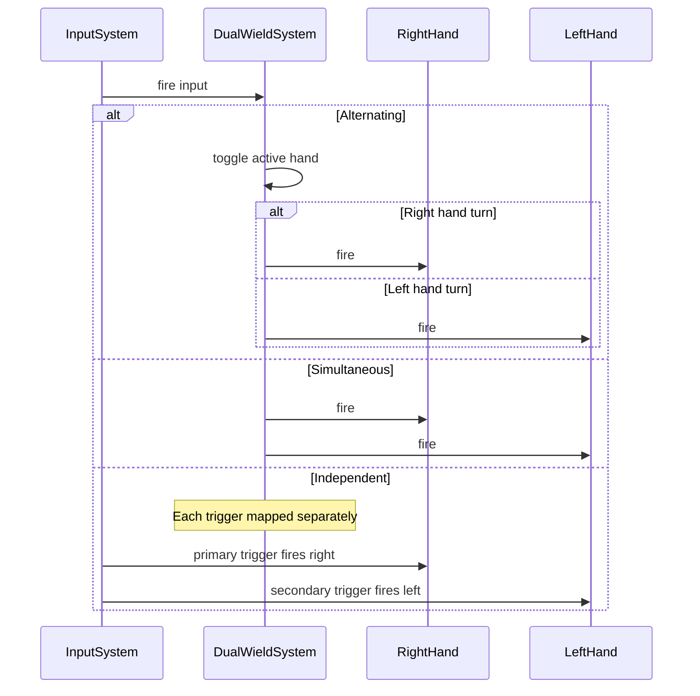

# First-Person Animation Design

## Requirements Trace

> **Canonical sources:** Features, requirements, and user stories are defined in
> [features/animation/](../../features/animation/),
> [requirements/animation/](../../requirements/animation/), and
> [user-stories/animation/](../../user-stories/animation/). The table below traces design elements
> to those definitions.

| Feature | Requirement | User Stories | Description |
|---------|-------------|--------------|-------------|
| F-9.6.1 | R-9.6.1 | US-9.6.1.1, US-9.6.1.2, US-9.6.1.3 | First-person camera with head-bob, landing impact, lean/peek, tilt, separate viewmodel FOV |
| F-9.6.2 | R-9.6.2 | US-9.6.2.1, US-9.6.2.2, US-9.6.2.3 | Procedural weapon sway/bob with per-weapon spring physics |
| F-9.6.3 | R-9.6.3 | US-9.6.3.1, US-9.6.3.2, US-9.6.3.3 | Procedural recoil from pattern data and ADS interpolation |
| F-9.6.4 | R-9.6.4 | US-9.6.4.1, US-9.6.4.2, US-9.6.4.3, US-9.6.4.4 | Weapon equip/inspect/dual wield with independent per-hand spring systems |

### Cross-Cutting Dependencies

| Dependency | Source | Consumed API |
|------------|--------|--------------|
| Character controller | F-4.1.8 | Ground state, velocity, fall distance |
| Camera system | F-13.2.1 | Base camera transform, FOV |
| Input actions | F-6.2.1 | Mouse delta, stick input, sprint/ADS/inspect triggers |
| Animation state machine | F-9.4.1 | Equip/holster/inspect animation playback |
| Recoil patterns | F-13.16.3 | Per-weapon recoil pattern data |
| Skeletal animation | F-9.1.1 | Bone transforms for hand IK |
| Weapon system | F-13.16 | Weapon data assets, attachment points |
| Reflection | F-1.3.1 | `Reflect` derive for serialization |
| Thread pool | F-14.3.1 | Scoped parallel task execution |

## Overview

The first-person animation system drives camera motion, weapon viewmodel behavior, and hand
placement for first-person games. All state lives as ECS components. All logic runs as ECS systems.

The design follows four principles:

1. **Spring-damper everywhere.** Every motion effect (head-bob, sway, recoil, lean) is a
   spring-damper system with configurable stiffness, damping, and mass. Springs compose additively.
2. **Per-weapon data assets.** Sway, bob, recoil, and ADS parameters are data assets edited in the
   visual editor. No code changes for tuning.
3. **Separate viewmodel FOV.** Weapons render at a narrower FOV than the world, preventing
   distortion at wide world FOVs.
4. **Dual wield independence.** Each hand has its own spring system, fire state, and reload state.
   Dual wield is two independent viewmodel instances sharing the same camera.

### Performance Targets

| Metric | Target |
|--------|--------|
| Camera spring evaluation | Under 0.05 ms CPU |
| Weapon sway + bob per weapon | Under 0.02 ms CPU |
| Recoil + ADS per weapon | Under 0.02 ms CPU |
| Dual wield total overhead | Under 0.1 ms CPU |
| Viewmodel render (single) | 1 draw call |
| Viewmodel render (dual) | 2 draw calls |

## Architecture

### Module Boundaries



### File Layout

```text
harmonius_animation/
├── first_person/
│   ├── mod.rs            # Re-exports
│   ├── spring.rs         # SpringDamper,
│   │                     # SpringDamper3D,
│   │                     # SpringDamperQuat
│   ├── camera.rs         # FpCamera, FpCameraRig,
│   │                     # head-bob, landing,
│   │                     # lean, tilt
│   ├── camera_system.rs  # FpCameraSystem
│   ├── sway.rs           # WeaponSway, input
│   │                     # sway spring
│   ├── bob.rs            # WeaponBob, locomotion
│   │                     # bob curves
│   ├── recoil.rs         # WeaponRecoil, recoil
│   │                     # pattern sampling
│   ├── ads.rs            # AdsState, AdsConfig,
│   │                     # sight positions
│   ├── viewmodel.rs      # Viewmodel, FOV, render
│   │                     # submission
│   ├── dual_wield.rs     # DualWield, per-hand
│   │                     # state, fire modes
│   ├── equip.rs          # WeaponEquip,
│   │                     # holster/draw state
│   ├── inspect.rs        # WeaponInspect,
│   │                     # inspection animation
│   ├── sway_system.rs    # WeaponSwaySystem,
│   │                     # WeaponBobSystem
│   ├── recoil_system.rs  # WeaponRecoilSystem,
│   │                     # AdsSystem
│   ├── viewmodel_system.rs # ViewmodelRender-
│   │                       # System
│   └── equip_system.rs   # WeaponEquipSystem,
│                          # InspectSystem
```

### Core Data Structures



### First-Person System Execution Order



### ADS Transition State Machine



## API Design

### Spring-Damper Primitives

```rust
/// 1D critically-damped spring-damper. The
/// foundation for all first-person motion effects.
/// Uses semi-implicit Euler integration.
#[derive(Clone, Debug, Reflect)]
pub struct SpringDamper {
    pub position: f32,
    pub velocity: f32,
    /// Spring constant (N/m). Higher = stiffer.
    pub stiffness: f32,
    /// Damping coefficient. 1.0 = critically
    /// damped. <1.0 = underdamped (oscillates).
    pub damping: f32,
    /// Mass in kg. Heavier = more inertia.
    pub mass: f32,
}

impl SpringDamper {
    pub fn new(
        stiffness: f32,
        damping: f32,
        mass: f32,
    ) -> Self;

    /// Evaluate the spring toward the target
    /// position. Returns the new position.
    pub fn evaluate(
        &mut self,
        target: f32,
        dt: f32,
    ) -> f32;

    /// Apply an instantaneous impulse (force *
    /// dt). Used for recoil kicks, landing
    /// impacts.
    pub fn apply_impulse(&mut self, impulse: f32);

    /// Reset position and velocity to zero.
    pub fn reset(&mut self);
}

/// 3D spring-damper for positional springs (weapon
/// sway position, recoil translation).
#[derive(Clone, Debug, Reflect)]
pub struct SpringDamper3D {
    pub position: Vec3,
    pub velocity: Vec3,
    pub stiffness: f32,
    pub damping: f32,
    pub mass: f32,
}

impl SpringDamper3D {
    pub fn new(
        stiffness: f32,
        damping: f32,
        mass: f32,
    ) -> Self;

    pub fn evaluate(
        &mut self,
        target: Vec3,
        dt: f32,
    ) -> Vec3;

    pub fn apply_impulse(&mut self, impulse: Vec3);
    pub fn reset(&mut self);
}

/// Quaternion spring-damper for rotational springs
/// (weapon sway rotation, recoil rotation). Uses
/// angular velocity in axis-angle representation.
#[derive(Clone, Debug, Reflect)]
pub struct SpringDamperQuat {
    pub rotation: Quat,
    pub angular_velocity: Vec3,
    pub stiffness: f32,
    pub damping: f32,
}

impl SpringDamperQuat {
    pub fn new(
        stiffness: f32,
        damping: f32,
    ) -> Self;

    pub fn evaluate(
        &mut self,
        target: Quat,
        dt: f32,
    ) -> Quat;

    pub fn apply_torque(&mut self, torque: Vec3);
    pub fn reset(&mut self);
}
```

### Camera Components

```rust
/// First-person camera configuration.
/// ECS component.
#[derive(Component, Reflect)]
pub struct FpCamera {
    /// World geometry FOV in degrees.
    pub world_fov: f32,
    /// Weapon viewmodel FOV in degrees. Typically
    /// narrower than world_fov to prevent weapon
    /// distortion.
    pub viewmodel_fov: f32,
    /// Whether lean/peek is currently active.
    pub lean_active: bool,
    /// Lean direction: -1.0 = left, 1.0 = right.
    pub lean_direction: f32,
}

/// First-person camera rig containing all spring-
/// damper systems for camera motion effects.
/// ECS component.
#[derive(Component, Reflect)]
pub struct FpCameraRig {
    /// Vertical head-bob spring (up/down during
    /// walk/run).
    pub head_bob_vertical: SpringDamper,
    /// Horizontal head-bob spring (left/right
    /// during walk/run).
    pub head_bob_horizontal: SpringDamper,
    /// Landing impact spring (downward snap on
    /// ground contact).
    pub landing_impact: SpringDamper,
    /// Lateral lean offset spring (peek around
    /// corners).
    pub lean_offset: SpringDamper,
    /// Strafe/slope tilt spring (camera roll on
    /// lateral movement).
    pub strafe_tilt: SpringDamper,
    /// Bob amplitude multiplier. Scales with
    /// movement speed.
    pub bob_amplitude: f32,
    /// Bob frequency in Hz. Matched to locomotion
    /// gait cycle.
    pub bob_frequency: f32,
    /// Landing snap scale. Proportional to fall
    /// distance.
    pub landing_snap_scale: f32,
    /// Maximum lateral lean offset in world units.
    pub lean_max_offset: f32,
    /// Maximum strafe tilt in degrees.
    pub tilt_max_degrees: f32,
}
```

### Weapon Sway and Bob Components

```rust
/// Per-weapon sway parameters. Data asset edited
/// in the visual editor. ECS component.
#[derive(Component, Reflect)]
pub struct WeaponSwayConfig {
    /// Position spring (translation lag behind
    /// camera).
    pub position_stiffness: f32,
    pub position_damping: f32,
    /// Rotation spring (rotational lag behind
    /// camera).
    pub rotation_stiffness: f32,
    pub rotation_damping: f32,
    /// Mass affects inertia. Heavy LMG > light
    /// pistol.
    pub mass: f32,
    /// Maximum position displacement in world
    /// units.
    pub max_displacement: Vec3,
    /// Maximum rotation displacement in degrees.
    pub max_rotation: Vec3,
}

/// Runtime weapon sway state. ECS component.
#[derive(Component, Reflect)]
pub struct WeaponSwayState {
    pub position_spring: SpringDamper3D,
    pub rotation_spring: SpringDamperQuat,
}

/// Per-weapon bob parameters. Data asset edited
/// in the visual editor. ECS component.
#[derive(Component, Reflect)]
pub struct WeaponBobConfig {
    /// Vertical bob amplitude at walk speed.
    pub vertical_amplitude: f32,
    /// Horizontal bob amplitude at walk speed.
    pub horizontal_amplitude: f32,
    /// Bob frequency at walk speed in Hz.
    pub frequency: f32,
    /// Amplitude multiplier curve indexed by
    /// movement speed. Allows non-linear scaling.
    pub speed_curve: AnimationCurveHandle,
}

/// Runtime weapon bob state. ECS component.
#[derive(Component, Reflect)]
pub struct WeaponBobState {
    pub vertical: SpringDamper,
    pub horizontal: SpringDamper,
    pub phase: f32,
}

/// Sprint tilt configuration. Weapon rotates to
/// a carry position during sprint. ECS component.
#[derive(Component, Reflect)]
pub struct SprintTiltConfig {
    /// Rotation target during sprint (pitch, yaw,
    /// roll in degrees).
    pub tilt_rotation: Vec3,
    /// Position offset during sprint.
    pub tilt_offset: Vec3,
    /// Sprint speed threshold. Tilt activates when
    /// speed exceeds this value.
    pub speed_threshold: f32,
    /// Transition spring stiffness.
    pub spring_stiffness: f32,
    pub spring_damping: f32,
}
```

### Recoil and ADS Components

```rust
/// Per-weapon recoil configuration. References a
/// recoil pattern data asset. ECS component.
#[derive(Component, Reflect)]
pub struct WeaponRecoilConfig {
    /// Handle to the recoil pattern data asset
    /// (F-13.16.3).
    pub pattern: RecoilPatternHandle,
    /// Position kick spring parameters.
    pub kick_stiffness: f32,
    pub kick_damping: f32,
    /// Rotation kick spring parameters.
    pub torque_stiffness: f32,
    pub torque_damping: f32,
    /// Per-shot kick magnitude randomization range
    /// (min, max) as a fraction of pattern value.
    pub randomization_range: (f32, f32),
}

/// Runtime weapon recoil state. ECS component.
#[derive(Component, Reflect)]
pub struct WeaponRecoilState {
    pub kick_position: SpringDamper3D,
    pub kick_rotation: SpringDamperQuat,
    /// Current position in the recoil pattern.
    pub shot_index: u32,
    /// Accumulated recoil for recovery.
    pub accumulated_recoil: Vec3,
}

/// A single sight position on a weapon (iron
/// sights, mounted optic, canted sight).
#[derive(Clone, Debug, Reflect)]
pub struct SightPosition {
    /// Local-space position offset to align the
    /// sight with the screen center.
    pub position: Vec3,
    /// Local-space rotation to align the sight.
    pub rotation: Quat,
    /// Optional FOV override for magnified optics.
    pub fov_override: Option<f32>,
    /// Whether this sight uses scope render-to-
    /// texture.
    pub uses_scope_rtt: bool,
}

/// ADS configuration per weapon. Defines available
/// sight positions and transition timing.
/// ECS component.
#[derive(Component, Reflect)]
pub struct AdsConfig {
    /// Available sight positions on this weapon.
    pub sights: SmallVec<[SightPosition; 3]>,
    /// Duration of hip-to-ADS transition in
    /// seconds.
    pub transition_duration: f32,
    /// Sway reduction multiplier during ADS
    /// (0.0-1.0). 0.3 = 30% of hip sway.
    pub sway_multiplier: f32,
    /// Bob reduction multiplier during ADS.
    pub bob_multiplier: f32,
}

/// ADS transition phase.
#[derive(
    Clone, Copy, Debug, PartialEq, Eq,
    Hash, Reflect,
)]
pub enum AdsPhase {
    /// Normal hip-fire position.
    HipFire,
    /// Transitioning from hip to sight alignment.
    TransitionIn,
    /// Fully aimed down sights.
    Aiming,
    /// Transitioning from sight back to hip.
    TransitionOut,
}

/// Runtime ADS state. ECS component.
#[derive(Component, Reflect)]
pub struct AdsState {
    pub phase: AdsPhase,
    /// 0.0 = hip, 1.0 = fully aimed.
    pub blend_alpha: f32,
    /// Index into AdsConfig.sights for the
    /// currently selected sight.
    pub active_sight_index: u32,
}
```

### Viewmodel and Equipment Components

```rust
/// Weapon viewmodel configuration. Defines the
/// mesh, material, and rest position for first-
/// person weapon rendering. ECS component.
#[derive(Component, Reflect)]
pub struct Viewmodel {
    pub mesh: MeshHandle,
    pub material: MaterialHandle,
    /// FOV for viewmodel rendering.
    pub viewmodel_fov: f32,
    /// Rest position at hip-fire.
    pub hip_position: Vec3,
    /// Rest rotation at hip-fire.
    pub hip_rotation: Quat,
}

/// Scope render-to-texture configuration for
/// magnified optics. ECS component.
#[derive(Component, Reflect)]
pub struct ScopeRttConfig {
    /// Magnification factor (e.g., 4.0 = 4x zoom).
    pub magnification: f32,
    /// Render texture resolution. Half-res on
    /// mobile, full-res on desktop.
    pub resolution: ScopeResolution,
    /// Vignette radius for scope shadow.
    pub vignette_radius: f32,
}

/// Scope render resolution tier.
#[derive(
    Clone, Copy, Debug, PartialEq, Eq, Reflect,
)]
pub enum ScopeResolution {
    /// Full display resolution.
    Full,
    /// Half display resolution. Mobile.
    Half,
    /// Quarter resolution. Lowest tier.
    Quarter,
}

/// Weapon equip/holster state. ECS component.
#[derive(Component, Reflect)]
pub struct WeaponEquipState {
    pub phase: EquipPhase,
    pub timer: f32,
    pub draw_duration: f32,
    pub holster_duration: f32,
}

/// Equip/holster phase.
#[derive(
    Clone, Copy, Debug, PartialEq, Eq,
    Hash, Reflect,
)]
pub enum EquipPhase {
    /// Weapon fully equipped and visible.
    Equipped,
    /// Playing holster animation.
    Holstering,
    /// Weapon stowed (not visible).
    Holstered,
    /// Playing draw animation.
    Drawing,
}

/// Weapon inspection state. ECS component.
#[derive(Component, Reflect)]
pub struct WeaponInspectState {
    pub active: bool,
    pub timer: f32,
    pub duration: f32,
    /// Rotation curve for the inspection animation.
    pub rotation_curve: AnimationCurveHandle,
}

/// Dual wield configuration. ECS component.
#[derive(Component, Reflect)]
pub struct DualWield {
    /// Entity of the primary (right hand) weapon.
    pub primary: Entity,
    /// Entity of the secondary (left hand) weapon.
    pub secondary: Entity,
    pub fire_mode: DualFireMode,
}

/// Dual wield fire mode.
#[derive(
    Clone, Copy, Debug, PartialEq, Eq,
    Hash, Reflect,
)]
pub enum DualFireMode {
    /// Left-right-left alternating fire.
    Alternating,
    /// Both weapons fire on the same frame.
    Simultaneous,
    /// Each hand fires on its own trigger input.
    Independent,
}

/// Per-hand state for dual wield. Each hand
/// maintains independent spring systems.
/// ECS component.
#[derive(Component, Reflect)]
pub struct HandState {
    pub side: HandSide,
    pub sway: WeaponSwayState,
    pub bob: WeaponBobState,
    pub recoil: WeaponRecoilState,
    pub equip: WeaponEquipState,
}

/// Hand side identifier.
#[derive(
    Clone, Copy, Debug, PartialEq, Eq,
    Hash, Reflect,
)]
pub enum HandSide {
    Right,
    Left,
}
```

### Systems

```rust
/// Evaluates first-person camera motion effects
/// from character controller state. Updates head-
/// bob, landing impact, lean, and strafe tilt
/// springs. Runs after CharacterController update.
pub fn fp_camera_system(
    mut query: Query<(
        &FpCamera,
        &mut FpCameraRig,
        &CharacterController,
        &mut Camera,
    )>,
    dt: Res<DeltaTime>,
) { /* ... */ }

/// Evaluates weapon input sway from mouse/stick
/// delta. The weapon rotates and translates
/// opposite to input, creating a lagging follow
/// effect. Runs after camera system.
pub fn weapon_sway_system(
    mut query: Query<(
        &WeaponSwayConfig,
        &mut WeaponSwayState,
        &AdsState,
        &AdsConfig,
    )>,
    input: Res<InputState>,
    dt: Res<DeltaTime>,
) { /* ... */ }

/// Evaluates weapon locomotion bob from character
/// movement speed and gait. Oscillates the weapon
/// vertically and horizontally. Runs after camera
/// system.
pub fn weapon_bob_system(
    mut query: Query<(
        &WeaponBobConfig,
        &mut WeaponBobState,
        &CharacterController,
        &AdsState,
        &AdsConfig,
    )>,
    dt: Res<DeltaTime>,
) { /* ... */ }

/// Evaluates procedural recoil from pattern data.
/// Each shot applies a randomized kick. Spring
/// recovery pulls back toward rest. Runs after
/// sway and bob.
pub fn weapon_recoil_system(
    mut query: Query<(
        &WeaponRecoilConfig,
        &mut WeaponRecoilState,
    )>,
    patterns: Res<Assets<RecoilPattern>>,
    dt: Res<DeltaTime>,
) { /* ... */ }

/// Manages ADS transitions. Interpolates weapon
/// from hip to sight alignment position. Reduces
/// sway and bob multipliers during ADS. Handles
/// sight switching.
pub fn ads_system(
    mut query: Query<(
        &AdsConfig,
        &mut AdsState,
    )>,
    input: Res<InputState>,
    dt: Res<DeltaTime>,
) { /* ... */ }

/// Manages equip/holster state machine. Triggers
/// draw and holster animations via the animation
/// state machine (F-9.4.1).
pub fn weapon_equip_system(
    mut query: Query<&mut WeaponEquipState>,
    dt: Res<DeltaTime>,
) { /* ... */ }

/// Manages weapon inspection. Triggers inspect
/// animation from input. Weapon rotates and tilts
/// to show skins, engravings, attachments.
pub fn weapon_inspect_system(
    mut query: Query<&mut WeaponInspectState>,
    input: Res<InputState>,
    dt: Res<DeltaTime>,
) { /* ... */ }

/// Composes all spring outputs into the final
/// viewmodel transform. Additively combines sway,
/// bob, recoil, ADS blend, equip offset, and
/// inspect rotation. Applies hand IK for weapon
/// grip placement.
pub fn viewmodel_compose_system(
    mut query: Query<(
        &Viewmodel,
        &WeaponSwayState,
        &WeaponBobState,
        &WeaponRecoilState,
        &AdsState,
        &AdsConfig,
        &WeaponEquipState,
        Option<&WeaponInspectState>,
        &mut Transform,
    )>,
) { /* ... */ }

/// Renders the weapon viewmodel at the viewmodel
/// FOV. Submits the mesh with the composed
/// transform to the renderer using a separate
/// projection matrix derived from viewmodel_fov.
pub fn viewmodel_render_system(
    query: Query<(
        &Viewmodel,
        &Transform,
        &FpCamera,
    )>,
    renderer: &Renderer,
) { /* ... */ }

/// Dual wield system. Evaluates primary and
/// secondary hand states independently. Routes
/// fire input per the selected DualFireMode.
pub fn dual_wield_system(
    mut query: Query<(
        &DualWield,
        &mut HandState,
    )>,
    input: Res<InputState>,
    dt: Res<DeltaTime>,
) { /* ... */ }
```

## Data Flow

### Camera Motion Composition

Every frame, the camera system reads character controller state and evaluates springs:

1. **Head-bob** -- Sinusoidal target driven by `bob_frequency * time`. Amplitude scales with
   movement speed via `bob_amplitude`. Spring smooths the oscillation.
2. **Landing impact** -- On ground contact, apply impulse proportional to
   `fall_distance * landing_snap_scale`. Spring recovers to zero.
3. **Lean/peek** -- When lean input active, spring targets `lean_direction * lean_max_offset`.
   Camera translates laterally.
4. **Strafe tilt** -- Lateral velocity drives a roll target up to `tilt_max_degrees`. Spring smooths
   the tilt.

All four spring outputs are applied additively to the base camera transform from the character
controller.

### Weapon Transform Composition



### Recoil Pattern Sampling

Each shot increments `shot_index` into the recoil pattern data asset. The pattern provides base kick
vectors (position + rotation). Randomization is applied per-shot:

```text
kick = pattern.sample(shot_index)
randomized_kick = kick * lerp(
    config.randomization_range.0,
    config.randomization_range.1,
    random()
)
recoil_spring.apply_impulse(randomized_kick)
shot_index += 1
```

The spring recovery naturally pulls the weapon back toward rest. Because each shot has a different
randomization factor, sustained fire produces non- repetitive visual recoil (R-9.6.3).

### ADS Interpolation

The ADS system interpolates all viewmodel parameters between hip and sight positions:

```text
blend = ads_state.blend_alpha
position = lerp(hip_pos, sight_pos, blend)
rotation = slerp(hip_rot, sight_rot, blend)
sway_mult = lerp(1.0, ads_config.sway_multiplier,
                  blend)
bob_mult = lerp(1.0, ads_config.bob_multiplier,
                blend)
```

When a sight has `fov_override`, the viewmodel FOV interpolates to the override value. If
`uses_scope_rtt` is true, the scope render-to- texture pass activates at `blend_alpha >= 1.0`.

### Dual Wield Fire Routing



## Platform Considerations

### Uniform Behavior

Camera spring evaluation, weapon sway, bob, and recoil are lightweight CPU-side spring systems. They
run identically on all platforms with no scaling or gating required.

| Component | Cost | Platform Variance |
|-----------|------|-------------------|
| Camera rig (5 springs) | ~0.02 ms | None |
| Weapon sway (2 springs) | ~0.01 ms | None |
| Weapon bob (2 springs) | ~0.01 ms | None |
| Weapon recoil (2 springs) | ~0.01 ms | None |
| ADS interpolation | ~0.005 ms | None |

### Platform-Specific Scaling

| Feature | Desktop | Switch | Mobile |
|---------|---------|--------|--------|
| Scope RTT resolution | Full-res | Full-res | Half-res |
| Dual wield viewmodel | Full LOD both | Full LOD both | Simplified off-hand |
| Viewmodel mesh LOD | LOD0 | LOD0 | LOD1 (simplified) |

### Rendering Notes

- **Separate projection matrix.** Viewmodel rendering uses a projection matrix derived from
  `viewmodel_fov`, not `world_fov`. The viewmodel is rendered into the same framebuffer but with a
  different projection. Depth is cleared between world and viewmodel passes to prevent world
  geometry from occluding the weapon.
- **Scope RTT.** Magnified optics render the world from the scope's viewpoint into an offscreen
  texture at the configured resolution. The scope lens material samples this texture with a vignette
  mask. On mobile, half-res rendering saves ~50% of the scope pass cost.
- **Dual wield draw calls.** Two viewmodels means two draw calls per frame. On mobile, the off-hand
  weapon uses a simplified mesh LOD to reduce vertex processing cost.

## Test Plan

### Unit Tests

| Test | Req | Description |
|------|-----|-------------|
| `test_spring_damper_convergence` | -- | Apply step target. Verify spring converges to target within 2 seconds. Verify no overshoot for critically damped (damping=1.0). |
| `test_spring_damper_impulse` | -- | Apply impulse to resting spring. Verify velocity spike, then recovery to zero. |
| `test_spring_damper_3d` | -- | Apply 3D target. Verify each axis converges independently. |
| `test_spring_damper_quat` | -- | Apply quaternion target. Verify rotation converges without gimbal lock. |
| `test_head_bob_frequency` | R-9.6.1 | Walk at constant speed. Verify head-bob oscillation frequency matches bob_frequency within 1 frame. |
| `test_landing_impact` | R-9.6.1 | Drop character from 3 m. Verify downward camera snap proportional to fall distance. Verify recovery to baseline. |
| `test_lean_offset` | R-9.6.1 | Activate lean-right. Verify camera translates right by lean_max_offset. Deactivate lean. Verify return to center. |
| `test_strafe_tilt` | R-9.6.1 | Strafe left at constant speed. Verify camera rolls by tilt_max_degrees. Stop strafing. Verify roll returns to zero. |
| `test_viewmodel_fov` | R-9.6.1 | Set world_fov=110, viewmodel_fov=70. Verify viewmodel projection matrix uses 70 degrees. Verify world projection uses 110. |
| `test_sway_opposite` | R-9.6.2 | Move mouse right. Verify weapon sway displaces left (opposite). |
| `test_sway_mass_scaling` | R-9.6.2 | Compare mass=2.0 and mass=0.5 weapons. Verify heavy weapon has larger sway lag (more inertia). |
| `test_bob_amplitude` | R-9.6.2 | Walk at constant speed. Verify vertical bob amplitude matches configured value within 5%. |
| `test_sprint_tilt` | R-9.6.2 | Enter sprint. Verify weapon rotates to tilt_rotation when speed exceeds speed_threshold. |
| `test_recoil_non_repetitive` | R-9.6.3 | Fire 10 shots. Verify each kick differs from previous by at least 10% in rotation or translation. |
| `test_recoil_recovery` | R-9.6.3 | Fire single shot. Verify recoil spring recovers to rest within 1 second. |
| `test_ads_transition` | R-9.6.3 | Press ADS. Verify blend_alpha goes 0.0 to 1.0 over transition_duration. Release ADS. Verify 1.0 to 0.0. |
| `test_ads_sway_reduction` | R-9.6.3 | Enter ADS with sway_multiplier=0.3. Verify sway amplitude is 30% of hip-fire amplitude. |
| `test_ads_sight_switch` | R-9.6.3 | While in ADS, switch sight. Verify active_sight_index changes and position updates. |
| `test_equip_holster_sequence` | R-9.6.4 | Switch weapon. Verify Equipped to Holstering to Holstered to Drawing to Equipped. Verify no frame with no visible weapon. |
| `test_inspect_rotation` | R-9.6.4 | Trigger inspect. Verify weapon rotates through inspection curve. Verify returns to rest. |
| `test_dual_alternating` | R-9.6.4 | Fire 4 shots in alternating mode. Verify right-left-right-left pattern. |
| `test_dual_simultaneous` | R-9.6.4 | Fire in simultaneous mode. Verify both hands fire on the same frame. |
| `test_dual_independent` | R-9.6.4 | Map primary trigger to right, secondary to left. Verify independent fire. |

### Integration Tests

| Test | Req | Description |
|------|-----|-------------|
| `test_camera_with_controller` | R-9.6.1 | Walk a character for 300 frames. Verify head-bob syncs with locomotion gait. Verify landing snap on step-off. |
| `test_full_weapon_pipeline` | R-9.6.2, R-9.6.3 | Walk, aim, fire 10 shots, release ADS. Verify all springs compose correctly with no NaN or infinite values. |
| `test_dual_wield_render` | R-9.6.4 | Enable dual wield. Verify two viewmodel draw calls submitted per frame. Verify both weapons have independent sway. |
| `test_scope_rtt_mobile` | R-9.6.3 | On mobile config, enter ADS with magnified optic. Verify scope RTT at half-res. |
| `test_scope_rtt_desktop` | R-9.6.3 | On desktop config, enter ADS with magnified optic. Verify scope RTT at full-res. |
| `test_weapon_data_asset` | R-9.6.2 | Load weapon data asset with sway/bob/recoil params. Verify all springs initialized from asset values. |
| `test_no_code_tuning` | R-9.6.2 | Modify sway stiffness in weapon data asset. Verify weapon feel changes without code recompilation. |

### Benchmarks

| Benchmark | Target | Source |
|-----------|--------|--------|
| Camera rig (5 springs) | Under 0.05 ms | R-9.6.1 |
| Single weapon (sway + bob + recoil + ADS) | Under 0.05 ms | R-9.6.2, R-9.6.3 |
| Dual wield (2x weapon + routing) | Under 0.1 ms | R-9.6.4 |
| Viewmodel render (single) | 1 draw call | R-9.6.1 |
| Viewmodel render (dual) | 2 draw calls | R-9.6.4 |
| Scope RTT (full-res) | Under 1.0 ms GPU | R-9.6.3 |
| Scope RTT (half-res) | Under 0.5 ms GPU | R-9.6.3 |

### Shared Type References

Spring-damper primitives (`SpringDamper<T>` for f32, Vec3, and Quat) are defined in
[shared-primitives.md](../core-runtime/shared-primitives.md) and shared with physics constraints,
procedural animation, and cloth simulation.

## Open Questions

1. **Spring integrator** -- Semi-implicit Euler is simple and stable for moderate stiffness. Very
   stiff springs (high stiffness, low mass) may require Verlet or RK4 integration. Need to profile
   maximum stiffness values before deciding.
2. **Bob curve asset format** -- The speed-to- amplitude mapping (`speed_curve` in
   `WeaponBobConfig`) could be a piecewise linear curve or a Bezier curve. Piecewise linear is
   simpler to evaluate; Bezier is smoother. Need to decide on the curve asset format shared with the
   animation editor.
3. **Dual wield off-hand LOD threshold** -- Mobile uses simplified viewmodel LOD for the off-hand
   weapon. The vertex/triangle budget for the simplified mesh needs profiling on target mobile
   hardware.
4. **Scope RTT resolution on Switch** -- Currently specified as full-res. May need half-res on
   Switch depending on GPU fill rate budget during scope rendering. Needs profiling.
5. **Hand IK solver** -- The viewmodel compose system feeds into hand IK for weapon grip placement.
   The IK solver (two-bone IK vs analytical) and its convergence criteria need specification in the
   IK design document.
6. **Input smoothing** -- Raw mouse delta for sway input may produce jittery motion at low frame
   rates. May need a pre-filter (exponential moving average) before feeding into the sway spring.
   Adds latency vs. responsiveness tradeoff.
