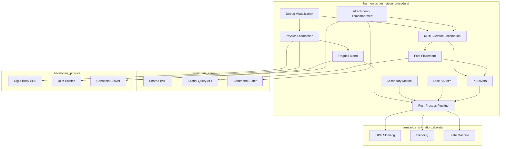
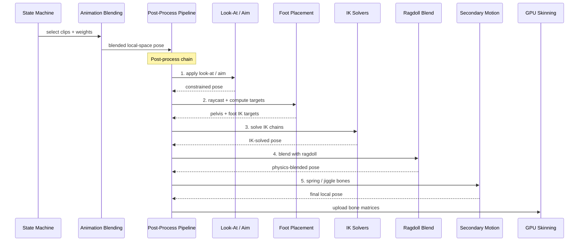
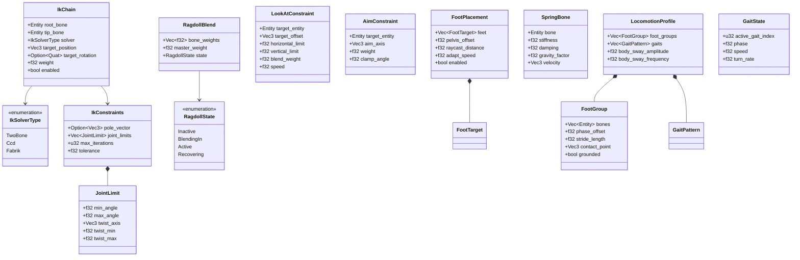
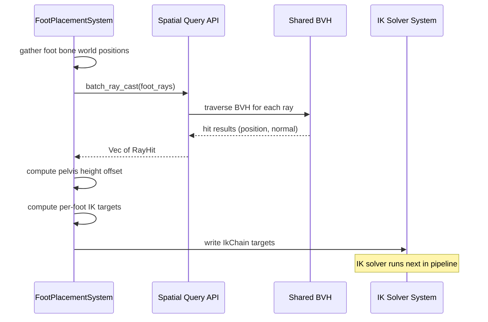
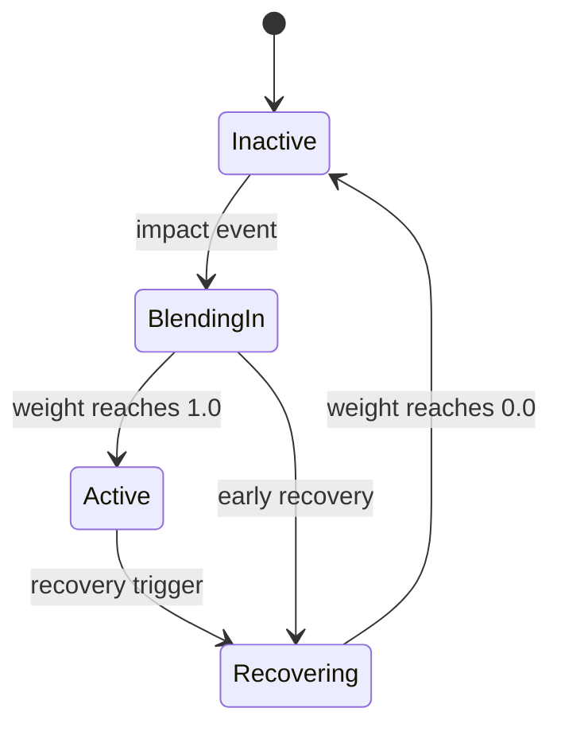
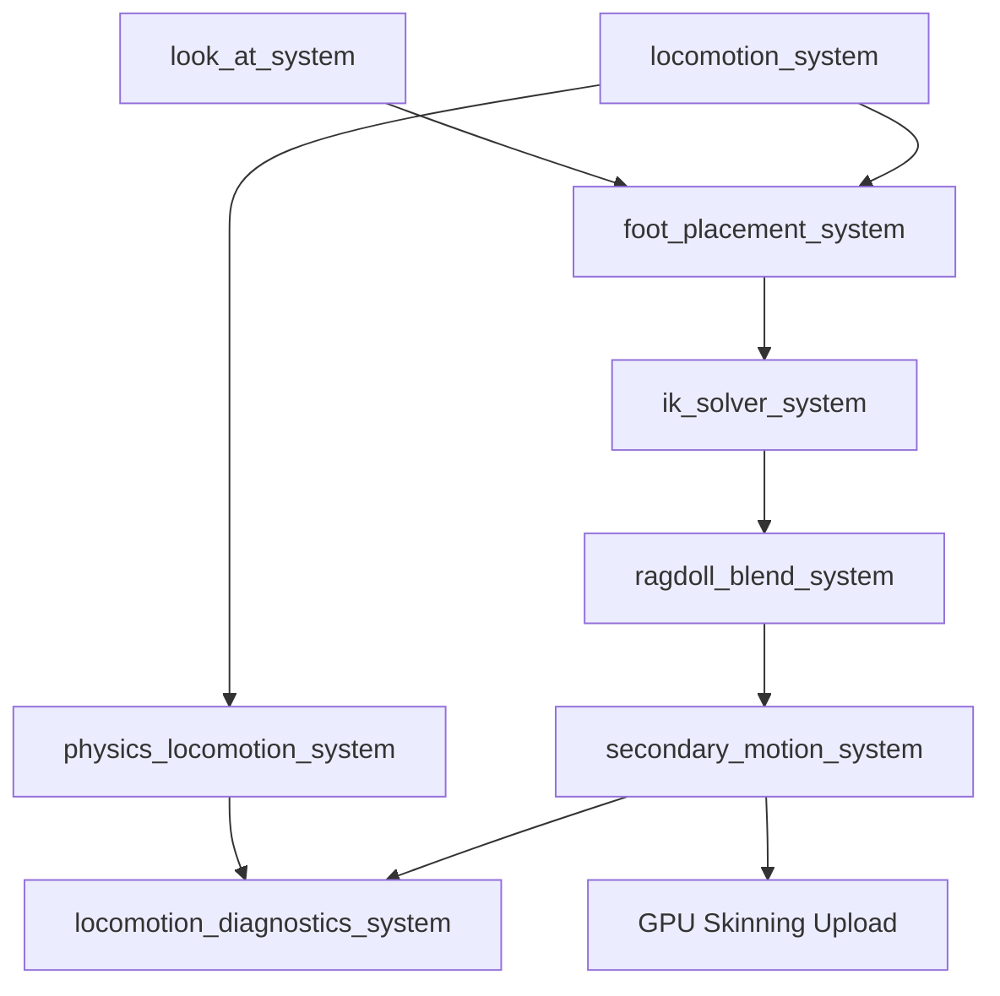

# Procedural Animation Design

## Requirements Trace

> **Canonical sources:** Features, requirements, and user stories are defined in
> [features/animation/](../../features/animation/),
> [requirements/animation/](../../requirements/animation/), and
> [user-stories/animation/](../../user-stories/animation/). The table below traces design elements
> to those definitions.

| Feature | Requirement | User Stories | Description |
|---------|-------------|--------------|-------------|
| F-9.3.1 | R-9.3.1 | US-9.3.1.1, US-9.3.1.2, US-9.3.1.3 | Analytical two-bone IK with pole vectors, GPU post-process |
| F-9.3.2 | R-9.3.2 | US-9.3.2.1, US-9.3.2.2 | CCD IK for medium chains (3-8 bones), GPU compute |
| F-9.3.3 | R-9.3.3 | US-9.3.3.1, US-9.3.3.2 | FABRIK IK for long chains and multi-end-effector problems |
| F-9.3.4 | R-9.3.4 | US-9.3.4.1, US-9.3.4.2, US-9.3.4.3 | Ragdoll blend with per-bone weights, partial ragdoll, recovery |
| F-9.3.5 | R-9.3.5 | US-9.3.5.1, US-9.3.5.2 | Look-at and aim constraints with angle limits |
| F-9.3.6 | R-9.3.6 | US-9.3.6.1, US-9.3.6.2 | Motion matching pose database search |
| F-9.3.7 | R-9.3.7 | US-9.3.7.1, US-9.3.7.2 | Foot placement via raycasts + IK, pelvis adjustment |
| F-9.3.8 | R-9.3.8 | US-9.3.8.1, US-9.3.8.2, US-9.3.8.3 | Multi-skeleton procedural locomotion (biped to hexapod+) |
| F-9.3.9 | R-9.3.9 | US-9.3.9.1, US-9.3.9.2 | Physics-based locomotion with torques and balance PID |
| F-9.3.10 | R-9.3.10 | US-9.3.10.1, US-9.3.10.2, US-9.3.10.3 | Procedural attachment and dismemberment via ECS commands |
| F-9.3.11 | R-9.3.11 | US-9.3.11.1, US-9.3.11.2, US-9.3.11.3 | Locomotion debug visualization, stripped from shipping |

### Cross-Cutting Dependencies

| Dependency | Source | Consumed API |
|------------|--------|-------------|
| GPU skinning | F-9.1.1 | Bone palette upload, compute skinning dispatch |
| Animation blending | F-9.1.3 | Blended local-space pose buffer |
| Root motion | F-9.1.6 | Root bone translation/rotation deltas |
| State machine | F-9.4 | Clip selection, blend weights |
| Shared BVH | F-1.9.1 | Spatial index for foot placement raycasts |
| Spatial query API | F-1.9.4 | `ray_cast`, `shape_cast` for ground probes |
| Batch spatial queries | F-1.9.5 | Parallel foot placement raycasts |
| Rigid body ECS | F-4.1.1 | Force/torque application for physics locomotion |
| Joint entities | F-4.3.1 | Ragdoll joint constraints |
| Constraint solver | F-4.3.5 | Joint-based ragdoll simulation |
| Command buffers | F-1.1.32 | Deferred attachment/dismemberment operations |
| Change detection | F-1.1.22 | Dirty tracking for IK target changes |
| Thread pool | F-14.3.1 | Scoped parallel IK batch evaluation |
| Reflection | F-1.3.1 | `Reflect` derive for all procedural components |

## Overview

The procedural animation system applies runtime modifications to poses produced by the skeletal
animation pipeline. It runs as an ordered chain of ECS systems in a **post-process phase** after the
state machine evaluates blended poses and before GPU skinning uploads bone matrices.

The design follows four principles:

1. **Post-process pipeline.** All procedural effects (IK, look-at, ragdoll blend, secondary motion)
   are independent systems executed in a fixed order after the animation blend.
2. **100% ECS-based.** Every solver reads/writes ECS components. No hidden state, no parallel data
   stores.
3. **Shared spatial index.** Foot placement and ground adaptation use the shared BVH (F-1.9.1) for
   raycasts instead of maintaining a separate collision structure.
4. **Static dispatch.** All solver selection is compile-time via enums. No trait objects, no
   vtables.

### Performance Targets

| Metric | Target |
|--------|--------|
| Two-bone IK (500 chains) | < 0.5 ms GPU |
| CCD IK (100 chains, 8 iter) | < 1.0 ms GPU |
| FABRIK (50 chains, 6 iter) | < 0.8 ms GPU |
| Foot placement raycasts (100 chars) | < 0.3 ms CPU |
| Look-at / aim (200 constraints) | < 0.2 ms GPU |
| Secondary motion (100 springs) | < 0.1 ms CPU |
| Ragdoll blend (50 characters) | < 0.2 ms CPU |

## Architecture

### Module Boundaries



### File Layout

```text
harmonius_animation/
├── procedural/
│   ├── mod.rs              # Re-exports
│   ├── ik/
│   │   ├── mod.rs          # IkSolver enum, shared types
│   │   ├── two_bone.rs     # Analytical two-bone solver
│   │   ├── ccd.rs          # CCD iterative solver
│   │   ├── fabrik.rs       # FABRIK position-space solver
│   │   └── constraints.rs  # Joint limits, pole vectors
│   ├── ragdoll.rs          # RagdollBlend, per-bone weights,
│   │                       # recovery transitions
│   ├── foot_placement.rs   # Ground raycasts, pelvis adjust,
│   │                       # stride adaptation
│   ├── look_at.rs          # LookAtConstraint, AimConstraint
│   ├── secondary.rs        # SpringBone, JiggleBone
│   ├── locomotion/
│   │   ├── mod.rs          # Re-exports
│   │   ├── profile.rs      # LocomotionProfile, GaitPattern
│   │   ├── gait.rs         # GaitState, phase computation
│   │   ├── foot_group.rs   # FootGroup, contact detection
│   │   └── physics.rs      # PhysicsLocomotion, PID balance
│   ├── attachment.rs       # Socket, Attach, Dismember
│   ├── pipeline.rs         # PostProcessPipeline, system
│   │                       # ordering
│   ├── diagnostics.rs      # Debug overlays, profiler panel
│   └── plugin.rs           # ProceduralAnimationPlugin
```

### Post-Process Pipeline Ordering

All procedural animation systems run in a fixed order within the `PostAnimation` schedule phase,
after animation blending and before GPU skinning.



### Core Data Structures



### Foot Placement Raycast Flow

Foot placement issues batch raycasts through the shared spatial query API (F-1.9.5) each frame.



### Ragdoll Blend State Machine



## API Design

### IK Components

```rust
/// Identifies which IK solver algorithm to use.
/// Static dispatch — no trait objects.
#[derive(
    Clone, Copy, Debug, PartialEq, Eq, Reflect,
)]
pub enum IkSolverType {
    /// Analytical two-bone solver (law of
    /// cosines). For arms and legs.
    TwoBone,
    /// Cyclic Coordinate Descent. For 3-8 bone
    /// chains (tails, spines, tentacles).
    Ccd,
    /// Forward And Backward Reaching IK. For long
    /// chains and multi-end-effector problems.
    Fabrik,
}

/// An IK chain to solve. Attached to the skeleton
/// root entity. Multiple IkChain components per
/// entity are supported via component storage.
#[derive(Component, Reflect)]
pub struct IkChain {
    /// First bone in the chain (closest to root).
    pub root_bone: Entity,
    /// Last bone in the chain (end effector).
    pub tip_bone: Entity,
    /// Solver algorithm to use.
    pub solver: IkSolverType,
    /// World-space target position for the
    /// end effector.
    pub target_position: Vec3,
    /// Optional target rotation for the end
    /// effector.
    pub target_rotation: Option<Quat>,
    /// Blend weight [0.0, 1.0]. 0 = ignore IK,
    /// 1 = full IK solve.
    pub weight: f32,
    /// Per-chain enable toggle.
    pub enabled: bool,
}

/// Constraints applied to an IK chain. Optional
/// companion component to IkChain.
#[derive(Component, Reflect)]
pub struct IkConstraints {
    /// Pole vector target (world space). Controls
    /// elbow/knee orientation for two-bone IK.
    pub pole_vector: Option<Vec3>,
    /// Per-joint angular limits. Index corresponds
    /// to bone index from root to tip.
    pub joint_limits: Vec<JointLimit>,
    /// Maximum solver iterations (CCD/FABRIK).
    /// Ignored for two-bone.
    pub max_iterations: u32,
    /// Convergence tolerance in world units.
    /// Solver stops when end-effector error is
    /// below this threshold.
    pub tolerance: f32,
}

/// Angular limits for a single joint in an IK
/// chain.
#[derive(Clone, Debug, Reflect)]
pub struct JointLimit {
    /// Minimum swing angle in radians.
    pub min_angle: f32,
    /// Maximum swing angle in radians.
    pub max_angle: f32,
    /// Local-space twist axis.
    pub twist_axis: Vec3,
    /// Minimum twist rotation in radians.
    pub twist_min: f32,
    /// Maximum twist rotation in radians.
    pub twist_max: f32,
}

impl Default for IkConstraints {
    fn default() -> Self {
        Self {
            pole_vector: None,
            joint_limits: Vec::new(),
            max_iterations: 10,
            tolerance: 0.01,
        }
    }
}
```

### IK Solvers

```rust
/// Two-bone analytical IK solver.
/// Uses law of cosines to compute joint angles.
pub fn solve_two_bone(
    root: &mut Transform,
    mid: &mut Transform,
    tip: &Transform,
    target: Vec3,
    pole_vector: Option<Vec3>,
    weight: f32,
) -> bool {
    // 1. Compute chain lengths
    // 2. Clamp target to reachable range
    // 3. Law of cosines for mid-joint angle
    // 4. Rotate root toward target
    // 5. Apply pole vector twist
    // 6. Blend result with original by weight
    // Returns true if target is reachable
    todo!()
}

/// CCD iterative IK solver.
/// Rotates each joint toward the target from
/// tip to root, repeating for max_iterations.
pub fn solve_ccd(
    bones: &mut [Transform],
    target: Vec3,
    constraints: &IkConstraints,
    weight: f32,
) -> f32 {
    // For each iteration:
    //   For each bone from tip to root:
    //     1. Compute vector from bone to tip
    //     2. Compute vector from bone to target
    //     3. Rotate bone to align vectors
    //     4. Clamp to joint limits
    // Returns residual error (distance to target)
    todo!()
}

/// FABRIK position-space IK solver.
/// Forward pass: move joints toward target.
/// Backward pass: restore root position.
pub fn solve_fabrik(
    bones: &mut [Transform],
    target: Vec3,
    constraints: &IkConstraints,
    weight: f32,
) -> f32 {
    // For each iteration:
    //   Forward pass (tip to root):
    //     1. Place tip at target
    //     2. Move each parent to maintain distance
    //   Backward pass (root to tip):
    //     1. Restore root to original position
    //     2. Move each child to maintain distance
    //   Apply joint constraints after each pass
    // Returns residual error
    todo!()
}

/// Multi-end-effector FABRIK extension.
/// Solves branching chains with priority weights.
pub fn solve_fabrik_multi(
    chains: &mut [FabrikSubChain],
    shared_root: &mut Transform,
    constraints: &IkConstraints,
) -> f32 {
    // 1. Solve each sub-chain independently
    // 2. Average shared joint positions weighted
    //    by priority
    // 3. Backward pass from shared root
    // Returns max residual error across chains
    todo!()
}

/// A sub-chain in a multi-end-effector FABRIK
/// problem. Each sub-chain shares a common root.
pub struct FabrikSubChain {
    pub bones: Vec<Entity>,
    pub target: Vec3,
    /// Priority weight for averaging at shared
    /// joints. Higher = more influence.
    pub priority: f32,
}
```

### IK Solver ECS System

```rust
/// ECS system that solves all active IK chains.
/// Runs in PostAnimation phase after foot
/// placement writes targets and before ragdoll
/// blend.
///
/// Schedule: PostAnimation, after
///   foot_placement_system, before
///   ragdoll_blend_system.
pub fn ik_solver_system(
    mut bones: Query<&mut Transform>,
    chains: Query<
        (&IkChain, Option<&IkConstraints>),
    >,
    skeletons: Query<&SkeletonBoneMap>,
) {
    for (chain, constraints) in chains.iter() {
        if !chain.enabled || chain.weight <= 0.0 {
            continue;
        }
        let constraints = constraints
            .cloned()
            .unwrap_or_default();

        match chain.solver {
            IkSolverType::TwoBone => {
                // Extract root, mid, tip bones
                // Call solve_two_bone
            }
            IkSolverType::Ccd => {
                // Collect bone chain from
                // root_bone to tip_bone
                // Call solve_ccd
            }
            IkSolverType::Fabrik => {
                // Collect bone chain
                // Call solve_fabrik
            }
        }
    }
}
```

### Ragdoll Blend

```rust
/// Ragdoll lifecycle state. Drives blend weight
/// interpolation.
#[derive(
    Clone, Copy, Debug, PartialEq, Eq, Reflect,
)]
pub enum RagdollState {
    /// No ragdoll active. Blend weight = 0.
    Inactive,
    /// Transitioning from animation to ragdoll.
    /// Weight increasing toward 1.0.
    BlendingIn,
    /// Fully ragdoll-driven.
    Active,
    /// Transitioning from ragdoll back to
    /// animation. Weight decreasing toward 0.0.
    Recovering,
}

/// Per-skeleton ragdoll blend configuration.
/// Attached to the skeleton root entity.
#[derive(Component, Reflect)]
pub struct RagdollBlend {
    /// Per-bone blend weights. Index maps to bone
    /// index in the skeleton. 0.0 = fully
    /// animated, 1.0 = fully physics-driven.
    pub bone_weights: Vec<f32>,
    /// Master weight multiplied with all
    /// per-bone weights.
    pub master_weight: f32,
    /// Current ragdoll lifecycle state.
    pub state: RagdollState,
    /// Duration of blend-in transition in
    /// seconds.
    pub blend_in_duration: f32,
    /// Duration of recovery transition in
    /// seconds.
    pub recovery_duration: f32,
    /// Elapsed time in current state.
    pub elapsed: f32,
}

/// Partial ragdoll bone mask. Specifies which
/// bones participate in ragdoll simulation.
/// Bones not in the mask remain fully animated.
#[derive(Component, Reflect)]
pub struct RagdollBoneMask {
    /// Bone indices that participate in ragdoll.
    pub active_bones: Vec<u32>,
}

/// Event triggering ragdoll activation.
#[derive(Event)]
pub struct RagdollActivateEvent {
    pub entity: Entity,
    /// Optional: only ragdoll these bones.
    /// None = full ragdoll.
    pub bone_mask: Option<Vec<u32>>,
    /// Impulse to apply at activation.
    pub impulse: Vec3,
    /// World-space hit point for impulse.
    pub hit_point: Vec3,
}

/// Event triggering ragdoll recovery.
#[derive(Event)]
pub struct RagdollRecoverEvent {
    pub entity: Entity,
}

/// ECS system that blends animated and ragdoll
/// poses per bone. Reads physics joint positions
/// from the constraint solver output.
///
/// Schedule: PostAnimation, after ik_solver_system,
///   before secondary_motion_system.
pub fn ragdoll_blend_system(
    mut skeletons: Query<(
        &mut RagdollBlend,
        &SkeletonBoneMap,
        Option<&RagdollBoneMask>,
    )>,
    mut bones: Query<&mut Transform>,
    physics_poses: Query<
        &GlobalTransform,
        With<RagdollBody>,
    >,
    time: Res<Time>,
) {
    for (mut blend, bone_map, mask) in
        skeletons.iter_mut()
    {
        // 1. Update state machine
        advance_ragdoll_state(
            &mut blend,
            time.delta_seconds(),
        );

        if blend.state == RagdollState::Inactive {
            continue;
        }

        // 2. For each bone, lerp between animated
        //    and physics transforms
        for (idx, bone_entity) in
            bone_map.bones.iter().enumerate()
        {
            let effective_weight =
                blend.master_weight
                    * blend.bone_weights[idx];

            if effective_weight <= 0.0 {
                continue;
            }

            // Check bone mask if partial ragdoll
            if let Some(m) = mask {
                if !m.active_bones.contains(
                    &(idx as u32),
                ) {
                    continue;
                }
            }

            // Blend: lerp(animated, physics, w)
            if let Ok(physics_tf) =
                physics_poses.get(*bone_entity)
            {
                if let Ok(mut bone_tf) =
                    bones.get_mut(*bone_entity)
                {
                    bone_tf.translation = Vec3::lerp(
                        bone_tf.translation,
                        physics_tf.translation(),
                        effective_weight,
                    );
                    bone_tf.rotation = Quat::slerp(
                        bone_tf.rotation,
                        physics_tf.rotation(),
                        effective_weight,
                    );
                }
            }
        }
    }
}

fn advance_ragdoll_state(
    blend: &mut RagdollBlend,
    dt: f32,
) {
    blend.elapsed += dt;
    match blend.state {
        RagdollState::Inactive => {}
        RagdollState::BlendingIn => {
            let t = (blend.elapsed
                / blend.blend_in_duration)
                .min(1.0);
            blend.master_weight = t;
            if t >= 1.0 {
                blend.state = RagdollState::Active;
                blend.elapsed = 0.0;
            }
        }
        RagdollState::Active => {}
        RagdollState::Recovering => {
            let t = (blend.elapsed
                / blend.recovery_duration)
                .min(1.0);
            blend.master_weight = 1.0 - t;
            if t >= 1.0 {
                blend.state =
                    RagdollState::Inactive;
                blend.elapsed = 0.0;
            }
        }
    }
}
```

### Look-At and Aim Constraints

```rust
/// Procedurally rotates head and spine bones to
/// track a world-space target. Distributes
/// rotation across the spine chain respecting
/// per-joint angle limits.
#[derive(Component, Reflect)]
pub struct LookAtConstraint {
    /// Entity to track. The constraint reads
    /// GlobalTransform from this entity.
    pub target_entity: Entity,
    /// Local-space offset from target entity
    /// position.
    pub target_offset: Vec3,
    /// Maximum horizontal rotation in radians.
    pub horizontal_limit: f32,
    /// Maximum vertical rotation in radians.
    pub vertical_limit: f32,
    /// Blend weight [0.0, 1.0].
    pub blend_weight: f32,
    /// Rotation speed in radians per second.
    /// 0 = instant snap.
    pub speed: f32,
    /// Bones to distribute rotation across, from
    /// lowest (spine) to highest (head). Each
    /// bone receives a fraction of the total
    /// rotation.
    pub bone_chain: Vec<Entity>,
    /// Per-bone weight distribution. Must sum
    /// to 1.0. Example: [0.2, 0.3, 0.5] for
    /// spine, neck, head.
    pub bone_weights: Vec<f32>,
}

/// Orients weapon-holding arms toward a target
/// for aiming. Applied after look-at.
#[derive(Component, Reflect)]
pub struct AimConstraint {
    /// Entity to aim at.
    pub target_entity: Entity,
    /// Local-space aim direction vector of the
    /// weapon bone. Typically Vec3::Z (forward).
    pub aim_axis: Vec3,
    /// Blend weight [0.0, 1.0].
    pub weight: f32,
    /// Maximum aim deflection angle in radians.
    pub clamp_angle: f32,
    /// Bone holding the weapon.
    pub weapon_bone: Entity,
    /// Additional spine/shoulder bones that
    /// participate in the aim rotation.
    pub support_bones: Vec<Entity>,
    /// Per-support-bone weight distribution.
    pub support_weights: Vec<f32>,
}

/// ECS system applying look-at and aim
/// constraints. Runs first in the post-process
/// pipeline.
///
/// Schedule: PostAnimation, first in pipeline.
pub fn look_at_system(
    mut bones: Query<&mut Transform>,
    look_ats: Query<&LookAtConstraint>,
    aims: Query<&AimConstraint>,
    targets: Query<&GlobalTransform>,
    time: Res<Time>,
) {
    // 1. Process look-at constraints
    for look_at in look_ats.iter() {
        if look_at.blend_weight <= 0.0 {
            continue;
        }
        let Ok(target_tf) =
            targets.get(look_at.target_entity)
        else {
            continue;
        };
        let target_pos = target_tf.translation()
            + look_at.target_offset;

        // Distribute rotation across bone chain
        // Clamp per bone to angle limits
        // Smooth interpolation by speed * dt
    }

    // 2. Process aim constraints
    for aim in aims.iter() {
        if aim.weight <= 0.0 {
            continue;
        }
        let Ok(target_tf) =
            targets.get(aim.target_entity)
        else {
            continue;
        };

        // Compute aim rotation from weapon bone
        // forward to target direction
        // Clamp to clamp_angle
        // Distribute across support bones
        // Blend by weight
    }
}
```

### Foot Placement

```rust
/// Per-foot contact target used by the foot
/// placement system.
#[derive(Clone, Debug, Reflect)]
pub struct FootTarget {
    /// Bone entity at the ankle/foot.
    pub bone: Entity,
    /// Current ground contact position
    /// (world space).
    pub ground_position: Vec3,
    /// Ground surface normal at contact.
    pub ground_normal: Vec3,
    /// Whether the foot is currently planted.
    pub grounded: bool,
    /// Vertical offset to apply to the foot
    /// bone to reach the ground.
    pub ik_offset: f32,
}

/// Foot placement configuration. Attached to
/// the skeleton root entity.
#[derive(Component, Reflect)]
pub struct FootPlacement {
    /// Foot targets, one per foot.
    pub feet: Vec<FootTarget>,
    /// Current pelvis height offset computed
    /// from foot placement.
    pub pelvis_offset: f32,
    /// Maximum raycast distance below foot
    /// position.
    pub raycast_distance: f32,
    /// Speed of pelvis and foot adaptation.
    /// Higher = faster tracking.
    pub adapt_speed: f32,
    /// Per-entity enable toggle.
    pub enabled: bool,
    /// Entity of the pelvis/hips bone.
    pub pelvis_bone: Entity,
}

/// ECS system performing foot placement. Issues
/// batch raycasts through the shared spatial
/// query API, computes IK targets, and adjusts
/// pelvis height.
///
/// Schedule: PostAnimation, after
///   look_at_system, before ik_solver_system.
pub fn foot_placement_system(
    mut placements: Query<
        (&mut FootPlacement, &SkeletonBoneMap),
    >,
    mut ik_chains: Query<&mut IkChain>,
    bones: Query<&GlobalTransform>,
    spatial: Res<QueryEngine>,
    time: Res<Time>,
) {
    // Gather all foot rays across all entities
    let mut rays: Vec<Ray> = Vec::new();
    let mut ray_map: Vec<(Entity, usize)> =
        Vec::new();

    for (placement, _bone_map) in
        placements.iter()
    {
        if !placement.enabled {
            continue;
        }
        for (foot_idx, foot) in
            placement.feet.iter().enumerate()
        {
            if let Ok(foot_tf) =
                bones.get(foot.bone)
            {
                let origin =
                    foot_tf.translation()
                        + Vec3::Y * 0.5;
                rays.push(Ray {
                    origin,
                    direction: -Vec3::Y,
                    max_distance:
                        placement.raycast_distance,
                });
                ray_map.push((
                    foot.bone,
                    foot_idx,
                ));
            }
        }
    }

    // Batch raycast through shared spatial index
    let hits =
        spatial.batch_ray_cast(&rays);

    // Process results: update foot targets
    // and pelvis offset
    let dt = time.delta_seconds();
    for (placement, _bone_map) in
        placements.iter_mut()
    {
        // 1. Update each foot target from
        //    raycast hit
        // 2. Compute pelvis offset as the
        //    minimum foot offset
        // 3. Smooth pelvis and foot offsets
        //    by adapt_speed * dt
        // 4. Write IK chain targets for each
        //    foot
    }
}
```

### Secondary Motion (Spring / Jiggle Bones)

```rust
/// Spring-driven secondary motion applied to
/// decorative bones (hair, cloth tips, antennae,
/// pouches). Physics-like motion without the
/// physics solver.
#[derive(Component, Reflect)]
pub struct SpringBone {
    /// Bone entity to drive.
    pub bone: Entity,
    /// Spring stiffness coefficient.
    /// Higher = snappier return to rest pose.
    pub stiffness: f32,
    /// Damping coefficient. Higher = less
    /// oscillation.
    pub damping: f32,
    /// Gravity influence factor. 0 = no gravity,
    /// 1 = full gravity.
    pub gravity_factor: f32,
    /// Wind influence factor.
    pub wind_factor: f32,
    /// Maximum displacement from rest pose
    /// in world units.
    pub max_displacement: f32,
}

/// Internal velocity state for spring bone
/// simulation. Not serialized — recomputed
/// at runtime.
#[derive(Component)]
pub struct SpringBoneState {
    /// Current velocity in world space.
    pub velocity: Vec3,
    /// Previous frame rest position.
    pub prev_rest_position: Vec3,
}

/// Collection of spring bones on a skeleton.
/// Attached to the skeleton root entity.
#[derive(Component, Reflect)]
pub struct SpringBoneChain {
    /// Ordered list of spring bones from root
    /// to tip. Each bone inherits motion from
    /// its parent.
    pub bones: Vec<SpringBone>,
    /// Collision radius for each bone (optional
    /// self-collision prevention).
    pub collision_radii: Vec<f32>,
}

/// ECS system simulating spring bone dynamics.
/// Runs last in the post-process pipeline.
///
/// Schedule: PostAnimation, after
///   ragdoll_blend_system.
pub fn secondary_motion_system(
    mut chains: Query<&SpringBoneChain>,
    mut states: Query<&mut SpringBoneState>,
    mut bones: Query<&mut Transform>,
    globals: Query<&GlobalTransform>,
    time: Res<Time>,
    wind: Option<Res<WindField>>,
) {
    let dt = time.delta_seconds();
    let wind_vec = wind
        .map(|w| w.sample_global())
        .unwrap_or(Vec3::ZERO);

    for chain in chains.iter() {
        for spring in chain.bones.iter() {
            let Ok(mut state) =
                states.get_mut(spring.bone)
            else {
                continue;
            };
            let Ok(global) =
                globals.get(spring.bone)
            else {
                continue;
            };

            // Verlet integration:
            // 1. Compute spring force toward
            //    rest position
            // 2. Add gravity * gravity_factor
            // 3. Add wind * wind_factor
            // 4. Apply damping
            // 5. Integrate velocity
            // 6. Clamp displacement
            let rest = global.translation();
            let spring_force = (rest
                - state.prev_rest_position)
                * spring.stiffness;
            let gravity =
                Vec3::Y * -9.81
                    * spring.gravity_factor;
            let wind_force =
                wind_vec * spring.wind_factor;

            state.velocity += (spring_force
                + gravity
                + wind_force)
                * dt;
            state.velocity *=
                1.0 - spring.damping * dt;

            // Clamp to max displacement
            if state.velocity.length()
                > spring.max_displacement / dt
            {
                state.velocity = state
                    .velocity
                    .normalize()
                    * spring.max_displacement
                    / dt;
            }

            // Apply to local transform
            if let Ok(mut bone_tf) =
                bones.get_mut(spring.bone)
            {
                bone_tf.translation +=
                    state.velocity * dt;
            }

            state.prev_rest_position = rest;
        }
    }
}
```

### Multi-Skeleton Procedural Locomotion

```rust
/// Locomotion gait patterns for multi-skeleton
/// creatures.
#[derive(
    Clone, Copy, Debug, PartialEq, Eq, Reflect,
)]
pub enum GaitPattern {
    /// Alternating bipedal walk.
    Walk,
    /// Diagonal pair trot (quadruped).
    Trot,
    /// Asymmetric three-beat (quadruped).
    Canter,
    /// Suspension gallop (quadruped).
    Gallop,
    /// Tripod gait (hexapod).
    Tripod,
    /// Wave gait (many-legged).
    Wave,
    /// Serpentine lateral undulation.
    Serpentine,
}

/// Locomotion profile defining how a skeleton
/// topology moves. Data-driven, one per species.
#[derive(Component, Reflect)]
pub struct LocomotionProfile {
    /// Foot groups with phase offsets.
    pub foot_groups: Vec<FootGroup>,
    /// Available gait patterns ordered by speed.
    pub gaits: Vec<GaitDefinition>,
    /// Body sway amplitude during locomotion.
    pub body_sway_amplitude: f32,
    /// Body sway frequency multiplier relative
    /// to step frequency.
    pub body_sway_frequency: f32,
    /// Pelvis vertical oscillation amplitude.
    pub pelvis_bob_amplitude: f32,
}

/// Definition of a single gait with speed range.
#[derive(Clone, Debug, Reflect)]
pub struct GaitDefinition {
    /// Gait type.
    pub pattern: GaitPattern,
    /// Minimum speed for this gait.
    pub min_speed: f32,
    /// Maximum speed for this gait.
    pub max_speed: f32,
    /// Stride length at reference speed.
    pub stride_length: f32,
    /// Stride length curve: speed -> length.
    pub stride_curve: AnimationCurve,
    /// Phase offsets per foot group for this
    /// gait. Index matches foot_groups order.
    pub phase_offsets: Vec<f32>,
}

/// A group of feet that move together in a gait
/// cycle (e.g., left front + right rear in trot).
#[derive(Component, Reflect)]
pub struct FootGroup {
    /// Bone entities for the feet in this group.
    pub bones: Vec<Entity>,
    /// IK chain entities for these feet.
    pub ik_chains: Vec<Entity>,
    /// Default stride length.
    pub stride_length: f32,
    /// Contact point offset from bone in local
    /// space.
    pub contact_offset: Vec3,
    /// Whether the foot group is currently
    /// grounded.
    pub grounded: bool,
}

/// Runtime gait state. Updated per frame by the
/// locomotion system.
#[derive(Component, Reflect)]
pub struct GaitState {
    /// Index into LocomotionProfile.gaits for
    /// the currently active gait.
    pub active_gait_index: u32,
    /// Current phase in the gait cycle [0, 1).
    pub phase: f32,
    /// Current locomotion speed.
    pub speed: f32,
    /// Current turn rate in radians per second.
    pub turn_rate: f32,
    /// Terrain slope angle at the character's
    /// position.
    pub terrain_slope: f32,
}

/// ECS system driving multi-skeleton procedural
/// locomotion. Computes gait transitions, foot
/// placement cycles, and body oscillation.
///
/// Schedule: PostAnimation, before
///   foot_placement_system.
pub fn locomotion_system(
    mut query: Query<(
        &LocomotionProfile,
        &mut GaitState,
        &mut FootPlacement,
    )>,
    mut foot_groups: Query<&mut FootGroup>,
    time: Res<Time>,
) {
    let dt = time.delta_seconds();

    for (profile, mut gait, mut placement) in
        query.iter_mut()
    {
        // 1. Select gait based on speed
        let new_gait_idx = select_gait(
            &profile.gaits,
            gait.speed,
        );
        if new_gait_idx != gait.active_gait_index
        {
            gait.active_gait_index = new_gait_idx;
        }

        let gait_def =
            &profile.gaits
                [gait.active_gait_index as usize];

        // 2. Advance phase
        let stride = gait_def
            .stride_curve
            .evaluate(gait.speed);
        let step_freq = gait.speed / stride;
        gait.phase =
            (gait.phase + step_freq * dt) % 1.0;

        // 3. Compute per-foot-group contact state
        for (idx, fg) in
            profile.foot_groups.iter().enumerate()
        {
            let phase_offset =
                gait_def.phase_offsets[idx];
            let foot_phase =
                (gait.phase + phase_offset) % 1.0;

            // Foot is grounded during first half
            // of its phase cycle
            let grounded = foot_phase < 0.5;

            if let Ok(mut group) =
                foot_groups.get_mut(
                    fg.bones[0], // first bone
                )
            {
                group.grounded = grounded;
            }
        }

        // 4. Compute body sway and pelvis bob
        let sway_phase = gait.phase
            * std::f32::consts::TAU
            * profile.body_sway_frequency;
        let _sway = sway_phase.sin()
            * profile.body_sway_amplitude;
        let _bob = (sway_phase * 2.0).sin()
            * profile.pelvis_bob_amplitude;

        // 5. Adjust stride for terrain slope
        // Shorter strides uphill, longer downhill
    }
}

fn select_gait(
    gaits: &[GaitDefinition],
    speed: f32,
) -> u32 {
    for (i, g) in gaits.iter().enumerate() {
        if speed >= g.min_speed
            && speed <= g.max_speed
        {
            return i as u32;
        }
    }
    0
}
```

### Physics-Based Locomotion

```rust
/// Configuration for physics-driven locomotion.
/// Attached to characters that use physical
/// forces for movement.
#[derive(Component, Reflect)]
pub struct PhysicsLocomotion {
    /// Muscle strength multiplier per joint.
    pub muscle_strength: Vec<f32>,
    /// Joint damping coefficients.
    pub joint_damping: Vec<f32>,
    /// PID gains for balance control.
    pub balance_pid: PidGains,
    /// Maximum torque per joint in Newton-meters.
    pub max_torque: f32,
    /// Stumble threshold: angular deviation from
    /// upright in radians before stumble state.
    pub stumble_threshold: f32,
    /// Recovery threshold: angular deviation
    /// below which balance is considered
    /// regained.
    pub recovery_threshold: f32,
    /// Whether physics locomotion is active.
    pub enabled: bool,
}

/// PID controller gains for balance.
#[derive(Clone, Debug, Reflect)]
pub struct PidGains {
    /// Proportional gain.
    pub kp: f32,
    /// Integral gain.
    pub ki: f32,
    /// Derivative gain.
    pub kd: f32,
}

/// Runtime state for physics-based balance.
#[derive(Component)]
pub struct BalanceState {
    /// Center of mass in world space.
    pub center_of_mass: Vec3,
    /// Support polygon centroid.
    pub support_center: Vec3,
    /// Accumulated integral error for PID.
    pub integral_error: Vec3,
    /// Previous frame error for PID derivative.
    pub prev_error: Vec3,
    /// Current tilt angle from upright.
    pub tilt_angle: f32,
    /// Whether the character is stumbling.
    pub stumbling: bool,
}

/// ECS system computing physical forces for
/// locomotion. Applies torques through the
/// physics rigid body system.
///
/// Schedule: PostAnimation, after
///   locomotion_system. Writes to RigidBody
///   force/torque components consumed by
///   the physics step.
pub fn physics_locomotion_system(
    mut query: Query<(
        &PhysicsLocomotion,
        &mut BalanceState,
        &LocomotionProfile,
        &GaitState,
    )>,
    mut bodies: Query<(
        &mut ExternalForce,
        &mut ExternalTorque,
        &GlobalTransform,
    )>,
    time: Res<Time>,
) {
    let dt = time.delta_seconds();

    for (config, mut balance, _profile, _gait)
        in query.iter_mut()
    {
        if !config.enabled {
            continue;
        }

        // 1. Compute center of mass from all
        //    limb positions
        // 2. Compute support polygon from
        //    grounded feet
        // 3. PID balance controller:
        //    error = support_center - com
        //    projected onto ground plane
        let error = balance.support_center
            - balance.center_of_mass;
        let error_xz =
            Vec3::new(error.x, 0.0, error.z);

        balance.integral_error +=
            error_xz * dt;
        let derivative =
            (error_xz - balance.prev_error) / dt;

        let correction =
            error_xz * config.balance_pid.kp
                + balance.integral_error
                    * config.balance_pid.ki
                + derivative
                    * config.balance_pid.kd;
        balance.prev_error = error_xz;

        // 4. Detect stumble
        balance.tilt_angle =
            error_xz.length().atan();
        balance.stumbling = balance.tilt_angle
            > config.stumble_threshold;

        // 5. Apply corrective torques to joints
        //    Scale by muscle_strength per joint
        //    Clamp to max_torque
    }
}
```

### Procedural Attachment and Dismemberment

```rust
/// A socket on a skeleton where sub-hierarchies
/// can be attached. Defined at authoring time.
#[derive(Component, Reflect)]
pub struct AttachmentSocket {
    /// Name of the socket for lookup.
    pub name: String,
    /// Bone entity this socket is parented to.
    pub bone: Entity,
    /// Local-space offset from the bone.
    pub offset: Transform,
    /// Currently attached entity, if any.
    pub attached: Option<Entity>,
}

/// Marker component on an entity that is
/// attached to a socket.
#[derive(Component, Reflect)]
pub struct AttachedTo {
    /// Socket entity this is attached to.
    pub socket: Entity,
    /// Original skeleton entity.
    pub skeleton: Entity,
}

/// Command to attach a sub-hierarchy to a socket.
/// Executed through ECS command buffers.
pub struct AttachCommand {
    /// Entity to attach.
    pub entity: Entity,
    /// Socket entity to attach to.
    pub socket: Entity,
}

/// Command to dismember a bone chain from a
/// skeleton.
pub struct DismemberCommand {
    /// Skeleton entity.
    pub skeleton: Entity,
    /// Root bone of the chain to sever.
    pub sever_bone: Entity,
    /// Impulse to apply to the severed part.
    pub impulse: Vec3,
}

/// ECS system processing attachment commands.
///
/// Schedule: PostUpdate, after animation pipeline.
pub fn attachment_system(
    mut commands: Commands,
    mut sockets: Query<&mut AttachmentSocket>,
    mut attached: Query<(
        &mut Transform,
        &AttachedTo,
    )>,
    globals: Query<&GlobalTransform>,
) {
    // Update attached entity transforms to
    // follow their socket bone each frame
    for (mut tf, attach) in attached.iter_mut() {
        if let Ok(socket) =
            sockets.get(attach.socket)
        {
            if let Ok(bone_tf) =
                globals.get(socket.bone)
            {
                // Set transform relative to bone
                *tf = socket.offset;
            }
        }
    }
}

/// ECS system processing dismemberment commands.
/// Severs a bone chain, spawns the detached
/// sub-mesh as an independent entity with ragdoll,
/// and notifies the locomotion system to adapt.
///
/// Schedule: PostUpdate, after attachment_system.
pub fn dismemberment_system(
    mut commands: Commands,
    mut events: EventReader<DismemberCommand>,
    mut skeletons: Query<(
        &mut SkeletonBoneMap,
        &mut LocomotionProfile,
    )>,
    bone_hierarchy: Query<&Children>,
) {
    for event in events.read() {
        // 1. Collect all descendant bones of
        //    sever_bone
        // 2. Remove those bones from the
        //    skeleton's bone map
        // 3. Spawn a new entity with:
        //    - Detached sub-mesh
        //    - Independent ragdoll (RagdollBlend)
        //    - Apply impulse
        // 4. Update LocomotionProfile to remove
        //    severed foot groups
        // 5. Trigger gait recomputation
        commands.entity(event.skeleton)
            .insert(LocomotionDirty);
    }
}

/// Marker component indicating the locomotion
/// profile needs recomputation after
/// dismemberment.
#[derive(Component)]
pub struct LocomotionDirty;
```

### Post-Process Pipeline Orchestration

```rust
/// Configures the ordering of all procedural
/// animation systems in the PostAnimation
/// schedule phase.
pub struct ProceduralAnimationPlugin;

impl Plugin for ProceduralAnimationPlugin {
    fn build(&self, app: &mut App) {
        app.add_systems(
            PostAnimation,
            (
                look_at_system,
                foot_placement_system
                    .after(look_at_system)
                    .after(locomotion_system),
                ik_solver_system
                    .after(foot_placement_system),
                ragdoll_blend_system
                    .after(ik_solver_system),
                secondary_motion_system
                    .after(ragdoll_blend_system),
            ),
        );

        // Locomotion runs before foot placement
        app.add_systems(
            PostAnimation,
            locomotion_system
                .before(foot_placement_system),
        );

        // Physics locomotion after locomotion
        app.add_systems(
            PostAnimation,
            physics_locomotion_system
                .after(locomotion_system),
        );

        // Attachment and dismemberment in
        // PostUpdate (structural changes)
        app.add_systems(
            PostUpdate,
            (
                attachment_system,
                dismemberment_system
                    .after(attachment_system),
            ),
        );

        // Debug visualization (dev builds only)
        #[cfg(debug_assertions)]
        app.add_systems(
            PostAnimation,
            locomotion_diagnostics_system
                .after(secondary_motion_system),
        );

        // Register events
        app.add_event::<RagdollActivateEvent>();
        app.add_event::<RagdollRecoverEvent>();

        // Register reflected types
        app.register_type::<IkChain>();
        app.register_type::<IkConstraints>();
        app.register_type::<RagdollBlend>();
        app.register_type::<LookAtConstraint>();
        app.register_type::<AimConstraint>();
        app.register_type::<FootPlacement>();
        app.register_type::<SpringBone>();
        app.register_type::<LocomotionProfile>();
        app.register_type::<GaitState>();
        app.register_type::<FootGroup>();
        app.register_type::<PhysicsLocomotion>();
        app.register_type::<AttachmentSocket>();
        app.register_type::<AttachedTo>();
    }
}
```

### Debug Visualization

```rust
/// Debug visualization settings for locomotion
/// diagnostics. Per-entity toggles.
#[derive(Component, Reflect)]
pub struct LocomotionDebugVis {
    /// Show foot placement targets vs actual.
    pub show_foot_targets: bool,
    /// Show IK chain bone axes and joint limits.
    pub show_ik_chains: bool,
    /// Show ground contact normals.
    pub show_ground_normals: bool,
    /// Show gait phase diagram.
    pub show_gait_phase: bool,
    /// Show center-of-mass and support polygon.
    pub show_balance: bool,
    /// Show physics force vectors.
    pub show_forces: bool,
    /// Show skeleton wireframe with bone axes.
    pub show_skeleton: bool,
}

/// Locomotion profiler metrics collected per
/// frame for the diagnostics panel.
#[derive(Default)]
pub struct LocomotionMetrics {
    /// Total IK iterations this frame.
    pub ik_iterations: u32,
    /// Maximum foot plant error in world units.
    pub max_foot_error: f32,
    /// Maximum physics force magnitude.
    pub max_force_magnitude: f32,
    /// Number of active IK chains.
    pub active_ik_chains: u32,
    /// Number of active ragdoll blends.
    pub active_ragdolls: u32,
}

/// ECS system rendering debug overlays for
/// procedural locomotion. Compiled out of
/// shipping builds via cfg(debug_assertions).
#[cfg(debug_assertions)]
pub fn locomotion_diagnostics_system(
    query: Query<(
        &LocomotionDebugVis,
        &FootPlacement,
        Option<&GaitState>,
        Option<&BalanceState>,
    )>,
    ik_chains: Query<&IkChain>,
    mut debug_draw: ResMut<DebugDraw>,
    mut metrics: ResMut<LocomotionMetrics>,
) {
    // Reset metrics
    *metrics = LocomotionMetrics::default();

    for (vis, placement, gait, balance) in
        query.iter()
    {
        if vis.show_foot_targets {
            for foot in &placement.feet {
                // Draw predicted position (blue)
                // Draw actual position (green)
                // Draw error line (red)
                debug_draw.sphere(
                    foot.ground_position,
                    0.05,
                    Color::GREEN,
                );
            }
        }

        if vis.show_ground_normals {
            for foot in &placement.feet {
                debug_draw.ray(
                    foot.ground_position,
                    foot.ground_normal * 0.3,
                    Color::CYAN,
                );
            }
        }

        if vis.show_balance {
            if let Some(bal) = balance {
                debug_draw.sphere(
                    bal.center_of_mass,
                    0.1,
                    Color::YELLOW,
                );
                debug_draw.sphere(
                    bal.support_center,
                    0.1,
                    Color::GREEN,
                );
            }
        }
    }

    // Collect IK metrics
    for chain in ik_chains.iter() {
        if chain.enabled {
            metrics.active_ik_chains += 1;
        }
    }
}
```

## Data Flow

### Per-Frame Execution Order

The procedural animation pipeline executes in a strict order within the `PostAnimation` schedule
phase. Each system reads the output of the previous system and writes to the shared pose buffer.

```rust
// PostAnimation phase execution order:
//
// 1. locomotion_system
//    Reads: LocomotionProfile, GaitState, speed
//    Writes: GaitState (phase, gait index),
//            FootGroup (grounded state)
//
// 2. look_at_system
//    Reads: LookAtConstraint, AimConstraint,
//           target GlobalTransform
//    Writes: bone Transform (rotation)
//
// 3. foot_placement_system
//    Reads: FootPlacement, bone GlobalTransform
//    Writes: FootTarget (ground_position,
//            ik_offset), IkChain (target_position),
//            pelvis_offset
//    External: batch_ray_cast via shared BVH
//
// 4. ik_solver_system
//    Reads: IkChain, IkConstraints
//    Writes: bone Transform (rotation)
//
// 5. ragdoll_blend_system
//    Reads: RagdollBlend, RagdollBoneMask,
//           physics GlobalTransform
//    Writes: bone Transform (position, rotation)
//
// 6. secondary_motion_system
//    Reads: SpringBoneChain
//    Writes: bone Transform (position),
//            SpringBoneState (velocity)
//
// 7. physics_locomotion_system
//    Reads: PhysicsLocomotion, BalanceState,
//           GaitState
//    Writes: ExternalForce, ExternalTorque,
//            BalanceState
//
// [dev only]
// 8. locomotion_diagnostics_system
//    Reads: all procedural components
//    Writes: DebugDraw, LocomotionMetrics
```

### System Dependency Graph



### Foot Placement Batch Raycast Pattern

All characters' foot placement raycasts are gathered into a single batch submitted to the shared
spatial query API. This amortizes BVH traversal overhead.

```rust
// Conceptual data flow for batch raycasts:
//
// Entity A: 2 feet -> rays[0], rays[1]
// Entity B: 4 feet -> rays[2..6]
// Entity C: 6 feet -> rays[6..12]
//
// Single call: spatial.batch_ray_cast(&rays)
//
// Results mapped back to entities via ray_map
// index table.
```

## Platform Considerations

### IK Chain Budget Per Platform

| Tier | Two-Bone | CCD (max iter) | FABRIK (max iter) |
|------|----------|-----------------|-------------------|
| Mobile | 20-40 | 2-4 | 2-3 |
| Switch | 80 | 6 | 4 |
| Desktop | 500+ | 8-12 | 6-8 |

### Ragdoll Budget Per Platform

| Tier | Capsules/Character | Simultaneous Ragdolls | Partial Ragdoll |
|------|-------------------|-----------------------|-----------------|
| Mobile | 4-8 | 2 | Hero only |
| Switch | 12 | 4 | Hero + nearby NPCs |
| Desktop | 16-20 | 16+ | All visible characters |

### Foot Placement Budget Per Platform

| Tier | Raycasts/Character | Characters w/ Foot IK | Notes |
|------|-------------------|-----------------------|-------|
| Mobile | 2 (feet only) | 4-8 | Disabled for distant characters |
| Switch | 3 (feet + pelvis) | 16 | Simplified for distant |
| Desktop | 4 (feet + pelvis + slope) | 100+ | Full precision |

### Dismembered Part Budget Per Platform

| Tier | Active Parts | Ragdoll Complexity |
|------|-------------|-------------------|
| Mobile | 2-4 | Simplified (4 capsules) |
| Switch | 4-8 | Standard (8 capsules) |
| Desktop | 8-16 | Full (16 capsules) |

### GPU Compute Considerations

IK solvers (two-bone, CCD, FABRIK) run as GPU compute passes when the chain count exceeds the CPU
threshold:

| Tier | CPU Threshold | GPU Dispatch |
|------|---------------|-------------|
| Mobile | 10 chains | 1 dispatch, 64 threads/group |
| Switch | 20 chains | 1 dispatch, 128 threads/group |
| Desktop | 50 chains | 1 dispatch, 256 threads/group |

Below the threshold, IK solves run CPU-side in the ECS system to avoid GPU dispatch overhead for
small chain counts.

### Platform-Specific Code

All platform scaling uses `cfg` attributes and the `PlatformTier` resource. No dynamic dispatch.

```rust
/// Platform tier for procedural animation budget
/// scaling. Set once at initialization.
#[derive(
    Clone, Copy, Debug, PartialEq, Eq, Resource,
)]
pub enum PlatformTier {
    Mobile,
    Switch,
    Desktop,
    HighEnd,
}

impl PlatformTier {
    pub fn max_ik_chains(&self) -> u32 {
        match self {
            Self::Mobile => 40,
            Self::Switch => 80,
            Self::Desktop => 500,
            Self::HighEnd => 1000,
        }
    }

    pub fn max_ccd_iterations(&self) -> u32 {
        match self {
            Self::Mobile => 4,
            Self::Switch => 6,
            Self::Desktop => 12,
            Self::HighEnd => 16,
        }
    }

    pub fn max_fabrik_iterations(&self) -> u32 {
        match self {
            Self::Mobile => 3,
            Self::Switch => 4,
            Self::Desktop => 8,
            Self::HighEnd => 12,
        }
    }

    pub fn max_ragdoll_bodies(&self) -> u32 {
        match self {
            Self::Mobile => 8,
            Self::Switch => 12,
            Self::Desktop => 20,
            Self::HighEnd => 32,
        }
    }

    pub fn foot_raycasts_per_char(&self) -> u32 {
        match self {
            Self::Mobile => 2,
            Self::Switch => 3,
            Self::Desktop => 4,
            Self::HighEnd => 4,
        }
    }
}
```

## Test Plan

### Unit Tests

| Test | Req | Description |
|------|-----|-------------|
| `test_two_bone_reach_target` | R-9.3.1 | Place target within reach, verify end-effector within 0.01 units. |
| `test_two_bone_pole_vector` | R-9.3.1 | Rotate pole vector 90 degrees, verify elbow orientation changes. |
| `test_two_bone_unreachable` | R-9.3.1 | Place target beyond reach, verify chain extends toward target without breaking. |
| `test_two_bone_weight_zero` | R-9.3.1 | Set weight to 0, verify pose unchanged from input. |
| `test_ccd_converge_6bone` | R-9.3.2 | 6-bone chain, reachable target, verify convergence within 0.05 units in 10 iterations. |
| `test_ccd_angular_limits` | R-9.3.2 | Set 30-degree per-joint limit, verify no joint exceeds constraint. |
| `test_ccd_unreachable` | R-9.3.2 | Target outside reach, verify chain extends without violating limits. |
| `test_fabrik_8bone` | R-9.3.3 | 8-bone chain, verify convergence within 0.05 units. |
| `test_fabrik_multi_effector` | R-9.3.3 | 8-leg spider, 8 targets, verify all legs reach within tolerance. |
| `test_fabrik_priority` | R-9.3.3 | Two conflicting targets with different priorities, verify higher priority wins. |
| `test_ragdoll_blend_in` | R-9.3.4 | Activate ragdoll, verify blend weight reaches 1.0 after blend_in_duration. |
| `test_ragdoll_recovery` | R-9.3.4 | Trigger recovery, verify blend weight reaches 0.0 after recovery_duration. |
| `test_ragdoll_partial_mask` | R-9.3.4 | Partial mask on upper body, verify lower body bones unchanged. |
| `test_ragdoll_no_discontinuity` | R-9.3.4 | Transition 0 to 1 over 0.5s, verify max frame-to-frame delta < threshold. |
| `test_look_at_45deg` | R-9.3.5 | Target 45 degrees right, verify head faces within 1 degree. |
| `test_look_at_clamp` | R-9.3.5 | Target 120 degrees (limit 90), verify head clamps at 90. |
| `test_aim_alignment` | R-9.3.5 | Set aim target, verify weapon direction within 2 degrees. |
| `test_aim_preserves_lower_body` | R-9.3.5 | Aim constraint active, verify lower body pose unchanged. |
| `test_foot_placement_stairs` | R-9.3.7 | Walk across 20cm stair steps, verify no penetration > 1cm, no float > 2cm. |
| `test_foot_placement_slope` | R-9.3.7 | Walk 30-degree slope, verify stride adaptation. |
| `test_foot_placement_disabled` | R-9.3.7 | Disable foot placement, verify raycasts not issued. |
| `test_gait_biped_walk` | R-9.3.8 | Biped at walk speed, verify alternating foot phases. |
| `test_gait_quad_trot_gallop` | R-9.3.8 | Quadruped, increase speed, verify trot-to-gallop transition. |
| `test_gait_hexapod_tripod` | R-9.3.8 | Hexapod, verify tripod gait pattern. |
| `test_gait_all_ecs` | R-9.3.8 | Query LocomotionProfile, GaitState, FootGroup directly from ECS world. |
| `test_spring_bone_rest` | — | Spring bone at rest, verify no displacement. |
| `test_spring_bone_gravity` | — | Enable gravity, verify downward displacement. |
| `test_spring_bone_damping` | — | Apply impulse, verify oscillation decays. |
| `test_physics_balance_upright` | R-9.3.9 | Level ground, verify PID maintains balance within 2 degrees of upright. |
| `test_physics_stumble_recover` | R-9.3.9 | Apply lateral impulse, verify stumble detected then recovery. |
| `test_physics_slope_lean` | R-9.3.9 | 20-degree slope, verify forward lean. |
| `test_attach_socket` | R-9.3.10 | Attach entity to hand socket, verify position within 0.01 units each frame. |
| `test_dismember_spawns_ragdoll` | R-9.3.10 | Sever quadruped leg, verify detached entity has RagdollBlend. |
| `test_dismember_gait_adapt` | R-9.3.10 | Sever quadruped leg, verify gait switches to three-legged. |
| `test_dismember_ecs_commands` | R-9.3.10 | Trace command buffer, verify dismemberment uses ECS commands. |
| `test_debug_vis_foot_targets` | R-9.3.11 | Enable foot visualization, verify markers emitted to DebugDraw. |
| `test_debug_vis_ik_chains` | R-9.3.11 | Enable IK visualization, verify bone axes rendered. |
| `test_debug_vis_per_entity` | R-9.3.11 | Toggle off for one entity, verify its overlays removed. |

### Integration Tests

| Test | Req | Description |
|------|-----|-------------|
| `test_pipeline_order` | All | Verify systems execute in declared order: look-at, foot, IK, ragdoll, secondary. |
| `test_500_two_bone_gpu` | R-9.3.1 | Solve 500 two-bone chains in a single GPU dispatch, verify all within tolerance. |
| `test_ik_after_state_machine` | R-9.3.1 | Play walk animation + IK, verify IK modifies the blended pose, not raw clips. |
| `test_foot_placement_batch_raycast` | R-9.3.7 | 100 characters with foot placement, verify single batch raycast to shared BVH. |
| `test_ragdoll_physics_integration` | R-9.3.4 | Full ragdoll with physics step, verify bones respond to gravity. |
| `test_locomotion_all_topologies` | R-9.3.8 | Biped, quadruped, hexapod across same terrain, verify correct gait patterns. |
| `test_physics_to_animated_transition` | R-9.3.9 | Transition from physics to animated over 0.3s, verify no visible discontinuity. |
| `test_dismember_runtime_full` | R-9.3.10 | Sever wing, verify ragdoll spawns and locomotion adapts. |

### Benchmarks

| Benchmark | Target | Source |
|-----------|--------|--------|
| Two-bone IK (500 chains, GPU) | < 0.5 ms | US-9.3.1.2 |
| CCD IK (100 chains, 8 iter, GPU) | < 1.0 ms | US-9.3.2.1 |
| FABRIK (50 chains, 6 iter) | < 0.8 ms | US-9.3.3.1 |
| Foot placement raycasts (100 chars) | < 0.3 ms | US-9.3.7.2 |
| Ragdoll blend (50 chars) | < 0.2 ms | US-9.3.4.1 |
| Look-at + aim (200 constraints) | < 0.2 ms | US-9.3.5.1 |
| Secondary motion (100 springs) | < 0.1 ms | — |
| Full pipeline (100 chars, all features) | < 2.0 ms | — |
| Locomotion system (100 creatures) | < 0.5 ms | US-9.3.8.1 |

### Shipping Build Verification

| Test | Req | Description |
|------|-----|-------------|
| `test_debug_stripped` | R-9.3.11 | Compile shipping build, verify `locomotion_diagnostics_system` absent from binary. |
| `test_debug_types_stripped` | R-9.3.11 | Verify `LocomotionDebugVis` and `LocomotionMetrics` absent from shipping binary. |

### Shared Type References

Joint angular limits use the shared `JointLimit` type and spring-damper evaluation uses
`SpringDamper<T>` (see [shared-primitives.md](../core-runtime/shared-primitives.md)).

## Design Q & A

**Q1. What is the biggest constraint limiting this design?** What would happen if we lifted that
constraint? What is the best possible solution imaginable without those constraints? What is the
impact of removing them?

The static dispatch constraint (no trait objects, no vtables) forces all IK solver selection through
the `IkSolverType` enum. Adding a new solver requires modifying the enum and every match arm. If
lifted, a `dyn IkSolver` trait would allow plugins to register custom solvers at runtime without
recompilation. The ideal solution would be a solver registry with dynamic dispatch on the cold init
path and monomorphized dispatch on the hot path. Removing the constraint would add one vtable lookup
per IK chain per frame -- minimal cost -- but would violate the engine-wide static dispatch policy.
The trade-off is extensibility versus compile-time guarantees.

**Q2. How can this design be improved?** Where is it weak? What potential issues will arise? What
trade-offs are we making?

The post-process pipeline has a fixed ordering (look-at, foot placement, IK, ragdoll, secondary
motion) that cannot be reordered per entity. A character that needs IK before look-at (e.g., hands
placed before head turns) must work around this with a second IK pass. The foot placement system
issues batch raycasts through the shared BVH (F-1.9.5), but the BVH may not contain dynamic
obstacles placed that frame, causing one-frame foot penetration. The ragdoll recovery transition
(R-9.3.4) uses linear pose blending, which can produce unnatural intermediate poses when the ragdoll
pose is far from any animation pose.

**Q3. Is there a better approach?** If we are not taking it, why not?

A fully physics-based procedural animation system (all movement driven by forces rather than
kinematic IK) would eliminate the post-process pipeline entirely and produce emergent responses to
all interactions. We are not taking this approach because physics-based locomotion (F-9.3.9) is
expensive per-limb and limited to hero characters on mobile (US-9.3.9.2). Kinematic IK (F-9.3.1
through F-9.3.3) runs on GPU at 500+ chains simultaneously, which physics torque-based locomotion
cannot match. The hybrid design keeps IK for scalable character counts and reserves physics
locomotion for hero characters.

**Q4. Does this design solve all customer problems?** Are there missing features, requirements, or
user stories? What are they? How would adding them improve the engine? What kinds of games does it
enable?

The design covers F-9.3.1 through F-9.3.11 and all traced user stories. A gap is procedural tail and
wing animation for flying creatures: F-9.3.2 (CCD IK) handles tails but does not address aerodynamic
wing deformation driven by flight velocity. Adding a procedural wing system with
lift/drag-responsive IK would enable flight games and dragon-riding. Another gap is procedural
gesture animation (US-9.3.5.1 covers look-at but not hand gestures or pointing), which would benefit
NPC social behavior in RPGs and open- world games.

**Q5. Is this design cohesive with the overall engine?** Does it fit? Does it differ from other
modules, and why? How could we make it more cohesive? How can we improve it to meet engine goals?

The design integrates tightly with the engine: foot placement uses the shared BVH (F-1.9.1), ragdoll
delegates joint simulation to the physics constraint solver (F-4.3.5), attachment uses ECS command
buffers (F-1.1.32), and all components derive `Reflect` (F-1.3.1). It is the most cross-cutting
animation module, touching physics, spatial queries, and the ECS command system. The dismemberment
feature (F-9.3.10) is the least cohesive part because it spawns new entities and modifies skeleton
topology at runtime, which is an unusual pattern for a post-process system. Moving dismemberment to
a dedicated gameplay system that fires events consumed by the animation module would improve
separation of concerns.

## Open Questions

1. **GPU vs CPU IK threshold.** The current design runs IK on GPU when chain count exceeds a
   per-tier threshold. The exact crossover point depends on GPU dispatch overhead vs CPU SIMD
   throughput. Benchmarking needed to set final thresholds.

2. **Motion matching integration point.** Motion matching (F-9.3.6) replaces the state machine for
   pose selection. It is not part of the post-process pipeline but produces the input pose. The
   interaction between motion matching foot contacts and the foot placement system needs
   clarification — should motion matching provide foot contact events that the foot placement system
   uses as hints?

3. **Multi-end-effector FABRIK priority scheme.** When multiple end-effectors compete for shared
   joints, the current design averages by priority weight. An alternative is iterative resolution
   where higher-priority chains solve first and lower-priority chains solve with fixed shared
   joints.

4. **Ragdoll recovery pose selection.** When recovering from ragdoll, the system blends back to the
   current animation pose. If the ragdoll pose is far from any animation pose, the blend may look
   unnatural. A pose-matching step (select the closest animation pose to the ragdoll pose) could
   improve recovery quality.

5. **Spring bone collision.** The current `SpringBoneChain` has `collision_radii` but no collision
   solver. Self-collision between spring bones and body collision with the character mesh needs a
   lightweight swept-sphere check. Should this reuse the shared BVH or maintain local collision
   geometry?

6. **Physics locomotion joint mapping.** The `PhysicsLocomotion` component stores `muscle_strength`
   and `joint_damping` as flat `Vec<f32>` indexed by position. A named mapping (bone entity to
   strength) would be clearer but more expensive to look up. Need to decide on the indexing
   strategy.

7. **Dismemberment mesh splitting.** The current design assumes the detached sub-mesh exists as a
   pre-authored asset. Runtime mesh splitting (cutting a mesh along the sever plane) is
   significantly more complex and may require a geometry processing pass. Determine whether
   pre-authored or runtime splitting is needed.
