# Procedural Animation Design

## Requirements Trace

> **Canonical sources:** Features, requirements, and user stories live in
> [features/](../../features/), [requirements/](../../requirements/), and
> [user-stories/](../../user-stories/). The table below traces design elements to those definitions.

### IK, Locomotion, and Ragdoll (F-9.3)

| Feature  | Requirement | User Stories                        |
|----------|-------------|-------------------------------------|
| F-9.3.1  | R-9.3.1     | US-9.3.1.1, US-9.3.1.2, US-9.3.1.3 |
| F-9.3.2  | R-9.3.2     | US-9.3.2.1, US-9.3.2.2              |
| F-9.3.3  | R-9.3.3     | US-9.3.3.1, US-9.3.3.2              |
| F-9.3.4  | R-9.3.4     | US-9.3.4.1, US-9.3.4.2, US-9.3.4.3 |
| F-9.3.5  | R-9.3.5     | US-9.3.5.1, US-9.3.5.2              |
| F-9.3.6  | R-9.3.6     | US-9.3.6.1, US-9.3.6.2              |
| F-9.3.7  | R-9.3.7     | US-9.3.7.1, US-9.3.7.2              |
| F-9.3.8  | R-9.3.8     | US-9.3.8.1, US-9.3.8.2, US-9.3.8.3 |
| F-9.3.9  | R-9.3.9     | US-9.3.9.1, US-9.3.9.2              |
| F-9.3.10 | R-9.3.10    | US-9.3.10.1 .. US-9.3.10.3          |
| F-9.3.11 | R-9.3.11    | US-9.3.11.1 .. US-9.3.11.3          |

1. **F-9.3.1** -- Analytical two-bone IK with pole vectors
2. **F-9.3.2** -- CCD IK for medium chains (3-8 bones)
3. **F-9.3.3** -- FABRIK IK for long/multi-end-effector chains
4. **F-9.3.4** -- Ragdoll blend with per-bone weights, recovery
5. **F-9.3.5** -- Look-at and aim constraints with limits
6. **F-9.3.6** -- Motion matching pose database search
7. **F-9.3.7** -- Foot placement via raycasts + IK
8. **F-9.3.8** -- Multi-skeleton procedural locomotion
9. **F-9.3.9** -- Physics-based locomotion with PID balance
10. **F-9.3.10** -- Procedural attachment and dismemberment
11. **F-9.3.11** -- Locomotion debug visualization

### Cloth and Hair Simulation (F-9.5)

| Feature | Requirement | User Stories                       |
|---------|-------------|------------------------------------|
| F-9.5.1 | R-9.5.1     | US-9.5.1.1, US-9.5.1.2, US-9.5.1.3 |
| F-9.5.2 | R-9.5.2     | US-9.5.2.1, US-9.5.2.2, US-9.5.2.3 |
| F-9.5.3 | R-9.5.3     | US-9.5.3.1, US-9.5.3.2             |
| F-9.5.4 | R-9.5.4     | US-9.5.4.1, US-9.5.4.2             |
| F-9.5.5 | R-9.5.5     | US-9.5.5.1, US-9.5.5.2             |
| F-9.5.6 | R-9.5.6     | US-9.5.6.1, US-9.5.6.2, US-9.5.6.3 |

1. **F-9.5.1** -- GPU cloth PBD with distance, bending, self-collision constraints
2. **F-9.5.2** -- Strand-based hair with guide curves
3. **F-9.5.3** -- Card-based hair with anisotropic specular
4. **F-9.5.4** -- Hair LOD: strands to clusters to cards to shell
5. **F-9.5.5** -- Cloth-body collision with capsule/hull proxies
6. **F-9.5.6** -- Hair wind response from shared wind field

### First-Person Spring Animation (F-9.6)

| Feature | Requirement | User Stories                        |
|---------|-------------|-------------------------------------|
| F-9.6.1 | R-9.6.1     | US-9.6.1.1, US-9.6.1.2, US-9.6.1.3 |
| F-9.6.2 | R-9.6.2     | US-9.6.2.1, US-9.6.2.2, US-9.6.2.3 |
| F-9.6.3 | R-9.6.3     | US-9.6.3.1 .. US-9.6.3.3            |
| F-9.6.4 | R-9.6.4     | US-9.6.4.1 .. US-9.6.4.4            |

1. **F-9.6.1** -- First-person camera: head-bob, landing, lean/peek, tilt, separate viewmodel FOV
2. **F-9.6.2** -- Procedural weapon sway/bob with per-weapon spring physics
3. **F-9.6.3** -- Procedural recoil from pattern data + ADS
4. **F-9.6.4** -- Weapon equip/inspect/dual wield with independent per-hand spring systems

### Cross-Cutting Dependencies

| Dependency | Source | Consumed API |
|------------|--------|-------------|
| GPU skinning | F-9.1.1 | Bone palette, compute skinning |
| Animation blending | F-9.1.3 | Blended local-space pose |
| Root motion | F-9.1.6 | Root bone deltas |
| State machine | F-9.4 | Clip selection, blend weights |
| Physics BVH | F-1.9.1 | Spatial index for raycasts |
| Spatial query API | F-1.9.4 | `ray_cast`, `shape_cast` |
| Batch spatial queries | F-1.9.5 | Parallel foot raycasts |
| Rigid body ECS | F-4.1.1 | Force/torque application |
| Joint entities | F-4.3.1 | Ragdoll joint constraints |
| Constraint solver | F-4.3.5 | Joint-based ragdoll sim |
| XPBD solver | F-4.7.1 | Cloth constraint solving |
| Wind field texture | F-4.7.5 | Shared wind for cloth/hair |
| Command buffers | F-1.1.32 | Deferred attach/dismember |
| Change detection | F-1.1.22 | Dirty tracking for IK |
| Thread pool | F-14.3.1 | Scoped parallel execution |
| Reflection | F-1.3.1 | `Reflect` derive on all types |
| Character controller | F-4.1.8 | Ground state, velocity |
| Camera system | F-13.2.1 | Base camera transform, FOV |
| Input actions | F-6.2.1 | Mouse delta, triggers |
| Recoil patterns | F-13.16.3 | Per-weapon recoil data |
| Weapon system | F-13.16 | Weapon data, attach points |

## Overview

The procedural animation system covers all simulation-driven modifications to skeleton poses at
runtime. It unifies five subsystems under a single framework:

1. **IK and constraints** -- two-bone, CCD, FABRIK, FBIK solvers; look-at and aim constraints.
2. **Locomotion** -- multi-skeleton gait cycles, foot placement, physics-based balance,
   attachment/dismemberment.
3. **Spring-damper motion** -- secondary bone springs, first- person camera rig, weapon
   sway/bob/recoil, ADS, viewmodel.
4. **Cloth simulation** -- GPU PBD panels with distance, bending, and self-collision constraints via
   the XPBD solver.
5. **Hair simulation** -- GPU strand simulation with guide-to-render interpolation, card-based
   fallback, 4-tier LOD.
6. **Morph targets** -- GPU compute blend shapes for facial expressions (52 ARKit standard +
   custom), body proportions, and corrective shapes. Applied after blend, before IK.

All subsystems follow four shared principles:

1. **ECS-primary (~90%)-based.** Every solver reads/writes ECS components. No hidden state, no
   parallel data stores.
2. **Physics BVH for spatial queries.** Foot placement, cloth broadphase, and hair collision use the
   physics BVH (F-1.9.1).
3. **Shared wind field.** Cloth, hair, spring bones sample the same wind field texture (F-4.7.5).
4. **Static dispatch.** Solver selection is compile-time via enums. No trait objects, no vtables.

### Performance Targets

| Metric | Target |
|--------|--------|
| Two-bone IK (500 chains) | < 0.5 ms GPU |
| CCD IK (100 chains, 8 iter) | < 1.0 ms GPU |
| FABRIK (50 chains, 6 iter) | < 0.8 ms GPU |
| Foot placement (100 chars) | < 0.3 ms CPU |
| Look-at / aim (200 constraints) | < 0.2 ms GPU |
| Secondary motion (100 springs) | < 0.1 ms CPU |
| Ragdoll blend (50 chars) | < 0.2 ms CPU |
| Camera rig (5 springs) | < 0.05 ms CPU |
| Weapon sway+bob per weapon | < 0.02 ms CPU |
| Recoil + ADS per weapon | < 0.02 ms CPU |
| Dual wield total | < 0.1 ms CPU |
| Cloth PBD 1000 verts (desktop) | < 0.5 ms GPU |
| 16 cloth panels (desktop) | < 1.0 ms GPU |
| 256 guide strands sim | < 1.0 ms GPU |
| Card hair vs strand hair | 5x+ cheaper |

## Architecture

### Module Boundaries

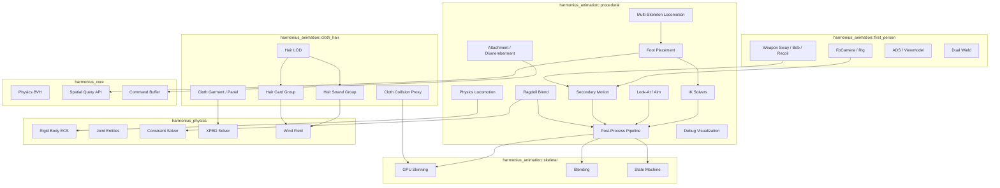

### File Layout

```text
harmonius_animation/
├── procedural/
│   ├── mod.rs              # Re-exports
│   ├── ik/
│   │   ├── mod.rs          # IkSolver enum
│   │   ├── two_bone.rs     # Analytical solver
│   │   ├── ccd.rs          # CCD iterative
│   │   ├── fabrik.rs       # FABRIK position
│   │   └── constraints.rs  # Joint limits, poles
│   ├── ragdoll.rs          # RagdollBlend
│   ├── foot_placement.rs   # Ground raycasts
│   ├── look_at.rs          # LookAt, Aim
│   ├── secondary.rs        # SpringBone chains
│   ├── locomotion/
│   │   ├── mod.rs
│   │   ├── profile.rs      # LocomotionProfile
│   │   ├── gait.rs         # GaitState, phase
│   │   ├── foot_group.rs   # FootGroup
│   │   └── physics.rs      # PID balance
│   ├── attachment.rs       # Socket, Dismember
│   ├── pipeline.rs         # System ordering
│   ├── diagnostics.rs      # Debug overlays
│   └── plugin.rs           # Plugin registration
├── first_person/
│   ├── mod.rs
│   ├── spring.rs           # SpringDamper,
│   │                       # SpringDamper3D,
│   │                       # SpringDamperQuat
│   ├── camera.rs           # FpCamera, Rig
│   ├── camera_system.rs    # FpCameraSystem
│   ├── sway.rs             # WeaponSway
│   ├── bob.rs              # WeaponBob
│   ├── recoil.rs           # WeaponRecoil
│   ├── ads.rs              # AdsState, AdsConfig
│   ├── viewmodel.rs        # Viewmodel, FOV
│   ├── dual_wield.rs       # DualWield
│   ├── equip.rs            # Equip/holster
│   ├── inspect.rs          # Inspection anim
│   └── systems.rs          # All FP systems
├── cloth_hair/
│   ├── mod.rs
│   ├── cloth_garment.rs    # ClothGarment, Panel
│   ├── cloth_collision.rs  # Proxies, capsules
│   ├── cloth_system.rs     # GPU PBD dispatch
│   ├── hair_strand.rs      # HairStrandGroup
│   ├── hair_card.rs        # HairCardGroup
│   ├── hair_lod.rs         # HairLodConfig/State
│   ├── hair_wind.rs        # HairWindResponse
│   ├── hair_sim_system.rs  # Strand physics
│   ├── hair_render.rs      # Marschner, OIT
│   └── shaders/
│       ├── cloth_pbd.hlsl
│       ├── cloth_collision.hlsl
│       ├── hair_strand_sim.hlsl
│       ├── hair_interpolate.hlsl
│       ├── hair_marschner.hlsl
│       └── hair_oit.hlsl
```

### Post-Process Pipeline Ordering

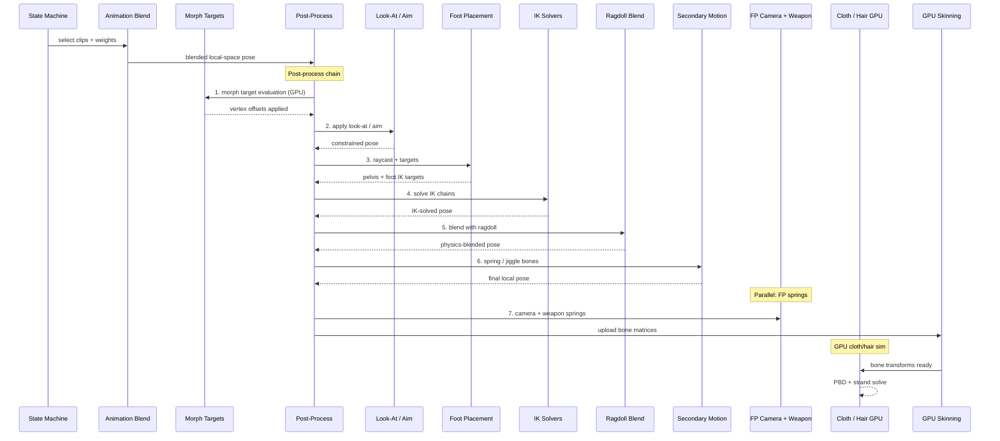

### Core Data Structures -- IK, Ragdoll, Locomotion

```mermaid
classDiagram
    class IkChain {
        +Entity root_bone
        +Entity tip_bone
        +IkSolverType solver
        +Vec3 target_position
        +f32 weight
        +bool enabled
    }
    class IkSolverType {
        <<enumeration>>
        TwoBone
        Ccd
        Fabrik
        Fbik
    }
    class IkConstraints {
        +u32 max_iterations
        +f32 tolerance
    }
    class JointLimit {
        +f32 min_angle
        +f32 max_angle
        +Vec3 twist_axis
        +f32 twist_min
        +f32 twist_max
    }
    class RagdollBlend {
        +f32 master_weight
        +RagdollState state
        +f32 blend_in_duration
        +f32 recovery_duration
        +f32 elapsed
    }
    class RagdollState {
        <<enumeration>>
        Inactive
        BlendingIn
        Active
        Recovering
    }
    class LookAtConstraint {
        +Entity target_entity
        +f32 horizontal_limit
        +f32 vertical_limit
        +f32 blend_weight
        +f32 speed
    }
    class AimConstraint {
        +Entity target_entity
        +Vec3 aim_axis
        +f32 weight
        +f32 clamp_angle
    }
    class FootPlacement {
        +f32 pelvis_offset
        +f32 raycast_distance
        +f32 adapt_speed
        +bool enabled
        +Entity pelvis_bone
    }
    class FootTarget {
        +Entity bone
        +Vec3 ground_position
        +Vec3 ground_normal
        +bool grounded
        +f32 ik_offset
    }
    class SpringBone {
        +Entity bone
        +f32 stiffness
        +f32 damping
        +f32 gravity_factor
        +f32 wind_factor
        +f32 max_displacement
    }
    class SpringBoneChain {
        +Vec bones
        +Vec collision_radii
    }
    class LocomotionProfile {
        +Vec foot_groups
        +Vec gaits
        +f32 body_sway_amplitude
        +f32 body_sway_frequency
        +f32 pelvis_bob_amplitude
    }
    class GaitPattern {
        <<enumeration>>
        Walk
        Trot
        Canter
        Gallop
        Tripod
        Wave
        Serpentine
    }
    class GaitDefinition {
        +GaitPattern pattern
        +f32 min_speed
        +f32 max_speed
        +f32 stride_length
    }
    class GaitState {
        +u32 active_gait_index
        +f32 phase
        +f32 speed
        +f32 turn_rate
        +f32 terrain_slope
    }
    class FootGroup {
        +Vec bones
        +Vec ik_chains
        +f32 stride_length
        +Vec3 contact_offset
        +bool grounded
    }
    class PhysicsLocomotion {
        +PidGains balance_pid
        +f32 max_torque
        +f32 stumble_threshold
        +bool enabled
    }
    class PidGains {
        +f32 kp
        +f32 ki
        +f32 kd
    }
    class BalanceState {
        +Vec3 center_of_mass
        +Vec3 support_center
        +f32 tilt_angle
        +bool stumbling
    }
    class AttachmentSocket {
        +String name
        +Entity bone
        +Transform offset
    }
    class PlatformTier {
        <<enumeration>>
        Mobile
        Switch
        Desktop
        HighEnd
    }
    IkChain --> IkSolverType
    IkChain --> IkConstraints
    IkConstraints *-- JointLimit
    RagdollBlend --> RagdollState
    FootPlacement *-- FootTarget
    SpringBoneChain *-- SpringBone
    LocomotionProfile *-- FootGroup
    LocomotionProfile *-- GaitDefinition
    GaitDefinition --> GaitPattern
    PhysicsLocomotion --> PidGains
```

### Core Data Structures -- First-Person Springs

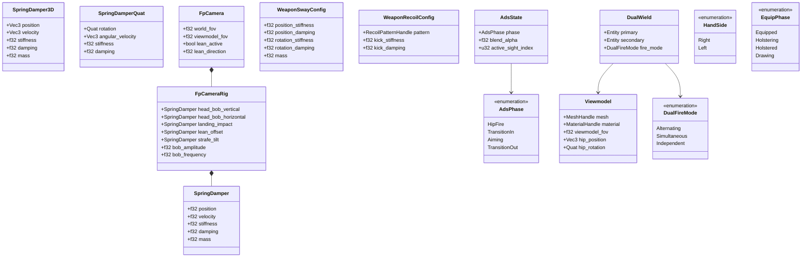

### Core Data Structures -- Cloth and Hair

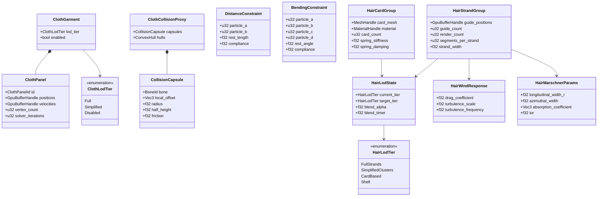

### State Machines

#### Ragdoll Blend

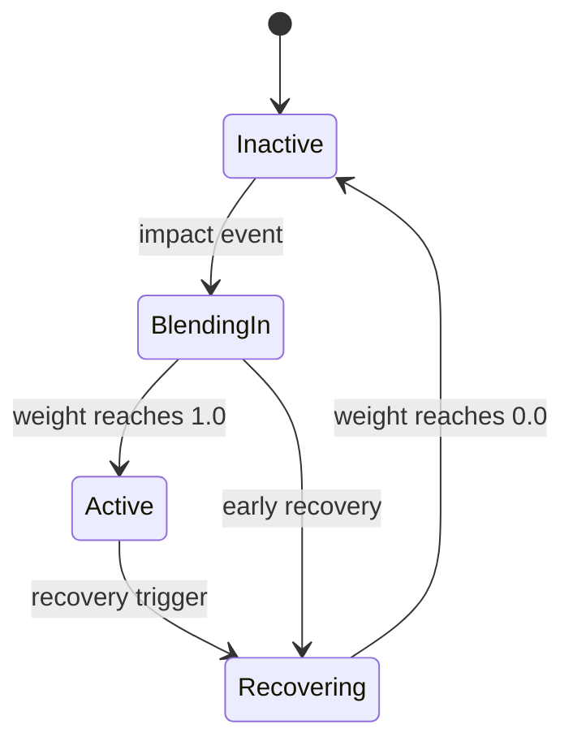

#### ADS Transition

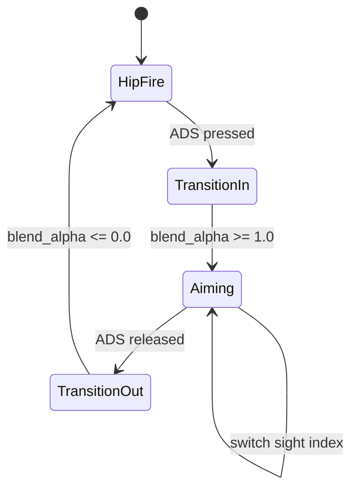

#### Hair LOD

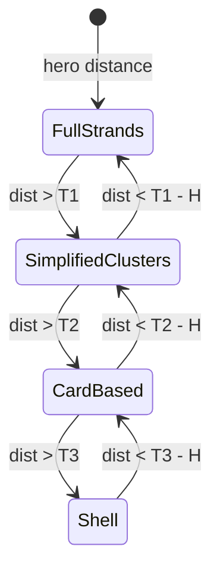

## API Design

### Spring-Damper Primitives

All first-person, weapon, cloth card, and secondary bone motion uses these shared spring types.
Defined in `algorithms.md`.

```rust
/// 1D critically-damped spring-damper.
/// Semi-implicit Euler integration.
#[derive(Clone, Debug, Reflect)]
pub struct SpringDamper {
    pub position: f32,
    pub velocity: f32,
    pub stiffness: f32,
    pub damping: f32,
    pub mass: f32,
}

impl SpringDamper {
    pub fn new(
        stiffness: f32,
        damping: f32,
        mass: f32,
    ) -> Self;
    pub fn evaluate(
        &mut self, target: f32, dt: f32,
    ) -> f32;
    pub fn apply_impulse(&mut self, impulse: f32);
    pub fn reset(&mut self);
}

/// 3D positional spring (sway, recoil translation).
#[derive(Clone, Debug, Reflect)]
pub struct SpringDamper3D {
    pub position: Vec3,
    pub velocity: Vec3,
    pub stiffness: f32,
    pub damping: f32,
    pub mass: f32,
}

/// Quaternion spring for rotational springs.
#[derive(Clone, Debug, Reflect)]
pub struct SpringDamperQuat {
    pub rotation: Quat,
    pub angular_velocity: Vec3,
    pub stiffness: f32,
    pub damping: f32,
}
```

### IK Components

```rust
#[derive(Clone, Copy, Debug, PartialEq, Eq, Reflect)]
pub enum IkSolverType {
    TwoBone,
    Ccd,
    Fabrik,
    /// Full Body IK: unified multi-target solve
    /// with center-of-mass, momentum, and
    /// end-effector priority weighting.
    Fbik,
}

#[derive(Component, Reflect)]
pub struct IkChain {
    pub root_bone: Entity,
    pub tip_bone: Entity,
    pub solver: IkSolverType,
    pub target_position: Vec3,
    pub target_rotation: Option<Quat>,
    pub weight: f32,
    pub enabled: bool,
}

#[derive(Component, Reflect)]
pub struct IkConstraints {
    pub pole_vector: Option<Vec3>,
    pub joint_limits: Vec<JointLimit>,
    pub max_iterations: u32,
    pub tolerance: f32,
}

#[derive(Clone, Debug, Reflect)]
pub struct JointLimit {
    pub min_angle: f32,
    pub max_angle: f32,
    pub twist_axis: Vec3,
    pub twist_min: f32,
    pub twist_max: f32,
}
```

### Morph Targets (Blend Shapes)

Morph targets apply additive vertex offsets before skinning. They cover facial expressions, body
proportion adjustments, and corrective shapes. Evaluation runs on GPU compute.

**Pipeline position:** after animation blend, before IK (step 1 in the post-process chain). Morph
offsets are pre-skinning additive deltas.

**Facial blend shapes:** 52 ARKit-standard shapes plus custom artist-defined shapes. LOD policy
disables face morphs beyond a configurable distance threshold.

**Body proportion morphs:** height, weight, and muscle sliders that scale bone lengths and vertex
positions. Applied once on character spawn and when the player modifies proportions.

**GPU compute evaluation:** a single compute dispatch accumulates weighted morph deltas into the
vertex buffer. Each morph target is a sparse delta buffer (only non-zero vertices stored).

```rust
#[derive(Clone, Copy, Debug, PartialEq, Eq, Reflect)]
pub enum MorphTargetCategory {
    /// 52 ARKit-standard facial blend shapes.
    Face,
    /// Body proportion (height, weight, muscle).
    BodyProportion,
    /// Corrective shapes triggered by pose.
    Corrective,
    /// Artist-defined custom shapes.
    Custom,
}

#[derive(Component, Reflect)]
pub struct MorphTargetSet {
    /// Sparse delta buffers on GPU, one per target.
    pub targets: Vec<MorphTargetHandle>,
    /// Current blend weight per target (0.0-1.0).
    pub weights: Vec<f32>,
    /// LOD distance beyond which face morphs are
    /// disabled.
    pub face_lod_distance: f32,
    /// Whether GPU evaluation is active.
    pub enabled: bool,
}

#[derive(Clone, Debug, Reflect)]
pub struct MorphTargetHandle {
    pub name: String,
    pub category: MorphTargetCategory,
    pub delta_buffer: GpuBufferHandle,
    pub vertex_count: u32,
}
```

**2D / 2.5D considerations:** for 2D sprite-based characters, morph targets are not applicable.
Sprite swap and skeletal 2D (spine-style bone hierarchies with mesh deformation) use a separate
`SpriteMorph` path that blends between sprite atlas frames rather than vertex deltas.

### Ragdoll Blend

```rust
#[derive(Clone, Copy, Debug, PartialEq, Eq, Reflect)]
pub enum RagdollState {
    Inactive,
    BlendingIn,
    Active,
    Recovering,
}

#[derive(Component, Reflect)]
pub struct RagdollBlend {
    pub bone_weights: Vec<f32>,
    pub master_weight: f32,
    pub state: RagdollState,
    pub blend_in_duration: f32,
    pub recovery_duration: f32,
    pub elapsed: f32,
}

#[derive(Component, Reflect)]
pub struct RagdollBoneMask {
    pub active_bones: Vec<u32>,
}

#[derive(Event)]
pub struct RagdollActivateEvent {
    pub entity: Entity,
    pub bone_mask: Option<Vec<u32>>,
    pub impulse: Vec3,
    pub hit_point: Vec3,
}
```

### Look-At and Aim

```rust
#[derive(Component, Reflect)]
pub struct LookAtConstraint {
    pub target_entity: Entity,
    pub target_offset: Vec3,
    pub horizontal_limit: f32,
    pub vertical_limit: f32,
    pub blend_weight: f32,
    pub speed: f32,
    pub bone_chain: Vec<Entity>,
    pub bone_weights: Vec<f32>,
}

#[derive(Component, Reflect)]
pub struct AimConstraint {
    pub target_entity: Entity,
    pub aim_axis: Vec3,
    pub weight: f32,
    pub clamp_angle: f32,
    pub weapon_bone: Entity,
    pub support_bones: Vec<Entity>,
    pub support_weights: Vec<f32>,
}
```

### Foot Placement

```rust
#[derive(Clone, Debug, Reflect)]
pub struct FootTarget {
    pub bone: Entity,
    pub ground_position: Vec3,
    pub ground_normal: Vec3,
    pub grounded: bool,
    pub ik_offset: f32,
}

#[derive(Component, Reflect)]
pub struct FootPlacement {
    pub feet: Vec<FootTarget>,
    pub pelvis_offset: f32,
    pub raycast_distance: f32,
    pub adapt_speed: f32,
    pub enabled: bool,
    pub pelvis_bone: Entity,
}
```

### Secondary Motion (Spring Bones)

```rust
#[derive(Component, Reflect)]
pub struct SpringBone {
    pub bone: Entity,
    pub stiffness: f32,
    pub damping: f32,
    pub gravity_factor: f32,
    pub wind_factor: f32,
    pub max_displacement: f32,
}

#[derive(Component)]
pub struct SpringBoneState {
    pub velocity: Vec3,
    pub prev_rest_position: Vec3,
}

#[derive(Component, Reflect)]
pub struct SpringBoneChain {
    pub bones: Vec<SpringBone>,
    pub collision_radii: Vec<f32>,
    pub collision_proxies: Vec<SpringCollisionProxy>,
}

/// Capsule proxy for spring bone collision.
/// Each proxy is attached to a skeleton bone and
/// defines a capsule that spring bones must not
/// penetrate (torso, hips, limbs).
#[derive(Clone, Debug, Reflect)]
pub struct SpringCollisionProxy {
    pub bone: Entity,
    pub local_offset: Vec3,
    pub radius: f32,
    pub half_height: f32,
}
```

#### Spring Bone Collision Solver

Spring bone chains (capes, tails, ponytails, ears) must not penetrate the character body. The solver
uses capsule proxies attached to skeleton bones.

**Algorithm:**

1. After spring integration, project each spring bone position outside all overlapping capsules.
2. For each spring bone with `collision_radii[i]`, test against every `SpringCollisionProxy` in the
   chain.
3. If the bone sphere overlaps the proxy capsule, push the bone along the contact normal by the
   penetration depth.
4. Clamp the corrected position to `max_displacement` from rest pose.

**Capsule-sphere test:** compute the closest point on the capsule segment to the bone center. If the
distance is less than `collision_radii[i] + proxy.radius`, the bone penetrates.

**Performance:** collision is CPU-side per chain (typically 3-8 bones times 4-6 proxies per
character). At 100 characters this is under 0.1 ms.

**Proxy authoring:** artists place capsule proxies on the torso, upper legs, and upper arms. The
engine auto-generates a default proxy set from the skeleton hierarchy if none is authored.

### Multi-Skeleton Locomotion

```rust
#[derive(Clone, Copy, Debug, PartialEq, Eq, Reflect)]
pub enum GaitPattern {
    Walk, Trot, Canter, Gallop,
    Tripod, Wave, Serpentine,
}

#[derive(Component, Reflect)]
pub struct LocomotionProfile {
    pub foot_groups: Vec<FootGroup>,
    pub gaits: Vec<GaitDefinition>,
    pub body_sway_amplitude: f32,
    pub body_sway_frequency: f32,
    pub pelvis_bob_amplitude: f32,
}

#[derive(Clone, Debug, Reflect)]
pub struct GaitDefinition {
    pub pattern: GaitPattern,
    pub min_speed: f32,
    pub max_speed: f32,
    pub stride_length: f32,
    pub stride_curve: AnimationCurve,
    pub phase_offsets: Vec<f32>,
}

#[derive(Component, Reflect)]
pub struct GaitState {
    pub active_gait_index: u32,
    pub phase: f32,
    pub speed: f32,
    pub turn_rate: f32,
    pub terrain_slope: f32,
}

#[derive(Component, Reflect)]
pub struct FootGroup {
    pub bones: Vec<Entity>,
    pub ik_chains: Vec<Entity>,
    pub stride_length: f32,
    pub contact_offset: Vec3,
    pub grounded: bool,
}
```

### Physics-Based Locomotion

```rust
#[derive(Component, Reflect)]
pub struct PhysicsLocomotion {
    pub muscle_strength: Vec<f32>,
    pub joint_damping: Vec<f32>,
    pub balance_pid: PidGains,
    pub max_torque: f32,
    pub stumble_threshold: f32,
    pub recovery_threshold: f32,
    pub enabled: bool,
}

#[derive(Clone, Debug, Reflect)]
pub struct PidGains {
    pub kp: f32,
    pub ki: f32,
    pub kd: f32,
}

#[derive(Component)]
pub struct BalanceState {
    pub center_of_mass: Vec3,
    pub support_center: Vec3,
    pub integral_error: Vec3,
    pub prev_error: Vec3,
    pub tilt_angle: f32,
    pub stumbling: bool,
}
```

### Attachment and Dismemberment

```rust
#[derive(Component, Reflect)]
pub struct AttachmentSocket {
    pub name: String,
    pub bone: Entity,
    pub offset: Transform,
    pub attached: Option<Entity>,
}

#[derive(Component, Reflect)]
pub struct AttachedTo {
    pub socket: Entity,
    pub skeleton: Entity,
}

#[derive(Event)]
pub struct DismemberEvent {
    pub skeleton: Entity,
    pub sever_bone: Entity,
    pub impulse: Vec3,
}
```

### First-Person Camera and Weapon

```rust
#[derive(Component, Reflect)]
pub struct FpCamera {
    pub world_fov: f32,
    pub viewmodel_fov: f32,
    pub lean_active: bool,
    pub lean_direction: f32,
}

#[derive(Component, Reflect)]
pub struct FpCameraRig {
    pub head_bob_vertical: SpringDamper,
    pub head_bob_horizontal: SpringDamper,
    pub landing_impact: SpringDamper,
    pub lean_offset: SpringDamper,
    pub strafe_tilt: SpringDamper,
    pub bob_amplitude: f32,
    pub bob_frequency: f32,
    pub landing_snap_scale: f32,
    pub lean_max_offset: f32,
    pub tilt_max_degrees: f32,
}

#[derive(Component, Reflect)]
pub struct WeaponSwayConfig {
    pub position_stiffness: f32,
    pub position_damping: f32,
    pub rotation_stiffness: f32,
    pub rotation_damping: f32,
    pub mass: f32,
    pub max_displacement: Vec3,
    pub max_rotation: Vec3,
}

#[derive(Component, Reflect)]
pub struct WeaponBobConfig {
    pub vertical_amplitude: f32,
    pub horizontal_amplitude: f32,
    pub frequency: f32,
    pub speed_curve: AnimationCurveHandle,
}

#[derive(Component, Reflect)]
pub struct WeaponRecoilConfig {
    pub pattern: RecoilPatternHandle,
    pub kick_stiffness: f32,
    pub kick_damping: f32,
    pub torque_stiffness: f32,
    pub torque_damping: f32,
    pub randomization_range: (f32, f32),
}

#[derive(Clone, Copy, Debug, PartialEq, Eq, Reflect)]
pub enum AdsPhase {
    HipFire,
    TransitionIn,
    Aiming,
    TransitionOut,
}

#[derive(Component, Reflect)]
pub struct AdsConfig {
    pub sights: SmallVec<[SightPosition; 3]>,
    pub transition_duration: f32,
    pub sway_multiplier: f32,
    pub bob_multiplier: f32,
}

#[derive(Component, Reflect)]
pub struct AdsState {
    pub phase: AdsPhase,
    pub blend_alpha: f32,
    pub active_sight_index: u32,
}

#[derive(Clone, Debug, Reflect)]
pub struct SightPosition {
    pub position: Vec3,
    pub rotation: Quat,
    pub fov_override: Option<f32>,
    pub uses_scope_rtt: bool,
}

#[derive(Component, Reflect)]
pub struct Viewmodel {
    pub mesh: MeshHandle,
    pub material: MaterialHandle,
    pub viewmodel_fov: f32,
    pub hip_position: Vec3,
    pub hip_rotation: Quat,
}

#[derive(Clone, Copy, Debug, PartialEq, Eq, Reflect)]
pub enum EquipPhase {
    Equipped, Holstering, Holstered, Drawing,
}

#[derive(Clone, Copy, Debug, PartialEq, Eq, Reflect)]
pub enum DualFireMode {
    Alternating, Simultaneous, Independent,
}

#[derive(Clone, Copy, Debug, PartialEq, Eq, Reflect)]
pub enum HandSide { Right, Left }

#[derive(Component, Reflect)]
pub struct DualWield {
    pub primary: Entity,
    pub secondary: Entity,
    pub fire_mode: DualFireMode,
}

#[derive(Component, Reflect)]
pub struct HandState {
    pub side: HandSide,
    pub sway: WeaponSwayState,
    pub bob: WeaponBobState,
    pub recoil: WeaponRecoilState,
    pub equip: WeaponEquipState,
}
```

### Cloth Components

```rust
#[derive(Clone, Copy, Debug, PartialEq, Eq, Reflect)]
pub enum ClothLodTier {
    Full,
    Simplified,
    Disabled,
}

#[derive(Component, Reflect)]
pub struct ClothGarment {
    pub panels: SmallVec<[ClothPanelId; 4]>,
    pub lod_tier: ClothLodTier,
    pub enabled: bool,
}

#[derive(Component, Reflect)]
pub struct ClothPanel {
    pub id: ClothPanelId,
    pub positions: GpuBufferHandle,
    pub velocities: GpuBufferHandle,
    pub rest_positions: GpuBufferHandle,
    pub constraints: GpuBufferHandle,
    pub vertex_count: u32,
    pub constraint_count: u32,
    pub solver_iterations: u32,
}

#[derive(Clone, Copy, Debug, Reflect)]
pub struct DistanceConstraint {
    pub particle_a: u32,
    pub particle_b: u32,
    pub rest_length: f32,
    pub compliance: f32,
}

#[derive(Clone, Copy, Debug, Reflect)]
pub struct BendingConstraint {
    pub particle_a: u32,
    pub particle_b: u32,
    pub particle_c: u32,
    pub particle_d: u32,
    pub rest_angle: f32,
    pub compliance: f32,
}

#[derive(Component, Reflect)]
pub struct ClothCollisionProxy {
    pub capsules:
        SmallVec<[CollisionCapsule; 8]>,
    pub hulls: SmallVec<[ConvexHull; 4]>,
}

#[derive(Clone, Debug, Reflect)]
pub struct CollisionCapsule {
    pub bone: BoneId,
    pub local_offset: Vec3,
    pub radius: f32,
    pub half_height: f32,
    pub friction: f32,
}

#[derive(Clone, Debug, Reflect)]
pub struct ConvexHull {
    pub bone: BoneId,
    pub local_offset: Vec3,
    pub vertices: GpuBufferHandle,
    pub vertex_count: u32,
    pub friction: f32,
}
```

### Hair Components

```rust
#[derive(Clone, Copy, Debug, PartialEq, Eq, Reflect)]
pub enum HairLodTier {
    FullStrands,
    SimplifiedClusters,
    CardBased,
    Shell,
}

#[derive(Component, Reflect)]
pub struct HairLodConfig {
    pub strand_max_distance: f32,
    pub cluster_max_distance: f32,
    pub card_max_distance: f32,
    pub hysteresis: f32,
    pub blend_duration_sec: f32,
}

#[derive(Component, Reflect)]
pub struct HairLodState {
    pub current_tier: HairLodTier,
    pub target_tier: HairLodTier,
    pub blend_alpha: f32,
    pub blend_timer: f32,
}

#[derive(Component, Reflect)]
pub struct HairStrandGroup {
    pub guide_positions: GpuBufferHandle,
    pub guide_velocities: GpuBufferHandle,
    pub render_positions: GpuBufferHandle,
    pub skinning_weights: GpuBufferHandle,
    pub guide_count: u32,
    pub render_count: u32,
    pub segments_per_strand: u32,
    pub strand_width: f32,
}

#[derive(Component, Reflect)]
pub struct HairCardGroup {
    pub card_mesh: MeshHandle,
    pub material: MaterialHandle,
    pub card_count: u32,
    pub spring_stiffness: f32,
    pub spring_damping: f32,
}

#[derive(Clone, Copy, Debug, Reflect)]
pub struct HairStrandConstraints {
    pub stretch_compliance: f32,
    pub bend_compliance: f32,
    pub collision_radius: f32,
}

#[derive(Component, Reflect)]
pub struct HairWindResponse {
    pub drag_coefficient: f32,
    pub turbulence_scale: f32,
    pub turbulence_frequency: f32,
}

#[derive(Component, Reflect)]
pub struct HairMarschnerParams {
    pub longitudinal_width_r: f32,
    pub longitudinal_width_tt: f32,
    pub longitudinal_width_trt: f32,
    pub azimuthal_width: f32,
    pub absorption_coefficient: Vec3,
    pub ior: f32,
}
```

### GPU Shader Interfaces

```rust
/// Cloth PBD constant buffer (HLSL).
#[repr(C)]
#[derive(Clone, Copy, Debug)]
pub struct ClothPbdConstants {
    pub vertex_count: u32,
    pub constraint_count: u32,
    pub solver_iterations: u32,
    pub delta_time: f32,
    pub gravity: [f32; 3],
    pub _pad0: f32,
    pub wind_direction: [f32; 3],
    pub wind_strength: f32,
}

/// Hair strand sim constant buffer (HLSL).
#[repr(C)]
#[derive(Clone, Copy, Debug)]
pub struct HairStrandSimConstants {
    pub guide_count: u32,
    pub segments_per_strand: u32,
    pub delta_time: f32,
    pub gravity: f32,
    pub stretch_compliance: f32,
    pub bend_compliance: f32,
    pub collision_radius: f32,
    pub drag_coefficient: f32,
    pub turbulence_scale: f32,
    pub turbulence_frequency: f32,
    pub _pad: [f32; 2],
}

/// Hair interpolation constant buffer (HLSL).
#[repr(C)]
#[derive(Clone, Copy, Debug)]
pub struct HairInterpolateConstants {
    pub guide_count: u32,
    pub render_count: u32,
    pub segments_per_strand: u32,
    pub strand_width: f32,
}

/// Marschner BSDF constant buffer (HLSL).
#[repr(C)]
#[derive(Clone, Copy, Debug)]
pub struct MarschnerConstants {
    pub longitudinal_width_r: f32,
    pub longitudinal_width_tt: f32,
    pub longitudinal_width_trt: f32,
    pub azimuthal_width: f32,
    pub absorption_coefficient: [f32; 3],
    pub ior: f32,
}
```

### Key Systems

```rust
// --- IK and Constraints ---

pub fn look_at_system(
    mut bones: Query<&mut Transform>,
    look_ats: Query<&LookAtConstraint>,
    aims: Query<&AimConstraint>,
    targets: Query<&GlobalTransform>,
    time: Res<Time>,
) { /* distribute rotation, clamp limits */ }

pub fn foot_placement_system(
    mut placements: Query<&mut FootPlacement>,
    mut ik_chains: Query<&mut IkChain>,
    bones: Query<&GlobalTransform>,
    spatial: Res<QueryEngine>,
    time: Res<Time>,
) { /* batch raycast, compute pelvis + IK */ }

pub fn ik_solver_system(
    mut bones: Query<&mut Transform>,
    chains: Query<(&IkChain, Option<&IkConstraints>)>,
    skeletons: Query<&SkeletonBoneMap>,
) { /* dispatch per IkSolverType */ }

pub fn ragdoll_blend_system(
    mut skeletons: Query<(
        &mut RagdollBlend, &SkeletonBoneMap,
        Option<&RagdollBoneMask>,
    )>,
    mut bones: Query<&mut Transform>,
    physics: Query<&GlobalTransform, With<RagdollBody>>,
    time: Res<Time>,
) { /* lerp animated/physics per bone */ }

pub fn secondary_motion_system(
    chains: Query<&SpringBoneChain>,
    mut states: Query<&mut SpringBoneState>,
    mut bones: Query<&mut Transform>,
    globals: Query<&GlobalTransform>,
    time: Res<Time>,
    wind: Option<Res<WindField>>,
) { /* verlet integration, clamp displacement */ }

// --- Locomotion ---

pub fn locomotion_system(
    mut query: Query<(
        &LocomotionProfile, &mut GaitState,
        &mut FootPlacement,
    )>,
    mut foot_groups: Query<&mut FootGroup>,
    time: Res<Time>,
) { /* gait selection, phase advance */ }

pub fn physics_locomotion_system(
    mut query: Query<(
        &PhysicsLocomotion, &mut BalanceState,
    )>,
    mut bodies: Query<(
        &mut ExternalForce, &mut ExternalTorque,
    )>,
    time: Res<Time>,
) { /* PID balance, torque application */ }

// --- First-Person ---

pub fn fp_camera_system(
    mut query: Query<(
        &FpCamera, &mut FpCameraRig,
        &CharacterController, &mut Camera,
    )>,
    dt: Res<DeltaTime>,
) { /* head-bob, landing, lean, tilt springs */ }

pub fn weapon_sway_system(
    mut query: Query<(
        &WeaponSwayConfig, &mut WeaponSwayState,
        &AdsState, &AdsConfig,
    )>,
    input: Res<InputState>,
    dt: Res<DeltaTime>,
) { /* position + rotation sway springs */ }

pub fn weapon_recoil_system(
    mut query: Query<(
        &WeaponRecoilConfig, &mut WeaponRecoilState,
    )>,
    patterns: Res<Assets<RecoilPattern>>,
    dt: Res<DeltaTime>,
) { /* pattern sampling, randomized kick */ }

pub fn ads_system(
    mut query: Query<(&AdsConfig, &mut AdsState)>,
    input: Res<InputState>,
    dt: Res<DeltaTime>,
) { /* hip-to-sight interpolation */ }

pub fn viewmodel_compose_system(
    mut query: Query<(
        &Viewmodel, &WeaponSwayState,
        &WeaponBobState, &WeaponRecoilState,
        &AdsState, &AdsConfig,
        &WeaponEquipState,
        Option<&WeaponInspectState>,
        &mut Transform,
    )>,
) { /* additive spring composition */ }

pub fn viewmodel_render_system(
    query: Query<(
        &Viewmodel, &Transform, &FpCamera,
    )>,
    renderer: &Renderer,
) { /* render at viewmodel_fov */ }

pub fn dual_wield_system(
    mut query: Query<(&DualWield, &mut HandState)>,
    input: Res<InputState>,
    dt: Res<DeltaTime>,
) { /* independent per-hand springs */ }

// --- Cloth ---

pub fn cloth_collision_proxy_update_system(
    query: Query<(
        &ClothCollisionProxy, &Skeleton,
        &GlobalTransform,
    )>,
    gpu: &GpuContext,
) { /* transform capsules to world space */ }

pub fn cloth_sim_dispatch_system(
    garments: Query<(
        &ClothGarment, &ClothPanel,
        &ClothCollisionProxy,
    ), With<Enabled>>,
    wind_field: Res<WindFieldTexture>,
    gpu: &GpuContext,
    xpbd: &XpbdSolver,
) { /* GPU PBD constraint solve */ }

pub fn cloth_writeback_system(
    panels: Query<&ClothPanel, Changed<ClothPanel>>,
    gpu: &GpuContext,
) { /* write solved positions to vertex buf */ }

// --- Hair ---

pub fn hair_lod_system(
    mut query: Query<(
        &HairLodConfig, &mut HairLodState,
        &GlobalTransform,
    )>,
    camera: Res<ActiveCamera>,
    dt: Res<DeltaTime>,
) { /* distance-based LOD tier selection */ }

pub fn hair_strand_sim_system(
    strands: Query<(
        &HairStrandGroup, &HairStrandConstraints,
        &HairWindResponse, &ClothCollisionProxy,
        &Skeleton,
    ), With<StrandSimActive>>,
    wind_field: Res<WindFieldTexture>,
    gpu: &GpuContext,
    dt: Res<DeltaTime>,
) { /* GPU strand simulation dispatch */ }

pub fn hair_interpolation_system(
    strands: Query<
        &HairStrandGroup, With<StrandSimActive>,
    >,
    gpu: &GpuContext,
) { /* guide-to-render interpolation */ }

pub fn hair_card_sim_system(
    cards: Query<(
        &HairCardGroup, &HairWindResponse,
        &Skeleton,
    ), With<CardSimActive>>,
    wind_field: Res<WindFieldTexture>,
    gpu: &GpuContext,
    dt: Res<DeltaTime>,
) { /* card spring physics on GPU */ }

pub fn hair_strand_render_system(
    strands: Query<(
        &HairStrandGroup, &HairMarschnerParams,
        &HairLodState, &GlobalTransform,
    )>,
    oit: &OitCompositor,
    gpu: &GpuContext,
) { /* Marschner BSDF + OIT compositing */ }
```

### Plugin Registration

```rust
pub struct ProceduralAnimationPlugin;

impl Plugin for ProceduralAnimationPlugin {
    fn build(&self, app: &mut App) {
        // locomotion_system and look_at_system have
        // no ordering constraint: they operate on
        // disjoint bone sets (locomotion writes
        // GaitState + FootGroup.grounded; look-at
        // writes head/spine rotations).
        app.add_systems(PostAnimation, (
            locomotion_system,
            look_at_system,
            foot_placement_system
                .after(look_at_system)
                .after(locomotion_system),
            ik_solver_system
                .after(foot_placement_system),
            ragdoll_blend_system
                .after(ik_solver_system),
            secondary_motion_system
                .after(ragdoll_blend_system),
            physics_locomotion_system
                .after(locomotion_system),
        ));

        // First-person springs (parallel)
        app.add_systems(PostAnimation, (
            fp_camera_system,
            weapon_sway_system
                .after(fp_camera_system),
            weapon_bob_system
                .after(fp_camera_system),
            weapon_recoil_system
                .after(weapon_sway_system),
            ads_system
                .after(weapon_recoil_system),
            viewmodel_compose_system
                .after(ads_system),
            viewmodel_render_system
                .after(viewmodel_compose_system),
            dual_wield_system,
        ));

        // Cloth and hair (after skinning)
        app.add_systems(PostSkinning, (
            cloth_collision_proxy_update_system,
            cloth_sim_dispatch_system
                .after(
                    cloth_collision_proxy_update_system,
                ),
            cloth_writeback_system
                .after(cloth_sim_dispatch_system),
            hair_lod_system,
            hair_strand_sim_system
                .after(hair_lod_system),
            hair_interpolation_system
                .after(hair_strand_sim_system),
            hair_card_sim_system
                .after(hair_lod_system),
            hair_strand_render_system
                .after(hair_interpolation_system),
        ));

        // Attachment and dismemberment
        app.add_systems(PostUpdate, (
            attachment_system,
            dismemberment_system
                .after(attachment_system),
        ));

        // Dev-only debug visualization
        #[cfg(debug_assertions)]
        app.add_systems(
            PostAnimation,
            locomotion_diagnostics_system
                .after(secondary_motion_system),
        );

        // Events
        app.add_event::<RagdollActivateEvent>();
        app.add_event::<RagdollRecoverEvent>();
        app.add_event::<DismemberEvent>();
    }
}
```

## Data Flow

### Post-Process Pipeline Order

```rust
// PostAnimation phase execution order:
//
// 1. morph_target_system (GPU compute)
//    Reads: MorphTargetSet, blend weights
//    Writes: vertex buffer (additive deltas)
//
// 2. locomotion_system
//    Reads: LocomotionProfile, GaitState
//    Writes: GaitState, FootGroup.grounded
//
// 3. look_at_system
//    Reads: LookAtConstraint, AimConstraint
//    Writes: bone Transform (rotation)
//    Note: disjoint bones with locomotion
//
// 4. foot_placement_system
//    Reads: FootPlacement, bone GlobalTransform
//    Writes: FootTarget, IkChain targets
//    External: batch_ray_cast via physics BVH
//
// 5. ik_solver_system
//    Reads: IkChain, IkConstraints
//    Writes: bone Transform (rotation)
//
// 6. ragdoll_blend_system
//    Reads: RagdollBlend, physics GlobalTransform
//    Writes: bone Transform
//
// 7. secondary_motion_system
//    Reads: SpringBoneChain, WindField
//    Writes: bone Transform, SpringBoneState
//
// 8. physics_locomotion_system
//    Reads: PhysicsLocomotion, BalanceState
//    Writes: ExternalForce/Torque
//
// Parallel: fp_camera_system chain
//    camera -> sway -> bob -> recoil -> ADS
//    -> compose -> render
//
// PostSkinning: cloth + hair GPU dispatches
```

### Foot Placement Batch Raycast

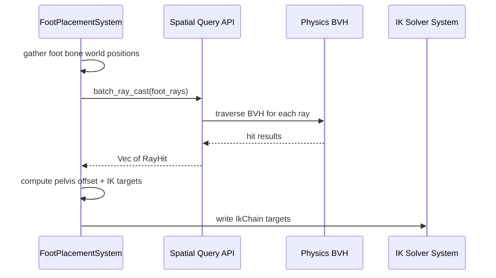

### Weapon Transform Composition

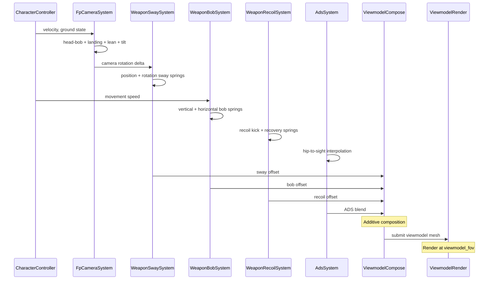

### Cloth Simulation Pipeline

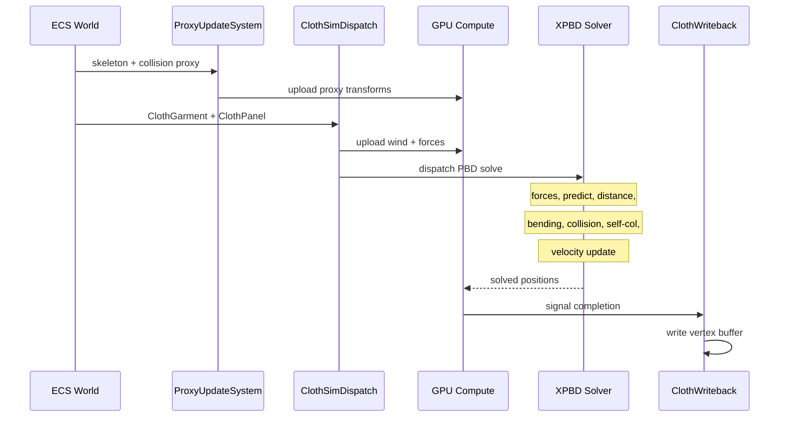

### Hair Simulation Pipeline

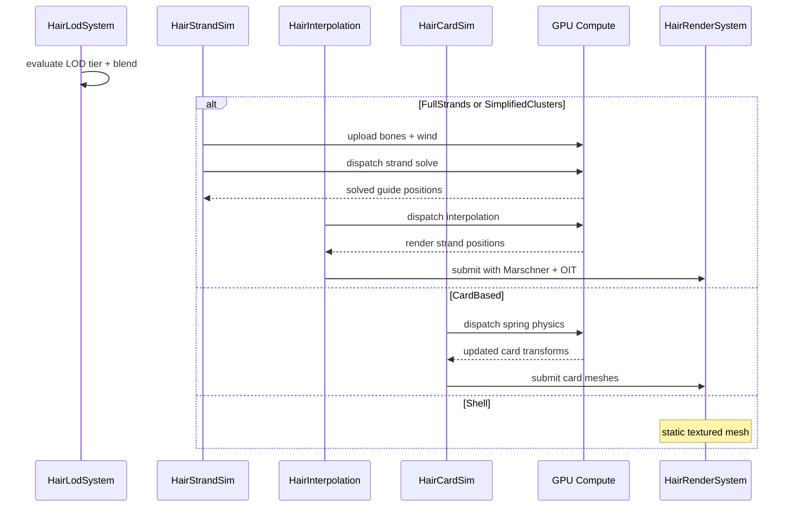

## Platform Considerations

### IK Chain Budget

| Tier | Two-Bone | CCD (max iter) | FABRIK (max iter) |
|------|----------|----------------|-------------------|
| Mobile | 20-40 | 2-4 | 2-3 |
| Switch | 80 | 6 | 4 |
| Desktop | 500+ | 8-12 | 6-8 |

### Ragdoll Budget

| Tier | Capsules/Char | Simultaneous | Partial |
|------|--------------|-------------|---------|
| Mobile | 4-8 | 2 | Hero only |
| Switch | 12 | 4 | Hero + nearby |
| Desktop | 16-20 | 16+ | All visible |

### Foot Placement Budget

| Tier | Rays/Char | Characters | Notes |
|------|----------|-----------|-------|
| Mobile | 2 | 4-8 | Disabled distant |
| Switch | 3 | 16 | Simplified dist |
| Desktop | 4 | 100+ | Full precision |

### First-Person Uniform Behavior

| Component | Cost | Variance |
|-----------|------|----------|
| Camera rig (5 springs) | ~0.02 ms | None |
| Weapon sway (2 springs) | ~0.01 ms | None |
| Weapon bob (2 springs) | ~0.01 ms | None |
| Weapon recoil (2 springs) | ~0.01 ms | None |

| Feature | Desktop | Switch | Mobile |
|---------|---------|--------|--------|
| Scope RTT | Full-res | Full-res | Half-res |
| Dual wield | Full LOD | Full LOD | Simplified |
| Viewmodel LOD | LOD0 | LOD0 | LOD1 |

### Cloth Tier Matrix

| Platform | LOD | Constraints | Panels |
|----------|-----|-------------|--------|
| Desktop | Full | Dist+bend+self-col | 16+ |
| Switch | Simplified | Distance only | 4 |
| Mobile | Disabled | None (baked) | 0 |

### Hair Tier Matrix

| Platform | Primary | Guides | Cards | Shell |
|----------|---------|--------|-------|-------|
| Desktop | Strands | 64-256 | Fallback | Far |
| Switch | Cards | N/A | 16-32 | Far |
| Mobile | Shell | N/A | 8-16 | Default |

### Cloth/Hair GPU Budget

| Tier | Cloth | Hair | Total |
|------|-------|------|-------|
| Mobile | 0 ms | 0.2 ms | 0.2 ms |
| Switch | 0.3 ms | 0.3 ms | 0.6 ms |
| Desktop | 1.0 ms | 1.5 ms | 2.5 ms |

### Per-Platform Iteration Caps

| Tier | Iters | Strands | OIT | Budget |
|------|-------|---------|-----|--------|
| Mobile | 2 | 1024 | 2 | 0.5 ms |
| Console (base) | 4 | 4096 | 4 | 1.0 ms |
| Console (pro) | 6 | 8192 | 6 | 1.5 ms |
| Desktop | 8 | 16384 | 8 | 2.0 ms |
| High-end PC | 12 | 32768 | 8 | 3.0 ms |

### LOD Budget Reduction Cascade

When the cloth/hair pass exceeds its platform GPU budget:

1. Halve OIT layers (4 to 2)
2. Halve visible render strands per character
3. Disable hair OIT -- opaque approximation
4. Force card LOD for all characters

Each step is reversible when headroom returns for two consecutive frames.

### GPU IK Compute Thresholds

| Tier | CPU Threshold | GPU Dispatch |
|------|---------------|-------------|
| Mobile | 10 chains | 64 threads/group |
| Switch | 20 chains | 128 threads/group |
| Desktop | 50 chains | 256 threads/group |

Below the threshold, IK runs CPU-side to avoid GPU dispatch overhead for small chain counts. This
applies to all solver types including FABRIK. The performance targets in this document assume GPU
dispatch (at or above the threshold). The companion test-cases file benchmarks matching
configurations.

### Platform Tier Resource

```rust
#[derive(Clone, Copy, Debug, PartialEq, Eq, Resource)]
pub enum PlatformTier {
    Mobile, Switch, Desktop, HighEnd,
}

impl PlatformTier {
    pub fn max_ik_chains(&self) -> u32 {
        match self {
            Self::Mobile => 40,
            Self::Switch => 80,
            Self::Desktop => 500,
            Self::HighEnd => 1000,
        }
    }
    pub fn max_ragdoll_bodies(&self) -> u32 {
        match self {
            Self::Mobile => 8,
            Self::Switch => 12,
            Self::Desktop => 20,
            Self::HighEnd => 32,
        }
    }
}
```

### 2D and 2.5D Considerations

Most procedural animation subsystems target 3D skeletal meshes. For 2D and 2.5D games:

- **IK** -- two-bone IK works in 2D by constraining the solve plane to the sprite plane. CCD and
  FABRIK also work with 2D bone chains. FBIK is 3D-only.
- **Foot placement** -- 2D platformers use a simplified 1D raycast (downward only) with no pelvis
  adjustment. 2.5D side-scrollers use the same raycast but lock the lateral axis.
- **Ragdoll** -- 2D ragdoll uses hinge joints only (no ball-socket). Physics bodies are constrained
  to the 2D plane.
- **Spring bones** -- fully applicable to 2D (hair, capes, tails) with the Z axis locked.
- **Cloth / hair** -- GPU PBD cloth is 3D-only. 2D characters use spring bone chains or sprite swap
  for cloth-like motion.
- **Morph targets** -- not applicable to sprite-based 2D. 2D skeletal meshes (spine-style) use
  `SpriteMorph` (frame blending) instead.
- **First-person** -- inherently 3D; not applicable to 2D/2.5D.

## Test Plan

Test cases are in the companion file [procedural-test-cases.md](procedural-test-cases.md).

> **Note:** The companion file needs TC-9.5.x.x entries for cloth/hair and TC-9.6.x.x entries for
> first-person tests. Approximately 30 tests listed below do not yet have companion entries.

### Unit Tests -- IK and Constraints

| Test | Req |
|------|-----|
| `test_two_bone_reach_target` | R-9.3.1 |
| `test_two_bone_pole_vector` | R-9.3.1 |
| `test_two_bone_unreachable` | R-9.3.1 |
| `test_ccd_converge_6bone` | R-9.3.2 |
| `test_ccd_angular_limits` | R-9.3.2 |
| `test_fabrik_8bone` | R-9.3.3 |
| `test_fabrik_multi_effector` | R-9.3.3 |
| `test_ragdoll_blend_in` | R-9.3.4 |
| `test_ragdoll_recovery` | R-9.3.4 |
| `test_ragdoll_partial_mask` | R-9.3.4 |
| `test_look_at_45deg` | R-9.3.5 |
| `test_look_at_clamp` | R-9.3.5 |
| `test_aim_alignment` | R-9.3.5 |
| `test_foot_placement_stairs` | R-9.3.7 |
| `test_foot_placement_slope` | R-9.3.7 |

### Unit Tests -- Locomotion and Physics

| Test | Req |
|------|-----|
| `test_gait_biped_walk` | R-9.3.8 |
| `test_gait_quad_trot_gallop` | R-9.3.8 |
| `test_gait_hexapod_tripod` | R-9.3.8 |
| `test_spring_bone_rest` | -- |
| `test_spring_bone_gravity` | -- |
| `test_spring_bone_damping` | -- |
| `test_physics_balance_upright` | R-9.3.9 |
| `test_physics_stumble_recover` | R-9.3.9 |
| `test_attach_socket` | R-9.3.10 |
| `test_dismember_spawns_ragdoll` | R-9.3.10 |
| `test_dismember_gait_adapt` | R-9.3.10 |
| `test_debug_vis_foot_targets` | R-9.3.11 |

### Unit Tests -- First-Person Springs

| Test | Req |
|------|-----|
| `test_spring_damper_convergence` | -- |
| `test_spring_damper_impulse` | -- |
| `test_spring_damper_3d` | -- |
| `test_spring_damper_quat` | -- |
| `test_head_bob_frequency` | R-9.6.1 |
| `test_landing_impact` | R-9.6.1 |
| `test_lean_offset` | R-9.6.1 |
| `test_strafe_tilt` | R-9.6.1 |
| `test_viewmodel_fov` | R-9.6.1 |
| `test_sway_opposite` | R-9.6.2 |
| `test_sway_mass_scaling` | R-9.6.2 |
| `test_bob_amplitude` | R-9.6.2 |
| `test_recoil_non_repetitive` | R-9.6.3 |
| `test_recoil_recovery` | R-9.6.3 |
| `test_ads_transition` | R-9.6.3 |
| `test_ads_sway_reduction` | R-9.6.3 |
| `test_ads_sight_switch` | R-9.6.3 |
| `test_equip_holster_sequence` | R-9.6.4 |
| `test_inspect_rotation` | R-9.6.4 |
| `test_dual_alternating` | R-9.6.4 |
| `test_dual_simultaneous` | R-9.6.4 |
| `test_dual_independent` | R-9.6.4 |

### Unit Tests -- Cloth and Hair

| Test | Req |
|------|-----|
| `test_cloth_distance_constraint` | R-9.5.1 |
| `test_cloth_bending_constraint` | R-9.5.1 |
| `test_cloth_self_collision` | R-9.5.1 |
| `test_cloth_wind_response` | R-9.5.1 |
| `test_strand_gravity` | R-9.5.2 |
| `test_strand_stretch` | R-9.5.2 |
| `test_strand_collision` | R-9.5.2 |
| `test_card_spring_physics` | R-9.5.3 |
| `test_card_anisotropic_spec` | R-9.5.3 |
| `test_hair_lod_tier_selection` | R-9.5.4 |
| `test_hair_lod_hysteresis` | R-9.5.4 |
| `test_hair_lod_blend` | R-9.5.4 |
| `test_collision_proxy_update` | R-9.5.5 |
| `test_collision_friction` | R-9.5.5 |
| `test_wind_field_sampling` | R-9.5.6 |
| `test_wind_drag_proportional` | R-9.5.6 |

### Integration Tests

| Test | Req |
|------|-----|
| `test_pipeline_order` | All |
| `test_500_two_bone_gpu` | R-9.3.1 |
| `test_foot_placement_batch` | R-9.3.7 |
| `test_ragdoll_physics_int` | R-9.3.4 |
| `test_locomotion_topologies` | R-9.3.8 |
| `test_dismember_runtime` | R-9.3.10 |
| `test_camera_with_controller` | R-9.6.1 |
| `test_full_weapon_pipeline` | R-9.6.2 |
| `test_dual_wield_render` | R-9.6.4 |
| `test_scope_rtt_mobile` | R-9.6.3 |
| `test_cloth_on_animated_char` | R-9.5.1 |
| `test_strand_hair_head_turn` | R-9.5.2 |
| `test_lod_flythrough` | R-9.5.4 |
| `test_wind_coherence` | R-9.5.6 |
| `test_platform_cloth_disabled` | R-9.5.1 |
| `test_debug_stripped` | R-9.3.11 |

### Benchmarks

| Benchmark | Target | Source |
|-----------|--------|--------|
| Two-bone IK (500, GPU) | < 0.5 ms | US-9.3.1.2 |
| CCD IK (100, 8 iter) | < 1.0 ms | US-9.3.2.1 |
| FABRIK (50, 6 iter) | < 0.8 ms | US-9.3.3.1 |
| Foot placement (100 chars) | < 0.3 ms | US-9.3.7.2 |
| Ragdoll blend (50 chars) | < 0.2 ms | US-9.3.4.1 |
| Locomotion (100 creatures) | < 0.5 ms | US-9.3.8.1 |
| Camera rig (5 springs) | < 0.05 ms | R-9.6.1 |
| Single weapon pipeline | < 0.05 ms | R-9.6.2 |
| Dual wield total | < 0.1 ms | R-9.6.4 |
| Cloth PBD 1000 verts | < 0.5 ms | R-9.5.1 |
| 16 cloth panels | < 1.0 ms | US-9.5.1.1 |
| 256 guide strands | < 1.0 ms | US-9.5.2.2 |
| Guide-to-render (4096) | < 0.3 ms | R-9.5.2 |
| Hair OIT compositing | < 0.5 ms | R-9.5.2 |
| Card vs strand cost | 5x+ faster | R-9.5.3 |

### Shared Type References

- Spring-damper primitives (`SpringDamper<T>`) are defined in
  [algorithms.md](../core-runtime/algorithms.md)
- Joint angular limits use the shared `JointLimit` type
- Distance/bending constraints reference shared physics types

## Design Q & A

**Q1. Biggest constraint?**

The static dispatch policy (no trait objects) forces all IK solver selection through the
`IkSolverType` enum. Adding a new solver requires modifying the enum and every match arm. The
GPU-first mandate for cloth/hair forces all simulation into HLSL compute, preventing mid-solve CPU
inspection. If either were lifted, a solver registry with dynamic dispatch on init and monomorphized
dispatch on the hot path would be ideal. The trade-off is extensibility versus compile-time
guarantees and GPU scalability (16+ panels, 256 strands on desktop).

**Q2. Weaknesses?**

- The post-process pipeline has a fixed order that cannot be reordered per entity. Needs a second IK
  pass workaround.
- Additive spring composition for first-person has ordering sensitivity; extreme values can push
  weapons off screen.
- Cloth and hair are separate systems sharing wind but not interacting physically (cloaks clip
  through hair).
- Hair LOD tier transitions produce different specular character (Marschner vs Kajiya-Kay).

**Q3. Better approach?**

A unified particle system treating cloth vertices and hair particles as one would handle cloth-hair
interaction, but would couple their lifetimes and prevent disabling cloth on mobile while keeping
cards active. A fully physics-based locomotion system would eliminate the IK pipeline but cannot
scale to 500+ chains on GPU. A layered authored animation approach for weapons would give animators
direct control but does not compose additively without per-combination clips.

**Q4. Missing features?**

- Melee weapon first-person animation (sword, shield)
- Vehicle-mounted weapon animation (turret sway)
- Procedural wing deformation for flying creatures
- Cloth tearing under force
- standard format importer for cloth constraint painting

**Q5. Cohesion?**

All data lives as ECS components. Foot placement uses the physics BVH (F-1.9.1). Ragdoll delegates
to the constraint solver (F-4.3.5). Cloth delegates to XPBD (F-4.7.1). Wind is shared (F-4.7.5). All
components derive `Reflect` (F-1.3.1). Weapon params are data assets. Dismemberment is the least
cohesive part -- it spawns entities and modifies skeleton topology at runtime, which is unusual for
post-process.

## Open Questions

1. **GPU vs CPU IK threshold** -- exact crossover depends on GPU dispatch overhead vs CPU SIMD.
   Needs benchmarking.
2. **Motion matching integration** -- F-9.3.6 replaces state machine for pose selection. Interaction
   with foot placement foot contact events needs clarification.
3. **Multi-end-effector FABRIK priority** -- average by weight vs iterative resolution with fixed
   shared joints.
4. **Ragdoll recovery pose selection** -- pose-matching step to select closest animation pose for
   natural recovery.
5. **Spring bone collision** -- Resolved; see Spring Bone Collision Solver section below.
6. **Physics locomotion joint mapping** -- flat `Vec<f32>` by index vs named bone-entity-to-strength
   mapping.
7. **Dismemberment mesh splitting** -- pre-authored assets vs runtime mesh cutting along the sever
   plane.
8. **Spring integrator** -- semi-implicit Euler vs Verlet/RK4 for very stiff springs. Profile max
   stiffness values.
9. **Bob curve format** -- piecewise linear vs Bezier for `WeaponBobConfig.speed_curve`.
10. **Cloth self-collision hash resolution** -- cell size tradeoff between accuracy and GPU
    memory/dispatch cost.
11. **Hair guide interpolation count** -- K=3 vs K=4 nearest guides (33% more cost for smoother
    results).
12. **OIT method selection** -- per-pixel linked lists vs weighted blended OIT, may need runtime GPU
    detection.
13. **Hand IK solver type** -- two-bone vs analytical for viewmodel weapon grip placement.

## Review Feedback

### RF-1: Add Full Body IK solver variant

Add `Fbik` to `IkSolverType`. FABRIK multi-end-effector is not the same as FBIK (unified solve with
center-of-mass, momentum, and end-effector priority). Either add a dedicated solver or document why
FABRIK subsumes it.

### RF-2: Add blend shape / morph target section

Morph targets are absent from this design. Add a section or cross-reference covering:

- Facial blend shapes (52 ARKit standard + custom)
- Body proportion morphs (height, weight, muscle)
- Pipeline position: morph targets applied AFTER blend, BEFORE IK (additive vertex offsets
  pre-skinning)
- GPU compute shader for morph evaluation
- LOD: disable face morphs at distance

### RF-3: Complete companion test cases

Add TC-9.5.x.x (cloth/hair) and TC-9.6.x.x (first-person) to the companion file. ~30 tests listed in
the design have no companion entries.

### RF-4: Resolve FABRIK CPU vs GPU

Line 124 says GPU, TC-9.3.3.B1 says CPU. Clarify.

### RF-5: Order locomotion and look-at systems

Add explicit `.after()` or document disjoint bone sets.

### RF-6: Fix DismemberCommand

Add `#[derive(Event)]` or rename to `DismemberEvent`.

### RF-7: Design spring bone collision

Resolve Open Question #5. Capes/tails passing through the character body is a visible quality issue.
Options:

- Sphere/capsule collision per spring bone vs character body
- SDF-based (signed distance field of the character mesh)
- Simple: project spring bone outside a bounding capsule

### RF-8: FABRIK runs on GPU

All IK solvers including FABRIK run on GPU compute. FABRIK's iterative forward-backward passes
parallelize across chains (one thread group per chain, iterations serial within). Resolve the
CPU/GPU inconsistency — benchmark table should say GPU for FABRIK, matching Two-bone and CCD.

### RF-9: Composable animation sources

Animation pose sources must compose freely. Any combination of these can drive bones simultaneously
via the layer stack:

| Source | Drives | Layer Mode |
|--------|--------|-----------|
| Keyframe clips | Full body or masked | Override |
| Blend spaces | Locomotion | Override |
| Motion matching | Locomotion | Override |
| Motion capture | Full body or masked | Override/Additive |
| Procedural IK | Specific chains | Override |
| Ragdoll physics | Full body or partial | Override |
| Learned locomotion | Legs/body | Override |
| Spring/jiggle | Secondary bones | Additive |
| Procedural gait | Legs | Override |

**Composability rules:**

- Each source writes to a layer in the `AnimationLayerStack`
- Bone masks prevent conflicts (legs from procedural, upper body from keyframes)
- Priority ordering resolves overlaps
- Inertialization handles transitions between ANY two sources
- All sources produce the same output: bone transforms in local space

**Example: complex creature locomotion:**

```text
Layer 0 (base): Procedural gait generator
  → places feet via IK, generates body wave
Layer 1 (additive): Learned balance correction
  → neural network adjusts body lean + foot timing
Layer 2 (override, upper body): Keyframe attack clip
  → plays attack animation on spine + arms
Layer 3 (additive): Spring bones
  → tail, ears, accessories react to movement
Layer 4 (override, head): Look-at IK
  → head tracks player
```

All five layers compose in a single frame. The creature walks procedurally, balances via learned
policy, attacks with authored animation, has secondary motion on appendages, and tracks the player —
simultaneously.

### RF-10: Learned locomotion via physics simulation

Support training AI-controlled characters to walk using physics simulation with a skinned ragdoll:

**Training pipeline (offline):**

1. Activate ragdoll on the character skeleton
2. Apply joint torques via a neural network policy
3. Physics simulation runs at fixed timestep
4. Reward function: forward movement, upright balance, foot contact timing, energy efficiency
5. Train via reinforcement learning (PPO or similar)
6. Export trained policy as a weight file

**Runtime inference:**

1. Read `MovementState` from character controller
2. Neural network policy maps state → joint torques
3. Torques applied as IK targets or ragdoll forces
4. Result blended with other animation layers

**This is a PoseSource** — it produces bone transforms like any other source. The layer stack
handles blending with keyframes, IK, and other sources.

**Use cases:**

- Complex creatures with no mocap data (alien, robot)
- Adaptive locomotion on uneven terrain
- Physically plausible reactions to perturbation
- Procedural creature creation (user designs a creature, engine learns to animate it)

**Not required for shipping v1** — this is a research-tier feature. The procedural gait system
(F-9.3.8) handles most cases. Learned locomotion is an optional advanced path.

Reference: [DeepMimic (Peng et al., 2018)](https://xbpeng.github.io/projects/DeepMimic/)

### RF-11: Motion matching moved from Design #25

The motion matching integration point is defined in Design #25 (state-machine.md, RF-3). This design
provides the IK post-processing that runs AFTER motion matching selects a pose — foot IK, look-at,
and secondary motion all layer on top of the motion-matched base pose.

### RF-12: Mocap → procedural composition

Live or recorded motion capture composes with procedural animation via the layer stack:

```text
Layer 0: Mocap base (retargeted to game skeleton)
Layer 1: Foot IK (ground adaptation on top of mocap)
Layer 2: Look-at (override mocap head direction)
Layer 3: Spring bones (secondary motion on accessories)
```

Mocap provides the base pose. Procedural systems refine it for the current environment (terrain,
targets, physics). This is how professional cutscene animation works — mocap captures the
performance, procedural IK adapts it to the set.
