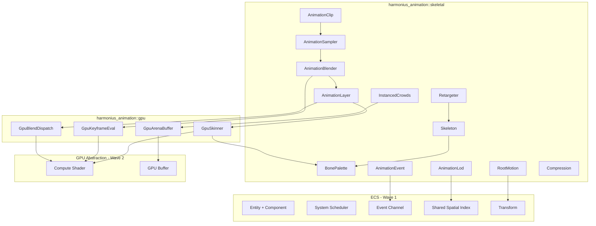
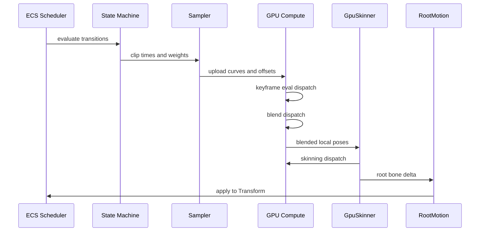
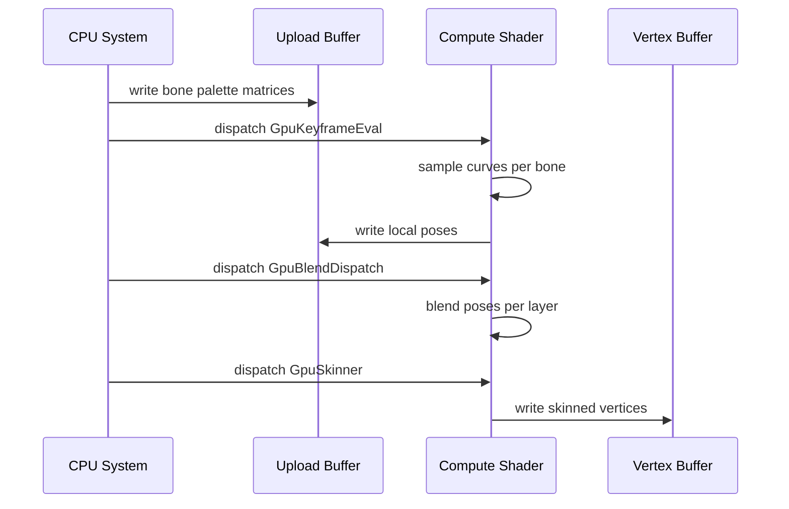
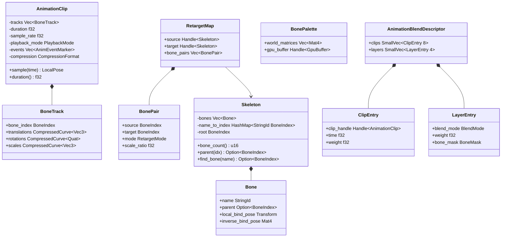
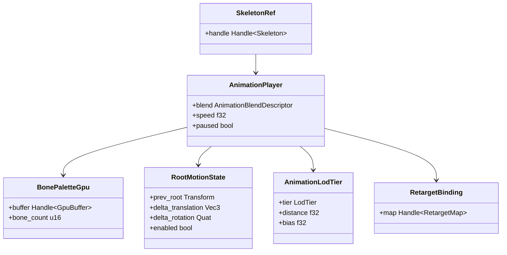
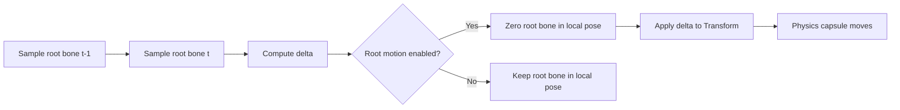

# Skeletal Animation Design

## Requirements Trace

> **Canonical sources:** Features, requirements, and user stories are defined in
> [features/animation/](../../features/animation/),
> [requirements/animation/](../../requirements/animation/), and
> [user-stories/animation/](../../user-stories/animation/). The table below traces design elements
> to those definitions.

| Feature | Requirement | Description |
|---------|-------------|-------------|
| F-9.1.1 | R-9.1.1 | GPU compute skinning with linear blend and dual-quaternion modes |
| F-9.1.2 | R-9.1.2 | GPU keyframe evaluation using Hermite interpolation |
| F-9.1.3 | R-9.1.3 | Animation blending (linear and cubic) up to 8 simultaneous clips |
| F-9.1.4 | R-9.1.4 | Animation layers with per-bone masks and additive blending |
| F-9.1.5 | R-9.1.5 | Instanced skeletal animation for 1000+ instances in a single dispatch |
| F-9.1.6 | R-9.1.6 | Root motion extraction and application via physics |
| F-9.1.7 | R-9.1.7 | Animation compression with 10:1+ ratio |
| F-9.1.8 | R-9.1.8 | Animation retargeting between different skeletons |
| F-9.1.9 | R-9.1.9 | Animation events and notifies via ECS observers |
| F-9.1.10 | R-9.1.10 | Animation LOD with 4+ tiers using shared spatial index |

## Overview

The skeletal animation subsystem evaluates, blends, and skins character animation entirely on the
GPU. All skeleton data, animation playback state, bone palettes, and LOD parameters live as ECS
components. All logic runs as ECS systems scheduled by the engine's task graph.

The pipeline has three GPU compute stages per frame:

1. **Keyframe evaluation** -- sample animation curves at the current time offset using Hermite
   interpolation, producing per-clip local-space poses.
2. **Blend and layer** -- combine local poses using blend weights and per-bone masks, applying
   linear, cubic, and additive blending modes.
3. **Skinning** -- transform mesh vertices by the resulting world-space bone matrices using either
   linear blend skinning (LBS) or dual-quaternion skinning (DQS).

Root motion deltas are extracted from the root bone before zeroing it in local space, then applied
to the entity's `Transform` component. Animation events fire through the ECS observer system as
typed event components. Animation LOD uses the shared spatial index distance to select one of four
evaluation tiers: full, reduced bones, half bones at lower update rate, or vertex animation texture
(VAT) playback.

Key design decisions:

1. **GPU-first** -- all per-bone math runs in HLSL compute shaders, not on the CPU. The CPU only
   computes blend descriptors and uploads them.
2. **Instanced arena** -- thousands of skeleton instances share a single GPU arena buffer and are
   evaluated in one dispatch, grouped by clip.
3. **Compression at rest** -- clips are stored compressed (smallest-three quaternion, range-reduced
   fixed-point) and decompressed on the GPU during keyframe evaluation.
4. **Static dispatch** -- no trait objects; skinning mode (LBS vs DQS) is selected via enum variant
   and compiled into separate pipeline permutations.

## Architecture

### Module Boundaries



### Module Layout

```text
harmonius_animation/
+-- skeletal/
|   +-- mod.rs          # Re-exports public API
|   +-- skeleton.rs     # Skeleton, Bone, BoneIndex
|   +-- clip.rs         # AnimationClip, BoneTrack,
|   |                   # PlaybackMode
|   +-- sampler.rs      # AnimationSampler
|   +-- blender.rs      # AnimationBlender,
|   |                   # BlendDescriptor
|   +-- layer.rs        # AnimationLayer, BoneMask,
|   |                   # BlendMode
|   +-- root_motion.rs  # RootMotionExtractor
|   +-- retarget.rs     # RetargetMap, BonePair,
|   |                   # RetargetMode
|   +-- events.rs       # AnimEventMarker,
|   |                   # AnimEventWindow
|   +-- lod.rs          # AnimationLod, LodTier,
|   |                   # LodConfig
|   +-- compression.rs  # CompressionFormat,
|   |                   # CompressedCurve
|   +-- instanced.rs    # InstancedAnimator,
|                       # GpuArenaBuffer
+-- gpu/
|   +-- mod.rs          # Re-exports
|   +-- skinner.rs      # GpuSkinner (LBS + DQS)
|   +-- keyframe.rs     # GpuKeyframeEval
|   +-- blend.rs        # GpuBlendDispatch
|   +-- arena.rs        # GpuArenaBuffer management
|   +-- shaders/
|       +-- skinning_lbs.hlsl
|       +-- skinning_dqs.hlsl
|       +-- keyframe_eval.hlsl
|       +-- blend_linear.hlsl
|       +-- blend_additive.hlsl
+-- components.rs       # ECS components:
                        # SkeletonRef,
                        # AnimationPlayer,
                        # BonePaletteGpu,
                        # RootMotionState,
                        # AnimationLodTier,
                        # RetargetBinding
```

### Frame Pipeline



### GPU Skinning Dispatch



### Core Data Structures



### ECS Component Relationships



### Root Motion Flow



### Animation LOD Tiers


## API Design

### Skeleton and Bones

```rust
/// Index into a skeleton's bone array.
#[derive(
    Clone, Copy, Debug, PartialEq, Eq, Hash,
)]
pub struct BoneIndex(pub u16);

/// A single bone in a skeleton hierarchy.
pub struct Bone {
    pub name: StringId,
    pub parent: Option<BoneIndex>,
    pub local_bind_pose: Transform,
    pub inverse_bind_pose: Mat4,
}

/// Skeleton asset: a hierarchy of bones with
/// bind-pose transforms. Shared across all
/// entities that use the same skeletal mesh.
pub struct Skeleton {
    bones: Vec<Bone>,
    name_to_index: HashMap<StringId, BoneIndex>,
    root: BoneIndex,
}

impl Skeleton {
    pub fn bone_count(&self) -> u16;
    pub fn root(&self) -> BoneIndex;

    pub fn parent(
        &self,
        index: BoneIndex,
    ) -> Option<BoneIndex>;

    pub fn find_bone(
        &self,
        name: StringId,
    ) -> Option<BoneIndex>;

    /// Iterate bones in parent-first order.
    pub fn iter_depth_first(
        &self,
    ) -> impl Iterator<Item = (BoneIndex, &Bone)>;

    /// Returns the inverse bind pose matrix
    /// for the given bone.
    pub fn inverse_bind_pose(
        &self,
        index: BoneIndex,
    ) -> &Mat4;
}
```

### Animation Clips

```rust
/// Playback wrap behavior at clip boundaries.
#[derive(Clone, Copy, Debug, PartialEq, Eq)]
pub enum PlaybackMode {
    Loop,
    Clamp,
    PingPong,
}

/// Compression format for a bone track.
#[derive(Clone, Copy, Debug, PartialEq, Eq)]
pub enum CompressionFormat {
    /// No compression. Full f32 keyframes.
    Uncompressed,
    /// Smallest-three quaternion encoding for
    /// rotations. Range-reduced fixed-point
    /// for translation and scale.
    VariableRate {
        rotation_bits: u8,
        translation_bits: u8,
        scale_bits: u8,
    },
}

/// A compressed animation curve for a single
/// channel (translation, rotation, or scale)
/// of one bone.
pub struct CompressedCurve<T> {
    keyframes: Vec<CompressedKeyframe<T>>,
    compression: CompressionFormat,
}

/// A single compressed keyframe with time,
/// value, and tangent data for Hermite
/// interpolation.
pub struct CompressedKeyframe<T> {
    pub time: f32,
    pub value: T,
    pub in_tangent: T,
    pub out_tangent: T,
}

/// Per-bone animation track containing
/// translation, rotation, and scale curves.
pub struct BoneTrack {
    pub bone_index: BoneIndex,
    pub translations: CompressedCurve<Vec3>,
    pub rotations: CompressedCurve<Quat>,
    pub scales: CompressedCurve<Vec3>,
}

/// An animation event marker embedded at a
/// specific frame in a clip.
pub struct AnimEventMarker {
    pub name: StringId,
    pub time: f32,
    pub payload: AnimEventPayload,
}

/// An animation event active over a frame
/// range (e.g., hit detection windows).
pub struct AnimEventWindow {
    pub name: StringId,
    pub start_time: f32,
    pub end_time: f32,
    pub payload: AnimEventPayload,
}

/// Typed payload for animation events,
/// dispatched through the ECS observer system.
pub enum AnimEventPayload {
    /// Footstep: surface type.
    Footstep { surface: StringId },
    /// Hit window: damage zone.
    HitWindow { bone: BoneIndex },
    /// VFX spawn point.
    VfxSpawn { effect: Handle<VfxAsset> },
    /// Weapon trail start/end.
    WeaponTrail { active: bool },
    /// Generic named trigger.
    Trigger { id: StringId },
}

/// An animation clip asset. Contains bone
/// tracks, events, duration, and compression
/// metadata. Stored compressed; decompressed
/// on the GPU during keyframe evaluation.
pub struct AnimationClip {
    tracks: Vec<BoneTrack>,
    duration: f32,
    sample_rate: f32,
    playback_mode: PlaybackMode,
    events: Vec<AnimEventMarker>,
    windows: Vec<AnimEventWindow>,
    compression: CompressionFormat,
}

impl AnimationClip {
    pub fn duration(&self) -> f32;
    pub fn sample_rate(&self) -> f32;
    pub fn playback_mode(&self) -> PlaybackMode;
    pub fn track_count(&self) -> u16;

    /// Wrap a raw time value according to the
    /// clip's playback mode.
    pub fn wrap_time(&self, raw: f32) -> f32;

    /// Returns events that fire in the time
    /// range (prev_time, current_time].
    pub fn events_in_range(
        &self,
        prev_time: f32,
        current_time: f32,
    ) -> impl Iterator<Item = &AnimEventMarker>;

    /// Returns windows active at the given
    /// time.
    pub fn active_windows(
        &self,
        time: f32,
    ) -> impl Iterator<Item = &AnimEventWindow>;
}
```

### Animation Blending

```rust
/// How a layer blends onto the base pose.
#[derive(Clone, Copy, Debug, PartialEq, Eq)]
pub enum BlendMode {
    /// Weighted average (slerp for rotations).
    Linear,
    /// Cubic Hermite interpolation for smooth
    /// second-derivative-continuous transitions.
    Cubic,
    /// Delta relative to a reference pose.
    /// Added on top of the base.
    Additive,
    /// Full override for masked bones.
    Override,
}

/// Per-bone mask that controls which bones
/// a layer affects. Stored as a bitset.
pub struct BoneMask {
    bits: Vec<u64>,
}

impl BoneMask {
    pub fn all(bone_count: u16) -> Self;
    pub fn none(bone_count: u16) -> Self;
    pub fn set(
        &mut self,
        index: BoneIndex,
        active: bool,
    );
    pub fn is_set(
        &self,
        index: BoneIndex,
    ) -> bool;

    /// Create a mask that includes only bones
    /// at or below the given root bone in the
    /// hierarchy.
    pub fn from_subtree(
        skeleton: &Skeleton,
        subtree_root: BoneIndex,
    ) -> Self;
}

/// A single clip entry in a blend descriptor.
pub struct ClipEntry {
    pub clip_handle: Handle<AnimationClip>,
    pub time: f32,
    pub weight: f32,
}

/// A single layer entry in a blend descriptor.
pub struct LayerEntry {
    pub blend_mode: BlendMode,
    pub weight: f32,
    pub bone_mask: BoneMask,
}

/// Describes the full blend configuration for
/// one skeleton instance. Built CPU-side by the
/// state machine and uploaded to the GPU.
pub struct AnimationBlendDescriptor {
    pub clips: SmallVec<[ClipEntry; 8]>,
    pub layers: SmallVec<[LayerEntry; 4]>,
}
```

### Root Motion

```rust
/// Root motion extraction mode.
#[derive(Clone, Copy, Debug, PartialEq, Eq)]
pub enum RootMotionMode {
    /// Extract translation and rotation deltas
    /// from the root bone.
    TranslationAndRotation,
    /// Extract translation only.
    TranslationOnly,
    /// Extract rotation only.
    RotationOnly,
    /// No root motion extraction.
    Disabled,
}

/// Extracts root bone deltas from a sampled
/// pose and applies them to the entity's
/// Transform component.
pub struct RootMotionExtractor;

impl RootMotionExtractor {
    /// Compute the delta between two root bone
    /// transforms.
    pub fn compute_delta(
        prev: &Transform,
        current: &Transform,
        mode: RootMotionMode,
    ) -> RootMotionDelta;

    /// Zero the root bone's extracted channels
    /// in the local pose so the skeleton does
    /// not translate/rotate in model space.
    pub fn zero_root_bone(
        pose: &mut LocalPose,
        root: BoneIndex,
        mode: RootMotionMode,
    );
}

/// The delta extracted from the root bone for
/// one frame.
pub struct RootMotionDelta {
    pub translation: Vec3,
    pub rotation: Quat,
}
```

### Animation Retargeting

```rust
/// How a bone is retargeted from source to
/// target skeleton.
#[derive(Clone, Copy, Debug, PartialEq, Eq)]
pub enum RetargetMode {
    /// Copy rotation and translation directly.
    /// For bones with 1:1 correspondence
    /// (fingers, facial).
    DirectCopy,
    /// Copy rotation, scale translation by
    /// bone length ratio. For root, pelvis,
    /// limbs.
    ScaledTranslation,
    /// Copy rotation only. For spine, neck,
    /// head.
    RotationOnly,
}

/// Mapping between one source bone and one
/// target bone.
pub struct BonePair {
    pub source: BoneIndex,
    pub target: BoneIndex,
    pub mode: RetargetMode,
    pub scale_ratio: f32,
}

/// A retargeting asset that maps bones from
/// a source skeleton to a target skeleton.
/// Authored visually in the animation editor.
pub struct RetargetMap {
    pub source_skeleton: Handle<Skeleton>,
    pub target_skeleton: Handle<Skeleton>,
    pub canonical_pose: CanonicalPose,
    pub bone_pairs: Vec<BonePair>,
}

/// The shared reference pose used to establish
/// bone correspondence.
#[derive(Clone, Copy, Debug, PartialEq, Eq)]
pub enum CanonicalPose {
    TPose,
    APose,
}

impl RetargetMap {
    /// Retarget a local pose from the source
    /// skeleton to the target skeleton.
    pub fn retarget(
        &self,
        source_pose: &LocalPose,
    ) -> LocalPose;

    /// Validate that all bone pairs reference
    /// valid indices in both skeletons. Returns
    /// an error listing invalid pairs.
    pub fn validate(&self) -> Result<(), Vec<BonePair>>;
}
```

### Animation Compression

```rust
/// Compress an animation clip using
/// variable-rate quantization per track.
pub fn compress_clip(
    clip: &AnimationClip,
    config: CompressionConfig,
) -> CompressedAnimationClip;

/// Compression configuration.
pub struct CompressionConfig {
    /// Bits per rotation component (smallest-
    /// three encoding). Typical: 9-12 bits.
    pub rotation_bits: u8,
    /// Bits per translation component (range-
    /// reduced fixed-point). Typical: 12-16.
    pub translation_bits: u8,
    /// Bits per scale component. Typical: 10.
    pub scale_bits: u8,
    /// Maximum allowed positional error per
    /// joint in world units.
    pub error_threshold: f32,
}

/// A compressed animation clip ready for GPU
/// upload. Tracks are packed into a byte buffer
/// with per-track decompression metadata.
pub struct CompressedAnimationClip {
    pub packed_data: Vec<u8>,
    pub track_offsets: Vec<u32>,
    pub track_count: u16,
    pub duration: f32,
    pub sample_rate: f32,
    pub playback_mode: PlaybackMode,
    pub compression: CompressionFormat,
    pub compression_ratio: f32,
}
```

### Animation LOD

```rust
/// LOD tier for animation evaluation.
#[derive(
    Clone, Copy, Debug, PartialEq, Eq,
    PartialOrd, Ord,
)]
pub enum LodTier {
    /// Full skeletal evaluation, all bones,
    /// full update rate, all IK passes.
    Full,
    /// Reduced bone set, fewer IK passes.
    Reduced,
    /// Half bone count, lower update rate
    /// (e.g., every other frame).
    HalfRate,
    /// Vertex animation texture playback.
    /// No skeletal evaluation at all.
    Vat,
}

/// Configuration for animation LOD thresholds.
pub struct LodConfig {
    /// Distance at which Full -> Reduced.
    pub reduced_distance: f32,
    /// Distance at which Reduced -> HalfRate.
    pub half_rate_distance: f32,
    /// Distance at which HalfRate -> VAT.
    pub vat_distance: f32,
    /// Blend range for smooth LOD transitions.
    pub transition_range: f32,
}

impl LodConfig {
    /// Default desktop thresholds.
    pub fn desktop() -> Self {
        Self {
            reduced_distance: 50.0,
            half_rate_distance: 100.0,
            vat_distance: 200.0,
            transition_range: 5.0,
        }
    }

    /// Default mobile thresholds (more
    /// aggressive).
    pub fn mobile() -> Self {
        Self {
            reduced_distance: 20.0,
            half_rate_distance: 40.0,
            vat_distance: 80.0,
            transition_range: 3.0,
        }
    }
}

/// Determine the LOD tier for a given distance
/// and per-entity bias.
pub fn compute_lod_tier(
    distance: f32,
    bias: f32,
    config: &LodConfig,
) -> LodTier;
```

### ECS Components

```rust
/// Reference to the skeleton asset used by
/// this entity. Required for all animated
/// entities.
#[derive(Component)]
pub struct SkeletonRef {
    pub handle: Handle<Skeleton>,
}

/// Per-entity animation playback state.
/// Updated each frame by the state machine
/// system (Wave 3). Contains the blend
/// descriptor uploaded to the GPU.
#[derive(Component)]
pub struct AnimationPlayer {
    pub blend: AnimationBlendDescriptor,
    pub speed: f32,
    pub paused: bool,
    pub elapsed: f32,
}

/// GPU-side bone palette for this entity.
/// Written by the GpuSkinner compute shader.
#[derive(Component)]
pub struct BonePaletteGpu {
    pub buffer: Handle<GpuBuffer>,
    pub bone_count: u16,
}

/// Root motion extraction state for this
/// entity.
#[derive(Component)]
pub struct RootMotionState {
    pub prev_root: Transform,
    pub delta_translation: Vec3,
    pub delta_rotation: Quat,
    pub mode: RootMotionMode,
}

/// Current animation LOD tier for this entity.
/// Computed from shared spatial index distance.
#[derive(Component)]
pub struct AnimationLodTier {
    pub tier: LodTier,
    pub distance: f32,
    pub bias: f32,
}

/// Optional retargeting binding for this
/// entity. When present, animation clips are
/// retargeted through the referenced map
/// before evaluation.
#[derive(Component)]
pub struct RetargetBinding {
    pub map: Handle<RetargetMap>,
}
```

### ECS Systems

```rust
/// System: update AnimationLodTier from the
/// shared spatial index. Runs early in the
/// animation phase.
pub fn animation_lod_system(
    query: Query<(
        &mut AnimationLodTier,
        &Transform,
    )>,
    spatial_index: Res<SharedSpatialIndex>,
    camera: Res<ActiveCamera>,
    config: Res<LodConfig>,
);

/// System: advance animation time and rebuild
/// blend descriptors. Reads AnimationPlayer,
/// writes updated clip times and weights.
/// Note: full state machine evaluation is
/// designed in Wave 3 (state-machine.md). This
/// system handles time advancement and event
/// dispatch for Wave 2.
pub fn animation_advance_system(
    query: Query<(
        &mut AnimationPlayer,
        &SkeletonRef,
        &AnimationLodTier,
    )>,
    clips: Res<AssetStore<AnimationClip>>,
    dt: Res<DeltaTime>,
    events: EventWriter<AnimEvent>,
);

/// System: extract root motion deltas from
/// the current pose and apply them to
/// Transform. Writes RootMotionState and
/// Transform.
pub fn root_motion_system(
    query: Query<(
        &mut RootMotionState,
        &mut Transform,
        &AnimationPlayer,
        &SkeletonRef,
    )>,
);

/// System: upload blend descriptors and bone
/// data to GPU buffers, dispatch the three
/// compute shader stages (keyframe eval,
/// blend, skinning). Writes BonePaletteGpu.
pub fn gpu_animation_system(
    query: Query<(
        &AnimationPlayer,
        &SkeletonRef,
        &mut BonePaletteGpu,
        &AnimationLodTier,
        Option<&RetargetBinding>,
    )>,
    skeletons: Res<AssetStore<Skeleton>>,
    clips: Res<AssetStore<AnimationClip>>,
    retarget_maps: Res<AssetStore<RetargetMap>>,
    gpu: Res<GpuDevice>,
);
```

### GPU Compute Shaders (HLSL)

```hlsl
// keyframe_eval.hlsl
// Dispatched per (instance, bone) pair.

struct BoneTrackHeader {
    uint offset;       // byte offset in data
    uint keyframe_count;
    uint compression;  // CompressionFormat
};

struct KeyframeData {
    float time;
    float3 value;      // or quat packed
    float3 in_tangent;
    float3 out_tangent;
};

StructuredBuffer<BoneTrackHeader> tracks;
ByteAddressBuffer packed_data;

RWStructuredBuffer<float4x4> local_poses;

cbuffer AnimParams : register(b0) {
    uint instance_count;
    uint bones_per_skeleton;
    float time;
    uint playback_mode; // 0=loop, 1=clamp, 2=pp
};

// Hermite interpolation between two keyframes.
float3 hermite(
    float3 p0, float3 m0,
    float3 p1, float3 m1,
    float t
) {
    float t2 = t * t;
    float t3 = t2 * t;
    float h00 = 2*t3 - 3*t2 + 1;
    float h10 = t3 - 2*t2 + t;
    float h01 = -2*t3 + 3*t2;
    float h11 = t3 - t2;
    return h00*p0 + h10*m0 + h01*p1 + h11*m1;
}

[numthreads(64, 1, 1)]
void CSMain(uint3 id : SV_DispatchThreadID) {
    uint instance = id.x / bones_per_skeleton;
    uint bone = id.x % bones_per_skeleton;
    if (instance >= instance_count) return;

    BoneTrackHeader hdr = tracks[
        instance * bones_per_skeleton + bone
    ];
    // Binary search for keyframe pair at time
    // Decompress, Hermite interpolate
    // Write result to local_poses[id.x]
}
```

```hlsl
// skinning_lbs.hlsl
// Linear blend skinning compute shader.
// Dispatched per vertex.

struct VertexIn {
    float3 position;
    float3 normal;
    float4 tangent;
    uint4  bone_indices;
    float4 bone_weights;
};

struct VertexOut {
    float3 position;
    float3 normal;
    float4 tangent;
};

StructuredBuffer<VertexIn> vertices_in;
StructuredBuffer<float4x4> bone_palette;
RWStructuredBuffer<VertexOut> vertices_out;

cbuffer SkinParams : register(b0) {
    uint vertex_count;
    uint bone_offset; // into bone_palette
};

[numthreads(256, 1, 1)]
void CSMain(uint3 id : SV_DispatchThreadID) {
    if (id.x >= vertex_count) return;

    VertexIn v = vertices_in[id.x];
    float4x4 skin_matrix = (float4x4)0;

    [unroll]
    for (uint i = 0; i < 4; i++) {
        uint idx = bone_offset + v.bone_indices[i];
        skin_matrix +=
            bone_palette[idx] * v.bone_weights[i];
    }

    VertexOut out_v;
    out_v.position = mul(
        skin_matrix, float4(v.position, 1.0)
    ).xyz;
    out_v.normal = normalize(
        mul((float3x3)skin_matrix, v.normal)
    );
    out_v.tangent = float4(
        normalize(
            mul(
                (float3x3)skin_matrix,
                v.tangent.xyz
            )
        ),
        v.tangent.w
    );

    vertices_out[id.x] = out_v;
}
```

```hlsl
// skinning_dqs.hlsl
// Dual-quaternion skinning compute shader.
// Eliminates candy-wrapping at twist joints.

struct DualQuat {
    float4 real; // rotation
    float4 dual; // translation
};

StructuredBuffer<VertexIn> vertices_in;
StructuredBuffer<DualQuat> bone_palette_dq;
RWStructuredBuffer<VertexOut> vertices_out;

cbuffer SkinParams : register(b0) {
    uint vertex_count;
    uint bone_offset;
};

DualQuat blend_dq(
    DualQuat a, DualQuat b, float w
) {
    // Ensure shortest path
    float sign =
        dot(a.real, b.real) < 0.0 ? -1.0 : 1.0;
    DualQuat result;
    result.real =
        a.real * (1.0 - w) + b.real * sign * w;
    result.dual =
        a.dual * (1.0 - w) + b.dual * sign * w;
    return result;
}

[numthreads(256, 1, 1)]
void CSMain(uint3 id : SV_DispatchThreadID) {
    if (id.x >= vertex_count) return;

    VertexIn v = vertices_in[id.x];
    DualQuat blended;
    blended.real = float4(0,0,0,0);
    blended.dual = float4(0,0,0,0);

    [unroll]
    for (uint i = 0; i < 4; i++) {
        uint idx = bone_offset + v.bone_indices[i];
        DualQuat dq = bone_palette_dq[idx];
        float sign =
            dot(
                bone_palette_dq[
                    bone_offset + v.bone_indices[0]
                ].real,
                dq.real
            ) < 0.0 ? -1.0 : 1.0;
        blended.real +=
            dq.real * sign * v.bone_weights[i];
        blended.dual +=
            dq.dual * sign * v.bone_weights[i];
    }

    // Normalize
    float len = length(blended.real);
    blended.real /= len;
    blended.dual /= len;

    // Transform position and normal
    // ... (standard DQS transform)
    vertices_out[id.x] = out_v;
}
```

### Instanced Animation

```rust
/// Arena buffer for batch-evaluating thousands
/// of skeleton instances in a single GPU
/// dispatch.
pub struct GpuArenaBuffer {
    buffer: Handle<GpuBuffer>,
    capacity: u32,
    bone_stride: u16,
}

impl GpuArenaBuffer {
    /// Create an arena sized for the given
    /// instance and bone count.
    pub fn new(
        gpu: &GpuDevice,
        max_instances: u32,
        bones_per_skeleton: u16,
    ) -> Self;

    /// Allocate a region for one skeleton
    /// instance. Returns the byte offset.
    pub fn allocate(&mut self) -> Option<u32>;

    /// Reset the arena for the next frame.
    pub fn reset(&mut self);

    pub fn capacity(&self) -> u32;
    pub fn used(&self) -> u32;
}

/// Groups instances by animation clip for
/// optimal GPU occupancy before dispatching.
pub struct InstancedAnimator;

impl InstancedAnimator {
    /// Dispatch a single compute pass that
    /// evaluates all instances in the arena.
    /// Instances sharing the same clip are
    /// grouped into contiguous regions.
    pub fn dispatch(
        arena: &GpuArenaBuffer,
        instances: &[InstanceDesc],
        gpu: &GpuDevice,
    );
}

/// Description of one skeleton instance for
/// instanced evaluation.
pub struct InstanceDesc {
    pub clip: Handle<AnimationClip>,
    pub time: f32,
    pub arena_offset: u32,
}
```

### Skinning Mode Selection

```rust
/// Skinning algorithm selection. Determines
/// which compute shader pipeline permutation
/// is used. Selected per-skeleton, not
/// per-vertex.
#[derive(Clone, Copy, Debug, PartialEq, Eq)]
pub enum SkinningMode {
    /// Standard linear blend skinning. Fast,
    /// suitable for most characters.
    LinearBlend,
    /// Dual-quaternion skinning. Eliminates
    /// candy-wrapping at twist joints.
    /// Desktop and Switch only.
    DualQuaternion,
}

/// The GPU skinner. Holds pipeline state
/// objects for both LBS and DQS permutations.
pub struct GpuSkinner {
    pipeline_lbs: Handle<ComputePipeline>,
    pipeline_dqs: Handle<ComputePipeline>,
}

impl GpuSkinner {
    pub fn new(gpu: &GpuDevice) -> Self;

    /// Dispatch skinning for one entity. The
    /// mode selects the pipeline permutation.
    /// No dynamic dispatch: the match is a
    /// compile-time-known branch.
    pub fn dispatch(
        &self,
        gpu: &GpuDevice,
        mode: SkinningMode,
        bone_palette: &Handle<GpuBuffer>,
        vertex_buffer_in: &Handle<GpuBuffer>,
        vertex_buffer_out: &Handle<GpuBuffer>,
        vertex_count: u32,
    );
}
```

### Error Types

```rust
pub enum AnimationError {
    /// Clip references a bone index not
    /// present in the target skeleton.
    BoneIndexOutOfRange {
        clip: Handle<AnimationClip>,
        bone: BoneIndex,
        skeleton_bone_count: u16,
    },
    /// Retarget map references invalid bone
    /// indices.
    InvalidRetargetPair {
        pair: BonePair,
    },
    /// Compression produced error above the
    /// configured threshold.
    CompressionErrorExceeded {
        joint: BoneIndex,
        error: f32,
        threshold: f32,
    },
    /// GPU arena is full; cannot allocate
    /// more instances.
    ArenaExhausted {
        capacity: u32,
    },
}
```

## Data Flow

### Per-Frame Animation Pipeline

The following pseudocode shows the per-frame data flow through the animation ECS systems. Each
system is a node in the frame task graph and may run in parallel with non-conflicting systems.

```rust
// Phase 1: LOD evaluation (reads Transform,
// writes AnimationLodTier)
animation_lod_system(
    &mut lod_tiers,
    &transforms,
    &spatial_index,
    &camera,
    &lod_config,
);

// Phase 2: Time advancement and event dispatch
// (reads AnimationLodTier, writes
// AnimationPlayer)
animation_advance_system(
    &mut players,
    &skeleton_refs,
    &lod_tiers,
    &clips,
    dt,
    &mut event_writer,
);

// Phase 3: Root motion extraction
// (reads AnimationPlayer, writes
// RootMotionState + Transform)
root_motion_system(
    &mut root_motion_states,
    &mut transforms,
    &players,
    &skeleton_refs,
);

// Phase 4: GPU upload and dispatch
// (reads AnimationPlayer + SkeletonRef +
// AnimationLodTier + RetargetBinding, writes
// BonePaletteGpu)
gpu_animation_system(
    &players,
    &skeleton_refs,
    &mut bone_palettes,
    &lod_tiers,
    &retarget_bindings,
    &skeletons,
    &clips,
    &retarget_maps,
    &gpu,
);

// After Phase 4, the renderer reads
// BonePaletteGpu to draw skinned meshes.
```

### Parallel Bone Evaluation

Within `gpu_animation_system`, the CPU stages (building blend descriptors, uploading buffer data)
run as scoped parallel tasks on the thread pool. Each entity's upload is independent and can proceed
concurrently.

```rust
pool.scope(|scope| {
    for entity in animated_entities.iter() {
        scope.spawn(|| {
            let desc = build_blend_descriptor(
                entity,
                &clips,
                &retarget_maps,
            );
            upload_blend_descriptor(
                &gpu, entity, &desc,
            );
        });
    }
});

// After all uploads complete, dispatch the
// three GPU compute stages sequentially:
// 1. GpuKeyframeEval
// 2. GpuBlendDispatch
// 3. GpuSkinner
// Each dispatch covers all entities in one
// call (or one per LOD tier).
```

### Instanced Crowd Flow

For instanced evaluation (F-9.1.5):

1. The `InstancedAnimator` groups all crowd entities by their active animation clip.
2. Per-group instance data (time offsets, arena offsets) is uploaded to a staging buffer.
3. A single `GpuKeyframeEval` dispatch evaluates all instances in the arena.
4. A single `GpuSkinner` dispatch skins all instances.
5. The renderer draws all instances using the arena as a shared bone palette.

### Event Dispatch Flow

Animation events follow this path:

1. `animation_advance_system` detects that playback crossed an event marker time.
2. The system constructs an `AnimEvent` component from the `AnimEventPayload`.
3. The event is written to the ECS `EventWriter<AnimEvent>`.
4. Downstream systems (audio, VFX, gameplay) observe events via `EventReader<AnimEvent>`.

## Platform Considerations

### Bone Count Budgets Per Tier

| Tier | Max Bones | Blend Clips | Layers | Instances |
|------|-----------|-------------|--------|-----------|
| Mobile | 32-64 | 4 | 2 | 20-50 |
| Switch | 96 | 6 | 3 | 50-200 |
| Desktop | 256+ | 8 | 4+ | 500+ |

### Skinning Mode Availability

| Tier | LBS | DQS | Notes |
|------|-----|-----|-------|
| Mobile | Yes | No | LBS only to stay in budget |
| Switch | Yes | Yes | DQS for hero characters |
| Desktop | Yes | Yes | DQS default for all |

### LOD Threshold Defaults

| Tier | Reduced | Half Rate | VAT |
|------|---------|-----------|-----|
| Mobile | 20 m | 40 m | 80 m |
| Switch | 35 m | 70 m | 150 m |
| Desktop | 50 m | 100 m | 200 m |

### Compute Shader Dispatch

All three compute stages (keyframe eval, blend, skinning) use HLSL compiled via DXC. On macOS, DXIL
is translated to MSL via Metal Shader Converter (both accessed through C++ wrappers via cxx.rs per
project constraints).

Thread group sizes:

| Shader | Group Size | Notes |
|--------|-----------|-------|
| Keyframe eval | 64 | 1 thread per (instance, bone) |
| Blend | 64 | 1 thread per (instance, bone) |
| Skinning LBS | 256 | 1 thread per vertex |
| Skinning DQS | 256 | 1 thread per vertex |

### Compression Format

| Track | Encoding | Bits | Ratio |
|-------|----------|------|-------|
| Rotation | Smallest-three quat | 9-12 per component | ~6:1 |
| Translation | Range-reduced fixed-point | 12-16 per component | ~3:1 |
| Scale | Range-reduced fixed-point | 10 per component | ~4:1 |
| Overall | Mixed | Variable | 10:1+ |

### Networking Integration

Animation state replication includes: active clip index, playback time, blend weights, and animation
events. These are replicated as components via standard replication. Skeleton LOD level is
determined per-client based on distance, not replicated.

Curve evaluation for animation clips uses the shared `Curve<T>` type (see
[shared-primitives.md](../core-runtime/shared-primitives.md)).

## Test Plan

### Unit Tests

| Test | Req | Description |
|------|-----|-------------|
| `test_hermite_interpolation_accuracy` | R-9.1.2 | Sample a Hermite curve at t=0.5 and verify result matches analytical value within 0.001 units. |
| `test_playback_mode_loop` | R-9.1.2 | Play a 1.0s clip at t=1.5s in Loop mode. Verify wrapped time is 0.5s. |
| `test_playback_mode_clamp` | R-9.1.2 | Play at t=1.5s in Clamp mode. Verify time is 1.0s. |
| `test_playback_mode_pingpong` | R-9.1.2 | Play at t=1.5s in PingPong mode. Verify time is 0.5s (reverse). |
| `test_blend_8_clips_equal_weight` | R-9.1.3 | Blend 8 clips at equal weight. Verify result matches CPU reference within 0.001 units per joint. |
| `test_cubic_blend_continuity` | R-9.1.3 | Sample cubic blend at 10 intermediate weights. Verify second-derivative continuity. |
| `test_bone_mask_subtree` | R-9.1.4 | Create a mask from an upper-body subtree root. Verify masked bones match expected set. |
| `test_additive_layer` | R-9.1.4 | Apply additive breathing layer on base pose. Verify result = base + delta within 0.001 units. |
| `test_override_layer` | R-9.1.4 | Apply override layer with upper-body mask. Verify masked bones follow override exclusively. |
| `test_root_motion_delta` | R-9.1.6 | Extract root motion from a dodge roll clip. Verify displacement matches root bone delta within 0.01 units. |
| `test_root_motion_zeroing` | R-9.1.6 | After extraction, verify root bone in local pose is identity for extracted channels. |
| `test_compression_ratio_10x` | R-9.1.7 | Compress a humanoid walk cycle. Verify ratio >= 10:1. |
| `test_compression_error_threshold` | R-9.1.7 | Compress and decompress. Verify per-joint error < 0.5 mm. |
| `test_smallest_three_roundtrip` | R-9.1.7 | Encode/decode a quaternion via smallest-three. Verify dot product with original > 0.9999. |
| `test_retarget_direct_copy` | R-9.1.8 | Retarget finger bones in DirectCopy mode. Verify transforms match source exactly. |
| `test_retarget_scaled_translation` | R-9.1.8 | Retarget root bone with 1.2x scale ratio. Verify translation scaled correctly. |
| `test_retarget_no_nan` | R-9.1.8 | Retarget human mocap to quadruped. Verify no NaN values in output pose. |
| `test_event_fires_at_frame` | R-9.1.9 | Place event at frame 10. Advance past frame 10. Verify event fires exactly once. |
| `test_window_event_active_range` | R-9.1.9 | Place window event at frames 20-25. Verify active for exactly 6 frames. |
| `test_lod_tier_selection` | R-9.1.10 | Verify tier selection at 5m (Full), 50m (Reduced), 100m (HalfRate), 200m (VAT). |
| `test_lod_hero_bias` | R-9.1.10 | Set hero bias to keep Full at 200m. Verify tier remains Full. |

### Integration Tests

| Test | Req | Description |
|------|-----|-------------|
| `test_gpu_skinning_lbs_twist` | R-9.1.1 | Skin a forearm mesh rotated 180 degrees with LBS. Capture GPU output and verify vertex positions against CPU reference. |
| `test_gpu_skinning_dqs_twist` | R-9.1.1 | Same mesh with DQS. Verify no candy-wrapping: compare waist cross-section area against reference (LBS produces collapse, DQS preserves volume). |
| `test_gpu_keyframe_vs_cpu` | R-9.1.2 | Evaluate a 60-frame clip at t=15.5 on GPU and CPU. Verify per-joint position error < 0.001 units. |
| `test_instanced_1000` | R-9.1.5 | Spawn 1000 instances sharing 10 clips. Verify all poses match single-instance evaluation for 50 random samples. Confirm single GPU dispatch. |
| `test_instanced_frame_time` | R-9.1.5 | Measure GPU time for 1000 instances. Verify < 2 ms on reference hardware. |
| `test_root_motion_physics` | R-9.1.6 | Play dodge roll with root motion. Verify physics capsule displacement matches root delta and collision remains active. |
| `test_retarget_cross_species` | R-9.1.8 | Retarget human walk to quadruped. Verify no bone explosions and foot contact timing preserved. |
| `test_lod_200_characters` | R-9.1.10 | Place 200 characters at 5-500m. Verify correct tier per distance. Verify no visible popping in flythrough recording. |
| `test_full_pipeline_frame` | R-9.1.1-10 | Run complete animation pipeline for one frame with 50 characters at various distances and LOD tiers. Verify no errors, all buffers written, events dispatched. |

### Benchmarks

| Benchmark | Target | Source |
|-----------|--------|--------|
| GPU keyframe eval (256 bones) | < 0.1 ms | US-9.1.2.1 |
| GPU blend (8 clips, 256 bones) | < 0.1 ms | US-9.1.3.1 |
| GPU skinning LBS (50k vertices) | < 0.5 ms | US-9.1.1.1 |
| GPU skinning DQS (50k vertices) | < 0.7 ms | US-9.1.1.2 |
| Instanced eval (500 instances) | < 1.0 ms | US-9.1.5.2 |
| Instanced eval (1000 instances) | < 2.0 ms | US-9.1.5.2 |
| Compression (1000-frame clip) | < 50 ms | US-9.1.7.1 |
| Retarget (256-bone skeleton) | < 0.05 ms | US-9.1.8.1 |
| LOD system (200 entities) | < 0.1 ms | US-9.1.10.1 |

## Open Questions

1. **Blend descriptor upload strategy** -- A single large `StructuredBuffer` with all entities'
   blend descriptors packed contiguously, vs per-entity constant buffers. The former reduces draw
   call overhead but requires an allocation scheme in the arena.
2. **DQS on mobile** -- DQS is currently excluded on mobile due to the higher ALU cost of
   dual-quaternion blending. If future mobile GPUs have sufficient ALU throughput, this restriction
   could be lifted per-device.
3. **Compression decompression location** -- The current design decompresses on the GPU during
   keyframe evaluation. An alternative is to decompress on the CPU during asset load and store
   uncompressed curves in GPU memory. The GPU approach saves memory but adds ALU cost.
4. **VAT format** -- The VAT playback tier (LodTier::Vat) requires a vertex animation texture
   format. The specific texture layout (bone matrices baked into RGBA texels vs. position offsets)
   is not yet defined. This depends on the rendering pipeline design (Wave 3).
5. **Animation state machine boundary** -- The `animation_advance_system` in this design handles
   basic time advancement and event dispatch. Full state machine evaluation (transitions, blend
   spaces, montages) is designed in Wave 3 (`animation/state-machine .md`). The boundary between the
   two needs to be clearly defined: specifically, which system owns the `AnimationBlendDescriptor`.
6. **Retarget caching** -- Retargeting the same clip to the same target skeleton produces identical
   results. A cache of retargeted poses keyed on (clip, time, retarget_map) could avoid redundant
   GPU work for NPCs sharing the same archetype. The cache invalidation strategy needs design.
7. **Half-rate update synchronization** -- The `LodTier::HalfRate` tier updates every other frame.
   On the skipped frame, the previous bone palette is reused. This introduces one frame of
   staleness. Whether to interpolate between the two most recent palettes (adding a read-back) or
   accept the staleness needs profiling.
