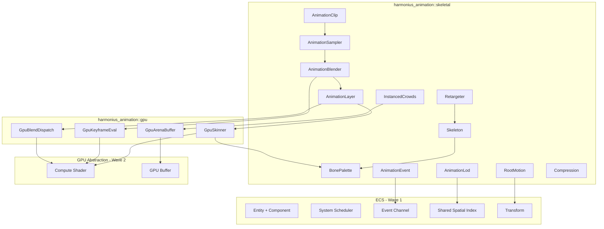
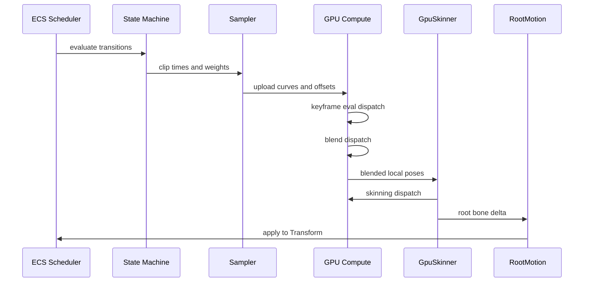
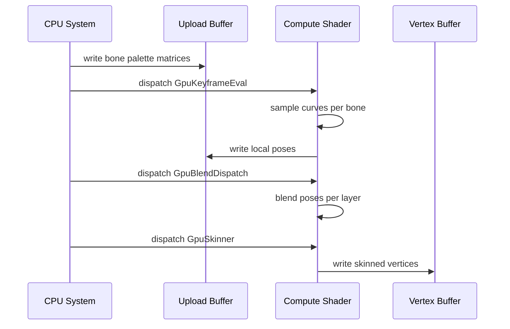
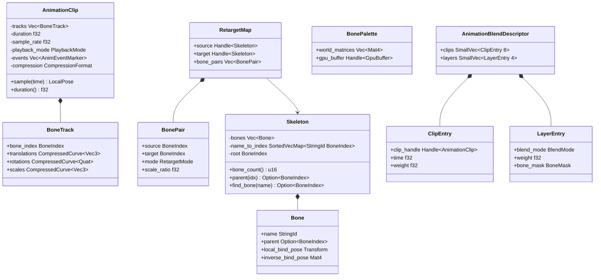
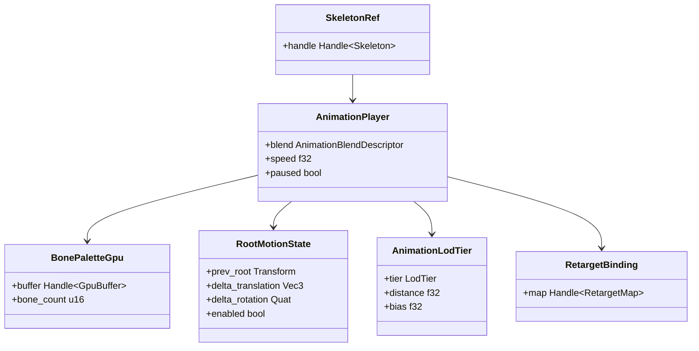
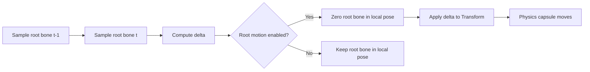

# Skeletal Animation Design

## Requirements Trace

> **Canonical sources:** Features, requirements, and user stories are defined in
> [features/animation/](../../features/), [requirements/animation/](../../requirements/), and
> [user-stories/animation/](../../user-stories/). The table below traces design elements to those
> definitions.

| Feature  | Requirement |
|----------|-------------|
| F-9.1.1  | R-9.1.1     |
| F-9.1.2  | R-9.1.2     |
| F-9.1.3  | R-9.1.3     |
| F-9.1.4  | R-9.1.4     |
| F-9.1.5  | R-9.1.5     |
| F-9.1.6  | R-9.1.6     |
| F-9.1.7  | R-9.1.7     |
| F-9.1.8  | R-9.1.8     |
| F-9.1.9  | R-9.1.9     |
| F-9.1.10 | R-9.1.10    |

1. **F-9.1.1** — GPU compute skinning with linear blend and dual-quaternion modes
2. **F-9.1.2** — GPU keyframe evaluation using Hermite interpolation
3. **F-9.1.3** — Animation blending (linear and cubic) up to 8 simultaneous clips
4. **F-9.1.4** — Animation layers with per-bone masks and additive blending
5. **F-9.1.5** — Instanced skeletal animation for 1000+ instances in a single dispatch
6. **F-9.1.6** — Root motion extraction and application via physics
7. **F-9.1.7** — Animation compression with 10:1+ ratio
8. **F-9.1.8** — Animation retargeting between different skeletons
9. **F-9.1.9** — Animation events and notifies via ECS observers
10. **F-9.1.10** — Animation LOD with 4+ tiers using shared spatial index

## Overview

The skeletal animation subsystem evaluates, blends, and skins character animation entirely on the
GPU. All skeleton data, animation playback state, bone palettes, and LOD parameters live as ECS
components. All logic runs as ECS systems scheduled by the engine's task graph.

The pipeline has three GPU compute stages per frame:

1. **Keyframe evaluation** -- sample animation curves at the current time offset using Hermite
   interpolation, producing per-clip local-space poses.
2. **Blend and layer** -- combine local poses using blend weights and per-bone masks, applying
   linear, cubic, and additive blending modes.
3. **Skinning** -- transform mesh vertices by the resulting world-space bone matrices using either
   linear blend skinning (LBS) or dual-quaternion skinning (DQS).

Root motion deltas are extracted from the root bone before zeroing it in local space, then applied
to the entity's `Transform` component. Animation events fire through the ECS observer system as
typed event components. Animation LOD uses the shared spatial index distance to select one of four
evaluation tiers: full, reduced bones, half bones at lower update rate, or vertex animation texture
(VAT) playback.

Key design decisions:

1. **GPU-first** -- all per-bone math runs in HLSL compute shaders, not on the CPU. The CPU only
   computes blend descriptors and uploads them.
2. **Instanced arena** -- thousands of skeleton instances share a single GPU arena buffer and are
   evaluated in one dispatch, grouped by clip.
3. **Compression at rest** -- clips are stored compressed (smallest-three quaternion, range-reduced
   fixed-point) and decompressed on the GPU during keyframe evaluation.
4. **Static dispatch** -- no trait objects; skinning mode (LBS vs DQS) is selected via enum variant
   and compiled into separate pipeline permutations.

## Architecture

### Module Boundaries



### Module Layout

```text
harmonius_animation/
+-- skeletal/
|   +-- mod.rs          # Re-exports public API
|   +-- skeleton.rs     # Skeleton, Bone, BoneIndex
|   +-- clip.rs         # AnimationClip, BoneTrack,
|   |                   # PlaybackMode
|   +-- sampler.rs      # AnimationSampler
|   +-- blender.rs      # AnimationBlender,
|   |                   # BlendDescriptor
|   +-- layer.rs        # AnimationLayer, BoneMask,
|   |                   # BlendMode
|   +-- root_motion.rs  # RootMotionExtractor
|   +-- retarget.rs     # RetargetMap, BonePair,
|   |                   # RetargetMode
|   +-- events.rs       # AnimEventMarker,
|   |                   # AnimEventWindow
|   +-- lod.rs          # AnimationLod, LodTier,
|   |                   # LodConfig
|   +-- compression.rs  # CompressionFormat,
|   |                   # CompressedCurve
|   +-- instanced.rs    # InstancedAnimator,
|                       # GpuArenaBuffer
+-- gpu/
|   +-- mod.rs          # Re-exports
|   +-- skinner.rs      # GpuSkinner (LBS + DQS)
|   +-- keyframe.rs     # GpuKeyframeEval
|   +-- blend.rs        # GpuBlendDispatch
|   +-- arena.rs        # GpuArenaBuffer management
|   +-- shaders/
|       +-- skinning_lbs.hlsl
|       +-- skinning_dqs.hlsl
|       +-- keyframe_eval.hlsl
|       +-- blend_linear.hlsl
|       +-- blend_additive.hlsl
+-- components.rs       # ECS components:
                        # SkeletonRef,
                        # AnimationPlayer,
                        # BonePaletteGpu,
                        # RootMotionState,
                        # AnimationLodTier,
                        # RetargetBinding
```

### Frame Pipeline



### GPU Skinning Dispatch



### Core Data Structures



### ECS Component Relationships



### Root Motion Flow



### Animation LOD Tiers


## API Design

### Skeleton and Bones

`BoneIndex` is a stable, save-persistent ID — see [core-runtime/ids.md](../core-runtime/ids.md) for
the ID taxonomy and stability policy. A bone index identifies the same bone across save/load,
network replication, and hot-reload cycles as long as the skeleton asset has not been structurally
reauthored. `Handle<T>` is the canonical asset handle from
[core-runtime/primitives.md](../core-runtime/primitives.md); animation clips and skeletons are
referenced by `Handle<Skeleton>` and `Handle<AnimationClip>`.

```rust
use harmonius_core::ids::{BoneIndex, StableId};
use harmonius_core::primitives::{Handle, SortedVecMap};

/// A single bone in a skeleton hierarchy.
pub struct Bone {
    pub name: StringId,
    pub parent: Option<BoneIndex>,
    pub local_bind_pose: Transform,
    pub inverse_bind_pose: Mat4,
}

/// Skeleton asset: a hierarchy of bones with
/// bind-pose transforms. Shared across all
/// entities that use the same skeletal mesh.
pub struct Skeleton {
    bones: Vec<Bone>,
    /// Sorted map for deterministic iteration and
    /// zero `HashMap` on the hot path. See
    /// core-runtime/primitives.md.
    name_to_index: SortedVecMap<StringId, BoneIndex>,
    root: BoneIndex,
}

impl Skeleton {
    pub fn bone_count(&self) -> u16;
    pub fn root(&self) -> BoneIndex;

    pub fn parent(
        &self,
        index: BoneIndex,
    ) -> Option<BoneIndex>;

    pub fn find_bone(
        &self,
        name: StringId,
    ) -> Option<BoneIndex>;

    /// Iterate bones in parent-first order.
    pub fn iter_depth_first(
        &self,
    ) -> impl Iterator<Item = (BoneIndex, &Bone)>;

    /// Returns the inverse bind pose matrix
    /// for the given bone.
    pub fn inverse_bind_pose(
        &self,
        index: BoneIndex,
    ) -> &Mat4;
}
```

### Animation Clips

```rust
/// Playback wrap behavior at clip boundaries.
#[derive(Clone, Copy, Debug, PartialEq, Eq)]
pub enum PlaybackMode {
    Loop,
    Clamp,
    PingPong,
}

/// Compression format for a bone track. ACL is
/// the target library for compressed clips; the
/// full format specification lives in the
/// "Compression Format" section below.
#[derive(Clone, Copy, Debug, PartialEq, Eq)]
pub enum CompressionFormat {
    /// No compression. Full f32 keyframes.
    Uncompressed,
    /// ACL-compressed clip (target format).
    /// Configuration is carried by `AclConfig`.
    Acl(AclConfig),
}

/// ACL compression configuration. Maps to the
/// upstream ACL library's compression settings.
/// ACL is cited as a dependency decision — see
/// the "Compression Format" section for the
/// target ratio and quality bounds.
#[derive(Clone, Copy, Debug, PartialEq, Eq)]
pub struct AclConfig {
    /// ACL algorithm variant.
    pub algorithm: AclAlgorithm,
    /// Error threshold in world units per bone.
    pub error_threshold_mm: u32,
    /// Enable variable-rate quantization.
    pub variable_rate: bool,
}

#[derive(Clone, Copy, Debug, PartialEq, Eq)]
pub enum AclAlgorithm {
    /// Uniform quantization with smallest-three
    /// rotation encoding.
    UniformlyQuantized,
    /// Variable-rate quantization with per-track
    /// error bounds.
    VariableRate,
}

/// A compressed animation curve for a single
/// channel (translation, rotation, or scale)
/// of one bone.
pub struct CompressedCurve<T> {
    keyframes: Vec<CompressedKeyframe<T>>,
    compression: CompressionFormat,
}

/// A single compressed keyframe with time,
/// value, and tangent data for Hermite
/// interpolation.
pub struct CompressedKeyframe<T> {
    pub time: f32,
    pub value: T,
    pub in_tangent: T,
    pub out_tangent: T,
}

/// Per-bone animation track containing
/// translation, rotation, and scale curves.
pub struct BoneTrack {
    pub bone_index: BoneIndex,
    pub translations: CompressedCurve<Vec3>,
    pub rotations: CompressedCurve<Quat>,
    pub scales: CompressedCurve<Vec3>,
}

/// An animation event marker embedded at a
/// specific frame in a clip.
pub struct AnimEventMarker {
    pub name: StringId,
    pub time: f32,
    pub payload: AnimEventPayload,
}

/// An animation event active over a frame
/// range (e.g., hit detection windows).
pub struct AnimEventWindow {
    pub name: StringId,
    pub start_time: f32,
    pub end_time: f32,
    pub payload: AnimEventPayload,
}

/// Typed payload for animation events,
/// dispatched through the ECS observer system.
pub enum AnimEventPayload {
    /// Footstep: surface type.
    Footstep { surface: StringId },
    /// Hit window: damage zone.
    HitWindow { bone: BoneIndex },
    /// VFX spawn point.
    VfxSpawn { effect: Handle<VfxAsset> },
    /// Weapon trail start/end.
    WeaponTrail { active: bool },
    /// Generic named trigger.
    Trigger { id: StringId },
}

/// An animation clip asset. Contains bone
/// tracks, events, duration, and compression
/// metadata. Stored compressed; decompressed
/// on the GPU during keyframe evaluation.
pub struct AnimationClip {
    tracks: Vec<BoneTrack>,
    duration: f32,
    sample_rate: f32,
    playback_mode: PlaybackMode,
    events: Vec<AnimEventMarker>,
    windows: Vec<AnimEventWindow>,
    compression: CompressionFormat,
}

impl AnimationClip {
    pub fn duration(&self) -> f32;
    pub fn sample_rate(&self) -> f32;
    pub fn playback_mode(&self) -> PlaybackMode;
    pub fn track_count(&self) -> u16;

    /// Wrap a raw time value according to the
    /// clip's playback mode.
    pub fn wrap_time(&self, raw: f32) -> f32;

    /// Returns events that fire in the time
    /// range (prev_time, current_time].
    pub fn events_in_range(
        &self,
        prev_time: f32,
        current_time: f32,
    ) -> impl Iterator<Item = &AnimEventMarker>;

    /// Returns windows active at the given
    /// time.
    pub fn active_windows(
        &self,
        time: f32,
    ) -> impl Iterator<Item = &AnimEventWindow>;
}
```

### Animation Blending

```rust
/// How a layer blends onto the base pose.
#[derive(Clone, Copy, Debug, PartialEq, Eq)]
pub enum BlendMode {
    /// Weighted average (slerp for rotations).
    Linear,
    /// Cubic Hermite interpolation for smooth
    /// second-derivative-continuous transitions.
    Cubic,
    /// Delta relative to a reference pose.
    /// Added on top of the base.
    Additive,
    /// Full override for masked bones.
    Override,
}

/// Per-bone mask that controls which bones
/// a layer affects. Stored as a bitset.
pub struct BoneMask {
    bits: Vec<u64>,
}

impl BoneMask {
    pub fn all(bone_count: u16) -> Self;
    pub fn none(bone_count: u16) -> Self;
    pub fn set(
        &mut self,
        index: BoneIndex,
        active: bool,
    );
    pub fn is_set(
        &self,
        index: BoneIndex,
    ) -> bool;

    /// Create a mask that includes only bones
    /// at or below the given root bone in the
    /// hierarchy.
    pub fn from_subtree(
        skeleton: &Skeleton,
        subtree_root: BoneIndex,
    ) -> Self;
}

/// A single clip entry in a blend descriptor.
pub struct ClipEntry {
    pub clip_handle: Handle<AnimationClip>,
    pub time: f32,
    pub weight: f32,
}

/// A single layer entry in a blend descriptor.
pub struct LayerEntry {
    pub blend_mode: BlendMode,
    pub weight: f32,
    pub bone_mask: BoneMask,
}

/// Describes the full blend configuration for
/// one skeleton instance. Built CPU-side by the
/// state machine and uploaded to the GPU.
pub struct AnimationBlendDescriptor {
    pub clips: SmallVec<[ClipEntry; 8]>,
    pub layers: SmallVec<[LayerEntry; 4]>,
}
```

### Root Motion

Root motion is the explicit per-frame delta extracted from the root bone and forwarded to the
entity's `Transform`. The output type is `RootMotion` — a plain struct containing
`delta_translation: Vec3` and `delta_rotation: Quat`. No other values cross this boundary;
locomotion systems, navigation, and networking all consume the same struct.

```rust
/// Root motion extraction mode.
#[derive(Clone, Copy, Debug, PartialEq, Eq)]
pub enum RootMotionMode {
    /// Extract translation and rotation deltas
    /// from the root bone.
    TranslationAndRotation,
    /// Extract translation only.
    TranslationOnly,
    /// Extract rotation only.
    RotationOnly,
    /// No root motion extraction.
    Disabled,
}

/// The explicit root motion output for a single
/// frame. This is the only type that carries
/// root motion data between the animation player
/// and gameplay systems.
#[derive(Clone, Copy, Debug, PartialEq)]
pub struct RootMotion {
    /// Root bone translation delta in world space
    /// over one frame.
    pub delta_translation: Vec3,
    /// Root bone rotation delta as a unit quat
    /// over one frame.
    pub delta_rotation: Quat,
}

impl RootMotion {
    pub const IDENTITY: Self = Self {
        delta_translation: Vec3::ZERO,
        delta_rotation: Quat::IDENTITY,
    };
}

/// Extracts root bone deltas from a sampled
/// pose and applies them to the entity's
/// Transform component.
pub struct RootMotionExtractor;

impl RootMotionExtractor {
    /// Compute the delta between two root bone
    /// transforms. Returns `RootMotion` — the
    /// canonical output type.
    pub fn compute_delta(
        prev: &Transform,
        current: &Transform,
        mode: RootMotionMode,
    ) -> RootMotion;

    /// Zero the root bone's extracted channels
    /// in the local pose so the skeleton does
    /// not translate/rotate in model space.
    pub fn zero_root_bone(
        pose: &mut LocalPose,
        root: BoneIndex,
        mode: RootMotionMode,
    );
}
```

### Animation Retargeting

```rust
/// How a bone is retargeted from source to
/// target skeleton.
#[derive(Clone, Copy, Debug, PartialEq, Eq)]
pub enum RetargetMode {
    /// Copy rotation and translation directly.
    /// For bones with 1:1 correspondence
    /// (fingers, facial).
    DirectCopy,
    /// Copy rotation, scale translation by
    /// bone length ratio. For root, pelvis,
    /// limbs.
    ScaledTranslation,
    /// Copy rotation only. For spine, neck,
    /// head.
    RotationOnly,
}

/// Mapping between one source bone and one
/// target bone.
pub struct BonePair {
    pub source: BoneIndex,
    pub target: BoneIndex,
    pub mode: RetargetMode,
    pub scale_ratio: f32,
}

/// A retargeting asset that maps bones from
/// a source skeleton to a target skeleton.
/// Authored visually in the animation editor.
pub struct RetargetMap {
    pub source_skeleton: Handle<Skeleton>,
    pub target_skeleton: Handle<Skeleton>,
    pub canonical_pose: CanonicalPose,
    pub bone_pairs: Vec<BonePair>,
}

/// The shared reference pose used to establish
/// bone correspondence.
#[derive(Clone, Copy, Debug, PartialEq, Eq)]
pub enum CanonicalPose {
    TPose,
    APose,
}

impl RetargetMap {
    /// Retarget a local pose from the source
    /// skeleton to the target skeleton.
    pub fn retarget(
        &self,
        source_pose: &LocalPose,
    ) -> LocalPose;

    /// Validate that all bone pairs reference
    /// valid indices in both skeletons. Returns
    /// an error listing invalid pairs.
    pub fn validate(&self) -> Result<(), Vec<BonePair>>;
}
```

### Animation Compression

```rust
/// Compress an animation clip using
/// variable-rate quantization per track.
pub fn compress_clip(
    clip: &AnimationClip,
    config: CompressionConfig,
) -> CompressedAnimationClip;

/// Compression configuration.
pub struct CompressionConfig {
    /// Bits per rotation component (smallest-
    /// three encoding). Typical: 9-12 bits.
    pub rotation_bits: u8,
    /// Bits per translation component (range-
    /// reduced fixed-point). Typical: 12-16.
    pub translation_bits: u8,
    /// Bits per scale component. Typical: 10.
    pub scale_bits: u8,
    /// Maximum allowed positional error per
    /// joint in world units.
    pub error_threshold: f32,
}

/// A compressed animation clip ready for GPU
/// upload. Tracks are packed into a byte buffer
/// with per-track decompression metadata.
pub struct CompressedAnimationClip {
    pub packed_data: Vec<u8>,
    pub track_offsets: Vec<u32>,
    pub track_count: u16,
    pub duration: f32,
    pub sample_rate: f32,
    pub playback_mode: PlaybackMode,
    pub compression: CompressionFormat,
    pub compression_ratio: f32,
}
```

### Animation LOD

```rust
/// LOD tier for animation evaluation.
#[derive(
    Clone, Copy, Debug, PartialEq, Eq,
    PartialOrd, Ord,
)]
pub enum LodTier {
    /// Full skeletal evaluation, all bones,
    /// full update rate, all IK passes.
    Full,
    /// Reduced bone set, fewer IK passes.
    Reduced,
    /// Half bone count, lower update rate
    /// (e.g., every other frame).
    HalfRate,
    /// Vertex animation texture playback.
    /// No skeletal evaluation at all.
    Vat,
}

/// Configuration for animation LOD thresholds.
pub struct LodConfig {
    /// Distance at which Full -> Reduced.
    pub reduced_distance: f32,
    /// Distance at which Reduced -> HalfRate.
    pub half_rate_distance: f32,
    /// Distance at which HalfRate -> VAT.
    pub vat_distance: f32,
    /// Blend range for smooth LOD transitions.
    pub transition_range: f32,
}

impl LodConfig {
    /// Default desktop thresholds.
    pub fn desktop() -> Self {
        Self {
            reduced_distance: 50.0,
            half_rate_distance: 100.0,
            vat_distance: 200.0,
            transition_range: 5.0,
        }
    }

    /// Default mobile thresholds (more
    /// aggressive).
    pub fn mobile() -> Self {
        Self {
            reduced_distance: 20.0,
            half_rate_distance: 40.0,
            vat_distance: 80.0,
            transition_range: 3.0,
        }
    }
}

/// Determine the LOD tier for a given distance
/// and per-entity bias.
pub fn compute_lod_tier(
    distance: f32,
    bias: f32,
    config: &LodConfig,
) -> LodTier;
```

### ECS Components

```rust
/// Reference to the skeleton asset used by
/// this entity. Required for all animated
/// entities.
#[derive(Component)]
pub struct SkeletonRef {
    pub handle: Handle<Skeleton>,
}

/// Per-entity animation playback state.
/// Updated each frame by the state machine
/// system (Wave 3). Contains the blend
/// descriptor uploaded to the GPU.
#[derive(Component)]
pub struct AnimationPlayer {
    pub blend: AnimationBlendDescriptor,
    pub speed: f32,
    pub paused: bool,
    pub elapsed: f32,
}

/// GPU-side bone palette for this entity.
/// Written by the GpuSkinner compute shader.
#[derive(Component)]
pub struct BonePaletteGpu {
    pub buffer: Handle<GpuBuffer>,
    pub bone_count: u16,
}

/// Root motion extraction state for this
/// entity.
#[derive(Component)]
pub struct RootMotionState {
    pub prev_root: Transform,
    pub delta_translation: Vec3,
    pub delta_rotation: Quat,
    pub mode: RootMotionMode,
}

/// Current animation LOD tier for this entity.
/// Computed from shared spatial index distance.
#[derive(Component)]
pub struct AnimationLodTier {
    pub tier: LodTier,
    pub distance: f32,
    pub bias: f32,
}

/// Optional retargeting binding for this
/// entity. When present, animation clips are
/// retargeted through the referenced map
/// before evaluation.
#[derive(Component)]
pub struct RetargetBinding {
    pub map: Handle<RetargetMap>,
}
```

### ECS Systems

```rust
/// System: update AnimationLodTier from the
/// shared spatial index. Runs early in the
/// animation phase.
pub fn animation_lod_system(
    query: Query<(
        &mut AnimationLodTier,
        &Transform,
    )>,
    spatial_index: Res<SharedSpatialIndex>,
    camera: Res<ActiveCamera>,
    config: Res<LodConfig>,
);

/// System: advance animation time and rebuild
/// blend descriptors. Reads AnimationPlayer,
/// writes updated clip times and weights.
/// Note: full state machine evaluation is
/// designed in Wave 3 (state-machine.md). This
/// system handles time advancement and event
/// dispatch for Wave 2.
pub fn animation_advance_system(
    query: Query<(
        &mut AnimationPlayer,
        &SkeletonRef,
        &AnimationLodTier,
    )>,
    clips: Res<AssetStore<AnimationClip>>,
    dt: Res<DeltaTime>,
    events: EventWriter<AnimEvent>,
);

/// System: extract root motion deltas from
/// the current pose and apply them to
/// Transform. Writes RootMotionState and
/// Transform.
pub fn root_motion_system(
    query: Query<(
        &mut RootMotionState,
        &mut Transform,
        &AnimationPlayer,
        &SkeletonRef,
    )>,
);

/// System: upload blend descriptors and bone
/// data to GPU buffers, dispatch the three
/// compute shader stages (keyframe eval,
/// blend, skinning). Writes BonePaletteGpu.
pub fn gpu_animation_system(
    query: Query<(
        &AnimationPlayer,
        &SkeletonRef,
        &mut BonePaletteGpu,
        &AnimationLodTier,
        Option<&RetargetBinding>,
    )>,
    skeletons: Res<AssetStore<Skeleton>>,
    clips: Res<AssetStore<AnimationClip>>,
    retarget_maps: Res<AssetStore<RetargetMap>>,
    gpu: Res<GpuDevice>,
);
```

### GPU Compute Shaders (HLSL)

```hlsl
// keyframe_eval.hlsl
// Dispatched per (instance, bone) pair.

struct BoneTrackHeader {
    uint offset;       // byte offset in data
    uint keyframe_count;
    uint compression;  // CompressionFormat
};

struct KeyframeData {
    float time;
    float3 value;      // or quat packed
    float3 in_tangent;
    float3 out_tangent;
};

StructuredBuffer<BoneTrackHeader> tracks;
ByteAddressBuffer packed_data;

RWStructuredBuffer<float4x4> local_poses;

cbuffer AnimParams : register(b0) {
    uint instance_count;
    uint bones_per_skeleton;
    float time;
    uint playback_mode; // 0=loop, 1=clamp, 2=pp
};

// Hermite interpolation between two keyframes.
float3 hermite(
    float3 p0, float3 m0,
    float3 p1, float3 m1,
    float t
) {
    float t2 = t * t;
    float t3 = t2 * t;
    float h00 = 2*t3 - 3*t2 + 1;
    float h10 = t3 - 2*t2 + t;
    float h01 = -2*t3 + 3*t2;
    float h11 = t3 - t2;
    return h00*p0 + h10*m0 + h01*p1 + h11*m1;
}

[numthreads(64, 1, 1)]
void CSMain(uint3 id : SV_DispatchThreadID) {
    uint instance = id.x / bones_per_skeleton;
    uint bone = id.x % bones_per_skeleton;
    if (instance >= instance_count) return;

    BoneTrackHeader hdr = tracks[
        instance * bones_per_skeleton + bone
    ];
    // Binary search for keyframe pair at time
    // Decompress, Hermite interpolate
    // Write result to local_poses[id.x]
}
```

```hlsl
// skinning_lbs.hlsl
// Linear blend skinning compute shader.
// Dispatched per vertex.

struct VertexIn {
    float3 position;
    float3 normal;
    float4 tangent;
    uint4  bone_indices;
    float4 bone_weights;
};

struct VertexOut {
    float3 position;
    float3 normal;
    float4 tangent;
};

StructuredBuffer<VertexIn> vertices_in;
StructuredBuffer<float4x4> bone_palette;
RWStructuredBuffer<VertexOut> vertices_out;

cbuffer SkinParams : register(b0) {
    uint vertex_count;
    uint bone_offset; // into bone_palette
};

[numthreads(256, 1, 1)]
void CSMain(uint3 id : SV_DispatchThreadID) {
    if (id.x >= vertex_count) return;

    VertexIn v = vertices_in[id.x];
    float4x4 skin_matrix = (float4x4)0;

    [unroll]
    for (uint i = 0; i < 4; i++) {
        uint idx = bone_offset + v.bone_indices[i];
        skin_matrix +=
            bone_palette[idx] * v.bone_weights[i];
    }

    VertexOut out_v;
    out_v.position = mul(
        skin_matrix, float4(v.position, 1.0)
    ).xyz;
    out_v.normal = normalize(
        mul((float3x3)skin_matrix, v.normal)
    );
    out_v.tangent = float4(
        normalize(
            mul(
                (float3x3)skin_matrix,
                v.tangent.xyz
            )
        ),
        v.tangent.w
    );

    vertices_out[id.x] = out_v;
}
```

```hlsl
// skinning_dqs.hlsl
// Dual-quaternion skinning compute shader.
// Eliminates candy-wrapping at twist joints.

struct DualQuat {
    float4 real; // rotation
    float4 dual; // translation
};

StructuredBuffer<VertexIn> vertices_in;
StructuredBuffer<DualQuat> bone_palette_dq;
RWStructuredBuffer<VertexOut> vertices_out;

cbuffer SkinParams : register(b0) {
    uint vertex_count;
    uint bone_offset;
};

DualQuat blend_dq(
    DualQuat a, DualQuat b, float w
) {
    // Ensure shortest path
    float sign =
        dot(a.real, b.real) < 0.0 ? -1.0 : 1.0;
    DualQuat result;
    result.real =
        a.real * (1.0 - w) + b.real * sign * w;
    result.dual =
        a.dual * (1.0 - w) + b.dual * sign * w;
    return result;
}

[numthreads(256, 1, 1)]
void CSMain(uint3 id : SV_DispatchThreadID) {
    if (id.x >= vertex_count) return;

    VertexIn v = vertices_in[id.x];
    DualQuat blended;
    blended.real = float4(0,0,0,0);
    blended.dual = float4(0,0,0,0);

    [unroll]
    for (uint i = 0; i < 4; i++) {
        uint idx = bone_offset + v.bone_indices[i];
        DualQuat dq = bone_palette_dq[idx];
        float sign =
            dot(
                bone_palette_dq[
                    bone_offset + v.bone_indices[0]
                ].real,
                dq.real
            ) < 0.0 ? -1.0 : 1.0;
        blended.real +=
            dq.real * sign * v.bone_weights[i];
        blended.dual +=
            dq.dual * sign * v.bone_weights[i];
    }

    // Normalize
    float len = length(blended.real);
    blended.real /= len;
    blended.dual /= len;

    // Transform position and normal
    // ... (standard DQS transform)
    vertices_out[id.x] = out_v;
}
```

### Instanced Animation

```rust
/// Arena buffer for batch-evaluating thousands
/// of skeleton instances in a single GPU
/// dispatch.
pub struct GpuArenaBuffer {
    buffer: Handle<GpuBuffer>,
    capacity: u32,
    bone_stride: u16,
}

impl GpuArenaBuffer {
    /// Create an arena sized for the given
    /// instance and bone count.
    pub fn new(
        gpu: &GpuDevice,
        max_instances: u32,
        bones_per_skeleton: u16,
    ) -> Self;

    /// Allocate a region for one skeleton
    /// instance. Returns the byte offset.
    pub fn allocate(&mut self) -> Option<u32>;

    /// Reset the arena for the next frame.
    pub fn reset(&mut self);

    pub fn capacity(&self) -> u32;
    pub fn used(&self) -> u32;
}

/// Groups instances by animation clip for
/// optimal GPU occupancy before dispatching.
pub struct InstancedAnimator;

impl InstancedAnimator {
    /// Dispatch a single compute pass that
    /// evaluates all instances in the arena.
    /// Instances sharing the same clip are
    /// grouped into contiguous regions.
    pub fn dispatch(
        arena: &GpuArenaBuffer,
        instances: &[InstanceDesc],
        gpu: &GpuDevice,
    );
}

/// Description of one skeleton instance for
/// instanced evaluation.
pub struct InstanceDesc {
    pub clip: Handle<AnimationClip>,
    pub time: f32,
    pub arena_offset: u32,
}
```

### Skinning Mode Selection

```rust
/// Skinning algorithm selection. Determines
/// which compute shader pipeline permutation
/// is used. Selected per-skeleton, not
/// per-vertex.
#[derive(Clone, Copy, Debug, PartialEq, Eq)]
pub enum SkinningMode {
    /// Standard linear blend skinning. Fast,
    /// suitable for most characters.
    LinearBlend,
    /// Dual-quaternion skinning. Eliminates
    /// candy-wrapping at twist joints.
    /// Desktop and Switch only.
    DualQuaternion,
}

/// The GPU skinner. Holds pipeline state
/// objects for both LBS and DQS permutations.
pub struct GpuSkinner {
    pipeline_lbs: Handle<ComputePipeline>,
    pipeline_dqs: Handle<ComputePipeline>,
}

impl GpuSkinner {
    pub fn new(gpu: &GpuDevice) -> Self;

    /// Dispatch skinning for one entity. The
    /// mode selects the pipeline permutation.
    /// No dynamic dispatch: the match is a
    /// compile-time-known branch.
    pub fn dispatch(
        &self,
        gpu: &GpuDevice,
        mode: SkinningMode,
        bone_palette: &Handle<GpuBuffer>,
        vertex_buffer_in: &Handle<GpuBuffer>,
        vertex_buffer_out: &Handle<GpuBuffer>,
        vertex_count: u32,
    );
}
```

### Skinning Weight Format

Every skinned vertex stores up to four bone influences. Bone indices are 8-bit values into the
per-skeleton palette; weights are 8-bit quantizations of the `[0, 1]` blend factor (`q = round(w

- 255)`). Four influences cover every rig we support: humanoid, quadruped, tree, vehicle, and
mechanical. Vertices that need fewer influences zero the unused slots (index`0`, weight`0`). Weights
are renormalized on the GPU after quantization so the four slots always sum to`255`.

```rust
/// Per-vertex skinning weights. Four bone
/// influences, quantized to 8 bits each.
/// Layout is fixed at 8 bytes per vertex.
#[derive(Clone, Copy, Debug, Default)]
#[repr(C, align(4))]
pub struct VertexWeights {
    /// Four bone indices into the local palette.
    pub bone_indices: [u8; 4],
    /// Four weights, quantized to [0, 255]. The
    /// GPU pipeline renormalizes on load so the
    /// four weights always sum to 255.
    pub weights: [u8; 4],
}

/// GPU buffer layout contract for a skinned
/// mesh. Specifies how to locate the weights,
/// bone palette, and matrix palette in the
/// shared vertex and constant buffers.
#[derive(Clone, Copy, Debug)]
pub struct BonePaletteLayout {
    /// Stride of one vertex in bytes.
    pub vertex_stride: u32,
    /// Byte offset of `VertexWeights` within a
    /// vertex record.
    pub weight_offset: u32,
    /// Byte offset of the Mat4 bone palette
    /// array inside the constant buffer bound
    /// for this draw call.
    pub matrix_palette_offset: u32,
    /// Maximum number of bones in the palette.
    /// Platform tiers cap this: Mobile 64,
    /// Switch 128, Desktop 256, High-end 256.
    pub max_bone_count: u16,
}
```

**GPU buffer layout.** The vertex buffer is shared between rasterization and compute skinning; the
position, normal, tangent, UV, and `VertexWeights` records are interleaved at 32 or 48 bytes per
vertex depending on attribute set. The bone palette is uploaded per instance per frame to a
structured buffer and indexed by `bone_indices[i]`. The mesh shader reads `VertexWeights` via the
shared vertex buffer, multiplies by four `Mat4` palette entries, and writes the skinned position and
normal to the fragment stage. No separate skinned vertex buffer exists — the compute skinner and the
mesh shader skinner both read the same source layout.

### Compression Format

Harmonius selects **ACL** (Animation Compression Library) as the target compression library for
animation clips. ACL is a widely-used C++ library specifically designed for runtime-efficient
animation compression with bounded worst-case error. It is cited here as a **dependency decision** —
the exact crate (via C ABI wrapper, or a pure-Rust port) is a follow-up; the
`CompressionFormat::Acl(AclConfig)` variant declared earlier is the fixed seam in the API.

| Criterion | Target |
|-----------|--------|
| Compression ratio | 10:1 or better for locomotion clips |
| Bounded error | &le; 0.1 mm world-space translation, &le; 0.1 deg rotation |
| Decompression cost | &le; 1 us per bone per frame on desktop |
| Streaming friendliness | Constant-time random access to any frame |
| Variable-rate support | Per-track error bounds and bit budgets |

The `Uncompressed` format exists as a fallback for debugging and for clips that do not benefit from
compression (< 8 keyframes). The `Acl(AclConfig)` variant is the production default for every
imported clip. When the underlying library version changes, ACL-compressed clips must be rebuilt by
the asset pipeline; the middleman codegen (see [platform/constraints](../constraints.md)) tracks ACL
version in the content hash so rebuilds are automatic.

### Error Types

```rust
pub enum AnimationError {
    /// Clip references a bone index not
    /// present in the target skeleton.
    BoneIndexOutOfRange {
        clip: Handle<AnimationClip>,
        bone: BoneIndex,
        skeleton_bone_count: u16,
    },
    /// Retarget map references invalid bone
    /// indices.
    InvalidRetargetPair {
        pair: BonePair,
    },
    /// Compression produced error above the
    /// configured threshold.
    CompressionErrorExceeded {
        joint: BoneIndex,
        error: f32,
        threshold: f32,
    },
    /// GPU arena is full; cannot allocate
    /// more instances.
    ArenaExhausted {
        capacity: u32,
    },
}
```

## Data Flow

### Per-Frame Animation Pipeline

The following pseudocode shows the per-frame data flow through the animation ECS systems. Each
system is a node in the frame task graph and may run in parallel with non-conflicting systems.

```rust
// Phase 1: LOD evaluation (reads Transform,
// writes AnimationLodTier)
animation_lod_system(
    &mut lod_tiers,
    &transforms,
    &spatial_index,
    &camera,
    &lod_config,
);

// Phase 2: Time advancement and event dispatch
// (reads AnimationLodTier, writes
// AnimationPlayer)
animation_advance_system(
    &mut players,
    &skeleton_refs,
    &lod_tiers,
    &clips,
    dt,
    &mut event_writer,
);

// Phase 3: Root motion extraction
// (reads AnimationPlayer, writes
// RootMotionState + Transform)
root_motion_system(
    &mut root_motion_states,
    &mut transforms,
    &players,
    &skeleton_refs,
);

// Phase 4: GPU upload and dispatch
// (reads AnimationPlayer + SkeletonRef +
// AnimationLodTier + RetargetBinding, writes
// BonePaletteGpu)
gpu_animation_system(
    &players,
    &skeleton_refs,
    &mut bone_palettes,
    &lod_tiers,
    &retarget_bindings,
    &skeletons,
    &clips,
    &retarget_maps,
    &gpu,
);

// After Phase 4, the renderer reads
// BonePaletteGpu to draw skinned meshes.
```

### Parallel Bone Evaluation

Within `gpu_animation_system`, the CPU stages (building blend descriptors, uploading buffer data)
run as scoped parallel tasks on the thread pool. Each entity's upload is independent and can proceed
concurrently.

```rust
pool.scope(|scope| {
    for entity in animated_entities.iter() {
        scope.spawn(|| {
            let desc = build_blend_descriptor(
                entity,
                &clips,
                &retarget_maps,
            );
            upload_blend_descriptor(
                &gpu, entity, &desc,
            );
        });
    }
});

// After all uploads complete, dispatch the
// three GPU compute stages sequentially:
// 1. GpuKeyframeEval
// 2. GpuBlendDispatch
// 3. GpuSkinner
// Each dispatch covers all entities in one
// call (or one per LOD tier).
```

### Instanced Crowd Flow

For instanced evaluation (F-9.1.5):

1. The `InstancedAnimator` groups all crowd entities by their active animation clip.
2. Per-group instance data (time offsets, arena offsets) is uploaded to a staging buffer.
3. A single `GpuKeyframeEval` dispatch evaluates all instances in the arena.
4. A single `GpuSkinner` dispatch skins all instances.
5. The renderer draws all instances using the arena as a shared bone palette.

### Event Dispatch Flow

Animation events follow this path:

1. `animation_advance_system` detects that playback crossed an event marker time.
2. The system constructs an `AnimEvent` component from the `AnimEventPayload`.
3. The event is written to the ECS `EventWriter<AnimEvent>`.
4. Downstream systems (audio, VFX, gameplay) observe events via `EventReader<AnimEvent>`.

## Platform Considerations

### Bone Count Budgets Per Tier

| Tier | Max Bones | Blend Clips | Layers | Instances |
|------|-----------|-------------|--------|-----------|
| Mobile | 32-64 | 4 | 2 | 20-50 |
| Switch | 96 | 6 | 3 | 50-200 |
| Desktop | 256+ | 8 | 4+ | 500+ |

### Skinning Mode Availability

| Tier | LBS | DQS | Notes |
|------|-----|-----|-------|
| Mobile | Yes | No | LBS only to stay in budget |
| Switch | Yes | Yes | DQS for hero characters |
| Desktop | Yes | Yes | DQS default for all |

### LOD Threshold Defaults

| Tier | Reduced | Half Rate | VAT |
|------|---------|-----------|-----|
| Mobile | 20 m | 40 m | 80 m |
| Switch | 35 m | 70 m | 150 m |
| Desktop | 50 m | 100 m | 200 m |

### Compute Shader Dispatch

All three compute stages (keyframe eval, blend, skinning) use HLSL compiled via DXC. On macOS, DXIL
is translated to MSL via Metal Shader Converter (CLI subprocess per project constraints).

Thread group sizes:

| Shader | Group Size | Notes |
|--------|-----------|-------|
| Keyframe eval | 64 | 1 thread per (instance, bone) |
| Blend | 64 | 1 thread per (instance, bone) |
| Skinning LBS | 256 | 1 thread per vertex |
| Skinning DQS | 256 | 1 thread per vertex |

### Compression Format

| Track | Encoding | Bits | Ratio |
|-------|----------|------|-------|
| Rotation | Smallest-three quat | 9-12 per component | ~6:1 |
| Translation | Range-reduced fixed-point | 12-16 per component | ~3:1 |
| Scale | Range-reduced fixed-point | 10 per component | ~4:1 |
| Overall | Mixed | Variable | 10:1+ |

### Networking Integration

Animation state replication includes: active clip index, playback time, blend weights, and animation
events. These are replicated as components via standard replication. Skeleton LOD level is
determined per-client based on distance, not replicated.

Curve evaluation for animation clips uses the shared `Curve<T>` type (see
[algorithms.md](../core-runtime/algorithms.md)).

## Test Plan

### Unit Tests

| Test                                  | Req      |
|---------------------------------------|----------|
| `test_hermite_interpolation_accuracy` | R-9.1.2  |
| `test_playback_mode_loop`             | R-9.1.2  |
| `test_playback_mode_clamp`            | R-9.1.2  |
| `test_playback_mode_pingpong`         | R-9.1.2  |
| `test_blend_8_clips_equal_weight`     | R-9.1.3  |
| `test_cubic_blend_continuity`         | R-9.1.3  |
| `test_bone_mask_subtree`              | R-9.1.4  |
| `test_additive_layer`                 | R-9.1.4  |
| `test_override_layer`                 | R-9.1.4  |
| `test_root_motion_delta`              | R-9.1.6  |
| `test_root_motion_zeroing`            | R-9.1.6  |
| `test_compression_ratio_10x`          | R-9.1.7  |
| `test_compression_error_threshold`    | R-9.1.7  |
| `test_smallest_three_roundtrip`       | R-9.1.7  |
| `test_retarget_direct_copy`           | R-9.1.8  |
| `test_retarget_scaled_translation`    | R-9.1.8  |
| `test_retarget_no_nan`                | R-9.1.8  |
| `test_event_fires_at_frame`           | R-9.1.9  |
| `test_window_event_active_range`      | R-9.1.9  |
| `test_lod_tier_selection`             | R-9.1.10 |
| `test_lod_hero_bias`                  | R-9.1.10 |

1. **`test_hermite_interpolation_accuracy`** — Sample a Hermite curve at t=0.5 and verify result
   matches analytical value within 0.001 units.
2. **`test_playback_mode_loop`** — Play a 1.0s clip at t=1.5s in Loop mode. Verify wrapped time is
   0.5s.
3. **`test_playback_mode_clamp`** — Play at t=1.5s in Clamp mode. Verify time is 1.0s.
4. **`test_playback_mode_pingpong`** — Play at t=1.5s in PingPong mode. Verify time is 0.5s
   (reverse).
5. **`test_blend_8_clips_equal_weight`** — Blend 8 clips at equal weight. Verify result matches CPU
   reference within 0.001 units per joint.
6. **`test_cubic_blend_continuity`** — Sample cubic blend at 10 intermediate weights. Verify
   second-derivative continuity.
7. **`test_bone_mask_subtree`** — Create a mask from an upper-body subtree root. Verify masked bones
   match expected set.
8. **`test_additive_layer`** — Apply additive breathing layer on base pose. Verify result = base +
   delta within 0.001 units.
9. **`test_override_layer`** — Apply override layer with upper-body mask. Verify masked bones follow
   override exclusively.
10. **`test_root_motion_delta`** — Extract root motion from a dodge roll clip. Verify displacement
    matches root bone delta within 0.01 units.
11. **`test_root_motion_zeroing`** — After extraction, verify root bone in local pose is identity
    for extracted channels.
12. **`test_compression_ratio_10x`** — Compress a humanoid walk cycle. Verify ratio >= 10:1.
13. **`test_compression_error_threshold`** — Compress and decompress. Verify per-joint error < 0.5
    mm.
14. **`test_smallest_three_roundtrip`** — Encode/decode a quaternion via smallest-three. Verify dot
    product with original > 0.9999.
15. **`test_retarget_direct_copy`** — Retarget finger bones in DirectCopy mode. Verify transforms
    match source exactly.
16. **`test_retarget_scaled_translation`** — Retarget root bone with 1.2x scale ratio. Verify
    translation scaled correctly.
17. **`test_retarget_no_nan`** — Retarget human mocap to quadruped. Verify no NaN values in output
    pose.
18. **`test_event_fires_at_frame`** — Place event at frame 10. Advance past frame 10. Verify event
    fires exactly once.
19. **`test_window_event_active_range`** — Place window event at frames 20-25. Verify active for
    exactly 6 frames.
20. **`test_lod_tier_selection`** — Verify tier selection at 5m (Full), 50m (Reduced), 100m
    (HalfRate), 200m (VAT).
21. **`test_lod_hero_bias`** — Set hero bias to keep Full at 200m. Verify tier remains Full.

### Integration Tests

| Test                          | Req        |
|-------------------------------|------------|
| `test_gpu_skinning_lbs_twist` | R-9.1.1    |
| `test_gpu_skinning_dqs_twist` | R-9.1.1    |
| `test_gpu_keyframe_vs_cpu`    | R-9.1.2    |
| `test_instanced_1000`         | R-9.1.5    |
| `test_instanced_frame_time`   | R-9.1.5    |
| `test_root_motion_physics`    | R-9.1.6    |
| `test_retarget_cross_species` | R-9.1.8    |
| `test_lod_200_characters`     | R-9.1.10   |
| `test_full_pipeline_frame`    | R-9.1.1-10 |

1. **`test_gpu_skinning_lbs_twist`** — Skin a forearm mesh rotated 180 degrees with LBS. Capture GPU
   output and verify vertex positions against CPU reference.
2. **`test_gpu_skinning_dqs_twist`** — Same mesh with DQS. Verify no candy-wrapping: compare waist
   cross-section area against reference (LBS produces collapse, DQS preserves volume).
3. **`test_gpu_keyframe_vs_cpu`** — Evaluate a 60-frame clip at t=15.5 on GPU and CPU. Verify
   per-joint position error < 0.001 units.
4. **`test_instanced_1000`** — Spawn 1000 instances sharing 10 clips. Verify all poses match
   single-instance evaluation for 50 random samples. Confirm single GPU dispatch.
5. **`test_instanced_frame_time`** — Measure GPU time for 1000 instances. Verify < 2 ms on reference
   hardware.
6. **`test_root_motion_physics`** — Play dodge roll with root motion. Verify physics capsule
   displacement matches root delta and collision remains active.
7. **`test_retarget_cross_species`** — Retarget human walk to quadruped. Verify no bone explosions
   and foot contact timing preserved.
8. **`test_lod_200_characters`** — Place 200 characters at 5-500m. Verify correct tier per distance.
   Verify no visible popping in flythrough recording.
9. **`test_full_pipeline_frame`** — Run complete animation pipeline for one frame with 50 characters
   at various distances and LOD tiers. Verify no errors, all buffers written, events dispatched.

### Benchmarks

| Benchmark | Target | Source |
|-----------|--------|--------|
| GPU keyframe eval (256 bones) | < 0.1 ms | US-9.1.2.1 |
| GPU blend (8 clips, 256 bones) | < 0.1 ms | US-9.1.3.1 |
| GPU skinning LBS (50k vertices) | < 0.5 ms | US-9.1.1.1 |
| GPU skinning DQS (50k vertices) | < 0.7 ms | US-9.1.1.2 |
| Instanced eval (500 instances) | < 1.0 ms | US-9.1.5.2 |
| Instanced eval (1000 instances) | < 2.0 ms | US-9.1.5.2 |
| Compression (1000-frame clip) | < 50 ms | US-9.1.7.1 |
| Retarget (256-bone skeleton) | < 0.05 ms | US-9.1.8.1 |
| LOD system (200 entities) | < 0.1 ms | US-9.1.10.1 |

## Design Q & A

**Q1. What is the biggest constraint limiting this design?** What would happen if we lifted that
constraint? What is the best possible solution imaginable without those constraints? What is the
impact of removing them?

The GPU-first constraint (all per-bone math in HLSL compute, CPU only computes blend descriptors) is
the biggest limiter. It means every new animation feature (retargeting, compression, events) must
have a GPU compute path, even when a CPU implementation would be simpler to develop and debug. If
lifted, a CPU fallback pipeline could handle small skeleton counts (mobile) while GPU handles
instanced crowds (desktop). The ideal solution would be a transparent CPU/GPU execution policy
selected per entity based on LOD tier. Removing the GPU-only constraint would complicate the
pipeline with two code paths but would simplify development on platforms where GPU compute dispatch
overhead exceeds the skinning cost for small batches.

**Q2. How can this design be improved?** Where is it weak? What potential issues will arise? What
trade-offs are we making?

The instanced arena buffer (F-9.1.5) groups instances by clip for optimal GPU occupancy, but
characters playing unique clips cannot be grouped, reducing throughput for diverse animation
scenarios. The compression format (F-9.1.7) with smallest-three quaternion encoding requires
per-frame decompression on the GPU, adding ALU cost to every keyframe evaluation. The animation LOD
system (F-9.1.10) has four tiers but the VAT tier format is unspecified (Open Question 4), creating
a design gap at the lowest LOD. The retargeting system (F-9.1.8) runs per-frame without caching,
meaning identical retarget operations repeat every frame for NPCs sharing the same archetype.

**Q3. Is there a better approach?** If we are not taking it, why not?

A CPU-side animation pipeline (as most engines use) would be simpler to implement, debug, and
extend. We are not taking it because the instanced evaluation requirement (R-9.1.5: 1000+ instances
in a single dispatch) cannot be met CPU-side without unacceptable per-instance overhead. The GPU
approach processes all instances in one dispatch regardless of count. The trade-off is that GPU
development is harder (HLSL compute shaders, debugging with GPU captures) but the scalability to
MMO-density character counts is a hard requirement that CPU pipelines cannot satisfy.

**Q4. Does this design solve all customer problems?** Are there missing features, requirements, or
user stories? What are they? How would adding them improve the engine? What kinds of games does it
enable?

The design covers F-9.1.1 through F-9.1.10 and all user stories. A gap is animation streaming --
loading clips on demand as characters enter the scene. The compression feature (F-9.1.7) reduces
memory but does not address streaming from disk during gameplay. Adding clip streaming on top of
platform-native I/O (via `IoRequest`/`IoResponse` from core-runtime/io.md; no async runtimes) would
enable open-world games with thousands of unique animations loaded on demand. Another gap is
animation mirroring (reflecting a clip across the skeleton's symmetry plane), which would halve
locomotion clip storage for symmetric characters and benefit fighting games and RPGs with
symmetrical movesets.

**Q5. Is this design cohesive with the overall engine?** Does it fit? Does it differ from other
modules, and why? How could we make it more cohesive? How can we improve it to meet engine goals?

The design is the animation foundation: all other animation modules (procedural, state machine,
cloth, first-person) depend on it. It uses ECS components for all state, GPU compute for all
per-bone work, the shared spatial index for LOD (F-1.9.1), and ECS observers for events (F-1.1.30).
It is cohesive with the engine architecture. The weakest cohesion point is the state machine
boundary (Open Question 5): blend descriptor ownership is split between this module and the state
machine design. Defining a clear `AnimationBlendDescriptor` handoff contract would eliminate the
ambiguity and align both modules.

## Open Questions

1. **Blend descriptor upload strategy** -- A single large `StructuredBuffer` with all entities'
   blend descriptors packed contiguously, vs per-entity constant buffers. The former reduces draw
   call overhead but requires an allocation scheme in the arena.
2. **DQS on mobile** -- DQS is currently excluded on mobile due to the higher ALU cost of
   dual-quaternion blending. If future mobile GPUs have sufficient ALU throughput, this restriction
   could be lifted per-device.
3. **Compression decompression location** -- The current design decompresses on the GPU during
   keyframe evaluation. An alternative is to decompress on the CPU during asset load and store
   uncompressed curves in GPU memory. The GPU approach saves memory but adds ALU cost.
4. **VAT format** -- The VAT playback tier (LodTier::Vat) requires a vertex animation texture
   format. The specific texture layout (bone matrices baked into RGBA texels vs. position offsets)
   is not yet defined. This depends on the rendering pipeline design (Wave 3).
5. **Animation state machine boundary** -- The `animation_advance_system` in this design handles
   basic time advancement and event dispatch. Full state machine evaluation (transitions, blend
   spaces, montages) is designed in Wave 3 (`animation/state-machine .md`). The boundary between the
   two needs to be clearly defined: specifically, which system owns the `AnimationBlendDescriptor`.
6. **Retarget caching** -- Retargeting the same clip to the same target skeleton produces identical
   results. A cache of retargeted poses keyed on (clip, time, retarget_map) could avoid redundant
   GPU work for NPCs sharing the same archetype. The cache invalidation strategy needs design.
7. **Half-rate update synchronization** -- The `LodTier::HalfRate` tier updates every other frame.
   On the skipped frame, the previous bone palette is reused. This introduces one frame of
   staleness. Whether to interpolate between the two most recent palettes (adding a read-back) or
   accept the staleness needs profiling.

## Review Feedback

### RF-1: Per-cluster skinning in mesh shader

Skinning happens inside the mesh shader, not as a separate compute pass writing to a vertex buffer.
Each meshlet cluster reads the bone palette and skins vertices during meshlet decode:

```hlsl
// In mesh shader per meshlet:
// 1. Load meshlet vertex indices
// 2. Read bone palette from structured buffer
// 3. Skin each vertex (LBS or DQS)
// 4. Output transformed position + normal
```

Benefits:

- No intermediate skinned vertex buffer (saves VRAM)
- Compatible with GPU-driven meshlet pipeline (no extra pass)
- Bone palette is per-instance, shared across all meshlets
- LOD naturally works (coarser meshlet levels skin fewer verts)

The bone palette is uploaded per instance per frame to a structured buffer. The mesh shader reads it
via instance ID.

### RF-2: Remove Tokio reference

Line 1600. Replace with platform-native I/O for clip streaming.

### RF-3: Per-frame ring buffer for GpuArenaBuffer

N-buffer the arena (one per frame in flight). GPU may still read frame N-1's bone palette while CPU
writes frame N:

```rust
pub struct GpuArenaRing {
    arenas: [GpuArenaBuffer; MAX_FRAMES_IN_FLIGHT],
    frame_index: usize,
}
```

Advance frame index after submit. Poll fence before reusing.

### RF-4: Previous bone palette for motion vectors

Store the previous frame's bone palette alongside the current one. The mesh shader reads both to
compute per-vertex motion vectors for TAA and motion blur:

```hlsl
float3 curr_pos = skin(vertex, curr_palette);
float3 prev_pos = skin(vertex, prev_palette);
float2 motion = project(curr_pos) - project(prev_pos);
```

### RF-5: Inertialization blend mode — see state-machine RF-5

Inertialization blend mode is defined in the animation state machine design (Design #25, RF-5).

### RF-6: Animation phase = PostUpdate

Animation systems run in PostUpdate phase with variable timestep. Ordering within PostUpdate:

1. AnimationLodSystem (reads distance from camera)
2. AnimationAdvanceSystem (advance time, fire events)
3. RootMotionSystem (extract and apply root delta)
4. GpuAnimationUploadSystem (upload bone palettes)
5. TransformPropagation (reads updated transforms)

Systems 1-3 can run in parallel across entities via job_system::par_for_each. System 4 is a single
GPU upload.

### RF-7: 2D spritesheet state machine — see state-machine RF-2

Spritesheet animation driven by the state machine is defined in Design #25 (state-machine.md, RF-2).
Rendering is in rendering-core RF-15.

### RF-8: 2D skeletal animation with vector graphics

Support 2D skeletal animation where bones deform vector graphic meshes (Spine/DragonBones style):

- 2D bone hierarchy using Transform2D (Vec2 + f32 rotation)
- Mesh deformation: bone weights on 2D mesh vertices
- FFD (Free-Form Deformation) for mesh morphing
- Vector graphic rendering: triangulated 2D meshes with texture regions from a sprite atlas
- Skinning in vertex shader (2D LBS — simpler than 3D)

Use cases: character animation in 2D games, animated UI elements, cutscene characters in
side-scrollers.

The 2D skeleton shares the same `Skeleton` hierarchy, `AnimationClip` format, blending, and state
machine as 3D. Only the transform type (Transform2D vs Transform) and skinning shader (2D LBS vs 3D
LBS/DQS) differ.

Asset import: support Spine JSON/binary format and DragonBones JSON as import formats in the asset
pipeline.

#### RF-9: Foliage wind bone chain

Add a simplified bone chain concept for Nanite-style foliage wind animation:

- Trunk: 1-3 bones (primary sway)
- Branches: 1-2 bones per major branch (secondary motion)
- Leaves: no bones (mesh shader noise displacement)

Wind force applied as external torque on bones. Same skeletal animation pipeline but with fewer
bones and no keyframe clips — purely procedural from wind input.

Cross-references world-geometry RF-6 (Nanite foliage) and procedural animation Design #26.

#### RF-10: Complete DQS shader

Lines 1138-1139 are a stub. Fill in the dual quaternion position/normal transform. The LBS shader is
complete; DQS should match its structure.

#### RF-11: Clarify CompressedCurve naming

Rename `CompressedCurve<T>` to `KeyframeCurve<T>` (it's the decompressed CPU-side form).
`CompressedAnimationClip.packed_data` is the actual compressed data. The naming is misleading.

#### RF-12: Motion matching — see state-machine RF-3

Motion matching integration with the state machine is defined in Design #25 (state-machine.md,
RF-3).

#### RF-13: Algorithm references

| Algorithm | Reference |
|-----------|-----------|
| LBS skinning | Standard vertex skinning |
| DQS skinning | [Kavan et al. (2008)](https://www.cs.utah.edu/~ladislav/kavan08geometric/kavan08geometric.pdf) |
| Hermite interpolation | Standard cubic Hermite |
| Smallest-three quat | [Frey (GDC 2017)](https://gdcvault.com/play/1024231/) |
| Inertialization | [Bonavita (GDC 2018)](https://www.gdcvault.com/play/1025165/Inertialization-High-Performance-Animation-Transitions) |
| Motion matching | [Holden et al. (2020)](https://montreal.ubisoft.com/en/introducing-learned-motion-matching/) |
| Spine format | [Spine runtime](http://esotericsoftware.com/spine-runtime-guide) |

### RF-14: FK/IK pipeline ordering

FK (forward kinematics) is the default — animation clips drive bones parent→child. IK (inverse
kinematics) runs AFTER the animation blend but BEFORE skinning, overriding FK results for specific
chains:

```text
Animation Blend (FK poses)
  → IK Solve (override target chains)
  → Final Bone Palette
  → GPU Upload → Mesh Shader Skinning
```

IK types (defined in procedural animation Design #26):

- Two-bone IK (arms, legs) — analytical solution
- FABRIK (spines, tails, tentacles) — iterative
- CCD (chains with many joints) — iterative
- Look-at (head/eye tracking) — single bone aim

The skeletal design provides the IK application point. The procedural design provides the solvers.
Both share the bone palette.

### RF-15: Humanoid skeleton standard

Define a canonical humanoid rig for automatic retargeting:

```rust
pub struct HumanoidRig {
    pub hips: BoneIndex,
    pub spine: BoneChain,       // 1-4 bones
    pub chest: BoneIndex,
    pub neck: BoneChain,        // 1-2 bones
    pub head: BoneIndex,
    pub left_arm: LimbChain,    // shoulder, upper, lower, hand
    pub right_arm: LimbChain,
    pub left_leg: LimbChain,    // upper, lower, foot
    pub right_leg: LimbChain,
    pub left_fingers: Option<FingerChain>,  // 5x3 bones
    pub right_fingers: Option<FingerChain>,
}

pub struct LimbChain {
    pub root: BoneIndex,    // shoulder or hip joint
    pub upper: BoneIndex,
    pub lower: BoneIndex,
    pub end: BoneIndex,     // hand or foot
}
```

Any skeleton with these bones mapped can share animations via automatic retargeting. The mapping is
created once per skeleton asset (at import or in the editor) and stored alongside the skeleton.

This is similar to Unity's Humanoid Avatar and Unreal's IK Retargeter. The canonical rig is the
intermediate representation — source animation → canonical → target skeleton.

### RF-16: Animal and non-humanoid skeletons

Not all skeletons are humanoid. Support arbitrary topologies via named bone chains:

```rust
pub enum SkeletonType {
    Humanoid(HumanoidRig),
    Quadruped(QuadrupedRig),
    Bird(BirdRig),
    Custom(Vec<NamedBoneChain>),
}

pub struct QuadrupedRig {
    pub spine: BoneChain,
    pub neck: BoneChain,
    pub head: BoneIndex,
    pub front_left: LimbChain,
    pub front_right: LimbChain,
    pub rear_left: LimbChain,
    pub rear_right: LimbChain,
    pub tail: Option<BoneChain>,
}

pub struct BirdRig {
    pub spine: BoneChain,
    pub neck: BoneChain,
    pub head: BoneIndex,
    pub left_wing: BoneChain,
    pub right_wing: BoneChain,
    pub left_leg: LimbChain,
    pub right_leg: LimbChain,
    pub tail_feathers: Option<BoneChain>,
}
```

Retargeting between different skeleton types (e.g., humanoid animation on a quadruped) is NOT
automatic — it requires a custom retarget map authored in the editor. Retargeting within the same
type (human A → human B) IS automatic via the canonical rig.

### RF-17: Named bone chains

Bone chains are named groups of sequential bones used for:

- Per-chain IK targets (foot IK on left_leg chain)
- Per-chain blend masks (override only the spine chain)
- Per-chain LOD (reduce finger bones first)
- Per-chain physics (ragdoll only on arm chains)

```rust
pub struct NamedBoneChain {
    pub name: StringId,
    pub bones: SmallVec<[BoneIndex; 8]>,
    pub chain_type: ChainType,
}

pub enum ChainType {
    Spine,      // sequential, root-to-tip
    Limb,       // upper-lower-end (IK-friendly)
    Digits,     // finger/toe chains
    Tail,       // flexible appendage
    Custom,     // user-defined
}
```

Chains are defined at import time from the skeleton hierarchy or manually assigned in the editor.
The `BoneMask` bitset can be built from chains: `BoneMask::from_chains(&[spine, left_arm])`.

### RF-18: Editor tooling requirements

The editor needs these tools for skeleton authoring:

**Skeleton viewer:**

- 3D bone visualization (wireframe bones, joint spheres)
- Bone selection, renaming, hierarchy editing
- Bind pose preview with mesh overlay
- Bone axis visualization (local X/Y/Z)

**Bone chain assignment:**

- Visual chain painting: click bones to add to a chain
- Predefined chain templates (humanoid, quadruped, bird)
- Auto-detect chains from naming conventions (LeftArm_*, Spine_*, etc.)

**Retarget mapping:**

- Side-by-side source/target skeleton preview
- Drag-drop bone mapping between skeletons
- Auto-map by bone name similarity
- Preview retargeted animation in real-time
- Save/load retarget maps as assets

**IK target visualization:**

- Gizmos showing IK target positions in the viewport
- Chain visualization (bones affected by each IK solver)
- Interactive IK target dragging for testing

**Animation preview:**

- Timeline scrubbing with bone palette inspection
- Blend weight sliders for multi-layer preview
- Root motion visualization (trajectory path)
- Event marker display on timeline

All editor tools are visual and no-code. Deferred to the tools/visual-editors design (Design #50)
for full UI specification.

### RF-19: Tree and vegetation skeletons

Trees use skeletal animation for wind. Add a `TreeRig`:

```rust
pub struct TreeRig {
    pub trunk: BoneChain,          // 2-4 bones
    pub branches: Vec<BranchChain>,
}

pub struct BranchChain {
    pub chain: BoneChain,          // 1-3 bones
    pub sub_branches: Vec<BoneChain>, // 0-2 each
    pub level: u8,                 // 0=primary, 1=secondary
}
```

Tree skeletons have no keyframe clips — purely procedural wind animation. Wind force → torque on
bones, propagated down the hierarchy. Higher-level branches sway more slowly (higher inertia). Leaf
displacement handled by mesh shader noise (not bones).

FABRIK is the ideal IK solver for tree branches — handles arbitrary chain lengths, natural drooping
under gravity, and collision avoidance with nearby branches.

### RF-20: Additional skeleton types

Extend `SkeletonType` for more creature topologies:

```rust
pub enum SkeletonType {
    Humanoid(HumanoidRig),
    Quadruped(QuadrupedRig),
    Bird(BirdRig),
    Tree(TreeRig),
    Fish(FishRig),
    Snake(SnakeRig),
    Insect(InsectRig),
    Mechanical(MechanicalRig),
    Custom(Vec<NamedBoneChain>),
}
```

| Type | Chains | IK | Use Case |
|------|--------|-----|----------|
| Fish | spine, fins, tail | FABRIK spine | Swimming creatures |
| Snake | single long spine | FABRIK | Snakes, worms, ropes |
| Insect | thorax, 6 legs, wings, antennae | Two-bone legs | Spiders, ants, beetles |
| Mechanical | rigid segments, pistons, gears | Analytic | Robots, vehicles, machinery |

Each type defines which chains exist and which IK solvers apply. The `Custom` type allows arbitrary
topology for creatures that don't fit any predefined type.

### RF-21: Motion capture integration

Mocap data flows from the input system (Design #14, RF-3 item 6: MocapEvent) into skeletal animation
via retargeting:

```text
Mocap source (OptiTrack, Vicon, Rokoko)
  → Network packets → Main thread
  → MocapEvent (full skeleton per frame)
  → Retarget: mocap rig → canonical humanoid → game skeleton
  → Override blend layer (highest priority)
  → Bone palette → GPU skinning
```

The retarget map from mocap rig to canonical humanoid is created once per mocap setup. Live mocap
overrides the animation blend as an additive or override layer.

Also supports offline mocap: recorded mocap → imported as AnimationClip via the asset pipeline. Same
retargeting path but from a clip file instead of live stream.

Face mocap (ARKit ARFaceAnchor) drives blend shapes, not bones. Blend shape support is defined in
procedural animation (Design #26).

### RF-22: FABRIK for organic chains

FABRIK (Forward And Backward Reaching Inverse Kinematics) is the preferred IK solver for non-limb
organic chains:

| Chain Type | Why FABRIK |
|-----------|-----------|
| Spine | Flexible, multi-joint |
| Tail | Arbitrary length, natural sway |
| Tentacle | Many joints, smooth curvature |
| Tree branch | Gravity droop, wind response |
| Snake body | Full-body undulation |
| Vine/rope | Physics-like draping |

FABRIK iterates: reach toward target (forward pass), then pull back to root (backward pass).
Converges in 5-10 iterations for most chains. Supports joint constraints (angle limits per bone) to
prevent unnatural bending.

Reference: [Aristidou & Lasenby, "FABRIK" (2011)](https://www.sciencedirect.com/science/article/pii/S1524070311000178)

### RF-23: Hip bone to physics collider alignment

The humanoid hip bone (root of the skeleton hierarchy) must stay aligned with the physics capsule
collider. Without this, the visual character drifts from its collision representation.

**Problem:** The animation clip positions the hip bone relative to the skeleton root. The physics
capsule is positioned by the physics solver. These can diverge — the animation might lower the hips
(crouching) while the capsule stays tall, or root motion might move the skeleton while the capsule
lags.

**Solution:** The pelvis height is NOT fixed — it moves dynamically based on IK foot constraints and
terrain:

```text
1. Physics capsule positioned by character controller
2. Foot IK raycasts find ground under each foot
3. Feet placed on ground (IK targets)
4. Pelvis height computed from foot positions:
   - Average planted foot height + leg length offset
   - Only planted feet contribute (airborne legs ignored)
   - Front foot priority when moving uphill
5. Pelvis interpolated smoothly (no snapping)
6. Capsule height resizes to match (crouch, slope)
7. All spine/arm bones relative to adjusted pelvis
```

The pelvis is a DEPENDENT variable, not a fixed offset. It follows from where the feet land. This is
how UE5's Full Body IK and Leg IK work — the body adjusts to terrain.

**Smooth adaptation:**

- Pelvis delta smoothed at configurable rate (cm/s)
- Prevents visual popping on terrain transitions
- Separate up/down rates (fast down for drops, slow up for steps)

**Capsule sync:**

- Capsule bottom stays at lowest planted foot
- Capsule height = pelvis height + head clearance
- Dynamic resize: crouch shrinks capsule AND lowers pelvis
- Jump: pelvis follows animation (no IK override in air)

**For quadrupeds:** Body height from average of 4 foot positions. Spine curves to match terrain
slope via FABRIK. No single "hip" — the spine chain distributes the height adjustment across
multiple bones.

### RF-24: Detailed humanoid rig anatomy

The humanoid canonical rig needs more detail than simple chains. Real humanoid skeletons have:

**Spine articulation:**

- Pelvis (root) — attached to physics capsule
- Spine1, Spine2, Spine3 — progressive bending
- Chest — attachment point for arms
- Neck1, Neck2 — head rotation range
- Head — look-at target

**Arm structure:**

- Clavicle — shoulder raise/shrug (often overlooked)
- Upper arm — shoulder ball joint
- Lower arm — elbow hinge
- Hand — wrist twist + bend
- Twist bones — forearm roll distribution (1-2 twist bones between upper/lower to prevent
  candy-wrapper deformation)

**Leg structure:**

- Upper leg — hip ball joint
- Lower leg — knee hinge
- Foot — ankle pitch + roll
- Toe — ball of foot bend
- Twist bones — thigh roll distribution

**Fingers (optional):**

- 5 fingers × 3 bones each = 15 bones per hand
- Metacarpal → proximal → middle → distal
- Can be LOD'd away at distance

**Face (optional):**

- Jaw bone for mouth open
- Eye bones for gaze direction
- Remaining face animation via blend shapes (Design #26)

```rust
pub struct HumanoidRig {
    pub pelvis: BoneIndex,
    pub spine: SmallVec<[BoneIndex; 4]>,
    pub chest: BoneIndex,
    pub neck: SmallVec<[BoneIndex; 2]>,
    pub head: BoneIndex,
    pub left_clavicle: Option<BoneIndex>,
    pub left_upper_arm: BoneIndex,
    pub left_lower_arm: BoneIndex,
    pub left_hand: BoneIndex,
    pub left_arm_twist: SmallVec<[BoneIndex; 2]>,
    pub right_clavicle: Option<BoneIndex>,
    pub right_upper_arm: BoneIndex,
    pub right_lower_arm: BoneIndex,
    pub right_hand: BoneIndex,
    pub right_arm_twist: SmallVec<[BoneIndex; 2]>,
    pub left_upper_leg: BoneIndex,
    pub left_lower_leg: BoneIndex,
    pub left_foot: BoneIndex,
    pub left_toe: Option<BoneIndex>,
    pub left_leg_twist: SmallVec<[BoneIndex; 2]>,
    pub right_upper_leg: BoneIndex,
    pub right_lower_leg: BoneIndex,
    pub right_foot: BoneIndex,
    pub right_toe: Option<BoneIndex>,
    pub right_leg_twist: SmallVec<[BoneIndex; 2]>,
    pub left_fingers: Option<FingerSet>,
    pub right_fingers: Option<FingerSet>,
    pub jaw: Option<BoneIndex>,
    pub left_eye: Option<BoneIndex>,
    pub right_eye: Option<BoneIndex>,
}
```

### RF-25: Ragdoll ↔ animation blending

Ragdoll integration crosses skeletal animation (this design) and physics constraints (Design #20).
Three modes of operation:

**1. Animated → ragdoll transition (death, knockback):**

- On trigger: spawn ragdoll bodies from current bone poses
- Each bone gets a rigid body at its current world transform
- Joint constraints connect bones per RagdollDef (Design #20)
- Animation stops, physics takes over
- Velocity inherited from animation (last frame delta)

**2. Ragdoll → animated transition (get-up):**

- Blend from current ragdoll pose toward get-up animation
- `RagdollBlendWeight` component: 1.0 = full ragdoll, 0.0 = full animation
- Lerp each bone: `lerp(ragdoll_pose, anim_pose, weight)`
- Smoothly transition weight over ~0.5 seconds
- When weight reaches 0, despawn ragdoll bodies

**3. Partial ragdoll (hit reaction):**

- Upper body ragdoll, lower body animated (still walking)
- Per-chain blend: spine/arms = ragdoll, legs = animation
- Uses bone mask to partition which chains are physics-driven
- Joint at the partition point (e.g., spine base) constrains the ragdoll upper body to the animated
  lower body

**Bone-to-body mapping:**

Each ragdoll body corresponds to a bone. The physics solver writes world transforms; the animation
system reads them as bone overrides in the final palette:

```text
Per bone:
  if ragdoll_active AND bone in ragdoll_mask:
    bone_pose = rigid_body.transform (physics)
  else:
    bone_pose = animation_blend_result (FK/IK)
  final = lerp(animation, physics, ragdoll_weight)
```

**Collision shapes per bone:**

- Head: sphere or capsule
- Torso: box or capsule
- Upper arm/leg: capsule
- Lower arm/leg: capsule
- Hands/feet: box (simplified)

Shapes defined in the `RagdollDef` asset alongside joint types and limits (Design #20). Collision
shapes use the collision layer system — ragdoll layer for body-vs-world, not body-vs-self (prevents
ragdoll limbs colliding with each other unless intended).

### RF-26: Detailed quadruped rig

Quadrupeds also need more anatomical detail:

```rust
pub struct QuadrupedRig {
    pub pelvis: BoneIndex,
    pub spine: SmallVec<[BoneIndex; 4]>,
    pub chest: BoneIndex,
    pub neck: SmallVec<[BoneIndex; 3]>,
    pub head: BoneIndex,
    pub jaw: Option<BoneIndex>,
    pub left_ear: Option<BoneChain>,
    pub right_ear: Option<BoneChain>,
    pub front_left: QuadLimb,
    pub front_right: QuadLimb,
    pub rear_left: QuadLimb,
    pub rear_right: QuadLimb,
    pub tail: Option<BoneChain>,
}

pub struct QuadLimb {
    pub shoulder_or_hip: BoneIndex,
    pub upper: BoneIndex,
    pub lower: BoneIndex,
    pub pastern: Option<BoneIndex>, // ankle equiv
    pub hoof_or_paw: BoneIndex,
}
```

Quadruped IK: four-point ground contact. Foot IK raycasts from each leg end-effector to the ground.
Body height adjusts based on average ground height. Spine curves to match uneven terrain. FABRIK for
tail procedural animation.

### RF-27: Comprehensive algorithm reference

**IK Solvers:**

| Algorithm | Use Case | Reference |
|-----------|----------|-----------|
| Two-bone IK | Arms, legs (analytical) | Standard trigonometric |
| FABRIK | Spines, tails, tentacles | [Aristidou & Lasenby (2011)](https://www.sciencedirect.com/science/article/pii/S1524070311000178) |
| CCDIK | Multi-bone with angle limits | [Kenwright (2012)](https://dl.acm.org/doi/10.1145/2159616.2159637) |
| Full Body IK | Multi-target simultaneous | [UE5 FBIK](https://dev.epicgames.com/documentation/en-us/unreal-engine/control-rig-full-body-ik-in-unreal-engine) |
| Look-at | Head/eye tracking | Single-bone aim constraint |

**Skinning:**

| Algorithm | Use Case | Reference |
|-----------|----------|-----------|
| LBS | Standard vertex skinning | Standard linear blend |
| DQS | No volume loss | [Kavan et al. (2008)](https://www.cs.utah.edu/~ladislav/kavan08geometric/kavan08geometric.pdf) |
| Per-cluster mesh shader | Meshlet integration | RF-1 (this design) |

**Blending:**

| Algorithm | Use Case | Reference |
|-----------|----------|-----------|
| Linear blend | Standard crossfade | Weighted lerp/slerp |
| Additive | Layered animation | Delta pose application |
| Inertialization | Motion matching transitions | [Bonavita (GDC 2018)](https://www.gdcvault.com/play/1025165/Inertialization-High-Performance-Animation-Transitions) |
| Blend space | Locomotion (speed/direction) | [UE5 Blend Spaces](https://dev.epicgames.com/documentation/en-us/unreal-engine/blend-spaces-in-unreal-engine) |

**Motion Matching:**

| Algorithm | Use Case | Reference |
|-----------|----------|-----------|
| Pose search (KD-tree) | Nearest pose lookup | [Holden et al. (2020)](https://montreal.ubisoft.com/en/introducing-learned-motion-matching/) |
| Motion matching | Locomotion selection | [Clavet (GDC 2016)](https://www.gdcvault.com/play/1023280/Motion-Matching-and-The-Road) |
| UE5 PoseSearch | Database + schema | [UE5 Motion Matching](https://dev.epicgames.com/documentation/en-us/unreal-engine/motion-matching-in-unreal-engine) |

**Compression:**

| Algorithm | Use Case | Reference |
|-----------|----------|-----------|
| Smallest-three quat | Rotation compression | [Frey (GDC 2017)](https://gdcvault.com/play/1024231/) |
| Range reduction | Translation compression | Fixed-point quantization |
| Keyframe reduction | LOD compression | Error-bounded decimation |
| ACL | Animation Compression Lib | [ACL GitHub](https://github.com/nfrechette/acl) |

**Retargeting:**

| Algorithm | Use Case | Reference |
|-----------|----------|-----------|
| IK-based retarget | Cross-skeleton sharing | [UE5 IK Retargeter](https://dev.epicgames.com/documentation/en-us/unreal-engine/ik-rig-animation-retargeting-in-unreal-engine) |
| Proportional scaling | Different body proportions | Scale by bone length ratio |
| Runtime retarget | Live mocap → game skeleton | [UE5 Runtime Retarget](https://dev.epicgames.com/documentation/en-us/unreal-engine/runtime-ik-retargeting-in-unreal-engine) |

**Motion Capture:**

| System | Integration | Reference |
|--------|-------------|-----------|
| Live Link (UE5 equiv) | Streaming mocap to engine | [UE5 Live Link](https://dev.epicgames.com/documentation/en-us/unreal-engine/live-link-in-unreal-engine) |
| ARKit face (52 blendshapes) | iPhone face tracking | [UE5 Face Capture](https://dev.epicgames.com/documentation/en-us/unreal-engine/recording-face-animation-on-ios-device-in-unreal-engine) |
| OptiTrack/Vicon | Professional body mocap | Vendor Live Link plugins |

**Ground Adaptation:**

| Algorithm | Use Case | Reference |
|-----------|----------|-----------|
| Foot IK + pelvis adjust | Terrain adaptation | [UE5 Ground Node](https://poweranimated.github.io/unreal/ground_node/) |
| Pelvis height from feet | Dynamic hip height | [UE5 Walk Node](https://poweranimated.github.io/unreal/walk_node/) |
| Slope spine alignment | Quadruped terrain | FABRIK on spine chain |

**Procedural (Design #26):**

| Algorithm | Use Case | Reference |
|-----------|----------|-----------|
| Control Rig (UE5 equiv) | Procedural bone manip | [UE5 Control Rig](https://dev.epicgames.com/documentation/en-us/unreal-engine/control-rig-in-unreal-engine) |
| Virtual bones | IK helper joints | [UE5 Virtual Bones](https://dev.epicgames.com/documentation/en-us/unreal-engine/virtual-bones-in-unreal-engine) |
| Blend shapes / morphs | Facial animation | Design #26 |

**UE5 Comparison:**

| Feature | UE5 | Harmonius |
|---------|-----|-----------|
| Skinning | CPU or GPU compute | GPU mesh shader (per-cluster) |
| IK | Control Rig nodes | ECS systems + GPU compute |
| State machine | AnimGraph (visual) | Visual + codegen to static Rust |
| Motion matching | PoseSearch plugin | ECS-native with job system |
| Retargeting | IK Rig + IK Retargeter | Canonical rig + IK chains |
| Mocap | Live Link | Input system MocapEvent |
| Face | 52 ARKit blendshapes | Same (blend shapes in Design #26) |
| LOD | AnimUpdateRate | 4-tier (Full → VAT) |
| Compression | ACL-compatible | Smallest-three + range reduction |
| 2D skeletal | Not built-in | First-class (Spine/DragonBones) |

### RF-28: Animation masking, blending, and layering

The blend system evaluates a stack of animation layers. Each layer has a blend mode, weight, and
bone mask. Layers are evaluated bottom-to-top. This is the core of the animation graph output.

**Layer stack:**

```rust
pub struct AnimationLayerStack {
    pub layers: SmallVec<[AnimationLayer; 4]>,
}

pub struct AnimationLayer {
    pub source: LayerSource,
    pub blend_mode: LayerBlendMode,
    pub weight: f32,         // 0.0-1.0
    pub mask: BoneMask,      // which bones affected
    pub inertialization: Option<InertializationState>,
}

pub enum LayerBlendMode {
    Override,    // replace base pose
    Additive,    // add delta to base pose
    Multiply,    // multiply with base (for scaling)
}

pub enum LayerSource {
    Clip(Handle<AnimationClip>, f32),   // clip + time
    BlendSpace(BlendSpaceId, Vec2),     // 2D blend
    MotionMatching(MotionMatchResult),  // pose search
    Ragdoll(RagdollPoseRef),            // physics
    IK(IkResult),                       // IK override
    Procedural(ProceduralPose),         // runtime-generated
}
```

**Evaluation order:**

```text
Layer 0 (base): Full body locomotion
  mode: Override, weight: 1.0, mask: ALL
Layer 1: Upper body aim offset
  mode: Additive, weight: 0.7, mask: spine+arms
Layer 2: Left hand IK (holding weapon)
  mode: Override, weight: 1.0, mask: left_arm
Layer 3: Facial expression
  mode: Additive, weight: 1.0, mask: head+jaw+eyes
Layer 4: Hit reaction (partial ragdoll)
  mode: Override, weight: 0.5, mask: spine+right_arm
```

Per bone, the final pose is computed:

```text
for each bone:
  pose = identity
  for each layer (bottom to top):
    if mask.includes(bone):
      match layer.blend_mode:
        Override → pose = lerp(pose, layer_pose, weight)
        Additive → pose = pose + (layer_pose * weight)
        Multiply → pose = pose * lerp(identity, layer_pose, weight)
```

**Bone masks:**

Masks are bitsets (one bit per bone). Built from:

- Named chains: `BoneMask::from_chain(&left_arm)`
- Subtrees: `BoneMask::from_subtree(spine_root)` (spine and all descendants)
- Union/intersection: `mask_a | mask_b`, `mask_a & mask_b`
- Exclusion: `mask_all & !mask_legs`
- Weight gradients: per-bone float weight (0.0-1.0) for smooth falloff at mask boundaries (e.g.,
  spine blends from 100% upper body to 0% at pelvis)

**Common patterns:**

| Pattern | Layers | Example |
|---------|--------|---------|
| Locomotion + aim | Base full body + additive upper | Shooter aiming while running |
| Locomotion + carry | Base + override one arm | Carrying object |
| Full body + face | Base + additive head | Talking while walking |
| Anim + hit react | Base + partial ragdoll override | Getting hit while fighting |
| Anim + IK feet | Base + override foot positions | Walking on stairs |
| Montage | Override all with blend in/out | Playing an emote |

**Blend spaces (1D/2D):**

Parameterized blending between multiple clips based on continuous input values:

- 1D: speed → walk/jog/run blend
- 2D: (speed, direction) → 8-way locomotion blend
- Triangle sampling: find enclosing triangle in 2D space, barycentric interpolation of 3 clip poses
- Snapping: optional snap to nearest sample for low-cost LOD

**Montages (one-shot override):**

Full-body or masked one-shot animations that temporarily override the base layer:

- Blend in over N frames
- Play to completion (or until interrupted)
- Blend out over N frames
- Support sections/markers for gameplay logic
- Can be chained (combo attacks)

All blending is evaluated on the GPU via compute shader. The layer stack is uploaded as a structured
buffer alongside the bone palette. The blend compute shader evaluates all layers per bone in
parallel.

### RF-29: Variable vertex bone influence count

Support 1, 2, 4, or 8 bone influences per vertex, selectable per mesh. Lower counts save GPU
bandwidth; higher counts enable complex deformation.

| Influences | Use Case | Bandwidth |
|-----------|----------|-----------|
| 1 | Rigid props, weapons | Minimal |
| 2 | Simple characters, LOD meshes | Low |
| 4 | Standard characters (default) | Medium |
| 8 | Faces, muscle sim, cloth-bone hybrid | High |

Storage per vertex:

```rust
// Packed vertex skin data (variable size)
pub enum SkinInfluences {
    One { bone: u16, weight: f32 },
    Two { bones: [u16; 2], weights: [f32; 2] },
    Four { bones: [u16; 4], weights: [f32; 4] },
    Eight { bones: [u16; 8], weights: [f32; 8] },
}
```

The mesh shader reads the influence count from meshlet metadata and unrolls accordingly. The asset
pipeline normalizes weights to sum to 1.0 and optionally reduces influence count (8→4→2) for LOD
meshes.

**Weight painting** is an editor concern — the visual editor provides brush-based weight painting on
the mesh surface, with auto-normalization and mirror-symmetry tools. Deferred to the
tools/visual-editors design (Design #50).

### RF-30: Complex rig support (spider, vehicle, mechanical)

The rig system must support arbitrary topology beyond humanoid and quadruped templates.

**Spider rig:**

```rust
pub struct SpiderRig {
    pub body: BoneIndex,
    pub head: BoneIndex,
    pub abdomen: BoneIndex,
    pub mandibles: Option<BoneChain>,
    pub legs: [SpiderLeg; 8],
}

pub struct SpiderLeg {
    pub coxa: BoneIndex,     // hip
    pub femur: BoneIndex,    // upper
    pub tibia: BoneIndex,    // lower
    pub tarsus: BoneIndex,   // foot
}
```

- 8-leg simultaneous IK (all legs solve each frame)
- Alternating gait: legs move in groups of 4 (1,3,5,7 then 2,4,6,8) for natural spider walk
- Body height from average of 8 foot positions
- Body pitch/roll from foot plane normal

**Vehicle rig:**

```rust
pub struct VehicleRig {
    pub chassis: BoneIndex,
    pub wheels: SmallVec<[WheelBone; 6]>,
    pub doors: SmallVec<[HingeBone; 4]>,
    pub turret: Option<TurretBone>,
    pub suspension: SmallVec<[SuspensionBone; 6]>,
}

pub struct WheelBone {
    pub bone: BoneIndex,
    pub axis: Vec3,        // rotation axis
    pub radius: f32,
}

pub struct TurretBone {
    pub yaw: BoneIndex,    // horizontal rotation
    pub pitch: BoneIndex,  // barrel elevation
}
```

- Wheels rotate based on vehicle speed (angular velocity = linear_speed / wheel_radius)
- Suspension bones driven by physics spring compression
- Doors/hatches driven by interaction events
- Turret bones driven by aim input
- No organic deformation — purely rigid transforms
- Vertex weights are 1 bone per vertex (rigid binding)

**Centipede / segmented rig:**

```rust
pub struct SegmentedRig {
    pub segments: Vec<SegmentDef>,
    pub legs_per_segment: u8,
}

pub struct SegmentDef {
    pub body: BoneIndex,
    pub legs: SmallVec<[LimbChain; 4]>,
}
```

- N segments with M legs each
- Procedural body wave: each segment follows the one ahead with a time delay (sine wave along body)
- Per-segment IK for legs (same as spider but variable count)
- Body adapts to terrain curvature via FABRIK on the segment spine

**Mechanical rig (robots, pistons):**

```rust
pub struct MechanicalRig {
    pub joints: Vec<MechanicalJoint>,
}

pub enum MechanicalJoint {
    Revolute {
        bone: BoneIndex,
        axis: Vec3,
        limits: (f32, f32),
    },
    Prismatic {
        bone: BoneIndex,
        axis: Vec3,
        limits: (f32, f32),
    },
    Piston {
        bone_a: BoneIndex,
        bone_b: BoneIndex,
        length: f32,  // fixed distance
    },
}
```

- Pistons maintain fixed distance between attachment points (constraint-driven, not keyframed)
- Gears rotate at linked angular velocities
- All joints have hard limits (no organic flexibility)
- IK solves mechanical constraints analytically where possible (pistons, linkages)

**The `Custom(Vec<NamedBoneChain>)` variant in `SkeletonType` handles any topology not covered by
predefined rigs.** Users build custom rigs in the skeleton editor by assigning bones to named chains
and selecting IK solver types per chain.

### RF-31: Bone sockets for attachment

Sockets are named attachment points on bones. Entities attached to a socket inherit the bone's world
transform with an optional local offset.

```rust
#[derive(Component)]
pub struct BoneSocket {
    pub bone: BoneIndex,
    pub name: StringId,
    pub offset: Transform,  // local offset from bone
}

#[derive(Component)]
pub struct AttachedToSocket {
    pub parent_entity: Entity,
    pub socket_name: StringId,
}
```

Use cases:

| Socket | Bone | Attached Entity |
|--------|------|----------------|
| right_hand | Hand_R | Weapon mesh |
| head_top | Head | Helmet/hat |
| back | Spine_03 | Backpack/shield |
| left_hip | Pelvis | Sheathed sword |
| muzzle | Weapon bone | Particle emitter |
| eye_left | Head | Eye glow VFX |

**Evaluation:** After the bone palette is computed (post-blend, post-IK), a `SocketTransformSystem`
reads the bone's world transform and applies it to the attached entity's `Transform`:

```text
attached.transform =
    parent.global_transform
    * bone_world_matrix
    * socket.offset
```

Sockets are defined on the skeleton asset (created in the editor by clicking a bone and naming the
socket). Multiple sockets can reference the same bone with different offsets.

Attached entities are regular ECS entities — they can have their own meshes, colliders, particles,
audio sources, etc. Weapons attached to a hand socket participate in the meshlet pipeline like any
other mesh.

### RF-32: Character customization via mesh parts

Support modular character meshes where body parts are swappable (head, torso, arms, legs, hair,
accessories).

**Approach: multi-mesh sharing one skeleton.**

```rust
#[derive(Component)]
pub struct SkeletonRef {
    pub skeleton_entity: Entity,
}
```

Multiple mesh entities reference the same skeleton entity. Each mesh is skinned against the same
bone palette. Only the meshes change — the skeleton and animations stay.

| Slot | Mesh Asset | Bones Used |
|------|-----------|------------|
| Head | head_human_01 | Head, Neck, Jaw, Eyes |
| Torso | torso_armor_plate | Spine, Chest, Clavicles |
| Arms | arms_bare_01 | Upper/Lower Arm, Hand |
| Legs | legs_pants_02 | Upper/Lower Leg, Foot |
| Hair | hair_long_01 | Head (+ hair bones) |
| Cape | cape_01 | Spine_03 (+ cape bones) |

**Requirements:**

- All part meshes are authored against the same canonical skeleton (same bone indices, same bind
  pose)
- Each part mesh only weights vertices to bones it uses
- Seam matching: vertices at part boundaries must align (shared vertex positions and normals at
  neck, waist, wrist, ankle seam lines)
- Material slots per part (skin color, armor texture)

**Mesh merging (optional optimization):**

At load time or in the asset pipeline, merge multiple part meshes into one combined mesh for fewer
draw calls. The merged mesh shares the same bone palette. Re-merge when parts change (equip new
armor).

**Morph target customization:**

Body proportions (height, weight, muscle mass) via morph targets / blend shapes on the base mesh.
Morph targets are additive vertex offsets applied before skinning:

```text
final_vertex = base_vertex + morph_offset * morph_weight
→ then skin with bone palette
```

Multiple morphs combine additively (tall + muscular). Morph weights are ECS components, tweakable in
the editor via sliders. Deferred to procedural animation (Design #26) for blend shape implementation
details.
