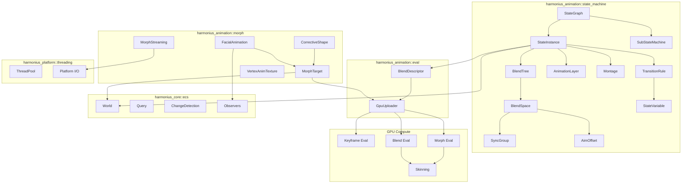
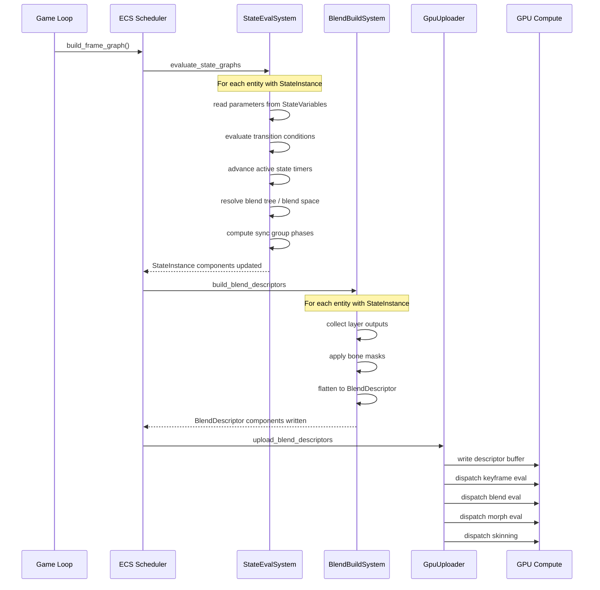
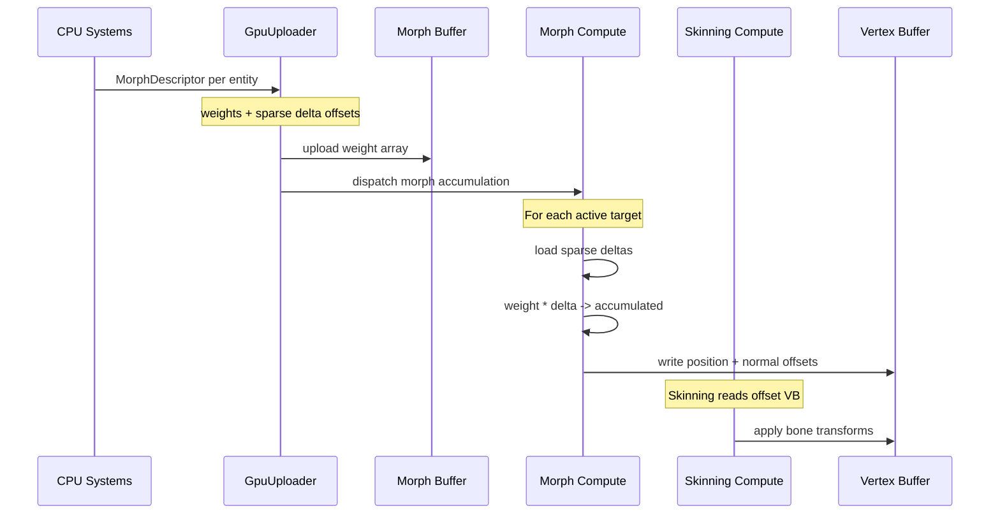
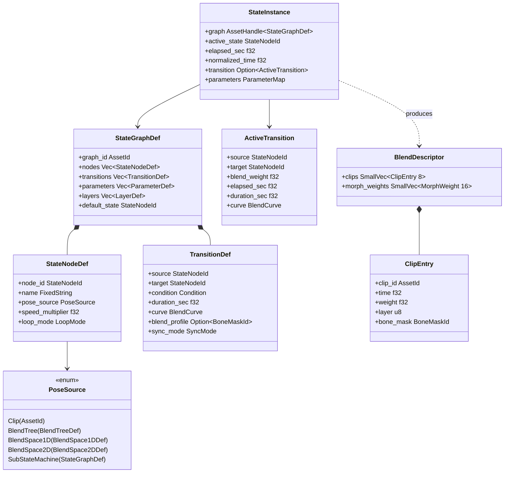
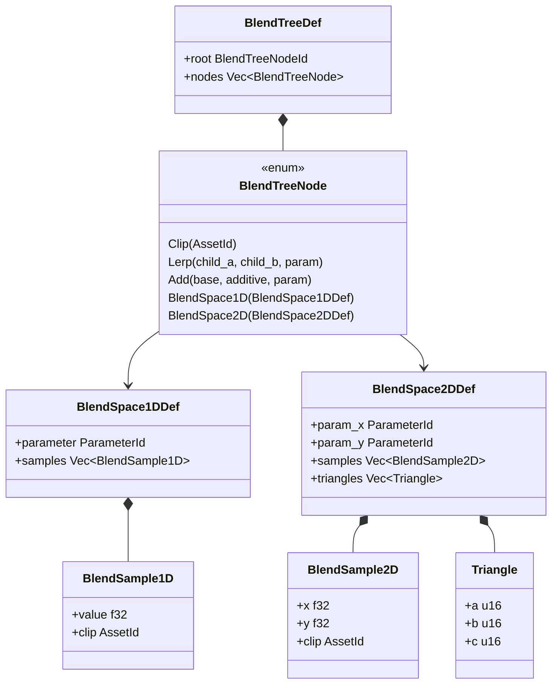
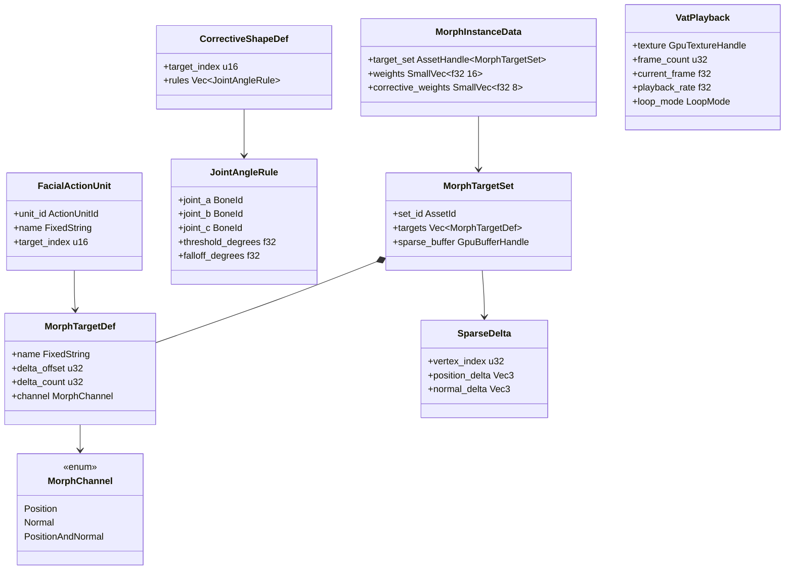
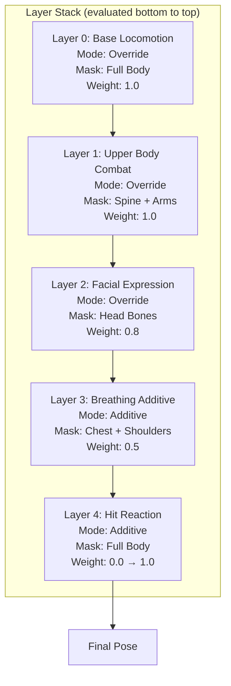
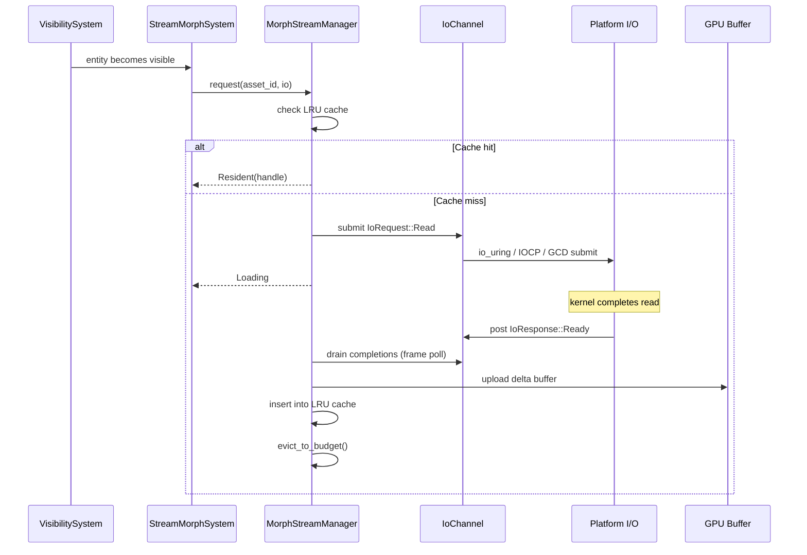

# Animation State Machine & Morph Targets Design

## Requirements Trace

> **Canonical sources:** Features, requirements, and user stories are defined in
> [features/animation/](../../features/), [requirements/animation/](../../requirements/), and
> [user-stories/animation/](../../user-stories/). The table below traces design elements to those
> definitions.

### State Machine

| Feature  | Requirement | User Stories                          |
|----------|-------------|---------------------------------------|
| F-9.4.1  | R-9.4.1     | US-9.4.1.1, US-9.4.1.2, US-9.4.1.3    |
| F-9.4.2  | R-9.4.2     | US-9.4.2.1, US-9.4.2.2                |
| F-9.4.3  | R-9.4.3     | US-9.4.3.1, US-9.4.3.2                |
| F-9.4.4  | R-9.4.4     | US-9.4.4.1, US-9.4.4.2, US-9.4.4.3    |
| F-9.4.5  | R-9.4.5     | US-9.4.5.1, US-9.4.5.2                |
| F-9.4.6  | R-9.4.6     | US-9.4.6.1, US-9.4.6.2                |
| F-9.4.7  | R-9.4.7     | US-9.4.7.1, US-9.4.7.2, US-9.4.7.3    |
| F-9.4.8  | R-9.4.8     | US-9.4.8.1, US-9.4.8.2, US-9.4.8.3    |
| F-9.4.9  | R-9.4.9     | US-9.4.9.1, US-9.4.9.2                |
| F-9.4.10 | R-9.4.10    | US-9.4.10.1, US-9.4.10.2, US-9.4.10.3 |

1. **F-9.4.1** — CPU-side declarative state graph with shared definitions and per-instance memory
   under 1 KB
2. **F-9.4.2** — Transitions with blend profiles, sync markers, configurable curves
3. **F-9.4.3** — Sub-state machines with entry/exit points, hierarchical nesting
4. **F-9.4.4** — Parallel animation layers with per-bone masks and blend modes
5. **F-9.4.5** — Named parameters (bool, float, int, trigger) driving transitions
6. **F-9.4.6** — Sync groups for phase-aligned locomotion blending
7. **F-9.4.7** — Animation montages with branching sections and notify events
8. **F-9.4.8** — 1D and 2D blend spaces with barycentric interpolation
9. **F-9.4.9** — Additive aim offset layers parameterized by pitch/yaw
10. **F-9.4.10** — AI animation integration via logic graphs

### Morph Targets

| Feature | Requirement | User Stories                       |
|---------|-------------|------------------------------------|
| F-9.2.1 | R-9.2.1     | US-9.2.1.1, US-9.2.1.2, US-9.2.1.3 |
| F-9.2.2 | R-9.2.2     | US-9.2.2.1, US-9.2.2.2             |
| F-9.2.3 | R-9.2.3     | US-9.2.3.1, US-9.2.3.2, US-9.2.3.3 |
| F-9.2.4 | R-9.2.4     | US-9.2.4.1, US-9.2.4.2, US-9.2.4.3 |
| F-9.2.5 | R-9.2.5     | US-9.2.5.1, US-9.2.5.2, US-9.2.5.3 |

1. **F-9.2.1** — GPU blend shape accumulation with sparse delta storage
2. **F-9.2.2** — Corrective blend shapes driven by joint angle rules
3. **F-9.2.3** — Facial animation via standardized action units
4. **F-9.2.4** — Per-vertex animation textures with zero CPU cost
5. **F-9.2.5** — Morph target streaming via platform-native I/O requests

### Cross-Cutting Dependencies

| Dependency | Source | Consumed API |
|------------|--------|--------------|
| GPU keyframe evaluation | F-9.1.2 | Compute dispatch for clip sampling |
| Animation blending | F-9.1.3 | Blend descriptor upload to GPU |
| Animation layers | F-9.1.4 | Per-bone masks, additive blending |
| Instanced skeletal anim | F-9.1.5 | Arena buffer batch evaluation |
| Root motion | F-9.1.6 | Root bone delta extraction |
| Animation events | F-9.1.9 | ECS observer event dispatch |
| ECS World | F-1.1.11 | Entity handles, component storage |
| Change detection | F-1.1.22 | Tick-based `Changed<T>` queries |
| Observers | F-1.1.30 | Animation event dispatch |
| Reflection | F-1.3.1 | Serialization of graph definitions |
| Shared spatial index | F-1.9.1 | Distance for animation LOD |
| Thread pool | F-14.3.1 | Scoped parallel state evaluation |
| Platform I/O | F-14.3.5 | Morph target streaming via IoRequest |
| Logic graphs | F-15.8.4 | No-code parameter binding |
| IK solvers | F-9.3.1 | Aim offset weapon alignment |

## Client of Graph Runtime

This document is a **client** of [core-runtime/graph-runtime.md](../core-runtime/graph-runtime.md).
Animation state machines parameterize the shared
`GraphRuntime<StateNodeDef, TransitionDef, StateInstance>` type — they do not re-implement cycle
detection, topological sort, DAG validation, constant folding, or hot-reload barriers. The
state-machine evaluator contributes:

1. A node palette: entry states, animation states, blend trees, blend spaces, sub-state machines.
2. Edge semantics: transition rules with condition evaluation and blend curves.
3. A compiled output type: `StateInstance`, produced via `RustBackend` codegen.

Every property that used to be described as "the state graph validator checks cycles" or "the state
machine runs a topological sort" is now delegated to the shared runtime. This doc only describes
state-machine-specific semantics: state variables, transition curves, sync groups, animation layers,
montages, aim offsets, and morph targets.

## Determinism Contract

State machine evaluation is **deterministic** — given the same `StateGraph` asset, the same
`StateInstance` input, the same parameter bindings, and the same time delta, the evaluator produces
byte-identical `BlendDescriptor` output on every platform. This is required for:

1. **Multiplayer replay.** A client replaying a recorded input stream must reproduce the same
   animation state transitions as the server authoritative simulation.
2. **Rollback netcode.** Clients that roll back to an earlier tick and re-simulate forward must
   reach the same state as the original simulation would have.
3. **Debug reproduction.** Recorded replays feeding deterministic RNG and deterministic float math
   let bugs be reproduced reliably.

Blend curve evaluation uses the **same deterministic float arithmetic rules as physics**: no
platform-specific fast-math, no FMA re-association, no transcendental approximations that differ
across targets. The `DeterministicRng` primitive from
[core-runtime/primitives.md](../core-runtime/primitives.md) seeds any stochastic transitions.

Parameter bindings that come from `Blackboard` components must use the canonical `SortedVecMap`
storage — no `HashMap` iteration in the condition evaluator. This is enforced by the shared
`ConditionExpr` evaluator owned by `data-systems/attributes-effects.md`.

## Overview

The animation state machine and morph target system is a CPU-side graph evaluator that produces
blend descriptors uploaded to the GPU each frame. It separates the **what to blend** (CPU) from the
**how to blend** (GPU compute).

Key design principles:

1. **Shared definitions, lightweight instances.** A `StateGraph` is an immutable asset shared by
   thousands of entities. Each entity owns only a `StateInstance` with per-entity state (current
   node, elapsed time, parameter values). Instance memory is under 1 KB.
2. **ECS-primary (~90%)-based.** All animation state lives as components. All evaluation runs as
   systems. No separate animation world or manager object.
3. **No-code authoring.** State graphs, blend spaces, transition rules, and morph target assignments
   are authored entirely in the visual animation editor. Parameters are bound from logic graphs.
4. **GPU-side morph evaluation.** Morph target deltas are accumulated via compute shaders with
   sparse delta storage, applied before skinning in the deformation pipeline.

### Performance Targets

| Metric | Target | Source |
|--------|--------|--------|
| State graph eval (1000 instances) | Under 1 ms | US-9.4.1.3 |
| AI + animation eval (500 agents) | Under 2 ms | US-9.4.10.3 |
| Per-instance memory | Under 1 KB | R-9.4.1 |
| Foot sliding during sync transitions | Under 1 cm | US-9.4.2.2 |
| Morph target GPU eval (16 targets) | Under 0.5 ms | R-9.2.1 |
| Morph stream-in latency | Before visible | R-9.2.5 |

## Architecture

### Module Boundaries



### File Layout

```text
harmonius_animation/
├── state_machine/
│   ├── graph.rs         # StateGraph, StateNodeId,
│   │                    # StateGraphDef
│   ├── instance.rs      # StateInstance, ActiveState
│   ├── transition.rs    # TransitionRule,
│   │                    # TransitionDef, BlendCurve
│   ├── blend_tree.rs    # BlendTree, BlendTreeNode
│   ├── blend_space.rs   # BlendSpace1D, BlendSpace2D,
│   │                    # Triangulation
│   ├── sub_state.rs     # SubStateMachine,
│   │                    # EntryPoint, ExitPoint
│   ├── layer.rs         # AnimationLayer,
│   │                    # LayerStack, BoneMask
│   ├── montage.rs       # Montage, MontageSection,
│   │                    # MontageInstance
│   ├── variable.rs      # StateVariable,
│   │                    # ParameterMap, Condition
│   ├── sync_group.rs    # SyncGroup,
│   │                    # SyncGroupInstance
│   ├── aim_offset.rs    # AimOffset, AimBlendSpace
│   └── system.rs        # ECS systems:
│                        # evaluate_state_graphs,
│                        # build_blend_descriptors
├── morph/
│   ├── target.rs        # MorphTarget,
│   │                    # MorphTargetSet, SparseDeltas
│   ├── corrective.rs    # CorrectiveShape,
│   │                    # JointAngleRule
│   ├── facial.rs        # FacialActionUnit,
│   │                    # FacialAnimDriver
│   ├── vat.rs           # VertexAnimTexture,
│   │                    # VatPlayback
│   ├── streaming.rs     # MorphStreamManager,
│   │                    # LruCache
│   └── system.rs        # ECS systems:
│                        # evaluate_morph_targets,
│                        # stream_morph_targets
└── eval/
    ├── descriptor.rs    # BlendDescriptor,
    │                    # MorphDescriptor
    └── uploader.rs      # GpuUploader,
                         # DescriptorBuffer
```

### State Graph Evaluation Pipeline



### Morph Target GPU Pipeline



### State Graph Data Model



### Blend Tree and Blend Space Data Model



### Morph Target Data Model



### Animation Layer Stack



## API Design

### State Graph Definition (Shared Asset)

```rust
/// Unique identifier for a state node within a
/// graph. Indices are stable across graph edits
/// to preserve transition references.
#[derive(
    Clone, Copy, Debug, PartialEq, Eq, Hash,
    Reflect,
)]
pub struct StateNodeId(pub(crate) u16);

/// Unique identifier for a parameter within a
/// graph definition.
#[derive(
    Clone, Copy, Debug, PartialEq, Eq, Hash,
    Reflect,
)]
pub struct ParameterId(pub(crate) u16);

/// Unique identifier for a bone mask asset.
#[derive(
    Clone, Copy, Debug, PartialEq, Eq, Hash,
    Reflect,
)]
pub struct BoneMaskId(pub(crate) u16);

/// Immutable state graph definition. Shared
/// across all entities using the same animation
/// graph. Loaded as an asset from the visual
/// editor's serialized output.
#[derive(Debug, Reflect)]
pub struct StateGraphDef {
    /// All state nodes in this graph.
    pub nodes: Vec<StateNodeDef>,
    /// All transitions between states.
    pub transitions: Vec<TransitionDef>,
    /// Parameter declarations (name, type, default).
    pub parameters: Vec<ParameterDef>,
    /// Layer definitions for this graph.
    pub layers: Vec<LayerDef>,
    /// Initial state on graph instantiation.
    pub default_state: StateNodeId,
}

/// A single state node in the graph.
#[derive(Debug, Reflect)]
pub struct StateNodeDef {
    pub node_id: StateNodeId,
    pub name: FixedString,
    pub pose_source: PoseSource,
    pub speed_multiplier: f32,
    pub loop_mode: LoopMode,
}

/// What produces the pose for a state node.
#[derive(Debug, Reflect)]
pub enum PoseSource {
    /// A single animation clip.
    Clip(AssetId),
    /// A blend tree with parameterized children.
    BlendTree(BlendTreeDef),
    /// 1D blend space (e.g., speed).
    BlendSpace1D(BlendSpace1DDef),
    /// 2D blend space (e.g., speed x direction).
    BlendSpace2D(BlendSpace2DDef),
    /// Nested sub-state machine.
    SubStateMachine(Box<StateGraphDef>),
}

/// Clip playback wrapping behavior.
#[derive(
    Clone, Copy, Debug, PartialEq, Eq, Reflect,
)]
pub enum LoopMode {
    Loop,
    ClampToEnd,
    PingPong,
}
```

### Transitions

```rust
/// Defines a transition between two states.
#[derive(Debug, Reflect)]
pub struct TransitionDef {
    pub source: StateNodeId,
    pub target: StateNodeId,
    /// Boolean expression over parameters.
    pub condition: Condition,
    /// Cross-fade duration in seconds.
    pub duration_sec: f32,
    /// Interpolation curve for the cross-fade.
    pub curve: BlendCurve,
    /// Optional per-bone blend profile allowing
    /// different body parts to transition at
    /// different rates.
    pub blend_profile: Option<BoneMaskId>,
    /// How source and destination synchronize.
    pub sync_mode: SyncMode,
    /// Priority for when multiple transitions
    /// are valid simultaneously. Higher wins.
    pub priority: u8,
}

/// Blend curve types for transitions.
#[derive(
    Clone, Copy, Debug, PartialEq, Eq, Reflect,
)]
pub enum BlendCurve {
    Linear,
    EaseIn,
    EaseOut,
    EaseInOut,
    Cubic,
}

/// Synchronization mode during transitions.
#[derive(
    Clone, Copy, Debug, PartialEq, Eq, Reflect,
)]
pub enum SyncMode {
    /// Source plays frozen at current time.
    Frozen,
    /// Both clips advance; destination starts
    /// at source's normalized time.
    SyncMarker,
    /// Both clips advance independently.
    Independent,
}
```

### State Variables and Conditions

```rust
/// A parameter definition in the graph.
#[derive(Debug, Reflect)]
pub struct ParameterDef {
    pub id: ParameterId,
    pub name: FixedString,
    pub kind: ParameterKind,
}

/// Typed parameter values.
#[derive(
    Clone, Copy, Debug, PartialEq, Reflect,
)]
pub enum ParameterKind {
    Bool(bool),
    Float(f32),
    Int(i32),
    /// Auto-resets to false after consumption.
    Trigger(bool),
}

/// Boolean expression tree over parameters.
/// Evaluated CPU-side each frame per instance.
#[derive(Debug, Reflect)]
pub enum Condition {
    /// Always true (default transition).
    Always,
    /// Compare a parameter against a literal.
    Compare {
        param: ParameterId,
        op: CompareOp,
        value: ParameterKind,
    },
    /// Logical AND of sub-conditions.
    And(Vec<Condition>),
    /// Logical OR of sub-conditions.
    Or(Vec<Condition>),
    /// Logical NOT of a sub-condition.
    Not(Box<Condition>),
}

#[derive(
    Clone, Copy, Debug, PartialEq, Eq, Reflect,
)]
pub enum CompareOp {
    Equal,
    NotEqual,
    GreaterThan,
    LessThan,
    GreaterOrEqual,
    LessOrEqual,
}

/// Per-instance parameter storage. Compact
/// inline storage for typical parameter counts.
#[derive(Debug, Default, Reflect)]
pub struct ParameterMap {
    values: SmallVec<[ParameterValue; 16]>,
}

#[derive(Clone, Copy, Debug, Reflect)]
pub struct ParameterValue {
    pub id: ParameterId,
    pub kind: ParameterKind,
}

impl ParameterMap {
    pub fn get_bool(
        &self,
        id: ParameterId,
    ) -> Option<bool>;

    pub fn get_float(
        &self,
        id: ParameterId,
    ) -> Option<f32>;

    pub fn get_int(
        &self,
        id: ParameterId,
    ) -> Option<i32>;

    pub fn set_bool(
        &mut self,
        id: ParameterId,
        value: bool,
    );

    pub fn set_float(
        &mut self,
        id: ParameterId,
        value: f32,
    );

    pub fn set_int(
        &mut self,
        id: ParameterId,
        value: i32,
    );

    /// Set a trigger. It will auto-reset after
    /// the next transition evaluation consumes it.
    pub fn set_trigger(
        &mut self,
        id: ParameterId,
    );

    /// Called by the eval system after processing
    /// transitions. Resets all consumed triggers.
    pub(crate) fn reset_consumed_triggers(
        &mut self,
    );
}
```

### Blend Trees

```rust
/// Identifier for a node within a blend tree.
#[derive(
    Clone, Copy, Debug, PartialEq, Eq, Hash,
    Reflect,
)]
pub struct BlendTreeNodeId(pub(crate) u16);

/// A blend tree definition. Each node is either
/// a leaf (clip) or an interior node that combines
/// children based on parameter values.
#[derive(Debug, Reflect)]
pub struct BlendTreeDef {
    pub root: BlendTreeNodeId,
    pub nodes: Vec<BlendTreeNode>,
}

/// A single node in the blend tree.
#[derive(Debug, Reflect)]
pub enum BlendTreeNode {
    /// Leaf: a single animation clip.
    Clip(AssetId),
    /// Linear interpolation between two children
    /// driven by a float parameter (0.0 = a,
    /// 1.0 = b).
    Lerp {
        child_a: BlendTreeNodeId,
        child_b: BlendTreeNodeId,
        param: ParameterId,
    },
    /// Additive blend: base + weight * additive.
    Add {
        base: BlendTreeNodeId,
        additive: BlendTreeNodeId,
        param: ParameterId,
    },
    /// Inline 1D blend space.
    BlendSpace1D(BlendSpace1DDef),
    /// Inline 2D blend space.
    BlendSpace2D(BlendSpace2DDef),
}

impl BlendTreeDef {
    /// Recursively evaluate the tree, returning
    /// weighted clip contributions.
    pub(crate) fn evaluate(
        &self,
        params: &ParameterMap,
    ) -> SmallVec<[ClipWeight; 8]>;
}
```

### Blend Spaces

```rust
/// 1D blend space. Samples sorted by value.
#[derive(Debug, Reflect)]
pub struct BlendSpace1DDef {
    pub parameter: ParameterId,
    pub samples: Vec<BlendSample1D>,
}

#[derive(Debug, Reflect)]
pub struct BlendSample1D {
    pub value: f32,
    pub clip: AssetId,
}

impl BlendSpace1DDef {
    /// Evaluate at a given parameter value.
    /// Returns up to 2 clips with weights that
    /// sum to 1.0.
    pub(crate) fn evaluate(
        &self,
        param_value: f32,
    ) -> SmallVec<[ClipWeight; 2]>;
}

/// 2D blend space. Samples placed in 2D parameter
/// space and pre-triangulated via Delaunay.
#[derive(Debug, Reflect)]
pub struct BlendSpace2DDef {
    pub param_x: ParameterId,
    pub param_y: ParameterId,
    pub samples: Vec<BlendSample2D>,
    /// Pre-computed Delaunay triangulation.
    /// Indices into `samples`.
    pub triangles: Vec<Triangle>,
}

#[derive(Debug, Reflect)]
pub struct BlendSample2D {
    pub x: f32,
    pub y: f32,
    pub clip: AssetId,
}

#[derive(
    Clone, Copy, Debug, Reflect,
)]
pub struct Triangle {
    pub a: u16,
    pub b: u16,
    pub c: u16,
}

impl BlendSpace2DDef {
    /// Pre-compute Delaunay triangulation from
    /// sample positions. Called once at asset load.
    pub fn triangulate(&mut self);

    /// Find the containing triangle for (x, y)
    /// and return barycentric weights for 3 clips.
    pub(crate) fn evaluate(
        &self,
        x: f32,
        y: f32,
    ) -> SmallVec<[ClipWeight; 3]>;
}

/// Weighted reference to a clip, produced by
/// blend tree / blend space evaluation.
#[derive(Clone, Copy, Debug)]
pub struct ClipWeight {
    pub clip: AssetId,
    pub weight: f32,
    pub time: f32,
}
```

### Sub-State Machines

```rust
/// Entry and exit points for sub-state machines.
/// Multiple named entry points allow context-
/// dependent entry (e.g., "enter_from_idle" vs
/// "enter_from_sprint").
#[derive(
    Clone, Copy, Debug, PartialEq, Eq, Hash,
    Reflect,
)]
pub struct EntryPointId(pub(crate) u8);

#[derive(
    Clone, Copy, Debug, PartialEq, Eq, Hash,
    Reflect,
)]
pub struct ExitPointId(pub(crate) u8);

/// A sub-state machine is a `StateGraphDef` with
/// additional entry and exit metadata. The parent
/// graph references it via `PoseSource::SubState`.
///
/// Entry and exit points map to specific states
/// within the sub-graph. The parent transition
/// specifies which entry point to use. Exit
/// points trigger transitions back to the parent.
#[derive(Debug, Reflect)]
pub struct SubStateMachineDef {
    pub graph: StateGraphDef,
    pub entry_points: Vec<EntryPointDef>,
    pub exit_points: Vec<ExitPointDef>,
}

#[derive(Debug, Reflect)]
pub struct EntryPointDef {
    pub id: EntryPointId,
    pub name: FixedString,
    pub target_state: StateNodeId,
}

#[derive(Debug, Reflect)]
pub struct ExitPointDef {
    pub id: ExitPointId,
    pub name: FixedString,
    pub source_state: StateNodeId,
    pub condition: Condition,
}
```

### Animation Layers

```rust
/// Blend mode for a layer.
#[derive(
    Clone, Copy, Debug, PartialEq, Eq, Reflect,
)]
pub enum LayerBlendMode {
    /// Layer output replaces base on masked bones.
    Override,
    /// Layer output is added to base pose
    /// (delta from reference pose).
    Additive,
}

/// Layer definition within a state graph.
#[derive(Debug, Reflect)]
pub struct LayerDef {
    pub index: u8,
    pub name: FixedString,
    pub blend_mode: LayerBlendMode,
    pub bone_mask: BoneMaskId,
    pub default_weight: f32,
    /// The state graph driving this layer.
    /// Layer 0 uses the root graph. Additional
    /// layers reference separate sub-graphs.
    pub graph: Option<StateGraphDef>,
}

/// Per-bone mask asset. Defines which bones a
/// layer affects and the blend weight per bone.
#[derive(Debug, Reflect)]
pub struct BoneMaskDef {
    pub mask_id: BoneMaskId,
    pub name: FixedString,
    /// Per-bone weight (0.0 = unaffected,
    /// 1.0 = fully affected). Indexed by BoneId.
    pub weights: Vec<f32>,
}

/// Per-instance layer runtime state.
#[derive(Debug, Reflect)]
pub struct LayerInstance {
    pub layer_index: u8,
    pub weight: f32,
    pub state_instance: StateInstance,
}
```

### Sync Groups

```rust
/// Sync group definition. All clips in the
/// group advance by normalized time to stay
/// phase-aligned.
#[derive(
    Clone, Copy, Debug, PartialEq, Eq, Hash,
    Reflect,
)]
pub struct SyncGroupId(pub(crate) u8);

#[derive(Debug, Reflect)]
pub struct SyncGroupDef {
    pub id: SyncGroupId,
    pub name: FixedString,
    /// Sync markers that must align across clips.
    pub markers: Vec<SyncMarkerDef>,
}

#[derive(Debug, Reflect)]
pub struct SyncMarkerDef {
    pub name: FixedString,
}

/// Per-instance sync group state, tracking
/// the current leader and normalized phase.
#[derive(Debug, Default, Reflect)]
pub struct SyncGroupInstance {
    pub group_id: SyncGroupId,
    /// Normalized time (0.0 - 1.0) shared by
    /// all clips in the group.
    pub phase: f32,
    /// Index of the clip that drives the phase
    /// (highest weight).
    pub leader_index: u8,
}

impl SyncGroupInstance {
    /// Advance phase by delta_time using the
    /// leader clip's duration for normalization.
    pub(crate) fn advance(
        &mut self,
        delta_sec: f32,
        leader_duration_sec: f32,
    );

    /// Convert normalized phase to absolute time
    /// for a clip with the given duration.
    pub(crate) fn phase_to_time(
        &self,
        clip_duration_sec: f32,
    ) -> f32;
}
```

### Animation Montages

```rust
/// Montage definition. A sequence of sections
/// that can override state machine output.
#[derive(Debug, Reflect)]
pub struct MontageDef {
    pub montage_id: AssetId,
    pub sections: Vec<MontageSectionDef>,
    pub blend_in_sec: f32,
    pub blend_out_sec: f32,
    pub blend_in_curve: BlendCurve,
    pub blend_out_curve: BlendCurve,
    /// Bone mask restricting which bones the
    /// montage affects.
    pub bone_mask: Option<BoneMaskId>,
    pub loop_mode: LoopMode,
}

/// A section within a montage. Sections can
/// branch to other sections.
#[derive(Debug, Reflect)]
pub struct MontageSectionDef {
    pub name: FixedString,
    pub clip: AssetId,
    pub start_time: f32,
    pub end_time: f32,
    /// Optional branch target (another section).
    pub branch: Option<MontageSection>,
    /// Notify events within this section.
    pub notifies: Vec<MontageNotifyDef>,
}

/// Section index within a montage.
#[derive(
    Clone, Copy, Debug, PartialEq, Eq, Reflect,
)]
pub struct MontageSection(pub(crate) u8);

/// A notify event embedded in a montage section.
#[derive(Debug, Reflect)]
pub struct MontageNotifyDef {
    pub name: FixedString,
    pub time: f32,
    /// Window duration. Zero for instant events.
    pub window_duration: f32,
}

/// Per-instance montage playback state.
/// Attached as an ECS component when a montage
/// is playing.
#[derive(Debug, Reflect)]
pub struct MontageInstance {
    pub montage: AssetHandle<MontageDef>,
    pub current_section: MontageSection,
    pub elapsed_sec: f32,
    pub blend_weight: f32,
    pub state: MontageState,
}

#[derive(
    Clone, Copy, Debug, PartialEq, Eq, Reflect,
)]
pub enum MontageState {
    BlendingIn,
    Playing,
    BlendingOut,
    Finished,
}

impl MontageInstance {
    /// Start montage playback.
    pub fn play(
        montage: AssetHandle<MontageDef>,
    ) -> Self;

    /// Branch to a named section.
    pub fn branch_to(
        &mut self,
        section: MontageSection,
    );

    /// Stop with blend-out.
    pub fn stop(&mut self);
}
```

### Aim Offsets

```rust
/// Aim offset definition. A 2D additive blend
/// space parameterized by pitch and yaw.
#[derive(Debug, Reflect)]
pub struct AimOffsetDef {
    pub blend_space: BlendSpace2DDef,
    pub bone_mask: BoneMaskId,
    /// Reference pose for computing additive
    /// deltas. Typically the rest or idle pose.
    pub reference_clip: AssetId,
}

/// Per-instance aim offset state.
#[derive(Debug, Reflect)]
pub struct AimOffsetInstance {
    pub def: AssetHandle<AimOffsetDef>,
    pub pitch: f32,
    pub yaw: f32,
    pub weight: f32,
}
```

### Morph Targets

```rust
/// GPU buffer handle for morph target data.
#[derive(
    Clone, Copy, Debug, PartialEq, Eq, Hash,
)]
pub struct GpuBufferHandle(pub(crate) u64);

/// GPU texture handle for VAT data.
#[derive(
    Clone, Copy, Debug, PartialEq, Eq, Hash,
)]
pub struct GpuTextureHandle(pub(crate) u64);

/// A set of morph targets for a mesh. Shared
/// asset loaded once, referenced by all instances
/// of the mesh.
#[derive(Debug, Reflect)]
pub struct MorphTargetSet {
    pub targets: Vec<MorphTargetDef>,
    /// GPU buffer containing all sparse deltas
    /// for all targets in this set, packed
    /// contiguously.
    pub sparse_buffer: GpuBufferHandle,
    /// Total vertex count of the base mesh.
    pub vertex_count: u32,
}

/// A single morph target within a set.
#[derive(Debug, Reflect)]
pub struct MorphTargetDef {
    pub name: FixedString,
    /// Byte offset into the sparse buffer.
    pub delta_offset: u32,
    /// Number of sparse deltas.
    pub delta_count: u32,
    pub channel: MorphChannel,
}

/// Which vertex attributes a morph target
/// modifies.
#[derive(
    Clone, Copy, Debug, PartialEq, Eq, Reflect,
)]
pub enum MorphChannel {
    Position,
    Normal,
    PositionAndNormal,
}

/// A single sparse delta entry in the GPU buffer.
/// Packed for GPU access (16-byte aligned).
#[repr(C)]
#[derive(Clone, Copy, Debug)]
pub struct SparseDelta {
    pub vertex_index: u32,
    pub position_delta: [f32; 3],
    pub normal_delta: [f32; 3],
    pub _padding: u32,
}
```

### Corrective Blend Shapes

```rust
/// Corrective blend shape definition.
/// Auto-activates based on joint angle rules.
#[derive(Debug, Reflect)]
pub struct CorrectiveShapeDef {
    /// Index into the parent MorphTargetSet.
    pub target_index: u16,
    pub rules: Vec<JointAngleRule>,
}

/// A joint angle condition that drives a
/// corrective shape weight.
#[derive(Debug, Reflect)]
pub struct JointAngleRule {
    /// Three bones forming the angle
    /// (parent, joint, child).
    pub joint_a: BoneId,
    pub joint_b: BoneId,
    pub joint_c: BoneId,
    /// Angle in degrees at which the corrective
    /// starts activating.
    pub threshold_degrees: f32,
    /// Degrees over which weight ramps from
    /// 0.0 to 1.0.
    pub falloff_degrees: f32,
}

impl CorrectiveShapeDef {
    /// Compute the corrective weight given
    /// current joint transforms.
    pub(crate) fn evaluate_weight(
        &self,
        bone_transforms: &[Transform],
    ) -> f32;
}
```

### Facial Animation

```rust
/// Standardized facial action unit identifier.
/// Compatible with ARKit (52 units) and reduced
/// mobile sets (16-24 units).
#[derive(
    Clone, Copy, Debug, PartialEq, Eq, Hash,
    Reflect,
)]
pub struct ActionUnitId(pub(crate) u8);

/// Maps action units to morph targets on a face
/// mesh. Shared asset per face rig.
#[derive(Debug, Reflect)]
pub struct FacialRigDef {
    pub mappings: Vec<FacialActionUnit>,
}

#[derive(Debug, Reflect)]
pub struct FacialActionUnit {
    pub unit_id: ActionUnitId,
    pub name: FixedString,
    /// Index into the MorphTargetSet.
    pub target_index: u16,
}

/// Per-instance facial animation driver.
/// Attached as an ECS component.
#[derive(Debug, Reflect)]
pub struct FacialAnimDriver {
    pub rig: AssetHandle<FacialRigDef>,
    /// Current action unit weights. Indexed by
    /// ActionUnitId.
    pub weights: SmallVec<[f32; 52]>,
    /// Source driving the weights.
    pub source: FacialSource,
}

/// What drives facial weights each frame.
#[derive(Debug, Reflect)]
pub enum FacialSource {
    /// Pre-baked keyframe curves.
    Curves(AssetHandle<AnimationClip>),
    /// Real-time parameter input (lip sync,
    /// gameplay expressions).
    Realtime,
    /// Performance capture data.
    PerformanceCapture(AssetHandle<CaptureData>),
}
```

### Per-Vertex Animation Textures

```rust
/// VAT playback definition. Baked animation
/// sampled in the vertex shader.
#[derive(Debug, Reflect)]
pub struct VatDef {
    pub texture: GpuTextureHandle,
    /// Number of frames in the VAT.
    pub frame_count: u32,
    /// Frames per second of the baked animation.
    pub fps: f32,
    /// Bounding box per frame for culling.
    pub bounds: Vec<Aabb>,
}

/// Per-instance VAT playback component.
#[derive(Debug, Reflect)]
pub struct VatPlayback {
    pub def: AssetHandle<VatDef>,
    pub current_frame: f32,
    pub playback_rate: f32,
    pub loop_mode: LoopMode,
}

impl VatPlayback {
    /// Advance playback by delta time. Returns
    /// the current frame index for vertex shader
    /// sampling. Zero CPU cost beyond this
    /// single float update.
    pub(crate) fn advance(
        &mut self,
        delta_sec: f32,
    ) -> f32;
}
```

### Morph Target Streaming

```rust
/// Manages on-demand streaming of morph target
/// delta buffers via platform-native I/O. Uses
/// the IoRequest/IoResponse pattern from
/// core-runtime/io.md: submit reads synchronously,
/// drain completions at the frame poll point. No
/// async runtimes, no Futures, no .await.
pub struct MorphStreamManager {
    /// LRU cache of resident morph target sets.
    cache: LruCache<AssetId, GpuBufferHandle>,
    /// Maximum GPU memory budget for morph data.
    budget_bytes: u64,
    /// Currently in-flight load requests keyed by
    /// IoRequestId. Polled once per frame.
    pending: SortedVecMap<IoRequestId, MorphLoadRequest>,
}

struct MorphLoadRequest {
    asset_id: AssetId,
    /// Request ID returned by the platform I/O
    /// submit call. Resolved when the main thread
    /// drains the IoResponse ring buffer.
    request_id: IoRequestId,
}

impl MorphStreamManager {
    pub fn new(budget_bytes: u64) -> Self;

    /// Request a morph target set. Returns
    /// immediately if cached. Otherwise submits
    /// a platform-native read via IoRequest.
    pub fn request(
        &mut self,
        asset_id: AssetId,
        io: &mut IoChannel,
    ) -> MorphLoadStatus;

    /// Called each frame to drain completed
    /// IoResponse entries and upload to GPU
    /// buffers. Runs on the main thread at the
    /// frame poll point.
    pub(crate) fn process_completions(
        &mut self,
        io: &mut IoChannel,
    );

    /// Evict least recently used sets to stay
    /// within budget.
    pub(crate) fn evict_to_budget(&mut self);

    pub fn resident_count(&self) -> u32;
    pub fn used_bytes(&self) -> u64;
}

#[derive(Clone, Copy, Debug, PartialEq, Eq)]
pub enum MorphLoadStatus {
    Resident(GpuBufferHandle),
    Loading,
    Failed,
}
```

### Blend Descriptor (CPU to GPU Bridge)

```rust
/// The final output of CPU-side state machine
/// evaluation. Uploaded to a GPU buffer each
/// frame for compute shader consumption.
#[derive(Debug, Default)]
pub struct BlendDescriptor {
    /// Clip references with weights and times.
    pub clips: SmallVec<[ClipEntry; 8]>,
    /// Morph target weights (indices into the
    /// entity's MorphTargetSet).
    pub morph_weights:
        SmallVec<[MorphWeight; 16]>,
}

/// A single clip contribution.
#[derive(Clone, Copy, Debug)]
pub struct ClipEntry {
    pub clip_id: AssetId,
    pub time: f32,
    pub weight: f32,
    pub layer: u8,
    pub bone_mask: BoneMaskId,
}

/// A single morph target weight.
#[derive(Clone, Copy, Debug)]
pub struct MorphWeight {
    pub target_index: u16,
    pub weight: f32,
}
```

### ECS Components

All animation state lives as ECS components. No separate animation world or manager.

```rust
// ---- State Machine Components ----

/// Attached to entities with animation state
/// machine behavior. References a shared graph
/// definition and holds per-instance state.
#[derive(Component, Debug, Reflect)]
pub struct AnimationStateMachine {
    pub graph: AssetHandle<StateGraphDef>,
    pub instance: StateInstance,
}

/// Per-instance mutable state.
#[derive(Debug, Reflect)]
pub struct StateInstance {
    pub active_state: StateNodeId,
    pub elapsed_sec: f32,
    pub normalized_time: f32,
    pub transition: Option<ActiveTransition>,
    pub parameters: ParameterMap,
    pub layers: SmallVec<[LayerInstance; 4]>,
    pub sync_groups:
        SmallVec<[SyncGroupInstance; 2]>,
}

/// Active transition state.
#[derive(Debug, Reflect)]
pub struct ActiveTransition {
    pub source: StateNodeId,
    pub target: StateNodeId,
    pub blend_weight: f32,
    pub elapsed_sec: f32,
    pub duration_sec: f32,
    pub curve: BlendCurve,
    pub sync_mode: SyncMode,
}

// ---- Montage Components ----

/// Attached when a montage is playing.
/// Removed when the montage finishes.
#[derive(Component, Debug, Reflect)]
pub struct ActiveMontage {
    pub instance: MontageInstance,
}

// ---- Aim Offset Components ----

/// Attached to entities using aim offsets.
#[derive(Component, Debug, Reflect)]
pub struct ActiveAimOffset {
    pub instance: AimOffsetInstance,
}

// ---- Morph Target Components ----

/// Morph target state for an entity's mesh.
#[derive(Component, Debug, Reflect)]
pub struct MorphTargets {
    pub target_set:
        AssetHandle<MorphTargetSet>,
    pub weights: SmallVec<[f32; 16]>,
}

/// Corrective shape driver. Reads bone
/// transforms and writes corrective weights
/// into MorphTargets.
#[derive(Component, Debug, Reflect)]
pub struct CorrectiveShapes {
    pub definitions:
        Vec<CorrectiveShapeDef>,
}

/// Facial animation driver component.
#[derive(Component, Debug, Reflect)]
pub struct FacialAnimation {
    pub driver: FacialAnimDriver,
}

/// VAT playback component. GPU-only after
/// the per-frame float update.
#[derive(Component, Debug, Reflect)]
pub struct VertexAnimPlayback {
    pub playback: VatPlayback,
}

// ---- Output Components ----

/// Written by the blend build system each frame.
/// Read by the GPU uploader system.
#[derive(Component, Debug, Default)]
pub struct AnimationOutput {
    pub descriptor: BlendDescriptor,
}
```

### ECS Systems

```rust
/// System ordering within the animation phase.
/// Runs in the `PreTransformUpdate` schedule
/// phase, before transform propagation.
///
/// Execution order:
///   1. evaluate_state_graphs
///   2. evaluate_montages
///   3. evaluate_corrective_shapes
///   4. evaluate_facial_animation
///   5. build_blend_descriptors
///   6. upload_descriptors_to_gpu

/// Evaluate all state machine instances.
/// Reads parameters, evaluates transitions,
/// advances timers, resolves blend trees.
pub fn evaluate_state_graphs(
    query: Query<
        &mut AnimationStateMachine,
        Changed<AnimationStateMachine>,
    >,
    time: Res<FrameTime>,
) {
    // Parallel over archetypes. Each entity
    // is independent — no cross-entity reads.
}

/// Advance montage playback, process sections,
/// fire notify events via ECS observers.
pub fn evaluate_montages(
    query: Query<(
        Entity,
        &mut ActiveMontage,
        &AnimationStateMachine,
    )>,
    time: Res<FrameTime>,
    commands: Commands,
    observers: EventWriter<AnimationNotify>,
) {
    // Remove ActiveMontage when finished.
    // Fire MontageNotifyDef events as
    // AnimationNotify ECS events.
}

/// Compute corrective shape weights from
/// current bone transforms.
pub fn evaluate_corrective_shapes(
    query: Query<(
        &CorrectiveShapes,
        &BoneTransforms,
        &mut MorphTargets,
    )>,
) {
    // For each corrective definition, evaluate
    // joint angle rules and write weight into
    // MorphTargets.weights.
}

/// Advance facial animation drivers and write
/// morph target weights.
pub fn evaluate_facial_animation(
    query: Query<(
        &FacialAnimation,
        &mut MorphTargets,
    )>,
    time: Res<FrameTime>,
) {
    // Map action unit weights to morph target
    // indices and write into MorphTargets.
}

/// Flatten layer outputs, apply bone masks,
/// merge montage overrides, and produce final
/// BlendDescriptor per entity.
pub fn build_blend_descriptors(
    query: Query<(
        &AnimationStateMachine,
        Option<&ActiveMontage>,
        Option<&ActiveAimOffset>,
        Option<&MorphTargets>,
        &mut AnimationOutput,
    )>,
) {
    // Collect per-layer clip weights.
    // Apply bone masks to each layer.
    // Merge montage as highest-priority override.
    // Merge aim offset as additive layer.
    // Collect morph weights.
    // Write BlendDescriptor.
}

/// Upload blend descriptors to GPU buffer and
/// dispatch compute shaders.
pub fn upload_descriptors_to_gpu(
    query: Query<(
        Entity,
        &AnimationOutput,
    )>,
    gpu: Res<GpuContext>,
) {
    // Pack all BlendDescriptors into a
    // contiguous GPU buffer.
    // Dispatch: keyframe eval -> blend ->
    //   morph accumulation -> skinning.
}

/// Advance VAT playback timers. Minimal CPU
/// cost — just a float increment.
pub fn advance_vat_playback(
    query: Query<&mut VertexAnimPlayback>,
    time: Res<FrameTime>,
) {
    // Update current_frame per entity.
}

/// Stream morph targets on demand.
pub fn stream_morph_targets(
    mut stream_mgr: ResMut<MorphStreamManager>,
    visible: Query<
        &MorphTargets,
        With<Visible>,
    >,
    mut io: ResMut<IoChannel>,
) {
    // Request morph sets for visible entities.
    // Submit via platform-native I/O.
    // Drain completed IoResponse entries.
    // Evict over-budget sets.
}
```

### AI Animation Query API

```rust
/// Read-only queries for AI systems to
/// synchronize decisions with animation state.
pub struct AnimationQuery;

impl AnimationQuery {
    /// Current state node name.
    pub fn current_state(
        sm: &AnimationStateMachine,
    ) -> &str;

    /// Remaining time in the current clip.
    pub fn remaining_time(
        sm: &AnimationStateMachine,
    ) -> f32;

    /// Whether a specific state is active.
    pub fn is_in_state(
        sm: &AnimationStateMachine,
        state: StateNodeId,
    ) -> bool;

    /// Whether a transition is in progress.
    pub fn is_transitioning(
        sm: &AnimationStateMachine,
    ) -> bool;

    /// Root motion displacement this frame.
    pub fn root_motion_delta(
        sm: &AnimationStateMachine,
    ) -> (Vec3, Quat);

    /// Whether a montage notify has fired.
    pub fn montage_notify_fired(
        montage: &ActiveMontage,
        notify_name: &str,
    ) -> bool;
}
```

## Data Flow

### Per-Frame State Machine Evaluation

The following pseudocode shows the evaluation algorithm for a single entity's state machine per
frame.

```rust
fn evaluate_single_instance(
    graph: &StateGraphDef,
    instance: &mut StateInstance,
    dt: f32,
) {
    // 1. Advance active state timer
    instance.elapsed_sec += dt;
    let node = &graph.nodes[
        instance.active_state.0 as usize
    ];
    let clip_dur = get_clip_duration(
        &node.pose_source,
    );
    instance.normalized_time =
        instance.elapsed_sec / clip_dur;

    // 2. Advance sync groups
    for sg in &mut instance.sync_groups {
        sg.advance(dt, clip_dur);
    }

    // 3. If transitioning, advance blend weight
    if let Some(t) = &mut instance.transition {
        t.elapsed_sec += dt;
        let alpha =
            t.elapsed_sec / t.duration_sec;
        t.blend_weight =
            apply_curve(t.curve, alpha);

        if t.elapsed_sec >= t.duration_sec {
            instance.active_state = t.target;
            instance.elapsed_sec = 0.0;
            instance.transition = None;
        }
    }

    // 4. Check transition conditions
    if instance.transition.is_none() {
        let candidates: SmallVec<[&TransitionDef; 4]> =
            graph.transitions.iter()
                .filter(|t| {
                    t.source == instance.active_state
                })
                .filter(|t| {
                    evaluate_condition(
                        &t.condition,
                        &instance.parameters,
                    )
                })
                .collect();

        if let Some(best) = candidates.iter()
            .max_by_key(|t| t.priority)
        {
            instance.transition =
                Some(ActiveTransition {
                    source: best.source,
                    target: best.target,
                    blend_weight: 0.0,
                    elapsed_sec: 0.0,
                    duration_sec: best.duration_sec,
                    curve: best.curve,
                    sync_mode: best.sync_mode,
                });
        }
    }

    // 5. Reset consumed triggers
    instance.parameters
        .reset_consumed_triggers();
}
```

### Blend Space 2D Evaluation

```rust
fn evaluate_blend_space_2d(
    space: &BlendSpace2DDef,
    x: f32,
    y: f32,
) -> SmallVec<[ClipWeight; 3]> {
    // 1. Find containing triangle
    for tri in &space.triangles {
        let a = &space.samples[tri.a as usize];
        let b = &space.samples[tri.b as usize];
        let c = &space.samples[tri.c as usize];

        let (u, v, w) = barycentric(
            x, y,
            a.x, a.y,
            b.x, b.y,
            c.x, c.y,
        );

        if u >= 0.0 && v >= 0.0 && w >= 0.0 {
            let mut result = SmallVec::new();
            if u > 0.001 {
                result.push(ClipWeight {
                    clip: a.clip,
                    weight: u,
                    time: 0.0,
                });
            }
            if v > 0.001 {
                result.push(ClipWeight {
                    clip: b.clip,
                    weight: v,
                    time: 0.0,
                });
            }
            if w > 0.001 {
                result.push(ClipWeight {
                    clip: c.clip,
                    weight: w,
                    time: 0.0,
                });
            }
            return result;
        }
    }
    // Fallback: nearest sample
    let nearest = find_nearest_sample(
        space, x, y,
    );
    smallvec![ClipWeight {
        clip: nearest.clip,
        weight: 1.0,
        time: 0.0,
    }]
}

fn barycentric(
    px: f32, py: f32,
    ax: f32, ay: f32,
    bx: f32, by: f32,
    cx: f32, cy: f32,
) -> (f32, f32, f32) {
    let v0x = bx - ax;
    let v0y = by - ay;
    let v1x = cx - ax;
    let v1y = cy - ay;
    let v2x = px - ax;
    let v2y = py - ay;

    let d00 = v0x * v0x + v0y * v0y;
    let d01 = v0x * v1x + v0y * v1y;
    let d11 = v1x * v1x + v1y * v1y;
    let d20 = v2x * v0x + v2y * v0y;
    let d21 = v2x * v1x + v2y * v1y;

    let denom = d00 * d11 - d01 * d01;
    let v = (d11 * d20 - d01 * d21) / denom;
    let w = (d00 * d21 - d01 * d20) / denom;
    let u = 1.0 - v - w;
    (u, v, w)
}
```

### GPU Morph Target Accumulation (HLSL)

```hlsl
// morph_accumulate.hlsl
// Dispatched per-vertex, accumulates all active
// morph target deltas weighted by CPU-provided
// weights.

struct SparseDelta {
    uint vertex_index;
    float3 position_delta;
    float3 normal_delta;
    uint _padding;
};

struct MorphHeader {
    uint delta_offset;
    uint delta_count;
    float weight;
    uint _padding;
};

StructuredBuffer<SparseDelta> g_deltas
    : register(t0);
StructuredBuffer<MorphHeader> g_targets
    : register(t1);
RWStructuredBuffer<float3> g_positions
    : register(u0);
RWStructuredBuffer<float3> g_normals
    : register(u1);

cbuffer MorphConstants : register(b0) {
    uint g_vertex_count;
    uint g_target_count;
};

[numthreads(64, 1, 1)]
void CSMain(uint3 tid : SV_DispatchThreadID) {
    uint vid = tid.x;
    if (vid >= g_vertex_count) return;

    float3 pos_accum = float3(0, 0, 0);
    float3 nrm_accum = float3(0, 0, 0);

    for (uint t = 0; t < g_target_count; t++) {
        MorphHeader hdr = g_targets[t];
        if (hdr.weight < 0.001) continue;

        // Binary search sparse deltas for vid
        uint lo = hdr.delta_offset;
        uint hi = lo + hdr.delta_count;
        while (lo < hi) {
            uint mid = (lo + hi) / 2;
            SparseDelta d = g_deltas[mid];
            if (d.vertex_index < vid) {
                lo = mid + 1;
            } else if (d.vertex_index > vid) {
                hi = mid;
            } else {
                pos_accum +=
                    hdr.weight * d.position_delta;
                nrm_accum +=
                    hdr.weight * d.normal_delta;
                break;
            }
        }
    }

    g_positions[vid] += pos_accum;
    g_normals[vid] += normalize(
        g_normals[vid] + nrm_accum
    );
}
```

### Morph Streaming Flow



### Layer Composition Algorithm

The layer stack is evaluated bottom-to-top. Each layer's output is composited onto the accumulator
using its blend mode and bone mask.

```rust
fn compose_layers(
    layers: &[LayerInstance],
    masks: &[BoneMaskDef],
    bone_count: u32,
) -> Vec<BoneTransform> {
    let mut result =
        vec![BoneTransform::IDENTITY; bone_count as usize];

    for layer in layers {
        if layer.weight < 0.001 {
            continue;
        }

        let layer_pose = evaluate_layer_pose(
            &layer.state_instance,
        );
        let mask =
            &masks[layer.layer_index as usize];

        for bone in 0..bone_count as usize {
            let mask_weight =
                mask.weights[bone] * layer.weight;
            if mask_weight < 0.001 {
                continue;
            }

            match layer.blend_mode() {
                LayerBlendMode::Override => {
                    result[bone] = lerp_transform(
                        result[bone],
                        layer_pose[bone],
                        mask_weight,
                    );
                }
                LayerBlendMode::Additive => {
                    result[bone] = add_transform(
                        result[bone],
                        layer_pose[bone],
                        mask_weight,
                    );
                }
            }
        }
    }
    result
}
```

## Platform Considerations

### GPU Compute Dispatch

| Platform | Morph Compute API | Notes |
|----------|-------------------|-------|
| Windows | D3D12 compute / Vulkan compute | HLSL compiled via DXC to DXIL or SPIR-V |
| macOS | Metal compute | HLSL compiled via DXC then Metal Shader Converter |
| Linux | Vulkan compute | HLSL compiled via DXC to SPIR-V |

### Morph Target Streaming I/O

| Platform | I/O Backend | API |
|----------|-------------|-----|
| Windows | IOCP via `IoRequest` | platform-native, no async runtime |
| macOS | GCD dispatch I/O via `IoRequest` | platform-native, no async runtime |
| Linux | io_uring via `IoRequest` | platform-native, no async runtime |

### Per-Tier Scaling

| Resource | Mobile | Switch | Desktop |
|----------|--------|--------|---------|
| Active morph targets/mesh | 8-16 | 16-32 | 64+ |
| Facial action units | 16-24 | 32 | 52+ (ARKit) |
| Animation layers | 2 | 3 | 4+ |
| Blend space samples | 6-8 | 12 | 16+ |
| Simultaneous blend clips | 4 | 6 | 8 |
| VAT texture resolution | Half | Full | Full |
| Corrective shapes | Hero only | All | All |
| State graph instances | 50 | 200 | 1000+ |

### No-Code Visual Editor Integration

All types marked `Reflect` are exposed to the visual animation editor. The editor serializes
`StateGraphDef`, `MontageDef`, `BlendSpace2DDef`, `BoneMaskDef`, `FacialRigDef`, `AimOffsetDef`, and
`MorphTargetSet` as assets. Parameters are bound from logic graphs (F-15.8.4) at runtime.

The visual state machine editor provides:

1. **Node canvas** for placing states and drawing transitions.
2. **Blend space editor** with 2D sample placement and live triangulation preview.
3. **Bone mask painter** on a 3D skeleton viewport.
4. **Montage timeline** with section markers and notify placement.
5. **Morph target slider panel** for weight previewing.

### Networking Integration

State machine replication includes: current state ID, transition progress, and parameter values
(floats, bools, triggers). Parameters are replicated as a compact struct. State transitions are
derived client-side from replicated parameters, reducing bandwidth.

Blend curves use the shared `Curve<T>` type (see [algorithms.md](../core-runtime/algorithms.md)).

## Test Plan

### Unit Tests

| Test                                    | Req     |
|-----------------------------------------|---------|
| `test_state_graph_basic_transition`     | R-9.4.1 |
| `test_transition_blend_weight_curve`    | R-9.4.2 |
| `test_per_bone_blend_profile`           | R-9.4.2 |
| `test_sync_marker_alignment`            | R-9.4.2 |
| `test_sub_state_entry_exit`             | R-9.4.3 |
| `test_sub_state_shared_definition`      | R-9.4.3 |
| `test_layer_override_bone_mask`         | R-9.4.4 |
| `test_layer_additive_blending`          | R-9.4.4 |
| `test_layer_weight_zero`                | R-9.4.4 |
| `test_parameter_bool_transition`        | R-9.4.5 |
| `test_parameter_float_compare`          | R-9.4.5 |
| `test_trigger_auto_reset`               | R-9.4.5 |
| `test_trigger_same_frame`               | R-9.4.5 |
| `test_sync_group_phase_alignment`       | R-9.4.6 |
| `test_montage_override_bones`           | R-9.4.7 |
| `test_montage_section_branch`           | R-9.4.7 |
| `test_montage_blend_out`                | R-9.4.7 |
| `test_montage_notify_fires`             | R-9.4.7 |
| `test_montage_scoped_notify`            | R-9.4.7 |
| `test_blend_space_1d_interpolation`     | R-9.4.8 |
| `test_blend_space_2d_barycentric`       | R-9.4.8 |
| `test_blend_space_2d_continuity`        | R-9.4.8 |
| `test_aim_offset_additive`              | R-9.4.9 |
| `test_aim_offset_lower_body_unaffected` | R-9.4.9 |
| `test_morph_gpu_accumulation`           | R-9.2.1 |
| `test_morph_sparse_storage`             | R-9.2.1 |
| `test_corrective_shape_activation`      | R-9.2.2 |
| `test_corrective_volume_restoration`    | R-9.2.2 |
| `test_facial_action_unit_mapping`       | R-9.2.3 |
| `test_facial_100_npcs`                  | R-9.2.3 |
| `test_vat_playback_accuracy`            | R-9.2.4 |
| `test_vat_zero_cpu_cost`                | R-9.2.4 |
| `test_morph_stream_lru_eviction`        | R-9.2.5 |
| `test_morph_stream_visible_only`        | R-9.2.5 |

1. **`test_state_graph_basic_transition`** — Create a 3-state graph, set trigger, verify state
   changes to target within 1 frame.
2. **`test_transition_blend_weight_curve`** — Verify linear, ease-in, ease-out, cubic curves produce
   correct blend weights at 25%, 50%, 75% progress.
3. **`test_per_bone_blend_profile`** — Apply per-bone blend profile with upper-body at 0.2s and
   lower-body at 0.5s, verify each completes at configured time.
4. **`test_sync_marker_alignment`** — Transition walk-to-run with sync markers, verify foot-contact
   frames align within 1 frame.
5. **`test_sub_state_entry_exit`** — Enter combat sub-state via named entry point, trigger exit
   condition, verify return to parent state.
6. **`test_sub_state_shared_definition`** — Nest same sub-state in two graphs, modify definition,
   verify both reflect change.
7. **`test_layer_override_bone_mask`** — Run upper-body combat + lower-body locomotion, verify bone
   isolation per mask.
8. **`test_layer_additive_blending`** — Apply additive breathing layer, verify result = base +
   weight * delta within 0.001 per joint.
9. **`test_layer_weight_zero`** — Set layer weight to 0.0, verify entity reverts to base pose within
   1 frame.
10. **`test_parameter_bool_transition`** — Set bool parameter, verify condition evaluates true,
    transition fires.
11. **`test_parameter_float_compare`** — Set float speed=2.0, verify `speed > 1.0` evaluates true.
12. **`test_trigger_auto_reset`** — Set trigger, verify it fires once and auto-resets next frame. No
    double-fire.
13. **`test_trigger_same_frame`** — Set trigger twice on same frame, verify only one transition
    fires.
14. **`test_sync_group_phase_alignment`** — Walk (1.0s) and run (0.6s) in sync group at 50% blend,
    verify markers align within 1 frame through full cycle.
15. **`test_montage_override_bones`** — Play upper-body montage, verify upper bones follow montage,
    lower bones follow state machine.
16. **`test_montage_section_branch`** — Branch at section 2 of a 3-section montage, verify playback
    jumps correctly.
17. **`test_montage_blend_out`** — Stop montage, verify blend-out completes in configured duration,
    state machine resumes.
18. **`test_montage_notify_fires`** — Embed notify at time 0.5s, play montage, verify notify fires
    exactly once at that time.
19. **`test_montage_scoped_notify`** — Verify montage-scoped notifies do not fire during non-montage
    state machine evaluation.
20. **`test_blend_space_1d_interpolation`** — 1D blend space with 3 samples at 0.0, 0.5, 1.0.
    Evaluate at 0.25, verify correct linear weights.
21. **`test_blend_space_2d_barycentric`** — 2D blend space with 9 samples. Evaluate at triangle
    center, verify barycentric weights within 0.001.
22. **`test_blend_space_2d_continuity`** — Sweep parameter 0.0 to 1.0 in 100 steps, verify no
    discontinuities in output weights.
23. **`test_aim_offset_additive`** — Set pitch=45, yaw=30, verify weapon direction within 2 degrees
    of target.
24. **`test_aim_offset_lower_body_unaffected`** — Verify lower-body bones differ from base pose by
    under 0.001 units with aim offset active.
25. **`test_morph_gpu_accumulation`** — Apply 16 morph targets, compare deformed positions against
    CPU reference, verify error under 0.001.
26. **`test_morph_sparse_storage`** — Verify memory scales with active delta count, not total vertex
    count.
27. **`test_corrective_shape_activation`** — Elbow at 0-120 degrees: weight=0. At 180 degrees:
    weight=1. Verify smooth ramp.
28. **`test_corrective_volume_restoration`** — At 150 degrees verify corrective restores 90%+ of
    expected mesh volume.
29. **`test_facial_action_unit_mapping`** — Load performance capture, verify all action units map to
    correct blend shapes.
30. **`test_facial_100_npcs`** — 100 NPCs with unique expressions, verify all display distinct
    facial poses.
31. **`test_vat_playback_accuracy`** — 120-frame VAT, verify deformed mesh matches source within
    0.5mm per vertex.
32. **`test_vat_zero_cpu_cost`** — Profile 100 VAT meshes, verify no CPU time increase over static
    baseline.
33. **`test_morph_stream_lru_eviction`** — Fill cache, verify LRU evicts least recently used
    targets, reload on demand.
34. **`test_morph_stream_visible_only`** — Verify only visible characters' morph sets are
    GPU-resident.

### Integration Tests

| Test                                      | Req         |
|-------------------------------------------|-------------|
| `test_1000_instances_under_1ms`           | US-9.4.1.3  |
| `test_500_ai_agents_under_2ms`            | US-9.4.10.3 |
| `test_per_instance_memory_under_1kb`      | R-9.4.1     |
| `test_foot_sliding_under_1cm`             | US-9.4.2.2  |
| `test_layer_count_per_platform`           | US-9.4.4.3  |
| `test_blend_space_samples_per_platform`   | US-9.4.8.3  |
| `test_morph_targets_per_platform`         | US-9.2.1.3  |
| `test_facial_units_per_platform`          | US-9.2.3.3  |
| `test_hundreds_concurrent_montages`       | US-9.4.7.2  |
| `test_morph_stream_500_characters`        | R-9.2.5     |
| `test_morph_stream_no_visible_popin`      | R-9.2.5     |
| `test_ai_query_remaining_time`            | R-9.4.10    |
| `test_ai_query_root_motion`               | R-9.4.10    |
| `test_vat_half_res_mobile`                | US-9.2.4.3  |
| `test_corrective_disabled_mobile_nonhero` | US-9.2.2.2  |
| `test_platform_io_backend`                | US-9.2.5.3  |

1. **`test_1000_instances_under_1ms`** — 1000 entities with active state graphs, verify CPU eval
   under 1ms.
2. **`test_500_ai_agents_under_2ms`** — 500 AI agents driving animation via behavior trees, verify
   combined cost under 2ms.
3. **`test_per_instance_memory_under_1kb`** — Measure StateInstance size, verify under 1 KB
   excluding clip data.
4. **`test_foot_sliding_under_1cm`** — Walk-to-run transition with sync markers, measure foot
   sliding distance under 1cm.
5. **`test_layer_count_per_platform`** — Verify mobile=2, Switch=3, desktop=4+ layer limits are
   enforced.
6. **`test_blend_space_samples_per_platform`** — Verify mobile=6-8, Switch=12, desktop=16+ sample
   limits.
7. **`test_morph_targets_per_platform`** — Verify mobile=8-16, Switch=16-32, desktop=64+ target
   limits.
8. **`test_facial_units_per_platform`** — Verify mobile=16-24, desktop=52+ action unit counts.
9. **`test_hundreds_concurrent_montages`** — 200 simultaneous montages, verify no animation system
   bottleneck.
10. **`test_morph_stream_500_characters`** — 500 unique morph sets exceeding budget, verify only
    visible are resident and eviction works.
11. **`test_morph_stream_no_visible_popin`** — Move camera away and back, verify morph targets
    stream in before characters fully visible.
12. **`test_ai_query_remaining_time`** — AI queries remaining clip time, verify accuracy within
    0.01s.
13. **`test_ai_query_root_motion`** — AI queries root motion displacement, verify accuracy within
    0.01 units.
14. **`test_vat_half_res_mobile`** — Verify mobile uses half-resolution VAT textures.
15. **`test_corrective_disabled_mobile_nonhero`** — Verify corrective shapes disabled on mobile for
    non-hero characters.
16. **`test_platform_io_backend`** — Verify platform-native I/O (io_uring, IOCP, GCD) on all
    platforms for morph streaming via the IoRequest/IoResponse pattern.

### Benchmarks

| Benchmark | Target | Source |
|-----------|--------|--------|
| State graph eval (1000 instances) | Under 1 ms | US-9.4.1.3 |
| AI + animation eval (500 agents) | Under 2 ms | US-9.4.10.3 |
| Blend space 2D lookup | Under 500 ns | R-9.4.8 |
| Transition condition evaluation | Under 100 ns | R-9.4.5 |
| Morph GPU accumulate (16 targets, 10K verts) | Under 0.5 ms | R-9.2.1 |
| Morph stream-in latency (cold) | Under 100 ms | R-9.2.5 |
| VAT playback overhead (CPU) | Under 1 us/entity | R-9.2.4 |
| Layer composition (4 layers, 256 bones) | Under 50 us | R-9.4.4 |
| Montage notify dispatch | Under 10 us | R-9.4.7 |

## Design Q & A

**Q1. What is the biggest constraint limiting this design?** What would happen if we lifted that
constraint? What is the best possible solution imaginable without those constraints? What is the
impact of removing them?

The CPU-side state graph evaluation constraint is the biggest limiter. While blend descriptors are
uploaded to the GPU, all state transition logic, condition evaluation, and blend weight computation
run on the CPU. This creates a CPU bottleneck at 1000+ instances (R-9.4.1). If lifted, GPU-side
state evaluation could process all instances in parallel, eliminating per- instance CPU cost. The
ideal solution would be a GPU compute pass that evaluates transition conditions and computes blend
weights for all instances, with only parameter uploads from the CPU. Removing the CPU constraint
would require encoding boolean transition logic in GPU-compatible form, which is complex but would
unlock truly infinite scaling.

**Q2. How can this design be improved?** Where is it weak? What potential issues will arise? What
trade-offs are we making?

The design combines state machine and morph targets into a single document, which creates a large
design surface. The montage priority system (F-9.4.7) has no defined behavior when two montages
affect overlapping bone groups (Open Question 7). Blend space triangulation (F-9.4.8) uses
pre-computed Delaunay, but the algorithm choice (standard vs constrained) is unresolved (Open
Question 1). The AI animation integration (F-9.4.10) relies on logic graphs to bridge behavior trees
with animation state, adding an indirection layer that increases coupling with the AI subsystem.
Morph target streaming (F-9.2.5) uses platform-native I/O submitted via the IoRequest/IoResponse
pattern — latency targets under 100 ms may be tight on mobile storage.

**Q3. Is there a better approach?** If we are not taking it, why not?

Motion matching (F-9.3.6) could replace the state machine entirely for locomotion, eliminating hand-
authored state graphs in favor of data-driven pose selection. We are not replacing the state machine
because motion matching only handles locomotion -- combat abilities, emotes, montages, and AI-driven
behavior still require explicit state transitions (R-9.4.7, R-9.4.10). The state machine is the
general- purpose animation control layer; motion matching is a specialized locomotion optimizer that
feeds into it.

**Q4. Does this design solve all customer problems?** Are there missing features, requirements, or
user stories? What are they? How would adding them improve the engine? What kinds of games does it
enable?

The design covers F-9.4.1 through F-9.4.10 and F-9.2.1 through F-9.2.5 with all user stories. A gap
is animation preview networking: US-9.4.1.1 supports visual authoring but there is no story for
previewing state graphs on a remote device during live gameplay. Adding remote animation debugging
would help mobile game development. Another gap is procedural facial animation from audio (lip sync
from speech) -- F-9.2.3 covers action units but not audio-driven blendshapes, which would enable
story-driven RPGs and co-op games with dynamic dialogue.

**Q5. Is this design cohesive with the overall engine?** Does it fit? Does it differ from other
modules, and why? How could we make it more cohesive? How can we improve it to meet engine goals?

The design is cohesive: state graph definitions use `Reflect` for serialization (F-1.3.1), events
dispatch through ECS observers (F-1.1.30), layers consume the skeletal blending pipeline (F-9.1.3,
F-9.1.4), and AI integration uses logic graphs (F-15.8.4). The morph target subsystem is less
cohesive because it runs a separate GPU compute pass rather than integrating with the skeletal
skinning dispatch, requiring an additional synchronization point. Merging morph target accumulation
into the skinning compute pass would reduce GPU dispatch count and improve pipeline cohesion. The
blend descriptor handoff to the skeletal module needs a clearer ownership contract (skeletal Open
Question 5).

## Open Questions

1. **Blend space triangulation algorithm** -- Delaunay triangulation is standard for 2D blend
   spaces. Should we use incremental Delaunay (simpler, O(n log n)) or constrained Delaunay
   (supports non-convex sample layouts)? Non-convex layouts may be needed for complex locomotion
   blend spaces.

2. **Morph target GPU dispatch strategy** -- The current design uses a binary search per vertex per
   target in the compute shader. An alternative is to scatter-write from a per-target dispatch (one
   thread per delta). Scatter-write avoids the binary search but requires atomics for accumulation.
   Profile both approaches on target hardware.

3. **State graph hot-reload** -- When the visual editor modifies a state graph asset, should all
   active instances reset to the default state, or should they attempt to preserve their current
   state if the node still exists? Preserving state is more designer-friendly but risks invalid
   state references.

4. **Sync group leader selection** -- Currently the highest-weight clip leads the sync group. Should
   there be an explicit leader designation per group, or is weight-based selection always
   sufficient? Edge case: two clips at 0.5/0.5 weight may cause leader oscillation.

5. **Corrective shape evaluation location** -- Corrective shapes currently evaluate CPU-side
   (reading bone transforms to compute weights) then upload weights to GPU. Could corrective weight
   computation move entirely to GPU compute, reading bone matrices directly? This would eliminate a
   CPU-GPU dependency.

6. **Facial animation LOD** -- At what distance should facial animation be disabled entirely?
   Current plan disables for distant NPCs on mobile, but desktop threshold is unspecified. Need
   per-tier distance thresholds integrated with the animation LOD system (F-9.1.10).

7. **Montage priority when multiple are active** -- If two montages affect overlapping bone groups,
   which takes priority? Options: last-played-wins, explicit priority field, or reject overlapping
   montages.

## Review Feedback

### RF-1: Replace all Tokio/async with platform-native I/O

Replace Tokio runtime in architecture diagram, morph streaming, platform table, and test cases with
platform-native I/O:

- Linux: io_uring via rustix
- Windows: IOCP via windows-rs
- macOS: GCD dispatch_io via dispatch2

Replace `IoFutureHandle` with `IoRequestId`. Replace `async fn` with synchronous submission via
crossbeam-channel. Update TC-9.2.5.I3 to verify platform-native backends.

### RF-2: Add PoseSource::SpriteSheet for 2D animation

The state machine must drive 2D spritesheet animation. Add a sprite frame source alongside skeletal
pose sources:

```rust
pub enum PoseSource {
    Clip(Handle<AnimationClip>, PlaybackMode),
    BlendSpace1D(BlendSpace1DDef),
    BlendSpace2D(BlendSpace2DDef),
    SubStateMachine(Box<StateGraphDef>),
    MotionMatching(MotionMatchDef),   // RF-3
    SpriteSheet(SpriteSheetDef),      // this RF
}

pub struct SpriteSheetDef {
    pub atlas: Handle<TextureAtlas>,
    pub frames: SmallVec<[SpriteFrame; 16]>,
    pub fps: f32,
    pub loop_mode: PlaybackMode,
}

pub struct SpriteFrame {
    pub atlas_index: u16,
    pub duration_override: Option<f32>,
}
```

The state machine evaluates identically for 2D and 3D — states, transitions, conditions, layers all
work the same. Only the output differs:

- 3D: bone palette (SmallVec<[ClipWeight; 8]>)
- 2D: sprite frame index (u16 atlas index + UV rect)

A 2D character has states like Idle/Walk/Run/Jump/Attack, each mapping to a SpriteSheetDef with
different frame ranges in the atlas. Transitions crossfade by blending sprite opacity or cutting
immediately.

### RF-3: Add PoseSource::MotionMatching

Add motion matching as a pose source in the state machine:

```rust
pub struct MotionMatchDef {
    pub database: Handle<PoseDatabase>,
    pub schema: Handle<PoseSearchSchema>,
    pub blend_time: f32,
    pub inertialization: bool,
}
```

The motion matching system:

1. Reads `MovementState` from character controller
2. Builds a feature vector (position, velocity, trajectory)
3. Searches `PoseDatabase` via KD-tree for nearest match
4. Writes selected pose + clip time to `MotionMatchResult`
5. State machine reads result as a pose source
6. Inertialization blend handles transitions

A locomotion state in the state machine can use `PoseSource::MotionMatching` instead of a clip or
blend space. The state machine handles transitions TO/FROM motion matching states using
inertialization (RF-5).

Reference: [Clavet, "Motion Matching" (GDC 2016)](https://www.gdcvault.com/play/1023280/Motion-Matching-and-The-Road)

### RF-4: Clarify Reflect as codegen

All `Reflect` derives in this design are the codegen derive macro producing static type descriptors
for the middleman .dylib. NOT bevy_reflect's runtime registry. Add a note in the Overview clarifying
this distinction.

### RF-5: Add inertialization transition blend

Add inertialization as a transition blend mode (moved from skeletal Design #24 RF-5):

```rust
pub enum TransitionBlendMode {
    Crossfade,        // dual-sample linear blend
    Frozen,           // freeze source, blend to target
    Inertialization,  // single-sample velocity carryover
}
```

Inertialization blends from a stored pose offset toward zero over the transition duration. Only the
target pose is evaluated — the source is not sampled after the transition starts. Produces smoother
transitions than crossfade for motion matching and avoids the cost of evaluating two poses.

Reference: [Bonavita, "Inertialization" (GDC 2018)](https://www.gdcvault.com/play/1025165/Inertialization-High-Performance-Animation-Transitions)

### RF-6: Add Multiply to LayerBlendMode

Design #24 specifies Override/Additive/Multiply. This design only has Override and Additive. Add:

```rust
pub enum LayerBlendMode {
    Override,
    Additive,
    Multiply,  // scale bone transforms (for scaling anims)
}
```

### RF-7: Fix Changed query filter

Remove `Changed<AnimationStateMachine>` from the evaluation system query. Time-based conditions
(clip completion, timer expiry) must trigger transitions every frame even when no parameter was
externally mutated. The system must evaluate every active state machine every frame.

### RF-8: Add montage priority

Add `priority: u8` to `MontageDef`. When multiple montages affect overlapping bone groups, highest
priority wins. Same-priority resolved by last-played-wins. Resolves open question #7.

### RF-9: Codegen for state machines

State machines authored in the visual editor compile to static Rust via the middleman .dylib codegen
pipeline:

1. Designer creates state graph visually (nodes + edges)
2. Codegen generates a Rust evaluation function
3. Compiled into middleman .dylib
4. Hot-reloaded into editor

The compiled state machine is a match statement over state IDs with inlined transition conditions —
no graph traversal at runtime, pure static dispatch.

For shipping builds, state machine logic is bytecode-obfuscated per the plugin IP protection
constraint.

### RF-10: Player input → animation integration

Player input drives animation parameters that the state machine reads. The input system writes, the
animation system reads — no direct coupling.

**Data flow:**

```text
Input System (Phase 1)
  → ActionState components (move, jump, attack, crouch)

Gameplay Systems (Phase 3)
  → CharacterMovement component (speed, direction, grounded)
  → write AnimationParams on the entity

Animation State Machine (Phase 6 / PostUpdate)
  → reads AnimationParams
  → evaluates transitions
  → produces pose
```

**AnimationParams** is the bridge between gameplay and animation. Gameplay systems write it; the
state machine reads it. No direct input→animation connection:

```rust
#[derive(Component)]
pub struct AnimationParams {
    pub speed: f32,            // 0 = idle, normalized
    pub direction: f32,        // -180 to 180 degrees
    pub is_grounded: bool,
    pub is_crouching: bool,
    pub is_jumping: bool,
    pub is_falling: bool,
    pub aim_pitch: f32,        // for aim offset
    pub aim_yaw: f32,
    pub triggers: SmallVec<[StringId; 4]>,  // one-shot
}
```

The state machine's `Condition` expressions reference these params:
`Compare(speed, GreaterThan, 0.1)` triggers Idle→Walk. `is_jumping` triggers grounded→airborne.
Blend spaces parameterize on `speed` and `direction`.

**Player example:**

| Input | Gameplay Sets | Anim Reads | State Transition |
|-------|-------------|-----------|-----------------|
| WASD | speed, direction | speed > 0 | Idle → Walk/Run |
| Space | is_jumping = true | is_jumping | Ground → Jump |
| Shift | is_crouching = true | is_crouching | Stand → Crouch |
| LMB | trigger "attack" | trigger consumed | Any → Attack montage |
| RMB | aim_pitch/yaw | aim offset blend | Aim layer active |

### RF-11: AI → animation integration

AI systems drive animation the same way as player input — through `AnimationParams`. The AI writes
params; the state machine reads them. Same state machine, same transitions.

**Data flow:**

```text
AI Systems (Phase 4)
  → BehaviorTree/GOAP selects action (patrol, chase, attack)
  → NavMesh pathfinding produces velocity
  → AI writes AnimationParams on the NPC entity

Animation State Machine (Phase 6 / PostUpdate)
  → reads the same AnimationParams
  → identical evaluation as player-controlled entities
```

**AI example:**

| AI Decision | AI Sets | Anim Result |
|-------------|---------|-------------|
| Patrol | speed=walk, direction=path | Walk blend space |
| Chase player | speed=run, direction=to_player | Run blend space |
| Attack | trigger "attack" | Attack montage |
| Take damage | trigger "hit_react" | Hit reaction montage |
| Die | trigger "death" | Death → ragdoll |
| Idle alert | speed=0, aim_yaw=scan | Idle + look-around |

**Key principle:** The animation system does NOT know whether an entity is player-controlled or
AI-controlled. It only reads `AnimationParams`. This means:

- Same character can switch between player and AI control (e.g., cutscene NPC becomes playable)
- Same animation state machine works for player and NPC variants of the same character
- AI and player share animation assets — no duplication
- Multiplayer: remote players drive params from network replication, same state machine evaluates
  locally

**AnimationQuery for AI feedback:**

AI systems can read animation state to make decisions:

```rust
pub struct AnimationQuery {
    pub current_state: StateId,
    pub state_elapsed: f32,
    pub state_remaining: f32,
    pub is_transitioning: bool,
    pub active_montage: Option<MontageId>,
    pub root_motion_delta: Vec3,
}
```

Example: AI waits for attack animation to finish before choosing next action
(`state_remaining < 0.1`). AI reads `root_motion_delta` to sync navigation with animated movement.

### RF-12: ECS integration

All animation state is ECS components. No hidden state outside the ECS. This enables querying,
change detection, serialization, and editor inspection of animation state.

**Components per animated entity:**

| Component | Ownership | Purpose |
|-----------|-----------|---------|
| `AnimationStateMachine` | Animation | State graph instance, current state |
| `AnimationParams` | Gameplay/AI | Input parameters for transitions |
| `AnimationLayerStack` | Animation | Active layers with weights + masks |
| `AnimationQuery` | Animation (read-only) | AI/gameplay reads anim state |
| `BonePalette` | Animation | Final bone transforms (GPU upload) |
| `RootMotionDelta` | Animation | Frame root motion for controller |
| `MontageInstance` | Animation | Active montage (added/removed dynamically) |
| `SkeletonRef` | Asset | Handle to skeleton asset |
| `AnimationClipRef` | Asset | Handle(s) to animation clips |

**System ordering in PostUpdate:**

```text
1. AnimationParamWriteBarrier
   (ensures all gameplay/AI param writes complete)
2. StateMachineEvaluateSystem
   (reads AnimationParams, evaluates transitions)
3. BlendTreeEvaluateSystem
   (evaluates blend trees, produces clip weights)
4. MontageEvaluateSystem
   (evaluates active montages, overrides layers)
5. LayerBlendSystem
   (combines all layers into final bone palette)
6. RootMotionSystem
   (extracts root delta, writes RootMotionDelta)
7. IkSolveSystem
   (applies IK after blend, modifies bone palette)
8. BonePaletteUploadSystem
   (uploads to GPU structured buffer)
```

Systems 2-5 can run in parallel across entities via `job_system::par_for_each` — each entity's state
machine is independent.

**ECS change detection:**

- `Changed<AnimationParams>` → only re-evaluate transitions when params change (BUT: time-based
  transitions still need per-frame evaluation — see RF-7)
- `Added<MontageInstance>` → trigger montage blend-in
- `Removed<MontageInstance>` → trigger montage blend-out
- `Changed<AnimationStateMachine>` → editor live-reload

**Archetype efficiency:**

All animated entities share the same archetype
(`Transform, AnimationStateMachine, AnimationParams, BonePalette, SkeletonRef, ...`). This means
they iterate contiguously in the ECS — cache-friendly parallel evaluation across thousands of NPCs.

**Entity events for animation:**

Animation fires entity events through the ECS observer system:

```rust
pub enum AnimationEvent {
    StateEntered(StateId),
    StateExited(StateId),
    TransitionStarted(StateId, StateId),
    TransitionCompleted(StateId),
    MontageStarted(MontageId),
    MontageCompleted(MontageId),
    MontageCancelled(MontageId),
    ClipEvent(AnimEventPayload),  // from clip markers
}
```

Gameplay systems observe these events to trigger effects: footstep sounds on foot-down marker, VFX
on attack impact marker, gameplay logic on state transitions.

Events use the capture/bubble propagation system (Design #9) for UI animations — a button press
animation event can bubble to the parent container.
