# Asset Pipeline Class and Sequence Diagrams

Class diagrams for each module and sequence diagrams showing inter-module interactions.
Companion to [asset-pipeline.md](asset-pipeline.md).

---

## Contents

- [Module Class Diagrams](#module-class-diagrams)
  - [1. Asset Types and Cooking](#1-asset-types-and-cooking)
  - [2. Mesh Cooking](#2-mesh-cooking)
  - [3. Texture Cooking](#3-texture-cooking)
  - [4. Bundle Format](#4-bundle-format)
  - [5. Streaming](#5-streaming)
  - [6. IO Backend](#6-io-backend)
  - [7. Resource Registry](#7-resource-registry)
  - [8. Bindless Descriptor Heap](#8-bindless-descriptor-heap)
- [Cross-Module Relationships](#cross-module-relationships)
- [Sequence Diagrams](#sequence-diagrams)
  - [Full Asset Lifecycle](#full-asset-lifecycle)
  - [Streaming Fault Resolution](#streaming-fault-resolution)
  - [Descriptor Heap Allocation Flow](#descriptor-heap-allocation-flow)

---

## Module Class Diagrams

### 1. Asset Types and Cooking

`harmonius::asset` — Core identity types, raw/cooked asset structs, and the cooker
orchestrator.

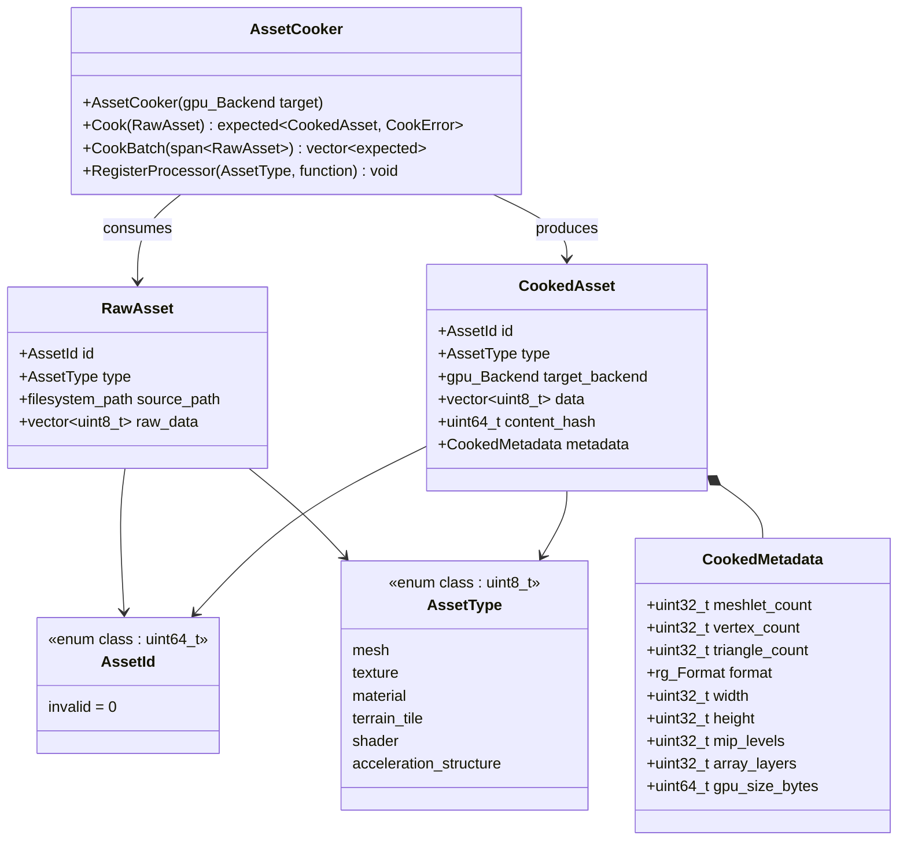

### 2. Mesh Cooking

`harmonius::asset` — Meshlet generation and LOD chain construction via meshoptimizer.

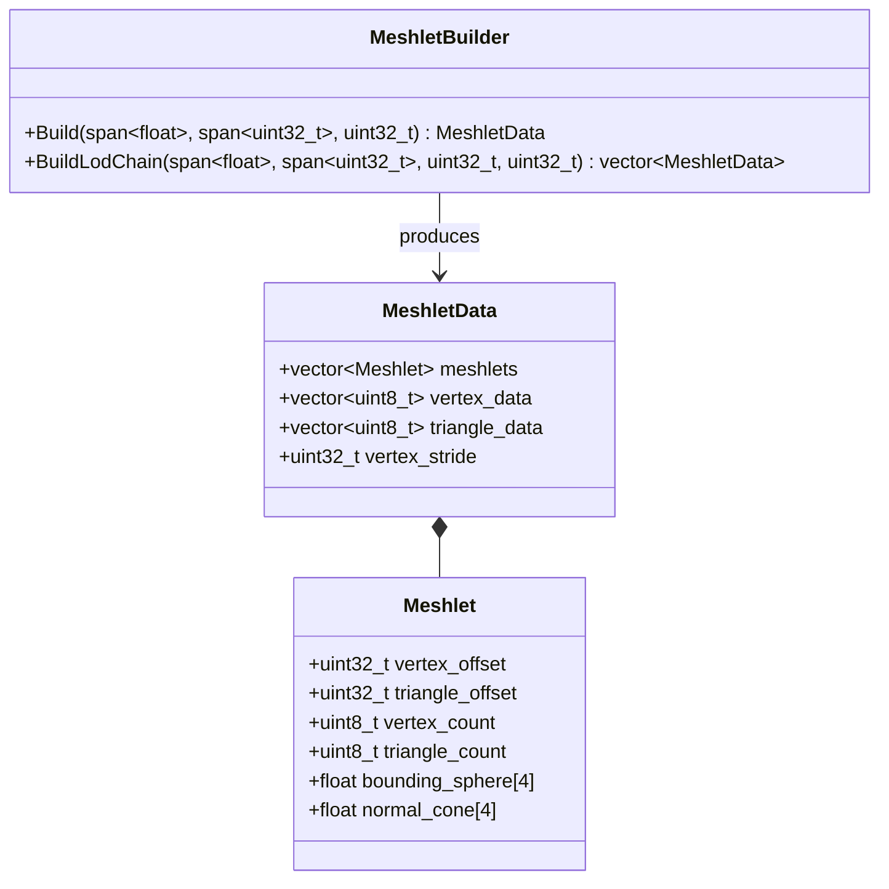

### 3. Texture Cooking

`harmonius::asset` — Block compression (BC7/BC5/BC1) and mip-map generation.

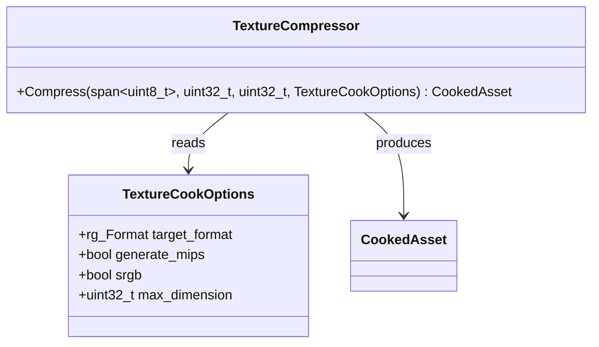

### 4. Bundle Format

`harmonius::asset` — Manifest describing all bundles and chunk layout with 64KB
alignment.

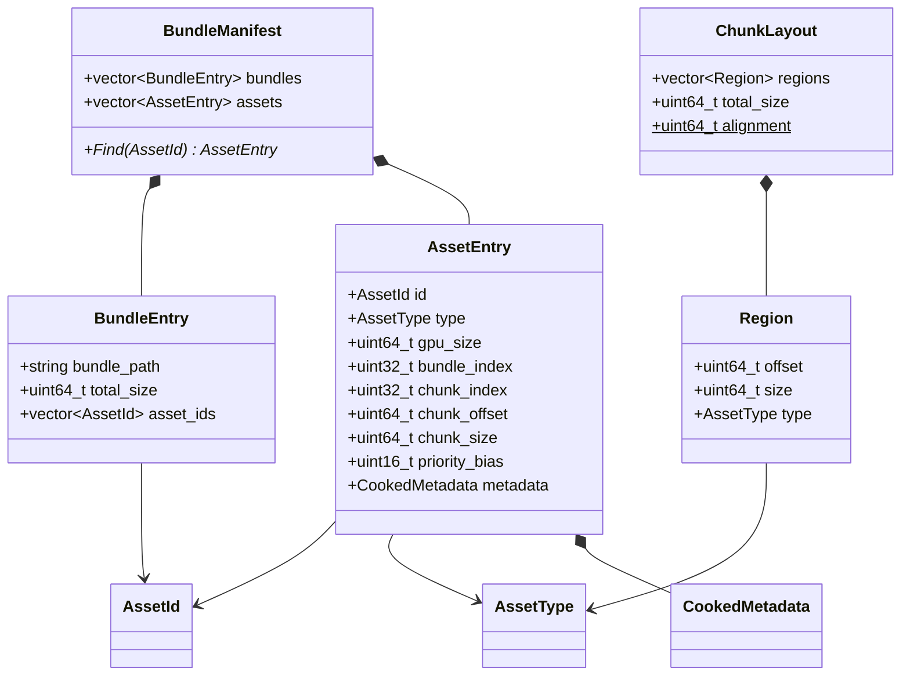

### 5. Streaming

`harmonius::asset` — Priority-based streaming scheduler that bridges IO and the render
graph via transfer pass injection.

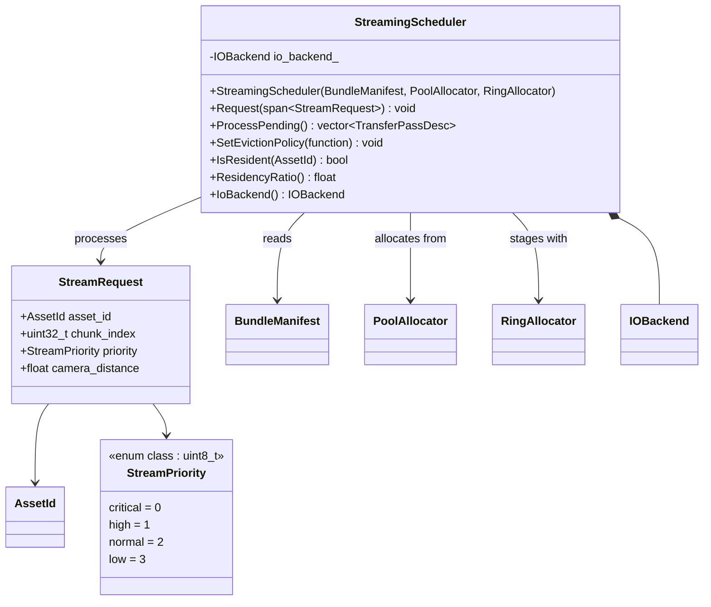

### 6. IO Backend

`harmonius::asset` — Platform-native async IO with concept-based static dispatch.
No C++ standard library file IO is used. One backend is compiled per binary, selected
at build time via CMake and target platform. No virtual methods, no vtables, no
dynamic dispatch.

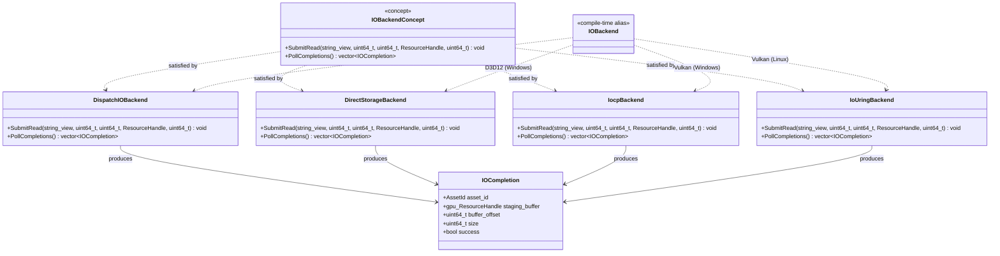

### 7. Resource Registry

`harmonius::asset` — Maps asset IDs to live GPU resource handles and bindless descriptor
indices. Generational handles detect stale references.

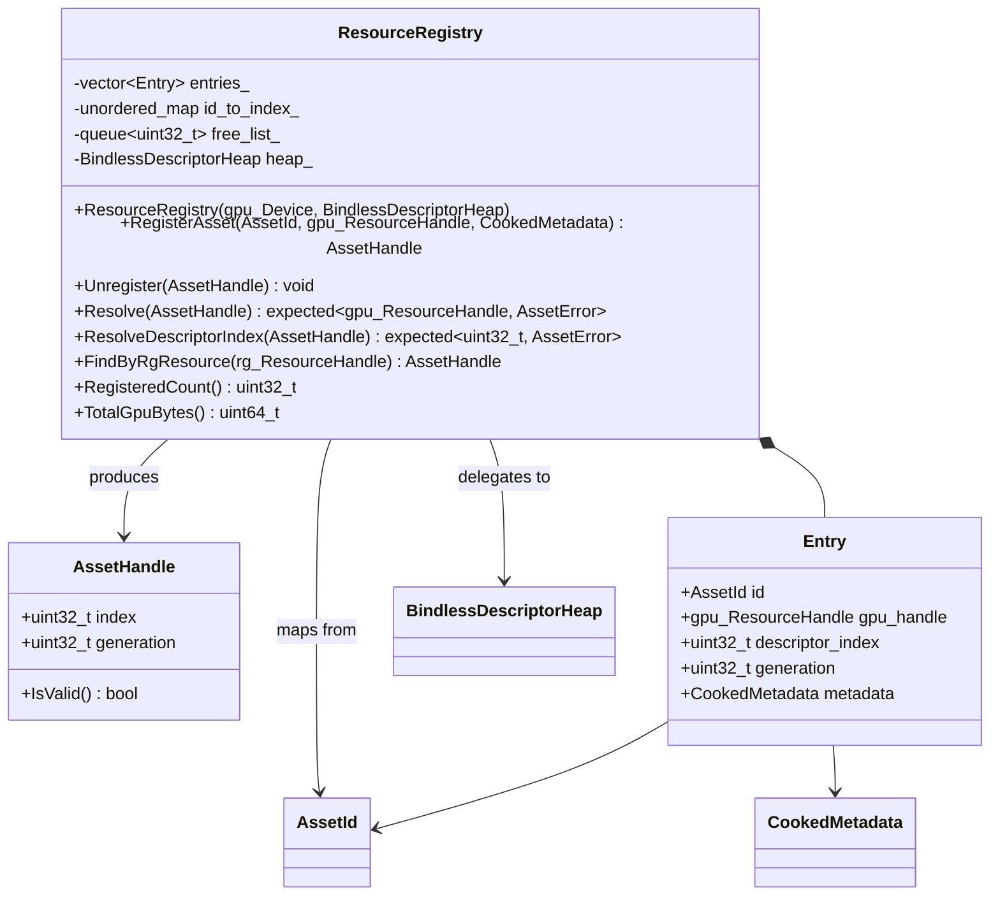

### 8. Bindless Descriptor Heap

`harmonius::asset` — Single global descriptor heap (1M slots) managing all GPU
resources. Shaders address resources by `uint32_t` index via push constants.

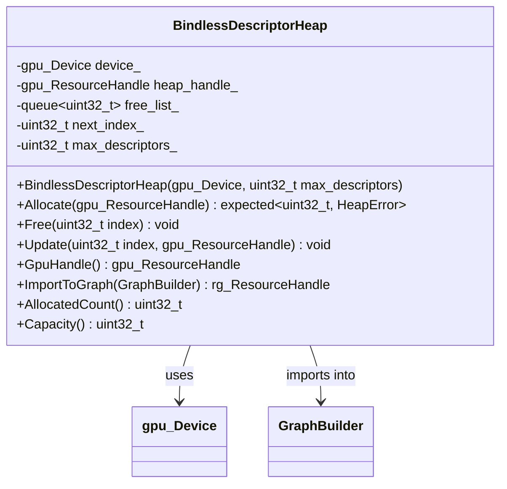

---

## Cross-Module Relationships

How the eight modules depend on each other at the class level, including integration
points with the render graph resource system and execution engine.

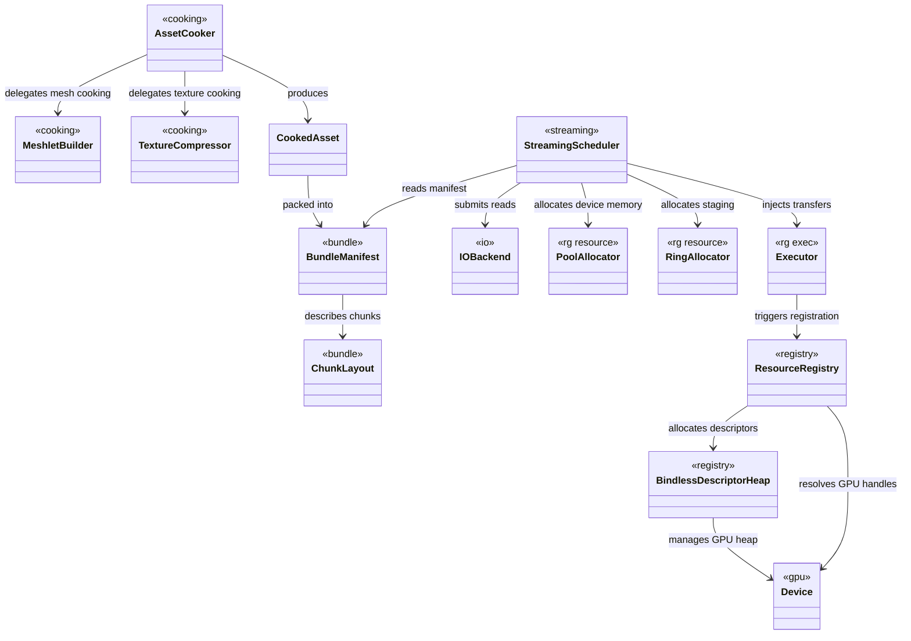

### Asset Pipeline to Render Graph Type Mapping

How asset pipeline types translate into render graph and GPU backend types at module
boundaries.

| Asset Pipeline Type      | Render Graph / GPU Type                  | Translation Point                |
| ------------------------ | ---------------------------------------- | -------------------------------- |
| `AssetId` (uint64_t)    | `rg::ResourceHandle`                     | `ResourceRegistry::FindByRgResource()` |
| `AssetHandle` (gen+idx) | `gpu::ResourceHandle`                    | `ResourceRegistry::Resolve()`    |
| `AssetHandle` (gen+idx) | `uint32_t` descriptor index              | `ResourceRegistry::ResolveDescriptorIndex()` |
| `CookedMetadata`        | `gpu::TextureDesc` / `gpu::BufferDesc`   | Resource allocation at registration |
| `StreamRequest`         | `exec::TransferPassDesc`                 | `StreamingScheduler::ProcessPending()` |
| `IOCompletion`          | `gpu::ResourceHandle` (staging Buffer)   | IO backend returns staging refs  |
| `ChunkLayout::alignment`| `gpu::AllocationInfo` alignment          | 64KB alignment matches GPU DMA   |

---

## Sequence Diagrams

### Full Asset Lifecycle

Cook, bundle, stream, register, and render across build time and runtime.

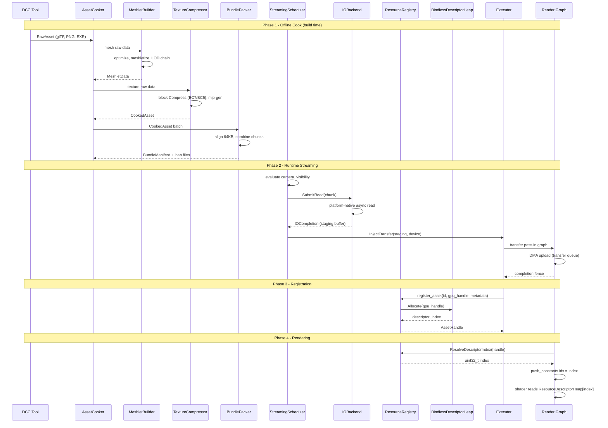

### Streaming Fault Resolution

How a residency fault flows through the system across two frames, from detection
through IO, upload, registration, and rendering with the new asset.

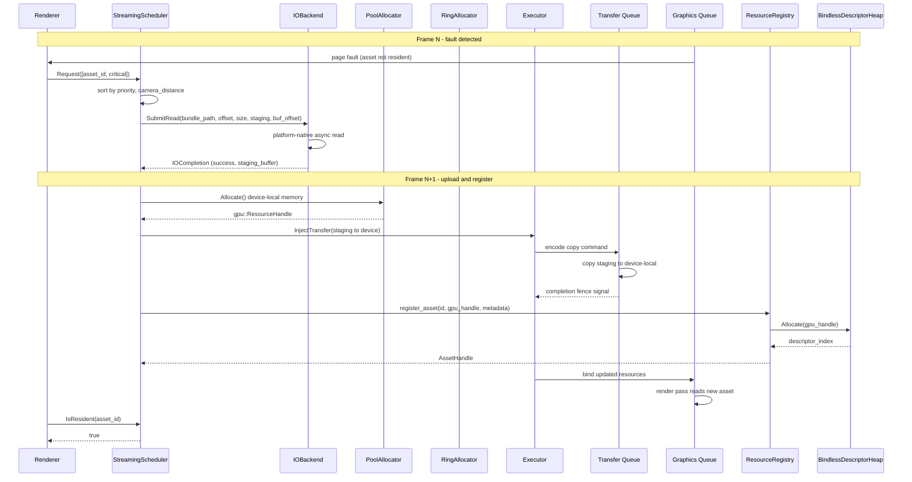

### Descriptor Heap Allocation Flow

Detailed flow showing how a descriptor slot is allocated from the free list or by
advancing the next index, how shaders consume the index, and how eviction returns
slots to the free list.

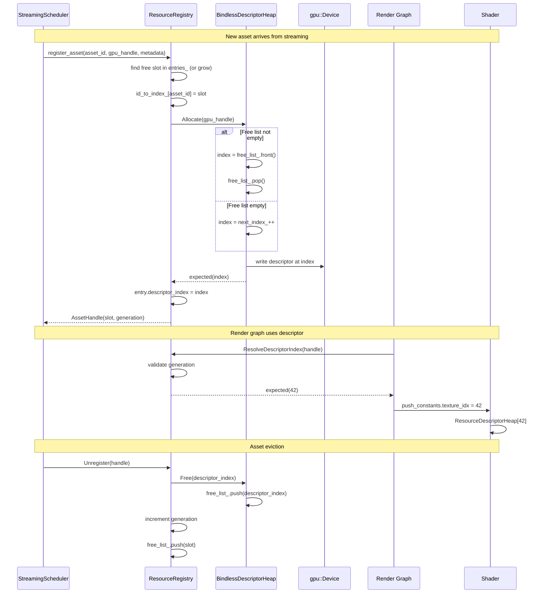
