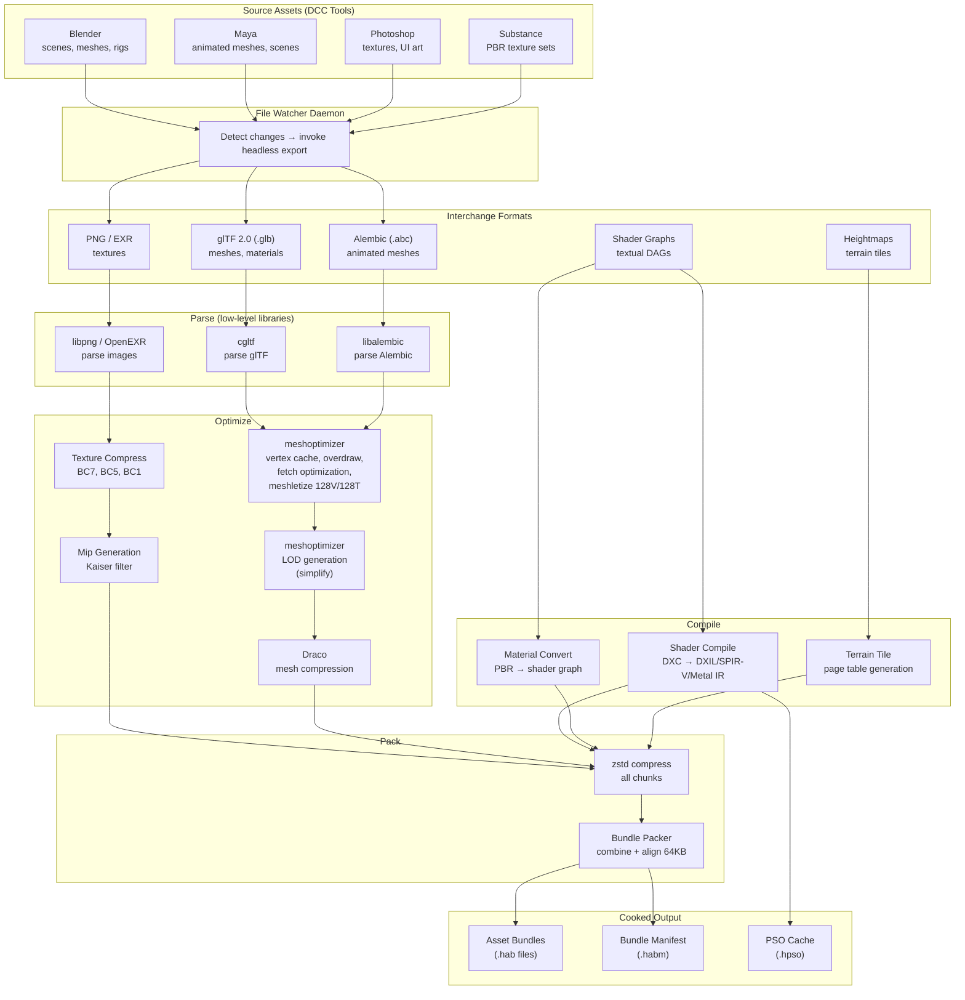
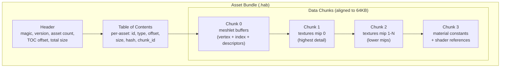
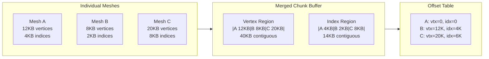
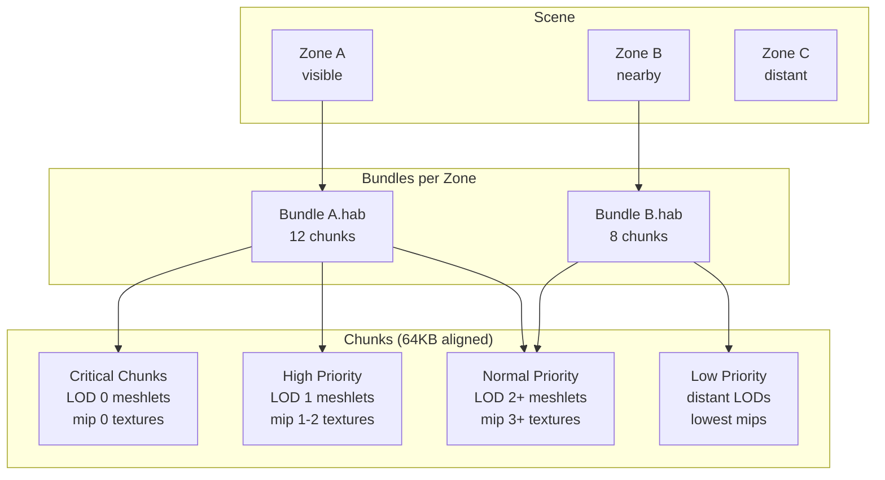
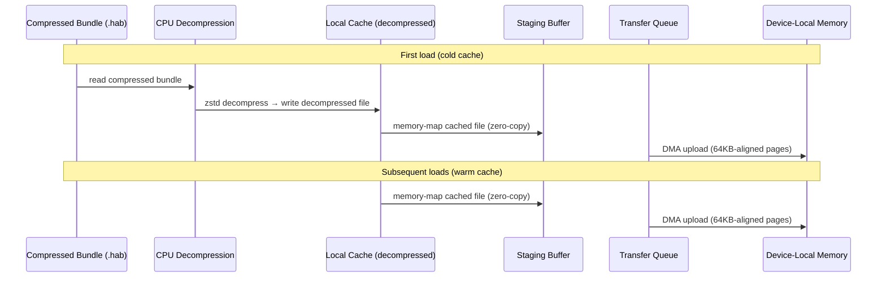
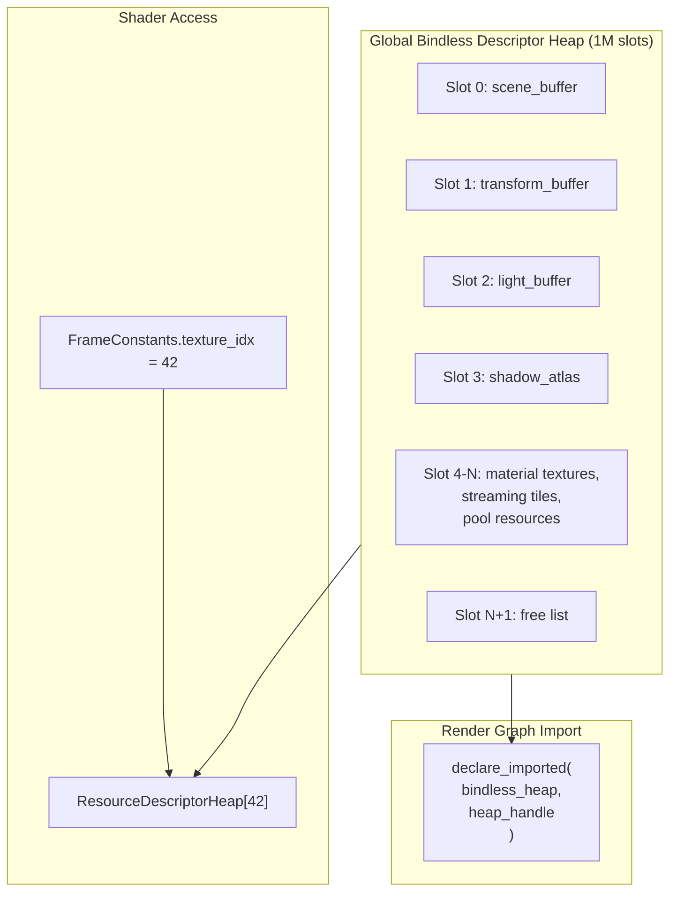
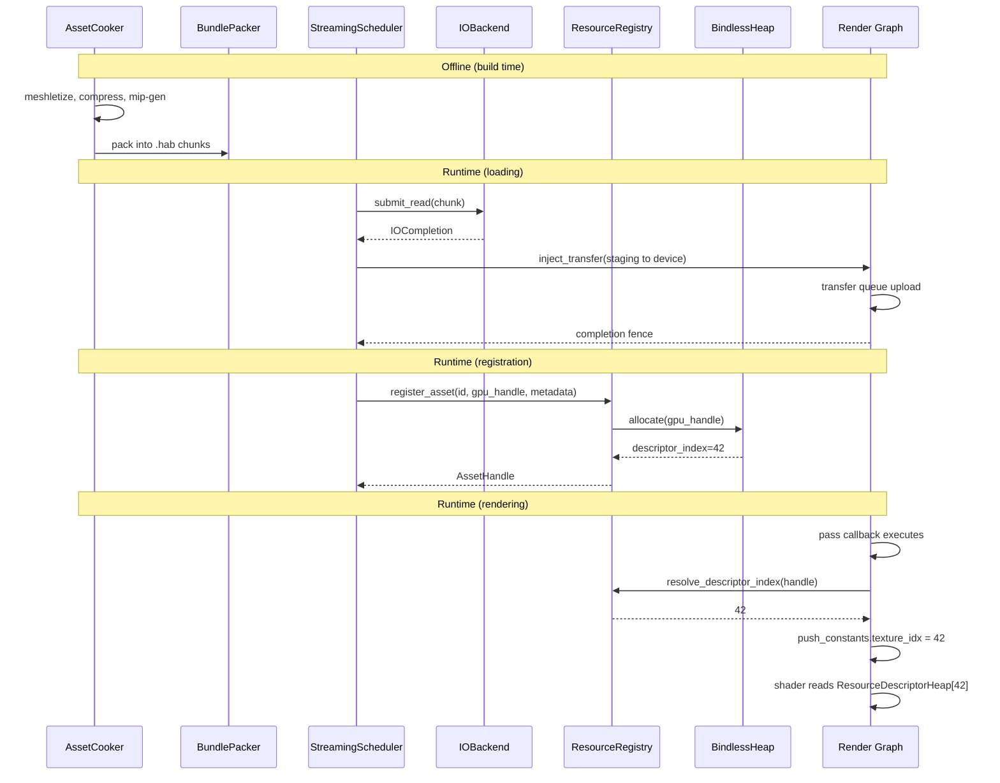

# Asset Pipeline Design

How raw assets are transformed into GPU-optimized resources, packed into streamable bundles,
and addressed by the render graph. Companion to [render-graph-design.md](render-graph-design.md)
and [shader-pipeline.md](shader-pipeline.md).

**Requirements:** R-2.11.4 (glTF import), R-2.12.1–R-2.12.10 (streaming/IO), R-3.4 (resource
budgets), F-6.1.5 (asset import), F-6.2.1–F-6.2.9 (IO/streaming features).

---

## Contents

- [Asset Transformation Pipeline](#asset-transformation-pipeline)
- [Asset Bundle Format](#asset-bundle-format)
- [Buffer and Texture Combination](#buffer-and-texture-combination)
- [Streaming Chunk Architecture](#streaming-chunk-architecture)
- [Resource Registry and Addressing](#resource-registry-and-addressing)
- [Bindless Descriptor Heap](#bindless-descriptor-heap)
- [Integration with Render Graph](#integration-with-render-graph)

---

## Asset Transformation Pipeline

Source assets originate in DCC (digital content creation) tools and are automatically exported to
interchange formats whenever they change. The cook pipeline then parses, optimizes, and packs
assets into GPU-ready bundles. No raw asset parsing occurs at runtime.

### Source Asset Integration

| DCC Tool                   | Export Format              | Watcher Mechanism                                       |
| -------------------------- | -------------------------- | ------------------------------------------------------- |
| Blender                    | glTF 2.0 (`.glb`)          | Blender CLI (`blender --background --python export.py`) |
| Maya                       | Alembic (`.abc`)           | Maya standalone (`mayapy export.py`)                    |
| Photoshop                  | PNG / EXR (`.png`, `.exr`) | Photoshop Generator or ExtendScript                     |
| Substance Designer/Painter | PNG / EXR (`.png`, `.exr`) | Substance Automation Toolkit CLI                        |

A **file watcher daemon** monitors DCC project directories for modified source files. On change,
it invokes the corresponding DCC tool's headless export to produce an interchange format asset in
the cook pipeline's input directory. The watcher is a development-time tool; shipping builds use
pre-exported assets only.

### Cook Pipeline

Interchange-format assets are parsed using low-level libraries, optimized, and packed into
platform-specific bundles.

**Parsing dependencies:**

| Format           | Library              | Purpose                                               |
| ---------------- | -------------------- | ----------------------------------------------------- |
| PNG              | libpng               | Lossless image parsing                                |
| EXR              | OpenEXR              | EXR image parsing (high dynamic range, multi-channel) |
| Alembic (`.abc`) | Alembic (libalembic) | Animated mesh and scene data from Maya                |
| glTF 2.0         | cgltf                | Lightweight glTF parsing                              |

**Optimization and compression dependencies:**

| Library       | Purpose                                                                          |
| ------------- | -------------------------------------------------------------------------------- |
| meshoptimizer | Meshlet generation, mesh optimization, LOD generation, vertex cache optimization |
| Draco         | Mesh geometry compression for storage and streaming                              |
| zstd          | General-purpose compression for asset bundle chunks                              |

**Pipeline flow:** Source assets are parsed from their interchange formats, then meshes are
optimized (vertex cache, overdraw, fetch optimization) and meshletized via meshoptimizer.
Mesh data is compressed with Draco for storage. glTF is used only as an interchange format
for optimized meshes when exporting from the cook pipeline — it is not the primary input
format for raw DCC data. Texture data is block-compressed (BC7/BC5/BC1) and mip-mapped.
All cooked chunks are compressed with zstd before packing into asset bundles. Asset bundles
are compressed during transit and storage; at startup they are decompressed on the CPU and
cached locally so that subsequent loads use zero-copy memory-mapped reads with no runtime
decompression overhead.



### Cook Pipeline API

```cpp
namespace harmonius::asset {

// A single imported asset before cooking
struct RawAsset {
    AssetId              id;
    AssetType            type;    // mesh, texture, material, terrain, shader
    std::filesystem::path source_path;
    std::vector<uint8_t> raw_data;
};

enum class AssetType : uint8_t {
    mesh,
    texture,
    material,
    terrain_tile,
    shader,
    acceleration_structure,
};

// Cooked asset — GPU-ready, platform-specific
struct CookedAsset {
    AssetId              id;
    AssetType            type;
    gpu::Backend         target_backend;
    std::vector<uint8_t> data;           // GPU-ready payload
    uint64_t             content_hash;
    CookedMetadata       metadata;       // format, dimensions, etc.
};

struct CookedMetadata {
    // Mesh metadata
    uint32_t meshlet_count   = 0;
    uint32_t vertex_count    = 0;
    uint32_t triangle_count  = 0;

    // Texture metadata
    rg::Format format        = rg::Format::undefined;
    uint32_t   width         = 0;
    uint32_t   height        = 0;
    uint32_t   mip_levels    = 0;
    uint32_t   array_layers  = 0;

    // Size for allocation
    uint64_t   gpu_size_bytes = 0;
};

class AssetCooker {
public:
    explicit AssetCooker(gpu::Backend target);

    // Cook a single asset
    [[nodiscard]]
    std::expected<CookedAsset, CookError> cook(const RawAsset& raw);

    // Cook batch (parallel)
    [[nodiscard]]
    std::vector<std::expected<CookedAsset, CookError>> cook_batch(
        std::span<const RawAsset> assets
    );

    // Register custom asset processor
    void register_processor(AssetType type,
                            std::move_only_function<CookedAsset(const RawAsset&)> fn);
};

} // namespace harmonius::asset
```

### Mesh Cooking: Meshletization

Meshes are first optimized using [meshoptimizer](https://github.com/zeux/meshoptimizer) for vertex
cache, overdraw, and vertex fetch efficiency. Then they are decomposed into meshlet clusters of at
most 128 vertices and 128 triangles (R-3.4.1, F-3.1.1) using `meshopt_buildMeshlets`. LOD chains
are generated via `meshopt_simplify` with quadric error metrics. The output is a tightly packed
buffer of meshlet descriptors, vertex data, and triangle index data. Mesh data is then compressed
with [Draco](https://github.com/google/draco) for on-disk storage and streaming.

```cpp
namespace harmonius::asset {

struct MeshletData {
    // Per-meshlet descriptor (maps to meshopt_Meshlet output)
    struct Meshlet {
        uint32_t vertex_offset;
        uint32_t triangle_offset;
        uint8_t  vertex_count;     // max 128
        uint8_t  triangle_count;   // max 128
        float    bounding_sphere[4]; // xyz center + radius (meshopt_computeMeshletBounds)
        float    normal_cone[4];     // xyz axis + cutoff (backface culling)
    };

    std::vector<Meshlet>  meshlets;
    std::vector<uint8_t>  vertex_data;    // interleaved position/normal/uv/tangent
    std::vector<uint8_t>  triangle_data;  // micro-indices within meshlet
    uint32_t              vertex_stride;
};

class MeshletBuilder {
public:
    /// Optimizes the input mesh (vertex cache, overdraw, vertex fetch) using meshoptimizer,
    /// then builds meshlets via meshopt_buildMeshlets and computes per-meshlet bounding
    /// spheres and normal cones via meshopt_computeMeshletBounds.
    [[nodiscard]]
    MeshletData build(std::span<const float> positions,
                      std::span<const uint32_t> indices,
                      uint32_t vertex_stride);

    /// Generates LOD chain using meshopt_simplify with quadric error metrics.
    /// Returns meshlet data for each LOD level with screen-space error bounds.
    [[nodiscard]]
    std::vector<MeshletData> build_lod_chain(
        std::span<const float> positions,
        std::span<const uint32_t> indices,
        uint32_t vertex_stride,
        uint32_t lod_count
    );
};

} // namespace harmonius::asset
```

### Texture Cooking: Compression + Mips

```cpp
namespace harmonius::asset {

struct TextureCookOptions {
    rg::Format target_format = rg::Format::bc7_unorm; // default block-compressed
    bool       generate_mips = true;
    bool       srgb          = false;
    uint32_t   max_dimension = 4096;
};

class TextureCompressor {
public:
    [[nodiscard]]
    CookedAsset compress(std::span<const uint8_t> rgba_data,
                         uint32_t width, uint32_t height,
                         const TextureCookOptions& options);
};

} // namespace harmonius::asset
```

---

## Asset Bundle Format

Cooked assets are packed into **asset bundles** (`.hab` files) optimized for sequential
reading and GPU upload. Each bundle is self-contained and can be streamed independently.

### Bundle Layout



### Bundle Manifest

A separate manifest file (`.habm`) describes all bundles and their contents for the streaming
scheduler to make loading decisions without reading bundle headers:

```cpp
namespace harmonius::asset {

struct BundleManifest {
    struct BundleEntry {
        std::string          bundle_path;
        uint64_t             total_size;
        std::vector<AssetId> asset_ids;
    };

    struct AssetEntry {
        AssetId        id;
        AssetType      type;
        uint64_t       gpu_size;       // how much VRAM it needs
        uint32_t       bundle_index;   // which bundle contains it
        uint32_t       chunk_index;    // which chunk within the bundle
        uint64_t       chunk_offset;   // offset within chunk
        uint64_t       chunk_size;     // size within chunk
        uint16_t       priority_bias;  // static priority hint
        CookedMetadata metadata;
    };

    std::vector<BundleEntry> bundles;
    std::vector<AssetEntry>  assets;

    // Lookup by asset ID
    [[nodiscard]]
    const AssetEntry* find(AssetId id) const;
};

} // namespace harmonius::asset
```

---

## Buffer and Texture Combination

To optimize load times and reduce IO operations, multiple small assets are combined into
larger buffers and texture atlases within each chunk.

### Buffer Merging

Small meshlet buffers from multiple meshes are merged into a single large buffer per chunk.
Each mesh records its byte offset and size within the merged buffer. At runtime, the merged
buffer is uploaded as a single transfer operation and meshes index into it via base offset.



### Texture Atlasing

Small textures (UI icons, material detail maps) are packed into atlas pages. Each texture
records its UV rectangle within the atlas. Large textures (>512x512) remain standalone.

### Alignment Rules

All chunk data is aligned to 64KB boundaries to enable:
- **Direct Storage / Metal IO:** GPU-direct DMA requires sector alignment
- **Sparse texture pages:** tile granularity is typically 64KB
- **Memory-mapped IO:** page-aligned reads avoid copy overhead

```cpp
namespace harmonius::asset {

struct ChunkLayout {
    static constexpr uint64_t alignment = 65536; // 64KB

    struct Region {
        uint64_t offset;   // aligned to 64KB
        uint64_t size;
        AssetType type;
    };

    std::vector<Region> regions;
    uint64_t            total_size; // sum of all regions, 64KB-aligned
};

} // namespace harmonius::asset
```

---

## Streaming Chunk Architecture

Asset bundles are divided into streaming chunks — the smallest unit of IO. Each chunk can be
loaded independently, enabling progressive loading and priority-based streaming.

### Chunk Hierarchy



### Streaming Scheduler

The streaming scheduler decides which chunks to load based on camera position, visibility,
and priority. It interfaces with the render graph via transfer pass injection (RG-14.7).

```cpp
namespace harmonius::asset {

enum class StreamPriority : uint8_t {
    critical = 0,  // visible this frame, blocks rendering
    high     = 1,  // will be visible next few frames
    normal   = 2,  // predictive prefetch
    low      = 3,  // speculative background load
};

struct StreamRequest {
    AssetId        asset_id;
    uint32_t       chunk_index;
    StreamPriority priority;
    float          camera_distance;  // for priority refinement
};

class StreamingScheduler {
public:
    explicit StreamingScheduler(
        const BundleManifest& manifest,
        resource::PoolAllocator& pool,
        resource::RingAllocator& staging
    );

    // Submit streaming requests for this frame
    void request(std::span<const StreamRequest> requests);

    // Process requests: read from disk, upload to GPU
    // Returns transfer pass descriptors to inject into the render graph
    [[nodiscard]]
    std::vector<exec::TransferPassDesc> process_pending();

    // Handle eviction when pools are full
    void set_eviction_policy(
        std::move_only_function<std::vector<AssetId>(uint32_t needed)> policy
    );

    // Query residency state
    [[nodiscard]] bool is_resident(AssetId id) const;
    [[nodiscard]] float residency_ratio() const; // fraction of requested assets loaded

    // Access the platform IO backend (compile-time selected)
    [[nodiscard]] IOBackend& io_backend();

private:
    IOBackend io_backend_;
};

} // namespace harmonius::asset
```

### Platform-Native IO

Each platform uses its native high-performance IO path (R-1.2.4). The IO backend follows the
same concept-based static dispatch pattern as the GPU backend — one IO backend is compiled per
binary, selected at build time via CMake. No virtual methods, no vtables, no dynamic dispatch.

```cpp
namespace harmonius::asset {

struct IOCompletion {
    AssetId             asset_id;
    gpu::ResourceHandle staging_buffer;
    uint64_t            buffer_offset;
    uint64_t            size;
    bool                success;
};

/// Concept defining the IO backend interface contract.
/// Each platform provides a concrete class satisfying this concept.
template<typename B>
concept IOBackendConcept = requires(B b, const B cb,
    std::string_view path,
    uint64_t offset, uint64_t size,
    gpu::ResourceHandle staging, uint64_t buf_offset) {

    // Submit async read from file to staging buffer
    { b.submit_read(path, offset, size, staging, buf_offset) } -> std::same_as<void>;

    // Poll for completed reads
    { b.poll_completions() } -> std::same_as<std::vector<IOCompletion>>;
};

// Platform implementations — plain concrete classes, no base class
class MetalIOBackend {
    // Uses MTLIOCommandBuffer for GPU-direct file reads
public:
    void submit_read(std::string_view path, uint64_t file_offset,
        uint64_t size, gpu::ResourceHandle staging_buffer,
        uint64_t buffer_offset);
    [[nodiscard]] std::vector<IOCompletion> poll_completions();
};

class DirectStorageBackend {
    // Uses DirectStorage for GPU decompression pipeline
public:
    void submit_read(std::string_view path, uint64_t file_offset,
        uint64_t size, gpu::ResourceHandle staging_buffer,
        uint64_t buffer_offset);
    [[nodiscard]] std::vector<IOCompletion> poll_completions();
};

class IoUringBackend {
    // Uses io_uring for async file reads on Linux
public:
    void submit_read(std::string_view path, uint64_t file_offset,
        uint64_t size, gpu::ResourceHandle staging_buffer,
        uint64_t buffer_offset);
    [[nodiscard]] std::vector<IOCompletion> poll_completions();
};

// Build-time selection — CMake aliases the concrete type
#if defined(HARMONIUS_BACKEND_METAL)
using IOBackend = MetalIOBackend;
#elif defined(HARMONIUS_BACKEND_D3D12)
using IOBackend = DirectStorageBackend;
#elif defined(HARMONIUS_BACKEND_VULKAN)
using IOBackend = IoUringBackend;
#endif

static_assert(IOBackendConcept<IOBackend>);

} // namespace harmonius::asset
```

### Zero-Copy Bundle Loading (R-2.12.9, F-6.2.8)

Asset bundles are compressed with zstd during the cook pipeline for efficient storage and network
transit. At application startup (or when a bundle is first needed), compressed bundles are
decompressed on the CPU and cached to a local platform-specific directory. Subsequent loads
memory-map the decompressed cache file directly, providing zero-copy access to GPU-ready data
with no per-frame decompression overhead.



**Cache management:**
- Decompressed bundles are stored in a platform-specific cache directory
- Cache entries are keyed by bundle content hash to detect stale data
- Cache eviction follows LRU policy with a configurable maximum cache size
- Shipping builds may include pre-decompressed bundles, eliminating the first-load penalty

---

## Resource Registry and Addressing

The resource registry maps asset IDs to live GPU resource handles and bindless descriptor
indices. It is the bridge between the asset system and the render graph.

### Asset Identity

```cpp
namespace harmonius::asset {

// Strongly-typed asset identifier — stable across sessions
// Computed as a hash of the asset source path and cook parameters
enum class AssetId : uint64_t { invalid = 0 };

// Generational handle — detects stale references (R-5.1.4)
struct AssetHandle {
    uint32_t index;
    uint32_t generation; // incremented on reuse

    [[nodiscard]] bool is_valid() const;
};

} // namespace harmonius::asset
```

### Resource Registry

```cpp
namespace harmonius::asset {

class ResourceRegistry {
public:
    explicit ResourceRegistry(gpu::Device& device,
                              BindlessDescriptorHeap& heap);

    // Register a cooked asset's GPU resource and get a handle
    [[nodiscard]]
    AssetHandle register_asset(AssetId id,
                               gpu::ResourceHandle gpu_resource,
                               const CookedMetadata& metadata);

    // Unregister (on eviction or destruction)
    void unregister(AssetHandle handle);

    // Resolve asset handle to GPU resource
    [[nodiscard]]
    std::expected<gpu::ResourceHandle, AssetError> resolve(AssetHandle handle) const;

    // Resolve to bindless descriptor index (for shader access)
    [[nodiscard]]
    std::expected<uint32_t, AssetError> resolve_descriptor_index(AssetHandle handle) const;

    // Resolve render graph ResourceHandle to asset
    [[nodiscard]]
    AssetHandle find_by_rg_resource(rg::ResourceHandle rg_handle) const;

    // Bulk query
    [[nodiscard]] uint32_t registered_count() const;
    [[nodiscard]] uint64_t total_gpu_bytes() const;

private:
    struct Entry {
        AssetId             id;
        gpu::ResourceHandle gpu_handle;
        uint32_t            descriptor_index;
        uint32_t            generation;
        CookedMetadata      metadata;
    };

    std::vector<Entry>                        entries_;
    std::unordered_map<AssetId, uint32_t>     id_to_index_;
    std::queue<uint32_t>                      free_list_;
    BindlessDescriptorHeap&                   heap_;
};

} // namespace harmonius::asset
```

---

## Bindless Descriptor Heap

A single global descriptor heap manages all GPU resources (R-2.12.10, F-6.2.9). Shaders
address resources by `uint32_t` index. The heap is imported into the render graph as a
persistent resource (RG-2.15).



### Heap Manager

```cpp
namespace harmonius::asset {

class BindlessDescriptorHeap {
public:
    explicit BindlessDescriptorHeap(gpu::Device& device,
                                    uint32_t max_descriptors = 1'000'000);

    // Allocate a descriptor slot and write the resource into it
    [[nodiscard]]
    std::expected<uint32_t, HeapError> allocate(gpu::ResourceHandle resource);

    // Free a descriptor slot back to the free list
    void free(uint32_t index);

    // Update an existing slot with a new resource (e.g., after streaming)
    void update(uint32_t index, gpu::ResourceHandle new_resource);

    // GPU handle for binding to the root signature
    [[nodiscard]] gpu::ResourceHandle gpu_handle() const;

    // Import into render graph
    [[nodiscard]] rg::ResourceHandle import_to_graph(rg::builder::GraphBuilder& builder) const;

    // Statistics
    [[nodiscard]] uint32_t allocated_count() const;
    [[nodiscard]] uint32_t capacity() const;

private:
    gpu::Device&         device_;
    gpu::ResourceHandle  heap_handle_;
    std::queue<uint32_t> free_list_;
    uint32_t             next_index_ = 0;
    uint32_t             max_descriptors_;
};

} // namespace harmonius::asset
```

---

## Integration with Render Graph

### How Assets Become Render Graph Resources



### Addressing Summary

| Layer             | Handle Type              | Scope          | Lifetime            |
| ----------------- | ------------------------ | -------------- | ------------------- |
| Asset identity    | `AssetId` (uint64_t)     | Global, stable | Permanent           |
| Asset instance    | `AssetHandle` (gen+idx)  | Per-session    | Until evicted       |
| GPU resource      | `gpu::ResourceHandle`    | Per-device     | Until destroyed     |
| Descriptor index  | `uint32_t`               | Per-heap       | Until freed         |
| Render graph slot | `rg::ResourceHandle`     | Per-graph      | Until graph rebuilt |
| Shader access     | `uint32_t` push constant | Per-draw       | Single draw call    |

### Render Graph Resource Binding Flow

The render graph never sees `AssetId` or `AssetHandle` directly. It operates on
`rg::ResourceHandle` slots that are bound to `gpu::ResourceHandle` values each frame.
The asset system provides the mapping:

```
AssetId  ──[ResourceRegistry]──>  gpu::ResourceHandle
                                        │
                                        ▼
rg::ResourceHandle  ──[Executor::bind_resource()]──>  gpu::ResourceHandle
                                                            │
                                                            ▼
PassContext::resolve()  ──>  gpu::ResourceHandle  ──[BindlessHeap]──>  uint32_t index
                                                                          │
                                                                          ▼
                                                              Shader: ResourceDescriptorHeap[index]
```

This indirection allows the streaming system to swap GPU resources (e.g., upgrading a
texture's mip level) without the render graph knowing. The binding is updated at frame
boundaries via `Executor::bind_resource()`, and the graph continues executing with the
new resource.
