# Audio System Design

## Requirements Trace

> **Canonical sources:** Features, requirements, and user stories live in
> [features/](../../features/), [requirements/](../../requirements/), and
> [user-stories/](../../user-stories/).

### Audio Engine & Spatial Audio (5.1, 5.2)

| Feature | Requirement | Feature | Requirement |
|---------|-------------|---------|-------------|
| F-5.1.1 | R-5.1.1    | F-5.2.1 | R-5.2.1    |
| F-5.1.2 | R-5.1.2    | F-5.2.2 | R-5.2.2    |
| F-5.1.3 | R-5.1.3    | F-5.2.3 | R-5.2.3    |
| F-5.1.4 | R-5.1.4    | F-5.2.4 | R-5.2.4    |
| F-5.1.5 | R-5.1.5    | F-5.2.5 | R-5.2.5    |
| F-5.1.6 | R-5.1.6    | F-5.2.6 | R-5.2.6    |
| F-5.1.7 | R-5.1.7    | F-5.2.7 | R-5.2.7    |

1. **F-5.1.1** -- Sound source component (point, line, area emitters with gain, pitch, looping,
   attenuation)
2. **F-5.1.2** -- Listener component (position, orientation, velocity, Doppler, split-screen)
3. **F-5.1.3** -- Hierarchical mixer bus DAG (master, music, SFX, ambient, voice, UI; gain
   inheritance, mute, solo)
4. **F-5.1.4** -- Voice management (priority classes, audibility scoring, virtualization, stealing,
   restoration)
5. **F-5.1.5** -- Streaming playback via Tokio async I/O with ring-buffer chunks and prefetch
6. **F-5.1.6** -- Sample-accurate scheduling (command queue from game thread to audio thread)
7. **F-5.1.7** -- Codec support (PCM, Vorbis, Opus, FLAC) with extensible plugin registry
8. **F-5.2.1** -- 3D positioning with Doppler and transform interpolation
9. **F-5.2.2** -- Distance attenuation curves (inverse, inverse-squared, linear, logarithmic,
   custom)
10. **F-5.2.3** -- HRTF binaural rendering (SOFA profiles, frequency-domain convolution)
11. **F-5.2.4** -- Ambisonics encoding/decoding (first- to third-order, multi-format output)
12. **F-5.2.5** -- Occlusion/obstruction filtering via shared BVH with material transmission loss
13. **F-5.2.6** -- Sound propagation via hybrid ray-portal solver (async, feeds per-voice taps)
14. **F-5.2.7** -- Reverb zones with early reflections, smooth blending, priority ordering

### DSP & Effects (5.3)

| Feature | Requirement |
|---------|-------------|
| F-5.3.1 | R-5.3.1    |
| F-5.3.2 | R-5.3.2    |
| F-5.3.3 | R-5.3.3    |
| F-5.3.4 | R-5.3.4    |
| F-5.3.5 | R-5.3.5    |
| F-5.3.6 | R-5.3.6    |
| F-5.3.7 | R-5.3.7    |
| F-5.3.8 | R-5.3.8    |

1. **F-5.3.1** -- Biquad filters (LP, HP, BP, notch) with per-sample coefficient smoothing
2. **F-5.3.2** -- Multi-band parametric EQ (up to 8 bands)
3. **F-5.3.3** -- Algorithmic reverb via feedback delay network
4. **F-5.3.4** -- Convolution reverb with partitioned FFT
5. **F-5.3.5** -- Compressor / limiter with look-ahead on master bus
6. **F-5.3.6** -- Delay, chorus, flanger via modulated delay lines
7. **F-5.3.7** -- Pitch shifting (phase-vocoder desktop, OLA mobile)
8. **F-5.3.8** -- Custom DSP node registry with stateless process callbacks

### Adaptive Music (5.4)

| Feature | Requirement |
|---------|-------------|
| F-5.4.1 | R-5.4.1    |
| F-5.4.2 | R-5.4.2    |
| F-5.4.3 | R-5.4.3    |
| F-5.4.4 | R-5.4.4    |
| F-5.4.5 | R-5.4.5    |
| F-5.4.6 | R-5.4.6    |
| F-5.4.7 | R-5.4.7    |

1. **F-5.4.1** -- Vertical re-mixing with synchronized stems
2. **F-5.4.2** -- Horizontal re-sequencing via segment graph
3. **F-5.4.3** -- Transition rules: cut, crossfade, beat-sync, custom curve
4. **F-5.4.4** -- Tempo / beat clock with beat and bar events
5. **F-5.4.5** -- Stinger playback with cooldowns and priority ducking
6. **F-5.4.6** -- Playlists with weighted randomization and non-repeat
7. **F-5.4.7** -- Dynamic intensity parameter (0.0-1.0) driving all music systems

### Voice & Speech (5.5)

| Feature | Requirement |
|---------|-------------|
| F-5.5.1 | R-5.5.1    |
| F-5.5.2 | R-5.5.2    |
| F-5.5.3 | R-5.5.3    |
| F-5.5.4 | R-5.5.4    |
| F-5.5.5 | R-5.5.5    |
| F-5.5.6 | R-5.5.6    |
| F-5.5.7 | R-5.5.7    |
| F-5.5.8 | R-5.5.8    |
| F-5.5.9 | R-5.5.9    |

1. **F-5.5.1** -- Opus voice chat codec (6-64 kbps), platform-native mic capture
2. **F-5.5.2** -- Adaptive jitter buffer with Opus PLC
3. **F-5.5.3** -- Voice activity detection and noise suppression
4. **F-5.5.4** -- Text-to-speech via platform-native APIs
5. **F-5.5.5** -- Viseme generation for lip sync
6. **F-5.5.6** -- Dialogue playback with priority queue and subtitles
7. **F-5.5.7** -- Branching dialogue graph with condition-gated edges
8. **F-5.5.8** -- Voice chat channel management (proximity, party, raid)
9. **F-5.5.9** -- Acoustic echo cancellation with comfort noise

### Non-Functional Requirements

| ID | Metric | Target |
|----|--------|--------|
| R-5.1.NF1 | Audio thread budget | < 0.5 ms / buffer |
| R-5.1.NF2 | Max voice count | 256 (128+128 virtual) |
| R-5.1.NF3 | Audio memory budget | < 64 MiB resident |
| R-5.1.NF4 | Mixer output latency | < 20 ms at 48 kHz |
| R-5.2.NF1 | Spatialization/voice | < 2 us |
| R-5.2.NF2 | Propagation solver | < 4 ms, async 10 Hz |
| R-5.3.NF1 | 4-insert DSP chain | < 1 us/sample |
| R-5.4.NF1 | Music transition | within 1 beat |
| R-5.5.NF1 | Voice chat latency | < 150 ms e2e |
| R-5.5.NF2 | Voice stream count | >= 32 simultaneous |

## Overview

The audio system provides real-time sound mixing, spatialization, DSP effects, adaptive music, and
voice chat. All audio data lives as ECS components; all audio logic runs as ECS systems. Five layers
compose the system:

1. **ECS layer** -- components (`AudioSource`, `AudioListener`, `SpatialAudio`, `ReverbZone`,
   `MusicCueComponent`, `VoiceChatComponent`) and systems that synchronize ECS state with the audio
   runtime.
2. **Runtime layer** -- `AudioEngine` core: mixer graph, voice manager, command queue, codec
   registry, stream manager.
3. **DSP layer** -- `DspNode` trait, `EffectChain`, built-in effects (biquad, EQ, reverb,
   compressor, delay, pitch shifter), and the custom DSP node registry.
4. **Spatial layer** -- spatializer, occlusion, HRTF, Ambisonics, propagation solver, reverb zones.
   Queries the shared BVH spatial index.
5. **Music layer** -- `MusicStateMachine`, segment graph, vertical remixer, beat clock, stinger
   scheduler, playlist.
6. **Voice layer** -- mic capture, Opus codec, jitter buffer, VAD, noise suppressor, AEC, viseme
   generator, channel manager.
7. **Backend layer** -- platform output via WASAPI (Windows), CoreAudio (macOS), ALSA/PipeWire
   (Linux).

The game thread communicates with the audio thread through a lock-free SPSC command queue. The audio
thread runs a high-priority callback driven by the platform backend. Streaming playback uses the
engine's `Tokio runtime` for Tokio async I/O (Tokio (IOCP), Tokio (kqueue), Tokio (epoll)).

## Architecture

### Module Boundaries

```mermaid
graph TD
    subgraph harmonius_audio
        AE[AudioEngine]
        MG[MixerGraph]
        VM[VoiceManager]
        CQ[CommandQueue]
        CR[CodecRegistry]
        ST[StreamManager]
    end

    subgraph harmonius_audio_spatial
        SP[Spatializer]
        OC[OcclusionSystem]
        PR[PropagationSolver]
        HR[HrtfRenderer]
        AM[AmbisonicsCodec]
    end

    subgraph harmonius_audio_dsp
        EC[EffectChain]
        BQ[BiquadFilter]
        EQ[ParametricEq]
        RV[FdnReverb]
        CV[ConvolutionReverb]
        DY[Compressor / Limiter]
        DL[Delay / Chorus / Flanger]
        PS[PitchShifter]
        NR[DspNodeRegistry]
    end

    subgraph harmonius_audio_music
        BC[BeatClock]
        SM[MusicStateMachine]
        SG[SegmentGraph]
        VR[VerticalRemixer]
        SS[StingerScheduler]
        PL[Playlist]
    end

    subgraph harmonius_audio_voice
        MC[MicCapture]
        OE[OpusEncoder]
        OD[OpusDecoder]
        JB[JitterBuffer]
        VA[VoiceActivityDetector]
        NS[NoiseSuppressor]
        AEC[AcousticEchoCanceller]
        VS[VisemeGenerator]
        CH[ChannelManager]
    end

    subgraph harmonius_audio_ecs
        SC[AudioSourceComponent]
        LC[ListenerComponent]
        SAC[SpatialAudioComponent]
        RZC[ReverbZoneComponent]
        AS[AudioSystems]
    end

    subgraph harmonius_audio_backend
        WA[WasapiBackend]
        CA[CoreAudioBackend]
        AL[AlsaPipeWireBackend]
    end

    subgraph harmonius_platform
        IO[Tokio runtime]
        TP[ThreadPool]
        SI[SpatialIndex]
    end

    AE --> MG
    AE --> VM
    AE --> CQ
    AE --> CR
    AE --> ST

    EC --> BQ
    EC --> EQ
    EC --> RV
    EC --> CV
    EC --> DY
    EC --> DL
    EC --> PS
    EC --> NR

    VM --> SP
    SP --> OC
    SP --> HR
    SP --> AM
    OC --> PR

    SM --> SG
    SM --> VR
    SM --> SS
    SM --> BC
    SM --> PL

    MC --> VA
    VA --> NS
    NS --> OE
    OD --> JB
    MC --> AEC

    EC -.-> MG
    SM -.-> CQ
    OD -.-> MG
    VS -.-> AS
    CH -.-> MG

    AS --> AE
    AS --> SC
    AS --> LC
    AS --> SAC
    AS --> RZC

    ST --> IO
    OC --> SI
    PR --> SI
    AE --> TP

    AE -.->|cfg windows| WA
    AE -.->|cfg macos| CA
    AE -.->|cfg linux| AL
```

### Mixer Bus DAG

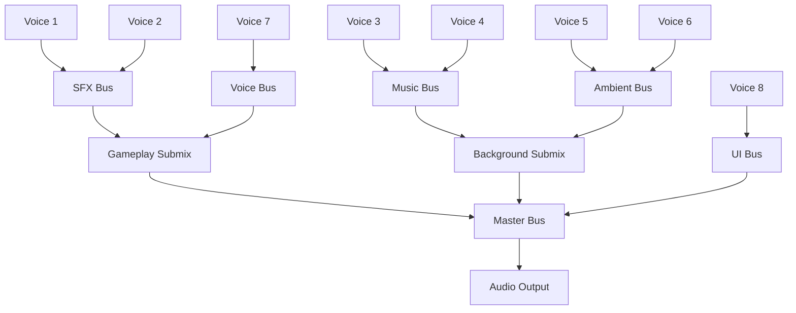

Each bus carries gain, mute, solo, and an ordered insert-effect chain. Child buses inherit the
parent's effective gain. The DAG is topologically sorted so buses process leaves-first, accumulating
into parents until the master bus produces the final output.

### DSP Effect Chain Signal Flow

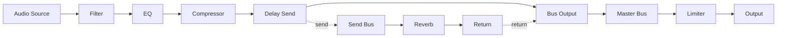

### Voice Lifecycle

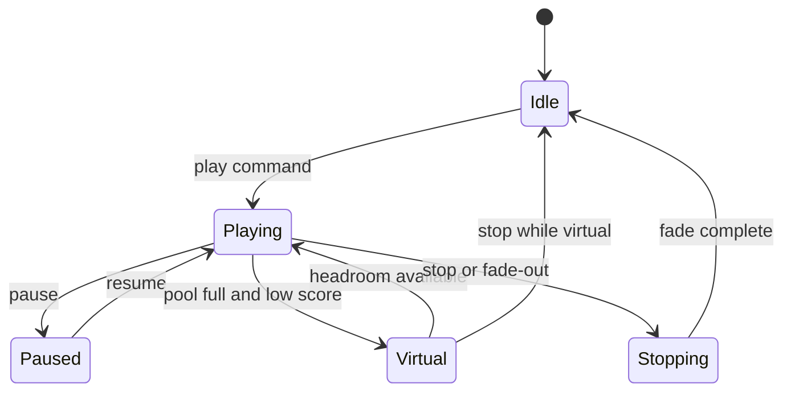

### Music State Machine

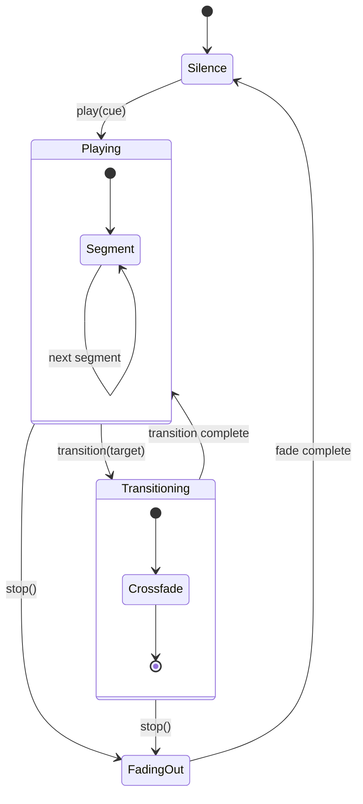

### Voice Chat Pipeline

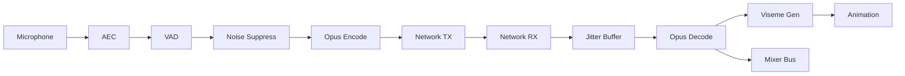

### Core Data Structures (Class Diagram)

The unified class diagram is split across four domains due to size. All types derive `Reflect`.

#### Engine Core and Spatial

```mermaid
classDiagram
    class AudioSource {
        +AssetHandle~AudioClip~ clip
        +f32 gain
        +f32 pitch
        +bool looping
        +EmitterShape shape
        +BusId bus
        +VoicePriority priority
        +f32 doppler_factor
    }
    class EmitterShape {
        <<enumeration>>
        Point
        Line
        Area
    }
    class VoicePriority {
        <<enumeration>>
        Low
        Medium
        High
        Critical
    }
    class AudioListener {
        +u8 player_index
    }
    class SpatialAudio {
        +Option~AttenuationModel~ attenuation_model
        +f32 min_distance
        +f32 max_distance
        +u8 occlusion_rays
        +bool hrtf_enabled
    }
    class ReverbZone {
        +Vec3 half_extents
        +f32 decay_time
        +f32 diffusion
        +u16 priority
        +f32 blend_distance
    }
    class AudioConfig {
        +u32 sample_rate
        +u32 buffer_size
        +u32 max_real_voices
        +u32 max_virtual_voices
        +u32 output_channels
    }
    class AudioEngine {
        +new(config, backend, reactor) Self
        +command_sender() CommandSender
        +mixer_graph() MixerGraph
        +codec_registry() CodecRegistry
        +shutdown()
    }
    class AudioTimestamp {
        <<enumeration>>
        Immediate
        SampleOffset
    }
    class AudioCommand {
        <<enumeration>>
        Play
        Stop
        Pause
        Resume
        SetParam
        SetBusParam
        UpdateSpatial
        UpdateListener
        Prefetch
        SetEffectParam
        InsertEffect
        RemoveEffect
        MusicPlay
        MusicTransition
        MusicSetIntensity
        MusicStop
        TriggerStinger
        VoiceChannelJoin
        VoiceChannelLeave
        DialoguePlay
    }
    class VoiceParam {
        <<enumeration>>
        Gain
        Pitch
        DopplerFactor
        OcclusionGain
        OcclusionLpf
    }
    class BusParam {
        <<enumeration>>
        Gain
        Mute
        Solo
    }
    class CommandSender {
        +send(cmd) Result
    }
    class CommandReceiver {
        +drain() Iterator
    }
    class VoiceId {
        +u32 id
    }
    class VoiceState {
        <<enumeration>>
        Idle
        Playing
        Paused
        Virtual
        Stopping
    }
    class AudibilityScore {
        +f32 score
        +compute(dist, occ, bus, src) Self
    }
    class VoiceSlot {
        +VoiceId id
        +VoiceState state
        +VoicePriority priority
        +AudibilityScore score
        +BusId bus
        +u64 playback_offset
        +SpatialParams spatial
    }
    class VoiceManager {
        +new(max_real, max_virtual) Self
        +allocate(priority) Option~VoiceId~
        +release(id)
        +virtualize(id)
        +restore(id) bool
        +update_priorities()
    }
    class BusId {
        +u16 id
    }
    class InsertSlot {
        +AudioEffect effect
        +bool bypassed
    }
    class BusNode {
        +BusId id
        +f32 gain
        +f32 effective_gain
        +bool muted
        +bool solo
        +Vec~InsertSlot~ inserts
        +Option~BusId~ parent
        +SmallVec~BusId~ children
    }
    class MixerGraph {
        +new() Self
        +add_bus(id, parent)
        +remove_bus(id)
        +reparent(id, new_parent)
        +add_insert(bus, index, effect)
        +set_gain(bus, gain)
        +mix(voices, output)
    }
    class AudioEffect {
        <<enumeration>>
        BiquadFilter
        ParametricEq
        Compressor
        Limiter
        Reverb
        Delay
        Chorus
        PitchShifter
    }
    class SpatialParams {
        +Vec3 position
        +Vec3 velocity
        +f32 pan
        +f32 distance_gain
        +f32 doppler_pitch
        +f32 occlusion_gain
        +f32 occlusion_lpf
        +Option~HrtfIndex~ hrtf_index
    }
    class AttenuationModel {
        <<enumeration>>
        Inverse
        InverseSquared
        Linear
        Logarithmic
        Custom
    }
    class Spatializer {
        +new() Self
        +compute() SpatialParams
    }
    class OcclusionResult {
        +f32 attenuation_db
        +f32 lpf_cutoff
        +bool fully_occluded
    }
    class OcclusionSystem {
        +query(idx, src, lis, rays) OcclusionResult
    }
    class PropagationPath {
        +u32 delay_samples
        +f32 gain
        +f32 lpf_cutoff
        +u8 bounce_count
    }
    class PropagationSolver {
        +update(idx, portals, srcs, lis)
        +paths(voice_id) PropagationPath
    }
    class HrtfRenderer {
        +new(fft_size) Self
        +set_dataset(dataset)
        +render(mono, az, el, L, R)
    }
    class AmbisonicsCodec {
        +new(order, output) Self
        +encode(mono, azimuth, elevation)
        +rotate(orientation)
        +decode(output)
    }
    class ReverbZoneManager {
        +update(listener_pos, zones)
        +blended_params() ActiveReverbState
    }

    AudioSource --> EmitterShape
    AudioSource --> VoicePriority
    AudioSource --> BusId
    SpatialAudio --> AttenuationModel
    AudioEngine --> MixerGraph
    AudioEngine --> VoiceManager
    AudioEngine --> CommandSender
    CommandSender --> AudioCommand
    CommandReceiver --> AudioCommand
    VoiceSlot --> VoiceId
    VoiceSlot --> VoiceState
    VoiceSlot --> SpatialParams
    VoiceManager *-- VoiceSlot
    BusNode --> BusId
    BusNode *-- InsertSlot
    InsertSlot --> AudioEffect
    MixerGraph *-- BusNode
    Spatializer --> SpatialParams
    OcclusionSystem --> OcclusionResult
    PropagationSolver --> PropagationPath
```

#### Codec, Streaming, and Backend

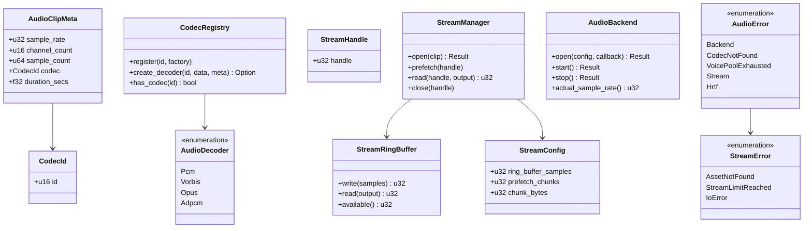

#### DSP Effects

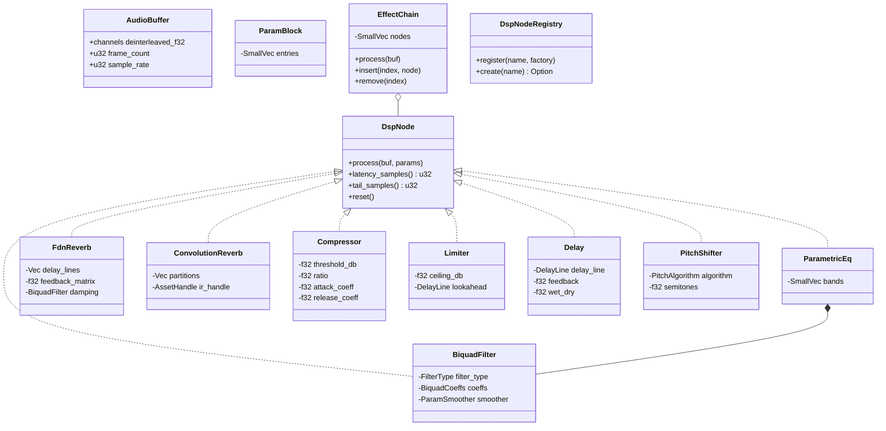

#### Music and Voice Chat

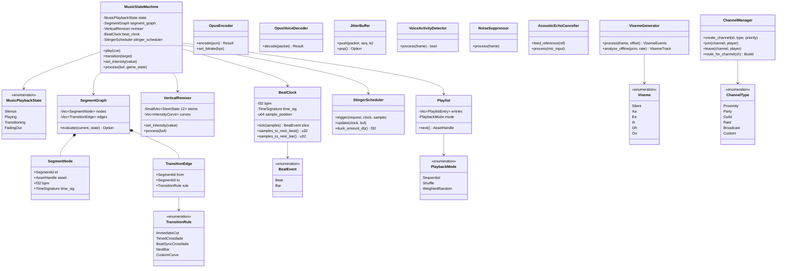

## API Design

### ECS Components

```rust
#[derive(Clone, Debug, Reflect)]
pub enum EmitterShape {
    Point,
    Line { start: Vec3, end: Vec3 },
    Area { half_extents: Vec2 },
}

#[derive(
    Clone, Copy, Debug, PartialEq, Eq,
    PartialOrd, Ord, Reflect,
)]
pub enum VoicePriority {
    Low,
    Medium,
    High,
    Critical,
}

#[derive(Clone, Debug, Reflect)]
pub struct AudioSource {
    pub clip: AssetHandle<AudioClip>,
    pub gain: f32,
    pub pitch: f32,
    pub looping: bool,
    pub shape: EmitterShape,
    pub bus: BusId,
    pub priority: VoicePriority,
    pub attenuation: AssetHandle<AttenuationCurve>,
    pub doppler_factor: f32,
}

#[derive(Clone, Debug, Reflect)]
pub struct AudioListener {
    pub player_index: u8,
}

#[derive(Clone, Debug, Reflect)]
pub struct SpatialAudio {
    pub attenuation_model: Option<AttenuationModel>,
    pub min_distance: f32,
    pub max_distance: f32,
    pub occlusion_rays: u8,
    pub hrtf_enabled: bool,
}

#[derive(Clone, Debug, Reflect)]
pub struct ReverbZone {
    pub half_extents: Vec3,
    pub decay_time: f32,
    pub diffusion: f32,
    pub reflections: Option<
        AssetHandle<ReflectionPattern>,
    >,
    pub priority: u16,
    pub blend_distance: f32,
}

#[derive(Component, Reflect)]
pub struct MusicCueComponent {
    pub segment_graph: AssetHandle,
    pub playlist: AssetHandle,
    pub intensity_curves: AssetHandle,
}

#[derive(Component, Reflect)]
pub struct VoiceChatComponent {
    pub channels: SmallVec<[ChannelId; 4]>,
    pub transmitting: bool,
    pub volume: f32,
}

#[derive(Component, Reflect)]
pub struct VisemeComponent {
    pub current_viseme: Viseme,
    pub weight: f32,
}
```

### Audio Engine Core

```rust
pub struct AudioConfig {
    pub sample_rate: u32,
    pub buffer_size: u32,
    pub max_real_voices: u32,
    pub max_virtual_voices: u32,
    pub output_channels: u32,
}

pub struct AudioEngine { /* ... */ }

impl AudioEngine {
    pub fn new(
        config: AudioConfig,
        backend: impl AudioBackend,
        reactor: &Tokio runtime,
    ) -> Self;
    pub fn command_sender(&self) -> CommandSender;
    pub fn mixer_graph(&self) -> &MixerGraph;
    pub fn codec_registry(&self) -> &CodecRegistry;
    pub fn shutdown(&mut self);
}
```

### Command Queue

```rust
#[derive(Clone, Copy, Debug)]
pub enum AudioTimestamp {
    Immediate,
    SampleOffset(u64),
}

#[derive(Clone, Debug)]
pub enum AudioCommand {
    Play {
        voice_id: VoiceId,
        clip: AssetHandle<AudioClip>,
        bus: BusId,
        priority: VoicePriority,
        timestamp: AudioTimestamp,
    },
    Stop {
        voice_id: VoiceId,
        fade_samples: u32,
        timestamp: AudioTimestamp,
    },
    Pause { voice_id: VoiceId, timestamp: AudioTimestamp },
    Resume { voice_id: VoiceId, timestamp: AudioTimestamp },
    SetParam {
        voice_id: VoiceId,
        param: VoiceParam,
        value: f32,
        timestamp: AudioTimestamp,
    },
    SetBusParam {
        bus_id: BusId,
        param: BusParam,
        value: f32,
    },
    UpdateSpatial {
        voice_id: VoiceId,
        position: Vec3,
        velocity: Vec3,
        orientation: Quat,
    },
    UpdateListener {
        listener_id: ListenerId,
        position: Vec3,
        velocity: Vec3,
        orientation: Quat,
    },
    Prefetch { clip: AssetHandle<AudioClip> },
    SetEffectParam {
        bus: BusId,
        node_index: u32,
        param: ParamId,
        value: f32,
    },
    InsertEffect {
        bus: BusId,
        index: u32,
        node_type: String,
    },
    RemoveEffect { bus: BusId, index: u32 },
    MusicPlay { cue: SegmentId },
    MusicTransition { target: SegmentId },
    MusicSetIntensity { value: f32 },
    MusicStop { fade_ms: u32 },
    TriggerStinger { request: StingerRequest },
    VoiceChannelJoin {
        channel: ChannelId,
        player: PlayerId,
    },
    VoiceChannelLeave {
        channel: ChannelId,
        player: PlayerId,
    },
    DialoguePlay {
        entity: EntityId,
        line: AssetHandle,
        priority: DialoguePriority,
    },
}

pub struct CommandSender { /* ... */ }
impl CommandSender {
    pub fn send(
        &self, cmd: AudioCommand,
    ) -> Result<(), AudioCommand>;
}

pub struct CommandReceiver { /* ... */ }
impl CommandReceiver {
    pub fn drain(
        &self,
    ) -> impl Iterator<Item = AudioCommand>;
}
```

### Voice Manager

```rust
#[derive(Clone, Copy, Debug, PartialEq, Eq, Hash)]
pub struct VoiceId(pub(crate) u32);

#[derive(Clone, Copy, Debug, PartialEq, Eq)]
pub enum VoiceState {
    Idle,
    Playing,
    Paused,
    Virtual,
    Stopping { remaining_samples: u32 },
}

#[derive(Clone, Copy, Debug, PartialOrd, PartialEq)]
pub struct AudibilityScore(pub f32);

impl AudibilityScore {
    pub fn compute(
        distance: f32,
        occlusion_factor: f32,
        bus_gain: f32,
        source_gain: f32,
    ) -> Self;
}

pub struct VoiceSlot {
    pub id: VoiceId,
    pub state: VoiceState,
    pub priority: VoicePriority,
    pub score: AudibilityScore,
    pub bus: BusId,
    pub playback_offset: u64,
    pub decode_buffer: AlignedBuffer,
    pub spatial: SpatialParams,
}

pub struct VoiceManager { /* ... */ }
impl VoiceManager {
    pub fn new(max_real: u32, max_virtual: u32) -> Self;
    pub fn allocate(
        &mut self, priority: VoicePriority,
    ) -> Option<VoiceId>;
    pub fn release(&mut self, id: VoiceId);
    pub fn virtualize(&mut self, id: VoiceId);
    pub fn restore(&mut self, id: VoiceId) -> bool;
    pub fn update_priorities(&mut self);
    pub fn active_voices(
        &self,
    ) -> impl Iterator<Item = &VoiceSlot>;
}
```

### Mixer Graph

```rust
#[derive(Clone, Copy, Debug, PartialEq, Eq, Hash)]
pub struct BusId(pub(crate) u16);

impl BusId {
    pub const MASTER: Self = BusId(0);
    pub const MUSIC: Self = BusId(1);
    pub const SFX: Self = BusId(2);
    pub const AMBIENT: Self = BusId(3);
    pub const VOICE: Self = BusId(4);
    pub const UI: Self = BusId(5);
}

pub struct InsertSlot {
    pub effect: AudioEffect,
    pub bypassed: bool,
}

pub struct BusNode {
    pub id: BusId,
    pub gain: f32,
    pub effective_gain: f32,
    pub muted: bool,
    pub solo: bool,
    pub inserts: Vec<InsertSlot>,
    pub parent: Option<BusId>,
    pub children: SmallVec<[BusId; 4]>,
    pub buffer: AlignedBuffer,
}

pub struct MixerGraph { /* ... */ }
impl MixerGraph {
    pub fn new() -> Self;
    pub fn add_bus(&mut self, id: BusId, parent: BusId);
    pub fn remove_bus(&mut self, id: BusId);
    pub fn reparent(
        &mut self, id: BusId, new_parent: BusId,
    );
    pub fn add_insert(
        &mut self, bus: BusId, index: usize,
        effect: AudioEffect,
    );
    pub fn remove_insert(
        &mut self, bus: BusId, index: usize,
    );
    pub fn set_gain(&mut self, bus: BusId, gain: f32);
    pub fn mix(
        &mut self, voices: &[VoiceSlot],
        output: &mut [f32],
    );
}

/// Enum dispatch for static dispatch on audio thread.
pub enum AudioEffect {
    BiquadFilter(BiquadFilter),
    ParametricEq(ParametricEq),
    Compressor(Compressor),
    Limiter(Limiter),
    Reverb(FdnReverb),
    Delay(Delay),
    Chorus(ModulatedDelay),
    PitchShifter(PitchShifter),
}
```

### Codec Registry and Streaming

```rust
#[derive(Clone, Copy, Debug, PartialEq, Eq, Hash)]
pub struct CodecId(pub(crate) u16);

impl CodecId {
    pub const PCM: Self = CodecId(0);
    pub const VORBIS: Self = CodecId(1);
    pub const OPUS: Self = CodecId(2);
    pub const FLAC: Self = CodecId(3);
}

#[derive(Clone, Debug, Reflect)]
pub struct AudioClipMeta {
    pub sample_rate: u32,
    pub channel_count: u16,
    pub sample_count: u64,
    pub codec: CodecId,
    pub loop_start: Option<u64>,
    pub loop_end: Option<u64>,
    pub duration_secs: f32,
}

pub enum AudioDecoder {
    Pcm(PcmDecoder),
    Vorbis(VorbisDecoder),
    Opus(OpusDecoder),
    Adpcm(AdpcmDecoder),
}

pub struct CodecRegistry { /* ... */ }
impl CodecRegistry {
    pub fn register(
        &mut self, id: CodecId, factory: DecoderFactory,
    );
    pub fn create_decoder(
        &self, id: CodecId, data: &[u8],
        meta: &AudioClipMeta,
    ) -> Option<AudioDecoder>;
}

pub struct StreamManager { /* ... */ }
impl StreamManager {
    pub fn new(
        config: StreamConfig, reactor: &Tokio runtime,
    ) -> Self;
    pub async fn open(
        &mut self, clip: AssetHandle<AudioClip>,
    ) -> Result<StreamHandle, StreamError>;
    pub async fn prefetch(
        &mut self, handle: StreamHandle,
    );
    pub fn read(
        &self, handle: StreamHandle,
        output: &mut [f32],
    ) -> u32;
    pub fn close(&mut self, handle: StreamHandle);
}
```

### Spatial Audio

```rust
#[derive(Clone, Debug, Default)]
pub struct SpatialParams {
    pub position: Vec3,
    pub velocity: Vec3,
    pub pan: f32,
    pub distance_gain: f32,
    pub doppler_pitch: f32,
    pub occlusion_gain: f32,
    pub occlusion_lpf: f32,
    pub hrtf_index: Option<HrtfIndex>,
}

#[derive(Clone, Debug, Reflect)]
pub enum AttenuationModel {
    Inverse,
    InverseSquared,
    Linear,
    Logarithmic,
    Custom { points: Vec<(f32, f32)> },
}

pub struct Spatializer { /* ... */ }
impl Spatializer {
    pub fn compute(
        &self,
        source_pos: Vec3, source_vel: Vec3,
        listener_pos: Vec3, listener_vel: Vec3,
        listener_orient: Quat,
        attenuation: &AttenuationModel,
        min_distance: f32, max_distance: f32,
        doppler_factor: f32,
    ) -> SpatialParams;
}

pub struct OcclusionSystem { /* ... */ }
impl OcclusionSystem {
    pub fn query(
        &self, spatial_index: &SpatialIndex,
        source_pos: Vec3, listener_pos: Vec3,
        ray_count: u8,
    ) -> OcclusionResult;
}

pub struct PropagationSolver { /* ... */ }
impl PropagationSolver {
    pub async fn update(
        &self, spatial_index: &SpatialIndex,
        portal_graph: &PortalGraph,
        sources: &[(VoiceId, Vec3)],
        listener_pos: Vec3,
    );
    pub fn paths(
        &self, voice_id: VoiceId,
    ) -> &[PropagationPath];
}

pub struct HrtfRenderer { /* ... */ }
impl HrtfRenderer {
    pub fn new(fft_size: usize) -> Self;
    pub fn set_dataset(&mut self, dataset: HrtfDataset);
    pub fn render(
        &mut self, mono_input: &[f32],
        azimuth: f32, elevation: f32,
        left_out: &mut [f32], right_out: &mut [f32],
    );
}

pub struct AmbisonicsCodec { /* ... */ }
impl AmbisonicsCodec {
    pub fn new(
        order: AmbisonicsOrder, output: OutputFormat,
    ) -> Self;
    pub fn encode(
        &mut self, mono: &[f32], az: f32, el: f32,
    );
    pub fn rotate(&mut self, orientation: Quat);
    pub fn decode(&self, output: &mut [f32]);
}
```

### DspNode Trait and Effect Chain

```rust
pub trait DspNode: Send {
    fn process(
        &mut self, buf: &mut AudioBuffer<'_>,
        params: &ParamBlock,
    );
    fn latency_samples(&self) -> u32 { 0 }
    fn tail_samples(&self) -> u32 { 0 }
    fn reset(&mut self);
}

pub struct EffectChain {
    nodes: SmallVec<[DspNodeKind; 8]>,
}
impl EffectChain {
    pub fn process(
        &mut self, buf: &mut AudioBuffer<'_>,
        params: &[ParamBlock],
    );
    pub fn insert(
        &mut self, index: usize, node: DspNodeKind,
    );
    pub fn remove(
        &mut self, index: usize,
    ) -> DspNodeKind;
    pub fn total_latency(&self) -> u32;
    pub fn max_tail(&self) -> u32;
    pub fn reset(&mut self);
}

pub struct DspNodeRegistry {
    factories: HashMap<String, DspNodeFactory>,
}
impl DspNodeRegistry {
    pub fn register(
        &mut self, name: &str,
        factory: DspNodeFactory,
    );
    pub fn create(
        &self, name: &str,
    ) -> Option<DspNodeKind>;
}
```

### Adaptive Music

```rust
pub struct BeatClock {
    bpm: f32,
    time_sig: TimeSignature,
    sample_rate: f32,
    sample_position: u64,
    beat_in_bar: u32,
    bar_count: u32,
    samples_per_beat: f64,
    fractional_accum: f64,
    pending_events: SmallVec<[BeatEvent; 8]>,
}
impl BeatClock {
    pub fn new(
        bpm: f32, time_sig: TimeSignature,
        sample_rate: f32,
    ) -> Self;
    pub fn tick(
        &mut self, samples: u32,
    ) -> &[BeatEvent];
    pub fn set_bpm(&mut self, bpm: f32);
    pub fn samples_to_next_beat(&self) -> u32;
    pub fn samples_to_next_bar(&self) -> u32;
}

pub struct SegmentGraph {
    nodes: Vec<SegmentNode>,
    edges: Vec<TransitionEdge>,
}
impl SegmentGraph {
    pub fn evaluate(
        &self, current: SegmentId,
        game_state: &GameStateSnapshot,
    ) -> Option<(SegmentId, &TransitionRule)>;
}

pub struct VerticalRemixer {
    stems: SmallVec<[StemState; 12]>,
    intensity_curves: Vec<IntensityCurve>,
    max_stems: u32,
    sample_rate: f32,
}
impl VerticalRemixer {
    pub fn set_intensity(&mut self, value: f32);
    pub fn process(&mut self, buf: &mut AudioBuffer<'_>);
    pub fn is_synchronized(&self) -> bool;
}

pub struct MusicStateMachine {
    state: MusicPlaybackState,
    segment_graph: SegmentGraph,
    remixer: VerticalRemixer,
    beat_clock: BeatClock,
    stinger_scheduler: StingerScheduler,
    playlist: Playlist,
    current_segment: Option<SegmentId>,
    transition_state: Option<TransitionState>,
}
impl MusicStateMachine {
    pub fn play(&mut self, cue: SegmentId);
    pub fn transition(&mut self, target: SegmentId);
    pub fn set_intensity(&mut self, value: f32);
    pub fn trigger_stinger(
        &mut self, request: StingerRequest,
    );
    pub fn stop(&mut self, fade_ms: u32);
    pub fn process(
        &mut self, buf: &mut AudioBuffer<'_>,
        game_state: &GameStateSnapshot,
    );
    pub fn beat_clock(&self) -> &BeatClock;
}
```

### Voice Chat

```rust
pub struct OpusEncoder {
    config: OpusEncoderConfig,
    encode_buffer: Vec<u8>,
}
impl OpusEncoder {
    pub fn encode(
        &mut self, pcm: &[f32],
    ) -> Result<&[u8], OpusError>;
    pub fn set_bitrate(&mut self, bps: u32);
}

pub struct OpusVoiceDecoder {
    decode_buffer: Vec<f32>,
}
impl OpusVoiceDecoder {
    pub fn decode(
        &mut self, packet: Option<&[u8]>,
    ) -> Result<&[f32], OpusError>;
}

pub struct JitterBuffer {
    packets: VecDeque<TimedPacket>,
    target_depth_ms: f32,
    jitter_estimator: JitterEstimator,
}
impl JitterBuffer {
    pub fn push(
        &mut self, packet: &[u8],
        sequence: u32, timestamp_ms: u64,
    );
    pub fn pop(&mut self) -> Option<&[u8]>;
}

pub struct VoiceActivityDetector { /* ... */ }
impl VoiceActivityDetector {
    pub fn process(&mut self, frame: &[f32]) -> bool;
}

pub struct NoiseSuppressor { /* ... */ }
impl NoiseSuppressor {
    pub fn process(&mut self, frame: &mut [f32]);
}

pub struct AcousticEchoCanceller { /* ... */ }
impl AcousticEchoCanceller {
    pub fn feed_reference(&mut self, reference: &[f32]);
    pub fn process(&mut self, mic_input: &mut [f32]);
}

pub struct VisemeGenerator { /* ... */ }
impl VisemeGenerator {
    pub fn process(
        &mut self, frame: &[f32], sample_offset: u64,
    ) -> SmallVec<[VisemeEvent; 2]>;
    pub fn analyze_offline(
        &mut self, pcm: &[f32], sample_rate: u32,
    ) -> VisemeTrack;
}

pub struct ChannelManager {
    channels: HashMap<ChannelId, VoiceChannel>,
}
impl ChannelManager {
    pub fn create_channel(
        &mut self, id: ChannelId,
        channel_type: ChannelType, priority: u32,
    );
    pub fn join(
        &mut self, channel: ChannelId,
        player: PlayerId,
    );
    pub fn leave(
        &mut self, channel: ChannelId,
        player: PlayerId,
    );
    pub fn route_for_channel(
        &self, channel: ChannelId,
    ) -> BusId;
}
```

### Platform Backend

```rust
pub trait AudioBackend: Send {
    fn open(
        &mut self, config: &AudioConfig,
        callback: AudioCallback,
    ) -> Result<(), AudioBackendError>;
    fn start(&mut self) -> Result<(), AudioBackendError>;
    fn stop(&mut self) -> Result<(), AudioBackendError>;
    fn actual_sample_rate(&self) -> u32;
    fn actual_buffer_size(&self) -> u32;
}
```

### ECS Systems

```rust
pub fn audio_sync_system(
    sources: Query<
        (Entity, &AudioSource, &Transform),
        Changed<AudioSource>,
    >,
    listeners: Query<
        (Entity, &AudioListener, &Transform),
    >,
    sender: Res<CommandSender>,
);

pub fn spatial_update_system(
    sources: Query<
        (Entity, &AudioSource, &Transform),
    >,
    listeners: Query<
        (Entity, &AudioListener, &Transform),
    >,
    sender: Res<CommandSender>,
);

pub fn occlusion_system(
    sources: Query<
        (Entity, &AudioSource, &SpatialAudio,
         &Transform),
    >,
    listeners: Query<
        (Entity, &AudioListener, &Transform),
    >,
    spatial_index: Res<SpatialIndex>,
    occlusion: Res<OcclusionSystem>,
    sender: Res<CommandSender>,
);

pub async fn propagation_system(
    spatial_index: Res<SpatialIndex>,
    portal_graph: Res<PortalGraph>,
    solver: Res<PropagationSolver>,
    sources: Query<
        (Entity, &AudioSource, &Transform),
    >,
    listeners: Query<
        (Entity, &AudioListener, &Transform),
    >,
);

pub fn reverb_zone_system(
    zones: Query<(Entity, &ReverbZone, &Transform)>,
    listeners: Query<
        (Entity, &AudioListener, &Transform),
    >,
    reverb_mgr: ResMut<ReverbZoneManager>,
);

pub fn audio_command_system(
    music_res: Res<MusicResource>,
    voice_res: Res<VoiceChatResource>,
    cmd_buf: ResMut<AudioCommandBuffer>,
    cue_query: Query<&MusicCueComponent>,
    voice_query: Query<&VoiceChatComponent>,
    dialogue_query: Query<&DialogueSpeakerComponent>,
);

pub fn viseme_sync_system(
    viseme_query: Query<&mut VisemeComponent>,
    viseme_output: Res<VisemeOutputBuffer>,
);
```

## Data Flow

### Audio Thread Data Flow

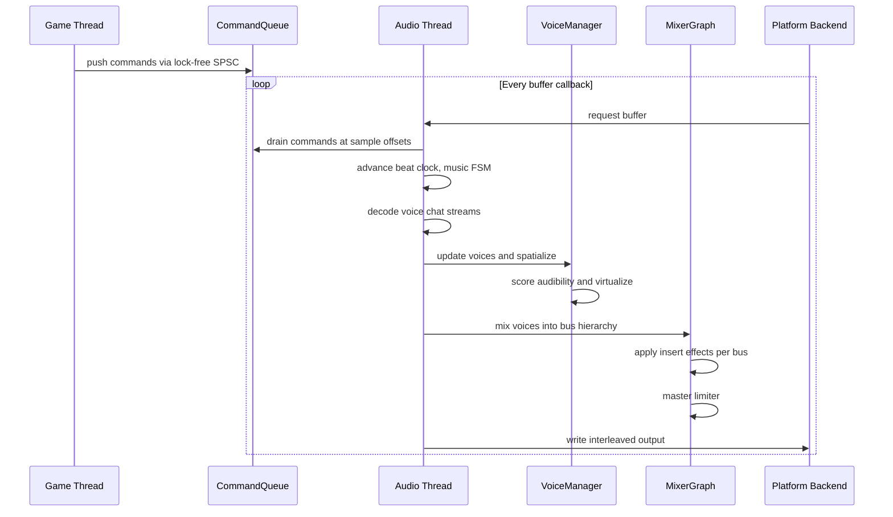

### Frame Lifecycle

Each game frame, the ECS systems synchronize component state with the audio thread:

1. `audio_sync_system` detects new/changed `AudioSource` components and issues `Play`, `Stop`, or
   `SetParam`.
2. `spatial_update_system` reads `Transform` for active sources and listeners, pushes spatial
   commands.
3. `occlusion_system` ray-casts through the shared BVH and pushes occlusion parameters.
4. `propagation_system` (async, reduced rate) runs the portal/ray solver and writes results to a
   lock-free snapshot buffer.
5. `reverb_zone_system` determines active zones and blend weights for the listener.
6. `audio_command_system` pushes music, voice chat, and dialogue commands.

The audio thread runs independently. Each callback:

1. Drains the command queue at sample offsets.
2. Advances the beat clock and music state machine.
3. Decodes voice chat Opus streams and generates visemes.
4. For each active voice: decodes samples, applies spatial parameters, writes into the target bus
   buffer.
5. Processes the mixer graph leaves-first: applies insert effects, accumulates into parent buses.
6. Applies the master bus limiter.
7. Writes the final buffer to the platform backend.

### Lock-Free Communication

All game-to-audio communication uses lock-free structures:

- **Command queue** -- SPSC ring buffer. Game thread writes, audio thread reads. No mutex.
- **Propagation results** -- double-buffered atomic swap. Solver writes buffer A while audio reads
  buffer B.
- **Voice state feedback** -- atomic reads of voice state and playback position for the game thread.
- **Voice network** -- bounded MPSC lock-free queue carries incoming Opus packets indexed by player
  ID.

### Streaming I/O

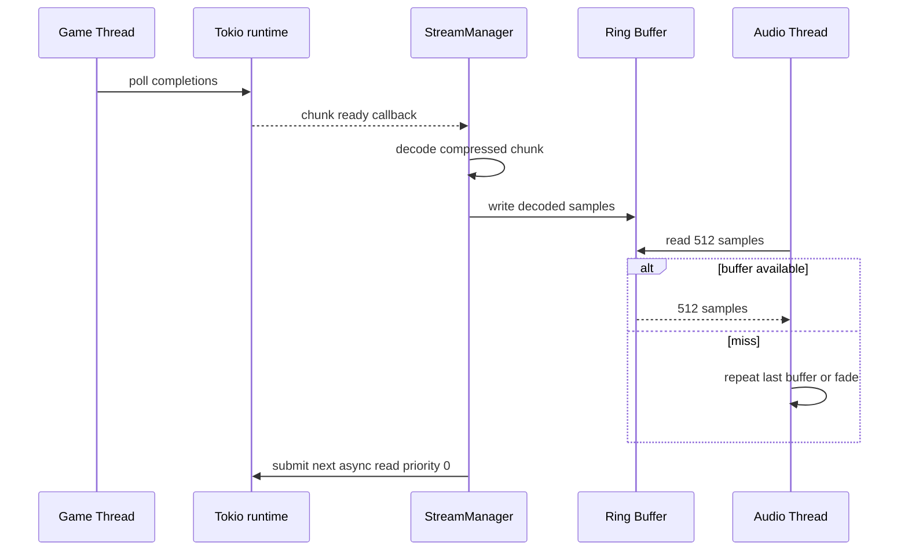

| Parameter | Value |
|-----------|-------|
| Min prefetch depth | 3 buffers |
| Max prefetch depth | 8 buffers |
| Refill trigger | Available < 4 buffers |
| Sample rate | 48,000 Hz |
| Block size | 512 samples |

### Intensity-Driven Adaptive Music

The `IntensityParam` resource maps a single `f32` (0.0-1.0) through authored curves to
simultaneously control:

- **VerticalRemixer** -- per-stem volume via `IntensityCurve`
- **SegmentGraph** -- edge conditions using intensity as a gameplay state parameter
- **StingerScheduler** -- probability multiplier for stinger triggers

## Platform Considerations

### Audio Backends

| Platform | Backend | API |
|----------|---------|-----|
| Windows | WASAPI | `IAudioClient` |
| macOS | CoreAudio | `AudioUnit` via swift-bridge |
| Linux | ALSA/PipeWire | `snd_pcm_*` / PipeWire |

### Microphone Capture

| Platform | API |
|----------|-----|
| Windows | WASAPI `IAudioCaptureClient` |
| macOS | CoreAudio / AVAudioEngine |
| Linux | PipeWire / ALSA |
| iOS | AVAudioSession (system AEC) |
| Android | AAudio (system AEC) |

### Streaming I/O Backends

| Platform | I/O | Notes |
|----------|-----|-------|
| Windows | Tokio (IOCP) | Tokio poll at frame boundary |
| macOS | Tokio (kqueue) | Tokio poll at frame boundary |
| Linux | Tokio (epoll) | Tokio poll at frame boundary |

### Voice Pool and DSP Tier Scaling

| Component | Mobile | Switch | Desktop |
|-----------|--------|--------|---------|
| Real voices | 32 | 64 | 128-256 |
| Virtual voices | 64 | 128 | 128-256 |
| Stream slots | 4 | 8 | 16-32 |
| Occlusion rays | 1 | 2 | 4 |
| EQ bands/bus | 4 | 6 | 8 |
| FDN delay lines | 4 | 8 | 16 |
| Convolution IR | N/A | 0.5 s | 2 s+ |
| DSP chain nodes | 8-12 | 16-24 | 32+ |
| Pitch algorithm | OLA | OLA | Phase-vocoder |
| Music stems | 4-6 | 8 | 12+ |
| Lip-synced chars | 1-2 | 4 | 8+ |
| Ambisonics order | First | First | Third |
| Max reverb zones | 2 | 4 | 6+ |

### AEC Platform Delegation

| Platform | AEC Source |
|----------|-----------|
| Windows/macOS/Linux | Custom NLMS + NLP |
| iOS | System AEC (AVAudioSession) |
| Android | System AEC (AAudio) |

### Propagation Solver Scaling

| Tier | Mode | Update Rate | Bounces |
|------|------|-------------|---------|
| Mobile | Portal only | 4-8 frames | 0 |
| Switch | Portal + 1-bounce | 2-4 frames | 1 |
| Desktop | Portal + multi | 1-2 frames | 3+ |

### Proposed Dependencies

| Crate | Purpose |
|-------|---------|
| `lewton` | Vorbis decoding (pure Rust) |
| `opus` | Opus encode/decode (libopus FFI) |
| `claxon` | FLAC decoding (pure Rust) |
| `hound` | WAV/PCM reading (pure Rust) |
| `rustfft` | FFT for convolution / pitch shift |
| `sofar` | SOFA HRTF file loading |
| `crossbeam-utils` | CachePadded, Backoff |
| `smallvec` | Inline bus child lists |
| `windows-rs` | WASAPI bindings |
| `swift-bridge` | Swift CoreAudio FFI |

## Safety Invariants

1. **AudioEffect match arms** -- `process` and `reset` must exhaustively match all variants. No
   wildcard `_ =>` arms. Adding a new variant with a wildcard silently produces silence.
2. **SPSC ring buffer ordering** -- Write cursor uses `Release` store; read cursor uses `Acquire`
   load. `Relaxed` ordering causes torn reads.
3. **Command queue backpressure** -- `CommandSender::send` returns `Err` when full. Stop/Pause
   commands have higher priority than Play when near full. Log a warning on drop.

## Test Plan

Full test cases are in the companion file [audio-test-cases.md](audio-test-cases.md).

### Unit Tests

| Test | Req |
|------|-----|
| `test_voice_alloc_and_release` | R-5.1.4 |
| `test_voice_priority_stealing` | R-5.1.4 |
| `test_voice_virtualize_restore` | R-5.1.4 |
| `test_mixer_gain_inheritance` | R-5.1.3 |
| `test_mixer_mute_propagation` | R-5.1.3 |
| `test_mixer_solo` | R-5.1.3 |
| `test_mixer_dag_topological` | R-5.1.3 |
| `test_command_queue_spsc` | R-5.1.6 |
| `test_sample_accurate_sched` | R-5.1.6 |
| `test_codec_pcm_decode` | R-5.1.7 |
| `test_codec_vorbis_decode` | R-5.1.7 |
| `test_codec_opus_decode` | R-5.1.7 |
| `test_codec_flac_decode` | R-5.1.7 |
| `test_attenuation_models` | R-5.2.2 |
| `test_doppler_pitch` | R-5.2.1 |
| `test_occlusion_single_ray` | R-5.2.5 |
| `test_hrtf_load_sofa` | R-5.2.3 |
| `test_ambisonics_encode` | R-5.2.4 |
| `test_ambisonics_decode` | R-5.2.4 |
| `test_reverb_zone_blending` | R-5.2.7 |
| `test_stream_ring_buffer` | R-5.1.5 |
| `test_biquad_lp_response` | R-5.3.1 |
| `test_biquad_no_zipper` | R-5.3.1 |
| `test_eq_8_band_accuracy` | R-5.3.2 |
| `test_fdn_decay_time` | R-5.3.3 |
| `test_convolution_accuracy` | R-5.3.4 |
| `test_compressor_curve` | R-5.3.5 |
| `test_limiter_clipping` | R-5.3.5 |
| `test_delay_echo_timing` | R-5.3.6 |
| `test_pitch_shift_accuracy` | R-5.3.7 |
| `test_custom_node_gain` | R-5.3.8 |
| `test_beat_clock_accuracy` | R-5.4.4 |
| `test_stem_sync` | R-5.4.1 |
| `test_bar_quantized_transition` | R-5.4.2 |
| `test_stinger_cooldown` | R-5.4.5 |
| `test_playlist_non_repeat` | R-5.4.6 |
| `test_intensity_clamping` | R-5.4.7 |
| `test_opus_encode_decode` | R-5.5.1 |
| `test_jitter_buffer_adaptive` | R-5.5.2 |
| `test_vad_gates_silence` | R-5.5.3 |
| `test_aec_erle` | R-5.5.9 |
| `test_viseme_timing` | R-5.5.5 |
| `test_dialogue_priority` | R-5.5.6 |

### Integration Tests

| Test | Req |
|------|-----|
| `test_end_to_end_latency` | R-5.1.NF4 |
| `test_streaming_platform_io` | R-5.1.5 |
| `test_full_mix_no_underrun` | R-5.1.NF2 |
| `test_propagation_async` | R-5.2.6 |
| `test_multi_listener` | R-5.1.2 |
| `test_full_dsp_chain_64_voices` | R-5.3.NF1 |
| `test_music_zone_transition` | R-5.4.NF1 |
| `test_voice_32_streams` | R-5.5.NF2 |
| `test_voice_e2e_latency` | R-5.5.NF1 |
| `test_intensity_drives_all` | R-5.4.7 |
| `test_channel_isolation` | R-5.5.8 |

### Benchmarks

| Benchmark | Target | Source |
|-----------|--------|--------|
| Audio callback 256 voices | < 0.5 ms p99 | R-5.1.NF1 |
| Per-voice spatialization | < 2 us p99 | R-5.2.NF1 |
| Propagation solver | < 4 ms p99 | R-5.2.NF2 |
| Command queue throughput | > 100K cmd/s | R-5.1.6 |
| 4-insert DSP chain/voice | < 1 us/sample | R-5.3.NF1 |
| Beat clock tick/buffer | < 1 us | R-5.4.4 |
| Music transition res | < 10 us | R-5.4.NF1 |
| Opus encode/frame | < 500 us | F-5.5.1 |
| Opus decode/frame | < 200 us | F-5.5.1 |
| AEC processing/buffer | < 1 ms | R-5.5.9 |
| Viseme gen/frame | < 100 us | F-5.5.5 |
| Audio memory (max cfg) | < 64 MiB | R-5.1.NF3 |

## Open Questions

1. **WASAPI exclusive vs shared mode** -- Default to shared with opt-in for exclusive, or
   exclusive-first with shared fallback?
2. **HRTF convolution block size** -- Optimal block size depends on the latency budget (128-512
   taps).
3. **Ambisonics bypass for stereo** -- Skip Ambisonics encode/decode for stereo-only output?
4. **Propagation update rate** -- Fixed 10 Hz vs adaptive rate based on listener movement speed?
5. **FFT library** -- `rustfft` vs `realfft` vs platform SIMD FFT (vDSP on macOS)?
6. **Opus crate** -- `opus` (libopus FFI) vs `audiopus` (higher-level wrapper)?
7. **Voice network protocol** -- Reuse engine transport (F-8.1.1) or separate UDP channel for voice?
8. **Viseme model** -- Energy-band analysis vs small ML phoneme classifier?
9. **Convolution IR streaming** -- Sync first partition + stream remaining, or require full IR
   before playback?
10. **Sidechain compression** -- Model sidechain as a separate routing mechanism or `BusId`
    reference?
11. **Console voice APIs** -- PlayStation/Xbox require platform-native party chat; boundary between
    engine and platform channels needs per-console investigation.
12. **Platform hardware decoders** -- Apple Audio Toolbox can decode AAC in hardware; how does this
    interact with the streaming pipeline?
