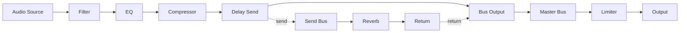
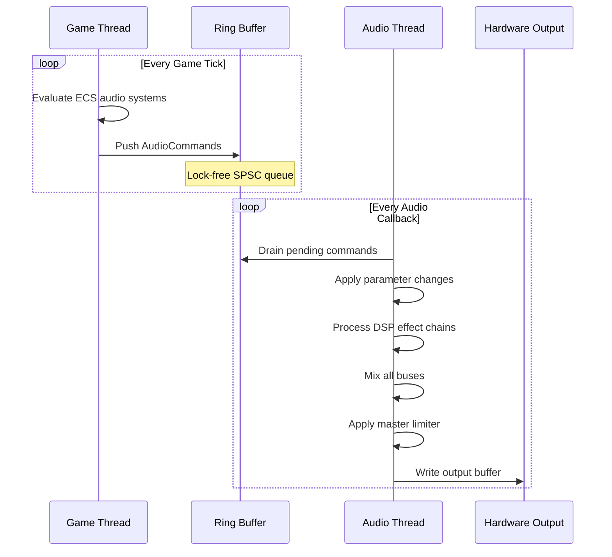
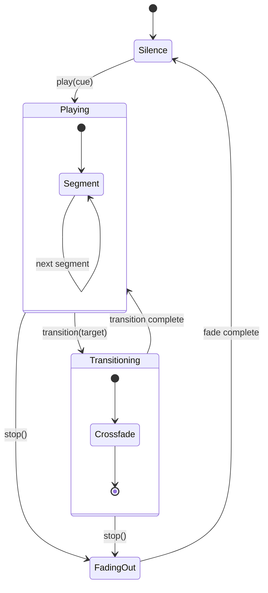
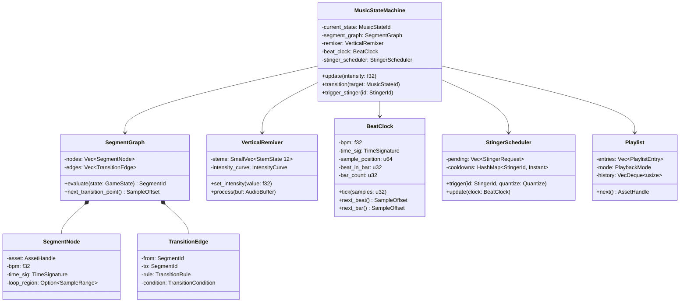
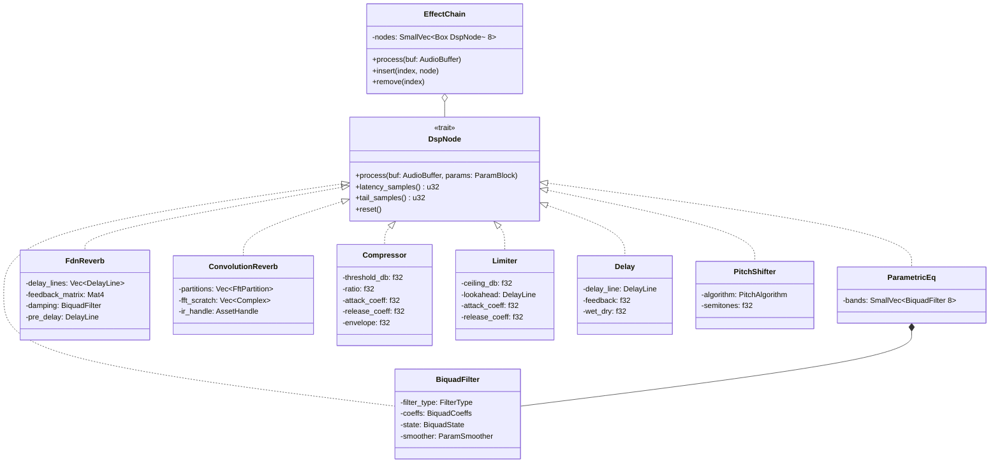
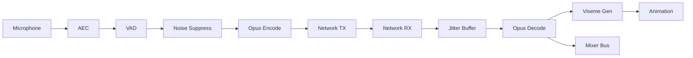

# DSP Effects, Adaptive Music, and Voice Chat Design

## Requirements Trace

> **Canonical sources:** Features, requirements, and user stories are defined in
> [features/audio/](../../features/audio/), [requirements/audio/](../../requirements/audio/), and
> [user-stories/audio/](../../user-stories/audio/). The table below traces design elements to those
> definitions.

### DSP & Effects (5.3)

| Feature | Requirement |
|---------|-------------|
| F-5.3.1 | R-5.3.1     |
| F-5.3.2 | R-5.3.2     |
| F-5.3.3 | R-5.3.3     |
| F-5.3.4 | R-5.3.4     |
| F-5.3.5 | R-5.3.5     |
| F-5.3.6 | R-5.3.6     |
| F-5.3.7 | R-5.3.7     |
| F-5.3.8 | R-5.3.8     |

1. **F-5.3.1** — Biquad filters (LP, HP, BP, notch) with per-sample coefficient smoothing
2. **F-5.3.2** — Multi-band parametric EQ (up to 8 bands) per bus
3. **F-5.3.3** — Algorithmic reverb via feedback delay network
4. **F-5.3.4** — Convolution reverb with partitioned FFT, streamed IRs
5. **F-5.3.5** — Compressor / limiter with look-ahead on master bus
6. **F-5.3.6** — Delay, chorus, and flanger via modulated delay lines
7. **F-5.3.7** — Pitch shifting (phase-vocoder desktop, OLA mobile)
8. **F-5.3.8** — Custom DSP node registry with stateless process callbacks

### Adaptive Music (5.4)

| Feature | Requirement |
|---------|-------------|
| F-5.4.1 | R-5.4.1     |
| F-5.4.2 | R-5.4.2     |
| F-5.4.3 | R-5.4.3     |
| F-5.4.4 | R-5.4.4     |
| F-5.4.5 | R-5.4.5     |
| F-5.4.6 | R-5.4.6     |
| F-5.4.7 | R-5.4.7     |

1. **F-5.4.1** — Vertical re-mixing with synchronized stems
2. **F-5.4.2** — Horizontal re-sequencing via segment directed graph
3. **F-5.4.3** — Transition rules: cut, crossfade, beat-sync, custom curve
4. **F-5.4.4** — Tempo / beat clock with beat and bar events
5. **F-5.4.5** — Stinger playback with cooldowns and priority ducking
6. **F-5.4.6** — Playlists with weighted randomization and non-repeat
7. **F-5.4.7** — Dynamic intensity parameter (0.0-1.0) driving all music systems

### Voice & Speech (5.5)

| Feature | Requirement |
|---------|-------------|
| F-5.5.1 | R-5.5.1     |
| F-5.5.2 | R-5.5.2     |
| F-5.5.3 | R-5.5.3     |
| F-5.5.4 | R-5.5.4     |
| F-5.5.5 | R-5.5.5     |
| F-5.5.6 | R-5.5.6     |
| F-5.5.7 | R-5.5.7     |
| F-5.5.8 | R-5.5.8     |
| F-5.5.9 | R-5.5.9     |

1. **F-5.5.1** — Opus voice chat codec (6-64 kbps), platform-native mic capture
2. **F-5.5.2** — Adaptive jitter buffer with Opus PLC
3. **F-5.5.3** — Voice activity detection and noise suppression
4. **F-5.5.4** — Text-to-speech via platform-native APIs
5. **F-5.5.5** — Viseme generation for lip sync (pre-recorded and live)
6. **F-5.5.6** — Dialogue playback with priority queue and subtitles
7. **F-5.5.7** — Branching dialogue graph with condition-gated edges
8. **F-5.5.8** — Voice chat channel management (proximity, party, raid, etc.)
9. **F-5.5.9** — Acoustic echo cancellation with comfort noise

### Non-Functional Requirements

| Requirement |
|-------------|
| R-5.3.NF1   |
| R-5.4.NF1   |
| R-5.5.NF1   |
| R-5.5.NF2   |

1. **R-5.3.NF1** — 4-insert DSP chain per voice < 1 us/sample at 48 kHz
   - **Verification:** Benchmark 64 voices, 10k callbacks, p99 < 1 us
2. **R-5.4.NF1** — Music transition within one beat, no gap/click/phase error
   - **Verification:** Integration test: random-point transition, assert next-bar +/- 1 sample
3. **R-5.5.NF1** — Voice chat end-to-end latency < 150 ms (< 50 ms RTT)
   - **Verification:** Loopback test with 50 ms simulated RTT
4. **R-5.5.NF2** — Decode and mix >= 32 simultaneous voice streams
   - **Verification:** Stress test: 32 Opus streams at 24 kbps, 60 s, no underruns

## Overview

This document covers three tightly coupled audio subsystems:

1. **DSP & Effects** -- a node-based effect processing pipeline inserted into the mixer bus
   hierarchy.
2. **Adaptive Music** -- a state-machine-driven music system with vertical re-mixing, horizontal
   re-sequencing, beat-synced transitions, and stingers.
3. **Voice Chat** -- capture, encode, transmit, decode, and spatialize player voice with AEC, VAD,
   noise suppression, and lip sync viseme generation.

All three run primarily on a dedicated **audio thread** that communicates with the game thread
through a lock-free SPSC ring buffer. ECS components and resources on the game thread describe the
desired audio state; ECS systems serialize commands into the ring buffer each tick. The audio thread
drains commands at the top of every callback, applies parameter changes, processes DSP chains,
advances the music state machine, decodes voice streams, mixes all buses, and writes the final
buffer to hardware.

## Architecture

### Module Boundaries

```mermaid
graph TD
    subgraph "harmonius_audio::dsp"
        BQ[BiquadFilter]
        EQ[ParametricEq]
        RV[AlgorithmicReverb]
        CV[ConvolutionReverb]
        DY[Compressor / Limiter]
        DL[Delay / Chorus / Flanger]
        PS[PitchShifter]
        NR[DspNodeRegistry]
        EC[EffectChain]
    end

    subgraph "harmonius_audio::music"
        BC[BeatClock]
        SM[MusicStateMachine]
        SG[SegmentGraph]
        VR[VerticalRemixer]
        ST[StingerScheduler]
        PL[Playlist]
        IP[IntensityParam]
    end

    subgraph "harmonius_audio::voice"
        MC[MicCapture]
        OE[OpusEncoder]
        OD[OpusDecoder]
        JB[JitterBuffer]
        VA[VoiceActivityDetector]
        NS[NoiseSuppressor]
        AE[AcousticEchoCanceller]
        VS[VisemeGenerator]
        CH[ChannelManager]
    end

    subgraph "harmonius_audio::core"
        MB[MixerBus]
        VM[VoiceManager]
        SC[SampleScheduler]
        SR[StreamReader]
    end

    subgraph "harmonius_ecs"
        W[World]
    end

    EC --> BQ
    EC --> EQ
    EC --> RV
    EC --> CV
    EC --> DY
    EC --> DL
    EC --> PS
    EC --> NR

    SM --> SG
    SM --> VR
    SM --> ST
    SM --> BC
    SM --> PL
    IP --> VR
    IP --> SG
    IP --> ST

    MC --> VA
    VA --> NS
    NS --> OE
    OD --> JB
    MC --> AE

    EC -.-> MB
    SM -.-> SC
    VR -.-> SC
    OD -.-> MB
    VS -.-> W
    CH -.-> MB
```



### File Layout

```text
harmonius_audio/
├── dsp/
│   ├── node.rs          # DspNode trait, AudioBuffer,
│   │                    # ParamBlock
│   ├── chain.rs         # EffectChain, insert/remove
│   ├── registry.rs      # DspNodeRegistry (custom
│   │                    # nodes)
│   ├── biquad.rs        # BiquadFilter, FilterType,
│   │                    # ParamSmoother
│   ├── eq.rs            # ParametricEq, EqBand
│   ├── reverb_fdn.rs    # FdnReverb, DelayLine,
│   │                    # feedback matrix
│   ├── reverb_conv.rs   # ConvolutionReverb,
│   │                    # FftPartition
│   ├── dynamics.rs      # Compressor, Limiter,
│   │                    # envelope follower
│   ├── delay.rs         # Delay, Chorus, Flanger
│   └── pitch.rs         # PitchShifter,
│                        # PhaseVocoder, OlaShifter
├── music/
│   ├── state_machine.rs # MusicStateMachine,
│   │                    # MusicState
│   ├── segment.rs       # SegmentGraph, SegmentNode,
│   │                    # TransitionEdge
│   ├── remixer.rs       # VerticalRemixer, StemState
│   ├── beat_clock.rs    # BeatClock, TimeSignature,
│   │                    # BeatEvent
│   ├── stinger.rs       # StingerScheduler,
│   │                    # StingerRequest
│   ├── playlist.rs      # Playlist, PlaybackMode,
│   │                    # PlaylistEntry
│   └── intensity.rs     # IntensityParam,
│                        # IntensityCurve
├── voice/
│   ├── capture.rs       # MicCapture platform
│   │                    # backends
│   ├── opus.rs          # OpusEncoder, OpusDecoder
│   ├── jitter.rs        # JitterBuffer, adaptive
│   │                    # depth
│   ├── vad.rs           # VoiceActivityDetector
│   ├── noise.rs         # NoiseSuppressor
│   ├── aec.rs           # AcousticEchoCanceller,
│   │                    # NLMS filter
│   ├── viseme.rs        # VisemeGenerator,
│   │                    # VisemeTrack
│   ├── channel.rs       # ChannelManager,
│   │                    # VoiceChannel
│   └── dialogue.rs      # DialogueQueue,
│                        # DialogueGraph
└── ecs/
    ├── components.rs    # All audio ECS components
    ├── resources.rs     # All audio ECS resources
    └── systems.rs       # Audio ECS systems
```

### DSP Effect Chain Signal Flow



### Lock-Free Audio Thread Communication



### Music State Machine



### Adaptive Music Data Structures



### DSP Node Hierarchy



### Voice Chat Pipeline



## API Design

### Audio Buffer Primitives

```rust
/// Interleaved or deinterleaved audio buffer
/// passed through DSP chains. Borrows memory
/// from a pre-allocated buffer pool.
pub struct AudioBuffer<'a> {
    /// Channel data (deinterleaved).
    pub channels: &'a mut [&'a mut [f32]],
    /// Number of frames in each channel.
    pub frame_count: u32,
    /// Sample rate in Hz (typically 48000).
    pub sample_rate: u32,
}

/// Named parameter bag passed to DSP nodes.
/// Parameters are smoothed per-sample to avoid
/// zipper noise.
pub struct ParamBlock {
    entries: SmallVec<[ParamEntry; 8]>,
}

pub struct ParamEntry {
    pub id: ParamId,
    pub current: f32,
    pub target: f32,
    pub smoothing_samples: u32,
}

#[derive(
    Clone, Copy, Debug, PartialEq, Eq, Hash,
)]
pub struct ParamId(pub u32);
```

### DspNode Trait and Effect Chain

```rust
/// Trait implemented by all DSP processing nodes.
/// Nodes are stateless with respect to the caller:
/// internal state (filter memory, delay lines) is
/// encapsulated. The `process` method is called on
/// the audio thread and must be real-time safe (no
/// allocation, no locks, no I/O).
pub trait DspNode: Send {
    /// Process audio in place.
    fn process(
        &mut self,
        buf: &mut AudioBuffer<'_>,
        params: &ParamBlock,
    );

    /// Latency introduced by this node in samples.
    fn latency_samples(&self) -> u32 { 0 }

    /// Tail length: samples of output produced
    /// after input goes silent (reverb tail, delay
    /// feedback). Used by the mixer to avoid
    /// premature voice recycling.
    fn tail_samples(&self) -> u32 { 0 }

    /// Reset internal state (filter memory, delay
    /// lines). Called when the node is reused for a
    /// different voice or after a seek.
    fn reset(&mut self);
}

/// An ordered chain of DSP nodes inserted on a
/// mixer bus. Processes nodes sequentially in
/// insert order. The chain owns its nodes and
/// supports runtime insert/remove without
/// reallocation when within inline capacity.
pub struct EffectChain {
    nodes: SmallVec<[DspNodeKind; 8]>,
}

impl EffectChain {
    pub fn new() -> Self;

    /// Process all nodes in sequence.
    pub fn process(
        &mut self,
        buf: &mut AudioBuffer<'_>,
        params: &[ParamBlock],
    );

    /// Insert a node at the given index.
    pub fn insert(
        &mut self,
        index: usize,
        node: DspNodeKind,
    );

    /// Remove and return the node at the given
    /// index.
    pub fn remove(
        &mut self,
        index: usize,
    ) -> DspNodeKind;

    pub fn len(&self) -> usize;

    /// Total latency of the chain in samples.
    pub fn total_latency(&self) -> u32;

    /// Maximum tail length across all nodes.
    pub fn max_tail(&self) -> u32;

    /// Reset all nodes in the chain.
    pub fn reset(&mut self);
}
```

### Biquad Filter

```rust
#[derive(Clone, Copy, Debug, PartialEq, Eq)]
pub enum FilterType {
    LowPass,
    HighPass,
    BandPass,
    Notch,
}

/// Second-order IIR biquad filter coefficients.
pub struct BiquadCoeffs {
    pub b0: f32,
    pub b1: f32,
    pub b2: f32,
    pub a1: f32,
    pub a2: f32,
}

impl BiquadCoeffs {
    /// Compute coefficients for the given filter
    /// type, cutoff frequency, resonance (Q), and
    /// gain.
    pub fn compute(
        filter_type: FilterType,
        sample_rate: f32,
        cutoff_hz: f32,
        q: f32,
        gain_db: f32,
    ) -> Self;
}

/// Per-channel filter state (transposed direct
/// form II).
struct BiquadState {
    s1: f32,
    s2: f32,
}

/// Per-sample coefficient smoother to eliminate
/// zipper noise during parameter automation.
struct ParamSmoother {
    current: f32,
    target: f32,
    increment: f32,
    remaining: u32,
}

impl ParamSmoother {
    pub fn set_target(
        &mut self,
        target: f32,
        duration_samples: u32,
    );

    /// Advance one sample and return the smoothed
    /// value.
    pub fn next(&mut self) -> f32;
}

/// Biquad filter DSP node. Supports LP, HP, BP,
/// and notch with per-sample coefficient smoothing.
pub struct BiquadFilter {
    filter_type: FilterType,
    coeffs: BiquadCoeffs,
    target_coeffs: BiquadCoeffs,
    state: Vec<BiquadState>,
    cutoff_smoother: ParamSmoother,
    q_smoother: ParamSmoother,
    gain_smoother: ParamSmoother,
}

impl BiquadFilter {
    pub fn new(
        filter_type: FilterType,
        sample_rate: f32,
        cutoff_hz: f32,
        q: f32,
        gain_db: f32,
        channels: u32,
    ) -> Self;

    pub fn set_cutoff(&mut self, hz: f32);
    pub fn set_q(&mut self, q: f32);
    pub fn set_gain_db(&mut self, db: f32);
}

impl DspNode for BiquadFilter {
    fn process(
        &mut self,
        buf: &mut AudioBuffer<'_>,
        params: &ParamBlock,
    );

    fn reset(&mut self);
}
```

### Parametric Equalizer

```rust
#[derive(Clone, Copy, Debug, PartialEq, Eq)]
pub enum EqBandShape {
    Peak,
    LowShelf,
    HighShelf,
    LowPass,
    HighPass,
}

pub struct EqBand {
    pub shape: EqBandShape,
    pub frequency_hz: f32,
    pub gain_db: f32,
    pub q: f32,
}

/// Multi-band parametric EQ. Up to 8 bands.
/// Band count scales per platform tier:
/// mobile 4, Switch 6, desktop 8.
pub struct ParametricEq {
    bands: SmallVec<[BiquadFilter; 8]>,
    max_bands: u32,
}

impl ParametricEq {
    pub fn new(
        sample_rate: f32,
        bands: &[EqBand],
        max_bands: u32,
        channels: u32,
    ) -> Self;

    pub fn set_band(
        &mut self,
        index: usize,
        band: &EqBand,
    );

    pub fn band_count(&self) -> usize;
}

impl DspNode for ParametricEq {
    fn process(
        &mut self,
        buf: &mut AudioBuffer<'_>,
        params: &ParamBlock,
    );

    fn reset(&mut self);
}
```

### Algorithmic Reverb (FDN)

```rust
/// Feedback delay network reverb. Delay line
/// count scales per platform: mobile 4, Switch 8,
/// desktop 16.
pub struct FdnReverb {
    delay_lines: Vec<DelayLine>,
    feedback_matrix: Vec<f32>,
    damping_filters: Vec<BiquadFilter>,
    pre_delay: DelayLine,
    diffusion: f32,
    decay_time: f32,
    wet_dry: f32,
}

/// Circular buffer delay line with fractional
/// sample interpolation.
pub struct DelayLine {
    buffer: Vec<f32>,
    write_pos: usize,
    length: usize,
}

impl DelayLine {
    pub fn new(max_samples: usize) -> Self;
    pub fn write(&mut self, sample: f32);
    pub fn read(&self, delay: f32) -> f32;
    pub fn reset(&mut self);
}

impl FdnReverb {
    pub fn new(
        sample_rate: f32,
        delay_line_count: u32,
        pre_delay_ms: f32,
        decay_time_s: f32,
        diffusion: f32,
        damping_hz: f32,
        wet_dry: f32,
    ) -> Self;

    pub fn set_decay_time(&mut self, seconds: f32);
    pub fn set_diffusion(&mut self, value: f32);
    pub fn set_damping(&mut self, hz: f32);
    pub fn set_wet_dry(&mut self, mix: f32);
    pub fn set_pre_delay(&mut self, ms: f32);
}

impl DspNode for FdnReverb {
    fn process(
        &mut self,
        buf: &mut AudioBuffer<'_>,
        params: &ParamBlock,
    );

    fn tail_samples(&self) -> u32;
    fn reset(&mut self);
}
```

### Convolution Reverb

```rust
/// FFT partition for overlap-save convolution.
struct FftPartition {
    freq_domain: Vec<Complex>,
    size: usize,
}

/// Partitioned FFT convolution reverb. IR assets
/// are streamed via the asset system. Available on
/// desktop and Switch only. IR length caps:
/// Switch 0.5s, desktop 2s+.
pub struct ConvolutionReverb {
    partitions: Vec<FftPartition>,
    input_buffer: Vec<f32>,
    output_accum: Vec<f32>,
    fft_scratch: Vec<Complex>,
    partition_size: usize,
    current_partition: usize,
    wet_dry: f32,
    ir_handle: AssetHandle,
}

impl ConvolutionReverb {
    /// Create from a loaded impulse response.
    /// Partitions the IR into FFT blocks sized to
    /// the audio buffer length, ensuring output
    /// latency does not exceed one buffer period.
    pub fn new(
        ir_data: &[f32],
        sample_rate: f32,
        buffer_size: usize,
        wet_dry: f32,
    ) -> Self;

    pub fn set_wet_dry(&mut self, mix: f32);
}

impl DspNode for ConvolutionReverb {
    fn process(
        &mut self,
        buf: &mut AudioBuffer<'_>,
        params: &ParamBlock,
    );

    fn latency_samples(&self) -> u32;
    fn tail_samples(&self) -> u32;
    fn reset(&mut self);
}
```

### Compressor and Limiter

```rust
/// Per-bus compressor with configurable threshold,
/// ratio, attack, release, knee, and makeup gain.
pub struct Compressor {
    threshold_db: f32,
    ratio: f32,
    attack_coeff: f32,
    release_coeff: f32,
    knee_db: f32,
    makeup_gain_db: f32,
    envelope_db: f32,
    /// Optional sidechain input bus index for
    /// ducking.
    sidechain_bus: Option<BusId>,
}

impl Compressor {
    pub fn new(
        sample_rate: f32,
        threshold_db: f32,
        ratio: f32,
        attack_ms: f32,
        release_ms: f32,
        knee_db: f32,
        makeup_gain_db: f32,
    ) -> Self;

    pub fn set_threshold(&mut self, db: f32);
    pub fn set_ratio(&mut self, ratio: f32);
    pub fn set_attack(&mut self, ms: f32);
    pub fn set_release(&mut self, ms: f32);
    pub fn set_knee(&mut self, db: f32);
    pub fn set_makeup_gain(&mut self, db: f32);
    pub fn set_sidechain(
        &mut self,
        bus: Option<BusId>,
    );
}

impl DspNode for Compressor {
    fn process(
        &mut self,
        buf: &mut AudioBuffer<'_>,
        params: &ParamBlock,
    );

    fn reset(&mut self);
}

/// Look-ahead limiter on the master bus. Prevents
/// output from exceeding the ceiling (0 dBFS
/// default). Uses a delay line equal to the
/// look-ahead window to anticipate transient peaks.
pub struct Limiter {
    ceiling_db: f32,
    lookahead: DelayLine,
    lookahead_ms: f32,
    attack_coeff: f32,
    release_coeff: f32,
    envelope_db: f32,
}

impl Limiter {
    pub fn new(
        sample_rate: f32,
        ceiling_db: f32,
        lookahead_ms: f32,
        release_ms: f32,
    ) -> Self;

    pub fn set_ceiling(&mut self, db: f32);
}

impl DspNode for Limiter {
    fn process(
        &mut self,
        buf: &mut AudioBuffer<'_>,
        params: &ParamBlock,
    );

    fn latency_samples(&self) -> u32;
    fn reset(&mut self);
}
```

### Delay, Chorus, and Flanger

```rust
/// Simple delay with feedback and wet/dry mix.
/// Delay time optionally synced to beat clock.
pub struct Delay {
    delay_line: DelayLine,
    delay_samples: f32,
    feedback: f32,
    wet_dry: f32,
    beat_sync: Option<BeatSyncMode>,
}

#[derive(Clone, Copy, Debug, PartialEq, Eq)]
pub enum BeatSyncMode {
    Quarter,
    Eighth,
    DottedEighth,
    Sixteenth,
    Triplet,
}

impl Delay {
    pub fn new(
        sample_rate: f32,
        max_delay_ms: f32,
        delay_ms: f32,
        feedback: f32,
        wet_dry: f32,
    ) -> Self;

    pub fn set_delay_ms(&mut self, ms: f32);
    pub fn set_feedback(&mut self, value: f32);
    pub fn set_beat_sync(
        &mut self,
        mode: Option<BeatSyncMode>,
    );

    /// Update delay time from beat clock when
    /// beat-synced.
    pub fn sync_to_clock(
        &mut self,
        bpm: f32,
        sample_rate: f32,
    );
}

impl DspNode for Delay {
    fn process(
        &mut self,
        buf: &mut AudioBuffer<'_>,
        params: &ParamBlock,
    );

    fn tail_samples(&self) -> u32;
    fn reset(&mut self);
}

/// Multi-tap modulated delay producing chorus
/// or flanger effect. Short delay + feedback =
/// flanger; longer multi-tap delay = chorus.
pub struct ModulatedDelay {
    delay_line: DelayLine,
    lfo_phase: f32,
    lfo_rate_hz: f32,
    depth_samples: f32,
    base_delay_samples: f32,
    feedback: f32,
    wet_dry: f32,
    tap_count: u32,
}

impl ModulatedDelay {
    pub fn new_chorus(
        sample_rate: f32,
        rate_hz: f32,
        depth_ms: f32,
        wet_dry: f32,
        tap_count: u32,
    ) -> Self;

    pub fn new_flanger(
        sample_rate: f32,
        rate_hz: f32,
        depth_ms: f32,
        feedback: f32,
        wet_dry: f32,
    ) -> Self;

    pub fn set_rate(&mut self, hz: f32);
    pub fn set_depth(&mut self, ms: f32);
}

impl DspNode for ModulatedDelay {
    fn process(
        &mut self,
        buf: &mut AudioBuffer<'_>,
        params: &ParamBlock,
    );

    fn reset(&mut self);
}
```

### Pitch Shifter

```rust
#[derive(Clone, Copy, Debug, PartialEq, Eq)]
pub enum PitchAlgorithm {
    /// Phase-vocoder (desktop): higher fidelity,
    /// higher CPU.
    PhaseVocoder,
    /// Overlap-add (mobile): lower fidelity,
    /// lower CPU.
    OverlapAdd,
}

/// Pitch shifter DSP node. Shifts pitch
/// independently of playback speed within
/// +/- 12 semitones. Algorithm selected per
/// platform tier.
pub struct PitchShifter {
    algorithm: PitchAlgorithm,
    semitones: f32,
    fft_size: usize,
    hop_size: usize,
    /// Phase-vocoder state.
    analysis_phase: Vec<f32>,
    synthesis_phase: Vec<f32>,
    /// OLA state.
    ola_buffer: Vec<f32>,
    ola_position: usize,
}

impl PitchShifter {
    pub fn new(
        algorithm: PitchAlgorithm,
        sample_rate: f32,
        fft_size: usize,
    ) -> Self;

    pub fn set_semitones(&mut self, semitones: f32);
}

impl DspNode for PitchShifter {
    fn process(
        &mut self,
        buf: &mut AudioBuffer<'_>,
        params: &ParamBlock,
    );

    fn latency_samples(&self) -> u32;
    fn reset(&mut self);
}
```

### Custom DSP Node Registry

```rust
/// Type-erased factory function for custom DSP
/// nodes registered by plugins.
pub type DspNodeFactory =
    Box<dyn Fn() -> DspNodeKind + Send + Sync>;

/// Registry for custom DSP node types. Nodes are
/// registered by name and instantiated when
/// inserted into effect chains.
pub struct DspNodeRegistry {
    factories: HashMap<String, DspNodeFactory>,
}

impl DspNodeRegistry {
    pub fn new() -> Self;

    /// Register a custom DSP node factory.
    pub fn register(
        &mut self,
        name: &str,
        factory: DspNodeFactory,
    );

    /// Create an instance of a registered node.
    pub fn create(
        &self,
        name: &str,
    ) -> Option<DspNodeKind>;

    /// List all registered node type names.
    pub fn registered_names(
        &self,
    ) -> Vec<&str>;
}
```

### Beat Clock

```rust
#[derive(
    Clone, Copy, Debug, PartialEq, Eq,
)]
pub struct TimeSignature {
    pub beats_per_bar: u32,
    pub beat_value: u32,
}

/// Beat event published each beat and bar
/// boundary.
#[derive(Clone, Copy, Debug)]
pub enum BeatEvent {
    Beat {
        bar: u32,
        beat_in_bar: u32,
        sample_offset: u64,
    },
    Bar {
        bar: u32,
        sample_offset: u64,
    },
}

/// Global music clock tracking tempo, time
/// signature, and current position. Publishes
/// beat and bar events consumed by the transition
/// system, stinger scheduler, and gameplay code.
pub struct BeatClock {
    bpm: f32,
    time_sig: TimeSignature,
    sample_rate: f32,
    /// Absolute sample position since playback
    /// started.
    sample_position: u64,
    beat_in_bar: u32,
    bar_count: u32,
    /// Samples per beat at current tempo.
    samples_per_beat: f64,
    /// Accumulated fractional samples for
    /// sub-sample accuracy.
    fractional_accum: f64,
    /// Pending events for the current buffer.
    pending_events: SmallVec<[BeatEvent; 8]>,
}

impl BeatClock {
    pub fn new(
        bpm: f32,
        time_sig: TimeSignature,
        sample_rate: f32,
    ) -> Self;

    /// Advance the clock by the given number of
    /// samples. Emits BeatEvents for any beat or
    /// bar boundaries crossed.
    pub fn tick(
        &mut self,
        samples: u32,
    ) -> &[BeatEvent];

    pub fn set_bpm(&mut self, bpm: f32);
    pub fn set_time_signature(
        &mut self,
        sig: TimeSignature,
    );

    /// Sample offset to the next beat boundary.
    pub fn samples_to_next_beat(&self) -> u32;

    /// Sample offset to the next bar boundary.
    pub fn samples_to_next_bar(&self) -> u32;

    pub fn current_beat(&self) -> u32;
    pub fn current_bar(&self) -> u32;
    pub fn bpm(&self) -> f32;
}
```

### Segment Graph and Transitions

```rust
#[derive(
    Clone, Copy, Debug, PartialEq, Eq, Hash,
)]
pub struct SegmentId(pub u32);

#[derive(
    Clone, Copy, Debug, PartialEq, Eq, Hash,
)]
pub struct MusicStateId(pub u32);

/// A node in the music segment graph.
pub struct SegmentNode {
    pub id: SegmentId,
    pub asset: AssetHandle,
    pub bpm: f32,
    pub time_sig: TimeSignature,
    pub loop_region: Option<SampleRange>,
}

pub struct SampleRange {
    pub start: u64,
    pub end: u64,
}

#[derive(Clone, Copy, Debug, PartialEq, Eq)]
pub enum TransitionRule {
    /// Immediate hard cut.
    ImmediateCut,
    /// Timed linear crossfade over duration.
    TimedCrossfade { duration_ms: u32 },
    /// Crossfade beginning on the next beat.
    BeatSyncCrossfade { duration_beats: u32 },
    /// Switch at the next bar boundary.
    NextBar,
    /// Custom authored fade curve.
    CustomCurve { curve_id: AssetHandle },
}

/// Condition evaluated against gameplay state
/// to determine if a transition edge is active.
pub struct TransitionCondition {
    pub parameter: String,
    pub op: CompareOp,
    pub value: f32,
}

#[derive(Clone, Copy, Debug, PartialEq, Eq)]
pub enum CompareOp {
    Equal,
    NotEqual,
    LessThan,
    GreaterThan,
    LessOrEqual,
    GreaterOrEqual,
}

pub struct TransitionEdge {
    pub from: SegmentId,
    pub to: SegmentId,
    pub rule: TransitionRule,
    pub conditions: SmallVec<
        [TransitionCondition; 4]
    >,
    pub priority: u32,
}

/// Directed graph of music segments with
/// condition-gated transition edges.
pub struct SegmentGraph {
    nodes: Vec<SegmentNode>,
    edges: Vec<TransitionEdge>,
}

impl SegmentGraph {
    pub fn new() -> Self;

    pub fn add_node(
        &mut self,
        node: SegmentNode,
    ) -> SegmentId;

    pub fn add_edge(
        &mut self,
        edge: TransitionEdge,
    );

    /// Evaluate all outgoing edges from the
    /// current segment against game state and
    /// return the best matching target.
    pub fn evaluate(
        &self,
        current: SegmentId,
        game_state: &GameStateSnapshot,
    ) -> Option<(SegmentId, &TransitionRule)>;

    pub fn node(
        &self,
        id: SegmentId,
    ) -> &SegmentNode;
}
```

### Vertical Remixer

```rust
/// Per-stem playback state.
pub struct StemState {
    pub asset: AssetHandle,
    pub volume: f32,
    pub target_volume: f32,
    pub fade_rate: f32,
    pub sample_position: u64,
}

/// Intensity-to-volume mapping curve. Maps
/// normalized intensity [0.0, 1.0] to per-stem
/// volume.
pub struct IntensityCurve {
    /// (intensity, volume) control points.
    points: Vec<(f32, f32)>,
}

impl IntensityCurve {
    pub fn evaluate(&self, intensity: f32) -> f32;
}

/// Vertical re-mixer: plays synchronized stems
/// and crossfades volumes based on intensity.
/// Stem count per tier: mobile 4-6, Switch 8,
/// desktop 12+.
pub struct VerticalRemixer {
    stems: SmallVec<[StemState; 12]>,
    intensity_curves: Vec<IntensityCurve>,
    max_stems: u32,
    sample_rate: f32,
}

impl VerticalRemixer {
    pub fn new(
        stems: &[AssetHandle],
        curves: &[IntensityCurve],
        sample_rate: f32,
        max_stems: u32,
    ) -> Self;

    /// Update stem volumes from the intensity
    /// parameter.
    pub fn set_intensity(&mut self, value: f32);

    /// Mix all stems sample-aligned into the
    /// output buffer.
    pub fn process(
        &mut self,
        buf: &mut AudioBuffer<'_>,
    );

    /// Verify all stems remain sample-aligned.
    pub fn is_synchronized(&self) -> bool;
}
```

### Stinger Scheduler

```rust
#[derive(
    Clone, Copy, Debug, PartialEq, Eq, Hash,
)]
pub struct StingerId(pub u32);

#[derive(Clone, Copy, Debug, PartialEq, Eq)]
pub enum Quantize {
    Immediate,
    NextBeat,
    NextBar,
}

pub struct StingerRequest {
    pub id: StingerId,
    pub asset: AssetHandle,
    pub quantize: Quantize,
    pub priority: u32,
    pub duck_amount_db: f32,
    pub cooldown_ms: u32,
}

/// Schedules and plays stingers (short musical
/// phrases) triggered by gameplay events.
/// Enforces cooldowns and priority-based ducking
/// to prevent pile-up.
pub struct StingerScheduler {
    pending: Vec<StingerRequest>,
    active: Vec<ActiveStinger>,
    cooldowns: HashMap<StingerId, u64>,
    beat_clock: *const BeatClock,
}

struct ActiveStinger {
    request: StingerRequest,
    sample_position: u64,
    total_samples: u64,
}

impl StingerScheduler {
    pub fn new() -> Self;

    /// Request a stinger. Checked against
    /// cooldown and priority rules.
    pub fn trigger(
        &mut self,
        request: StingerRequest,
        clock: &BeatClock,
        current_sample: u64,
    );

    /// Advance active stingers and resolve
    /// pending quantized triggers.
    pub fn update(
        &mut self,
        clock: &BeatClock,
        buf: &mut AudioBuffer<'_>,
    );

    /// Current duck amount in dB for the main
    /// score bus.
    pub fn duck_amount_db(&self) -> f32;
}
```

### Playlist

```rust
#[derive(Clone, Copy, Debug, PartialEq, Eq)]
pub enum PlaybackMode {
    Sequential,
    Shuffle,
    WeightedRandom,
}

pub struct PlaylistEntry {
    pub asset: AssetHandle,
    pub weight: f32,
    pub tags: SmallVec<[String; 4]>,
}

/// Music playlist with sequential, shuffle, and
/// weighted-random playback. Enforces non-repeat
/// constraints so the same track is not heard
/// twice in succession.
pub struct Playlist {
    entries: Vec<PlaylistEntry>,
    mode: PlaybackMode,
    /// Recent play history for non-repeat.
    history: VecDeque<usize>,
    /// Maximum history depth for non-repeat
    /// checks.
    non_repeat_depth: usize,
    rng: SmallRng,
}

impl Playlist {
    pub fn new(
        entries: Vec<PlaylistEntry>,
        mode: PlaybackMode,
        non_repeat_depth: usize,
    ) -> Self;

    /// Select the next track. Returns the asset
    /// handle and entry index.
    pub fn next(&mut self) -> (AssetHandle, usize);

    pub fn set_mode(&mut self, mode: PlaybackMode);
}
```

### Music State Machine

```rust
/// The top-level adaptive music controller.
/// Integrates the segment graph, vertical
/// remixer, beat clock, stinger scheduler, and
/// playlist. Driven by a single intensity
/// parameter from gameplay.
pub struct MusicStateMachine {
    state: MusicPlaybackState,
    segment_graph: SegmentGraph,
    remixer: VerticalRemixer,
    beat_clock: BeatClock,
    stinger_scheduler: StingerScheduler,
    playlist: Playlist,
    current_segment: Option<SegmentId>,
    transition_state: Option<TransitionState>,
}

#[derive(Clone, Copy, Debug, PartialEq, Eq)]
pub enum MusicPlaybackState {
    Silence,
    Playing,
    Transitioning,
    FadingOut,
}

struct TransitionState {
    from: SegmentId,
    to: SegmentId,
    rule: TransitionRule,
    progress: f32,
    duration_samples: u32,
    elapsed_samples: u32,
}

impl MusicStateMachine {
    pub fn new(
        graph: SegmentGraph,
        remixer: VerticalRemixer,
        clock: BeatClock,
        playlist: Playlist,
    ) -> Self;

    /// Start playing the given cue.
    pub fn play(&mut self, cue: SegmentId);

    /// Request a transition to the target
    /// segment. Queued until the next valid
    /// transition point per the transition rule.
    pub fn transition(
        &mut self,
        target: SegmentId,
    );

    /// Update from the dynamic intensity
    /// parameter. Drives vertical remixing,
    /// segment selection, and stinger likelihood.
    pub fn set_intensity(&mut self, value: f32);

    /// Trigger a stinger.
    pub fn trigger_stinger(
        &mut self,
        request: StingerRequest,
    );

    /// Stop with fadeout.
    pub fn stop(&mut self, fade_ms: u32);

    /// Process one audio buffer. Advances clock,
    /// resolves transitions, mixes stems, plays
    /// stingers.
    pub fn process(
        &mut self,
        buf: &mut AudioBuffer<'_>,
        game_state: &GameStateSnapshot,
    );

    pub fn state(&self) -> MusicPlaybackState;
    pub fn beat_clock(&self) -> &BeatClock;
}
```

### Voice Chat

```rust
/// Opus encoder configuration.
pub struct OpusEncoderConfig {
    pub bitrate_bps: u32,
    pub sample_rate: u32,
    pub channels: u32,
    pub frame_size_ms: u32,
}

/// Opus encoder wrapping the opus crate.
pub struct OpusEncoder {
    inner: opus::Encoder,
    config: OpusEncoderConfig,
    encode_buffer: Vec<u8>,
}

impl OpusEncoder {
    pub fn new(
        config: OpusEncoderConfig,
    ) -> Result<Self, OpusError>;

    /// Encode PCM samples into an Opus packet.
    pub fn encode(
        &mut self,
        pcm: &[f32],
    ) -> Result<&[u8], OpusError>;

    pub fn set_bitrate(&mut self, bps: u32);
}

/// Opus decoder wrapping the opus crate. Includes
/// built-in PLC for lost packets.
pub struct OpusDecoder {
    inner: opus::Decoder,
    decode_buffer: Vec<f32>,
}

impl OpusDecoder {
    pub fn new(
        sample_rate: u32,
        channels: u32,
    ) -> Result<Self, OpusError>;

    /// Decode an Opus packet. Pass None for PLC
    /// (packet loss concealment).
    pub fn decode(
        &mut self,
        packet: Option<&[u8]>,
    ) -> Result<&[f32], OpusError>;
}
```

### Jitter Buffer

```rust
/// Adaptive jitter buffer for incoming voice
/// packets. Dynamically adjusts depth based on
/// observed network jitter.
pub struct JitterBuffer {
    packets: VecDeque<TimedPacket>,
    target_depth_ms: f32,
    min_depth_ms: f32,
    max_depth_ms: f32,
    jitter_estimator: JitterEstimator,
    sample_rate: u32,
}

struct TimedPacket {
    data: Vec<u8>,
    sequence: u32,
    timestamp_ms: u64,
}

struct JitterEstimator {
    jitter_ms: f32,
    alpha: f32,
}

impl JitterBuffer {
    pub fn new(
        min_depth_ms: f32,
        max_depth_ms: f32,
        sample_rate: u32,
    ) -> Self;

    /// Push an incoming voice packet.
    pub fn push(
        &mut self,
        packet: &[u8],
        sequence: u32,
        timestamp_ms: u64,
    );

    /// Pop the next packet for decoding. Returns
    /// None if the packet is missing (triggers
    /// PLC in the decoder).
    pub fn pop(&mut self) -> Option<&[u8]>;

    pub fn current_depth_ms(&self) -> f32;
}
```

### Voice Activity Detection and Noise Suppression

```rust
/// Lightweight voice activity detector. Gates
/// transmission when silence is detected.
pub struct VoiceActivityDetector {
    threshold_db: f32,
    hold_samples: u32,
    remaining_hold: u32,
    is_active: bool,
}

impl VoiceActivityDetector {
    pub fn new(
        threshold_db: f32,
        hold_ms: f32,
        sample_rate: u32,
    ) -> Self;

    /// Process a frame and return whether voice
    /// is active.
    pub fn process(
        &mut self,
        frame: &[f32],
    ) -> bool;

    pub fn set_threshold(&mut self, db: f32);
    pub fn is_active(&self) -> bool;
}

/// Noise suppression filter. Attenuates
/// background noise before encoding. Uses
/// spectral subtraction with configurable
/// aggressiveness. Lighter model on mobile.
pub struct NoiseSuppressor {
    aggressiveness: f32,
    noise_estimate: Vec<f32>,
    fft_size: usize,
}

impl NoiseSuppressor {
    pub fn new(
        sample_rate: u32,
        fft_size: usize,
        aggressiveness: f32,
    ) -> Self;

    /// Process a frame in-place, suppressing
    /// estimated noise.
    pub fn process(
        &mut self,
        frame: &mut [f32],
    );

    pub fn set_aggressiveness(
        &mut self,
        value: f32,
    );
}
```

### Acoustic Echo Cancellation

```rust
/// Acoustic echo canceller using NLMS adaptive
/// filter with non-linear post-processing.
/// Runs on the audio thread with sub-ms latency.
/// Defers to platform AEC on iOS/Android.
pub struct AcousticEchoCanceller {
    filter_taps: Vec<f32>,
    filter_length: usize,
    step_size: f32,
    reference_buffer: Vec<f32>,
    comfort_noise_level: f32,
    /// Non-linear processing for loudspeaker
    /// distortion.
    nlp_enabled: bool,
}

impl AcousticEchoCanceller {
    pub fn new(
        sample_rate: u32,
        filter_length_ms: f32,
        step_size: f32,
        comfort_noise_db: f32,
    ) -> Self;

    /// Feed the known speaker output signal
    /// (reference).
    pub fn feed_reference(
        &mut self,
        reference: &[f32],
    );

    /// Process microphone input in-place,
    /// subtracting estimated echo.
    pub fn process(
        &mut self,
        mic_input: &mut [f32],
    );

    pub fn set_comfort_noise(
        &mut self,
        db: f32,
    );
}
```

### Viseme Generation

```rust
#[derive(
    Clone, Copy, Debug, PartialEq, Eq, Hash,
)]
pub enum Viseme {
    Silent,
    Aa,
    Ee,
    Ih,
    Oh,
    Oo,
    Ss,
    Sh,
    Ff,
    Th,
    Kk,
    Pp,
    Rr,
    Nn,
}

pub struct VisemeEvent {
    pub viseme: Viseme,
    pub weight: f32,
    pub timestamp_samples: u64,
}

/// Timestamped viseme track consumed by the
/// animation system to drive facial blend shapes.
pub struct VisemeTrack {
    pub events: Vec<VisemeEvent>,
}

/// Real-time viseme generator. Analyzes audio
/// to extract phoneme-to-viseme mappings.
/// Active lip-synced character count per tier:
/// mobile 1-2, Switch 4, desktop 8+.
pub struct VisemeGenerator {
    fft_size: usize,
    energy_bands: Vec<f32>,
    current_viseme: Viseme,
    smoothing: f32,
}

impl VisemeGenerator {
    pub fn new(
        sample_rate: u32,
        fft_size: usize,
    ) -> Self;

    /// Analyze an audio frame and emit viseme
    /// events.
    pub fn process(
        &mut self,
        frame: &[f32],
        sample_offset: u64,
    ) -> SmallVec<[VisemeEvent; 2]>;

    /// Generate a full viseme track from a
    /// pre-recorded dialogue asset (offline /
    /// load-time).
    pub fn analyze_offline(
        &mut self,
        pcm: &[f32],
        sample_rate: u32,
    ) -> VisemeTrack;
}
```

### Voice Chat Channel Management

```rust
#[derive(
    Clone, Copy, Debug, PartialEq, Eq, Hash,
)]
pub struct ChannelId(pub u32);

#[derive(Clone, Copy, Debug, PartialEq, Eq)]
pub enum ChannelType {
    /// Distance-attenuated via shared spatial
    /// index.
    Proximity,
    /// Private group channel.
    Party,
    /// Persistent organization channel.
    Guild,
    /// Large group with sub-channels.
    Raid,
    /// One-to-many for events.
    Broadcast,
    /// Game-defined with arbitrary rules.
    Custom,
}

pub struct VoiceChannel {
    pub id: ChannelId,
    pub channel_type: ChannelType,
    pub volume: f32,
    pub members: Vec<PlayerId>,
    pub muted_speakers: HashSet<PlayerId>,
    pub priority: u32,
}

pub struct ChannelManager {
    channels: HashMap<ChannelId, VoiceChannel>,
    local_monitor: HashSet<ChannelId>,
}

impl ChannelManager {
    pub fn new() -> Self;

    pub fn create_channel(
        &mut self,
        id: ChannelId,
        channel_type: ChannelType,
        priority: u32,
    );

    pub fn remove_channel(
        &mut self,
        id: ChannelId,
    );

    pub fn join(
        &mut self,
        channel: ChannelId,
        player: PlayerId,
    );

    pub fn leave(
        &mut self,
        channel: ChannelId,
        player: PlayerId,
    );

    pub fn mute_speaker(
        &mut self,
        channel: ChannelId,
        speaker: PlayerId,
    );

    pub fn unmute_speaker(
        &mut self,
        channel: ChannelId,
        speaker: PlayerId,
    );

    pub fn kick(
        &mut self,
        channel: ChannelId,
        player: PlayerId,
    );

    pub fn set_channel_volume(
        &mut self,
        channel: ChannelId,
        volume: f32,
    );

    /// Determine which bus a decoded voice
    /// stream routes to based on channel type.
    pub fn route_for_channel(
        &self,
        channel: ChannelId,
    ) -> BusId;
}
```

### ECS Components and Resources

```rust
// ---- Components (per-entity) ----

/// DSP effect chain attached to a mixer bus
/// entity.
#[derive(Component)]
pub struct EffectChainComponent {
    pub chain: EffectChain,
    pub params: Vec<ParamBlock>,
}

/// Music cue assigned to a zone or entity.
#[derive(Component)]
pub struct MusicCueComponent {
    pub segment_graph: AssetHandle,
    pub playlist: AssetHandle,
    pub intensity_curves: AssetHandle,
}

/// Voice chat participant attached to a player
/// entity.
#[derive(Component)]
pub struct VoiceChatComponent {
    pub channels: SmallVec<[ChannelId; 4]>,
    pub transmitting: bool,
    pub volume: f32,
}

/// Dialogue speaker attached to an NPC entity.
#[derive(Component)]
pub struct DialogueSpeakerComponent {
    pub dialogue_graph: AssetHandle,
    pub priority: DialoguePriority,
    pub viseme_enabled: bool,
}

/// Viseme output consumed by the animation
/// system.
#[derive(Component)]
pub struct VisemeComponent {
    pub current_viseme: Viseme,
    pub weight: f32,
}

// ---- Resources (global) ----

/// Global music state machine resource.
#[derive(Resource)]
pub struct MusicResource {
    pub state_machine: MusicStateMachine,
    pub intensity: f32,
}

/// Global voice chat manager resource.
#[derive(Resource)]
pub struct VoiceChatResource {
    pub channel_manager: ChannelManager,
    pub encoder_config: OpusEncoderConfig,
}

/// Global DSP node registry resource.
#[derive(Resource)]
pub struct DspRegistryResource {
    pub registry: DspNodeRegistry,
}

/// Lock-free command ring buffer between game
/// thread and audio thread.
#[derive(Resource)]
pub struct AudioCommandBuffer {
    ring: SpscRingBuffer<AudioCommand>,
}

/// Commands sent from game thread to audio
/// thread.
pub enum AudioCommand {
    SetEffectParam {
        bus: BusId,
        node_index: u32,
        param: ParamId,
        value: f32,
    },
    InsertEffect {
        bus: BusId,
        index: u32,
        node_type: String,
    },
    RemoveEffect {
        bus: BusId,
        index: u32,
    },
    MusicPlay {
        cue: SegmentId,
    },
    MusicTransition {
        target: SegmentId,
    },
    MusicSetIntensity {
        value: f32,
    },
    MusicStop {
        fade_ms: u32,
    },
    TriggerStinger {
        request: StingerRequest,
    },
    VoiceChannelJoin {
        channel: ChannelId,
        player: PlayerId,
    },
    VoiceChannelLeave {
        channel: ChannelId,
        player: PlayerId,
    },
    VoiceMuteSpeaker {
        channel: ChannelId,
        speaker: PlayerId,
    },
    DialoguePlay {
        entity: EntityId,
        line: AssetHandle,
        priority: DialoguePriority,
    },
}
```

### ECS Systems

```rust
/// Runs on the game thread each tick. Reads
/// audio ECS state and pushes commands to the
/// ring buffer.
pub fn audio_command_system(
    music_res: Res<MusicResource>,
    voice_res: Res<VoiceChatResource>,
    cmd_buf: ResMut<AudioCommandBuffer>,
    cue_query: Query<&MusicCueComponent>,
    voice_query: Query<&VoiceChatComponent>,
    dialogue_query: Query<
        &DialogueSpeakerComponent
    >,
) {
    // Read intensity from gameplay systems and
    // push MusicSetIntensity if changed.
    // Evaluate zone transitions and push
    // MusicTransition.
    // Process voice chat join/leave events.
    // Queue dialogue triggers.
}

/// Runs on the game thread after the audio
/// callback has written viseme data. Copies
/// viseme output into VisemeComponents for the
/// animation system.
pub fn viseme_sync_system(
    viseme_query: Query<&mut VisemeComponent>,
    viseme_output: Res<VisemeOutputBuffer>,
) {
    // Copy latest viseme per lip-synced entity.
}
```

## Data Flow

### Per-Frame Audio Processing

The audio thread runs independently at the hardware callback rate (typically 48 kHz / 512 sample
buffer = ~93.75 Hz). Each callback:

1. **Drain commands** -- pop all pending `AudioCommand`s from the lock-free SPSC ring buffer. Apply
   parameter changes, insert/remove effects, update music state.
2. **Advance beat clock** -- tick the `BeatClock` by `buffer_size` samples. Collect `BeatEvent`s.
3. **Process music state machine** -- evaluate segment graph transitions, resolve pending quantized
   transitions, advance the vertical remixer, play stingers.
4. **Decode voice streams** -- pop packets from each player's jitter buffer, decode with Opus (or
   PLC), generate visemes for lip-synced characters.
5. **Mix voices into buses** -- each active voice writes through its per-voice DSP chain (filter,
   EQ) then routes to the assigned mixer bus.
6. **Process bus effect chains** -- traverse the mixer bus DAG bottom-up. Each bus processes its
   `EffectChain` (reverb, compressor, delay, etc.) then sums into its parent.
7. **Master bus limiter** -- the look-ahead limiter on the master bus ensures output never exceeds 0
   dBFS.
8. **Write output** -- the final stereo/surround buffer is written to the platform audio output.

### Lock-Free Communication Protocol

- **Game thread to audio thread**: SPSC ring buffer of `AudioCommand` variants. The game thread is
  the sole producer; the audio thread is the sole consumer. No locks, no allocation.
- **Audio thread to game thread**: A separate SPSC ring buffer carries `AudioEvent`s (beat events,
  voice activity flags, viseme data) back to the game thread. The game thread drains events at the
  start of each tick.
- **Voice network thread to audio thread**: A bounded MPSC lock-free queue carries incoming Opus
  packets indexed by player ID. The audio thread drains into per-player jitter buffers.

### Intensity-Driven Adaptive Music

```text
intensity = 0.0 (exploration)
  ├── stems: bass only
  ├── segment: loop-A (peaceful)
  └── stinger likelihood: low

intensity = 0.5 (encounter)
  ├── stems: bass + strings + light percussion
  ├── segment: loop-B (tension)
  └── stinger likelihood: medium

intensity = 1.0 (boss fight)
  ├── stems: full orchestra + choir
  ├── segment: loop-C (combat)
  └── stinger likelihood: high
```

The `IntensityParam` resource maps a single `f32` (0.0-1.0) through authored curves to
simultaneously control:

- **VerticalRemixer**: per-stem volume via `IntensityCurve`
- **SegmentGraph**: edge conditions using the intensity value as a gameplay state parameter
- **StingerScheduler**: probability multiplier for stinger triggers

## Platform Considerations

### Microphone Capture

| Platform | API | Notes |
|----------|-----|-------|
| Windows | WASAPI | `IAudioCaptureClient` via `windows-sys` |
| macOS | CoreAudio / AVAudioEngine | Via Swift wrappers through cxx.rs |
| Linux | PipeWire / ALSA | PipeWire preferred; ALSA fallback |
| iOS | AVAudioSession | Platform-native; uses system AEC |
| Android | AAudio / OpenSL ES | Platform-native; uses system AEC |

### DSP Tier Scaling

| Component | Mobile | Switch | Desktop |
|-----------|--------|--------|---------|
| EQ bands per bus | 4 | 6 | 8 |
| FDN delay lines | 4 | 8 | 16 |
| Convolution reverb | unavailable | 0.5s IR cap | 2s+ IR |
| Time effects per bus | 1-2 | 3-4 | 8+ |
| Total DSP chain nodes | 8-12 | 16-24 | 32+ |
| Pitch shift algorithm | OLA | OLA | Phase-vocoder |
| Music stems | 4-6 | 8 | 12+ |
| Lip-synced characters | 1-2 | 4 | 8+ |
| Stinger cooldown | longer | normal | normal |
| Jitter buffer default | higher | normal | normal |
| Noise suppression | lighter model | full | full |

### AEC Platform Delegation

| Platform | AEC Source |
|----------|-----------|
| Windows | Custom NLMS + NLP |
| macOS | Custom NLMS + NLP |
| Linux | Custom NLMS + NLP |
| iOS | System AEC (AVAudioSession) |
| Android | System AEC (AAudio) |
| Consoles | Custom NLMS + NLP |

### Console Voice Chat

Console platforms require using platform-native voice chat APIs for party channels (PlayStation
Party, Xbox Party Chat) to pass certification. Game-managed channels (proximity, raid, custom) use
the engine's Opus transport.

### Proposed Dependencies

| Crate             |
|-------------------|
| `opus`            |
| `rustfft`         |
| `smallvec`        |
| `crossbeam-queue` |
| `cxx`             |
| `windows-sys`     |

1. **`opus`** — Opus codec encode/decode
   - **Justification:** Industry-standard voice codec; low-latency, bandwidth-efficient
2. **`rustfft`** — FFT for convolution reverb and pitch shifting
   - **Justification:** Pure Rust FFT; no C dependencies; well-maintained
3. **`smallvec`** — Inline-allocated small vectors
   - **Justification:** Avoid heap allocation in hot DSP paths
4. **`crossbeam-queue`** — Lock-free SPSC/MPSC ring buffers
   - **Justification:** Proven lock-free data structures
5. **`cxx`** — C++ interop for macOS CoreAudio
   - **Justification:** Safe bridge to platform audio APIs
6. **`windows-sys`** — Win32 WASAPI bindings
   - **Justification:** Zero-cost FFI to Windows audio capture

## Test Plan

### Unit Tests

| Test                              | Req     |
|-----------------------------------|---------|
| `test_biquad_lp_response`         | R-5.3.1 |
| `test_biquad_hp_response`         | R-5.3.1 |
| `test_biquad_bp_response`         | R-5.3.1 |
| `test_biquad_notch_response`      | R-5.3.1 |
| `test_biquad_no_zipper`           | R-5.3.1 |
| `test_biquad_stability`           | R-5.3.1 |
| `test_eq_8_band_accuracy`         | R-5.3.2 |
| `test_eq_band_count_per_tier`     | R-5.3.2 |
| `test_fdn_decay_time`             | R-5.3.3 |
| `test_fdn_delay_count_per_tier`   | R-5.3.3 |
| `test_convolution_accuracy`       | R-5.3.4 |
| `test_convolution_latency`        | R-5.3.4 |
| `test_convolution_unavail_mobile` | R-5.3.4 |
| `test_compressor_curve`           | R-5.3.5 |
| `test_limiter_clipping`           | R-5.3.5 |
| `test_delay_echo_timing`          | R-5.3.6 |
| `test_chorus_modulation`          | R-5.3.6 |
| `test_pitch_shift_accuracy`       | R-5.3.7 |
| `test_pitch_duration_preserved`   | R-5.3.7 |
| `test_custom_node_gain`           | R-5.3.8 |
| `test_custom_node_removal`        | R-5.3.8 |
| `test_beat_clock_accuracy`        | R-5.4.4 |
| `test_beat_clock_tempo_change`    | R-5.4.4 |
| `test_stem_sync`                  | R-5.4.1 |
| `test_stem_fade_smooth`           | R-5.4.1 |
| `test_bar_quantized_transition`   | R-5.4.2 |
| `test_stinger_cooldown`           | R-5.4.5 |
| `test_stinger_priority`           | R-5.4.5 |
| `test_playlist_non_repeat`        | R-5.4.6 |
| `test_playlist_weighted`          | R-5.4.6 |
| `test_intensity_clamping`         | R-5.4.7 |
| `test_opus_encode_decode`         | R-5.5.1 |
| `test_jitter_buffer_adaptive`     | R-5.5.2 |
| `test_plc_no_silence_gap`         | R-5.5.2 |
| `test_vad_gates_silence`          | R-5.5.3 |
| `test_noise_suppression_snr`      | R-5.5.3 |
| `test_aec_erle`                   | R-5.5.9 |
| `test_aec_reconvergence`          | R-5.5.9 |
| `test_viseme_timing`              | R-5.5.5 |
| `test_dialogue_priority`          | R-5.5.6 |
| `test_dialogue_no_overlap`        | R-5.5.6 |

1. **`test_biquad_lp_response`** — Process white noise through LP at 1 kHz; verify -3 dB at cutoff,
   -12 dB/oct rolloff within 0.5 dB
2. **`test_biquad_hp_response`** — Process white noise through HP at 1 kHz; verify response within
   0.5 dB
3. **`test_biquad_bp_response`** — Process white noise through BP at 1 kHz, Q=2; verify passband and
   rolloff
4. **`test_biquad_notch_response`** — Verify notch attenuates center frequency by >= 30 dB
5. **`test_biquad_no_zipper`** — Sweep cutoff 200 Hz to 8 kHz over 100 ms; verify no clicks via
   zero-crossing analysis
6. **`test_biquad_stability`** — Test at extreme cutoff (20 Hz, Nyquist) and Q (0.1, 100); verify no
   NaN/Inf
7. **`test_eq_8_band_accuracy`** — Configure 8-band EQ, process flat spectrum; verify each band gain
   within 0.5 dB
8. **`test_eq_band_count_per_tier`** — Verify mobile=4, Switch=6, desktop=8 band limits
9. **`test_fdn_decay_time`** — Process impulse with 2.0s decay; verify RT60 within 10%
10. **`test_fdn_delay_count_per_tier`** — Verify mobile=4, Switch=8, desktop=16 delay lines
11. **`test_convolution_accuracy`** — Convolve known IR with impulse; verify output within -60 dB of
    reference
12. **`test_convolution_latency`** — Verify output latency <= one buffer period
13. **`test_convolution_unavail_mobile`** — Verify convolution reverb unavailable on mobile tier
14. **`test_compressor_curve`** — Feed signal 12 dB above threshold at 4:1; verify output within 0.5
    dB of curve
15. **`test_limiter_clipping`** — Feed signal 6 dB above 0 dBFS; verify output peak <= 0 dBFS
16. **`test_delay_echo_timing`** — 500 ms delay, 50% feedback; verify echoes at 500 ms intervals, 6
    dB decay within 0.5 dB
17. **`test_chorus_modulation`** — Verify chorus produces measurable pitch modulation in spectrum
18. **`test_pitch_shift_accuracy`** — Shift 440 Hz up 12 semitones; verify 880 Hz +/- 1%, artifacts
    < -40 dB
19. **`test_pitch_duration_preserved`** — Verify shifted output duration = input duration within 1
    ms
20. **`test_custom_node_gain`** — Register 6 dB gain node; verify output +6 dB within 0.1 dB
21. **`test_custom_node_removal`** — Remove node at runtime; verify bus output reverts
22. **`test_beat_clock_accuracy`** — 120 BPM 4/4 for 10 s; verify exactly 20 beats and 5 bars
23. **`test_beat_clock_tempo_change`** — Change to 140 BPM mid-playback; verify beat intervals
    within 1 ms
24. **`test_stem_sync`** — Play 4-stem cue 60 s; cross-correlate, verify peak offset = 0
25. **`test_stem_fade_smooth`** — Fade stem 1.0 to 0.0 over 500 ms; verify no clicks
26. **`test_bar_quantized_transition`** — Trigger transition mid-bar; verify switch at next bar
    within +/- 1 sample
27. **`test_stinger_cooldown`** — Trigger 2 stingers within cooldown; verify second suppressed
28. **`test_stinger_priority`** — High-priority stinger ducks low-priority
29. **`test_playlist_non_repeat`** — 20 shuffle selections; verify no consecutive repeat
30. **`test_playlist_weighted`** — Weight one track 10x; 1000 selections; verify proportional within
    10%
31. **`test_intensity_clamping`** — Set intensity to -0.5 and 1.5; verify clamped to [0.0, 1.0]
32. **`test_opus_encode_decode`** — Round-trip 10 s at 24 kbps; verify PESQ > 3.0
33. **`test_jitter_buffer_adaptive`** — Simulate 50 ms jitter, 5% loss; verify depth < 80 ms
34. **`test_plc_no_silence_gap`** — Drop packet; verify PLC fills gap (no silence > 1 Opus frame)
35. **`test_vad_gates_silence`** — Feed 10 s silence then 5 s speech; verify 0 packets during
    silence, onset < 20 ms
36. **`test_noise_suppression_snr`** — Speech + keyboard noise at 0 dB SNR; verify output SNR
    improves >= 20 dB
37. **`test_aec_erle`** — Play reference through speakers, capture mic; verify ERLE > 30 dB
38. **`test_aec_reconvergence`** — Change room acoustics; verify re-convergence < 2 s
39. **`test_viseme_timing`** — Process known phoneme content; verify viseme timestamps within 30 ms
40. **`test_dialogue_priority`** — Queue bark, trigger critical line; verify bark interrupted
41. **`test_dialogue_no_overlap`** — Queue 5 barks; verify sequential, no overlap

### Integration Tests

| Test                            | Req       |
|---------------------------------|-----------|
| `test_full_dsp_chain_64_voices` | R-5.3.NF1 |
| `test_music_zone_transition`    | R-5.4.NF1 |
| `test_voice_32_streams`         | R-5.5.NF2 |
| `test_voice_e2e_latency`        | R-5.5.NF1 |
| `test_intensity_drives_all`     | R-5.4.7   |
| `test_platform_mic_capture`     | R-5.5.1   |
| `test_channel_isolation`        | R-5.5.8   |
| `test_subtitle_sync`            | R-5.5.6   |
| `test_proximity_attenuation`    | R-5.5.8   |
| `test_tts_platform_apis`        | R-5.5.4   |

1. **`test_full_dsp_chain_64_voices`** — 4-insert chain on 64 voices, 10k callbacks; verify p99 < 1
   us/sample
2. **`test_music_zone_transition`** — Trigger bar-quantized transition at random point; verify
   next-bar +/- 1 sample, no clicks
3. **`test_voice_32_streams`** — Decode and mix 32 Opus streams at 24 kbps for 60 s; verify no
   underruns
4. **`test_voice_e2e_latency`** — Loopback capture-to-output with 50 ms RTT; verify < 150 ms total
5. **`test_intensity_drives_all`** — Ramp intensity 0.0 to 1.0; verify stems, segment selection,
   stinger probability all respond
6. **`test_platform_mic_capture`** — Verify WASAPI (Windows), CoreAudio (macOS), PipeWire/ALSA
   (Linux) capture works
7. **`test_channel_isolation`** — Create proximity, party, raid channels; verify independent volume
   and routing
8. **`test_subtitle_sync`** — Verify subtitle events within 16 ms of VO playback
9. **`test_proximity_attenuation`** — Verify proximity channel uses distance attenuation via shared
   spatial index
10. **`test_tts_platform_apis`** — Verify TTS uses SAPI (Windows), AVSpeechSynthesizer (macOS),
    Speech Dispatcher (Linux)

### Benchmarks

| Benchmark | Target | Source |
|-----------|--------|--------|
| 4-insert DSP chain per voice | < 1 us/sample at 48 kHz | R-5.3.NF1 |
| FDN reverb per instance | < 5% of one core | US-5.3.3.4 |
| Convolution reverb per instance | < 10% of one core | F-5.3.4 |
| Beat clock tick per buffer | < 1 us | US-5.4.4.10 |
| Music transition resolution | < 10 us | R-5.4.NF1 |
| Opus encode per frame | < 500 us | F-5.5.1 |
| Opus decode per frame | < 200 us | F-5.5.1 |
| AEC processing per buffer | < 1 ms | R-5.5.9 |
| Viseme generation per frame | < 100 us | F-5.5.5 |
| Noise suppression per frame | < 500 us | F-5.5.3 |
| Ring buffer push/pop | < 100 ns | -- |

## Design Q & A

**Q1. What is the biggest constraint limiting this design?**

The 0.5 ms audio thread budget (R-5.1.NF1) is the dominant constraint. Every DSP effect, adaptive
music transition, and voice chat codec must execute within this window alongside mixing and
spatialization. If lifted, we could run richer convolution reverb on all platforms instead of
restricting it to desktop (R-5.3.4), use phase-vocoder pitch shifting everywhere instead of OLA on
mobile (R-5.3.7), and increase simultaneous stem counts beyond 4-6 on mobile (R-5.4.1). Removing
this constraint would also allow more aggressive noise suppression models on mobile (R-5.5.3).

**Q2. How can this design be improved?**

The DSP chain is capped per tier (8-12 nodes on mobile per R-5.3.8), which limits creative sound
design on constrained platforms. The design could benefit from a priority-based DSP budget that
dynamically enables/disables effects based on current CPU headroom rather than static caps. The
voice chat AEC module (F-5.5.9) and noise suppression (F-5.5.3) run independently -- combining them
into a unified pre-processing pipeline could reduce redundant FFT passes. The adaptive music system
also lacks a way to preview transitions in the editor without entering play mode.

**Q3. Is there a better approach?**

An alternative is GPU-accelerated DSP for convolution reverb and pitch shifting, offloading FFT work
to compute shaders. This would bypass the audio thread budget entirely for heavy effects. We are not
taking this approach because it introduces GPU-audio synchronization complexity and increases
latency by at least one frame. The enum-dispatch model (R-5.3.8a) with per-tier caps is simpler and
deterministic, which matters for a real-time audio thread where predictability outweighs peak
throughput.

**Q4. Does this design solve all customer problems?**

Most player-facing needs are covered (US-5.3.3.6 room echo, US-5.4.1.7 intensity-matched music,
US-5.5.1.8 voice chat). However, there is no feature for procedural audio synthesis -- generating
sound effects from parameters rather than samples. Games like racing sims and sandbox builders need
engine sounds, wind, and impacts synthesized in real time. Adding a procedural audio node type to
the DSP registry (F-5.3.8) would enable these genres. The dialogue system (F-5.5.7) also lacks
localization-aware voice-over fallback, which MMOs with global audiences would need.

**Q5. Is this design cohesive with the overall engine?**

The design integrates well with the ECS architecture via the audio exception in constraints.md --
ECS components (AudioSource, AudioListener) bridge to the real-time audio thread via lock-free SPSC
queues. The shared BVH usage for occlusion (F-5.2.5) aligns with the engine-wide shared spatial
index constraint. However, the adaptive music system (F-5.4) uses its own segment directed graph
that is separate from the engine's logic graph system (F-15.8). Unifying music sequencing with the
visual logic graph editor would improve cohesion and reduce authoring tools that designers must
learn.

## Open Questions

1. **FFT library choice** -- `rustfft` is pure Rust and well-maintained. Should we consider
   `realfft` (wrapper for real-valued FFTs) or platform SIMD FFT (vDSP on macOS) for convolution
   reverb and pitch shifting performance?

2. **Opus crate selection** -- The `opus` crate wraps libopus via C FFI. Should we use `audiopus`
   (higher-level Rust wrapper) or bind libopus directly via `bindgen` for finer control over
   encoder/decoder options?

3. **Voice chat network protocol** -- Voice packets need sequence numbers, timestamps, and speaker
   IDs. Should this use the engine's existing reliable/unreliable transport (F-8.1.1) or a separate
   UDP channel optimized for voice?

4. **Viseme model complexity** -- Simple energy-band analysis vs. a small ML model (e.g., trained
   phoneme classifier). Energy bands are cheaper but less accurate. ML would require inference on
   the audio thread or a dedicated worker.

5. **Ring buffer sizing** -- The SPSC ring buffer between game and audio threads must be large
   enough to avoid drops during frame spikes. Default capacity of 1024 commands should cover most
   cases, but needs profiling under worst-case raid scenarios.

6. **Convolution reverb IR streaming** -- Large IRs (2s+ at 48 kHz stereo = ~384 KB) could be
   streamed progressively. Should the first partition load synchronously while remaining partitions
   stream, or should the entire IR be required before playback?

7. **Sidechain compression routing** -- Sidechain for dialogue ducking requires the compressor to
   read from a different bus than its insert point. The current `BusId` reference approach works but
   adds a cross-bus dependency in the mix graph. Should sidechain be modeled as a separate routing
   mechanism?

8. **Console platform voice APIs** -- PlayStation and Xbox require platform-native party chat for
   certification. The boundary between engine-managed channels and platform-managed channels needs
   detailed per-console investigation.
