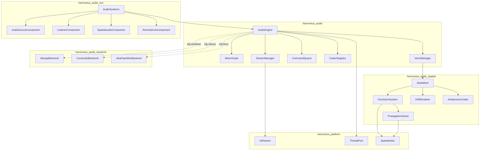
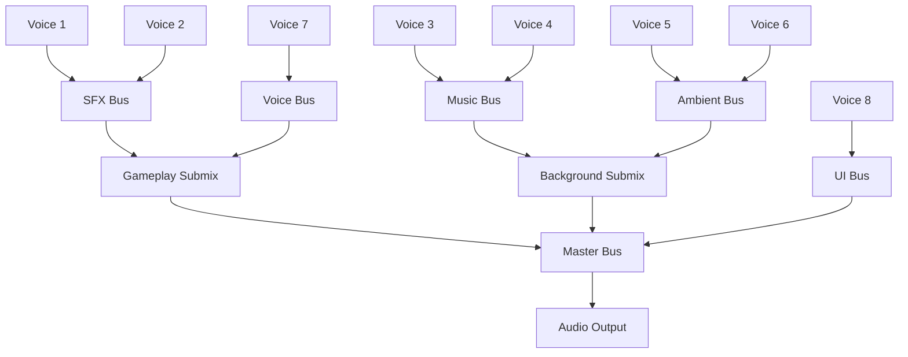
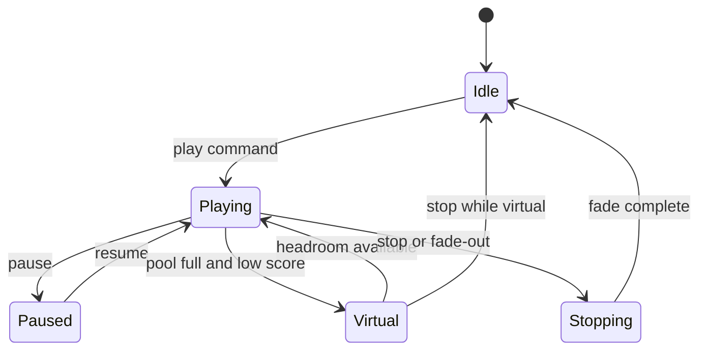
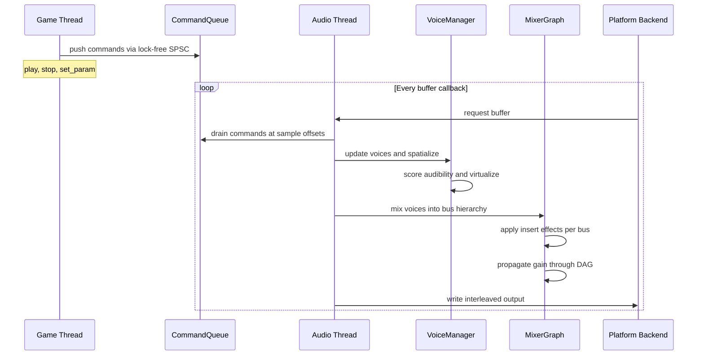
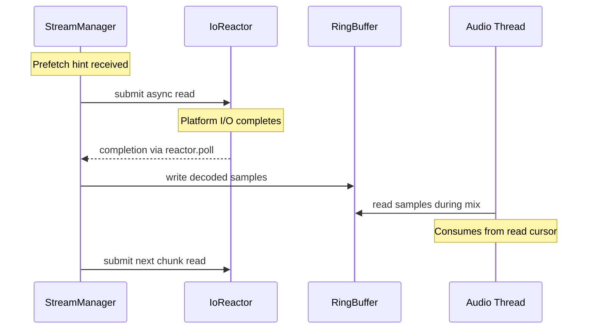
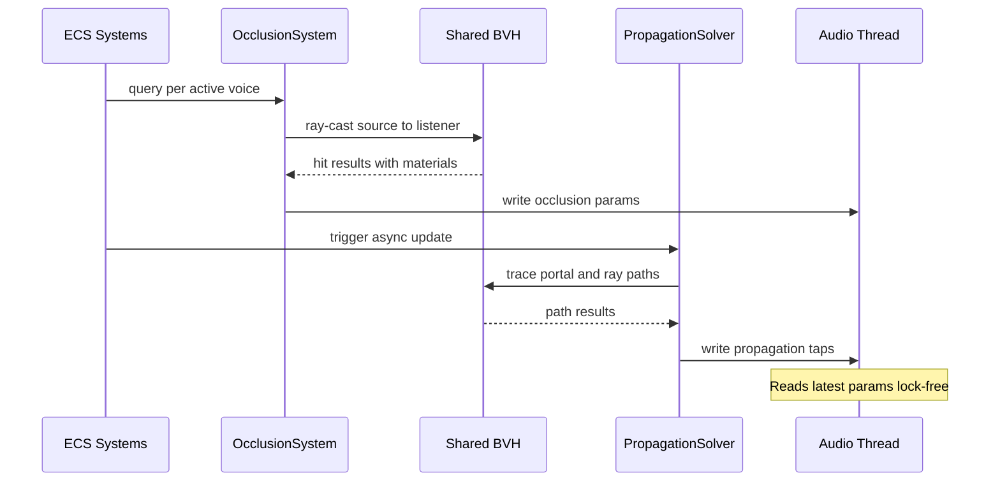

# Audio Engine Design

## Requirements Trace

| Feature | Requirement | Description |
|---------|-------------|-------------|
| F-5.1.1 | R-5.1.1 | Sound source component (point, line, area emitters with gain, pitch, looping, attenuation) |
| F-5.1.2 | R-5.1.2 | Listener component (position, orientation, velocity, Doppler, split-screen) |
| F-5.1.3 | R-5.1.3 | Hierarchical mixer bus DAG (master, music, SFX, ambient, voice, UI; gain inheritance, mute, solo, inserts) |
| F-5.1.4 | R-5.1.4 | Voice management (priority classes, audibility scoring, virtualization, stealing, restoration) |
| F-5.1.5 | R-5.1.5 | Streaming playback via platform-native async I/O with ring-buffer chunks and prefetch |
| F-5.1.6 | R-5.1.6 | Sample-accurate scheduling (command queue from game thread to audio thread) |
| F-5.1.7 | R-5.1.7 | Codec support (PCM, Vorbis, Opus, FLAC) with extensible plugin registry |
| F-5.2.1 | R-5.2.1 | 3D sound positioning with Doppler and transform interpolation |
| F-5.2.2 | R-5.2.2 | Distance attenuation curves (inverse, inverse-squared, linear, logarithmic, custom) |
| F-5.2.3 | R-5.2.3 | HRTF binaural rendering (SOFA profiles, frequency-domain convolution) |
| F-5.2.4 | R-5.2.4 | Ambisonics encoding/decoding (first- to third-order, multi-format output) |
| F-5.2.5 | R-5.2.5 | Occlusion/obstruction filtering via shared BVH with material transmission loss |
| F-5.2.6 | R-5.2.6 | Sound propagation via hybrid ray-portal solver (async, feeds per-voice taps) |
| F-5.2.7 | R-5.2.7 | Reverb zones with early reflections, smooth blending, priority ordering |

### Non-Functional Requirements

| ID | Metric | Target |
|----|--------|--------|
| R-5.1.NF1 | Audio thread budget | < 0.5 ms per buffer at 48 kHz / 512 samples |
| R-5.1.NF2 | Maximum voice count | 256 simultaneous (128 real + 128 virtual) |
| R-5.1.NF3 | Audio memory budget | < 64 MiB resident (excluding stream buffers) |
| R-5.1.NF4 | Mixer output latency | < 20 ms end-to-end at 48 kHz |
| R-5.2.NF1 | Spatialization per-voice | < 2 us per voice |
| R-5.2.NF2 | Propagation solver | < 4 ms per update, async at 10 Hz max |

## Overview

The audio engine provides real-time sound mixing,
spatialization, and playback for the Harmonius engine.
All audio data lives as ECS components; all audio logic
runs as ECS systems. The engine is split into four
layers:

1. **ECS layer** -- components (`AudioSource`,
   `AudioListener`, `SpatialAudio`, `ReverbZone`) and
   systems that synchronize ECS state with the audio
   runtime each frame.
2. **Runtime layer** -- the `AudioEngine` core
   containing the mixer graph, voice manager, command
   queue, codec registry, and stream manager.
3. **Spatial layer** -- spatializer, occlusion system,
   HRTF renderer, Ambisonics codec, and the async
   propagation solver. Occlusion and propagation query
   the shared BVH spatial index.
4. **Backend layer** -- platform audio output via
   WASAPI (Windows), CoreAudio (macOS), and
   ALSA/PipeWire (Linux), selected at compile time
   through `cfg` attributes.

The game thread communicates with the audio thread
through a lock-free SPSC command queue. The audio
thread runs a high-priority callback driven by the
platform backend, processing all mixing, DSP, and
spatialization within the 0.5 ms budget. Streaming
playback uses the engine's `IoReactor` for
platform-native async I/O (IOCP, GCD Dispatch IO,
io_uring).

## Architecture

### Module Boundaries



### File Layout

```
harmonius_audio/
├── engine.rs         # AudioEngine, AudioConfig
├── command.rs        # CommandQueue, AudioCommand
├── mixer/
│   ├── graph.rs      # MixerGraph, BusId, BusNode
│   ├── bus.rs        # MixerBus, InsertSlot
│   └── output.rs     # OutputBuffer, interleaving
├── voice/
│   ├── manager.rs    # VoiceManager, VoiceSlot
│   ├── priority.rs   # VoicePriority, AudibilityScore
│   └── state.rs      # VoiceState, virtualization
├── codec/
│   ├── registry.rs   # CodecRegistry, CodecId
│   ├── pcm.rs        # PcmDecoder
│   ├── vorbis.rs     # VorbisDecoder
│   ├── opus.rs       # OpusDecoder
│   └── flac.rs       # FlacDecoder
├── stream/
│   ├── manager.rs    # StreamManager, StreamHandle
│   └── ring.rs       # RingBuffer, prefetch
├── spatial/
│   ├── spatializer.rs    # Spatializer, SpatialParams
│   ├── attenuation.rs    # AttenuationModel, curves
│   ├── doppler.rs        # Doppler calculation
│   ├── occlusion.rs      # OcclusionSystem, queries
│   ├── propagation.rs    # PropagationSolver, async
│   ├── hrtf.rs           # HrtfRenderer, SOFA loader
│   ├── ambisonics.rs     # AmbisonicsCodec, rotation
│   └── reverb.rs         # ReverbZoneManager, blending
├── ecs/
│   ├── components.rs     # AudioSource, AudioListener,
│   │                     # SpatialAudio, ReverbZone
│   └── systems.rs        # audio_sync_system,
│                         # spatial_update_system,
│                         # propagation_system
└── backend/
    ├── traits.rs     # AudioBackend trait
    ├── wasapi.rs     # WASAPI backend (Windows)
    ├── coreaudio.rs  # CoreAudio backend (macOS)
    └── alsa.rs       # ALSA/PipeWire backend (Linux)
```

### Mixer Bus DAG



Each bus carries gain, mute, solo, and an ordered
insert-effect chain. Child buses inherit the parent's
effective gain. The DAG is topologically sorted so
buses are processed leaves-first, accumulating into
parents until the master bus produces the final output.

### Voice Lifecycle



### Audio Thread Data Flow



### Streaming I/O Flow



### Occlusion and Propagation



## API Design

### ECS Components

```rust
/// Emitter shape for a sound source.
#[derive(Clone, Debug, Reflect)]
pub enum EmitterShape {
    /// Single-point omnidirectional emitter.
    Point,
    /// Line segment between two local offsets.
    Line { start: Vec3, end: Vec3 },
    /// Rectangular area defined by half-extents.
    Area { half_extents: Vec2 },
}

/// Priority class for voice allocation.
#[derive(
    Clone, Copy, Debug, PartialEq, Eq,
    PartialOrd, Ord, Reflect,
)]
pub enum VoicePriority {
    Low,
    Medium,
    High,
    /// Never virtualized or stolen.
    Critical,
}

/// Sound source attached to an entity.
/// Stored as an ECS component. Target: <= 128 bytes.
#[derive(Clone, Debug, Reflect)]
pub struct AudioSource {
    /// Asset handle to the audio clip or stream.
    pub clip: AssetHandle<AudioClip>,
    /// Linear gain [0.0, 1.0+]. Default 1.0.
    pub gain: f32,
    /// Pitch multiplier. 1.0 = normal.
    pub pitch: f32,
    /// Whether the source loops.
    pub looping: bool,
    /// Emitter geometry.
    pub shape: EmitterShape,
    /// Target mixer bus for this source.
    pub bus: BusId,
    /// Voice priority class.
    pub priority: VoicePriority,
    /// Reference to an attenuation curve asset.
    pub attenuation: AssetHandle<AttenuationCurve>,
    /// Doppler scale factor. 0.0 disables Doppler.
    pub doppler_factor: f32,
}

/// Listener defining the auditory perspective.
/// Defaults to the active camera entity when absent.
#[derive(Clone, Debug, Reflect)]
pub struct AudioListener {
    /// Which player index this listener serves
    /// (0 for single-player).
    pub player_index: u8,
}

/// Per-entity spatial audio overrides.
#[derive(Clone, Debug, Reflect)]
pub struct SpatialAudio {
    /// Override attenuation model for this entity.
    pub attenuation_model: Option<AttenuationModel>,
    /// Minimum distance (full volume).
    pub min_distance: f32,
    /// Maximum distance (silent / virtualized).
    pub max_distance: f32,
    /// Number of occlusion rays (0 = no occlusion).
    pub occlusion_rays: u8,
    /// Enable HRTF for headphone output.
    pub hrtf_enabled: bool,
}

/// Axis-aligned or convex reverb volume attached
/// to an entity.
#[derive(Clone, Debug, Reflect)]
pub struct ReverbZone {
    /// Half-extents for AABB zones.
    pub half_extents: Vec3,
    /// Reverb decay time in seconds.
    pub decay_time: f32,
    /// Diffusion [0.0, 1.0].
    pub diffusion: f32,
    /// Early reflection pattern reference.
    pub reflections: Option<
        AssetHandle<ReflectionPattern>,
    >,
    /// Zone priority (higher overrides lower).
    pub priority: u16,
    /// Blend distance at zone boundary.
    pub blend_distance: f32,
}
```

### Audio Engine Core

```rust
/// Audio engine configuration.
pub struct AudioConfig {
    /// Sample rate in Hz. Default: 48000.
    pub sample_rate: u32,
    /// Buffer size in samples. Default: 512.
    pub buffer_size: u32,
    /// Maximum real (non-virtual) voices.
    pub max_real_voices: u32,
    /// Maximum virtual voices tracked.
    pub max_virtual_voices: u32,
    /// Output channel count. Default: 2.
    pub output_channels: u32,
}

/// Central audio engine. Owns the audio thread
/// and all audio subsystems.
pub struct AudioEngine { /* ... */ }

impl AudioEngine {
    /// Create and start the audio engine.
    /// Spawns the audio thread and opens the
    /// platform backend.
    pub fn new(
        config: AudioConfig,
        backend: impl AudioBackend,
        reactor: &IoReactor,
    ) -> Self;

    /// Return a sender for the game thread to
    /// enqueue audio commands.
    pub fn command_sender(
        &self,
    ) -> CommandSender;

    /// Access the mixer graph for bus
    /// configuration.
    pub fn mixer_graph(&self) -> &MixerGraph;

    /// Access the codec registry for format
    /// registration.
    pub fn codec_registry(
        &self,
    ) -> &CodecRegistry;

    /// Shut down the audio thread gracefully.
    pub fn shutdown(&mut self);
}
```

### Command Queue

The command queue is a lock-free single-producer
single-consumer (SPSC) ring buffer. The game thread
pushes commands with optional sample-accurate
timestamps. The audio thread drains commands at the
start of each buffer callback, executing them at the
specified sample offset within the buffer.

```rust
/// Sample-accurate timestamp for a command.
#[derive(Clone, Copy, Debug)]
pub enum AudioTimestamp {
    /// Execute immediately at the start of the
    /// next buffer.
    Immediate,
    /// Execute at a precise sample offset within
    /// the next buffer.
    SampleOffset(u64),
}

/// Commands sent from game thread to audio thread.
#[derive(Clone, Debug)]
pub enum AudioCommand {
    /// Start playing a voice.
    Play {
        voice_id: VoiceId,
        clip: AssetHandle<AudioClip>,
        bus: BusId,
        priority: VoicePriority,
        timestamp: AudioTimestamp,
    },
    /// Stop a voice with optional fade-out.
    Stop {
        voice_id: VoiceId,
        fade_samples: u32,
        timestamp: AudioTimestamp,
    },
    /// Pause a voice.
    Pause {
        voice_id: VoiceId,
        timestamp: AudioTimestamp,
    },
    /// Resume a paused voice.
    Resume {
        voice_id: VoiceId,
        timestamp: AudioTimestamp,
    },
    /// Set a parameter on a voice.
    SetParam {
        voice_id: VoiceId,
        param: VoiceParam,
        value: f32,
        timestamp: AudioTimestamp,
    },
    /// Set a parameter on a mixer bus.
    SetBusParam {
        bus_id: BusId,
        param: BusParam,
        value: f32,
    },
    /// Update spatial data for a voice.
    UpdateSpatial {
        voice_id: VoiceId,
        position: Vec3,
        velocity: Vec3,
        orientation: Quat,
    },
    /// Update listener transform.
    UpdateListener {
        listener_id: ListenerId,
        position: Vec3,
        velocity: Vec3,
        orientation: Quat,
    },
    /// Prefetch a stream for future playback.
    Prefetch {
        clip: AssetHandle<AudioClip>,
    },
}

/// Voice-level parameters.
#[derive(Clone, Copy, Debug)]
pub enum VoiceParam {
    Gain,
    Pitch,
    DopplerFactor,
    OcclusionGain,
    OcclusionLpf,
}

/// Bus-level parameters.
#[derive(Clone, Copy, Debug)]
pub enum BusParam {
    Gain,
    Mute,
    Solo,
}

/// Lock-free SPSC sender for the game thread.
pub struct CommandSender { /* ... */ }

impl CommandSender {
    /// Push a command. Returns `Err` if the
    /// ring buffer is full (caller retries next
    /// frame).
    pub fn send(
        &self,
        cmd: AudioCommand,
    ) -> Result<(), AudioCommand>;
}

/// Lock-free SPSC receiver for the audio thread.
pub struct CommandReceiver { /* ... */ }

impl CommandReceiver {
    /// Drain all pending commands, ordered by
    /// timestamp.
    pub fn drain(
        &self,
    ) -> impl Iterator<Item = AudioCommand>;
}
```

### Voice Manager

```rust
/// Opaque voice identifier.
#[derive(
    Clone, Copy, Debug, PartialEq, Eq, Hash,
)]
pub struct VoiceId(pub(crate) u32);

/// Runtime state of a voice slot.
#[derive(Clone, Copy, Debug, PartialEq, Eq)]
pub enum VoiceState {
    Idle,
    Playing,
    Paused,
    Virtual,
    Stopping { remaining_samples: u32 },
}

/// Audibility score for voice prioritization.
/// Higher = more audible = less likely to steal.
#[derive(Clone, Copy, Debug, PartialOrd, PartialEq)]
pub struct AudibilityScore(pub f32);

impl AudibilityScore {
    /// Compute score from distance, occlusion,
    /// and bus gain.
    pub fn compute(
        distance: f32,
        occlusion_factor: f32,
        bus_gain: f32,
        source_gain: f32,
    ) -> Self;
}

/// A single voice slot in the pool.
pub struct VoiceSlot {
    pub id: VoiceId,
    pub state: VoiceState,
    pub priority: VoicePriority,
    pub score: AudibilityScore,
    pub bus: BusId,
    /// Playback position in samples from start.
    pub playback_offset: u64,
    /// Decoded sample buffer (mono or stereo).
    pub decode_buffer: AlignedBuffer,
    /// Spatial parameters snapshot.
    pub spatial: SpatialParams,
}

/// Manages the fixed-size voice pool.
pub struct VoiceManager { /* ... */ }

impl VoiceManager {
    pub fn new(
        max_real: u32,
        max_virtual: u32,
    ) -> Self;

    /// Allocate a voice. If the real pool is full,
    /// attempts to steal the lowest-scoring voice
    /// below the requested priority.
    pub fn allocate(
        &mut self,
        priority: VoicePriority,
    ) -> Option<VoiceId>;

    /// Release a voice back to the pool.
    pub fn release(&mut self, id: VoiceId);

    /// Virtualize the voice (tracked but silent).
    /// Retains playback offset for restoration.
    pub fn virtualize(&mut self, id: VoiceId);

    /// Restore a virtualized voice to real
    /// playback.
    pub fn restore(
        &mut self,
        id: VoiceId,
    ) -> bool;

    /// Recompute audibility scores and
    /// virtualize/restore voices as needed.
    pub fn update_priorities(&mut self);

    /// Iterate over active (Playing) voice slots.
    pub fn active_voices(
        &self,
    ) -> impl Iterator<Item = &VoiceSlot>;

    /// Iterate mutably over active voice slots.
    pub fn active_voices_mut(
        &mut self,
    ) -> impl Iterator<Item = &mut VoiceSlot>;

    pub fn real_voice_count(&self) -> u32;
    pub fn virtual_voice_count(&self) -> u32;
}
```

### Mixer Graph

```rust
/// Opaque bus identifier.
#[derive(
    Clone, Copy, Debug, PartialEq, Eq, Hash,
)]
pub struct BusId(pub(crate) u16);

/// Well-known bus identifiers.
impl BusId {
    pub const MASTER: Self = BusId(0);
    pub const MUSIC: Self = BusId(1);
    pub const SFX: Self = BusId(2);
    pub const AMBIENT: Self = BusId(3);
    pub const VOICE: Self = BusId(4);
    pub const UI: Self = BusId(5);
}

/// A single insert effect slot on a bus.
pub struct InsertSlot {
    /// The DSP effect processor.
    pub effect: Box<dyn AudioEffect>,
    /// Bypass flag.
    pub bypassed: bool,
}

/// A node in the mixer bus DAG.
pub struct BusNode {
    pub id: BusId,
    /// Linear gain [0.0, 1.0+].
    pub gain: f32,
    /// Effective gain (own * ancestors).
    pub effective_gain: f32,
    pub muted: bool,
    pub solo: bool,
    /// Ordered insert effect chain.
    pub inserts: Vec<InsertSlot>,
    /// Parent bus (None for master).
    pub parent: Option<BusId>,
    /// Child buses.
    pub children: SmallVec<[BusId; 4]>,
    /// Intermediate mix buffer.
    pub buffer: AlignedBuffer,
}

/// The mixer bus hierarchy stored as a DAG.
pub struct MixerGraph { /* ... */ }

impl MixerGraph {
    pub fn new() -> Self;

    /// Add a bus as a child of `parent`.
    pub fn add_bus(
        &mut self,
        id: BusId,
        parent: BusId,
    );

    /// Remove a bus and reparent its children
    /// to its parent.
    pub fn remove_bus(&mut self, id: BusId);

    /// Reparent a bus (runtime rewiring).
    pub fn reparent(
        &mut self,
        id: BusId,
        new_parent: BusId,
    );

    /// Add an insert effect to a bus.
    pub fn add_insert(
        &mut self,
        bus: BusId,
        index: usize,
        effect: Box<dyn AudioEffect>,
    );

    /// Remove an insert effect from a bus.
    pub fn remove_insert(
        &mut self,
        bus: BusId,
        index: usize,
    );

    /// Set gain on a bus.
    pub fn set_gain(
        &mut self,
        bus: BusId,
        gain: f32,
    );

    /// Set mute on a bus.
    pub fn set_mute(
        &mut self,
        bus: BusId,
        muted: bool,
    );

    /// Set solo on a bus.
    pub fn set_solo(
        &mut self,
        bus: BusId,
        solo: bool,
    );

    /// Mix all buses in topological order
    /// (leaves first). Writes the final output
    /// into the master bus buffer.
    pub fn mix(
        &mut self,
        voices: &[VoiceSlot],
        output: &mut [f32],
    );

    /// Recompute effective gains after a change.
    fn propagate_gains(&mut self);
}

/// Trait for insert effects on mixer buses.
pub trait AudioEffect: Send {
    /// Process samples in-place.
    fn process(
        &mut self,
        buffer: &mut [f32],
        sample_rate: u32,
        channel_count: u32,
    );

    /// Reset internal state (e.g., on bus
    /// rewire).
    fn reset(&mut self);
}
```

### Codec Registry

```rust
/// Identifies a registered codec.
#[derive(
    Clone, Copy, Debug, PartialEq, Eq, Hash,
)]
pub struct CodecId(pub(crate) u16);

/// Well-known codec identifiers.
impl CodecId {
    pub const PCM: Self = CodecId(0);
    pub const VORBIS: Self = CodecId(1);
    pub const OPUS: Self = CodecId(2);
    pub const FLAC: Self = CodecId(3);
}

/// Audio clip metadata extracted at import time.
#[derive(Clone, Debug, Reflect)]
pub struct AudioClipMeta {
    pub sample_rate: u32,
    pub channel_count: u16,
    pub sample_count: u64,
    pub codec: CodecId,
    /// Loop start sample (None if not looping).
    pub loop_start: Option<u64>,
    /// Loop end sample (None = end of clip).
    pub loop_end: Option<u64>,
    /// Duration in seconds.
    pub duration_secs: f32,
}

/// Trait for audio decoders. Implementors decode
/// compressed audio into PCM f32 samples.
pub trait AudioDecoder: Send {
    /// Decode the next `frame_count` samples into
    /// `output`. Returns the number of samples
    /// actually decoded.
    fn decode(
        &mut self,
        output: &mut [f32],
        frame_count: u32,
    ) -> u32;

    /// Seek to a sample offset.
    fn seek(&mut self, sample_offset: u64);

    /// Reset decoder state for reuse.
    fn reset(&mut self);

    /// Return clip metadata.
    fn metadata(&self) -> &AudioClipMeta;
}

/// Factory function type for creating decoders.
pub type DecoderFactory = fn(
    data: &[u8],
    meta: &AudioClipMeta,
) -> Box<dyn AudioDecoder>;

/// Registry mapping codecs to decoder factories.
pub struct CodecRegistry { /* ... */ }

impl CodecRegistry {
    pub fn new() -> Self;

    /// Register a codec with its decoder factory.
    pub fn register(
        &mut self,
        id: CodecId,
        factory: DecoderFactory,
    );

    /// Create a decoder for the given codec.
    pub fn create_decoder(
        &self,
        id: CodecId,
        data: &[u8],
        meta: &AudioClipMeta,
    ) -> Option<Box<dyn AudioDecoder>>;

    /// Check if a codec is registered.
    pub fn has_codec(&self, id: CodecId) -> bool;
}
```

### Stream Manager

```rust
/// Handle to an active audio stream.
#[derive(
    Clone, Copy, Debug, PartialEq, Eq, Hash,
)]
pub struct StreamHandle(pub(crate) u32);

/// Configuration for a streaming playback.
pub struct StreamConfig {
    /// Ring buffer size in samples per channel.
    /// Default: 32768 (682 ms at 48 kHz).
    pub ring_buffer_samples: u32,
    /// Number of chunks to prefetch ahead.
    /// Default: 4.
    pub prefetch_chunks: u32,
    /// Chunk size in bytes for each async I/O
    /// read. Default: 32768 (32 KiB).
    pub chunk_bytes: u32,
}

/// Ring buffer for streaming decoded audio.
pub struct StreamRingBuffer { /* ... */ }

impl StreamRingBuffer {
    pub fn new(capacity_samples: u32) -> Self;

    /// Write decoded samples at the write cursor.
    pub fn write(
        &mut self,
        samples: &[f32],
    ) -> u32;

    /// Read samples at the read cursor (audio
    /// thread). Does not block.
    pub fn read(
        &self,
        output: &mut [f32],
    ) -> u32;

    /// Samples available for reading.
    pub fn available(&self) -> u32;

    /// Free space available for writing.
    pub fn free_space(&self) -> u32;
}

/// Manages streaming playback for large audio
/// files using platform-native async I/O.
pub struct StreamManager { /* ... */ }

impl StreamManager {
    pub fn new(
        config: StreamConfig,
        reactor: &IoReactor,
    ) -> Self;

    /// Open a stream for the given audio clip.
    pub async fn open(
        &mut self,
        clip: AssetHandle<AudioClip>,
    ) -> Result<StreamHandle, StreamError>;

    /// Issue a prefetch hint. Begins reading
    /// data from disk before playback starts.
    pub async fn prefetch(
        &mut self,
        handle: StreamHandle,
    );

    /// Read decoded samples from the stream
    /// ring buffer (called by audio thread).
    pub fn read(
        &self,
        handle: StreamHandle,
        output: &mut [f32],
    ) -> u32;

    /// Close a stream and release its resources.
    pub fn close(
        &mut self,
        handle: StreamHandle,
    );

    /// Number of active streams.
    pub fn active_stream_count(&self) -> u32;
}

pub enum StreamError {
    /// Clip asset not found or not loaded.
    AssetNotFound,
    /// Maximum concurrent stream limit reached.
    StreamLimitReached,
    /// I/O error during streaming.
    IoError(IoError),
}
```

### Spatial Audio

```rust
/// Per-voice spatial parameters computed each
/// audio frame.
#[derive(Clone, Debug, Default)]
pub struct SpatialParams {
    /// Source position (interpolated).
    pub position: Vec3,
    /// Source velocity.
    pub velocity: Vec3,
    /// Left/right panning [-1.0, 1.0].
    pub pan: f32,
    /// Distance attenuation gain [0.0, 1.0].
    pub distance_gain: f32,
    /// Doppler pitch multiplier.
    pub doppler_pitch: f32,
    /// Occlusion gain reduction [0.0, 1.0].
    pub occlusion_gain: f32,
    /// Occlusion low-pass filter cutoff in Hz.
    pub occlusion_lpf: f32,
    /// HRTF left/right filter indices.
    pub hrtf_index: Option<HrtfIndex>,
}

/// Distance attenuation model.
#[derive(Clone, Debug, Reflect)]
pub enum AttenuationModel {
    Inverse,
    InverseSquared,
    Linear,
    Logarithmic,
    /// User-defined curve via control points.
    Custom {
        points: Vec<(f32, f32)>,
    },
}

impl AttenuationModel {
    /// Evaluate the attenuation gain for a given
    /// distance, clamped to [min_dist, max_dist].
    pub fn evaluate(
        &self,
        distance: f32,
        min_distance: f32,
        max_distance: f32,
    ) -> f32;
}

/// Computes per-voice spatial parameters.
pub struct Spatializer { /* ... */ }

impl Spatializer {
    pub fn new() -> Self;

    /// Compute spatial parameters for a voice
    /// relative to a listener. Interpolates
    /// transforms between game ticks.
    pub fn compute(
        &self,
        source_pos: Vec3,
        source_vel: Vec3,
        listener_pos: Vec3,
        listener_vel: Vec3,
        listener_orient: Quat,
        attenuation: &AttenuationModel,
        min_distance: f32,
        max_distance: f32,
        doppler_factor: f32,
    ) -> SpatialParams;
}

/// Occlusion query result per voice.
#[derive(Clone, Debug, Default)]
pub struct OcclusionResult {
    /// Combined transmission loss in dB.
    pub attenuation_db: f32,
    /// Low-pass cutoff frequency in Hz.
    pub lpf_cutoff: f32,
    /// Whether the direct path is fully blocked.
    pub fully_occluded: bool,
}

/// Queries the shared BVH for audio occlusion.
pub struct OcclusionSystem { /* ... */ }

impl OcclusionSystem {
    pub fn new() -> Self;

    /// Cast rays from source to listener through
    /// the shared spatial index. Returns
    /// material-weighted occlusion.
    pub fn query(
        &self,
        spatial_index: &SpatialIndex,
        source_pos: Vec3,
        listener_pos: Vec3,
        ray_count: u8,
    ) -> OcclusionResult;
}

/// Propagation path from the async solver.
#[derive(Clone, Debug)]
pub struct PropagationPath {
    /// Delay in samples.
    pub delay_samples: u32,
    /// Gain for this indirect path.
    pub gain: f32,
    /// Low-pass filter cutoff.
    pub lpf_cutoff: f32,
    /// Number of bounces.
    pub bounce_count: u8,
}

/// Async propagation solver using a hybrid
/// ray-portal graph. Runs on the thread pool
/// at a reduced update rate.
pub struct PropagationSolver { /* ... */ }

impl PropagationSolver {
    pub fn new() -> Self;

    /// Run an async propagation update.
    /// Reads from the shared BVH and portal
    /// graph. Writes results that the audio
    /// thread reads lock-free.
    pub async fn update(
        &self,
        spatial_index: &SpatialIndex,
        portal_graph: &PortalGraph,
        sources: &[(VoiceId, Vec3)],
        listener_pos: Vec3,
    );

    /// Read the latest propagation paths for
    /// a voice (lock-free snapshot).
    pub fn paths(
        &self,
        voice_id: VoiceId,
    ) -> &[PropagationPath];
}
```

### HRTF and Ambisonics

```rust
/// Index into the HRTF dataset for a given
/// azimuth/elevation pair.
#[derive(Clone, Copy, Debug)]
pub struct HrtfIndex {
    pub azimuth_idx: u16,
    pub elevation_idx: u16,
}

/// HRTF dataset loaded from a SOFA file.
pub struct HrtfDataset { /* ... */ }

impl HrtfDataset {
    /// Load from a SOFA-format asset.
    pub fn load(
        data: &[u8],
    ) -> Result<Self, HrtfError>;

    /// Look up the nearest HRTF index for a
    /// direction.
    pub fn lookup(
        &self,
        azimuth: f32,
        elevation: f32,
    ) -> HrtfIndex;

    /// Get the left and right impulse responses
    /// for a given index.
    pub fn impulse_response(
        &self,
        index: HrtfIndex,
    ) -> (&[f32], &[f32]);
}

/// Per-voice HRTF binaural renderer using
/// frequency-domain convolution.
pub struct HrtfRenderer { /* ... */ }

impl HrtfRenderer {
    pub fn new(fft_size: usize) -> Self;

    /// Load or swap the active HRTF dataset.
    pub fn set_dataset(
        &mut self,
        dataset: HrtfDataset,
    );

    /// Render a mono source into stereo binaural
    /// output using the HRTF for the given
    /// direction.
    pub fn render(
        &mut self,
        mono_input: &[f32],
        azimuth: f32,
        elevation: f32,
        left_out: &mut [f32],
        right_out: &mut [f32],
    );
}

/// Ambisonics order.
#[derive(Clone, Copy, Debug, PartialEq, Eq)]
pub enum AmbisonicsOrder {
    First,  // 4 channels (W, X, Y, Z)
    Second, // 9 channels
    Third,  // 16 channels
}

/// Output speaker format for Ambisonics decoding.
#[derive(Clone, Copy, Debug, PartialEq, Eq)]
pub enum OutputFormat {
    Stereo,
    Surround5_1,
    Surround7_1,
    Binaural,
}

/// Encodes sources into Ambisonics and decodes
/// to the output format.
pub struct AmbisonicsCodec { /* ... */ }

impl AmbisonicsCodec {
    pub fn new(
        order: AmbisonicsOrder,
        output: OutputFormat,
    ) -> Self;

    /// Encode a mono source at a given direction
    /// into the Ambisonics accumulation buffer.
    pub fn encode(
        &mut self,
        mono_input: &[f32],
        azimuth: f32,
        elevation: f32,
    );

    /// Rotate the accumulated soundfield by the
    /// listener orientation.
    pub fn rotate(&mut self, orientation: Quat);

    /// Decode the accumulated Ambisonics field
    /// to the output format.
    pub fn decode(
        &self,
        output: &mut [f32],
    );

    /// Clear the accumulation buffer.
    pub fn clear(&mut self);
}
```

### Reverb Zone Manager

```rust
/// Active reverb state for blending.
#[derive(Clone, Debug)]
pub struct ActiveReverbState {
    pub zone_entity: Entity,
    pub decay_time: f32,
    pub diffusion: f32,
    pub blend_weight: f32,
}

/// Manages reverb zone lookups and smooth
/// blending between zones.
pub struct ReverbZoneManager { /* ... */ }

impl ReverbZoneManager {
    pub fn new(max_concurrent_zones: u8) -> Self;

    /// Update active zones based on listener
    /// position. Computes blend weights for
    /// smooth transitions.
    pub fn update(
        &mut self,
        listener_pos: Vec3,
        zones: &[(Entity, &ReverbZone, Vec3)],
    );

    /// Get the current blended reverb parameters
    /// for the audio thread.
    pub fn blended_params(
        &self,
    ) -> &[ActiveReverbState];
}
```

### Platform Backend

```rust
/// Callback invoked by the platform audio backend
/// when it needs more samples.
pub type AudioCallback = Box<
    dyn FnMut(&mut [f32], u32) + Send,
>;

/// Platform audio output backend. One
/// implementation per platform, selected via cfg.
pub trait AudioBackend: Send {
    /// Open the audio device with the given
    /// configuration.
    fn open(
        &mut self,
        config: &AudioConfig,
        callback: AudioCallback,
    ) -> Result<(), AudioBackendError>;

    /// Start audio playback.
    fn start(&mut self)
        -> Result<(), AudioBackendError>;

    /// Stop audio playback.
    fn stop(&mut self)
        -> Result<(), AudioBackendError>;

    /// Return the actual sample rate negotiated
    /// with the device.
    fn actual_sample_rate(&self) -> u32;

    /// Return the actual buffer size negotiated
    /// with the device.
    fn actual_buffer_size(&self) -> u32;
}

pub enum AudioBackendError {
    DeviceNotFound,
    FormatNotSupported,
    DeviceLost,
    Platform { code: i32 },
}
```

### ECS Systems

```rust
/// Runs each frame on the game thread. Reads
/// AudioSource, AudioListener, and Transform
/// components and pushes commands to the audio
/// engine's command queue.
pub fn audio_sync_system(
    sources: Query<
        (Entity, &AudioSource, &Transform),
        Changed<AudioSource>,
    >,
    listeners: Query<
        (Entity, &AudioListener, &Transform),
    >,
    sender: Res<CommandSender>,
);

/// Runs each frame. Updates spatial audio
/// parameters (position, velocity) for all active
/// sources.
pub fn spatial_update_system(
    sources: Query<
        (Entity, &AudioSource, &Transform),
    >,
    listeners: Query<
        (Entity, &AudioListener, &Transform),
    >,
    sender: Res<CommandSender>,
);

/// Runs each frame. Queries the shared BVH for
/// occlusion on active spatial sources and sends
/// occlusion parameters to the audio thread.
pub fn occlusion_system(
    sources: Query<
        (Entity, &AudioSource, &SpatialAudio,
         &Transform),
    >,
    listeners: Query<
        (Entity, &AudioListener, &Transform),
    >,
    spatial_index: Res<SpatialIndex>,
    occlusion: Res<OcclusionSystem>,
    sender: Res<CommandSender>,
);

/// Runs asynchronously on the thread pool at a
/// reduced rate. Computes sound propagation paths
/// through the portal graph.
pub async fn propagation_system(
    spatial_index: Res<SpatialIndex>,
    portal_graph: Res<PortalGraph>,
    solver: Res<PropagationSolver>,
    sources: Query<
        (Entity, &AudioSource, &Transform),
    >,
    listeners: Query<
        (Entity, &AudioListener, &Transform),
    >,
);

/// Runs each frame. Updates reverb zone blending
/// based on listener position.
pub fn reverb_zone_system(
    zones: Query<
        (Entity, &ReverbZone, &Transform),
    >,
    listeners: Query<
        (Entity, &AudioListener, &Transform),
    >,
    reverb_mgr: ResMut<ReverbZoneManager>,
);
```

### Error Types

```rust
pub enum AudioError {
    /// Backend device error.
    Backend(AudioBackendError),
    /// Codec not found for the given format.
    CodecNotFound { codec: CodecId },
    /// Voice pool exhausted and no stealable
    /// voice found.
    VoicePoolExhausted,
    /// Stream error.
    Stream(StreamError),
    /// HRTF dataset error.
    Hrtf(HrtfError),
}

pub enum HrtfError {
    /// Invalid SOFA file format.
    InvalidFormat,
    /// Unsupported HRTF sample rate.
    UnsupportedSampleRate { rate: u32 },
}
```

## Data Flow

### Frame Lifecycle

Each game frame, the ECS systems synchronize
component state with the audio thread:

1. `audio_sync_system` detects new/changed
   `AudioSource` components and issues `Play`,
   `Stop`, or `SetParam` commands.
2. `spatial_update_system` reads `Transform` for
   all active sources and listeners, pushes
   `UpdateSpatial` and `UpdateListener` commands
   with interpolated positions.
3. `occlusion_system` ray-casts through the shared
   BVH for each active voice and pushes occlusion
   parameters.
4. `propagation_system` (async, reduced rate)
   runs the portal/ray solver on the thread pool
   and writes results to a lock-free snapshot
   buffer.
5. `reverb_zone_system` determines active zones
   and blend weights for the listener.

The audio thread runs independently at the hardware
callback rate. Each callback:

1. Drains the command queue, applying commands at
   their sample offsets.
2. For each active voice: decodes samples (from
   memory or stream), applies spatial parameters,
   writes into the voice's target bus buffer.
3. Processes the mixer graph leaves-first: applies
   insert effects, accumulates into parent buses.
4. Writes the master bus output to the platform
   backend.

### Lock-Free Communication

```
Game Thread            Audio Thread
    |                      |
    |-- SPSC ring buf ---->|
    |   (commands)         |
    |                      |
    |-- atomic snapshot -->|
    |   (propagation)      |
    |                      |
    |<-- atomic counters --|
    |   (voice states,     |
    |    playback pos)     |
```

All game-to-audio communication uses lock-free
structures:

- **Command queue**: SPSC ring buffer. Game thread
  writes, audio thread reads. No mutex.
- **Propagation results**: Double-buffered atomic
  swap. Solver writes buffer A while audio thread
  reads buffer B; swap on completion.
- **Voice state feedback**: Atomic reads of voice
  state and playback position for the game thread
  to query progress.

### Streaming Pipeline

1. `audio_sync_system` detects a streaming clip and
   calls `stream_manager.open()`.
2. Prefetch hint triggers async I/O reads via the
   `IoReactor`.
3. Decoded samples fill the ring buffer.
4. The audio thread reads from the ring buffer
   during voice mixing.
5. When the ring buffer drops below a threshold,
   the stream manager submits the next async read.
6. The `IoReactor` drains completions at the frame
   poll point, feeding data back to step 3.

## Platform Considerations

### Audio Backends

| Platform | Backend | API | Notes |
|----------|---------|-----|-------|
| Windows | WASAPI | `IAudioClient`, `IAudioRenderClient` | Exclusive mode for low latency; shared mode fallback. Via `windows-sys`. |
| macOS | CoreAudio | `AudioUnit` (RemoteIO / HAL) | Callback on CoreAudio's real-time thread. C++ wrapper via `cxx.rs`. |
| Linux | ALSA / PipeWire | `snd_pcm_*` / PipeWire native | ALSA via bindgen; PipeWire preferred when available. |

### Streaming I/O Backends

| Platform | I/O | Notes |
|----------|-----|-------|
| Windows | IOCP | Overlapped reads via `IoReactor`. |
| macOS | GCD Dispatch IO | Controlled drain at frame poll point. |
| Linux | io_uring | SQE submissions, CQE drain at poll. |

### Voice Pool Scaling

| Tier | Real Voices | Virtual Voices | Stream Slots | Occlusion Rays |
|------|-------------|----------------|--------------|----------------|
| Mobile | 32 | 64 | 4 | 1 |
| Switch | 64 | 128 | 8 | 2 |
| Desktop | 128 | 128 | 16 | 4 |
| High-end | 256 | 256 | 32 | 4 |

### Ambisonics Order Scaling

| Tier | Max Order | Channels | Notes |
|------|-----------|----------|-------|
| Mobile | First | 4 | Minimal CPU overhead |
| Desktop | Third | 16 | Full spatial resolution |

### Reverb Zone Scaling

| Tier | Max Concurrent Zones | Early Reflections |
|------|----------------------|-------------------|
| Mobile | 2 | Disabled |
| Switch | 4 | Disabled |
| Desktop | 6+ | Enabled |

### Propagation Solver Scaling

| Tier | Mode | Update Rate | Max Bounces |
|------|------|-------------|-------------|
| Mobile | Portal only | Every 4-8 frames | 0 |
| Switch | Portal + 1-bounce | Every 2-4 frames | 1 |
| Desktop | Portal + multi-bounce | Every 1-2 frames | 3+ |

### Proposed Dependencies

| Crate | Purpose | Justification |
|-------|---------|---------------|
| `lewton` | Vorbis decoding | Pure Rust, no C deps |
| `opus` | Opus decoding | Wraps libopus via bindgen |
| `claxon` | FLAC decoding | Pure Rust, no C deps |
| `hound` | WAV/PCM reading | Pure Rust, lightweight |
| `sofar` | SOFA HRTF file loading | SOFA format parser (or custom) |
| `crossbeam-utils` | CachePadded, Backoff | Lock-free primitives |
| `smallvec` | Inline bus child lists | Avoids heap for small arrays |
| `windows-sys` | WASAPI bindings | Zero-cost Win32 FFI |
| `cxx` | CoreAudio C++ bridge | Safe bridge to macOS audio APIs |

## Test Plan

### Unit Tests

| Test | Req | Description |
|------|-----|-------------|
| `test_voice_alloc_and_release` | R-5.1.4 | Allocate max voices, release all, verify pool is empty. |
| `test_voice_priority_stealing` | R-5.1.4 | Fill pool with low-priority voices, allocate critical voice, assert lowest-score voice is virtualized. |
| `test_voice_virtualize_restore` | R-5.1.4 | Virtualize a voice, verify playback offset retained. Restore and verify seamless resume. |
| `test_mixer_gain_inheritance` | R-5.1.3 | Set master gain to 0.5, verify child bus effective gains are halved. |
| `test_mixer_mute_propagation` | R-5.1.3 | Mute a mid-level bus, verify all descendant outputs are zero. |
| `test_mixer_solo` | R-5.1.3 | Solo one bus, verify only it and its children produce output. |
| `test_mixer_dag_topological_order` | R-5.1.3 | Build a complex bus DAG, verify mix processes leaves before parents. |
| `test_bus_runtime_rewire` | R-5.1.3 | Reparent a bus at runtime, verify gain inheritance updates. |
| `test_command_queue_spsc` | R-5.1.6 | Push 10,000 commands from producer, drain from consumer, verify ordering and completeness. |
| `test_sample_accurate_scheduling` | R-5.1.6 | Schedule two sounds at the same sample offset, verify phase alignment is +/- 0 samples. |
| `test_scheduling_jitter` | R-5.1.6 | Measure jitter over 1,000 scheduled commands, assert zero-sample deviation. |
| `test_codec_pcm_decode` | R-5.1.7 | Decode a PCM WAV file, compare output to reference waveform. |
| `test_codec_vorbis_decode` | R-5.1.7 | Decode a Vorbis file, compare to reference. |
| `test_codec_opus_decode` | R-5.1.7 | Decode an Opus file, compare to reference. |
| `test_codec_flac_decode` | R-5.1.7 | Decode a FLAC file, compare to reference. |
| `test_codec_registry_plugin` | R-5.1.7 | Register a custom codec, create a decoder, verify it decodes. |
| `test_metadata_extraction` | R-5.1.7 | Verify sample rate, channel count, and loop points for each format. |
| `test_attenuation_inverse` | R-5.2.2 | Verify inverse attenuation gain at min, mid, and max distances within 0.1%. |
| `test_attenuation_inverse_squared` | R-5.2.2 | Verify inverse-squared model accuracy. |
| `test_attenuation_linear` | R-5.2.2 | Verify linear model accuracy. |
| `test_attenuation_logarithmic` | R-5.2.2 | Verify logarithmic model accuracy. |
| `test_attenuation_custom_curve` | R-5.2.2 | Verify custom control-point curve interpolation. |
| `test_doppler_pitch_accuracy` | R-5.2.1 | Move source at constant velocity, verify Doppler ratio within 1%. |
| `test_panning_edge_cases` | R-5.2.1 | Verify panning at 0, 90, 180, 270 degrees and directly above/below. |
| `test_occlusion_single_ray` | R-5.2.5 | Ray-cast through a known wall, verify attenuation matches material coefficient within 1 dB. |
| `test_occlusion_shared_bvh` | R-5.2.5 | Verify occlusion queries use the shared spatial index, not a separate structure. |
| `test_hrtf_load_sofa` | R-5.2.3 | Load a SOFA file, verify azimuth/elevation lookup returns valid indices. |
| `test_hrtf_swap_runtime` | R-5.2.3 | Swap HRTF dataset, verify new profile active within one buffer. |
| `test_ambisonics_encode_accuracy` | R-5.2.4 | Encode mono source at known azimuth, verify W/X/Y/Z coefficients within 0.1%. |
| `test_ambisonics_rotation` | R-5.2.4 | Rotate field 90 degrees, verify coefficients shift correctly. |
| `test_ambisonics_decode_stereo` | R-5.2.4 | Decode first-order Ambisonics to stereo, verify output. |
| `test_ambisonics_decode_surround` | R-5.2.4 | Decode to 5.1 and 7.1, verify channel mapping. |
| `test_reverb_zone_blending` | R-5.2.7 | Move listener between zones with decay 1.0s and 3.0s, verify smooth crossfade. |
| `test_reverb_nested_priority` | R-5.2.7 | Nest a high-priority zone inside a low-priority one, verify inner overrides. |
| `test_stream_ring_buffer` | R-5.1.5 | Write/read cycle on ring buffer, verify no data loss or overrun. |
| `test_component_size` | R-5.1.1 | Assert `AudioSource` component is <= 128 bytes. |
| `test_listener_default_camera` | R-5.1.2 | Remove all listeners, verify active camera entity used as fallback. |

### Integration Tests

| Test | Req | Description |
|------|-----|-------------|
| `test_end_to_end_latency` | R-5.1.NF4 | Trigger a sound, measure time to first non-zero output sample. Assert < 20 ms. |
| `test_streaming_platform_io` | R-5.1.5 | Stream audio on each platform, verify IOCP/GCD/io_uring is used (not stdlib). |
| `test_streaming_memory_cap` | R-5.1.5 | Stream a 5-minute file, assert peak memory < 256 KiB per stream. |
| `test_prefetch_latency` | R-5.1.5 | Prefetch 500 ms ahead, assert startup latency < 10 ms. |
| `test_streaming_under_contention` | R-5.1.5 | Stream audio during heavy asset loading, verify no underruns. |
| `test_full_mix_no_underrun` | R-5.1.NF2 | Allocate 256 voices with spatialization and 2-insert DSP. Assert no underruns over 60 s. |
| `test_propagation_async` | R-5.2.6 | Verify solver runs on worker thread, does not block audio thread. |
| `test_portal_propagation` | R-5.2.6 | Source in room A, listener in room B via portal. Verify delayed attenuated indirect path. Close portal, verify path removed. |
| `test_occlusion_per_platform_rays` | R-5.2.5 | Verify mobile uses 1 ray, Switch 2, desktop 4. |
| `test_cross_thread_command` | R-5.1.6 | Verify commands arrive on audio thread within one buffer latency. |
| `test_multi_listener_split_screen` | R-5.1.2 | Run two listeners, verify each produces independent spatial audio. |
| `test_attenuation_cross_platform` | R-5.2.2 | Verify identical attenuation results on all platforms. |

### Benchmarks

| Benchmark | Target | Source |
|-----------|--------|--------|
| Audio callback (256 voices, full DSP) | < 0.5 ms p99 | R-5.1.NF1 |
| Per-voice spatialization (HRTF) | < 2 us p99 | R-5.2.NF1 |
| Propagation solver (20 portals, 50 surfaces, 64 sources) | < 4 ms p99 | R-5.2.NF2 |
| Command queue throughput | > 100K cmds/s | R-5.1.6 |
| Voice allocation/release | < 1 us | R-5.1.4 |
| Stream ring buffer read | < 0.5 us per 512 samples | R-5.1.5 |
| Mixer graph traversal (8 buses, 128 voices) | < 0.1 ms | R-5.1.3 |
| HRTF convolution (512-sample block) | < 50 us | R-5.2.3 |
| Ambisonics encode + decode (first order) | < 10 us per voice | R-5.2.4 |
| Audio system memory (max config) | < 64 MiB | R-5.1.NF3 |

## Open Questions

1. **WASAPI exclusive vs shared mode** -- Exclusive
   mode provides the lowest latency but locks the
   audio device. Should the engine default to shared
   mode with an opt-in for exclusive, or attempt
   exclusive first with shared fallback?
2. **HRTF convolution block size** -- The HRTF
   filter length (typically 128-512 taps) determines
   FFT block size. Larger blocks are more efficient
   but add latency. The optimal block size depends
   on the target latency budget.
3. **Ambisonics vs direct panning** -- On stereo
   output, Ambisonics encoding/decoding adds CPU
   cost over direct stereo panning. Should the
   engine bypass Ambisonics for stereo-only output
   and use it only for surround and binaural?
4. **Propagation solver update rate** -- Fixed rate
   (e.g., 10 Hz) vs adaptive rate based on listener
   movement speed. Adaptive would save CPU when the
   listener is stationary but adds complexity.
5. **Ring buffer size vs latency tradeoff** -- Larger
   streaming ring buffers tolerate I/O spikes but
   consume more memory. The default 32 KiB chunk /
   32768-sample ring may need per-platform tuning.
6. **Platform hardware decoders** -- Apple Audio
   Toolbox can decode AAC in hardware. Should the
   codec registry support platform-delegated decoding,
   and if so, how does this interact with the
   streaming pipeline?
7. **Insert effect allocation** -- Insert effects use
   `Box<dyn AudioEffect>` (dynamic dispatch). This is
   one of the few places requiring vtable dispatch.
   An alternative is an enum-based approach with
   static dispatch for built-in effects and dynamic
   dispatch only for plugins. The tradeoff is
   extensibility vs performance.
