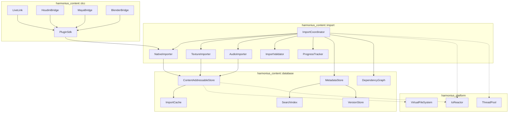
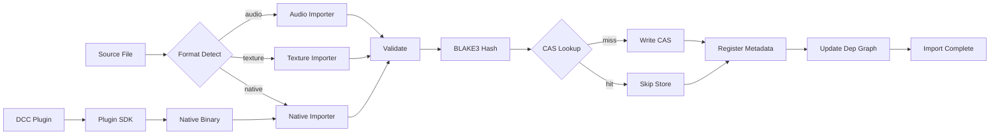
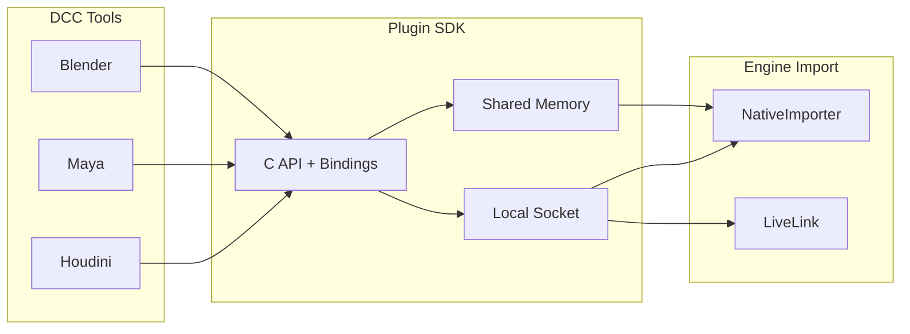
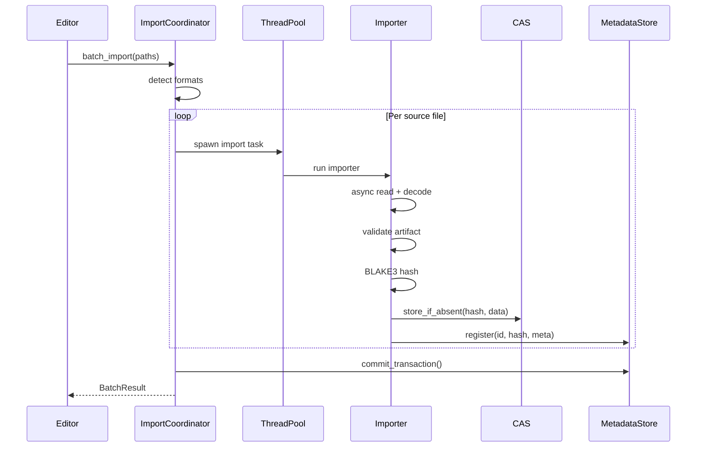
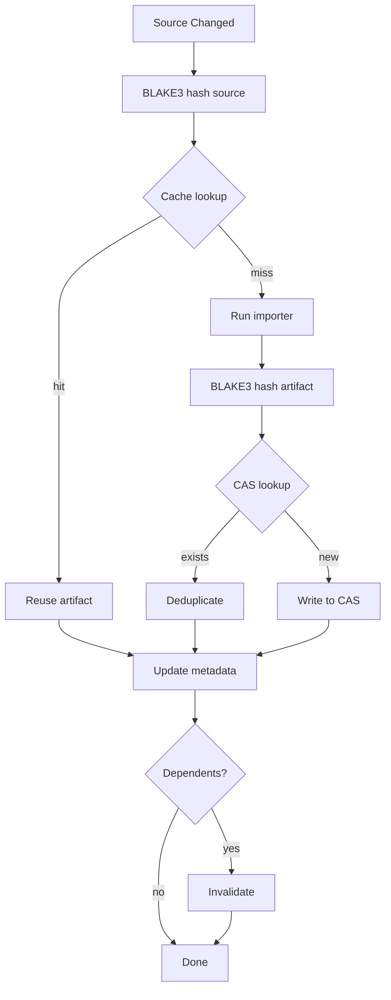
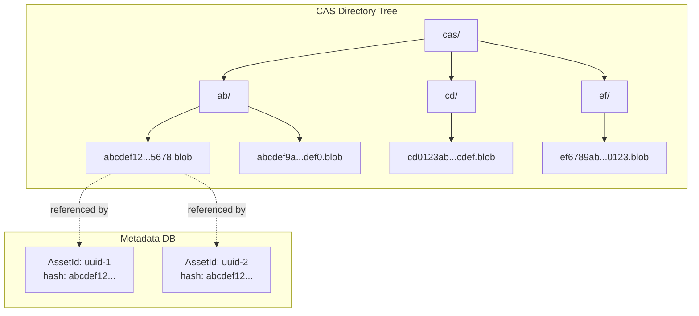
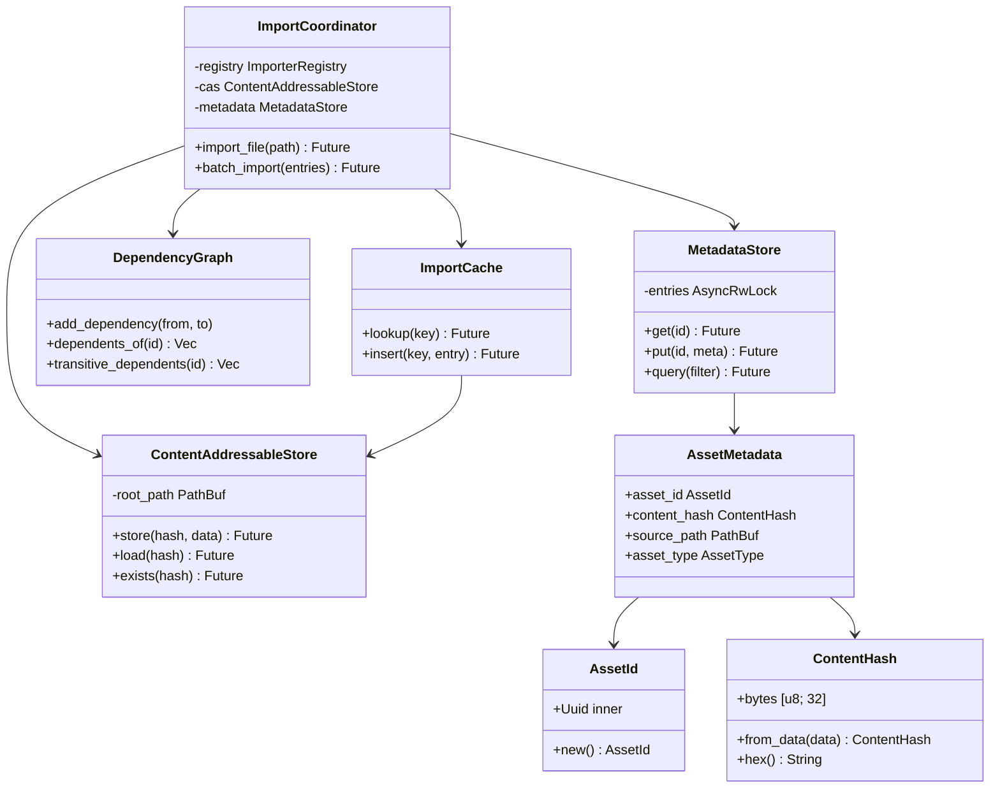

# Asset Import and Database Design

## Requirements Trace

> **Canonical sources:** Features, requirements, and user
> stories are defined in [features/content-pipeline/](../../features/content-pipeline/),
> [requirements/content-pipeline/](../../requirements/content-pipeline/), and
> [user-stories/content-pipeline/](../../user-stories/content-pipeline/). The table
> below traces design elements to those definitions.

### Asset Import

| Feature | Requirement | Description |
|---------|-------------|-------------|
| F-12.1.1 | R-12.1.1 | Native format ingestion with BLAKE3 validation and CAS deduplication |
| F-12.1.2 | R-12.1.2 | Texture source import (PNG, JPEG, EXR, HDR, TIFF) |
| F-12.1.3 | R-12.1.3 | Audio source import (WAV, FLAC, Ogg Vorbis) |
| F-12.1.4 | R-12.1.4 | Import validation with file path, byte offset, and fix suggestions |
| F-12.1.5 | R-12.1.5 | Batch import with progress, parallelism, and rollback-safe cancellation |

### Asset Database

| Feature | Requirement | Description |
|---------|-------------|-------------|
| F-12.3.1 | R-12.3.1 | Content-addressable storage keyed by BLAKE3 hash |
| F-12.3.2 | R-12.3.2 | Persistent metadata store (IDs, paths, hashes, deps, tags, thumbnails) |
| F-12.3.3 | R-12.3.3 | Hash-based import caching (source + settings + tool version) |
| F-12.3.4 | R-12.3.4 | Incremental builds via bottom-up dependency invalidation |
| F-12.3.5 | R-12.3.5 | Full-text and tag-based faceted search |
| F-12.3.6 | R-12.3.6 | Async thumbnail generation during import |
| F-12.3.10 | R-12.3.10 | Asset versioning with hash-based restore |

### Cross-Cutting

| Feature | Requirement | Description |
|---------|-------------|-------------|
| F-12.2.8 | R-12.2.8 | Asset dependency graph tracking |
| F-12.6.1 | R-12.6.1 | DCC plugin SDK for direct native-format export |
| F-12.4.1 | R-12.4.1 | File watcher for hot reload triggering |

## Overview

The asset import and database subsystem is the entry
point for all content entering the Harmonius engine.
It accepts assets from two primary paths:

1. **DCC plugin exports** — native binary format
   assets pushed directly from Houdini, Maya,
   Blender, and other tools via the Plugin SDK
   (preferred path).
2. **Source file imports** — raw texture and audio
   files (PNG, WAV, etc.) as a convenience fallback.

All imported content flows through a single pipeline:
source detection, format-specific decoding, validation,
BLAKE3 content hashing, content-addressable storage,
and metadata registration. The system uses the
`IoReactor` for all file operations (no stdlib I/O)
and parallelizes batch imports across the `ThreadPool`.

Key design goals:

- **Deterministic builds.** Identical inputs always
  produce identical outputs with identical hashes.
- **Incremental imports.** Only changed sources are
  re-imported; cache key = hash(source + settings +
  tool version).
- **Deduplication.** CAS eliminates redundant storage
  across expansion packs and live-ops updates.
- **Rollback safety.** Cancelled batch imports leave
  no partial entries in the metadata store.

## Architecture

### Module Boundaries



```
harmonius_content/
├── import/
│   ├── coordinator.rs   # ImportCoordinator,
│   │                    # BatchImportHandle
│   ├── registry.rs      # ImporterRegistry,
│   │                    # format detection
│   ├── native.rs        # NativeImporter
│   ├── texture.rs       # TextureImporter
│   ├── audio.rs         # AudioImporter
│   ├── validator.rs     # ImportValidator,
│   │                    # ValidationDiagnostic
│   └── progress.rs      # ProgressTracker,
│                        # ProgressEvent
├── database/
│   ├── cas.rs           # ContentAddressableStore
│   ├── metadata.rs      # MetadataStore,
│   │                    # AssetMetadata
│   ├── deps.rs          # DependencyGraph
│   ├── search.rs        # SearchIndex,
│   │                    # SearchFilter
│   ├── cache.rs         # ImportCache, CacheKey
│   ├── version.rs       # VersionStore,
│   │                    # VersionEntry
│   └── id.rs            # AssetId, ContentHash
└── dcc/
    ├── sdk.rs           # Plugin SDK host side
    ├── live_link.rs     # LiveLink connection
    ├── houdini.rs       # Houdini Engine bridge
    ├── maya.rs          # Maya bridge
    └── blender.rs       # Blender bridge
```

### Import Pipeline Flow



### DCC Plugin Export Path



DCC plugins export directly to the engine's native
binary format via the Plugin SDK (F-12.6.1). No
intermediate formats (FBX, glTF, USD) are used.
The SDK provides a C API with Python and C++ bindings
that DCC tools call to submit meshes, skeletons,
animations, materials, textures, and scene hierarchies.

Transport uses either a local TCP socket (for
LiveLink real-time push) or shared memory (for
batch export). The engine side receives native binary
payloads and feeds them directly into the
`NativeImporter`.

### Batch Import Sequence



### Incremental Import Decision



The cache key is `BLAKE3(source_bytes ||
import_settings || tool_version)`. A cache hit skips
all decoding and processing stages. A CAS hit
after processing skips the storage write. Both
layers combine to minimize redundant work.

### Content-Addressable Storage Layout



Blobs are stored under a two-character hex prefix
directory derived from the first byte of the BLAKE3
hash. This fans out into 256 buckets, keeping
directory listing sizes manageable even with
millions of blobs. Multiple `AssetId` entries may
reference the same blob (deduplication).

### Core Data Structures



## API Design

### Identity Types

```rust
/// Stable unique identifier for an asset.
/// Persists across reimports, renames, and moves.
/// Generated once on first import and stored in
/// the metadata database.
#[derive(
    Clone, Copy, Debug, PartialEq, Eq, Hash,
)]
pub struct AssetId(pub Uuid);

impl AssetId {
    /// Generate a new random asset ID.
    pub fn new() -> Self;

    /// Reconstruct from a known UUID (e.g., from
    /// a serialized metadata record).
    pub fn from_uuid(uuid: Uuid) -> Self;
}

/// BLAKE3 content hash (32 bytes).
/// Used as the CAS address and for integrity
/// verification.
#[derive(
    Clone, Copy, Debug, PartialEq, Eq, Hash,
)]
pub struct ContentHash {
    pub bytes: [u8; 32],
}

impl ContentHash {
    /// Compute the BLAKE3 hash of a byte slice.
    pub fn from_data(data: &[u8]) -> Self;

    /// Compute the BLAKE3 hash incrementally from
    /// an async reader, hashing chunks as they
    /// arrive from the IoReactor.
    pub async fn from_reader(
        reader: &mut AsyncReader,
    ) -> Result<Self, IoError>;

    /// Return the 64-character hex string.
    pub fn hex(&self) -> String;

    /// Return the first byte as a two-character
    /// hex prefix for CAS directory fanout.
    pub fn prefix(&self) -> [u8; 2];
}
```

### Asset Metadata

```rust
/// Type discriminant for imported assets.
#[derive(
    Clone, Copy, Debug, PartialEq, Eq, Hash,
)]
pub enum AssetType {
    Mesh,
    Skeleton,
    Animation,
    Texture,
    Material,
    Audio,
    Scene,
    Prefab,
    ShaderGraph,
    LogicGraph,
    UiLayout,
}

/// Per-asset metadata record stored in the
/// MetadataStore.
pub struct AssetMetadata {
    pub asset_id: AssetId,
    pub content_hash: ContentHash,
    pub source_path: PathBuf,
    pub import_settings: ImportSettings,
    pub dependencies: Vec<AssetId>,
    pub dependents: Vec<AssetId>,
    pub tags: Vec<String>,
    pub asset_type: AssetType,
    pub byte_size: u64,
    pub created_at: u64,
    pub modified_at: u64,
    pub version: u32,
}

/// Format-specific import settings. Hashed as
/// part of the cache key to detect setting changes.
pub enum ImportSettings {
    Native(NativeImportSettings),
    Texture(TextureImportSettings),
    Audio(AudioImportSettings),
}

pub struct NativeImportSettings {
    /// Expected format version. Mismatch triggers
    /// a validation error suggesting re-export.
    pub expected_version: u32,
}

pub struct TextureImportSettings {
    /// Target compression format per platform.
    pub compression: TextureCompression,
    /// Generate mipmaps during import.
    pub generate_mips: bool,
    /// sRGB or linear color space.
    pub color_space: ColorSpace,
    /// Maximum texture dimension (e.g., 4096).
    pub max_dimension: u32,
}

pub struct AudioImportSettings {
    /// Target encoding (Opus, ADPCM, PCM).
    pub encoding: AudioEncoding,
    /// Target sample rate in Hz.
    pub sample_rate: u32,
    /// Mono, stereo, or preserve source.
    pub channels: ChannelMode,
}
```

### Content-Addressable Store

```rust
/// Content-addressable blob store. Blobs are
/// keyed by their BLAKE3 hash. Identical content
/// maps to the same blob regardless of source
/// path or asset ID.
pub struct ContentAddressableStore {
    root_path: PathBuf,
    reactor: IoReactor,
}

impl ContentAddressableStore {
    pub fn new(
        root_path: PathBuf,
        reactor: IoReactor,
    ) -> Self;

    /// Store a blob if no blob with this hash
    /// exists. Returns whether a new blob was
    /// written (false = deduplicated).
    pub async fn store(
        &self,
        hash: ContentHash,
        data: &[u8],
    ) -> Result<StoreResult, CasError>;

    /// Load a blob by hash. Returns None if the
    /// hash is not present.
    pub async fn load(
        &self,
        hash: ContentHash,
    ) -> Result<Option<Vec<u8>>, CasError>;

    /// Check whether a blob exists without
    /// reading it.
    pub async fn exists(
        &self,
        hash: ContentHash,
    ) -> Result<bool, CasError>;

    /// Remove a blob. Used by garbage collection.
    pub async fn remove(
        &self,
        hash: ContentHash,
    ) -> Result<bool, CasError>;

    /// Garbage collect blobs not referenced by
    /// any metadata entry. Returns statistics.
    pub async fn gc(
        &self,
        referenced: &HashSet<ContentHash>,
    ) -> Result<GcStats, CasError>;

    /// Resolve a hash to its filesystem path
    /// (two-char prefix directory + hash hex).
    fn blob_path(
        &self,
        hash: &ContentHash,
    ) -> PathBuf;
}

#[derive(Clone, Copy, Debug, PartialEq, Eq)]
pub enum StoreResult {
    /// New blob written.
    Written,
    /// Blob already existed (deduplicated).
    Deduplicated,
}

pub struct GcStats {
    pub blobs_scanned: u64,
    pub blobs_removed: u64,
    pub bytes_freed: u64,
}
```

### Metadata Store

```rust
/// Persistent metadata database. Maps AssetId to
/// AssetMetadata. Supports transactional writes
/// for batch import rollback.
pub struct MetadataStore {
    entries: AsyncRwLock<HashMap<AssetId, AssetMetadata>>,
    reactor: IoReactor,
    journal_path: PathBuf,
}

impl MetadataStore {
    pub fn new(
        db_path: PathBuf,
        reactor: IoReactor,
    ) -> Self;

    /// Load the metadata store from disk.
    pub async fn open(
        db_path: PathBuf,
        reactor: IoReactor,
    ) -> Result<Self, MetadataError>;

    /// Get metadata for a single asset.
    pub async fn get(
        &self,
        id: AssetId,
    ) -> Option<AssetMetadata>;

    /// Insert or update metadata.
    pub async fn put(
        &self,
        id: AssetId,
        metadata: AssetMetadata,
    );

    /// Remove an asset's metadata.
    pub async fn remove(
        &self,
        id: AssetId,
    ) -> bool;

    /// Query assets matching a filter. Delegates
    /// to the SearchIndex for indexed fields.
    pub async fn query(
        &self,
        filter: &SearchFilter,
    ) -> Vec<AssetId>;

    /// Begin a transaction. Writes within the
    /// transaction are buffered and committed
    /// atomically, or rolled back on cancel or
    /// error.
    pub fn transaction(
        &self,
    ) -> MetadataTransaction;

    /// Flush all in-memory state to disk via
    /// async I/O.
    pub async fn flush(
        &self,
    ) -> Result<(), MetadataError>;
}

/// Atomic batch write. All mutations are buffered
/// until commit. Drop without commit = rollback.
pub struct MetadataTransaction<'a> {
    store: &'a MetadataStore,
    pending: Vec<TransactionOp>,
    committed: bool,
}

impl<'a> MetadataTransaction<'a> {
    pub fn put(
        &mut self,
        id: AssetId,
        metadata: AssetMetadata,
    );

    pub fn remove(&mut self, id: AssetId);

    /// Commit all buffered operations atomically.
    /// Writes a journal entry before applying, so
    /// a crash mid-commit can be recovered.
    pub async fn commit(
        self,
    ) -> Result<(), MetadataError>;
}

impl<'a> Drop for MetadataTransaction<'a> {
    /// Drop without commit = automatic rollback.
    /// No partial mutations are applied.
    fn drop(&mut self);
}
```

### Search Index

```rust
/// Faceted search filter.
pub struct SearchFilter {
    /// Full-text query against asset names, paths,
    /// and tags.
    pub text: Option<String>,
    /// Filter by asset type.
    pub asset_type: Option<AssetType>,
    /// Filter by tag (AND).
    pub tags: Vec<String>,
    /// Modification date range (unix timestamps).
    pub modified_after: Option<u64>,
    pub modified_before: Option<u64>,
    /// File size range in bytes.
    pub min_size: Option<u64>,
    pub max_size: Option<u64>,
    /// Maximum number of results.
    pub limit: u32,
    /// Offset for pagination.
    pub offset: u32,
}

/// Full-text and tag-based search index over
/// the metadata store.
pub struct SearchIndex {
    /// Inverted index: token -> set of AssetIds.
    tokens: HashMap<String, HashSet<AssetId>>,
    /// Tag index: tag -> set of AssetIds.
    tags: HashMap<String, HashSet<AssetId>>,
}

impl SearchIndex {
    pub fn new() -> Self;

    /// Index an asset's metadata (name, path,
    /// tags, type).
    pub fn index(
        &mut self,
        id: AssetId,
        metadata: &AssetMetadata,
    );

    /// Remove an asset from the index.
    pub fn remove(&mut self, id: AssetId);

    /// Execute a search query. Returns asset IDs
    /// sorted by relevance.
    pub fn search(
        &self,
        filter: &SearchFilter,
    ) -> Vec<AssetId>;
}
```

### Dependency Graph

```rust
/// Directed acyclic graph tracking asset
/// dependencies. Forward edges: "A depends on B."
/// Reverse edges: "B is depended upon by A."
pub struct DependencyGraph {
    forward: HashMap<AssetId, Vec<AssetId>>,
    reverse: HashMap<AssetId, Vec<AssetId>>,
}

impl DependencyGraph {
    pub fn new() -> Self;

    /// Record that `from` depends on `to`.
    pub fn add_dependency(
        &mut self,
        from: AssetId,
        to: AssetId,
    );

    /// Remove all edges involving this asset.
    pub fn remove_asset(&mut self, id: AssetId);

    /// Direct dependents of an asset (one hop
    /// in reverse direction).
    pub fn dependents_of(
        &self,
        id: AssetId,
    ) -> &[AssetId];

    /// Direct dependencies of an asset (one hop
    /// in forward direction).
    pub fn dependencies_of(
        &self,
        id: AssetId,
    ) -> &[AssetId];

    /// All transitive dependents (BFS/DFS through
    /// reverse edges). Used by incremental builds
    /// to propagate invalidation.
    pub fn transitive_dependents(
        &self,
        id: AssetId,
    ) -> Vec<AssetId>;

    /// Topological sort of all assets. Used for
    /// correct build ordering.
    pub fn topological_order(
        &self,
    ) -> Result<Vec<AssetId>, CycleError>;

    /// Detect cycles. Returns the cycle path if
    /// one exists.
    pub fn detect_cycle(
        &self,
    ) -> Option<Vec<AssetId>>;
}
```

### Import Cache

```rust
/// Cache key = BLAKE3(source || settings ||
/// tool_version). A cache hit means the import
/// result is known without running the importer.
#[derive(
    Clone, Debug, PartialEq, Eq, Hash,
)]
pub struct CacheKey {
    pub source_hash: ContentHash,
    pub settings_hash: ContentHash,
    pub tool_version: u32,
}

impl CacheKey {
    /// Compute the composite cache key.
    pub fn compute(
        source_data: &[u8],
        settings: &ImportSettings,
        tool_version: u32,
    ) -> Self;
}

/// Cached import result.
pub struct CacheEntry {
    pub content_hash: ContentHash,
    pub asset_type: AssetType,
    pub dependencies: Vec<ContentHash>,
    pub cached_at: u64,
}

/// Hash-based import cache. Backed by the CAS
/// for storage.
pub struct ImportCache {
    store: ContentAddressableStore,
    index: AsyncRwLock<HashMap<CacheKey, CacheEntry>>,
}

impl ImportCache {
    pub fn new(
        store: ContentAddressableStore,
    ) -> Self;

    /// Look up a cached import result.
    pub async fn lookup(
        &self,
        key: &CacheKey,
    ) -> Option<CacheEntry>;

    /// Insert a new cache entry after a
    /// successful import.
    pub async fn insert(
        &self,
        key: CacheKey,
        entry: CacheEntry,
    );

    /// Invalidate a cache entry (e.g., when
    /// tool version changes).
    pub async fn invalidate(
        &self,
        key: &CacheKey,
    );

    /// Report cache statistics for CI monitoring.
    pub fn stats(&self) -> CacheStats;
}

pub struct CacheStats {
    pub total_entries: u64,
    pub hits: u64,
    pub misses: u64,
    pub hit_rate: f64,
}
```

### Import Validator

```rust
/// Severity of a validation diagnostic.
#[derive(
    Clone, Copy, Debug, PartialEq, Eq,
)]
pub enum Severity {
    /// Fatal — asset cannot be imported.
    Error,
    /// Non-fatal — asset imports but may have
    /// issues (e.g., missing optional metadata).
    Warning,
    /// Informational.
    Info,
}

/// A single validation diagnostic.
pub struct ValidationDiagnostic {
    pub severity: Severity,
    /// Source file path.
    pub file_path: PathBuf,
    /// Byte offset in the source file where the
    /// issue was detected.
    pub byte_offset: Option<u64>,
    /// Human-readable error message.
    pub message: String,
    /// Actionable fix suggestion (e.g., "re-export
    /// from DCC plugin with format version 3").
    pub suggestion: Option<String>,
}

/// Validates imported asset artifacts before they
/// enter the CAS.
pub struct ImportValidator;

impl ImportValidator {
    /// Validate a native-format asset. Checks
    /// magic bytes, format version, BLAKE3
    /// integrity, and schema conformance.
    pub fn validate_native(
        data: &[u8],
        settings: &NativeImportSettings,
    ) -> Vec<ValidationDiagnostic>;

    /// Validate a decoded texture. Checks
    /// dimensions, color space, and pixel format.
    pub fn validate_texture(
        width: u32,
        height: u32,
        settings: &TextureImportSettings,
    ) -> Vec<ValidationDiagnostic>;

    /// Validate decoded audio. Checks sample
    /// rate, channel count, and bit depth.
    pub fn validate_audio(
        sample_rate: u32,
        channels: u32,
        bit_depth: u32,
        settings: &AudioImportSettings,
    ) -> Vec<ValidationDiagnostic>;
}
```

### Importer Trait and Registry

```rust
/// Trait implemented by all format-specific
/// importers. Each importer reads a source file,
/// decodes it, and produces one or more artifacts
/// for CAS storage.
pub trait Importer: Send + Sync {
    /// File extensions this importer handles.
    fn extensions(&self) -> &[&str];

    /// Asset type(s) this importer produces.
    fn asset_types(&self) -> &[AssetType];

    /// Run the import. Reads from the IoReactor,
    /// decodes, validates, and returns artifacts.
    async fn import(
        &self,
        source: &SourceFile,
        settings: &ImportSettings,
        reactor: &IoReactor,
    ) -> Result<ImportOutput, ImportError>;
}

/// A source file to import.
pub struct SourceFile {
    pub path: PathBuf,
    pub handle: RawHandle,
    pub size: u64,
}

/// Output from a successful import.
pub struct ImportOutput {
    /// One or more artifacts produced by the
    /// import (e.g., a mesh file may produce
    /// mesh + material + texture assets).
    pub artifacts: Vec<ImportArtifact>,
}

pub struct ImportArtifact {
    pub asset_type: AssetType,
    pub data: Vec<u8>,
    pub dependencies: Vec<ContentHash>,
    pub metadata: HashMap<String, String>,
}

/// Registry of all available importers. Resolves
/// a source file extension to the correct
/// importer.
pub struct ImporterRegistry {
    importers: Vec<Box<dyn Importer>>,
    extension_map: HashMap<String, usize>,
}

impl ImporterRegistry {
    pub fn new() -> Self;

    /// Register an importer for its declared
    /// extensions.
    pub fn register(
        &mut self,
        importer: Box<dyn Importer>,
    );

    /// Find the importer for a file extension.
    pub fn find(
        &self,
        extension: &str,
    ) -> Option<&dyn Importer>;
}
```

### Native Importer

```rust
/// Imports assets in the engine's native binary
/// format (F-12.7.1). This is the primary import
/// path for DCC plugin exports.
pub struct NativeImporter;

impl Importer for NativeImporter {
    fn extensions(&self) -> &[&str] {
        &["hbf"] // Harmonius Binary Format
    }

    fn asset_types(&self) -> &[AssetType] {
        &[
            AssetType::Mesh,
            AssetType::Skeleton,
            AssetType::Animation,
            AssetType::Texture,
            AssetType::Material,
            AssetType::Scene,
        ]
    }

    async fn import(
        &self,
        source: &SourceFile,
        settings: &ImportSettings,
        reactor: &IoReactor,
    ) -> Result<ImportOutput, ImportError> {
        // 1. Async read entire file via IoReactor
        // 2. Verify magic bytes (4 bytes)
        // 3. Check format version against expected
        // 4. Verify embedded BLAKE3 digest
        // 5. Validate schema conformance
        // 6. Extract sub-assets (mesh, skeleton,
        //    animation, etc.) as artifacts
        // 7. Record dependency references
        todo!()
    }
}
```

### Texture and Audio Importers

```rust
/// Imports raw texture source files as a
/// convenience fallback for textures not exported
/// via DCC plugins.
pub struct TextureImporter;

impl Importer for TextureImporter {
    fn extensions(&self) -> &[&str] {
        &["png", "jpg", "jpeg", "exr",
          "hdr", "tiff", "tif"]
    }

    fn asset_types(&self) -> &[AssetType] {
        &[AssetType::Texture]
    }

    async fn import(
        &self,
        source: &SourceFile,
        settings: &ImportSettings,
        reactor: &IoReactor,
    ) -> Result<ImportOutput, ImportError> {
        // 1. Async read source via IoReactor
        // 2. Detect format from magic bytes
        // 3. Decode (PNG/JPEG → sRGB,
        //    EXR/HDR/TIFF → linear)
        // 4. Validate dimensions and color space
        // 5. Produce raw pixel data artifact for
        //    texture compression pipeline (F-12.2.1)
        todo!()
    }
}

/// Imports raw audio source files.
pub struct AudioImporter;

impl Importer for AudioImporter {
    fn extensions(&self) -> &[&str] {
        &["wav", "flac", "ogg"]
    }

    fn asset_types(&self) -> &[AssetType] {
        &[AssetType::Audio]
    }

    async fn import(
        &self,
        source: &SourceFile,
        settings: &ImportSettings,
        reactor: &IoReactor,
    ) -> Result<ImportOutput, ImportError> {
        // 1. Async read source via IoReactor
        // 2. Decode audio (WAV, FLAC, Ogg Vorbis)
        // 3. Extract metadata: sample rate,
        //    channels, bit depth, loop points,
        //    cue markers
        // 4. Validate against settings
        // 5. Produce raw PCM artifact for audio
        //    encoding pipeline (F-12.2.6)
        todo!()
    }
}
```

### Physics Assets

| Asset Type | Source Format | Import Output |
|-----------|--------------|---------------|
| Collision mesh | DCC plugin export | Convex hull or triangle mesh collider |
| Physics material | DCC plugin metadata | Friction, restitution, density properties |
| Ragdoll definition | DCC plugin (bone mapping) | Joint hierarchy with angular limits |

Physics collision meshes are exported directly from DCC
plugins alongside visual meshes. The importer generates
convex hull decompositions for complex shapes and stores
them in the CAS database.

### Import Coordinator

```rust
/// Central coordinator for all import operations.
/// Manages the full lifecycle: format detection,
/// importer dispatch, validation, CAS storage,
/// metadata registration, and dependency tracking.
pub struct ImportCoordinator {
    registry: ImporterRegistry,
    cas: ContentAddressableStore,
    metadata: MetadataStore,
    dep_graph: AsyncRwLock<DependencyGraph>,
    cache: ImportCache,
    pool: ThreadPool,
    reactor: IoReactor,
    version_store: VersionStore,
}

impl ImportCoordinator {
    pub fn new(
        registry: ImporterRegistry,
        cas: ContentAddressableStore,
        metadata: MetadataStore,
        dep_graph: DependencyGraph,
        cache: ImportCache,
        pool: ThreadPool,
        reactor: IoReactor,
        version_store: VersionStore,
    ) -> Self;

    /// Import a single file. Detects format,
    /// checks cache, runs importer if needed,
    /// stores in CAS, registers metadata.
    pub async fn import_file(
        &self,
        path: PathBuf,
        settings: ImportSettings,
    ) -> Result<ImportResult, ImportError>;

    /// Batch import multiple files in parallel.
    /// Returns a handle for progress tracking
    /// and cancellation.
    pub async fn batch_import(
        &self,
        entries: Vec<ImportEntry>,
    ) -> BatchImportHandle;

    /// Cancel a running batch import. All
    /// uncommitted metadata changes are rolled
    /// back.
    pub async fn cancel(
        &self,
        handle: &BatchImportHandle,
    );

    /// Re-import a single asset from its
    /// original source path. Used by hot reload.
    pub async fn reimport(
        &self,
        id: AssetId,
    ) -> Result<ImportResult, ImportError>;

    /// Propagate invalidation through the
    /// dependency graph. Returns the set of
    /// assets that need reimport.
    pub async fn invalidate(
        &self,
        changed: &[AssetId],
    ) -> Vec<AssetId>;
}

pub struct ImportEntry {
    pub path: PathBuf,
    pub settings: ImportSettings,
}

pub struct ImportResult {
    pub asset_id: AssetId,
    pub content_hash: ContentHash,
    pub asset_type: AssetType,
    pub cache_hit: bool,
    pub deduplicated: bool,
    pub diagnostics: Vec<ValidationDiagnostic>,
}
```

### Batch Import and Progress

```rust
/// Handle to a running batch import. Supports
/// progress polling and cancellation.
pub struct BatchImportHandle {
    tracker: ProgressTracker,
    cancel_token: CancellationToken,
}

impl BatchImportHandle {
    /// Current progress snapshot.
    pub fn progress(&self) -> BatchProgress;

    /// Cancel the batch import. Uncommitted
    /// metadata is rolled back.
    pub fn cancel(&self);

    /// Wait for the batch to complete.
    pub async fn join(
        self,
    ) -> BatchResult;
}

pub struct BatchProgress {
    pub total: u32,
    pub completed: u32,
    pub failed: u32,
    pub in_progress: u32,
    /// Per-asset status.
    pub statuses: Vec<AssetImportStatus>,
}

pub enum AssetImportStatus {
    Pending,
    InProgress,
    Succeeded(ImportResult),
    Failed(ImportError),
    Cancelled,
}

pub struct BatchResult {
    pub succeeded: Vec<ImportResult>,
    pub failed: Vec<(PathBuf, ImportError)>,
    pub cancelled: bool,
    pub elapsed: Duration,
    pub cache_hits: u32,
    pub cache_misses: u32,
}

/// Thread-safe progress tracker. Updated by
/// import tasks, read by the editor UI.
pub struct ProgressTracker {
    total: AtomicU32,
    completed: AtomicU32,
    failed: AtomicU32,
    statuses: AsyncRwLock<Vec<AssetImportStatus>>,
}

/// Token for cooperative cancellation.
pub struct CancellationToken {
    cancelled: AtomicBool,
}

impl CancellationToken {
    pub fn new() -> Self;
    pub fn cancel(&self);
    pub fn is_cancelled(&self) -> bool;
}
```

### Version Store

```rust
/// Tracks the revision history of each asset.
/// Each version is a snapshot of the content
/// hash and metadata at a point in time.
pub struct VersionStore {
    reactor: IoReactor,
    store_path: PathBuf,
}

pub struct VersionEntry {
    pub asset_id: AssetId,
    pub version: u32,
    pub content_hash: ContentHash,
    pub settings_hash: ContentHash,
    pub created_at: u64,
    /// Structural diff from previous version
    /// (F-12.7.3). None for the first version.
    pub diff_hash: Option<ContentHash>,
}

impl VersionStore {
    pub fn new(
        store_path: PathBuf,
        reactor: IoReactor,
    ) -> Self;

    /// Record a new version after import.
    pub async fn record(
        &self,
        entry: VersionEntry,
    ) -> Result<(), VersionError>;

    /// List all versions of an asset, newest
    /// first.
    pub async fn history(
        &self,
        id: AssetId,
    ) -> Vec<VersionEntry>;

    /// Restore a previous version by its content
    /// hash. Returns the restored metadata.
    pub async fn restore(
        &self,
        id: AssetId,
        version: u32,
    ) -> Result<AssetMetadata, VersionError>;
}
```

### Error Types

```rust
pub enum ImportError {
    /// File not found or inaccessible.
    FileNotFound { path: PathBuf },
    /// No importer registered for this extension.
    UnsupportedFormat { extension: String },
    /// Validation failed with one or more errors.
    ValidationFailed {
        diagnostics: Vec<ValidationDiagnostic>,
    },
    /// The source file is corrupt or truncated.
    CorruptFile {
        path: PathBuf,
        message: String,
    },
    /// BLAKE3 hash mismatch (integrity failure).
    HashMismatch {
        expected: ContentHash,
        actual: ContentHash,
    },
    /// I/O error from the platform backend.
    Io(IoError),
    /// Import was cancelled by the user.
    Cancelled,
}

pub enum CasError {
    Io(IoError),
    /// Hash collision (extremely unlikely with
    /// BLAKE3 but handled defensively).
    HashCollision {
        hash: ContentHash,
    },
}

pub enum MetadataError {
    Io(IoError),
    /// Transaction commit failed.
    TransactionFailed { message: String },
    /// Journal corruption detected during
    /// recovery.
    JournalCorrupt { path: PathBuf },
}

pub enum VersionError {
    Io(IoError),
    /// Requested version does not exist.
    VersionNotFound {
        asset_id: AssetId,
        version: u32,
    },
    /// Content hash referenced by the version
    /// entry is no longer in CAS.
    ContentMissing { hash: ContentHash },
}
```

## Data Flow

### Single File Import Lifecycle

```rust
// Single file import (simplified)
async fn import_file(
    coordinator: &ImportCoordinator,
    path: PathBuf,
    settings: ImportSettings,
) -> Result<ImportResult, ImportError> {
    // 1. Detect format from extension
    let ext = path.extension();
    let importer = coordinator
        .registry
        .find(ext)
        .ok_or(ImportError::UnsupportedFormat {
            extension: ext.to_string(),
        })?;

    // 2. Async read source file via IoReactor
    let handle = coordinator
        .reactor
        .open(&path)
        .await?;
    let source = SourceFile {
        path: path.clone(),
        handle,
        size: /* from stat */,
    };

    // 3. Check import cache
    let source_hash =
        ContentHash::from_reader(&mut reader)
            .await?;
    let cache_key = CacheKey::compute(
        &source_data,
        &settings,
        TOOL_VERSION,
    );
    if let Some(entry) =
        coordinator.cache.lookup(&cache_key).await
    {
        // Cache hit — skip import, register
        // metadata with cached hash
        return Ok(ImportResult {
            cache_hit: true,
            content_hash: entry.content_hash,
            ..
        });
    }

    // 4. Run format-specific importer
    let output = importer
        .import(&source, &settings, &reactor)
        .await?;

    // 5. For each artifact: hash, store, register
    for artifact in &output.artifacts {
        let hash =
            ContentHash::from_data(&artifact.data);

        // 6. CAS store (deduplicates)
        let result = coordinator
            .cas
            .store(hash, &artifact.data)
            .await?;

        // 7. Register metadata
        let asset_id = AssetId::new();
        let metadata = AssetMetadata {
            asset_id,
            content_hash: hash,
            source_path: path.clone(),
            import_settings: settings.clone(),
            asset_type: artifact.asset_type,
            ..
        };
        coordinator
            .metadata
            .put(asset_id, metadata)
            .await;

        // 8. Update dependency graph
        for dep_hash in &artifact.dependencies {
            // Resolve dep_hash to AssetId
            coordinator
                .dep_graph
                .write()
                .await
                .add_dependency(asset_id, dep_id);
        }

        // 9. Record version
        coordinator.version_store.record(
            VersionEntry {
                asset_id,
                version: 1,
                content_hash: hash,
                ..
            },
        ).await?;

        // 10. Insert cache entry
        coordinator.cache.insert(
            cache_key.clone(),
            CacheEntry {
                content_hash: hash,
                asset_type: artifact.asset_type,
                ..
            },
        ).await;
    }
}
```

### Batch Import with Cancellation

```rust
// Batch import (simplified)
async fn batch_import(
    coordinator: &ImportCoordinator,
    entries: Vec<ImportEntry>,
) -> BatchResult {
    let tracker = ProgressTracker::new(
        entries.len() as u32,
    );
    let token = CancellationToken::new();
    let txn = coordinator.metadata.transaction();

    // Parallel import on ThreadPool
    let results: Vec<_> = coordinator
        .pool
        .scope(|scope| {
            entries
                .iter()
                .map(|entry| {
                    scope.spawn_async(|| async {
                        if token.is_cancelled() {
                            return Err(
                                ImportError::Cancelled,
                            );
                        }
                        let result = coordinator
                            .import_file(
                                entry.path.clone(),
                                entry.settings
                                    .clone(),
                            )
                            .await;
                        tracker.update(&result);
                        result
                    })
                })
                .collect()
        });

    // Commit or rollback
    if token.is_cancelled() {
        // Transaction dropped = automatic rollback
        drop(txn);
        BatchResult { cancelled: true, .. }
    } else {
        txn.commit().await?;
        // Collect successes and failures
        BatchResult { .. }
    }
}
```

### Dependency Invalidation Propagation

When a source file changes (detected by the file
watcher, F-12.4.1):

1. The `ImportCoordinator` reimports the changed
   asset.
2. If the content hash changes, `invalidate()` walks
   the `DependencyGraph` reverse edges.
3. All transitive dependents are collected via BFS.
4. Each dependent's cache entry is invalidated.
5. Dependents are re-imported in topological order.
6. Only assets whose output actually changes trigger
   further propagation.

```rust
async fn invalidate(
    coordinator: &ImportCoordinator,
    changed: &[AssetId],
) -> Vec<AssetId> {
    let graph =
        coordinator.dep_graph.read().await;
    let mut to_reimport = Vec::new();

    for &id in changed {
        let dependents =
            graph.transitive_dependents(id);
        to_reimport.extend(dependents);
    }

    // Deduplicate and sort topologically
    to_reimport.sort();
    to_reimport.dedup();
    to_reimport
}
```

## Platform Considerations

### Async I/O

All file operations use the `IoReactor` defined in
the platform threading design. No stdlib file I/O
is used anywhere in the import or database subsystems.

| Platform | I/O Backend | Import Usage |
|----------|-------------|--------------|
| Windows | IOCP | Overlapped reads for source files, CAS blob writes |
| macOS | GCD Dispatch IO | `dispatch_io_read` / `dispatch_io_write` via C++ wrappers and cxx.rs |
| Linux | io_uring | `IORING_OP_READ` / `IORING_OP_WRITE` SQEs for all file operations |

### CAS Storage

| Platform | CAS Root | Notes |
|----------|----------|-------|
| Windows | `%APPDATA%\Harmonius\cas\` | NTFS; long path support required |
| macOS | `~/Library/Application Support/Harmonius/cas/` | APFS copy-on-write benefits deduplication |
| Linux | `~/.local/share/harmonius/cas/` | ext4 or btrfs; btrfs reflink for fast copies |

### Metadata Persistence

The metadata store uses a write-ahead journal for
crash recovery. The journal is written via async I/O
before each transaction commit. On startup, any
incomplete journal entries are replayed or discarded.

| Concern | Approach |
|---------|----------|
| Atomicity | Write-ahead journal + transaction API |
| Durability | Journal fsync via platform async I/O |
| Concurrency | AsyncRwLock; readers never block writers beyond the commit point |
| Recovery | Replay or discard incomplete journal entries on startup |

### BLAKE3 Performance

BLAKE3 is chosen for content hashing because it is:

- **Fast.** ~1 GB/s on a single core; scales
  linearly across cores via SIMD and parallelism.
- **Secure.** 256-bit output; collision-resistant.
- **Incremental.** Supports streaming hash
  computation, critical for large assets read via
  async I/O in chunks.

| Asset Size | Hashing Time (single core) |
|-----------|---------------------------|
| 1 MB | < 1 ms |
| 100 MB | ~100 ms |
| 1 GB | ~1 s |

### Proposed Dependencies

| Crate | Purpose | Justification |
|-------|---------|---------------|
| `blake3` | Content hashing | Official BLAKE3 implementation; SIMD-accelerated |
| `uuid` | Asset ID generation | v4 random UUIDs; widely used |
| `image` | Texture decoding (PNG, JPEG, HDR, EXR, TIFF) | Pure Rust image decoder library |
| `hound` | WAV decoding | Lightweight WAV parser |
| `claxon` | FLAC decoding | Pure Rust FLAC decoder |
| `lewton` | Ogg Vorbis decoding | Pure Rust Vorbis decoder |
| `cxx` | C++ interop for DCC plugin SDK and GCD I/O | Safe Rust-C++ bridge |

## Test Plan

### Unit Tests

| Test | Req | Description |
|------|-----|-------------|
| `test_content_hash_deterministic` | R-12.3.1 | Same data always produces same BLAKE3 hash |
| `test_content_hash_different` | R-12.3.1 | Different data produces different hashes |
| `test_cas_store_and_load` | R-12.3.1 | Store a blob, load by hash, verify contents match |
| `test_cas_deduplication` | R-12.3.1 | Store same data twice, verify only one blob on disk |
| `test_cas_gc_removes_unreferenced` | R-12.3.1 | GC removes blobs not in the referenced set |
| `test_cas_gc_preserves_referenced` | R-12.3.1 | GC keeps blobs that are in the referenced set |
| `test_metadata_put_get` | R-12.3.2 | Store and retrieve metadata by AssetId |
| `test_metadata_remove` | R-12.3.2 | Remove metadata and confirm it is gone |
| `test_metadata_transaction_commit` | R-12.1.5 | Commit a transaction and verify all writes applied |
| `test_metadata_transaction_rollback` | R-12.1.5 | Drop transaction without commit; verify no writes applied |
| `test_dep_graph_add_query` | R-12.2.8 | Add edges, query dependents and dependencies |
| `test_dep_graph_transitive` | R-12.3.4 | Transitive dependents returns full chain |
| `test_dep_graph_cycle_detect` | R-12.2.8 | Cycle detection returns the cycle path |
| `test_dep_graph_topological_order` | R-12.3.4 | Topological sort respects all edges |
| `test_cache_hit_skips_import` | R-12.3.3 | Cache hit returns cached result without running importer |
| `test_cache_miss_triggers_import` | R-12.3.3 | Cache miss invokes the importer |
| `test_cache_invalidation` | R-12.3.3 | Invalidated key causes a cache miss |
| `test_validate_native_magic_bytes` | R-12.1.4 | Wrong magic bytes produce error with byte offset |
| `test_validate_native_version` | R-12.1.4 | Wrong version produces error with fix suggestion |
| `test_validate_native_hash_mismatch` | R-12.1.4 | Corrupted hash produces HashMismatch error |
| `test_validate_texture_dimensions` | R-12.1.4 | Oversized texture produces warning |
| `test_validate_audio_sample_rate` | R-12.1.4 | Unsupported sample rate produces error |
| `test_search_by_text` | R-12.3.5 | Full-text search returns matching assets |
| `test_search_by_tag` | R-12.3.5 | Tag filter returns correctly tagged assets |
| `test_search_faceted` | R-12.3.5 | Combined type + tag + date filter works |
| `test_version_record_and_history` | R-12.3.10 | Record versions, list in newest-first order |
| `test_version_restore` | R-12.3.10 | Restore previous version, verify content matches |
| `test_importer_registry_find` | US-12.1.7 | Registered importer found by extension |
| `test_importer_registry_unknown` | US-12.1.7 | Unknown extension returns None |

### Integration Tests

| Test | Req | Description |
|------|-----|-------------|
| `test_import_native_end_to_end` | R-12.1.1 | Import a native-format file; verify CAS blob, metadata, and dep graph entry |
| `test_import_png_end_to_end` | R-12.1.2 | Import a PNG; verify decoded sRGB data in CAS |
| `test_import_exr_linear` | R-12.1.2 | Import an EXR; verify linear color space |
| `test_import_wav_metadata` | R-12.1.3 | Import a WAV; verify sample rate, channels, loop points |
| `test_import_flac_metadata` | R-12.1.3 | Import a FLAC; verify metadata extraction |
| `test_import_ogg_metadata` | R-12.1.3 | Import an Ogg Vorbis; verify metadata extraction |
| `test_batch_import_100_assets` | R-12.1.5 | Batch import 100 assets; verify all succeed with correct metadata |
| `test_batch_cancel_rollback` | R-12.1.5 | Cancel mid-batch; verify no partial metadata entries |
| `test_incremental_reimport` | R-12.3.4 | Modify a texture, reimport; verify only dependents rebuilt |
| `test_incremental_vs_full_identical` | R-12.3.4 | Incremental build output is byte-identical to full build (US-12.3.13) |
| `test_corrupt_file_graceful` | US-12.1.8 | Import truncated/zero-length/malformed files; verify error without crash |
| `test_import_duplicate_dedup` | R-12.3.1 | Import same asset from two paths; verify single CAS blob, two metadata entries |
| `test_cache_across_restarts` | R-12.3.3 | Import, restart, reimport; verify cache hit |
| `test_version_restore_content` | R-12.3.10 | Create 3 versions, restore v1, verify hash matches original |
| `test_journal_crash_recovery` | R-12.3.2 | Simulate crash mid-transaction; verify journal replay recovers clean state |
| `test_ci_validation_reject` | US-12.1.6 | Run validation in headless mode; verify non-zero exit on schema violation |

### Benchmarks

| Benchmark | Target | Source |
|-----------|--------|--------|
| BLAKE3 hash 1 GB file | < 1.5 s single core | R-12.3.1 |
| CAS store 10 MB blob | < 20 ms (async I/O) | R-12.3.1 |
| CAS dedup check | < 1 ms | R-12.3.1 |
| Import 100 native assets (batch) | < 10 s on 8 cores | US-12.1.10 |
| Import 1000 textures (batch) | < 60 s on 8 cores | US-12.1.10 |
| Metadata query (1M entries) | < 100 ms | US-12.3.16 |
| Full-text search (1M entries) | < 100 ms | US-12.3.16 |
| Dependency invalidation (10K assets) | < 50 ms | R-12.3.4 |
| Cache lookup | < 0.1 ms | R-12.3.3 |

## Open Questions

1. **Metadata persistence format.** The metadata
   store needs durable persistence. Options:
   - Custom binary format with write-ahead journal
     (maximum control, minimal dependencies).
   - SQLite via `rusqlite` (proven durability,
     adds a dependency).
   - RON/TOML textual files per-asset (human
     readable, slower for millions of entries).
   Decision impacts search performance at scale.

2. **CAS blob compression.** Should blobs be
   compressed in CAS (LZ4/Zstd) or stored raw?
   Compression saves disk space but adds CPU
   overhead on every load. The streaming subsystem
   (F-12.5.9) compresses at the archive level,
   so CAS compression may be redundant.

3. **Maximum concurrent imports.** Batch import
   parallelism should be bounded to avoid starving
   the editor's interactive systems. The limit
   could be a fixed count (e.g., `perf_core_count
   - 2`) or adaptive based on system load.

4. **DCC plugin SDK transport.** Local TCP socket
   vs shared memory vs both. Shared memory is
   faster for large assets but more complex to
   implement cross-platform. Socket is simpler
   but adds serialization overhead.

5. **Search index persistence.** The in-memory
   inverted index needs to be rebuilt on startup
   unless persisted. Options: persist alongside
   metadata, or rebuild lazily on first query.
   At 1M assets, full rebuild could take seconds.

6. **Thumbnail storage.** Should thumbnails live
   in CAS (content-addressed, deduplicated) or in
   a separate thumbnail cache (faster access,
   simpler eviction)? CAS is cleaner
   architecturally; a separate cache is faster for
   the asset browser.

7. **Asset ID stability across branches.** When
   two Git branches import the same source file
   independently, they generate different UUIDs.
   Merging creates duplicates. A deterministic ID
   derived from the source path could solve this
   but breaks if the file moves.
