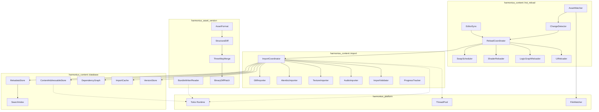
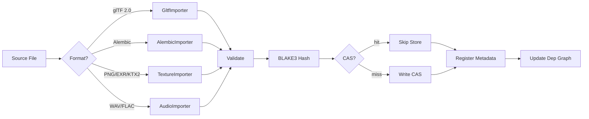
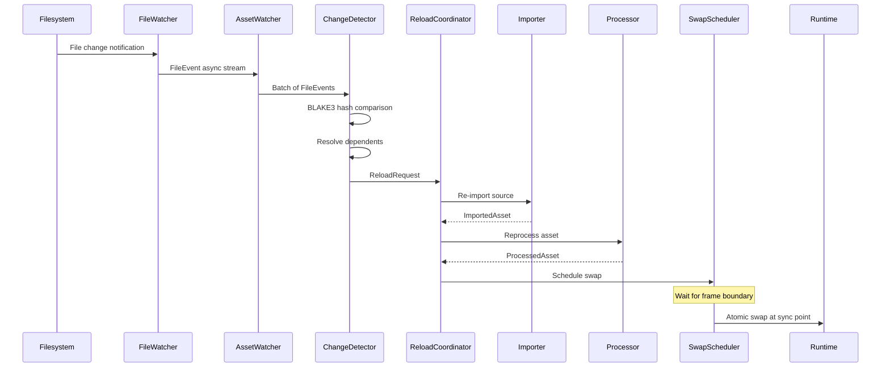
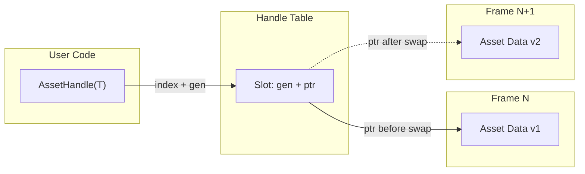
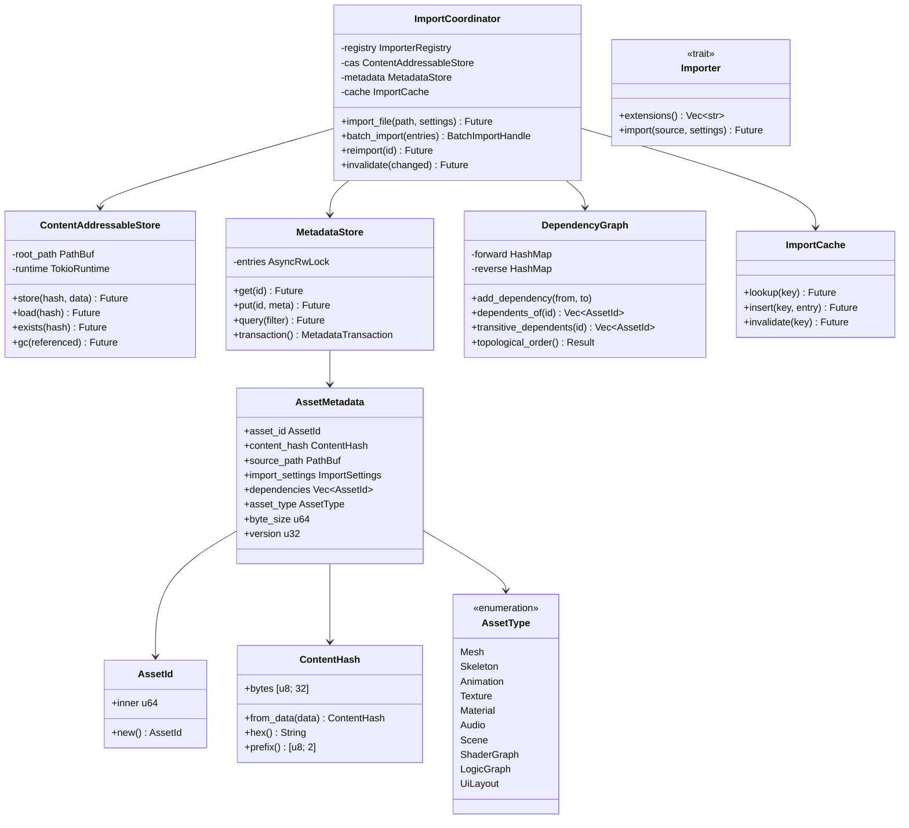
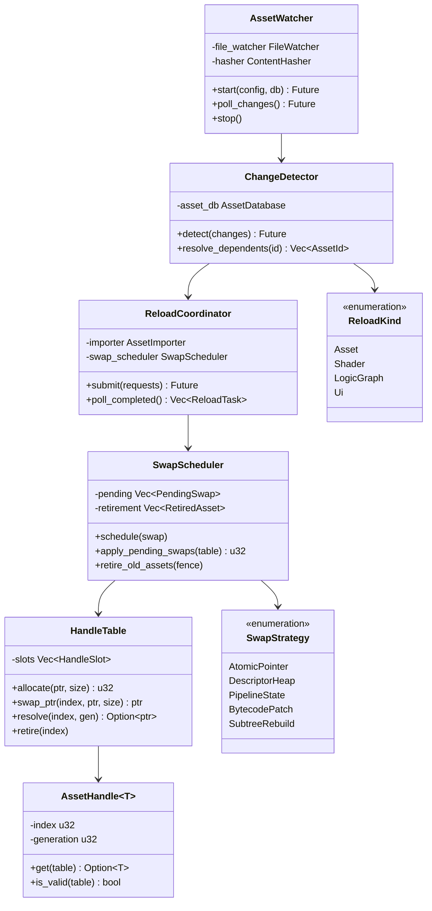
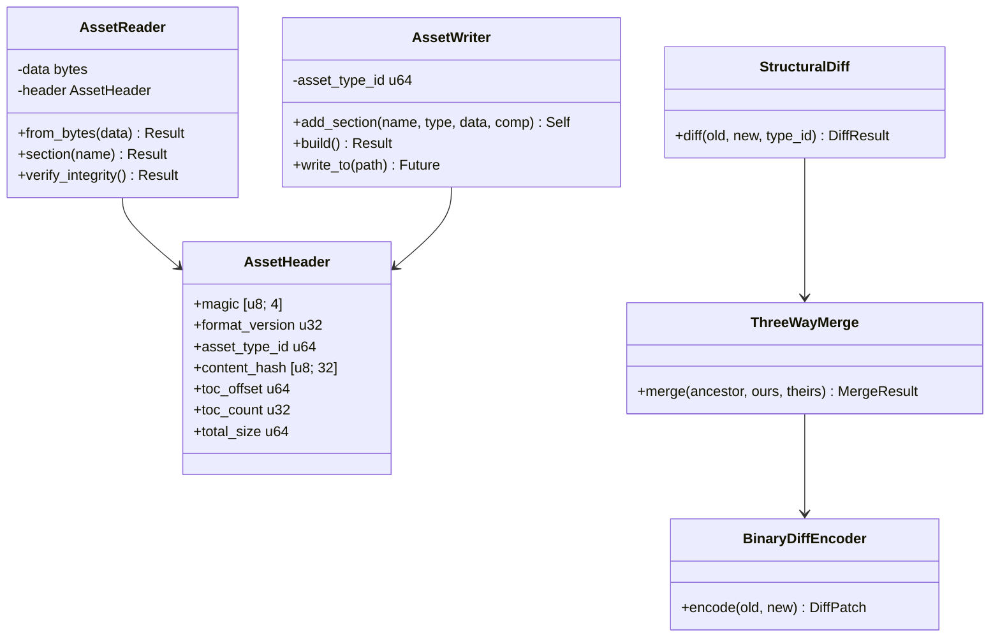

# Asset Pipeline Design

## Requirements Trace

> **Canonical sources:** Features, requirements, and user stories are in
> [features/](../../features/), [requirements/](../../requirements/), and
> [user-stories/](../../user-stories/).

### Asset Import (F-12.1)

| Feature  | Requirement |
|----------|-------------|
| F-12.1.1 | R-12.1.1    |
| F-12.1.2 | R-12.1.2    |
| F-12.1.3 | R-12.1.3    |
| F-12.1.4 | R-12.1.4    |
| F-12.1.5 | R-12.1.5    |

1. **F-12.1.1** -- Geometry import (glTF 2.0, Alembic) with BLAKE3 and CAS
2. **F-12.1.2** -- Texture import (PNG, EXR, KTX2)
3. **F-12.1.3** -- Audio import (WAV, FLAC)
4. **F-12.1.4** -- Validation with path, offset, fix suggestions
5. **F-12.1.5** -- Batch import with progress and rollback

### Asset Database (F-12.3)

| Feature   | Requirement |
|-----------|-------------|
| F-12.3.1  | R-12.3.1    |
| F-12.3.2  | R-12.3.2    |
| F-12.3.3  | R-12.3.3    |
| F-12.3.4  | R-12.3.4    |
| F-12.3.5  | R-12.3.5    |
| F-12.3.6  | R-12.3.6    |
| F-12.3.10 | R-12.3.10   |

1. **F-12.3.1** -- CAS keyed by BLAKE3 hash
2. **F-12.3.2** -- Persistent metadata (IDs, paths, hashes, deps)
3. **F-12.3.3** -- Hash-based import caching
4. **F-12.3.4** -- Incremental builds via dependency invalidation
5. **F-12.3.5** -- Full-text and tag-based faceted search
6. **F-12.3.6** -- Async thumbnail generation during import
7. **F-12.3.10** -- Asset versioning with hash-based restore

### Hot Reload (F-12.4)

| Feature  | Requirement |
|----------|-------------|
| F-12.4.1 | R-12.4.1    |
| F-12.4.2 | R-12.4.2    |
| F-12.4.3 | R-12.4.3    |
| F-12.4.4 | R-12.4.4    |
| F-12.4.5 | R-12.4.5    |
| F-12.4.6 | R-12.4.6    |
| F-12.4.7 | R-12.4.7    |

1. **F-12.4.1** -- File watcher with debounce and deduplication
2. **F-12.4.2** -- Asset hot reload with atomic pointer swap
3. **F-12.4.3** -- Shader hot reload with error overlay
4. **F-12.4.4** -- Logic graph hot reload with state preservation
5. **F-12.4.5** -- UI hot reload preserving scroll/focus/animation
6. **F-12.4.6** -- Partial re-import of modified sub-assets
7. **F-12.4.7** -- Bidirectional editor-runtime sync channel

### Asset Versioning (F-12.7)

| Feature  | Requirement |
|----------|-------------|
| F-12.7.1 | R-12.7.1    |
| F-12.7.2 | R-12.7.2    |
| F-12.7.3 | R-12.7.3    |
| F-12.7.4 | R-12.7.4    |
| F-12.7.5 | R-12.7.5    |
| F-12.7.6 | R-12.7.6    |
| F-12.7.7 | R-12.7.7    |
| F-12.7.8 | R-12.7.8    |

1. **F-12.7.1** -- Universal binary asset format: mmap, O(1) access
2. **F-12.7.2** -- Compressed bundles: LZ4 runtime, Zstd dist
3. **F-12.7.3** -- Structural asset diffing by type
4. **F-12.7.4** -- Three-way merge with Git custom merge driver
5. **F-12.7.5** -- Auto conflict resolution: LWW, union, ordered
6. **F-12.7.6** -- Spreadsheet-style data table editor
7. **F-12.7.7** -- Universal visual asset inspector
8. **F-12.7.8** -- Git LFS with custom merge driver

### Cross-Cutting Dependencies

| Dependency | Source | Consumed API |
|------------|--------|--------------|
| Tokio | F-14.3.5 | `tokio::fs`, `tokio::io` |
| ThreadPool | F-14.3.1 | `spawn`, `scope` |
| FileWatcher | F-14.6.5 | `FileWatcher`, `FileEventStream` |
| ContentHasher | F-14.6.6 | `ContentHasher`, `Blake3Hash` |
| ECS | F-1.1.1 | Component storage for asset handles |
| Reflection | F-1.3.1 | `Reflect` derive for all configs |

## Overview

The asset pipeline covers all stages of content ingest: source file import, database registration,
file watching, hot reload, binary asset format, and version control integration. It ingests standard
interchange formats:

- **Geometry** -- glTF 2.0 (meshes, scenes, skeletal animation), Alembic (vertex cache animation,
  particles)
- **Textures** -- PNG, EXR, KTX2
- **Audio** -- WAV, FLAC

All imported content flows through: source detection, format decoding, validation, BLAKE3 hashing,
CAS storage, and metadata registration. The system uses Tokio for all async file I/O and
parallelizes batch imports across `ThreadPool`.

Key design goals:

- **Deterministic builds.** Identical inputs always produce identical outputs with identical hashes.
- **Incremental imports.** Only changed sources are re-imported. Cache key = hash(source + settings
  - tool version).
- **Sub-second hot reload.** File watcher detects changes, pipeline re-imports, and atomically swaps
  runtime representations without restarting.
- **Standard interchange formats.** glTF 2.0, Alembic, PNG, EXR, KTX2, WAV, FLAC as import sources.

## Architecture

### Module Boundaries



### File Layout

```text
harmonius_content/
├── import/
│   ├── coordinator.rs   # ImportCoordinator
│   ├── registry.rs      # ImporterRegistry
│   ├── gltf.rs          # GltfImporter
│   ├── alembic.rs       # AlembicImporter
│   ├── texture.rs       # TextureImporter
│   ├── audio.rs         # AudioImporter
│   ├── validator.rs     # ImportValidator
│   └── progress.rs      # ProgressTracker
├── database/
│   ├── cas.rs           # ContentAddressableStore
│   ├── metadata.rs      # MetadataStore
│   ├── deps.rs          # DependencyGraph
│   ├── search.rs        # SearchIndex
│   ├── cache.rs         # ImportCache, CacheKey
│   ├── version.rs       # VersionStore
│   └── id.rs            # AssetId, ContentHash
└── hot_reload/
    ├── watcher.rs        # AssetWatcher
    ├── detector.rs       # ChangeDetector
    ├── coordinator.rs    # ReloadCoordinator
    ├── swap.rs           # SwapScheduler
    ├── shader.rs         # ShaderReloader
    ├── logic_graph.rs    # LogicGraphReloader
    ├── ui.rs             # UiReloader
    ├── editor_sync.rs    # EditorSync
    └── error.rs          # HotReloadError

harmonius_asset_version/
├── format/
│   ├── header.rs         # AssetHeader, TOC
│   ├── reader.rs         # AssetReader (mmap)
│   └── writer.rs         # AssetWriter
├── bundle/
│   ├── writer.rs         # BundleWriter
│   └── reader.rs         # BundleReader
├── diff/
│   └── structural.rs     # StructuralDiff
├── merge/
│   ├── three_way.rs      # ThreeWayMerge
│   └── git_driver.rs     # Git merge driver
└── patch/
    └── binary_diff.rs    # BinaryDiffEncoder
```

### Import Pipeline Flow



### Hot Reload Pipeline



### Asset Handle Indirection



### Core Data Structures



### Hot Reload Data Structures



### Versioning Structures



## API Design

### Identity Types

```rust
/// Stable unique identifier for an asset.
/// Persists across reimports, renames, and moves.
#[derive(
    Clone, Copy, Debug, PartialEq, Eq,
    Hash, Reflect,
)]
pub struct AssetId(pub u64);

/// BLAKE3 content hash (32 bytes). Used as the
/// CAS address and for integrity verification.
#[derive(
    Clone, Copy, Debug, PartialEq, Eq,
    Hash, Reflect,
)]
pub struct ContentHash {
    pub bytes: [u8; 32],
}

impl ContentHash {
    pub fn from_data(data: &[u8]) -> Self;
    pub async fn from_reader(
        reader: &mut AsyncReader,
    ) -> Result<Self, IoError>;
    pub fn hex(&self) -> String;
    pub fn prefix(&self) -> [u8; 2];
}

/// Type discriminant for imported assets.
#[derive(
    Clone, Copy, Debug, PartialEq, Eq,
    Hash, Reflect,
)]
pub enum AssetType {
    Mesh,
    Skeleton,
    Animation,
    Texture,
    Material,
    Audio,
    Scene,
    EntityTemplate,
    ShaderGraph,
    LogicGraph,
    UiLayout,
}
```

### Asset Metadata and Import Settings

```rust
/// Per-asset metadata in the MetadataStore.
#[derive(Clone, Debug, Reflect)]
pub struct AssetMetadata {
    pub asset_id: AssetId,
    pub content_hash: ContentHash,
    pub source_path: PathBuf,
    pub import_settings: ImportSettings,
    pub dependencies: Vec<AssetId>,
    pub dependents: Vec<AssetId>,
    pub tags: Vec<String>,
    pub asset_type: AssetType,
    pub byte_size: u64,
    pub created_at: u64,
    pub modified_at: u64,
    pub version: u32,
}

/// Format-specific import settings. Hashed as
/// part of the cache key.
#[derive(Clone, Debug, Reflect)]
pub enum ImportSettings {
    Gltf(GltfImportSettings),
    Alembic(AlembicImportSettings),
    Texture(TextureImportSettings),
    Audio(AudioImportSettings),
}

#[derive(Clone, Debug, Reflect)]
pub struct TextureImportSettings {
    pub compression: TextureCompression,
    pub generate_mips: bool,
    pub color_space: ColorSpace,
    pub max_dimension: u32,
}

#[derive(Clone, Debug, Reflect)]
pub struct AudioImportSettings {
    pub encoding: AudioEncoding,
    pub sample_rate: u32,
    pub channels: ChannelMode,
}
```

### Content-Addressable Store

```rust
pub struct ContentAddressableStore {
    root_path: PathBuf,
}

impl ContentAddressableStore {
    pub fn new(root_path: PathBuf) -> Self;

    /// Store blob if absent. Returns Written or
    /// Deduplicated.
    pub async fn store(
        &self,
        hash: ContentHash,
        data: &[u8],
    ) -> Result<StoreResult, CasError>;

    pub async fn load(
        &self,
        hash: ContentHash,
    ) -> Result<Option<Vec<u8>>, CasError>;

    pub async fn exists(
        &self,
        hash: ContentHash,
    ) -> Result<bool, CasError>;

    pub async fn gc(
        &self,
        referenced: &HashSet<ContentHash>,
    ) -> Result<GcStats, CasError>;
}

#[derive(Clone, Copy, Debug, PartialEq, Eq, Reflect)]
pub enum StoreResult {
    Written,
    Deduplicated,
}
```

### Metadata Store

```rust
pub struct MetadataStore {
    entries: AsyncRwLock<HashMap<AssetId, AssetMetadata>>,
    journal_path: PathBuf,
}

impl MetadataStore {
    pub async fn open(
        db_path: PathBuf,
    ) -> Result<Self, MetadataError>;
    pub async fn get(
        &self,
        id: AssetId,
    ) -> Option<AssetMetadata>;
    pub async fn put(
        &self,
        id: AssetId,
        metadata: AssetMetadata,
    );
    pub async fn remove(&self, id: AssetId) -> bool;
    pub async fn query(
        &self,
        filter: &SearchFilter,
    ) -> Vec<AssetId>;
    /// Begin atomic transaction. Drop = rollback.
    pub fn transaction(
        &self,
    ) -> MetadataTransaction;
    pub async fn flush(
        &self,
    ) -> Result<(), MetadataError>;
}
```

### Importer Trait and Coordinator

```rust
pub trait Importer: Send + Sync {
    fn extensions(&self) -> &[&str];
    fn asset_types(&self) -> &[AssetType];
    async fn import(
        &self,
        source: &SourceFile,
        settings: &ImportSettings,
    ) -> Result<ImportOutput, ImportError>;
}

pub struct ImportCoordinator {
    registry: ImporterRegistry,
    cas: ContentAddressableStore,
    metadata: MetadataStore,
    dep_graph: AsyncRwLock<DependencyGraph>,
    cache: ImportCache,
    pool: ThreadPool,
    version_store: VersionStore,
}

impl ImportCoordinator {
    pub async fn import_file(
        &self,
        path: PathBuf,
        settings: ImportSettings,
    ) -> Result<ImportResult, ImportError>;
    pub async fn batch_import(
        &self,
        entries: Vec<ImportEntry>,
    ) -> BatchImportHandle;
    pub async fn reimport(
        &self,
        id: AssetId,
    ) -> Result<ImportResult, ImportError>;
    pub async fn invalidate(
        &self,
        changed: &[AssetId],
    ) -> Vec<AssetId>;
}
```

### Asset Watcher and Change Detector

```rust
#[derive(Clone, Debug, Reflect)]
pub struct AssetWatcherConfig {
    pub watch_dirs: Vec<CanonicalPath>,
    pub debounce_ms: u32,
    pub max_batch_size: u32,
    pub batch_window_ms: u32,
}

pub struct AssetWatcher { /* ... */ }

impl AssetWatcher {
    pub async fn start(
        config: AssetWatcherConfig,
        asset_db: &AssetDatabase,
    ) -> Result<Self, HotReloadError>;
    pub async fn poll_changes(
        &mut self,
    ) -> Vec<AssetChange>;
    pub fn stop(&mut self);
}

#[derive(Clone, Copy, Debug, PartialEq, Eq, Reflect)]
pub enum ReloadKind {
    Asset,
    Shader,
    LogicGraph,
    Ui,
}

#[derive(Clone, Debug)]
pub struct ReloadRequest {
    pub primary: AssetId,
    pub new_hash: Blake3Hash,
    pub old_hash: Blake3Hash,
    pub dependents: Vec<AssetId>,
    pub kind: ReloadKind,
    pub partial: bool,
    pub sub_asset_indices: Vec<u32>,
}

pub struct ChangeDetector { /* ... */ }

impl ChangeDetector {
    pub async fn detect(
        &mut self,
        changes: &[AssetChange],
    ) -> Vec<ReloadRequest>;
    pub fn resolve_dependents(
        &self,
        asset_id: AssetId,
    ) -> Vec<AssetId>;
}
```

### Swap Scheduler and Handle Table

```rust
#[derive(Clone, Copy, Debug, PartialEq, Eq, Reflect)]
pub enum SwapStrategy {
    AtomicPointer,
    DescriptorHeap,
    PipelineState,
    BytecodePatch,
    SubtreeRebuild,
}

pub struct SwapScheduler { /* ... */ }

impl SwapScheduler {
    pub fn schedule(&mut self, swap: PendingSwap);
    pub fn apply_pending_swaps(
        &mut self,
        handle_table: &mut HandleTable,
    ) -> u32;
    pub fn retire_old_assets(
        &mut self,
        completed_fence: u64,
    );
}

pub struct HandleTable { /* ... */ }

impl HandleTable {
    pub fn allocate(
        &mut self,
        ptr: *const u8,
        data_size: usize,
    ) -> (u32, u32);
    pub fn swap_ptr(
        &mut self,
        index: u32,
        new_ptr: *const u8,
        new_size: usize,
    ) -> (*const u8, usize);
    pub fn resolve(
        &self,
        index: u32,
        generation: u32,
    ) -> Option<*const u8>;
}

#[derive(Clone, Copy, Debug, PartialEq, Eq, Hash)]
pub struct AssetHandle<T> {
    index: u32,
    generation: u32,
    _marker: core::marker::PhantomData<T>,
}
```

### Universal Binary Asset Format (F-12.7.1)

```rust
pub const ASSET_MAGIC: [u8; 4] = *b"HAST";
pub const FORMAT_VERSION: u32 = 1;

#[repr(C)]
#[derive(Clone, Debug, Reflect)]
pub struct AssetHeader {
    pub magic: [u8; 4],
    pub format_version: u32,
    pub asset_type_id: u64,
    pub schema_version: SchemaVersion,
    pub content_hash: [u8; 32],
    pub toc_offset: u64,
    pub toc_count: u32,
    pub flags: AssetFlags,
    pub total_size: u64,
}

/// Memory-mapped asset reader with O(1) section
/// access.
pub struct AssetReader<'a> {
    data: &'a [u8],
    header: &'a AssetHeader,
    toc: &'a [SectionDescriptor],
}

impl<'a> AssetReader<'a> {
    pub fn from_bytes(
        data: &'a [u8],
    ) -> Result<Self, AssetError>;
    pub fn section(
        &self,
        name: &str,
    ) -> Result<&'a [u8], AssetError>;
    pub fn verify_integrity(
        &self,
    ) -> Result<(), AssetError>;
}

/// Builds a new asset file with sections.
pub struct AssetWriter {
    asset_type_id: u64,
    schema_version: SchemaVersion,
    sections: Vec<WriterSection>,
}

impl AssetWriter {
    pub fn add_section(
        &mut self,
        name: &str,
        section_type: SectionType,
        data: Vec<u8>,
        compression: Compression,
    ) -> &mut Self;
    pub fn build(
        self,
    ) -> Result<Vec<u8>, AssetError>;
    pub async fn write_to(
        self,
        path: &std::path::Path,
    ) -> Result<u64, IoError>;
}
```

### Material Mapping (F-12.6.25)

```rust
/// Source format for material translation.
#[derive(
    Clone, Copy, Debug, PartialEq, Eq, Reflect,
)]
pub enum MaterialSource {
    GltfPbr,
    GltfSpecGloss,
}

#[derive(
    Clone, Copy, Debug, PartialEq, Eq, Reflect,
)]
pub enum ValueTransform {
    Identity,
    Invert,
    SrgbToLinear,
    LinearToSrgb,
}

pub struct MaterialMapper {
    rules: Vec<MaterialMappingRule>,
    fallbacks: HashMap<HarTextureSlot, [f32; 4]>,
}

impl MaterialMapper {
    pub fn load_rules(
        &mut self,
        data: &[u8],
    ) -> Result<(), MaterialMapError>;
    pub fn translate(
        &self,
        source_fmt: MaterialSource,
        source: &ImportedMaterial,
    ) -> Result<
        (HarMaterialDesc, Vec<MaterialWarning>),
        MaterialMapError,
    >;
}
```

### Three-Way Merge (F-12.7.4)

```rust
pub enum MergeResult {
    Success { merged: Vec<u8> },
    AutoResolved {
        merged: Vec<u8>,
        resolutions: Vec<AutoResolution>,
    },
    Conflict {
        partial: Vec<u8>,
        conflicts: Vec<MergeConflict>,
    },
}

#[derive(Clone, Copy, Debug, PartialEq, Eq, Reflect)]
pub enum ResolutionStrategy {
    LastWriterWins,
    Union,
    DeterministicOrder,
}

pub struct ThreeWayMerge {
    diff: StructuralDiff,
    strategies: HashMap<u64, MergeStrategy>,
}

impl ThreeWayMerge {
    pub fn merge(
        &self,
        ancestor: &AssetReader<'_>,
        ours: &AssetReader<'_>,
        theirs: &AssetReader<'_>,
    ) -> Result<MergeResult, MergeError>;
}

/// Git custom merge driver entry point.
pub fn git_merge_driver(
    ancestor_path: &Path,
    ours_path: &Path,
    theirs_path: &Path,
    output_path: &Path,
) -> Result<i32, MergeError>;
```

### Error Types

```rust
pub enum ImportError {
    FileNotFound { path: PathBuf },
    UnsupportedFormat { extension: String },
    ValidationFailed {
        diagnostics: Vec<ValidationDiagnostic>,
    },
    CorruptFile { path: PathBuf, message: String },
    HashMismatch {
        expected: ContentHash,
        actual: ContentHash,
    },
    Io(IoError),
    Cancelled,
}

pub enum HotReloadError {
    Fs(FsError),
    AssetNotFound { asset_id: AssetId },
    ImportFailed { asset_id: AssetId, message: String },
    ProcessFailed { asset_id: AssetId, message: String },
    ShaderCompileFailed {
        errors: Vec<ShaderCompileError>,
    },
    GraphCompileFailed {
        asset_id: AssetId,
        message: String,
    },
    SyncError { message: String },
    WatchDirNotFound { path: String },
    CapacityExceeded { current: u32, max: u32 },
}
```

## Data Flow

### Single File Import Lifecycle

1. Detect format from file extension
2. Async read source file via Tokio
3. Check import cache (BLAKE3(source + settings + version))
4. On cache miss: run format-specific importer
5. BLAKE3 hash artifact, store in CAS (deduplicates)
6. Register metadata in `MetadataStore`
7. Update `DependencyGraph` edges
8. Record `VersionEntry` for history
9. Insert cache entry for future hits

### Batch Import with Cancellation

1. Begin `MetadataTransaction`
2. Fan out imports across `ThreadPool::scope`
3. Each task checks `CancellationToken` before work
4. On completion: commit transaction atomically
5. On cancel: drop transaction (automatic rollback)

### Hot Reload End-to-End

1. `FileWatcher` delivers raw filesystem event
2. `AssetWatcher` batches (50 ms window), deduplicates, maps paths to `AssetId`
3. `ChangeDetector` BLAKE3-filters false positives, walks dependency graph for transitive
   dependents, classifies by `ReloadKind`
4. `ReloadCoordinator` spawns async re-import/reprocess
5. Type-specific reloaders handle domain logic:
   - **Shader**: recompile permutations, build new PSOs
   - **Logic graph**: check variable layout compatibility
   - **UI**: capture state snapshot, rebuild, restore
6. `SwapScheduler` enqueues `PendingSwap`
7. At frame boundary: `apply_pending_swaps()` atomically replaces pointers in `HandleTable`
8. Old data retired after GPU fence completes

## Platform Considerations

### Async I/O

| Platform | I/O Backend | Usage |
|----------|-------------|-------|
| Windows | Tokio (IOCP) | Overlapped reads/writes |
| macOS | Tokio (kqueue) | Async file ops |
| Linux | Tokio (epoll) | Async file ops |

### File Watcher Backends

| Platform | API |
|----------|-----|
| Windows | `ReadDirectoryChangesExW` |
| macOS | `FSEvents` |
| Linux | `inotify_add_watch` |

### Swap Strategy per Asset Type

| Asset Type | Strategy | Latency |
|------------|----------|---------|
| Texture | DescriptorHeap | < 2 s |
| Mesh | AtomicPointer | < 3 s |
| Material | AtomicPointer | < 2 s |
| Shader | PipelineState | < 5 s |
| Logic graph | BytecodePatch | < 500 ms |
| UI layout | SubtreeRebuild | < 500 ms |
| Audio | AtomicPointer | < 1 s |

### Supported Import Formats

| Category | Format | Extensions |
|----------|--------|------------|
| Geometry | glTF 2.0 | `.gltf`, `.glb` |
| Geometry | Alembic | `.abc` |
| Texture | PNG | `.png` |
| Texture | EXR | `.exr` |
| Texture | KTX2 | `.ktx2` |
| Audio | WAV | `.wav` |
| Audio | FLAC | `.flac` |

### DCC-to-Format Export Guidance

| DCC Tool | Geometry | Textures | Animation |
|----------|----------|----------|-----------|
| Blender | glTF 2.0 | PNG/EXR | glTF 2.0 |
| Maya | glTF 2.0 | PNG/EXR | glTF 2.0 / Alembic |
| Houdini | Alembic | EXR | Alembic |
| 3ds Max | glTF 2.0 | PNG/EXR | glTF 2.0 |
| ZBrush | glTF 2.0 | PNG/EXR | n/a |
| Substance | n/a | PNG/EXR | n/a |
| Photoshop | n/a | PNG/EXR | n/a |

1. **Blender** -- native glTF 2.0 exporter; use for meshes, skeletal animation, and full scenes
2. **Maya** -- glTF via Autodesk plugin for rigged meshes; Alembic for vertex cache animation
3. **Houdini** -- Alembic for particles and vertex cache animation; EXR for baked textures
4. **3ds Max** -- Babylon.js glTF exporter plugin
5. **ZBrush** -- export high-poly as glTF via decimation or retopology
6. **Substance** -- export texture maps as PNG or EXR (linear color space preferred)
7. **Photoshop** -- export textures as PNG (sRGB) or EXR (linear HDR)

### CAS Storage Paths

| Platform | Path |
|----------|------|
| Windows | `%APPDATA%\Harmonius\cas\` |
| macOS | `~/Library/App Support/Harmonius/cas/` |
| Linux | `~/.local/share/harmonius/cas/` |

### Proposed Dependencies

| Crate | Purpose |
|-------|---------|
| `blake3` | Content hashing (SIMD) |
| `claxon` | FLAC decoding |
| `exr` | EXR image decoding |
| `gltf` | glTF 2.0 parsing |
| `hound` | WAV decoding |
| `image` | PNG/texture decoding |
| `ktx2` | KTX2 texture decoding |
| `tokio` | Async runtime and I/O |
| `uuid` | Asset ID generation |

## Test Plan

Test cases are defined inline below.

### Unit Tests

| Test | Req |
|------|-----|
| `test_content_hash_deterministic` | R-12.3.1 |
| `test_cas_store_and_load` | R-12.3.1 |
| `test_cas_deduplication` | R-12.3.1 |
| `test_cas_gc_removes_unreferenced` | R-12.3.1 |
| `test_metadata_put_get` | R-12.3.2 |
| `test_metadata_transaction_commit` | R-12.1.5 |
| `test_metadata_transaction_rollback` | R-12.1.5 |
| `test_dep_graph_transitive` | R-12.3.4 |
| `test_dep_graph_cycle_detect` | R-12.2.8 |
| `test_cache_hit_skips_import` | R-12.3.3 |
| `test_validate_gltf_header` | R-12.1.4 |
| `test_search_by_text` | R-12.3.5 |
| `test_version_record_and_history` | R-12.3.10 |
| `test_importer_registry_find` | US-12.1.7 |
| `test_change_detector_filters_false_positive` | R-12.4.1 |
| `test_change_detector_resolves_dependents` | R-12.4.2 |
| `test_handle_table_swap_preserves_handle` | R-12.4.2 |
| `test_swap_scheduler_applies_at_boundary` | US-12.4.9 |
| `test_shader_reloader_error_preserves_old` | R-12.4.3 |
| `test_logic_graph_compatible_layout` | R-12.4.4 |
| `test_ui_reloader_preserves_scroll` | R-12.4.5 |
| `test_debounce_coalesces_rapid_events` | R-12.4.1 |
| `test_editor_sync_property_roundtrip` | R-12.4.7 |
| `test_asset_header_roundtrip` | R-12.7.1 |
| `test_section_o1_access` | R-12.7.1 |
| `test_material_mapper_gltf_pbr` | R-12.6.25 |
| `test_merge_non_overlapping` | R-12.7.4 |
| `test_merge_conflict_detected` | R-12.7.4 |
| `test_binary_diff_apply_roundtrip` | R-12.7.2 |

### Integration Tests

| Test | Req |
|------|-----|
| `test_import_gltf_end_to_end` | R-12.1.1 |
| `test_import_alembic_end_to_end` | R-12.1.1 |
| `test_import_png_end_to_end` | R-12.1.2 |
| `test_import_exr_end_to_end` | R-12.1.2 |
| `test_import_ktx2_end_to_end` | R-12.1.2 |
| `test_import_wav_end_to_end` | R-12.1.3 |
| `test_import_flac_end_to_end` | R-12.1.3 |
| `test_batch_import_100_assets` | R-12.1.5 |
| `test_batch_cancel_rollback` | R-12.1.5 |
| `test_incremental_reimport` | R-12.3.4 |
| `test_texture_hot_reload_e2e` | R-12.4.2 |
| `test_shader_hot_reload_valid` | R-12.4.3 |
| `test_logic_graph_reload_500ms` | R-12.4.4 |
| `test_hot_reload_no_memory_leak` | US-12.4.10 |
| `test_headless_batch_identical` | R-12.6.26 |
| `test_full_merge_workflow` | R-12.7.4 |

### Benchmarks

| Benchmark | Target |
|-----------|--------|
| BLAKE3 hash 1 GB | < 1.5 s single core |
| CAS store 10 MB blob | < 20 ms |
| Import 100 glTF assets | < 10 s (8 cores) |
| Cache lookup | < 0.1 ms |
| Full-text search (1M entries) | < 100 ms |
| Texture hot reload latency | < 2 s |
| Shader hot reload latency | < 5 s |
| Logic graph hot reload | < 500 ms |
| Handle table resolve | < 10 ns |
| File change detection | < 500 ms |
| glTF parse 100k verts | < 10 ms |
| Asset mmap section access | < 1 us |
| Three-way merge (clean) | < 200 ms |

## Open Questions

1. **Metadata persistence format.** Custom binary with WAL, SQLite via `rusqlite`, or per-asset RON
   files? Impacts search at scale.
2. **CAS blob compression.** Compress in CAS (LZ4/Zstd) or raw? Streaming subsystem compresses at
   archive level, so CAS compression may be redundant.
3. **Asset ID stability across branches.** Independent UUID generation creates duplicates on merge.
   Deterministic IDs from source path break on rename.
4. **Descriptor heap update atomicity.** Vulkan descriptor set updates require double-buffering or
   descriptor indexing for texture hot reload.
5. **Structural diff granularity.** Per-vertex mesh diff (precise but slow) vs summary statistics
   (fast but coarse)?
6. **Alembic large cache handling.** Alembic files can be very large (multi-GB). Stream-parse or
   require pre-split sub-files?
