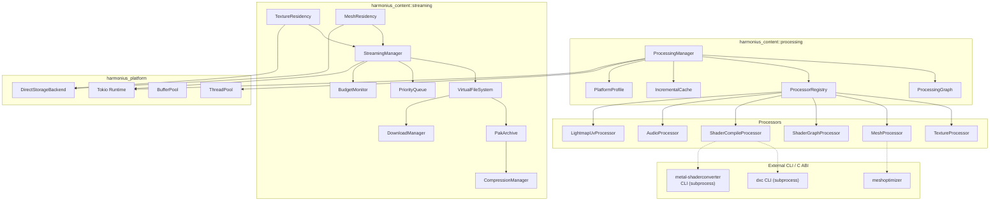
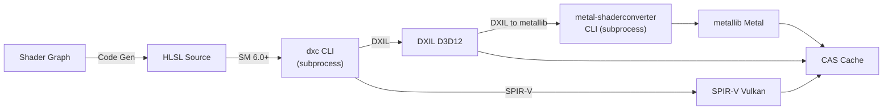
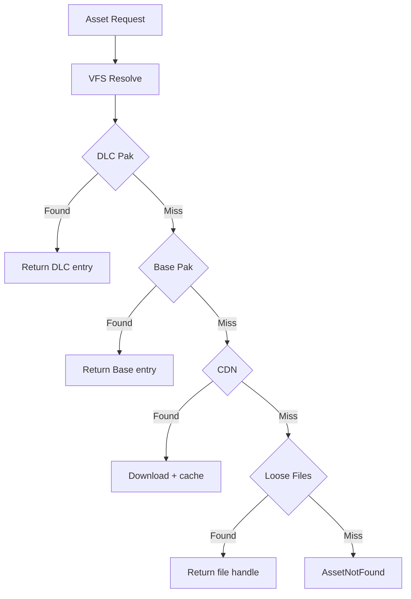
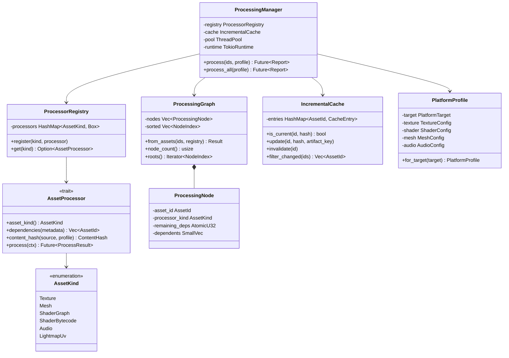
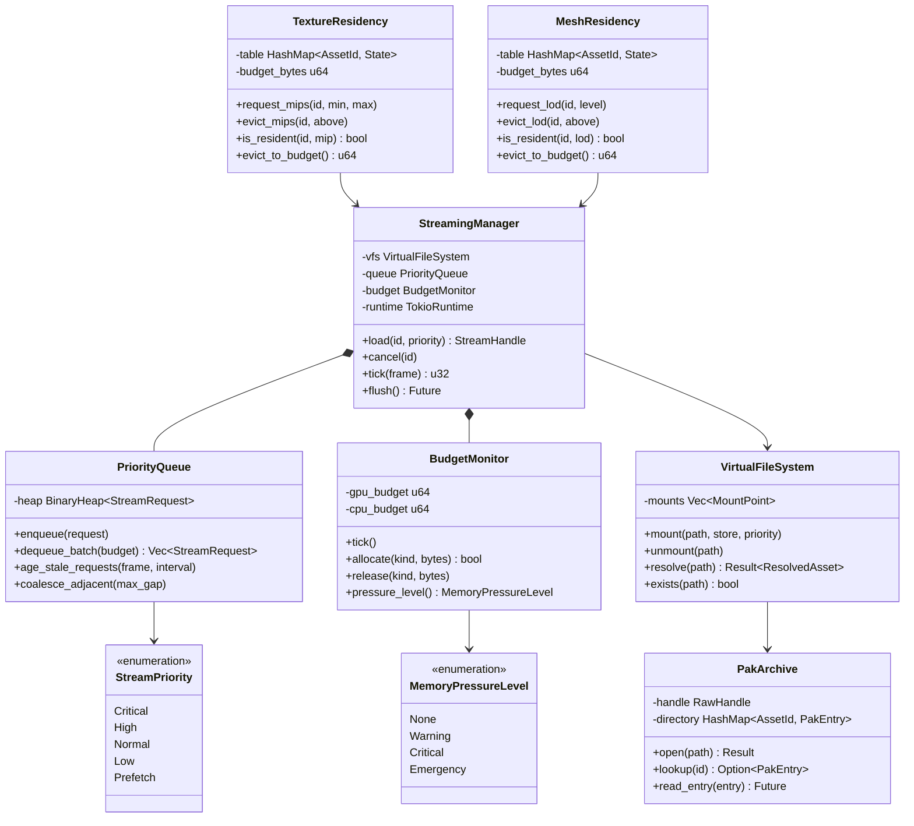
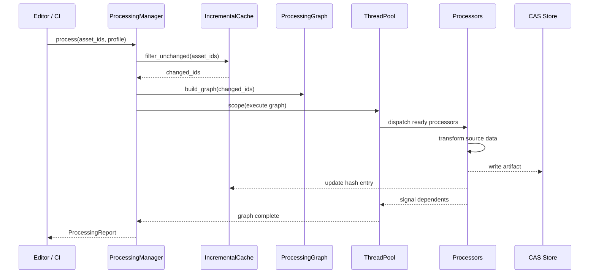
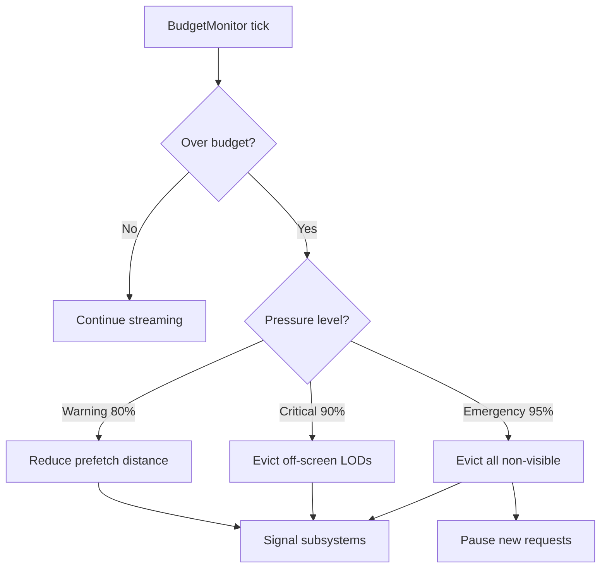

# Asset Processing and Streaming Design

## Requirements Trace

> **Canonical sources:** Features, requirements, and user stories are in
> [features/](../../features/), [requirements/](../../requirements/), and
> [user-stories/](../../user-stories/).

### Asset Processing (F-12.2)

| Feature  | Requirement | User Stories |
|----------|-------------|--------------|
| F-12.2.1 | R-12.2.1    | US-12.2.1, US-12.2.12 |
| F-12.2.2 | R-12.2.2    | US-12.2.2, US-12.2.13 |
| F-12.2.3 | R-12.2.3    | US-12.2.3, US-12.2.19 |
| F-12.2.4 | R-12.2.4    | US-12.2.4 |
| F-12.2.5 | R-12.2.5    | US-12.2.5, US-12.2.20 |
| F-12.2.6 | R-12.2.6    | US-12.2.6, US-12.2.18 |
| F-12.2.7 | R-12.2.7    | US-12.2.7, US-12.2.16 |
| F-12.2.8 | R-12.2.8    | US-12.2.9 |
| F-12.2.9 | R-12.2.9    | US-12.2.8, US-12.2.14 |

1. **F-12.2.1** -- Texture compression (BC7, ASTC, ETC2)
2. **F-12.2.2** -- LOD chain via edge-collapse simplification
3. **F-12.2.3** -- Meshlet building (64v/124t) with bounds
4. **F-12.2.4** -- Vertex cache and overdraw optimization
5. **F-12.2.5** -- Lightmap UV atlas with uniform density
6. **F-12.2.6** -- Audio encoding (Opus, ADPCM, PCM)
7. **F-12.2.7** -- Shader graph to HLSL code generation
8. **F-12.2.8** -- Asset dependency graph for rebuilds
9. **F-12.2.9** -- `dxc` and `metal-shaderconverter` CLI pipeline

### Asset Streaming (F-12.5)

| Feature   | Requirement | User Stories |
|-----------|-------------|--------------|
| F-12.5.1  | R-12.5.1    | US-12.5.5, US-12.5.18 |
| F-12.5.2  | R-12.5.2    | US-12.5.1, US-12.5.17 |
| F-12.5.3  | R-12.5.3    | US-12.5.6 |
| F-12.5.4  | R-12.5.4    | US-12.5.2, US-12.5.15 |
| F-12.5.5  | R-12.5.5    | US-12.5.3, US-12.5.15 |
| F-12.5.6  | R-12.5.6    | US-12.5.7 |
| F-12.5.7  | R-12.5.7    | US-12.5.8, US-12.5.16 |
| F-12.5.8  | R-12.5.8    | US-12.5.9, US-12.5.18 |
| F-12.5.9  | R-12.5.9    | US-12.5.10 |
| F-12.5.10 | R-12.5.10   | US-12.5.4, US-12.5.19 |

1. **F-12.5.1** -- VFS with unified namespace over loose/pak/CDN
2. **F-12.5.2** -- Platform-native async I/O, no stdlib
3. **F-12.5.3** -- GPU direct storage (DirectStorage / Metal IO)
4. **F-12.5.4** -- Texture mip streaming with residency manager
5. **F-12.5.5** -- Mesh LOD streaming with dithered cross-fade
6. **F-12.5.6** -- Priority queue by screen-size and distance
7. **F-12.5.7** -- Memory budget monitor with eviction
8. **F-12.5.8** -- Seekable pak archives with O(1) lookup
9. **F-12.5.9** -- Per-chunk LZ4/Zstd compression
10. **F-12.5.10** -- Download-on-demand from CDN with BLAKE3

### Cross-Cutting Dependencies

| Dependency | Source | Consumed API |
|------------|--------|--------------|
| ThreadPool | F-14.3.1 | `scope`, `spawn`, `execute_graph` |
| TaskGraph | F-14.3.3 | `TaskGraphBuilder`, `TaskGraph` |
| Tokio | F-14.3.5 | `tokio::fs`, `tokio::io` |
| BufferPool | F-1.8.9 | Page-aligned I/O buffers |
| CAS Store | F-12.3.2 | BLAKE3-keyed content storage |
| Reflection | F-1.3.1 | `Reflect` derive for configs |
| ECS | F-1.1.20 | Parallel queries, change detection |
| Spatial Index | F-1.9.1 | Camera distance queries |

## Overview

The asset processing and streaming subsystem transforms imported source assets into GPU-ready,
platform-optimized runtime artifacts and delivers them to CPU/GPU memory without blocking the game
loop.

### Processing

Each processing step (texture compression, mesh optimization, shader compilation) is an independent,
stateless processor implementing `AssetProcessor`. Processors compose into a DAG via the processing
graph and execute in parallel on the thread pool.

Four principles:

1. **Processor-per-concern.** Independent, composable processors.
2. **Incremental by default.** BLAKE3 hashes track changes.
3. **Platform-aware.** `PlatformProfile` selects formats per target.
4. **Parallel.** Fan-out across thread pool; scoped borrows.

### Streaming

Four layers:

1. **VFS.** Unified path namespace over loose files, pak archives, and remote CDN stores.
2. **StreamingManager.** Async orchestrator with priority queue, bandwidth budget, and I/O dispatch.
3. **LOD Residency.** Texture mip and mesh LOD tracking with budget-aware eviction.
4. **Archive and Compression.** Seekable pak files with per-chunk LZ4/Zstd compression.

### Performance Targets

| Metric | Target | Source |
|--------|--------|--------|
| Texture compression | 100+ tex/s (1K BC7) | US-12.2.15 |
| Mesh optimization | 50K tri/ms per LOD | US-12.2.15 |
| Shader compile (cold) | < 500 ms | US-12.2.15 |
| Shader compile (cached) | < 1 ms | US-12.2.15 |
| Incremental rebuild (1 changed) | < 2 s | US-12.2.15 |
| Async I/O throughput | >= 80% disk BW | US-12.5.17 |
| GPU direct storage | >= 3 GB/s NVMe | R-12.5.3 |
| Texture mip stream-in | < 500 ms | R-12.5.4 |
| LZ4 decompress (64 KB) | < 1 ms | R-12.5.9 |
| Pak lookup | O(1) by asset ID | R-12.5.8 |

## Architecture

### Module Boundaries



### File Layout

```text
harmonius_content/
├── processing/
│   ├── manager.rs        # ProcessingManager
│   ├── graph.rs          # ProcessingGraph
│   ├── registry.rs       # ProcessorRegistry
│   ├── cache.rs          # IncrementalCache
│   ├── profile.rs        # PlatformProfile
│   ├── texture.rs        # TextureProcessor
│   ├── mesh.rs           # MeshProcessor
│   ├── shader_graph.rs   # ShaderGraphProcessor
│   ├── shader_compile.rs # ShaderCompileProcessor
│   ├── audio.rs          # AudioProcessor
│   ├── lightmap_uv.rs    # LightmapUvProcessor
│   └── error.rs          # ProcessingError
└── streaming/
    ├── vfs.rs            # VirtualFileSystem
    ├── manager.rs        # StreamingManager
    ├── priority.rs       # PriorityQueue
    ├── texture.rs        # TextureResidency
    ├── mesh.rs           # MeshResidency
    ├── budget.rs         # BudgetMonitor
    ├── archive.rs        # PakArchive
    ├── compression.rs    # CompressionManager
    ├── download.rs       # DownloadManager
    └── direct_storage.rs # DirectStorageBackend
```

### Shader Compilation Pipeline



### VFS Mount Resolution



### Processing Data Structures



### Streaming Data Structures



## API Design

### Asset Processor Trait

```rust
#[derive(
    Clone, Copy, Debug, PartialEq, Eq,
    Hash, Reflect,
)]
pub enum AssetKind {
    Texture,
    Mesh,
    ShaderGraph,
    ShaderBytecode,
    Audio,
    LightmapUv,
}

/// BLAKE3 content hash of source + config.
#[derive(
    Clone, Copy, Debug, PartialEq, Eq,
    Hash, Reflect,
)]
pub struct ContentHash(pub [u8; 32]);

/// CAS key for a processed artifact.
#[derive(
    Clone, Copy, Debug, PartialEq, Eq,
    Hash, Reflect,
)]
pub struct ArtifactKey(pub [u8; 32]);

/// Context passed to each processor invocation.
pub struct ProcessingContext<'a> {
    pub source: &'a [u8],
    pub metadata: &'a AssetMetadata,
    pub profile: &'a PlatformProfile,
    pub runtime: &'a tokio::runtime::Handle,
    pub cas: &'a CasStore,
    pub buffers: &'a BufferPool,
}

/// Stateless processor. All state flows through
/// ProcessingContext.
pub trait AssetProcessor: Send + Sync {
    fn asset_kind(&self) -> AssetKind;
    fn dependencies(
        &self,
        metadata: &AssetMetadata,
    ) -> Vec<AssetId>;
    fn content_hash(
        &self,
        source: &[u8],
        profile: &PlatformProfile,
    ) -> ContentHash;
    fn process(
        &self,
        ctx: ProcessingContext<'_>,
    ) -> impl Future<Output = Result<
        ProcessResult,
        ProcessingError,
    >> + Send;
}

pub struct ProcessResult {
    pub artifact_key: ArtifactKey,
    pub artifact_size: u64,
    pub elapsed: Duration,
    pub warnings: Vec<ProcessingWarning>,
}
```

### Processing Graph

```rust
#[derive(Clone, Copy, Debug, PartialEq, Eq, Hash)]
pub struct NodeIndex(pub(crate) u32);

pub struct ProcessingNode {
    pub asset_id: AssetId,
    pub processor_kind: AssetKind,
    remaining_deps: AtomicU32,
    dependents: SmallVec<[NodeIndex; 4]>,
}

/// Immutable, topologically-sorted processing DAG.
pub struct ProcessingGraph {
    nodes: Vec<ProcessingNode>,
    sorted_order: Vec<NodeIndex>,
    root_count: u32,
}

pub struct ProcessingGraphBuilder {
    nodes: Vec<ProcessingNodeDesc>,
    edges: Vec<(NodeIndex, NodeIndex)>,
}

impl ProcessingGraphBuilder {
    pub fn add_asset(
        &mut self,
        asset_id: AssetId,
        kind: AssetKind,
    ) -> NodeIndex;
    pub fn add_dependency(
        &mut self,
        dependency: NodeIndex,
        dependent: NodeIndex,
    );
    pub fn build(
        self,
    ) -> Result<ProcessingGraph, ProcessingError>;
}
```

### Platform Profiles

```rust
#[derive(
    Clone, Copy, Debug, PartialEq, Eq,
    Hash, Reflect,
)]
pub enum PlatformTarget {
    WindowsD3D12,
    WindowsVulkan,
    MacOSMetal,
    LinuxVulkan,
    IOSMetal,
    AndroidVulkan,
    XboxD3D12,
    PlayStationGnm,
    SwitchVulkan,
}

#[derive(Clone, Debug, Reflect)]
pub struct TextureConfig {
    pub color_format: TextureFormat,
    pub normal_format: TextureFormat,
    pub hdr_format: TextureFormat,
    pub quality: u8,
    pub generate_mipmaps: bool,
    pub max_dimension: u32,
}

#[derive(Clone, Debug, Reflect)]
pub struct ShaderConfig {
    pub backends: Vec<ShaderBackend>,
    pub shader_model: ShaderModel,
    pub optimization_level: u8,
    pub debug_info: bool,
}

#[derive(Clone, Debug, Reflect)]
pub struct MeshConfig {
    pub lod_levels: u8,
    pub lod_ratios: Vec<f32>,
    pub meshlet_max_vertices: u32,
    pub meshlet_max_triangles: u32,
    pub optimize_vertex_cache: bool,
    pub optimize_overdraw: bool,
}

#[derive(Clone, Debug, Reflect)]
pub struct AudioConfig {
    pub music_format: AudioFormat,
    pub sfx_format: AudioFormat,
    pub voice_format: AudioFormat,
    pub opus_bitrate: u32,
    pub sample_rate: u32,
}

#[derive(Clone, Debug, Reflect)]
pub struct PlatformProfile {
    pub target: PlatformTarget,
    pub texture: TextureConfig,
    pub shader: ShaderConfig,
    pub mesh: MeshConfig,
    pub audio: AudioConfig,
}

impl PlatformProfile {
    pub fn for_target(target: PlatformTarget) -> Self;
}
```

### Default Platform Profiles

| Platform | Texture | Shader | LODs | Audio |
|----------|---------|--------|------|-------|
| WindowsD3D12 | BC7/BC6H | DXIL | 4 | Opus 128k |
| MacOSMetal | ASTC 4x4 | MSL | 4 | Opus 128k |
| LinuxVulkan | BC7/BC6H | SPIR-V | 4 | Opus 128k |
| IOSMetal | ASTC 6x6 | MSL | 3 | Opus 64k |
| AndroidVulkan | ASTC/ETC2 | SPIR-V | 3 | Opus 64k |

### Processing Manager

```rust
pub struct ProcessingManagerConfig {
    pub max_concurrency: u32,
    pub cache_path: PathBuf,
}

pub struct ProcessingReport {
    pub processed_count: u32,
    pub skipped_count: u32,
    pub failed_count: u32,
    pub results: Vec<AssetProcessingResult>,
    pub elapsed: Duration,
}

pub struct ProcessingManager {
    registry: ProcessorRegistry,
    cache: IncrementalCache,
    pool: ThreadPool,
    runtime: tokio::runtime::Handle,
    buffers: BufferPool,
    config: ProcessingManagerConfig,
}

impl ProcessingManager {
    pub async fn process(
        &mut self,
        asset_ids: &[AssetId],
        profile: &PlatformProfile,
        db: &AssetDatabase,
    ) -> Result<ProcessingReport, ProcessingError>;
    pub async fn process_all(
        &mut self,
        profile: &PlatformProfile,
        db: &AssetDatabase,
    ) -> Result<ProcessingReport, ProcessingError>;
    pub async fn process_multi_platform(
        &mut self,
        asset_ids: &[AssetId],
        profiles: &[PlatformProfile],
        db: &AssetDatabase,
    ) -> Result<Vec<ProcessingReport>, ProcessingError>;
}
```

### Virtual File System

```rust
#[derive(Clone, Debug, PartialEq, Eq, Hash, Reflect)]
pub struct VfsPath(SmallString<128>);

pub type MountPriority = u32;

pub struct ResolvedAsset {
    pub handle: RawHandle,
    pub offset: u64,
    pub compressed_size: u32,
    pub uncompressed_size: u32,
    pub codec: CompressionCodec,
    pub content_hash: Blake3Hash,
}

pub enum BackingStore {
    LooseFiles { root_handle: RawHandle },
    PakArchive(PakArchive),
    RemoteCdn(DownloadManager),
}

pub struct VirtualFileSystem { /* ... */ }

impl VirtualFileSystem {
    pub fn mount(
        &mut self,
        vfs_root: VfsPath,
        store: BackingStore,
        priority: MountPriority,
    );
    pub fn unmount(&mut self, vfs_root: &VfsPath);
    pub fn resolve(
        &self,
        path: &VfsPath,
    ) -> Result<ResolvedAsset, VfsError>;
    pub fn exists(&self, path: &VfsPath) -> bool;
    pub fn list(
        &self,
        dir: &VfsPath,
    ) -> Vec<VfsPath>;
}
```

### Streaming Manager

```rust
#[derive(
    Clone, Copy, Debug, PartialEq, Eq,
    PartialOrd, Ord, Reflect,
)]
pub enum StreamPriority {
    Critical = 4,
    High = 3,
    Normal = 2,
    Low = 1,
    Prefetch = 0,
}

pub struct StreamingConfig {
    pub max_in_flight: u32,
    pub bandwidth_budget_per_tick: u64,
    pub aging_interval_frames: u32,
    pub gpu_budget_bytes: u64,
    pub cpu_budget_bytes: u64,
}

pub struct StreamingManager { /* ... */ }

impl StreamingManager {
    pub fn new(
        config: StreamingConfig,
        vfs: VirtualFileSystem,
        runtime: tokio::runtime::Handle,
        buffer_pool: BufferPool,
    ) -> Self;
    pub fn load(
        &self,
        asset_id: AssetId,
        priority: StreamPriority,
        screen_size: f32,
        camera_distance: f32,
        asset_weight: AssetTypeWeight,
        deadline_frame: u64,
    ) -> StreamHandle;
    pub fn cancel(&self, asset_id: AssetId);
    pub async fn tick(
        &self,
        current_frame: u64,
    ) -> u32;
    pub async fn flush(&self);
}
```

### Pak Archive

```rust
pub const PAK_MAGIC: u32 = 0x4B415048;

#[derive(Clone, Debug, Reflect)]
pub struct PakHeader {
    pub magic: u32,
    pub version: u32,
    pub entry_count: u32,
    pub directory_offset: u64,
    pub region_table_offset: u64,
    pub directory_hash: Blake3Hash,
}

#[derive(Clone, Debug, Reflect)]
pub struct PakEntry {
    pub asset_id: AssetId,
    pub offset: u64,
    pub compressed_size: u32,
    pub uncompressed_size: u32,
    pub codec: CompressionCodec,
    pub content_hash: Blake3Hash,
    pub region_id: u16,
    pub priority_tier: u8,
}

#[derive(
    Clone, Copy, Debug, PartialEq, Eq, Reflect,
)]
pub enum CompressionCodec {
    None,
    Lz4,
    Zstd,
}

pub struct PakArchive { /* ... */ }

impl PakArchive {
    pub async fn open(
        path: &VfsPath,
    ) -> Result<Self, PakError>;
    pub fn lookup(
        &self,
        id: AssetId,
    ) -> Option<&PakEntry>;
    pub async fn read_entry(
        &self,
        entry: &PakEntry,
        buffer_pool: &BufferPool,
    ) -> Result<BufferSlot, PakError>;
}
```

### Texture and Mesh Residency

```rust
pub struct TextureResidency { /* ... */ }

impl TextureResidency {
    pub fn new(budget_bytes: u64) -> Self;
    pub fn request_mips(
        &mut self,
        id: AssetId,
        min_mip: u8,
        max_mip: u8,
        manager: &StreamingManager,
    );
    pub fn evict_mips(
        &mut self,
        id: AssetId,
        above_mip: u8,
    );
    pub fn is_resident(
        &self,
        id: AssetId,
        mip: u8,
    ) -> bool;
    pub fn evict_to_budget(&mut self) -> u64;
}

pub struct MeshResidency { /* ... */ }

impl MeshResidency {
    pub fn new(budget_bytes: u64) -> Self;
    pub fn request_lod(
        &mut self,
        id: AssetId,
        lod_level: u8,
        manager: &StreamingManager,
    );
    pub fn is_resident(
        &self,
        id: AssetId,
        lod: u8,
    ) -> bool;
    pub fn evict_to_budget(&mut self) -> u64;
}
```

### Budget Monitor

```rust
#[derive(
    Clone, Copy, Debug, PartialEq, Eq,
    PartialOrd, Ord, Reflect,
)]
pub enum MemoryPressureLevel {
    None = 0,
    Warning = 1,
    Critical = 2,
    Emergency = 3,
}

#[derive(Clone, Copy, Debug, PartialEq, Eq, Reflect)]
pub enum MemoryKind {
    Gpu,
    CpuStaging,
}

pub struct BudgetMonitor { /* ... */ }

impl BudgetMonitor {
    pub fn new(config: BudgetConfig) -> Self;
    pub fn tick(&self);
    pub fn allocate(
        &self,
        kind: MemoryKind,
        bytes: u64,
    ) -> bool;
    pub fn release(
        &self,
        kind: MemoryKind,
        bytes: u64,
    );
    pub fn pressure_level(
        &self,
    ) -> MemoryPressureLevel;
}
```

### GPU Direct Storage

```rust
pub struct DirectStorageBackend { /* ... */ }

pub struct GpuTransferRequest {
    pub handle: RawHandle,
    pub offset: u64,
    pub compressed_size: u32,
    pub gpu_buffer: GpuBufferHandle,
    pub gpu_offset: u64,
    pub codec: CompressionCodec,
}

impl DirectStorageBackend {
    pub fn new(
    ) -> Result<Self, DirectStorageError>;
    pub async fn submit(
        &self,
        request: GpuTransferRequest,
    ) -> Result<(), DirectStorageError>;
    pub fn is_available(&self) -> bool;
}
```

### Error Types

```rust
pub enum ProcessingError {
    AssetNotFound { id: AssetId },
    NoProcessor { kind: AssetKind },
    CycleDetected { cycle: Vec<AssetId> },
    Io { source: IoError },
    ShaderCompile {
        errors: Vec<ShaderCompileError>,
    },
    TextureCompression { message: String },
    MeshOptimization { message: String },
    AudioEncoding { message: String },
    Ffi { library: &'static str, message: String },
}

pub enum StreamError {
    NotFound { id: AssetId },
    Cancelled { id: AssetId },
    Io(IoError),
    Decompression(CompressionError),
    IntegrityError {
        id: AssetId,
        expected: Blake3Hash,
        actual: Blake3Hash,
    },
    BudgetExhausted { kind: MemoryKind },
}

pub enum PakError {
    InvalidMagic { found: u32 },
    UnsupportedVersion { found: u32 },
    DirectoryCorrupted,
    Io(IoError),
}
```

## Data Flow

### Incremental Processing Flow

1. **Hash.** BLAKE3(source + config + profile) per asset.
2. **Filter.** Compare against incremental cache; only changed assets enter the processing graph.
3. **Build graph.** Query `dependencies()` to construct DAG. Run cycle detection.
4. **Dispatch.** Submit to thread pool. Root nodes first; dependents dispatch as predecessors
   complete.
5. **Write.** Each processor writes artifact to CAS via async I/O. Cache entry updated.
6. **Report.** Collect per-asset results into `ProcessingReport`.

### Processing Graph Execution



### Streaming Frame Lifecycle

1. **Budget tick.** `BudgetMonitor::tick()` updates pressure.
2. **Residency update.** Renderer writes screen-space density and projected size into residency
   tables.
3. **Request generation.** `TextureResidency` and `MeshResidency` enqueue `StreamRequest`s for
   non-resident mips/LODs.
4. **Scheduler tick.** `StreamingManager::tick()` ages stale requests, coalesces adjacent reads,
   dequeues within bandwidth budget, submits I/O.
5. **I/O completion.** Tokio wakes futures. Decompression on worker threads.
6. **Eviction.** If pressure >= Warning, residency managers evict LRU entries to budget.

### Memory Pressure Response



## Platform Considerations

### Texture Compression Format Matrix

| Platform | Color | Normal | HDR |
|----------|-------|--------|-----|
| Windows / Xbox | BC7 | BC5 | BC6H |
| macOS / iOS | ASTC 4x4 | ASTC 4x4 | BC6H |
| Linux Vulkan | BC7 | BC5 | BC6H |
| Android modern | ASTC 6x6 | ASTC 4x4 | ASTC 4x4 |
| Android legacy | ETC2 | ETC2 | ETC2 |

### Shader Backend Matrix

| Platform | Primary | Pipeline |
|----------|---------|----------|
| Windows D3D12 | DXIL | HLSL to `dxc` to DXIL |
| Windows Vulkan | SPIR-V | HLSL to `dxc` to SPIR-V |
| macOS Metal | metallib | HLSL to `dxc` to DXIL to `msc` |
| Linux Vulkan | SPIR-V | HLSL to `dxc` to SPIR-V |

### I/O Backend Selection

| Platform | Async I/O | GPU Direct Storage |
|----------|-----------|-------------------|
| Windows | Tokio (IOCP) | DirectStorage 1.2+ |
| macOS | Tokio (kqueue) | Metal IO Queue |
| Linux | Tokio (epoll) | CPU staging fallback |
| iOS | Tokio (kqueue) | Metal IO Queue |
| Android | Tokio (epoll) | CPU staging fallback |

### Direct I/O Alignment

| Constraint | Value |
|------------|-------|
| Buffer alignment | 4096 bytes (page) |
| Read offset alignment | 512 bytes (sector) |
| Read size alignment | 512 bytes (sector) |

### Streaming Budget Tiers

| Tier | GPU Tex | GPU Mesh | CPU | Streams |
|------|---------|----------|-----|---------|
| Mobile | 256 MB | 128 MB | 32 MB | 4 |
| Desktop | 1 GB | 512 MB | 128 MB | 16 |
| High-end | 2 GB | 1 GB | 256 MB | 32 |

### FFI Dependencies

| Library | FFI Bridge |
|---------|------------|
| DXC | CLI subprocess (all platforms) |
| Metal Shader Converter | CLI subprocess (macOS) |
| meshoptimizer | C ABI Rust crate |
| blake3 | Native Rust crate |

### Proposed Dependencies

| Crate | Purpose |
|-------|---------|
| `astc-encoder` | ASTC compression |
| `blake3` | Content hashing |
| `intel-tex-2` | BC texture compression |
| `libloading` | Dynamic library loading |
| `lz4_flex` | LZ4 compression |
| `opus` | Opus audio encoding |
| `smallvec` | Inline-allocated vectors |
| `tokio` | Async runtime and I/O |
| `zstd` | Zstd compression |

## Test Plan

Test cases are defined inline below.

### Unit Tests

| Test | Req |
|------|-----|
| `test_texture_bc7_roundtrip` | R-12.2.1 |
| `test_texture_astc_roundtrip` | R-12.2.1 |
| `test_lod_triangle_ratios` | R-12.2.2 |
| `test_meshlet_size_limits` | R-12.2.3 |
| `test_vertex_cache_acmr` | R-12.2.4 |
| `test_lightmap_uv_no_overlap` | R-12.2.5 |
| `test_audio_opus_encode` | R-12.2.6 |
| `test_hlsl_codegen_valid` | R-12.2.7 |
| `test_hlsl_source_map` | R-12.2.7 |
| `test_dxc_hlsl_to_dxil` | R-12.2.9 |
| `test_dxc_hlsl_to_spirv` | R-12.2.9 |
| `test_msc_dxil_to_msl` | R-12.2.9 |
| `test_shader_reflection` | R-12.2.9 |
| `test_incremental_cache_hit` | R-12.2.8 |
| `test_processing_graph_ordering` | R-12.2.8 |
| `test_content_hash_deterministic` | R-12.2.8 |
| `test_vfs_mount_priority_order` | R-12.5.1 |
| `test_vfs_unmount_removes_paths` | R-12.5.1 |
| `test_priority_queue_ordering` | R-12.5.6 |
| `test_priority_queue_aging` | R-12.5.6 |
| `test_priority_queue_coalesce` | R-12.5.6 |
| `test_pak_header_roundtrip` | R-12.5.8 |
| `test_pak_lookup_o1` | R-12.5.8 |
| `test_lz4_roundtrip` | R-12.5.9 |
| `test_zstd_roundtrip` | R-12.5.9 |
| `test_budget_pressure_levels` | R-12.5.7 |
| `test_texture_residency_mask` | R-12.5.4 |
| `test_mesh_residency_evict` | R-12.5.5 |
| `test_content_hash_mismatch` | R-12.5.10 |
| `test_stream_handle_cancel` | R-12.5.2 |

### Integration Tests

| Test | Req |
|------|-----|
| `test_full_pipeline_texture` | R-12.2.1 |
| `test_full_pipeline_mesh` | R-12.2.2-4 |
| `test_full_pipeline_shader` | R-12.2.7, R-12.2.9 |
| `test_multi_platform_build` | All |
| `test_incremental_rebuild_e2e` | R-12.2.8 |
| `test_parallel_utilization` | All |
| `test_vfs_loose_pak_cdn_mount` | R-12.5.1 |
| `test_async_read_100mb` | R-12.5.2 |
| `test_gpu_direct_storage_256mb` | R-12.5.3 |
| `test_texture_stream_1000` | R-12.5.4 |
| `test_mesh_stream_10000` | R-12.5.5 |
| `test_memory_pressure_512mb` | R-12.5.7 |
| `test_pak_sequential_throughput` | R-12.5.8 |
| `test_multi_archive_dlc` | R-12.5.8 |
| `test_cdn_download_verify` | R-12.5.10 |

### Stress Tests

| Test | Req |
|------|-----|
| `test_flythrough_no_popins` | US-12.5.15 |
| `test_pressure_retains_visible` | US-12.5.16 |
| `test_budget_120s_stability` | R-12.5.7 |

### Benchmarks

| Benchmark | Target |
|-----------|--------|
| BC7 compress 1K tex | < 10 ms |
| BC7 compress 4K tex | < 100 ms |
| LOD gen 100K tris | < 50 ms |
| Meshlet build 100K tris | < 20 ms |
| DXC HLSL to DXIL (cold) | < 500 ms |
| MSC DXIL to MSL | < 200 ms |
| Incremental rebuild (1 asset) | < 2 s |
| Full build 10K assets (8 cores) | < 5 min |
| Async I/O throughput (NVMe) | >= 80% BW |
| GPU direct storage | >= 3 GB/s |
| LZ4 decompress (64 KB) | < 1 ms |
| Zstd ratio (textures) | >= 3:1 |
| Pak lookup (10K entries) | < 1 us |
| Priority dequeue (1K reqs) | < 100 us |
| Texture mip stream-in | < 500 ms |

## Open Questions

1. **ISPC vs Rust-native BC7.** ISPC is fastest but adds a runtime dependency. Benchmark both.
2. **meshoptimizer FFI granularity.** Wrap per-function or batch the full LOD-to-meshlet pipeline in
   one C call?
3. **Shader variant explosion.** On-demand compilation (compile at first use) vs full ahead-of-time
   for all permutations?
4. **DXC version pinning.** Which version to pin; how to handle shader model availability across
   versions?
5. **Pak alignment granularity.** 512 B (sector) vs 4 KB (page) for mmap compatibility? Larger
   alignment wastes space for small assets.
6. **GPU decompression codec.** GDeflate (native DirectStorage) vs Zstd (custom compute shader) vs
   both?
7. **Download chunk size.** 256 KB desktop, 64 KB mobile. Need adaptive sizing based on CDN latency.
8. **Prefetch prediction.** Linear camera extrapolation vs navigation-mesh-aware path prediction?
9. **Audio streaming unification.** Should audio ring-buffer streaming merge with the visual asset
   priority queue?
10. **CAS garbage collection.** Reference counting from cache vs periodic sweep for stale artifacts?
