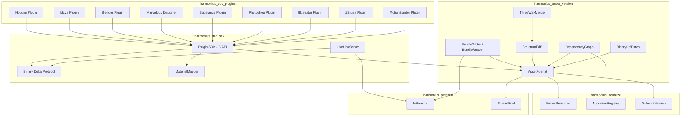
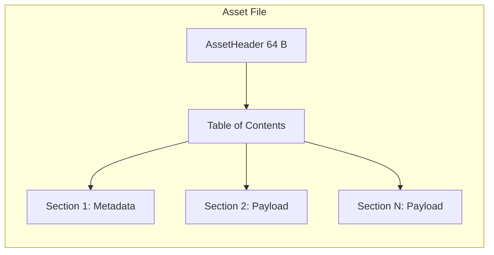
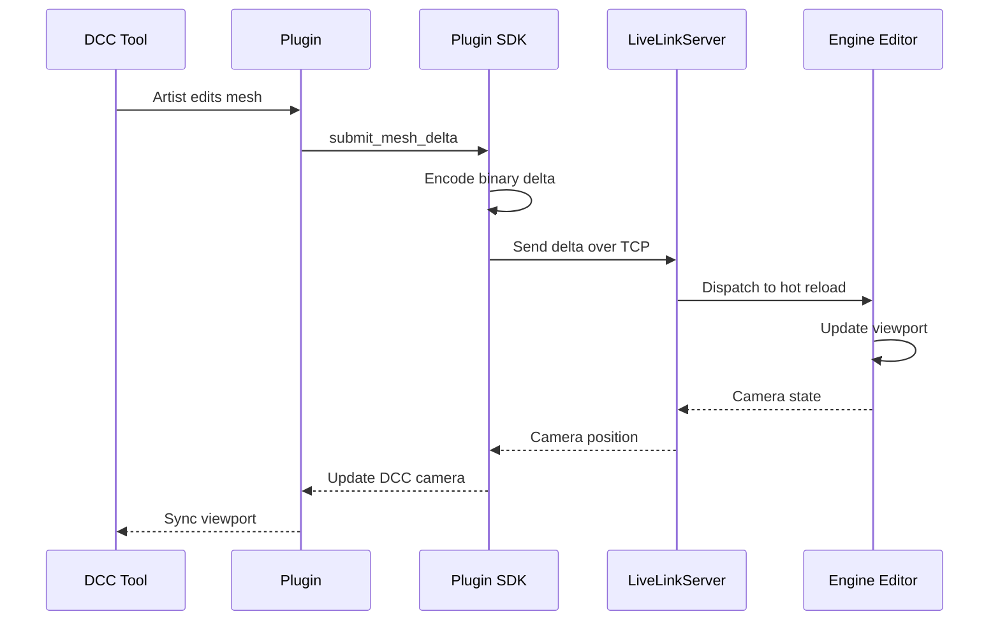
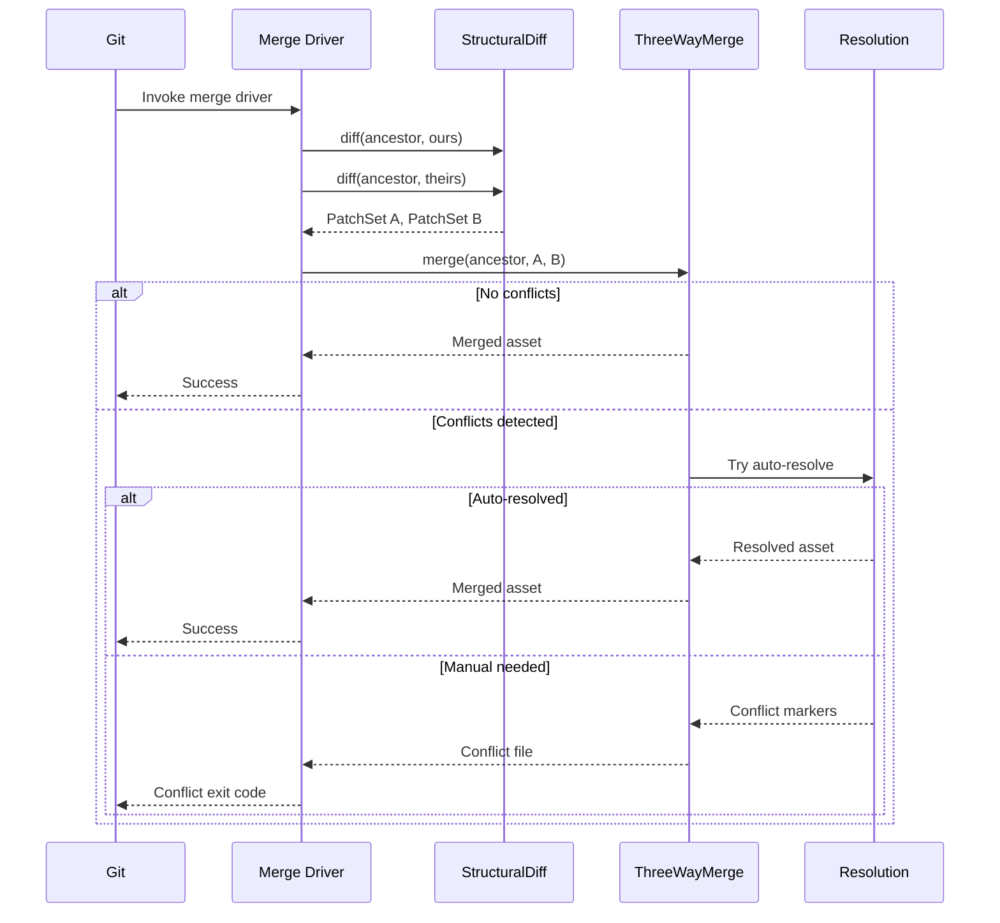
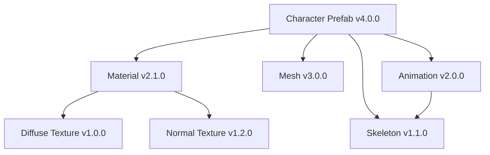
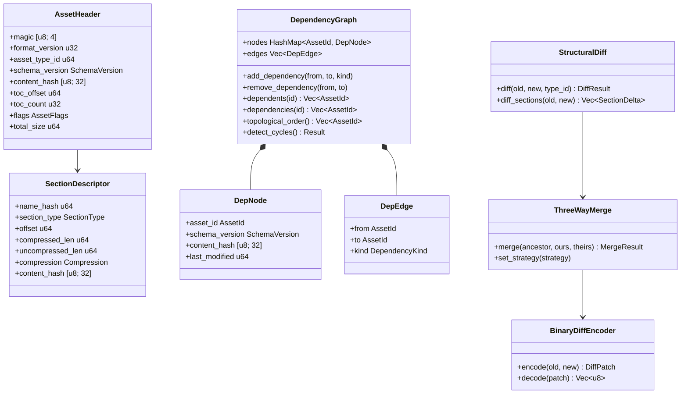
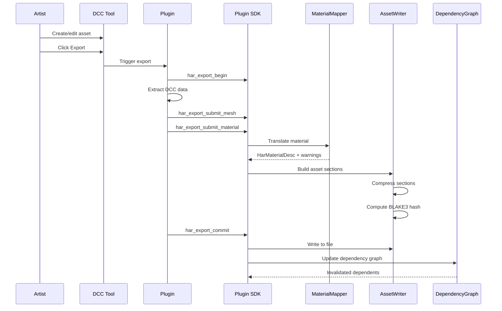

# DCC Plugins and Asset Versioning Design

## Requirements Trace

> **Canonical sources:** Features, requirements, and user
> stories are defined in [features/content-pipeline/](../../features/content-pipeline/),
> [requirements/content-pipeline/](../../requirements/content-pipeline/), and
> [user-stories/content-pipeline/](../../user-stories/content-pipeline/). The table
> below traces design elements to those definitions.

### DCC Tool Plugins (F-12.6 / R-12.6)

| Feature | Requirement | Description |
|---------|-------------|-------------|
| F-12.6.1 | R-12.6.1 | C API plugin SDK with Python/C++ bindings, native binary export |
| F-12.6.2 | R-12.6.2 | Live link: bidirectional TCP, delta protocol, < 2 s latency |
| F-12.6.3 | R-12.6.3 | Houdini Engine HDA hosting, in-process or out-of-process |
| F-12.6.4 | R-12.6.4 | Houdini mesh/scene export with all primitive types |
| F-12.6.5 | R-12.6.5 | Houdini procedural placement to ECS via PCG pipeline |
| F-12.6.6 | R-12.6.6 | Maya direct export with incremental changed-node tracking |
| F-12.6.7 | R-12.6.7 | Maya animation curves (Bezier tangents, not baked samples) |
| F-12.6.8 | R-12.6.8 | Blender addon: meshes, armatures, shape keys, collections |
| F-12.6.9 | R-12.6.9 | Blender Principled BSDF to engine PBR material mapping |
| F-12.6.10 | R-12.6.10 | Marvelous Designer garment meshes with fabric properties |
| F-12.6.11 | R-12.6.11 | Garment-to-character fitting with morph propagation |
| F-12.6.12 | R-12.6.12 | Substance .sbsar import with exposed parameter retention |
| F-12.6.13 | R-12.6.13 | Substance Painter .spp import with UDIM and channel packing |
| F-12.6.14 | R-12.6.14 | Runtime .sbsar evaluation on background thread |
| F-12.6.15 | R-12.6.15 | Photoshop export with channel packing, PSD round-trip |
| F-12.6.16 | R-12.6.16 | Photoshop layer-to-UI widget hierarchy conversion |
| F-12.6.17 | R-12.6.17 | Illustrator vector export: artboards, symbols, swatches |
| F-12.6.18 | R-12.6.18 | ZBrush sculpt export with normal/displacement baking |
| F-12.6.19 | R-12.6.19 | ZBrush decimation and multi-LOD generation |
| F-12.6.20 | R-12.6.20 | MotionBuilder animation export with full curve data |
| F-12.6.21 | R-12.6.21 | MotionBuilder live mocap streaming at capture frame rate |
| F-12.6.22 | R-12.6.22 | Git LFS lock-on-open workflow in every DCC plugin |
| F-12.6.23 | R-12.6.23 | Review comment viewer panel inside DCC tools |
| F-12.6.24 | R-12.6.24 | Consistent asset status dashboard across all plugins |
| F-12.6.25 | R-12.6.25 | DCC-agnostic material mapping table |
| F-12.6.26 | R-12.6.26 | Headless batch export for CI pipelines |

### Asset Versioning (F-12.7 / R-12.7)

| Feature | Requirement | Description |
|---------|-------------|-------------|
| F-12.7.1 | R-12.7.1 | Universal binary asset format: mmap, O(1) section access |
| F-12.7.2 | R-12.7.2 | Compressed bundles: LZ4 runtime, Zstd distribution |
| F-12.7.3 | R-12.7.3 | Structural asset diffing by type (graph, mesh, table, texture) |
| F-12.7.4 | R-12.7.4 | Three-way merge with Git custom merge driver |
| F-12.7.5 | R-12.7.5 | Automatic conflict resolution: LWW, union, deterministic order |
| F-12.7.6 | R-12.7.6 | Spreadsheet-style data table editor |
| F-12.7.7 | R-12.7.7 | Universal visual asset inspector (no text/code fallback) |
| F-12.7.8 | R-12.7.8 | Git LFS with custom merge driver and lock-before-edit |

## Overview

This design covers two tightly coupled content-pipeline
subsystems:

1. **DCC Plugins** -- native plugins for Houdini, Maya,
   Blender, Marvelous Designer, Substance, Photoshop,
   Illustrator, ZBrush, and MotionBuilder that export
   directly to the engine's native binary format. No
   intermediate formats (FBX, glTF, USD) in the
   production pipeline.

2. **Asset Versioning** -- the universal binary asset
   format, compressed bundles, structural diffing,
   three-way merge, dependency graph, and binary diff
   patching that enable team collaboration on binary
   assets through Git.

The two subsystems share the native binary format as
their integration surface. DCC plugins are the producers;
asset versioning is the storage and collaboration layer.

### Crate Structure

```
harmonius_dcc_sdk/
    # C API shared library loaded by DCC hosts.
    # Python/C++ binding wrappers.

harmonius_dcc_plugins/
    # Per-tool plugin implementations.
    # Each plugin depends on harmonius_dcc_sdk.

harmonius_asset_version/
    # Asset format, bundles, diff, merge,
    # dependency graph, binary patch.
```

## Architecture

### Module Boundaries



### File Layout

```
harmonius_dcc_sdk/
├── ffi/
│   ├── c_api.rs          # extern "C" functions
│   ├── handle.rs         # Opaque handle types
│   └── error.rs          # C-compatible error codes
├── sdk.rs                # SdkContext, session mgmt
├── transport/
│   ├── socket.rs         # TCP socket transport
│   ├── shared_mem.rs     # Shared memory transport
│   └── protocol.rs       # Binary delta protocol
├── live_link/
│   ├── server.rs         # LiveLinkServer
│   ├── session.rs        # LiveLinkSession
│   └── delta.rs          # DeltaEncoder/Decoder
├── material/
│   ├── mapper.rs         # MaterialMapper
│   ├── pbr.rs            # PBR material model
│   └── rules.rs          # DCC-specific mapping
│                         # rules
└── submit/
    ├── mesh.rs           # MeshSubmission
    ├── skeleton.rs       # SkeletonSubmission
    ├── animation.rs      # AnimationSubmission
    ├── material.rs       # MaterialSubmission
    ├── texture.rs        # TextureSubmission
    └── scene.rs          # SceneSubmission

harmonius_dcc_plugins/
├── houdini/
│   ├── engine.rs         # Houdini Engine host
│   ├── hda.rs            # HDA parameter bridge
│   ├── export.rs         # Mesh/scene export
│   └── placement.rs      # Procedural placement
├── maya/
│   ├── plugin.rs         # Maya C++ API bridge
│   ├── export.rs         # DAG traversal export
│   ├── animation.rs      # Curve-based anim
│   │                     # export
│   └── incremental.rs    # Changed-node tracking
├── blender/
│   ├── addon.py          # Blender Python addon
│   ├── export.py         # bpy export operators
│   └── material.py       # BSDF-to-PBR mapping
├── marvelous/
│   ├── garment.rs        # Garment mesh export
│   └── fitting.rs        # Character fitting
├── substance/
│   ├── sbsar.rs          # .sbsar import/eval
│   ├── painter.rs        # .spp project import
│   └── runtime.rs        # Runtime evaluation
├── photoshop/
│   ├── plugin.js         # UXP JavaScript plugin
│   ├── layers.rs         # Layer-to-UI mapping
│   └── channel_pack.rs   # Channel packing
├── illustrator/
│   ├── plugin.js         # UXP JavaScript plugin
│   └── vector.rs         # SVG-to-engine mapping
├── zbrush/
│   ├── goz.rs            # GoZ bridge
│   ├── bake.rs           # Normal/displ baking
│   └── lod.rs            # Decimation + LOD
├── motionbuilder/
│   ├── orsdk.rs          # ORSDK C++ bridge
│   ├── export.rs         # Batch take export
│   └── mocap.rs          # Live streaming
└── shared/
    ├── git_lfs.rs        # Lock/unlock workflow
    ├── review.rs         # Comment viewer panel
    ├── dashboard.rs      # Status dashboard
    └── batch.rs          # Headless CI export

harmonius_asset_version/
├── format/
│   ├── header.rs         # AssetHeader, TOC
│   ├── section.rs        # SectionDescriptor
│   ├── reader.rs         # AssetReader (mmap)
│   └── writer.rs         # AssetWriter
├── bundle/
│   ├── writer.rs         # BundleWriter
│   ├── reader.rs         # BundleReader
│   └── manifest.rs       # BundleManifest
├── diff/
│   ├── structural.rs     # StructuralDiff engine
│   ├── graph_diff.rs     # Logic graph diffing
│   ├── mesh_diff.rs      # Mesh structural diff
│   ├── table_diff.rs     # Data table diffing
│   └── texture_diff.rs   # Texture visual diff
├── merge/
│   ├── three_way.rs      # ThreeWayMerge
│   ├── resolution.rs     # ConflictResolution
│   ├── git_driver.rs     # Git merge driver
│   └── strategy.rs       # MergeStrategy config
├── dependency/
│   ├── graph.rs          # DependencyGraph
│   ├── tracker.rs        # VersionTracker
│   └── migration.rs      # DepMigrationPlan
├── patch/
│   ├── binary_diff.rs    # BinaryDiffEncoder
│   ├── binary_apply.rs   # BinaryDiffApplier
│   └── content_hash.rs   # BLAKE3 content hash
└── error.rs              # Error types
```

### Universal Binary Asset Format Layout



### Live Link Sequence



### Three-Way Merge Flow



### Asset Dependency Graph



### Core Data Structures



## API Design

### Universal Binary Asset Format

```rust
/// Magic bytes for asset files: "HAST"
pub const ASSET_MAGIC: [u8; 4] = *b"HAST";

/// Current format version.
pub const FORMAT_VERSION: u32 = 1;

/// Asset header at byte 0 of every asset file.
/// Fixed 64 bytes for O(1) access.
#[repr(C)]
pub struct AssetHeader {
    /// Magic: b"HAST"
    pub magic: [u8; 4],
    /// Format version (for header layout changes).
    pub format_version: u32,
    /// Type ID hash identifying the asset type
    /// (mesh, texture, material, animation, etc.).
    pub asset_type_id: u64,
    /// Schema version for migration.
    pub schema_version: SchemaVersion,
    /// BLAKE3 content hash of the entire payload.
    pub content_hash: [u8; 32],
    /// Byte offset of the table-of-contents from
    /// file start.
    pub toc_offset: u64,
    /// Number of sections in the TOC.
    pub toc_count: u32,
    /// Bit flags (compressed, encrypted, etc.).
    pub flags: AssetFlags,
    /// Total file size in bytes.
    pub total_size: u64,
}

bitflags::bitflags! {
    #[repr(transparent)]
    pub struct AssetFlags: u32 {
        const NONE       = 0;
        const COMPRESSED = 1 << 0;
        const ENCRYPTED  = 1 << 1;
        const STREAMING  = 1 << 2;
    }
}

/// Describes one section within the asset file.
/// Sections are accessed by name hash for O(1)
/// lookup via the TOC.
#[repr(C)]
pub struct SectionDescriptor {
    /// BLAKE3 hash of the section name.
    pub name_hash: u64,
    /// Section content type.
    pub section_type: SectionType,
    /// Byte offset from file start.
    pub offset: u64,
    /// Compressed byte length.
    pub compressed_len: u64,
    /// Uncompressed byte length.
    pub uncompressed_len: u64,
    /// Compression codec.
    pub compression: Compression,
    /// BLAKE3 content hash of uncompressed data.
    pub content_hash: [u8; 32],
    /// Reserved for alignment.
    pub _pad: [u8; 7],
}

#[derive(Clone, Copy, Debug, PartialEq, Eq)]
#[repr(u8)]
pub enum SectionType {
    Metadata = 0,
    Vertices = 1,
    Indices = 2,
    Skeleton = 3,
    Animation = 4,
    TextureData = 5,
    MaterialParams = 6,
    SceneHierarchy = 7,
    DependencyList = 8,
    Custom = 255,
}

#[derive(Clone, Copy, Debug, PartialEq, Eq)]
#[repr(u8)]
pub enum Compression {
    None = 0,
    Lz4 = 1,
    Zstd = 2,
}
```

### Asset Reader (mmap-based)

```rust
/// Memory-mapped asset reader. Provides O(1)
/// section access without copying data.
pub struct AssetReader<'a> {
    data: &'a [u8],
    header: &'a AssetHeader,
    toc: &'a [SectionDescriptor],
}

impl<'a> AssetReader<'a> {
    /// Map an asset file from a byte slice.
    /// Validates header magic and format version.
    pub fn from_bytes(
        data: &'a [u8],
    ) -> Result<Self, AssetError> {
        // ...
    }

    /// Access the asset header.
    pub fn header(&self) -> &AssetHeader {
        // ...
    }

    /// Access a section by name. Returns the
    /// raw bytes (decompressed if needed).
    pub fn section(
        &self,
        name: &str,
    ) -> Result<&'a [u8], AssetError> {
        // ...
    }

    /// Access a section by type. Returns the
    /// first section matching the type.
    pub fn section_by_type(
        &self,
        section_type: SectionType,
    ) -> Result<&'a [u8], AssetError> {
        // ...
    }

    /// Iterate all section descriptors.
    pub fn sections(
        &self,
    ) -> &[SectionDescriptor] {
        // ...
    }

    /// Verify the content hash matches the
    /// payload data.
    pub fn verify_integrity(
        &self,
    ) -> Result<(), AssetError> {
        // ...
    }

    /// Get the schema version for migration
    /// checks.
    pub fn schema_version(&self) -> SchemaVersion {
        // ...
    }
}
```

### Asset Writer

```rust
/// Builds a new asset file with sections.
pub struct AssetWriter {
    asset_type_id: u64,
    schema_version: SchemaVersion,
    sections: Vec<WriterSection>,
    flags: AssetFlags,
}

struct WriterSection {
    name: String,
    section_type: SectionType,
    data: Vec<u8>,
    compression: Compression,
}

impl AssetWriter {
    pub fn new(
        asset_type_id: u64,
        schema_version: SchemaVersion,
    ) -> Self {
        // ...
    }

    /// Add a section to the asset.
    pub fn add_section(
        &mut self,
        name: &str,
        section_type: SectionType,
        data: Vec<u8>,
        compression: Compression,
    ) -> &mut Self {
        // ...
    }

    /// Set asset flags.
    pub fn set_flags(
        &mut self,
        flags: AssetFlags,
    ) -> &mut Self {
        // ...
    }

    /// Finalize and produce the complete asset
    /// file as bytes. Computes BLAKE3 content
    /// hash over all section data.
    pub fn build(self) -> Result<Vec<u8>, AssetError> {
        // ...
    }

    /// Write directly to an async I/O handle.
    pub async fn write_to(
        self,
        reactor: &IoReactor,
        handle: RawHandle,
    ) -> Result<u64, IoError> {
        // ...
    }
}
```

### Compressed Asset Bundles

```rust
/// Magic bytes: "HBUN"
pub const BUNDLE_MAGIC: [u8; 4] = *b"HBUN";

/// Bundle manifest entry for one contained asset.
#[repr(C)]
pub struct BundleEntry {
    /// AssetId (BLAKE3 hash of asset path).
    pub asset_id: [u8; 32],
    /// Byte offset within the bundle file.
    pub offset: u64,
    /// Compressed size of this asset.
    pub compressed_len: u64,
    /// Uncompressed size of this asset.
    pub uncompressed_len: u64,
    /// Compression codec for this asset.
    pub compression: Compression,
}

/// Bundle manifest listing all contained assets
/// with random-access offsets.
pub struct BundleManifest {
    entries: Vec<BundleEntry>,
}

impl BundleManifest {
    /// Look up an asset by ID. O(log n) via
    /// sorted entries.
    pub fn find(
        &self,
        asset_id: &[u8; 32],
    ) -> Option<&BundleEntry> {
        // ...
    }

    /// Iterate all entries.
    pub fn iter(
        &self,
    ) -> impl Iterator<Item = &BundleEntry> {
        // ...
    }

    pub fn len(&self) -> usize {
        // ...
    }
}

/// Writes a compressed bundle of related assets.
pub struct BundleWriter {
    compression: Compression,
    entries: Vec<(BundleEntry, Vec<u8>)>,
}

impl BundleWriter {
    /// Create a new writer. LZ4 for runtime
    /// bundles, Zstd for distribution.
    pub fn new(
        compression: Compression,
    ) -> Self {
        // ...
    }

    /// Add an asset to the bundle.
    pub fn add_asset(
        &mut self,
        asset_id: [u8; 32],
        data: &[u8],
    ) -> &mut Self {
        // ...
    }

    /// Finalize and write the bundle.
    pub fn build(
        self,
    ) -> Result<Vec<u8>, AssetError> {
        // ...
    }

    /// Async write to file.
    pub async fn write_to(
        self,
        reactor: &IoReactor,
        handle: RawHandle,
    ) -> Result<u64, IoError> {
        // ...
    }
}

/// Reads individual assets from a bundle without
/// decompressing the entire bundle.
pub struct BundleReader<'a> {
    data: &'a [u8],
    manifest: BundleManifest,
}

impl<'a> BundleReader<'a> {
    /// Open a bundle from a memory-mapped slice.
    pub fn from_bytes(
        data: &'a [u8],
    ) -> Result<Self, AssetError> {
        // ...
    }

    /// Extract a single asset by ID. Only
    /// decompresses the requested asset's range.
    pub fn extract(
        &self,
        asset_id: &[u8; 32],
    ) -> Result<Vec<u8>, AssetError> {
        // ...
    }

    /// Access the bundle manifest.
    pub fn manifest(&self) -> &BundleManifest {
        // ...
    }
}
```

### Plugin SDK C API

```rust
/// Opaque handle types for the C API. Each
/// represents an SDK object lifetime-managed
/// on the Rust side.
#[repr(C)]
pub struct HarSdkContext {
    _opaque: [u8; 0],
}

#[repr(C)]
pub struct HarExportSession {
    _opaque: [u8; 0],
}

#[repr(C)]
pub struct HarLiveLinkHandle {
    _opaque: [u8; 0],
}

/// Error codes returned by all C API functions.
#[repr(C)]
#[derive(Clone, Copy, Debug, PartialEq, Eq)]
pub enum HarError {
    Ok = 0,
    InvalidHandle = 1,
    InvalidArgument = 2,
    IoError = 3,
    VersionMismatch = 4,
    CompressionFailed = 5,
    TransportError = 6,
    OutOfMemory = 7,
}

// ---- Context lifecycle ----

/// Create a new SDK context. Must be called
/// before any other SDK function.
#[no_mangle]
pub extern "C" fn har_sdk_create(
    out: *mut *mut HarSdkContext,
) -> HarError {
    // ...
}

/// Destroy the SDK context and free resources.
#[no_mangle]
pub extern "C" fn har_sdk_destroy(
    ctx: *mut HarSdkContext,
) -> HarError {
    // ...
}

/// Query the SDK version for compatibility.
#[no_mangle]
pub extern "C" fn har_sdk_version(
    major: *mut u32,
    minor: *mut u32,
    patch: *mut u32,
) -> HarError {
    // ...
}

// ---- Export session ----

/// Begin an export session. All submissions
/// within a session are bundled atomically.
#[no_mangle]
pub extern "C" fn har_export_begin(
    ctx: *mut HarSdkContext,
    out: *mut *mut HarExportSession,
) -> HarError {
    // ...
}

/// Submit a mesh to the current session.
#[no_mangle]
pub extern "C" fn har_export_submit_mesh(
    session: *mut HarExportSession,
    desc: *const HarMeshDesc,
) -> HarError {
    // ...
}

/// Submit a skeleton.
#[no_mangle]
pub extern "C" fn har_export_submit_skeleton(
    session: *mut HarExportSession,
    desc: *const HarSkeletonDesc,
) -> HarError {
    // ...
}

/// Submit an animation clip.
#[no_mangle]
pub extern "C" fn har_export_submit_animation(
    session: *mut HarExportSession,
    desc: *const HarAnimationDesc,
) -> HarError {
    // ...
}

/// Submit a material.
#[no_mangle]
pub extern "C" fn har_export_submit_material(
    session: *mut HarExportSession,
    desc: *const HarMaterialDesc,
) -> HarError {
    // ...
}

/// Submit a texture.
#[no_mangle]
pub extern "C" fn har_export_submit_texture(
    session: *mut HarExportSession,
    desc: *const HarTextureDesc,
) -> HarError {
    // ...
}

/// Submit a scene hierarchy.
#[no_mangle]
pub extern "C" fn har_export_submit_scene(
    session: *mut HarExportSession,
    desc: *const HarSceneDesc,
) -> HarError {
    // ...
}

/// Finalize the session: serialize, compress,
/// and write the asset file. If transport is
/// configured, sends over socket/shared memory.
#[no_mangle]
pub extern "C" fn har_export_commit(
    session: *mut HarExportSession,
    output_path: *const u8,
    output_path_len: u32,
) -> HarError {
    // ...
}

/// Cancel and discard an export session.
#[no_mangle]
pub extern "C" fn har_export_cancel(
    session: *mut HarExportSession,
) -> HarError {
    // ...
}

// ---- Live link ----

/// Connect to the engine's live link server.
#[no_mangle]
pub extern "C" fn har_live_link_connect(
    ctx: *mut HarSdkContext,
    host: *const u8,
    host_len: u32,
    port: u16,
    out: *mut *mut HarLiveLinkHandle,
) -> HarError {
    // ...
}

/// Push a delta (mesh/material/animation change)
/// over the live link.
#[no_mangle]
pub extern "C" fn har_live_link_push_delta(
    link: *mut HarLiveLinkHandle,
    delta: *const u8,
    delta_len: u32,
) -> HarError {
    // ...
}

/// Receive engine state (camera, selection)
/// from the live link. Non-blocking.
#[no_mangle]
pub extern "C" fn har_live_link_poll(
    link: *mut HarLiveLinkHandle,
    out: *mut HarEngineState,
) -> HarError {
    // ...
}

/// Disconnect the live link.
#[no_mangle]
pub extern "C" fn har_live_link_disconnect(
    link: *mut HarLiveLinkHandle,
) -> HarError {
    // ...
}
```

### SDK Data Descriptors

```rust
/// Mesh submission descriptor.
#[repr(C)]
pub struct HarMeshDesc {
    /// Vertex positions (3 x f32 per vertex).
    pub positions: *const f32,
    pub position_count: u32,
    /// Vertex normals (3 x f32 per vertex).
    pub normals: *const f32,
    pub normal_count: u32,
    /// UV sets. Array of HarUvSet pointers.
    pub uv_sets: *const HarUvSet,
    pub uv_set_count: u32,
    /// Vertex colors (4 x f32 per vertex).
    pub colors: *const f32,
    pub color_count: u32,
    /// Triangle indices (3 x u32 per triangle).
    pub indices: *const u32,
    pub index_count: u32,
    /// Skin weights (optional).
    pub skin_weights: *const HarSkinWeight,
    pub skin_weight_count: u32,
    /// Morph targets (optional).
    pub morph_targets: *const HarMorphTarget,
    pub morph_target_count: u32,
    /// Asset name (UTF-8).
    pub name: *const u8,
    pub name_len: u32,
}

#[repr(C)]
pub struct HarUvSet {
    pub name: *const u8,
    pub name_len: u32,
    pub uvs: *const f32,
    pub uv_count: u32,
}

#[repr(C)]
pub struct HarSkinWeight {
    pub bone_indices: [u16; 4],
    pub weights: [f32; 4],
}

#[repr(C)]
pub struct HarMorphTarget {
    pub name: *const u8,
    pub name_len: u32,
    pub deltas: *const f32,
    pub delta_count: u32,
}

/// Skeleton submission descriptor.
#[repr(C)]
pub struct HarSkeletonDesc {
    pub bones: *const HarBone,
    pub bone_count: u32,
    pub name: *const u8,
    pub name_len: u32,
}

#[repr(C)]
pub struct HarBone {
    pub name: *const u8,
    pub name_len: u32,
    pub parent_index: i32,
    pub local_transform: [f32; 16],
    pub inverse_bind: [f32; 16],
}

/// Animation submission descriptor.
#[repr(C)]
pub struct HarAnimationDesc {
    pub tracks: *const HarAnimTrack,
    pub track_count: u32,
    pub duration: f32,
    pub sample_rate: f32,
    pub name: *const u8,
    pub name_len: u32,
}

#[repr(C)]
pub struct HarAnimTrack {
    pub target_bone: *const u8,
    pub target_bone_len: u32,
    pub keyframes: *const HarKeyframe,
    pub keyframe_count: u32,
    pub interpolation: HarInterpolation,
}

#[repr(C)]
#[derive(Clone, Copy, Debug, PartialEq, Eq)]
pub enum HarInterpolation {
    Step = 0,
    Linear = 1,
    Cubic = 2,
}

#[repr(C)]
pub struct HarKeyframe {
    pub time: f32,
    pub value: [f32; 4],
    pub in_tangent: [f32; 4],
    pub out_tangent: [f32; 4],
}

/// Material submission descriptor.
#[repr(C)]
pub struct HarMaterialDesc {
    pub base_color: [f32; 4],
    pub metallic: f32,
    pub roughness: f32,
    pub emissive: [f32; 3],
    pub textures: *const HarTextureRef,
    pub texture_count: u32,
    pub name: *const u8,
    pub name_len: u32,
}

#[repr(C)]
pub struct HarTextureRef {
    pub slot: HarTextureSlot,
    pub asset_path: *const u8,
    pub asset_path_len: u32,
}

#[repr(C)]
#[derive(Clone, Copy, Debug, PartialEq, Eq)]
pub enum HarTextureSlot {
    BaseColor = 0,
    Normal = 1,
    Metallic = 2,
    Roughness = 3,
    AmbientOcclusion = 4,
    Emissive = 5,
    Height = 6,
}

/// Texture submission descriptor.
#[repr(C)]
pub struct HarTextureDesc {
    pub width: u32,
    pub height: u32,
    pub format: HarPixelFormat,
    pub mip_count: u32,
    pub data: *const u8,
    pub data_len: u32,
    pub name: *const u8,
    pub name_len: u32,
}

#[repr(C)]
#[derive(Clone, Copy, Debug, PartialEq, Eq)]
pub enum HarPixelFormat {
    Rgba8Unorm = 0,
    Rgba16Float = 1,
    Rgba32Float = 2,
    Bc1 = 3,
    Bc3 = 4,
    Bc5 = 5,
    Bc7 = 6,
}

/// Scene hierarchy submission descriptor.
#[repr(C)]
pub struct HarSceneDesc {
    pub nodes: *const HarSceneNode,
    pub node_count: u32,
    pub name: *const u8,
    pub name_len: u32,
}

#[repr(C)]
pub struct HarSceneNode {
    pub name: *const u8,
    pub name_len: u32,
    pub parent_index: i32,
    pub local_transform: [f32; 16],
    pub mesh_ref: *const u8,
    pub mesh_ref_len: u32,
    pub material_ref: *const u8,
    pub material_ref_len: u32,
}

/// Engine state received from live link poll.
#[repr(C)]
pub struct HarEngineState {
    pub camera_position: [f32; 3],
    pub camera_rotation: [f32; 4],
    pub camera_fov: f32,
    pub selected_entity_count: u32,
    pub selected_entities: *const u64,
}
```

### DCC-Agnostic Material Mapping

```rust
/// A rule mapping a DCC material property to an
/// engine PBR slot.
pub struct MaterialMappingRule {
    /// DCC tool identifier.
    pub dcc_tool: DccTool,
    /// Source property name in the DCC tool's
    /// material system.
    pub source_property: String,
    /// Target engine texture slot or scalar.
    pub target: MaterialTarget,
    /// Value transform (e.g., invert glossiness
    /// to roughness).
    pub transform: ValueTransform,
}

#[derive(Clone, Copy, Debug, PartialEq, Eq)]
pub enum DccTool {
    Maya,
    Blender,
    Houdini,
    Substance,
    Photoshop,
    Illustrator,
    ZBrush,
    MarvelousDesigner,
    MotionBuilder,
}

pub enum MaterialTarget {
    TextureSlot(HarTextureSlot),
    ScalarParam(String),
    ColorParam(String),
}

#[derive(Clone, Copy, Debug, PartialEq, Eq)]
pub enum ValueTransform {
    /// Pass through unchanged.
    Identity,
    /// Invert (1.0 - x). Glossiness to roughness.
    Invert,
    /// sRGB to linear conversion.
    SrgbToLinear,
    /// Linear to sRGB conversion.
    LinearToSrgb,
}

/// Material mapper driven by a configurable
/// rule table. Extensible for custom DCC shaders.
pub struct MaterialMapper {
    rules: Vec<MaterialMappingRule>,
    fallbacks: HashMap<HarTextureSlot, [f32; 4]>,
}

impl MaterialMapper {
    pub fn new() -> Self {
        // ...
    }

    /// Load mapping rules from a configuration
    /// file (RON format).
    pub fn load_rules(
        &mut self,
        data: &[u8],
    ) -> Result<(), MaterialMapError> {
        // ...
    }

    /// Add a custom mapping rule.
    pub fn add_rule(
        &mut self,
        rule: MaterialMappingRule,
    ) {
        // ...
    }

    /// Set the fallback value for a texture slot
    /// when the DCC material is missing that input.
    pub fn set_fallback(
        &mut self,
        slot: HarTextureSlot,
        value: [f32; 4],
    ) {
        // ...
    }

    /// Translate a DCC material to an engine
    /// HarMaterialDesc. Emits warnings for
    /// unmapped properties.
    pub fn translate(
        &self,
        dcc_tool: DccTool,
        source: &DccMaterial,
    ) -> Result<
        (HarMaterialDesc, Vec<MaterialWarning>),
        MaterialMapError,
    > {
        // ...
    }
}

/// Warning emitted when a DCC material property
/// cannot be mapped.
pub struct MaterialWarning {
    pub property: String,
    pub message: String,
    pub fallback_applied: bool,
}

/// DCC tool material representation. Each plugin
/// populates this from its native material system.
pub struct DccMaterial {
    pub tool: DccTool,
    pub name: String,
    pub properties: HashMap<String, DccMaterialValue>,
}

pub enum DccMaterialValue {
    Scalar(f32),
    Color([f32; 4]),
    Texture(String),
}
```

### Live Link Server

```rust
/// Engine-side live link server. Accepts
/// connections from DCC tool plugins and
/// dispatches deltas to the hot reload system.
pub struct LiveLinkServer {
    listener: TcpListener,
    sessions: Vec<LiveLinkSession>,
}

/// One connected DCC tool session.
pub struct LiveLinkSession {
    stream: TcpStream,
    tool: DccTool,
    state: SessionState,
}

#[derive(Clone, Copy, Debug, PartialEq, Eq)]
pub enum SessionState {
    Connected,
    Syncing,
    Idle,
    Disconnected,
}

impl LiveLinkServer {
    /// Create a new server bound to the given
    /// port. Uses the IoReactor for async accept.
    pub async fn bind(
        reactor: &IoReactor,
        port: u16,
    ) -> Result<Self, IoError> {
        // ...
    }

    /// Poll for new connections and incoming
    /// deltas. Non-blocking.
    pub async fn poll(
        &mut self,
        reactor: &IoReactor,
    ) -> Vec<LiveLinkEvent> {
        // ...
    }

    /// Broadcast engine state (camera, selection)
    /// to all connected sessions.
    pub async fn broadcast_state(
        &self,
        state: &EngineState,
    ) -> Result<(), IoError> {
        // ...
    }

    /// Number of active sessions.
    pub fn session_count(&self) -> usize {
        // ...
    }
}

pub enum LiveLinkEvent {
    Connected {
        session_id: u32,
        tool: DccTool,
    },
    Delta {
        session_id: u32,
        delta: EncodedDelta,
    },
    Disconnected {
        session_id: u32,
    },
}

/// Binary-encoded asset delta. Decoded by the
/// hot reload system.
pub struct EncodedDelta {
    pub asset_type: u64,
    pub data: Vec<u8>,
}
```

### Binary Delta Protocol

```rust
/// Wire format for live link deltas. Compact
/// binary encoding optimized for mesh, material,
/// and animation changes.
#[repr(C)]
pub struct DeltaHeader {
    /// Message type.
    pub msg_type: DeltaMessageType,
    /// Sequence number for ordering.
    pub sequence: u64,
    /// Payload byte length.
    pub payload_len: u32,
    /// BLAKE3 hash of payload for integrity.
    pub checksum: [u8; 32],
}

#[derive(Clone, Copy, Debug, PartialEq, Eq)]
#[repr(u8)]
pub enum DeltaMessageType {
    /// Full asset replacement.
    FullAsset = 0,
    /// Partial mesh vertex update.
    MeshVertexDelta = 1,
    /// Material parameter change.
    MaterialParam = 2,
    /// Animation keyframe update.
    AnimationKeyframe = 3,
    /// Scene node transform update.
    TransformDelta = 4,
    /// Camera state from engine to DCC.
    CameraState = 5,
    /// Selection state from engine to DCC.
    SelectionState = 6,
    /// Heartbeat / keep-alive.
    Heartbeat = 255,
}

/// Encodes asset changes into compact binary
/// deltas for live link transmission.
pub struct DeltaEncoder {
    sequence: u64,
}

impl DeltaEncoder {
    pub fn new() -> Self {
        // ...
    }

    /// Encode a mesh vertex delta. Only changed
    /// vertex ranges are encoded.
    pub fn encode_mesh_delta(
        &mut self,
        changed_ranges: &[(u32, u32)],
        vertices: &[f32],
    ) -> Vec<u8> {
        // ...
    }

    /// Encode a material parameter change.
    pub fn encode_material_param(
        &mut self,
        param_name: &str,
        value: &[u8],
    ) -> Vec<u8> {
        // ...
    }

    /// Encode a full asset for initial sync.
    pub fn encode_full_asset(
        &mut self,
        asset_data: &[u8],
    ) -> Vec<u8> {
        // ...
    }
}

/// Decodes binary deltas received over live link.
pub struct DeltaDecoder;

impl DeltaDecoder {
    /// Decode a delta message. Returns the header
    /// and a reference to the payload bytes.
    pub fn decode<'a>(
        data: &'a [u8],
    ) -> Result<
        (DeltaHeader, &'a [u8]),
        ProtocolError,
    > {
        // ...
    }
}
```

### Structural Asset Diffing

```rust
/// Result of structurally diffing two asset
/// versions.
pub struct DiffResult {
    /// Per-section deltas.
    pub section_deltas: Vec<SectionDelta>,
    /// Summary statistics.
    pub summary: DiffSummary,
}

pub struct SectionDelta {
    pub section_name: String,
    pub section_type: SectionType,
    pub changes: Vec<DiffChange>,
}

pub enum DiffChange {
    /// A structural element was added.
    Added {
        path: String,
        description: String,
    },
    /// A structural element was removed.
    Removed {
        path: String,
        description: String,
    },
    /// A structural element was modified.
    Modified {
        path: String,
        old_summary: String,
        new_summary: String,
    },
}

pub struct DiffSummary {
    pub added_count: u32,
    pub removed_count: u32,
    pub modified_count: u32,
    pub size_delta: i64,
}

/// Engine for structural diffing. Dispatches
/// to type-specific diff implementations.
pub struct StructuralDiff {
    type_diffs: HashMap<
        u64,
        Box<dyn TypeDiffer>,
    >,
}

/// Trait for type-specific structural diffing.
pub trait TypeDiffer: Send + Sync {
    fn diff(
        &self,
        old: &AssetReader<'_>,
        new: &AssetReader<'_>,
    ) -> Result<DiffResult, DiffError>;
}

impl StructuralDiff {
    pub fn new() -> Self {
        // ...
    }

    /// Register a type-specific differ.
    pub fn register_differ(
        &mut self,
        asset_type_id: u64,
        differ: Box<dyn TypeDiffer>,
    ) {
        // ...
    }

    /// Diff two asset versions. Dispatches to
    /// the registered TypeDiffer for the asset
    /// type.
    pub fn diff(
        &self,
        old: &AssetReader<'_>,
        new: &AssetReader<'_>,
    ) -> Result<DiffResult, DiffError> {
        // ...
    }
}
```

### Three-Way Merge

```rust
/// Result of a three-way merge operation.
pub enum MergeResult {
    /// Merge succeeded with no conflicts.
    Success {
        merged: Vec<u8>,
    },
    /// Merge succeeded after automatic conflict
    /// resolution.
    AutoResolved {
        merged: Vec<u8>,
        resolutions: Vec<AutoResolution>,
    },
    /// Merge has unresolved conflicts requiring
    /// manual intervention.
    Conflict {
        partial: Vec<u8>,
        conflicts: Vec<MergeConflict>,
    },
}

pub struct AutoResolution {
    pub path: String,
    pub strategy: ResolutionStrategy,
    pub description: String,
}

pub struct MergeConflict {
    pub path: String,
    pub ours_summary: String,
    pub theirs_summary: String,
    pub ancestor_summary: String,
}

/// Strategies for automatic conflict resolution.
#[derive(Clone, Copy, Debug, PartialEq, Eq)]
pub enum ResolutionStrategy {
    /// Last-writer-wins for independent property
    /// changes.
    LastWriterWins,
    /// Union for additive collections (new nodes
    /// added by both sides).
    Union,
    /// Deterministic ordering for reordered
    /// elements.
    DeterministicOrder,
}

/// Per-asset-type merge strategy configuration.
pub struct MergeStrategy {
    /// Default resolution for property conflicts.
    pub default_resolution: ResolutionStrategy,
    /// Per-section override.
    pub section_overrides: HashMap<
        String,
        ResolutionStrategy,
    >,
}

/// Three-way merge engine.
pub struct ThreeWayMerge {
    diff: StructuralDiff,
    strategies: HashMap<u64, MergeStrategy>,
}

impl ThreeWayMerge {
    pub fn new(diff: StructuralDiff) -> Self {
        // ...
    }

    /// Set the merge strategy for an asset type.
    pub fn set_strategy(
        &mut self,
        asset_type_id: u64,
        strategy: MergeStrategy,
    ) {
        // ...
    }

    /// Perform a three-way merge of two divergent
    /// versions against a common ancestor.
    pub fn merge(
        &self,
        ancestor: &AssetReader<'_>,
        ours: &AssetReader<'_>,
        theirs: &AssetReader<'_>,
    ) -> Result<MergeResult, MergeError> {
        // ...
    }
}

/// Git custom merge driver entry point. Invoked
/// by Git when merging binary asset files tracked
/// via LFS.
pub fn git_merge_driver(
    ancestor_path: &Path,
    ours_path: &Path,
    theirs_path: &Path,
    output_path: &Path,
) -> Result<i32, MergeError> {
    // ...
}
```

### Asset Dependency Graph

```rust
/// Unique asset identifier. BLAKE3 hash of the
/// asset's canonical path.
#[derive(
    Clone, Copy, Debug, PartialEq, Eq,
    Hash, PartialOrd, Ord,
)]
pub struct AssetId(pub [u8; 32]);

/// Kind of dependency between two assets.
#[derive(Clone, Copy, Debug, PartialEq, Eq)]
pub enum DependencyKind {
    /// Hard dependency: must be loaded before the
    /// dependent asset can be used.
    Hard,
    /// Soft dependency: optional at runtime,
    /// required at build time.
    Soft,
    /// Build dependency: required only during
    /// asset processing, not at runtime.
    BuildOnly,
}

/// One node in the dependency graph.
pub struct DepNode {
    pub asset_id: AssetId,
    pub asset_type_id: u64,
    pub schema_version: SchemaVersion,
    pub content_hash: [u8; 32],
    pub last_modified: u64,
}

/// One edge in the dependency graph.
pub struct DepEdge {
    pub from: AssetId,
    pub to: AssetId,
    pub kind: DependencyKind,
}

/// Tracks all asset dependencies with version
/// information. Used for incremental builds,
/// cache invalidation, and migration planning.
pub struct DependencyGraph {
    nodes: HashMap<AssetId, DepNode>,
    forward: HashMap<AssetId, Vec<DepEdge>>,
    reverse: HashMap<AssetId, Vec<DepEdge>>,
}

impl DependencyGraph {
    pub fn new() -> Self {
        // ...
    }

    /// Add or update an asset node.
    pub fn upsert_node(
        &mut self,
        node: DepNode,
    ) {
        // ...
    }

    /// Add a dependency edge.
    pub fn add_dependency(
        &mut self,
        from: AssetId,
        to: AssetId,
        kind: DependencyKind,
    ) {
        // ...
    }

    /// Remove a dependency edge.
    pub fn remove_dependency(
        &mut self,
        from: AssetId,
        to: AssetId,
    ) -> bool {
        // ...
    }

    /// Get all assets that depend on the given
    /// asset (reverse lookup).
    pub fn dependents(
        &self,
        id: AssetId,
    ) -> Vec<AssetId> {
        // ...
    }

    /// Get all assets the given asset depends on.
    pub fn dependencies(
        &self,
        id: AssetId,
    ) -> Vec<AssetId> {
        // ...
    }

    /// Topological sort of all assets. Returns
    /// an error if cycles are detected.
    pub fn topological_order(
        &self,
    ) -> Result<Vec<AssetId>, DepGraphError> {
        // ...
    }

    /// Detect cycles in the dependency graph.
    pub fn detect_cycles(
        &self,
    ) -> Result<(), DepGraphError> {
        // ...
    }

    /// Compute the set of assets that need
    /// rebuilding given a set of changed assets.
    /// Traverses the reverse dependency graph.
    pub fn invalidated_by(
        &self,
        changed: &[AssetId],
    ) -> Vec<AssetId> {
        // ...
    }

    /// Plan migrations for assets whose schema
    /// versions are outdated. Returns the set of
    /// assets needing migration in dependency
    /// order.
    pub fn migration_plan(
        &self,
        registry: &MigrationRegistry,
    ) -> Result<Vec<AssetId>, DepGraphError> {
        // ...
    }
}
```

### Binary Diff and Patch

```rust
/// A binary diff patch that transforms one
/// version of an asset into another. Uses a
/// block-level diff algorithm with BLAKE3
/// content-addressed deduplication.
pub struct DiffPatch {
    /// Source content hash (BLAKE3).
    pub source_hash: [u8; 32],
    /// Target content hash (BLAKE3).
    pub target_hash: [u8; 32],
    /// Diff operations.
    pub ops: Vec<DiffOp>,
    /// Total patch size in bytes.
    pub patch_size: u64,
}

pub enum DiffOp {
    /// Copy a range from the source file.
    Copy {
        source_offset: u64,
        len: u64,
    },
    /// Insert new data not present in source.
    Insert {
        data: Vec<u8>,
    },
}

/// Encodes binary diffs between two versions
/// of an asset file.
pub struct BinaryDiffEncoder {
    block_size: u32,
}

impl BinaryDiffEncoder {
    /// Create an encoder with the given block
    /// size for chunking.
    pub fn new(block_size: u32) -> Self {
        // ...
    }

    /// Compute the diff from source to target.
    pub fn encode(
        &self,
        source: &[u8],
        target: &[u8],
    ) -> DiffPatch {
        // ...
    }
}

/// Applies a binary diff patch to reconstruct
/// the target version from the source.
pub struct BinaryDiffApplier;

impl BinaryDiffApplier {
    /// Apply a patch to source data, producing
    /// the target data. Verifies BLAKE3 hashes
    /// of both source and target.
    pub fn apply(
        patch: &DiffPatch,
        source: &[u8],
    ) -> Result<Vec<u8>, PatchError> {
        // ...
    }
}
```

### Error Types

```rust
#[derive(Debug)]
pub enum AssetError {
    InvalidMagic {
        expected: [u8; 4],
        found: [u8; 4],
    },
    UnsupportedFormatVersion {
        found: u32,
        max_supported: u32,
    },
    SectionNotFound {
        name: String,
    },
    IntegrityCheckFailed {
        expected_hash: [u8; 32],
        actual_hash: [u8; 32],
    },
    DecompressionFailed {
        section: String,
        source: Box<dyn std::error::Error>,
    },
    TruncatedFile {
        expected: u64,
        actual: u64,
    },
}

#[derive(Debug)]
pub enum DiffError {
    TypeMismatch {
        old_type: u64,
        new_type: u64,
    },
    NoRegisteredDiffer {
        asset_type_id: u64,
    },
    AssetReadError(AssetError),
}

#[derive(Debug)]
pub enum MergeError {
    DiffFailed(DiffError),
    IncompatibleVersions {
        ancestor: SchemaVersion,
        ours: SchemaVersion,
        theirs: SchemaVersion,
    },
    IoError(IoError),
}

#[derive(Debug)]
pub enum DepGraphError {
    CycleDetected {
        cycle: Vec<AssetId>,
    },
    AssetNotFound {
        id: AssetId,
    },
    MigrationChainBroken {
        asset_id: AssetId,
        from: SchemaVersion,
        to: SchemaVersion,
    },
}

#[derive(Debug)]
pub enum PatchError {
    SourceHashMismatch {
        expected: [u8; 32],
        actual: [u8; 32],
    },
    TargetHashMismatch {
        expected: [u8; 32],
        actual: [u8; 32],
    },
    InvalidOffset {
        offset: u64,
        source_len: u64,
    },
}

#[derive(Debug)]
pub enum ProtocolError {
    InvalidMessageType(u8),
    ChecksumMismatch,
    TruncatedMessage,
    SequenceGap {
        expected: u64,
        received: u64,
    },
}

#[derive(Debug)]
pub enum MaterialMapError {
    NoRulesForTool(DccTool),
    InvalidRuleConfig(String),
}
```

## Data Flow

### DCC Export to Engine Asset



### Asset Versioning and Migration

When an asset is loaded whose `SchemaVersion` does not
match the current version registered in the
`MigrationRegistry`, the deserialization pipeline
automatically migrates it.

```rust
// Asset loading with automatic migration
let reader = AssetReader::from_bytes(&data)?;
let stored_version = reader.schema_version();
let current_version = migration_registry
    .current_version(reader.header().asset_type_id)
    .unwrap();

if stored_version < current_version {
    // Deserialize to DynamicValue
    let mut dynamic = binary_deserializer
        .deserialize(reader.section("payload")?)?;
    // Apply migration chain
    migration_registry.migrate(
        reader.header().asset_type_id,
        stored_version,
        &mut dynamic,
    )?;
    // Re-serialize with updated version
    let migrated = asset_writer
        .with_schema_version(current_version)
        .build()?;
}
```

### Bundle Build Pipeline

```rust
// Build a distribution bundle with Zstd
let mut writer = BundleWriter::new(
    Compression::Zstd,
);

for asset_id in manifest.assets() {
    let data = load_asset_bytes(asset_id).await?;
    writer.add_asset(asset_id, &data);
}

let bundle_bytes = writer.build()?;
writer.write_to(&reactor, handle).await?;

// Extract a single asset at runtime (LZ4)
let reader = BundleReader::from_bytes(&mmap)?;
let mesh_data = reader.extract(&mesh_id)?;
let mesh = AssetReader::from_bytes(&mesh_data)?;
```

### Git Merge Driver Integration

The custom merge driver is registered in
`.gitattributes`:

```
*.hast merge=harmonius-merge
```

And configured in `.gitconfig`:

```
[merge "harmonius-merge"]
    name = Harmonius structural merge
    driver = harmonius-merge %O %A %B %P
```

The driver reads the three files (ancestor, ours,
theirs), invokes the structural diff and three-way
merge, and writes the result. Exit code 0 means
success; non-zero means unresolved conflicts.

## Platform Considerations

### DCC Plugin Deployment

| DCC Tool | Plugin Type | Language | Distribution |
|----------|-------------|----------|-------------|
| Houdini | HDA + C++ plugin | C++ via Houdini Engine API + Python | .dll/.dylib/.so + .hda |
| Maya | Maya plugin | C++ Maya API + Python | .mll/.bundle/.so + .py |
| Blender | Addon | Pure Python (bpy) | .py / .zip |
| Marvelous Designer | File bridge | Rust SDK .dll/.dylib/.so | Shared library |
| Substance | C API evaluation | Rust via Substance C API | Shared library |
| Photoshop | UXP plugin | JavaScript + C++ native | .ccx package |
| Illustrator | UXP plugin | JavaScript | .ccx package |
| ZBrush | GoZ bridge | C++ GoZ plugin | .dll/.dylib |
| MotionBuilder | ORSDK device | C++ ORSDK | .dll/.dylib/.so |

### SDK Shared Library

The `harmonius_dcc_sdk` crate compiles to a
platform-native shared library:

| Platform | Output | Notes |
|----------|--------|-------|
| Windows | `harmonius_dcc_sdk.dll` | Loaded by Maya, Houdini, ZBrush, MotionBuilder |
| macOS | `harmonius_dcc_sdk.dylib` | Loaded by Maya, Houdini, Blender |
| Linux | `harmonius_dcc_sdk.so` | Loaded by Maya, Houdini, Blender |

All C API symbols are exported with `extern "C"` and
`#[no_mangle]`. The library links statically against
all Rust dependencies -- DCC hosts see only the C ABI.

### Async I/O Integration

| Operation | Backend | Notes |
|-----------|---------|-------|
| Asset file write | IoReactor | All writes go through platform async I/O |
| Bundle compression | ThreadPool | LZ4/Zstd run on worker threads |
| Live link TCP | IoReactor | Socket I/O via reactor poll point |
| BLAKE3 hashing | ThreadPool | Parallel hashing for large assets |
| DCC plugin socket | OS native | Plugin side uses blocking sockets (DCC thread) |

The engine side of the live link uses async I/O via
the `IoReactor`. The DCC plugin side uses blocking
sockets since DCC tools do not share the engine's
async runtime. The SDK shared library manages its own
I/O thread for the plugin-side socket.

### Compression Strategy

| Context | Codec | Ratio | Speed | Rationale |
|---------|-------|-------|-------|-----------|
| Runtime bundles | LZ4 | ~2:1 | ~4 GB/s decode | Lowest decode latency for streaming |
| Distribution | Zstd | ~3:1 | ~1.5 GB/s decode | Better ratio for downloads/patches |
| Asset sections | LZ4 | ~2:1 | ~4 GB/s decode | Per-section compression in assets |
| Live link deltas | None | 1:1 | Wire speed | Deltas are already small |

## Test Plan

### Unit Tests

| Test | Req | Description |
|------|-----|-------------|
| `test_asset_header_roundtrip` | R-12.7.1 | Write and read back an AssetHeader; verify all fields match. |
| `test_section_o1_access` | R-12.7.1 | mmap a multi-section asset; access the last section without reading prior sections; verify O(1). |
| `test_content_hash_blake3` | R-12.7.1 | Write an asset; verify the content hash is a valid BLAKE3 digest of the payload. |
| `test_bundle_partial_decompress` | R-12.7.2 | Create a bundle with 10 assets; extract the 5th without decompressing others. |
| `test_bundle_lz4_runtime` | R-12.7.2 | Verify runtime bundles use LZ4 compression. |
| `test_bundle_zstd_distribution` | R-12.7.2 | Verify distribution bundles use Zstd compression. |
| `test_bundle_manifest_sorted` | R-12.7.2 | Verify manifest entries are sorted for O(log n) lookup. |
| `test_diff_graph_added_node` | R-12.7.3 | Diff two logic graph versions with an added node; verify it appears in changes. |
| `test_diff_mesh_vertex_count` | R-12.7.3 | Diff two mesh versions; verify vertex count delta is reported. |
| `test_diff_table_row_change` | R-12.7.3 | Diff two data tables; verify changed row is identified. |
| `test_merge_non_overlapping` | R-12.7.4 | Two branches change different sections; verify auto-merge succeeds. |
| `test_merge_conflict_detected` | R-12.7.4 | Two branches change the same section; verify conflict is reported. |
| `test_merge_auto_lww` | R-12.7.5 | Independent property changes; verify last-writer-wins applies. |
| `test_merge_auto_union` | R-12.7.5 | Both sides add distinct nodes; verify union resolution. |
| `test_merge_auto_deterministic` | R-12.7.5 | Reordered elements; verify deterministic ordering. |
| `test_git_driver_exit_codes` | R-12.7.4 | Invoke the Git merge driver; verify exit code 0 for clean merge, non-zero for conflict. |
| `test_sdk_c_api_mesh_submit` | R-12.6.1 | Load the SDK .so, call har_export_submit_mesh with a triangle; verify valid asset produced. |
| `test_sdk_version_query` | R-12.6.1 | Call har_sdk_version; verify major/minor/patch match build config. |
| `test_sdk_session_lifecycle` | R-12.6.1 | Begin, submit, commit, verify session cleanup. |
| `test_sdk_session_cancel` | R-12.6.1 | Begin, submit, cancel; verify no file written. |
| `test_live_link_connect_disconnect` | R-12.6.2 | Connect a mock DCC client; verify session created; disconnect; verify cleanup. |
| `test_live_link_delta_roundtrip` | R-12.6.2 | Encode a mesh delta, send over live link, decode on engine side; verify data integrity. |
| `test_live_link_camera_sync` | R-12.6.2 | Broadcast engine camera state; verify DCC client receives it. |
| `test_material_mapper_blender_pbr` | R-12.6.25 | Map a Blender Principled BSDF material; verify correct engine PBR slots. |
| `test_material_mapper_maya_phong` | R-12.6.25 | Map a Maya Phong material; verify specular-to-metallic conversion. |
| `test_material_mapper_fallback` | R-12.6.25 | Map a material missing a normal map; verify fallback default applied. |
| `test_material_mapper_warning` | R-12.6.25 | Map a material with an unmappable custom node; verify warning emitted. |
| `test_dep_graph_topological_sort` | R-12.7.1 | Build a graph with known topology; verify sort order. |
| `test_dep_graph_cycle_detection` | R-12.7.1 | Insert a cycle; verify error returned. |
| `test_dep_graph_invalidation` | R-12.7.1 | Mark a texture changed; verify material and prefab are invalidated. |
| `test_binary_diff_copy_insert` | R-12.7.2 | Diff two similar files; verify patch uses Copy for unchanged and Insert for new. |
| `test_binary_diff_apply_roundtrip` | R-12.7.2 | Encode a diff, apply to source; verify target matches exactly. |
| `test_binary_diff_hash_verify` | R-12.7.2 | Apply a patch with wrong source hash; verify error. |

### Integration Tests

| Test | Req | Description |
|------|-----|-------------|
| `test_houdini_hda_cook` | R-12.6.3 | Load a reference HDA, cook with changed params; verify output geometry matches golden reference. |
| `test_houdini_mesh_export` | R-12.6.4 | Export a Houdini scene with packed prims, curves, volumes; verify all types import correctly. |
| `test_maya_incremental_export` | R-12.6.6 | Export a Maya scene, modify one node, re-export; verify only the changed asset updates. |
| `test_maya_animation_curves` | R-12.6.7 | Export Bezier animation curves; verify tangent data matches source within tolerance. |
| `test_blender_collection_prefab` | R-12.6.8 | Export Blender collections; verify engine prefab hierarchy matches. |
| `test_blender_bsdf_conversion` | R-12.6.9 | Export Principled BSDF materials; verify engine PBR material has correct texture bindings. |
| `test_garment_fitting_two_bodies` | R-12.6.11 | Fit a garment to two characters with different morphs; verify constraints computed for both. |
| `test_substance_param_tweakable` | R-12.6.12 | Import .sbsar, change a parameter in engine; verify textures regenerate. |
| `test_live_link_latency_under_2s` | R-12.6.2 | Modify a mesh in a mock DCC client, push via live link; verify engine viewport updates < 2 s. |
| `test_git_lfs_lock_multiuser` | R-12.6.22 | Simulate two users locking the same file; verify conflict notification. |
| `test_headless_batch_identical` | R-12.6.26 | Compare headless batch export output vs interactive export; verify byte-identical. |
| `test_bundle_stream_single_asset` | R-12.7.2 | Stream a single asset from a 100-asset bundle; measure decompression time. |
| `test_full_merge_workflow` | R-12.7.4 | Branch, edit on both branches, merge via Git driver; verify correct result. |
| `test_dep_graph_migration_plan` | R-12.7.1 | Create assets with outdated versions; verify migration plan covers all in dependency order. |

### Benchmarks

| Benchmark | Target | Derived From |
|-----------|--------|-------------|
| Asset write throughput | >= 500 MB/s | R-12.7.1 (mmap loading) |
| Asset mmap section access | < 1 us per section | R-12.7.1 (O(1) access) |
| BLAKE3 hash 100 MB asset | < 50 ms | R-12.7.1 (content hash) |
| LZ4 decompress 10 MB section | < 3 ms | R-12.7.2 (runtime bundle) |
| Zstd compress 100 MB bundle | < 500 ms | R-12.7.2 (distribution) |
| Structural diff 1000-node graph | < 100 ms | R-12.7.3 |
| Three-way merge non-conflicting | < 200 ms | R-12.7.4 |
| Binary diff 10 MB asset | < 50 ms | R-12.7.2 (patching) |
| Live link delta encode | < 1 ms | R-12.6.2 (< 2 s total) |
| SDK mesh submit 100k vertices | < 10 ms | R-12.6.1 |
| Material mapping translation | < 1 ms | R-12.6.25 |
| Dependency graph 10k assets sort | < 50 ms | R-12.7.1 |

## Open Questions

1. **Live link transport** -- TCP localhost is simple
   and cross-platform but adds kernel overhead. Shared
   memory would be faster for same-machine DCC-to-engine
   communication. Should both transports be supported,
   with automatic fallback from shared memory to TCP?

2. **Plugin SDK versioning** -- The C ABI must remain
   stable across engine versions so that DCC plugins
   built against an older SDK still work. Need to define
   the ABI stability contract and version negotiation
   protocol (har_sdk_version handshake).

3. **Houdini Engine licensing** -- Houdini Engine
   requires a license for edit-time HDA cooking. Need to
   define the license acquisition strategy for CI build
   machines (Houdini Engine Indie vs commercial license
   pools) and the fallback when no license is available.

4. **Structural diff granularity** -- For meshes, should
   the diff report per-vertex changes (expensive but
   precise) or summary statistics (vertex count delta,
   bounding box delta)? Per-vertex diff enables visual
   highlighting in the editor but may be too slow for
   high-poly meshes.

5. **Binary diff block size** -- The block size for
   the binary diff encoder affects patch size vs
   computation time. Smaller blocks (512 B) produce
   smaller patches but slower encoding. Larger blocks
   (4 KiB) encode faster but produce larger patches.
   Need benchmarking to find the optimal default.

6. **Merge strategy persistence** -- Should merge
   strategies be stored per-project in a config file
   or per-asset-type in the asset metadata? Per-project
   is simpler; per-asset-type is more granular but
   requires strategy propagation through the dependency
   graph.

7. **DCC plugin auto-update** -- Should the SDK shared
   library auto-update when the engine version changes,
   or should artists manually install plugin updates?
   Auto-update risks breaking DCC tool sessions;
   manual update risks version skew.

8. **Substance runtime budget** -- The per-frame budget
   for runtime .sbsar evaluation needs tuning. A fixed
   millisecond budget risks underutilization on fast
   hardware and overutilization on slow hardware. Should
   the budget be adaptive based on frame time headroom?
