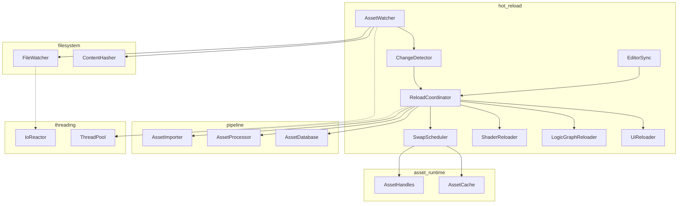
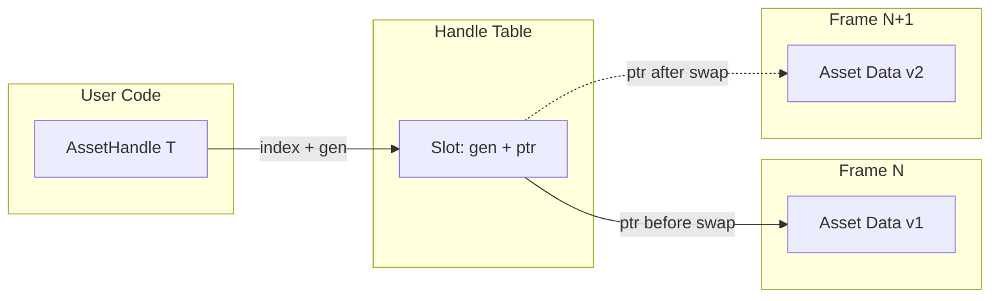
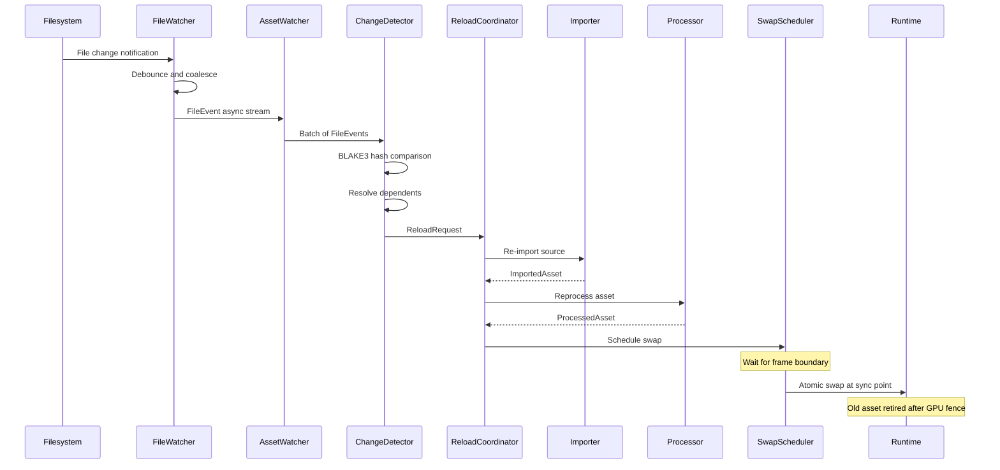
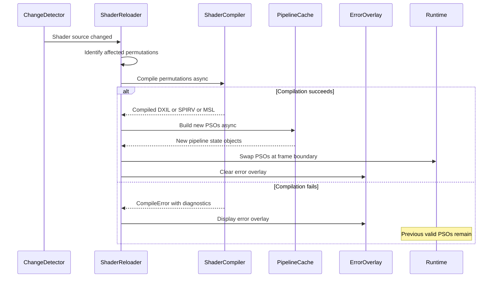
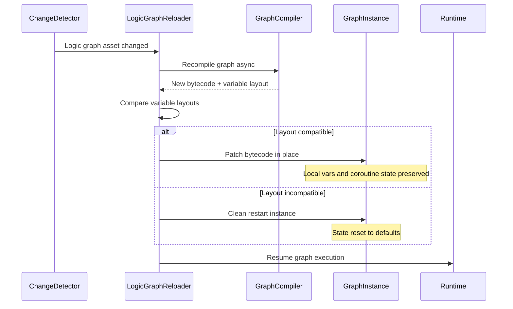
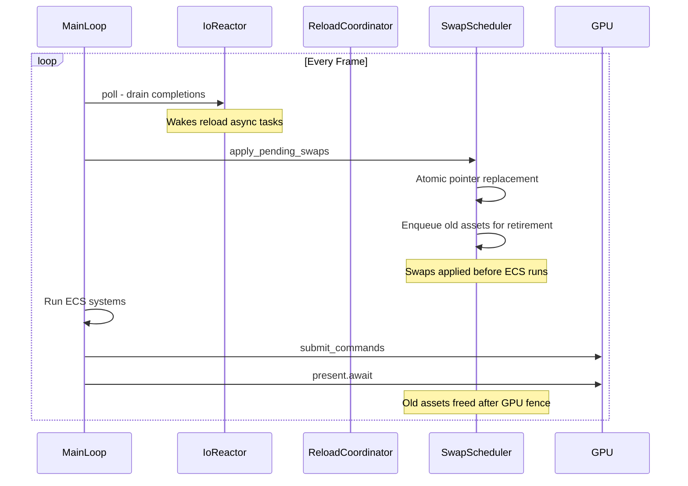
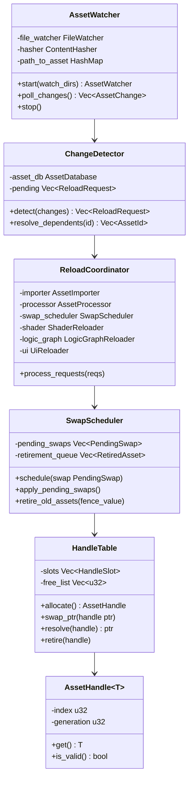

# Hot Reload Design

## Requirements Trace

> **Canonical sources:** Features, requirements, and user stories are defined in
> [features/content-pipeline/](../../features/),
> [requirements/content-pipeline/](../../requirements/), and
> [user-stories/content-pipeline/](../../user-stories/). The table below traces design elements to
> those definitions.

| Feature  | Requirement | User Stories                                 |
|----------|-------------|----------------------------------------------|
| F-12.4.1 | R-12.4.1    | US-12.4.5                                    |
| F-12.4.2 | R-12.4.2    | US-12.4.1, US-12.4.9, US-12.4.10, US-12.4.15 |
| F-12.4.3 | R-12.4.3    | US-12.4.2, US-12.4.8, US-12.4.12             |
| F-12.4.4 | R-12.4.4    | US-12.4.3, US-12.4.11, US-12.4.12            |
| F-12.4.5 | R-12.4.5    | US-12.4.4, US-12.4.16                        |
| F-12.4.6 | R-12.4.6    | US-12.4.6, US-12.4.12                        |
| F-12.4.7 | R-12.4.7    | US-12.4.7, US-12.4.13                        |

1. **F-12.4.1** — File watcher daemon with platform-native APIs, debounce, and deduplication
2. **F-12.4.2** — Asset hot reload with descriptor heap and atomic pointer swap
3. **F-12.4.3** — Shader hot reload with permutation recompilation and error overlay
4. **F-12.4.4** — Logic graph hot reload with state preservation
5. **F-12.4.5** — UI hot reload preserving scroll, focus, and animation state
6. **F-12.4.6** — Partial re-import of modified sub-assets only
7. **F-12.4.7** — Bidirectional editor-runtime synchronization channel

### Cross-Cutting Dependencies

| Dependency | Source | Consumed API |
|------------|--------|-------------|
| File watcher | F-14.6.5 | `FileWatcher`, `FileEventStream`, `FileEvent` |
| Content hashing | F-14.6.6 | `ContentHasher`, `Blake3Hash` |
| Async file I/O | F-14.6.1 | `AsyncFile`, `IoCompletionBridge` |
| IoReactor | F-14.3.5 | Controlled poll point for async completions |
| ThreadPool | F-14.3.1 | Background task execution |
| Asset importer | F-12.1.1 | Source asset ingestion |
| Asset processor | F-12.2.1 | Texture, mesh, shader, audio processing |
| Asset database | F-12.3.2 | Metadata, dependency graph, content hashes |
| Hash-based caching | F-12.3.3 | Skip reprocessing for unchanged assets |
| ECS | F-1.1.1 | Component storage for asset handles |
| Reflection | F-1.3.1 | Serialization for state preservation |
| Shader compiler | F-12.2.7 | HLSL codegen and DXC compilation |
| Logic graph runtime | F-15.8.1 | Graph instance patching |

## Overview

The hot reload subsystem provides sub-second feedback during content authoring by detecting file
changes, re-importing only affected assets, and atomically swapping runtime representations without
restarting the application. It builds on the platform `FileWatcher` (F-14.6.5) and `ContentHasher`
(F-14.6.6) from the OS integration design, adding asset-pipeline-aware change detection, dependency
resolution, and type-specific swap strategies.

The system is organized into four layers:

1. **Watch** -- `AssetWatcher` subscribes to the platform `FileWatcher` and maps file events to
   asset IDs via the asset database.
2. **Detect** -- `ChangeDetector` filters false positives with BLAKE3 hashing, resolves transitive
   dependents, and batches reload requests.
3. **Reload** -- `ReloadCoordinator` orchestrates re-import, reprocessing, and type-specific reload
   (shader, logic graph, UI) as async tasks.
4. **Swap** -- `SwapScheduler` applies changes at safe frame sync points using handle indirection,
   atomic pointer replacement, and GPU fence retirement.

All I/O and processing is async. File reads flow through the `IoReactor` poll point. Reload tasks
execute on the `ThreadPool`. Swaps occur only at frame boundaries (US-12.4.9). Asset handles use
double indirection so live references remain valid across reloads.

## Architecture

### Module Boundaries



### Module Structure

```text
harmonius_content/
├── hot_reload/
│   ├── watcher.rs         # AssetWatcher: file event
│   │                      # to asset ID mapping
│   ├── detector.rs        # ChangeDetector: BLAKE3
│   │                      # filtering, dependency
│   │                      # resolution
│   ├── coordinator.rs     # ReloadCoordinator:
│   │                      # orchestrates re-import,
│   │                      # reprocess, swap
│   ├── swap.rs            # SwapScheduler: frame-safe
│   │                      # atomic replacement
│   ├── shader.rs          # ShaderReloader:
│   │                      # permutation recompile,
│   │                      # PSO swap, error overlay
│   ├── logic_graph.rs     # LogicGraphReloader:
│   │                      # bytecode patch, state
│   │                      # preservation
│   ├── ui.rs              # UiReloader: subtree
│   │                      # rebuild with state
│   │                      # preservation
│   ├── editor_sync.rs     # EditorSync: bidirectional
│   │                      # editor-runtime channel
│   └── error.rs           # HotReloadError types
```

### Asset Handle Indirection

Asset handles use double indirection so that all live references survive a reload without patching
callsites.



- `AssetHandle<T>` stores an index and a generation counter into a central handle table.
- On reload, the `SwapScheduler` atomically replaces the pointer in the slot. Existing handles
  transparently resolve to the new data.
- The old data is retired after the GPU fence for the last frame that referenced it.

### Hot Reload Pipeline Flow



### Shader Hot Reload Flow



### Logic Graph Hot Reload Flow



### Frame Sync and Swap Timing



### Core Data Structures



## API Design

### Asset Watcher (F-12.4.1 / R-12.4.1)

The `AssetWatcher` bridges the platform `FileWatcher` to the asset pipeline. It maps filesystem
paths to asset IDs and batches changes for the detector.

```rust
/// Identifies an asset in the content database.
#[derive(
    Clone, Copy, Debug, PartialEq, Eq, Hash,
)]
pub struct AssetId(pub u64);

/// The kind of asset change detected.
#[derive(Clone, Debug, PartialEq, Eq)]
pub enum AssetChangeKind {
    /// Source file content changed.
    Modified,
    /// New source file detected.
    Created,
    /// Source file deleted.
    Deleted,
    /// Source file renamed.
    Renamed { from: CanonicalPath },
}

/// A detected change to a source asset.
#[derive(Clone, Debug)]
pub struct AssetChange {
    /// The affected asset ID (looked up from the
    /// asset database).
    pub asset_id: AssetId,
    /// The canonical path of the source file.
    pub path: CanonicalPath,
    /// The kind of change.
    pub kind: AssetChangeKind,
    /// BLAKE3 hash of the new file content
    /// (None for deletions).
    pub new_hash: Option<Blake3Hash>,
}

/// Configuration for the asset watcher.
pub struct AssetWatcherConfig {
    /// Directories to watch recursively.
    pub watch_dirs: Vec<CanonicalPath>,
    /// Debounce interval in milliseconds.
    /// Default: 100 ms.
    pub debounce_ms: u32,
    /// Maximum batch size before forced flush.
    /// Default: 256.
    pub max_batch_size: u32,
    /// Batch collection window in milliseconds.
    /// Default: 50 ms.
    pub batch_window_ms: u32,
}

/// Watches source asset directories and produces
/// batched, deduplicated asset change events.
///
/// Wraps the platform FileWatcher (F-14.6.5) and
/// ContentHasher (F-14.6.6). All I/O is async via
/// the IoReactor.
pub struct AssetWatcher { /* ... */ }

impl AssetWatcher {
    /// Create and start the asset watcher.
    /// Registers recursive watches on all configured
    /// directories.
    pub async fn start(
        config: AssetWatcherConfig,
        asset_db: &AssetDatabase,
    ) -> Result<Self, HotReloadError>;

    /// Poll for the next batch of asset changes.
    /// Returns an empty vec if no changes are
    /// pending. Non-blocking.
    pub async fn poll_changes(
        &mut self,
    ) -> Vec<AssetChange>;

    /// Add a directory to the watch list at runtime.
    pub async fn add_watch_dir(
        &mut self,
        dir: &CanonicalPath,
    ) -> Result<WatchId, HotReloadError>;

    /// Remove a previously registered watch.
    pub fn remove_watch(
        &mut self,
        id: WatchId,
    ) -> Result<(), HotReloadError>;

    /// Stop watching all directories and clean up.
    pub fn stop(&mut self);
}
```

### Change Detector (F-12.4.1, F-12.4.6)

The `ChangeDetector` filters false positives via BLAKE3 hashing, resolves transitive dependents from
the asset database dependency graph, and produces `ReloadRequest` batches.

```rust
/// Classifies the type of reload needed.
#[derive(Clone, Copy, Debug, PartialEq, Eq)]
pub enum ReloadKind {
    /// General asset (texture, mesh, audio, etc.).
    Asset,
    /// Shader source or shader graph.
    Shader,
    /// Logic graph asset.
    LogicGraph,
    /// UI layout, style sheet, or widget template.
    Ui,
}

/// A request to reload an asset and its dependents.
#[derive(Clone, Debug)]
pub struct ReloadRequest {
    /// The primary asset that changed.
    pub primary: AssetId,
    /// Path of the changed source file.
    pub source_path: CanonicalPath,
    /// New content hash.
    pub new_hash: Blake3Hash,
    /// Previous content hash (for rollback).
    pub old_hash: Blake3Hash,
    /// All transitive dependents that must also be
    /// reloaded.
    pub dependents: Vec<AssetId>,
    /// The type of reload to perform.
    pub kind: ReloadKind,
    /// Whether this is a partial re-import
    /// (sub-asset only).
    pub partial: bool,
    /// Sub-asset indices to re-import (empty = full).
    pub sub_asset_indices: Vec<u32>,
}

/// Filters and resolves asset changes into reload
/// requests.
pub struct ChangeDetector { /* ... */ }

impl ChangeDetector {
    pub fn new(
        asset_db: &AssetDatabase,
    ) -> Self;

    /// Process a batch of asset changes into reload
    /// requests. Filters false positives by comparing
    /// BLAKE3 hashes against the asset database.
    /// Resolves transitive dependents via the
    /// dependency graph.
    pub async fn detect(
        &mut self,
        changes: &[AssetChange],
    ) -> Vec<ReloadRequest>;

    /// Resolve all transitive dependents of an asset
    /// by walking the dependency graph bottom-up.
    pub fn resolve_dependents(
        &self,
        asset_id: AssetId,
    ) -> Vec<AssetId>;

    /// Check whether a source file's content has
    /// actually changed using BLAKE3.
    pub async fn has_content_changed(
        &self,
        path: &CanonicalPath,
        asset_id: AssetId,
    ) -> Result<bool, HotReloadError>;
}
```

### Reload Coordinator (F-12.4.2 / R-12.4.2)

The `ReloadCoordinator` is the central orchestrator. It receives reload requests, dispatches
re-import and reprocessing as async tasks, and delegates to type-specific reloaders.

```rust
/// Status of a reload operation.
#[derive(Clone, Copy, Debug, PartialEq, Eq)]
pub enum ReloadStatus {
    /// Re-import in progress.
    Importing,
    /// Reprocessing in progress.
    Processing,
    /// Waiting for frame boundary to swap.
    PendingSwap,
    /// Successfully reloaded.
    Complete,
    /// Reload failed (see error).
    Failed,
}

/// Tracks an in-flight reload operation.
#[derive(Clone, Debug)]
pub struct ReloadTask {
    /// Unique ID for this reload operation.
    pub id: ReloadTaskId,
    /// The reload request that spawned this task.
    pub request: ReloadRequest,
    /// Current status.
    pub status: ReloadStatus,
}

/// Unique identifier for a reload task.
#[derive(
    Clone, Copy, Debug, PartialEq, Eq, Hash,
)]
pub struct ReloadTaskId(pub u64);

/// Configuration for the reload coordinator.
pub struct ReloadCoordinatorConfig {
    /// Maximum concurrent re-import tasks.
    /// Default: 4.
    pub max_concurrent_imports: u32,
    /// Maximum concurrent reprocess tasks.
    /// Default: 4.
    pub max_concurrent_processes: u32,
    /// Whether to enable partial re-import
    /// (F-12.4.6). Default: true.
    pub enable_partial_reimport: bool,
}

/// Orchestrates the hot reload pipeline: detect,
/// re-import, reprocess, and swap.
pub struct ReloadCoordinator { /* ... */ }

impl ReloadCoordinator {
    pub fn new(
        config: ReloadCoordinatorConfig,
        asset_db: &AssetDatabase,
        importer: &AssetImporter,
        processor: &AssetProcessor,
        swap_scheduler: &SwapScheduler,
        shader_reloader: &ShaderReloader,
        logic_graph_reloader: &LogicGraphReloader,
        ui_reloader: &UiReloader,
    ) -> Self;

    /// Submit a batch of reload requests for
    /// processing. Each request is dispatched as an
    /// async task on the thread pool.
    pub async fn submit(
        &mut self,
        requests: Vec<ReloadRequest>,
    );

    /// Poll for completed reload tasks.
    /// Non-blocking.
    pub fn poll_completed(
        &mut self,
    ) -> Vec<ReloadTask>;

    /// Cancel a pending reload task.
    pub fn cancel(
        &mut self,
        id: ReloadTaskId,
    ) -> Result<(), HotReloadError>;

    /// Return the number of in-flight reload tasks.
    pub fn in_flight_count(&self) -> u32;
}
```

### Swap Scheduler (F-12.4.2, US-12.4.9)

The `SwapScheduler` ensures that asset replacements occur only at frame sync points. Old assets are
retired after the GPU fence for the last frame that referenced them.

```rust
/// A pending asset swap waiting for a frame boundary.
#[derive(Debug)]
pub struct PendingSwap {
    /// The asset being replaced.
    pub asset_id: AssetId,
    /// Pointer to the new processed data.
    pub new_data: *const u8,
    /// Size of the new data in bytes.
    pub new_data_size: usize,
    /// The swap strategy for this asset type.
    pub strategy: SwapStrategy,
    /// Reload task that produced this swap.
    pub task_id: ReloadTaskId,
}

/// How the runtime should apply the swap.
#[derive(Clone, Copy, Debug, PartialEq, Eq)]
pub enum SwapStrategy {
    /// Atomic pointer replacement in handle table.
    /// Used for meshes, materials, audio.
    AtomicPointer,
    /// Descriptor heap update. Used for textures.
    DescriptorHeap,
    /// Pipeline state object replacement.
    /// Used for shaders.
    PipelineState,
    /// Bytecode patch with state preservation.
    /// Used for logic graphs.
    BytecodePatch,
    /// Subtree rebuild with state transfer.
    /// Used for UI.
    SubtreeRebuild,
}

/// An old asset version awaiting GPU fence retirement.
#[derive(Debug)]
pub struct RetiredAsset {
    /// The old data pointer.
    pub old_data: *const u8,
    /// Size of the old data.
    pub old_data_size: usize,
    /// GPU fence value after which this is safe to
    /// free.
    pub fence_value: u64,
    /// Frame number when retirement was enqueued.
    pub retired_frame: u64,
}

/// Schedules asset swaps at frame sync points and
/// manages GPU-safe retirement of old data.
pub struct SwapScheduler { /* ... */ }

impl SwapScheduler {
    pub fn new() -> Self;

    /// Enqueue a swap for application at the next
    /// frame boundary.
    pub fn schedule(
        &mut self,
        swap: PendingSwap,
    );

    /// Apply all pending swaps. Called by the main
    /// loop at the frame sync point, before ECS
    /// systems run. Returns the count of swaps
    /// applied.
    pub fn apply_pending_swaps(
        &mut self,
        handle_table: &mut HandleTable,
    ) -> u32;

    /// Retire old assets whose GPU fence has been
    /// reached. Frees the old data memory.
    pub fn retire_old_assets(
        &mut self,
        completed_fence: u64,
    );

    /// Return the number of pending swaps.
    pub fn pending_count(&self) -> u32;

    /// Return the number of assets awaiting
    /// retirement.
    pub fn retirement_count(&self) -> u32;
}
```

### Asset Handle Table

The handle table provides the indirection layer that keeps all live references valid across reloads.

```rust
/// A type-erased handle slot in the handle table.
#[derive(Debug)]
pub struct HandleSlot {
    /// Pointer to the current asset data.
    pub ptr: *const u8,
    /// Current generation (incremented on each
    /// swap).
    pub generation: u32,
    /// Size of the current data in bytes.
    pub data_size: usize,
    /// Whether this slot is currently allocated.
    pub occupied: bool,
}

/// Central handle table for all loaded assets.
/// Provides O(1) lookup and atomic pointer swap.
pub struct HandleTable { /* ... */ }

impl HandleTable {
    pub fn new(initial_capacity: u32) -> Self;

    /// Allocate a new handle slot. Returns the
    /// handle index and generation.
    pub fn allocate(
        &mut self,
        ptr: *const u8,
        data_size: usize,
    ) -> (u32, u32);

    /// Swap the pointer in a handle slot. Increments
    /// the generation counter. Returns the old
    /// pointer for retirement.
    pub fn swap_ptr(
        &mut self,
        index: u32,
        new_ptr: *const u8,
        new_size: usize,
    ) -> (*const u8, usize);

    /// Resolve a handle to a pointer. Returns None
    /// if the generation does not match (stale
    /// handle).
    pub fn resolve(
        &self,
        index: u32,
        generation: u32,
    ) -> Option<*const u8>;

    /// Free a handle slot, returning it to the
    /// free list.
    pub fn retire(
        &mut self,
        index: u32,
    );

    /// Return the number of occupied slots.
    pub fn occupied_count(&self) -> u32;
}

/// A typed asset handle. Lightweight (8 bytes).
/// Survives hot reload via indirection through the
/// HandleTable.
#[derive(Clone, Copy, Debug, PartialEq, Eq, Hash)]
pub struct AssetHandle<T> {
    index: u32,
    generation: u32,
    _marker: core::marker::PhantomData<T>,
}

impl<T> AssetHandle<T> {
    /// Resolve this handle to a reference.
    /// Returns None if the handle is stale.
    pub fn get<'a>(
        &self,
        table: &'a HandleTable,
    ) -> Option<&'a T>;

    /// Check whether this handle is still valid.
    pub fn is_valid(
        &self,
        table: &HandleTable,
    ) -> bool;

    /// Return the raw index into the handle table.
    pub fn index(&self) -> u32 {
        self.index
    }

    /// Return the generation counter.
    pub fn generation(&self) -> u32 {
        self.generation
    }
}
```

### Shader Reloader (F-12.4.3 / R-12.4.3)

```rust
/// A shader compilation error with source location.
#[derive(Clone, Debug)]
pub struct ShaderCompileError {
    /// Path to the shader source file.
    pub source_path: CanonicalPath,
    /// Line number (1-based).
    pub line: u32,
    /// Column number (1-based).
    pub column: u32,
    /// Error message from the compiler.
    pub message: String,
    /// Severity level.
    pub severity: ShaderDiagnosticSeverity,
}

/// Severity of a shader diagnostic.
#[derive(Clone, Copy, Debug, PartialEq, Eq)]
pub enum ShaderDiagnosticSeverity {
    Error,
    Warning,
    Info,
}

/// Identifies a shader permutation.
#[derive(Clone, Debug, PartialEq, Eq, Hash)]
pub struct ShaderPermutationKey {
    /// The shader asset ID.
    pub shader_id: AssetId,
    /// Feature flags that define this permutation.
    pub features: u64,
    /// Target graphics API.
    pub target: ShaderTarget,
}

/// Target graphics API for shader compilation.
#[derive(Clone, Copy, Debug, PartialEq, Eq, Hash)]
pub enum ShaderTarget {
    Dxil,
    SpirV,
    Msl,
}

/// Reloads shaders by recompiling affected
/// permutations and swapping pipeline state objects
/// at frame boundaries. Displays an error overlay
/// on compilation failure while keeping the previous
/// valid shader active (R-12.4.3).
pub struct ShaderReloader { /* ... */ }

impl ShaderReloader {
    pub fn new(
        shader_compiler: &ShaderCompiler,
        pipeline_cache: &PipelineCache,
    ) -> Self;

    /// Reload a shader asset. Identifies all affected
    /// permutations, recompiles them in parallel, and
    /// schedules PSO swaps.
    pub async fn reload(
        &mut self,
        shader_id: AssetId,
        source_path: &CanonicalPath,
    ) -> Result<Vec<ShaderPermutationKey>,
                ShaderReloadError>;

    /// Return the list of permutation keys affected
    /// by a shader source change.
    pub fn affected_permutations(
        &self,
        shader_id: AssetId,
    ) -> Vec<ShaderPermutationKey>;

    /// Return the most recent compilation errors
    /// (displayed in the error overlay).
    pub fn pending_errors(
        &self,
    ) -> &[ShaderCompileError];

    /// Clear pending errors (e.g., after a
    /// successful recompile).
    pub fn clear_errors(&mut self);
}

/// Shader reload errors.
#[derive(Debug)]
pub enum ShaderReloadError {
    /// One or more permutations failed to compile.
    CompileFailed {
        errors: Vec<ShaderCompileError>,
    },
    /// PSO creation failed after successful compile.
    PipelineCreationFailed { message: String },
    /// The shader source file could not be read.
    IoError(FsError),
}
```

### Logic Graph Reloader (F-12.4.4 / R-12.4.4)

```rust
/// Describes the variable layout of a logic graph.
#[derive(Clone, Debug, PartialEq, Eq)]
pub struct GraphVariableLayout {
    /// Ordered list of variable names and type IDs.
    pub variables: Vec<(String, TypeId)>,
    /// Layout hash for quick compatibility check.
    pub layout_hash: u64,
}

/// Result of a logic graph compatibility check.
#[derive(Clone, Copy, Debug, PartialEq, Eq)]
pub enum GraphCompatibility {
    /// Variable layout is identical. State can be
    /// preserved in place.
    Compatible,
    /// Layout changed. Instance must be restarted.
    Incompatible,
}

/// Reloads logic graph assets by recompiling and
/// patching running instances. Preserves execution
/// state (local variables, coroutine positions) when
/// the variable layout is compatible (R-12.4.4).
pub struct LogicGraphReloader { /* ... */ }

impl LogicGraphReloader {
    pub fn new(
        graph_compiler: &GraphCompiler,
    ) -> Self;

    /// Reload a logic graph asset. Recompiles the
    /// graph, checks layout compatibility, and
    /// patches or restarts all running instances.
    pub async fn reload(
        &mut self,
        graph_id: AssetId,
        source_path: &CanonicalPath,
    ) -> Result<GraphReloadResult, HotReloadError>;

    /// Check whether a new bytecode version is
    /// compatible with the current layout.
    pub fn check_compatibility(
        &self,
        old_layout: &GraphVariableLayout,
        new_layout: &GraphVariableLayout,
    ) -> GraphCompatibility;
}

/// Result of a logic graph hot reload.
#[derive(Clone, Debug)]
pub struct GraphReloadResult {
    /// Number of instances patched in place.
    pub patched_count: u32,
    /// Number of instances restarted due to
    /// incompatible layout.
    pub restarted_count: u32,
    /// Compatibility determination.
    pub compatibility: GraphCompatibility,
}
```

### UI Reloader (F-12.4.5 / R-12.4.5)

```rust
/// Preserved UI state captured before a subtree
/// rebuild.
#[derive(Clone, Debug)]
pub struct UiStateSnapshot {
    /// Scroll positions keyed by widget ID.
    pub scroll_positions: Vec<(u64, f32)>,
    /// The currently focused widget ID, if any.
    pub focus_target: Option<u64>,
    /// Animation progress keyed by widget ID.
    pub animation_progress: Vec<(u64, f32)>,
    /// Selection state keyed by widget ID.
    pub selection_state: Vec<(u64, Vec<u32>)>,
}

/// Reloads UI layouts, style sheets, and widget
/// templates by rebuilding the affected subtree in
/// place while preserving scroll positions, focus
/// state, and animation progress (R-12.4.5).
pub struct UiReloader { /* ... */ }

impl UiReloader {
    pub fn new() -> Self;

    /// Reload a UI asset. Captures the current state
    /// of the affected subtree, rebuilds it from the
    /// updated definition, and restores preserved
    /// state.
    pub async fn reload(
        &mut self,
        ui_asset_id: AssetId,
        source_path: &CanonicalPath,
    ) -> Result<UiReloadResult, HotReloadError>;

    /// Capture the state of a UI subtree before
    /// rebuild.
    pub fn capture_state(
        &self,
        root_widget_id: u64,
    ) -> UiStateSnapshot;

    /// Restore previously captured state after
    /// rebuild.
    pub fn restore_state(
        &mut self,
        root_widget_id: u64,
        snapshot: &UiStateSnapshot,
    );
}

/// Result of a UI hot reload.
#[derive(Clone, Debug)]
pub struct UiReloadResult {
    /// Number of widgets rebuilt.
    pub widgets_rebuilt: u32,
    /// Whether the focus target was preserved.
    pub focus_preserved: bool,
    /// Number of scroll positions restored.
    pub scroll_positions_restored: u32,
}
```

### Audio Asset Hot Reload

Audio clips and sound banks support hot reload. When the file watcher detects a changed audio source
file, the pipeline re-imports and re-encodes the audio asset. The audio runtime receives a reload
event via the SPSC command queue (see [engine.md](../audio/engine.md)). Playing voices that
reference the reloaded asset crossfade to the new version over a configurable duration (default
100ms) to avoid audible pops.

### Editor-Runtime Sync (F-12.4.7 / R-12.4.7)

```rust
/// A change message sent between editor and runtime.
#[derive(Clone, Debug)]
pub enum SyncMessage {
    /// Asset data changed (editor to runtime).
    AssetChanged {
        asset_id: AssetId,
        data: Vec<u8>,
    },
    /// Entity property changed
    /// (editor to runtime).
    PropertyChanged {
        entity: u64,
        property: String,
        value: Vec<u8>,
    },
    /// Camera position update
    /// (runtime to editor).
    CameraUpdate {
        position: [f32; 3],
        rotation: [f32; 4],
    },
    /// Performance counters
    /// (runtime to editor).
    PerfCounters {
        fps: f32,
        frame_time_ms: f32,
        draw_calls: u32,
        triangles: u64,
    },
    /// Reload completed notification
    /// (runtime to editor).
    ReloadCompleted {
        task_id: ReloadTaskId,
        status: ReloadStatus,
    },
}

/// Configuration for the editor-runtime sync
/// channel.
pub struct EditorSyncConfig {
    /// Maximum message queue depth per direction.
    /// Default: 1024.
    pub max_queue_depth: u32,
    /// Sync interval in milliseconds.
    /// Default: 16 (60 Hz).
    pub sync_interval_ms: u32,
}

/// Bidirectional sync channel between the editor
/// process and connected runtime instances (R-12.4.7).
pub struct EditorSync { /* ... */ }

impl EditorSync {
    pub fn new(
        config: EditorSyncConfig,
    ) -> Self;

    /// Connect to an editor instance. Returns a
    /// channel for bidirectional communication.
    pub async fn connect(
        &mut self,
        editor_addr: &str,
    ) -> Result<SyncChannelId, HotReloadError>;

    /// Disconnect a specific editor channel.
    pub fn disconnect(
        &mut self,
        channel: SyncChannelId,
    );

    /// Send a message to all connected editors.
    pub fn broadcast(
        &self,
        message: &SyncMessage,
    );

    /// Send a message to a specific editor.
    pub fn send(
        &self,
        channel: SyncChannelId,
        message: &SyncMessage,
    );

    /// Poll for incoming messages from editors.
    /// Non-blocking.
    pub fn poll_messages(
        &mut self,
    ) -> Vec<(SyncChannelId, SyncMessage)>;

    /// Return the number of connected editors.
    pub fn connected_count(&self) -> u32;
}

/// Identifies a sync channel to a specific editor.
#[derive(
    Clone, Copy, Debug, PartialEq, Eq, Hash,
)]
pub struct SyncChannelId(pub u32);
```

### Error Types

```rust
/// Top-level hot reload errors.
#[derive(Debug)]
pub enum HotReloadError {
    /// Filesystem error (file not found,
    /// permission denied, etc.).
    Fs(FsError),
    /// The asset ID was not found in the database.
    AssetNotFound { asset_id: AssetId },
    /// Re-import failed for the given asset.
    ImportFailed {
        asset_id: AssetId,
        message: String,
    },
    /// Reprocessing failed for the given asset.
    ProcessFailed {
        asset_id: AssetId,
        message: String,
    },
    /// Shader compilation failed.
    ShaderCompileFailed {
        errors: Vec<ShaderCompileError>,
    },
    /// Logic graph compilation failed.
    GraphCompileFailed {
        asset_id: AssetId,
        message: String,
    },
    /// Editor sync channel error.
    SyncError { message: String },
    /// The watch directory does not exist.
    WatchDirNotFound { path: String },
    /// Maximum concurrent reload tasks exceeded.
    CapacityExceeded { current: u32, max: u32 },
}
```

## Data Flow

### End-to-End Hot Reload

1. The platform `FileWatcher` (ReadDirectoryChangesW / FSEvents / inotify) delivers a raw filesystem
   event to the `AssetWatcher`.
2. The `AssetWatcher` accumulates events for the batch window (default 50 ms), deduplicates by path,
   and maps each path to an `AssetId` via the asset database.
3. The `ChangeDetector` receives the batch. For each `Modified` event, it computes a BLAKE3 hash of
   the file and compares it against the stored hash in the asset database. False positives
   (metadata-only changes) are discarded.
4. For each genuine content change, the detector walks the dependency graph bottom-up to find all
   transitive dependents. It classifies each change by `ReloadKind` (asset, shader, logic graph,
   UI).
5. The `ReloadCoordinator` receives the `ReloadRequest` batch. It spawns async re-import and
   reprocess tasks on the thread pool, respecting the concurrency limit.
6. For partial re-imports (F-12.4.6), only the changed sub-asset indices are re-imported. The
   coordinator checks the import cache (F-12.3.3) and skips reprocessing if the output hash matches.
7. Type-specific reloaders handle domain logic:
   - **Shader**: identify affected permutations, recompile via DXC, build new PSOs.
   - **Logic graph**: recompile bytecode, check variable layout compatibility, patch or restart.
   - **UI**: capture state snapshot, rebuild subtree, restore state.
8. The `SwapScheduler` enqueues a `PendingSwap` for each completed reload.
9. At the next frame sync point, the main loop calls `apply_pending_swaps()`. For each swap:
   - **AtomicPointer**: the handle table slot pointer is replaced. The old pointer is enqueued for
     retirement.
   - **DescriptorHeap**: the texture descriptor is updated in the GPU descriptor heap.
   - **PipelineState**: the PSO reference in the pipeline cache is replaced.
   - **BytecodePatch**: graph instances receive the new bytecode.
   - **SubtreeRebuild**: the UI subtree is rebuilt and state restored.
10. Old asset data is retired after the GPU fence for the last frame that referenced it. The
    `SwapScheduler` calls `retire_old_assets()` each frame, freeing data whose fence has been
    reached.

### Partial Re-Import (F-12.4.6)

1. A composite source file (e.g., FBX with 10 animation clips) is modified.
2. The `ChangeDetector` computes BLAKE3 hashes for each sub-asset region within the file.
3. Only sub-assets whose hashes changed are submitted for re-import.
4. The `ReloadCoordinator` passes the sub-asset indices to the importer, which extracts and
   reimports only those sub-assets.
5. Unchanged sub-assets retain their existing processed output in the cache.

### Editor-Runtime Sync (F-12.4.7)

1. The editor modifies a material parameter, entity transform, or light value.
2. The editor sends a `SyncMessage::PropertyChanged` over the sync channel.
3. The runtime's `EditorSync` receives the message and either:
   - Applies the property change directly to the ECS component (for live-preview tweaks), or
   - Routes the change through the reload pipeline (for asset-level changes).
4. The runtime streams back `SyncMessage::CameraUpdate` and `SyncMessage::PerfCounters` each frame.
5. If the connection drops, the runtime buffers outgoing messages and reconnects automatically.

### Frame Integration

```rust
// Simplified main loop integration
loop {
    // ---- Harvest I/O completions ----
    reactor.poll();

    // ---- Apply hot reload swaps ----
    let swaps_applied =
        swap_scheduler.apply_pending_swaps(
            &mut handle_table,
        );

    // ---- Retire GPU-safe old assets ----
    let completed_fence =
        gpu.last_completed_fence();
    swap_scheduler
        .retire_old_assets(completed_fence);

    // ---- Poll for new file changes ----
    let changes =
        asset_watcher.poll_changes().await;
    if !changes.is_empty() {
        let requests =
            change_detector.detect(&changes).await;
        reload_coordinator.submit(requests).await;
    }

    // ---- Process editor sync messages ----
    let messages =
        editor_sync.poll_messages();
    for (channel, msg) in messages {
        handle_editor_message(channel, msg);
    }

    // ---- Run ECS systems ----
    let graph = ecs.build_frame_graph();
    pool.execute_graph(graph).await;

    // ---- Render and present ----
    renderer.submit_commands();
    renderer.present().await;
}
```

## Platform Considerations

### File Watcher Backends

| Platform | API                       |
|----------|---------------------------|
| Windows  | `ReadDirectoryChangesExW` |
| macOS    | `FSEvents`                |
| Linux    | `inotify_add_watch`       |

1. **Windows** — Async via IOCP. Supports recursive watching natively. Buffer overflow requires
   re-scan.
2. **macOS** — Recursive watching with latency coalescing. Events delivered to GCD dispatch queue,
   drained at poll point.
3. **Linux** — One watch per directory for recursive mode. Event reads via io_uring. Watch limit
   governed by `fs.inotify.max_user_watches`.

### Swap Strategy per Asset Type

| Asset Type | Swap Strategy | GPU Involvement | Latency Target |
|------------|---------------|-----------------|----------------|
| Texture | DescriptorHeap | Descriptor update | < 2 s (US-12.4.12) |
| Mesh | AtomicPointer | Frame fence | < 3 s (US-12.4.12) |
| Material | AtomicPointer | Frame fence | < 2 s |
| Shader | PipelineState | PSO creation | < 5 s (US-12.4.12) |
| Logic graph | BytecodePatch | None | < 500 ms (US-12.4.12) |
| UI layout | SubtreeRebuild | None | < 500 ms |
| Audio | AtomicPointer | None | < 1 s |

### Texture Hot Reload (Descriptor Heap)

1. New texture data is uploaded to a staging buffer via async I/O.
2. A GPU copy command transfers the data to a new texture resource.
3. The descriptor heap entry is updated to point to the new texture.
4. The old texture resource is enqueued for retirement after the GPU fence.

No atomic pointer swap is needed because the descriptor heap indirection serves the same purpose.

### Mesh Hot Reload (Atomic Pointer)

1. New vertex and index buffers are uploaded via async GPU copy.
2. At the frame boundary, the handle table slot is atomically swapped to point to the new buffers.
3. In-flight draw calls on frame N continue using the old buffers (they were bound before the swap).
4. Frame N+1 picks up the new buffers via handle resolution.
5. After frame N's GPU fence completes, the old buffers are freed.

### Shader Hot Reload (PSO Replacement)

1. The `ShaderReloader` identifies all permutations that reference the changed source.
2. Permutations are recompiled in parallel via DXC (HLSL to DXIL/SPIR-V) and Metal Shader Converter
   (DXIL to MSL) as needed.
3. New pipeline state objects are created from the compiled bytecode.
4. At the frame boundary, the pipeline cache entries are swapped to the new PSOs.
5. If compilation fails, the error overlay is activated and the previous valid PSOs remain.

### Buffer Overflow Recovery

On Windows, `ReadDirectoryChangesExW` can lose events if the kernel buffer overflows during rapid
changes. On Linux, inotify emits `IN_Q_OVERFLOW`. Recovery strategy:

1. Detect the overflow event.
2. Perform a full directory scan of all watched paths.
3. Compare BLAKE3 hashes of all source files against the asset database.
4. Generate synthetic `AssetChange::Modified` events for any mismatches.
5. Resume normal watching.

## Test Plan

### Unit Tests

| Test                                           | Req       |
|------------------------------------------------|-----------|
| `test_change_detector_filters_false_positive`  | R-12.4.1  |
| `test_change_detector_resolves_dependents`     | R-12.4.2  |
| `test_handle_table_swap_preserves_handle`      | R-12.4.2  |
| `test_handle_table_stale_generation`           | R-12.4.2  |
| `test_swap_scheduler_applies_at_boundary`      | US-12.4.9 |
| `test_swap_scheduler_retires_after_fence`      | R-12.4.2  |
| `test_shader_reloader_identifies_permutations` | R-12.4.3  |
| `test_shader_reloader_error_preserves_old`     | R-12.4.3  |
| `test_logic_graph_compatible_layout`           | R-12.4.4  |
| `test_logic_graph_incompatible_layout`         | R-12.4.4  |
| `test_ui_reloader_preserves_scroll`            | R-12.4.5  |
| `test_ui_reloader_preserves_focus`             | R-12.4.5  |
| `test_partial_reimport_single_clip`            | R-12.4.6  |
| `test_debounce_coalesces_rapid_events`         | R-12.4.1  |
| `test_editor_sync_property_roundtrip`          | R-12.4.7  |

1. **`test_change_detector_filters_false_positive`** — Touch a file without changing content. Verify
   no reload request is generated after BLAKE3 comparison.
2. **`test_change_detector_resolves_dependents`** — Change a texture referenced by 3 materials.
   Verify all 3 materials appear in the reload request's dependents list.
3. **`test_handle_table_swap_preserves_handle`** — Allocate a handle, swap the pointer, resolve the
   handle. Verify it returns the new data.
4. **`test_handle_table_stale_generation`** — Allocate a handle, retire it, allocate a new slot in
   the same index. Verify the old handle returns None.
5. **`test_swap_scheduler_applies_at_boundary`** — Schedule a swap, verify it is not applied until
   `apply_pending_swaps` is called.
6. **`test_swap_scheduler_retires_after_fence`** — Schedule and apply a swap. Verify the old data is
   not freed until `retire_old_assets` is called with a fence value >= the swap frame.
7. **`test_shader_reloader_identifies_permutations`** — Register 8 permutations for a shader. Verify
   `affected_permutations` returns all 8.
8. **`test_shader_reloader_error_preserves_old`** — Compile a shader with an error. Verify the old
   PSO remains active and errors are reported.
9. **`test_logic_graph_compatible_layout`** — Reload a graph with the same variable layout. Verify
   state is preserved and `patched_count > 0`.
10. **`test_logic_graph_incompatible_layout`** — Reload a graph with a changed variable layout.
    Verify instances are restarted and `restarted_count > 0`.
11. **`test_ui_reloader_preserves_scroll`** — Set a scroll position, reload UI, verify the position
    is restored.
12. **`test_ui_reloader_preserves_focus`** — Set focus on a widget, reload UI, verify focus is
    restored.
13. **`test_partial_reimport_single_clip`** — Modify 1 of 10 animation clips. Verify only 1
    sub-asset is reimported.
14. **`test_debounce_coalesces_rapid_events`** — Write to the same file 5 times in 20 ms. Verify
    exactly 1 reload request is generated.
15. **`test_editor_sync_property_roundtrip`** — Send a PropertyChanged message from editor to
    runtime and verify the property is applied.

### Integration Tests

| Test                                   | Req        |
|----------------------------------------|------------|
| `test_texture_hot_reload_e2e`          | R-12.4.2   |
| `test_mesh_hot_reload_e2e`             | R-12.4.2   |
| `test_shader_hot_reload_valid`         | R-12.4.3   |
| `test_shader_hot_reload_error_overlay` | R-12.4.3   |
| `test_logic_graph_reload_500ms`        | R-12.4.4   |
| `test_ui_reload_preserves_all_state`   | R-12.4.5   |
| `test_partial_reimport_latency`        | R-12.4.6   |
| `test_editor_runtime_sync_100ms`       | R-12.4.7   |
| `test_multi_device_sync`               | R-12.4.7   |
| `test_hot_reload_no_memory_leak`       | US-12.4.10 |
| `test_buffer_overflow_recovery`        | R-12.4.1   |
| `test_dcc_bridge_reload`               | US-12.4.14 |
| `test_platform_watcher_latency`        | R-12.4.1   |

1. **`test_texture_hot_reload_e2e`** — Load a scene with a textured mesh, modify the source texture,
   verify the runtime texture updates within 2 seconds without restart. Capture frames before and
   after to verify no artifacts.
2. **`test_mesh_hot_reload_e2e`** — Modify a mesh source file, verify the runtime mesh updates
   within 3 seconds with no visual glitches during the swap.
3. **`test_shader_hot_reload_valid`** — Modify a shader with a valid change, verify PSO updates
   within one frame boundary.
4. **`test_shader_hot_reload_error_overlay`** — Introduce a shader syntax error, verify the error
   overlay appears and the previous shader continues rendering.
5. **`test_logic_graph_reload_500ms`** — Modify a logic graph, verify hot reload completes within
   500 ms with state preserved.
6. **`test_ui_reload_preserves_all_state`** — Reload a UI with active scroll, focus, and animation.
   Verify all three are preserved.
7. **`test_partial_reimport_latency`** — Partial reimport of 1/10 clips. Verify latency is under 20%
   of full reimport.
8. **`test_editor_runtime_sync_100ms`** — Change a material parameter in the editor, verify runtime
   reflects it within 100 ms.
9. **`test_multi_device_sync`** — Connect 3 runtime instances, verify all receive synchronized
   changes.
10. **`test_hot_reload_no_memory_leak`** — Repeatedly hot reload textures, meshes, shaders, and
    logic graphs 100 times. Verify CPU and GPU memory usage does not grow unboundedly.
11. **`test_buffer_overflow_recovery`** — Trigger a ReadDirectoryChangesW buffer overflow by writing
    10,000 files rapidly. Verify the watcher recovers via full scan and no changes are missed.
12. **`test_dcc_bridge_reload`** — Push a change through a DCC plugin DCC Bridge, verify the engine
    hot reloads the asset correctly.
13. **`test_platform_watcher_latency`** — Write a file and measure time to event dispatch. Verify
    under 500 ms on all platforms.

### Benchmarks

| Benchmark | Target | Source |
|-----------|--------|--------|
| Texture hot reload latency | < 2 s | US-12.4.12 |
| Mesh hot reload latency | < 3 s | US-12.4.12 |
| Shader hot reload latency | < 5 s | US-12.4.12 |
| Logic graph hot reload latency | < 500 ms | US-12.4.12 |
| UI hot reload latency | < 500 ms | US-12.4.5 |
| File change detection latency | < 500 ms | R-12.4.1 |
| Editor-runtime sync latency | < 100 ms | R-12.4.7 |
| Handle table resolve | < 10 ns | -- |
| Handle table swap | < 50 ns | -- |
| Memory growth after 1000 reloads | 0 bytes net | US-12.4.10 |

## Design Q & A

**Q1. What is the biggest constraint limiting this design?**

The requirement that hot reload must preserve running game state (R-12.4.2, R-12.4.4, R-12.4.5) is
the hardest constraint. Atomic pointer swaps behind frame fences for meshes/materials and descriptor
heap updates for textures are complex GPU synchronization operations that differ per graphics API
(Vulkan, D3D12, Metal). If lifted, a simpler "reload by restart" approach would work. However,
losing live game state would destroy the sub-second iteration workflow that makes hot reload
valuable (US-12.4.1, US-12.4.9). The constraint is essential for the no-code engine vision where
designers iterate visually.

**Q2. How can this design be improved?**

The logic graph hot reload (F-12.4.4) preserves state only when the variable layout is unchanged --
any layout change triggers a full restart of the graph instance. A migration system that maps old
variables to new ones by name and type would preserve state across more layout changes. The
editor-runtime sync channel (F-12.4.7) is bidirectional but does not support multiple editors
connected to one runtime, which matters for collaborative workflows. The design also does not
specify behavior when a hot reload fails midway (e.g., shader compilation error during asset reload)
-- a transactional rollback to the pre-reload state would improve robustness.

**Q3. Is there a better approach?**

An alternative is a shadow-copy reload model where the entire asset is loaded into a parallel slot
and swapped atomically at a safe point, rather than patching in-place. This avoids the complexity of
per-asset-type swap strategies (descriptor heaps for textures, pointer swaps for meshes) but doubles
memory during reload. The in-place patching approach was chosen because it stays within the memory
budget (R-5.1.NF3 limits audio to 64 MiB, similar constraints exist for other subsystems). For
texture-heavy scenes, shadow copies could exceed GPU memory budgets on mobile platforms.

**Q4. Does this design solve all customer problems?**

Core hot reload scenarios are covered: assets (US-12.4.1), shaders (US-12.4.2), logic graphs
(US-12.4.3), and UI (US-12.4.4). However, there is no hot reload for audio assets -- changing a
sound effect requires a full reimport cycle. Adding audio hot reload would benefit sound designers
iterating on SFX and music stems. The design also lacks a reload history/timeline that lets
designers undo a recent reload and restore the previous asset version without manually reverting the
source file. This would improve iteration confidence for US-12.4.15 (rapid material tweaking).

**Q5. Is this design cohesive with the overall engine?**

Hot reload integrates deeply with the content pipeline (F-12.2.8 dependency graphs, F-12.3.3 import
caching) and the platform layer (F-14.6.5 file watcher). The use of platform-native file watching
APIs (ReadDirectoryChangesW, FSEvents, inotify per R-12.4.1) is consistent with the engine-wide ban
on stdlib I/O. The partial re-import system (F-12.4.6) leverages the same BLAKE3 content hashing
used throughout the pipeline. One cohesion gap is that hot reload handles each asset type with a
distinct swap strategy -- a unified handle-based indirection table (similar to generational indices
in the ECS) could provide a single reload mechanism across all asset types.

## Open Questions

1. **Descriptor heap update atomicity** -- On Vulkan, descriptor set updates require
   `vkUpdateDescriptorSets` which is not inherently atomic with respect to in-flight draws. Need to
   determine whether to use descriptor indexing with a secondary descriptor or double-buffer
   descriptor sets for texture hot reload.

2. **Partial re-import granularity** -- The current design assumes sub-assets can be identified by
   index within a composite file. DCC formats (FBX, glTF) may require format-specific sub-asset
   boundary detection. The DCC plugin design (F-12.6) may influence this.

3. **Editor sync transport** -- The bidirectional sync channel needs a transport protocol. Options:
   - Local Unix domain sockets / named pipes
   - Shared memory ring buffer (lowest latency)
   - TCP for remote device preview
   The choice may depend on whether remote editing    (F-15.12) requires network transport.

4. **Shader permutation explosion** -- A material with many feature flags can produce hundreds of
   permutations. Recompiling all permutations on every shader change may exceed the 5-second latency
   target. May need to recompile only permutations that are currently loaded in the pipeline cache.

5. **Logic graph coroutine position preservation** -- When a graph's bytecode changes but the
   variable layout is compatible, preserving the coroutine instruction pointer requires mapping old
   bytecode offsets to new offsets. This may not always be possible if the control flow graph
   changed significantly. Need to define the exact conditions under which coroutine position is
   preserved vs. reset.

6. **GPU resource creation latency** -- PSO creation and texture upload are GPU operations that may
   take multiple frames on some hardware. The swap scheduler may need to support multi-frame reload
   tasks and report progress to the editor.
