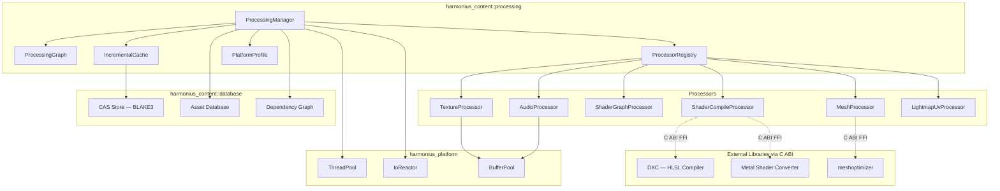
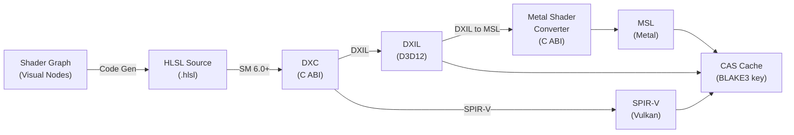
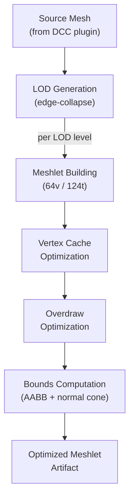
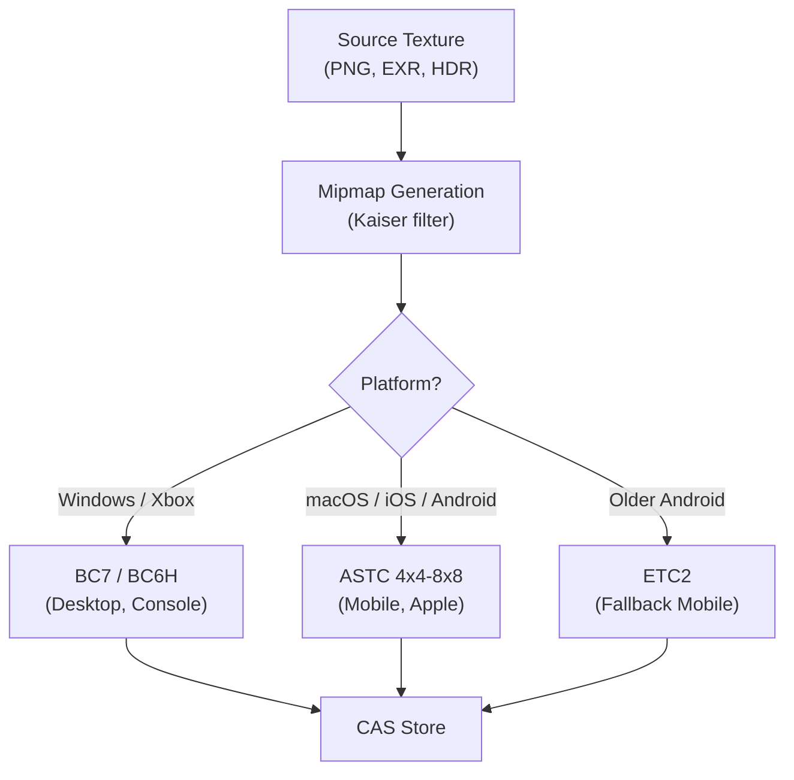
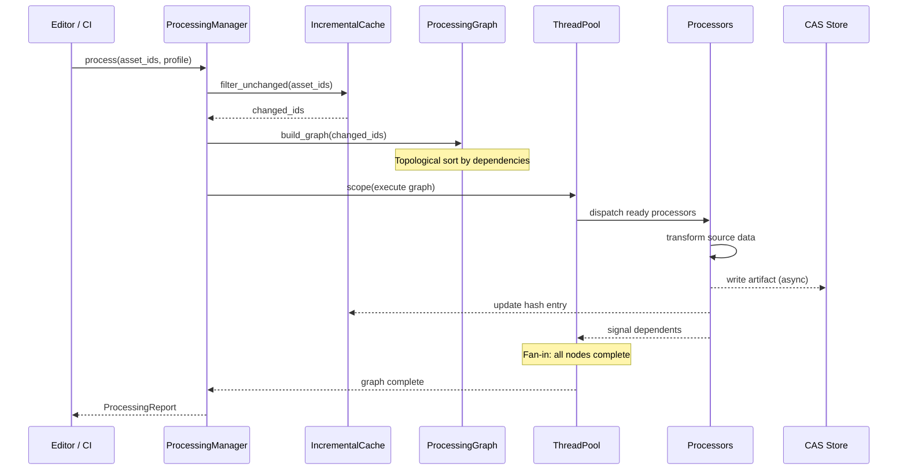
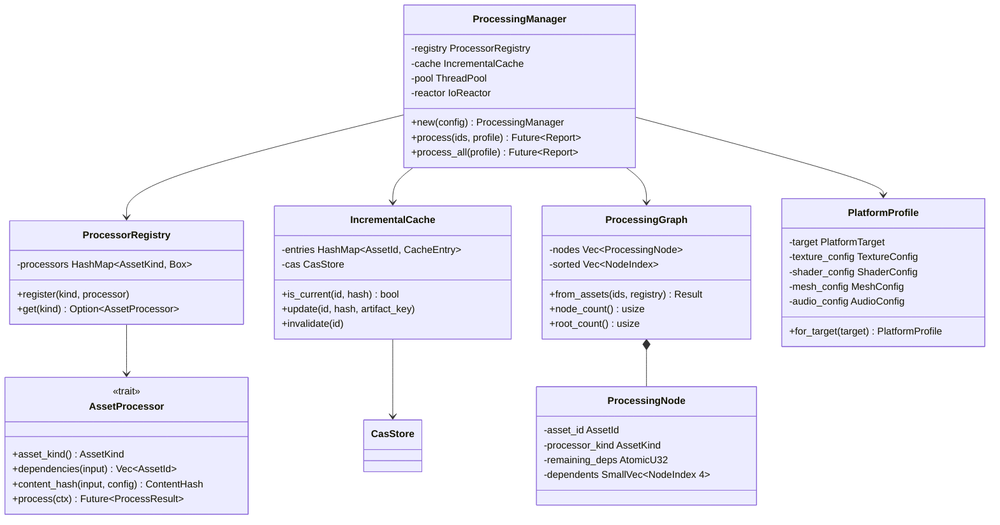
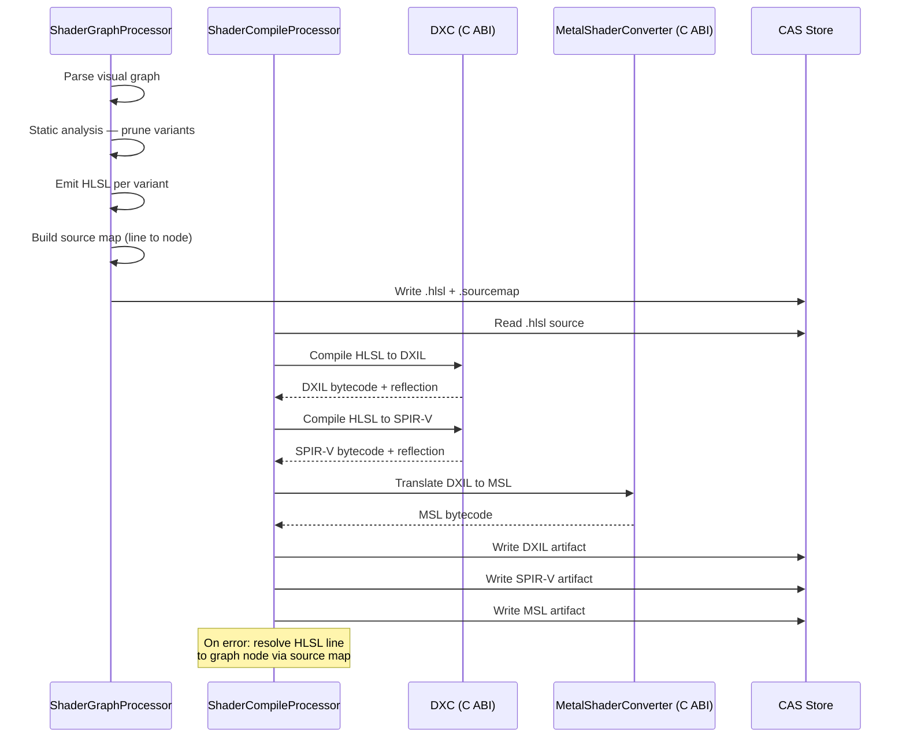
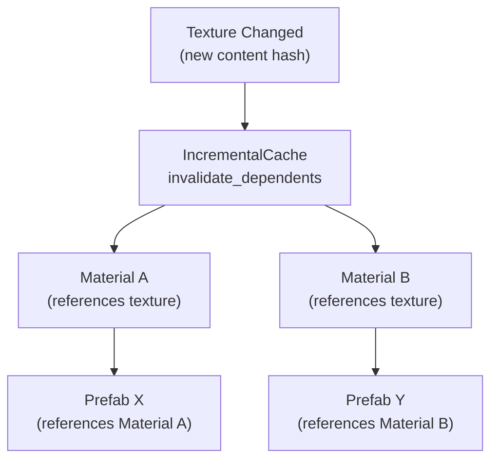

# Asset Processing Design

## Requirements Trace

> **Canonical sources:** Features, requirements, and user stories are defined in
> [features/content-pipeline/](../../features/content-pipeline/),
> [requirements/content-pipeline/](../../requirements/content-pipeline/), and
> [user-stories/content-pipeline/](../../user-stories/content-pipeline/). The table below traces
> design elements to those definitions.

| Feature  | Requirement | User Stories                      |
|----------|-------------|-----------------------------------|
| F-12.2.1 | R-12.2.1    | US-12.2.1, US-12.2.12, US-12.2.17 |
| F-12.2.2 | R-12.2.2    | US-12.2.2, US-12.2.13             |
| F-12.2.3 | R-12.2.3    | US-12.2.3, US-12.2.19             |
| F-12.2.4 | R-12.2.4    | US-12.2.4                         |
| F-12.2.5 | R-12.2.5    | US-12.2.5, US-12.2.20             |
| F-12.2.6 | R-12.2.6    | US-12.2.6, US-12.2.18             |
| F-12.2.7 | R-12.2.7    | US-12.2.7, US-12.2.11, US-12.2.16 |
| F-12.2.8 | R-12.2.8    | US-12.2.9                         |
| F-12.2.9 | R-12.2.9    | US-12.2.8, US-12.2.10, US-12.2.14 |

1. **F-12.2.1** — Texture compression (BC7, ASTC, ETC2) per platform with quality presets
2. **F-12.2.2** — LOD chain generation via edge-collapse simplification
3. **F-12.2.3** — Meshlet building (64v/124t) with AABB and normal cone bounds
4. **F-12.2.4** — Vertex cache and overdraw optimization per meshlet
5. **F-12.2.5** — Lightmap UV atlas generation with uniform texel density
6. **F-12.2.6** — Audio encoding (Opus, ADPCM, PCM) by import preset
7. **F-12.2.7** — Shader graph to clean HLSL code generation
8. **F-12.2.8** — Asset dependency graph for incremental rebuilds
9. **F-12.2.9** — DXC and Metal Shader Converter bytecode pipeline

### Cross-Cutting Dependencies

| Dependency | Source | Consumed API |
|------------|--------|--------------|
| Thread pool | F-14.3.1 | `ThreadPool::scope`, `ThreadPool::spawn` |
| Task graph | F-14.3.3 | `TaskGraphBuilder`, `TaskGraph` |
| Async I/O | F-14.3.5 | `IoReactor::read`, `IoReactor::write` |
| Buffer pool | F-14.3.5 | `BufferPool::acquire`, `BufferSlot` |
| CAS store | F-12.3.2 | BLAKE3-keyed content-addressable storage |
| Asset database | F-12.3.1 | Asset metadata, import records |
| Dependency graph | F-12.3.5 | DAG edges between asset IDs |
| Reflection | F-1.3.1 | `Reflect` derive for processor configs |
| DCC plugins | F-12.1.1 | Native mesh/texture/audio ingestion |

## Overview

The asset processing subsystem transforms imported source assets into GPU-ready, platform-optimized
runtime artifacts. It sits between the import layer (DCC plugins, source ingestion) and the CAS
store (content-addressable artifact storage).

The design follows four principles:

1. **Processor-per-concern.** Each processing step (texture compression, mesh optimization, shader
   compilation) is an independent, stateless processor implementing a common trait. Processors
   compose into a DAG via the processing graph.
2. **Incremental by default.** BLAKE3 content hashes track source inputs and processor
   configurations. Only assets whose hash has changed are reprocessed.
3. **Platform-aware.** Platform profiles select format targets (BC7 vs ASTC), quality tiers, and
   shader backends per target platform. A single source asset produces multiple platform artifacts.
4. **Parallel.** The processing graph fans out independent processors across the thread pool. Scoped
   execution borrows source data without `Arc` overhead. All I/O is async through the `IoReactor`.

### Performance Targets

| Metric | Target |
|--------|--------|
| Texture compression throughput | 100+ textures/s (1K BC7) |
| Mesh optimization throughput | 50K triangles/ms per LOD |
| Shader compilation (cold) | < 500 ms per permutation |
| Shader compilation (cached) | < 1 ms (CAS lookup) |
| Incremental rebuild (1 changed) | < 2 s end-to-end |
| Full rebuild parallelism | >= 90% thread utilization |

## Architecture

### Module Boundaries



### File Layout

```text
harmonius_content/
├── processing/
│   ├── mod.rs            # Re-exports
│   ├── manager.rs        # ProcessingManager,
│   │                     # orchestration loop
│   ├── graph.rs          # ProcessingGraph,
│   │                     # ProcessingNode
│   ├── registry.rs       # ProcessorRegistry,
│   │                     # AssetProcessor trait
│   ├── cache.rs          # IncrementalCache,
│   │                     # ContentHash
│   ├── profile.rs        # PlatformProfile,
│   │                     # PlatformTarget
│   ├── texture.rs        # TextureProcessor
│   ├── mesh.rs           # MeshProcessor
│   ├── shader_graph.rs   # ShaderGraphProcessor
│   ├── shader_compile.rs # ShaderCompileProcessor
│   ├── audio.rs          # AudioProcessor
│   ├── lightmap_uv.rs    # LightmapUvProcessor
│   └── error.rs          # ProcessingError
```

### Shader Compilation Pipeline



### Mesh Optimization Pipeline



### Texture Compression Pipeline



### Processing Graph Execution



### Core Data Structures



## API Design

### Asset Processor Trait

```rust
/// Unique identifier for an asset in the database.
#[derive(
    Clone, Copy, Debug, PartialEq, Eq, Hash,
)]
pub struct AssetId(pub u64);

/// Discriminant for processor dispatch.
#[derive(
    Clone, Copy, Debug, PartialEq, Eq, Hash,
)]
pub enum AssetKind {
    Texture,
    Mesh,
    ShaderGraph,
    ShaderBytecode,
    Audio,
    LightmapUv,
}

/// BLAKE3 content hash of source data plus
/// processor configuration.
#[derive(
    Clone, Copy, Debug, PartialEq, Eq, Hash,
)]
pub struct ContentHash(pub [u8; 32]);

/// Content-addressable storage key for a
/// processed artifact.
#[derive(
    Clone, Copy, Debug, PartialEq, Eq, Hash,
)]
pub struct ArtifactKey(pub [u8; 32]);

/// Context passed to each processor invocation.
pub struct ProcessingContext<'a> {
    /// Source asset data (read via async I/O).
    pub source: &'a [u8],
    /// Asset metadata from the database.
    pub metadata: &'a AssetMetadata,
    /// Platform-specific processing configuration.
    pub profile: &'a PlatformProfile,
    /// Async I/O reactor for reading dependencies
    /// and writing artifacts.
    pub reactor: &'a IoReactor,
    /// CAS store for writing output artifacts.
    pub cas: &'a CasStore,
    /// Buffer pool for temporary I/O buffers.
    pub buffers: &'a BufferPool,
}

/// Result of a single processor invocation.
pub struct ProcessResult {
    /// CAS key of the written artifact.
    pub artifact_key: ArtifactKey,
    /// Size of the output artifact in bytes.
    pub artifact_size: u64,
    /// Processing duration.
    pub elapsed: Duration,
    /// Warnings (non-fatal).
    pub warnings: Vec<ProcessingWarning>,
}

/// The core processor trait. Each processor is
/// stateless — all state flows through
/// ProcessingContext.
pub trait AssetProcessor: Send + Sync {
    /// Which asset kind this processor handles.
    fn asset_kind(&self) -> AssetKind;

    /// Declare asset IDs this processor depends on.
    /// Used to build the processing graph edges.
    fn dependencies(
        &self,
        metadata: &AssetMetadata,
    ) -> Vec<AssetId>;

    /// Compute a content hash over source data and
    /// processor configuration. Two identical hashes
    /// guarantee identical output — the cache can
    /// skip reprocessing.
    fn content_hash(
        &self,
        source: &[u8],
        profile: &PlatformProfile,
    ) -> ContentHash;

    /// Transform source data into a runtime
    /// artifact. Writes output to the CAS store
    /// via ctx.cas. All I/O is async through
    /// ctx.reactor.
    fn process(
        &self,
        ctx: ProcessingContext<'_>,
    ) -> impl Future<Output = Result<
        ProcessResult,
        ProcessingError,
    >> + Send;
}
```

### Processor Registry

```rust
/// Registry mapping asset kinds to processor
/// implementations. Processors are registered
/// at startup and are immutable thereafter.
pub struct ProcessorRegistry {
    processors: HashMap<
        AssetKind,
        Box<dyn AssetProcessor>,
    >,
}

impl ProcessorRegistry {
    pub fn new() -> Self;

    /// Register a processor for an asset kind.
    /// Panics if a processor is already registered
    /// for that kind.
    pub fn register<P: AssetProcessor + 'static>(
        &mut self,
        processor: P,
    );

    /// Look up the processor for a given kind.
    pub fn get(
        &self,
        kind: AssetKind,
    ) -> Option<&dyn AssetProcessor>;

    /// Iterate all registered processors.
    pub fn iter(
        &self,
    ) -> impl Iterator<
        Item = (&AssetKind, &dyn AssetProcessor),
    >;
}
```

### Processing Graph

```rust
/// Index into the processing graph's node array.
#[derive(
    Clone, Copy, Debug, PartialEq, Eq, Hash,
)]
pub struct NodeIndex(pub(crate) u32);

/// A single node in the processing DAG.
pub struct ProcessingNode {
    pub asset_id: AssetId,
    pub processor_kind: AssetKind,
    /// Decremented atomically as dependencies
    /// complete. Node is ready when this reaches 0.
    remaining_deps: AtomicU32,
    /// Nodes that depend on this node.
    dependents: SmallVec<[NodeIndex; 4]>,
}

/// An immutable, topologically-sorted processing
/// DAG. Built from asset IDs and their declared
/// dependencies.
pub struct ProcessingGraph {
    nodes: Vec<ProcessingNode>,
    sorted_order: Vec<NodeIndex>,
    root_count: u32,
}

/// Builder for constructing a processing graph.
pub struct ProcessingGraphBuilder {
    nodes: Vec<ProcessingNodeDesc>,
    edges: Vec<(NodeIndex, NodeIndex)>,
}

impl ProcessingGraphBuilder {
    pub fn new() -> Self;

    /// Add an asset to be processed.
    pub fn add_asset(
        &mut self,
        asset_id: AssetId,
        kind: AssetKind,
    ) -> NodeIndex;

    /// Declare that `dependent` waits for
    /// `dependency` to complete.
    pub fn add_dependency(
        &mut self,
        dependency: NodeIndex,
        dependent: NodeIndex,
    );

    /// Validate DAG (cycle detection) and produce
    /// an immutable, topologically-sorted graph.
    pub fn build(
        self,
    ) -> Result<ProcessingGraph, ProcessingError>;
}

impl ProcessingGraph {
    /// Number of nodes in the graph.
    pub fn node_count(&self) -> usize;

    /// Number of root nodes (no dependencies).
    pub fn root_count(&self) -> usize;

    /// Iterate root node indices for initial
    /// dispatch.
    pub fn roots(
        &self,
    ) -> impl Iterator<Item = NodeIndex>;

    /// Access a node by index.
    pub fn node(
        &self,
        idx: NodeIndex,
    ) -> &ProcessingNode;
}
```

### Incremental Cache

```rust
/// A single cache entry tracking the last
/// processed state of an asset.
pub struct CacheEntry {
    /// Content hash at last processing time.
    pub content_hash: ContentHash,
    /// CAS key of the stored artifact.
    pub artifact_key: ArtifactKey,
    /// Timestamp of last processing.
    pub processed_at: u64,
}

/// Incremental processing cache backed by the
/// CAS store. Tracks content hashes to skip
/// reprocessing unchanged assets.
pub struct IncrementalCache {
    entries: HashMap<AssetId, CacheEntry>,
    cas: CasStore,
}

impl IncrementalCache {
    pub fn new(cas: CasStore) -> Self;

    /// Load cache entries from persistent storage.
    pub async fn load(
        &mut self,
        reactor: &IoReactor,
    ) -> Result<(), ProcessingError>;

    /// Persist cache entries to storage.
    pub async fn save(
        &self,
        reactor: &IoReactor,
    ) -> Result<(), ProcessingError>;

    /// Check whether an asset's current hash
    /// matches the cached hash. Returns true if
    /// the asset does not need reprocessing.
    pub fn is_current(
        &self,
        id: AssetId,
        hash: ContentHash,
    ) -> bool;

    /// Retrieve the cached artifact key if the
    /// asset is current.
    pub fn artifact_key(
        &self,
        id: AssetId,
    ) -> Option<ArtifactKey>;

    /// Update the cache entry after successful
    /// processing.
    pub fn update(
        &mut self,
        id: AssetId,
        hash: ContentHash,
        artifact_key: ArtifactKey,
    );

    /// Invalidate a cache entry, forcing
    /// reprocessing on the next build.
    pub fn invalidate(&mut self, id: AssetId);

    /// Invalidate all entries that transitively
    /// depend on the given asset ID.
    pub fn invalidate_dependents(
        &mut self,
        id: AssetId,
        dep_graph: &DependencyGraph,
    );

    /// Filter a set of asset IDs to only those
    /// whose content hash has changed.
    pub fn filter_changed(
        &self,
        ids: &[AssetId],
        registry: &ProcessorRegistry,
        sources: &HashMap<AssetId, &[u8]>,
        profile: &PlatformProfile,
    ) -> Vec<AssetId>;
}
```

### Platform Profiles

```rust
/// Target platform for processing.
#[derive(
    Clone, Copy, Debug, PartialEq, Eq, Hash,
)]
pub enum PlatformTarget {
    WindowsD3D12,
    WindowsVulkan,
    MacOSMetal,
    LinuxVulkan,
    IOSMetal,
    AndroidVulkan,
    XboxD3D12,
    PlayStationGnm,
    SwitchVulkan,
}

/// GPU texture compression format.
#[derive(
    Clone, Copy, Debug, PartialEq, Eq, Hash,
)]
pub enum TextureFormat {
    /// BC1 — RGB, 4 bpp. Low quality, small size.
    Bc1,
    /// BC3 — RGBA, 8 bpp. Alpha support.
    Bc3,
    /// BC5 — Two-channel, 8 bpp. Normal maps.
    Bc5,
    /// BC6H — HDR RGB, 8 bpp. Environment maps.
    Bc6h,
    /// BC7 — High-quality RGBA, 8 bpp. Default.
    Bc7,
    /// ASTC 4x4 — Highest quality, 8 bpp.
    Astc4x4,
    /// ASTC 6x6 — Medium quality, 3.56 bpp.
    Astc6x6,
    /// ASTC 8x8 — Lowest quality, 2 bpp.
    Astc8x8,
    /// ETC2 RGB — Fallback mobile, 4 bpp.
    Etc2Rgb,
    /// ETC2 RGBA — Fallback mobile + alpha.
    Etc2Rgba,
}

/// Texture processing configuration.
#[derive(Clone, Debug)]
pub struct TextureConfig {
    /// Default format for color textures.
    pub color_format: TextureFormat,
    /// Format for normal maps.
    pub normal_format: TextureFormat,
    /// Format for HDR textures.
    pub hdr_format: TextureFormat,
    /// Quality level 1-10 (higher = slower,
    /// better quality).
    pub quality: u8,
    /// Generate mipmaps.
    pub generate_mipmaps: bool,
    /// Maximum texture dimension (power of 2).
    pub max_dimension: u32,
}

/// Shader backend target for bytecode output.
#[derive(
    Clone, Copy, Debug, PartialEq, Eq, Hash,
)]
pub enum ShaderBackend {
    /// DXIL via DXC. Targets D3D12.
    Dxil,
    /// SPIR-V via DXC. Targets Vulkan 1.2+.
    SpirV,
    /// MSL via Metal Shader Converter from DXIL.
    Msl,
}

/// Shader processing configuration.
#[derive(Clone, Debug)]
pub struct ShaderConfig {
    /// Target shader backends for this platform.
    pub backends: Vec<ShaderBackend>,
    /// Shader model version for DXC.
    pub shader_model: ShaderModel,
    /// Optimization level (0 = none, 3 = max).
    pub optimization_level: u8,
    /// Enable debug info in bytecode.
    pub debug_info: bool,
}

/// Shader model version for DXC compilation.
#[derive(
    Clone, Copy, Debug, PartialEq, Eq, Hash,
)]
pub enum ShaderModel {
    Sm6_0,
    Sm6_1,
    Sm6_2,
    Sm6_3,
    Sm6_4,
    Sm6_5,
    Sm6_6,
    Sm6_7,
}

/// Mesh processing configuration.
#[derive(Clone, Debug)]
pub struct MeshConfig {
    /// Number of LOD levels to generate.
    pub lod_levels: u8,
    /// Triangle reduction ratio per LOD level.
    /// E.g., [0.5, 0.25, 0.125] for 3 LODs.
    pub lod_ratios: Vec<f32>,
    /// Maximum Hausdorff distance error per LOD.
    pub lod_error_thresholds: Vec<f32>,
    /// Maximum vertices per meshlet.
    pub meshlet_max_vertices: u32,
    /// Maximum triangles per meshlet.
    pub meshlet_max_triangles: u32,
    /// Enable vertex cache optimization.
    pub optimize_vertex_cache: bool,
    /// Enable overdraw optimization.
    pub optimize_overdraw: bool,
}

/// Audio encoding format for runtime.
#[derive(
    Clone, Copy, Debug, PartialEq, Eq, Hash,
)]
pub enum AudioFormat {
    /// Opus — high compression. Voice and music.
    Opus,
    /// ADPCM — low decode latency. Short SFX.
    Adpcm,
    /// Raw PCM — zero decode latency.
    Pcm,
}

/// Audio processing configuration.
#[derive(Clone, Debug)]
pub struct AudioConfig {
    /// Default format for music tracks.
    pub music_format: AudioFormat,
    /// Default format for sound effects.
    pub sfx_format: AudioFormat,
    /// Default format for voice lines.
    pub voice_format: AudioFormat,
    /// Opus bitrate in kbps.
    pub opus_bitrate: u32,
    /// Target sample rate in Hz.
    pub sample_rate: u32,
}

/// Complete platform processing profile combining
/// all per-domain configurations.
#[derive(Clone, Debug)]
pub struct PlatformProfile {
    pub target: PlatformTarget,
    pub texture: TextureConfig,
    pub shader: ShaderConfig,
    pub mesh: MeshConfig,
    pub audio: AudioConfig,
}

impl PlatformProfile {
    /// Construct the default profile for a target
    /// platform.
    pub fn for_target(
        target: PlatformTarget,
    ) -> Self;

    /// Override a specific domain config.
    pub fn with_texture(
        self,
        config: TextureConfig,
    ) -> Self;

    pub fn with_shader(
        self,
        config: ShaderConfig,
    ) -> Self;

    pub fn with_mesh(
        self,
        config: MeshConfig,
    ) -> Self;

    pub fn with_audio(
        self,
        config: AudioConfig,
    ) -> Self;
}
```

### Default Platform Profiles

| Platform | Texture | Shader Backends | Shader Model | LODs | Audio |
|----------|---------|-----------------|--------------|------|-------|
| WindowsD3D12 | BC7 / BC6H / BC5 | DXIL | SM 6.0 | 4 | Opus 128k |
| WindowsVulkan | BC7 / BC6H / BC5 | SPIR-V | SM 6.0 | 4 | Opus 128k |
| MacOSMetal | ASTC 4x4 / BC6H | MSL (via DXIL) | SM 6.0 | 4 | Opus 128k |
| LinuxVulkan | BC7 / BC6H / BC5 | SPIR-V | SM 6.0 | 4 | Opus 128k |
| IOSMetal | ASTC 6x6 | MSL (via DXIL) | SM 6.0 | 3 | Opus 64k |
| AndroidVulkan | ASTC 6x6 / ETC2 | SPIR-V | SM 6.0 | 3 | Opus 64k |

### Processing Manager

```rust
/// Configuration for the processing manager.
pub struct ProcessingManagerConfig {
    /// Maximum concurrent processor tasks.
    pub max_concurrency: u32,
    /// Path to the incremental cache file.
    pub cache_path: PathBuf,
}

/// Report returned after processing completes.
pub struct ProcessingReport {
    /// Total assets processed.
    pub processed_count: u32,
    /// Assets skipped (cache hit).
    pub skipped_count: u32,
    /// Assets that failed.
    pub failed_count: u32,
    /// Per-asset results.
    pub results: Vec<AssetProcessingResult>,
    /// Total wall-clock duration.
    pub elapsed: Duration,
}

/// Per-asset result within a report.
pub struct AssetProcessingResult {
    pub asset_id: AssetId,
    pub kind: AssetKind,
    pub status: ProcessingStatus,
    pub artifact_key: Option<ArtifactKey>,
    pub elapsed: Duration,
    pub warnings: Vec<ProcessingWarning>,
}

#[derive(Clone, Copy, Debug, PartialEq, Eq)]
pub enum ProcessingStatus {
    /// Successfully processed and stored.
    Succeeded,
    /// Skipped — cache entry is current.
    Skipped,
    /// Processing failed with error.
    Failed,
}

/// Orchestrates the full processing pipeline.
pub struct ProcessingManager {
    registry: ProcessorRegistry,
    cache: IncrementalCache,
    pool: ThreadPool,
    reactor: IoReactor,
    buffers: BufferPool,
    config: ProcessingManagerConfig,
}

impl ProcessingManager {
    pub fn new(
        registry: ProcessorRegistry,
        cache: IncrementalCache,
        pool: ThreadPool,
        reactor: IoReactor,
        buffers: BufferPool,
        config: ProcessingManagerConfig,
    ) -> Self;

    /// Process a specific set of assets for the
    /// given platform profile. Only reprocesses
    /// assets whose content hash has changed.
    pub async fn process(
        &mut self,
        asset_ids: &[AssetId],
        profile: &PlatformProfile,
        db: &AssetDatabase,
    ) -> Result<ProcessingReport, ProcessingError>;

    /// Process all assets in the database.
    pub async fn process_all(
        &mut self,
        profile: &PlatformProfile,
        db: &AssetDatabase,
    ) -> Result<ProcessingReport, ProcessingError>;

    /// Process assets for multiple platforms in
    /// parallel.
    pub async fn process_multi_platform(
        &mut self,
        asset_ids: &[AssetId],
        profiles: &[PlatformProfile],
        db: &AssetDatabase,
    ) -> Result<
        Vec<ProcessingReport>,
        ProcessingError,
    >;
}
```

### Texture Processor

```rust
pub struct TextureProcessor;

impl AssetProcessor for TextureProcessor {
    fn asset_kind(&self) -> AssetKind {
        AssetKind::Texture
    }

    fn dependencies(
        &self,
        _metadata: &AssetMetadata,
    ) -> Vec<AssetId> {
        // Textures have no processing dependencies.
        Vec::new()
    }

    fn content_hash(
        &self,
        source: &[u8],
        profile: &PlatformProfile,
    ) -> ContentHash {
        let mut hasher = blake3::Hasher::new();
        hasher.update(source);
        hasher.update(&profile.texture.quality
            .to_le_bytes());
        hasher.update(&(profile.texture.color_format
            as u32).to_le_bytes());
        hasher.update(
            &profile.texture.max_dimension
                .to_le_bytes(),
        );
        ContentHash(
            *hasher.finalize().as_bytes(),
        )
    }

    async fn process(
        &self,
        ctx: ProcessingContext<'_>,
    ) -> Result<ProcessResult, ProcessingError> {
        // 1. Decode source image
        // 2. Generate mipmap chain
        // 3. Select format from profile
        // 4. Compress each mip level
        // 5. Write artifact to CAS
        todo!()
    }
}
```

### Mesh Processor

```rust
pub struct MeshProcessor;

impl AssetProcessor for MeshProcessor {
    fn asset_kind(&self) -> AssetKind {
        AssetKind::Mesh
    }

    fn dependencies(
        &self,
        _metadata: &AssetMetadata,
    ) -> Vec<AssetId> {
        // Meshes have no processing dependencies.
        Vec::new()
    }

    fn content_hash(
        &self,
        source: &[u8],
        profile: &PlatformProfile,
    ) -> ContentHash {
        let mut hasher = blake3::Hasher::new();
        hasher.update(source);
        hasher.update(
            &profile.mesh.lod_levels.to_le_bytes(),
        );
        hasher.update(
            &profile.mesh.meshlet_max_vertices
                .to_le_bytes(),
        );
        hasher.update(
            &profile.mesh.meshlet_max_triangles
                .to_le_bytes(),
        );
        ContentHash(
            *hasher.finalize().as_bytes(),
        )
    }

    async fn process(
        &self,
        ctx: ProcessingContext<'_>,
    ) -> Result<ProcessResult, ProcessingError> {
        // 1. Decode source mesh (from DCC plugin)
        // 2. Generate LOD chain (edge-collapse)
        //    via meshoptimizer (C ABI FFI)
        // 3. For each LOD level:
        //    a. Build meshlets (64v / 124t)
        //    b. Optimize vertex cache order
        //    c. Optimize overdraw
        //    d. Compute per-meshlet AABB + cone
        // 4. Write artifact to CAS
        todo!()
    }
}
```

### Shader Graph Processor

```rust
/// Generates clean HLSL source from a visual
/// shader graph. Each graph node emits an HLSL
/// function; the compiler composes them into a
/// complete entry point.
pub struct ShaderGraphProcessor;

/// A single shader variant identified by static
/// analysis of material parameter usage.
pub struct ShaderVariant {
    /// Unique hash of the variant's parameter
    /// combination.
    pub variant_hash: ContentHash,
    /// Generated HLSL source code.
    pub hlsl_source: String,
    /// Mapping from HLSL line numbers to graph
    /// node IDs for error tracing.
    pub source_map: Vec<SourceMapping>,
}

/// Maps an HLSL line range to its originating
/// graph node, enabling click-to-navigate.
pub struct SourceMapping {
    /// First HLSL line (1-based).
    pub hlsl_line_start: u32,
    /// Last HLSL line (inclusive).
    pub hlsl_line_end: u32,
    /// Graph node that generated this section.
    pub node_id: NodeId,
    /// Human-readable node name.
    pub node_name: String,
}

impl AssetProcessor for ShaderGraphProcessor {
    fn asset_kind(&self) -> AssetKind {
        AssetKind::ShaderGraph
    }

    fn dependencies(
        &self,
        metadata: &AssetMetadata,
    ) -> Vec<AssetId> {
        // Custom node snippets referenced by the
        // graph are dependencies.
        metadata.shader_graph_deps()
    }

    fn content_hash(
        &self,
        source: &[u8],
        _profile: &PlatformProfile,
    ) -> ContentHash {
        // HLSL output is platform-independent.
        let mut hasher = blake3::Hasher::new();
        hasher.update(source);
        ContentHash(
            *hasher.finalize().as_bytes(),
        )
    }

    async fn process(
        &self,
        ctx: ProcessingContext<'_>,
    ) -> Result<ProcessResult, ProcessingError> {
        // 1. Deserialize shader graph
        // 2. Static analysis: identify reachable
        //    variants (prune unreachable permutations)
        // 3. For each variant:
        //    a. Topological sort graph nodes
        //    b. Emit HLSL function per node
        //    c. Compose entry point
        //    d. Build source map (line → node)
        //    e. Write .hlsl + .sourcemap to CAS
        // 4. Return artifact keys for all variants
        todo!()
    }
}
```

### Shader Compile Processor

```rust
/// Compiles HLSL source to platform-native
/// bytecode via DXC and Metal Shader Converter.
/// DXC via windows-rs COM on Windows (C API on
/// Linux). MSC via Swift @_cdecl on macOS.
pub struct ShaderCompileProcessor;

/// Reflection data extracted by DXC after
/// compilation.
pub struct ShaderReflection {
    /// Resource binding layout (textures, buffers,
    /// samplers).
    pub bindings: Vec<BindingDesc>,
    /// Push constant / root constant ranges.
    pub push_constants: Vec<PushConstantRange>,
    /// Compute shader workgroup size [x, y, z].
    pub workgroup_size: Option<[u32; 3]>,
    /// Input/output signatures.
    pub input_signature: Vec<SignatureParam>,
    pub output_signature: Vec<SignatureParam>,
}

/// A single resource binding descriptor.
pub struct BindingDesc {
    pub name: String,
    pub binding_type: BindingType,
    pub set: u32,
    pub binding: u32,
    pub count: u32,
}

#[derive(
    Clone, Copy, Debug, PartialEq, Eq, Hash,
)]
pub enum BindingType {
    UniformBuffer,
    StorageBuffer,
    SampledTexture,
    StorageTexture,
    Sampler,
}

/// Push constant range.
pub struct PushConstantRange {
    pub offset: u32,
    pub size: u32,
    pub stage_flags: ShaderStageFlags,
}

/// Compiled shader bytecode for one backend.
///
/// **Note:** `CompiledShader` should reference the
/// canonical definition in
/// [shared-primitives.md](../core-runtime/shared-primitives.md).
/// The canonical version includes multi-target fields
/// (`dxil_bytecode`, `spirv_bytecode`, `msl_source`).
/// The `reflection` field in this file should be added
/// to the canonical definition.
pub struct CompiledShader {
    pub backend: ShaderBackend,
    pub bytecode: Vec<u8>,
    pub reflection: ShaderReflection,
    /// Source map inherited from HLSL generation
    /// for error-to-graph-node tracing.
    pub source_map: Vec<SourceMapping>,
}

/// Shader compilation error with source tracing.
pub struct ShaderCompileError {
    /// HLSL line number where the error occurred.
    pub hlsl_line: u32,
    /// Column number.
    pub hlsl_column: u32,
    /// Error message from DXC / MSC.
    pub message: String,
    /// Graph node that generated the failing line
    /// (resolved via source map).
    pub node_id: Option<NodeId>,
    /// Graph node name.
    pub node_name: Option<String>,
}

impl AssetProcessor for ShaderCompileProcessor {
    fn asset_kind(&self) -> AssetKind {
        AssetKind::ShaderBytecode
    }

    fn dependencies(
        &self,
        metadata: &AssetMetadata,
    ) -> Vec<AssetId> {
        // Depends on the HLSL source artifact
        // produced by ShaderGraphProcessor.
        vec![metadata.hlsl_source_id()]
    }

    fn content_hash(
        &self,
        source: &[u8],
        profile: &PlatformProfile,
    ) -> ContentHash {
        let mut hasher = blake3::Hasher::new();
        hasher.update(source);
        for backend in &profile.shader.backends {
            hasher.update(
                &(*backend as u32).to_le_bytes(),
            );
        }
        hasher.update(
            &(profile.shader.shader_model as u32)
                .to_le_bytes(),
        );
        hasher.update(
            &profile.shader.optimization_level
                .to_le_bytes(),
        );
        ContentHash(
            *hasher.finalize().as_bytes(),
        )
    }

    async fn process(
        &self,
        ctx: ProcessingContext<'_>,
    ) -> Result<ProcessResult, ProcessingError> {
        // For each backend in profile.shader.backends:
        //
        // DXIL:
        //   1. Call DXC via C ABI FFI
        //   2. Compile HLSL → DXIL (SM 6.0+)
        //   3. Run validation pass
        //   4. Run optimization (DCE, const fold)
        //   5. Extract reflection data
        //   6. Write DXIL bytecode to CAS
        //
        // SPIR-V:
        //   1. Call DXC via C ABI FFI
        //   2. Compile HLSL → SPIR-V (Vulkan 1.2+)
        //   3. Run validation pass
        //   4. Extract reflection data
        //   5. Write SPIR-V bytecode to CAS
        //
        // MSL:
        //   1. Compile HLSL → DXIL first (if not
        //      already produced above)
        //   2. Call Metal Shader Converter via
        //      C ABI FFI
        //   3. Translate DXIL → MSL (Metal 2.0+)
        //   4. Write MSL bytecode to CAS
        //
        // On error: resolve HLSL line number to
        // graph node via source map for
        // click-to-navigate.
        todo!()
    }
}
```

### Audio Processor

```rust
pub struct AudioProcessor;

impl AssetProcessor for AudioProcessor {
    fn asset_kind(&self) -> AssetKind {
        AssetKind::Audio
    }

    fn dependencies(
        &self,
        _metadata: &AssetMetadata,
    ) -> Vec<AssetId> {
        Vec::new()
    }

    fn content_hash(
        &self,
        source: &[u8],
        profile: &PlatformProfile,
    ) -> ContentHash {
        let mut hasher = blake3::Hasher::new();
        hasher.update(source);
        hasher.update(
            &profile.audio.opus_bitrate
                .to_le_bytes(),
        );
        hasher.update(
            &profile.audio.sample_rate
                .to_le_bytes(),
        );
        ContentHash(
            *hasher.finalize().as_bytes(),
        )
    }

    async fn process(
        &self,
        ctx: ProcessingContext<'_>,
    ) -> Result<ProcessResult, ProcessingError> {
        // 1. Decode source audio (WAV, OGG, FLAC)
        // 2. Resample to target sample rate
        // 3. Select format from metadata preset:
        //    - Music → Opus at configured bitrate
        //    - SFX → ADPCM (low decode latency)
        //    - Latency-critical → raw PCM
        // 4. Encode to target format
        // 5. Write artifact to CAS
        todo!()
    }
}
```

### Lightmap UV Processor

```rust
pub struct LightmapUvProcessor;

impl AssetProcessor for LightmapUvProcessor {
    fn asset_kind(&self) -> AssetKind {
        AssetKind::LightmapUv
    }

    fn dependencies(
        &self,
        metadata: &AssetMetadata,
    ) -> Vec<AssetId> {
        // Depends on the processed mesh.
        vec![metadata.mesh_id()]
    }

    fn content_hash(
        &self,
        source: &[u8],
        _profile: &PlatformProfile,
    ) -> ContentHash {
        let mut hasher = blake3::Hasher::new();
        hasher.update(source);
        ContentHash(
            *hasher.finalize().as_bytes(),
        )
    }

    async fn process(
        &self,
        ctx: ProcessingContext<'_>,
    ) -> Result<ProcessResult, ProcessingError> {
        // 1. Load processed mesh from CAS
        // 2. Unwrap: generate non-overlapping
        //    UV charts with minimal stretching
        // 3. Pack charts into atlas pages
        //    grouped by lightmap page
        // 4. Ensure uniform texel density
        // 5. Write UV atlas artifact to CAS
        todo!()
    }
}
```

### Physics Asset Processing

| Stage | Input | Output |
|-------|-------|--------|
| Convex decomposition | Triangle mesh | Set of convex hulls (V-HACD) |
| Collision mesh baking | Convex hulls | Optimized broadphase-ready collider data |
| Physics material compilation | Material properties | Binary physics material asset |

Convex hull decomposition uses V-HACD (Volumetric Hierarchical Approximate Convex Decomposition) to
split concave meshes into convex parts suitable for the physics solver.

### Error Types

```rust
/// Errors that can occur during asset processing.
pub enum ProcessingError {
    /// Asset not found in the database.
    AssetNotFound { id: AssetId },
    /// No processor registered for this kind.
    NoProcessor { kind: AssetKind },
    /// Cycle detected in the processing graph.
    CycleDetected { cycle: Vec<AssetId> },
    /// I/O error reading source or writing
    /// artifact.
    Io { source: IoError },
    /// Shader compilation error with source trace.
    ShaderCompile {
        errors: Vec<ShaderCompileError>,
    },
    /// Texture compression failed.
    TextureCompression { message: String },
    /// Mesh optimization failed.
    MeshOptimization { message: String },
    /// Audio encoding failed.
    AudioEncoding { message: String },
    /// FFI call to external library failed.
    Ffi { library: &'static str, message: String },
    /// Cache corruption detected.
    CacheCorruption { id: AssetId },
}

/// Non-fatal warning emitted during processing.
pub struct ProcessingWarning {
    pub asset_id: AssetId,
    pub message: String,
}
```

## Data Flow

### Incremental Processing Flow

The processing manager orchestrates the full pipeline. On each invocation:

1. **Hash.** Compute BLAKE3 content hash of each source asset combined with its processor
   configuration and platform profile.
2. **Filter.** Compare hashes against the incremental cache. Only assets with changed hashes enter
   the processing graph.
3. **Build graph.** Query each processor's `dependencies()` to construct the DAG. Run cycle
   detection.
4. **Dispatch.** Submit the graph to the thread pool. Root nodes (no dependencies) run first. As
   each node completes, dependents with zero remaining dependencies are dispatched.
5. **Write.** Each processor writes its artifact to the CAS store via async I/O. The cache entry is
   updated with the new hash and artifact key.
6. **Report.** Collect per-asset results into a `ProcessingReport`.

```rust
// Simplified orchestration pseudocode
pub async fn process(
    &mut self,
    asset_ids: &[AssetId],
    profile: &PlatformProfile,
    db: &AssetDatabase,
) -> Result<ProcessingReport, ProcessingError> {
    // 1. Load sources via async I/O
    let sources = self.load_sources(
        asset_ids, db,
    ).await?;

    // 2. Compute hashes and filter unchanged
    let changed = self.cache.filter_changed(
        asset_ids,
        &self.registry,
        &sources,
        profile,
    );

    // 3. Build processing graph
    let graph = self.build_graph(
        &changed, db,
    )?;

    // 4. Execute graph on thread pool
    let results = self.pool.scope(|scope| {
        self.execute_graph(
            scope, &graph, &sources, profile,
        )
    });

    // 5. Update cache entries
    for result in &results {
        if result.status == ProcessingStatus::Succeeded
        {
            self.cache.update(
                result.asset_id,
                result.content_hash,
                result.artifact_key.unwrap(),
            );
        }
    }

    // 6. Persist cache
    self.cache.save(&self.reactor).await?;

    Ok(ProcessingReport::from(results))
}
```

### Shader Compilation Data Flow



### Dependency Invalidation Flow

When a shared asset changes, the dependency graph propagates invalidation to all transitive
dependents:



## Platform Considerations

### Texture Compression Format Matrix

| Platform | Color | Normal | HDR | Fallback |
|----------|-------|--------|-----|----------|
| Windows / Xbox | BC7 | BC5 | BC6H | BC1 |
| macOS / iOS (Apple Silicon) | ASTC 4x4 | ASTC 4x4 | BC6H | ASTC 6x6 |
| Linux (Vulkan) | BC7 | BC5 | BC6H | BC1 |
| Android (modern) | ASTC 6x6 | ASTC 4x4 | ASTC 4x4 | ETC2 |
| Android (legacy) | ETC2 | ETC2 | ETC2 | ETC2 |

### Shader Backend Matrix

| Platform | Primary Backend | Pipeline |
|----------|----------------|----------|
| Windows D3D12 | DXIL | HLSL → DXC → DXIL |
| Windows Vulkan | SPIR-V | HLSL → DXC → SPIR-V |
| macOS Metal | MSL | HLSL → DXC → DXIL → MSC → MSL |
| Linux Vulkan | SPIR-V | HLSL → DXC → SPIR-V |
| iOS Metal | MSL | HLSL → DXC → DXIL → MSC → MSL |
| Xbox D3D12 | DXIL | HLSL → DXC → DXIL |

### FFI Dependencies

| Library                | FFI Bridge                           |
|------------------------|--------------------------------------|
| DXC                    | `windows-rs` COM (Win), C API (Linux) |
| Metal Shader Converter | Swift `@_cdecl` C ABI (macOS)        |
| meshoptimizer          | C ABI via bindgen                    |
| blake3                 | Native Rust crate                    |

1. **DXC** — HLSL → DXIL, HLSL → SPIR-V
2. **Metal Shader Converter** — DXIL → MSL
3. **meshoptimizer** — LOD generation, meshlet building, vertex cache/overdraw optimization
4. **blake3** — Content hashing for incremental cache

### Concurrency Model

All processing runs on the engine's thread pool. The processing graph maps directly to a `TaskGraph`
(F-14.3.3). Independent processors fan out across workers; dependencies enforce ordering. Scoped
execution (`ThreadPool::scope`) allows processors to borrow source data from the orchestration frame
without `Arc` or `'static`.

All disk I/O (reading sources, writing artifacts) goes through the `IoReactor` with async/await. No
processor ever blocks a worker thread on I/O.

### Platform-Specific Processing Notes

**Windows:**

- DXC accessed via `windows-rs` COM (`IDxcCompiler3`). No C++ source needed.
- BC compression uses ISPC Texture Compressor or equivalent Rust crate.

**macOS:**

- Async I/O through GCD Dispatch IO (controlled drain at poll point).
- Metal Shader Converter is Apple's native tool for DXIL-to-MSL translation.
- ASTC compression is the primary texture format for Apple Silicon.

**Linux:**

- Async I/O through io_uring.
- DXC available as a shared library.
- Same BC/SPIR-V pipeline as Windows Vulkan.

### Proposed Dependencies

| Crate | Purpose | Justification |
|-------|---------|---------------|
| `blake3` | Content hashing | Fast, SIMD-accelerated, Rust-native |
| `bindgen` | C ABI FFI bindings | Consumes extern "C" wrappers for DXC, MSC, meshoptimizer |
| `smallvec` | Inline-allocated vectors | Processing node dependent lists |
| `intel-tex-2` | BC texture compression | ISPC-based, fastest BC7 encoder |
| `astc-encoder` | ASTC texture compression | ARM reference encoder via FFI |
| `opus` | Opus audio encoding | Standard Opus encoder bindings |

## Test Plan

### Unit Tests

| Test                               | Req      |
|------------------------------------|----------|
| `test_texture_bc7_roundtrip`       | R-12.2.1 |
| `test_texture_astc_roundtrip`      | R-12.2.1 |
| `test_texture_etc2_roundtrip`      | R-12.2.1 |
| `test_texture_format_selection`    | R-12.2.1 |
| `test_lod_triangle_ratios`         | R-12.2.2 |
| `test_lod_silhouette_preservation` | R-12.2.2 |
| `test_meshlet_size_limits`         | R-12.2.3 |
| `test_meshlet_bounds_valid`        | R-12.2.3 |
| `test_vertex_cache_acmr`           | R-12.2.4 |
| `test_overdraw_reduction`          | R-12.2.4 |
| `test_lightmap_uv_no_overlap`      | R-12.2.5 |
| `test_lightmap_texel_density`      | R-12.2.5 |
| `test_audio_opus_encode`           | R-12.2.6 |
| `test_audio_adpcm_latency`         | R-12.2.6 |
| `test_audio_pcm_passthrough`       | R-12.2.6 |
| `test_hlsl_codegen_valid`          | R-12.2.7 |
| `test_hlsl_no_template_markers`    | R-12.2.7 |
| `test_hlsl_source_map`             | R-12.2.7 |
| `test_variant_pruning`             | R-12.2.7 |
| `test_dependency_graph_cycle`      | R-12.2.8 |
| `test_incremental_cache_hit`       | R-12.2.8 |
| `test_incremental_invalidation`    | R-12.2.8 |
| `test_dxc_hlsl_to_dxil`            | R-12.2.9 |
| `test_dxc_hlsl_to_spirv`           | R-12.2.9 |
| `test_msc_dxil_to_msl`             | R-12.2.9 |
| `test_shader_reflection`           | R-12.2.9 |
| `test_shader_dce`                  | R-12.2.9 |
| `test_shader_error_tracing`        | R-12.2.9 |
| `test_content_hash_deterministic`  | R-12.2.8 |
| `test_processing_graph_ordering`   | R-12.2.8 |

1. **`test_texture_bc7_roundtrip`** — Compress 1K test texture to BC7; decompress; verify PSNR > 40
   dB.
2. **`test_texture_astc_roundtrip`** — Compress to ASTC 4x4; decompress; verify PSNR > 38 dB.
3. **`test_texture_etc2_roundtrip`** — Compress to ETC2; decompress; verify PSNR > 35 dB.
4. **`test_texture_format_selection`** — Verify each PlatformTarget selects correct format from
   override table.
5. **`test_lod_triangle_ratios`** — Generate 4-level LOD chain; verify each level meets triangle
   ratio within 5%.
6. **`test_lod_silhouette_preservation`** — Verify Hausdorff distance stays below error threshold
   per LOD.
7. **`test_meshlet_size_limits`** — Build meshlets; verify no meshlet exceeds 64 vertices or 124
   triangles.
8. **`test_meshlet_bounds_valid`** — Verify every meshlet has a non-degenerate AABB and valid normal
   cone.
9. **`test_vertex_cache_acmr`** — Measure ACMR before/after optimization; verify improvement > 20%.
10. **`test_overdraw_reduction`** — Measure overdraw ratio before/after; verify reduction.
11. **`test_lightmap_uv_no_overlap`** — Generate lightmap UVs; verify zero chart overlaps via
    rasterization test.
12. **`test_lightmap_texel_density`** — Verify texel density variance < 10% across charts.
13. **`test_audio_opus_encode`** — Encode WAV to Opus at 128 kbps; decode; verify SNR > 30 dB.
14. **`test_audio_adpcm_latency`** — Encode to ADPCM; measure decode latency; verify < 1 ms for 100
    ms clip.
15. **`test_audio_pcm_passthrough`** — PCM encoding preserves exact sample values (bit-exact).
16. **`test_hlsl_codegen_valid`** — Generate HLSL from 20-node graph; verify valid HLSL syntax.
17. **`test_hlsl_no_template_markers`** — Verify output contains no `{{`, `%%`, `<%>` markers.
18. **`test_hlsl_source_map`** — Verify every HLSL line maps to a graph node via source map.
19. **`test_variant_pruning`** — Graph with 8 parameters; verify only reachable variants are
    generated.
20. **`test_dependency_graph_cycle`** — Introduce circular reference; verify CycleDetected error.
21. **`test_incremental_cache_hit`** — Process asset; re-process without changes; verify cache hit
    (skipped).
22. **`test_incremental_invalidation`** — Change shared texture; verify dependent materials are
    reprocessed.
23. **`test_dxc_hlsl_to_dxil`** — Compile test HLSL to DXIL; verify valid bytecode.
24. **`test_dxc_hlsl_to_spirv`** — Compile test HLSL to SPIR-V; verify valid bytecode.
25. **`test_msc_dxil_to_msl`** — Translate DXIL to MSL via Metal Shader Converter; verify valid
    output.
26. **`test_shader_reflection`** — Compile HLSL; verify reflected bindings match source
    declarations.
27. **`test_shader_dce`** — Compile HLSL with dead code; verify dead code is eliminated.
28. **`test_shader_error_tracing`** — Introduce HLSL error; verify error maps to graph node via
    source map.
29. **`test_content_hash_deterministic`** — Same source + config produces identical BLAKE3 hash
    across runs.
30. **`test_processing_graph_ordering`** — Build graph; verify topological sort respects all
    dependency edges.

### Integration Tests

| Test                              | Req                |
|-----------------------------------|--------------------|
| `test_full_pipeline_texture`      | R-12.2.1           |
| `test_full_pipeline_mesh`         | R-12.2.2-4         |
| `test_full_pipeline_shader`       | R-12.2.7, R-12.2.9 |
| `test_full_pipeline_audio`        | R-12.2.6           |
| `test_multi_platform_build`       | All                |
| `test_incremental_rebuild_e2e`    | R-12.2.8           |
| `test_parallel_utilization`       | All                |
| `test_shader_error_to_graph_node` | R-12.2.9           |

1. **`test_full_pipeline_texture`** — Import PNG, process for 3 platforms, verify 3 distinct
   artifacts in CAS.
2. **`test_full_pipeline_mesh`** — Import mesh via DCC plugin; verify LODs, meshlets, and optimized
   output.
3. **`test_full_pipeline_shader`** — Shader graph to HLSL to DXIL + SPIR-V + MSL; verify all
   outputs.
4. **`test_full_pipeline_audio`** — Import WAV; process as Opus, ADPCM, PCM; verify all 3 artifacts.
5. **`test_multi_platform_build`** — Process 100 assets for 3 platforms; verify correct format per
   platform.
6. **`test_incremental_rebuild_e2e`** — Full build, modify 1 texture, rebuild; verify only
   dependents reprocessed.
7. **`test_parallel_utilization`** — Process 1000 assets; verify >= 90% thread utilization.
8. **`test_shader_error_to_graph_node`** — Introduce graph node error; verify editor can navigate to
   node.

### Benchmarks

| Benchmark | Target | Source |
|-----------|--------|--------|
| BC7 compression 1K texture | < 10 ms | US-12.2.15 |
| BC7 compression 4K texture | < 100 ms | US-12.2.15 |
| ASTC 4x4 compression 1K | < 15 ms | US-12.2.15 |
| LOD generation 100K tris | < 50 ms | US-12.2.15 |
| Meshlet build 100K tris | < 20 ms | US-12.2.15 |
| Vertex cache opt 100K tris | < 10 ms | US-12.2.15 |
| DXC HLSL to DXIL (cold) | < 500 ms | US-12.2.15 |
| DXC HLSL to SPIR-V (cold) | < 500 ms | US-12.2.15 |
| MSC DXIL to MSL | < 200 ms | US-12.2.15 |
| Incremental rebuild (1 asset) | < 2 s | US-12.2.15 |
| Full build 10K assets (8 cores) | < 5 min | US-12.2.15 |
| BLAKE3 hash 1 MB | < 0.5 ms | - |
| CAS lookup (cached) | < 1 ms | - |

## Design Q & A

**Q1. What is the biggest constraint limiting this design?**

The shader pipeline constraint -- HLSL as the sole shader IL compiled through DXC and Metal Shader
Converter (constraints.md) -- forces all shader processing through two external FFI bridges.
This limits shader compilation parallelism to what these external tools support and makes error
reporting harder since errors must be mapped back through the FFI boundary to the originating graph
node (R-12.2.9). If lifted, a pure-Rust shader compiler would simplify the build and enable tighter
integration. However, DXC and Metal Shader Converter are industry-standard and produce
vendor-optimized bytecode that a custom compiler could not match.

**Q2. How can this design be improved?**

The texture compression pipeline (F-12.2.1) selects format by platform but does not support
per-asset quality overrides beyond import presets. Hero textures (character faces, key environment
pieces) deserve higher quality settings than background props. The LOD generation (F-12.2.2) uses
edge-collapse simplification but does not account for texture seams -- simplifying across UV
boundaries can create visible artifacts. Adding UV-seam-aware edge weights would improve LOD
quality. The meshlet building (F-12.2.3) uses fixed 64v/124t limits; adaptive meshlet sizing based
on GPU architecture could improve performance on newer hardware.

**Q3. Is there a better approach?**

For shader compilation, an alternative is SPIR-V as the intermediate language instead of HLSL, using
`spirv-cross` for Metal/HLSL output. This would avoid the DXIL detour for Metal targets. We chose
HLSL because it produces clean, debuggable output that works with standard IDE tools (R-12.2.7
requires HLSL Tools compatibility), and DXC's optimization passes are more mature than SPIR-V
toolchain equivalents. For mesh processing, a Nanite-style virtualized geometry approach could
replace the discrete LOD chain (F-12.2.2) with continuous LOD. This is a future consideration that
would require significant rendering changes beyond the processing pipeline.

**Q4. Does this design solve all customer problems?**

Core processing needs are met: texture compression (US-12.2.1), LOD generation (US-12.2.2), meshlet
building (US-12.2.3), and shader compilation (US-12.2.9). However, there is no feature for animation
compression -- animation clips can be large and benefit from curve fitting and keyframe reduction.
This would improve streaming and memory usage for animation-heavy games (RPGs, fighting games). The
design also lacks a processing preview mode where artists can see the result of compression/LOD
settings on a single asset before committing to a full batch build, which would accelerate iteration
for US-12.2.12 (quality preset comparison).

**Q5. Is this design cohesive with the overall engine?**

The processing pipeline integrates cleanly with the import system (F-12.1) for input, the asset
database (F-12.3) for caching and dependency tracking, and the streaming system (F-12.5) for output
format requirements. The use of the thread pool and task graph (F-14.3.1, F-14.3.3) for parallel
processing aligns with the engine-wide concurrency model. The shader compilation path (F-12.2.9)
shares the build cache (F-15.11.2) with the editor, preventing redundant compilations. One area
where cohesion could improve is the audio encoding step (F-12.2.6) -- it lives in the content
pipeline but its format decisions are driven by the audio engine (F-5.1.7). Closer integration
between audio import presets and audio runtime requirements would reduce misconfiguration.

## Open Questions

1. **ISPC Texture Compressor vs Rust-native BC7.** ISPC provides the fastest BC7 encoding via SIMD
   intrinsics, but requires an ISPC runtime dependency. A pure-Rust crate would simplify the build.
   Need to benchmark both options.

2. **meshoptimizer FFI granularity.** Should we wrap meshoptimizer at the function level (one C ABI
   call per operation) or batch operations into a single C helper that runs the full LOD → meshlet →
   optimize pipeline?

3. **Shader variant explosion mitigation.** Static analysis prunes unreachable variants, but complex
   material graphs may still produce hundreds of variants. Should we support on-demand compilation
   (compile variants at first use) in addition to ahead-of-time?

4. **DXC version pinning.** DXC releases frequently. Which version to pin to, and how to handle
   shader model feature availability across versions?

5. **ASTC encoder choice.** ARM's reference `astcenc` is high quality but single-threaded per block.
   Evaluate whether to parallelize at the block level within a single texture or only across
   textures.

6. **Lightmap UV algorithm.** xatlas is the standard open-source UV unwrapper. Evaluate whether to
   use it via FFI or implement a Rust-native unwrapper optimized for lightmap use cases (uniform
   texel density, minimal stretching).

7. **CAS storage compaction.** Over time, stale artifacts accumulate in the CAS store. Define a
   garbage collection policy (reference counting from the incremental cache, periodic sweep).

8. **Incremental cache persistence format.** The cache must survive across editor sessions. Binary
   format (fast load) vs RON (human readable, debuggable)?
