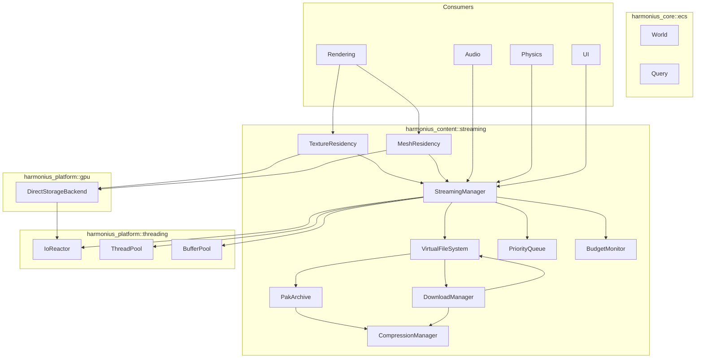
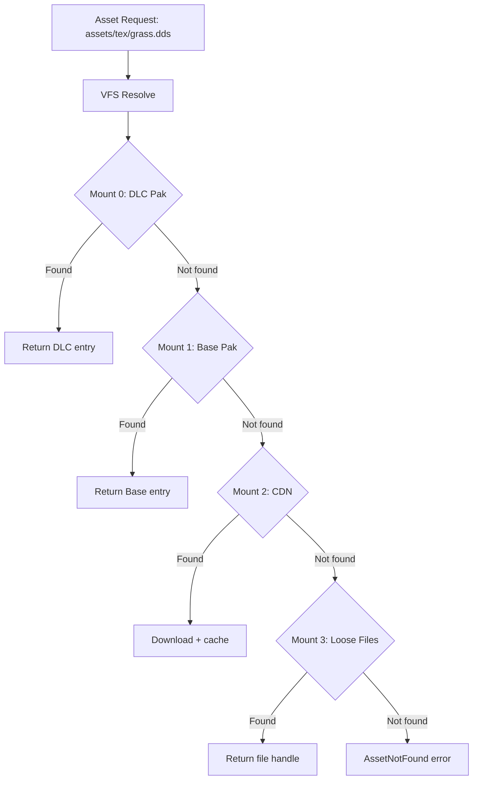
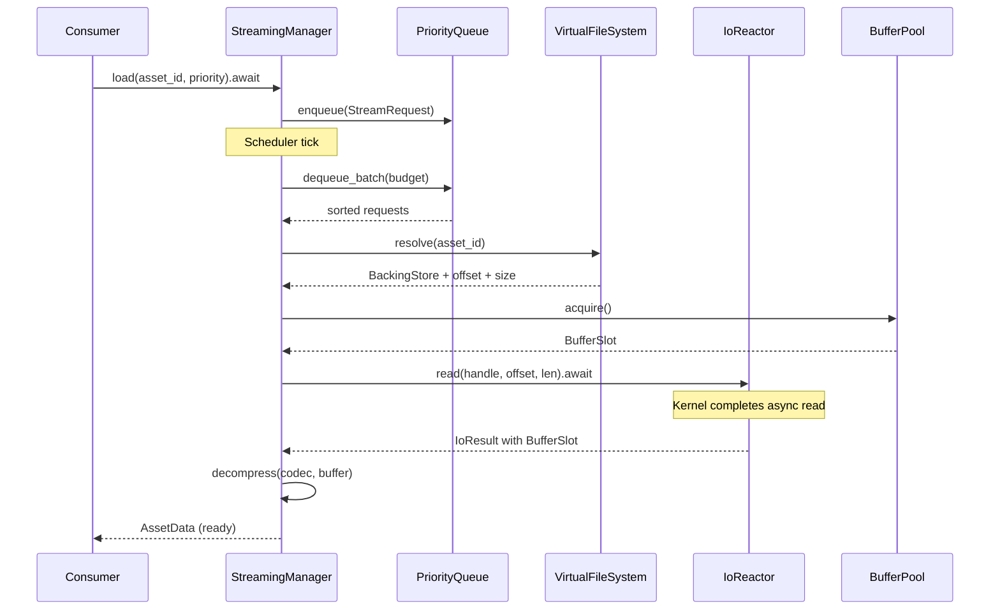
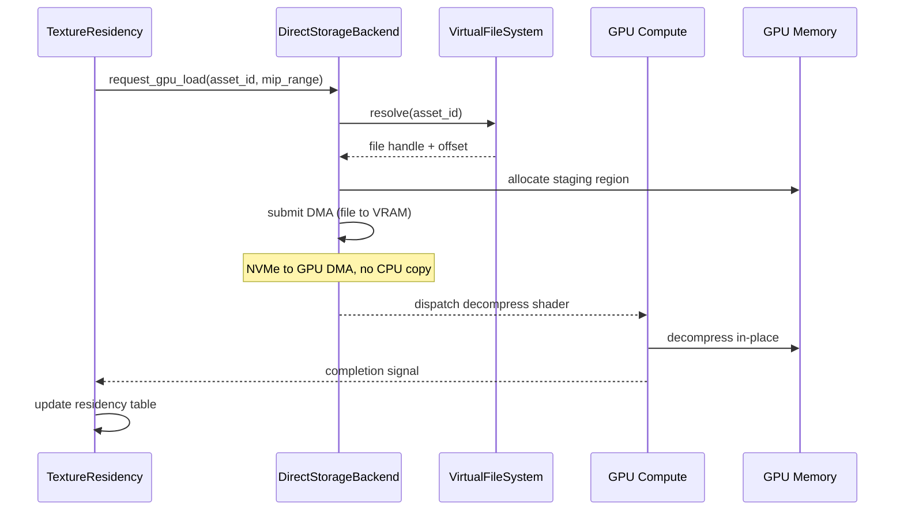
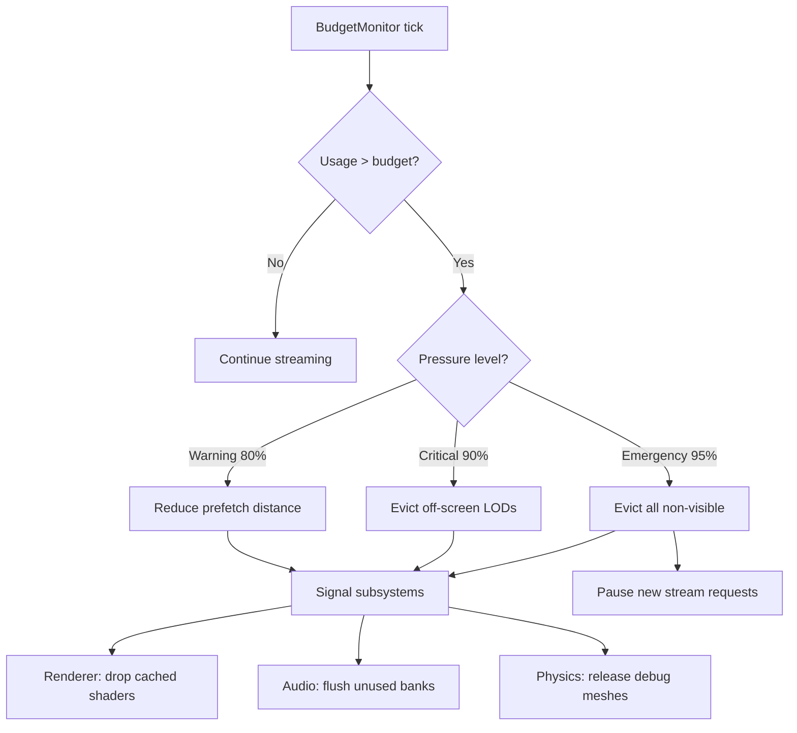
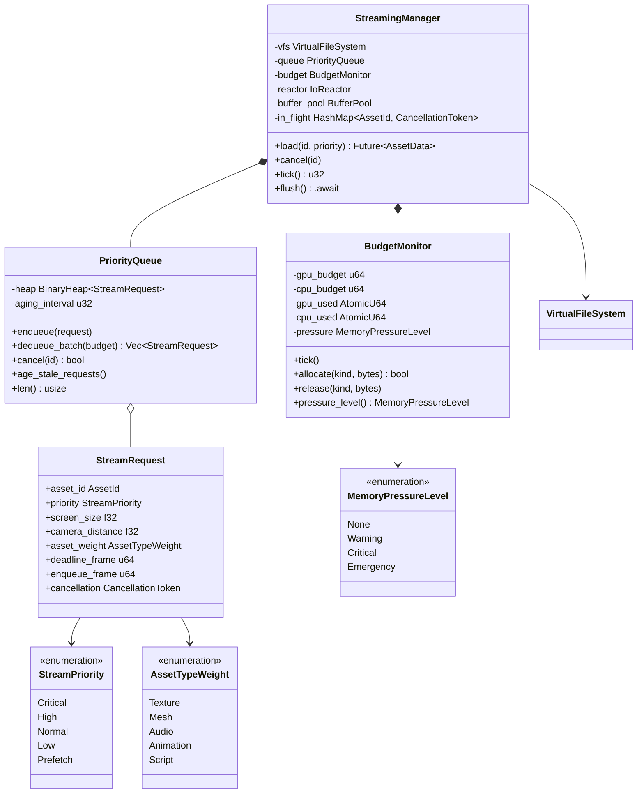
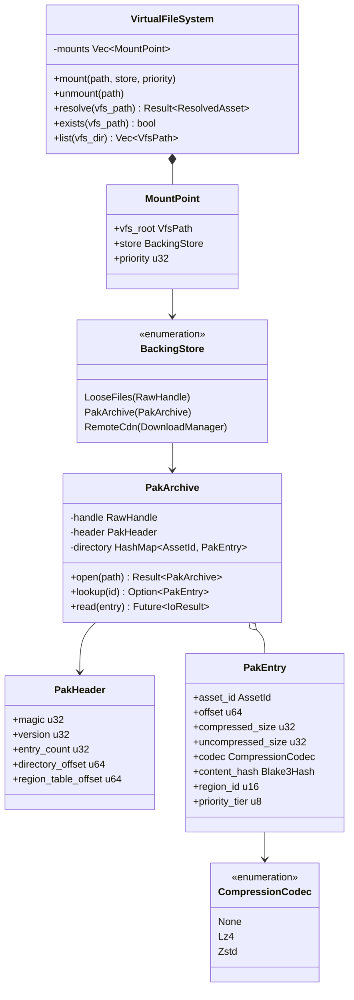
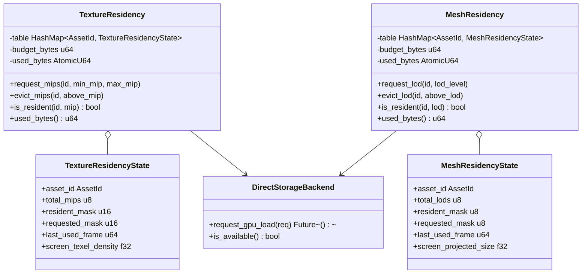

# Asset Streaming & I/O Design

## Requirements Trace

> **Canonical sources:** Features, requirements, and user
> stories are defined in [features/content-pipeline/](../../features/content-pipeline/),
> [requirements/content-pipeline/](../../requirements/content-pipeline/), and
> [user-stories/content-pipeline/](../../user-stories/content-pipeline/). The table
> below traces design elements to those definitions.

| Feature | Requirement | User Stories | Description |
|---------|-------------|--------------|-------------|
| F-12.5.1 | R-12.5.1 | US-12.5.5, US-12.5.11, US-12.5.18 | Virtual file system with unified path namespace over loose files, pak archives, and remote HTTP stores |
| F-12.5.2 | R-12.5.2 | US-12.5.1, US-12.5.17 | Platform-native async I/O (IOCP/GCD/io_uring) with direct I/O bypass, no stdlib file I/O |
| F-12.5.3 | R-12.5.3 | US-12.5.6 | GPU direct storage via DirectStorage (Windows) and Metal IO (macOS) for file-to-GPU DMA |
| F-12.5.4 | R-12.5.4 | US-12.5.2, US-12.5.12, US-12.5.15 | Texture mip streaming with residency manager, sparse binding, and eviction under memory pressure |
| F-12.5.5 | R-12.5.5 | US-12.5.3, US-12.5.12, US-12.5.15 | Mesh LOD streaming with dithered cross-fade transitions and screen-space projected size scheduling |
| F-12.5.6 | R-12.5.6 | US-12.5.7 | Priority queue ordered by screen-space size, camera distance, asset type weight, and frame deadline |
| F-12.5.7 | R-12.5.7 | US-12.5.8, US-12.5.13, US-12.5.16 | Memory budget monitor with progressive eviction and subsystem release signals |
| F-12.5.8 | R-12.5.8 | US-12.5.9, US-12.5.11, US-12.5.18 | Seekable pak archives with O(1) lookup, spatial organization, and multi-archive mounting |
| F-12.5.9 | R-12.5.9 | US-12.5.10 | Per-chunk LZ4/Zstd compression with chunk boundaries aligned to streaming granularity |
| F-12.5.10 | R-12.5.10 | US-12.5.4, US-12.5.14, US-12.5.19 | Download-on-demand patching from CDN with BLAKE3 hash verification |

### Cross-Cutting Dependencies

| Dependency | Source | Consumed API |
|------------|--------|--------------|
| IoReactor | F-1.8.1, F-14.3.5 | `IoReactor::read`, `poll`, `read_batch` |
| BufferPool | F-1.8.9 | Registered page-aligned I/O buffers |
| ThreadPool | F-14.3.1 | `spawn`, `scope`, `execute_graph` |
| CancellationToken | F-1.8.8 | Cooperative I/O cancellation |
| I/O Priority | F-1.8.7 | `Critical` / `Normal` / `Background` |
| Scatter-Gather | F-1.8.6 | Vectored I/O for composite reads |
| Asset Database | F-12.1.1 | Asset ID, content hash (BLAKE3) |
| Reflection | F-1.3.1 | `Reflect` derive for config serialization |
| Shared Spatial Index | F-1.9.1 | Camera distance queries for priority |
| ECS | F-1.1.20 | Parallel system queries, change detection |

## Overview

The streaming subsystem is responsible for loading
all engine assets from storage into CPU and GPU
memory without blocking the game loop. It provides
four layers:

1. **Virtual File System (VFS).** A unified path
   namespace that abstracts over loose files, pak
   archives, and remote CDN stores. All engine
   subsystems access assets exclusively through
   the VFS.
2. **Streaming Manager.** An async orchestrator
   that accepts load requests, prioritizes them,
   dispatches I/O through the `IoReactor`, and
   delivers completed assets to consumers.
3. **LOD Residency.** Texture and mesh residency
   managers that track which mip levels and LOD
   groups are resident, request streaming of
   missing data, and evict under memory pressure.
4. **Archive and Compression.** Seekable pak files
   organized by streaming region with per-chunk
   LZ4/Zstd compression for shipping builds.

### Design Principles

- **All I/O is async.** Every file read flows
  through `IoReactor`. No stdlib `std::fs` or
  `std::io::Read` anywhere in the path.
- **Priority drives everything.** Frame-critical
  assets load before background prefetch. Stale
  requests age to prevent starvation.
- **Budget-aware.** Memory pressure triggers
  progressive eviction, not crashes.
- **GPU-direct where supported.** DirectStorage
  and Metal IO bypass CPU for bulk texture and
  mesh transfers.

### Performance Targets

| Metric | Target | Source |
|--------|--------|--------|
| Async I/O throughput | >= 80% raw disk bandwidth | US-12.5.17 |
| GPU direct storage throughput | >= 3 GB/s on NVMe | R-12.5.3 |
| CPU utilization during GPU DMA | < 5% | R-12.5.3 |
| Texture mip stream-in latency | < 500 ms | R-12.5.4 |
| LZ4 decompression (64 KB chunk) | < 1 ms | R-12.5.9 |
| Zstd compression ratio (textures) | >= 3:1 | R-12.5.9 |
| Memory budget overshoot | < 10% | R-12.5.7 |
| Archive lookup | O(1) by asset ID | R-12.5.8 |
| Sequential read throughput (archive) | >= 90% raw disk | R-12.5.8 |
| Request coalescing savings | >= 20% fewer I/O ops | R-12.5.6 |

## Architecture

### Module Boundaries



### File Layout

```
harmonius_content/
├── streaming/
│   ├── vfs.rs            # VirtualFileSystem,
│   │                     # MountPoint, VfsPath
│   ├── manager.rs        # StreamingManager,
│   │                     # StreamRequest
│   ├── priority.rs       # PriorityQueue,
│   │                     # StreamPriority
│   ├── texture.rs        # TextureResidency,
│   │                     # MipRequest
│   ├── mesh.rs           # MeshResidency,
│   │                     # LodRequest
│   ├── budget.rs         # BudgetMonitor,
│   │                     # MemoryPressureLevel
│   ├── archive.rs        # PakArchive,
│   │                     # PakHeader, PakEntry
│   ├── compression.rs    # CompressionManager,
│   │                     # Codec selection
│   ├── download.rs       # DownloadManager,
│   │                     # CdnManifest
│   └── direct_storage.rs # DirectStorageBackend,
│                         # GpuTransferRequest
└── platform/
    ├── windows/
    │   └── direct_storage.rs  # DirectStorage API
    ├── macos/
    │   └── metal_io.rs        # Metal IO command
    │                          # queue
    └── linux/
        └── staging.rs         # io_uring + CPU
                               # staging fallback
```

### VFS Mount Resolution



Mounts are searched in priority order (highest
first). DLC and expansion packs override base
content by mounting at higher priority. The first
mount containing the requested path wins.

### Asset Load Sequence



### GPU Direct Storage Flow



### Memory Pressure Response Flow



### Streaming Priority Queue Class Diagram



### VFS and Archive Class Diagram



### LOD Residency Class Diagram



## API Design

### Virtual File System

```rust
/// A platform-agnostic virtual path within the
/// VFS namespace. Always uses forward slashes.
/// Example: "assets/textures/grass_diffuse.dds"
#[derive(
    Clone, Debug, PartialEq, Eq, Hash,
)]
pub struct VfsPath(SmallString<128>);

impl VfsPath {
    pub fn new(path: &str) -> Self;
    pub fn join(&self, segment: &str) -> Self;
    pub fn parent(&self) -> Option<VfsPath>;
    pub fn extension(&self) -> Option<&str>;
    pub fn as_str(&self) -> &str;
}

/// Priority for mount ordering. Higher values
/// are searched first, enabling DLC/expansion
/// overrides.
pub type MountPriority = u32;

/// A resolved asset location within a backing
/// store. Contains everything needed to issue
/// a platform I/O read.
pub struct ResolvedAsset {
    /// Platform file handle for the backing store.
    pub handle: RawHandle,
    /// Byte offset within the file (0 for loose
    /// files, entry offset for pak archives).
    pub offset: u64,
    /// Size in bytes of the compressed data.
    pub compressed_size: u32,
    /// Size in bytes after decompression.
    pub uncompressed_size: u32,
    /// Compression codec used for this asset.
    pub codec: CompressionCodec,
    /// BLAKE3 content hash for integrity checks.
    pub content_hash: Blake3Hash,
}

/// The backing store behind a mount point.
pub enum BackingStore {
    /// Loose files on disk (development builds).
    LooseFiles {
        root_handle: RawHandle,
    },
    /// Packed archive (shipping builds).
    PakArchive(PakArchive),
    /// Remote CDN (download-on-demand).
    RemoteCdn(DownloadManager),
}

/// A mount point in the VFS. Maps a virtual path
/// prefix to a backing store at a given priority.
pub struct MountPoint {
    /// Virtual path prefix. Assets under this
    /// prefix are resolved against this store.
    pub vfs_root: VfsPath,
    /// The backing store implementation.
    pub store: BackingStore,
    /// Search priority. Higher = searched first.
    pub priority: MountPriority,
}

/// The virtual file system. All asset access in
/// the engine flows through this single entry
/// point.
pub struct VirtualFileSystem { /* ... */ }

impl VirtualFileSystem {
    pub fn new() -> Self;

    /// Mount a backing store at the given virtual
    /// path prefix. Multiple stores can be mounted
    /// at the same prefix; they are searched in
    /// descending priority order.
    pub fn mount(
        &mut self,
        vfs_root: VfsPath,
        store: BackingStore,
        priority: MountPriority,
    );

    /// Unmount a backing store. Assets served by
    /// this mount become unavailable.
    pub fn unmount(&mut self, vfs_root: &VfsPath);

    /// Resolve a virtual path to a backing store
    /// location. Searches mounts in descending
    /// priority order and returns the first match.
    pub fn resolve(
        &self,
        path: &VfsPath,
    ) -> Result<ResolvedAsset, VfsError>;

    /// Check whether a virtual path exists in any
    /// mounted store.
    pub fn exists(&self, path: &VfsPath) -> bool;

    /// List all entries under a virtual directory
    /// prefix across all mounts. Deduplicated by
    /// path (highest-priority mount wins).
    pub fn list(
        &self,
        dir: &VfsPath,
    ) -> Vec<VfsPath>;
}
```

### Streaming Manager

```rust
/// Globally unique asset identifier. Maps 1:1
/// with asset database entries.
#[derive(
    Clone, Copy, Debug, PartialEq, Eq, Hash,
)]
pub struct AssetId(pub u64);

/// Priority levels for stream requests. The
/// priority queue uses this as the primary sort
/// key.
#[derive(
    Clone, Copy, Debug, PartialEq, Eq,
    PartialOrd, Ord,
)]
pub enum StreamPriority {
    /// Frame-critical: blocking the render
    /// pipeline (e.g., mandatory shader, UI atlas).
    Critical = 4,
    /// Visible on screen this frame.
    High = 3,
    /// Visible within the next few frames.
    Normal = 2,
    /// Off-screen but nearby.
    Low = 1,
    /// Speculative prefetch for predicted
    /// movement.
    Prefetch = 0,
}

/// Relative weight per asset type for priority
/// tie-breaking. Textures and meshes are weighted
/// higher because they cause the most visible
/// pop-in.
#[derive(
    Clone, Copy, Debug, PartialEq, Eq,
    PartialOrd, Ord,
)]
pub enum AssetTypeWeight {
    Texture = 4,
    Mesh = 3,
    Audio = 2,
    Animation = 1,
    Script = 0,
}

/// A pending stream request in the priority
/// queue. Implements `Ord` for heap ordering.
pub struct StreamRequest {
    /// The asset to load.
    pub asset_id: AssetId,
    /// Explicit priority level.
    pub priority: StreamPriority,
    /// Screen-space size in pixels (0.0 for
    /// non-visual assets).
    pub screen_size: f32,
    /// Distance from camera in world units.
    pub camera_distance: f32,
    /// Asset type weight for tie-breaking.
    pub asset_weight: AssetTypeWeight,
    /// Frame number by which this asset is
    /// needed. Requests past deadline escalate.
    pub deadline_frame: u64,
    /// Frame number when the request was
    /// enqueued. Used for aging stale requests.
    pub enqueue_frame: u64,
    /// Token for cooperative cancellation.
    pub cancellation: CancellationToken,
}

/// Configuration for the streaming manager.
pub struct StreamingConfig {
    /// Maximum concurrent I/O operations.
    pub max_in_flight: u32,
    /// Maximum bytes to read per tick.
    pub bandwidth_budget_per_tick: u64,
    /// Number of frames before a stale request
    /// is promoted one priority level.
    pub aging_interval_frames: u32,
    /// GPU memory budget in bytes.
    pub gpu_budget_bytes: u64,
    /// CPU memory budget for staging in bytes.
    pub cpu_budget_bytes: u64,
}

/// Loaded asset data returned to consumers.
pub struct AssetData {
    /// The raw decompressed bytes.
    pub bytes: BufferSlot,
    /// Byte length of the decompressed data.
    pub size: u32,
    /// The asset's content hash for validation.
    pub content_hash: Blake3Hash,
}

/// Handle to a pending or completed load. Can
/// be polled or awaited.
pub struct StreamHandle { /* ... */ }

impl StreamHandle {
    /// Check whether the load has completed.
    pub fn is_ready(&self) -> bool;

    /// Await completion. Returns the loaded data
    /// or an error.
    pub async fn get(
        self,
    ) -> Result<AssetData, StreamError>;
}

/// The streaming manager. Orchestrates all
/// asset I/O from request to delivery.
pub struct StreamingManager { /* ... */ }

impl StreamingManager {
    pub fn new(
        config: StreamingConfig,
        vfs: VirtualFileSystem,
        reactor: IoReactor,
        buffer_pool: BufferPool,
    ) -> Self;

    /// Submit a load request. Returns a handle
    /// that can be awaited for the result.
    pub fn load(
        &self,
        asset_id: AssetId,
        priority: StreamPriority,
        screen_size: f32,
        camera_distance: f32,
        asset_weight: AssetTypeWeight,
        deadline_frame: u64,
    ) -> StreamHandle;

    /// Cancel a pending load. If already in-flight,
    /// the I/O operation is cancelled
    /// cooperatively.
    pub fn cancel(&self, asset_id: AssetId);

    /// Tick the scheduler. Dequeues requests up to
    /// the bandwidth budget, submits I/O, ages
    /// stale requests. Called once per frame by
    /// the streaming ECS system. Returns the
    /// number of requests dispatched.
    pub async fn tick(
        &self,
        current_frame: u64,
    ) -> u32;

    /// Flush all pending requests. Blocks until
    /// every enqueued request completes or is
    /// cancelled. Used during level transitions.
    pub async fn flush(&self);

    /// Number of requests currently in-flight.
    pub fn in_flight_count(&self) -> u32;

    /// Number of requests waiting in the queue.
    pub fn queued_count(&self) -> usize;
}
```

### Priority Queue

```rust
/// The priority queue that orders all pending
/// stream requests. Uses a binary max-heap
/// with a composite sort key.
pub struct PriorityQueue { /* ... */ }

impl PriorityQueue {
    pub fn new() -> Self;

    /// Insert a stream request.
    pub fn enqueue(&mut self, request: StreamRequest);

    /// Dequeue up to `budget` bytes of requests,
    /// sorted by composite priority. Returns
    /// requests in descending priority order.
    pub fn dequeue_batch(
        &mut self,
        bandwidth_budget: u64,
    ) -> Vec<StreamRequest>;

    /// Cancel a request by asset ID. Returns
    /// true if the request was found and removed.
    pub fn cancel(&mut self, id: AssetId) -> bool;

    /// Promote stale requests that have waited
    /// longer than the aging interval. Prevents
    /// priority inversion.
    pub fn age_stale_requests(
        &mut self,
        current_frame: u64,
        aging_interval: u32,
    );

    /// Coalesce adjacent requests to the same
    /// archive region into single sequential
    /// reads. Reduces I/O operation count.
    pub fn coalesce_adjacent(
        &mut self,
        max_gap_bytes: u64,
    );

    pub fn len(&self) -> usize;
    pub fn is_empty(&self) -> bool;
}
```

The composite priority key orders requests by:

1. `StreamPriority` (descending)
2. Deadline proximity (ascending frame delta)
3. Screen-space size (descending)
4. Camera distance (ascending)
5. Asset type weight (descending)

### Pak Archive

```rust
/// Four-byte magic number: "HPAK"
pub const PAK_MAGIC: u32 = 0x4B415048;

/// Current archive format version.
pub const PAK_VERSION: u32 = 1;

/// Archive file header. Stored at byte offset 0.
#[derive(Clone, Debug)]
pub struct PakHeader {
    /// Magic number for format identification.
    pub magic: u32,
    /// Format version for forward compatibility.
    pub version: u32,
    /// Number of entries in the directory.
    pub entry_count: u32,
    /// Byte offset of the central directory.
    pub directory_offset: u64,
    /// Byte offset of the region table.
    pub region_table_offset: u64,
    /// BLAKE3 hash of the directory for
    /// integrity checking on load.
    pub directory_hash: Blake3Hash,
}

/// A single asset entry in the archive directory.
/// Packed tightly for O(1) lookup via hash map.
#[derive(Clone, Debug)]
pub struct PakEntry {
    /// Unique asset identifier.
    pub asset_id: AssetId,
    /// Byte offset of the compressed data
    /// within the archive file.
    pub offset: u64,
    /// Size of the compressed chunk in bytes.
    pub compressed_size: u32,
    /// Size after decompression.
    pub uncompressed_size: u32,
    /// Compression codec for this entry.
    pub codec: CompressionCodec,
    /// BLAKE3 hash of the uncompressed data.
    pub content_hash: Blake3Hash,
    /// Streaming region this entry belongs to
    /// (spatial locality grouping).
    pub region_id: u16,
    /// Priority tier within the region (0 =
    /// highest, used for coarse LODs that must
    /// always be resident).
    pub priority_tier: u8,
}

/// Compression codec selection.
#[derive(
    Clone, Copy, Debug, PartialEq, Eq,
)]
pub enum CompressionCodec {
    /// No compression. Used for pre-compressed
    /// formats (e.g., BCn textures).
    None,
    /// LZ4: fast decompression for latency-
    /// sensitive assets (audio, UI).
    Lz4,
    /// Zstd: high ratio for throughput-sensitive
    /// assets (textures, meshes).
    Zstd,
}

/// A streaming region within the archive.
/// Entries in the same region are stored
/// contiguously for sequential read performance.
#[derive(Clone, Debug)]
pub struct PakRegion {
    /// Unique region identifier.
    pub region_id: u16,
    /// Byte offset of the first entry in this
    /// region.
    pub offset: u64,
    /// Total byte size of all entries in the
    /// region.
    pub total_size: u64,
    /// Number of entries in this region.
    pub entry_count: u32,
}

/// A seekable archive file. Loads the central
/// directory into memory on open for O(1)
/// lookups. All data reads are async through
/// the IoReactor.
pub struct PakArchive { /* ... */ }

impl PakArchive {
    /// Open an archive file. Reads and validates
    /// the header and central directory.
    pub async fn open(
        path: &VfsPath,
        reactor: &IoReactor,
    ) -> Result<Self, PakError>;

    /// Look up an asset entry by ID. O(1) via
    /// the in-memory hash map.
    pub fn lookup(
        &self,
        id: AssetId,
    ) -> Option<&PakEntry>;

    /// Async read of an entry's compressed data.
    pub async fn read_entry(
        &self,
        entry: &PakEntry,
        reactor: &IoReactor,
        buffer_pool: &BufferPool,
    ) -> Result<BufferSlot, PakError>;

    /// List all entries in a streaming region.
    pub fn entries_in_region(
        &self,
        region_id: u16,
    ) -> &[PakEntry];

    /// Number of entries in the archive.
    pub fn entry_count(&self) -> u32;

    /// Number of streaming regions.
    pub fn region_count(&self) -> u16;
}
```

### Compression Manager

```rust
/// Manages compression and decompression with
/// codec selection per asset type.
pub struct CompressionManager { /* ... */ }

impl CompressionManager {
    pub fn new() -> Self;

    /// Decompress a buffer using the specified
    /// codec. Returns the decompressed data in
    /// a new BufferSlot.
    pub fn decompress(
        &self,
        codec: CompressionCodec,
        input: &[u8],
        output: &mut BufferSlot,
    ) -> Result<u32, CompressionError>;

    /// Compress a buffer using the specified
    /// codec. Used during pak archive creation.
    pub fn compress(
        &self,
        codec: CompressionCodec,
        input: &[u8],
        output: &mut Vec<u8>,
    ) -> Result<u32, CompressionError>;

    /// Select the optimal codec for an asset
    /// type.
    pub fn select_codec(
        asset_weight: AssetTypeWeight,
    ) -> CompressionCodec {
        match asset_weight {
            AssetTypeWeight::Audio
            | AssetTypeWeight::Script => {
                CompressionCodec::Lz4
            }
            AssetTypeWeight::Texture
            | AssetTypeWeight::Mesh
            | AssetTypeWeight::Animation => {
                CompressionCodec::Zstd
            }
        }
    }
}
```

### Texture Residency

```rust
/// Tracks which mip levels of each texture are
/// currently resident in GPU memory.
pub struct TextureResidency { /* ... */ }

/// Per-texture residency state.
pub struct TextureResidencyState {
    /// Asset identifier.
    pub asset_id: AssetId,
    /// Total mip levels in the full texture.
    pub total_mips: u8,
    /// Bitmask of currently resident mip levels.
    /// Bit 0 = finest mip, bit N = coarsest.
    pub resident_mask: u16,
    /// Bitmask of mips currently being streamed.
    pub requested_mask: u16,
    /// Last frame this texture was sampled.
    pub last_used_frame: u64,
    /// Current screen-space texel density for
    /// priority calculation.
    pub screen_texel_density: f32,
}

impl TextureResidency {
    pub fn new(budget_bytes: u64) -> Self;

    /// Request mip levels in the range
    /// [min_mip, max_mip] to be streamed in.
    /// Non-resident mips are enqueued in the
    /// streaming manager.
    pub fn request_mips(
        &mut self,
        id: AssetId,
        min_mip: u8,
        max_mip: u8,
        manager: &StreamingManager,
    );

    /// Evict mip levels finer than `above_mip`
    /// to reclaim GPU memory.
    pub fn evict_mips(
        &mut self,
        id: AssetId,
        above_mip: u8,
    );

    /// Mark mip levels as resident after a
    /// successful load or GPU DMA transfer.
    pub fn mark_resident(
        &mut self,
        id: AssetId,
        mip: u8,
        byte_size: u64,
    );

    /// Check whether a specific mip level is
    /// resident.
    pub fn is_resident(
        &self,
        id: AssetId,
        mip: u8,
    ) -> bool;

    /// Update texel density for a texture based
    /// on the current camera. Called by the
    /// rendering system each frame.
    pub fn update_density(
        &mut self,
        id: AssetId,
        density: f32,
        frame: u64,
    );

    /// Evict least-recently-used mips until
    /// usage is within budget. Returns bytes
    /// freed.
    pub fn evict_to_budget(&mut self) -> u64;

    pub fn used_bytes(&self) -> u64;
    pub fn budget_bytes(&self) -> u64;
}
```

### Mesh Residency

```rust
/// Tracks which LOD levels of each mesh are
/// currently resident in GPU memory.
pub struct MeshResidency { /* ... */ }

/// Per-mesh residency state.
pub struct MeshResidencyState {
    /// Asset identifier.
    pub asset_id: AssetId,
    /// Total LOD levels (0 = highest detail).
    pub total_lods: u8,
    /// Bitmask of currently resident LOD levels.
    pub resident_mask: u8,
    /// Bitmask of LODs currently being streamed.
    pub requested_mask: u8,
    /// Last frame this mesh was rendered.
    pub last_used_frame: u64,
    /// Current screen-space projected size in
    /// pixels for priority calculation.
    pub screen_projected_size: f32,
}

impl MeshResidency {
    pub fn new(budget_bytes: u64) -> Self;

    /// Request a LOD level to be streamed in.
    /// Coarse LODs (highest number) are always
    /// resident; fine LODs stream on demand.
    pub fn request_lod(
        &mut self,
        id: AssetId,
        lod_level: u8,
        manager: &StreamingManager,
    );

    /// Evict LOD levels finer than `above_lod`
    /// to reclaim GPU memory.
    pub fn evict_lod(
        &mut self,
        id: AssetId,
        above_lod: u8,
    );

    /// Mark a LOD level as resident after a
    /// successful load.
    pub fn mark_resident(
        &mut self,
        id: AssetId,
        lod: u8,
        byte_size: u64,
    );

    /// Check whether a specific LOD level is
    /// resident.
    pub fn is_resident(
        &self,
        id: AssetId,
        lod: u8,
    ) -> bool;

    /// Update projected size for a mesh based
    /// on the current camera.
    pub fn update_projected_size(
        &mut self,
        id: AssetId,
        size: f32,
        frame: u64,
    );

    /// Evict least-recently-used LODs until
    /// usage is within budget. Returns bytes
    /// freed.
    pub fn evict_to_budget(&mut self) -> u64;

    pub fn used_bytes(&self) -> u64;
    pub fn budget_bytes(&self) -> u64;
}
```

### Budget Monitor

```rust
/// Memory pressure levels that drive eviction
/// policy.
#[derive(
    Clone, Copy, Debug, PartialEq, Eq,
    PartialOrd, Ord,
)]
pub enum MemoryPressureLevel {
    /// Below 80% budget. Normal streaming.
    None = 0,
    /// 80-90% budget. Reduce prefetch distance,
    /// lower concurrent stream limit.
    Warning = 1,
    /// 90-95% budget. Evict off-screen LODs and
    /// distant mips aggressively.
    Critical = 2,
    /// Above 95% budget. Evict all non-visible
    /// assets, halt new stream requests.
    Emergency = 3,
}

/// Configuration for the budget monitor.
pub struct BudgetConfig {
    /// GPU memory budget in bytes.
    pub gpu_budget: u64,
    /// CPU staging memory budget in bytes.
    pub cpu_budget: u64,
    /// Threshold percentages for each pressure
    /// level: [warning, critical, emergency].
    pub thresholds: [f32; 3],
}

/// Monitors GPU and CPU memory usage against
/// configurable budgets and signals pressure
/// levels.
pub struct BudgetMonitor { /* ... */ }

impl BudgetMonitor {
    pub fn new(config: BudgetConfig) -> Self;

    /// Tick the monitor. Recalculates pressure
    /// level and fires subsystem release signals
    /// when thresholds are crossed. Called once
    /// per frame.
    pub fn tick(&self);

    /// Try to allocate bytes against a budget.
    /// Returns false if the allocation would
    /// exceed the emergency threshold.
    pub fn allocate(
        &self,
        kind: MemoryKind,
        bytes: u64,
    ) -> bool;

    /// Release bytes back to the budget.
    pub fn release(
        &self,
        kind: MemoryKind,
        bytes: u64,
    );

    /// Current pressure level.
    pub fn pressure_level(
        &self,
    ) -> MemoryPressureLevel;

    /// Current GPU memory usage in bytes.
    pub fn gpu_used(&self) -> u64;

    /// Current CPU staging memory usage.
    pub fn cpu_used(&self) -> u64;
}

/// Distinguishes GPU and CPU memory budgets.
#[derive(
    Clone, Copy, Debug, PartialEq, Eq,
)]
pub enum MemoryKind {
    Gpu,
    CpuStaging,
}
```

### GPU Direct Storage Backend

```rust
/// Abstraction over platform GPU direct storage
/// APIs. Backend selection is compile-time via
/// cfg attributes.
pub struct DirectStorageBackend { /* ... */ }

/// A request to transfer compressed data from
/// storage directly into GPU memory.
pub struct GpuTransferRequest {
    /// Source file handle and offset.
    pub handle: RawHandle,
    pub offset: u64,
    pub compressed_size: u32,
    /// GPU destination buffer and offset.
    pub gpu_buffer: GpuBufferHandle,
    pub gpu_offset: u64,
    /// Compression codec for the GPU
    /// decompression shader.
    pub codec: CompressionCodec,
}

impl DirectStorageBackend {
    pub fn new() -> Result<Self, DirectStorageError>;

    /// Submit a file-to-GPU DMA transfer.
    /// On Windows, uses DirectStorage API.
    /// On macOS, uses Metal IO command queue.
    /// On Linux, falls back to io_uring read
    /// into a CPU staging buffer followed by a
    /// GPU upload.
    pub async fn submit(
        &self,
        request: GpuTransferRequest,
    ) -> Result<(), DirectStorageError>;

    /// Submit a batch of transfers.
    pub async fn submit_batch(
        &self,
        requests: &[GpuTransferRequest],
    ) -> Vec<Result<(), DirectStorageError>>;

    /// Check whether GPU direct storage is
    /// available on this platform and hardware.
    pub fn is_available(&self) -> bool;
}
```

### Download Manager

```rust
/// Manifest mapping asset IDs to CDN locations.
/// Downloaded on startup and cached locally.
pub struct CdnManifest {
    /// Base URL for the CDN.
    pub base_url: String,
    /// Entries indexed by asset ID.
    pub entries: HashMap<AssetId, CdnEntry>,
    /// Manifest version for cache invalidation.
    pub version: u64,
}

/// A single asset's CDN location.
pub struct CdnEntry {
    /// Relative URL path appended to base_url.
    pub url_path: String,
    /// BLAKE3 hash for download verification.
    pub content_hash: Blake3Hash,
    /// Compressed size in bytes.
    pub size: u64,
}

/// Manages download-on-demand from a remote CDN.
pub struct DownloadManager { /* ... */ }

impl DownloadManager {
    pub fn new(
        manifest: CdnManifest,
        vfs: &VirtualFileSystem,
    ) -> Self;

    /// Download an asset from the CDN. Verifies
    /// the content hash after download. On
    /// success, writes the asset into the local
    /// cache archive for future access.
    pub async fn download(
        &self,
        id: AssetId,
    ) -> Result<AssetData, DownloadError>;

    /// Check whether an asset is available on
    /// the CDN.
    pub fn is_available(
        &self,
        id: AssetId,
    ) -> bool;

    /// Pause all downloads (e.g., on metered
    /// mobile connections).
    pub fn pause(&self);

    /// Resume downloads.
    pub fn resume(&self);

    /// Whether downloads are currently paused.
    pub fn is_paused(&self) -> bool;
}
```

### Error Types

```rust
pub enum VfsError {
    /// No mount contains the requested path.
    NotFound { path: VfsPath },
    /// The mount was unmounted during access.
    MountRemoved { path: VfsPath },
}

pub enum StreamError {
    /// The requested asset was not found in
    /// any backing store.
    NotFound { id: AssetId },
    /// The load was cancelled via its token.
    Cancelled { id: AssetId },
    /// An I/O error from the platform backend.
    Io(IoError),
    /// Decompression failed.
    Decompression(CompressionError),
    /// Content hash mismatch after load.
    IntegrityError {
        id: AssetId,
        expected: Blake3Hash,
        actual: Blake3Hash,
    },
    /// Memory budget exhausted; cannot allocate.
    BudgetExhausted { kind: MemoryKind },
}

pub enum PakError {
    /// File does not begin with PAK_MAGIC.
    InvalidMagic { found: u32 },
    /// Unsupported archive version.
    UnsupportedVersion { found: u32 },
    /// Directory hash mismatch (corrupt archive).
    DirectoryCorrupted,
    /// I/O error reading the archive.
    Io(IoError),
}

pub enum CompressionError {
    /// Input data is too short or malformed.
    InvalidInput,
    /// Output buffer is too small.
    OutputTooSmall {
        needed: u32,
        available: u32,
    },
    /// Codec-specific decompression failure.
    DecompressFailed { codec: CompressionCodec },
}

pub enum DirectStorageError {
    /// GPU direct storage is not supported.
    NotSupported,
    /// The GPU device was lost during transfer.
    DeviceLost,
    /// The source file could not be read.
    Io(IoError),
}

pub enum DownloadError {
    /// The asset is not in the CDN manifest.
    NotInManifest { id: AssetId },
    /// Network request failed.
    NetworkError { status: u16 },
    /// Downloaded data failed hash verification.
    IntegrityError {
        id: AssetId,
        expected: Blake3Hash,
        actual: Blake3Hash,
    },
    /// Downloads are paused (metered connection).
    Paused,
}
```

## Data Flow

### Frame Lifecycle Integration

The streaming manager runs as an ECS system in
the `PreUpdate` phase. Each frame:

1. **Budget tick.** `BudgetMonitor::tick()` reads
   GPU/CPU memory counters and updates the
   pressure level.
2. **Residency update.** The rendering system
   writes `screen_texel_density` and
   `screen_projected_size` into residency tables
   based on the current camera.
3. **Request generation.** `TextureResidency` and
   `MeshResidency` enqueue `StreamRequest`s for
   non-resident mips/LODs into the priority queue.
4. **Scheduler tick.** `StreamingManager::tick()`
   ages stale requests, coalesces adjacent reads,
   dequeues a batch within the bandwidth budget,
   and submits I/O to the `IoReactor`.
5. **I/O completion.** At the frame's reactor poll
   point, completed reads wake their futures.
   Decompression runs on worker threads. Loaded
   data is handed to residency managers.
6. **Eviction.** If pressure is `Warning` or
   higher, residency managers evict
   least-recently-used entries until within
   budget.

```rust
// ECS system: streaming_tick_system
// Phase: PreUpdate
pub async fn streaming_tick_system(
    manager: &StreamingManager,
    budget: &BudgetMonitor,
    tex_residency: &mut TextureResidency,
    mesh_residency: &mut MeshResidency,
    frame: u64,
) {
    // 1. Update pressure level
    budget.tick();

    // 2. Scheduler processes the queue
    manager.tick(frame).await;

    // 3. Evict under pressure
    let pressure = budget.pressure_level();
    if pressure >= MemoryPressureLevel::Warning {
        tex_residency.evict_to_budget();
        mesh_residency.evict_to_budget();
    }
}
```

### Pak Archive Read Path

```rust
// Reading an asset from a pak archive
async fn read_from_pak(
    archive: &PakArchive,
    id: AssetId,
    reactor: &IoReactor,
    pool: &BufferPool,
    compressor: &CompressionManager,
) -> Result<AssetData, StreamError> {
    // 1. O(1) lookup in the directory
    let entry = archive.lookup(id)
        .ok_or(StreamError::NotFound { id })?;

    // 2. Acquire a buffer from the pool
    let mut buf = pool.acquire()
        .ok_or(StreamError::BudgetExhausted {
            kind: MemoryKind::CpuStaging,
        })?;

    // 3. Async read through IoReactor
    let result = reactor.read(
        archive.handle(),
        entry.offset,
        entry.compressed_size,
    ).await
        .map_err(StreamError::Io)?;

    // 4. Decompress
    let mut output = pool.acquire()
        .ok_or(StreamError::BudgetExhausted {
            kind: MemoryKind::CpuStaging,
        })?;

    let size = compressor.decompress(
        entry.codec,
        result.buffer.as_slice(),
        &mut output,
    ).map_err(StreamError::Decompression)?;

    // 5. Verify content hash
    let actual = blake3::hash(
        &output.as_slice()[..size as usize],
    );
    if actual != entry.content_hash {
        return Err(StreamError::IntegrityError {
            id,
            expected: entry.content_hash,
            actual,
        });
    }

    Ok(AssetData {
        bytes: output,
        size,
        content_hash: entry.content_hash,
    })
}
```

### Download-on-Demand Path

```rust
// VFS resolves to CDN when local stores miss
async fn download_and_cache(
    dl: &DownloadManager,
    id: AssetId,
    vfs: &VirtualFileSystem,
) -> Result<AssetData, DownloadError> {
    // 1. Download from CDN
    let data = dl.download(id).await?;

    // 2. Write to local cache archive
    //    (Next access will hit the pak store)

    Ok(data)
}
```

### Priority Computation

The composite priority score determines queue
ordering. Higher scores are dequeued first.

```rust
fn compute_priority_score(
    req: &StreamRequest,
    current_frame: u64,
) -> u64 {
    let priority_bits =
        (req.priority as u64) << 48;

    let deadline_urgency = req.deadline_frame
        .saturating_sub(current_frame)
        .min(0xFFFF);
    let deadline_bits =
        (0xFFFF - deadline_urgency) << 32;

    let screen_bits =
        (req.screen_size as u64) << 16;

    let distance_bits =
        (0xFFFF - (req.camera_distance
            .min(65535.0) as u64));

    let weight_bits =
        (req.asset_weight as u64) << 8;

    // Aging: stale requests get a bonus
    let age = current_frame
        .saturating_sub(req.enqueue_frame);
    let age_bonus = age.min(0xFF);

    priority_bits
        | deadline_bits
        | screen_bits
        | distance_bits
        | weight_bits
        | age_bonus
}
```

## Platform Considerations

### I/O Backend Selection

| Platform | Async I/O | GPU Direct Storage | Notes |
|----------|-----------|-------------------|-------|
| Windows | IOCP via `windows-sys` | DirectStorage 1.2+ | `IDStorageFactory`, `IDStorageQueue` |
| macOS | GCD Dispatch IO via cxx.rs | Metal IO Command Queue | `MTLIOCommandQueue`, `MTLIOCommandBuffer` |
| Linux | io_uring via `io-uring` crate | CPU staging fallback | `io_uring_prep_read` + GPU upload |
| iOS | GCD Dispatch IO via cxx.rs | Metal IO Command Queue | Same as macOS, tighter budgets |
| Android | io_uring (kernel 5.1+) | CPU staging fallback | Smaller chunk sizes, metered-aware |

### Direct I/O Alignment

All async reads use direct I/O (O_DIRECT /
FILE_FLAG_NO_BUFFERING) to bypass the OS page
cache. This requires:

| Constraint | Value |
|------------|-------|
| Buffer alignment | 4096 bytes (page-aligned) |
| Read offset alignment | 512 bytes (sector) |
| Read size alignment | 512 bytes (sector) |

The `BufferPool` pre-allocates page-aligned
buffers. Pak entry offsets and sizes are
padded to sector boundaries during archive
creation.

### Streaming Budget Tiers

| Tier | GPU Tex Budget | GPU Mesh Budget | CPU Staging | Max In-Flight | Concurrent Streams |
|------|---------------|-----------------|-------------|---------------|--------------------|
| Mobile | 256 MB | 128 MB | 32 MB | 32 | 4 |
| Desktop | 1 GB | 512 MB | 128 MB | 128 | 16 |
| High-end | 2 GB | 1 GB | 256 MB | 256 | 32 |

### Mobile-Specific Behavior

- **iOS `didReceiveMemoryWarning`:** Triggers
  `Emergency` pressure level immediately. Evicts
  all non-visible assets.
- **Android `onTrimMemory`:** Maps trim levels to
  `Warning`/`Critical`/`Emergency`.
- **Metered connections:** `DownloadManager`
  auto-pauses on cellular. User must explicitly
  enable cellular downloads.
- **Chunk sizes:** Mobile uses 64 KB chunks
  (vs 256 KB on desktop) for finer-grained
  download resumption.
- **Background downloads:** Uses platform
  background download APIs
  (`NSURLSessionDownloadTask` on iOS,
  `DownloadManager` on Android) for large
  transfers.

### Windows DirectStorage Integration

```rust
// Platform-specific: Windows DirectStorage
#[cfg(target_os = "windows")]
impl DirectStorageBackend {
    pub fn new() -> Result<Self, DirectStorageError> {
        // 1. Create IDStorageFactory
        // 2. Create IDStorageQueue with
        //    DSTORAGE_PRIORITY_NORMAL
        // 3. Open IDStorageFile for the archive
        todo!()
    }

    pub async fn submit(
        &self,
        req: GpuTransferRequest,
    ) -> Result<(), DirectStorageError> {
        // 1. Build DSTORAGE_REQUEST
        //    - Source: file region
        //    - Dest: GPU buffer
        //    - Compression: GDeflate / custom
        // 2. EnqueueRequest on the queue
        // 3. Submit + signal fence
        // 4. Await fence via IoReactor
        todo!()
    }
}
```

### macOS Metal IO Integration

```rust
// Platform-specific: macOS Metal IO
#[cfg(target_os = "macos")]
impl DirectStorageBackend {
    pub fn new() -> Result<Self, DirectStorageError> {
        // 1. Create MTLIOCommandQueue from
        //    the MTLDevice
        // 2. Configure compression codec
        todo!()
    }

    pub async fn submit(
        &self,
        req: GpuTransferRequest,
    ) -> Result<(), DirectStorageError> {
        // 1. Create MTLIOCommandBuffer
        // 2. loadBytes(from: fileHandle,
        //    offset:, size:, into: gpuBuffer)
        // 3. Commit command buffer
        // 4. Await completion via GCD dispatch
        //    block on controlled queue
        todo!()
    }
}
```

### Linux io_uring Staging Fallback

```rust
// Platform-specific: Linux CPU staging
#[cfg(target_os = "linux")]
impl DirectStorageBackend {
    pub fn new() -> Result<Self, DirectStorageError> {
        // io_uring is always available; GPU
        // direct path is not, so we stage
        // through CPU memory.
        Ok(Self { /* ... */ })
    }

    pub async fn submit(
        &self,
        req: GpuTransferRequest,
    ) -> Result<(), DirectStorageError> {
        // 1. io_uring async read into CPU
        //    staging buffer
        // 2. Decompress on CPU (thread pool)
        // 3. GPU buffer upload via Vulkan
        //    staging + transfer queue
        todo!()
    }
}
```

### Proposed Dependencies

| Crate | Purpose | Justification |
|-------|---------|---------------|
| `lz4_flex` | LZ4 compression/decompression | Pure Rust, no C dependency, SIMD-accelerated |
| `zstd` | Zstd compression/decompression | Wraps libzstd via C FFI; industry standard |
| `blake3` | Content hashing | SIMD-accelerated, consistent with asset database |
| `windows-sys` | DirectStorage API bindings | Zero-cost FFI, already a project dependency |
| `cxx` | Metal IO C++ wrappers | Already a project dependency for GCD |
| `io-uring` | Linux io_uring bindings | Already a project dependency for IoReactor |
| `smallvec` | Inline-allocated small vectors | Already a project dependency |

## Test Plan

### Unit Tests

| Test | Req | Description |
|------|-----|-------------|
| `test_vfs_mount_priority_order` | R-12.5.1 | Mount three stores at different priorities. Verify the highest-priority store is searched first. |
| `test_vfs_unmount_removes_paths` | R-12.5.1 | Mount a store, verify paths resolve, unmount, verify paths return `NotFound`. |
| `test_vfs_list_deduplicates` | R-12.5.1 | Mount two stores with overlapping entries. Verify `list()` returns each path once (highest priority wins). |
| `test_priority_queue_ordering` | R-12.5.6 | Enqueue 100 requests with varied priorities. Verify `dequeue_batch` returns them in descending composite score order. |
| `test_priority_queue_aging` | R-12.5.6 | Enqueue a `Prefetch` request, advance 100 frames, verify it promotes above newer `Prefetch` requests. |
| `test_priority_queue_coalesce` | R-12.5.6 | Enqueue 10 requests to adjacent archive offsets. Verify `coalesce_adjacent` merges them into fewer I/O operations. |
| `test_priority_queue_cancel` | R-12.5.6 | Enqueue a request, cancel it by ID, verify it is removed and `dequeue_batch` skips it. |
| `test_pak_header_roundtrip` | R-12.5.8 | Serialize and deserialize a `PakHeader`. Verify all fields match. |
| `test_pak_lookup_o1` | R-12.5.8 | Create a pak with 10,000 entries. Verify lookup by ID is constant-time (does not scale with entry count). |
| `test_pak_directory_integrity` | R-12.5.8 | Corrupt one byte of the directory. Verify `open()` returns `DirectoryCorrupted`. |
| `test_lz4_roundtrip` | R-12.5.9 | Compress and decompress 64 KB of random data via LZ4. Verify byte-for-byte match. |
| `test_zstd_roundtrip` | R-12.5.9 | Compress and decompress 1 MB of texture data via Zstd. Verify byte-for-byte match. |
| `test_codec_selection` | R-12.5.9 | Verify `select_codec` returns LZ4 for audio/script and Zstd for texture/mesh/animation. |
| `test_budget_pressure_levels` | R-12.5.7 | Allocate to 80%, verify `Warning`. Allocate to 90%, verify `Critical`. Allocate to 95%, verify `Emergency`. |
| `test_budget_allocation_denied` | R-12.5.7 | Fill to `Emergency`. Verify `allocate()` returns `false` for new requests. |
| `test_texture_residency_mask` | R-12.5.4 | Request mips 2-5. Mark mip 3 resident. Verify `is_resident(3)` returns true, `is_resident(2)` returns false. |
| `test_mesh_residency_evict` | R-12.5.5 | Mark LODs 0-3 resident. Evict above LOD 2. Verify LODs 0-1 are evicted, 2-3 remain. |
| `test_content_hash_mismatch` | R-12.5.10 | Load an asset with a tampered content hash. Verify `IntegrityError` is returned. |
| `test_download_manager_pause` | R-12.5.10 | Pause downloads. Verify `download()` returns `Paused`. Resume, verify download succeeds. |
| `test_stream_handle_cancel` | R-12.5.2 | Submit a load, cancel it. Verify the handle returns `Cancelled`. |

### Integration Tests

| Test | Req | Description |
|------|-----|-------------|
| `test_vfs_loose_pak_cdn_mount` | R-12.5.1 | Mount a loose-file dir, a pak archive, and a mock HTTP CDN. Read the same asset path from each. Verify identical content. |
| `test_async_read_100mb` | R-12.5.2 | Load a 100 MB asset via async I/O on each platform. Verify completion through IOCP/GCD/io_uring. Verify no `std::fs` calls via static analysis. |
| `test_gpu_direct_storage_256mb` | R-12.5.3 | Load a 256 MB compressed texture pack via GPU direct storage. Sample pixel values to verify correctness. Verify CPU < 5%. |
| `test_texture_stream_1000` | R-12.5.4 | Render 1,000 textures. Verify only mips matching screen-space density are resident. Move camera closer, verify higher mips arrive within 500 ms. |
| `test_mesh_stream_10000` | R-12.5.5 | Place 10,000 meshes. Verify distant meshes use coarse LODs. Approach camera, verify fine LODs stream in with dithered cross-fade. |
| `test_priority_high_before_low` | R-12.5.6 | Submit 100 low-priority and 10 high-priority requests. Verify all high-priority complete before 90% of low-priority. |
| `test_memory_pressure_512mb` | R-12.5.7 | Set budget to 512 MB. Stream until full. Verify eviction occurs, no crash, usage stays within 10%. |
| `test_pak_sequential_throughput` | R-12.5.8 | Read spatially adjacent assets. Verify throughput exceeds 90% of raw disk bandwidth. |
| `test_multi_archive_dlc` | R-12.5.8 | Mount base + DLC archives. Verify DLC overrides base for overlapping assets. Unmount DLC, verify base assets return. |
| `test_cdn_download_verify` | R-12.5.10 | Remove an asset from local archive. Access via VFS. Verify CDN download, hash verification, and local caching. |
| `test_cdn_corrupt_retry` | R-12.5.10 | Serve a corrupted download from mock CDN. Verify hash mismatch is detected and download retries. |
| `test_mobile_memory_warning` | R-12.5.7 | Simulate iOS `didReceiveMemoryWarning`. Verify immediate `Emergency` eviction of non-visible assets. |
| `test_mobile_metered_pause` | R-12.5.10 | Simulate cellular connection. Verify downloads auto-pause. Switch to WiFi, verify downloads resume. |

### Stress Tests

| Test | Req | Description |
|------|-----|-------------|
| `test_flythrough_no_popins` | US-12.5.15 | Fly camera through dense open world at max speed for 120 seconds. Verify zero missing textures, zero missing meshes, zero hard LOD pops. |
| `test_pressure_retains_visible` | US-12.5.16 | Force memory pressure while rendering. Verify eviction drops only off-screen assets; on-screen assets remain resident. |
| `test_budget_120s_stability` | R-12.5.7 | Stream assets continuously for 120 seconds. Verify memory usage stays within 10% of budget at all times. |

### Benchmarks

| Benchmark | Target | Source |
|-----------|--------|--------|
| Async I/O throughput (NVMe) | >= 80% raw bandwidth | US-12.5.17 |
| Async I/O throughput (HDD) | >= 80% raw bandwidth | US-12.5.17 |
| GPU direct storage throughput | >= 3 GB/s on NVMe | R-12.5.3 |
| CPU utilization during GPU DMA | < 5% | R-12.5.3 |
| LZ4 decompress (64 KB) | < 1 ms | R-12.5.9 |
| Zstd compression ratio (textures) | >= 3:1 | R-12.5.9 |
| Pak lookup (10K entries) | < 1 us | R-12.5.8 |
| Priority queue dequeue (1K requests) | < 100 us | R-12.5.6 |
| Request coalescing I/O reduction | >= 20% | R-12.5.6 |
| Texture mip stream-in latency | < 500 ms | R-12.5.4 |

## Open Questions

1. **Pak archive alignment granularity.** Entries
   must be sector-aligned for direct I/O (512 B).
   Should we align to 4 KB (page size) instead
   for memory-mapped I/O compatibility? Larger
   alignment wastes space in archives with many
   small assets.

2. **Memory-mapped I/O for read-only archives.**
   Memory mapping avoids explicit buffer
   management but bypasses direct I/O. Should
   the VFS support an optional mmap path for
   platforms where the page cache is beneficial
   (spinning HDDs with slow random I/O)?

3. **GPU decompression codec.** DirectStorage
   supports GDeflate natively. Zstd requires
   a custom compute shader. Should we ship a
   GPU Zstd decompressor, use GDeflate for GPU
   paths, or support both with per-asset codec
   selection?

4. **Download chunk size.** Smaller chunks enable
   finer-grained resumption but increase HTTP
   request overhead. Optimal chunk size depends
   on CDN latency and mobile network conditions.
   Current proposal: 256 KB desktop, 64 KB mobile.

5. **Prefetch prediction model.** The priority
   queue accepts speculative `Prefetch` requests
   based on camera velocity. Should prefetch use
   simple linear extrapolation, or integrate with
   the navigation mesh / world streaming regions
   for path-aware prediction?

6. **Archive patching strategy.** When DLC or
   patches add/replace assets, should we create
   overlay archives (mount at higher priority)
   or rebuild the base archive? Overlays are
   faster to deploy but accumulate fragmentation
   over many patches.

7. **io_uring fixed file registration.** Linux
   io_uring supports registering file descriptors
   for reduced per-operation overhead. Should pak
   archive handles be registered at mount time?
   Requires kernel 5.6+, which is above the
   current minimum (5.1+).

8. **Streaming region authoring.** How are
   streaming regions defined? Options include
   artist-authored region volumes in the level
   editor, automatic spatial clustering during
   pak creation, or a hybrid approach. This
   affects the content pipeline and level editor
   more than the runtime.
