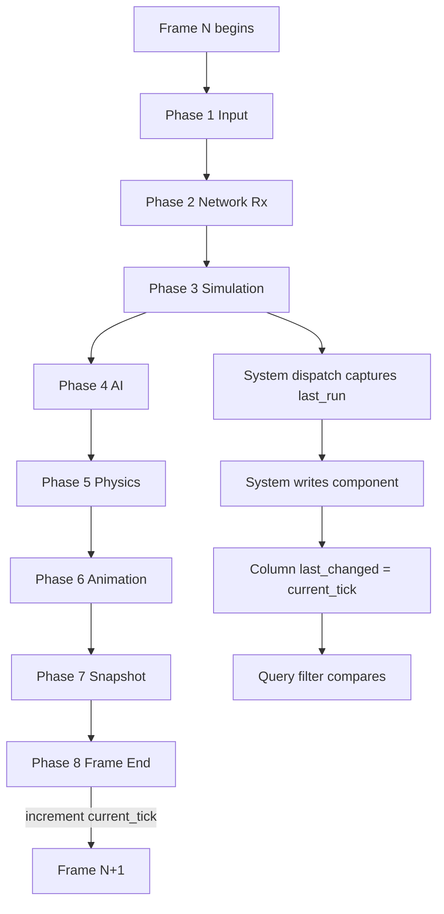
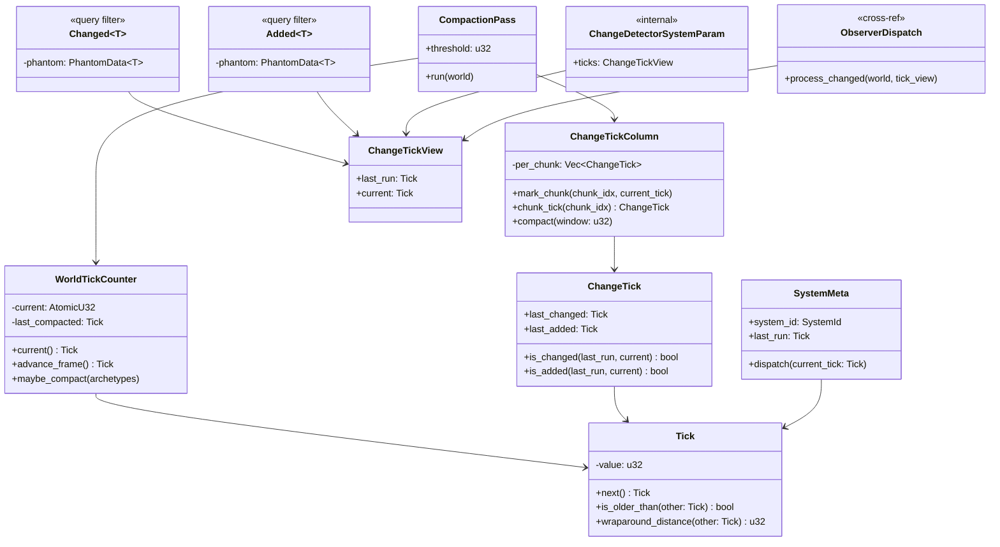
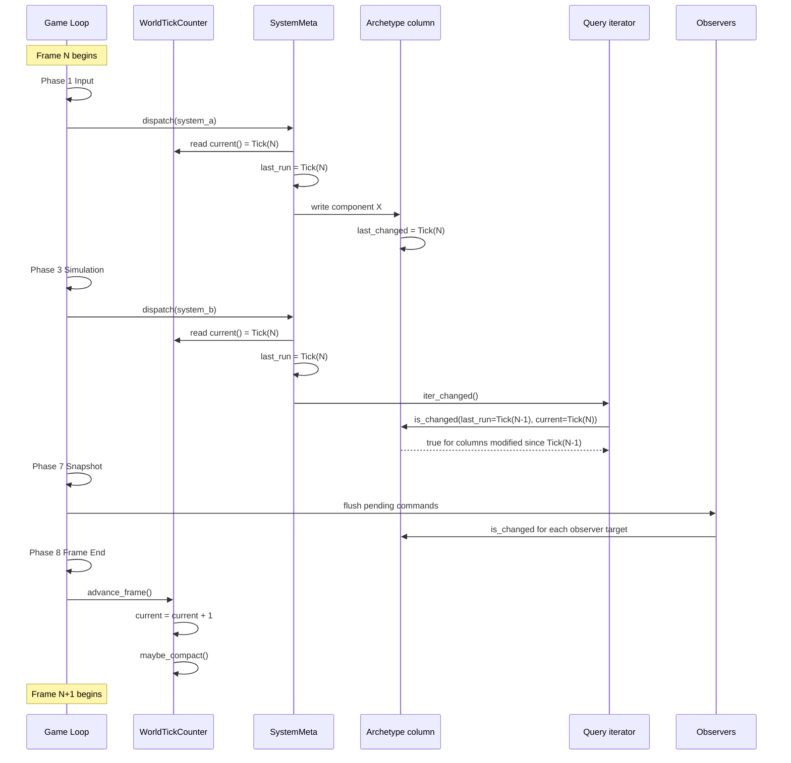
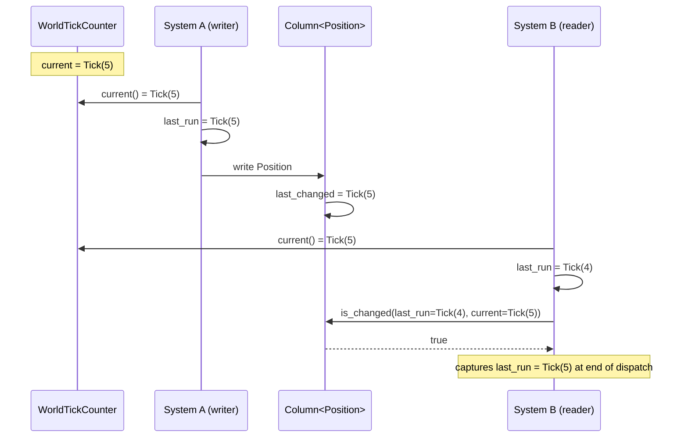
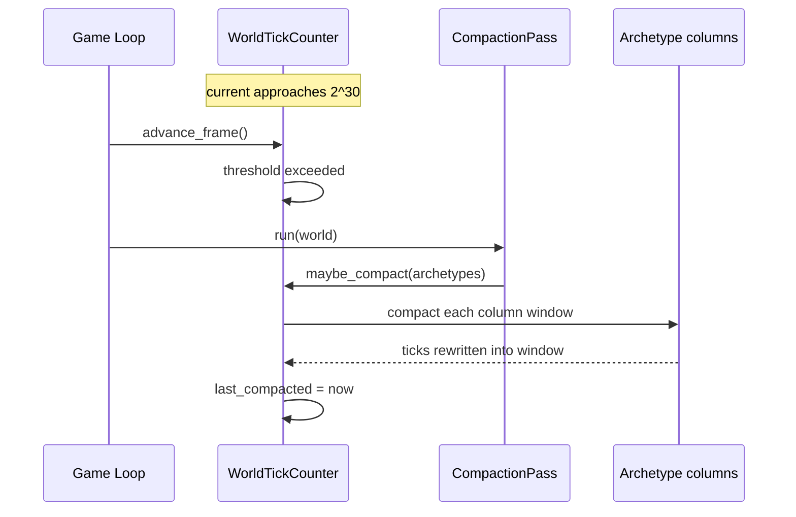

# Change Detection Design

## Requirements Trace

> **Canonical sources:** This document is the single owner of the ECS change-tick lifecycle
> referenced throughout [ecs.md](ecs.md) and [game-loop.md](game-loop.md) but never fully specified.
> See design review [section 3.1](../design-review.md#31-core-runtime) which notes that "change
> detection tick lifecycle (when does the tick increment?) is unspecified".

### Feature Trace

| Feature  | Scope                                                              |
|----------|--------------------------------------------------------------------|
| F-1.13.1 | `Tick(u32)` monotonic frame counter                                |
| F-1.13.2 | `ChangeTick` per-column last-mutation tick                         |
| F-1.13.3 | `Changed<T>` query filter semantics                                |
| F-1.13.4 | `Added<T>` query filter semantics                                  |
| F-1.13.5 | Tick increment protocol at Phase 8 end                             |
| F-1.13.6 | System `last_run` capture at dispatch time                         |
| F-1.13.7 | Wraparound rescue via periodic compaction                          |
| F-1.13.8 | Observer dispatch consumes the same tick stream                    |

1. **F-1.13.1** — Tick counter is a 32-bit monotonic value incremented once per frame
2. **F-1.13.2** — Each archetype column stores its last-mutation tick; SoA keeps the tick next to
   the data for branchless SIMD comparison
3. **F-1.13.3** — `Changed<T>` fires when `column.last_changed > system.last_run`
4. **F-1.13.4** — `Added<T>` fires when the component was added during the current window
5. **F-1.13.5** — The tick increments exactly once per frame at Phase 8 (Frame End) so that all
   systems in the frame see the same reference tick
6. **F-1.13.6** — Each system captures `world.current_tick()` at dispatch time into a local
   `last_run` field used by its `Changed`/`Added` filters
7. **F-1.13.7** — Approaching `u32::MAX`, a compaction pass rewrites stored ticks to a compact
   window to avoid ambiguity
8. **F-1.13.8** — Observer dispatch (`ecs.md` line ~259) uses the same tick comparison rules

## Overview

The ECS relies on change detection for `Changed<T>` and `Added<T>` query filters, observer dispatch,
the save-system dirty-tracking path, and replication delta compression. Prior docs reference a
`ChangeTick` type but never specify **when** the tick increments, **how** systems capture their
reference tick, or **what** happens when the `u32` counter wraps. This document establishes the full
lifecycle: one tick per frame, incremented at Phase 8, captured per-system at dispatch, and
compacted periodically to rescue wraparound.

### Design Goals

| Goal                          | Rationale                                                    |
|-------------------------------|--------------------------------------------------------------|
| One tick per frame            | Simple, deterministic, matches game-loop phase boundaries    |
| Branchless comparison         | Per-column SoA tick storage for SIMD-friendly query filters  |
| No heap on hot path           | Ticks are `u32`; no allocation for comparison                |
| Deterministic wraparound      | Periodic compaction avoids late-game ambiguity               |
| Observer consistency          | Observer dispatch uses the same tick stream as queries       |
| No `HashMap` on hot path      | Per-column storage keeps the data SoA and contiguous         |

### Non-Goals

| Non-goal                       | Replacement                                                  |
|--------------------------------|--------------------------------------------------------------|
| Per-entity-row tick storage    | Per-column (per-chunk) tick storage — cheaper, coarser       |
| Wall-clock time ticks          | Tick is a frame counter, not wall-clock                      |
| 64-bit tick counter            | `u32` + compaction; 64-bit is wasted bandwidth in archetypes |
| Cross-world tick sharing       | Each `World` owns its own tick counter                       |

## Architecture

### Lifecycle Flowchart



### Class Diagram



### Frame Tick Lifecycle



## API Design

```rust
use core::sync::atomic::{AtomicU32, Ordering};
use crate::ids::SystemId;
use crate::primitives::FixedBitSet;

// -------- Tick ------------------------------------------------------------

/// Monotonic 32-bit frame counter. Wraps after `u32::MAX` frames; the
/// compaction pass rewrites stored ticks before wraparound makes
/// comparisons ambiguous.
#[derive(Copy, Clone, Eq, PartialEq, Hash, Debug)]
#[derive(rkyv::Archive, rkyv::Serialize, rkyv::Deserialize)]
pub struct Tick(pub u32);

impl Tick {
    pub const ZERO: Tick = Tick(0);

    /// Wrapping increment. Compaction must run well before this actually
    /// wraps, but the wrapping semantics keep arithmetic defined.
    pub fn next(self) -> Tick {
        Tick(self.0.wrapping_add(1))
    }

    /// Modular "older than" comparison: treats the 32-bit space as a
    /// circular buffer. Only valid while `|self - other| < 2^31`; the
    /// compaction pass enforces this invariant.
    pub fn is_older_than(self, other: Tick) -> bool {
        self.0.wrapping_sub(other.0) > (u32::MAX / 2)
    }

    pub fn wraparound_distance(self, other: Tick) -> u32 {
        self.0.wrapping_sub(other.0)
    }
}

// -------- ChangeTick ------------------------------------------------------

/// Per-chunk change record. One entry per archetype chunk per column.
/// Stored SoA alongside the component data so SIMD can compare a whole
/// register of chunks in one instruction.
#[derive(Copy, Clone, Debug)]
pub struct ChangeTick {
    pub last_changed: Tick,
    pub last_added: Tick,
}

impl ChangeTick {
    pub fn is_changed(self, last_run: Tick, current: Tick) -> bool {
        // A chunk is "changed for this system" when its last mutation
        // happened strictly after the system's last run and no later than
        // the current reference tick.
        !self.last_changed.is_older_than(last_run)
            && !current.is_older_than(self.last_changed)
    }

    pub fn is_added(self, last_run: Tick, current: Tick) -> bool {
        !self.last_added.is_older_than(last_run)
            && !current.is_older_than(self.last_added)
    }
}

// -------- ChangeTickColumn ------------------------------------------------

/// One `ChangeTick` per chunk of a component column. Lives inside the
/// archetype next to the component data (see `ecs.md::Column`).
pub struct ChangeTickColumn {
    per_chunk: Vec<ChangeTick>,
}

impl ChangeTickColumn {
    pub fn new() -> Self { Self { per_chunk: Vec::new() } }

    pub fn mark_chunk(&mut self, chunk_idx: usize, current_tick: Tick) {
        if let Some(slot) = self.per_chunk.get_mut(chunk_idx) {
            slot.last_changed = current_tick;
        }
    }

    pub fn mark_added(&mut self, chunk_idx: usize, current_tick: Tick) {
        if let Some(slot) = self.per_chunk.get_mut(chunk_idx) {
            slot.last_added = current_tick;
            slot.last_changed = current_tick;
        }
    }

    pub fn chunk_tick(&self, chunk_idx: usize) -> ChangeTick {
        self.per_chunk[chunk_idx]
    }

    /// Rewrites stored ticks into a compact window ending at `max_tick`.
    /// Any tick older than `max_tick - window` is clamped to
    /// `max_tick - window`. Called by `CompactionPass`.
    pub fn compact(&mut self, max_tick: Tick, window: u32) {
        for slot in self.per_chunk.iter_mut() {
            if max_tick.wraparound_distance(slot.last_changed) > window {
                slot.last_changed = Tick(max_tick.0.wrapping_sub(window));
            }
            if max_tick.wraparound_distance(slot.last_added) > window {
                slot.last_added = Tick(max_tick.0.wrapping_sub(window));
            }
        }
    }
}

// -------- WorldTickCounter ------------------------------------------------

/// Owned by `World`. Incremented exactly once per frame at Phase 8
/// (`game-loop.md` Frame End). Atomic so that worker threads reading the
/// current tick during dispatch see a consistent value, but writes only
/// happen on the main thread between frames.
pub struct WorldTickCounter {
    current: AtomicU32,
    last_compacted: Tick,
}

impl WorldTickCounter {
    pub const COMPACTION_THRESHOLD: u32 = 1 << 30;
    pub const COMPACTION_WINDOW: u32 = 1 << 24;

    pub fn new() -> Self {
        Self {
            current: AtomicU32::new(0),
            last_compacted: Tick::ZERO,
        }
    }

    pub fn current(&self) -> Tick {
        Tick(self.current.load(Ordering::Acquire))
    }

    /// Called at Phase 8 Frame End. Returns the tick that the next frame
    /// will see. The scheduler uses this value when dispatching the next
    /// frame's systems.
    pub fn advance_frame(&self) -> Tick {
        let prev = self.current.fetch_add(1, Ordering::AcqRel);
        Tick(prev.wrapping_add(1))
    }

    /// Called at Phase 8 after `advance_frame`. Runs a compaction pass if
    /// the distance between `current` and `last_compacted` exceeds
    /// `COMPACTION_THRESHOLD`.
    pub fn maybe_compact(&mut self, archetypes: &mut [ArchetypeRef]) {
        let now = self.current();
        if now.wraparound_distance(self.last_compacted)
            < Self::COMPACTION_THRESHOLD
        {
            return;
        }
        for a in archetypes.iter_mut() {
            for col in a.columns_mut() {
                col.compact(now, Self::COMPACTION_WINDOW);
            }
        }
        self.last_compacted = now;
    }
}

// -------- SystemMeta ------------------------------------------------------

/// Scheduler-side per-system metadata. `last_run` is captured at dispatch
/// time and read by that system's `Changed`/`Added` filters.
pub struct SystemMeta {
    pub system_id: SystemId,
    pub last_run: Tick,
    pub access: FixedBitSet,
}

impl SystemMeta {
    /// Called by the scheduler immediately before the system body runs.
    pub fn dispatch(&mut self, current_tick: Tick) {
        self.last_run = current_tick;
    }
}

// -------- ChangeTickView --------------------------------------------------

/// Read-only view passed to query filters and observers. Created once per
/// system dispatch.
#[derive(Copy, Clone, Debug)]
pub struct ChangeTickView {
    pub last_run: Tick,
    pub current: Tick,
}

// -------- Query filters ---------------------------------------------------

use core::marker::PhantomData;

/// `Query<(&Position,), Changed<Position>>` matches entities whose
/// `Position` chunk was mutated since the running system's `last_run`.
pub struct Changed<T>(pub PhantomData<T>);

/// `Added<T>` fires only for entities where the component was added
/// (via spawn or `insert`) in the window `(last_run, current]`.
pub struct Added<T>(pub PhantomData<T>);

// -------- Observer integration --------------------------------------------

/// Observer dispatch consumes the same tick stream as `Changed<T>` filters.
/// The observer registry (see `ecs.md`) uses this to decide which observers
/// to fire when a command buffer flush produces a mutation at tick `N`.
pub trait ObserverDispatch {
    fn process_changed(
        &mut self,
        world: &mut WorldRef,
        view: ChangeTickView,
    );
}

// -------- Compaction pass -------------------------------------------------

/// Rewrites every stored tick to live in a compact window before the
/// counter approaches wraparound. Scheduled by `game-loop.md` Phase 8
/// between `advance_frame` and `present`.
pub struct CompactionPass {
    pub threshold: u32,
    pub window: u32,
}

impl CompactionPass {
    pub fn run(&self, world: &mut WorldRef) {
        world.tick_counter_mut().maybe_compact(world.archetypes_mut());
    }
}

// -------- Placeholder cross-references ------------------------------------

pub struct WorldRef;
impl WorldRef {
    pub fn tick_counter_mut(&mut self) -> &mut WorldTickCounter { unimplemented!() }
    pub fn archetypes_mut(&mut self) -> &mut [ArchetypeRef] { unimplemented!() }
}

pub struct ArchetypeRef;
impl ArchetypeRef {
    pub fn columns_mut(&mut self) -> &mut [ChangeTickColumn] { unimplemented!() }
}
```

### Filter Comparison Rules

| Filter         | Condition on a chunk                                                     |
|----------------|--------------------------------------------------------------------------|
| `Changed<T>`   | `last_changed > last_run` and `last_changed <= current`                  |
| `Added<T>`     | `last_added > last_run` and `last_added <= current`                      |
| `With<T>`      | Column exists (no tick compare)                                          |
| `Without<T>`   | Column absent (no tick compare)                                          |

### Per-Phase Tick Behavior

| Phase | Reads tick?   | Writes tick?  | Notes                                          |
|-------|---------------|---------------|------------------------------------------------|
| 1     | Yes (dispatch)| Mutates cols  | Input systems mark input columns               |
| 2     | Yes           | Mutates cols  | Net Rx systems mark replicated columns         |
| 3     | Yes           | Mutates cols  | Simulation systems write state                 |
| 4     | Yes           | Mutates cols  | AI mutates behavior-tree blackboard            |
| 5     | Yes           | Mutates cols  | Physics writes transforms                      |
| 6     | Yes           | Mutates cols  | Animation writes pose columns                  |
| 7     | Yes           | Reads only    | Snapshot observes; no writes                   |
| 8     | No            | No            | `advance_frame` and `maybe_compact` run here   |

## Data Flow

### Changed Query Across Two Systems



### Wraparound Rescue



## Platform Considerations

Tick storage is portable `u32` arithmetic with no platform dependencies. The atomic counter uses
`AtomicU32` which is lock-free on every supported platform (Windows, macOS, iOS, Linux, Android).
SIMD comparison of ChangeTick chunks is opportunistic; the scalar path is always correct.

## Test Plan

Full test cases live in [change-detection-test-cases.md](change-detection-test-cases.md). Summary:

| Category    | Scope                                                          |
|-------------|----------------------------------------------------------------|
| Unit        | `Tick::next` wraps at `u32::MAX`                                |
| Unit        | `Tick::is_older_than` respects modular semantics                |
| Unit        | `ChangeTick::is_changed` fires for the right window             |
| Unit        | `ChangeTick::is_added` fires only on add                        |
| Unit        | `WorldTickCounter::advance_frame` increments exactly once       |
| Unit        | `ChangeTickColumn::compact` clamps stale ticks                  |
| Integration | Two systems in a frame see consistent `current_tick`            |
| Integration | Observer dispatch uses same tick stream as `Changed<T>` filter  |
| Integration | Compaction pass rescues approaching wraparound                  |
| Benchmark   | `Changed<T>` filter on 1M entities under 1 ms                   |

## Open Questions

1. **Wraparound window size.** The current `COMPACTION_WINDOW = 1 << 24` allows ~16.7M ticks of
   history. At 120 fps that is about 38 hours of continuous play. Should the window be smaller
   (cheaper compaction) or larger (fewer compaction passes)?
2. **Per-entity vs per-chunk granularity.** We chose per-chunk for cache efficiency. Do any
   subsystems need per-entity granularity? If yes, they can layer their own tracking on top.
3. **Compaction atomicity.** Should compaction run at Phase 8 before or after the hot-reload
   barrier? Current plan: before, so reload sees already-compacted ticks.
4. **64-bit fallback.** If the compaction strategy proves insufficient, should we ship a 64-bit tick
   variant behind a feature flag at the cost of archetype bandwidth?
5. **Tick freeze during pause.** When the game pauses (`simulation paused`), should the tick still
   advance so editor operations remain observable? Current plan: advance always; pause only gates
   simulation systems.
6. **Rollback semantics.** If a rollback replays frames, should ticks replay too, or should each
   replay advance the tick monotonically? Current plan: replays get fresh ticks; save-load captures
   `last_compacted` as part of the save header.
