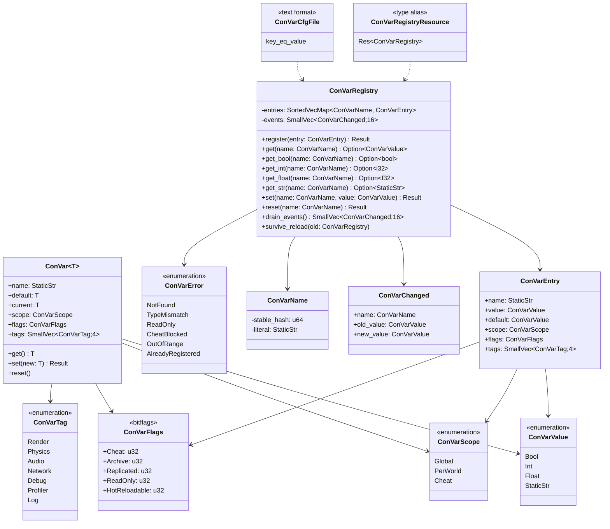
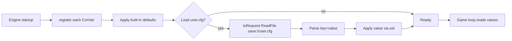
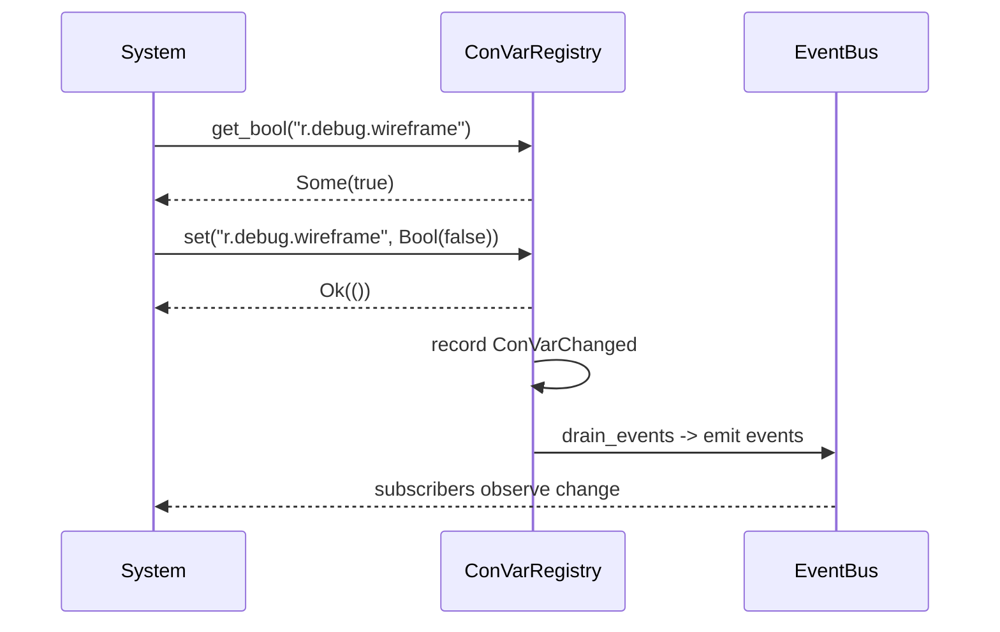
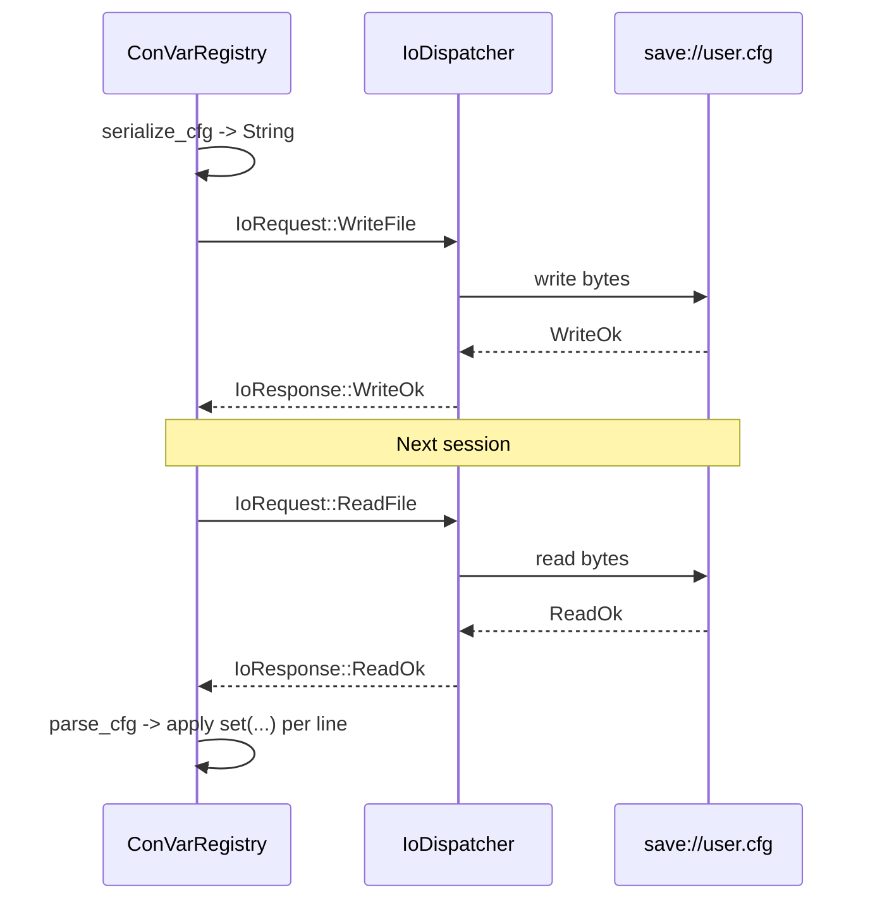

# Console Variables Design

## Requirements Trace

> **Canonical sources:** This document is the single owner of the runtime `ConVar` system used for
> debug toggles, live tuning, and feature flags. Referenced from the design review
> [section 2.3](../design-review.md#23-undefined-bridge-types) which lists "ConVar / console vars"
> among the types referenced but never defined.

### Feature Trace

| Feature  | Scope                                                              |
|----------|--------------------------------------------------------------------|
| F-1.16.1 | Typed `ConVar<T>` container with name, default, current, scope     |
| F-1.16.2 | `ConVarScope` (Global, PerWorld, Cheat)                            |
| F-1.16.3 | `ConVarFlags` bitflags (Cheat, Archive, Replicated, ReadOnly, HotReloadable) |
| F-1.16.4 | `ConVarRegistry` with register / get / set APIs                    |
| F-1.16.5 | Hot-reload survival via name-based lookup                          |
| F-1.16.6 | ECS resource wrapper `Res<ConVarRegistry>`                         |
| F-1.16.7 | Text `.cfg` save / load via `io.md` request protocol               |
| F-1.16.8 | Change notification via `ConVarChanged` event                      |

1. **F-1.16.1** — Each ConVar is a typed slot holding default and current values
2. **F-1.16.2** — Scope decides whether the value is process-wide, per-world, or cheat-gated
3. **F-1.16.3** — Flags gate archiving, replication, mutation, hot-reload survival, cheats
4. **F-1.16.4** — `ConVarRegistry` is a single struct stored as an ECS resource
5. **F-1.16.5** — Values keyed by name survive middleman `.dylib` reloads
6. **F-1.16.6** — Access from systems via `Res<ConVarRegistry>` / `ResMut<ConVarRegistry>`
7. **F-1.16.7** — Serialized form is a text `.cfg` file read / written via `IoRequest`
8. **F-1.16.8** — Mutations fire a `ConVarChanged` event so subsystems can react

## Overview

Debug visualization (wireframe overlays, physics contact lines, profiler toggles), developer tuning
(camera speed, gravity multiplier, bloom threshold), and feature flags (enable experimental pass,
disable ragdoll) all need a shared mechanism to read and write runtime values without recompiling.
This document defines `ConVar<T>`, `ConVarRegistry`, the scope / flag model, the ECS integration,
and the `.cfg` file format for persistence.

### Non-Goals

| Non-goal                       | Replacement                                                   |
|--------------------------------|---------------------------------------------------------------|
| Full scripting language        | ConVars store plain typed values only                         |
| Binary serialization           | Use `save-system.md` for save games; ConVars use text `.cfg`  |
| Trivial reflection             | Typed accessors; no type erasure via `Any`                    |
| Per-player overrides           | Use `PerWorld` scope plus save-system for player preferences  |

### Supported Value Types

| Rust Type      | ConVar Variant   | Example Name             |
|----------------|------------------|--------------------------|
| `bool`         | `ConVarValue::Bool`   | `r.debug.wireframe`   |
| `i32`          | `ConVarValue::Int`    | `net.tick_rate`       |
| `f32`          | `ConVarValue::Float`  | `r.scale`             |
| `&'static str` | `ConVarValue::StaticStr` | `log.level`        |

Small set on purpose — no generics, no `Box<dyn Any>`. Each variant maps to a fixed enum arm.

## Architecture

### Class Diagram



### Registration Lifecycle



### Hot-Reload Survival

```mermaid
sequenceDiagram
    participant HRM as HotReloadManager
    participant OLD as Old ConVarRegistry
    participant NEW as New ConVarRegistry
    participant NOTE as Events

    HRM->>NEW: register all ConVars with defaults
    HRM->>NEW: survive_reload(old=OLD)
    loop entries in OLD
        NEW->>NEW: if name matches and HotReloadable set
        NEW->>NEW: copy current value from OLD
    end
    NEW->>NOTE: emit ConVarChanged for each surviving entry
    HRM->>HRM: replace world.resource::<ConVarRegistry>
```

## API Design

```rust
use crate::error::EngineError;
use crate::ids::EventId;
use crate::primitives::{SmallVec, SortedVecMap};

// -------- ConVarName ------------------------------------------------------

/// Stable name for a ConVar. The literal is always a `&'static str`
/// (e.g. `"r.debug.wireframe"`); the hash is computed once at registration
/// time and used as the `SortedVecMap` key.
#[derive(Copy, Clone, Eq, PartialEq, Hash, Debug)]
pub struct ConVarName {
    pub stable_hash: u64,
    pub literal: &'static str,
}

impl ConVarName {
    pub const fn new(literal: &'static str) -> Self {
        Self { stable_hash: fnv1a_const(literal), literal }
    }
}

const fn fnv1a_const(s: &str) -> u64 {
    let bytes = s.as_bytes();
    let mut hash: u64 = 0xcbf29ce484222325;
    let mut i = 0;
    while i < bytes.len() {
        hash ^= bytes[i] as u64;
        hash = hash.wrapping_mul(0x100000001b3);
        i += 1;
    }
    hash
}

// -------- ConVarValue -----------------------------------------------------

#[derive(Clone, Debug, PartialEq)]
pub enum ConVarValue {
    Bool(bool),
    Int(i32),
    Float(f32),
    StaticStr(&'static str),
}

// -------- ConVarScope -----------------------------------------------------

#[derive(Copy, Clone, Eq, PartialEq, Debug)]
pub enum ConVarScope {
    /// One value shared across every `World`.
    Global,
    /// Each `World` holds its own value; copying a save migrates it.
    PerWorld,
    /// Only mutable when `ConVarFlags::Cheat` is also set and cheats are
    /// globally enabled for the session.
    Cheat,
}

// -------- ConVarFlags -----------------------------------------------------

bitflags::bitflags! {
    /// Bit flags controlling behavior. `bitflags::bitflags!` produces a
    /// plain `u32` newtype with `|` and `&` operators.
    #[derive(Copy, Clone, Eq, PartialEq, Debug)]
    pub struct ConVarFlags: u32 {
        /// Only mutable when session cheats are enabled.
        const CHEAT          = 1 << 0;
        /// Persisted to the `.cfg` file.
        const ARCHIVE        = 1 << 1;
        /// Replicated to networked clients.
        const REPLICATED     = 1 << 2;
        /// Read-only at runtime (registration only).
        const READ_ONLY      = 1 << 3;
        /// Current value survives middleman `.dylib` reload.
        const HOT_RELOADABLE = 1 << 4;
    }
}

// -------- ConVarTag -------------------------------------------------------

#[derive(Copy, Clone, Eq, PartialEq, Debug)]
pub enum ConVarTag {
    Render,
    Physics,
    Audio,
    Network,
    Debug,
    Profiler,
    Log,
}

// -------- ConVarEntry -----------------------------------------------------

pub struct ConVarEntry {
    pub name: ConVarName,
    pub value: ConVarValue,
    pub default: ConVarValue,
    pub scope: ConVarScope,
    pub flags: ConVarFlags,
    pub tags: SmallVec<ConVarTag, 4>,
}

// -------- ConVarRegistry --------------------------------------------------

pub struct ConVarRegistry {
    entries: SortedVecMap<ConVarName, ConVarEntry>,
    events: SmallVec<ConVarChanged, 16>,
    cheats_enabled: bool,
}

impl ConVarRegistry {
    pub fn new() -> Self { unimplemented!() }

    /// Register at engine startup. Subsequent `register` with the same
    /// name returns `Err(ConVarError::AlreadyRegistered)`.
    pub fn register(&mut self, entry: ConVarEntry) -> Result<(), ConVarError> {
        let _ = entry;
        unimplemented!()
    }

    pub fn get(&self, name: ConVarName) -> Option<ConVarValue> {
        self.entries.get(&name).map(|e| e.value.clone())
    }

    pub fn get_bool(&self, name: ConVarName) -> Option<bool> {
        match self.get(name)? {
            ConVarValue::Bool(b) => Some(b),
            _ => None,
        }
    }

    pub fn get_int(&self, name: ConVarName) -> Option<i32> {
        match self.get(name)? {
            ConVarValue::Int(i) => Some(i),
            _ => None,
        }
    }

    pub fn get_float(&self, name: ConVarName) -> Option<f32> {
        match self.get(name)? {
            ConVarValue::Float(f) => Some(f),
            _ => None,
        }
    }

    pub fn get_str(&self, name: ConVarName) -> Option<&'static str> {
        match self.get(name)? {
            ConVarValue::StaticStr(s) => Some(s),
            _ => None,
        }
    }

    /// Mutate the current value. Returns an error if the name is unknown,
    /// the type does not match, the entry is read-only, or cheats are
    /// required but not enabled.
    pub fn set(
        &mut self,
        name: ConVarName,
        value: ConVarValue,
    ) -> Result<(), ConVarError> {
        let _ = (name, value);
        unimplemented!()
    }

    /// Revert to the default value.
    pub fn reset(&mut self, name: ConVarName) -> Result<(), ConVarError> {
        let _ = name;
        unimplemented!()
    }

    /// Called once per frame by the ECS `convar_dispatch_system` to let
    /// subsystems observe recent mutations.
    pub fn drain_events(&mut self) -> SmallVec<ConVarChanged, 16> {
        core::mem::take(&mut self.events)
    }

    /// After a middleman `.dylib` reload, copy current values from the
    /// previous registry for all entries whose `HOT_RELOADABLE` flag is
    /// set and whose name + type match. Missing entries receive the new
    /// default; entries that disappeared are dropped.
    pub fn survive_reload(&mut self, old: ConVarRegistry) {
        let _ = old;
        unimplemented!()
    }

    /// Enable `Cheat`-scoped mutations for this session.
    pub fn enable_cheats(&mut self) { self.cheats_enabled = true; }
}

// -------- ConVarChanged Event --------------------------------------------

#[derive(Clone, Debug)]
pub struct ConVarChanged {
    pub name: ConVarName,
    pub old_value: ConVarValue,
    pub new_value: ConVarValue,
}

// -------- ConVarError -----------------------------------------------------

#[derive(Debug)]
pub enum ConVarError {
    NotFound { name: ConVarName },
    TypeMismatch { name: ConVarName },
    ReadOnly { name: ConVarName },
    CheatBlocked { name: ConVarName },
    OutOfRange { name: ConVarName },
    AlreadyRegistered { name: ConVarName },
}

// -------- ECS integration -------------------------------------------------

/// Resource alias used by systems. The underlying `ConVarRegistry`
/// is inserted into `World` at engine startup.
pub type ConVarRegistryResource = ConVarRegistry;

/// System that drains `ConVarChanged` events and forwards them to the
/// standard ECS event bus. Registered once in the `PreUpdate` phase.
pub fn convar_dispatch_system(
    registry: ResMut<ConVarRegistryResource>,
    writer: EventWriter<ConVarChanged>,
) {
    let events = registry.drain_events();
    for ev in events.iter() {
        writer.send(ev.clone());
    }
}

// -------- Text .cfg format ------------------------------------------------

/// Serialize the registry into a plain `key=value` text file with `#`
/// comment lines. Written via `IoRequest::WriteFile` to `save://user.cfg`.
/// Only entries with `ARCHIVE` set are serialized.
///
/// ```text
/// # Harmonius user.cfg
/// r.debug.wireframe = false
/// r.scale = 1.0
/// net.tick_rate = 60
/// log.level = "info"
/// ```
pub fn serialize_cfg(reg: &ConVarRegistry) -> String {
    let _ = reg;
    unimplemented!()
}

/// Parse a `.cfg` file and apply each `key=value` line via
/// `ConVarRegistry::set`. Unknown keys are logged and skipped. Type
/// mismatches are logged and skipped. Returns a report for the editor
/// console.
pub fn parse_cfg(
    reg: &mut ConVarRegistry,
    contents: &str,
) -> CfgReport {
    let _ = (reg, contents);
    unimplemented!()
}

pub struct CfgReport {
    pub applied: u32,
    pub unknown: SmallVec<&'static str, 8>,
    pub type_mismatch: SmallVec<&'static str, 8>,
}

// -------- I/O integration -------------------------------------------------
//
// Save / load goes through `core-runtime/io.md`:
//   IoRequest::ReadFile { path: VPath("save://user.cfg"), ... }
//   IoRequest::WriteFile { path: VPath("save://user.cfg"), ... }
//
// Parsing and serializing happen on the main thread after the
// IoResponse drain. ConVar does not own its own I/O path; every platform
// file read is funneled through the shared dispatcher.

// -------- Placeholder cross-references ------------------------------------
//   ResMut / Res / EventWriter      — core-runtime/ecs.md
//   IoRequest / VPath               — core-runtime/io.md

pub struct ResMut<T>(core::marker::PhantomData<T>);
pub struct Res<T>(core::marker::PhantomData<T>);
pub struct EventWriter<T>(core::marker::PhantomData<T>);
impl<T> EventWriter<T> {
    pub fn send(&self, _event: T) {}
}
```

### Initial ConVar Inventory

| Name                         | Type  | Default | Scope    | Flags              | Tag       |
|------------------------------|-------|---------|----------|--------------------|-----------|
| `r.debug.wireframe`          | bool  | false   | Global   | ARCHIVE, HR        | Render    |
| `r.debug.overdraw`           | bool  | false   | Global   | ARCHIVE, HR        | Render    |
| `r.debug.bounds`             | bool  | false   | Global   | ARCHIVE, HR        | Render    |
| `r.scale`                    | float | 1.0     | Global   | ARCHIVE, HR        | Render    |
| `r.vsync`                    | bool  | true    | Global   | ARCHIVE            | Render    |
| `r.max_fps`                  | int   | 0       | Global   | ARCHIVE            | Render    |
| `phys.debug.contacts`        | bool  | false   | Global   | ARCHIVE, HR        | Physics   |
| `phys.debug.joints`          | bool  | false   | Global   | ARCHIVE, HR        | Physics   |
| `phys.gravity.y`             | float | -9.81   | PerWorld | CHEAT              | Physics   |
| `net.tick_rate`              | int   | 60      | Global   | ARCHIVE, REPL      | Network   |
| `net.sim.packet_loss`        | float | 0.0     | PerWorld | CHEAT              | Network   |
| `audio.master.gain`          | float | 1.0     | Global   | ARCHIVE, HR        | Audio     |
| `profiler.enable`            | bool  | false   | Global   | HR                 | Profiler  |
| `profiler.gpu`               | bool  | false   | Global   | HR                 | Profiler  |
| `log.level`                  | str   | "info"  | Global   | ARCHIVE, HR        | Log       |
| `dev.god_mode`               | bool  | false   | Cheat    | CHEAT              | Debug     |

> `HR` abbreviates `HOT_RELOADABLE`, `REPL` abbreviates `REPLICATED`.

### Flag Semantics

| Flag              | Behavior                                                          |
|-------------------|-------------------------------------------------------------------|
| `CHEAT`           | `set` fails unless `cheats_enabled` is true                       |
| `ARCHIVE`         | Entry serialized into `user.cfg` on save                          |
| `REPLICATED`      | Value mirrored to networked clients via standard state sync       |
| `READ_ONLY`       | `set` always fails post-registration                              |
| `HOT_RELOADABLE`  | Current value copied during `.dylib` reload via `survive_reload`  |

### Save / Load Flow

| Step | Action                                                                 |
|------|------------------------------------------------------------------------|
| 1    | Subsystem submits `IoRequest::ReadFile` for `save://user.cfg`          |
| 2    | `io.md` dispatcher reads file via platform backend                     |
| 3    | `IoResponse::ReadOk` arrives; text is decoded to `&str`                |
| 4    | `parse_cfg` applies each `key=value` line via `ConVarRegistry::set`    |
| 5    | Mutations emit `ConVarChanged` events via `convar_dispatch_system`     |
| 6    | On save, `serialize_cfg` builds a `String`; `IoRequest::WriteFile` out |

## Data Flow

### Runtime Read / Write



### Cfg File Round-Trip



## Platform Considerations

| Platform | Save location                                      |
|----------|----------------------------------------------------|
| Windows  | `%APPDATA%/Harmonius/user.cfg`                     |
| macOS    | `~/Library/Application Support/Harmonius/user.cfg` |
| iOS      | `Documents/user.cfg` within app container          |
| Linux    | `$XDG_CONFIG_HOME/harmonius/user.cfg`              |
| Android  | App-private data directory                         |

The platform mapping lives in the VFS mount table (`asset://`, `save://`). ConVar reads and writes
never call platform APIs directly — they submit an `IoRequest` and the shared dispatcher handles
routing.

## Test Plan

Full test cases live in [console-variables-test-cases.md](console-variables-test-cases.md). Summary:

| Category    | Scope                                                              |
|-------------|--------------------------------------------------------------------|
| Unit        | Register valid and duplicate entries                                |
| Unit        | `get_bool` / `get_int` / `get_float` / `get_str` type mismatch      |
| Unit        | `set` fires `ConVarChanged` event                                   |
| Unit        | `READ_ONLY` entry rejects mutation                                  |
| Unit        | `CHEAT`-scoped entry rejects mutation when cheats disabled          |
| Unit        | `reset` returns the entry to its default                            |
| Unit        | `parse_cfg` skips unknown keys with a warning                       |
| Unit        | `serialize_cfg` emits only `ARCHIVE` entries                        |
| Integration | Hot-reload survives `HOT_RELOADABLE` values via `survive_reload`    |
| Integration | Cfg round-trip read -> parse -> set -> serialize -> compare         |
| Integration | ECS `convar_dispatch_system` forwards events to `EventBus`          |
| Benchmark   | `ConVarRegistry::get` under 100 ns for cached lookup                |

## Open Questions

1. Should `ConVar<T>` support a runtime-checked min/max range? Current plan: yes, but the range
   lives outside the registry — subsystems validate before calling `set`.
2. How should `PerWorld` scope interact with save files that carry multiple `World` snapshots?
   Proposed: each `World` owns its own `ConVarRegistry` resource; the global registry is a separate
   singleton.
3. Is `SmallVec<ConVarChanged, 16>` enough event capacity, or should we fall back to `Vec`?
4. Should the parser accept environment variable expansion (`$HOME`) in `StaticStr` values? Current
   plan: no — keep `.cfg` literal.
5. Do we expose ConVars to scripting graphs directly, or route through a bridge system? Current
   plan: bridge, so scripting never writes an unvalidated value.
6. How are ConVars displayed in the debug console UI? Referenced but unowned by this doc; see
   `tools/debug-console.md` (future).
