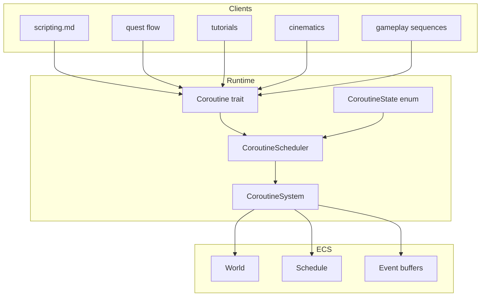
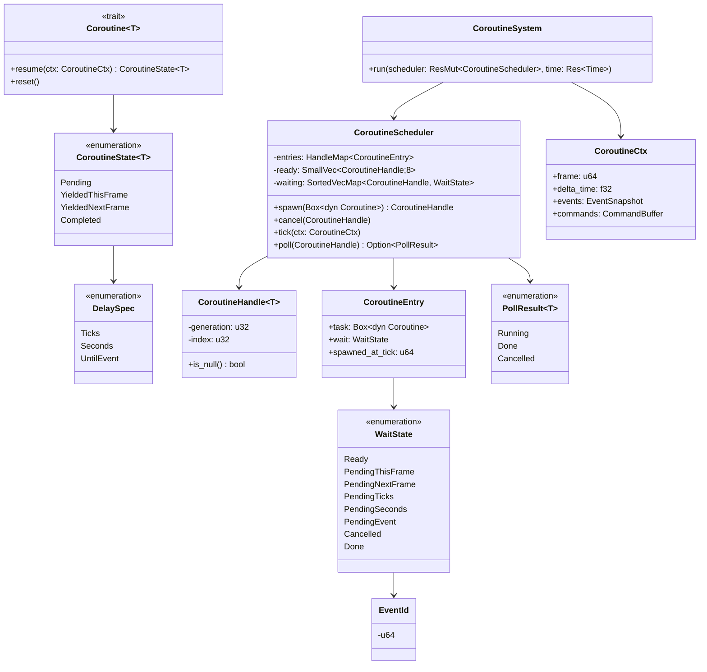
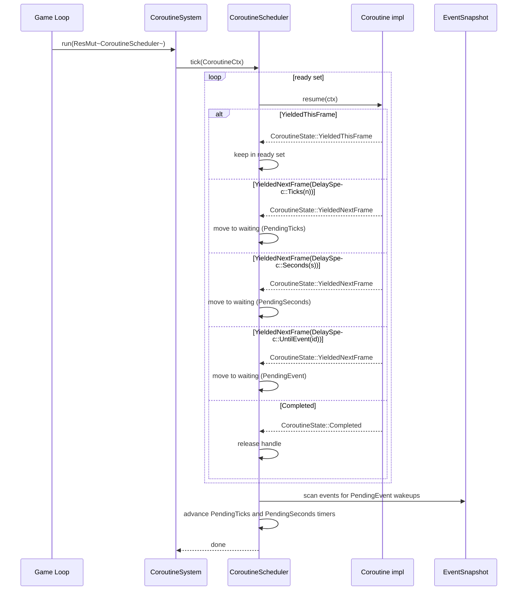
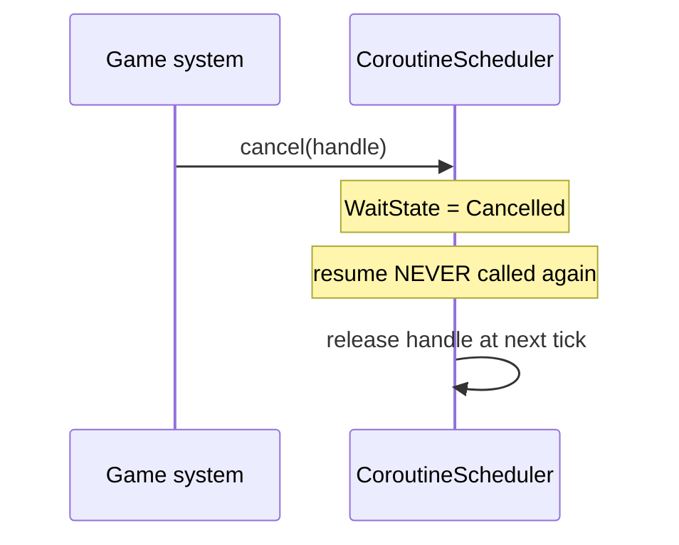

# Coroutines Design

## Requirements Trace

> **Canonical sources:** This document is the single owner of the coroutine primitive used by
> scripting, quest flow, tutorials, cinematics, and gameplay sequences. It extracts the coroutine
> sketch from [scripting.md](../game-framework/scripting.md) into a reusable runtime primitive.
> `scripting.md` becomes a client (to be updated in a later task). See design review
> [section 3.1](../design-review.md#31-core-runtime) and P1 task 20.

### Feature Trace

| Feature  | Scope                                                              |
|----------|--------------------------------------------------------------------|
| F-1.14.1 | Frame-scheduled resumable state machines (no async)                |
| F-1.14.2 | `Coroutine` trait with synchronous `resume`                        |
| F-1.14.3 | `CoroutineState` yield grammar (this frame, next frame, delay)     |
| F-1.14.4 | `CoroutineScheduler` owning a `HandleMap`                          |
| F-1.14.5 | `CoroutineSystem` ECS integration                                  |
| F-1.14.6 | Event-driven resumption via `EventId`                              |

1. **F-1.14.1** — Coroutines are plain Rust state machines; zero `Future`, `async fn`, or `.await`
2. **F-1.14.2** — Single `resume(&mut self, ctx)` entry point keeps dispatch trivial
3. **F-1.14.3** — Yield grammar is an enum, not a trait object, so the scheduler stays
   allocation-free
4. **F-1.14.4** — `CoroutineHandle` is a generational index into the scheduler's `HandleMap`
5. **F-1.14.5** — Coroutines tick once per ECS phase from `CoroutineSystem`
6. **F-1.14.6** — Event-waiting coroutines wake when a matching `EventId` is observed on the frame

## Overview

Harmonius forbids `async fn`, `.await`, `Future`, Tokio, `compio`, and `mio` in every engine crate.
Gameplay still needs multi-frame sequencing (boss phases, scripted tutorials, timed objectives,
cinematic beats). This document defines a first-class **coroutine** primitive: a trait that any
system can implement, backed by a `CoroutineScheduler` that lives as an ECS resource and is ticked
once per ECS phase by `CoroutineSystem`. Every yield grammar variant maps to a plain enum value.
`scripting.md` will become the first client once it is rewritten to use this primitive.

### Design Goals

| Goal                         | Rationale                                                     |
|------------------------------|---------------------------------------------------------------|
| Zero async surface           | Engine rule — see [constraints.md](../constraints.md)         |
| Plain synchronous dispatch   | Every `resume` is a `match` on an inline state field          |
| Deterministic ordering       | Tick order follows handle insertion order                     |
| Cheap spawn / cancel         | Generational index into a `HandleMap`, no heap churn          |
| Integrates with ECS schedule | Single `CoroutineSystem` runs during the normal phase dispatch |
| Composable with events       | Wait for any `EventId` without polling                        |

### Non-Goals

| Non-goal                     | Replacement                                                   |
|------------------------------|---------------------------------------------------------------|
| `Future` / `.await` support  | Plain `CoroutineState` enum and `resume` method               |
| Cross-thread wakeup          | Scheduler runs on the same thread as the ECS tick             |
| Cancellation tokens          | `CoroutineScheduler::cancel(handle)` sets an explicit flag    |
| Priority inversion handling  | All coroutines share the same priority; use ECS phases        |

## Architecture

### Subsystem Placement



### Class Diagram



### Frame Tick Lifecycle



## API Design

```rust
use crate::error::EngineError;
use crate::ids::EventId;
use crate::primitives::{Handle, HandleMap, SmallVec, SortedVecMap};

// -------- Coroutine trait -------------------------------------------------

/// Synchronous resumable state machine. `resume` is called at most once per
/// frame per coroutine. Implementations store their progress in `self` —
/// usually via an inline enum whose variants represent yield points.
///
/// Implementations MUST NOT block, MUST NOT call `.await`, MUST NOT spawn a
/// `Future`. The trait exists precisely to avoid those primitives.
pub trait Coroutine: 'static + Send {
    /// Opaque output produced when the coroutine completes. Use `()` for
    /// fire-and-forget coroutines.
    type Output: 'static + Send;

    /// Advance the coroutine by one step. Returns a `CoroutineState`
    /// indicating whether the coroutine is yielding, waiting, or done.
    fn resume(&mut self, ctx: &mut CoroutineCtx<'_>) -> CoroutineState<Self::Output>;

    /// Reset to the initial state. Called on hot-reload rollback.
    fn reset(&mut self) {}
}

// -------- CoroutineState --------------------------------------------------

/// Yield grammar. The scheduler interprets each variant exactly once per
/// `resume` call.
pub enum CoroutineState<T> {
    /// Still working — no yield. The scheduler keeps the coroutine in the
    /// ready set and will not call `resume` again this frame.
    Pending,
    /// Yield the rest of this frame; resume again during the same frame
    /// only if the scheduler's budget allows (opt-in via `tick_twice`).
    YieldedThisFrame,
    /// Yield until a future frame. The `DelaySpec` describes when to resume.
    YieldedNextFrame(DelaySpec),
    /// Coroutine finished. The output value is returned via `poll` to the
    /// original spawner (if any).
    Completed(T),
}

// -------- DelaySpec -------------------------------------------------------

/// When a `YieldedNextFrame` coroutine should wake up. The scheduler maps
/// each variant onto a `WaitState` in the waiting map.
#[derive(Copy, Clone, Debug)]
pub enum DelaySpec {
    /// Resume on the next scheduler tick.
    Next,
    /// Resume after `n` scheduler ticks have elapsed.
    Ticks(u32),
    /// Resume after `secs` seconds of wall-clock delta time.
    Seconds(f32),
    /// Resume when an event carrying `EventId` is observed.
    UntilEvent(EventId),
}

// -------- CoroutineHandle -------------------------------------------------

/// Generational handle into the scheduler's `HandleMap`. Not `Copy`
/// across different `Output` types.
#[derive(Clone, Copy, Eq, PartialEq, Hash)]
pub struct CoroutineHandle<T> {
    raw: Handle<CoroutineEntry>,
    _marker: core::marker::PhantomData<fn() -> T>,
}

impl<T> CoroutineHandle<T> {
    pub fn is_null(self) -> bool { self.raw.is_null() }
}

// -------- CoroutineEntry --------------------------------------------------

pub struct CoroutineEntry {
    pub task: Box<dyn Coroutine<Output = ()>>,
    pub wait: WaitState,
    pub spawned_at_tick: u64,
}

// -------- WaitState -------------------------------------------------------

/// Internal state flag. `Ready` means "call resume on next tick".
#[derive(Clone, Debug)]
pub enum WaitState {
    Ready,
    PendingThisFrame,
    PendingNextFrame,
    PendingTicks { remaining: u32 },
    PendingSeconds { remaining_secs: f32 },
    PendingEvent { event: EventId },
    Cancelled,
    Done,
}

// -------- CoroutineCtx ----------------------------------------------------

/// Context object passed into every `resume` call. Carries frame info,
/// event visibility, and a command buffer for deferred ECS writes. The
/// scheduler borrows this from the ECS system parameters.
pub struct CoroutineCtx<'w> {
    pub frame: u64,
    pub delta_time: f32,
    pub events: EventSnapshot<'w>,
    pub commands: &'w mut CommandBuffer,
}

/// Read-only snapshot of the current frame's event buffers. Coroutines
/// check this to decide whether their `DelaySpec::UntilEvent` predicate
/// has fired.
pub struct EventSnapshot<'w> {
    frame: u64,
    ids: &'w [EventId],
}

impl<'w> EventSnapshot<'w> {
    pub fn contains(&self, id: EventId) -> bool {
        self.ids.iter().any(|e| *e == id)
    }
}

// -------- CoroutineScheduler ----------------------------------------------

pub struct CoroutineScheduler {
    entries: HandleMap<CoroutineEntry>,
    /// Handles whose `WaitState == Ready`. Ticked every frame.
    ready: SmallVec<Handle<CoroutineEntry>, 8>,
    /// Handles whose wait state is non-`Ready`. Transitioned to ready as
    /// their timers expire or events fire.
    waiting: SortedVecMap<Handle<CoroutineEntry>, WaitState>,
    /// Monotonic tick counter. Used for spawn timestamps and timer math.
    tick_counter: u64,
}

impl CoroutineScheduler {
    pub fn new() -> Self { unimplemented!() }

    /// Insert a coroutine; returns a handle the caller can use to cancel
    /// or poll completion.
    pub fn spawn<C: Coroutine<Output = ()>>(
        &mut self,
        task: C,
    ) -> CoroutineHandle<()> {
        let _ = task;
        unimplemented!()
    }

    /// Transition any handle to the `Cancelled` state; `resume` is never
    /// called again.
    pub fn cancel<T>(&mut self, handle: CoroutineHandle<T>) {
        let _ = handle;
        unimplemented!()
    }

    /// Called once per ECS phase by `CoroutineSystem::run`. Advances
    /// timers, wakes event-waiting entries, and resumes every ready entry
    /// exactly once.
    pub fn tick(&mut self, ctx: &mut CoroutineCtx<'_>) {
        let _ = ctx;
        // 1. Advance PendingTicks and PendingSeconds timers.
        // 2. Scan events for PendingEvent wakeups.
        // 3. Drain `ready` set: for each entry, call `resume` and dispatch
        //    the returned CoroutineState back into the scheduler.
        // 4. Drop Done / Cancelled entries.
        unimplemented!()
    }

    /// Non-blocking completion check.
    pub fn poll<T>(&self, handle: CoroutineHandle<T>) -> Option<PollResult<T>> {
        let _ = handle;
        unimplemented!()
    }
}

// -------- PollResult ------------------------------------------------------

pub enum PollResult<T> {
    /// Still running — not yet in the `Done` state.
    Running,
    /// Finished with an output value.
    Done(T),
    /// Explicitly cancelled by the owner.
    Cancelled,
}

// -------- ECS integration -------------------------------------------------

/// Resource wrapper implemented via derive in the ECS `Resource` macro.
/// Stored in `World` and ticked by `CoroutineSystem` once per phase.
pub type CoroutineSchedulerResource = CoroutineScheduler;

/// Single ECS system that advances the scheduler. Registered once in the
/// root schedule by whichever phase the game wants coroutines to run in.
/// By convention, scripting coroutines run in `PreUpdate`.
pub fn coroutine_system(
    scheduler: ResMut<CoroutineSchedulerResource>,
    time: Res<Time>,
    events: EventReader<AnyEvent>,
    mut commands: Commands,
) {
    let mut ctx = CoroutineCtx {
        frame: time.frame(),
        delta_time: time.delta_seconds(),
        events: events.snapshot(),
        commands: commands.buffer_mut(),
    };
    scheduler.tick(&mut ctx);
}

// -------- Placeholder types ------------------------------------------------
// Definitions live in their canonical docs:
//   Time / Res / ResMut / EventReader — core-runtime/ecs.md
//   CommandBuffer                     — core-runtime/ecs.md
//   AnyEvent                          — core-runtime/events-plugins.md

pub struct Time;
impl Time {
    pub fn frame(&self) -> u64 { 0 }
    pub fn delta_seconds(&self) -> f32 { 0.0 }
}

pub struct Res<T>(core::marker::PhantomData<T>);
pub struct ResMut<T>(core::marker::PhantomData<T>);

pub struct Commands;
impl Commands {
    pub fn buffer_mut(&mut self) -> &mut CommandBuffer { unimplemented!() }
}

pub struct CommandBuffer;

pub struct EventReader<T>(core::marker::PhantomData<T>);
impl<T> EventReader<T> {
    pub fn snapshot<'a>(&'a self) -> EventSnapshot<'a> { unimplemented!() }
}

pub struct AnyEvent;
```

### Example Client — Boss Phase Sequence

```rust
use crate::core_runtime::coroutines::{Coroutine, CoroutineCtx, CoroutineState, DelaySpec};

pub struct BossPhaseCoroutine {
    step: u32,
}

impl Coroutine for BossPhaseCoroutine {
    type Output = ();

    fn resume(&mut self, _ctx: &mut CoroutineCtx<'_>) -> CoroutineState<()> {
        match self.step {
            0 => {
                self.step = 1;
                CoroutineState::YieldedNextFrame(DelaySpec::Seconds(2.0))
            }
            1 => {
                self.step = 2;
                CoroutineState::YieldedNextFrame(DelaySpec::Ticks(60))
            }
            2 => {
                self.step = 3;
                CoroutineState::YieldedThisFrame
            }
            _ => CoroutineState::Completed(()),
        }
    }
}
```

### No-Async Guarantee

| Forbidden                     | Replacement                                             |
|-------------------------------|---------------------------------------------------------|
| `async fn`                    | `fn resume(&mut self, ctx) -> CoroutineState<T>`        |
| `.await`                      | `return CoroutineState::YieldedNextFrame(...)`          |
| `Future` trait                | `Coroutine` trait                                       |
| `Pin<Box<dyn Future>>`        | `Box<dyn Coroutine<Output = ()>>`                       |
| Tokio / compio / mio          | `CoroutineScheduler` on the ECS main thread             |
| Cross-thread waker            | Scheduler is single-threaded                            |

## Data Flow

### Spawn Then Complete

```mermaid
sequenceDiagram
    participant Game as Game system
    participant CS as CoroutineScheduler
    participant CR as Coroutine impl
    participant CSY as CoroutineSystem

    Game->>CS: spawn(task)
    CS-->>Game: CoroutineHandle
    Note over CS: WaitState = Ready

    loop frame N
        CSY->>CS: tick(ctx)
        CS->>CR: resume(ctx)
        CR-->>CS: CoroutineState::YieldedNextFrame(DelaySpec::Ticks(2))
        Note over CS: WaitState = PendingTicks{2}
    end

    loop frame N+1
        CSY->>CS: tick(ctx)
        Note over CS: PendingTicks decremented to 1
    end

    loop frame N+2
        CSY->>CS: tick(ctx)
        Note over CS: PendingTicks reaches 0; state -> Ready
        CS->>CR: resume(ctx)
        CR-->>CS: CoroutineState::Completed(())
        CS->>CS: release handle
    end
```

### Cancellation



## Platform Considerations

The coroutine runtime is pure Rust and platform-agnostic. It compiles identically on every target
the engine supports (Windows, macOS, iOS, Linux, Android). No platform FFI, no OS threads, no locks.
All state lives inside the `CoroutineScheduler` owned by the ECS `World`, which the game loop runs
on the main thread (per [constraints.md](../constraints.md)).

## Test Plan

Full test cases live in [coroutines-test-cases.md](coroutines-test-cases.md). Summary:

| Category    | Scope                                                          |
|-------------|----------------------------------------------------------------|
| Unit        | `Coroutine::resume` yields each `CoroutineState` variant        |
| Unit        | `CoroutineScheduler::tick` advances `PendingTicks` counters     |
| Unit        | `CoroutineScheduler::tick` advances `PendingSeconds` timers     |
| Unit        | `PendingEvent` wake-up on matching `EventId`                    |
| Unit        | `cancel` prevents further `resume` calls                        |
| Integration | Boss phase sequence completes across multiple frames            |
| Integration | ECS `CoroutineSystem` ticks scheduler exactly once per phase    |
| Benchmark   | 10K ready coroutines ticked under 2 ms                          |
| Benchmark   | Spawn / cancel round-trip under 500 ns                          |

## Open Questions

1. Should the scheduler support nested coroutines (a coroutine spawning sub-coroutines)?
2. Does `CoroutineScheduler::tick` need a budget (max `resume` calls per tick) for safety?
3. Should `PendingSeconds` use `f32` delta accumulation or a `u64` microseconds counter?
4. Do we need per-coroutine priority, or is handle insertion order enough?
5. Should cancellation propagate to sub-coroutines automatically, or must clients track it?
6. Is a `tick_twice` opt-in mode useful for "same-frame" yields, or is `YieldedThisFrame` enough?
