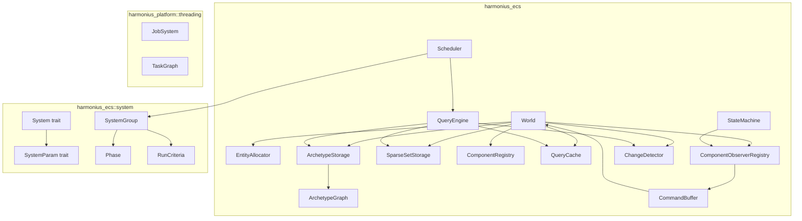
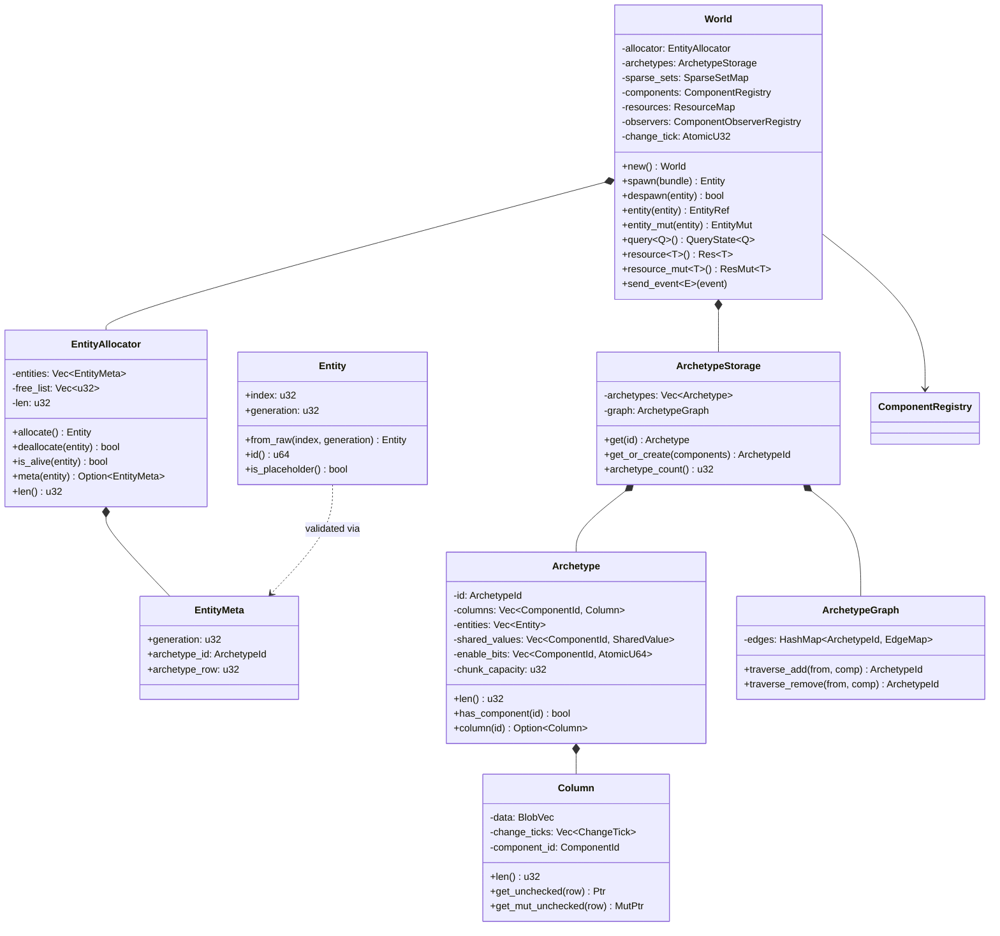
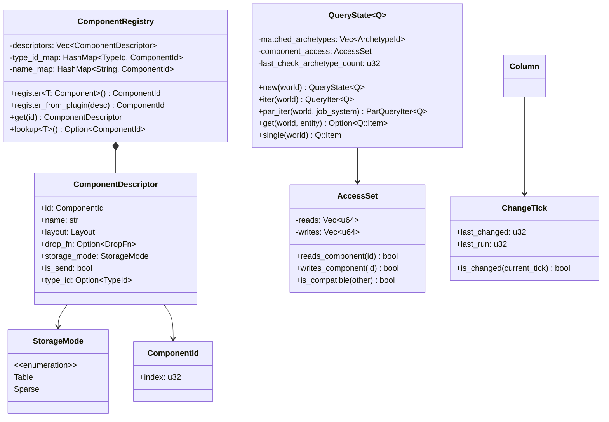
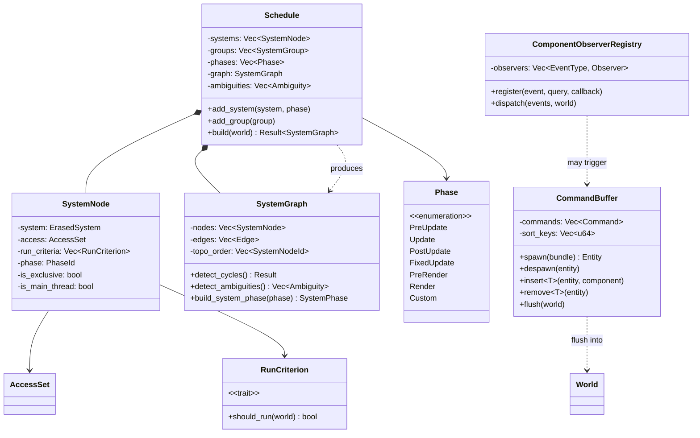
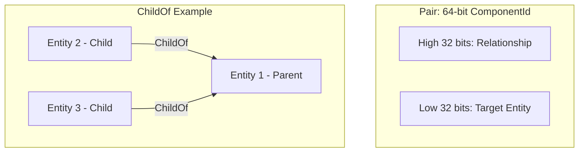
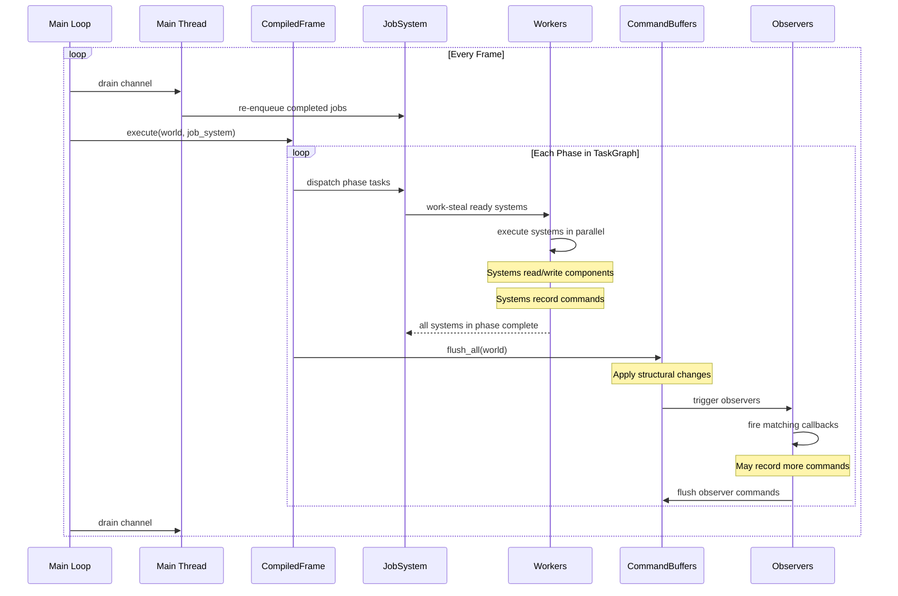
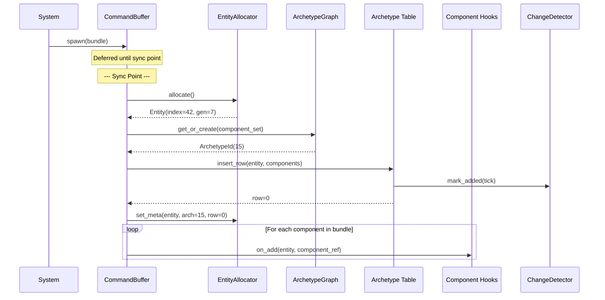
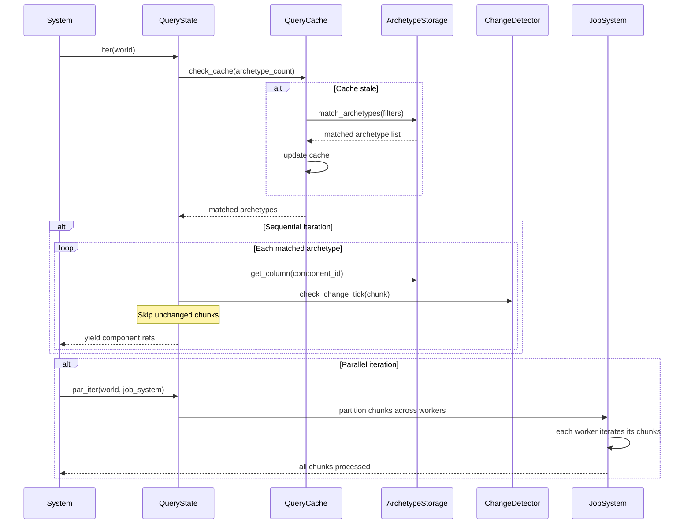
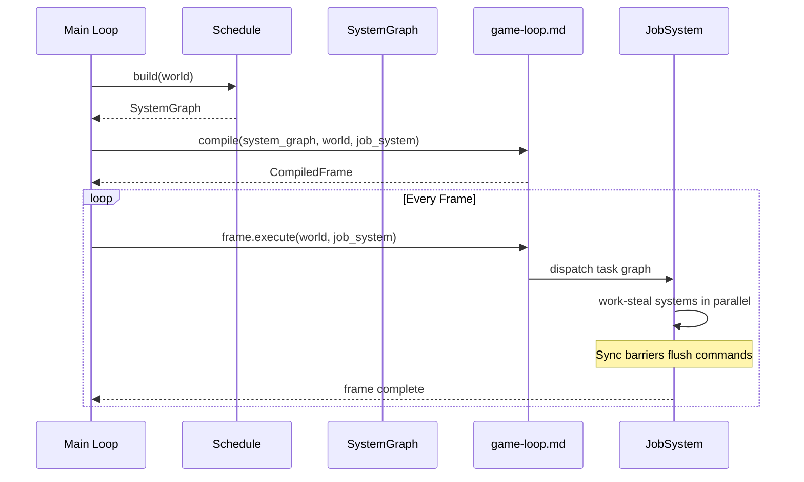

# Entity Component System Design

## Requirements Trace

> **Canonical sources:** Features, requirements, and user stories are defined in
> [features/core-runtime/](../../features/), [requirements/core-runtime/](../../requirements/), and
> [user-stories/core-runtime/](../../user-stories/). The table below traces design elements to those
> definitions.
>
> **Cross-references for shared concepts:**
>
> - `Entity`, `ComponentId`, `ComponentTypeId`, `SystemId`, and all other ID conventions
>   (stability, namespaces, save / hot-reload behavior) are owned by [core-runtime/ids.md](ids.md).
>   This document uses those IDs without re-defining them.
> - `ChangeTick` semantics (tick lifecycle, when the tick increments, how the `Changed<T>` query
>   interacts with system dispatch) are owned by
>   [core-runtime/change-detection.md](change-detection.md). The archetype column ticks defined here
>   implement that contract.

| Feature  | Requirement         |
|----------|---------------------|
| F-1.1.1  | R-1.1.1, R-1.1.1a   |
| F-1.1.2  | R-1.1.2, R-1.1.2a   |
| F-1.1.3  | R-1.1.3, R-1.1.3a   |
| F-1.1.4  | R-1.1.4             |
| F-1.1.5  | R-1.1.5             |
| F-1.1.6  | R-1.1.6             |
| F-1.1.7  | R-1.1.7             |
| F-1.1.8  | R-1.1.8             |
| F-1.1.9  | R-1.1.9, R-1.1.9a   |
| F-1.1.10 | R-1.1.10            |
| F-1.1.11 | R-1.1.11, R-1.1.11a |
| F-1.1.12 | R-1.1.12            |
| F-1.1.13 | R-1.1.13            |
| F-1.1.14 | R-1.1.14            |
| F-1.1.15 | R-1.1.15            |
| F-1.1.16 | R-1.1.16, R-1.1.16a |
| F-1.1.17 | R-1.1.17, R-1.1.17a |
| F-1.1.18 | R-1.1.18            |
| F-1.1.19 | R-1.1.19            |
| F-1.1.20 | R-1.1.20            |
| F-1.1.21 | R-1.1.21            |
| F-1.1.22 | R-1.1.22, R-1.1.22a |
| F-1.1.23 | R-1.1.23            |
| F-1.1.24 | R-1.1.24            |
| F-1.1.25 | R-1.1.25, R-1.1.25a |
| F-1.1.26 | R-1.1.26            |
| F-1.1.27 | R-1.1.27            |
| F-1.1.28 | R-1.1.28            |
| F-1.1.29 | R-1.1.29            |
| F-1.1.30 | R-1.1.30, R-1.1.30a |
| F-1.1.31 | R-1.1.31            |
| F-1.1.32 | R-1.1.32, R-1.1.32a |
| F-1.1.33 | R-1.1.33            |
| F-1.1.34 | R-1.1.34            |
| F-1.1.35 | R-1.1.35, R-1.1.35a |
| F-1.1.36 | R-1.1.36            |
| F-1.1.37 | R-1.1.37            |
| F-1.1.38 | R-1.1.38            |

1. **F-1.1.1** — Archetype-based dense storage, SoA layout, chunked
2. **F-1.1.2** — Sparse-set storage for `#[sparse]` components
3. **F-1.1.3** — Archetype graph with O(1) cached edge transitions
4. **F-1.1.4** — Static (derive) and dynamic component registration
5. **F-1.1.5** — Zero-size tag components
6. **F-1.1.6** — Shared components (one value per chunk)
7. **F-1.1.7** — Buffer components (dynamic arrays per entity)
8. **F-1.1.8** — Enableable components (toggle without migration)
9. **F-1.1.9** — Component hooks (on_add, on_remove, on_set)
10. **F-1.1.10** — Component bundles and required companions
11. **F-1.1.11** — Entity lifecycle with generational indices
12. **F-1.1.12** — Cleanup components and deferred destruction
13. **F-1.1.13** — Entity names and hierarchical path lookup
14. **F-1.1.14** — Entity relationships (pairs)
15. **F-1.1.15** — Relationship properties (Exclusive, Symmetric, ...)
16. **F-1.1.16** — Built-in ChildOf hierarchy with cascading delete
17. **F-1.1.17** — Composable archetype queries with caching
18. **F-1.1.18** — Query sorting and grouping
19. **F-1.1.19** — Query variables and pattern matching
20. **F-1.1.20** — Automatic parallel iteration
21. **F-1.1.21** — Component aspects
22. **F-1.1.22** — Tick-based change detection at chunk granularity
23. **F-1.1.23** — World resources (typed singletons)
24. **F-1.1.24** — Non-send resources (main-thread pinned)
25. **F-1.1.25** — Dependency resolution and topological ordering
26. **F-1.1.26** — System groups and phases
27. **F-1.1.27** — System run criteria and conditions
28. **F-1.1.28** — Ambiguity detection
29. **F-1.1.29** — Exclusive systems (full barriers)
30. **F-1.1.30** — Event-triggered observers
31. **F-1.1.31** — Custom entity events with propagation
32. **F-1.1.32** — Deferred structural changes via command buffers
33. **F-1.1.33** — Parallel command recording with sort keys
34. **F-1.1.34** — Multiple independent worlds
35. **F-1.1.35** — Entity migration between worlds
36. **F-1.1.36** — Entity template entities with inheritance
37. **F-1.1.37** — Entity template children and nested entity templates
38. **F-1.1.38** — ECS-integrated state machine

## Overview

The ECS is a custom implementation built from scratch for the Harmonius engine. It draws on bevy_ecs
(0.18+) as a reference implementation for archetype storage, query iteration, system scheduling,
observer dispatch, relationship pairs, and command buffers -- but we own all code and take no
dependency on bevy_ecs. This enables direct integration with our custom job system, the game loop
(see [game-loop.md](game-loop.md)), and the platform I/O layer that would be impossible with
bevy_ecs's private executor and non-replaceable job system.

The ECS is the foundational data model and execution framework for every domain in the Harmonius
engine. All simulation data lives as components, all logic runs as systems, and all state is owned
by a `World`. There are no parallel data stores, no separate physics world, no renderer scene graph
diverging from the ECS. The ECS defines the interoperability contracts consumed by every downstream
design: `Component`, `Entity`, `System`, and `World`.

Key architectural choices:

1. **Archetype table storage** as the default. Components grouped by archetype in contiguous SoA
   arrays within fixed-size chunks (16 KiB default) for cache-friendly iteration.
2. **Sparse-set storage** as an opt-in alternative for high-churn or rarely-queried components,
   avoiding archetype fragmentation.
3. **Archetype graph** with cached edges for O(1) structural transitions when adding or removing
   components.
4. **Generational entity indices** (32-bit index + 32-bit generation) for O(1) allocation,
   deallocation, and stale-reference detection.
5. **Relationship pairs** registered as regular `u32` ComponentIds for hierarchies, entity
   templates, and graph-based data modeling. Each unique (relationship, target) pair is registered
   in the ComponentRegistry, keeping all archetype lookups uniform.
6. **Tick-based change detection** at chunk granularity for reactive patterns like dirty-flag
   propagation and network delta compression.
7. **Automatic system scheduling** via dependency analysis on declared access sets, producing a job
   dependency graph for parallel execution on the custom job system (crossbeam-deque).
8. **Command buffers** for deferred structural changes, flushed at sync points in deterministic
   order.
9. **Observers** for reactive callbacks on component add/remove/change, evaluated during command
   buffer flush.
10. **AoSoA tiled storage** within chunks. Each chunk interleaves tiles of N elements (where N
    matches the platform SIMD width, e.g., 4 for SSE/NEON, 8 for AVX2) so that SIMD lanes map
    directly to consecutive entities without gather/scatter overhead.

**Audio runtime exception.** Per constraints.md, the audio mixer runs on a dedicated real-time
thread with a < 0.5 ms latency budget. ECS components (`AudioSource`, `AudioListener`) bridge game
state to the audio runtime via a lock-free SPSC command queue. The audio thread owns its own mix
buffers and effect chains outside the ECS.

## Architecture

### Module Boundaries



> **Game loop boundary:** `Schedule` in this document produces a `SystemGraph`. The game loop
> compiles that graph into a `CompiledFrame` using its own `GameLoopGraph` type. See
> [game-loop.md](game-loop.md) for compilation of a `Schedule` into a `CompiledFrame` and for all
> phase / task / render-graph wrappers; those types are not owned here.

### File Layout

```text
harmonius_ecs/
├── entity/
│   ├── allocator.rs   # EntityAllocator, free list,
│   │                  # generational index
│   ├── entity.rs      # Entity, EntityMeta
│   └── entity_ref.rs  # EntityRef, EntityMut,
│                      # EntityWorldMut
├── component/
│   ├── component.rs   # Component trait, ComponentId,
│   │                  # StorageMode
│   ├── registry.rs    # ComponentRegistry,
│   │                  # ComponentDescriptor
│   ├── bundle.rs      # Bundle trait, derive macro
│   ├── hooks.rs       # ComponentHooks, HookFn
│   └── info.rs        # ComponentInfo, layout, drop
├── storage/
│   ├── archetype.rs   # Archetype, ArchetypeId,
│   │                  # ArchetypeStorage
│   ├── graph.rs       # ArchetypeGraph, EdgeMap
│   ├── column.rs      # Column, BlobVec
│   ├── chunk.rs       # Chunk, chunk capacity calc
│   ├── sparse_set.rs  # SparseSet, SparseSetMap
│   ├── table.rs       # Table row operations
│   └── shared.rs      # SharedComponentStorage
├── query/
│   ├── state.rs       # QueryState, AccessSet
│   ├── iter.rs        # QueryIter, ParQueryIter
│   ├── filter.rs      # With, Without, Changed,
│   │                  # Added, Option
│   ├── fetch.rs       # WorldQuery, ReadOnlyQuery
│   ├── cache.rs       # QueryCache, incremental
│   │                  # archetype matching
│   └── variable.rs    # QueryVariable,
│                      # PatternMatcher
├── relationship/
│   ├── pair.rs        # RelationPair, pair encoding
│   ├── properties.rs  # Exclusive, Symmetric,
│   │                  # Transitive, Acyclic
│   ├── hierarchy.rs   # ChildOf, parent-child ops
│   └── traversal.rs   # Up, Cascade traversal
├── system/
│   ├── system.rs      # System trait, ErasedSystem
│   ├── param.rs       # SystemParam trait, Res,
│   │                  # ResMut, Query, Commands
│   ├── function.rs    # IntoSystem, function
│   │                  # systems
│   ├── exclusive.rs   # ExclusiveSystem
│   └── criteria.rs    # RunCriterion, conditions
├── schedule/
│   ├── schedule.rs    # Schedule, build, run
│   ├── graph.rs       # SystemGraph, dep analysis,
│   │                  # topo sort
│   ├── phase.rs       # Phase enum, custom phases
│   ├── group.rs       # SystemGroup, nesting
│   └── ambiguity.rs   # AmbiguityDetector
├── observer/
│   ├── observer.rs    # Observer,
│   │                  # ComponentObserverRegistry
│   ├── trigger.rs     # Trigger, OnAdd, OnRemove,
│   │                  # OnSet
│   └── event.rs       # EntityEvent, propagation
├── command/
│   ├── buffer.rs      # CommandBuffer, Command enum
│   └── parallel.rs    # ParallelCommandWriter,
│                      # sort keys
├── world/
│   ├── world.rs       # World, world flags
│   ├── resource.rs    # ResourceMap, Res, ResMut,
│   │                  # NonSend
│   ├── migration.rs   # entity migration between
│   │                  # worlds
│   └── change.rs      # ChangeTick, ChangeDetector
├── entity_template/
│   ├── template.rs    # EntityTemplate tag, IsA
│   │                  # relationship
│   ├── instance.rs    # instantiation, overrides
│   └── slot.rs        # SlotRef, named child
│                      # access
├── state/
│   ├── state.rs       # State trait, NextState
│   └── machine.rs     # OnEnter, OnExit,
│                      # OnTransition
└── aspect/
    └── aspect.rs      # Aspect derive, nested
                       # aspects
```

### Core Data Structures



### Component and Query Data Structures



### System Scheduling Data Structures



### Relationship Pair Encoding



## API Design

### Entity

```rust
/// An entity identifier. 32-bit index + 32-bit
/// generation counter. Total size: 8 bytes.
/// Implements Copy, Clone, Debug, PartialEq, Eq,
/// Hash.
#[derive(
    Clone, Copy, Debug, PartialEq, Eq, Hash,
)]
pub struct Entity {
    index: u32,
    generation: u32,
}

impl Entity {
    /// Sentinel value for "no entity."
    pub const PLACEHOLDER: Entity = Entity {
        index: u32::MAX,
        generation: 0,
    };

    /// Construct from raw parts. Used for
    /// deserialization and tests.
    pub fn from_raw(
        index: u32,
        generation: u32,
    ) -> Self;

    /// Pack into a single u64 for hashing and
    /// storage. Layout: [generation:32][index:32].
    pub fn to_bits(self) -> u64;

    /// Unpack from u64.
    pub fn from_bits(bits: u64) -> Self;

    pub fn index(self) -> u32;
    pub fn generation(self) -> u32;

    pub fn is_placeholder(self) -> bool;
}
```

### Entity Allocator

```rust
/// Metadata for a single entity slot.
pub(crate) struct EntityMeta {
    pub generation: u32,
    pub archetype_id: ArchetypeId,
    pub archetype_row: u32,
}

/// Manages entity allocation and deallocation
/// with generational indices and a free list.
pub(crate) struct EntityAllocator {
    entities: Vec<EntityMeta>,
    free_list: Vec<u32>,
    len: u32,
}

impl EntityAllocator {
    pub fn new() -> Self;

    /// Allocate a new entity. O(1) amortized.
    /// Reuses slots from the free list with an
    /// incremented generation counter.
    pub fn allocate(&mut self) -> Entity;

    /// Deallocate an entity. O(1). Pushes the
    /// slot onto the free list with incremented
    /// generation.
    pub fn deallocate(
        &mut self,
        entity: Entity,
    ) -> bool;

    /// Check whether the entity handle is still
    /// valid. O(1) — compares generation counters.
    pub fn is_alive(&self, entity: Entity) -> bool;

    /// Get metadata for a live entity.
    pub fn meta(
        &self,
        entity: Entity,
    ) -> Option<&EntityMeta>;

    /// Mutable metadata access (for archetype
    /// migration).
    pub fn meta_mut(
        &mut self,
        entity: Entity,
    ) -> Option<&mut EntityMeta>;

    /// Number of live entities.
    pub fn len(&self) -> u32;
}
```

### Component

```rust
/// Identifies a component type. Internally a u32
/// index into the ComponentRegistry.
#[derive(
    Clone, Copy, Debug, PartialEq, Eq, Hash,
)]
pub struct ComponentId(pub(crate) u32);

/// Storage strategy for a component type.
#[derive(
    Clone, Copy, Debug, PartialEq, Eq,
)]
pub enum StorageMode {
    /// Dense archetype table storage (default).
    /// Cache-friendly SoA layout in fixed chunks.
    Table,
    /// Sparse-set storage. Component changes do
    /// not trigger archetype migration.
    Sparse,
}

/// Trait implemented by all component types.
/// Derive via `#[derive(Component)]`.
pub trait Component: Send + Sync + 'static {
    /// Storage mode. Overridden by `#[sparse]`.
    const STORAGE_MODE: StorageMode =
        StorageMode::Table;
}

/// Full descriptor for a registered component.
pub struct ComponentDescriptor {
    pub id: ComponentId,
    pub name: &'static str,
    pub layout: Layout,
    pub drop_fn: Option<unsafe fn(*mut u8)>,
    pub storage_mode: StorageMode,
    pub is_send: bool,
    pub type_id: Option<TypeId>,
}

/// Central registry for all component types.
pub struct ComponentRegistry {
    descriptors: Vec<ComponentDescriptor>,
    type_id_map: HashMap<TypeId, ComponentId>,
    name_map: HashMap<String, ComponentId>,
}

impl ComponentRegistry {
    pub fn new() -> Self;

    /// Register a statically-known component type.
    /// Called once per type; subsequent calls return
    /// the existing ComponentId.
    pub fn register<T: Component>(
        &mut self,
    ) -> ComponentId;

    /// Register a component loaded from a plugin
    /// .dylib at runtime. Caller provides size,
    /// alignment, drop fn, and storage mode.
    pub fn register_from_plugin(
        &mut self,
        desc: ComponentDescriptor,
    ) -> ComponentId;

    /// Look up by Rust TypeId.
    pub fn lookup<T: Component>(
        &self,
    ) -> Option<ComponentId>;

    /// Look up by string name (for scripting).
    pub fn lookup_by_name(
        &self,
        name: &str,
    ) -> Option<ComponentId>;

    /// Get the descriptor for a registered
    /// component.
    pub fn get(
        &self,
        id: ComponentId,
    ) -> &ComponentDescriptor;

    pub fn count(&self) -> u32;
}
```

### Component Hooks

```rust
/// Function signature for component lifecycle
/// hooks. Receives the world, entity, and a
/// pointer to the component data.
pub type HookFn = fn(
    &mut World,
    Entity,
    ComponentId,
);

/// Per-component-type lifecycle hooks.
pub struct ComponentHooks {
    pub on_add: Vec<HookFn>,
    pub on_remove: Vec<HookFn>,
    pub on_set: Vec<HookFn>,
}

impl ComponentHooks {
    pub fn new() -> Self;

    /// Register an on_add hook. Max 16 per type.
    pub fn add_on_add(
        &mut self,
        f: HookFn,
    ) -> Result<(), HookError>;

    /// Register an on_remove hook. Max 16 per
    /// type.
    pub fn add_on_remove(
        &mut self,
        f: HookFn,
    ) -> Result<(), HookError>;

    /// Register an on_set hook. Max 16 per type.
    pub fn add_on_set(
        &mut self,
        f: HookFn,
    ) -> Result<(), HookError>;
}

pub enum HookError {
    /// Exceeded the 16-hook-per-type limit.
    LimitExceeded { component: ComponentId },
}
```

### Bundle

```rust
/// A group of components inserted atomically.
/// Derive via `#[derive(Bundle)]`.
///
/// Bundles are flattened at compile time. The
/// derive macro generates code that inserts each
/// field's component in a single archetype
/// transition.
pub trait Bundle: Send + Sync + 'static {
    /// Component IDs in this bundle, in
    /// declaration order.
    fn component_ids(
        registry: &mut ComponentRegistry,
    ) -> Vec<ComponentId>;

    /// Write all component values into a raw
    /// table row.
    unsafe fn write_components(
        self,
        table_row: &mut TableRow,
        registry: &ComponentRegistry,
    );
}

/// Required companion components. When component
/// A is inserted and its #[require] list includes
/// B, B is auto-inserted with its Default value
/// if not already present.
///
/// Declared via `#[derive(Component)]` attribute:
///   #[require(CollisionLayers)]
///   struct Collider { ... }
```

### Archetype Storage

```rust
/// Identifies an archetype. Index into
/// ArchetypeStorage::archetypes.
#[derive(
    Clone, Copy, Debug, PartialEq, Eq, Hash,
)]
pub struct ArchetypeId(pub(crate) u32);

/// An archetype: a unique combination of component
/// types with contiguous SoA storage.
///
/// **Hot-path constraint:** using a `HashMap` on the
/// archetype hot path is forbidden (constraints.md).
/// Columns, shared values, and enable bits are all
/// stored in sorted `Vec<(ComponentId, ...)>` for
/// deterministic iteration and O(log n) binary
/// search. `ComponentId` is a small dense u32, so
/// the vector length stays short (typically <= 32
/// per archetype) and lookups are cache-friendly.
pub struct Archetype {
    id: ArchetypeId,
    /// One column per non-tag, non-shared component.
    /// Sorted by `ComponentId`. Binary search for
    /// lookup; linear scan during iteration.
    columns: Vec<(ComponentId, Column)>,
    /// Entity list. Index = row in columns.
    entities: Vec<Entity>,
    /// Shared component values (one per chunk).
    /// Sorted by `ComponentId` for determinism.
    shared_values: Vec<(ComponentId, Vec<SharedValue>)>,
    /// Tag component IDs (no column needed).
    /// Sorted Vec for deterministic iteration.
    tags: Vec<ComponentId>,
    /// Enableable component bit arrays. One bit
    /// per entity per enableable component. Sorted
    /// dense store; `Vec<AtomicU64>` payload with
    /// fetch_or / fetch_and for lock-free parallel
    /// toggles.
    enable_bits: Vec<(ComponentId, Vec<AtomicU64>)>,
    /// Chunk capacity computed from component
    /// sizes and platform cache line.
    chunk_capacity: u32,
}

impl Archetype {
    pub fn id(&self) -> ArchetypeId;
    pub fn len(&self) -> u32;
    pub fn is_empty(&self) -> bool;
    pub fn has_component(
        &self,
        id: ComponentId,
    ) -> bool;
    pub fn column(
        &self,
        id: ComponentId,
    ) -> Option<&Column>;
    pub fn column_mut(
        &mut self,
        id: ComponentId,
    ) -> Option<&mut Column>;
    pub fn entities(&self) -> &[Entity];
    pub fn chunk_capacity(&self) -> u32;
    pub fn chunk_count(&self) -> u32;
}

/// Type-erased contiguous column of component
/// data within an archetype.
pub struct Column {
    /// Raw byte storage. Elements are laid out
    /// contiguously with proper alignment.
    data: BlobVec,
    /// Per-chunk change tick. One entry per chunk.
    change_ticks: Vec<ChangeTick>,
    /// Per-entity added tick. One entry per entity.
    added_ticks: Vec<u32>,
    component_id: ComponentId,
    item_layout: Layout,
}

impl Column {
    pub fn len(&self) -> u32;

    /// Get a read pointer to row `index`.
    /// Caller must ensure index is in bounds and
    /// the type matches.
    pub unsafe fn get_unchecked(
        &self,
        index: u32,
    ) -> *const u8;

    /// Get a write pointer to row `index`.
    /// Also marks the containing chunk as changed
    /// for the given tick.
    pub unsafe fn get_mut_unchecked(
        &mut self,
        index: u32,
        change_tick: u32,
    ) -> *mut u8;

    /// Returns the change tick for the chunk
    /// containing `row`.
    pub fn chunk_change_tick(
        &self,
        row: u32,
    ) -> &ChangeTick;
}

/// Manages all archetypes and the archetype graph.
pub struct ArchetypeStorage {
    archetypes: Vec<Archetype>,
    graph: ArchetypeGraph,
}

impl ArchetypeStorage {
    pub fn new() -> Self;

    pub fn get(
        &self,
        id: ArchetypeId,
    ) -> &Archetype;

    pub fn get_mut(
        &mut self,
        id: ArchetypeId,
    ) -> &mut Archetype;

    /// Find or create the archetype for a given
    /// component set.
    pub fn get_or_create(
        &mut self,
        component_ids: &[ComponentId],
        registry: &ComponentRegistry,
    ) -> ArchetypeId;

    pub fn archetype_count(&self) -> u32;
}
```

### Archetype Graph

```rust
/// Directed graph of archetypes. Edges represent
/// single-component add/remove transitions.
/// Edge lookups are O(1) via HashMap caching.
pub struct ArchetypeGraph {
    /// Per-archetype edge map. Key = source
    /// archetype, value = edge map.
    edges: HashMap<ArchetypeId, EdgeMap>,
}

/// Edges from a single archetype node.
struct EdgeMap {
    /// component_id -> target archetype when
    /// adding that component.
    add_edges: HashMap<ComponentId, ArchetypeId>,
    /// component_id -> target archetype when
    /// removing that component.
    remove_edges:
        HashMap<ComponentId, ArchetypeId>,
}

impl ArchetypeGraph {
    pub fn new() -> Self;

    /// Traverse the "add component" edge from
    /// `from`. If the edge is not yet cached,
    /// compute the target archetype, create it
    /// if needed, and cache the edge. O(1)
    /// amortized.
    pub fn traverse_add(
        &mut self,
        from: ArchetypeId,
        component: ComponentId,
        storage: &mut ArchetypeStorage,
        registry: &ComponentRegistry,
    ) -> ArchetypeId;

    /// Traverse the "remove component" edge. Same
    /// caching behavior as traverse_add.
    pub fn traverse_remove(
        &mut self,
        from: ArchetypeId,
        component: ComponentId,
        storage: &mut ArchetypeStorage,
        registry: &ComponentRegistry,
    ) -> ArchetypeId;
}
```

### Sparse-Set Storage

```rust
/// A sparse set for a single component type.
/// Provides O(1) lookup, insert, and remove by
/// entity index. Does not affect archetype
/// identity.
pub struct SparseSet<T: Component> {
    /// Dense array of (entity_index, T) pairs.
    dense: Vec<(u32, T)>,
    /// Sparse array: entity_index -> dense_index.
    /// Uses a paged sparse array to avoid
    /// allocating MAX_ENTITIES entries.
    sparse: PagedSparseArray,
}

impl<T: Component> SparseSet<T> {
    pub fn new() -> Self;

    pub fn get(
        &self,
        entity: Entity,
    ) -> Option<&T>;

    pub fn get_mut(
        &mut self,
        entity: Entity,
    ) -> Option<&mut T>;

    pub fn insert(
        &mut self,
        entity: Entity,
        value: T,
    );

    pub fn remove(
        &mut self,
        entity: Entity,
    ) -> Option<T>;

    pub fn contains(
        &self,
        entity: Entity,
    ) -> bool;

    pub fn len(&self) -> u32;
}

/// Type-erased sparse set for dynamic components.
pub struct ErasedSparseSet { /* ... */ }

/// Map of ComponentId -> ErasedSparseSet for all
/// sparse components in a world.
pub struct SparseSetMap {
    sets: HashMap<ComponentId, ErasedSparseSet>,
}
```

### Change Detection

```rust
/// Per-chunk change tracking. Stores the tick at
/// which the chunk was last mutated and the tick
/// at which the observing system last ran.
/// Size: 8 bytes per component type per chunk.
#[derive(Clone, Copy, Debug)]
pub struct ChangeTick {
    pub last_changed: u32,
}

impl ChangeTick {
    /// Returns true if this chunk was modified
    /// after `last_run` and before or at
    /// `current_tick`.
    pub fn is_changed(
        &self,
        last_run: u32,
        current_tick: u32,
    ) -> bool;
}

/// Global tick counter. Incremented once per
/// system run. Stored in World as AtomicU32.
pub struct ChangeDetector {
    tick: AtomicU32,
}

impl ChangeDetector {
    pub fn new() -> Self;

    /// Increment and return the new tick value.
    /// Called by the scheduler before each system.
    pub fn increment(&self) -> u32;

    /// Current tick value.
    pub fn current(&self) -> u32;
}
```

### Enableable Components

```rust
/// Enableable components can be toggled per entity
/// without structural changes. The component data
/// stays in the archetype table; only a bitmask
/// controls visibility.
///
/// Storage uses `Vec<AtomicU64>` — one bit per
/// entity. Toggling uses `fetch_or` (enable) and
/// `fetch_and` (disable) with Release/Acquire
/// ordering, making it safe from parallel worker
/// threads without command buffers.
///
/// Derive via:
///   #[derive(Component)]
///   #[enableable]
///   struct AiPerception { ... }

impl Archetype {
    /// Check if an enableable component is
    /// currently enabled for the given entity
    /// row.
    pub fn is_enabled(
        &self,
        component: ComponentId,
        row: u32,
    ) -> bool;

    /// Toggle an enableable component. Atomic
    /// operation -- safe from any thread.
    pub fn set_enabled(
        &self,
        component: ComponentId,
        row: u32,
        enabled: bool,
    );
}
```

### Relationships

```rust
/// A relationship pair. Encodes a (Relationship,
/// Target) pair as a single 64-bit ComponentId.
///
/// Layout:
///   High 32 bits: Relationship ComponentId.index
///   Low 32 bits:  Target Entity.index
///
/// Adding (ChildOf, parent_entity) to an entity
/// is equivalent to adding a component whose
/// ComponentId encodes both the relationship type
/// and the target.
#[derive(
    Clone, Copy, Debug, PartialEq, Eq, Hash,
)]
pub struct RelationPair {
    pub relationship: ComponentId,
    pub target: Entity,
}

impl RelationPair {
    /// Encode as a 64-bit component ID.
    pub fn to_component_id(self) -> ComponentId;

    /// Decode from a 64-bit component ID.
    pub fn from_component_id(
        id: ComponentId,
    ) -> Option<Self>;

    /// Wildcard: match any target for this
    /// relationship.
    pub fn wildcard_target(
        relationship: ComponentId,
    ) -> RelationPair;

    /// Wildcard: match any relationship to this
    /// target.
    pub fn wildcard_relationship(
        target: Entity,
    ) -> RelationPair;
}

/// Properties that control relationship behavior.
#[derive(Clone, Debug)]
pub struct RelationshipProperties {
    /// Only one target per relationship per entity.
    pub exclusive: bool,
    /// Auto-add reverse relationship.
    pub symmetric: bool,
    /// A->B->C implies A->C for queries.
    pub transitive: bool,
    /// Prevents cycles. Validated on add.
    pub acyclic: bool,
    /// Enables Up/Cascade traversal.
    pub traversable: bool,
    /// Cleanup policy when the source is deleted.
    pub on_delete: CleanupPolicy,
    /// Cleanup policy when the target is deleted.
    pub on_delete_target: CleanupPolicy,
}

#[derive(Clone, Copy, Debug, PartialEq, Eq)]
pub enum CleanupPolicy {
    /// No action.
    None,
    /// Remove the relationship component.
    Remove,
    /// Delete the entity.
    Delete,
}
```

### Built-In ChildOf Hierarchy

```rust
/// Marker component for the parent-child
/// relationship. Registered with:
///   Acyclic, Traversable,
///   OnDeleteTarget(Delete)
pub struct ChildOf;

impl World {
    /// Set entity as child of parent. Adds
    /// (ChildOf, parent) relationship pair.
    pub fn set_parent(
        &mut self,
        child: Entity,
        parent: Entity,
    ) -> Result<(), HierarchyError>;

    /// Remove parent-child relationship.
    pub fn remove_parent(
        &mut self,
        child: Entity,
    );

    /// Get the parent of an entity, if any.
    pub fn parent(
        &self,
        entity: Entity,
    ) -> Option<Entity>;

    /// Iterate children of an entity.
    pub fn children(
        &self,
        parent: Entity,
    ) -> ChildIter;

    /// Traverse up the parent chain.
    pub fn ancestors(
        &self,
        entity: Entity,
    ) -> AncestorIter;

    /// Traverse down breadth-first from root.
    pub fn descendants(
        &self,
        root: Entity,
    ) -> DescendantIter;
}

pub enum HierarchyError {
    /// Adding this parent would create a cycle.
    CycleDetected {
        child: Entity,
        parent: Entity,
    },
    /// Entity does not exist.
    EntityNotFound(Entity),
    /// Maximum hierarchy depth (256) exceeded.
    DepthExceeded {
        entity: Entity,
        depth: u32,
    },
}
```

### Queries

```rust
/// Read-only component access in a query.
/// Written as `&T` in query tuples.
pub struct Ref<'w, T: Component> {
    value: &'w T,
    ticks: &'w ChangeTick,
}

impl<'w, T: Component> Ref<'w, T> {
    pub fn is_changed(
        &self,
        last_run: u32,
        current_tick: u32,
    ) -> bool;

    pub fn is_added(
        &self,
        last_run: u32,
        current_tick: u32,
    ) -> bool;
}

impl<'w, T: Component> Deref for Ref<'w, T> {
    type Target = T;
    fn deref(&self) -> &T;
}

/// Mutable component access in a query.
/// Written as `&mut T` in query tuples.
pub struct Mut<'w, T: Component> {
    value: &'w mut T,
    ticks: &'w mut ChangeTick,
    current_tick: u32,
}

impl<'w, T: Component> Deref for Mut<'w, T> {
    type Target = T;
    fn deref(&self) -> &T;
}

impl<'w, T: Component> DerefMut for Mut<'w, T> {
    /// Marks the chunk as changed when the value
    /// is mutably accessed.
    fn deref_mut(&mut self) -> &mut T;
}

/// Tracks the set of components read and written
/// by a query or system. Used for borrow safety
/// and dependency analysis.
pub struct AccessSet {
    reads: Vec<u64>,
    writes: Vec<u64>,
}

impl AccessSet {
    pub fn new() -> Self;
    pub fn add_read(&mut self, id: ComponentId);
    pub fn add_write(&mut self, id: ComponentId);
    pub fn reads_component(
        &self,
        id: ComponentId,
    ) -> bool;
    pub fn writes_component(
        &self,
        id: ComponentId,
    ) -> bool;

    /// True if `self` and `other` have no
    /// conflicting accesses (two writes, or read
    /// + write to the same component).
    pub fn is_compatible(
        &self,
        other: &AccessSet,
    ) -> bool;

    /// Merge another AccessSet into this one.
    pub fn extend(&mut self, other: &AccessSet);
}

/// Cached query state. Built once, reused across
/// frames. Incrementally updated when new
/// archetypes are created.
pub struct QueryState<Q: WorldQuery> {
    matched_archetypes: Vec<ArchetypeId>,
    component_access: AccessSet,
    last_check_archetype_count: u32,
    _marker: PhantomData<Q>,
}

impl<Q: WorldQuery> QueryState<Q> {
    /// Build a new cached query.
    pub fn new(world: &World) -> Self;

    /// Sequential iteration over all matching
    /// entities.
    pub fn iter<'w>(
        &mut self,
        world: &'w World,
    ) -> QueryIter<'w, Q>;

    /// Parallel iteration. Partitions work across
    /// JobSystem workers at chunk granularity.
    pub fn par_iter<'w>(
        &mut self,
        world: &'w World,
        job_system: &JobSystem,
        batch_size: u32,
    ) -> ParQueryIter<'w, Q>;

    /// Look up a single entity.
    pub fn get<'w>(
        &mut self,
        world: &'w World,
        entity: Entity,
    ) -> Option<Q::Item<'w>>;

    /// Assert exactly one matching entity.
    pub fn single<'w>(
        &mut self,
        world: &'w World,
    ) -> Q::Item<'w>;

    /// Access set for dependency analysis.
    pub fn access(&self) -> &AccessSet;

    /// Update the archetype match cache if new
    /// archetypes have been created since the last
    /// check. Uses a bloom filter for fast rejection
    /// of non-matching archetypes.
    pub fn update_archetypes(
        &mut self,
        world: &World,
    );
}
```

**Compiled query plans.** `QueryState` caches a compiled query plan built at `QueryState::new` time
and incrementally updated via `update_archetypes`. Each plan includes:

1. **Bloom filter** — O(1) archetype rejection. Rebuilt only when new archetypes are created.
2. **Pre-resolved column offsets** — per matched archetype, the column byte offset for each fetched
   component is stored at plan-build time, eliminating `HashMap` lookups in the hot path.
3. **Prefetch hints** — `core::intrinsics::prefetch_read_data` calls tuned to component sizes and
   AoSoA tile stride, inserted by the monomorphized iterator.
4. **Branchless change detection** — SIMD bitmask comparison of per-chunk `ChangeTick` values. A
   whole register-width batch of chunks is tested in one instruction.
5. **Monomorphized iterators** — `WorldQuery` trait methods are inlined at compile time via
   generics. LLVM sees concrete types end-to-end and can auto-vectorize the inner loop. No virtual
   dispatch, no type erasure in the hot path.

### Query Filters

```rust
/// Include only entities that have component T.
/// Does not fetch T's data.
pub struct With<T: Component>(PhantomData<T>);

/// Exclude entities that have component T.
pub struct Without<T: Component>(
    PhantomData<T>,
);

/// Fetch T if present; yields None otherwise.
/// Does not exclude entities missing T.
pub struct QueryOption<T: Component>(
    PhantomData<T>,
);

/// Include only entities whose component T was
/// mutated since this system last ran.
pub struct Changed<T: Component>(
    PhantomData<T>,
);

/// Include only entities where component T was
/// added since this system last ran.
pub struct Added<T: Component>(
    PhantomData<T>,
);

/// Include disabled enableable components.
pub struct WithDisabled<T: Component>(
    PhantomData<T>,
);

/// Include both enabled and disabled.
pub struct WithPresent<T: Component>(
    PhantomData<T>,
);

// Query tuple example:
// Query<(&Position, &mut Velocity), (
//     With<Enemy>,
//     Without<Dead>,
//     Changed<Health>,
// )>
```

### World Query Trait

```rust
/// Trait for types that can be fetched from a
/// World. Implemented for component references,
/// tuples, filters, Option, and Aspects.
///
/// Safety: implementors must correctly report
/// their AccessSet so the scheduler can prevent
/// conflicting parallel access.
pub unsafe trait WorldQuery {
    /// The item yielded per entity.
    type Item<'w>;

    /// Report read/write access to the AccessSet.
    fn update_access(
        access: &mut AccessSet,
        registry: &ComponentRegistry,
    );

    /// Test whether an archetype matches this
    /// query.
    fn matches_archetype(
        archetype: &Archetype,
        registry: &ComponentRegistry,
    ) -> bool;

    /// Fetch the item for a single entity row.
    /// Safety: caller must ensure row is valid
    /// and access is sound.
    unsafe fn fetch<'w>(
        archetype: &'w Archetype,
        row: u32,
        change_tick: u32,
        last_run: u32,
    ) -> Self::Item<'w>;
}

/// Marker trait for queries that only read.
/// Enables shared parallel access.
pub unsafe trait ReadOnlyWorldQuery:
    WorldQuery {}
```

### Aspect

```rust
/// Derive macro for component aspects. Groups
/// multiple component accesses into a single
/// type parameter.
///
/// ```
/// #[derive(Aspect)]
/// pub struct PhysicsAspect<'w> {
///     pub transform: &'w mut Transform,
///     pub velocity: &'w Velocity,
///     pub mass: &'w Mass,
///     pub rigid_body: &'w RigidBody,
/// }
///
/// // Nested aspect:
/// #[derive(Aspect)]
/// pub struct CharacterAspect<'w> {
///     pub physics: PhysicsAspect<'w>,
///     pub health: &'w Health,
/// }
/// ```
///
/// The derive macro implements WorldQuery for
/// the aspect struct, aggregating the access sets
/// of all fields.
```

### Resources

```rust
/// Type-safe singleton resource stored in World.
/// Accessed via Res<T> (shared) or ResMut<T>
/// (exclusive) system parameters.
pub struct ResourceMap {
    resources:
        HashMap<TypeId, ErasedResourceSlot>,
    non_send:
        HashMap<TypeId, ErasedResourceSlot>,
}

impl ResourceMap {
    pub fn new() -> Self;

    /// Insert a resource. If already present,
    /// replaces and returns the old value.
    pub fn insert<T: Resource>(
        &mut self,
        value: T,
    );

    /// Insert a non-send resource. Must only be
    /// accessed from the game loop thread.
    pub fn insert_non_send<T: Resource>(
        &mut self,
        value: T,
    );

    pub fn get<T: Resource>(
        &self,
    ) -> Option<&T>;

    pub fn get_mut<T: Resource>(
        &mut self,
    ) -> Option<&mut T>;

    pub fn contains<T: Resource>(&self) -> bool;
    pub fn remove<T: Resource>(
        &mut self,
    ) -> Option<T>;
}

/// Marker trait for world resources.
/// **Canonical definition.** `Resource`,
/// `Res<T>`, and `ResMut<T>` are defined here.
/// Other documents cross-reference this section.
pub trait Resource: Send + Sync + 'static {}

/// Shared resource access in a system parameter.
pub struct Res<'w, T: Resource> {
    value: &'w T,
    ticks: &'w ChangeTick,
}

/// Exclusive resource access in a system
/// parameter. Marks the resource as changed when
/// dereferenced mutably.
pub struct ResMut<'w, T: Resource> {
    value: &'w mut T,
    ticks: &'w mut ChangeTick,
    change_tick: u32,
}
```

### System

```rust
/// The core system trait. Systems are the only
/// way to execute logic in the ECS.
pub trait System: Send + Sync + 'static {
    /// Run the system with world access derived
    /// from SystemParam.
    ///
    /// # Safety
    ///
    /// Caller must ensure the `UnsafeWorldCell`
    /// grants access only to the components and
    /// resources declared by `self.access()`.
    /// Concurrent systems must have non-
    /// overlapping access sets validated by the
    /// scheduler before dispatch.
    unsafe fn run(
        &mut self,
        world: UnsafeWorldCell<'_>,
    );

    /// Report the access set for scheduling.
    fn access(&self) -> &AccessSet;

    /// System name for diagnostics.
    fn name(&self) -> &'static str;
}

/// Trait for types that can be used as system
/// parameters. Implementations exist for:
///   Query<Q, F>, Res<T>, ResMut<T>,
///   Commands, EventReader<E>,
///   EventWriter<E>, Local<T>
pub trait SystemParam {
    /// State that persists across system runs.
    type State: Send + Sync + 'static;

    /// The fetched item type for a given world
    /// borrow lifetime.
    type Item<'w>;

    /// Initialize param state.
    fn init_state(
        world: &World,
    ) -> Self::State;

    /// Report access to the AccessSet.
    fn update_access(
        state: &Self::State,
        access: &mut AccessSet,
    );

    /// Fetch the param for this run.
    /// Safety: caller (scheduler) must guarantee
    /// no conflicting access.
    unsafe fn fetch<'w>(
        state: &mut Self::State,
        world: &'w World,
    ) -> Self::Item<'w>;
}

/// Convert a function into a System. Supports
/// functions with up to 16 SystemParam arguments.
///
/// ```
/// fn movement_system(
///     mut query: Query<(
///         &mut Transform,
///         &Velocity,
///     )>,
///     time: Res<Time>,
/// ) {
///     for (mut transform, velocity) in
///         query.iter_mut()
///     {
///         transform.position +=
///             velocity.linear * time.delta();
///     }
/// }
/// ```
pub trait IntoSystem<Params> {
    type System: System;
    fn into_system(self) -> Self::System;
}

/// Systems that require exclusive &mut World
/// access. Run as full barriers in the schedule.
pub trait ExclusiveSystem:
    Send + Sync + 'static
{
    fn run(&mut self, world: &mut World);
    fn name(&self) -> &'static str;
}
```

### Command Buffer

```rust
/// Deferred structural change commands. Each
/// system receives its own Commands handle for
/// recording. Commands are flushed at sync points
/// in deterministic order.
pub struct Commands<'w> {
    buffer: &'w CommandBuffer,
    entities: &'w EntityAllocator,
}

impl<'w> Commands<'w> {
    /// Reserve an entity ID (immediately
    /// available for recording further commands
    /// against). The entity is not truly spawned
    /// until flush.
    pub fn spawn(
        &mut self,
        bundle: impl Bundle,
    ) -> EntityCommands;

    pub fn despawn(&mut self, entity: Entity);

    pub fn entity(
        &mut self,
        entity: Entity,
    ) -> EntityCommands;
}

/// Commands scoped to a specific entity.
/// Uses separate lifetimes: `'a` for the borrow
/// of Commands, `'w` for the world borrow inside
/// Commands. This avoids reborrow conflicts when
/// chaining entity commands.
pub struct EntityCommands<'a, 'w> {
    entity: Entity,
    commands: &'a mut Commands<'w>,
}

impl<'a, 'w> EntityCommands<'a, 'w> {
    pub fn insert(
        &mut self,
        bundle: impl Bundle,
    ) -> &mut Self;

    pub fn remove<T: Component>(
        &mut self,
    ) -> &mut Self;

    pub fn despawn(&mut self);

    /// Set this entity as child of parent.
    pub fn set_parent(
        &mut self,
        parent: Entity,
    ) -> &mut Self;
}

/// The underlying command buffer storage.
pub struct CommandBuffer {
    commands: Vec<Command>,
}

/// A single deferred command.
enum Command {
    Spawn {
        entity: Entity,
        components: ErasedBundle,
    },
    Despawn {
        entity: Entity,
    },
    Insert {
        entity: Entity,
        components: ErasedBundle,
    },
    Remove {
        entity: Entity,
        component_ids: Vec<ComponentId>,
    },
    SetParent {
        child: Entity,
        parent: Entity,
    },
    Custom(Box<dyn FnOnce(&mut World) + Send>),
}

impl CommandBuffer {
    pub fn new() -> Self;

    /// Flush all recorded commands into the world
    /// in recording order. Triggers component
    /// hooks and observer dispatch.
    pub fn flush(&mut self, world: &mut World);

    /// Number of pending commands.
    pub fn len(&self) -> usize;

    /// Memory footprint in bytes.
    pub fn byte_size(&self) -> usize;
}

/// Thread-safe parallel command writer. Multiple
/// workers record into the same logical buffer.
/// Each command carries a sort key for
/// deterministic playback regardless of recording
/// order.
pub struct ParallelCommandWriter {
    /// Per-thread command segments. Merged and
    /// sorted by key at flush time.
    segments: Vec<CommandSegment>,
}

struct CommandSegment {
    commands: Vec<(u64, Command)>,
}

impl ParallelCommandWriter {
    pub fn new(worker_count: u32) -> Self;

    /// Get the writer for a specific worker
    /// thread. Each worker has exclusive access
    /// to its own segment.
    pub fn writer(
        &mut self,
        worker_index: u32,
    ) -> &mut CommandSegment;

    /// Merge all segments, sort by key, and flush.
    pub fn flush(&mut self, world: &mut World);
}
```

### Observer System

> **Rename note (disambiguation):** The ECS component-lifecycle observer registry was previously
> called `ObserverRegistry`. It is now `ComponentObserverRegistry` throughout this document to
> disambiguate from the event-dispatch observer registry (`EventObserverRegistry`) defined in
> [events-plugins.md](events-plugins.md). The two registries have different triggers:
>
> - `ComponentObserverRegistry` fires on component add / remove / set / table events and runs
>   inside `CommandBuffer::flush` at sync points. That is what this section defines.
> - `EventObserverRegistry` fires on user-defined `EventChannel<T>` dispatch and runs at the
>   scheduler's event boundary. See events-plugins.md.
>
> Existing subsystems that spoke of "the observer registry" without qualification were all referring
> to the component-lifecycle variant; references in this document have been updated.

```rust
/// Built-in observer trigger events.
#[derive(
    Clone, Copy, Debug, PartialEq, Eq, Hash,
)]
pub enum ObserverTrigger {
    OnAdd(ComponentId),
    OnRemove(ComponentId),
    OnSet(ComponentId),
    OnTableCreate(ArchetypeId),
    OnTableEmpty(ArchetypeId),
    /// Custom user-defined event type.
    Custom(TypeId),
}

/// An observer registration.
pub struct Observer {
    /// What triggers this observer.
    trigger: ObserverTrigger,
    /// Query filter -- observer only fires for
    /// entities matching this query.
    filter: ErasedQueryFilter,
    /// The callback to execute.
    callback: Box<
        dyn FnMut(&mut World, Entity, &dyn Any)
            + Send
    >,
}

// Observer dispatch is defined in
// [events-plugins.md](events-plugins.md). Event-
// driven observers live there as
// `EventObserverRegistry`. The component-lifecycle
// observer in this doc is
// `ComponentObserverRegistry` and is distinct.
// See the rename note below.

/// Which propagation phase an observer fires in.
/// Capture fires root → target; Bubble fires
/// target → root.
#[derive(Clone, Copy, Debug, PartialEq, Eq)]
pub enum PropagationPhase {
    /// Root-to-target pass (descend before firing).
    Capture,
    /// Target-to-root pass (fire then ascend).
    Bubble,
}

/// Context passed to every entity event observer.
/// Allows the observer to halt further propagation.
pub struct EventContext<'a, E: EntityEvent> {
    pub event: &'a E,
    pub target: Entity,
    pub current: Entity,
    pub phase: PropagationPhase,
    stopped: bool,
}

impl<'a, E: EntityEvent> EventContext<'a, E> {
    /// Stop propagation after this observer returns.
    /// No further observers in this phase will fire.
    pub fn stop_propagation(&mut self) {
        self.stopped = true;
    }
}

/// Custom entity event. Emitted at a specific
/// entity and optionally propagated along
/// relationship edges.
///
/// Both capture (root → target) and bubble
/// (target → root) phases are dispatched.
/// Observers declare which phase they run in via
/// [events-plugins.md](events-plugins.md).
pub trait EntityEvent:
    Send + Sync + 'static
{
    /// Relationship along which to propagate.
    /// None = no propagation.
    fn propagation_relationship(
    ) -> Option<ComponentId> {
        None
    }
}

impl World {
    /// Emit a custom event targeted at an entity.
    /// The event is queued and dispatched at the
    /// next sync point. Observers fire in capture
    /// phase (root → target) then bubble phase
    /// (target → root).
    pub fn emit_event<E: EntityEvent>(
        &mut self,
        entity: Entity,
        event: E,
    );
}
```

### Schedule and Phases

```rust
/// Identifies a system within the schedule.
#[derive(
    Clone, Copy, Debug, PartialEq, Eq, Hash,
)]
pub struct SystemNodeId(pub(crate) u32);

/// Built-in execution phases. Systems are
/// assigned to exactly one phase. Phases execute
/// in order; systems within a phase execute in
/// parallel subject to dependency constraints.
#[derive(
    Clone, Copy, Debug, PartialEq, Eq,
    Hash, PartialOrd, Ord,
)]
pub enum Phase {
    /// Before gameplay logic. Input processing,
    /// time update.
    PreUpdate,
    /// Main gameplay logic.
    Update,
    /// After gameplay. Transform propagation,
    /// event cleanup.
    PostUpdate,
    /// Fixed-timestep simulation. Physics,
    /// networking.
    FixedUpdate,
    /// Before rendering. Visibility, culling,
    /// render proxy extraction.
    PreRender,
    /// Rendering. Command buffer building, draw
    /// submission.
    Render,
    /// User-defined custom phase with explicit
    /// ordering.
    Custom(u32),
}

/// A group of systems that share ordering
/// constraints and can be enabled/disabled as
/// a unit.
pub struct SystemGroup {
    name: &'static str,
    phase: Phase,
    systems: Vec<SystemNodeId>,
    children: Vec<SystemGroup>,
    enabled: bool,
}

/// Run criterion -- a predicate evaluated each
/// frame to gate system execution.
pub trait RunCriterion:
    Send + Sync + 'static
{
    fn should_run(&self, world: &World) -> bool;
}

/// Fixed timestep accumulator criterion.
pub struct FixedTimestep {
    pub step: f64,
    accumulator: f64,
}

impl RunCriterion for FixedTimestep {
    fn should_run(
        &self,
        world: &World,
    ) -> bool;
}

/// Run only when in a specific state.
pub struct InState<S: StateComponent> {
    pub state: S,
}

/// The schedule: owns all systems, groups,
/// phases, and the dependency graph.
pub struct Schedule {
    systems: Vec<ErasedSystem>,
    groups: Vec<SystemGroup>,
    graph: Option<SystemGraph>,
    ambiguities: Vec<Ambiguity>,
}

impl Schedule {
    pub fn new() -> Self;

    /// Add a system to a phase.
    pub fn add_system<S, Params>(
        &mut self,
        system: S,
        phase: Phase,
    ) -> SystemNodeId
    where
        S: IntoSystem<Params>;

    /// Add a system with run criteria.
    pub fn add_system_with_criteria<S, Params>(
        &mut self,
        system: S,
        phase: Phase,
        criteria: Vec<Box<dyn RunCriterion>>,
    ) -> SystemNodeId
    where
        S: IntoSystem<Params>;

    /// Add an exclusive system (full barrier).
    pub fn add_exclusive_system(
        &mut self,
        system: impl ExclusiveSystem,
        phase: Phase,
    ) -> SystemNodeId;

    /// Declare explicit ordering between two
    /// systems.
    pub fn order(
        &mut self,
        before: SystemNodeId,
        after: SystemNodeId,
    );

    /// Add a system group.
    pub fn add_group(
        &mut self,
        group: SystemGroup,
    );

    /// Build the system graph. Performs:
    /// 1. Dependency resolution from access sets
    /// 2. Topological sort
    /// 3. Cycle detection
    /// 4. Ambiguity detection
    ///
    /// Returns a `SystemGraph` that the game loop
    /// then compiles into a `CompiledFrame`. See
    /// [game-loop.md](game-loop.md) for compilation
    /// of a `SystemGraph` into a `CompiledFrame`;
    /// the `GameLoopGraph` / `CompiledFrame` /
    /// `PhaseBody` types are owned by game-loop.md
    /// and are NOT defined in this document.
    pub fn build(
        &self,
        world: &World,
    ) -> Result<SystemGraph, ScheduleError>;
}

pub struct Ambiguity {
    pub system_a: SystemNodeId,
    pub system_b: SystemNodeId,
    pub conflicting_components: Vec<ComponentId>,
}

pub enum ScheduleError {
    CycleDetected {
        cycle: Vec<SystemNodeId>,
    },
    /// A non-send system was assigned to a
    /// parallel phase without main-thread
    /// pinning.
    NonSendConflict {
        system: SystemNodeId,
    },
}
```

### World

```rust
/// Flags controlling which systems a world
/// instantiates.
#[derive(Clone, Copy, Debug, PartialEq, Eq)]
pub enum WorldFlag {
    Game,
    Editor,
    Server,
    Shadow,
    Custom(u32),
}

/// The top-level ECS container. Owns all entity,
/// component, and resource data. Each world is
/// independent -- entities in one world are
/// invisible to queries in another.
pub struct World {
    allocator: EntityAllocator,
    archetypes: ArchetypeStorage,
    sparse_sets: SparseSetMap,
    components: ComponentRegistry,
    resources: ResourceMap,
    /// Component-lifecycle observers. Distinct from
    /// `EventObserverRegistry` in events-plugins.md
    /// (event-dispatch observers). See the rename
    /// note under "Component Observers".
    observers: ComponentObserverRegistry,
    change_detector: ChangeDetector,
    flags: Vec<WorldFlag>,
    id: WorldId,
}

/// **Canonical definition.** `WorldId` is defined
/// here. Other documents cross-reference this.
#[derive(
    Clone, Copy, Debug, PartialEq, Eq, Hash,
)]
pub struct WorldId(pub u32);

impl World {
    pub fn new(
        flags: Vec<WorldFlag>,
    ) -> Self;

    pub fn id(&self) -> WorldId;
    pub fn flags(&self) -> &[WorldFlag];

    // --- Entity operations ---

    /// Spawn an entity with a bundle of
    /// components.
    pub fn spawn(
        &mut self,
        bundle: impl Bundle,
    ) -> Entity;

    /// Spawn an entity with no components.
    pub fn spawn_empty(&mut self) -> Entity;

    /// Despawn an entity. If it has cleanup
    /// components, only non-cleanup components
    /// are removed. Otherwise the entity is fully
    /// destroyed.
    pub fn despawn(
        &mut self,
        entity: Entity,
    ) -> bool;

    /// Read-only entity access.
    pub fn entity(
        &self,
        entity: Entity,
    ) -> Option<EntityRef>;

    /// Mutable entity access.
    pub fn entity_mut(
        &mut self,
        entity: Entity,
    ) -> Option<EntityMut>;

    /// Check if an entity handle is still valid.
    pub fn is_alive(
        &self,
        entity: Entity,
    ) -> bool;

    /// Number of live entities.
    pub fn entity_count(&self) -> u32;

    // --- Query ---

    /// Create a cached query. Call once, reuse
    /// across frames.
    pub fn query<Q: WorldQuery>(
        &self,
    ) -> QueryState<Q>;

    // --- Resources ---

    pub fn insert_resource<T: Resource>(
        &mut self,
        value: T,
    );

    pub fn resource<T: Resource>(
        &self,
    ) -> Option<Res<T>>;

    pub fn resource_mut<T: Resource>(
        &mut self,
    ) -> Option<ResMut<T>>;

    pub fn contains_resource<T: Resource>(
        &self,
    ) -> bool;

    // --- Components ---

    pub fn component_registry(
        &self,
    ) -> &ComponentRegistry;

    pub fn component_registry_mut(
        &mut self,
    ) -> &mut ComponentRegistry;

    // --- Change detection ---

    pub fn change_tick(&self) -> u32;
    pub fn increment_change_tick(&self) -> u32;

    // --- Archetypes ---

    pub fn archetype_count(&self) -> u32;
}
```

### Entity Migration

```rust
/// Transfer entities between worlds. Used for
/// zone transitions in open worlds.
pub struct EntityMigration;

impl EntityMigration {
    /// Migrate a single entity with all its
    /// components from `source` to `target`.
    /// Entity IDs are remapped to avoid
    /// collisions in the target world. Returns
    /// the new Entity handle in the target world.
    ///
    /// Errors if the target world is missing a
    /// component type registration for any of the
    /// entity's components.
    pub fn migrate(
        source: &mut World,
        target: &mut World,
        entity: Entity,
    ) -> Result<Entity, MigrationError>;

    /// Bulk migration for multiple entities.
    /// Returns a mapping from old to new entity
    /// handles for relationship remapping.
    pub fn migrate_batch(
        source: &mut World,
        target: &mut World,
        entities: &[Entity],
    ) -> Result<
        HashMap<Entity, Entity>,
        MigrationError,
    >;
}

pub enum MigrationError {
    /// Entity does not exist in source world.
    EntityNotFound(Entity),
    /// Target world missing a component type
    /// registration.
    MissingComponentType {
        entity: Entity,
        component_name: String,
    },
}
```

### Entity Templates

```rust
/// Marker tag for entity template entities.
pub struct EntityTemplate;

/// Relationship: "this entity is an instance of
/// that entity template." Inherits components from
/// the template. Unwritten components fall through
/// to the template's values. Writing to an
/// inherited component creates a local override
/// (copy-on-write).
pub struct IsA;

impl World {
    /// Instantiate an entity template. Creates a new
    /// entity with an IsA relationship to the
    /// template. Inherited components are shared (not
    /// copied) until overridden.
    pub fn instantiate_template(
        &mut self,
        template: Entity,
    ) -> Entity;

    /// Instantiate an entity template with its child
    /// hierarchy. All children are recursively
    /// instantiated.
    pub fn instantiate_template_hierarchy(
        &mut self,
        template: Entity,
    ) -> Entity;
}

/// Named access to a specific child in an
/// instantiated entity template hierarchy.
pub struct SlotRef {
    pub name: &'static str,
}
```

### State Machine

```rust
/// Trait for state components. Each state type
/// is a component. Transitioning replaces one
/// state component with another.
pub trait StateComponent:
    Component + Clone + PartialEq + Eq
{
}

/// Resource that requests a state transition.
/// Consumed at the next sync point.
pub struct NextState<S: StateComponent> {
    pub state: Option<S>,
}

/// Observer events for state transitions.
pub struct OnEnter<S: StateComponent>(
    PhantomData<S>,
);
pub struct OnExit<S: StateComponent>(
    PhantomData<S>,
);
pub struct OnTransition<S: StateComponent> {
    pub from: S,
    pub to: S,
}

/// Run criterion: system runs only when the
/// world is in the given state.
pub fn in_state<S: StateComponent>(
    state: S,
) -> impl RunCriterion;

/// Sub-state that is active only when its parent
/// state matches.
pub trait SubState: StateComponent {
    type Parent: StateComponent;
    fn should_exist(
        parent: &Self::Parent,
    ) -> bool;
}

/// Computed state derived from multiple state
/// sources.
pub trait ComputedState: StateComponent {
    type Sources;
    fn compute(sources: &Self::Sources) -> Self;
}
```

## Data Flow

### Frame Execution Sequence

The frame is driven by a `CompiledFrame` produced from the game loop's compilation of this
document's `SystemGraph`. See [game-loop.md](game-loop.md) for the compiler. The compiled frame is
reused across frames until the system set changes.



### Entity Spawn via Command Buffer



### Query Execution



### Schedule Build and Execution

The schedule build process runs at startup and whenever the active system set changes. The compiled
frame is reused across frames.

```rust
// --- Schedule Build (startup or system change) ---

let mut schedule = Schedule::new();

// Register systems into phases
schedule.add_system(
    input_system, Phase::PreUpdate,
);
schedule.add_system(
    movement_system, Phase::Update,
);
schedule.add_system(
    physics_step, Phase::FixedUpdate,
);
schedule.add_system(
    transform_propagation, Phase::PostUpdate,
);
schedule.add_system(
    render_extract, Phase::PreRender,
);

// Explicit ordering within a phase
schedule.order(movement_id, collision_id);

// Build the system graph; game-loop.md owns the
// downstream compilation into CompiledFrame.
let system_graph = schedule.build(&world)?;
let frame = game_loop::compile(
    &system_graph, &world, &job_system,
)?;

// --- Frame Execution (reuses CompiledFrame) ---

loop {
    io_channel.drain();
    frame.execute(&mut world, &job_system);
}
```

### Archetype Migration on Component Add

When a system adds a component to an entity, the entity migrates from its current archetype to a new
archetype that includes the added component.

```rust
// Entity currently in Archetype {Position, Velocity}
// System adds Health component via Commands

// At sync point (command flush):
// 1. Resolve target archetype via graph edge:
//    ArchetypeGraph::traverse_add(
//        arch_pos_vel, health_id
//    )
//    Returns Archetype {Position, Velocity, Health}
//    Edge is cached for O(1) future lookups.

// 2. Move entity data:
//    - Copy Position from old archetype row
//      to new archetype row
//    - Copy Velocity from old archetype row
//      to new archetype row
//    - Write Health value to new archetype row

// 3. Swap-remove old row to maintain dense packing.
//    The entity that was in the last row of the
//    old archetype is moved into the vacated slot.

// 4. Update EntityMeta with new archetype_id
//    and archetype_row.

// 5. Fire on_add hook for Health.
```

### Change Detection Flow

```rust
// System A writes to Transform:
for mut transform in query.iter_mut() {
    // Mut<T>::deref_mut() marks the containing
    // chunk's ChangeTick as last_changed =
    // current_tick
    transform.position += delta;
}

// System B reads only changed Transforms:
for transform in query_changed.iter() {
    // Changed<T> filter checks:
    //   chunk.last_changed > system_b.last_run
    //   && chunk.last_changed <= current_tick
    //
    // Skips entire chunks where no Transform was
    // mutated since System B last ran.
    spatial_index.update(entity, &transform);
}
```

### Observer Dispatch During Command Flush

```rust
// During CommandBuffer::flush():
// 1. Apply all commands in order
// 2. Collect pending events:
//    - Spawn entity -> OnAdd for each component
//    - Insert component -> OnAdd
//    - Remove component -> OnRemove
//    - Set component value -> OnSet

// 3. Dispatch to ComponentObserverRegistry:
//    For each event:
//      For each observer matching the event type:
//        If entity matches the observer's query
//          filter:
//          -> Call observer callback

// 4. Observer callbacks may record additional
//    commands via a nested CommandBuffer.
//    These are flushed recursively (with a depth
//    limit of 16 to prevent infinite loops).
```

## Platform Considerations

### Chunk Size by Platform

| Platform | Default Chunk | L1 Cache | Notes |
|----------|-------------|----------|-------|
| Mobile (iOS/Android) | 8 KiB | 32-64 KiB | Smaller L1; conservative sizing |
| Switch handheld | 8 KiB | 32 KiB | Thermal throttling reduces cache effectiveness |
| Switch docked | 16 KiB | 32 KiB | Higher clocks allow larger chunks |
| Desktop | 16 KiB | 32-64 KiB | Default; configurable up to 64 KiB |
| High-end PC | 16-64 KiB | 32-64 KiB | Larger chunks for wider SIMD |

### Parallel Iteration Worker Counts

| Platform | Workers | Partitioning |
|----------|---------|-------------|
| Mobile (4P + 4E) | 2-4 | Chunk-level only |
| Switch handheld | 3 | Chunk-level only |
| Switch docked | 3 | Chunk-level only |
| Desktop (8P + 8E) | 7 (perf cores - 1) | Archetype-level + chunk-level |
| High-end (16P + 16E) | 15 | Archetype-level + chunk-level |

### Concurrent World Limits

| Platform | Max Concurrent Worlds |
|----------|----------------------|
| Mobile | 2 (game + staging) |
| Switch | 3 |
| Desktop | 8 (configurable) |
| High-end | Unlimited |

### Buffer Component Inline Thresholds

| Platform | Inline Threshold | Spill Cap |
|----------|-----------------|-----------|
| Mobile | 128 bytes | 4 KiB before heap spill |
| Switch | 256 bytes | 8 KiB |
| Desktop | 512 bytes | No cap |

### Job System Integration

The ECS scheduler produces a `SystemGraph`. It does NOT directly build a `TaskGraph` or own a
`GameLoopGraph`. Instead, the game loop consumes `SystemGraph` and wraps it inside its own
`GameLoopGraph`, where each ECS phase is compiled into a `PhaseBody::Systems` (see
[game-loop.md](game-loop.md) for the phase wrapper and the compilation pipeline).

```rust
impl Schedule {
    /// Build the system graph from the current
    /// system set. Each phase becomes a sub-graph
    /// of system nodes with dependency edges derived
    /// from access sets.
    ///
    /// The game loop converts this `SystemGraph`
    /// into a `CompiledFrame`; see game-loop.md.
    pub fn build(
        &self,
        world: &World,
    ) -> Result<SystemGraph, ScheduleError>;
}
```

**Execution flow.** The main loop asks the ECS for a `SystemGraph`, hands it to the game loop for
compilation, and then executes the compiled frame each tick:

```rust
// Build once (or when systems change)
let system_graph = schedule.build(&world)?;
let frame = game_loop::compile(
    &system_graph, &world, &job_system,
)?;

// Per-frame execution
loop {
    io_channel.drain();
    frame.execute(&mut world, &job_system);
}
```



**Phase mapping.** Each ECS phase becomes a phase node in the game loop's compiled graph. The
schedule's topological ordering and access-set analysis are preserved within each phase. For the
exact wrapper enum (previously called `PhaseNode`, now `PhaseBody`) see game-loop.md.

| ECS Phase   | game-loop.md phase body   | Scheduling              |
|-------------|---------------------------|-------------------------|
| PreUpdate   | `PhaseBody::Systems`      | Parallel within phase   |
| Update      | `PhaseBody::Systems`      | Parallel within phase   |
| FixedUpdate | `PhaseBody::Systems`      | Fixed timestep gated    |
| PostUpdate  | `PhaseBody::Systems`      | Parallel within phase   |
| PreRender   | `PhaseBody::Systems`      | Parallel within phase   |
| Render      | `PhaseBody::RenderGraph`  | Render pass ordering    |
| Custom(n)   | `PhaseBody::Systems`      | User-defined            |

**Non-send systems** are pinned to the game loop thread by the scheduler. They run at designated
points in the phase, never dispatched to worker threads.

**Parallel query iteration** (`par_iter`) still uses `job_system::scope` internally. The outer
scheduling is driven by the compiled game loop graph, but within a system, `par_iter` splits work
across workers via scoped fork-join. Query borrows from the calling system are valid across worker
tasks without `'static` or `Arc` overhead.

### Alignment and SIMD

All chunk base addresses are 64-byte aligned (cache-line boundary). Component arrays within a chunk
are aligned to the component type's natural alignment. Numeric component types (`f32`, `Vec3`,
`Mat4`) with proper alignment can be processed with SIMD intrinsics without additional alignment
adjustments.

### AoSoA Tiled Storage

Within each chunk, component data is laid out as Array of Structs of Arrays (AoSoA). Rather than a
flat SoA column, data is interleaved in tiles of N entities where N equals the platform SIMD lane
width:

- **SSE/NEON**: N = 4 (128-bit registers, 4 × f32 lanes)
- **AVX2**: N = 8 (256-bit registers, 8 × f32 lanes)
- **SVE2**: N = variable (runtime register length)

Tile width is determined at codegen time from component field types and the target architecture.
Because all user types are statically generated (RF-9), tile size is a compile-time constant — no
runtime branching in the inner loop.

```text
Chunk layout (AVX2, N=8, component = f32):

Tile 0:  [e0.x  e1.x  e2.x  e3.x  e4.x  e5.x  e6.x  e7.x ]  <- 8 × f32, one AVX2 register
         [e0.y  e1.y  e2.y  e3.y  e4.y  e5.y  e6.y  e7.y ]
         [e0.z  e1.z  e2.z  e3.z  e4.z  e5.z  e6.z  e7.z ]
Tile 1:  [e8.x  e9.x  ...                                  ]
         ...
```

This layout allows full SIMD vectorization without gather/scatter: an entire register-width batch of
entity fields is loaded in one instruction. The query iterator advances by N entities per iteration
step. Scalar fallback handles the final partial tile.

### Proposed Dependencies

| Crate               |
|----------------------|
| `crossbeam-channel` |
| `crossbeam-deque`   |
| `glam`              |

1. **`crossbeam-deque`** — Work-stealing deques for the job system
   - **Justification:** Lock-free work distribution for parallel system execution and par_iter
2. **`crossbeam-channel`** — MPMC channels for I/O completion delivery
   - **Justification:** Platform I/O completions drained at frame boundary
3. **`glam`** — Math types (Vec3, Quat, Mat4)
   - **Justification:** SIMD-accelerated math for Transform components and spatial operations

### Codegen and Middleman .dylib

All codegen'd types (components, events, enums, systems, type descriptors, property panels,
blueprint functions, serialization derives) live in a single **middleman .dylib** — not in the
engine binary.

**Engine binary role.** The engine binary is a thin shell: job system, platform I/O, GPU, render
graph, ECS core. It loads the middleman via `libloading` at startup and on hot-reload.

**Hot-reload cycle** (editor only):

1. User changes component schema or blueprint in the visual editor.
2. Codegen regenerates the middleman `.rs` files.
3. Bundled `rustc` recompiles the middleman `.dylib` (incremental — seconds).
4. Engine hot-reloads middleman via `libloading`; calls `register_from_plugin()` for each type.
5. All engine code sees updated types with full static dispatch.

**Shipping.** Everything compiles into one binary with LTO. No `.dylib` at runtime. The codegen step
runs as part of the export build, and the middleman source is compiled directly into the game
binary.

**Single source of truth.** One middleman ensures no type divergence across the engine/editor
boundary. All archetypes, queries, and system access sets reference the same `ComponentId` values
for every codegen'd type.

## Safety Invariants

The following safety-critical invariants must be enforced by the implementation:

### Column Access (Critical)

`Column::get_unchecked` returns `*const u8`. Callers must cast to the correct type. Add
`debug_assert!` comparing `TypeId::of::<T>()` against the column's `ComponentDescriptor::type_id`.
The safe public API (`Column::get<T>`) performs this check unconditionally.

### WorldQuery::fetch Contract (High)

`unsafe fn fetch` requires:

1. Row index is within `archetype.len()`.
2. No structural changes between `matches_archetype` and `fetch`.
3. The `AccessSet` has been validated by the scheduler.

Aliased `&mut` access through concurrent fetch calls is undefined behavior.

### Bundle Write Ordering (High)

`Bundle::write_components` writes fields in the order returned by `component_ids()`. The derive
macro must guarantee field order matches `component_ids()` order. Add `debug_assert!` verifying each
component's offset and layout against `ComponentDescriptor`.

### RelationPair Entity Generation (High)

`RelationPair` encodes only `Entity.index` (32 bits), not the generation. Relationship queries must
validate the target entity's generation against the `EntityAllocator` before returning results.
Stale relationships to despawned-and-reused entities must be detected and cleaned up.

### ComponentDescriptor::drop_fn (High)

`drop_fn: Option<unsafe fn(*mut u8)>` must match the type at the pointer. `register_from_plugin`
callers must provide a `TypeId` witness. Add `debug_assert!` comparing `TypeId` when invoking
`drop_fn`.

### Enableable Components (Critical)

`set_enabled` uses `Vec<AtomicU64>` with `fetch_or`/`fetch_and` (Release/Acquire ordering) for bit
toggles. Callers must ensure the `Vec<AtomicU64>` is sized to cover all entity rows in the
archetype. Growing the bit vector requires exclusive archetype access (during structural changes
only).

### ParallelCommandWriter (High)

`writer(worker_index)` returns `&mut CommandSegment`. Two threads with the same `worker_index`
create aliased `&mut` -- undefined behavior. Use a `!Copy` `WorkerToken` issued once per worker to
enforce unique access, or use `thread_local!` indexing.

### Observer Callbacks (Medium)

Observer dispatch during command buffer flush is sequential (single-threaded at sync points).
Closures need `Send` but not `Sync`. Document this invariant.

## Performance Notes

### Archetype Column Lookup

Archetype columns are stored in `Vec<(ComponentId, Column)>` sorted by `ComponentId`. Using
`HashMap` on the archetype hot path is forbidden (constraints.md). Hot-path iteration relies on
per-archetype column-index caches (assigned at archetype creation); dynamic lookups fall back to
binary search over the sorted vector. This avoids both hash overhead and non-deterministic iteration
order.

## Test Plan

### Unit Tests

| Test                                  | Req       |
|---------------------------------------|-----------|
| `test_entity_allocate_deallocate`     | R-1.1.11  |
| `test_entity_1m_alloc_dealloc`        | R-1.1.11a |
| `test_archetype_soa_layout`           | R-1.1.1   |
| `test_archetype_chunk_alignment`      | R-1.1.1a  |
| `test_sparse_no_migration`            | R-1.1.2   |
| `test_sparse_o1_lookup`               | R-1.1.2a  |
| `test_archetype_graph_edge_cache`     | R-1.1.3   |
| `test_archetype_graph_10k_archetypes` | R-1.1.3a  |
| `test_component_static_registration`  | R-1.1.4   |
| `test_component_dynamic_registration` | R-1.1.4   |
| `test_tag_zero_memory`                | R-1.1.5   |
| `test_shared_component_one_per_chunk` | R-1.1.6   |
| `test_buffer_inline_and_spill`        | R-1.1.7   |
| `test_enableable_toggle`              | R-1.1.8   |
| `test_enableable_parallel_toggle`     | R-1.1.8   |
| `test_hooks_fire_correctly`           | R-1.1.9   |
| `test_hook_limit_16`                  | R-1.1.9a  |
| `test_bundle_atomic_insert`           | R-1.1.10  |
| `test_required_component_auto_add`    | R-1.1.10  |
| `test_cleanup_component_persist`      | R-1.1.12  |
| `test_entity_name_path_lookup`        | R-1.1.13  |
| `test_relationship_pair_encoding`     | R-1.1.14  |
| `test_exclusive_relationship`         | R-1.1.15  |
| `test_symmetric_relationship`         | R-1.1.15  |
| `test_childof_cascade_delete`         | R-1.1.16  |
| `test_childof_cycle_rejection`        | R-1.1.16a |
| `test_childof_256_depth`              | R-1.1.16a |
| `test_query_all_filters`              | R-1.1.17  |
| `test_query_cache_zero_overhead`      | R-1.1.17a |
| `test_query_cache_incremental`        | R-1.1.17a |
| `test_query_sort_stable`              | R-1.1.18  |
| `test_query_variable_pattern`         | R-1.1.19  |
| `test_change_detection_chunk`         | R-1.1.22  |
| `test_change_tick_8_bytes`            | R-1.1.22a |
| `test_resource_res_resmut`            | R-1.1.23  |
| `test_non_send_main_thread`           | R-1.1.24  |
| `test_schedule_dependency_resolution` | R-1.1.25  |
| `test_schedule_cycle_detection`       | R-1.1.25  |
| `test_schedule_phases_order`          | R-1.1.26  |
| `test_run_criteria_gate`              | R-1.1.27  |
| `test_ambiguity_detection`            | R-1.1.28  |
| `test_exclusive_system_barrier`       | R-1.1.29  |
| `test_observer_on_add`                | R-1.1.30  |
| `test_custom_event_propagation`       | R-1.1.31  |
| `test_command_buffer_deterministic`   | R-1.1.32  |
| `test_parallel_command_writer`        | R-1.1.33  |
| `test_multiple_worlds_isolation`      | R-1.1.34  |
| `test_entity_migration`               | R-1.1.35  |
| `test_migration_missing_type_error`   | R-1.1.35a |
| `test_template_inheritance`           | R-1.1.36  |
| `test_nested_template`                | R-1.1.37  |
| `test_state_transition_observers`     | R-1.1.38  |

1. **`test_entity_allocate_deallocate`** — Allocate entity, deallocate, verify generation
   increments. Reallocate at same index, verify old handle is stale.
2. **`test_entity_1m_alloc_dealloc`** — Allocate and deallocate 1M entities. Verify O(1)
   per-operation cost (under 100 ns amortized).
3. **`test_archetype_soa_layout`** — Spawn 1000 entities with (Position, Velocity). Verify
   Position[] and Velocity[] are contiguous in memory via pointer arithmetic.
4. **`test_archetype_chunk_alignment`** — Verify chunk base addresses are 64-byte aligned.
5. **`test_sparse_no_migration`** — Add and remove a `#[sparse]` component 10,000 times. Assert
   archetype ID never changes.
6. **`test_sparse_o1_lookup`** — Lookup sparse component on 100,000 entities. Verify under 200 ns
   per operation.
7. **`test_archetype_graph_edge_cache`** — Spawn 100,000 entities with same components. Verify
   per-entity archetype resolution does not degrade with archetype count.
8. **`test_archetype_graph_10k_archetypes`** — Create 10,000 distinct archetypes. Verify edge lookup
   remains O(1).
9. **`test_component_static_registration`** — Register component via derive macro. Verify zero-cost
   access via TypeId lookup.
10. **`test_component_dynamic_registration`** — Register component at runtime. Attach to entity,
    query, verify correct data.
11. **`test_tag_zero_memory`** — Add zero-size tag to 100,000 entities. Assert zero bytes per entity
    for tag column. Verify `With<Tag>` query works.
12. **`test_shared_component_one_per_chunk`** — Assign same shared value to 10,000 entities. Assert
    stored once. Modify one entity, assert migration.
13. **`test_buffer_inline_and_spill`** — Create buffer component, append past inline threshold.
    Verify spill and return to inline.
14. **`test_enableable_toggle`** — Toggle enableable component. Verify default query excludes
    disabled. Verify `WithDisabled<T>` includes it.
15. **`test_enableable_parallel_toggle`** — Toggle from 8 threads concurrently. Verify no data races
    (run under ThreadSanitizer).
16. **`test_hooks_fire_correctly`** — Register on_add, on_remove, on_set hooks. Perform operations.
    Assert each fires with correct args.
17. **`test_hook_limit_16`** — Register 17 hooks. Verify error on 17th.
18. **`test_bundle_atomic_insert`** — Insert 4-component bundle. Verify all present in single
    archetype transition.
19. **`test_required_component_auto_add`** — Insert Collider (requires CollisionLayers). Verify
    companion auto-added.
20. **`test_cleanup_component_persist`** — Despawn entity with cleanup component. Assert entity
    alive with only cleanup components.
21. **`test_entity_name_path_lookup`** — Build 3-level hierarchy with names. Look up leaf by path.
    Verify O(log n) scaling at 100,000 entities.
22. **`test_relationship_pair_encoding`** — Add (Likes, Apple) and (Likes, Banana). Query (Likes,
    *). Verify both returned.
23. **`test_exclusive_relationship`** — Add second target to exclusive relationship. Verify first
    removed.
24. **`test_symmetric_relationship`** — Add A->B symmetric. Verify B->A auto-added.
25. **`test_childof_cascade_delete`** — Build 4-level hierarchy. Delete root. Assert all descendants
    destroyed.
26. **`test_childof_cycle_rejection`** — Attempt to create a cycle. Verify error returned.
27. **`test_childof_256_depth`** — Build 256-level hierarchy. Verify traversal completes without
    stack overflow.
28. **`test_query_all_filters`** — Construct query with With, Without, Option, Changed, Added.
    Verify correct entity inclusion/exclusion.
29. **`test_query_cache_zero_overhead`** — Run cached query 1,000 times. Verify zero additional
    archetype matching after first.
30. **`test_query_cache_incremental`** — Add new archetype after cache built. Verify cache
    incrementally updates.
31. **`test_query_sort_stable`** — Sort 1,000 entities by value. Verify ascending. Modify 10,
    re-sort. Verify stability.
32. **`test_query_variable_pattern`** — Create parent-child pairs with Boss parents. Query children
    of bosses. Verify correct results.
33. **`test_change_detection_chunk`** — Mutate one entity in chunk of 100. Verify chunk marked
    changed. Next tick without mutations: no results.
34. **`test_change_tick_8_bytes`** — Verify change detection metadata is 8 bytes per component type
    per chunk.
35. **`test_resource_res_resmut`** — Insert resource. Read via Res, write via ResMut. Verify
    scheduler orders correctly.
36. **`test_non_send_game_loop_thread`** — Register non-send resource. Verify system runs on game
    loop thread.
37. **`test_schedule_dependency_resolution`** — Register systems with known deps. Build schedule.
    Verify topological order respects deps.
38. **`test_schedule_cycle_detection`** — Register cyclic systems. Verify error at build time.
39. **`test_schedule_phases_order`** — Register systems in Update and FixedUpdate. Verify execution
    order. Disable group, verify no execution.
40. **`test_run_criteria_gate`** — Attach boolean criterion. Toggle and verify system runs only when
    met. AND compose two criteria.
41. **`test_ambiguity_detection`** — Register read-A and write-A systems without ordering. Verify
    warning.
42. **`test_exclusive_system_barrier`** — Register exclusive system. Verify no concurrent execution.
43. **`test_observer_on_add`** — Register OnAdd observer with query filter. Add component to
    matching and non-matching entities. Verify fires only for matching.
44. **`test_custom_event_propagation`** — Emit DamageEvent at child. Verify observer fires on child,
    then parent.
45. **`test_command_buffer_deterministic`** — Record commands from two systems. Flush. Verify
    deterministic order across repeated runs.
46. **`test_parallel_command_writer`** — Record 100,000 commands from 8 threads. Flush. Verify
    sort-key order. 100 iterations, identical results.
47. **`test_multiple_worlds_isolation`** — Create two worlds. Spawn entities in each. Verify queries
    in one world do not see the other's entities.
48. **`test_entity_migration`** — Create entity with 5 components and relationships. Migrate to new
    world. Verify all data intact, no collisions.
49. **`test_migration_missing_type_error`** — Migrate entity with unregistered component type.
    Verify diagnostic error with type name.
50. **`test_template_inheritance`** — Create entity template with 3 components. Instantiate 100
    instances. Verify sharing. Override one, verify copy-on-write.
51. **`test_nested_template`** — Create nested entity template. Instantiate 10 outer instances.
    Modify inner. Verify propagation.
52. **`test_state_transition_observers`** — Transition from Menu to Playing. Verify OnExit(Menu) and
    OnEnter(Playing) fire. Verify in_state(Playing) criterion works.

### Integration Tests

| Test                              | Req              |
|-----------------------------------|------------------|
| `test_full_frame_cycle`           | R-1.1.25-29      |
| `test_parallel_iteration_scaling` | R-1.1.20         |
| `test_cascade_delete_100k`        | R-1.1.16a        |
| `test_bulk_migration_500`         | R-1.1.35a        |
| `test_schedule_500_systems`       | R-1.1.25a        |
| `test_observer_dispatch_1000`     | R-1.1.30a        |
| `test_command_buffer_100k_flush`  | R-1.1.32a        |
| `test_mixed_storage_query`        | R-1.1.1, R-1.1.2 |

1. **`test_full_frame_cycle`** — Run a complete frame: schedule build, system execution across all
   phases, command flush, observer dispatch. Verify correct world state.
2. **`test_parallel_iteration_scaling`** — Iterate 1M entities on 1, 2, 4, 8 cores. Verify >= 3.5x
   speedup on 4 cores. Run under ThreadSanitizer.
3. **`test_cascade_delete_100k`** — Cascade-delete a 100,000-entity subtree. Verify completion
   within 10 ms.
4. **`test_bulk_migration_500`** — Migrate 500 entities simultaneously. Verify no data loss, no ID
   collisions.
5. **`test_schedule_500_systems`** — Build schedule with 500 systems. Verify construction under 50
   ms. Verify no rebuild on frames without system changes.
6. **`test_observer_dispatch_1000`** — Register 1,000 observers. Fire 100 events matching 10 each.
   Verify O(e*m) scaling.
7. **`test_command_buffer_100k_flush`** — Record 100,000 commands. Verify flush under 1 ms. Verify
   per-system buffer under 64 KiB typical.
8. **`test_mixed_storage_query`** — Query spanning both table and sparse components. Verify correct
   results across both storage modes.

### Benchmarks

| Benchmark | Target | Source |
|-----------|--------|--------|
| Archetype iteration (1M entities, 3 components, 1 core) | >= 500M components/sec | R-1.1.1a |
| Entity allocate + deallocate | < 100 ns each | R-1.1.11a |
| Sparse component lookup | O(1), < 200 ns | R-1.1.2a |
| Archetype graph edge traversal | O(1) amortized | R-1.1.3 |
| Component hook dispatch overhead | < 50 ns per invocation | R-1.1.9a |
| Query cache hit (no new archetypes) | 0 ns matching overhead | R-1.1.17a |
| Parallel iteration speedup (4 cores) | >= 3.5x | R-1.1.20 |
| Schedule build (500 systems) | < 50 ms | R-1.1.25a |
| Command buffer flush (100K commands) | < 1 ms | R-1.1.32a |
| Entity migration | < 10 us per entity | R-1.1.35a |
| Cascade delete (100K subtree) | < 10 ms | R-1.1.16a |

## Design Q & A

**Q1. What is the biggest constraint limiting this design?** What would happen if we lifted that
constraint? What is the best possible solution imaginable without those constraints? What is the
impact of removing them?

The "ECS-primary (~90%)" constraint is the single largest limiting factor. Most engine data lives in
the ECS, but explicit exceptions exist for subsystems where a dedicated data store is essential: the
audio runtime (real-time mixer thread), GPU resource management (descriptor pools, buffer pools),
windowing (platform-native handles), the shader pipeline (compilation caches), and asset processing
internals (import scratch buffers). Physics engines like PhysX and Havok maintain independent
broadphase and solver structures that can be highly optimized in isolation. Relaxing the constraint
further would allow dedicated physics memory layouts (SIMD-friendly solver bodies), separate spatial
indices tuned per subsystem, and vendor-optimized collision pipelines. The impact of removing it
entirely, however, would be data duplication across subsystems, synchronization bugs between
parallel stores, and higher memory footprint at MMO scale. The ECS-primary approach trades peak
per-subsystem performance for global consistency and reduced complexity while carving out narrow
exceptions where a non-ECS store is strictly necessary.

**Q2. How can this design be improved?** Where is it weak? What potential issues will arise? What
trade-offs are we making?

Chunk-granularity change detection (R-1.1.22) introduces false positives: modifying one entity marks
the entire chunk dirty. For components with mixed hot/cold access patterns this wastes work in
downstream systems like network delta compression and spatial index updates. The archetype explosion
problem is another weakness: games with many unique component combinations (e.g., hundreds of status
effects) can create thousands of archetypes, degrading cache locality and query cache invalidation
time. The entity template inheritance model (F-1.1.36) with copy-on-write semantics adds complexity
to the query path since inherited components must be resolved through IsA chains. Adding per-entity
change bitmasks, archetype coalescing heuristics, and lazy template resolution would improve these
areas.

**Q3. Is there a better approach?** If we are not taking it, why not?

A bitset-based ECS (like the `specs` or `shipyard` model) avoids archetype fragmentation entirely by
storing each component type in its own array indexed by entity ID. This eliminates migration costs
and archetype explosion. We chose the archetype model instead because it provides superior cache
locality during iteration: all components for matching entities are contiguous in memory, which
matters for throughput targets like 500M components/sec (R-1.1.1a). The archetype graph with O(1)
edge caching (F-1.1.3) mitigates migration costs, and sparse-set fallback (F-1.1.2) handles
high-churn components. The hybrid approach captures the best of both models.

**Q4. Does this design solve all customer problems?** Are there missing features, requirements, or
user stories? What are they? How would adding them improve the engine? What kinds of games does it
enable?

The design covers the core ECS needs for most game genres but is light on editor-side undo/redo
integration. User stories US-1.1.49 and US-1.1.50 reference entity template editing, but there is no
explicit undo stack that snapshots component state before mutations. This gap affects designers
(P-5) editing entity templates. Additionally, there is no streaming archetype paging feature for
worlds exceeding available RAM, which would be needed for truly massive persistent MMO worlds beyond
the 4M entity limit (R-1.1.11a). Adding entity streaming and undo integration would enable
open-world MMOs and improve the editor workflow for all game genres.

**Q5. Is this design cohesive with the overall engine?** Does it fit? Does it differ from other
modules, and why? How could we make it more cohesive? How can we improve it to meet engine goals?

The ECS design is the backbone and other modules (scene hierarchy F-1.2, spatial index F-1.9, events
F-1.5) depend heavily on it. It aligns well with the engine constraints: static dispatch via
generics, no singletons, composition over inheritance. One cohesion gap is between the ECS command
buffer model (F-1.1.32) and platform I/O: command buffers are synchronous and frame-scoped while I/O
completions arrive via a crossbeam-channel drained at the frame boundary. Bridging these requires
batching I/O completions into command buffers at the channel drain point. Making the command buffer
API aware of I/O completion tokens would improve cohesion between the ECS and the platform I/O
layer.

## Open Questions

1. **Chunk capacity calculation** -- The chunk capacity depends on the sum of component sizes in the
   archetype and the target chunk byte size. Archetypes with many large components may have very
   small chunk capacities (e.g., 2-3 entities per chunk). Should there be a minimum chunk capacity
   floor (e.g., 8 entities)?

2. **Sparse set paging strategy** -- The sparse array in `SparseSet` uses paged allocation to avoid
   allocating a slot for every possible entity index. Page size (e.g., 4096 entries) trades memory
   for lookup speed. Optimal page size depends on entity density patterns.

3. **Observer recursion depth** -- Observers can record commands that trigger further observers when
   flushed. A depth limit of 16 prevents infinite loops, but some valid cascade patterns (e.g., deep
   hierarchy events) may need more depth. Should the limit be configurable?

4. **Query variable compilation** -- Pattern-matching queries with variables (`$parent`, `$target`)
   require a query planner to determine join order. The planner complexity and query planning cost
   at cache-build time need benchmarking to ensure they stay within the 50 ms schedule-build target.

5. **Shared component hash equality** -- Shared components are stored once per unique value per
   chunk. This requires hashing or equality comparison of component values. Large shared components
   (e.g., complex material descriptors) may have expensive equality checks. Should we require
   `Hash + Eq` on shared components, or use a content-addressed approach?

6. **Entity template override granularity** -- Copy-on-write overrides currently operate at the
   whole-component level. A field-level override system (like Unity's entity template property
   overrides) would be more memory efficient but significantly more complex. Is component-level
   granularity sufficient?

7. **Dynamic component performance parity** -- Runtime- registered dynamic components use
   type-erased paths that may be slower than statically-registered components. What is the
   acceptable performance gap? Should dynamic components be excluded from parallel iteration if they
   cannot guarantee Send + Sync?

## Review Feedback

### RF-1: Custom ECS — no bevy_ecs dependency [APPLIED]

Build a custom ECS with full feature parity with bevy_ecs plus the extensions needed for this
engine. bevy_ecs's executor is private, its thread pool (`bevy_tasks`) cannot be replaced with the
custom job system (crossbeam-deque), and its schedule cannot integrate non-ECS nodes (platform I/O
polling, render graph dispatch). A custom ECS integrates cleanly with the game loop's graph (see
[game-loop.md](game-loop.md)) and the custom job system (crossbeam-deque).

Use bevy_ecs (0.18+) source code as a reference implementation during development. Its archetype
storage, query engine, system scheduling, observer dispatch, relationship pairs, and command buffer
designs are battle-tested and inform our implementation — but we own the code and can integrate with
the custom job system (crossbeam-deque), the game loop graph, and platform I/O directly.

The existing design is a strong foundation. The fixes below address specific issues found during
review.

### RF-2: Fix ComponentId sizing for relationship pairs [APPLIED]

`ComponentId` is `u32` but `RelationPair::to_component_id()` encodes 64 bits (high 32 =
relationship, low 32 = target entity index). This is a type-level contradiction.

Options:

1. Make `ComponentId(u64)` — simple, but doubles memory for all component lookups
2. Introduce a separate `PairId(u64)` type — relationships use `PairId`, regular components use
   `ComponentId(u32)`, archetype storage indexes by either
3. Use a `ComponentId(u32)` registry where each unique `(relationship, target)` pair gets its own
   `u32` ID via registration — simpler indexing, but limits total pair count to 4B

Recommend option 3: register each pair as a regular `ComponentId`. The `RelationPair` struct becomes
a convenience for encoding/decoding, but storage uses the registered `u32` ID. This keeps all
archetype lookups uniform.

### RF-3: System::run safety — UnsafeWorldCell [APPLIED]

`System::run(&mut self, world: &World)` takes `&World` but systems that write components need
mutable access to archetype columns via `UnsafeCell`. The safety contract must be explicit.

Adopt the `UnsafeWorldCell<'_>` pattern:

```rust
pub trait System: Send + Sync + 'static {
    /// # Safety
    /// Caller guarantees no aliasing mutable
    /// access — enforced by the scheduler via
    /// AccessSet validation.
    unsafe fn run(
        &mut self,
        world: UnsafeWorldCell<'_>,
    );

    fn access(&self) -> &AccessSet;
    fn name(&self) -> &'static str;
}
```

This makes the unsafe boundary explicit. The scheduler is the only caller, and it validates
non-aliasing through `AccessSet` analysis before dispatching systems to the job system. The safe
public API (`IntoSystem`, function systems, `SystemParam::fetch`) wraps this unsafe call.

Key invariants:

1. Scheduler validates no two parallel systems have overlapping mutable access
2. `UnsafeWorldCell` prevents accidental `&mut World` usage
3. `ParallelCommandWriter` must use `WorkerToken` (not raw `u32` index) to prevent aliasing

### RF-4: Fix enableable component atomicity [APPLIED]

`set_enabled(&self, ...)` claims atomic safety but `FixedBitSet` is not atomic. Replace with
`Vec<AtomicU64>` using `fetch_or`/`fetch_and` (Release/Acquire ordering) for bit toggles. Document
the memory ordering requirements.

Additionally, the `tags` field of `Archetype` was updated from `HashSet<ComponentId>` to a sorted
`Vec<ComponentId>` for deterministic iteration and reduced memory overhead.

### RF-5: Fix EntityCommands lifetime [APPLIED]

`EntityCommands<'a>` holds `commands: &'a mut Commands<'a>` — self-referential borrow that won't
compile. Use separate lifetimes: `EntityCommands<'a, 'w>`.

### RF-6: Replace all Tokio references with platform-native I/O [APPLIED]

The frame execution sequence diagram references "Tokio Runtime" and `runtime.poll()`. The Q&A
section references "Tokio async I/O" and "Tokio runtime." Replace all with platform-native I/O
(io_uring / IOCP / GCD) on the main thread, per constraints.md. (An earlier review recommended
swapping Tokio for `compio`; that recommendation was later superseded — see RF-16.)

### RF-7: Add event capture/bubble phases [APPLIED]

Per feedback (feedback_ecs_events_hierarchy.md), entity events require both capture phase (root →
target) and bubble phase (target → root). The current design only shows bubble. Add
`PropagationPhase` enum and `stop_propagation()` on the event context.

### RF-8: Remove crossbeam-utils and smallvec [APPLIED]

Per constraints.md, `crossbeam-utils` is removed. Use `#[repr(align(64))]` wrapper for cache-line
padding. `smallvec` is also removed per constraints.

### RF-9: Zero reflection — static codegen [APPLIED]

Remove `harmonius_core::reflect` (Reflect trait, TypeRegistry) from the architecture diagram. No
runtime reflection anywhere in the engine.

All user-defined components are created in the visual editor and compiled to static Rust code by the
engine's bundled build pipeline:

1. User defines component schema visually (field names, types, defaults, constraints)
2. Engine generates `.rs` with `#[derive(Component)]`, serde derives, typed getter/setter methods,
   and a static `TypeDescriptor`
3. Bundled Rust toolchain compiles to `.dylib` (incremental — seconds)
4. Engine hot-reloads the library into the running editor
5. Static dispatch everywhere — editor and shipped game

The Rust toolchain is bundled inside the engine installer. Users never see it. Same pattern as
Unreal bundling MSVC or Unity bundling IL2CPP.

Generated code per component:

```rust
// Generated from visual editor schema
#[derive(Component, serde::Serialize,
    serde::Deserialize)]
pub struct HealthComponent {
    hp: f32,
    max_hp: f32,
    regen_rate: f32,
}

impl HealthComponent {
    pub fn hp(&self) -> f32 { self.hp }
    pub fn set_hp(&mut self, v: f32) {
        self.hp = v;
    }
    pub fn max_hp(&self) -> f32 { self.max_hp }
    pub fn set_max_hp(&mut self, v: f32) {
        self.max_hp = v;
    }
    pub fn regen_rate(&self) -> f32 {
        self.regen_rate
    }
    pub fn set_regen_rate(&mut self, v: f32) {
        self.regen_rate = v;
    }
}

/// Static type descriptor for editor UI binding
pub static HEALTH_DESCRIPTOR: TypeDescriptor =
    TypeDescriptor {
        name: "HealthComponent",
        fields: &[
            FieldDescriptor {
                name: "hp",
                ty: FieldType::F32,
                default: FieldDefault::F32(100.0),
            },
            FieldDescriptor {
                name: "max_hp",
                ty: FieldType::F32,
                default: FieldDefault::F32(100.0),
            },
            FieldDescriptor {
                name: "regen_rate",
                ty: FieldType::F32,
                default: FieldDefault::F32(1.0),
            },
        ],
    };
```

Editor property panels bind to generated getters/setters. No offsets, no unsafe, no reflection.

### RF-10: Keep dynamic registration for DLL-loaded components [APPLIED]

The middleman `.dylib` (RF-19) contains all codegen'd types. When the engine hot-reloads the
middleman, it calls `ComponentRegistry::register_from_plugin()` for each type defined there. These
are real compiled Rust types — not reflected types — but must register with the World after loading.

`ComponentRegistry::register_dynamic()` has been renamed to `register_from_plugin()`. After
registration, middleman components are indistinguishable from built-in components.

Remove open question #7 — no performance gap since all plugin components are compiled Rust.

**Deferred to:** plugin system / editor plugin design.

### RF-11: Blueprint system compiles to static Rust [APPLIED]

Visual logic graphs compile to static Rust function calls. Engine generates system functions →
compiled and hot-reloaded. No interpreter, no bytecode VM, no reflection.

**Deferred to:** visual scripting / blueprint design.

### RF-12: Deferred feedback for other designs [APPLIED]

Saved in project memory for inclusion when those designs are reviewed:

1. **Codegen pipeline design** — component schema → Rust codegen → incremental compile → hot-reload.
   TypeDescriptor, FieldDescriptor, getter/setter generation. Bundled Rust toolchain packaging and
   installation.
2. **Visual scripting / blueprint design** — logic graphs compile to static Rust system functions.
   No interpreter, no VM.
3. **Editor / tools design** — property panels bind to generated getters/setters. Undo/redo
   integration with ECS. Component schema editor UI.
4. **Build pipeline design** — final game export compiles all user components and blueprints into
   the shipping binary. AOT compilation for consoles/iOS.
5. **Asset pipeline design** — bridging platform-native I/O completions into ECS command buffers
   at frame poll point (from Q&A Q5).
6. **Plugin system design** — codegen pipeline, middleman `.dylib` hot-reload, plugin-as-data
   packaging convention.

### RF-13: Custom job system replaces Rayon for parallel execution [APPLIED]

All references to Rayon, ThreadPool, and rayon::par_iter in the ECS design must be updated. The ECS
scheduler dispatches systems as jobs to the custom job system (built on crossbeam-deque).
Data-parallel primitives (par_iter, par_for_each, join, scope) are provided by the job system, not
Rayon.

The game loop runs ON a job system worker thread. When it calls scope(), the calling thread
participates in work-stealing. No dedicated game loop thread.

The schedule builds a job dependency graph from system access sets. Independent systems are
dispatched as parallel jobs. Workers work-steal to balance load.

### RF-14: AoSoA tiled storage for SIMD [APPLIED]

Replace pure SoA column storage with AoSoA (Array of Structs of Arrays) tiled to SIMD register
width. Component data for N entities is tiled together in adjacent cache lines, enabling full SIMD
vectorization.

Tile width is determined at compile time by codegen based on component sizes and target architecture
(AVX2 = 8-wide, NEON = 4-wide, SVE2 = variable). This is a unique optimization enabled by our
zero-reflection static codegen approach — no existing ECS can do this because they don't know
component sizes until runtime.

### RF-15: Compiled query plans with bloom filters [APPLIED]

Each query type gets a codegen'd specialized iterator with:

1. Bloom filter for O(1) archetype rejection
2. Pre-resolved column offsets per matched archetype
3. Prefetch hints tuned to component sizes
4. Branchless change detection via SIMD bitmask comparison

No type erasure in the hot path. LLVM sees concrete types end-to-end and can auto-vectorize.

### RF-16: Platform I/O integration [APPLIED]

The ECS integrates with platform-native I/O via the main thread:

1. Main thread polls I/O completions (io_uring / IOCP / GCD)
2. Completions posted as jobs to worker pool via crossbeam-channel
3. Job inserts result components into World
4. ECS systems read results as normal component queries

The frame execution sequence diagram replaces any earlier "Tokio Runtime" or `compio` references
with "Platform I/O" showing the main thread polling completions and posting jobs.

### RF-17: Plugins are data, not DLLs [APPLIED]

Remove the entire DLL/PluginRegistrar concept. Plugins are data packages (component schemas, visual
logic graphs, assets) processed by the codegen pipeline. The engine generates Rust code from all
plugin metadata and compiles everything together into one binary.

This eliminates:

- PluginRegistrar and register_from_plugin() (RF-10 is superseded)
- extern "C" export convention
- DLL hot-loading, dlopen/dlclose/LoadLibrary
- Function pointer registration
- lookup_by_name() for cross-plugin mapping
- All DLL ABI concerns

Cross-plugin queries are fully monomorphized because all types compile together. A query spanning
components from Plugin A and Plugin B has zero indirection — the compiler sees all types in one
compilation unit.

For editing: codegen compiles output to a .dylib internally for hot-reload. This is a private engine
implementation detail, not a user concept. The bundled rustc guarantees ABI consistency.

For shipping: everything compiles into one binary with LTO. Zero DLLs.

### RF-18: All dispatch is static — zero dyn for plugins [APPLIED]

With plugins as data (RF-17), there is no need for dyn Plugin, dyn ObserverCallback at plugin
boundaries, or any trait objects for plugin interop. All plugin code is generated and compiled
together with the engine. The only remaining acceptable uses of dyn are:

- dyn FnOnce / dyn Fn for command buffer closures
- dyn in editor/tool cold paths (not game runtime)

### RF-19: Middleman .dylib for all codegen'd types [APPLIED]

All codegen'd types (components, events, enums, systems, type descriptors, property panels,
blueprint functions, serialization derives) live in a single **middleman .dylib** — not in the
engine binary or directly in plugin .dylibs.

The engine binary is a thin shell (job system, platform I/O, GPU, render graph, ECS core). It loads
the middleman via `libloading`. Plugin .dylibs link against the middleman for shared types.

When users change components, materials, or blueprints:

1. Codegen regenerates the middleman .rs files
2. Bundled rustc recompiles the middleman .dylib
3. Engine hot-reloads middleman via libloading
4. Plugin .dylibs recompiled against updated middleman
5. All code sees updated types with full static dispatch

This ensures one source of truth for all types that cross the engine/plugin boundary. See
constraints.md "Codegen and Hot-Reload Architecture."
