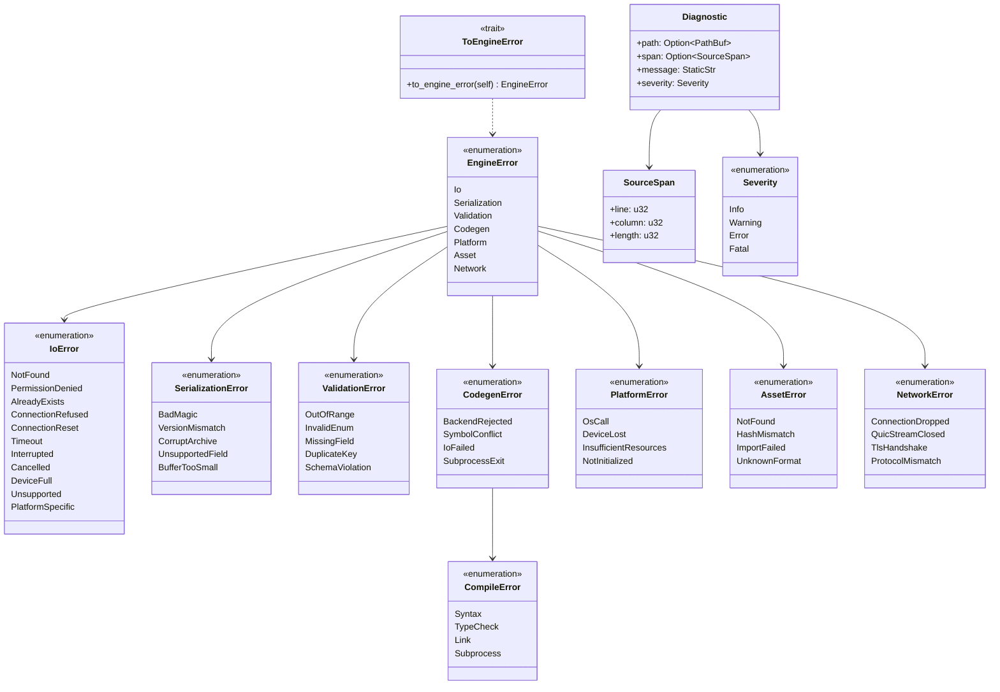
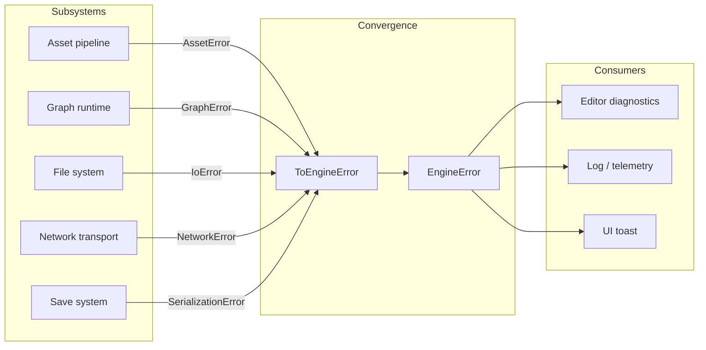
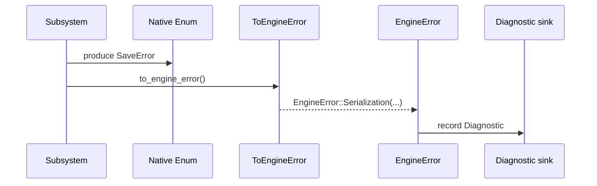

# Error Hierarchy Design

## Requirements Trace

> **Canonical sources:** This document is the single owner of the unified `EngineError` hierarchy.
> It does not rewrite subsystem error enums; each subsystem keeps its own concrete type and converts
> at the boundary. See design review [section 2.5](../design-review.md#25-error-hierarchy) and P1
> task 28.

### Feature Trace

| Feature  | Scope                                                              |
|----------|--------------------------------------------------------------------|
| F-1.12.1 | Unified `EngineError` sum type                                     |
| F-1.12.2 | `ToEngineError` boundary trait                                     |
| F-1.12.3 | Concrete `IoError` variants                                        |
| F-1.12.4 | Concrete `CompileError` variants                                   |
| F-1.12.5 | Diagnostic payload with source location                            |

1. **F-1.12.1** — All cross-subsystem errors converge at `EngineError`
2. **F-1.12.2** — Subsystem enums implement `ToEngineError` for conversion
3. **F-1.12.3** — `IoError` covers platform-native file/network/dma cases
4. **F-1.12.4** — `CompileError` covers graph compile, shader compile, middleman compile
5. **F-1.12.5** — Diagnostics include file path, span, and human-readable message

## Overview

Every subsystem currently declares its own error enum (`SaveError`, `LoadError`, `GraphError`,
`TransitionError`, `ValidationError`, `HotReloadError`, `ImportError`,...) with no shared supertype.
`CompileError`, `IoError`, and `MigrationError` are referenced in other docs but never defined. This
document defines a single `EngineError` sum type as the convergence point and a `ToEngineError`
trait so subsystems keep their native enums.

### Design Goals

| Goal                   | Rationale                                                  |
|------------------------|------------------------------------------------------------|
| Non-invasive           | Existing subsystem enums remain valid                      |
| Enum dispatch          | No `dyn Error` trait objects                               |
| `no_std` compatible    | No `std::error::Error` requirement                         |
| rkyv compatible        | Serializable for editor diagnostics                        |
| Cheap conversion       | `impl From<SubsystemError> for EngineError`                |

## Architecture

### Class Diagram



### Error Flow Across Subsystems



## API Design

```rust
use std::path::PathBuf;
use crate::ids::SymbolId;

/// Sum type over all cross-subsystem error categories. Subsystem-specific
/// enums either implement `From` into this type or `ToEngineError`.
#[derive(Debug)]
pub enum EngineError {
    Io(IoError),
    Serialization(SerializationError),
    Validation(ValidationError),
    Codegen(CodegenError),
    Platform(PlatformError),
    Asset(AssetError),
    Network(NetworkError),
}

/// Boundary conversion trait. Subsystem enums implement this when they
/// cross into shared infrastructure (e.g., editor diagnostics, telemetry).
pub trait ToEngineError {
    fn to_engine_error(self) -> EngineError;
}

impl<T: Into<EngineError>> ToEngineError for T {
    fn to_engine_error(self) -> EngineError { self.into() }
}

// -------- IoError --------------------------------------------------------

#[derive(Debug)]
pub enum IoError {
    NotFound { path: PathBuf },
    PermissionDenied { path: PathBuf },
    AlreadyExists { path: PathBuf },
    ConnectionRefused,
    ConnectionReset,
    Timeout,
    Interrupted,
    Cancelled,
    DeviceFull,
    Unsupported { op: &'static str },
    PlatformSpecific { code: i32 },
}

impl From<IoError> for EngineError {
    fn from(e: IoError) -> Self { EngineError::Io(e) }
}

// -------- SerializationError ---------------------------------------------

#[derive(Debug)]
pub enum SerializationError {
    BadMagic { expected: u32, got: u32 },
    VersionMismatch { expected: u16, got: u16 },
    CorruptArchive { offset: u64 },
    UnsupportedField { name: &'static str },
    BufferTooSmall { required: usize, got: usize },
}

impl From<SerializationError> for EngineError {
    fn from(e: SerializationError) -> Self {
        EngineError::Serialization(e)
    }
}

// -------- ValidationError ------------------------------------------------

#[derive(Debug)]
pub enum ValidationError {
    OutOfRange { field: &'static str },
    InvalidEnum { name: &'static str, got: u32 },
    MissingField { name: &'static str },
    DuplicateKey { name: &'static str },
    SchemaViolation { message: &'static str },
}

impl From<ValidationError> for EngineError {
    fn from(e: ValidationError) -> Self { EngineError::Validation(e) }
}

// -------- CodegenError and CompileError ----------------------------------

#[derive(Debug)]
pub enum CodegenError {
    BackendRejected { reason: &'static str },
    SymbolConflict { symbol: SymbolId },
    IoFailed { path: PathBuf },
    SubprocessExit { code: i32, stderr: String },
    Compile(CompileError),
}

#[derive(Debug)]
pub enum CompileError {
    Syntax { diagnostics: Vec<Diagnostic> },
    TypeCheck { diagnostics: Vec<Diagnostic> },
    Link { missing_symbol: SymbolId },
    Subprocess { exit_code: i32, stderr: String },
}

impl From<CodegenError> for EngineError {
    fn from(e: CodegenError) -> Self { EngineError::Codegen(e) }
}

impl From<CompileError> for CodegenError {
    fn from(e: CompileError) -> Self { CodegenError::Compile(e) }
}

impl From<CompileError> for EngineError {
    fn from(e: CompileError) -> Self {
        EngineError::Codegen(CodegenError::Compile(e))
    }
}

// -------- PlatformError --------------------------------------------------

#[derive(Debug)]
pub enum PlatformError {
    OsCall { call: &'static str, code: i32 },
    DeviceLost,
    InsufficientResources { subsystem: &'static str },
    NotInitialized,
}

impl From<PlatformError> for EngineError {
    fn from(e: PlatformError) -> Self { EngineError::Platform(e) }
}

// -------- AssetError ------------------------------------------------------

#[derive(Debug)]
pub enum AssetError {
    NotFound { asset_id: u64 },
    HashMismatch { expected: u64, got: u64 },
    ImportFailed { reason: &'static str },
    UnknownFormat { ext: &'static str },
}

impl From<AssetError> for EngineError {
    fn from(e: AssetError) -> Self { EngineError::Asset(e) }
}

// -------- NetworkError ---------------------------------------------------

#[derive(Debug)]
pub enum NetworkError {
    ConnectionDropped,
    QuicStreamClosed,
    TlsHandshake { reason: &'static str },
    ProtocolMismatch { expected_version: u16, got_version: u16 },
}

impl From<NetworkError> for EngineError {
    fn from(e: NetworkError) -> Self { EngineError::Network(e) }
}

// -------- Diagnostic ----------------------------------------------------

#[derive(Debug, Clone)]
pub struct Diagnostic {
    pub path: Option<PathBuf>,
    pub span: Option<SourceSpan>,
    pub message: &'static str,
    pub severity: Severity,
}

#[derive(Debug, Clone, Copy)]
pub struct SourceSpan {
    pub line: u32,
    pub column: u32,
    pub length: u32,
}

#[derive(Debug, Clone, Copy)]
pub enum Severity {
    Info,
    Warning,
    Error,
    Fatal,
}
```

### Conversion Matrix

| Subsystem enum            | Route                                               |
|---------------------------|-----------------------------------------------------|
| `SaveError`               | `impl From<SaveError> for SerializationError`       |
| `LoadError`               | `impl From<LoadError> for SerializationError`       |
| `GraphError`              | `impl From<GraphError> for ValidationError`         |
| `TransitionError`         | `impl From<TransitionError> for ValidationError`    |
| `HotReloadError`          | `impl From<HotReloadError> for CodegenError`        |
| `ImportError`             | `impl From<ImportError> for AssetError`             |
| `ShaderCompileError`      | `impl From<ShaderCompileError> for CompileError`    |
| `QuicError`               | `impl From<QuicError> for NetworkError`             |

## Data Flow



## Platform Considerations

Platform-specific error codes surface via `IoError::PlatformSpecific { code }` and
`PlatformError::OsCall { call, code }`. The engine maps Win32 `GetLastError`, POSIX `errno`, and
Mach kern return codes into these variants at the FFI boundary. No platform leakage beyond the
`code` field.

## Test Plan

Full test cases live in [error-test-cases.md](error-test-cases.md). Summary:

| Category    | Scope                                                              |
|-------------|--------------------------------------------------------------------|
| Unit        | Each From impl round-trips into `EngineError`                       |
| Unit        | `Diagnostic` formatting                                             |
| Integration | Asset pipeline error bubbles through EngineError into editor UI    |
| Integration | Save system error produces SerializationError variant               |
| Benchmark   | `EngineError` conversion overhead under 50 ns                       |

## Open Questions

1. Should `EngineError` implement `std::error::Error` gated behind a feature flag?
2. Do we need a `Context` wrapper for adding breadcrumbs?
3. Should `Diagnostic::message` be `Cow<'static, str>` to allow dynamic strings?
4. Should `IoError::PlatformSpecific` carry a platform tag?
5. Should `NetworkError::TlsHandshake` include the server-offered cipher suites for debugging?
