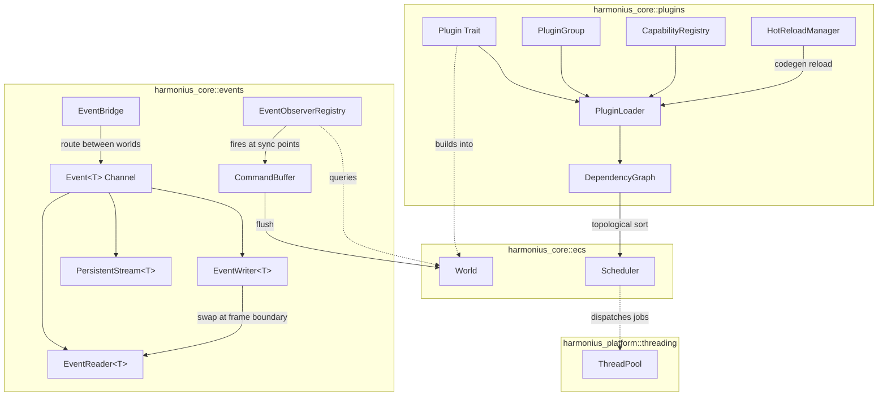
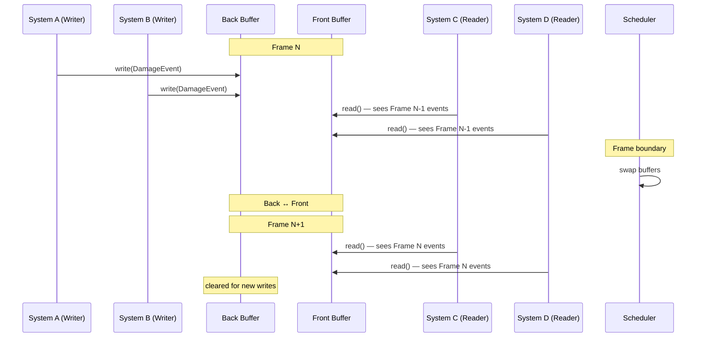
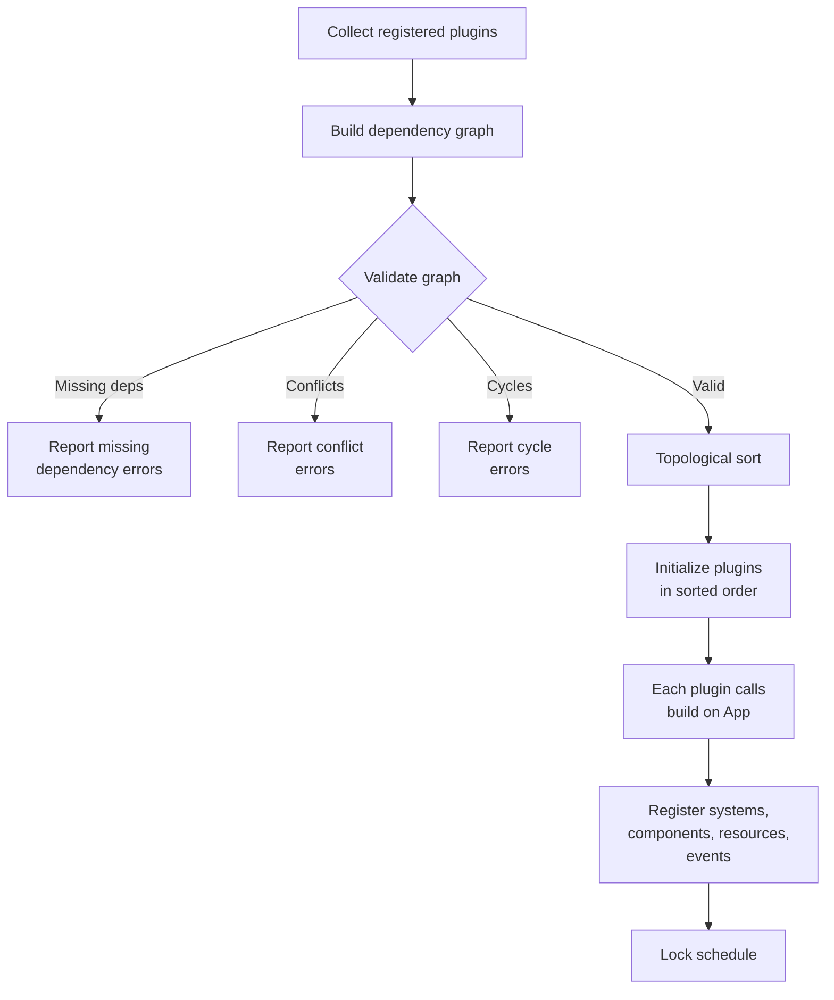
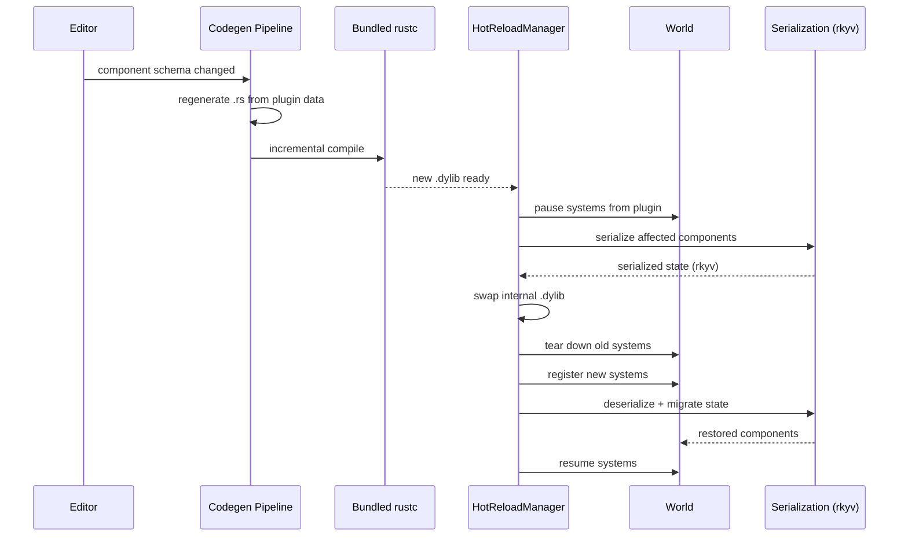
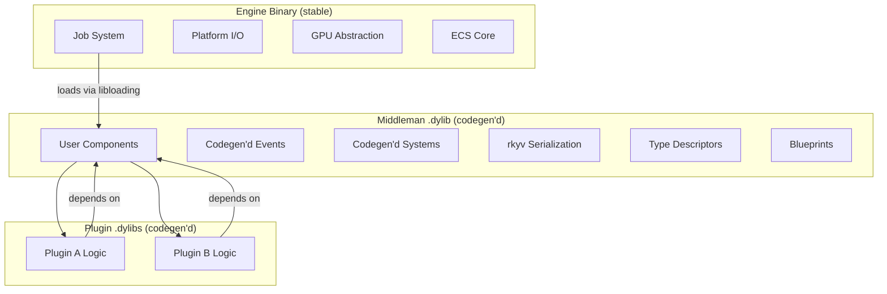
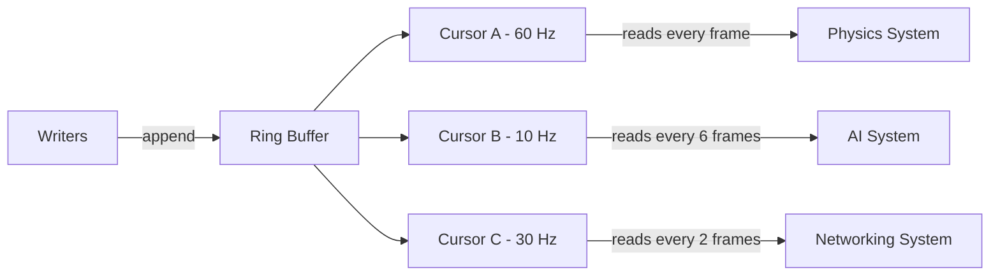
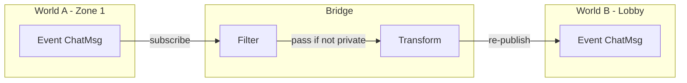
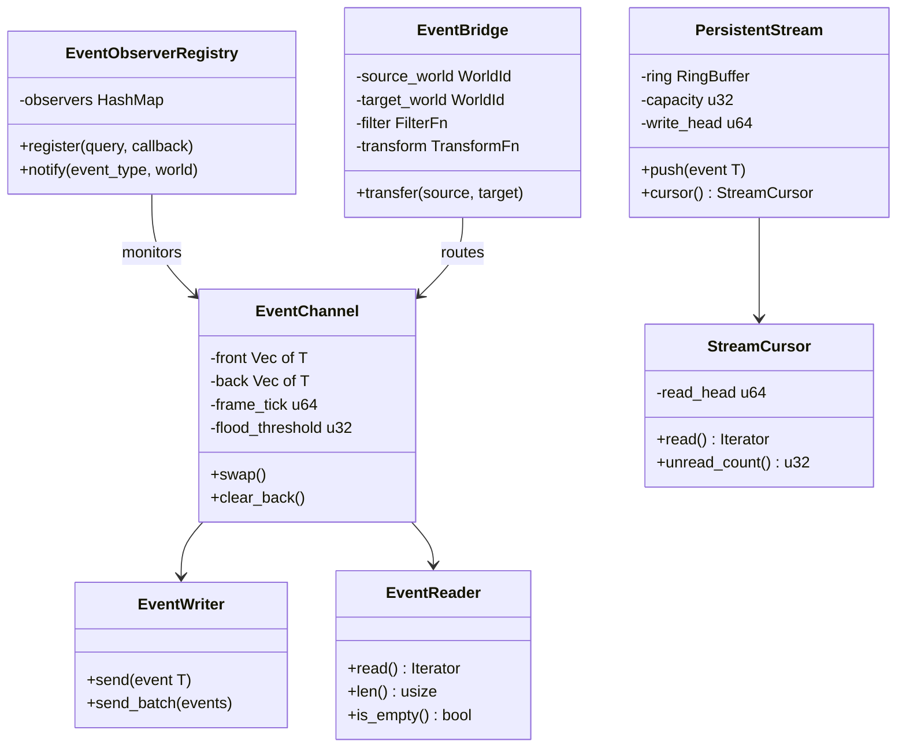

# Events & Plugins Design

## Requirements Trace

> **Canonical sources:** Features, requirements, and user stories are defined in
> [features/core-runtime/](../../features/), [requirements/core-runtime/](../../requirements/), and
> [user-stories/core-runtime/](../../user-stories/). The table below traces design elements to those
> definitions.
>
> **Cross-references for shared concepts:**
>
> - Plugins that register graph-producing systems (logic graphs, material graphs, animation state
>   machines, behavior trees, timelines) depend on the shared graph runtime in
>   [graph-runtime.md](graph-runtime.md). Those plugins contribute nodes, edges, and codegen
>   backends to the `GraphRuntime<N, E>` defined there; they do not reimplement cycle detection,
>   topological sort, or hot-reload barriers locally.
> - Event-dispatch observers registered here (`EventObserverRegistry`) are **distinct** from the
>   ECS component-lifecycle observers (`ComponentObserverRegistry`) defined in [ecs.md](ecs.md). See
>   the rename note in the "Event-Dispatch Observers" section.
> - The hot-reload protocol used by plugin reload is canonically defined in
>   [hot-reload-protocol.md](hot-reload-protocol.md); this document is a client of that protocol.

### Events & Messaging (F-1.5, R-1.5)

| Feature | Requirement       |
|---------|-------------------|
| F-1.5.1 | R-1.5.1, R-1.5.1a |
| F-1.5.2 | R-1.5.2           |
| F-1.5.3 | R-1.5.3           |
| F-1.5.4 | R-1.5.4           |
| F-1.5.5 | R-1.5.5, R-1.5.5a |
| F-1.5.6 | R-1.5.6           |
| F-1.5.7 | R-1.5.7           |

1. **F-1.5.1** — Typed double-buffered event channels with per-type isolation
2. **F-1.5.2** — Persistent event streams with cursor-based reading
3. **F-1.5.3** — Component lifecycle observers at sync points
4. **F-1.5.4** — Deferred command buffers with deterministic flush
5. **F-1.5.5** — Reactive query notifications for system skipping
6. **F-1.5.6** — Typed singleton resources with scheduler integration
7. **F-1.5.7** — Cross-world event bridges with filtering and transform

### Plugin System (F-1.6, R-1.6)

| Feature | Requirement       |
|---------|-------------------|
| F-1.6.1 | R-1.6.1           |
| F-1.6.2 | R-1.6.2           |
| F-1.6.3 | R-1.6.3           |
| F-1.6.4 | R-1.6.4, R-1.6.4a |
| F-1.6.5 | R-1.6.5, R-1.6.5a |
| F-1.6.6 | R-1.6.6           |
| F-1.6.7 | R-1.6.7           |

1. **F-1.6.1** — Declarative plugin registration with automatic ordering
2. **F-1.6.2** — Plugin groups and presets
3. **F-1.6.3** — Explicit dependency and conflict declaration
4. **F-1.6.4** — Topological sort with cycle detection and error quality
5. **F-1.6.5** — Hot reload with state preservation
6. **F-1.6.6** — Semantic versioning and ABI stability metadata
7. **F-1.6.7** — Capability negotiation for optional features

## Overview

This document defines two tightly coupled subsystems:

1. **Events** -- the typed, double-buffered channel infrastructure through which all ECS systems
   communicate. Includes observer dispatch, persistent streams, deferred command buffers, reactive
   queries, and cross-world event bridges.
2. **Plugins** -- the module registration, dependency resolution, and hot-reload mechanism that
   assembles the engine from composable units.

Events and plugins are co-designed because plugins register the systems, components, resources, and
events they contribute. The `Event<T>` channel API is an interoperability contract consumed by every
domain in the engine.

### Design Principles

- **Double-buffered isolation.** Writers never contend with readers. Buffers swap at frame
  boundaries.
- **Static dispatch.** All event channels are monomorphized per type `T`. No trait objects on the
  hot path.
- **Deterministic ordering.** Observer dispatch and command buffer flush follow system execution
  order. Identical inputs produce identical outputs.
- **Topological plugin initialization.** Declared dependencies drive load order. No implicit
  ordering from registration call sequence.
- **ECS-primary (~90%)-based.** Events, resources, and observers are all ECS primitives. No parallel
  data stores.

## Architecture

### Module Boundaries



### File Layout

```text
harmonius_core/
├── events/
│   ├── channel.rs       # EventChannel<T>, double
│   │                    # buffer swap
│   ├── reader.rs        # EventReader<T> system param
│   ├── writer.rs        # EventWriter<T> system param
│   ├── stream.rs        # PersistentStream<T>,
│   │                    # StreamCursor<T>
│   ├── observer.rs      # EventObserverRegistry,
│   │                    # ObserverDescriptor
│   ├── reactive.rs      # ReactiveQuery, archetype
│   │                    # change subscription
│   ├── bridge.rs        # EventBridge, cross-world
│   │                    # routing
│   └── command.rs       # CommandBuffer extensions
│                        # for event send
└── plugins/
    ├── plugin.rs        # Plugin trait, PluginGroup
    ├── app.rs           # App builder, plugin
    │                    # registration
    ├── graph.rs         # DependencyGraph,
    │                    # topological sort
    ├── capability.rs    # CapabilityRegistry,
    │                    # Capability
    ├── hot_reload.rs    # HotReloadManager,
    │                    # codegen reload
    ├── version.rs       # SemVer
    └── error.rs         # PluginError variants
```

### Double-Buffered Event Channel Data Flow



### Observer Dispatch at Sync Points


### Plugin Dependency Resolution



### Plugin Hot Reload Sequence



### Middleman .dylib Architecture

All codegen'd types live in a single **middleman .dylib** — the single source of truth for
everything that crosses the engine/plugin boundary. This avoids numeric ID collisions, open
registration, and ABI mismatches between engine and plugin code.



| Layer | Contents | Recompile trigger |
|-------|----------|-------------------|
| Engine binary | ECS core, job system, platform I/O, GPU | Breaking engine API change |
| Middleman .dylib | All shared types, serialization, blueprints | Any component/event schema change |
| Plugin .dylibs | Plugin-specific logic | Plugin schema or blueprint change |

**Hot-reload flow (editor only):**

1. User modifies component schema in editor.
2. Codegen regenerates middleman `.rs` files.
3. Bundled `rustc` recompiles middleman `.dylib`.
4. Engine hot-reloads middleman via `libloading`.
5. Plugin `.dylibs` recompiled against updated middleman.
6. All code sees updated types with full static dispatch.

**Shipping:** middleman and all plugins are statically linked into one binary with LTO. No `.dylib`
files are shipped with the game.

### Persistent Stream with Cursors



### Cross-World Event Bridge



### Core Data Structures



## API Design

### Selection Guide: `EventChannel<T>` vs `PersistentStream<T>`

The events subsystem offers two delivery primitives. Pick the right one per event type up front;
switching later means rewriting every reader and every writer.

| Primitive             | When to use                                         | Retention                      |
|-----------------------|-----------------------------------------------------|--------------------------------|
| `EventChannel<T>`     | Frame-local events consumed by a few systems       | One frame (double-buffered)    |
| `PersistentStream<T>` | Audit trail or variable-rate consumers (per cursor)| Ring buffer until overwritten  |

1. **Use `EventChannel<T>` (double-buffered)** when every consumer reads the events in the same
   frame they were produced, the producer set is small (usually one), and no cursor tracking is
   needed. Examples: `DamageEvent`, `InputActionEvent`, `UiClickEvent`. Readers drain the front
   buffer once per frame; unread events are discarded at the next frame boundary.
2. **Use `PersistentStream<T>` (ring buffer with cursors)** when at least one consumer runs at a
   different rate than the producer (e.g., a 10 Hz AI system reading 60 Hz perception events), or
   when the event stream is an **audit trail** that replay/telemetry/save needs later. Each reader
   owns an independent `StreamCursor<T>` and can lag arbitrarily far behind, subject to the
   ring-buffer capacity. A cursor that falls behind the ring returns `has_overflowed == true`.

> **Event channel contention:** scheduler dependency analysis guarantees
> **at most one `EventWriter<T>` per frame for any event type `T`**. Registering two systems that
> both declare `EventWriter<T>` is a **compile-time error** produced by the schedule build step.
> Multiple `EventReader<T>` instances are unconstrained — readers never contend with each other or
> with the single writer because the front buffer is immutable for the duration of a frame.

### Event Channel (F-1.5.1, R-1.5.1)

The core abstraction. One channel per event type `T`. Writers append to the back buffer; readers
iterate the front buffer. Buffers swap at the scheduler's frame boundary.

```rust
/// Marker trait for event types.
pub trait Event:
    Send + Sync + Clone + 'static
{
}

/// Double-buffered event channel. One per event
/// type in the World. Not accessed directly —
/// systems use EventReader<T> and EventWriter<T>.
pub(crate) struct EventChannel<T: Event> {
    /// Front buffer: readable by systems this frame.
    front: Vec<T>,
    /// Back buffer: writable by systems this frame.
    back: Vec<T>,
    /// Frame tick at which the last swap occurred.
    frame_tick: u64,
    /// Diagnostic threshold for flood warning.
    flood_threshold: u32,
}

impl<T: Event> EventChannel<T> {
    pub fn new() -> Self;

    /// Swap front and back buffers. Called by the
    /// scheduler at frame boundaries.
    pub(crate) fn swap(&mut self) {
        std::mem::swap(&mut self.front, &mut self.back);
        self.back.clear();
        self.frame_tick += 1;
    }

    /// Number of events in the front (readable)
    /// buffer.
    pub fn front_len(&self) -> usize;

    /// Number of events in the back (writable)
    /// buffer.
    pub fn back_len(&self) -> usize;
}
```

### EventWriter (F-1.5.1)

System parameter for writing events. The scheduler grants `&mut EventChannel<T>` access through the
standard dependency analysis — only one writer system runs at a time per channel.

```rust
/// System parameter: mutable access to the back
/// buffer of Event<T>. Declared in system
/// signatures for scheduler dependency analysis.
pub struct EventWriter<'w, T: Event> {
    channel: &'w mut EventChannel<T>,
}

impl<'w, T: Event> EventWriter<'w, T> {
    /// Send a single event. Appends to the back
    /// buffer. O(1) amortized.
    pub fn send(&mut self, event: T) {
        if self.channel.back.len() as u32
            >= self.channel.flood_threshold
        {
            // Emit diagnostic warning once per
            // frame when threshold exceeded.
        }
        self.channel.back.push(event);
    }

    /// Send a batch of events. More efficient
    /// than individual sends for bulk operations.
    pub fn send_batch(
        &mut self,
        events: impl IntoIterator<Item = T>,
    ) {
        self.channel.back.extend(events);
    }

    /// Send a default-constructed event. Useful
    /// for signal-style events with no payload.
    pub fn send_default(&mut self)
    where
        T: Default,
    {
        self.send(T::default());
    }
}
```

### EventReader (F-1.5.1)

System parameter for reading events. Multiple readers can read the front buffer concurrently with no
contention — the front buffer is immutable during the frame.

```rust
/// System parameter: shared access to the front
/// buffer of Event<T>. Multiple systems may hold
/// EventReader<T> concurrently.
pub struct EventReader<'w, T: Event> {
    channel: &'w EventChannel<T>,
}

impl<'w, T: Event> EventReader<'w, T> {
    /// Iterate all events from the previous frame.
    /// The returned iterator borrows the front
    /// buffer immutably.
    pub fn read(&self) -> impl Iterator<Item = &T> {
        self.channel.front.iter()
    }

    /// Number of events available to read.
    pub fn len(&self) -> usize {
        self.channel.front.len()
    }

    /// True if no events are available.
    pub fn is_empty(&self) -> bool {
        self.channel.front.is_empty()
    }
}
```

### Persistent Event Streams (F-1.5.2, R-1.5.2)

For systems running at different tick rates. Events are retained in a ring buffer across frames.
Each reader owns an independent cursor.

```rust
/// Ring-buffer-backed event stream that retains
/// events across multiple frames. Each reader
/// maintains an independent cursor.
pub struct PersistentStream<T: Event> {
    ring: RingBuffer<T>,
    /// Maximum events retained before oldest are
    /// overwritten. Platform-dependent defaults.
    capacity: u32,
    /// Monotonic write counter.
    write_head: u64,
}

impl<T: Event> PersistentStream<T> {
    pub fn new(capacity: u32) -> Self;

    /// Append an event. If the ring is full, the
    /// oldest event is overwritten.
    pub fn push(&mut self, event: T);

    /// Create a new cursor positioned at the
    /// current write head (reads nothing until
    /// new events arrive).
    pub fn cursor(&self) -> StreamCursor<T>;

    /// Create a cursor positioned at the oldest
    /// retained event (reads the entire backlog).
    pub fn cursor_from_oldest(
        &self,
    ) -> StreamCursor<T>;
}

/// Independent read cursor into a PersistentStream.
/// Each cursor advances at its own pace.
pub struct StreamCursor<T: Event> {
    read_head: u64,
    _marker: PhantomData<T>,
}

impl<T: Event> StreamCursor<T> {
    /// Read all events since this cursor's last
    /// read position. Advances the cursor.
    pub fn read<'s>(
        &mut self,
        stream: &'s PersistentStream<T>,
    ) -> impl Iterator<Item = &'s T>;

    /// Number of unread events.
    pub fn unread_count(
        &self,
        stream: &PersistentStream<T>,
    ) -> u32;

    /// True if the cursor has fallen behind the
    /// ring buffer and events were lost.
    pub fn has_overflowed(
        &self,
        stream: &PersistentStream<T>,
    ) -> bool;
}

/// Platform-specific default capacities.
pub struct StreamConfig {
    /// Maximum events per channel.
    pub capacity: u32,
    /// Maximum concurrent channels.
    pub max_channels: u32,
}

impl StreamConfig {
    /// Mobile: 4K events, 64 channels.
    pub fn mobile() -> Self;
    /// Switch: 8K events, 128 channels.
    pub fn switch() -> Self;
    /// Desktop: 32K events, configurable channels.
    pub fn desktop() -> Self;
}
```

### Event-Dispatch Observers (F-1.5.3, R-1.5.3)

> **Rename note (disambiguation):** This registry is now `EventEventObserverRegistry`. It dispatches
> observers at **event-boundary** sync points on behalf of the events subsystem — observers that
> fire when a `ComponentEvent` is emitted through the event channel, observers that route
> cross-world events via `EventBridge`, and observers registered via the plugin API. It is
> **distinct** from the `ComponentEventObserverRegistry` defined in [ecs.md](ecs.md), which runs
> inside `CommandBuffer::flush` on the raw archetype-level add/remove events.
>
> Both registries can sit in the same `World`; they exist because they answer different questions:
>
> - `ComponentEventObserverRegistry` (ecs.md): "a component was written to the world — who fires?"
> - `EventEventObserverRegistry` (events-plugins.md): "an `EventChannel<ComponentEvent>` payload
>   reached the dispatch boundary — who fires?"
>
> Existing subsystems that said "`EventObserverRegistry`" without qualification meant the event-
> dispatch variant when they were reading the events subsystem API and the component-lifecycle
> variant when they were reading the ECS core API.

Observers fire at sync points during event dispatch. They differ from component hooks (F-1.1.9) in
that observers match multi-term queries and are deferred, making them safe for structural changes.

```rust
/// Canonical component lifecycle event enum.
/// Also used by the ECS ObserverTrigger system
/// (see ecs.md).
#[derive(Clone, Copy, Debug, PartialEq, Eq)]
pub enum ComponentEvent {
    Added,
    Removed,
    Mutated,
    TableCreated,
    StateTransition,
}

/// Descriptor for a registered observer.
pub struct ObserverDescriptor {
    /// Component type(s) this observer watches.
    /// Fixed capacity of 4; most observers watch
    /// 1-2 components.
    pub watched_components: Vec<TypeId>,
    /// Which lifecycle events trigger this observer.
    /// Fixed capacity of 3 covers all common
    /// combinations.
    pub triggers: Vec<ComponentEvent>,
    /// Optional query filter for matching entities.
    pub query_filter: Option<QueryDescriptor>,
    /// Priority for ordering among observers that
    /// match the same event. Lower runs first.
    pub priority: i32,
}

/// Registry of all active event-dispatch observers.
/// Owned by the World. Distinct from
/// `ComponentObserverRegistry` in ecs.md — see the
/// rename note at the top of this section.
pub struct EventObserverRegistry {
    /// Sorted map from ComponentTypeId to the
    /// observers watching that component. A sorted
    /// `Vec<(ComponentTypeId, Vec<_>)>` is used
    /// instead of a `HashMap` per constraints.md
    /// (no HashMap on hot paths).
    observers:
        Vec<(ComponentTypeId, Vec<ObserverEntry>)>,
}

struct ObserverEntry {
    descriptor: ObserverDescriptor,
    /// The callback. Runs at sync points with
    /// exclusive World access.
    ///
    /// **Justification:** Observer callbacks use
    /// `Box<dyn ObserverCallback>` because the set
    /// of observer handlers is open-ended
    /// (user-registered). This is a deferred flush
    /// path (command buffer application), not
    /// per-entity iteration. Acceptable per
    /// constraints.md closure exception.
    callback: Box<dyn ObserverCallback>,
}

/// Trait for observer callbacks.
pub trait ObserverCallback: Send + 'static {
    fn invoke(
        &mut self,
        event: ComponentEvent,
        entity: Entity,
        world: &mut World,
    );
}

impl EventObserverRegistry {
    pub fn new() -> Self;

    /// Register an observer. Returns an ID for
    /// later removal.
    pub fn register(
        &mut self,
        descriptor: ObserverDescriptor,
        callback: impl ObserverCallback,
    ) -> ObserverId;

    /// Remove a previously registered observer.
    pub fn unregister(
        &mut self,
        id: ObserverId,
    ) -> bool;

    /// Notify all matching observers of a
    /// component event. Called during command
    /// buffer flush at sync points.
    pub(crate) fn notify(
        &mut self,
        event: ComponentEvent,
        component_type: TypeId,
        entity: Entity,
        world: &mut World,
    );
}

#[derive(
    Clone, Copy, Debug, PartialEq, Eq, Hash,
)]
pub struct ObserverId(u64);
```

### Event Propagation (F-1.5.3)

Entity events propagate through the entity hierarchy in two phases: capture (root to target) and
bubble (target to root). This enables UI patterns where parent widgets intercept events before
children (capture) or handle events that children did not consume (bubble).

```rust
/// Phase of entity event propagation.
#[derive(Clone, Copy, Debug, PartialEq, Eq)]
pub enum PropagationPhase {
    /// Root -> target. Ancestors see the event
    /// before the target.
    Capture,
    /// Target -> root. Ancestors see the event
    /// after the target.
    Bubble,
}

/// Context passed to observers during entity event
/// propagation. Allows stopping propagation at any
/// point in the chain.
pub struct PropagationContext<'a> {
    phase: PropagationPhase,
    target: Entity,
    current: Entity,
    stopped: bool,
    world: UnsafeWorldCell<'a>,
}

impl PropagationContext<'_> {
    /// Stop propagation. No further observers in
    /// the current phase or subsequent phases will
    /// fire for this event.
    pub fn stop_propagation(&mut self) {
        self.stopped = true;
    }

    /// Current propagation phase.
    pub fn phase(&self) -> PropagationPhase {
        self.phase
    }

    /// The entity that originally received the
    /// event.
    pub fn target(&self) -> Entity {
        self.target
    }

    /// The entity currently being visited in the
    /// propagation chain.
    pub fn current(&self) -> Entity {
        self.current
    }
}
```

Dispatch order for an entity event emitted at a leaf:

1. **Capture phase** -- walk from root to target, firing observers registered for
   `PropagationPhase::Capture` at each ancestor.
2. **Target phase** -- fire observers at the target entity itself.
3. **Bubble phase** -- walk from target to root, firing observers registered for
   `PropagationPhase::Bubble` at each ancestor.
4. **Stop** -- if `stop_propagation()` is called at any point, remaining observers and phases are
   skipped.

The propagation relationship is determined by `EntityEvent::propagation_relationship()`, which
returns the relationship to traverse (typically `ChildOf`).

### Reactive Queries (F-1.5.5, R-1.5.5)

Archetype-level change subscriptions that allow the scheduler to skip systems whose query results
have not changed since the last run.

```rust
/// Marker for queries that participate in reactive
/// change detection. Wraps a standard query.
pub struct ReactiveQuery<Q: Query> {
    /// Last tick at which this query's results
    /// were known to have changed.
    last_change_tick: u64,
    _marker: PhantomData<Q>,
}

impl<Q: Query> ReactiveQuery<Q> {
    /// Check whether any archetype matching this
    /// query has been modified since the last run.
    /// O(archetype_count) in the worst case, but
    /// typically O(1) due to archetype-level
    /// change flags.
    ///
    /// Overhead SHALL NOT exceed 1 microsecond per
    /// query per frame (R-1.5.5a).
    pub fn has_changed(
        &self,
        world: &World,
        current_tick: u64,
    ) -> bool;

    /// Advance the change tick after the system
    /// has run.
    pub fn mark_seen(
        &mut self,
        current_tick: u64,
    );
}

/// System run condition that skips execution when
/// the reactive query reports no changes.
pub fn run_if_changed<Q: Query>(
    query: &ReactiveQuery<Q>,
    world: &World,
    current_tick: u64,
) -> bool {
    query.has_changed(world, current_tick)
}
```

### Typed Singleton Resources (F-1.5.6, R-1.5.6)

World resources are typed singletons that participate in the scheduler's dependency analysis.
Defined in the ECS (F-1.1.23) and extended here for inter-system communication patterns.

`Resource`, `Res<T>`, `ResMut<T>` are defined canonically in [ecs.md](ecs.md). The event system
consumes these types for resource-driven event dispatch and reactive queries.

### Cross-World Event Bridges (F-1.5.7, R-1.5.7)

Route events between independent ECS worlds with optional filtering and transformation.

```rust
// WorldId is defined in [ecs.md](ecs.md).

/// Configuration for a cross-world event bridge.
pub struct EventBridgeConfig<T: Event> {
    pub source_world: WorldId,
    pub target_world: WorldId,
    /// Optional predicate. Events for which this
    /// returns false are dropped.
    ///
    /// **Justification:** Configuration lambdas
    /// set once at bridge creation, not hot-path
    /// dispatch.
    pub filter: Option<Box<dyn Fn(&T) -> bool
        + Send + Sync>>,
    /// Optional transformation applied to events
    /// that pass the filter before re-publishing
    /// into the target world.
    ///
    /// **Justification:** Configuration lambdas
    /// set once at bridge creation, not hot-path
    /// dispatch.
    pub transform: Option<Box<dyn Fn(T) -> T
        + Send + Sync>>,
}

/// A bridge that routes events of type T from a
/// source world to a target world.
pub struct EventBridge<T: Event> {
    config: EventBridgeConfig<T>,
}

impl<T: Event> EventBridge<T> {
    pub fn new(
        config: EventBridgeConfig<T>,
    ) -> Self;

    /// Transfer events from source to target.
    /// Called by the scheduler after event buffers
    /// swap but before target-world systems run.
    pub fn transfer(
        &self,
        source: &EventChannel<T>,
        target: &mut EventChannel<T>,
    ) {
        for event in source.front.iter() {
            let pass = self
                .config
                .filter
                .as_ref()
                .map_or(true, |f| f(event));
            if pass {
                let out = self
                    .config
                    .transform
                    .as_ref()
                    .map_or_else(
                        || event.clone(),
                        |t| t(event.clone()),
                    );
                target.back.push(out);
            }
        }
    }
}
```

### Plugin Trait (F-1.6.1, R-1.6.1)

The core abstraction for modular engine composition. Plugins are **data packages** — collections of
component schemas, visual logic graphs, and assets. The codegen pipeline reads plugin metadata and
generates Rust code; there is no runtime DLL loading in this trait. Each plugin declares what it
contributes and what it depends on.

```rust
/// A plugin is a data descriptor for a
/// self-contained module. The codegen pipeline
/// generates all Rust types, systems, and
/// serialization code from the plugin's schema.
/// Plugins are NOT dynamically loaded DLLs —
/// they are data packages processed at build
/// time (or hot-reload time in the editor).
pub trait Plugin: Send + Sync + 'static {
    /// Human-readable name for diagnostics
    /// and codegen output paths.
    fn name(&self) -> &'static str;

    /// Build this plugin into the app. Called
    /// after codegen has registered all types.
    /// Registers systems, resources, events,
    /// and observers that were generated from
    /// this plugin's schema.
    fn build(&self, app: &mut App);

    /// Declare plugin dependencies. Returns
    /// TypeIds of plugins that must be
    /// initialized before this one. Used by
    /// the codegen pipeline to determine
    /// generation order.
    fn dependencies(&self) -> Vec<TypeId> {
        Vec::new()
    }

    /// Declare plugin conflicts. Returns TypeIds
    /// of plugins that must NOT be loaded
    /// alongside this one.
    fn conflicts(&self) -> Vec<TypeId> {
        Vec::new()
    }

    /// Capabilities this plugin advertises.
    fn capabilities(&self) -> Vec<Capability> {
        Vec::new()
    }
}
```

### Plugin Groups (F-1.6.2, R-1.6.2)

Bundle multiple plugins for convenient registration. Individual plugins can be disabled before the
group is added.

```rust
/// A named group of plugins registered together.
pub trait PluginGroup {
    /// Build the group's plugin list.
    fn build(self) -> PluginGroupBuilder;
}

pub struct PluginGroupBuilder {
    plugins: Vec<Box<dyn Plugin>>,
    disabled: HashSet<TypeId>,
}

impl PluginGroupBuilder {
    pub fn new() -> Self;

    /// Add a plugin to the group.
    pub fn add<P: Plugin>(mut self, plugin: P)
        -> Self
    {
        self.plugins.push(Box::new(plugin));
        self
    }

    /// Disable a plugin within this group before
    /// registration.
    pub fn disable<P: Plugin>(mut self) -> Self {
        self.disabled.insert(TypeId::of::<P>());
        self
    }

    /// Finalize: returns only non-disabled plugins.
    pub fn finish(
        self,
    ) -> Vec<Box<dyn Plugin>> {
        self.plugins
            .into_iter()
            .filter(|p| {
                !self.disabled.contains(
                    &(*p).type_id(),
                )
            })
            .collect()
    }
}

/// Example: default plugins for a client.
pub struct DefaultPlugins;

impl PluginGroup for DefaultPlugins {
    fn build(self) -> PluginGroupBuilder {
        PluginGroupBuilder::new()
            .add(CorePlugin)
            .add(RenderingPlugin)
            .add(InputPlugin)
            .add(AudioPlugin)
    }
}

/// Example: server plugins (no rendering).
pub struct ServerPlugins;

impl PluginGroup for ServerPlugins {
    fn build(self) -> PluginGroupBuilder {
        PluginGroupBuilder::new()
            .add(CorePlugin)
            .add(NetworkingPlugin)
            .add(PhysicsPlugin)
    }
}
```

### App Builder (F-1.6.1)

The central registration point. Plugins call methods on `App` in their `build()` implementation.

```rust
/// The application builder. Accumulates plugin
/// registrations and produces the final World
/// and Schedule.
pub struct App {
    world: World,
    plugins: Vec<Box<dyn Plugin>>,
    dependency_graph: DependencyGraph,
    capability_registry: CapabilityRegistry,
    /// Hot reload manager (development only).
    #[cfg(feature = "hot-reload")]
    hot_reload: Option<HotReloadManager>,
}

impl App {
    pub fn new() -> Self;

    /// Add a single plugin.
    pub fn add_plugin<P: Plugin>(
        &mut self,
        plugin: P,
    ) -> &mut Self;

    /// Add a plugin group.
    pub fn add_plugins<G: PluginGroup>(
        &mut self,
        group: G,
    ) -> &mut Self;

    /// Register an event type. Creates the
    /// EventChannel<T> in the World.
    pub fn add_event<T: Event>(
        &mut self,
    ) -> &mut Self;

    /// Insert a world resource.
    pub fn insert_resource<R: Resource>(
        &mut self,
        resource: R,
    ) -> &mut Self;

    /// Register a system in a given phase.
    pub fn add_system<S: System>(
        &mut self,
        phase: Phase,
        system: S,
    ) -> &mut Self;

    /// Register an observer.
    pub fn add_observer(
        &mut self,
        descriptor: ObserverDescriptor,
        callback: impl ObserverCallback,
    ) -> &mut Self;

    /// Finalize: validate dependency graph, sort
    /// plugins, initialize in order, lock the
    /// schedule.
    pub fn build(
        mut self,
    ) -> Result<BuiltApp, PluginError>;
}

/// The finalized, runnable application.
pub struct BuiltApp {
    pub world: World,
    pub schedule: Schedule,
    pub capability_registry: CapabilityRegistry,
    #[cfg(feature = "hot-reload")]
    pub hot_reload: Option<HotReloadManager>,
}
```

### Dependency Graph (F-1.6.3, F-1.6.4, R-1.6.3, R-1.6.4)

Validates plugin dependencies and resolves load order via topological sort.

```rust
/// Directed graph of plugin dependencies.
pub struct DependencyGraph {
    /// Adjacency list: plugin -> dependencies.
    edges: HashMap<TypeId, Vec<TypeId>>,
    /// Plugin names for diagnostics.
    names: HashMap<TypeId, &'static str>,
    /// Declared conflicts.
    conflicts: Vec<(TypeId, TypeId)>,
}

impl DependencyGraph {
    pub fn new() -> Self;

    /// Add a plugin node with its declared
    /// dependencies and conflicts.
    pub fn add_plugin(
        &mut self,
        plugin: &dyn Plugin,
    );

    /// Validate the graph. Reports ALL errors in
    /// a single pass (R-1.6.4a): missing
    /// dependencies, conflicts, and cycles.
    pub fn validate(
        &self,
    ) -> Result<(), Vec<PluginGraphError>>;

    /// Produce a topological ordering of plugin
    /// TypeIds. Requires a prior successful
    /// validate() call.
    pub fn topological_sort(
        &self,
    ) -> Result<Vec<TypeId>, PluginGraphError>;
}

/// Errors from plugin graph validation.
#[derive(Debug)]
pub enum PluginGraphError {
    MissingDependency {
        plugin: &'static str,
        missing: &'static str,
        chain: Vec<&'static str>,
        suggestion: String,
    },
    Conflict {
        plugin_a: &'static str,
        plugin_b: &'static str,
        suggestion: String,
    },
    CyclicDependency {
        cycle: Vec<&'static str>,
        suggestion: String,
    },
}
```

### Capability Negotiation (F-1.6.7, R-1.6.7)

Named feature flags with versioning for runtime branching on optional functionality.

```rust
/// A named capability with a semantic version.
#[derive(Clone, Debug, PartialEq, Eq, Hash)]
pub struct Capability {
    pub name: &'static str,
    pub version: SemVer,
}

/// Semantic version (major, minor, patch).
#[derive(
    Clone, Copy, Debug, PartialEq, Eq,
    PartialOrd, Ord, Hash,
)]
pub struct SemVer {
    pub major: u32,
    pub minor: u32,
    pub patch: u32,
}

/// Registry of capabilities advertised by loaded
/// plugins.
pub struct CapabilityRegistry {
    caps: HashMap<&'static str, Capability>,
}

impl CapabilityRegistry {
    pub fn new() -> Self;

    /// Register a capability.
    pub fn register(
        &mut self,
        cap: Capability,
    );

    /// Remove a capability (plugin unloaded).
    pub fn unregister(
        &mut self,
        name: &'static str,
    );

    /// Query whether a capability is present.
    pub fn has(
        &self,
        name: &str,
    ) -> bool;

    /// Query a capability by name. Returns None
    /// if not available.
    pub fn get(
        &self,
        name: &str,
    ) -> Option<&Capability>;

    /// Check if a capability meets a minimum
    /// version requirement.
    pub fn meets_version(
        &self,
        name: &str,
        min_version: SemVer,
    ) -> bool;
}
```

### Semantic Versioning (F-1.6.6, R-1.6.6)

Plugin descriptors carry semantic version metadata for dependency resolution and compatibility
checks. There is no ABI hash -- plugins are data packages processed by the codegen pipeline, not
dynamically linked libraries.

```rust
/// Metadata embedded in every plugin descriptor.
pub struct PluginDescriptor {
    pub name: &'static str,
    pub version: SemVer,
}
```

### Hot Reload Manager (F-1.6.5, R-1.6.5)

Development-only hot reload via the codegen pipeline. When the user modifies a component schema in
the editor, the codegen pipeline regenerates Rust source, the bundled rustc incrementally compiles,
and the engine swaps the internal .dylib. The user never sees or manages DLLs directly.

```rust
/// Manages hot-reload cycles for gameplay plugins.
/// Development only -- disabled in release builds.
#[cfg(feature = "hot-reload")]
pub struct HotReloadManager {
    /// Currently loaded plugin descriptors.
    loaded: HashMap<
        &'static str,
        LoadedPlugin,
    >,
}

struct LoadedPlugin {
    descriptor: PluginDescriptor,
    /// Component types owned by this plugin for
    /// state preservation during reload.
    owned_types: Vec<TypeId>,
}

#[cfg(feature = "hot-reload")]
impl HotReloadManager {
    pub fn new() -> Self;

    /// Reload a plugin after codegen produces a
    /// new .dylib from the updated plugin data.
    ///
    /// Steps:
    /// 1. Pause systems from the old plugin.
    /// 2. Serialize affected components via rkyv.
    /// 3. Swap internal .dylib.
    /// 4. Tear down old systems and register new.
    /// 5. Deserialize and migrate state.
    /// 6. Resume systems.
    ///
    /// **New component types:** If the reloaded
    /// plugin introduces component types not
    /// present in the previous version, the engine
    /// registers them in the ECS type registry
    /// before step 5. Existing entities gain the
    /// new component's default value; no migration
    /// value is needed.
    ///
    /// **Schema migration:** If a component's
    /// field layout changes (field added, removed,
    /// or renamed), the rkyv-generated
    /// `MigrationValue` applies field remapping
    /// during step 5. Fields with no counterpart
    /// in the new schema are dropped. New required
    /// fields use the codegen-specified default.
    /// Migration failures surface as
    /// `HotReloadError::StateMigrationFailed`.
    ///
    /// **Cross-plugin references:** Components
    /// referenced by string name across plugin
    /// boundaries are resolved via
    /// `lookup_by_name()` after the new .dylib
    /// registers its types. Scene files that
    /// reference renamed or removed components
    /// emit a diagnostic but do not abort reload.
    ///
    /// Total cycle time SHALL be under 2 seconds
    /// for up to 100 systems (R-1.6.5a),
    /// excluding codegen and compile time.
    pub fn reload(
        &mut self,
        name: &str,
        world: &mut World,
    ) -> Result<(), HotReloadError>;

    /// Check if a plugin is currently loaded.
    pub fn is_loaded(
        &self,
        name: &str,
    ) -> bool;
}

#[derive(Debug)]
pub enum HotReloadError {
    CodegenFailed { reason: String },
    CompileFailed { reason: String },
    StateMigrationFailed {
        type_name: String,
        reason: String,
    },
}
```

### Error Types

```rust
/// Top-level plugin error.
#[derive(Debug)]
pub enum PluginError {
    /// One or more graph validation errors.
    GraphErrors(Vec<PluginGraphError>),
    /// Hot reload failure.
    HotReload(HotReloadError),
    /// Duplicate plugin registration.
    DuplicatePlugin { name: &'static str },
    /// Event type already registered.
    DuplicateEvent { type_name: &'static str },
}

/// Event system errors.
#[derive(Debug)]
pub enum EventError {
    /// Channel not found for the given type.
    ChannelNotFound { type_name: &'static str },
    /// Stream cursor has overflowed the ring
    /// buffer — events were lost.
    CursorOverflow {
        lost_count: u64,
    },
    /// Bridge source world not found.
    BridgeSourceMissing { world_id: WorldId },
    /// Bridge target world not found.
    BridgeTargetMissing { world_id: WorldId },
}
```

## Data Flow

### Frame Lifecycle with Events

The scheduler owns the event channels and drives the double-buffer swap. The sequence within a
single frame is:

1. **Swap event buffers.** All `EventChannel<T>` instances swap front/back. Previous frame's writes
   become this frame's reads.
2. **Transfer cross-world bridges.** For each `EventBridge`, copy matching events from source
   world's front buffer to target world's back buffer.
3. **Run systems.** Systems read via `EventReader<T>` (front buffer) and write via `EventWriter<T>`
   (back buffer) concurrently. The scheduler resolves data dependencies — readers run in parallel,
   writers are serialized per channel.
4. **Sync point: flush command buffers.** Commands are applied in deterministic system execution
   order. Structural changes trigger observer notifications.
5. **Observer dispatch.** Matching observers fire in priority order. Observers may record cascading
   commands, which are flushed in a secondary pass.
6. **Reactive query bookkeeping.** Archetype change flags are updated. Systems with `ReactiveQuery`
   run conditions are marked for skip/run on the next frame.

```rust
// Simplified frame event lifecycle
fn frame_tick(
    scheduler: &mut Scheduler,
    worlds: &mut WorldMap,
) {
    // 1. Swap all event buffers
    for channel in scheduler.event_channels_mut() {
        channel.swap();
    }

    // 2. Transfer cross-world bridges
    for bridge in scheduler.bridges() {
        let (src, tgt) = worlds.get_pair_mut(
            bridge.source_world(),
            bridge.target_world(),
        );
        bridge.transfer(src, tgt);
    }

    // 3. Run parallel systems
    let graph = scheduler.build_frame_graph();
    job_system.execute_graph(graph);

    // 4. Flush command buffers at sync point
    scheduler.flush_commands(&mut world);

    // 5. Dispatch observers
    world.observer_registry().dispatch_pending();

    // 6. Flush cascading observer commands
    scheduler.flush_commands(&mut world);

    // 7. Update reactive query ticks
    scheduler.update_reactive_queries(&world);
}
```

### Command Buffer Event Integration

Command buffers can record `send_event` operations alongside structural changes. Events sent via
command buffers are flushed into the back buffer at sync points, making them visible in the next
frame.

```rust
impl CommandBuffer {
    /// Record an event send. The event is pushed
    /// to the channel's back buffer during flush.
    pub fn send_event<T: Event>(
        &mut self,
        event: T,
    );
}
```

### Event Ordering Guarantees

Within a single frame:

1. Events written by system A before system B (in topological order) appear in the back buffer in
   that order.
2. Events from command buffers appear after direct writes, in system execution order.
3. Cross-world bridge transfers happen before any target-world system reads.
4. Observer-generated events appear in the back buffer and are visible in the next frame (not the
   current one).

## Platform Considerations

### Hot Reload Platform Support

Hot reload uses the codegen pipeline to produce an internal .dylib that the engine swaps at runtime.
The user never manages DLLs directly. Platform .dylib loading is an internal engine detail handled
by `cfg`-gated platform modules.

### Persistent Stream Platform Defaults

| Platform | Events/Channel | Max Channels |
|----------|---------------|--------------|
| Mobile | 4,096 | 64 |
| Switch | 8,192 | 128 |
| Desktop | 32,768 | Configurable |

### Static Linking for Shipping Builds

The `.dylib` architecture is an editor-only feature for hot reload. All shipped games use full
static linking:

1. Codegen generates `.rs` for all plugins and the middleman.
2. `cargo build --release` compiles everything together.
3. LTO (link-time optimization) runs across all crates.
4. Dead code elimination removes unused plugin code paths.
5. Single executable — no `.dylib` files shipped.

| Property | Editor (dev) | Shipping (release) |
|----------|--------------|--------------------|
| Plugin loading | `.dylib` via `libloading` | Static link + LTO |
| Hot reload | Yes — middleman + plugins | No |
| Binary size | Larger (symbols kept) | Smaller (DCE + LTO) |
| Startup | Dynamic linker resolves | No dynamic linking |
| Determinism | Load-order dependent | Fixed link order |

### Event Channel Throughput (R-1.5.1a)

The back buffer uses `Vec<T>` with pre-allocated capacity. Write is `Vec::push` — O(1) amortized.
The flood warning threshold fires a diagnostic at 50,000 events per channel per frame. The target is
100,000 events/frame with under 1 ms total write time for 64-byte events.

### Bytecode Obfuscation for Plugin Logic

Plugin visual logic (blueprints, material graphs, event graphs) is converted to an obfuscated
bytecode format in the shipping build to protect plugin authors' intellectual property.

**Build pipeline:**

1. Codegen compiles visual logic to native Rust for editor and dev builds.
2. At shipping build time, the same visual logic is compiled to a custom bytecode format.
3. The bytecode replaces the native Rust in the shipped binary for opted-in plugins.
4. A lightweight bytecode interpreter executes plugin logic at runtime.

**Bytecode properties:**

| Property | Description |
|----------|-------------|
| Instruction set | Custom; not WASM or Lua bytecode |
| Symbol stripping | All symbol names, variable names, graph structure removed |
| Control flow | Obfuscated — opaque predicates, flattened CFG |
| Constants | Encrypted with per-build key |
| Reversibility | Not decompilable back to the original visual graph |

**Performance trade-off:** Bytecode executes at approximately 2–10x the cost of native Rust,
depending on workload. Engine built-in systems (ECS, rendering, physics) remain native. Only plugin
logic that opts in is bytecoded.

**Opt-out:** Plugin authors can mark specific systems `#[no_obfuscate]` in the visual editor. Those
systems compile to native Rust in the shipping build — faster but reverse-engineerable.

> Note: Bytecode obfuscation does not protect assets (meshes, textures, audio). Asset protection is
> handled by the asset pipeline's packaging and encryption system.

### Threading Integration

- **EventWriter** requires exclusive (`&mut`) access to the channel. The scheduler treats it as a
  write dependency.
- **EventReader** requires shared (`&`) access. The scheduler treats it as a read dependency.
- Multiple readers run in parallel. A writer serializes against all other accessors of the same
  channel.
- Systems that need to communicate with platform I/O use command buffers to enqueue work; results
  are delivered via event channels at the next sync point.

### Dependencies (Proposed)

| Crate | Purpose | Justification |
|-------|---------|---------------|
| `rkyv` | Zero-copy serialization | Hot reload state preservation |

## Test Plan

### Unit Tests — Events

| Test                                  | Req      |
|---------------------------------------|----------|
| `test_double_buffer_swap`             | R-1.5.1  |
| `test_parallel_readers_no_contention` | R-1.5.1  |
| `test_flood_warning_threshold`        | R-1.5.1a |
| `test_throughput_100k`                | R-1.5.1a |
| `test_persistent_stream_cursor`       | R-1.5.2  |
| `test_cursor_independence`            | R-1.5.2  |
| `test_cursor_overflow_detection`      | R-1.5.2  |
| `test_observer_fires_on_add`          | R-1.5.3  |
| `test_observer_fires_on_remove`       | R-1.5.3  |
| `test_observer_fires_on_mutate`       | R-1.5.3  |
| `test_observer_deterministic_order`   | R-1.5.3  |
| `test_command_buffer_flush_order`     | R-1.5.4  |
| `test_command_buffer_deterministic`   | R-1.5.4  |
| `test_reactive_query_skip`            | R-1.5.5  |
| `test_reactive_query_overhead`        | R-1.5.5a |
| `test_resource_scheduler_ordering`    | R-1.5.6  |
| `test_resource_parallel_reads`        | R-1.5.6  |

1. **`test_double_buffer_swap`** — Write 3 events frame N. Frame N+1: reader sees 3. Frame N+2:
   reader sees 0.
2. **`test_parallel_readers_no_contention`** — 8 threads read same channel concurrently. Verify via
   ThreadSanitizer.
3. **`test_flood_warning_threshold`** — Write 50,001 events. Verify diagnostic fires.
4. **`test_throughput_100k`** — Write 100K events of 64 bytes. Verify < 1 ms total.
5. **`test_persistent_stream_cursor`** — 60 events across 6 frames. Reader at 10 Hz sees all 60 in
   batch.
6. **`test_cursor_independence`** — Two cursors at different positions see independent views.
7. **`test_cursor_overflow_detection`** — Cursor falls behind ring buffer. Verify `has_overflowed()`
   returns true.
8. **`test_observer_fires_on_add`** — Register observer for OnAdd. Spawn 100 entities via command
   buffers from 4 systems. Verify 100 callbacks in deterministic order.
9. **`test_observer_fires_on_remove`** — Remove component from 50 entities. Verify 50 OnRemove
   callbacks.
10. **`test_observer_fires_on_mutate`** — Mutate component on 25 entities. Verify 25 OnMutate
    callbacks.
11. **`test_observer_deterministic_order`** — Repeat observer test 100 times. Verify identical
    callback order.
12. **`test_command_buffer_flush_order`** — 3 systems record commands. Flush. Verify application
    order matches system execution order.
13. **`test_command_buffer_deterministic`** — Repeat flush 100 times with different thread counts.
    Verify identical world state.
14. **`test_reactive_query_skip`** — Register reactive query on component A. 10 frames, no A
    changes. Verify system runs 0 times. Modify one A. Verify system runs next frame.
15. **`test_reactive_query_overhead`** — 200 reactive queries, no changes. Verify total overhead <
    200 us.
16. **`test_resource_scheduler_ordering`** — One system writes via ResMut, another reads via Res.
    Verify scheduler orders them correctly.
17. **`test_resource_parallel_reads`** — Two read-only systems with Res access. Verify they run in
    parallel.

### Unit Tests — Plugins

| Test                          | Req      |
|-------------------------------|----------|
| `test_plugin_reverse_order`   | R-1.6.1  |
| `test_plugin_contributions`   | R-1.6.1  |
| `test_group_disable`          | R-1.6.2  |
| `test_missing_dependency`     | R-1.6.3  |
| `test_conflict_detection`     | R-1.6.3  |
| `test_topological_sort`       | R-1.6.4  |
| `test_cycle_detection`        | R-1.6.4  |
| `test_all_errors_single_pass` | R-1.6.4a |
| `test_version_compatibility`  | R-1.6.6  |
| `test_version_mismatch`       | R-1.6.6  |
| `test_capability_query`       | R-1.6.7  |
| `test_capability_branch`      | R-1.6.7  |

1. **`test_plugin_reverse_order`** — Register 3 plugins in reverse dependency order. Verify correct
   initialization order.
2. **`test_plugin_contributions`** — After init, verify all declared systems, components, and
   resources exist.
3. **`test_group_disable`** — Group of 5, disable 1. Verify 4 active, disabled plugin's systems
   absent.
4. **`test_missing_dependency`** — Register plugin depending on absent plugin. Verify error naming
   missing dep.
5. **`test_conflict_detection`** — Register two conflicting plugins. Verify conflict error.
6. **`test_topological_sort`** — A->B->C chain. Verify init order A, B, C.
7. **`test_cycle_detection`** — A->B->A cycle. Verify cycle error with path.
8. **`test_all_errors_single_pass`** — 3 simultaneous issues (missing dep, conflict, cycle). Verify
   all 3 reported.
9. **`test_version_compatibility`** — Load plugin with compatible SemVer. Verify success.
10. **`test_version_mismatch`** — Load plugin with incompatible major version. Verify rejection with
    version info.
11. **`test_capability_query`** — Register capability "physics" v1.2. Query returns v1.2. Query
    "audio" returns None.
12. **`test_capability_branch`** — System branches on "physics" presence. Verify correct branch.

### Integration Tests — Events

| Test                            | Req     |
|---------------------------------|---------|
| `test_cross_world_bridge`       | R-1.5.7 |
| `test_bridge_filter`            | R-1.5.7 |
| `test_bridge_transform`         | R-1.5.7 |
| `test_bridge_unsubscribed_type` | R-1.5.7 |
| `test_full_frame_lifecycle`     | R-1.5.1 |

1. **`test_cross_world_bridge`** — Two worlds, bridge for ChatMsg. Send in A, verify in B.
2. **`test_bridge_filter`** — Filter drops `is_private=true`. Verify filtered events absent in
   target.
3. **`test_bridge_transform`** — Transform modifies event payload. Verify transformed value in
   target.
4. **`test_bridge_unsubscribed_type`** — Send unsubscribed event type in A. Verify absent in B.
5. **`test_full_frame_lifecycle`** — End-to-end: write events, swap, read, command buffer flush,
   observer dispatch. Verify correct state.

### Integration Tests — Plugins

| Test                                 | Req      |
|--------------------------------------|----------|
| `test_hot_reload_state_preservation` | R-1.6.5  |
| `test_hot_reload_new_behavior`       | R-1.6.5  |
| `test_hot_reload_latency`            | R-1.6.5a |
| `test_hot_reload_migration_failure`  | R-1.6.5a |

1. **`test_hot_reload_state_preservation`** — Load plugin, run one frame, modify, hot-reload. Verify
   ECS state survives.
2. **`test_hot_reload_new_behavior`** — After reload, verify new system behavior is active.
3. **`test_hot_reload_latency`** — Reload 50-system plugin. Verify total cycle < 2s.
4. **`test_hot_reload_migration_failure`** — Introduce layout change that fails migration. Verify
   error reported, pre-reload value retained.

### Benchmarks

| Benchmark | Target | Source |
|-----------|--------|--------|
| Event write 100K x 64B | < 1 ms | R-1.5.1a |
| Event read 100K (8 readers) | < 500 us | R-1.5.2 |
| Cmd buffer flush (1K observers) | < 2 ms | R-1.5.4 |
| Cmd buffer flush + observer dispatch (1K each) | < 3 ms | R-1.5.4 |
| Reactive query check (200, no change) | < 200 us | R-1.5.5a |
| Observer dispatch (1000 callbacks) | < 2 ms | R-1.5.3 |
| Plugin graph validation (50 plugins) | < 1 ms | R-1.6.4 |
| Hot reload cycle (50 systems) | < 2 s | R-1.6.5a |

## Design Q & A

**Q1. What is the biggest constraint limiting this design?** What would happen if we lifted that
constraint? What is the best possible solution imaginable without those constraints? What is the
impact of removing them?

The deterministic sync-point execution model (R-1.5.3, R-1.5.4) is the biggest constraint. All
observer callbacks and command buffer flushes must happen at designated sync points in a fixed
order, which limits reactivity to at most once per sync point rather than immediate. If we lifted
this to allow immediate observer dispatch, we could support real-time reactive UI updates, instant
physics feedback, and lower-latency event propagation. However, immediate dispatch breaks parallel
system safety since observers may perform structural changes while systems are iterating. The
sync-point model is essential for deterministic MMO simulation where reproducible state across
server and client is mandatory.

**Q2. How can this design be improved?** Where is it weak? What potential issues will arise? What
trade-offs are we making?

The double-buffered event channel (F-1.5.1) limits event lifetime to exactly one frame. Events
emitted late in a frame may be consumed too early in the next frame, before dependent systems run.
Persistent streams (F-1.5.2) solve this but add cursor tracking overhead per reader. The cross-world
event bridge (F-1.5.7) currently lacks back-pressure: if the target world is slow to drain events,
the bridge could grow unbounded. The plugin hot reload (F-1.6.5) depends on rkyv serialization for
state migration, meaning any component that cannot round-trip through rkyv will lose data. Adding
event priority ordering within a frame, bridge backpressure policies, and a hot-reload safety check
for non-serializable types would strengthen the design.

**Q3. Is there a better approach?** If we are not taking it, why not?

An actor-model approach where each system is an isolated actor with message-passing would eliminate
the need for sync points and command buffers entirely. Each actor processes its mailbox
independently, and structural changes are local. We are not taking this approach because it
conflicts with the ECS archetype model where systems need direct access to shared component storage
for cache- friendly iteration (R-1.1.1a). Actor isolation would require copying component data into
messages, destroying the throughput advantages of SoA layout. The event channel plus sync-point
model preserves ECS data locality while providing decoupled communication.

**Q4. Does this design solve all customer problems?** Are there missing features, requirements, or
user stories? What are they? How would adding them improve the engine? What kinds of games does it
enable?

The design lacks explicit support for event replay and debugging. User stories US-1.5.3 and US-1.5.9
verify correctness but there is no event recording/playback feature for reproducing bugs. For MMO
servers, the ability to record all events in a tick and replay them deterministically is critical
for debugging desync issues. Additionally, there is no event batching or coalescing feature (e.g.,
combining 100 damage events into one aggregate). This would help RTS and crowd-simulation games
where thousands of units generate events per tick. Adding event recording (tied to F-1.5.2) and
event coalescing would benefit server-authoritative games significantly.

**Q5. Is this design cohesive with the overall engine?** Does it fit? Does it differ from other
modules, and why? How could we make it more cohesive? How can we improve it to meet engine goals?

The events system integrates tightly with the ECS scheduler (F-1.1.25) and command buffers
(F-1.1.32), making it highly cohesive with the core runtime. The plugin system (F-1.6) acts as the
composition layer binding all subsystems together. One cohesion concern is that hot reload (F-1.6.5)
depends on rkyv serialization (F-1.4) but does not reference the events system for notifying other
plugins of reload. A `PluginReloaded` event type bridged across worlds would let systems react to
plugin changes. The capability negotiation API (F-1.6.7) also operates outside the ECS resource
model; exposing capabilities as a world resource would unify the query path.

## Open Questions

1. **Observer cascading depth limit.** Observers can generate commands that trigger further
   observers. Should there be a maximum cascade depth to prevent infinite loops? Bevy uses a
   single-pass cascade. Flecs allows configurable depth. A depth limit of 8 with a diagnostic panic
   at overflow is proposed.

2. **Event channel memory reclamation.** The back buffer `Vec<T>` grows to peak frame usage and
   never shrinks. Should channels reclaim memory after N frames below a threshold? This trades
   allocation churn against memory waste for bursty event patterns.

3. **Persistent stream garbage collection.** When all cursors have advanced past a region of the
   ring buffer, those slots are safe to overwrite. Should the stream track the minimum cursor
   position to enable eager slot reuse, or rely on the fixed ring capacity?

4. **Bridge transfer timing.** Bridges currently transfer after swap but before target-world systems
   run. For multi-world setups with dependencies between worlds, should bridge transfers be
   integrated into the task graph as explicit nodes?

5. **Hot reload timing on macOS.** The internal .dylib swap during codegen-based hot reload must
   ensure no active function pointers reference the old .dylib. The proposed mitigation is to pause
   all plugin systems and drain all in-flight jobs before the swap, but the timing guarantee needs
   validation.

6. **Plugin initialization parallelism.** Topological sort produces a total order, but independent
   branches of the dependency DAG could initialize in parallel. Is the complexity justified for
   startup- only cost?

## Review Feedback

| ID | Summary | Status |
|----|---------|--------|
| RF-1 | Remove async dispatch from module boundaries diagram; remove async event handler from Threading | [APPLIED] |
| RF-2 | Replace Reflect-based hot reload with rkyv | [APPLIED] |
| RF-3 | Add capture/bubble event propagation | [APPLIED] |
| RF-4 | Reconcile ComponentEvent with ECS ObserverTrigger | [APPLIED] |
| RF-5 | Replace SmallVec with Vec in ObserverDescriptor | [APPLIED] |
| RF-6 | Fix FFI crates (libc → core::ffi, windows_sys → windows-rs) | [APPLIED] |
| RF-7 | Add benchmark for cmd buffer flush + observer dispatch | [APPLIED] |
| RF-8 | Expand HotReloadManager::reload() for new types and schema migration | [APPLIED] |
| RF-9 | Update Plugin system — data packages, not DLLs | [APPLIED] |
| RF-10 | Add Middleman .dylib architecture section | [APPLIED] |
| RF-11 | Add static linking for shipping builds to Platform Considerations | [APPLIED] |
| RF-12 | Add bytecode obfuscation to Platform Considerations | [APPLIED] |
