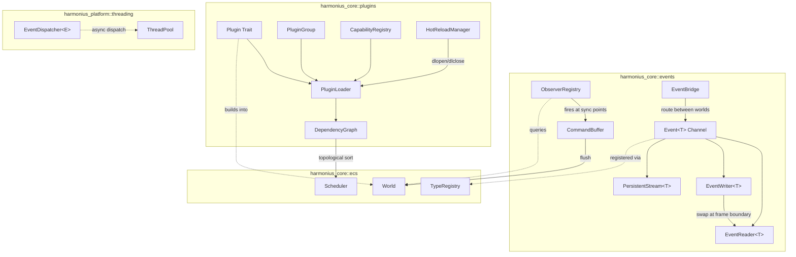
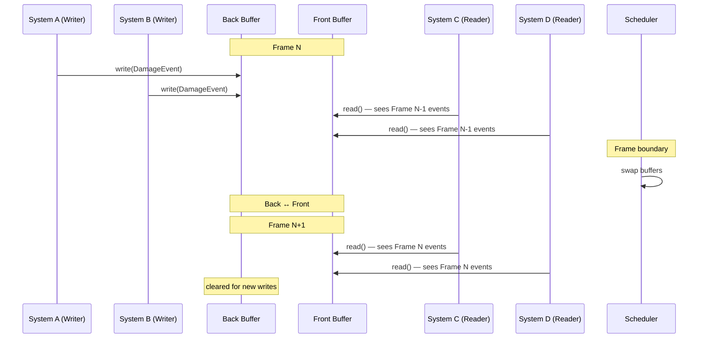
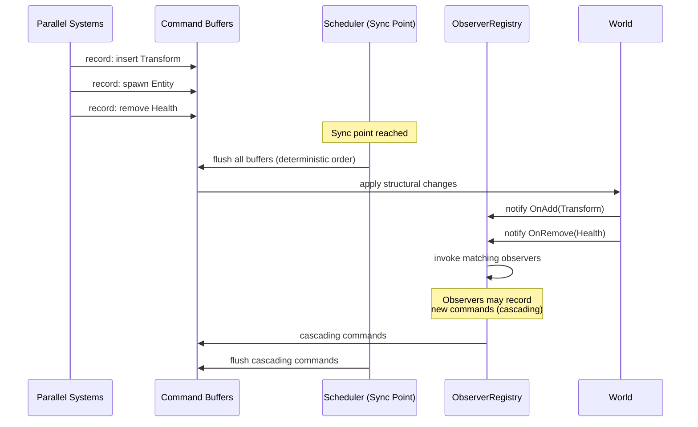
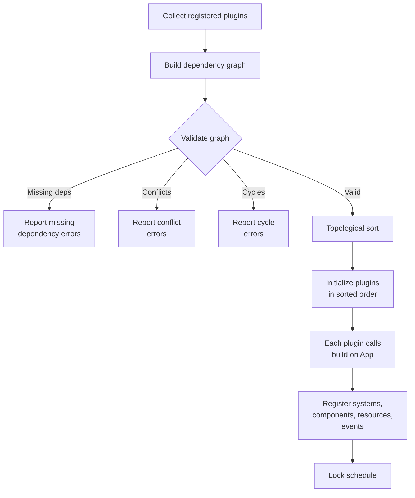
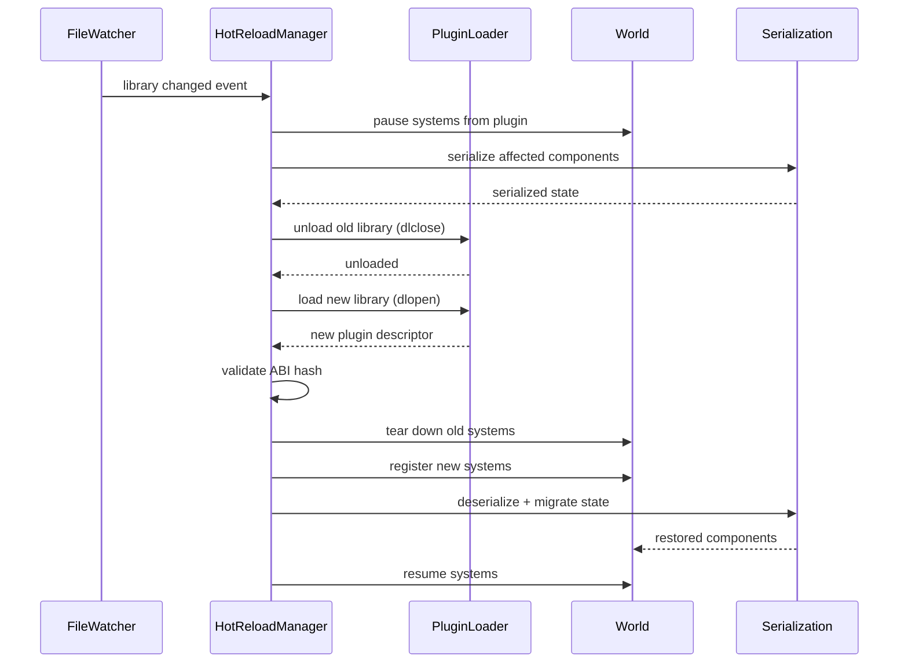
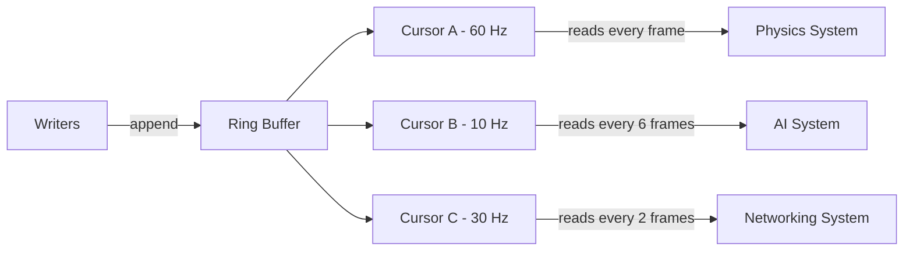
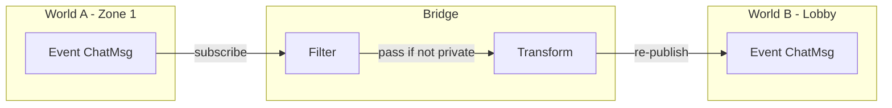

# Events & Plugins Design

## Requirements Trace

> **Canonical sources:** Features, requirements, and user
> stories are defined in [features/core-runtime/](../../features/core-runtime/),
> [requirements/core-runtime/](../../requirements/core-runtime/), and
> [user-stories/core-runtime/](../../user-stories/core-runtime/). The table
> below traces design elements to those definitions.

### Events & Messaging (F-1.5, R-1.5)

| Feature | Requirement | Description |
|---------|-------------|-------------|
| F-1.5.1 | R-1.5.1, R-1.5.1a | Typed double-buffered event channels with per-type isolation |
| F-1.5.2 | R-1.5.2 | Persistent event streams with cursor-based reading |
| F-1.5.3 | R-1.5.3 | Component lifecycle observers at sync points |
| F-1.5.4 | R-1.5.4 | Deferred command buffers with deterministic flush |
| F-1.5.5 | R-1.5.5, R-1.5.5a | Reactive query notifications for system skipping |
| F-1.5.6 | R-1.5.6 | Typed singleton resources with scheduler integration |
| F-1.5.7 | R-1.5.7 | Cross-world event bridges with filtering and transform |

### Plugin System (F-1.6, R-1.6)

| Feature | Requirement | Description |
|---------|-------------|-------------|
| F-1.6.1 | R-1.6.1 | Declarative plugin registration with automatic ordering |
| F-1.6.2 | R-1.6.2 | Plugin groups and presets |
| F-1.6.3 | R-1.6.3 | Explicit dependency and conflict declaration |
| F-1.6.4 | R-1.6.4, R-1.6.4a | Topological sort with cycle detection and error quality |
| F-1.6.5 | R-1.6.5, R-1.6.5a | Hot reload with state preservation |
| F-1.6.6 | R-1.6.6 | Semantic versioning and ABI stability metadata |
| F-1.6.7 | R-1.6.7 | Capability negotiation for optional features |

## Overview

This document defines two tightly coupled subsystems:

1. **Events** -- the typed, double-buffered channel
   infrastructure through which all ECS systems
   communicate. Includes observer dispatch, persistent
   streams, deferred command buffers, reactive queries,
   and cross-world event bridges.
2. **Plugins** -- the module registration, dependency
   resolution, and hot-reload mechanism that assembles
   the engine from composable units.

Events and plugins are co-designed because plugins
register the systems, components, resources, and events
they contribute. The `Event<T>` channel API is an
interoperability contract consumed by every domain in
the engine.

### Design Principles

- **Double-buffered isolation.** Writers never contend
  with readers. Buffers swap at frame boundaries.
- **Static dispatch.** All event channels are
  monomorphized per type `T`. No trait objects on the
  hot path.
- **Deterministic ordering.** Observer dispatch and
  command buffer flush follow system execution order.
  Identical inputs produce identical outputs.
- **Topological plugin initialization.** Declared
  dependencies drive load order. No implicit ordering
  from registration call sequence.
- **100% ECS-based.** Events, resources, and observers
  are all ECS primitives. No parallel data stores.

## Architecture

### Module Boundaries



### File Layout

```
harmonius_core/
├── events/
│   ├── channel.rs       # EventChannel<T>, double
│   │                    # buffer swap
│   ├── reader.rs        # EventReader<T> system param
│   ├── writer.rs        # EventWriter<T> system param
│   ├── stream.rs        # PersistentStream<T>,
│   │                    # StreamCursor<T>
│   ├── observer.rs      # ObserverRegistry,
│   │                    # ObserverDescriptor
│   ├── reactive.rs      # ReactiveQuery, archetype
│   │                    # change subscription
│   ├── bridge.rs        # EventBridge, cross-world
│   │                    # routing
│   └── command.rs       # CommandBuffer extensions
│                        # for event send
└── plugins/
    ├── plugin.rs        # Plugin trait, PluginGroup
    ├── app.rs           # App builder, plugin
    │                    # registration
    ├── graph.rs         # DependencyGraph,
    │                    # topological sort
    ├── capability.rs    # CapabilityRegistry,
    │                    # Capability
    ├── hot_reload.rs    # HotReloadManager,
    │                    # DynLibHandle
    ├── version.rs       # SemVer, AbiHash
    └── error.rs         # PluginError variants
```

### Double-Buffered Event Channel Data Flow



### Observer Dispatch at Sync Points



### Plugin Dependency Resolution



### Plugin Hot Reload Sequence



### Persistent Stream with Cursors



### Cross-World Event Bridge



### Core Data Structures


## API Design

### Event Channel (F-1.5.1, R-1.5.1)

The core abstraction. One channel per event type `T`.
Writers append to the back buffer; readers iterate the
front buffer. Buffers swap at the scheduler's frame
boundary.

```rust
/// Marker trait for event types. Derive macro
/// registers the type in the TypeRegistry.
pub trait Event:
    Send + Sync + Clone + 'static
{
}

/// Double-buffered event channel. One per event
/// type in the World. Not accessed directly —
/// systems use EventReader<T> and EventWriter<T>.
pub(crate) struct EventChannel<T: Event> {
    /// Front buffer: readable by systems this frame.
    front: Vec<T>,
    /// Back buffer: writable by systems this frame.
    back: Vec<T>,
    /// Frame tick at which the last swap occurred.
    frame_tick: u64,
    /// Diagnostic threshold for flood warning.
    flood_threshold: u32,
}

impl<T: Event> EventChannel<T> {
    pub fn new() -> Self;

    /// Swap front and back buffers. Called by the
    /// scheduler at frame boundaries.
    pub(crate) fn swap(&mut self) {
        std::mem::swap(&mut self.front, &mut self.back);
        self.back.clear();
        self.frame_tick += 1;
    }

    /// Number of events in the front (readable)
    /// buffer.
    pub fn front_len(&self) -> usize;

    /// Number of events in the back (writable)
    /// buffer.
    pub fn back_len(&self) -> usize;
}
```

### EventWriter (F-1.5.1)

System parameter for writing events. The scheduler
grants `&mut EventChannel<T>` access through the
standard dependency analysis — only one writer system
runs at a time per channel.

```rust
/// System parameter: mutable access to the back
/// buffer of Event<T>. Declared in system
/// signatures for scheduler dependency analysis.
pub struct EventWriter<'w, T: Event> {
    channel: &'w mut EventChannel<T>,
}

impl<'w, T: Event> EventWriter<'w, T> {
    /// Send a single event. Appends to the back
    /// buffer. O(1) amortized.
    pub fn send(&mut self, event: T) {
        if self.channel.back.len() as u32
            >= self.channel.flood_threshold
        {
            // Emit diagnostic warning once per
            // frame when threshold exceeded.
        }
        self.channel.back.push(event);
    }

    /// Send a batch of events. More efficient
    /// than individual sends for bulk operations.
    pub fn send_batch(
        &mut self,
        events: impl IntoIterator<Item = T>,
    ) {
        self.channel.back.extend(events);
    }

    /// Send a default-constructed event. Useful
    /// for signal-style events with no payload.
    pub fn send_default(&mut self)
    where
        T: Default,
    {
        self.send(T::default());
    }
}
```

### EventReader (F-1.5.1)

System parameter for reading events. Multiple readers
can read the front buffer concurrently with no
contention — the front buffer is immutable during the
frame.

```rust
/// System parameter: shared access to the front
/// buffer of Event<T>. Multiple systems may hold
/// EventReader<T> concurrently.
pub struct EventReader<'w, T: Event> {
    channel: &'w EventChannel<T>,
}

impl<'w, T: Event> EventReader<'w, T> {
    /// Iterate all events from the previous frame.
    /// The returned iterator borrows the front
    /// buffer immutably.
    pub fn read(&self) -> impl Iterator<Item = &T> {
        self.channel.front.iter()
    }

    /// Number of events available to read.
    pub fn len(&self) -> usize {
        self.channel.front.len()
    }

    /// True if no events are available.
    pub fn is_empty(&self) -> bool {
        self.channel.front.is_empty()
    }
}
```

### Persistent Event Streams (F-1.5.2, R-1.5.2)

For systems running at different tick rates. Events
are retained in a ring buffer across frames. Each
reader owns an independent cursor.

```rust
/// Ring-buffer-backed event stream that retains
/// events across multiple frames. Each reader
/// maintains an independent cursor.
pub struct PersistentStream<T: Event> {
    ring: RingBuffer<T>,
    /// Maximum events retained before oldest are
    /// overwritten. Platform-dependent defaults.
    capacity: u32,
    /// Monotonic write counter.
    write_head: u64,
}

impl<T: Event> PersistentStream<T> {
    pub fn new(capacity: u32) -> Self;

    /// Append an event. If the ring is full, the
    /// oldest event is overwritten.
    pub fn push(&mut self, event: T);

    /// Create a new cursor positioned at the
    /// current write head (reads nothing until
    /// new events arrive).
    pub fn cursor(&self) -> StreamCursor<T>;

    /// Create a cursor positioned at the oldest
    /// retained event (reads the entire backlog).
    pub fn cursor_from_oldest(
        &self,
    ) -> StreamCursor<T>;
}

/// Independent read cursor into a PersistentStream.
/// Each cursor advances at its own pace.
pub struct StreamCursor<T: Event> {
    read_head: u64,
    _marker: PhantomData<T>,
}

impl<T: Event> StreamCursor<T> {
    /// Read all events since this cursor's last
    /// read position. Advances the cursor.
    pub fn read<'s>(
        &mut self,
        stream: &'s PersistentStream<T>,
    ) -> impl Iterator<Item = &'s T>;

    /// Number of unread events.
    pub fn unread_count(
        &self,
        stream: &PersistentStream<T>,
    ) -> u32;

    /// True if the cursor has fallen behind the
    /// ring buffer and events were lost.
    pub fn has_overflowed(
        &self,
        stream: &PersistentStream<T>,
    ) -> bool;
}

/// Platform-specific default capacities.
pub struct StreamConfig {
    /// Maximum events per channel.
    pub capacity: u32,
    /// Maximum concurrent channels.
    pub max_channels: u32,
}

impl StreamConfig {
    /// Mobile: 4K events, 64 channels.
    pub fn mobile() -> Self;
    /// Switch: 8K events, 128 channels.
    pub fn switch() -> Self;
    /// Desktop: 32K events, configurable channels.
    pub fn desktop() -> Self;
}
```

### Component Lifecycle Observers (F-1.5.3, R-1.5.3)

Observers fire at sync points during command buffer
application. They differ from component hooks
(F-1.1.9) in that observers match multi-term queries
and are deferred, making them safe for structural
changes.

```rust
/// Events that trigger component lifecycle
/// observers.
#[derive(Clone, Copy, Debug, PartialEq, Eq)]
pub enum ComponentEvent {
    Added,
    Removed,
    Mutated,
}

/// Descriptor for a registered observer.
pub struct ObserverDescriptor {
    /// Component type(s) this observer watches.
    pub watched_components: SmallVec<[TypeId; 4]>,
    /// Which lifecycle events trigger this observer.
    pub triggers: SmallVec<[ComponentEvent; 3]>,
    /// Optional query filter for matching entities.
    pub query_filter: Option<QueryDescriptor>,
    /// Priority for ordering among observers that
    /// match the same event. Lower runs first.
    pub priority: i32,
}

/// Registry of all active observers. Owned by the
/// World.
pub struct ObserverRegistry {
    /// Map from component TypeId to observers
    /// watching that component.
    observers:
        HashMap<TypeId, Vec<ObserverEntry>>,
}

struct ObserverEntry {
    descriptor: ObserverDescriptor,
    /// The callback. Runs at sync points with
    /// exclusive World access.
    ///
    /// **Justification:** Observer callbacks use
    /// `Box<dyn ObserverCallback>` because the set
    /// of observer handlers is open-ended
    /// (user-registered). This is a deferred flush
    /// path (command buffer application), not
    /// per-entity iteration. Acceptable per
    /// constraints.md closure exception.
    callback: Box<dyn ObserverCallback>,
}

/// Trait for observer callbacks.
pub trait ObserverCallback: Send + 'static {
    fn invoke(
        &mut self,
        event: ComponentEvent,
        entity: Entity,
        world: &mut World,
    );
}

impl ObserverRegistry {
    pub fn new() -> Self;

    /// Register an observer. Returns an ID for
    /// later removal.
    pub fn register(
        &mut self,
        descriptor: ObserverDescriptor,
        callback: impl ObserverCallback,
    ) -> ObserverId;

    /// Remove a previously registered observer.
    pub fn unregister(
        &mut self,
        id: ObserverId,
    ) -> bool;

    /// Notify all matching observers of a
    /// component event. Called during command
    /// buffer flush at sync points.
    pub(crate) fn notify(
        &mut self,
        event: ComponentEvent,
        component_type: TypeId,
        entity: Entity,
        world: &mut World,
    );
}

#[derive(
    Clone, Copy, Debug, PartialEq, Eq, Hash,
)]
pub struct ObserverId(u64);
```

### Reactive Queries (F-1.5.5, R-1.5.5)

Archetype-level change subscriptions that allow the
scheduler to skip systems whose query results have
not changed since the last run.

```rust
/// Marker for queries that participate in reactive
/// change detection. Wraps a standard query.
pub struct ReactiveQuery<Q: Query> {
    /// Last tick at which this query's results
    /// were known to have changed.
    last_change_tick: u64,
    _marker: PhantomData<Q>,
}

impl<Q: Query> ReactiveQuery<Q> {
    /// Check whether any archetype matching this
    /// query has been modified since the last run.
    /// O(archetype_count) in the worst case, but
    /// typically O(1) due to archetype-level
    /// change flags.
    ///
    /// Overhead SHALL NOT exceed 1 microsecond per
    /// query per frame (R-1.5.5a).
    pub fn has_changed(
        &self,
        world: &World,
        current_tick: u64,
    ) -> bool;

    /// Advance the change tick after the system
    /// has run.
    pub fn mark_seen(
        &mut self,
        current_tick: u64,
    );
}

/// System run condition that skips execution when
/// the reactive query reports no changes.
pub fn run_if_changed<Q: Query>(
    query: &ReactiveQuery<Q>,
    world: &World,
    current_tick: u64,
) -> bool {
    query.has_changed(world, current_tick)
}
```

### Typed Singleton Resources (F-1.5.6, R-1.5.6)

World resources are typed singletons that participate
in the scheduler's dependency analysis. Defined in
the ECS (F-1.1.23) and extended here for inter-system
communication patterns.

`Resource`, `Res<T>`, `ResMut<T>` are defined
canonically in [ecs.md](ecs.md). The event system
consumes these types for resource-driven event
dispatch and reactive queries.

### Cross-World Event Bridges (F-1.5.7, R-1.5.7)

Route events between independent ECS worlds with
optional filtering and transformation.

```rust
// WorldId is defined in [ecs.md](ecs.md).

/// Configuration for a cross-world event bridge.
pub struct EventBridgeConfig<T: Event> {
    pub source_world: WorldId,
    pub target_world: WorldId,
    /// Optional predicate. Events for which this
    /// returns false are dropped.
    ///
    /// **Justification:** Configuration lambdas
    /// set once at bridge creation, not hot-path
    /// dispatch.
    pub filter: Option<Box<dyn Fn(&T) -> bool
        + Send + Sync>>,
    /// Optional transformation applied to events
    /// that pass the filter before re-publishing
    /// into the target world.
    ///
    /// **Justification:** Configuration lambdas
    /// set once at bridge creation, not hot-path
    /// dispatch.
    pub transform: Option<Box<dyn Fn(T) -> T
        + Send + Sync>>,
}

/// A bridge that routes events of type T from a
/// source world to a target world.
pub struct EventBridge<T: Event> {
    config: EventBridgeConfig<T>,
}

impl<T: Event> EventBridge<T> {
    pub fn new(
        config: EventBridgeConfig<T>,
    ) -> Self;

    /// Transfer events from source to target.
    /// Called by the scheduler after event buffers
    /// swap but before target-world systems run.
    pub fn transfer(
        &self,
        source: &EventChannel<T>,
        target: &mut EventChannel<T>,
    ) {
        for event in source.front.iter() {
            let pass = self
                .config
                .filter
                .as_ref()
                .map_or(true, |f| f(event));
            if pass {
                let out = self
                    .config
                    .transform
                    .as_ref()
                    .map_or_else(
                        || event.clone(),
                        |t| t(event.clone()),
                    );
                target.back.push(out);
            }
        }
    }
}
```

### Plugin Trait (F-1.6.1, R-1.6.1)

The core abstraction for modular engine composition.
Each plugin declares what it contributes and what it
depends on.

```rust
/// A plugin is a self-contained module that
/// registers systems, components, resources,
/// and events into an App.
pub trait Plugin: Send + Sync + 'static {
    /// Human-readable name for diagnostics.
    fn name(&self) -> &'static str;

    /// Build this plugin into the app. Register
    /// systems, components, resources, events,
    /// and observers.
    fn build(&self, app: &mut App);

    /// Declare plugin dependencies. Returns
    /// TypeIds of plugins that must be loaded
    /// before this one.
    fn dependencies(&self) -> Vec<TypeId> {
        Vec::new()
    }

    /// Declare plugin conflicts. Returns TypeIds
    /// of plugins that must NOT be loaded
    /// alongside this one.
    fn conflicts(&self) -> Vec<TypeId> {
        Vec::new()
    }

    /// Optional cleanup when the plugin is
    /// unloaded (hot reload path).
    fn cleanup(&self, app: &mut App) {}

    /// Capabilities this plugin advertises.
    fn capabilities(&self) -> Vec<Capability> {
        Vec::new()
    }
}
```

### Plugin Groups (F-1.6.2, R-1.6.2)

Bundle multiple plugins for convenient registration.
Individual plugins can be disabled before the group
is added.

```rust
/// A named group of plugins registered together.
pub trait PluginGroup {
    /// Build the group's plugin list.
    fn build(self) -> PluginGroupBuilder;
}

pub struct PluginGroupBuilder {
    plugins: Vec<Box<dyn Plugin>>,
    disabled: HashSet<TypeId>,
}

impl PluginGroupBuilder {
    pub fn new() -> Self;

    /// Add a plugin to the group.
    pub fn add<P: Plugin>(mut self, plugin: P)
        -> Self
    {
        self.plugins.push(Box::new(plugin));
        self
    }

    /// Disable a plugin within this group before
    /// registration.
    pub fn disable<P: Plugin>(mut self) -> Self {
        self.disabled.insert(TypeId::of::<P>());
        self
    }

    /// Finalize: returns only non-disabled plugins.
    pub fn finish(
        self,
    ) -> Vec<Box<dyn Plugin>> {
        self.plugins
            .into_iter()
            .filter(|p| {
                !self.disabled.contains(
                    &(*p).type_id(),
                )
            })
            .collect()
    }
}

/// Example: default plugins for a client.
pub struct DefaultPlugins;

impl PluginGroup for DefaultPlugins {
    fn build(self) -> PluginGroupBuilder {
        PluginGroupBuilder::new()
            .add(CorePlugin)
            .add(RenderingPlugin)
            .add(InputPlugin)
            .add(AudioPlugin)
    }
}

/// Example: server plugins (no rendering).
pub struct ServerPlugins;

impl PluginGroup for ServerPlugins {
    fn build(self) -> PluginGroupBuilder {
        PluginGroupBuilder::new()
            .add(CorePlugin)
            .add(NetworkingPlugin)
            .add(PhysicsPlugin)
    }
}
```

### App Builder (F-1.6.1)

The central registration point. Plugins call methods
on `App` in their `build()` implementation.

```rust
/// The application builder. Accumulates plugin
/// registrations and produces the final World
/// and Schedule.
pub struct App {
    world: World,
    plugins: Vec<Box<dyn Plugin>>,
    dependency_graph: DependencyGraph,
    capability_registry: CapabilityRegistry,
    /// Hot reload manager (development only).
    #[cfg(feature = "hot-reload")]
    hot_reload: Option<HotReloadManager>,
}

impl App {
    pub fn new() -> Self;

    /// Add a single plugin.
    pub fn add_plugin<P: Plugin>(
        &mut self,
        plugin: P,
    ) -> &mut Self;

    /// Add a plugin group.
    pub fn add_plugins<G: PluginGroup>(
        &mut self,
        group: G,
    ) -> &mut Self;

    /// Register an event type. Creates the
    /// EventChannel<T> in the World.
    pub fn add_event<T: Event>(
        &mut self,
    ) -> &mut Self;

    /// Insert a world resource.
    pub fn insert_resource<R: Resource>(
        &mut self,
        resource: R,
    ) -> &mut Self;

    /// Register a system in a given phase.
    pub fn add_system<S: System>(
        &mut self,
        phase: Phase,
        system: S,
    ) -> &mut Self;

    /// Register an observer.
    pub fn add_observer(
        &mut self,
        descriptor: ObserverDescriptor,
        callback: impl ObserverCallback,
    ) -> &mut Self;

    /// Finalize: validate dependency graph, sort
    /// plugins, initialize in order, lock the
    /// schedule.
    pub fn build(
        mut self,
    ) -> Result<BuiltApp, PluginError>;
}

/// The finalized, runnable application.
pub struct BuiltApp {
    pub world: World,
    pub schedule: Schedule,
    pub capability_registry: CapabilityRegistry,
    #[cfg(feature = "hot-reload")]
    pub hot_reload: Option<HotReloadManager>,
}
```

### Dependency Graph (F-1.6.3, F-1.6.4, R-1.6.3, R-1.6.4)

Validates plugin dependencies and resolves load order
via topological sort.

```rust
/// Directed graph of plugin dependencies.
pub struct DependencyGraph {
    /// Adjacency list: plugin -> dependencies.
    edges: HashMap<TypeId, Vec<TypeId>>,
    /// Plugin names for diagnostics.
    names: HashMap<TypeId, &'static str>,
    /// Declared conflicts.
    conflicts: Vec<(TypeId, TypeId)>,
}

impl DependencyGraph {
    pub fn new() -> Self;

    /// Add a plugin node with its declared
    /// dependencies and conflicts.
    pub fn add_plugin(
        &mut self,
        plugin: &dyn Plugin,
    );

    /// Validate the graph. Reports ALL errors in
    /// a single pass (R-1.6.4a): missing
    /// dependencies, conflicts, and cycles.
    pub fn validate(
        &self,
    ) -> Result<(), Vec<PluginGraphError>>;

    /// Produce a topological ordering of plugin
    /// TypeIds. Requires a prior successful
    /// validate() call.
    pub fn topological_sort(
        &self,
    ) -> Result<Vec<TypeId>, PluginGraphError>;
}

/// Errors from plugin graph validation.
#[derive(Debug)]
pub enum PluginGraphError {
    MissingDependency {
        plugin: &'static str,
        missing: &'static str,
        chain: Vec<&'static str>,
        suggestion: String,
    },
    Conflict {
        plugin_a: &'static str,
        plugin_b: &'static str,
        suggestion: String,
    },
    CyclicDependency {
        cycle: Vec<&'static str>,
        suggestion: String,
    },
}
```

### Capability Negotiation (F-1.6.7, R-1.6.7)

Named feature flags with versioning for runtime
branching on optional functionality.

```rust
/// A named capability with a semantic version.
#[derive(Clone, Debug, PartialEq, Eq, Hash)]
pub struct Capability {
    pub name: &'static str,
    pub version: SemVer,
}

/// Semantic version (major, minor, patch).
#[derive(
    Clone, Copy, Debug, PartialEq, Eq,
    PartialOrd, Ord, Hash,
)]
pub struct SemVer {
    pub major: u32,
    pub minor: u32,
    pub patch: u32,
}

/// Registry of capabilities advertised by loaded
/// plugins.
pub struct CapabilityRegistry {
    caps: HashMap<&'static str, Capability>,
}

impl CapabilityRegistry {
    pub fn new() -> Self;

    /// Register a capability.
    pub fn register(
        &mut self,
        cap: Capability,
    );

    /// Remove a capability (plugin unloaded).
    pub fn unregister(
        &mut self,
        name: &'static str,
    );

    /// Query whether a capability is present.
    pub fn has(
        &self,
        name: &str,
    ) -> bool;

    /// Query a capability by name. Returns None
    /// if not available.
    pub fn get(
        &self,
        name: &str,
    ) -> Option<&Capability>;

    /// Check if a capability meets a minimum
    /// version requirement.
    pub fn meets_version(
        &self,
        name: &str,
        min_version: SemVer,
    ) -> bool;
}
```

### Semantic Versioning and ABI Hash (F-1.6.6, R-1.6.6)

Prevents loading dynamically-linked plugins compiled
against incompatible engine versions.

```rust
/// ABI hash derived from the plugin's public
/// interface types via the TypeRegistry.
#[derive(
    Clone, Copy, Debug, PartialEq, Eq, Hash,
)]
pub struct AbiHash(u64);

/// Metadata embedded in every plugin descriptor.
pub struct PluginDescriptor {
    pub name: &'static str,
    pub version: SemVer,
    pub abi_hash: AbiHash,
    /// Factory function to create the Plugin.
    pub create: fn() -> Box<dyn Plugin>,
}

impl AbiHash {
    /// Compute ABI hash from the type registry
    /// entries that the plugin's public interface
    /// touches. Uses BLAKE3 for consistency with
    /// the content pipeline.
    pub fn compute(
        registry: &TypeRegistry,
        public_types: &[TypeId],
    ) -> Self;
}
```

### Hot Reload Manager (F-1.6.5, R-1.6.5)

Development-only dynamic library reload with state
preservation through serialization and reflection.

```rust
/// Handle to a dynamically loaded shared library.
pub struct DynLibHandle {
    #[cfg(unix)]
    handle: *mut libc::c_void,
    #[cfg(windows)]
    handle: windows_sys::Win32::Foundation::HMODULE,
}

impl DynLibHandle {
    /// Load a shared library.
    /// - POSIX: dlopen
    /// - Windows: LoadLibrary
    pub fn load(
        path: &Path,
    ) -> Result<Self, HotReloadError>;

    /// Look up a symbol by name.
    pub unsafe fn symbol<T>(
        &self,
        name: &str,
    ) -> Result<*const T, HotReloadError>;

    /// Unload the library.
    /// - POSIX: dlclose
    /// - Windows: FreeLibrary
    pub fn unload(
        self,
    ) -> Result<(), HotReloadError>;
}

/// Manages hot-reload cycles for gameplay plugins.
/// Development only — disabled in release builds.
#[cfg(feature = "hot-reload")]
pub struct HotReloadManager {
    /// Currently loaded dynamic plugins.
    loaded: HashMap<
        &'static str,
        LoadedDynPlugin,
    >,
}

struct LoadedDynPlugin {
    lib: DynLibHandle,
    descriptor: PluginDescriptor,
    /// Component types owned by this plugin for
    /// state preservation during reload.
    owned_types: Vec<TypeId>,
}

#[cfg(feature = "hot-reload")]
impl HotReloadManager {
    pub fn new() -> Self;

    /// Reload a plugin from an updated library.
    ///
    /// Steps:
    /// 1. Pause systems from the old plugin.
    /// 2. Serialize affected components via
    ///    Reflect.
    /// 3. Unload old library.
    /// 4. Load new library.
    /// 5. Validate ABI hash.
    /// 6. Tear down old systems and register new.
    /// 7. Deserialize and migrate state.
    /// 8. Resume systems.
    ///
    /// Total cycle time SHALL be under 2 seconds
    /// for up to 100 systems (R-1.6.5a),
    /// excluding user compile time.
    pub fn reload(
        &mut self,
        name: &str,
        new_path: &Path,
        world: &mut World,
    ) -> Result<(), HotReloadError>;

    /// Check if a plugin is currently loaded.
    pub fn is_loaded(
        &self,
        name: &str,
    ) -> bool;
}

#[derive(Debug)]
pub enum HotReloadError {
    LibraryNotFound { path: PathBuf },
    SymbolNotFound { name: String },
    AbiMismatch {
        expected: AbiHash,
        actual: AbiHash,
    },
    StateMigrationFailed {
        type_name: String,
        reason: String,
    },
    UnloadFailed { reason: String },
}
```

### Error Types

```rust
/// Top-level plugin error.
#[derive(Debug)]
pub enum PluginError {
    /// One or more graph validation errors.
    GraphErrors(Vec<PluginGraphError>),
    /// Hot reload failure.
    HotReload(HotReloadError),
    /// Duplicate plugin registration.
    DuplicatePlugin { name: &'static str },
    /// Event type already registered.
    DuplicateEvent { type_name: &'static str },
}

/// Event system errors.
#[derive(Debug)]
pub enum EventError {
    /// Channel not found for the given type.
    ChannelNotFound { type_name: &'static str },
    /// Stream cursor has overflowed the ring
    /// buffer — events were lost.
    CursorOverflow {
        lost_count: u64,
    },
    /// Bridge source world not found.
    BridgeSourceMissing { world_id: WorldId },
    /// Bridge target world not found.
    BridgeTargetMissing { world_id: WorldId },
}
```

## Data Flow

### Frame Lifecycle with Events

The scheduler owns the event channels and drives the
double-buffer swap. The sequence within a single frame
is:

1. **Swap event buffers.** All `EventChannel<T>`
   instances swap front/back. Previous frame's writes
   become this frame's reads.
2. **Transfer cross-world bridges.** For each
   `EventBridge`, copy matching events from source
   world's front buffer to target world's back buffer.
3. **Run systems.** Systems read via `EventReader<T>`
   (front buffer) and write via `EventWriter<T>` (back
   buffer) concurrently. The scheduler resolves data
   dependencies — readers run in parallel, writers are
   serialized per channel.
4. **Sync point: flush command buffers.** Commands are
   applied in deterministic system execution order.
   Structural changes trigger observer notifications.
5. **Observer dispatch.** Matching observers fire in
   priority order. Observers may record cascading
   commands, which are flushed in a secondary pass.
6. **Reactive query bookkeeping.** Archetype change
   flags are updated. Systems with `ReactiveQuery` run
   conditions are marked for skip/run on the next
   frame.

```rust
// Simplified frame event lifecycle
fn frame_tick(
    scheduler: &mut Scheduler,
    worlds: &mut WorldMap,
) {
    // 1. Swap all event buffers
    for channel in scheduler.event_channels_mut() {
        channel.swap();
    }

    // 2. Transfer cross-world bridges
    for bridge in scheduler.bridges() {
        let (src, tgt) = worlds.get_pair_mut(
            bridge.source_world(),
            bridge.target_world(),
        );
        bridge.transfer(src, tgt);
    }

    // 3. Run parallel systems
    let graph = scheduler.build_frame_graph();
    pool.execute_graph(graph).await;

    // 4. Flush command buffers at sync point
    scheduler.flush_commands(&mut world);

    // 5. Dispatch observers
    world.observer_registry().dispatch_pending();

    // 6. Flush cascading observer commands
    scheduler.flush_commands(&mut world);

    // 7. Update reactive query ticks
    scheduler.update_reactive_queries(&world);
}
```

### Command Buffer Event Integration

Command buffers can record `send_event` operations
alongside structural changes. Events sent via command
buffers are flushed into the back buffer at sync
points, making them visible in the next frame.

```rust
impl CommandBuffer {
    /// Record an event send. The event is pushed
    /// to the channel's back buffer during flush.
    pub fn send_event<T: Event>(
        &mut self,
        event: T,
    );
}
```

### Event Ordering Guarantees

Within a single frame:

1. Events written by system A before system B (in
   topological order) appear in the back buffer in
   that order.
2. Events from command buffers appear after direct
   writes, in system execution order.
3. Cross-world bridge transfers happen before any
   target-world system reads.
4. Observer-generated events appear in the back buffer
   and are visible in the next frame (not the current
   one).

## Platform Considerations

### Dynamic Library APIs

| Platform | Load | Unload | Symbol |
|----------|------|--------|--------|
| Linux | `dlopen` | `dlclose` | `dlsym` |
| macOS | `dlopen` | `dlclose` | `dlsym` |
| Windows | `LoadLibraryW` | `FreeLibrary` | `GetProcAddress` |

All accessed via `cfg`-gated platform modules. No
trait objects or dynamic dispatch for platform
selection.

### Persistent Stream Platform Defaults

| Platform | Events/Channel | Max Channels |
|----------|---------------|--------------|
| Mobile | 4,096 | 64 |
| Switch | 8,192 | 128 |
| Desktop | 32,768 | Configurable |

### Event Channel Throughput (R-1.5.1a)

The back buffer uses `Vec<T>` with pre-allocated
capacity. Write is `Vec::push` — O(1) amortized.
The flood warning threshold fires a diagnostic at
50,000 events per channel per frame. The target is
100,000 events/frame with under 1 ms total write time
for 64-byte events.

### Threading Integration

- **EventWriter** requires exclusive (`&mut`) access
  to the channel. The scheduler treats it as a write
  dependency.
- **EventReader** requires shared (`&`) access. The
  scheduler treats it as a read dependency.
- Multiple readers run in parallel. A writer serializes
  against all other accessors of the same channel.
- Async event handlers (from `threading.md`
  `AsyncEventHandler<E>`) are spawned onto the thread
  pool when dispatched. They cannot directly write to
  event channels — they must use command buffers.

### Dependencies (Proposed)

| Crate | Purpose | Justification |
|-------|---------|---------------|
| `smallvec` | Inline-allocated small vectors | Observer descriptor lists, dependency lists |
| `blake3` | ABI hash computation | Consistent with content pipeline hashing |

## Test Plan

### Unit Tests — Events

| Test | Req | Description |
|------|-----|-------------|
| `test_double_buffer_swap` | R-1.5.1 | Write 3 events frame N. Frame N+1: reader sees 3. Frame N+2: reader sees 0. |
| `test_parallel_readers_no_contention` | R-1.5.1 | 8 threads read same channel concurrently. Verify via ThreadSanitizer. |
| `test_flood_warning_threshold` | R-1.5.1a | Write 50,001 events. Verify diagnostic fires. |
| `test_throughput_100k` | R-1.5.1a | Write 100K events of 64 bytes. Verify < 1 ms total. |
| `test_persistent_stream_cursor` | R-1.5.2 | 60 events across 6 frames. Reader at 10 Hz sees all 60 in batch. |
| `test_cursor_independence` | R-1.5.2 | Two cursors at different positions see independent views. |
| `test_cursor_overflow_detection` | R-1.5.2 | Cursor falls behind ring buffer. Verify `has_overflowed()` returns true. |
| `test_observer_fires_on_add` | R-1.5.3 | Register observer for OnAdd. Spawn 100 entities via command buffers from 4 systems. Verify 100 callbacks in deterministic order. |
| `test_observer_fires_on_remove` | R-1.5.3 | Remove component from 50 entities. Verify 50 OnRemove callbacks. |
| `test_observer_fires_on_mutate` | R-1.5.3 | Mutate component on 25 entities. Verify 25 OnMutate callbacks. |
| `test_observer_deterministic_order` | R-1.5.3 | Repeat observer test 100 times. Verify identical callback order. |
| `test_command_buffer_flush_order` | R-1.5.4 | 3 systems record commands. Flush. Verify application order matches system execution order. |
| `test_command_buffer_deterministic` | R-1.5.4 | Repeat flush 100 times with different thread counts. Verify identical world state. |
| `test_reactive_query_skip` | R-1.5.5 | Register reactive query on component A. 10 frames, no A changes. Verify system runs 0 times. Modify one A. Verify system runs next frame. |
| `test_reactive_query_overhead` | R-1.5.5a | 200 reactive queries, no changes. Verify total overhead < 200 us. |
| `test_resource_scheduler_ordering` | R-1.5.6 | One system writes via ResMut, another reads via Res. Verify scheduler orders them correctly. |
| `test_resource_parallel_reads` | R-1.5.6 | Two read-only systems with Res access. Verify they run in parallel. |

### Unit Tests — Plugins

| Test | Req | Description |
|------|-----|-------------|
| `test_plugin_reverse_order` | R-1.6.1 | Register 3 plugins in reverse dependency order. Verify correct initialization order. |
| `test_plugin_contributions` | R-1.6.1 | After init, verify all declared systems, components, and resources exist. |
| `test_group_disable` | R-1.6.2 | Group of 5, disable 1. Verify 4 active, disabled plugin's systems absent. |
| `test_missing_dependency` | R-1.6.3 | Register plugin depending on absent plugin. Verify error naming missing dep. |
| `test_conflict_detection` | R-1.6.3 | Register two conflicting plugins. Verify conflict error. |
| `test_topological_sort` | R-1.6.4 | A->B->C chain. Verify init order A, B, C. |
| `test_cycle_detection` | R-1.6.4 | A->B->A cycle. Verify cycle error with path. |
| `test_all_errors_single_pass` | R-1.6.4a | 3 simultaneous issues (missing dep, conflict, cycle). Verify all 3 reported. |
| `test_abi_hash_match` | R-1.6.6 | Load plugin with matching ABI hash. Verify success. |
| `test_abi_hash_mismatch` | R-1.6.6 | Load plugin with mismatched ABI hash. Verify rejection with version info. |
| `test_capability_query` | R-1.6.7 | Register capability "physics" v1.2. Query returns v1.2. Query "audio" returns None. |
| `test_capability_branch` | R-1.6.7 | System branches on "physics" presence. Verify correct branch. |

### Integration Tests — Events

| Test | Req | Description |
|------|-----|-------------|
| `test_cross_world_bridge` | R-1.5.7 | Two worlds, bridge for ChatMsg. Send in A, verify in B. |
| `test_bridge_filter` | R-1.5.7 | Filter drops `is_private=true`. Verify filtered events absent in target. |
| `test_bridge_transform` | R-1.5.7 | Transform modifies event payload. Verify transformed value in target. |
| `test_bridge_unsubscribed_type` | R-1.5.7 | Send unsubscribed event type in A. Verify absent in B. |
| `test_full_frame_lifecycle` | R-1.5.1 | End-to-end: write events, swap, read, command buffer flush, observer dispatch. Verify correct state. |

### Integration Tests — Plugins

| Test | Req | Description |
|------|-----|-------------|
| `test_hot_reload_state_preservation` | R-1.6.5 | Load plugin, run one frame, modify, hot-reload. Verify ECS state survives. |
| `test_hot_reload_new_behavior` | R-1.6.5 | After reload, verify new system behavior is active. |
| `test_hot_reload_latency` | R-1.6.5a | Reload 50-system plugin. Verify total cycle < 2s. |
| `test_hot_reload_migration_failure` | R-1.6.5a | Introduce layout change that fails migration. Verify error reported, pre-reload value retained. |

### Benchmarks

| Benchmark | Target | Source |
|-----------|--------|--------|
| Event write 100K x 64B | < 1 ms | R-1.5.1a |
| Event read 100K (8 parallel readers) | < 500 us | US-1.5.2 |
| Reactive query check (200 queries, no change) | < 200 us | R-1.5.5a |
| Observer dispatch (1000 callbacks) | < 2 ms | US-1.5.7 |
| Plugin graph validation (50 plugins) | < 1 ms | R-1.6.4 |
| Hot reload cycle (50 systems) | < 2 s | R-1.6.5a |

## Open Questions

1. **Observer cascading depth limit.** Observers can
   generate commands that trigger further observers.
   Should there be a maximum cascade depth to prevent
   infinite loops? Bevy uses a single-pass cascade.
   Flecs allows configurable depth. A depth limit of
   8 with a diagnostic panic at overflow is proposed.

2. **Event channel memory reclamation.** The back
   buffer `Vec<T>` grows to peak frame usage and
   never shrinks. Should channels reclaim memory after
   N frames below a threshold? This trades allocation
   churn against memory waste for bursty event
   patterns.

3. **Persistent stream garbage collection.** When all
   cursors have advanced past a region of the ring
   buffer, those slots are safe to overwrite. Should
   the stream track the minimum cursor position to
   enable eager slot reuse, or rely on the fixed ring
   capacity?

4. **Bridge transfer timing.** Bridges currently
   transfer after swap but before target-world systems
   run. For multi-world setups with dependencies
   between worlds, should bridge transfers be
   integrated into the task graph as explicit nodes?

5. **Hot reload on macOS with GCD.** Dynamic library
   unload with active GCD dispatch blocks referencing
   symbols in the library is undefined behavior.
   The proposed mitigation is to drain all pending
   blocks before `dlclose`, but the timing guarantee
   needs validation.

6. **Plugin initialization parallelism.** Topological
   sort produces a total order, but independent
   branches of the dependency DAG could initialize in
   parallel. Is the complexity justified for startup-
   only cost?
