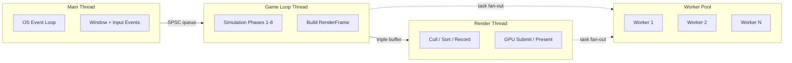
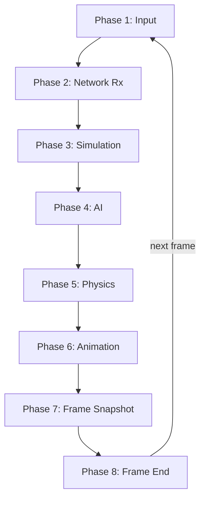
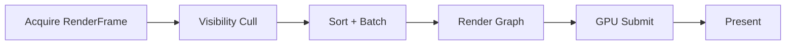
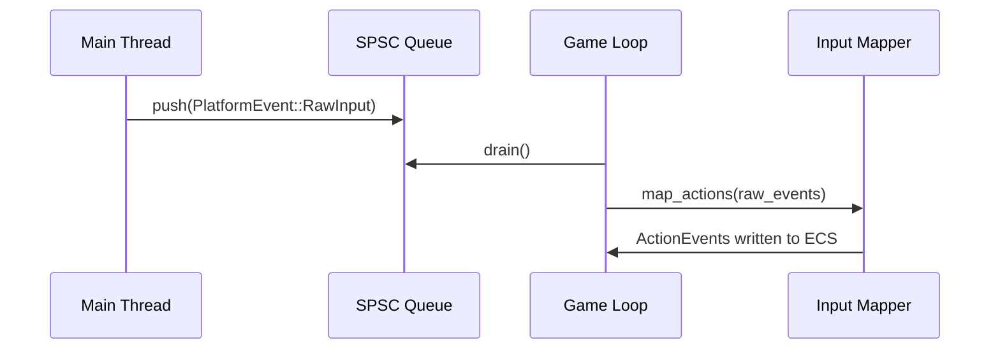
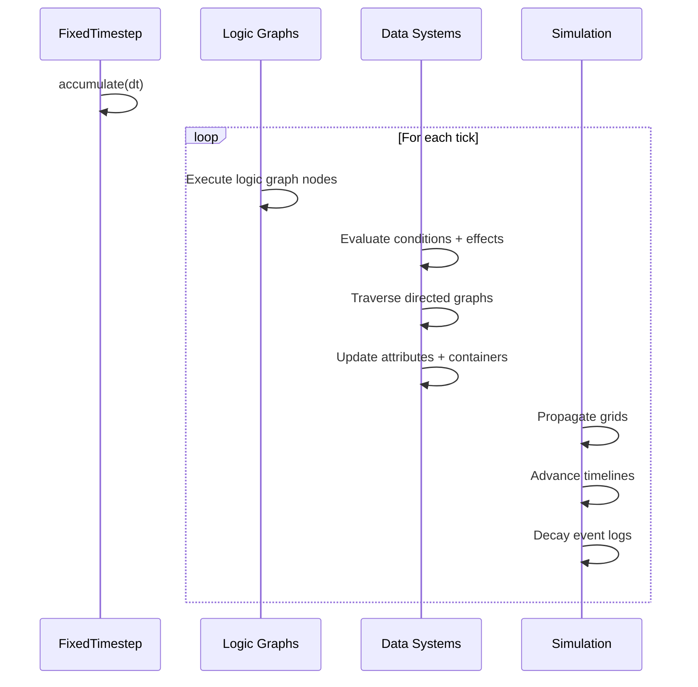
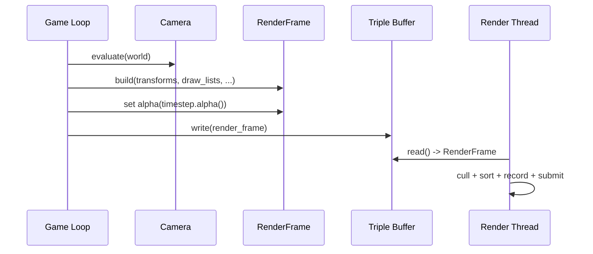

# Game Loop Design

## Requirements Trace

> **Canonical sources:** Features, requirements, and user stories live in their respective
> directories. The table below traces design elements to those definitions.

| Feature | Requirement |
|---------|-------------|
| F-1.1.1 | R-1.1.1 |
| F-1.1.2 | R-1.1.2 |
| F-14.3.1 | R-14.3.1 |
| F-14.3.3 | R-14.3.3 |
| F-14.3.5 | R-14.3.5 |

1. **F-1.1.1** -- ECS schedule compiles into game loop graph
2. **F-1.1.2** -- Deterministic fixed-timestep simulation
3. **F-14.3.1** -- Work-stealing thread pool sized to perf cores
4. **F-14.3.3** -- DAG-based task graph with fan-out and fan-in
5. **F-14.3.5** -- Platform async I/O bridge as task continuations

## Overview

The game loop is the central execution model of the Harmonius engine. It defines four dedicated
thread roles, an 8-phase frame pipeline on the game loop thread, and pipelined rendering on a
separate render thread.

All ECS systems register into named phases. The `Schedule` compiles into a `GameLoopGraph`, which is
flattened into a `CompiledFrame` containing a `TaskGraph` for the thread pool. The compiled frame is
reused across frames and only recompiled when the system set changes (plugin load/unload, mode
switch).

The game loop thread owns the `Tokio runtime` and controls exactly when I/O completions are
harvested from the OS. No callbacks fire asynchronously — the engine decides when to poll.

### Interop Contracts Defined Here

| Contract | Consumed By |
|----------|-------------|
| `GameLoopGraph` / `CompiledFrame` | ECS, Threading |
| `RenderFrame` snapshot | Rendering |
| Phase registration API | All domains |
| Fixed timestep accumulator | Physics, Simulation, AI |
| SPSC event queue protocol | Input, Platform |
| Triple-buffer protocol | Rendering |

## Architecture

### Thread Roles



**Main thread** — OS event loop. Pumps window events, raw input, and platform UI. Forwards events to
the game loop thread via a lock-free SPSC queue. On iOS/Android the OS mandates this thread; on
desktop it is still separated.

**Game loop thread** — simulation driver. Owns the `Tokio runtime`. Runs all 8 phases sequentially
per frame. Produces an immutable `RenderFrame` snapshot and submits it to the render thread via
triple buffer. Fans out data-parallel work to worker threads.

**Render thread** — GPU command buffer recording and submission. Consumes `RenderFrame` from the
triple buffer. Executes the render graph, records command buffers, presents. Pipelined one frame
behind the game loop. Owns the swapchain and presentation timing (VSync, pacing).

**Worker threads** — work-stealing pool sized to performance cores. Short scoped tasks that borrow
from the calling frame. Used by game loop thread (physics broadphase, AI queries, animation
blending) and render thread (visibility culling, draw call sorting).

### Frame Pipeline

```mermaid
gantt
    title Frame Pipeline
    dateFormat X
    axisFormat %s

    section Main
    Events N     :m1, 0, 2
    Events N+1   :m2, 2, 4

    section Game Loop
    Sim Frame N     :g1, 0, 3
    Sim Frame N+1   :g2, 3, 6

    section Render
    Render Frame N-1 :r0, 0, 3
    Render Frame N   :r1, 3, 6
```



The game loop and render thread overlap by one frame. `RenderFrame` is an immutable snapshot
(transforms, draw lists, camera, lights, VFX state) that the render thread consumes without
synchronization. Triple buffering ensures the game loop never stalls waiting for the render thread.

### Game Loop Thread Phases



| Phase | Timestep | Description |
|-------|----------|-------------|
| 1 Input | Variable | Drain SPSC, map actions |
| 2 Network Rx | Variable | Packets, remote state, RPCs |
| 3 Simulation | Fixed | Graphs, effects, grids, timelines |
| 4 AI | Fixed | Awareness, BT/GOAP, nav, steering |
| 5 Physics | Fixed | Broadphase, solve, destruction |
| 6 Animation | Variable | State machines, IK, cloth, hair |
| 7 Snapshot | Variable | Build RenderFrame, audio, net Tx |
| 8 Frame End | Variable | Save, poll, stats |

### Render Thread Steps



## API Design

### Phase Identifiers

```rust
/// Built-in game loop phases.
#[derive(Clone, Copy, PartialEq, Eq, Hash)]
pub enum Phase {
    /// Drain SPSC, map raw input to actions.
    Input,
    /// Process incoming network packets.
    NetworkReceive,
    /// Fixed-timestep simulation tick.
    Simulation,
    /// AI evaluation and navigation.
    AiUpdate,
    /// Fixed-timestep physics substeps.
    PhysicsStep,
    /// Animation state machines and procedural.
    AnimationUpdate,
    /// Build immutable RenderFrame snapshot.
    FrameSnapshot,
    /// Save, Tokio runtime poll, frame stats.
    FrameEnd,
    /// User-defined phase with explicit ordering.
    Custom(u32),
}
```

### Game Loop Graph

```rust
/// A directed acyclic graph of frame phases.
/// Compiled from the ECS `Schedule` once, reused
/// across frames until the system set changes.
pub struct GameLoopGraph {
    phases: Vec<PhaseNode>,
    edges: Vec<(PhaseId, PhaseId)>,
}

impl GameLoopGraph {
    /// Register a phase with its systems.
    pub fn add_phase(
        &mut self,
        phase: Phase,
        node: PhaseNode,
    ) -> PhaseId;

    /// Declare ordering: `before` runs before `after`.
    pub fn add_dependency(
        &mut self,
        before: PhaseId,
        after: PhaseId,
    );

    /// Compile into an executable frame. Validates the
    /// DAG (cycle detection, access conflicts), resolves
    /// system dependencies, inserts sync barriers.
    pub fn compile(
        &self,
        world: &World,
        pool: &ThreadPool,
    ) -> Result<CompiledFrame, CompileError>;
}

/// A single phase in the game loop.
pub enum PhaseNode {
    /// A set of ECS systems to run in parallel.
    Systems(SystemPhase),
    /// A render graph submission phase.
    RenderGraph(RenderGraphPhase),
    /// A standalone async task.
    Task(TaskPhase),
    /// A nested sub-graph (e.g., physics substeps).
    SubGraph(GameLoopGraph),
    /// A full-pipeline barrier (command buffer flush).
    Barrier,
}
```

### Compiled Frame

```rust
/// The executable form of a game loop frame.
/// Contains the flattened task graph and render
/// submission ordering.
pub struct CompiledFrame {
    task_graph: TaskGraph,
    render_submissions: Vec<RenderSubmission>,
}

impl CompiledFrame {
    /// Execute one frame. Dispatches tasks to the thread
    /// pool, polls the reactor at defined points, and
    /// produces a RenderFrame snapshot.
    pub fn execute(
        &self,
        world: &mut World,
        pool: &ThreadPool,
        reactor: &Tokio runtime,
    );
}
```

### Fixed Timestep Accumulator

```rust
/// Manages fixed-timestep simulation with accumulator.
/// Used by Phase 3 (Simulation), Phase 4 (AI), and
/// Phase 5 (Physics) to substep deterministically.
pub struct FixedTimestep {
    /// Duration of each tick (e.g., 1/60 s).
    pub tick_duration: Duration,
    /// Maximum ticks per frame to prevent spiral of death.
    pub max_ticks_per_frame: u32,
    /// Accumulated time not yet consumed by ticks.
    accumulator: Duration,
}

impl FixedTimestep {
    /// Add elapsed time since last frame.
    pub fn accumulate(&mut self, dt: Duration);

    /// Returns the number of ticks to run this frame.
    pub fn consume(&mut self) -> u32;

    /// Interpolation factor for rendering between ticks.
    /// Range [0.0, 1.0).
    pub fn alpha(&self) -> f32;
}
```

### RenderFrame Snapshot

```rust
/// Immutable snapshot of all data the render thread needs.
/// Built during Phase 7 (Frame Snapshot) and submitted to
/// the render thread via triple buffer.
pub struct RenderFrame {
    /// Interpolated transforms for all visible entities.
    pub transforms: Vec<GlobalTransform>,
    /// Per-view draw lists (main camera, shadow maps, etc.).
    pub draw_lists: Vec<DrawList>,
    /// Active camera parameters.
    pub camera: CameraSnapshot,
    /// Light sources and shadow configuration.
    pub lights: Vec<LightSnapshot>,
    /// VFX particle state for GPU simulation.
    pub vfx_state: VfxSnapshot,
    /// UI layout tree for overlay rendering.
    pub ui_layout: UiSnapshot,
    /// Frame index for temporal effects (TAA, motion blur).
    pub frame_index: u64,
    /// Interpolation alpha from fixed timestep.
    pub alpha: f32,
}
```

### SPSC Event Queue

```rust
/// Lock-free single-producer single-consumer queue.
/// Main thread produces, game loop thread consumes.
pub struct SpscQueue<T> {
    /* cache-line padded head/tail atomics */
}

impl<T> SpscQueue<T> {
    pub fn push(&self, value: T) -> Result<(), T>;
    pub fn pop(&self) -> Option<T>;
    pub fn drain(&self) -> Drain<'_, T>;
}

/// Events forwarded from the main thread.
pub enum PlatformEvent {
    WindowResize { width: u32, height: u32 },
    WindowClose,
    WindowFocus(bool),
    RawInput(RawInputEvent),
    AppSuspend,
    AppResume,
}
```

### Triple Buffer

```rust
/// Lock-free triple buffer for game loop → render thread.
/// Writer (game loop) never blocks. Reader (render) always
/// gets the most recent complete frame.
pub struct TripleBuffer<T> {
    /* three slots + atomic index */
}

impl<T> TripleBuffer<T> {
    /// Game loop thread: write a new frame snapshot.
    pub fn write(&self, value: T);

    /// Render thread: get the most recent frame.
    /// Returns None if no new frame since last read.
    pub fn read(&self) -> Option<&T>;
}
```

### Game Mode Manager

```rust
/// Manages game state transitions and mode nesting.
/// Game modes are authored as data assets in the editor.
#[derive(Clone, Copy, PartialEq, Eq, Hash)]
pub enum GameState {
    MainMenu,
    Loading,
    InGame,
    Paused,
}

pub struct GameStateManager {
    current: GameState,
    pending: Option<GameState>,
    configs: HandleMap<GameState, GameStateConfig>,
}

impl GameStateManager {
    /// Request a state transition. Applied at the next
    /// sync point (Phase 8 Frame End).
    pub fn request_transition(
        &mut self,
        target: GameState,
    );

    /// Query current state.
    pub fn current(&self) -> GameState;
}

pub struct GameModeManager {
    graph: ModeGraph,
    active_mode: ModeId,
    sub_mode_stack: Vec<ModeId>,
}

impl GameModeManager {
    /// Transition to a new mode within the graph.
    pub fn transition(
        &mut self,
        target: ModeId,
    ) -> Result<(), ModeError>;

    /// Push a sub-mode onto the stack.
    pub fn push_sub_mode(
        &mut self,
        mode: ModeId,
    ) -> Result<(), ModeError>;

    /// Pop the current sub-mode.
    pub fn pop_sub_mode(&mut self) -> Option<ModeId>;
}
```

## Data Flow

### Phase 1: Input Processing



### Phase 3: Simulation Tick



### Phase 7: Frame Snapshot



## Platform Considerations

| Platform | Main Thread | I/O Backend | Notes |
|----------|-------------|-------------|-------|
| macOS | NSApplication | Tokio (kqueue) | Metal sync via GCD |
| Windows | Win32 msg loop | Tokio (IOCP) | Game loop on thread 0 |
| Linux | xcb/Wayland | Tokio (epoll) | Game loop on thread 0 |
| iOS | UIApplication | Tokio (kqueue) | OS mandates main thread |
| Android | Activity | Tokio (epoll) | OS mandates main thread |

On iOS and Android the OS owns the main thread for UI events. The game loop runs on a dedicated
thread. `PlatformEvent`s are forwarded via the SPSC queue. On desktop, the game loop thread is
typically the OS main thread, but the SPSC separation is maintained for uniformity.

### Frame Pacing

- **Desktop:** VSync-driven via swapchain present. Render thread paces to display refresh. Game loop
  runs freely ahead by one frame.
- **Mobile:** Frame pacing API (Metal `CAMetalDisplayLink`, Android `Choreographer`). Render thread
  syncs to display.
- **VR:** Reprojection/timewarp on the render thread. Game loop targets half-rate if simulation
  cannot sustain 90 Hz.

## Test Plan

See [game-loop-test-cases.md](game-loop-test-cases.md) for the complete test case listing.

### Summary

| Category | Coverage |
|----------|----------|
| Unit | Phase ordering, timestep accumulator, SPSC, triple buffer |
| Integration | Full frame execution, cross-phase data flow |
| Benchmarks | Frame time budget, phase latency, task dispatch |

## Open Questions

1. Should the render thread have its own Tokio runtime for GPU fence waits, or should all I/O route
   through the game loop thread's reactor?
2. What is the maximum tolerable latency for the SPSC queue on mobile (input-to-action delay)?
3. Should `CompiledFrame` support incremental recompilation when only a single system is
   added/removed?
