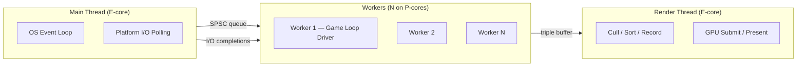
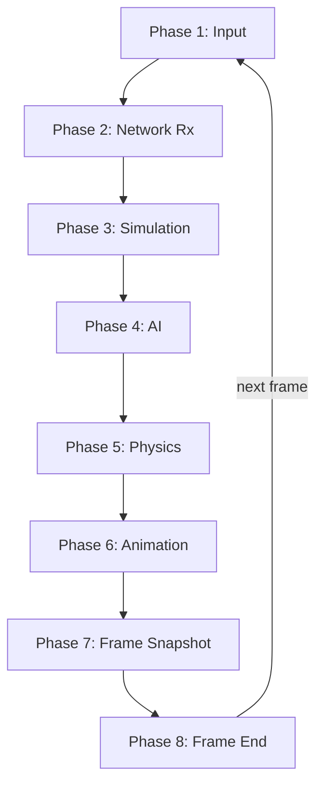
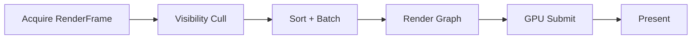
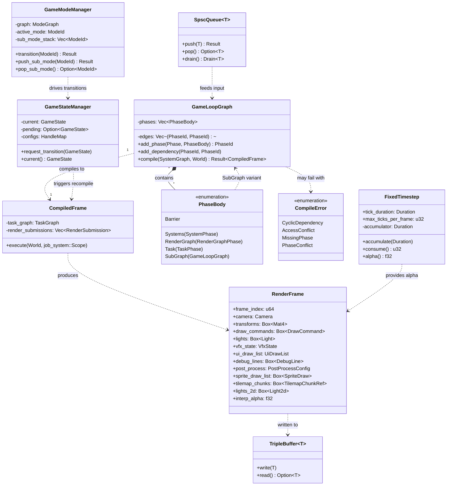
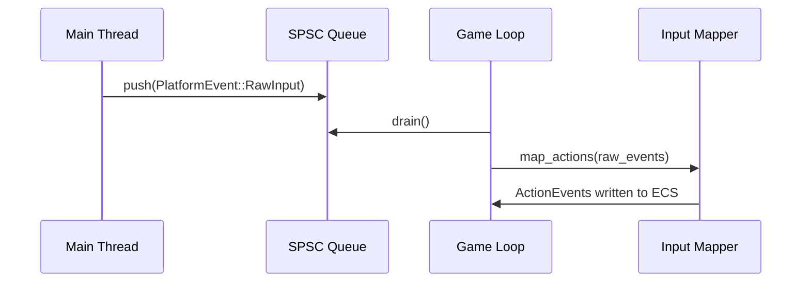
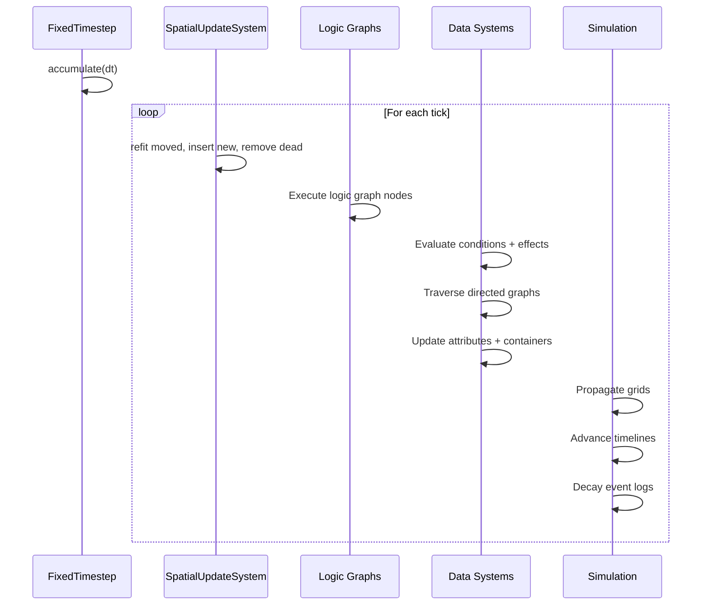
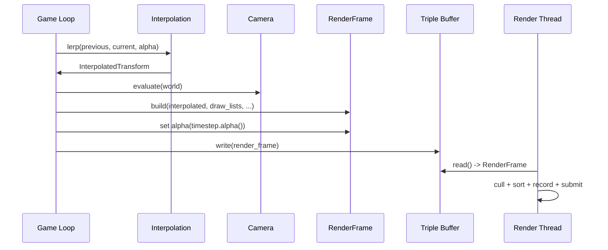

# Game Loop Design

## Requirements Trace

> **Canonical sources:** Features, requirements, and user stories live in their respective
> directories. The table below traces design elements to those definitions.

| Feature | Requirement |
|---------|-------------|
| F-1.1.1 | R-1.1.1 |
| F-1.1.2 | R-1.1.2 |
| F-14.3.1 | R-14.3.1 |
| F-14.3.3 | R-14.3.3 |
| F-14.3.5 | R-14.3.5 |

1. **F-1.1.1** -- ECS schedule compiles into game loop graph
2. **F-1.1.2** -- Deterministic fixed-timestep simulation
3. **F-14.3.1** -- Work-stealing thread pool sized to perf cores
4. **F-14.3.3** -- DAG-based task graph with fan-out and fan-in
5. **F-14.3.5** -- Platform async I/O bridge as task continuations

## Overview

The game loop is the central execution model of the Harmonius engine. It defines three thread roles,
an 8-phase frame pipeline driven by a worker thread, and pipelined rendering on a separate render
thread.

All ECS systems register into named phases. The `Schedule` compiles into a `GameLoopGraph`, which is
flattened into a `CompiledFrame` containing a `TaskGraph` for the job system. The compiled frame is
reused across frames and only recompiled when the system set changes (plugin load/unload, mode
switch).

The main thread owns platform I/O and controls exactly when I/O completions are harvested from the
OS. No callbacks fire asynchronously — the engine decides when to poll.

### Interop Contracts Defined Here

| Contract | Consumed By |
|----------|-------------|
| `GameLoopGraph` / `CompiledFrame` | ECS, Threading |
| `RenderFrame` snapshot | Rendering |
| Phase registration API | All domains |
| Fixed timestep accumulator | Physics, Simulation, AI |
| SPSC event queue protocol | Input, Platform |
| Triple-buffer protocol | Rendering |

## Architecture

### Thread Roles



**Main thread (E-core)** — OS event loop and platform I/O. Pumps window events, raw input, platform
UI, and I/O completions (io_uring CQE, IOCP completions, GCD dispatch sources). Forwards events to
the game loop via a lock-free SPSC queue and posts I/O results via crossbeam-channel. On iOS/Android
the OS mandates this thread; on desktop it is still separated.

**Workers (N on P-cores)** — work-stealing job system sized to performance cores. One worker drives
the game loop via `job_system::scope()`, participating in work-stealing while waiting for scoped
jobs to complete. Runs all 8 phases sequentially per frame. Produces an immutable `RenderFrame`
snapshot and submits it to the render thread via triple buffer. Other workers execute fan-out jobs
(physics broadphase, AI queries, animation blending).

**Render thread (E-core)** — GPU command buffer recording and submission. Consumes `RenderFrame`
from the triple buffer. Executes the render graph, records command buffers, presents. Pipelined one
frame behind the game loop. Owns the swapchain and presentation timing (VSync, pacing). Uses GPU
fence polling for synchronization — no I/O runtime needed.

### Frame Pipeline

```mermaid
gantt
    title Frame Pipeline
    dateFormat X
    axisFormat %s

    section Main
    Events N     :m1, 0, 2
    Events N+1   :m2, 2, 4

    section Game Loop
    Sim Frame N     :g1, 0, 3
    Sim Frame N+1   :g2, 3, 6

    section Render
    Render Frame N-1 :r0, 0, 3
    Render Frame N   :r1, 3, 6
```



The game loop and render thread overlap by one frame. `RenderFrame` is an immutable snapshot
(transforms, draw lists, camera, lights, VFX state) that the render thread consumes without
synchronization. Triple buffering ensures the game loop never stalls waiting for the render thread.

### Frame Tick Lifecycle

The global `ChangeTick` is incremented exactly once per frame, at the end of Phase 8 (Frame End),
before control returns to Phase 1 of the next frame. Systems capture their access sets' `last_run`
tick at dispatch time (the instant the scheduler hands a system to a worker); every per-chunk tick
observed during the system's body is compared against that snapshot.

This interacts with the game loop phases as follows:

1. A system dispatched in Phase N records `last_run = current_tick` on entry.
2. During the system body, `Changed<T>` queries compare per-chunk column ticks to `last_run`.
3. At the end of Phase 8 the world tick is incremented to `current_tick + 1`.
4. On the next frame, every system sees an incremented tick and the `Changed<T>` filter captures
   every write performed during the previous frame.

See [change-detection.md](change-detection.md) for the full ChangeTick increment protocol,
`Changed<T>` query semantics, and the interaction between parallel dispatch and tick visibility.

### Game Loop Phases



| Phase | Timestep | Description |
|-------|----------|-------------|
| 1 Input | Variable | Drain SPSC, map actions |
| 2 Network Rx | Variable | Packets, remote state, RPCs |
| 3 Simulation | Fixed | Graphs, effects, grids, timelines |
| 4 AI | Fixed | Awareness, BT/GOAP, nav, steering |
| 5 Physics | Fixed | Broadphase, solve, destruction |
| 6 Animation | Variable | State machines, IK, cloth, hair |
| 7 Snapshot | Variable | Build RenderFrame, audio, net Tx |
| 8 Frame End | Variable | Save, poll, stats |

### Phase-to-ECS Stage Mapping

Each game loop phase corresponds to an ECS `Schedule` stage. `Schedule::build()` in [ecs.md](ecs.md)
produces a `SystemGraph`; the game loop compiles that into `PhaseBody` entries from these stage
mappings.

> **Rename note:** The enum previously called `PhaseNode` is renamed to `PhaseBody` to reduce the
> naming collision with the `Phase` label enum. All references in this document have been updated.

| Game Loop Phase | ECS Stage | Notes |
|-----------------|-----------|-------|
| 1 Input | PreUpdate | Drain SPSC before systems |
| 2 Network Rx | PreUpdate | After input, before sim |
| 3 Simulation | Update | Fixed-timestep SubGraph |
| 4 AI | Update | After simulation systems |
| 5 Physics | FixedUpdate | Substeps via SubGraph |
| 6 Animation | PostUpdate | After physics resolve |
| 7 Snapshot | PreRender | Build RenderFrame |
| 8 Frame End | Last | Cleanup, stats, flush |

### Render Thread Steps



### Class Diagram



## API Design

### Phase Identifiers

```rust
/// Built-in game loop phases.
#[derive(Clone, Copy, PartialEq, Eq, Hash)]
pub enum Phase {
    /// Drain SPSC, map raw input to actions.
    Input,
    /// Process incoming network packets.
    NetworkReceive,
    /// Fixed-timestep simulation tick.
    Simulation,
    /// AI evaluation and navigation.
    AiUpdate,
    /// Fixed-timestep physics substeps.
    PhysicsStep,
    /// Animation state machines and procedural.
    AnimationUpdate,
    /// Build immutable RenderFrame snapshot.
    FrameSnapshot,
    /// Save, I/O completion drain, frame stats.
    FrameEnd,
    /// User-defined phase with explicit ordering.
    Custom(u32),
}
```

### Game Loop Graph

```rust
/// A directed acyclic graph of frame phases.
/// Compiled from the ECS `SystemGraph` once, reused
/// across frames until the system set changes.
pub struct GameLoopGraph {
    phases: Vec<PhaseBody>,
    edges: Vec<(PhaseId, PhaseId)>,
}

impl GameLoopGraph {
    /// Register a phase with its body.
    pub fn add_phase(
        &mut self,
        phase: Phase,
        body: PhaseBody,
    ) -> PhaseId;

    /// Declare ordering: `before` runs before `after`.
    pub fn add_dependency(
        &mut self,
        before: PhaseId,
        after: PhaseId,
    );

    /// Compile the system graph produced by
    /// `Schedule::build` (see ecs.md) into an
    /// executable `CompiledFrame`. Validates the
    /// DAG (cycle detection, access conflicts),
    /// resolves system dependencies, inserts sync
    /// barriers, and binds render-graph phases.
    pub fn compile(
        &self,
        systems: &SystemGraph,
        world: &World,
    ) -> Result<CompiledFrame, CompileError>;
}

/// A single phase body in the game loop. Formerly
/// named `PhaseNode`; renamed to `PhaseBody` to
/// disambiguate from the `Phase` label enum and the
/// ECS `SystemNode` type.
pub enum PhaseBody {
    /// A set of ECS systems to run in parallel.
    Systems(SystemPhase),
    /// A render graph submission phase.
    RenderGraph(RenderGraphPhase),
    /// A standalone task (I/O poll, save flush).
    Task(TaskPhase),
    /// A nested sub-graph (e.g., physics substeps).
    SubGraph(GameLoopGraph),
    /// A full-pipeline barrier (command buffer flush).
    Barrier,
}
```

### Compiled Frame

```rust
/// The executable form of a game loop frame.
/// Contains the flattened task graph and render
/// submission ordering.
pub struct CompiledFrame {
    task_graph: TaskGraph,
    render_submissions: Vec<RenderSubmission>,
}

impl CompiledFrame {
    /// Execute one frame within a job system scope.
    /// Dispatches phase systems as scoped jobs. The
    /// calling worker participates in work-stealing
    /// while waiting for jobs to complete. Produces a
    /// RenderFrame snapshot.
    pub fn execute(
        &self,
        world: &mut World,
        scope: &job_system::Scope<'_>,
    );
}
```

### Fixed Timestep Accumulator

```rust
/// Manages fixed-timestep simulation with accumulator.
/// Used by Phase 3 (Simulation), Phase 4 (AI), and
/// Phase 5 (Physics) to substep deterministically.
pub struct FixedTimestep {
    /// Duration of each tick (e.g., 1/60 s).
    pub tick_duration: Duration,
    /// Maximum ticks per frame to prevent spiral of death.
    pub max_ticks_per_frame: u32,
    /// Accumulated time not yet consumed by ticks.
    accumulator: Duration,
}

impl FixedTimestep {
    /// Add elapsed time since last frame.
    pub fn accumulate(&mut self, dt: Duration);

    /// Returns the number of ticks to run this frame.
    pub fn consume(&mut self) -> u32;

    /// Interpolation factor for rendering between ticks.
    /// Range [0.0, 1.0).
    pub fn alpha(&self) -> f32;
}
```

### RenderFrame Snapshot

`RenderFrame` is the immutable per-frame payload produced by the game loop and consumed by the
render thread via triple buffer. Every field is owned (`Box<[...]>` or an owned value) so the game
loop can relinquish it to the render thread with zero sharing. The game loop does not hold any
reference to a `RenderFrame` past the triple-buffer handoff.

```rust
/// Immutable snapshot of all data the render thread needs.
/// Built during Phase 7 (Frame Snapshot) and submitted to
/// the render thread via triple buffer.
///
/// Every field is owned, not borrowed. The render
/// thread consumes the snapshot without synchronization
/// with the game loop. Boxed slices are used to avoid
/// the excess capacity of `Vec` and to surface the
/// "finalized, no further push" contract at the type
/// level.
pub struct RenderFrame {
    /// Monotonic frame counter, used by temporal
    /// effects (TAA, motion blur) and diagnostics.
    pub frame_index: u64,
    /// Active camera parameters for the main view.
    pub camera: Camera,
    /// Interpolated world-space transforms for all
    /// visible entities. Computed as
    /// `lerp(previous, current, interp_alpha)` in
    /// Phase 7 — not raw `GlobalTransform`. See
    /// [scene-transforms.md](scene-transforms.md).
    pub transforms: Box<[Mat4]>,
    /// Per-view / per-pass draw command buffer.
    /// Sorted, batched, ready to record on the GPU.
    pub draw_commands: Box<[DrawCommand]>,
    /// Active dynamic and static lights.
    pub lights: Box<[Light]>,
    /// VFX simulation state handed over to GPU
    /// particles / compute.
    pub vfx_state: VfxState,
    /// Finalized UI draw list for overlay rendering.
    pub ui_draw_list: UiDrawList,
    /// Debug-line draw list (wireframe, gizmos,
    /// AI / physics debug).
    pub debug_lines: Box<[DebugLine]>,
    /// Post-processing pass configuration
    /// (tone map, bloom, TAA weights, ...).
    pub post_process: PostProcessConfig,
    /// Finalized 2D sprite draw list.
    pub sprite_draw_list: Box<[SpriteDraw]>,
    /// 2D tilemap chunk references for streamed
    /// tile layers.
    pub tilemap_chunks: Box<[TilemapChunkRef]>,
    /// 2D lights (spot, point, radial falloff).
    pub lights_2d: Box<[Light2d]>,
    /// Interpolation factor used to compute the
    /// transforms above. Range `[0.0, 1.0)`.
    pub interp_alpha: f32,
}
```

### CompileError

`Schedule::build` (defined in [ecs.md](ecs.md)) returns a `SystemGraph`. The game loop compiles that
`SystemGraph` into a `CompiledFrame`, and the compiler can fail for several structural reasons that
must be reported uniformly:

```rust
/// Errors produced when a `SystemGraph` is compiled
/// into a `CompiledFrame`. Returned by
/// `Schedule::build` and `GameLoopGraph::compile`.
#[derive(Clone, Debug, PartialEq, Eq)]
pub enum CompileError {
    /// The dependency graph contains a cycle.
    CyclicDependency,
    /// Two or more systems in the same phase have
    /// conflicting access sets (mutable aliasing).
    AccessConflict,
    /// A referenced phase is absent from the graph.
    MissingPhase,
    /// Two phases have conflicting properties
    /// (e.g., both claim the main thread, or both
    /// request the same fixed-timestep accumulator).
    PhaseConflict,
}

impl Schedule {
    /// See ecs.md. Returns a `CompiledFrame` once
    /// the game loop has compiled the system graph.
    pub fn build(
        &self,
        world: &World,
    ) -> Result<CompiledFrame, CompileError>;
}
```

### SPSC Event Queue

```rust
/// Lock-free single-producer single-consumer queue.
/// Main thread produces, game loop thread consumes.
pub struct SpscQueue<T> {
    /* cache-line padded head/tail atomics */
}

impl<T> SpscQueue<T> {
    pub fn push(&self, value: T) -> Result<(), T>;
    pub fn pop(&self) -> Option<T>;
    pub fn drain(&self) -> Drain<'_, T>;
}

/// Events forwarded from the main thread.
pub enum PlatformEvent {
    WindowResize { width: u32, height: u32 },
    WindowClose,
    WindowFocus(bool),
    RawInput(RawInputEvent),
    AppSuspend,
    AppResume,
}
```

### Triple Buffer

```rust
/// Lock-free triple buffer for game loop → render thread.
/// Writer (game loop) never blocks. Reader (render) always
/// gets the most recent complete frame.
pub struct TripleBuffer<T> {
    /* three slots + atomic index */
}

impl<T> TripleBuffer<T> {
    /// Game loop thread: write a new frame snapshot.
    pub fn write(&self, value: T);

    /// Render thread: get the most recent frame.
    /// Returns None if no new frame since last read.
    pub fn read(&self) -> Option<&T>;
}
```

### Game Mode Manager

```rust
/// Manages game state transitions and mode nesting.
/// Game modes are authored as data assets in the editor.
#[derive(Clone, Copy, PartialEq, Eq, Hash)]
pub enum GameState {
    MainMenu,
    Loading,
    InGame,
    Paused,
}

pub struct GameStateManager {
    current: GameState,
    pending: Option<GameState>,
    configs: HandleMap<GameState, GameStateConfig>,
}

impl GameStateManager {
    /// Request a state transition. Applied at the next
    /// sync point (Phase 8 Frame End).
    pub fn request_transition(
        &mut self,
        target: GameState,
    );

    /// Query current state.
    pub fn current(&self) -> GameState;
}

pub struct GameModeManager {
    graph: ModeGraph,
    active_mode: ModeId,
    sub_mode_stack: Vec<ModeId>,
}

impl GameModeManager {
    /// Transition to a new mode within the graph.
    pub fn transition(
        &mut self,
        target: ModeId,
    ) -> Result<(), ModeError>;

    /// Push a sub-mode onto the stack.
    pub fn push_sub_mode(
        &mut self,
        mode: ModeId,
    ) -> Result<(), ModeError>;

    /// Pop the current sub-mode.
    pub fn pop_sub_mode(&mut self) -> Option<ModeId>;
}
```

## Data Flow

### Phase 1: Input Processing



### Phase 3: Simulation Tick

`SpatialUpdateSystem` runs at the **start of Phase 3 (Simulation)**, before any AI, physics, audio,
or gameplay system that depends on the shared BVH. It drains the per-frame dirty-transform queue,
refits moved entries into the shared BVH, and removes despawned entries. By running first, every
downstream system in Phase 3 (and every subsequent phase) reads a BVH that reflects the current
transform snapshot. See [spatial-index.md](spatial-index.md) for the system's internals.



### Phase 7: Frame Snapshot

The snapshot phase computes interpolated transforms for the `RenderFrame` using
`PreviousGlobalTransform`:

```rust
// In snapshot phase:
let alpha = fixed_timestep.alpha();
for (prev, current, interpolated) in query.iter::<(
    &PreviousGlobalTransform,
    &GlobalTransform,
    &mut InterpolatedTransform,
)>() {
    interpolated.0 = prev.matrix.lerp(
        &current.matrix, alpha
    );
}
```

The `RenderFrame::transforms` field contains these interpolated values, not raw `GlobalTransform`.



## Platform Considerations

| Platform | Main Thread | I/O Backend | Notes |
|----------|-------------|-------------|-------|
| macOS | NSApplication | GCD | Vulkan fence sync |
| Windows | Win32 msg loop | IOCP | Worker drives game loop |
| Linux | xcb/Wayland | io_uring | Worker drives game loop |
| iOS | UIApplication | GCD | OS mandates main thread |
| Android | Activity | io_uring/epoll | OS mandates main thread |

On all platforms, the main thread owns the OS event loop and platform I/O. A worker thread drives
the game loop via `job_system::scope()`. `PlatformEvent`s are forwarded from the main thread via the
SPSC queue; I/O completions are posted via crossbeam-channel.

### Frame Pacing

- **Desktop:** VSync-driven via swapchain present. Render thread paces to display refresh. Game loop
  runs freely ahead by one frame.
- **Mobile:** Frame pacing API (Vulkan WSI present timing`, Android `Vulkan WSI present timing`).
  Render thread syncs to display.
- **VR:** Reprojection/timewarp on the render thread. Game loop targets half-rate if simulation
  cannot sustain 90 Hz.

## Test Plan

See [game-loop-test-cases.md](game-loop-test-cases.md) for the complete test case listing. The
companion file needs to be created with the following TC entries:

### Summary

| Category | Coverage |
|----------|----------|
| Unit | Phase ordering, timestep, SPSC, triple buffer |
| Integration | Full frame execution, cross-phase data flow |
| Benchmarks | Frame time budget, phase latency, dispatch |

### Required Test Cases

| TC ID | Category | Description |
|-------|----------|-------------|
| TC-1.1.1.1 | Unit | 8 phases execute in declared order |
| TC-1.1.1.2 | Unit | Custom phase inserts at correct position |
| TC-1.1.1.3 | Unit | Cycle detection rejects invalid DAG |
| TC-1.1.1.4 | Unit | Access conflict detected at compile time |
| TC-1.1.2.1 | Unit | Zero dt produces zero ticks |
| TC-1.1.2.2 | Unit | Max ticks per frame caps accumulator |
| TC-1.1.2.3 | Unit | Alpha returns 0.0 at tick boundary |
| TC-1.1.2.4 | Unit | Alpha returns 0.5 at half-tick |
| TC-1.1.2.5 | Unit | Alpha approaches 1.0 before next tick |
| TC-14.3.1.1 | Unit | SPSC push/pop single element |
| TC-14.3.1.2 | Unit | SPSC drain returns all in order |
| TC-14.3.1.3 | Unit | SPSC push to full queue returns Err |
| TC-14.3.1.4 | Unit | SPSC pop from empty returns None |
| TC-14.3.3.1 | Unit | Triple buffer write-before-read |
| TC-14.3.3.2 | Unit | Triple buffer concurrent access |
| TC-14.3.3.3 | Unit | Triple buffer read returns latest |
| TC-14.3.5.1 | Integration | Input-to-snapshot end-to-end frame |
| TC-14.3.5.2 | Integration | Cross-phase data flow correctness |
| TC-14.3.5.3 | Integration | Game state transition at Frame End |
| TC-14.3.1.1a | Benchmark | Frame time within 16.6 ms budget |
| TC-14.3.1.2a | Benchmark | Per-phase latency measurement |
| TC-14.3.3.1a | Benchmark | Job dispatch overhead per frame |

## Open Questions

1. ~~Should the render thread have its own I/O runtime for GPU fence waits?~~ **Resolved:** The
   render thread uses GPU fence polling for synchronization. All I/O routes through the main thread.
2. What is the maximum tolerable latency for the SPSC queue on mobile (input-to-action delay)?
3. Should `CompiledFrame` support incremental recompilation when only a single system is
   added/removed?

## Review Feedback

### RF-1: Game loop runs on a worker thread, not a dedicated thread [APPLIED]

Replace the 4-thread-role model (Main, Game Loop, Render, Worker Pool) with the 3-thread model:

- Workers (N) — job system threads on P-cores, one of which drives the game loop via
  `job_system::scope()`
- Main — OS event loop + platform I/O polling on E-core
- Render — GPU command building + submission on E-core

The game loop driver is a worker thread that participates in work-stealing while waiting for scoped
jobs to complete. No dedicated game loop thread.

Update `CompiledFrame::execute()` to work within the job system:

```rust
// Game loop runs on a worker thread:
fn frame_loop(world: &mut World, job_system: &JobSystem) {
    loop {
        let completions = io_channel.drain();
        let input = input_channel.drain();

        job_system.scope(|s| {
            // Dispatch ECS phase systems as jobs
            for phase in compiled_frame.phases() {
                phase.dispatch(s, world);
            }
        });
        // Calling thread work-steals while waiting

        render_channel.send(render_frame);
    }
}
```

### RF-2: Replace all Tokio references with platform-native I/O [APPLIED]

Replace 10 Tokio references throughout the design:

- `CompiledFrame::execute()` reactor parameter → platform I/O reactor abstraction
- Platform table → io_uring (Linux), IOCP (Windows), GCD (Apple)
- Open question #1 → render thread uses GPU fence polling, not Tokio; all I/O routes through main
  thread

The main thread polls platform I/O (io_uring CQE, IOCP completions, GCD dispatch sources) and posts
results as jobs via crossbeam-channel.

### RF-3: Create game-loop-test-cases.md [APPLIED]

The companion test cases file is missing. Create it with TC-X.Y.Z entries covering:

- Phase ordering (all 8 phases execute in correct sequence)
- Fixed timestep accumulator (zero dt, max ticks, alpha at 0/0.5/1)
- SPSC queue (full, empty, drain, ordering)
- Triple buffer (write-before-read, concurrent access)
- CompiledFrame compilation (cycle detection, access conflicts)
- Full frame execution (input → snapshot end-to-end)
- Benchmarks for frame time budgets and phase latency

### RF-4: Map phases to ECS schedule stages [APPLIED]

Document how the 8 game loop phases map to ECS `Schedule` stages:

| Game Loop Phase | ECS Stage |
|----------------|-----------|
| Input | PreUpdate |
| Network Rx | PreUpdate |
| Simulation | Update |
| AI | Update |
| Physics | FixedUpdate (substeps via SubGraph) |
| Animation | PostUpdate |
| Snapshot | PreRender |
| Frame End | Last |

Show how `Schedule::build()` in ecs.md produces a `SystemGraph`, and how `GameLoopGraph::compile`
turns the per-phase sub-graphs into `PhaseBody` entries.

### RF-5: Add PreviousGlobalTransform interpolation [APPLIED]

Document explicitly that the Snapshot phase (phase 7) computes interpolated transforms for the
RenderFrame:

```rust
// In snapshot phase:
let alpha = fixed_timestep.alpha();
for (prev, current, interpolated) in query.iter::<(
    &PreviousGlobalTransform,
    &GlobalTransform,
    &mut InterpolatedTransform,
)>() {
    interpolated.0 = prev.matrix.lerp(
        &current.matrix, alpha
    );
}
```

The `RenderFrame::transforms` field contains these interpolated values, not raw `GlobalTransform`.

### RF-6: Add class diagram [APPLIED]

Add a Mermaid classDiagram covering: GameLoopGraph, CompiledFrame, PhaseBody, CompileError,
FixedTimestep, RenderFrame, SpscQueue, TripleBuffer, GameStateManager, GameModeManager and their
relationships.

### RF-7: Fix constraints.md threading table [APPLIED]

The threading table (lines 51-52) still references compio and Rayon. Update to:

| Thread | Owns | Handles |
|--------|------|---------|
| Main | OS event loop, platform I/O | Window, input, timers, all I/O |
| Workers (N) | Job system, ECS, game loop | Simulation, all compute |
| Render | GPU | Draw calls, GPU uploads |
