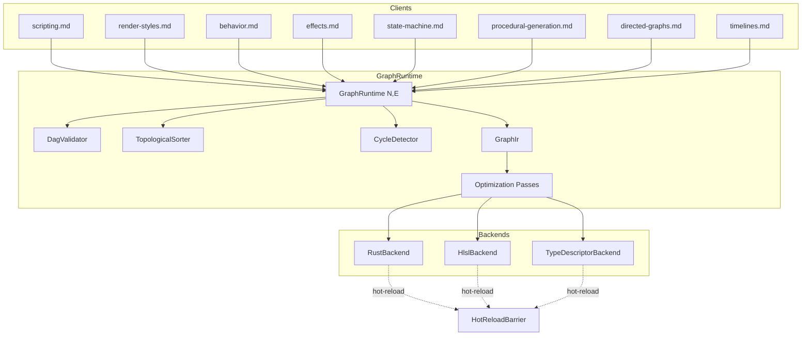
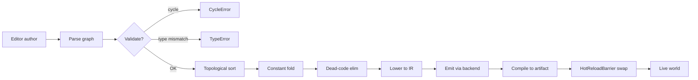

# Graph Runtime Design

## Requirements Trace

> **Canonical sources:** Features, requirements, and user stories are defined in
> [features/core-runtime/](../../features/), [features/game-framework/](../../features/), and
> [features/tools/](../../features/). This document extracts the shared graph infrastructure that
> currently exists independently in eight subsystems. See design review
> [sections 2.1, 2.6, and 3.7](../design-review.md) for the motivation.

### Feature Trace

| Feature  | Scope                                                              |
|----------|--------------------------------------------------------------------|
| F-1.15.1 | Shared DAG validation, topological sort, cycle detection           |
| F-1.15.2 | Multi-target codegen (Rust, HLSL, type descriptors)                |
| F-1.15.3 | Graph IR with stable node / pin IDs                                |
| F-1.15.4 | Constant folding and dead-node elimination                         |
| F-13.4.1 | Logic / scripting graph runtime                                    |
| F-13.4.3 | Logic-graph state preservation across hot-reload                   |
| F-2.7.1  | Material graph runtime                                             |
| F-7.2.3  | Behavior tree graph runtime                                        |
| F-11.3.1 | VFX effect graph runtime                                           |
| F-9.2.4  | Animation state-machine graph runtime                              |
| F-10.4.2 | Procedural generation graph runtime                                |
| F-13.10  | Directed graphs (quest, dialogue, progression)                     |
| F-10.6.2 | Timeline track graph runtime                                       |
| F-15.4.1 | Graph editor widget integration                                    |

1. **F-1.15.1** — Single owner for DAG validation prevents six re-implementations
2. **F-1.15.2** — `CodegenBackend` trait lets one IR target many languages
3. **F-1.15.3** — Stable IDs enable hot-reload with state migration
4. **F-1.15.4** — Optimization passes shared across every graph subsystem
5. **F-13.4.3** — State migration uses ReloadBarrier from hot-reload-protocol.md

## Overview

Harmonius previously had eight independent graph runtimes — scripting, material, behavior tree, VFX
effect, animation state machine, procedural generation, directed graphs, and timeline tracks — each
with its own validation, topological sort, hot-reload path, and codegen backend. This document
defines a single shared `GraphRuntime<N, E>` framework that every client subsystem parameterizes.
Each client supplies node/edge semantics and picks a codegen backend; the framework provides
validation, optimization, compilation, and hot-reload integration.

### Design Goals

| Goal                    | Rationale                                                          |
|-------------------------|--------------------------------------------------------------------|
| One DAG validator       | Removes six duplicate cycle/topology implementations               |
| Multi-target codegen    | Rust, HLSL, and type-descriptor emission from one IR               |
| Stable node IDs         | Hot-reload can map old state to new graph shape                    |
| Pure functional IR      | Transformation passes are `fn(GraphIr) -> GraphIr`                 |
| Static dispatch         | Codegen backends are enum variants, not `dyn` trait objects        |
| Deterministic emission  | Byte-identical codegen output given byte-identical input           |

### Client Subsystem Mapping

| Client doc                              | Node type             | Edge type   | Backend                |
|-----------------------------------------|-----------------------|-------------|------------------------|
| `game-framework/scripting.md`           | `LogicNode`           | `DataEdge`  | `RustBackend`          |
| `rendering/render-styles.md`            | `MaterialNode`        | `PinEdge`   | `HlslBackend`          |
| `ai/behavior.md`                        | `BehaviorNode`        | `FlowEdge`  | `RustBackend`          |
| `vfx/effects.md`                        | `EffectNode`          | `PinEdge`   | `HlslBackend`          |
| `animation/state-machine.md`            | `StateNode`           | `Transition`| `RustBackend`          |
| `geometry/procedural-generation.md`     | `ProcNode`            | `PinEdge`   | `RustBackend`          |
| `data-systems/directed-graphs.md`       | `DagNode`             | `DagEdge`   | `TypeDescriptorBackend`|
| `simulation/timelines.md`               | `TrackNode`           | `TrackEdge` | `RustBackend`          |

## Architecture

### Subsystem Relationship



### Pipeline Flowchart



### Class Diagram

```mermaid
classDiagram
    direction TB

    class GraphNode {
        <<trait>>
        +node_kind() NodeKindId
        +input_pins() slice~PinSpec~
        +output_pins() slice~PinSpec~
        +constant_fold(inputs) Option~Value~
    }

    class GraphEdge {
        <<trait>>
        +from_node() NodeId
        +from_pin() PinId
        +to_node() NodeId
        +to_pin() PinId
    }

    class GraphValidator {
        <<trait>>
        +validate(graph) Result~GraphIr, GraphError~
    }

    class DagValidator {
        -max_nodes: u32
        +new(max_nodes) DagValidator
        +check_types(graph) Result
        +check_cycles(graph) Result
        +check_pin_cardinality(graph) Result
    }

    class TopologicalSorter {
        +sort(nodes, edges) Result~Vec~NodeId~, CycleError~
    }

    class CycleDetector {
        +detect(nodes, edges) Option~Vec~NodeId~~
    }

    class GraphIr {
        +ir_version: u16
        +nodes: Vec~IrNode~
        +edges: Vec~IrEdge~
        +roots: Vec~NodeId~
        +sorted: Vec~NodeId~
        +symbols: SymbolManifest
    }

    class IrNode {
        +id: NodeId
        +kind: NodeKindId
        +inputs: SmallVec~PinRef;4~
        +outputs: SmallVec~PinRef;4~
        +constant: Option~Value~
    }

    class IrEdge {
        +id: EdgeId
        +from: PinRef
        +to: PinRef
        +ty: TypeId
    }

    class NodeId
    class EdgeId
    class NodeKindId
    class PinId
    class PinRef {
        +node: NodeId
        +pin: PinId
    }

    class PinSpec {
        +name: StaticStr
        +ty: TypeId
        +cardinality: Cardinality
    }

    class Cardinality {
        <<enumeration>>
        One
        Many
        Optional
    }

    class CodegenBackend {
        <<trait>>
        +target() BackendKind
        +emit(ir) Result~EmitOutput, CodegenError~
    }

    class RustBackend {
        +module_name: StaticStr
        +emit(ir) Result~EmitOutput, CodegenError~
    }

    class HlslBackend {
        +profile: HlslProfile
        +emit(ir) Result~EmitOutput, CodegenError~
    }

    class TypeDescriptorBackend {
        +emit(ir) Result~EmitOutput, CodegenError~
    }

    class EmitOutput {
        +artifact: Bytes
        +symbols: SymbolManifest
        +diagnostics: Vec~Diagnostic~
    }

    class BackendKind {
        <<enumeration>>
        Rust
        Hlsl
        TypeDescriptor
    }

    class GraphError {
        <<enumeration>>
        Cycle
        TypeMismatch
        PinCardinality
        UnknownNode
        UnknownEdge
        MissingBackend
        CodegenFailed
    }

    class CodegenError {
        <<enumeration>>
        BackendRejected
        SymbolConflict
        IoFailed
        SubprocessExit
    }

    class GraphRuntime~N, E~ {
        +new(backend: BackendKind) GraphRuntime
        +compile(nodes, edges) Result~Artifact, GraphError~
        +hot_reload(delta) Result~ReloadResult, GraphError~
    }

    class HotReloadBarrierRef {
        <<alias>>
        hot-reload-protocol.md
    }

    GraphRuntime --> DagValidator
    GraphRuntime --> TopologicalSorter
    GraphRuntime --> GraphIr
    GraphRuntime --> CodegenBackend
    GraphRuntime --> HotReloadBarrierRef
    DagValidator ..|> GraphValidator
    RustBackend ..|> CodegenBackend
    HlslBackend ..|> CodegenBackend
    TypeDescriptorBackend ..|> CodegenBackend
    GraphIr --> IrNode
    GraphIr --> IrEdge
    IrNode --> PinRef
    IrEdge --> PinRef
    GraphNode --> PinSpec
    PinSpec --> Cardinality
    TopologicalSorter --> CycleDetector
    CodegenBackend --> EmitOutput
    CodegenBackend --> CodegenError
```



## API Design

```rust
/// Trait every graph node type implements. Static dispatch via enum on the
/// client side; the runtime only sees `NodeKindId`.
pub trait GraphNode {
    type Kind: Copy + Eq + Ord;

    fn node_kind(&self) -> Self::Kind;
    fn input_pins(&self) -> &'static [PinSpec];
    fn output_pins(&self) -> &'static [PinSpec];

    /// If all inputs are constant, return the folded value. Called during
    /// the constant-folding optimization pass.
    fn constant_fold(&self, inputs: &[Value]) -> Option<Value> {
        let _ = inputs;
        None
    }
}

pub trait GraphEdge {
    fn from(&self) -> PinRef;
    fn to(&self) -> PinRef;
    fn type_id(&self) -> TypeId;
}

pub trait GraphValidator {
    fn validate<N, E>(
        &self,
        nodes: &[N],
        edges: &[E],
    ) -> Result<GraphIr, GraphError>
    where
        N: GraphNode,
        E: GraphEdge;
}

pub struct DagValidator {
    pub max_nodes: u32,
    pub max_edges: u32,
}

impl GraphValidator for DagValidator {
    fn validate<N, E>(&self, nodes: &[N], edges: &[E]) -> Result<GraphIr, GraphError>
    where
        N: GraphNode,
        E: GraphEdge,
    {
        // 1. Check sizes vs budget.
        // 2. Pin type compatibility.
        // 3. Pin cardinality.
        // 4. Cycle detection.
        // 5. Topological sort.
        // 6. Lower to GraphIr.
        unimplemented!()
    }
}

pub struct TopologicalSorter;

impl TopologicalSorter {
    /// Kahn's algorithm — O(V + E). Returns error with cycle node list
    /// on failure.
    pub fn sort(
        node_count: usize,
        edges: &[(NodeId, NodeId)],
    ) -> Result<Vec<NodeId>, CycleError> {
        unimplemented!()
    }
}

pub struct CycleDetector;

impl CycleDetector {
    /// Tarjan SCC — returns Some(cycle) on first cycle found.
    pub fn detect(
        node_count: usize,
        edges: &[(NodeId, NodeId)],
    ) -> Option<Vec<NodeId>> {
        unimplemented!()
    }
}

pub struct GraphIr {
    pub ir_version: u16,
    pub nodes: Vec<IrNode>,
    pub edges: Vec<IrEdge>,
    pub roots: Vec<NodeId>,
    pub sorted: Vec<NodeId>,
    pub symbols: SymbolManifest,
}

pub struct IrNode {
    pub id: NodeId,
    pub kind: NodeKindId,
    pub inputs: SmallVec<[PinRef; 4]>,
    pub outputs: SmallVec<[PinRef; 4]>,
    pub constant: Option<Value>,
}

pub struct IrEdge {
    pub id: EdgeId,
    pub from: PinRef,
    pub to: PinRef,
    pub ty: TypeId,
}

#[derive(Copy, Clone, Eq, PartialEq, Hash)]
pub struct NodeId(pub u32);
#[derive(Copy, Clone, Eq, PartialEq, Hash)]
pub struct EdgeId(pub u32);
#[derive(Copy, Clone, Eq, PartialEq, Hash)]
pub struct NodeKindId(pub u32);
#[derive(Copy, Clone, Eq, PartialEq, Hash)]
pub struct PinId(pub u16);

#[derive(Copy, Clone, Eq, PartialEq, Hash)]
pub struct PinRef {
    pub node: NodeId,
    pub pin: PinId,
}

pub struct PinSpec {
    pub name: &'static str,
    pub ty: TypeId,
    pub cardinality: Cardinality,
}

#[derive(Copy, Clone)]
pub enum Cardinality {
    One,
    Many,
    Optional,
}

pub trait CodegenBackend {
    fn target(&self) -> BackendKind;
    fn emit(&self, ir: &GraphIr) -> Result<EmitOutput, CodegenError>;
}

pub struct RustBackend {
    pub module_name: &'static str,
}

pub struct HlslBackend {
    pub profile: HlslProfile,
}

pub struct TypeDescriptorBackend;

pub struct EmitOutput {
    pub artifact: Vec<u8>,
    pub symbols: SymbolManifest,
    pub diagnostics: Vec<Diagnostic>,
}

#[derive(Copy, Clone)]
pub enum BackendKind {
    Rust,
    Hlsl,
    TypeDescriptor,
}

#[derive(Debug)]
pub enum GraphError {
    Cycle { nodes: Vec<NodeId> },
    TypeMismatch { edge: EdgeId, expected: TypeId, actual: TypeId },
    PinCardinality { pin: PinRef, expected: Cardinality },
    UnknownNode { id: NodeId },
    UnknownEdge { id: EdgeId },
    MissingBackend { kind: BackendKind },
    CodegenFailed(CodegenError),
}

#[derive(Debug)]
pub enum CodegenError {
    BackendRejected { reason: &'static str },
    SymbolConflict { symbol: SymbolId },
    IoFailed { path: PathBuf },
    SubprocessExit { code: i32, stderr: String },
}

/// Outer runtime that clients instantiate. `N` and `E` are the client's
/// node and edge enums.
pub struct GraphRuntime<N, E> {
    validator: DagValidator,
    backend: BackendKind,
    _marker: PhantomData<(N, E)>,
}

impl<N: GraphNode, E: GraphEdge> GraphRuntime<N, E> {
    pub fn new(backend: BackendKind) -> Self { unimplemented!() }

    pub fn compile(
        &self,
        nodes: &[N],
        edges: &[E],
    ) -> Result<EmitOutput, GraphError> {
        let ir = self.validator.validate(nodes, edges)?;
        let ir = optimize::constant_fold(ir);
        let ir = optimize::dead_node_elim(ir);
        dispatch_backend(&self.backend, &ir).map_err(GraphError::CodegenFailed)
    }
}
```

### Optimization Passes

| Pass              | Input    | Output   | Notes                                   |
|-------------------|----------|----------|-----------------------------------------|
| Constant fold     | GraphIr  | GraphIr  | Call `GraphNode::constant_fold`         |
| Dead-node elim    | GraphIr  | GraphIr  | Remove nodes not reachable from roots   |
| Pin canonicalize  | GraphIr  | GraphIr  | Sort pins for determinism               |
| Common subexpr    | GraphIr  | GraphIr  | Deduplicate identical subgraphs (opt)   |

## Data Flow

```mermaid
sequenceDiagram
    participant Ed as Editor
    participant GR as GraphRuntime
    participant VAL as DagValidator
    participant OPT as Optimize
    participant BK as Backend
    participant HR as HotReloadBarrier

    Ed->>GR: compile(nodes, edges)
    GR->>VAL: validate
    VAL-->>GR: GraphIr | GraphError
    GR->>OPT: constant_fold -> dead_elim
    OPT-->>GR: GraphIr (optimized)
    GR->>BK: emit(ir)
    BK-->>GR: EmitOutput | CodegenError
    GR->>HR: request_swap(EmitOutput)
    HR-->>GR: ReloadResult
    GR-->>Ed: compile status + diagnostics
```

## Platform Considerations

| Platform   | Backend subprocess         | Notes                                  |
|------------|----------------------------|----------------------------------------|
| Windows    | rustc.exe, dxc.exe         | Launched via main-thread I/O requests  |
| macOS      | rustc, dxc, msl-converter  | dispatch2 child process                |
| Linux      | rustc, dxc                 | io_uring spawned process               |
| iOS        | No runtime codegen         | Compiled offline only                  |
| Android    | No runtime codegen         | Compiled offline only                  |

Platform subprocesses are invoked via `IoRequest::SpawnProcess` defined in [io.md](io.md). The Graph
Runtime never touches the OS directly.

## Test Plan

Full test cases live in [graph-runtime-test-cases.md](graph-runtime-test-cases.md). Summary:

| Category    | Scope                                                              |
|-------------|--------------------------------------------------------------------|
| Unit        | DagValidator, TopologicalSorter, CycleDetector, constant fold      |
| Unit        | Each backend emits deterministic bytes for canonical IR            |
| Integration | Scripting, material, behavior tree clients round-trip              |
| Integration | Hot-reload swap with state migration                               |
| Benchmark   | 1K-node / 10K-edge compile under 10 ms (R-1.15.1a)                 |
| Benchmark   | Topological sort 50K edges under 1 ms                              |

## Open Questions

1. Should `GraphRuntime` own a per-graph symbol arena or accept one externally?
2. Is common-subexpression elimination worth it for material graphs only, or globally?
3. Should constant folding run before or after pin canonicalization?
4. How does the runtime report per-node diagnostics back into the editor UI?
5. What is the upper bound on `GraphIr` size before we require streaming compilation?
